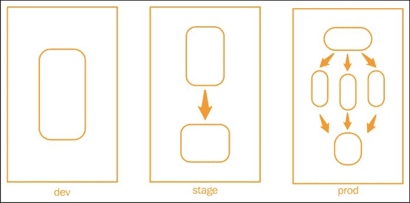
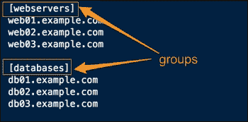
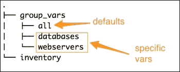
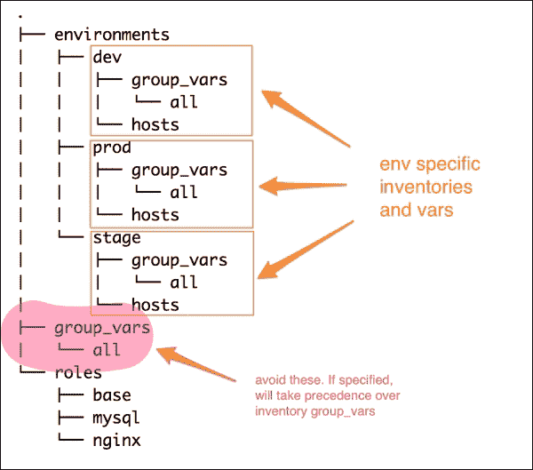
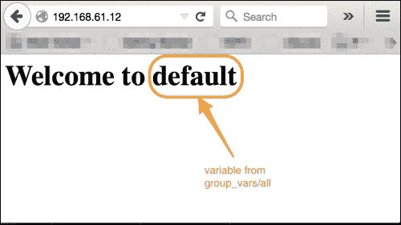
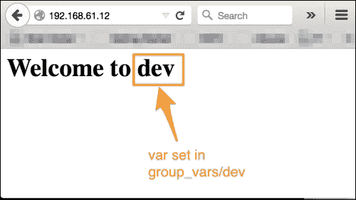

# 九、管理环境

大多数组织在构建基础架构时从单一环境开始。然而，随着复杂性的增长，我们必须有一个工作流，包括编写代码并在开发环境中测试它，然后是密集的质量保证周期，以确保在最终将其发布到生产环境之前，代码在试运行或生产前环境中经过稳定性测试。为了模拟真实世界的行为，这些环境必须运行相同的应用栈，但很可能是在不同的规模上。例如，转移将是生产的小规模副本，具有更少的服务器，并且最常见的是，开发环境将在虚拟化环境中的单个工作站上运行。尽管所有这些环境都运行相同的应用栈，但它们必须相互隔离，并且必须具有特定于环境的配置，解释如下:

*   `dev`组中的应用不应该指向分段中的数据库，反之亦然
*   生产环境可能有自己的包存储库
*   暂存环境可以在端口`8080`上运行网络服务器，而所有其他环境在端口`80`上运行它

有了角色，我们可以创建一个模块化的代码来为所有环境相同地配置这些环境。Ansible 的另一个重要特性是它能够将代码与数据分开。将这两者结合使用，我们可以以一种无需修改角色就能创建特定于环境的配置的方式来建模基础架构。我们可以通过提供不同地方的变量来创建它们。让我们看看下面的截图:



上图描绘了同一组织内的三种不同环境，即开发、阶段和生产。这三个都运行相同的应用栈，包括负载平衡器、web 服务器和数据库服务器。然而，这里需要注意的两件事是:

*   每个环境都有不同的规模，具体取决于哪个主机可以配置为运行一个或多个角色(例如，`db`加`www`)。
*   每个环境都是相互隔离的。生产环境中的 web 服务器不会连接到临时数据库，反之亦然。

在本章中，我们将涵盖以下主题:

*   使用 Ansible 管理多个环境
*   按环境分离清单文件
*   使用`group_vars`和`host_vars`组指定特定于环境的配置

# 管理环境的方法

您已经了解到需要用相同的角色创建不同的环境，但使用不同的数据。在撰写本文时，使用 Ansible 管理这种多环境场景的方法不止一种。我们将在这里讨论两种方法，您可以使用您的最佳判断来选择这两种方法中的任何一种，或者创建您自己的方法。没有明确的方法来创建一个环境，但以下是 Ansible 的内置功能，可能会派上用场:

*   使用清单将属于一个环境的主机组合在一起，并将它们与其他环境中的主机隔离开来
*   使用库存变量，如`group_vars`和`host_vars`组，提供特定于环境的变量

在我们继续之前，回顾一下库存组、变量和适用于它们的优先规则会很有用。

## 库存组和变量

您已经了解到 Ansible 清单遵循 INI 样式配置，其中主机被分组在一起，组标签用方括号括起来，如下图所示:



然后可以指定清单变量，以便它们使用`group_vars`匹配这些组名，或者匹配`host_vars`文件中的特定主机。除了这些组名之外，还规定使用名为“`all`”的文件为`group_vars`和`host_vars`文件指定默认变量，这产生了以下结构:



在这种情况下，如果在`all`和`webserver`文件中指定同一个变量，那么更具体的那个变量将优先。这意味着，如果您在“`all`”中定义一个变量，并在`group_vars`下的“`webserver`”组中再次定义它，参数的值将被设置为“`webserver`”中定义的值，这更具体。这是我们在方法中利用的行为，如下所示。

## 方法 1–在库存中使用嵌套组

除了能够使用 INI 样式创建组之外，Ansible 还支持嵌套组，其中一个完整的组可以是另一个父组的一部分。第一种方法基于这一特性，并逐步讨论如下:

1.  创建一个环境目录来存储特定于环境的清单文件。以环境命名是个好主意。添加特定于该环境的主机并对其进行分组。组可以是任何标准，如角色、位置、服务器机架等。例如，创建一个“`webservers`”组来添加所有 Apache web 服务器，或者创建一个名为“`in`”的组来添加属于该位置的所有主机。
2.  添加以环境名称命名的父组，如生产、开发、登台等，并将属于该环境的所有其他组作为子组包括在内。每一个依次包括一组主机，例如:

    ```
    [dev:children]
      webservers
      databases
    ```

3.  现在，在`group_vars/all`文件中创建公共/默认组变量。然后可以从特定于环境的文件中覆盖这些变量。
4.  要指定特定于环境的变量，创建`group_vars/{{env}}`文件，如下所示:

    ```
    group_vars
      |_ all
      |_ dev
      |_ stage
    ```

这也将覆盖`all`组中的变量。下图显示了用这种方法创建的文件结构:


一旦创建完成，只需使用`ansible-playbook`命令运行调用特定于环境的清单即可。

例如，让我们来看看下面的命令:

```
$ ansible-playbook -i environments/dev site.yml

```

## 方法 2–使用特定于环境的库存变量

第二种方法不需要嵌套组，并且依赖于 Ansible 的以下两个特性:

*   Ansible-playbook 的`-i`选项也接受可以包含一个或多个库存文件的目录
*   除了 Ansible 存储库根目录中的`group_vars`和`host_vars`组之外，`host`和`group`变量可以相对于库存文件

这种方法将为每个环境创建完全隔离的变量文件。下图描述了我们创建的文件结构:



以下是这种方法使用的分步方法:

1.  在 Ansible 存储库的根目录下创建一个环境目录。在这种情况下，为每个环境创建一个目录。
2.  每个环境目录包含两件事:
    *   主人的清单。
    *   库存变量，例如`group_vars`和`host_vars`。要做出针对特定环境的改变，`group_vars`与我们相关。
3.  每个环境都包含自己的`group_vars`目录，该目录又可以有一个或多个文件，默认情况下包括`all`文件。没有两个环境与其他环境共享这些变量。

### 类型

**警告**:除了特定于环境的`group_vars`组，还可以使用位于 Ansible-playbook 存储库顶部的`group_vars`文件。但是，建议您不要使用这种方法，因为特定于环境的更改会被剧本`group_vars`中的值覆盖，如果它们相同的话。

通过这种方法，行动手册可以针对特定环境发布，如下所示:

```
$ ansible-playbook -i environments/dev site.py

```

这里，`environments/dev`是一个目录。

# 创造发展环境

在了解了如何管理环境之后，让我们通过重构我们现有的代码来尝试一下，并创建一个开发环境。为了测试它，让我们创建一个名为“`env_name`”的变量，并将 Nginx 的默认页面更改为，动态使用该变量并打印环境名称。然后，我们将尝试从环境中覆盖这个变量。让我们看看以下步骤:

1.  让我们从设置默认变量开始:

    ```
    #group_vars/all
    env_name: default
    ```

2.  Then, change the Nginx task to use a template instead of a static file, so make the following modification in the `roles/nginx/tasks/configure.yml` file:

    ```
     - name: create home page for default site
        copy: src=index.html dest=/usr/share/nginx/html/index.html
    ```

    将其修改为以下代码:

    ```
     - name: create home page for default site
       template:
         src: index.html.j2
         dest: /usr/share/nginx/html/index.html
    ```

3.  现在让我们尝试在不创建环境的情况下运行剧本:

    ```
    $ ansible-playbook -i customhosts www.yml

    ```

4.  After the run is complete, let's check the default web page:

    

5.  它打印我们从`group_vars/all`文件中设置的变量值，默认值。
6.  现在让我们创建一个允许我们管理`dev`环境的文件。由于我们将使用同一组主机，因此我们可以将现有库存转换为 dev，并在环境名称后添加一个父组:

    ```
    $ mkdir environments/
    $ mv customhosts environments/dev 
     [ edit  environments/dev ]

    ```

7.  Add all the groups to the `dev` environment as:

    ```
    [dev:children]
    db
    www
    lb
    ```

    清单文件如下所示，我们必须进行以下更改:

    1.  现在，让我们为`dev`环境创建一个`group_vars`文件，并覆盖环境名称:

        ```
          #file: environments/dev
        env_name: dev
        ```

    2.  这次我们将运行剧本为:

        ```
        $ ansible-playbook -i environments/dev www.yml

        ```

    我们将看到以下截图作为输出:

    

# 复习问题

你认为你已经很好地理解了这一章吗？试着回答以下问题来测试你的理解能力:

1.  如何为同一环境指定多个主机清单？
2.  如果在`environments/dev/group_vars/all`文件中定义一个变量，在`group_vars/all`文件中定义同样的变量，哪个优先？
3.  如何在主机清单文件中创建一组组？

# 总结

在本章中，您学习了如何创建映射到软件开发工作流或阶段的多个环境。我们首先简要概述了库存组和库存变量，特别是`group_vars`文件。接下来是用于管理环境的两种方法。最后，我们重构了代码，继续创建`dev`环境，并通过覆盖环境中的一个变量来测试它。在下一章中，您将了解基础架构编排，以及 Ansible 如何在编排复杂的基础架构工作流、零停机部署等方面大放异彩。