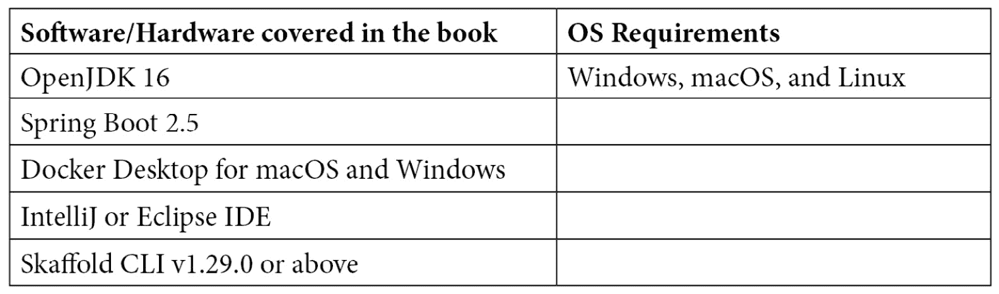

# 零、前言

考虑到围绕 Kubernetes 的大肆宣传，这些年来围绕它的工具发生了巨大的变化。越来越多的开发人员正在寻找能够帮助他们快速开始使用 Kubernetes 的工具。这也在开发人员中引起了一些混乱:为了花更少的时间配置他们的本地设置，或者编写脚本来自动化他们的内部开发循环工作流，他们应该使用哪个工具？此外，开发人员在使用 Kubernetes 时需要更好的工具，因为重点应该放在手头的任务上，即编码，而不是纠结于如何以及在哪里部署应用。理想情况下，您会更喜欢提供可扩展性来支持各种用例的工具。

这本书将向您展示如何通过使用 Skaffold 自动化构建、推送和部署样板来解决云原生应用中内部开发循环的复杂性。

# 这本书是给谁的

本书面向云原生应用开发人员、与 Kubernetes 合作的软件工程师，以及寻求简化其内部开发循环并改进其云原生应用 CI/CD 流水线的解决方案的 DevOps 专业人员。在阅读这本书之前，需要掌握 Java、Docker、Kubernetes 和容器生态系统的初级知识。

# 这本书涵盖了什么

[*第一章*](01.html#_idTextAnchor015)*编码、构建、测试、重复——应用开发内循环*，定义了应用开发的内循环及其重要性。它还比较了内部和外部开发循环，并涵盖了传统整体应用和容器原生微服务应用的典型开发工作流。

[*第二章*](02.html#_idTextAnchor026)*用 Kubernetes 开发云原生应用——开发者的噩梦*解释了开发者在用 Kubernetes 开发云原生应用时面临的问题。

[*第 3 章*](03.html#_idTextAnchor034)*skafold–Easy-Peasy Cloud-Native Kubernetes 应用开发*，提供了 skafold 的高级概述。我们还将通过构建和部署一个 Spring Boot 应用来演示 Skaffold 的基本特性。

[*第 4 章*](04.html#_idTextAnchor044)*了解 Skaffold 的特性和架构*，通过查看其架构、工作流和配置文件`skaffold.yaml`来探索 Skaffold 的特性和内部。

[*第五章*](05.html#_idTextAnchor052)*安装 skafold 并解开其管道阶段*解释了 skafold 安装及其不同管道阶段使用的常见 CLI 命令。

[*第 6 章*](06.html#_idTextAnchor074)*与 skafold 容器映像构建器和部署器*一起工作，解释了用于构建(Docker、Jib、kaniko、Buildpacks)和使用 skafold 将(Helm、kubectl、kustomize)容器映像部署到 Kubernetes 的各种工具。

[*第七章*](07.html#_idTextAnchor092)*用云码插件*构建和部署 Spring Boot 应用，向你介绍谷歌开发的云码插件。它解释了如何使用带有集成开发环境(如 IntelliJ)的云代码插件来构建 Spring Boot 应用并将其部署到 Kubernetes 集群。

[*第八章*](08.html#_idTextAnchor099)*使用 skafold*将 Spring Boot 应用部署到谷歌 Kubernetes 引擎，解释了如何将 Spring Boot 应用部署到谷歌 Kubernetes 引擎，这是谷歌云平台通过 skafold 提供的托管 Kubernetes 服务。

[*第 9 章*](09.html#_idTextAnchor116)*使用 skafold*创建生产就绪的 CI/CD 流水线，解释如何使用 skafold 和 GitHub 操作创建 Spring Boot 应用的生产就绪的持续集成和部署管道。

[*第 10 章*](10.html#_idTextAnchor129)*探索 skafold 替代方案、最佳实践和陷阱*，着眼于 skafold 替代工具，如远程呈现，还涵盖了 skafold 最佳实践和陷阱。

# 为了充分利用这本书



**如果您正在使用本书的数字版，我们建议您自己键入代码** **或通过 GitHub 存储库访问代码(下一节提供链接)。这样做将帮助您避免任何与复制和粘贴代码相关的潜在错误。**

# 下载示例代码文件

你可以从[https://GitHub . com/PacktPublishing/毫不费力-云-原生-应用-开发-使用-skafold](https://github.com/PacktPublishing/Effortless-Cloud-Native-App-Development-Using-Skaffold)下载这本书的示例代码文件。如果代码有更新，它将在现有的 GitHub 存储库中更新。

我们还有来自 https://github.com/PacktPublishing/丰富的书籍和视频目录的其他代码包。看看他们！

# 下载彩色图片

我们还提供了一个 PDF 文件，其中包含本书中使用的截图/图表的彩色映像。您可以在此下载:

[https://static . packt-cdn . com/downloads/9781801077118 _ color images . pdf](https://static.packt-cdn.com/downloads/9781801077118_ColorImages.pdf)

# 使用的约定

本书通篇使用了许多文本约定。

`Code in text`:表示文本中的码字、数据库表名、文件夹名、文件名、文件扩展名、路径名、虚拟网址、用户输入和推特句柄。这里有一个例子:“在内部，Skaffold 创建了一个`tar`文件，其中更改的文件与我们在`skaffold.yaml`文件中定义的同步规则相匹配。”

代码块设置如下:

```
profiles:
  - name: userDefinedPortForward
    portForward:
      - localPort: 9090
        port: 8080
        resourceName: reactive-web-app
        resourceType: deployment
```

任何命令行输入或输出都编写如下:

```
curl -Lo skaffold https://storage.googleapis.com/skaffold/releases/latest/skaffold-linux-amd64 && \sudo install skaffold /usr/local/bin/
```

**粗体**:表示一个新的术语、一个重要的单词或者你在屏幕上看到的单词。例如，菜单或对话框中的单词像这样出现在文本中。这里有一个例子:“现在我们有了一个工作项目，点击**运行/调试配置**下拉菜单，选择**编辑配置**

提示或重要注意事项

像这样出现。

# 取得联系

我们随时欢迎读者的反馈。

**一般反馈**:如果您对本书的任何方面有疑问，请在留言主题中提及书名，并通过[customercare@packtpub.com](http://customercare@packtpub.com)发邮件给我们。

**勘误表**:虽然我们已经尽了最大的努力来保证内容的准确性，但是错误还是会发生。如果你在这本书里发现了一个错误，如果你能向我们报告，我们将不胜感激。请访问[www.packtpub.com/support/errata](http://www.packtpub.com/support/errata)，选择您的图书，点击勘误表提交链接，并输入详细信息。

**盗版**:如果您在互联网上遇到任何形式的我们作品的非法拷贝，如果您能提供我们的位置地址或网站名称，我们将不胜感激。请联系我们在[copyright@packt.com](http://copyright@packt.com)与材料的链接。

**如果你有兴趣成为一名作者**:如果有一个你有专长的话题，你有兴趣写或者投稿一本书，请访问[authors.packtpub.com](http://authors.packtpub.com)。

# 分享你的想法

一旦您阅读了*使用 skafold*轻松开发云原生应用，我们很想听听您的想法！[请点击此处直接进入本书亚马逊评论页面](https://packt.link/r/1801077118)，分享您的反馈。

您的评论对我们和技术社区非常重要，将帮助我们确保提供优质内容。