# 八、使用 Skaffold 向 Google Kubernetes 引擎部署 Spring Boot 应用

在前一章中，您学习了如何使用**谷歌**的**云代码**插件将 **Spring Boot** 应用部署到本地**库本内斯**集群。本章重点介绍将相同的 Spring Boot 应用部署到远程**谷歌 Kubernetes 引擎** ( **GKE** )，这是由**谷歌云平台** ( **GCP** 提供的托管 Kubernetes 服务。我们将向您介绍谷歌最近推出的无服务器 Kubernetes 产品， **GKE 自动驾驶仪**。您还将了解**谷歌云 SDK** 和**云壳**，并使用它们连接和管理远程库本内特集群。

在本章中，我们将涵盖以下主要主题:

*   谷歌云平台入门
*   使用谷歌云软件开发工具包和云外壳
*   设置谷歌 Kubernetes 引擎
*   介绍 GKE 自动驾驶仪集群
*   将 Spring Boot 应用部署到 GKE

到本章结束时，您将对 GCP 提供的将 Spring Boot 应用部署到 Kubernetes 的基本服务有一个坚实的了解。

# 技术要求

您需要在系统上安装以下软件，以遵循本章中的示例:

*   eclipse([https://www.eclipse.org/downloads/](https://www.eclipse.org/downloads/))或 IntelliJ IDE([https://www.jetbrains.com/idea/download/](https://www.jetbrains.com/idea/download/))
*   git(https://git-SCM . com/downloads
*   谷歌云软件开发工具包
*   GCP 账户
*   Spring Boot 2.5
*   OpenJDK 16

本章中的代码示例也可以在 GitHub 上找到，网址为[。](https://github.com/PacktPublishing/Effortless-Cloud-Native-App-Development-Using-Skaffold)

# 谷歌云平台入门

如今，许多组织利用不同云供应商提供的服务，如**亚马逊** **Web** **服务** ( **AWS** )、谷歌的 GCP、**微软** **Azure** 、 **IBM** **云**或**甲骨文** **云**。使用这些云供应商的优势在于，您不必自己管理基础设施，并且您通常每小时为这些服务器的使用付费。此外，在大多数情况下，如果组织没有意识到或未能解决其应用所需的计算能力，可能会导致计算资源的过度供应。

如果你自己管理基础设施，你必须保留一大群人来负责维护活动，如修补操作系统、升级软件和升级硬件。这些云供应商通过为我们提供这些服务来帮助我们解决业务问题。此外，您还可以获得这些云供应商支持的产品的内置维护，无论是数据库还是像 Kubernetes 这样的托管服务。如果您已经使用过这些云供应商中的任何一家，您可能会发现所有这些供应商都提供类似的服务或产品。尽管如此，实现和它们的工作方式是不同的。

例如，你可以在链接[中看到 GCP 及其 AWS 和 Azure 对等产品提供的服务](https://cloud.google.com/free/docs/aws-azure-gcp-service-comparison)。

现在我们知道将这些云供应商用于不同的用例有优势，让我们来谈谈一个这样的云供应商——谷歌云平台。

谷歌云平台，通常缩写为 GCP，为您提供了一系列服务，例如按需虚拟机(通过**谷歌计算引擎**)、用于存储文件的对象存储(通过**谷歌云存储**)和管理库本内斯(通过谷歌库本内斯引擎)等等。

在您开始使用谷歌云服务之前，您首先需要注册一个帐户。如果你已经有一个谷歌账户，比如 **Gmail** 账户，那么你可以用它来登录，但是你仍然需要单独注册云账户。如果您已经注册了谷歌云平台，您可以跳过这一步。

首先，导航到[https://cloud.google.com](https://cloud.google.com)。接下来，你将被要求经历一个典型的谷歌登录过程。如果你还没有谷歌账户，按照注册流程创建一个。以下截图是谷歌云登录页面:

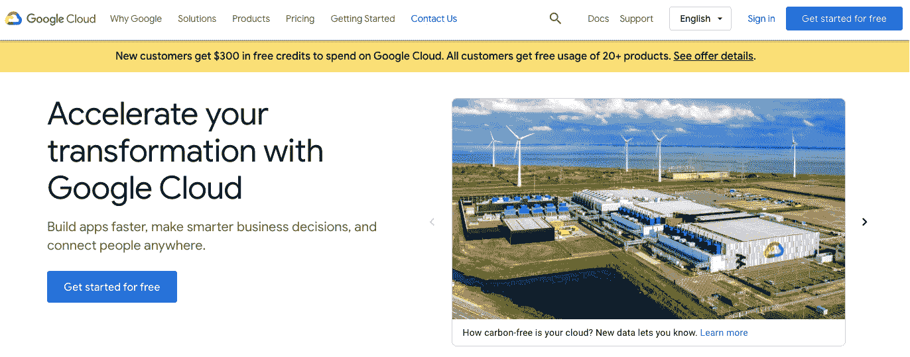

图 8.1–开始使用谷歌云

如果你仔细看截图，上面写着**新客户获得 300 美元的免费积分，可以在谷歌云上消费。所有客户免费使用 20+产品**。这意味着您可以使用免费的分级产品，无需支付任何费用，您还将获得价值 300 美元的 90 天积分，以探索或评估 GCP 提供的不同服务。例如，您可以在规定的每月使用限额内免费使用计算引擎、云存储和**大查询**。

您可以点击**免费开始**或**登录**。如果您第一次注册，您必须提供您的账单信息，这将把您重定向到您的云**控制台**。另外，会自动为您创建一个新项目。项目是你工作的一种工作空间。单个项目中的所有资源都与所有其他项目中的资源隔离开来。您可以控制对此项目的访问，并且只授予特定个人或服务帐户的访问权限。以下截图是您的谷歌云控制台仪表板视图:

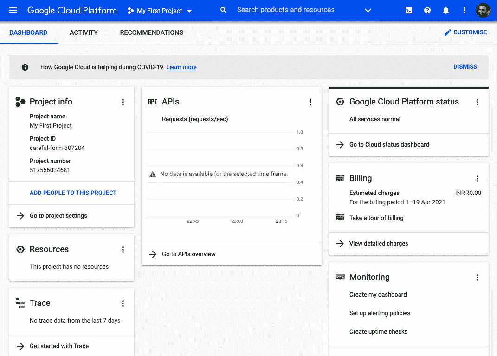

图 8.2–谷歌云控制台仪表板

在控制台页面的左侧，您可以查看 GCP 提供的不同服务:

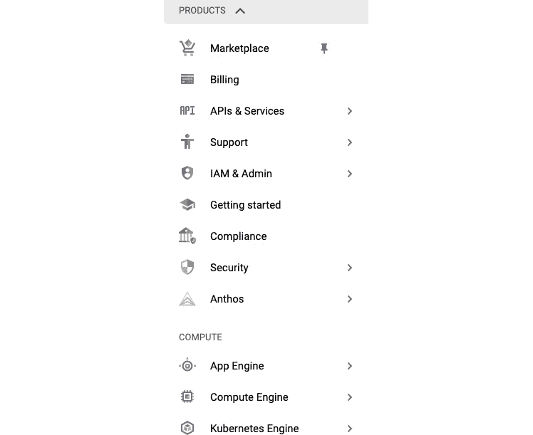

图 8.3–谷歌云服务视图

本章重点介绍 GCP 提供的 GKE 服务 API。但是在讨论这些之前，我们需要安装一些工具来使用这些服务。让我们在下一节中讨论这些工具。

# 与谷歌云 SDK、云贝壳合作

你现在可以访问 GCP 控制台了，你可以使用控制台做任何事情。但是对于开发人员来说，更好的方法是使用云软件开发工具包，这是一个工具的集合，通过使用仿真器或像 **kubectl** 、**skafold**和 **minikube** 这样的工具，允许更快的本地开发。不仅如此，您还可以管理您的资源，使用远程 Kubernetes 集群对进行身份验证，并从本地工作站启用或禁用 GCP 服务。另一种选择是从浏览器中使用 Cloud Shell，我们将在本章中探讨这两种选择。云软件开发工具包为您提供了与其产品和服务交互的工具和库。使用云软件开发工具包时，您可以根据需要安装和删除组件。

让我们从云软件开发工具包开始。您可以导航至[https://cloud.google.com/sdk/](https://cloud.google.com/sdk/)并点击**开始**按钮。这将把重定向到安装指南。云软件开发工具包的最低先决条件是拥有 Python。支持的版本是 Python 3(首选 3.5 到 3.8)和 Python 2 (2.7.9 或更高版本)。例如，现代版本的 macOS 包括云 SDK 所需的适当版本的 Python。但是，如果您想使用云软件开发工具包安装 Python 3，您可以选择捆绑 Python 安装产品的 64 位 macOS。

## 在 Linux 上下载云 SDK

云 SDK 需要安装 Python ，所以首先使用以下命令验证 Python 版本:

```
python --version
```

要从命令行下载 Linux 64 位归档文件，请运行以下命令:

```
curl -O https://dl.google.com/dl/cloudsdk/channels/rapid/downloads/google-cloud-sdk-336.0.0-linux-x86_64.tar.gz
```

对于 32 位归档文件，运行以下命令:

```
curl -O https://dl.google.com/dl/cloudsdk/channels/rapid/downloads/google-cloud-sdk-336.0.0-linux-x86.tar.gz
```

## 在 macOS 上下载云 SDK

要在 macOS 上下载云软件开发工具包，您有以下选项可供选择:


图 8.4–苹果电脑的下载选项

如果您不确定机器的硬件，请运行`uname –m`命令。根据您的机器，您将获得以下输出:

```
$uname -m
x86_64
```

现在选择合适的软件包，并从位于[https://cloud.google.com/sdk/docs/install#mac](https://cloud.google.com/sdk/docs/install#mac)的表格中**软件包**栏给出的网址下载。

## 设置云软件开发工具包

下载包后，您需要将档案提取到文件系统上您选择的位置。以下是`google-cloud-sdk`提取档案的内容:

```
tree -L 1 google-cloud-sdk
google-cloud-sdk
├── LICENSE
├── README
├── RELEASE_NOTES
├── VERSION
├── bin
├── completion.bash.inc
├── completion.zsh.inc
├── data
├── deb
├── install.bat
├── install.sh
├── lib
├── path.bash.inc
├── path.fish.inc
├── path.zsh.inc
├── platform
├── properties
└── rpm
```

提取归档文件后，您可以通过运行提取文件根目录中的`install.sh`脚本来继续安装。您可能会看到以下输出:

```
$ ./google-cloud-sdk/install.sh 
Welcome to the Google Cloud SDK!
To help improve the quality of this product, we collect anonymized usage data
and anonymized stacktraces when crashes are encountered; additional information
is available at <https://cloud.google.com/sdk/usage-statistics>. This data is
handled in accordance with our privacy policy
<https://cloud.google.com/terms/cloud-privacy-notice>. You may choose to opt in this
collection now (by choosing 'Y' at the below prompt), or at any time in the
future by running the following command:
    gcloud config set disable_usage_reporting false
Do you want to help improve the Google Cloud SDK (y/N)?  N
Your current Cloud SDK version is: 336.0.0
The latest available version is: 336.0.0
```

在下面的屏幕中，您可以看到已安装和未安装组件的列表:


图 8.5–谷歌云软件开发工具包组件列表

您可以使用以下云软件开发工具包命令来安装或移除组件:

```
To install or remove components at your current SDK version [336.0.0], run:
  $ gcloud components install COMPONENT_ID
  $ gcloud components remove COMPONENT_ID
Enter a path to an rc file to update, or leave blank to use 
[/Users/ashish/.zshrc]:  
No changes necessary for [/Users/ashish/.zshrc].
For more information on how to get started, please visit:
  https://cloud.google.com/sdk/docs/quickstarts
```

确保在此之后使用`source .zshrc`命令获取您的 bash 配置文件。从安装中可以看到，默认只安装了`. bq`、`core`和`gsutil`三个组件。

下一步是运行`gcloud init`使用以下命令初始化 SDK:

```
$/google-cloud-sdk/bin/gcloud init  
Welcome! This command will take you through the configuration of gcloud.
Your current configuration has been set to: [default]
You can skip diagnostics next time by using the following flag:
  gcloud init --skip-diagnostics
Network diagnostic detects and fixes local network connection issues.
Checking network connection...done
Reachability Check passed.
Network diagnostic passed (1/1 checks passed).
You must log in to continue. Would you like to log in (Y/n)?  Y
Your browser has been opened to visit:
    https://accounts.google.com/o/oauth2/auth?response_type=code&client_id=32555940559.apps.googleusercontent.com&redirect_uri=http%3A%2F%2Flocalhost%3A8085%2F&scope=openid+https%3A%2F%2Fwww.googleapis.com%2Fauth%2Fuserinfo.email+https%3A%2F%2Flocalhost%3A8085%2F&scope=openid+https%3A%2F%2Fwww.googleapis.com%2Fauth%2Fuserinfo.email+https%3A%2F%2Fwww.googleapis.com%2Fauth%2Fcloud-platform+https%3A%2F%2Fwww.googleapis.com%2Fauth%2Fappengine.admin+https%3A%2F%2Fwww.googleapis.com%2Fauth%2Fcompute+https%3A%2F%2Fwww.googleapis.com%2Fauth%2Faccounts.reauth&state=CU1Yhij0NWZB8kZvNx6aAslkkXdlYf&access_type=offline&code_challenge=sJ0_hf6-zNKLjVSw9fZlxjLodFA-EsunnBWiRB5snmw&code_challenge_method=S256
```

此时，您将被重定向到浏览器窗口，并被要求登录您的谷歌帐户进行身份验证，并为您的云资源授予对云软件开发工具包的访问权限。

点击**允许**按钮，它将确保下次你可以以自己的身份与 GCP 应用编程接口交互。授予访问权限后，您将看到确认身份验证的以下屏幕:

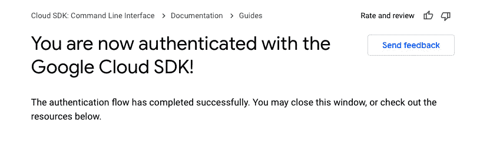

图 8.6–谷歌云软件开发工具包认证完成

现在您已经验证了自己，并准备好使用云软件开发工具包。完成身份验证后，您可能会在命令行上看到以下内容:

```
Updates are available for some Cloud SDK components.  To install them,
please run:
  $ gcloud components update
You are logged in as: [XXXXXXX@gmail.com].
Pick cloud project to use: 
 [1] xxxx-xxx-307204
 [2] Create a new project
Please enter numeric choice or text value (must exactly match list 
item):  1
Your current project has been set to: [your-project-id].
Do you want to configure a default Compute Region and Zone? (Y/n)?  Y
Which Google Compute Engine zone would you like to use as project 
default?
If you do not specify a zone via a command line flag while working 
with Compute Engine resources, the default is assumed.
 [1] us-east1-b
 [2] us-east1-c
 [3] us-east1-d
.................
Please enter a value between 1 and 77, or a value present in the list:  1
Your project default Compute Engine zone has been set to [us-east1-b].
You can change it by running [gcloud config set compute/zone NAME].
Your project default Compute Engine region has been set to [us-east1].
You can change it by running [gcloud config set compute/region NAME].
Your Google Cloud SDK is configured and ready to use!
......
```

从命令行输出，很明显我们已经选择了项目并确认了计算引擎区域。现在，我们已经成功安装了云软件开发工具包。在下一节中，我们将了解 Cloud Shell。

### 使用云外壳

Cloud Shell 是一个基于浏览器的终端/CLI 和编辑器。它预装了 Skaffold、minikube 和 Docker 等工具。可以通过单击云控制台浏览器窗口右上角的以下图标来激活它:


图 8.7–激活云外壳

激活后，您将被重定向到以下屏幕:

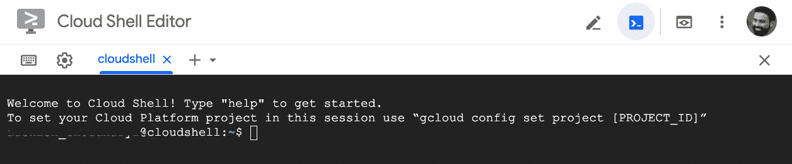

图 8.8–云外壳编辑器

您可以使用`gcloud config set project projectid`命令设置您的项目标识，或者只需开始使用`gcloud`命令。以下是 Cloud Shell 提供的一些突出显示的功能:

*   Cloud Shell 完全基于浏览器，你可以从任何地方访问它。唯一的要求是互联网连接。
*   Cloud Shell 为您提供了一个 5 GB 的永久存储器，安装在您的`$HOME`目录中。
*   Cloud Shell 附带了一个在线代码编辑器。您可以使用它来构建、测试和调试应用。
*   Cloud Shell 还附带了一个 Git 客户端，这样您就可以从代码编辑器或命令行克隆更改并将其推送到您的存储库中。
*   Cloud Shell 附带了一个 web 预览，您可以在 web 应用中查看您的本地更改。

我们已经安装了并配置了谷歌云 SDK 供我们使用。我们还研究了 Cloud Shell 及其提供的功能。现在让我们创建一个 Kubernetes 集群，在这里我们可以部署我们的 Spring Boot 应用。

# 建立谷歌 Kubernetes 引擎集群

我们需要在 GCP 建立一个 Kubernetes 集群来部署我们的集装箱化 Spring Boot 应用。GCP 可以提供托管和管理的 Kubernetes 部署。我们可以使用以下两种方法在 GCP 创建 Kubernetes 集群:

*   使用谷歌云软件开发工具包创建 Kubernetes 集群
*   使用谷歌控制台创建 Kubernetes 集群

让我们详细讨论其中的每一个。

## 使用谷歌云 SDK 创建 Kubernetes 集群

我们可以使用下面的 gcloud SDK 命令创建一个 Kubernetes 集群来运行容器。这将使用默认设置创建一个 Kubernetes 集群:


图 8.9–GKE 集群启动并运行

我们已经使用 Cloud SDK 成功地创建了 Kubernetes 集群。接下来，我们将尝试使用谷歌控制台创建集群。

## 使用谷歌控制台创建 Kubernetes 集群

要使用控制台创建 Kubernetes 集群，您应该首先使用左侧导航栏并选择 **Kubernetes 引擎**。在显示的选项中，选择**集群**:


图 8.10–开始创建谷歌 Kubernetes 引擎集群

之后，您将在下一页看到以下屏幕:

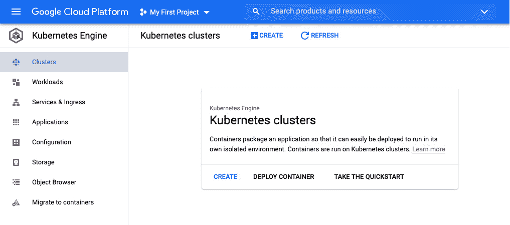

图 8.11–创建谷歌 Kubernetes 引擎集群

您可以选择通过单击弹出菜单上的**创建**按钮上的或通过单击页面顶部的**+创建**来创建集群。两者都会给你以下选择，如*图 8.12 所示:*


图 8.12–谷歌 Kubernetes 引擎集群模式

您可以选择创建一个**标准** Kubernetes 集群，或者使用**自动驾驶**模式创建一个完全不干涉的体验。在本节中，我们将讨论标准集群。我们将在下一节单独介绍自动驾驶仪。

在标准集群模式下，您可以灵活选择集群的节点数量，并根据需要调整配置或设置。下面是创建 Kubernetes 集群的演练。由于我们使用默认配置，您必须单击**下一步**接受默认选项。

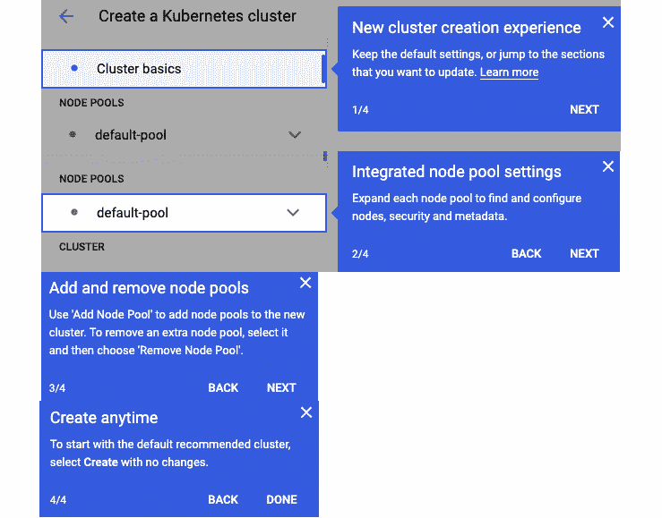

图 8.13–谷歌 Kubernetes 引擎集群创建

最后，点击页面底部的**创建**按钮瞧，你的 Kubernetes 集群将在几分钟后启动并运行！

以下是集群的默认配置:

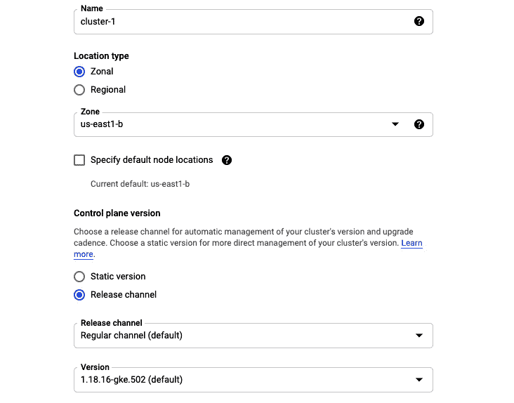

图 8.14–谷歌 Kubernetes 引擎集群配置视图

您的 Kubernetes 集群现已启动并运行。在下面的截图中，我们可以看到我们有一个三节点集群，有 6 个 vCPUs 和 12 GB 的总内存:

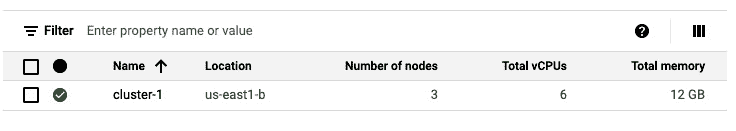

图 8.15–谷歌 Kubernetes 引擎集群启动并运行

您可以通过点击集群名称 **cluster-1** ，查看更多关于集群节点、存储和日志的详细信息。以下是我们刚刚创建的集群节点的详细信息:


图 8.16–谷歌 Kubernetes 引擎集群视图

可以看到整体集群状态和节点健康状况还可以。集群节点是使用 GCP 计算引擎创建的，提供的机器类型为 **e2-medium** 。您可以通过查看左侧导航栏上的计算引擎资源来验证这一点。这里显示了相同的三个节点，GKE 集群使用我们刚刚创建的这些节点。

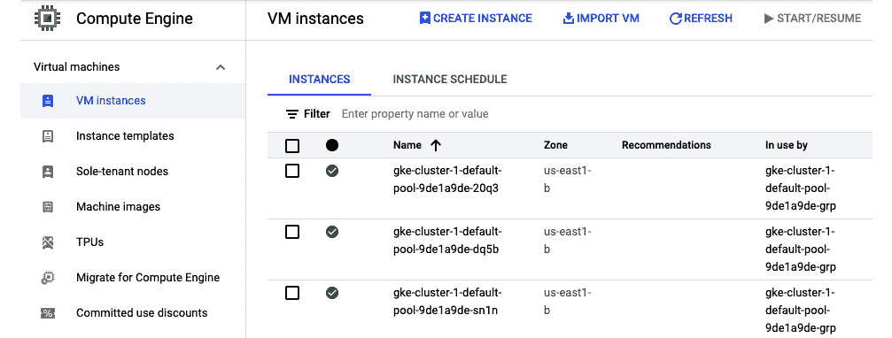

图 8.17–谷歌 Kubernetes 引擎集群虚拟机实例

我们已经学习了如何使用谷歌控制台创建库本内斯标准集群。在下一节中，我们将了解自动驾驶仪集群。

# 推出谷歌 Kubernetes 引擎自动驾驶集群

2021 年 2 月 24 日，谷歌宣布其全面管理的 Kubernetes 服务“GKE 自动驾驶”全面上线。这是一个完全托管和无服务器的 Kubernetes 即服务产品。目前没有其他云供应商在云上管理 Kubernetes 集群时提供这种级别的自动化。大多数云供应商会为您留下一些集群管理，无论是管理控制平面( **API 服务器**、 **etcd** 、**调度器**等)、工作节点，还是根据您的需求从头开始创建一切。

顾名思义，GKE 自动驾驶是一种完全不用手的体验，在大多数情况下，您只需指定集群名称和区域，如果您愿意，可以设置网络，仅此而已。您可以专注于部署您的工作负载，并让谷歌全面管理您的 Kubernetes 集群。谷歌为多个区域的自动驾驶吊舱提供了 99.9%的正常运行时间。即使你自己管理这个，你也不会超过谷歌提供的数字。除此之外，GKE 自动驾驶仪的性价比很高，因为你不用为**虚拟机** ( **虚拟机**)付费，而且你只需要为每秒钟的资源(例如，vCPU、内存和你的吊舱消耗的磁盘空间)付费。

那么像我们在上一节中创建的 GKE 标准集群和 GKE 自动驾驶集群有什么区别呢？答案如下:使用标准集群，您只管理节点，就像 GKE 管理控制平面一样，而使用 GKE 自动驾驶仪，您不管理任何东西(甚至不管理您的工作节点)。

这就提出了一个问题:我无法控制自己的节点是好事还是坏事？现在，这是有争议的，但今天大多数组织不像 Amazon.com、google.com 或 netflix.com 那样处理流量或负载。这可能过于简单，但老实说，即使您认为您有特定的需求或者您需要一个专门的集群，您最终往往会在保护和管理集群方面浪费大量的时间和资源。如果你有一个 SRE 团队，可以匹配谷歌 SRE 的经验或知识水平，你可以用你的集群做任何你喜欢的事情。但是现在的大多数组织都没有这样的专业知识，不知道自己在做什么。这就是为什么更好地依赖完全管理的 Kubernetes 服务，如 GKE 自动驾驶——它是经过战斗考验的，并基于从谷歌 SRE 学到的最佳实践。

关于 GKE 自动驾驶功能以及它提供的关于我们如何管理 Kubernetes 集群的完整抽象，我们已经谈得够多了。然而，记住这些抽象，也有一些限制。例如，您不能在自动驾驶模式下为容器运行特权模式。有关限制的完整列表，请阅读[https://cloud . Google . com/kubernetes-engine/docs/concepts/auto pilot-overview # limits](https://cloud.google.com/kubernetes-engine/docs/concepts/autopilot-overview#limits)上的官方文档。

到目前为止，我们已经获得了足够的关于 GKE 自动驾驶的知识，现在是时候创建我们的集群了。那么，让我们开始吧！

## 创建自动驾驶仪集群

点击**配置**按钮后，如*图 8.13* 所示，您将被重定向到以下屏幕:

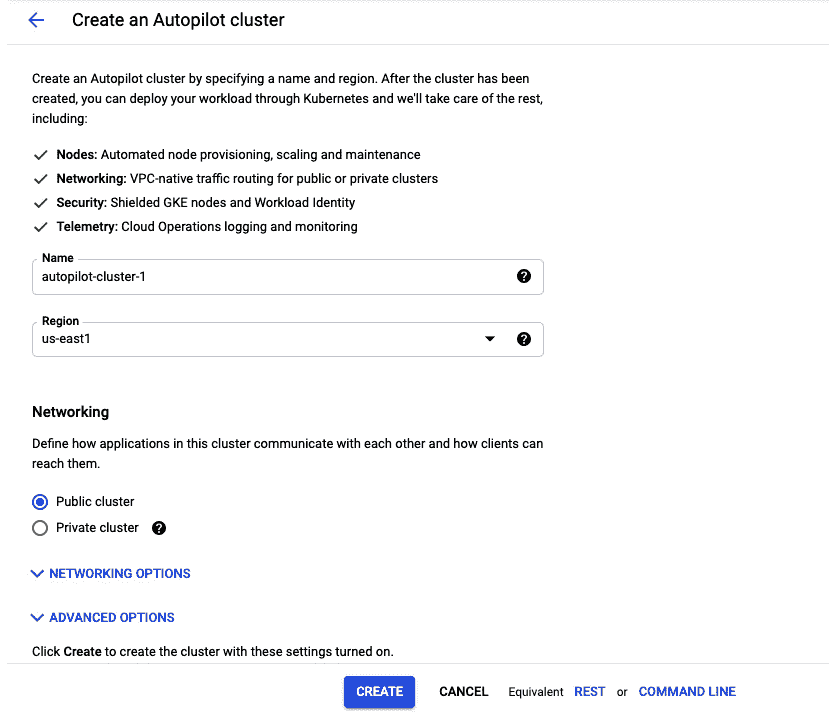

图 8.18–创建 GKE 自动驾驶仪集群

自动驾驶集群具有节点管理、网络、安全和遥测等功能，这些功能已经内置了谷歌推荐的最佳实践。GKE 自动驾驶仪确保您的集群已经过优化，可以投入生产。

如您所见，您在这里几乎没有可更改的选项。您可以更改集群的**名称**，选择另一个**地区**，或者选择**联网**(即公共或私有)。在**联网选项**下，您可以更改网络、子网、pod IP 地址范围和集群服务 IP 地址范围等内容，如下图所示:

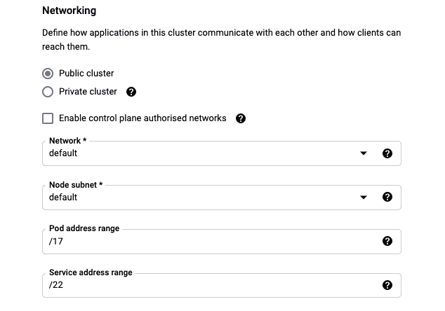

图 8.19–GKE 自动驾驶仪集群配置

在**高级选项**下，您可以启用维护窗口，并允许特定时间范围内的维护排除(如*图 8.19* 所示)。在此窗口中，您的 GKE 集群将进入自动维护窗口，您将无法使用。你应该根据你的需要选择一个维护窗口。


图 8.20–配置 GKE 自动驾驶仪集群维护窗口

现在，我们将使用默认值进入并点击页面底部的**创建**按钮来创建集群。创建集群可能需要几分钟时间。在下面的截图中，您可以看到自动驾驶集群已经启动并运行:


图 8.21–GKE 自动驾驶仪集群启动并运行

在这里，您可以看到节点的数量没有提到，因为它是由 GKE 管理的。

接下来，我们可以尝试连接到这个集群。为此，点击屏幕右上角的三个点，然后点击**连接**:


图 8.22–连接到 GKE 自动驾驶仪集群

点击**连接**后，会出现如下弹出窗口。您可以将这里提到的命令复制到命令行界面或云外壳中:

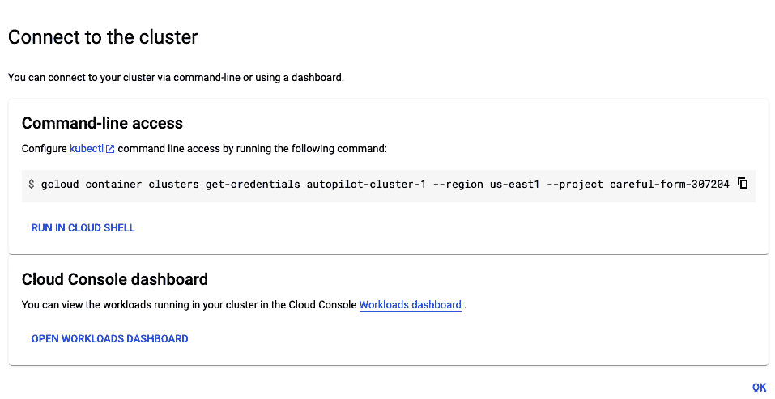

图 8.23–连接到 GKE 自动驾驶仪集群的命令

然后，您可以使用以下`kubectl get nodes`命令验证集群详细信息:


图 8.24–kube CTL 命令输出

我们还可以使用以下命令在自动驾驶模式下创建 GKE 集群:


图 8.25–自动驾驶中的 GKE 集群

我们也可以在谷歌云控制台上进一步验证这一点。你可以看到我们现在有两个集群。第一个使用云控制台创建，第二个使用带有 g Cloud 的命令行创建。

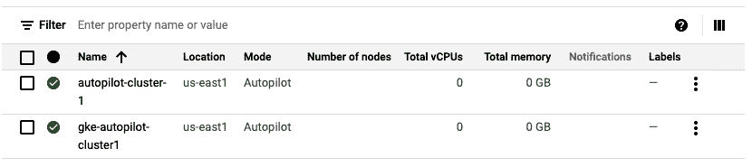

图 8.26–GKE 自动驾驶仪集群

我们已经通过不同的方式在 GCP 建立了库本内特星团。现在，让我们使用 Skaffold 将一个工作正常的 Spring Boot 应用部署到 GKE。

# 将 Spring Boot 应用部署到 GKE

我们将在本节中使用的 Spring Boot 应用与上一章中的相同(我们命名为*呼吸-查看实时空气质量数据*的应用)。我们已经熟悉了应用，所以我们将直接跳到部署到 GKE。我们将使用上一节中创建的`gke-autopilot-cluster1`进行部署。我们将使用以下两种方法使用 Skaffold 进行部署:

*   使用支架从本地部署到远程 gke 集群
*   使用 Skaffold 从云外壳部署到 GKE 集群

## 使用 Skaffold 从本地部署到远程 GKE 集群

在本节中，您将学习如何在斯卡菲尔德的帮助下将 Spring Boot 应用部署到远程库本内特集群。让我们开始吧:

1.  在上一章中，我们使用了**文件**来封装我们的 Spring Boot 应用。然而，在本章中，我们将使用`Jib-Maven`插件来容器化应用。我们已经知道如何使用前面章节中的 jib-maven 插件，所以我们将跳过在这里再次解释这一点。
2.  The only change is that we will be using the **Google Container Registry** (**GCR**) for storing the image pushed by Jib. GCR is a secure private registry for your images. Before that, we would need to make sure that GCR access is enabled for your account. You can allow access by using the following `gcloud` command:

    ```
    gcloud services enable containerregistry.googleapis.com
    ```

    或者您可以导航至[https://cloud.google.com/container-registry/docs/quickstart](https://cloud.google.com/container-registry/docs/quickstart)并通过点击**启用 API** 按钮启用集装箱注册 API 。

    

    图 8.27–启用谷歌容器注册应用编程接口

    接下来，系统会要求您选择一个项目，然后点击**继续**。就这样！

    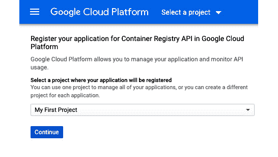

    图 8.28–为容器注册应用编程接口注册您的应用

3.  You can make the images under your container registry available for public access as well. Users of your images can pull the images without any authentication if they are public. In the following screenshot, you can see an option, **Enable Vulnerability Scanning**, for images pushed to your container registry. If you want, you can allow it to scan your container images for vulnerabilities.

    

    图 8.29–GCR 设置

4.  下一个难题是创建库本内斯清单，如**部署**和**服务**。在前一章中，我们使用**工具([https://github.com/dekorateio/dekorate](https://github.com/dekorateio/dekorate))创建了它们。我们也将在这里使用相同的库本内特清单生成过程。生成的库本内特清单在`target/classes/META-INF/dekorate/kubernetes.yml`路径下可用。**
5.  接下来，我们将运行`skaffold init --XXenableJibInit`命令，该命令将为我们创建一个`skaffold.yaml`配置文件。你可以看到 Skaffold 在生成的`skaffold.yaml`文件的`deploy`部分添加了库本内斯清单的路径，并将使用`jib`来构建映像:

    ```
    apiVersion: skaffold/v2beta20
    kind: Config
    metadata:
      name: scanner
    build:
    artifacts:
      - image: breathe
        jib:
          project: com.air.quality:scanner
    deploy:
      kubectl:
        manifests:
        - target/classes/META-INF/dekorate/kubernetes.yml
    ```

6.  We have the same main class as explained in the previous chapter, which uses the `@KubernetesApplication` `(serviceType = ServiceType.LoadBalancer)` annotation provided by the Dekorate tool to declare the service type as `LoadBalancer`:

    ```
    @KubernetesApplication(serviceType = ServiceType.LoadBalancer)
    @SpringBootApplication
    public class AirQualityScannerApplication {
       public static void main(String[] args) {
          SpringApplication.run(AirQualityScannerApplication.        class, args);
       }
    }
    ```

    在编译时，Dekorate 将生成以下 Kubernetes 清单。我还将它们保存在源代码中的 k8s 目录中，因为有时我们不得不手动从 Kubernetes 清单中添加或删除东西。部署和服务 Kubernetes 清单也可以在 GitHub 上找到。

    之后，我们需要确保您使用`gcloud auth list`命令获得了使用谷歌云服务的认证。您将看到以下输出:

    ```
    Credentialed AccountsACTIVE  ACCOUNT*       <my_account>@<my_domain.com>To set the active account, run:    $ gcloud config set account 'ACCOUNT'
    ```

    如果没有通过认证，也可以使用`gcloud auth login`命令。

7.  如果尚未设置，请使用`gcloud config set project <PROJECT_ID>`命令设置您的 GCP 项目。
8.  确保 Kubernetes 上下文设置为远程 Google Kubernetes 集群。使用以下命令验证:

    ```
    $ kubectl config current-context    
    gke_project_id_us-east1_gke-autopilot-cluster1
    ```

9.  We are now ready for deployment. Let's run the `skaffold run --default-repo=gcr.io/<PROJECT_ID>` command.  This will build the container image of the application. Push it to the remote GCR.

    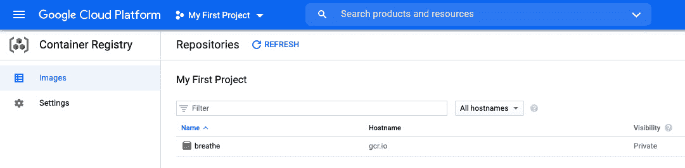

    图 8.30–映像被推送到谷歌容器注册中心

    推送的图片详情可以在下面的截图中看到:

    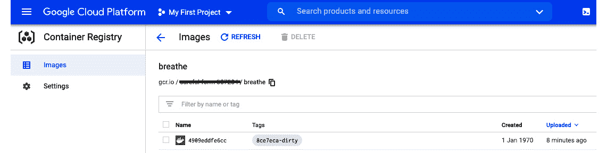

    图 8.31–谷歌容器注册映像视图

10.  Finally, deploy it to a remote Google Kubernetes cluster. It takes some time to stabilize the deployment when you run it for the first time, but subsequent runs are much faster.

    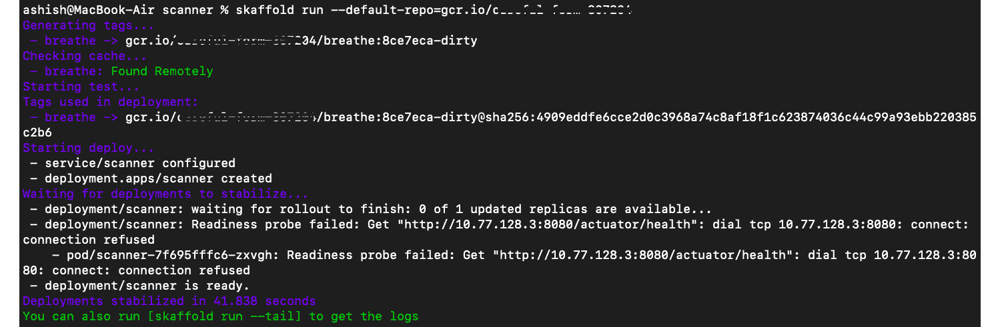

    图 8.32–Skaffold 运行输出

11.  We can also view the Deployment status on Google Cloud Console. Go to **Kubernetes Engine**, then click on the **Workloads** tab on the left-hand side navigation bar to view the deployment status. The Deployment status is **OK**.

    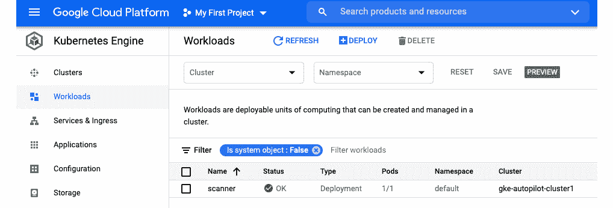

    图 8.33–部署状态

    您可以通过单击应用名称上的进一步查看**部署**详细信息。

    

    图 8.34–部署细节

12.  Everything looks great so far. Now we just need the IP address of the service so that we can access our application. On the same Deployment details page at the bottom, we have details about our service.

    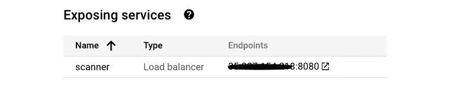

    图 8.35–公开的服务

13.  Let's hit the URL and verify if we get the desired output or not. We can view the real-time air quality data for Delhi:

    

    图 8.36–Spring Boot 应用响应

14.  我们可以使用执行器`/health/liveness`和`/health/readiness`端点来验证应用的健康状态。我们已经使用这些端点作为部署到库本内特集群的吊舱的活性和准备状态探测器。


图 8.37–Spring Boot 应用致动器探针

通过这些步骤，我们已经使用 Skaffold 从本地工作站完成了将 Spring 引导应用部署到远程 Google Kubernetes cluste r 的工作。在下一节中，我们将了解如何将应用从基于浏览器的 Cloud Shell 环境部署到 GKE。

## 使用 Skaffold 从 Cloud Shell 部署到 GKE 集群

在本节中，重点将是使用基于浏览器的云外壳工具将 Spring Boot 应用部署到 GKE。开始吧！

1.  The first step is to activate the Cloud Shell environment. This can be done by clicking on the **Activate Cloud Shell** icon in the top-right corner of Google Cloud Console.

    

    图 8.38–云外壳编辑器

2.  As you can see in the previous screenshot, you are asked to set your Cloud `PROJECT_ID` with the `gcloud config set project [PROJECT_ID]` command. You can use this if you know your `PROJECT_ID` or use commands like `gcloud projects list`. After this, Cloud Shell would ask for permission to authorize your request by making a call to the GCP API. You don't have to provide credentials for each request after this authorization.

    

    图 8.39–授权云外壳

    我们需要 Cloud Shell 环境中应用的源代码。Cloud Shell 附带安装了 Git 客户端，所以我们可以运行`git clone` [https://github . com/PacktPublishing/毫不费力-Cloud-Native-App-Development-use-skafold . Git](https://github.com/PacktPublishing/Effortless-Cloud-Native-App-Development-using-Skaffold.git)命令，克隆我们的 GitHub 存储库。

    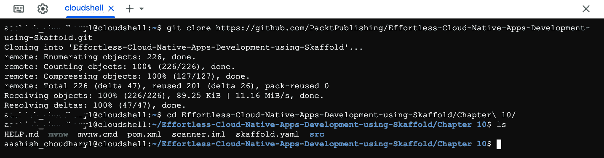

    图 8.40–克隆 GitHub 存储库

3.  Next, you need to compile the project so that you can generate Kubernetes manifests. Run the `./mvnw clean compile` command to build your project. Your build will fail and you will get an error:

    ```
    [ERROR] Failed to execute goal org.apache.maven.plugins:maven-compiler-plugin:3.8.1:compile (default-compile) on project scanner: Fatal error compiling: error: invalid target release: 16 -> [Help 1] . 
    ```

    失败的原因是`JAVA_HOME`在 Cloud Shell 环境中设置为 Java 11:

    ```
    $ java -version
    openjdk version "11.0.11" 2021-04-20
    OpenJDK Runtime Environment (build 11.0.11+9-post-Debian-1deb10u1)
    OpenJDK 64-Bit Server VM (build 11.0.11+9-post-Debian-1deb10u1, mixed mode, sharing)
    ```

    我们已经在`pomx.ml`中指定使用 Java 16。这个问题可以通过下载 Java 16 并设置`JAVA_HOME`环境变量来解决。

    注意

    我们有合适的工具解决这个问题， **SDKMAN** ，可以从[https://sdkman.io/](https://sdkman.io/)访问。它允许您与多个版本的 **Java JDK** s 并行工作。检查支持的 JDK([https://sdkman.io/jdks](https://sdkman.io/jdks))和 SDK([https://sdkman.io/sdks](https://sdkman.io/sdks))。随着新的半年发布周期，我们每六个月就有一个新的 JDK。作为开发人员，如果我们需要切换到不同的 JDK，我们喜欢通过手动下载和更改`JAVA_HOME`来尝试和探索这些功能。整个过程都是手动的，有了`SDKMAN`，我们只需运行一个命令就可以下载一个你选择的 JDK，下载后甚至会将`JAVA_HOME`更新到最新下载的 JDK。很酷，不是吗？

4.  Let's try to install JDK16 with SDKMAN. Note that you don't have to install SDKMAN in your Cloud Shell provisioned VM instance as it comes pre-installed. Now enter `sdk` in your CLI, and it will show you the supported commands:

    

    图 8.41–SDKMAN 命令帮助

    要了解不同支持的 JDK，运行`sdk list java`命令。在下面的截图中，您将无法看到所有受支持的 JDK 供应商，但您得到了这个想法:

    

    图 8.42–SDKMAN 支持的 JDK

    要下载特定于供应商的 JDK，运行`sdk install java Identifier`命令。在我们的例子中，实际的命令将是`sdk install java 16-open`，因为我们已经决定使用 Java 16 的 OpenJDK 构建。

    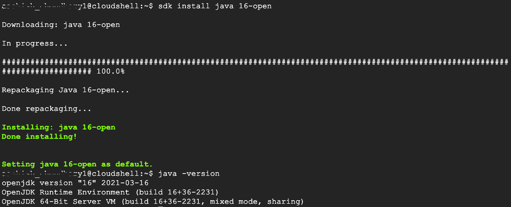

    图 8.43–安装 JDK16

    您可能还希望运行以下命令来更改活动 shell 会话中的 JDK:

    ```
    $ sdk use java 16-open
    Using java version 16-open in this shell.
    ```

5.  Let's compile the project again by running the `./mvnw clean compile` command. In the following output, you can see that the build is successful:

    

    图 8.44–Maven 构建成功

6.  我们准备运行命令，从 Cloud Shell 将 Spring Boot 应用部署到远程 GKE 集群。在此之前，请确保将您的 Kubernetes 上下文设置为远程集群。如果不确定，运行`kubectl config current-context`命令进行验证。如果未设置，则使用`gcloud container clusters get-credentials gke-autopilot-cluster1 --region us-east1`命令进行设置，这将在`kubeconfig`文件中添加条目。
7.  最后一步，我们只需要运行`skaffold run --default-repo=gcr.io/<PROJECT_ID>`命令。部署已稳定，最终输出将与上一节*步骤 13* 中看到的相同。

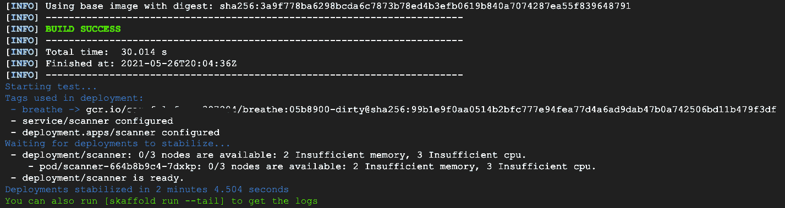

图 8.45–Skaffold 运行输出

这就完成了使用基于浏览器的 Cloud Shell 环境将 Spring Boot 应用部署到远程 GKE 集群的工作。我们已经了解了如何利用基于浏览器的预配置的 Cloud Shell 环境进行开发。如果你想尝试一下，这是谷歌提供的一个很好的功能。但是，我不确定您是否应该将它用于您的生产用例。使用云外壳提供的谷歌计算引擎虚拟机实例是基于每个用户、每个会话提供的。如果会话处于活动状态，您的虚拟机实例将持续存在；否则，它们将被丢弃。有关云壳的工作信息，请查看官方文档:

[https://cloud.google.com/shell/docs/how-cloud-shell-works](https://cloud.google.com/shell/docs/how-cloud-shell-works)

# 总结

在本章中，我们首先讨论了使用云供应商的特性和优势。然后，我们给你介绍了 GCP。首先，我们详细介绍了如何登上云平台。接下来，我们介绍了 Google Cloud SDK，它允许您执行各种任务，如安装组件、创建 Kubernetes 集群，以及启用不同的服务，如 Google Container Registry 等。

我们还讨论了基于浏览器的云外壳编辑器，它由谷歌计算引擎虚拟机实例提供支持。您可以将它作为一个临时的沙盒环境来测试 GCP 支持的各种服务。然后，我们研究了使用云软件开发工具包和云控制台创建 Kubernetes 集群的两种不同方法。之后，我们向您介绍了无服务器 Kubernetes 产品，即 GKE 自动驾驶仪，并介绍了它相对于标准 Kubernetes 集群的特性和优势。最后，在最后一部分，我们使用来自本地的 Skaffold，然后使用 Google Cloud Shell，成功地将 Spring Boot 应用部署到了 GKE 自动驾驶集群。

在本章中，您已经获得了 GCP 的托管 Kubernetes 服务的实用知识，以及云 SDK 和云 Shell 等工具。您还学习了如何使用 Skaffold 将 Spring Boot 应用部署到远程 Kubernetes 集群。

在下一章中，我们将学习使用 GitHub 动作和 Skaffold 创建 CI/CD 流水线。

# 进一步阅读

*   了解更多 GKE 自动驾驶:[https://cloud . Google . com/blog/products/containers-kubernetes/introduction-gke-自动驾驶](https://cloud.google.com/blog/products/containers-kubernetes/introducing-gke-autopilot)
*   了解更多谷歌云平台:[https://cloud.google.com/docs](https://cloud.google.com/docs)
*   架构师谷歌云平台:[https://www . packtpub . com/product/Google-Cloud-Platform-for-Architects/9781788834308](https://www.packtpub.com/product/google-cloud-platform-for-architects/9781788834308)