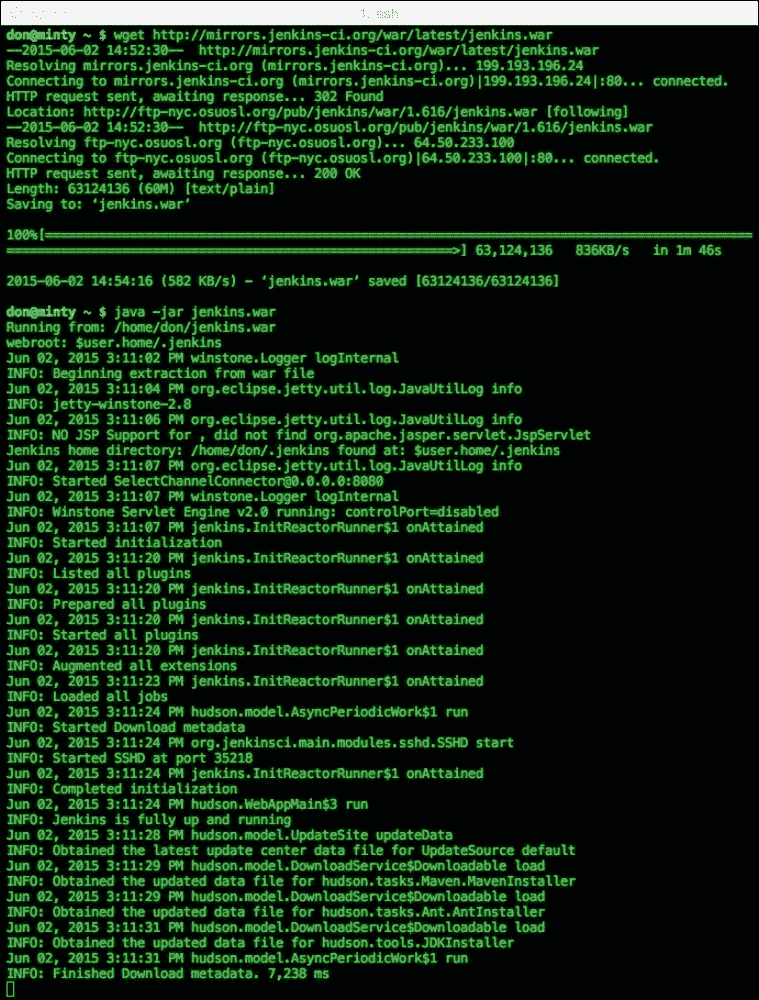
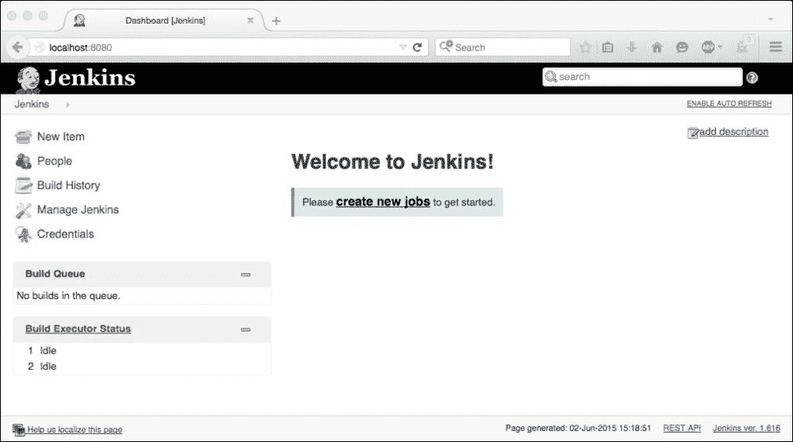

# 一、准备步骤

在第一章中，我们将从几个不同的角度来看 Jenkins；如何获得和运行它，人们使用它的一些方式和原因，以及它为他们提供了什么。在此过程中，我们将查看一些标准用例，并研究 Jenkins 安装通常会如何在一段时间内发展——通常只从基本安装和核心功能开始，然后随着不同类型的扩展逐渐变得更加定制和高级。我们将从“现成的”插件开始，然后在研究如何开发自己的插件之前，逐步扩展这些插件。

然后，我们将总结这本书的高层次目标，并给出你希望从中获得什么的细节。

我们将概述运行后续章节中涵盖的实际示例所需的各种工具和环境设置，并且我们将通过确定 Jenkins 可以用来实现这些工具和环境设置的一些方法来回顾**持续集成** ( **CI** )的最佳实践。

在本书中，假设您已经对 Jenkins 有一些工作知识，因此我们不会花太多时间介绍基础知识，例如安装和启动 Jenkins，或者详细介绍标准功能和核心功能的使用。

如果你想了解这些主题的更多细节，网上有很多有用的教程和例子；Jenkins 主页的**使用 Jenkins**部分，[https://jenkins-ci.org](https://jenkins-ci.org)，通常是帮助解决一般设置和用法问题的良好起点。

# Jenkins 入门

作为一个 Java 应用，Jenkins 可以根据您的需求、个人偏好和运行它的环境以不同的方式安装和运行。

快速启动并运行 Jenkins 的最简单的方法是设置 Java，从 Jenkins 主页([www.jenkins-ci.org](http://www.jenkins-ci.org))下载最新的 Jenkins WAR 文件，然后简单地从命令行启动，如下所示:

```
java –jar jenkins.war

```

下图通过运行两个简单的命令演示了这种方法的使用:

1.  `wget http://mirrors.jenkins-ci.org/war/latest/jenkins.war`:

    该命令从主站点下载最新版本的 Jenkins。

    `wget`是一个从网络上获取文件的 Linux 实用程序——如果你在一个没有`wget`的平台上，你可以通过浏览器将链接(T2)文件保存到一个工作目录中。

    网址是从【https://jenkins-ci.org/】的主页复制**最新&最大**链接获得的。请注意，还有一个选项可以下载和使用长期支持版本，而不是当前的、最新的和最棒的版本，如这里所解释的::[https://wiki . JENKINS-ci . org/display/JENKINS/LTS+版本+线路](https://wiki.jenkins-ci.org/display/JENKINS/LTS+Release+Line)。

    这对于更保守的安装更为可取，因为稳定性比拥有最新功能更为重要。

2.  `java –jar jenkins.war`:

    第二个命令告诉 Java 运行我们刚刚作为应用下载的 WAR 文件，它产生的结果输出可以在下面的截图中看到——Jenkins 从 WAR 文件中解包，检查并初始化各个子系统，并在端口`8080`上启动一个进程:

    

    下载并启动 Jenkins

这个简单的过程通常是下载 Jenkins 的最新版本并启动和运行它所需要的全部。现在，您应该能够通过浏览器访问`http://localhost:8080`处的网络界面，并开始设置工作，让 Jenkins 为您工作:



Jenkins 主页

# 扩展基本设置

当您从命令提示符或启动我们之前看到的进程的 shell 退出时，Jenkins 实例将随着退出而停止，因此对于除了非常快速的临时测试之外的任何事情，强烈建议使用某种形式的初始化或进程管理脚本。这样的脚本也可以很容易地定制，为您执行一些“很高兴拥有”的功能，例如，像这样的事情:

*   在系统启动时启动
*   满足`stop|start|restart|status`要求
*   将控制台输出重定向到日志文件，以便您可以监视它的问题
*   作为后台/后台进程运行
*   在端口`8080`已经被另一个应用使用的情况下，通过设置`--httpPort=`参数在非标准端口上运行
*   绑定到特定的网络接口，而不是使用`--httpListenAddress=`选项的默认`0.0.0.0`值

这个来自主页的基于 Ubuntu 的示例脚本演示了前面提到的在 Tomcat 下运行的 Jenkins 的许多特性。脚本可在[https://wiki . JENKINS-ci . org/display/JENKINS/JenkinsLinuxStartupScript](https://wiki.jenkins-ci.org/display/JENKINS/JenkinsLinuxStartupScript)找到，如下:

```
#!/bin/sh
#
# Startup script for the Jenkins Continuous Integration server
# (via Jakarta Tomcat Java Servlets and JSP server)
#
# chkconfig: - 85 15
# description: Jakarta Tomcat Java Servlets and JSP server
# processname: jenkins
# pidfile: /home/jenkins/jenkins-tomcat.pid

# Set Tomcat environment.
JENKINS_USER=jenkins
LOCKFILE=/var/lock/jenkins
export PATH=/usr/local/bin:$PATH
export HOME=/home/jenkins
export JAVA_HOME=/usr/lib/jvm/java-6-sun
export JENKINS_BASEDIR=/home/jenkins
export TOMCAT_HOME=$JENKINS_BASEDIR/apache-tomcat-6.0.18
export CATALINA_PID=$JENKINS_BASEDIR/jenkins-tomcat.pid
export CATALINA_OPTS="-DJENKINS_HOME=$JENKINS_BASEDIR/jenkins-home -Xmx512m -Djava.awt.headless=true"

# Source function library.
. /etc/rc.d/init.d/functions

[ -f $TOMCAT_HOME/bin/catalina.sh ] || exit 0

export PATH=$PATH:/usr/bin:/usr/local/bin

# See how we were called.
case "$1" in
  start)
        # Start daemon.
        echo -n "Starting Tomcat: "
        su -p -s /bin/sh $JENKINS_USER -c "$TOMCAT_HOME/bin/catalina.sh start"
        RETVAL=$?
        echo
        [ $RETVAL = 0 ] && touch $LOCKFILE
        ;;
  stop)
        # Stop daemons.
        echo -n "Shutting down Tomcat: "
        su -p -s /bin/sh $JENKINS_USER -c "$TOMCAT_HOME/bin/catalina.sh stop"
        RETVAL=$?
        echo
        [ $RETVAL = 0 ] && rm -f $LOCKFILE
        ;;
  restart)
        $0 stop
        $0 start
        ;;
  condrestart)
       [ -e $LOCKFILE ] && $0 restart
       ;;
  status)
        status -p $CATALINA_PID -l $(basename $LOCKFILE) jenkins
        ;;
  *)
        echo "Usage: $0 {start|stop|restart|status}"
        exit 1
esac
exit 0
```

请注意[http://jenkins-ci.org/](http://jenkins-ci.org/)主页还在**原生软件包**栏下为许多流行的操作系统提供了**原生安装程序**。这些页面提供了每个操作系统的下载链接和安装说明。

您可能也想看看在 J2EE 容器中运行 Jenkins，这通常会导致与您现有的软件栈和体系结构更加无缝地匹配。这可能意味着您将继承额外的好处，例如容器的日志记录、身份验证、授权或弹性。Jenkins 可以与许多流行的 J2EE 兼容容器一起运行，包括:

*   万维网环球服务系统
*   中间件
*   雄猫
*   JBoss
*   Docker
*   乔纳斯

网络上有更多的`init`脚本示例和详细的安装说明，应该涵盖操作系统和容器设置的任何组合。这一点的要点是，您应该能够设置 Jenkins 来适应您的环境和偏好。

出于本书的目的，我们将假设 Jenkins 直接从本地主机上的命令行运行。如果您使用 J2EE 容器来托管应用或在远程主机上运行应用，您将注意到的唯一区别是您可能需要执行额外的管理和部署步骤。

# Jenkins 进化

通常，大多数用户或组织将通过建立一个基本的、标准的 Jenkins 安装来管理一些简单的开发任务，从而开始他们的 Jenkins 之旅。最常见的用途是构建您的源代码，或者定期地，或者每当它在您的中央存储库中发生变化时(Git、Subversion 等等)。

使用 Jenkins 来自动化这种简单而重复的任务通常会非常快速和容易地提供许多有用的好处。可以说，开箱即用，您可以获得一系列有用的功能，例如任务调度和作业触发、构建和测试报告页面、在出现新问题时发送电子邮件通知和警报，以及提供关于健康状况(或不健康)的快速实时反馈！)您的代码库当前为。如果您还没有一个工具来提供这些东西，那么建立一个标准的 Jenkins 实例将提供这些初始的基本特性，这些特性本身很可能会改变您的开发过程。

在此之后的下一个逻辑步骤是逐渐给设置增加一点智能和复杂性——代码编译正常吗？现在已经通过了多少单元测试，应用编译需要多长时间？哦，我们可以在网页上显示谁改变了代码库的哪些部分吗？我们的应用比以前运行得更快还是更好，它是否稳定？甚至在我们开始添加任何类型的扩展或定制之前，核心 Jenkins 安装在这里提供了过多的选项——您可以选择在任何运行 Java 的平台上构建您的应用(这意味着现在几乎在任何地方)，您也可以以任何最适合您和您当前设置的方式来做这件事，包括使用标准和流行的构建工具，如 Ant 或 Maven，和/或重用您现有的 Ant 或 Maven 构建脚本，或您的 Linux Shell 或 Windows DOS 脚本。

您还可以通过部署 Jenkins Slave Nodes 轻松设置跨平台环境，这将允许您在不同的主机上运行不同的作业。这在使用操作系统组合的环境中非常有用；例如，您的应用在 Linux 上运行，并且您希望在 Windows 主机上使用 Internet Explorer 运行基于浏览器的测试。

这种作为现有流程的可轻松配置的“包装器”的能力，与 Jenkins 的灵活特性相结合，使您能够非常容易地调整您的特定设置，以适应您的需求，而只需最少的更改或中断。这使得 Jenkins 比仅仅为了适应新工具的需求而不得不改变现有的构建和部署过程和实践要容易得多。

在这个阶段之后，建立一个持续集成环境的好处往往会变得非常明显:如果我们能够如此轻松地自动构建代码并打包应用，那么如果我们能够继续部署它，岂不是很棒？然后，如果我们这样做了，我们可以自动测试我们的新应用在目标平台的副本上的表现！

达到这一点后，Jenkins 将成为您持续集成过程中的关键工具，您越能扩展它以适应您不断增长的特定需求，您将从中获得越多的好处。

这将我们引向扩展 Jenkins，这是我们将在本书的其余部分中看到的。

扩展 Jenkins 最简单的方法是通过其神奇且不断扩展的插件财富。浏览它们总是被推荐和提供信息的；现有的插件经常被改进和更新新的特性，新的插件一直被添加到列表中。不过，我们不仅仅是在这里回顾一些流行的插件——到本书结束时，您应该有能力将 Jenkins 的使用提升到一个新的水平，创建您自己的定制插件和扩展，并使用 Jenkins 为我们提供的许多扩展和交互功能和界面。

我们将详细了解以下内容:

*   我们使用现有功能的不同方式
*   通过各种接口和应用编程接口与 Jenkins 进行交互
*   如何在集成开发环境中与 Jenkins 交互
*   以现有功能为基础来满足您需求的方法
*   开发、测试和构建您自己的定制 Jenkins 扩展

以下是我们将用来帮助我们扩展 Jenkins 的主要工具，以及一些关于设置这些工具的信息，如果需要，还有进一步帮助和信息的来源:

*   **Java 开发工具包** ( **JDK** ):您将需要一个与您的 Java IDE 相同的位级别的版本，也就是说，根据您的架构和偏好，两者都需要是 32 位或 64 位。您可以从 IBM、Oracle 或 OpenJDK 6.0 或更高版本中进行选择。每个供应商都提供所有主要平台的安装说明。
*   **Java IDE**: We will mainly be using Eclipse, but will cater to NetBeans and IntelliJ too, where possible.

    这些 ide 的最新版本可在各自的网站上获得:

    *   [https://www.eclipse.org/downloads/](https://www.eclipse.org/downloads/)
    *   [https://netbeans.org/downloads/](https://netbeans.org/downloads/)
    *   [https://www.jetbrains.com/idea/download/](https://www.jetbrains.com/idea/download/)
*   **Mylyn** :这个是用来从我们 IDE 跟 Jenkins 交流的。如果 Mylyn 还没有包含在您的 IDE 中，您可以从 Eclipse 站点下载它:http://www.eclipse.org/mylyn/downloads/。我们将在[第 3 章](3.html#MSDG1-497efea050ab4b7582c7e2ed4ba920ee "Chapter 3\. Jenkins and the IDE")、*Jenkins 和 IDE* 中对此进行详细介绍。
*   **Maven** :我们将使用 Maven 3 来构建 Jenkins 源代码和我们自己定制的插件。Maven 是一个 Java 工具，所以它需要了解你的系统的 JDK。
*   **Jenkins 来源**:这将是马文下载的。
*   **Git** :在大多数 Linux 平台上，相当于`sudo apt-get install git`应该就够了。在 Mac 上，有几个选项，包括 Sourceforge 上的`git-osx`安装程序。对于微软视窗，有一个可执行安装程序在[http://msysgit.github.io/](http://msysgit.github.io/)可用。

我们将在后面的章节中详细介绍这些组件的安装和使用。

# 与 Jenkins 的持续整合

在我们结束本章之前，这里有一个持续集成的关键实践的列表(由马丁·福勒在 2006 年定义)，以及 Jenkins 可以用来帮助你实现它们的方法的例子:

*   **维护单一源代码库** : Jenkins 可以与所有现代源代码和版本控制库交互——有些能力是内置的，有些可以作为扩展添加。
*   **自动化构建**:正如前面在用例中所描述的，这是 Jenkins 的核心目标之一，通常也是开始使用 Jenkins 的主要驱动因素。
*   **进行构建自我测试**:这通常是用 Jenkins 建立 CI 环境的第二步——一旦你自动化了代码的构建，自动化测试也是一个自然的过程。
*   **每个人每天都致力于主线**:很遗憾，我们不能真的强迫开发人员这么做。然而，我们可以很容易地强调和报告谁在做——或者没有做——什么，这应该最终帮助他们学会遵循这一最佳实践。
*   **每次提交都应该在集成机器上构建主线**:构建可以由开发人员提交触发，Jenkins Slave Nodes 可以用于构建并提供精确的副本环境来构建。
*   **立即修复损坏的构建**:这是另一个需要采用的开发人员最佳实践——当 Jenkins 显示为红色时，首要的重点应该是修复问题，直到它显示为绿色。当构建被破坏时，任何人都不应该提交新的更改，Jenkins 可以被配置为以最有效的方式传达当前状态。
*   **保持快速构建**:通过将工作卸载并分散到分布式从节点，并通过分解构建来识别和关注已经发生变化的领域，可以调整 Jenkins 以提供对变化的快速响应—一个好的目标是在 10 分钟内检查变化并获得结果或影响的明确指示。
*   **在生产环境的克隆中进行测试**:在编译新的变更之后，可以创建下游 Jenkins 作业，这些作业将准备环境并将其带到所需的级别—应用数据库变更、启动相关流程和部署其他先决条件。将虚拟机或容器与 Jenkins 结合使用，以已知良好的状态自动启动环境，这在这里非常有用。
*   **让任何人都能轻松获取最新的可执行文件**:可以将 Jenkins 设置为在已知位置托管最新版本的 web 服务器，这样每个人(和其他流程/消费者)都可以轻松获取，或者每当有新版本上传到 Nexus、Artifactory 等时，也可以使用它向相关方发送详细信息和链接。
*   **每个人都可以看到正在发生的事情**:Jenkins 通信可以通过多种方式扩展——电子邮件提醒、桌面通知、信息辐射器、RSS 提要、即时消息等等——从熔岩灯和红绿灯到无处不在的玩具火箭发射器！
*   **自动化部署**:这通常是`Build -> Test -> Deploy`自动化序列的逻辑进展，Jenkins 可以在很多方面提供帮助；从属节点在部署主机上运行，或者作业被设置为连接到目标并使用最近构建的工件更新它。

一旦您实现了前面的最佳实践，可以实现的好处往往是多而显著的——您的团队将发布更高质量的软件，并且将比以前更快、成本更低地完成这项工作。然而，建立自动化的构建、测试和部署管道本身是远远不够的；测试、环境和文化也必须有足够的质量，让开发人员、经理和企业主“认可”过程和实践通常会有很大的不同。

# 总结

在这个预备章节中，我们已经了解了 Jenkins 的基础知识；从功能和实用的角度来看它是如何使用的。我们已经浏览了工具集的高级概述，我们将在接下来的章节中使用该工具集来扩展 Jenkins，并回顾了持续集成的最佳实践，以及如何使用 Jenkins 来帮助您的团队实现这些最佳实践。

在下一章中，我们将了解如何扩展 Jenkins 用户界面，使其更加高效和智能，以及如何扩展用户体验，使最终用户以及 Jenkins 管理员、构建脚本和流程的生活更加轻松和高效。