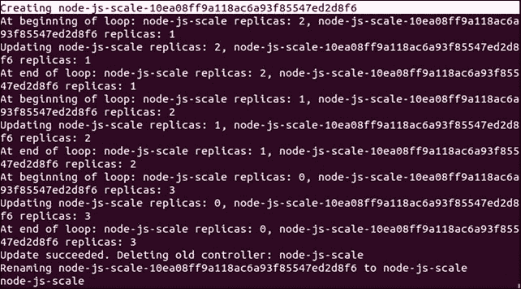
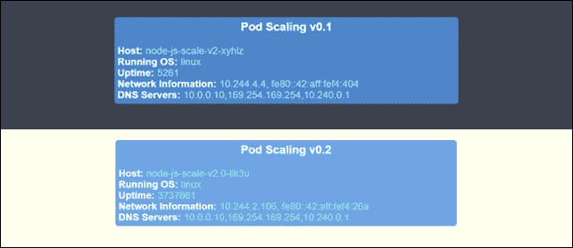
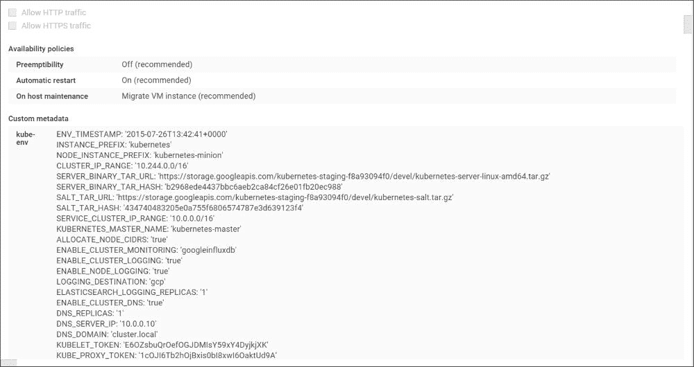
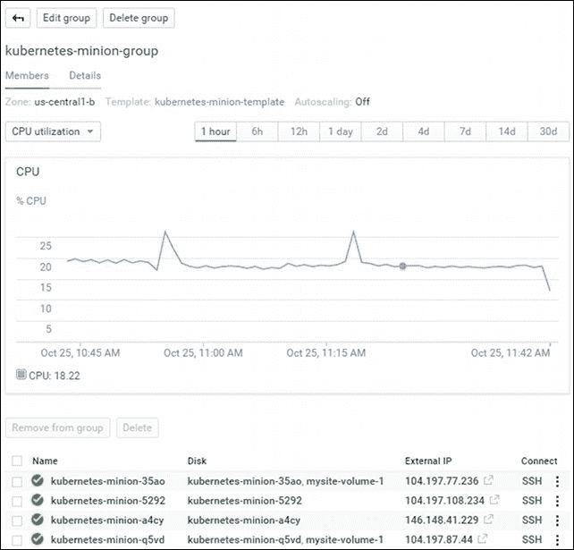
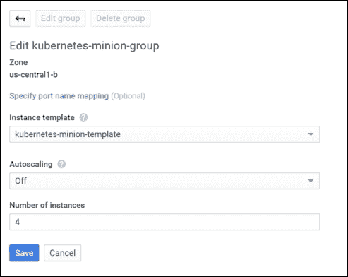
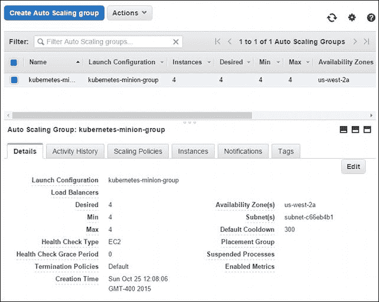

# 四、更新和扩展

本章将扩展核心概念，向读者展示如何在最大限度减少正常运行时间中断的情况下推出更新并测试其应用的新功能。它将涵盖应用更新、逐步推出和 A/B 测试的基础知识。此外，我们将研究如何扩展 Kubernetes 集群本身。

本章将讨论以下主题:

*   应用扩展
*   滚动更新
*   空调测试
*   扩展您的集群

# 示例设置

在我们开始探索 Kubernetes 内置的各种扩展和更新功能之前，我们需要一个新的示例环境。我们将使用前面容器映像的一个蓝色背景的变体(参考图 4.2 进行比较)。我们有以下代码:

```
apiVersion: v1
kind: ReplicationController
metadata:
  name: node-js-scale
  labels:
    name: node-js-scale
spec:
  replicas: 1
  selector:
    name: node-js-scale
  template:
    metadata:
      labels:
        name: node-js-scale
    spec:
      containers:
      - name: node-js-scale
        image: jonbaier/pod-scaling:0.1
        ports:
        - containerPort: 80
```

*清单 4-1* : `pod-scaling-controller.yaml`

```
apiVersion: v1
kind: Service
metadata:
  name: node-js-scale
  labels:
    name: node-js-scale
spec:
  type: LoadBalancer
  sessionAffinity: ClientIP
  ports:
  - port: 80
  selector:
    name: node-js-scale
```

*清单 4-2* : `pod-scaling-service.yaml`

使用以下命令创建这些服务:

```
$ kubectl create –f pod-scaling-controller.yaml
$ kubectl create –f pod-scaling-service.yaml

```

# 扩大规模

随着时间的推移，当您在 Kubernetes 集群中运行您的应用时，您会发现一些应用需要更多的资源，而另一些应用可以用更少的资源来管理。我们需要一种更无缝的方式来上下扩展我们的应用，而不是移除整个 RC(和相关的 pods)。

值得庆幸的是，Kubernetes 包含一个`scale`命令，它特别适合这个目的。在我们的新示例中，我们只有一个副本在运行。您可以使用`get pods`命令检查这一点。

```
$ kubectl get pods -l name=node-js-scale

```

让我们尝试使用以下命令将缩放到 3:

```
$ kubectl scale --replicas=3 rc/node-js-scale

```

如果一切顺利，你将会在你的终端窗口的输出上简单地看到单词**缩放后的**。

### 类型

或者，您可以指定`--current-replicas`标志作为验证步骤。只有当前运行的副本的实际数量与此计数匹配时，才会进行扩展。

再次列出我们的POD后，我们现在应该看到三个名称类似于`node-js-scale-` `**XXXXX**`的POD在运行，其中`X`是一个随机字符串。

您也可以使用`scale`命令来减少副本的数量。在这两种情况下，`scale`命令会添加或删除必要的 pod 副本，服务会自动更新和平衡新的或剩余的副本。

# 平滑更新

随着资源需求的变化，我们的应用的上下扩展对许多生产场景都很有用，但是简单的应用更新呢？任何生产系统都将有代码更新、补丁和功能添加。这些可能每月、每周甚至每天都发生。确保我们有一个可靠的方法在不中断用户的情况下推出这些更改是最重要的考虑因素。

我们再次受益于 Kubernetes 系统所基于的多年经验。1.0 版本内置了滚动更新支持。`rolling-update`命令允许我们更新整个 RCs 或每个副本使用的底层 Docker 映像。我们还可以指定一个更新间隔，这将允许我们一次更新一个 pod，并一直等到下一个。

让我们以缩放为例，对容器映像的 0.2 版本执行滚动更新。我们将使用 2 分钟的更新时间间隔，因此我们可以通过以下方式观察更新过程:

```
$ kubectl rolling-update node-js-scale --image=jonbaier/pod-scaling:0.2 --update-period="2m"

```

您应该会看到一些关于创建一个名为`node-js-scale-XXXXX`的新 RC 的文本，其中`X`将是一个由数字和字母组成的随机字符串。此外，您将看到一个循环的开始，即启动新版本的一个副本，并从现有 RC 中删除一个副本。此过程将继续，直到新 RC 运行完所有副本。

如果我们想实时跟随前进，我们可以打开另一个终端窗口，使用`get pods`命令和标签过滤器来查看发生了什么。

```
$ kubectl get pods -l name=node-js-scale

```

该命令将过滤名称中带有`node-js-scale`的豆荚。如果您在发出`rolling-update`命令后运行此命令，您应该会看到几个POD在运行，因为它会创建新版本并逐个删除旧版本。

前面`rolling-update`命令的完整输出应该类似于图 4.1，如下所示:



图 4.1。缩放输出

正如我们在这里看到的，Kubernetes 首先创建了一个名为`node-js-scale-10ea08ff9a118ac6a93f85547ed28f6`的新 RC。然后 K8s 一个接一个地循环通过。在新控制器中创建新的 pod，并从旧控制器中移除一个。这种情况一直持续到新控制器具有完整的副本计数，而旧控制器为零。此后，旧控制器被删除，新控制器被重命名为原来的控制器名称。

如果你现在运行一个`get pods`命令，你会注意到豆荚仍然有一个更长的名字。或者，我们可以在命令中指定新控制器的名称，Kubernetes 将使用该名称创建一个新的 RC 和 pods。更新完成后，旧名称的控制器再次消失。我建议为更新后的控制器指定一个新的名称，以避免您的 pod 命名混乱。使用此方法的相同`update`命令如下所示:

```
$ kubectl rolling-update node-js-scale node-js-scale-v2.0 --image=jonbaier/pod-scaling:0.2 --update-period="2m"

```

使用我们在第一部分中创建的服务的静态外部 IP 地址，我们可以在浏览器中打开该服务。我们应该看到我们的标准容器信息页面。但是，您会注意到，现在标题显示 **Pod Scaling v0.2** ，背景为浅黄色。



图 4.2。v0.1 和 v0.2(并排)

值得注意的是，在整个更新过程中，我们只关注了POD和 RCs。我们没有对我们的服务做任何事情，但是服务仍然运行良好，现在正在转向我们的新版本的POD。这是因为我们的服务使用标签选择器作为成员。因为我们的旧副本和新副本都使用相同的标签，所以服务使用新的 pods 来服务请求没有问题。更新是在豆荚上一个接一个地完成的，所以对于服务的用户来说是无缝的。

# 测试、发布和切换

滚动更新功能可以很好地用于简单的蓝绿色部署场景。然而，在一个有多个应用的真实蓝绿色部署中，可能存在各种需要深入测试的相互依赖关系。`update-period`命令允许我们添加一个`timeout`标志，在这里可以进行一些测试，但是这对于测试目的来说并不总是令人满意的。

类似地，您可能希望部分更改持续更长时间，直到负载平衡器或服务级别。例如，您希望用一部分用户测试新的用户界面功能。另一个例子是在新的基础设施(如新添加的集群节点)上运行应用的 canary release(在本例中是一个副本)。

我们来看一个 A/B 测试的例子。对于这个例子，我们需要创建一个使用`sessionAffinity`的新服务。我们将把亲缘关系设置为`ClientIP`，这将允许我们将客户端转发到同一个后端 pod。如果我们希望一部分用户看到一个版本，而其他用户看到另一个版本，这是一个关键:

```
apiVersion: v1
kind: Service
metadata:
  name: node-js-scale-ab
  labels:
    service: node-js-scale-ab
spec:
  type: LoadBalancer
  ports:
  - port: 80
  sessionAffinity: ClientIP
  selector:
    service: node-js-scale-ab
```

*清单 4-3* : `pod-AB-service.yaml`

使用如下`create`命令照常创建该服务:

```
$ kubectl create -f pod-AB-service.yaml

```

这将创建一个服务，指向我们运行 0.2 和 0.3 版本应用的 pods。接下来，我们将创建两个 RCs，这两个 RCs 创建应用的两个副本。一个集会有 0.2 版本的应用，另一个会有 0.3 版本，如下图:

```
apiVersion: v1
kind: ReplicationController
metadata:
  name: node-js-scale-a
  labels:
    name: node-js-scale-a
    version: "0.2"
    service: node-js-scale-ab
spec:
  replicas: 2
  selector:
    name: node-js-scale-a
    version: "0.2"
    service: node-js-scale-ab
  template:
    metadata:
      labels:
        name: node-js-scale-a
        version: "0.2"
        service: node-js-scale-ab
    spec:
      containers:
      - name: node-js-scale
        image: jonbaier/pod-scaling:0.2
        ports:
        - containerPort: 80
        livenessProbe:
          # An HTTP health check
          httpGet:
            path: /
            port: 80
          initialDelaySeconds: 30
          timeoutSeconds: 5
        readinessProbe:
          # An HTTP health check
          httpGet:
            path: /
            port: 80
          initialDelaySeconds: 30
          timeoutSeconds: 1
```

*清单 4-4* : `pod-A-controller.yaml`

```
apiVersion: v1
kind: ReplicationController
metadata:
  name: node-js-scale-b
  labels:
    name: node-js-scale-b
    version: "0.3"
    service: node-js-scale-ab
spec:
  replicas: 2
  selector:
    name: node-js-scale-b
    version: "0.3"
    service: node-js-scale-ab
  template:
    metadata:
      labels:
        name: node-js-scale-b
        version: "0.3"
        service: node-js-scale-ab
    spec:
      containers:
      - name: node-js-scale
        image: jonbaier/pod-scaling:0.3
        ports:
        - containerPort: 80
        livenessProbe:
          # An HTTP health check
          httpGet:
            path: /
            port: 80
          initialDelaySeconds: 30
          timeoutSeconds: 5
        readinessProbe:
          # An HTTP health check
          httpGet:
            path: /
            port: 80
          initialDelaySeconds: 30
          timeoutSeconds: 1
```

*清单 4-5:* `pod-B-controller.yaml`

请注意，我们有相同的服务标签，因此这些副本也将基于此选择器添加到服务池中。我们还定义了`livenessProbe`和`readinessProbe`，以确保我们的新版本按预期工作。再次使用`create`命令旋转控制器:

```
$ kubectl create -f pod-A-controller.yaml
$ kubectl create -f pod-B-controller.yaml

```

现在我们有一个服务来平衡我们应用的两个版本。在一个真正的 A/B 测试中，我们现在希望在访问每个版本时开始收集指标。同样，我们将`sessionAffinity`设置为`ClientIP`，因此所有请求都将进入同一个 pod。有些用户会看到 v0.2，有些会看到 v0.3。

### 注

因为我们打开了`sessionAffinity`，你的测试很可能每次都会显示相同的版本。这是预料之中的，您需要尝试从多个 IP 地址进行连接，以查看每个版本的用户体验。

由于版本都在各自的 pod 上，因此可以轻松地分离日志记录，甚至可以在 pod 定义中添加一个日志记录容器，用于侧车日志记录模式。为简洁起见，我们不会在本书中介绍这种设置，但我们会在[第 6 章](6.html#1BRPS1-22fbdd9ef660435ca6bcc0309f05b1b7 "Chapter 6. Monitoring and Logging")、*监控和记录*中查看一些记录工具。

我们可以开始看看这个过程对于金丝雀发布或手动蓝绿色部署有什么用处。我们还可以看到推出新版本并慢慢过渡到新版本是多么容易。

让我们快速看一下基本的过渡。真的就几个`scale`命令那么简单，如下:

```
$ kubectl scale --replicas=3 rc/node-js-scale-b
$ kubectl scale --replicas=1 rc/node-js-scale-a
$ kubectl scale --replicas=4 rc/node-js-scale-b
$ kubectl scale --replicas=0 rc/node-js-scale-a

```

### 类型

在`scale`命令之间使用`get pods`命令和`–l`过滤器来观察转换的发生。

现在我们已经完全过渡到 0.3 版本(`node-js-scale-b`)。现在所有用户都将看到网站的0.3 版本。我们有 4 个 0.3 版本的副本和 0.2 版本的副本。如果你运行一个`get rc`命令，你会注意到我们还有一个 0.2 的 RC(`node-js-scale-a`)。作为最后的清理，我们可以如下完全移除该控制器:

```
$ kubectl delete rc/node-js-scale-a

```

### 类型

在新发布的 1.1 版本中，K8s 有一个新的“水平POD自动缩放器”结构，允许您根据 CPU 利用率自动缩放POD。

# 生长集群

所有这些技术对于应用的扩展都很棒，但是集群本身呢？在某个时候，您会将节点打包满，并需要更多资源来为您的工作负载安排新的 pod。

### 类型

创建集群时，可以使用`NUM_MINIONS`环境变量自定义(喽啰)节点的起始数量。默认设置为`4`。以下示例显示了如何在运行`kube-up.sh`之前将其设置为`5`:

```
$ export NUM_MINIONS = 5

```

请记住，在群集启动后更改此设置不会有任何影响。您需要拆除集群并再次创建它。因此，本节将向您展示如何向现有集群添加节点而不重建它。

## 在 GCE 上扩大集群

在 GCE 上扩展你的集群其实很容易。现有的管道使用 GCE 中的托管实例组，这允许您通过实例模板轻松地向组中添加更多标准配置的机器。

您可以在 GCE 控制台中轻松看到该模板。首先，打开控制台；默认情况下，这应该会打开您的默认项目控制台。如果您正在为 Kuberenetes 集群使用另一个项目，只需从页面顶部的项目下拉列表中选择它。

在侧面板的**计算**和**计算引擎**下，选择**实例模板**。您应该会看到一个名为**kuberenetes-minion-template**的模板。请注意，如果您自定义了集群命名设置，名称可能会略有不同。单击该模板查看详细信息。参考以下截图:



图 4.3。奴才的 GCE 实例模板

你会看到很多设置，但是模板的主要部分在**自定义**元数据下。在这里，您将看到许多环境变量，以及在创建新机器实例后运行的启动脚本。这些是核心组件，允许我们创建新机器，并将其自动添加到可用的集群节点。

因为已经创建了新机器的模板，所以在 GCE 中扩展我们的集群非常简单。只需进入侧面板上位于**实例模板**链接正上方的**实例组**。同样，您应该会看到一个名为 **kubernetes-minion-group** 或类似的群组。点击该组查看详细信息，如下图所示:



图 4.4。奴才的 GCE 实例组

您将看到一个页面，其中有一个 CPU 指标图和这里列出的四个实例。默认情况下，群集创建四个节点。我们可以通过点击页面顶部的**编辑组**按钮来修改该组。



图 4.5。“GCE 实例组编辑”页面

你应该看到刚才我们复习的**实例模板**中选择的**Kubernetes-宠臣-模板**。您还会看到一个**自动缩放**设置，默认为**关闭**，实例计数为`4`。只需将其增加到`5`并点击**保存**。您将返回到组详细信息页面，看到一个弹出对话框，显示挂起的更改。

几分钟后，您将在详细信息页面上列出一个新实例。我们可以通过使用命令行中的`get nodes`命令来测试这是否准备好了:

```
$ kubectl get nodes

```

### 自动缩放和缩小

在前面的示例中，我们关闭了自动缩放。但是，在某些情况下，您可能希望自动上下扩展集群。打开自动缩放将允许您选择要监视和缩放的指标。可以定义实例的最小和最大数量，以及操作之间的冷却期。关于 GCE 中自动缩放的更多信息，请参考链接[https://cloud.google.com/compute/docs/autoscaler/?hl = en _ US # scaling _ based _ on _ cpu _ 利用率](https://cloud.google.com/compute/docs/autoscaler/?hl=en_US#scaling_based_on_cpu_utilization)。

### 注

**关于自动缩放和一般缩放的注意事项**

首先，如果我们重复前面的过程并将倒计时减少到 4，GCE 将删除一个节点。但是，它不一定是您刚刚添加的节点。好消息是，pods 将在剩余节点上重新安排。但是，它只能在资源可用的情况下重新计划。如果您接近满负荷并关闭了一个节点，很有可能一些单元将没有地方重新安排。此外，这不是实时迁移，因此任何应用状态都将在转换中丢失。底线是，在缩小规模或实施自动扩展方案之前，您应该仔细考虑其影响。

## 在 AWS 上扩展集群

AWS 提供商代码也使得扩展集群变得非常容易。与 GCE 类似，AWS 设置使用自动缩放组来创建默认的四个迷你节点。

这也可以使用命令行界面或网络控制台轻松修改。在控制台中，从 EC2 页面，只需转到左侧菜单底部的**自动缩放组**部分。你应该会看到一个类似于**Kubernetes-宠臣-团**的名字。选择该组，您将看到如图 4.6 所示的详细信息:



图 4.6。Kubernetes minion 自动缩放详细信息

我们可以通过点击**编辑**轻松缩放这个群组。然后，将**所需的**、**最小值**、**最大值**更改为`5`，点击**保存**。几分钟后，您将有第五个节点可用。您可以使用`get nodes`命令再次检查这一点。

缩小是相同的过程，但请记住，我们在前面的*部分讨论了在 GCE* 上缩小集群的相同注意事项。工作负载可能会被放弃，或者至少会意外重启。

## 手动缩放

对于其他提供商来说，创建新的爪牙可能不是一个自动化的过程。根据您的提供商，您需要执行各种手动步骤。查看`cluster`目录下特定于提供商的脚本可能会有所帮助。

# 总结

我们现在应该对 Kubernetes 中应用扩展的基础知识更加熟悉了。我们还查看了内置函数，以便滚动更新，以及用于测试和缓慢集成更新的手动过程。最后，我们看一下扩展底层集群的节点和增加 Kubernetes 资源的整体容量。