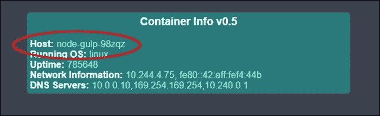
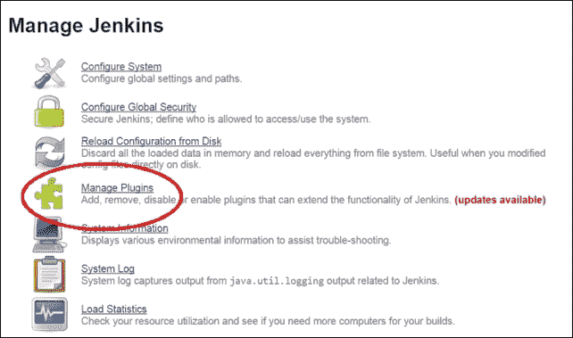
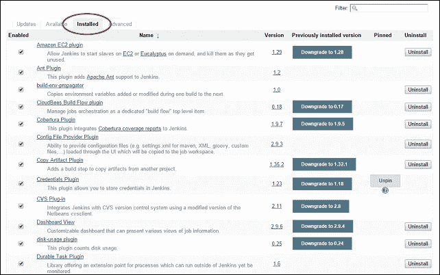
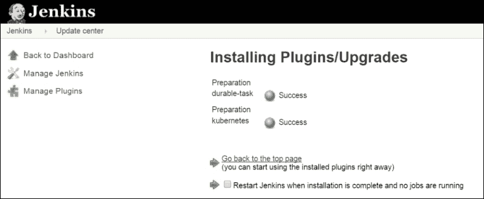
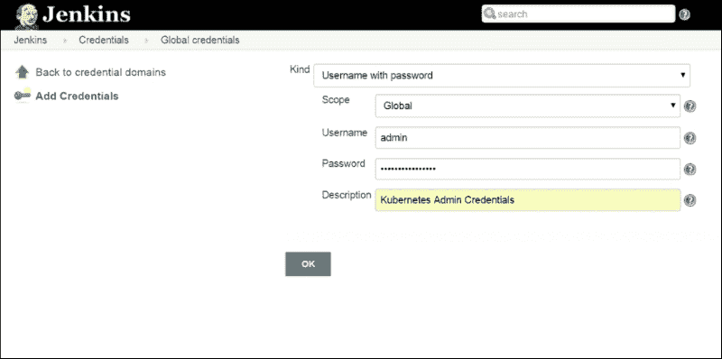
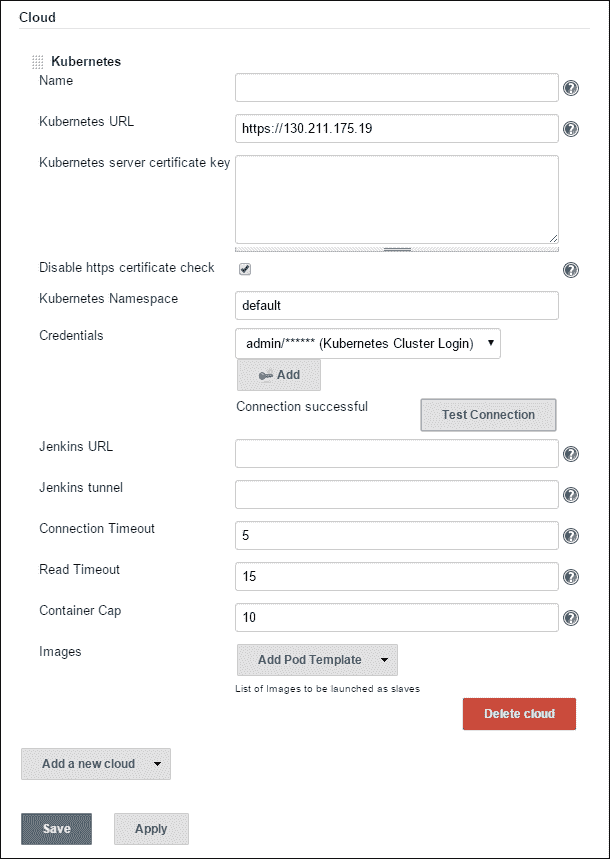
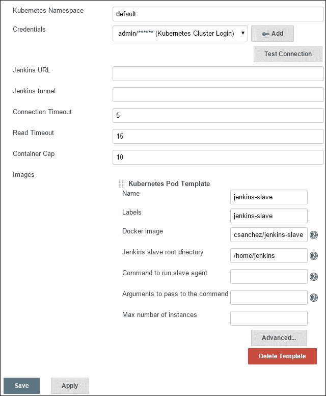

# 五、持续交付

本章将向读者展示如何将其构建管道和部署与 Kubernetes 集集群成。它将涵盖在您的 Kubernetes 集群中使用 glaw . js 和 Jenkins 的概念。

本章将讨论以下主题:

*   与连续部署管道集成
*   对 Kubernetes 使用 Grow . js
*   将詹金斯和 Kubernetes 整合在一起

# 与持续交付的集成

持续集成和交付是现代开发车间的关键组成部分。*上市速度*或*平均收益时间*对于任何正在开发自己软件的公司来说都至关重要。我们将看看 Kubernetes 如何帮助你。

**CI/CD** (简称**持续集成/持续交付**)通常需要临时的构建和测试服务器，以便在将变更推送到代码存储库时可用。Docker 和 Kubernetes 非常适合这个任务，因为它很容易在几秒钟内创建容器，也很容易在构建运行后删除它们。此外，如果您的集群上已经有很大一部分基础设施可用，那么利用空闲容量进行构建和测试是有意义的。

在本章中，我们将探讨在构建和部署软件时使用的两种流行工具。grave . js 是一个简单的任务运行器，用于使用 **JavaScript** 和 **Node.js** 来自动化构建过程。 **Jenkins** 是一款成熟的持续集成服务器。

# 吞咽

**Groove . js**给了我们做*构建为代码*的框架。类似于*基础设施代码*，这允许我们以编程方式定义我们的构建过程。我们将通过一个简短的示例来演示如何从 Docker 映像构建到最终的 Kubernetes 服务创建一个完整的工作流。

## 先决条件

在本节中，您将需要安装并准备好一个**节点 JS** 环境，包括 **节点包管理** ( **npm** )。如果您还没有安装这些软件包，您可以在[https://docs.npmjs.com/getting-started/installing-node](https://docs.npmjs.com/getting-started/installing-node)找到说明。

可以用`node –v`命令检查 NodeJS 是否安装正确。

您还需要 **Docker CLI** 和 **DockerHub** 帐户来推送新映像。您可以在[https://docs.docker.com/installation/](https://docs.docker.com/installation/)找到安装 Docker CLI 的说明。

您可以在[https://hub.docker.com/](https://hub.docker.com/)轻松创建 DockerHub 账户。

获得凭据后，您可以使用`$ docker login`使用命令行界面登录。

## 大口造例

让我们从创建一个名为`node-gulp`的项目目录开始:

```
$ mkdir node-gulp
$ cd node-gulp

```

接下来，我们将安装`gulp`包，并通过运行带有版本标志的`npm`命令来检查它是否准备好，如下所示:

```
$ npm install -g gulp

```

您可能需要打开一个新的终端窗口，以确保`gulp`在您的路径上。另外，确保导航回您的`node-gulp`目录:

```
$ gulp –v

```

接下来，我们将在我们的项目文件夹以及`gulp-git`和`gulp-shell`插件中本地安装大口，如下所示:

```
$ npm install --save-dev gulp
$ npm install gulp-git –save
$ npm install --save-dev gulp-shell

```

最后，我们需要创建一个 Kubernetes 控制器和服务定义文件以及一个`gulpfile.js`来运行我们所有的任务。同样，如果您想复制这些文件，可以在图书文件包中找到它们。参考以下代码:

```
apiVersion: v1
kind: ReplicationController
metadata:
  name: node-gulp
  labels:
    name: node-gulp
spec:
  replicas: 1
  selector:
    name: node-gulp
  template:
    metadata:
      labels:
        name: node-gulp
    spec:
      containers:
      - name: node-gulp
        image: <your username>/node-gulp:latest
        imagePullPolicy: Always
        ports:
        - containerPort: 80
```

*清单 5-1* : `node-gulp-controller.yaml`

如你所见，我们有一个基本的控制器。您需要用您的用户名替换 **`<your username>`** `/node-gulp:latest`:

```
apiVersion: v1
kind: Service
metadata:
  name: node-gulp
  labels:
    name: node-gulp
spec:
  type: LoadBalancer
  ports:
  - name: http
    protocol: TCP
    port: 80
  selector:
    name: node-gulp
```

*清单 5-2* : `node-gulp-service.yaml`

接下来，我们有一个简单的服务，从我们的控制器中选择 POD，并创建一个外部负载平衡器进行访问，如下所示:

```
var gulp = require('gulp');
var git = require('gulp-git');
var shell = require('gulp-shell');

// Clone a remote repo
gulp.task('clone', function(){
  return git.clone('https://github.com/jonbaierCTP/getting- started-with-kubernetes.git', function (err) {
    if (err) throw err;
  });

});

// Update codebase
gulp.task('pull', function(){
  return git.pull('origin', 'master', {cwd: './getting-started- with-kubernetes'}, function (err) {
    if (err) throw err;
  });
});

//Build Docker Image
gulp.task('docker-build', shell.task([
  'docker build -t <your username>/node-gulp ./getting-started- with-kubernetes/ docker-image-source/container-info/',
  'docker push <your username>/node-gulp'
]));

//Run New Pod
gulp.task('create-kube-pod', shell.task([
  'kubectl create -f node-gulp-controller.yaml',
  'kubectl create -f node-gulp-service.yaml'
]));

//Update Pod
gulp.task('update-kube-pod', shell.task([
  'kubectl delete -f node-gulp-controller.yaml',
  'kubectl create -f node-gulp-controller.yaml'
]));
```

*清单 5-3* : `gulpfile.js`

最后，我们有了`gulpfile.js`文件。这是我们定义所有构建任务的地方。再次，在 **`<your username>`** `/node-gulp`部分填写您的用户名。

浏览文件，首先，克隆任务从 GitHub 下载我们的镜像源代码。拉取任务对克隆的存储库执行`git`拉取。接下来，`docker-build`命令从`container-info`子文件夹构建一个映像，并将其推送到 DockerHub。最后，我们有了`create-kube-pod`和`update-kube-pod`的命令。正如您所猜测的那样，`create-kube-pod`命令第一次创建了我们的控制器和服务，而`update-kube-pod`命令只是替换了控制器。

让我们继续运行这些命令，看看我们的端到端工作流。

```
$ gulp clone
$ gulp docker-build

```

第一次通过时可以运行`create-kube-pod`命令如下:

```
$ gulp create-kube-pod

```

这就是全部。如果我们为`node-gulp`服务运行一个快速的`kubectl`描述命令，我们就可以获得新服务的外部 IP。浏览到该 IP，您将看到熟悉的`container-info`应用正在运行。请注意，主机以`node-gulp`开头，就像我们在前面提到的 pod 定义中命名的一样。



图 5.1。大口建设推出的服务

在后续更新中，运行`pull`和`update-kube-pod`，如下所示:

```
$ gulp pull
$ gulp docker-build
$ gulp update-kube-pod

```

这是一个非常简单的示例，但是您可以开始看到，用几行简单的代码就可以轻松地将构建和部署端到端地协调起来。接下来，我们将研究使用 Kubernetes 来使用 Jenkins 实际运行构建。

# 【jenkins 的非压缩插件

我们可以将 Kubernetes 用于 CI/CD 管道的一种方法是在一个容器化的环境中运行我们的 Jenkins 构建奴隶。幸运的是，已经有一个由卡洛斯·桑切斯编写的插件，允许你在 Kubernetes 的 POD 中运行詹金斯奴隶。

## 先决条件

在下一个例子中，您需要一个方便的詹金斯服务器。如果你没有可以使用的，在[https://hub.docker.com/_/jenkins/](https://hub.docker.com/_/jenkins/)有一个 Docker 映像。

从 Docker 命令行界面运行它就像这样简单:

```
docker run --name myjenkins -p 8080:8080 -v /var/jenkins_home jenkins

```

## 安装插件

登录到您的詹金斯服务器，从您的主仪表盘，点击**管理詹金斯**。然后，从列表中选择**管理插件**。



图 5.2。詹金斯主仪表板

凭据插件是必需的，但默认情况下应该安装。如果有疑问，我们可以查看**已安装**标签，如下图所示:



图 5.3。詹金斯安装了插件

接下来，我们可以点击**可用**标签。Kubernetes 插件应该位于**集群管理和分布式构建**或**杂项(云)**下。有很多插件，所以你可以在页面上搜索 Kubernetes。勾选 **Kubernetes 插件**框，点击**安装，无需重启**。

这将安装**Kubernetes 插件**和**持久任务插件**。



图 5.4。插件安装

### 类型

如果你想安装一个非标准版本或者只是想修补，你可以选择下载插件。最新的 **Kubernetes** 和**耐久任务**插件可以在这里找到:

*   kuble 外挂程式:https://wiki . Jenkins-ci . org/display/Jenkins/kubrines+外挂程式
*   耐久任务插件:[https://wiki . JENKINS-ci . org/display/JENKINS/耐久+任务+插件](https://wiki.jenkins-ci.org/display/JENKINS/Durable+Task+Plugin)

接下来，我们可以点击**高级**选项卡上的，向下滚动至**上传插件**。导航至`durable-task.hpi`文件，点击**上传**。您应该会看到一个显示安装进度条的屏幕。一两分钟后更新为**成功**。

最后，安装主 Kubernetes 插件。在左侧，再次点击**管理插件**，然后点击**高级**标签。这次上传`kubernetes.hpi`文件，点击**上传**。几分钟后，安装应该完成。

### 配置 Kubernetes 插件

单击**返回仪表板**或左上角的**詹金斯**链接。在主仪表盘页面，点击**凭证**链接。从列表中选择一个域；在我的例子中，我只是使用了默认的**全局**凭证域。点击**添加凭证**。



图 5.5。添加凭据屏幕

将**种类**留为**用户名加密码****范围**留为**全局**。添加您的 Kubernetes 管理员凭据。请记住，您可以通过运行`config`命令找到这些:

```
$ kubectl config view

```

给它一个合理的描述，点击**确定**。

现在我们保存了我们的凭证，我们可以添加我们的 Kubernetes 服务器了。点击左上角**詹金斯**链接，然后**管理詹金斯**。从那里，选择**配置系统**并一直向下滚动到**云**部分。从**中选择 **Kubernetes** 添加新云**下拉菜单，将出现如下 **Kubernetes** 部分:



图 5.6。新库云设置

你需要以`https://` **`<Master IP>/`** 的形式为你的主人指定网址。

接下来，从下拉列表中选择我们添加的凭证。由于 Kubernetes 默认使用自签名证书，您还需要选中**禁用 https 证书复选框**。

点击**测试连接**，如果一切顺利，按钮旁边会出现**连接成功**。

### 类型

如果您使用的是旧版本的插件，您可能看不到**禁用 https 证书复选框**。如果是这种情况，您需要直接在**詹金斯大师**上安装自签名证书。

最后，我们将通过从**映像**旁边的**添加豆荚模板**下拉菜单中选择**豆荚模板**来添加豆荚模板。

这将创建另一个新部分。将`jenkins-slave`用于**名称**和**标签**部分。将`csanchez/jenkins-slave`用于 **Docker 映像**，将`/home/jenkins`留给 **Jenkins Slave** 根目录。

### 类型

稍后可以在构建设置中使用标签来强制构建使用 Kubernetes 集群。



图 5.7 .库比特模板

点击**保存**和就都设置好了。现在构建可以使用我们刚刚创建的 Kubernetes 容器中的奴隶。

### 注

还有一个关于防火墙的注意事项。詹金斯大师需要你的 Kubernetes 集群中的所有机器都可以到达，因为 POD 可以降落在任何地方。您可以在詹金斯中的**管理詹金斯**和**配置全球安全**下找到您的端口设置。

# 奖励乐趣

**Fabric8** 将标榜为整合平台。它包括各种记录、监控和持续交付工具。它还有一个不错的控制台、一个应用编程接口注册表和一个 3D 游戏，让你可以在你的 POD 上射击。这是一个非常酷的项目，实际上是在 Kubernetes 上运行的。参考[http://fabric8.io/](http://fabric8.io/)。

在 Kubernetes 集群上设置是一个简单的命令，所以参考[http://fabric8.io/guide/getStarted/gke.html](http://fabric8.io/guide/getStarted/gke.html)。

# 总结

我们看了两个可以与 Kubernetes 一起使用的连续集成工具。我们对在集群上部署 Glow . js 任务做了一个简短的演练。我们还研究了一个新的插件，将 Jenkins 构建奴隶集成到你的 Kubernetes 集群。您现在应该对 Kubernetes 如何与您自己的 CI/CD 管道集成有了更好的了解。