# 第六章。监控和记录

本章将介绍内置和第三方监控工具在 Kubernetes 集群上的使用和定制。我们将介绍如何使用这些工具来监控集群的运行状况和性能。此外，我们还将查看内置日志记录、**谷歌云日志记录**服务和 **Sysdig** 。

本章将讨论以下主题:

*   Kuberentes 如何使用 cAdvisor、Heapster、InfluxDB 和 Grafana
*   如何自定义默认的 Grafana 仪表板
*   FluentD 和 Grafana 是如何使用的
*   如何安装和使用日志工具
*   如何使用流行的第三方工具，如 StackDriver 和 Sysdig，来扩展我们的监控功能

# 监控操作

现实世界的监控远不止检查系统是否启动和运行。尽管运行状况检查，就像您在[第 2 章](2.html#KVCC1-22fbdd9ef660435ca6bcc0309f05b1b7 "Chapter 2. Kubernetes – Core Concepts and Constructs")、*库本内斯-核心概念和构造*中学习的那些一样，在*运行状况检查*部分下，可以帮助我们隔离有问题的应用程序。当运营团队能够预测问题并在系统离线前缓解问题时，他们就能最好地为业务服务。

监控的最佳实践是衡量核心资源的性能和使用情况，并观察偏离正常基线的趋势。容器在这里没有什么不同，管理我们的 Kubernetes 集群的一个关键组件是清楚地了解所有节点上的操作系统、网络、系统(CPU 和内存)和存储资源的性能和可用性。

在本章中，我们将研究几个选项来监控和测量所有集群资源的性能和可用性。此外，我们将研究一些在不规则趋势开始出现时发出警报和通知的选项。

# 内置监控

如果您从[第 1 章](1.html#E9OE1-22fbdd9ef660435ca6bcc0309f05b1b7 "Chapter 1. Kubernetes and Container Operations")、 *Kubernetes 和集装箱运营*中回忆，我们注意到我们的节点已经运行了许多监控服务。我们可以通过运行带有如下指定的`kube-system`名称空间的`get pods`命令再次看到这些:

```
$ kubectl get pods --namespace=kube-system

```

下面的截图是前面命令的结果:

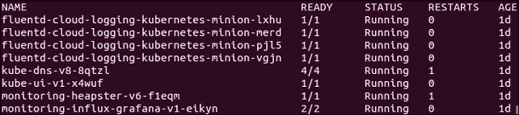

图 6.1。系统窗格列表

同样，我们看到了各种各样的服务，但是这些是如何结合在一起的呢？如果你回想一下[第二章](2.html#KVCC1-22fbdd9ef660435ca6bcc0309f05b1b7 "Chapter 2. Kubernetes – Core Concepts and Constructs")、*库本内斯-核心概念和构造*中的*节点(以前是奴才)*部分，每个节点都运行一个库小程序。kublet 是节点交互和更新 API 服务器的主要接口。一个这样的更新是节点资源的**度量**。资源使用的实际报告是由一个名为 cAdvisor 的程序执行的。

**cAdvisor** 是另一个来自谷歌的开源项目，提供关于容器资源使用的各种指标。指标包括中央处理器、内存和网络统计数据。没有必要告诉 cAdvisor 关于单个容器的信息；它收集一个节点上所有容器的度量，并将其报告给 kublet，kub let 再向 Heapster 报告。

### 注

**谷歌的开源项目**

谷歌有各种与 Kubernetes 相关的开源项目。检查它们，使用它们，甚至贡献你自己的代码！

cAdvisor 和 Heapster 在下一节中提到:

*   **蒸发器**:[https://github . com/Google/cadvisor](https://github.com/google/cadvisor)
*   **:[【https://github . com/kubrites/heaps】](https://github.com/kubernetes/heapster)**

 ****Contrib** 是一个包罗万象的，包含各种不属于核心库本内特的组件。在[https://github.com/kubernetes/contrib](https://github.com/kubernetes/contrib)找到。

**LevelDB** 是一个密钥存储库，用于创建 InfluxDB。在[https://github.com/google/leveldb](https://github.com/google/leveldb)找到的。

**Heapster** 还是另一个来自谷歌的开源项目；你可能开始看到一个主题出现在这里(见前面的信息框)。Heapster 在一个 minion 节点上的容器中运行，并从 kublet 中聚合数据。提供了一个简单的 REST 接口来查询数据。

当使用 GCE 设置时，为我们设置了一些额外的包，这为我们节省了时间，并为我们提供了一个完整的包来监控我们的容器工作负载。从图 6.1 中我们可以看到，标题中还有另一个带有`influx-grafana`的 pod。

**InfluxDB** 是在其官网描述如下 <sup class="calibre14">1</sup> :

> *无外部依赖的开源分布式时间序列数据库。*

它基于一个关键的商店包(参见之前的*谷歌开源项目*信息框)，非常适合存储和查询事件或基于时间的统计数据，例如 Heapster 提供的统计数据。

最后，我们有 **Grafana** ，它为存储在 InfluxDB 中的数据提供了一个仪表板和图形界面。使用 Grafana，用户可以创建一个定制的监控仪表板，并立即了解其 Kubernetes 集群的运行状况，从而了解其整个容器基础架构。

## 探索堆

让我们快速通过 SSH 到带有 Heapster pod 的节点来查看REST 接口。首先，我们可以列出吊舱来找到运行 Heapster 的吊舱，如下所示:

```
$ kubectl get pods --namespace=kube-system

```

吊舱的名称应以`monitoring-heapster`开头。运行`describe`命令，查看它在哪个节点上运行，如下所示:

```
$ kubectl describe pods/<Heapster monitoring Pod> --namespace=kube-system

```

从下图(图 6.2)的输出中，我们可以看到吊舱正在`kubernetes-minion-merd`中运行。还要注意吊舱的 IP，往下几行，因为我们马上就需要它。

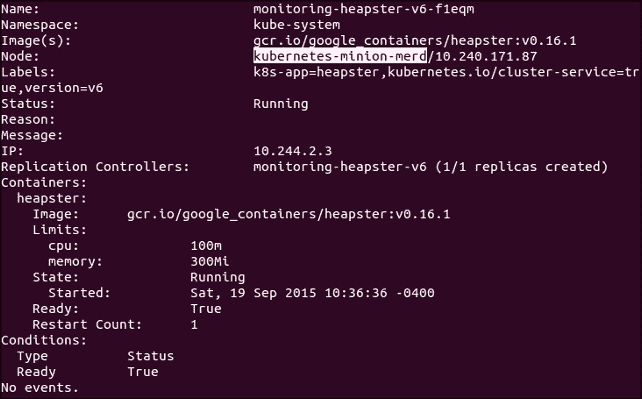

图 6.2。Heapster 吊舱详细信息

接下来，我们可以用熟悉的`gcloud ssh`命令 SSH 到这个框，如下所示:

```
$ gcloud compute --project "<Your project ID>" ssh --zone "<your gce zone>" "<kubernetes minion from describe>"

```

从这里，我们可以直接使用 pod 的 IP 地址访问`Heapster` REST API。请记住，pod IPs 不仅在容器中是可路由的，而且在节点本身也是可路由的。`Heapster`应用编程接口正在监听`8082`端口，我们可以在`/api/v1/metric-export-schema/`获得完整的指标列表。

现在让我们通过向我们从`describe`命令中保存的 pod IP 地址发出`curl`命令来查看列表，如下所示:

```
$ curl -G <Heapster IP from describe>:8082/api/v1/metric-export-schema/

```

我们将看到一个相当长的列表。第一部分显示了所有可用的指标。最后两个部分列出了我们可以过滤和分组的字段。为了您的方便，我添加了以下表格，这些表格更容易阅读:

<colgroup class="calibre18"><col class="calibre19"> <col class="calibre19"> <col class="calibre19"> <col class="calibre19"></colgroup> 
| 

公制的

 | 

描述

 | 

单位

 | 

类型

 |
| --- | --- | --- | --- |
| 正常运行时间 | 容器启动后的毫秒数 | 女士 | 累积的 |
| CPU/使用率 | 所有内核的累计 CPU 使用量 | 纳秒 | 累积的 |
| CPU/极限 | 以毫核心为单位的中央处理器限制 | - | 测量 |
| 内存/使用情况 | 总内存使用量 | 字节 | 测量 |
| 内存/工作集 | 工作集总使用量。工作集是正在使用的内存，不容易被内核丢弃 | 字节 | 测量 |
| 记忆/极限 | 存储容量极限 | 字节 | 测量 |
| 内存/页面 _ 故障 | 页面错误的数量 | - | 累积的 |
| 内存/主要页面故障 | 主要页面错误的数量 | - | 累积的 |
| 网络/rx | 通过网络接收的累计字节数 | 字节 | 累积的 |
| 网络/rx _ 错误 | 通过网络接收时的累计错误数 | - | 累积的 |
| 网络 | 通过网络发送的累积字节数 | 字节 | 累积的 |
| 网络/tx _ 错误 | 通过网络发送时的累积错误数 | - | 累积的 |
| 文件系统/使用 | 文件系统上消耗的总字节数 | 字节 | 测量 |
| 文件系统/限制 | 文件系统的总大小，以字节为单位 | 字节 | 测量 |

> *表 6.1。可用堆指标*

<colgroup class="calibre18"><col class="calibre19"> <col class="calibre19"> <col class="calibre19"></colgroup> 
| 

田

 | 

描述

 | 

标签类型

 |
| --- | --- | --- |
| `hostname` | 容器运行的主机名 | 普通的 |
| `host_id` | 特定于主机的标识符，由云提供商或用户设置 | 普通的 |
| `container_name` | 用户提供的容器名称或系统容器的完整容器名称 | 普通的 |
| `pod_name` | 吊舱的名称 | 豆荚 |
| `pod_id` | 吊舱的唯一标识 | 豆荚 |
| `pod_namespace` | pod 的命名空间 | 豆荚 |
| `namespace_id` | 容器命名空间的唯一标识 | 豆荚 |
| `labels` | 用户提供的标签的逗号分隔列表 | 豆荚 |

> *表 6.2。可用 Heapster 字段*

## 定制我们的仪表盘

既然我们有了田地，我们就可以玩得开心了。回想一下我们在[第 1 章](1.html#E9OE1-22fbdd9ef660435ca6bcc0309f05b1b7 "Chapter 1. Kubernetes and Container Operations")、*库本内斯和*中看到的格拉夫纳页面。让我们通过查看集群的监控网址来再次了解这一点。请注意，您可能需要使用集群凭据登录。请参考以下您需要使用的链接格式:

`https://` **`<your master IP>`** `/api/v1/proxy/namespaces/kube-system/services/monitoring-grafana`

我们将看到默认的 Kubernetes 仪表板，现在我们可以将自己的统计数据添加到板上。一直滚动到底部，点击**添加一行**。这将为新行创建一个空间，并在屏幕左侧显示一个绿色标签。

让我们从为每个节点(迷你)的文件系统使用添加一个视图开始。点击*绿色*选项卡展开，然后选择**添加面板**，然后选择**图形**。屏幕上应该会出现一个空图形。如果我们点击**图形**，其中显示**无标题(点击此处)**，将出现一个上下文菜单。然后我们可以点击**编辑**，我们将能够为我们的定制仪表板面板设置查询。

**系列**盒子允许我们使用前面表格中看到的任何 Heapster 指标。在**系列**框中，输入`filesystem/usage_bytes_gauge`并选择**最大(值)**。然后，在加号旁边标有列的方框中，按时间和**主机名**输入**组的`5s`，如下图截图所示:**

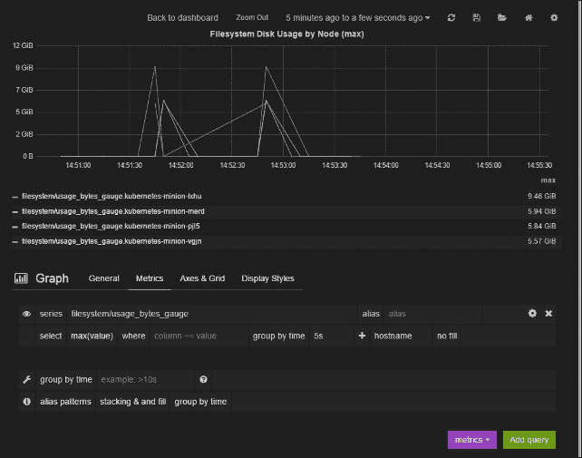

图 6.3。Heapster 吊舱详细信息

接下来，我们点击**轴&网格**选项卡上的，可以设置单位和图例。在**左 Y 轴**下，将**格式**设置为**字节**，将**标签**设置为**已用磁盘空间**。在**右 Y 轴**下，将**格式**设置为**无**。接下来，在**图例**样式下，确保勾选**显示值，并表**。应该会出现一个**图例值**部分，我们可以在这里勾选 **Max** 的方框。

现在，让我们快速进入**通用**选项卡，选择一个标题。就我而言，我把我的命名为`Filesystem Disk Usage by Node (max)`。

我们不想丢失我们创建的这个漂亮的新图表，所以让我们点击右上角的保存图标。它看起来像一张*软盘*(如果你不知道那些是什么，你可以做一个谷歌图片搜索)。

点击保存图标后，会出现一个包含多个选项的下拉列表。第一项应该有默认的仪表盘标题，就是 **Kubernetes 集群！**在撰写本文时。此外，单击右侧的保存图标。

它应该会带我们回到主仪表板，在那里我们会在底部看到我们的新图表。让我们向该行添加另一个面板。再次使用*绿色*选项卡，然后选择**添加面板**和**单个状态**。再次出现一个空面板，我们可以点击它显示**无标题(点击此处)**为上下文菜单，然后点击**编辑**。

假设，我们想要监视特定节点并监控内存使用情况。我们可以通过在查询中设置 where 子句轻松做到这一点。首先选择**网络/rx _ bytes _ 累计**为**系列**，**平均值(值)**为**选择**。然后，我们可以通过时间到`5s`用`hostname=kubernetes-minion-35ao`和**组在`where`子句中指定主机名。(如果要跟随，请使用您自己的主机名)。**

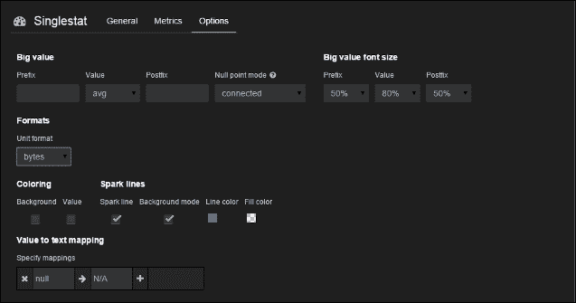

图 6.4。Singlestat 选项

在**选项**选项卡下，确保**单位格式**设置为**字节**，并检查**火花线**下的**火花线**框。**迷你图**为我们提供了该值最近变化的快速历史视图。我们可以使用**背景**模式占据整个背景；默认情况下，它使用值下方的区域。

### 类型

在**着色**下，我们可以选择勾选**值**框。将出现**阈值**和**颜色**部分。这将允许我们根据指定的阈值级别为该值选择不同的颜色。请注意，阈值必须使用该数字的无格式版本。

现在，让我们回到**常规**选项卡，选择一个标题为**网络字节接收(节点 35ao)** 。让我们再次保存我们的工作并返回仪表板。我们现在应该有一行如下图所示(图 6.5):

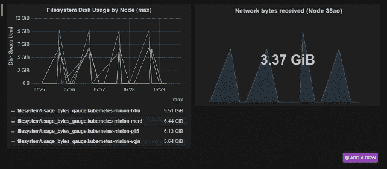

图 6.5。自定义仪表板面板

第三种我们没有涉及的面板是**文本**。它非常简单，允许我们使用 HTML、标记或纯文本在仪表板上放置一段文本。

正如我们所看到的，构建一个定制的仪表板并一目了然地监控集群的运行状况是非常容易的。

# FluentD 和谷歌云日志

回头看图 6.1，你可能已经注意到了一些以**fluentd-cloud-logging-kubernetes**开头的豆荚。当您为 K8s 集群使用 GCE 提供程序时，会出现这些面板。像这样的 pod 存在于我们集群中的每个节点上，它的唯一目的是处理 Kubernetes 日志。

如果我们登录我们的谷歌云平台帐户，我们可以看到一些在那里处理的日志。只需导航到我们的项目页面，在左侧的**监控**下，点击**日志**。(如果使用测试版控制台，将在**操作**下，然后**登录**。)这将把我们带到一个顶部有许多下拉菜单的日志列表页面。如果这是您第一次访问该页面，您应该会看到一个日志选择下拉列表，其值为**所有日志**。

在这个下拉列表中，我们会看到一些与 Kubernetes 相关的条目，包括**Kubernetes**和一些标签开头带有 **kubernetes** 的条目。我们还可以按日期过滤，并使用*播放*按钮在直播中观看事件流。

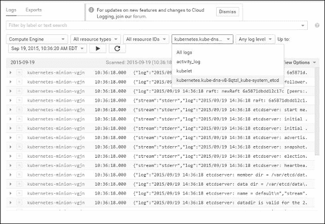

图 6.6。谷歌云日志过滤器

## 流利度

现在我们知道`fluentd-cloud-logging-kubernetes`吊舱正在向谷歌云发送数据，但是为什么我们需要 FluentD 呢？简单来说， **FluentD** 是个收藏家。它可以配置为有多个来源来收集和标记日志，然后将日志发送到各个输出点进行分析、警报或归档。我们甚至可以在数据被传递到目的地之前使用插件进行转换。

并非所有提供商设置都默认安装了 FluentD，但它是为我们未来的监控操作提供更大灵活性的推荐方法之一。AWS Kubernetes 设置也使用 FluentD，但是将事件转发到**弹性搜索**。

### 注

**探索流体**

如果您对 FluentD 设置的内部工作方式感到好奇，或者只是想自定义日志收集，我们可以使用`kubectl exec`命令轻松探索。

首先，我们看看能否找到 FluentD `config`文件:

```
$ kubectl exec fluentd-cloud-logging-kubernetes-minion-35ao --namespace=kube-system -- ls /etc

```

通常，我们会在`etc`文件夹中寻找`ta-agent`或`fluent`子文件夹。但是，如果我们运行一个`ls`命令，我们会看到没有`ta-agent`或`fluent`子文件夹，但是有一个`google-fluentd`子文件夹:

```
$ kubectl exec fluentd-cloud-logging-kubernetes-minion-35ao --namespace=kube-system -- ls /etc/google-fluentd/

```

在这个目录中搜索时，我们应该会看到一个`google-fluentd.conf`文件。我们可以用简单的`cat`命令查看该文件，如下所示:

```
$ kubectl exec fluentd-cloud-logging-kubernetes-minion-35ao --namespace=kube-system -- cat /etc/google-fluentd/google-fluentd.conf

```

我们应该看到许多来源，包括`kublet`、`containers`、`etcd`和各种其他库本内特组件。

请注意，虽然我们可以在这里进行更改，但请记住，这是一个正在运行的容器，如果 pod 死亡或重新启动，我们的更改将不会被保存。如果我们真的想要定制，最好使用这个容器作为基础，并构建一个新的容器，我们可以将其推送到存储库供以后使用。

# 完善我们的监控操作

虽然 Grafana 给了我们一个很好的开始来监控我们的集装箱操作，但它仍然是一项正在进行的工作。在现实的操作世界中，一旦我们知道有问题，拥有一个完整的仪表板视图是很棒的。然而，在日常场景中，我们更喜欢主动出击，并在出现问题时收到通知。这种警报能力是保持运营团队领先于形势并摆脱*反应模式*的必要条件。

这个领域有很多解决方案，我们将特别关注两个:GCE 监控(StackDriver)和 Sysdig。

## GCE (StackDriver)

**StackDriver** 是公共云中基础设施的绝佳起点。它实际上归谷歌所有，所以它被集成为谷歌云平台监控服务。在你的锁定警钟开始响起之前，StackDriver 也与 AWS 进行了稳固的整合。此外，StackDriver 还具有警报功能，支持向各种平台发出通知，并支持任何其他功能的网络挂钩。

### 注册 GCE 监控

在 GCE 控制台的**监控**部分的下，有一个**仪表盘&提醒**链接(或者只是测试版控制台的**操作**下的**监控**链接)。这将打开一个新窗口，我们可以在其中启用监控功能(在撰写本文时仍处于测试阶段)。一旦启用，我们将进入一个屏幕，其中有每个操作系统的安装说明(这将在测试控制台的**设置和监控端点**下)。它还会显示您的 API 密钥，这是安装所必需的。

### 类型

如果你想在 AWS 中做类似的事情，你可以简单地在 StackDriver 的主网站注册账号:

[https://www.stackdriver.com/](https://www.stackdriver.com/)

更常见安装的安装说明可在[http://support . stack driver . com/customer/en/portal/articles/1491726-什么是 stackdriver-agent](http://support.stackdriver.com/customer/en/portal/articles/1491726-what-is-the-stackdriver-agent) 上找到。

我们可以在**账户设置**和 **API 密钥**下找到我们的 API 密钥。

点击**进入监控**继续。我们将进入主仪表板页面，在那里我们将看到集群中节点的一些基本统计数据。如果我们先进入**基础设施**，然后进入**实例**，我们将进入列出所有节点的页面。通过单击单个节点，即使没有安装代理，我们也可以再次看到一些基本信息。

### 配置详细监控

正如我们已经看到的，简单地启用监控将为我们在 GCE 中的所有机器提供基本的统计数据，但是如果我们想要获得详细的结果，我们将需要每个节点上的代理。让我们走一遍安装。

和以前一样，我们想使用`gcloud compute ssh`命令在我们的一个迷你节点上获取一个外壳。然后，我们可以下载并安装代理。如果您需要您的应用编程接口密钥，可以点击右上角的用户图标，进入**账户设置**，然后在下一页，点击左侧菜单中的**应用编程接口密钥**:

```
$ curl -O https://repo.stackdriver.com/stack-install.sh
$ sudo bash stack-install.sh --api-key=<API-KEY>

```

如果一切顺利，我们应该安装并准备好代理。我们可以通过运行`info`命令来检查这一点，如下所示:

```
$ /opt/stackdriver/stack-config info

```

我们应该会在屏幕上看到很多 JSON 形式的信息。完成后，在返回**基础设施**和**实例**之前，给代理几分钟时间。

在概要实例页面上，我们会注意到所有的 GCE 实例都显示了 CPU 的使用情况。但是，只有安装了代理的实例才会显示**内存使用情况**统计数据。

单击安装了代理的节点，这样我们可以进一步检查它。如果我们单击每一个并查看详细信息页面，我们应该注意到安装了代理的实例有更多的信息。尽管所有实例都报告了 CPU 使用情况、磁盘输入/输出和网络流量，但具有代理的实例要多得多。

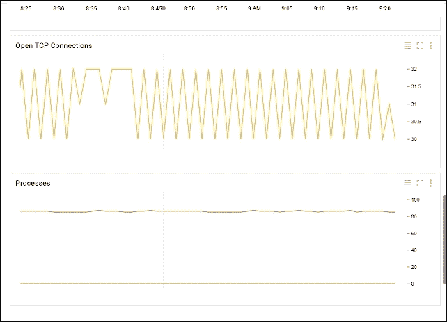

图 6.7。安装了代理的谷歌云监控

在图 6.7 中，我们可以看到各种额外的图表，包括开放的 TCP 连接和进程以及 CPU 窃取(未显示)。我们还可以更好地了解机器细节，如网络接口、文件系统和操作系统信息。

现在我们看到了有多少信息可用，我们可以在剩余的实例上安装代理。您可能还希望在主服务器上安装一个代理，因为它是 Kubernetes 基础结构的关键部分。

### 警报

接下来，我们可以查看作为监控服务一部分的可用警报策略。在实例详细信息页面，单击页面顶部**事件**部分的**创建警报策略**按钮。

我们将策略命名为`Excessive CPU Load`并设置一个度量阈值。在该部分下的**度量阈值**区域，点击**下一步**，然后在**目标**部分，将**资源类型**设置为**实例**。然后，将**适用于**设置为**组**和**组**。如果设置为**任何成员违反**，则保留**条件触发。**

点击**下一步**，将 **IF METRIC** 保留为 **CPU(代理)**，将 **CONDITION** 保留为上方的**。现在将**阈值(百分比)**设置为`80`，并将**下的时间保留为**至 **5 分钟**。点击**保存条件**。**

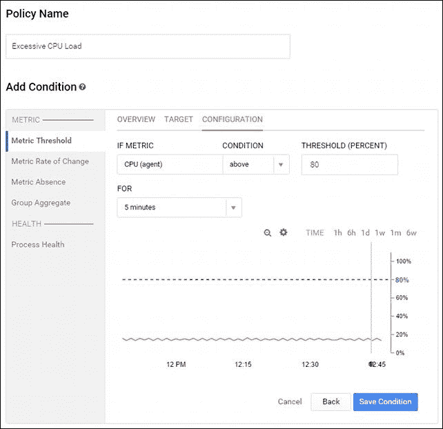

图 6.8。谷歌云监控警报政策

最后，我们将添加一个通知。在该部分下，将**方法**留为**邮件**，点击**添加通知**。输入您的电子邮件地址，然后点击**保存政策**。

现在，每当我们某个实例的中央处理器超过 80%时，我们都会收到一封电子邮件通知。如果我们需要查看我们的政策，我们可以在屏幕顶部菜单的**警报**下拉菜单和**政策概述**下找到它们。

## 通过 Sysdig 超越系统监控

监控我们的云系统是一个很好的开始，但是容器本身的可见性呢？虽然有各种各样的云监控和可见性工具，但 Sysdig 的突出之处在于它不仅能够深入系统操作，还能深入容器。

Sysdig 是开源的，被宣传为*一个通用的系统可见性工具，支持容器* *<sup class="calibre14">2</sup>* 。这是一个命令行工具，它提供了对我们前面已经讨论过的领域的洞察，例如存储、网络和系统进程。它的与众不同之处在于它为这些过程和系统活动提供的详细程度和可见性。此外，它具有对容器的本地支持，这使我们能够全面了解我们的容器操作。这是一个非常推荐给你的集装箱操作兵工厂的工具。他们的主要网站是[http://www.sysdig.org/](http://www.sysdig.org/)。

### 系统云

我们稍后将看一下系统挖掘工具和一些有用的基于命令行的用户界面。然而，Sysdig 的团队还构建了一个商业产品，名为 **Sysdig Cloud** ，它提供了我们在本章前面讨论的高级仪表板、警报和通知服务。此外，这里的不同之处在于对容器的高度可见性，包括我们的应用程序拓扑的一些很好的可视化。

### 注

如果你想跳过 *Sysdig Cloud* 部分，直接尝试命令行工具，只需跳到本章后面的 *Sysdig 命令行*部分。

如果您尚未注册，请在[http://www.sysdigcloud.com](http://www.sysdigcloud.com)注册 Sysdig Cloud。

第一次激活并登录后，我们将进入欢迎页面。点击**下一步**，我们看到一个页面，有各种选项可以安装`sysdig`代理。对于我们的示例环境，我们将使用一个 Linux 代理。**下一步**按钮将被禁用，直到我们安装至少一个代理。该页面应显示以下命令，并填写我们的*访问键*。

```
curl -s https://s3.amazonaws.com/download.draios.com/stable/install-agent | sudo bash -s -- --access_key <Your Access Key>

```

我们需要将SSH 到我们的主节点和每个节点上来运行安装程序。安装几个软件包，然后建立到 Sysdig 云的连接需要几分钟的时间。

我们的第一次安装完成后，页面应该会更新文本**您已经连接了一个代理！**和**下一步**按钮将激活。继续安装其余的代理，然后回到这个页面，点击**下一步**。

我们现在可以跳过 AWS 设置，然后在最终屏幕上点击**让我们开始**。

我们将被带到主**系统挖掘云**仪表板屏幕。 **kubernetes-master** 和我们的各种宠臣节点应该出现在 **Explore** 选项卡下。我们应该会看到类似于图 6.9 的内容，包括我们的集群主节点和所有四个迷你节点(或者已经安装了代理的节点)。

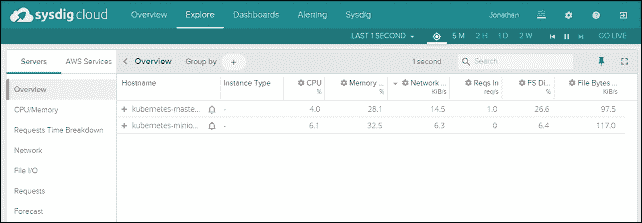

图 6.9。系统挖掘云探索页面

这个页面向我们展示了一个表格视图，左边的链接让我们探索 CPU、内存、网络等的一些关键指标。虽然这是一个很好的开始，但是详细的视图会让我们对每个节点有更深入的了解。

#### 详细视图

让我们来看看这些观点。选择 **kubernetes-master** ，然后向下滚动到下面出现的详细信息部分。默认情况下，我们应该看到**系统:按流程概览**视图(如果没有选中，只需在左侧列表中点击即可。)如果图表难以阅读，只需使用每个图表左上角的最大化图标即可获得更大的视图。

有各种有趣的观点可以探索。就叫出几个其他的，**应用:HTTP****系统:容器概述**给我们一些很棒的图表检查。在后面的视图中，我们可以按容器查看 CPU、内存、网络和文件使用情况的统计数据。

#### 拓扑视图

另外底部还有三个拓扑视图。这些视图非常适合帮助我们理解应用程序的通信方式。点击**拓扑:网络流量**，等待几秒钟，让视图完全填充。它应该类似于图 6.10:

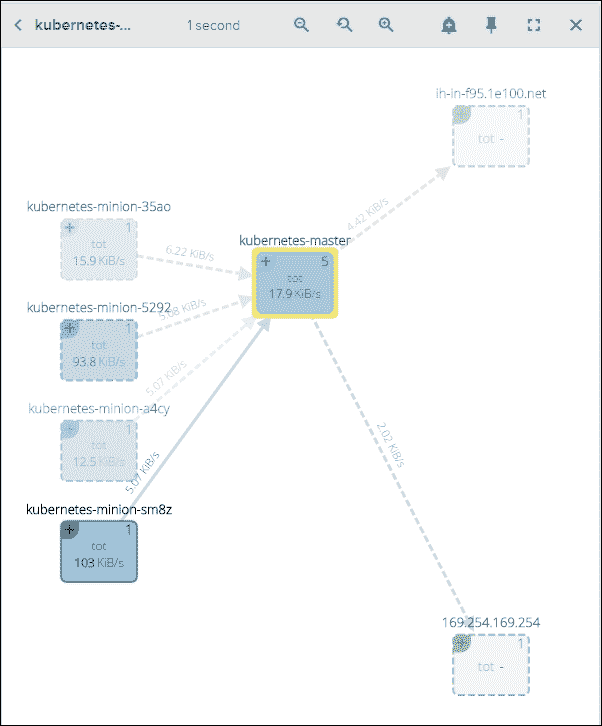

图 6.10。Sysdig 云网络拓扑视图

我们注意到该视图显示了集群中迷你节点和主节点之间的通信流。在右侧，可能会连接到名为**1e100.net**的服务器以及 **169.254.169.254** 的服务器，这两个服务器都是谷歌基础设施的一部分。

您也可以在节点框的右上角标注一个 **+** 符号。点击**中的【库本内斯-大师】**，使用视图区域顶部的缩放工具放大细节，如图 6.11 所示:


图 6.11。系统挖掘云网络拓扑详细视图

请注意，我们现在可以看到 Kubernetes 的所有组件在主服务器中运行。我们可以看到各种组件是如何协同工作的。我们将看到 **kubectl** 和 **kublet** 进程正在运行，以及许多带有 Docker whale 的盒子，这表明它们是容器。如果我们放大并使用加号图标，我们将看到这些是核心 Kubernetes 流程的容器，就像我们在[第 1 章](1.html#E9OE1-22fbdd9ef660435ca6bcc0309f05b1b7 "Chapter 1. Kubernetes and Container Operations")、 *Kubernetes 和容器操作*的主部分中看到的那样。

此外，如果我们将平移到仆从上，我们还可以看到**库布里特**，它启动通信，并一直跟随它通过主人中的`kube-apiserver`容器。

我们甚至可以在 **169.254.169.254** 上看到对 GCE 元数据的实例探测。这个视图非常好，可以让我们对我们的基础设施和底层容器之间的对话有一个清晰的了解。

#### 指标

接下来，让我们切换到左侧菜单中**视图**旁边的**指标**选项卡。在这里，也有各种有益的看法。

让我们看看**系统**下的**容量、估计、请求、总计、计数(平均值)**。这个视图向我们显示了一个节点在完全加载时能够处理多少请求的估计。这对基础设施规划非常有用。

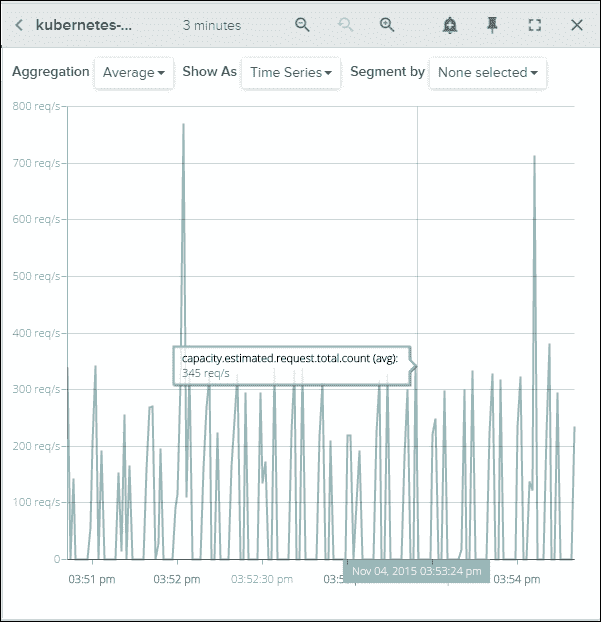

图 6.12。系统挖掘云容量估计视图

### 警报

现在我们都有了这个很棒的信息，让我们创建一些通知。向上滚动到页面顶部，找到您的一个宠臣条目旁边的铃声图标。这将打开一个**新警报**对话框。在这里，我们可以设置类似于本章前面所做的手动警报。但是，也可以选择使用**基线**和**主机比较**。

使用**基线**选项非常有帮助，因为 Sysdig 将观察节点的历史模式，并在任何时候某个度量偏离预期度量阈值时提醒我们。不需要手动设置，因此这可以真正节省通知设置的时间，并帮助我们的运营团队在问题出现之前采取主动。请参考下图:

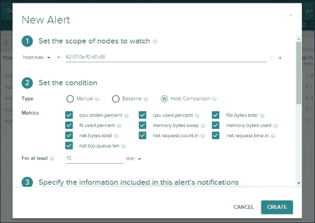

图 6.13。系统挖掘云新警报

**主机比较**选项也是一个很大的帮助，因为它允许我们与其他主机比较指标，并在一台主机的指标与该组有很大差异时发出警报。这方面的一个很好的用例是跨迷你节点监控资源使用情况，以确保我们的调度约束不会在集群中的某个地方造成瓶颈。

您可以选择您喜欢的选项，给它一个名称和描述，并选择一种通知方法。Sysdig 支持电子邮件、 **SNS** (简称**简易通知服务**)和**寻呼机值班**作为通知方式。一旦你设置好了一切，只需点击**上的创建**，当问题出现时，你将开始收到提醒。

### 立方支撑

最近发布的一个令人兴奋的新特性是支持直接与 Kubernetes API 集成。代理对 K8s 进行调用，以便它知道元数据和各种构造，如 pods 和 RCs。

我们可以通过单击顶部栏上“显示”一词旁边的齿轮图标，在主仪表板上轻松查看这一点。我们应该会看到一些过滤器选项，如下图所示(图 6.14)。点击**逻辑应用层次结构-库本内斯**旁边的**应用**按钮。这将设置许多过滤器，按照名称空间、RC、pods 和最后容器 ID 的顺序组织我们的列表。

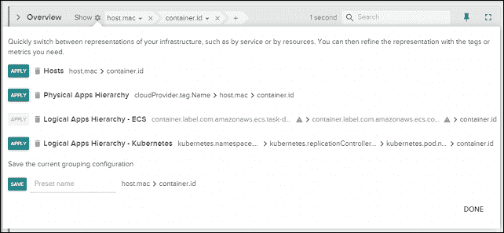

图 6.14。Sysdig 云立方体滤波器

然后，我们可以从列表中选择一个默认的名称空间，并在以后使用细节视图，就像我们之前做的那样。通过选择**拓扑:网络流量**视图，我们可以深入到名称空间中，并获得每个 RC 和运行在其中的吊舱的视图(见图 6.15):

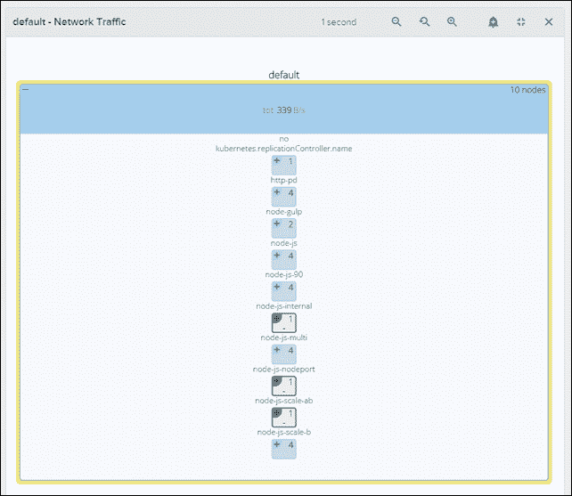

图 6.15。Sysdig 云 Kubernetes 感知拓扑视图

### Sysdig 命令行

无论您是仅使用开源工具还是尝试完整的系统挖掘云包，命令行实用程序都是追踪问题或更深入了解您的系统的绝佳伴侣。

在核心工具中，有主`sysdig`实用程序，还有一个名为`csysdig`的命令行风格的 UI。让我们来看看一些有用的命令。

我们需要 SSH 到主节点或我们安装 Sysdig 云代理的其中一个迷你节点。安装命令行界面工具只需一个命令，如下所示:

```
$ curl -s https://s3.amazonaws.com/download.draios.com/stable/install-sysdig | sudo bash

```

### 注

您可以在[http://www.sysdig.org/install/](http://www.sysdig.org/install/)找到其他操作系统的说明。

首先，我们可以通过发出以下命令来查看网络活动最多的进程:

```
$ sudo sysdig -pc -c topprocs_net

```

下面的截图是前面命令的结果:

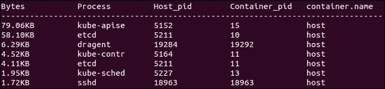

图 6.16。按网络活动划分的系统顶层进程

这是一个交互式视图，将向我们展示网络活动方面的顶级流程。此外，还有太多的命令可用于`sysdig`。其他几个有用的命令包括:

```
$ sudo sysdig -pc -c topprocs_cpu
$ sudo sysdig -pc -c topprocs_file
$ sudo sysdig -pc -c topprocs_cpu container.name=<Container Name NOT ID>

```

### 注

更多的例子可以在[http://www.sysdig.org/wiki/sysdig-examples/](http://www.sysdig.org/wiki/sysdig-examples/)找到。

### csysdig 命令行界面

因为我们在一个节点上的外壳中，并不意味着我们不能有用户界面。Csysdig 是一个可定制的用户界面，用于探索 sysdig 提供的所有指标和洞察力。只需在提示符下键入`csysdig`:

```
$ csysdig

```

进入 csysdig 后，我们看到机器上所有进程的实时列表。在屏幕底部，您会注意到一个包含各种选项的菜单。如果您喜欢使用键盘，请点击**视图**或 *F2* 。在左边的菜单上，有各种各样的选项，但是我们将看线程。双击选择**螺纹**。

我们可以看到系统上当前运行的所有线程以及一些关于资源使用的信息。默认情况下，我们会看到一个经常更新的大列表。如果我们点击**过滤**、 *F4* 为鼠标发难，我们可以缩小列表。

如果您在主节点上，请键入`kube-apiserver`，如果您在(迷你)节点上，请在过滤框中键入`kube-proxy`，然后按回车键。视图现在只过滤该命令中的线程。

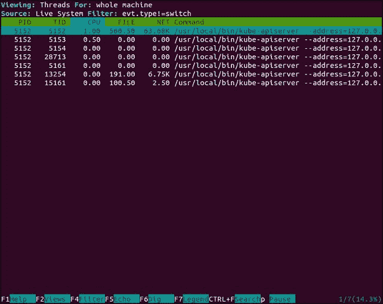

图 6.17。Csysdig 线程

如果我们想进一步检查，我们可以简单地选择列表中的一个线程，然后点击**挖**或 *F6* 。现在，我们可以实时看到来自该命令的系统调用的详细列表。这是一个非常有用的工具，可以深入了解我们集群上运行的容器和处理。

按**返回**或*退格*键返回上一屏幕。然后，再次转到**视图**。这一次，我们将看看**容器**视图。同样，我们可以过滤并使用**挖掘**视图来更深入地了解系统调用级别发生的事情。

您可能会注意到的另一个菜单项是**动作**，它在最新版本中可用。这些特性允许我们从过程监控到行动和响应。它使我们能够从 csysdig 中的各种流程视图中执行各种操作。例如，容器视图具有放入 bash shell、杀死容器、检查日志等操作。值得了解各种操作和热键，甚至为常见操作添加自己的自定义热键。

# 总结

我们用 Kubernetes 快速查看了监控和日志记录。您现在应该熟悉 Kubernetes 如何使用 cAdvisor 和 Heapster 来收集给定集群中所有资源的指标。此外，我们还看到了 Kubernetes 如何通过提供开箱即用的 InfluxDB 和 Grafana 设置和配置来节省我们的时间。仪表板可根据我们的日常运营需求轻松定制。

此外，我们还研究了 FluentD 和谷歌云日志服务的内置日志功能。此外，Kubernetes 通过为我们设置基础知识为我们节省了大量时间。

最后，您了解了可用于监控我们的容器和集群的各种第三方选项。使用这些工具将使我们能够更深入地了解应用程序的运行状况和状态。所有这些工具结合在一起，为我们管理日常运营提供了一个坚实的工具集。

## 脚注

<sup class="calibre14">1</sup>T2http://stackdriver.com/

<sup class="calibre14">2</sup>T2http://www.sysdig.org/wiki/**