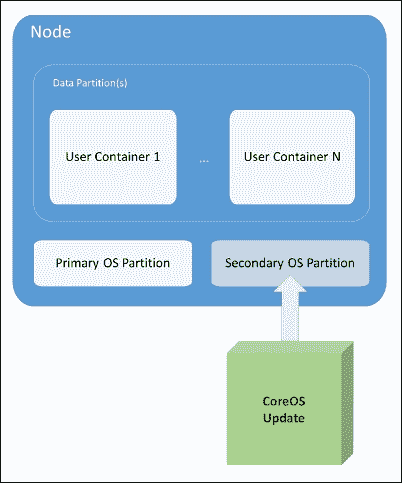
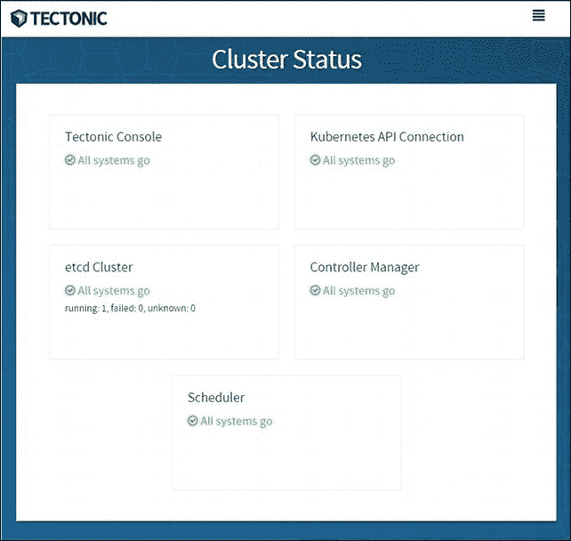
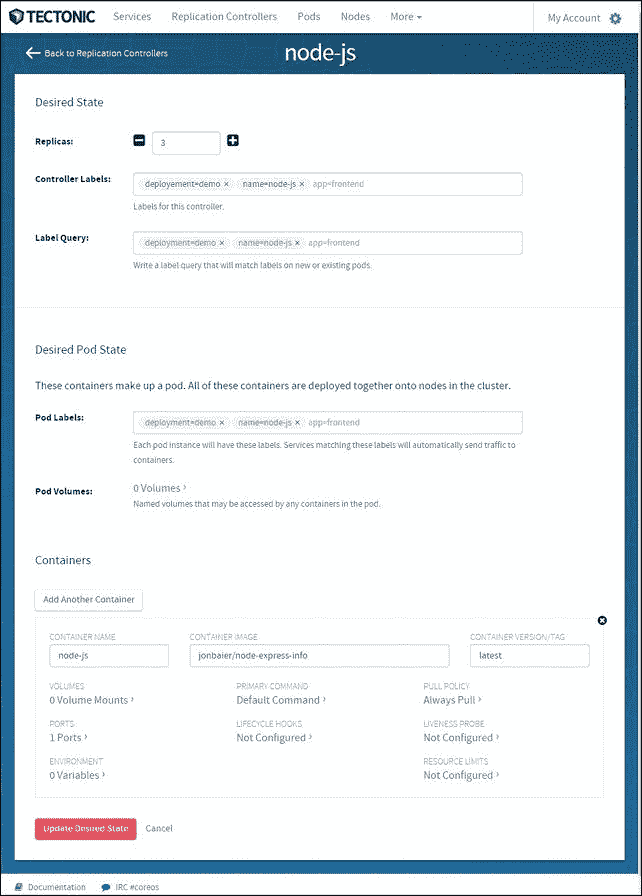
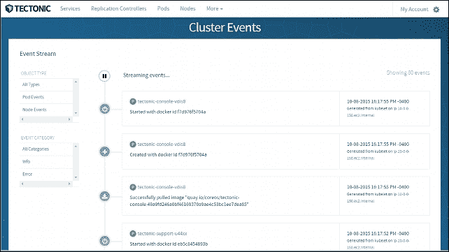
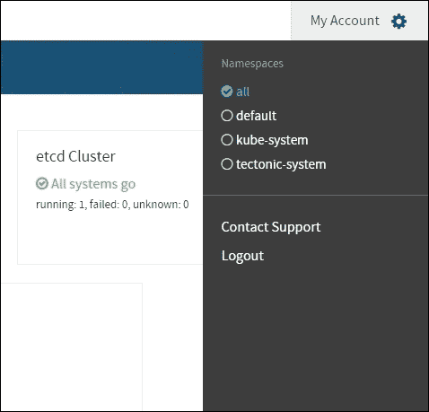

# 七、OCI、CNCF、CoreOS和Tectonic

本章的前半部分将介绍开放标准如何鼓励容器实现的多样化生态系统。我们将看看开放容器计划及其提供开放容器规范的使命。本章的后半部分将介绍 CoreOS 及其作为主机 OS 的优势，包括性能和对各种容器实现的支持。此外，我们还将简要了解 CoreOS 提供的Tectonic企业产品。

本章将讨论以下主题:

*   为什么标准很重要
*   开放容器计划和云原生计算基金会
*   容器规范与实现
*   CoreOS 及其优势
*   架构

# 标准的重要性

在过去的两年里，容器化技术的普及有了巨大的增长。虽然 Docker 一直处于这一生态系统的中心，但容器领域的参与者越来越多。容器化和 Docker 实现本身已经有了许多替代方案( **rkt** 、 **Garden** 、 **LXD** 等等)。此外，还有丰富的第三方工具生态系统，可以增强和补充您的容器基础架构。Kubernetes 直接站在这个生态系统的编排端，但底线是所有这些工具构成了构建云原生应用的基础。

正如我们在本书开头提到的，容器最吸引人的地方之一是它们能够打包我们的应用，以便跨各种环境(即开发、测试、生产)和各种基础设施提供商(GCP、AWS、本地等)进行部署。

为了真正地支持这种类型的部署敏捷性，我们不仅需要容器本身有一个公共平台，还需要底层规范遵循一组公共的基本规则。这将允许实现既灵活又高度专业化。例如，一些工作负载可能需要在高度安全的实施中运行。为了提供这一点，实现必须对实现的某些方面做出更有意识的决定。无论是哪种情况，如果我们的容器建立在所有实现都同意和支持的一些公共结构上，我们将会有更多的灵活性和自由度。

# 开放式容器倡议

获得广泛行业参与的第一批举措之一是**开放式容器举措** ( **OCI** )。行业合作者包括 Docker、红帽、VMware、IBM、谷歌、AWS，以及更多在 OCI 网站，即[https://www.opencontainers.org/](https://www.opencontainers.org/)上市的公司。

OCI 的目的是将实现(如 Docker 和 Rocket)从容器化工作负载的格式和运行时的标准规范中分离出来。按照他们自己的说法，OCI 规范的目标有三个原则 <sup class="calibre14">1</sup> :

> *为容器映像格式和运行时创建一个正式的规范，这将允许一个兼容的容器可以跨所有主要的、兼容的操作系统和平台移植，而没有人为的技术障碍。*
> 
> *接受、维护和推进与这些标准相关的项目(“项目”)。它将寻求就一组标准的容器操作(开始、执行、暂停、…)达成一致。)以及与容器运行时相关联的运行时环境。*
> 
> *将上述参考标准与其他拟议标准相协调，包括 appc 规范*

# 云原生计算基金会

第二个也得到了行业广泛认可的倡议是**云原生计算基金会** ( **CNCF** )。虽然仍专注于容器化工作负载，但 CNCF 在应用设计级别上的操作水平稍高。其目的是提供一套标准的工具和技术来构建、操作和编排云原生应用堆栈。云为我们提供了多种新技术和实践，可以改进和发展我们的经典软件设计。这也特别集中在面向微服务开发的新范例上。

作为 CNCF 的创始参与者，谷歌捐赠了 Kubernetes 开源项目作为第一步。目标将是增加生态系统中的互操作性，并支持与项目的更好集成，从 Mesos 开始。

### 注

有关 CNCF 的更多信息，请参考:[https://cncf.io/](https://cncf.io/)

# 标准容器规范

OCI 努力的一个核心成果是总体容器规范的创建和开发。该规范有五个核心原则供所有容器遵循，我将简要转述 <sup class="calibre14">2</sup> :

*   它必须有 **标准操作**来创建、启动和停止所有实现中的容器。
*   它必须是 **内容不可知的**，这意味着容器内部的应用类型不会改变容器本身的标准操作或发布。
*   容器必须是基础设施不可知的 T2。便携性至关重要；因此，容器必须能够在 GCE 中像在您公司的数据中心或开发人员的笔记本电脑上一样轻松地操作。
*   容器也必须是为自动化设计的 **，这允许我们跨构建、更新和部署管道实现自动化。虽然这个规则有点模糊，但是容器实现不应该需要繁重的手动步骤来创建和发布。**
*   最后，实施必须支持 **工业级交付**。再说一次，说到构建和部署管道，需要简化基础架构和部署层之间容器的可移植性和传输效率。

该规范还定义了容器格式和运行时的核心原则。您可以在以下网址阅读更多关于 GitHub 项目规范的信息:

[https://github . com/open containers/specs](https://github.com/opencontainers/specs)

虽然核心规范可能有点抽象，但是 **runC** 实现是一个容器运行时和映像格式的 OCI 规范的具体例子。另外，你可以在[https://github.com/opencontainers/runc](https://github.com/opencontainers/runc)阅读更多关于 GitHub 的技术细节。

runC 是各种流行容器工具的后备格式和运行时。它是由 Docker 捐赠给 OCI 的，是由 Docker 平台中使用的相同管道工程创建的。自发布以来，它已经被许多项目所接受。

就连广受欢迎的开源 PaaS**Cloud foun rdy**也宣布将在 Garden 中使用 runC。Garden 为 Deigo 提供了容器化管道，它充当了一个类似于 Kubernetes 的编排层。

rkt 最初基于 **appc** 规范。appc 实际上是 CoreOS 的工作人员更早的一次尝试，目的是围绕容器化形成一个通用的规范。现在 CoreOS 正在 OCI 参与，他们正在努力帮助将 appc 规范合并到 OCI；它应该在整个容器生态系统中产生更高水平的兼容性。

# 朝鲜

虽然规范为我们提供了一个共同点，但围绕着我们容器的操作系统选择，也有一些趋势在发展。有几个量身定制的操作系统是专门为运行容器工作负载而开发的。虽然实现各不相同，但它们都有相似的特征。专注于精简的安装基础、原子操作系统更新和签名应用，以实现高效安全的操作。

一个越来越受欢迎的操作系统是 CoreOS。 **CoreOS** 在安全性和资源利用率方面都有很大的优势。它通过从图片中完全移除包依赖关系来提供后者。相反，CoreOS 在容器中运行所有应用和服务。通过只提供支持运行容器所需的一小部分服务，并绕过对虚拟机管理程序使用的需求，CoreOS 允许我们使用更大部分的资源池来运行我们的容器化应用。这允许用户从他们的基础设施中获得更高的性能和更好的容器到节点(服务器)的使用率。

### 注

**更多容器操作**

最近出现了其他几个容器优化操作系统。

**红帽企业版 Linux 原子主机** 专注于安全性，默认启用 **SELinux** ，并对操作系统进行“原子”更新，类似于我们在 CoreOS 上看到的。请参考以下链接:

[https://access . red hat . com/articles/rhel-atomic-入门](https://access.redhat.com/articles/rhel-atomic-getting-started)

**Ubuntu nimpt**还利用了将操作系统组件从框架和应用中分离出来的效率和安全性优势。使用应用映像和验证签名，我们为容器工作负载获得了一个高效的基于 Ubuntu 的操作系统:

[http://www.ubuntu.com/cloud/tools/snappy](http://www.ubuntu.com/cloud/tools/snappy)

**VMware 光子** 是另一个轻量级容器操作系统，专门针对**【vssphere】**和 VMware 平台进行了优化。它运行 Docker、rkt 和 Garden，也有一些实验版本，您可以在流行的公共云产品上运行。请参考以下链接:

[https://VMware . github . io/光子/](https://vmware.github.io/photon/)

利用容器的隔离特性，我们提高了可靠性，降低了每个应用更新的复杂性。现在，只要新的容器版本准备好了，应用就可以随着支持库一起更新。



图 7.1。CoreOS 更新

最后，CoreOS 在安全领域还有一些额外的优势。首先，操作系统可以作为一个整体来更新，而不是通过单独的包来更新(参见图 7.1)。这避免了部分更新带来的许多问题。为了实现这一点，CoreOS 使用两个分区:一个作为活动的操作系统分区，另一个接收完整更新。更新成功完成后，重新启动会升级辅助分区。如果出现任何问题，原始分区可用于回切。

系统所有者也可以控制何时应用这些更新。这使我们能够灵活地确定关键更新的优先级，同时与现实世界中更常见的更新进行调度。此外，整个更新通过 SSL 进行签名和传输，以提高整个过程的安全性。

## 市场

CoreOS 生态系统的一个核心部分是它自己的容器运行时，名为 rkt。正如我们前面提到的，rkt 是另一个特别关注安全性的实现。rkt 的主要优势是在没有后台程序作为 root 的情况下运行引擎，就像 Docker 今天所做的那样。最初，rkt 在建立对容器映像的信任方面也有优势。然而，最近对 Docker 的更新在新的 **内容信任**功能方面取得了长足的进步。

底线是 rkt 仍然是一个专注于在生产中运行容器的安全性的实现。rkt 确实使用名为 **ACI** 的映像格式，但它也支持运行基于 Docker 的映像。在撰写本书时，它只有 0.11.0 版本，但作为在生产中安全运行 Docker 映像的一种方式，它已经获得了发展势头。

此外，CoreOS 最近宣布与 **英特尔虚拟化技术**集成，该技术允许容器在更高的隔离级别下运行。这种硬件增强的安全性允许容器在基于 **内核的虚拟机** ( **KVM** )进程中运行，提供了与内核的隔离，类似于我们今天看到的虚拟机管理程序。

## etcd

CoreOS 生态系统中另一个值得一提的核心部分是他们的开源 etcd 项目。etcd 是一个分布式且一致的键值存储。RESTful API 用于与 etcd 接口，因此很容易与您的项目集成。

如果这听起来很熟悉，那是因为我们在[第 1 章](1.html#E9OE1-22fbdd9ef660435ca6bcc0309f05b1b7 "Chapter 1. Kubernetes and Container Operations")、*Kubernetes和容器操作*中，在*服务运行在主*部分下看到了这个过程。Kubernetes 实际上利用 etcd 来跟踪集群配置和当前状态。K8s 也将其用于服务发现功能。

# 与朝鲜人交融

现在我们了解了好处，让我们看看一个使用 CoreOS 的 Kubernetes 集群。文档支持多种平台，但最容易启动的平台之一是带有 CoreOS **云信息**和命令行界面脚本的 AWS。

### 类型

如果您有兴趣在其他平台上使用 CoreOS 运行 Kubernetes，您可以在 CoreOS 文档中找到更多详细信息:

[https://coreos . com/kubrintes/docs/latest/](https://coreos.com/kubernetes/docs/latest/)

我们可以在这里找到 AWS 的最新脚本:

[https://github . com/coreos/coreos-kubrintes/releases/latest](https://github.com/coreos/coreos-kubernetes/releases/latest)

对于这个演练，我们将使用脚本的 v0.1.0(在编写时是最新的)。我们需要一台安装并配置了 AWS 命令行界面的 Linux 机器。有关安装和配置 AWS 命令行界面的详细信息，请参见[第 1 章](1.html#E9OE1-22fbdd9ef660435ca6bcc0309f05b1b7 "Chapter 1. Kubernetes and Container Operations")、*Kubernetes和容器操作*的*与其他提供商合作*部分。我建议您使用已经安装了 Kubernetes 控制脚本的盒子，以避免必须单独下载`kubectl`。

让我们首先从 GitHub 下载并提取 **tarball** ，如下所示:

```
$ wget https://github.com/coreos/coreos-kubernetes/releases/download/v0.1.0/kube-aws-linux-amd64.tar.gz
$ tar xzvf kube-aws-linux-amd64.tar.gz

```

这将提取一个名为`kube-aws`的可执行文件。该文件将以与`kube-up.sh`之前为我们所做的相同方式启动 AWS 基础架构。

在我们继续之前，我们需要创建一个在 AWS 上使用的密钥对。在这个例子中，我创建了一个名为`kube-aws-key`的密钥对。我们可以在左侧菜单的 EC2 服务下的控制台中创建一个键，然后选择 **键对**。也可以使用命令行界面创建密钥。

接下来，我们需要创建一个集群定义文件。在同一个文件夹里，我们下载了`kube-aws`；从清单 7-1 创建一个新文件:

```
# Unique name of Kubernetes cluster. In order to deploy
# more than one cluster into the same AWS account, this
# name must not conflict with an existing cluster.
# clusterName: kubernetes

# Name of the SSH keypair already loaded into the AWS
# account being used to deploy this cluster.
keyName: kube-aws-key

# Region to provision Kubernetes cluster
region: us-east-1

# Availability Zone to provision Kubernetes cluster
#availabilityZone:

# DNS name routable to the Kubernetes controller nodes
# from worker nodes and external clients. The deployer
# is responsible for making this name routable
externalDNSName: kube-aws
# Number of worker nodes to create
#workerCount: 1

# Location of kube-aws artifacts used to deploy a new
# Kubernetes cluster. The necessary artifacts are already
# available in a public S3 bucket matching the version
# of the kube-aws tool. This parameter is typically
# overwritten only for development purposes.
#artifactURL: https://coreos-kubernetes.s3.amazonaws.com/<VERSION>
```

*清单 7-1* : `coreos-cluster.yaml`

我们有几件事需要注意。我们已经将`keyName`设置为我们刚刚创建的密钥`kube-aws-key`。该地区被设置为`us-east-1`(北弗吉尼亚州)，因此如果您喜欢不同的地区，请编辑此内容。此外，`clustername`和`workerCount`被注释掉了，但它们的默认值分别如下所示:`kubernetes`和`1`。`workerCount`定义了从机数量，如果需要更多可以增加这个值。

此外，我们还有一个占位符域名系统条目。`externalDNSName`的值设置为`kube-aws`。

### 注

为了简单起见，我们可以简单地在`/etc/hosts`文件中为`kube-aws`添加一个条目。对于生产系统，我们需要一个真正的条目，可以通过路由 53、另一个域名系统注册器或本地域名系统条目公开。

现在我们可以加速 CoreOS 集群:

```
$ ./kube-aws up --config="coreos-cluster.yaml"

```

我们应该在控制器 IP 下的控制台输出中获取主 IP。我们需要在我们的`/etc/hosts`文件或域名系统提供商中更新`kube-aws`的 IP 地址。我们还可以通过检查我们在 AWS 中运行的实例来获得主 IP。应该贴上`kube-aws-controller`的标签。

```
$ vi /etc/hosts

```

给你！我们现在有一个运行 CoreOS 的集群。该脚本创建了所有必要的 AWS 资源，如 **【虚拟私有云】** ( **VPCs** )、安全组和 IAM 角色。

### 类型

请注意，如果这是一个新的盒子，您需要单独下载`kubectl`，因为它没有与`kube-aws`捆绑在一起:

```
wget https://storage.googleapis.com/kubernetes-release/release/v1.0.6/bin/linux/amd64/kubectl

```

我们现在可以使用`kubectl`来查看我们的新集群:

```
$ kubectl --kubeconfig=clusters/kubernetes/kubeconfig get nodes

```

我们应该看到单个节点以 EC2 内部域名系统作为名称。注意`kubeconfig`，这告诉 Kubernetes 使用我们刚刚创建的集群的配置文件，而不是我们到目前为止一直在工作的以前的 GCE 集群。如果我们想从同一台机器管理多个集群，这很有用。

# 构造

在 CoreOS 上运行 Kubernetes 是一个很好的开始，但是你可能会发现你想要更高级别的支持。进入**构造**，CoreOS 企业版，提供用 CoreOS 运行 Kubernetes。构造学使用了我们已经讨论过的许多成分。CoreOS 是操作系统，同时支持 Docker 和 rkt 运行时。此外，Kubernetes、etcd 和法兰绒被打包在一起，以提供完整的集群编排堆栈。我们在[第 3 章](3.html#QMFO2-22fbdd9ef660435ca6bcc0309f05b1b7 "Chapter 3. Core Concepts – Networking, Storage, and Advanced Services")、*核心概念—网络、存储和高级服务*中简要讨论了法兰绒。它是一个覆盖网络，使用类似于本地 Kubernetes 模型的模型，并使用 etcd 作为后端。

CoreOS 提供了类似于红帽的支持包，同时也为建构所基于的开源软件提供了全天候支持。structural 还提供定期的集群更新和一个漂亮的仪表板，其中包含 Kubernetes 所有组件的视图。 **CoreUpdate** 允许用户对自动更新有更多的控制。此外，它还附带了跨集群单点登录的**构造标识**和 **码头企业**，后者在您自己的防火墙后提供了安全的容器注册。

## 仪表盘亮点

以下是构造仪表板的一些亮点:



图 7.2。Tectonic主仪表板

构造现在普遍可用，仪表板已经有一些不错的功能。正如您在图 7.3 中看到的，我们可以看到关于复制控制器的许多细节，甚至可以使用图形用户界面通过单击按钮来上下扩展:



图 7.3。构造复制控制器详细信息

另一个不错的功能是**流事件**页面。在这里，我们可以实时观看事件，暂停，并根据事件严重性和资源类型进行过滤。



图 7.4。事件流

在仪表板系统的任何地方浏览的一个有用的特征是名称空间过滤选项。只需点击页面右上角的齿轮，我们就可以按名称空间过滤我们的视图。如果我们想要过滤掉 Kubernetes 系统，或者只是查看一个特定的资源集合，这可能会很有帮助。



图 7.5。命名空间筛选

# 总结

在这一章中，我们研究了容器社区中正在出现的标准团体，以及他们如何通过开放规范更好地塑造技术。我们还仔细研究了 CoreOS，它是容器和 Kubernetes 社区中的关键角色。我们探索了他们正在开发的增强和补充容器编排的技术，并亲眼看到了如何将其中一些技术用于 Kubernetes。最后，我们看了受支持的企业产品“Tectonic”以及一些即将推出的功能。

## 脚注

<sup class="calibre14">1</sup>[https://www.opencontainers.org/faq/](https://www.opencontainers.org/faq/)(页面上的#11)

<sup class="calibre14">2</sup>[https://github . com/open containers/specs/blob/master/principles . MD](https://github.com/opencontainers/specs/blob/master/principles.md)