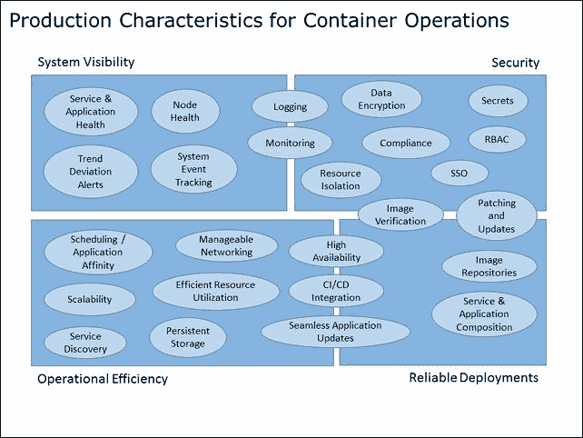

# 第八章。走向生产就绪

在这一章中，我们将研究转向生产的注意事项。我们还将展示一些有用的工具和第三方项目，这些工具和项目可以在 Kubernetes 社区中找到，您可以去哪里获得更多帮助。

本章将讨论以下主题:

*   生产特性
*   库本内特生态系统
*   去哪里寻求帮助

# 准备生产

我们已经使用 Kubernetes 完成了许多典型的操作。正如我们所看到的，K8s 提供了各种功能和抽象，减轻了容器部署的日常管理负担。

有许多特征定义了容器的生产就绪系统。图 8.1 提供了生产就绪集群的主要关注点的高级视图。这绝不是一份详尽的清单，但它旨在为生产运营提供一些坚实的基础。

图 8.1。集装箱作业的生产特点。

我们看到了库本内特的核心概念和抽象是如何解决其中一些问题的。服务抽象在服务和应用程序级别都内置了服务发现和健康检查。我们还从复制控制器构造中获得无缝的应用程序更新和可扩展性。服务、复制控制器和 pods 的所有三个核心抽象都与一个核心调度和关联规则集一起工作，并为我们提供了简单的服务和应用程序组合。

内置了对各种持久存储选项的支持，网络模型提供了可管理的网络操作，并提供了与其他第三方提供商合作的选项。此外，我们还简要介绍了 CI/CD 与市场上一些流行工具的集成。

此外，我们还内置了系统事件跟踪，并与主要的云提供商合作，提供了用于监控和记录的现成设置。我们还看到了如何利用第三方提供者(如 StackDriver 和 Sysdig)来扩展这一功能。这些服务还解决了整体节点运行状况和主动趋势偏差警报问题。

核心结构还帮助我们解决应用程序和服务层的高可用性问题。调度器可以与自动缩放机制一起使用，在节点级别提供这一点。还有一个支持是让 Kubernetes 大师本身高度可用。

我们最终探索了一种新的操作系统，它为我们提供了一个很好的基础来构建补丁和更新的安全更新机制。基础薄弱，加上时间安排，可以帮助我们有效利用资源。此外，操作系统和 Docker 本身也有用于可信映像验证的功能。

## 安全

我们还没有深入探索安全周围的许多区域。这门学科本身可以充实自己的书。然而，库本内特斯确实提供了一个非常重要的开箱即用的构造，名为**秘密**。

秘密为我们提供了一种在资源定义文件中不包含明文版本的情况下存储敏感信息的方法。秘密可以装载到需要它们的容器中，然后在容器中作为文件访问，秘密值作为内容。

秘密仍处于早期阶段，但对生产运营至关重要。这里计划对未来的版本进行一些改进。

要了解更多关于秘密的信息，甚至浏览一下，请查看位于[http://kubernetes.io/v1.0/docs/user-guide/secrets.html](http://kubernetes.io/v1.0/docs/user-guide/secrets.html)的 K8s 用户指南中的**秘密**部分。

## 准备，出发，出发

虽然仍有一些差距，但第三方公司正在积极解决各种剩余的安全和运营问题，我们将在下一节中看到。展望未来，Kubernetes 项目将继续发展，围绕 K8s 和 Docker 的项目和合作伙伴社区也将增长。社区正在以惊人的速度缩小剩余的差距。

# 第三方公司

自从 Kubernetes 项目最初发布以来，合作伙伴的生态系统不断壮大。我们在上一章中研究了 CoreOS，但是在这个领域中还有更多的项目和公司。我们将重点介绍一些在您走向生产时可能有用的东西。

## 私人登记处

在许多情况下，组织不希望将其应用程序和/或知识产权放在公共存储库中。对于这些情况，私有注册表解决方案有助于端到端安全集成部署。

谷歌云提供**谷歌容器注册**:[https://cloud.google.com/container-registry/](https://cloud.google.com/container-registry/)。

Docker 有自己的**可信注册中心**提供:[https://www.docker.com/docker-trusted-registry](https://www.docker.com/docker-trusted-registry)。

**Quay.io** 还提供安全的私有注册、漏洞扫描，来自 CoreOS 团队:[https://quay.io/](https://quay.io/)。

## 谷歌容器引擎

谷歌是最初 Kubernetes 项目的主要作者，现在仍然是主要贡献者。虽然这本书主要集中在我们自己运行 Kubernetes，但谷歌也通过谷歌云平台提供了一个完全托管的容器服务。

### 注

在**谷歌容器引擎** ( **GKE** )网站上找到更多信息:

[https://cloud.google.com/container-engine/](https://cloud.google.com/container-engine/)

Kubernetes 将安装在 GCE 上，由谷歌工程师管理。它们还提供私有注册和与现有私有网络的集成。

### 注

**创建你的第一个 GKE 集群**

在 GCP 控制台的**计算**下，点击**集装箱引擎**，然后点击**集装箱集群**。

如果这是您第一次创建集群，页面中间会有一个信息框。点击**创建容器集群**按钮。

为集群和区域选择一个名称。您还可以选择节点的机器类型(实例大小)以及集群中需要的节点数量(集群大小)。主文档由谷歌团队自己管理和更新。选中**云记录**。点击**创建**，几分钟后，你将有一个新的集群准备使用。

你需要谷歌软件开发工具包中的`kubectl`开始使用你的 GKE 集群。有关安装软件开发工具包的详细信息，请参考[第 1 章](1.html#E9OE1-22fbdd9ef660435ca6bcc0309f05b1b7 "Chapter 1. Kubernetes and Container Operations")、*库本内斯和集装箱操作*。一旦我们有了 SDK，我们就可以使用[中概述的步骤为我们的集群配置`kubectl`和 SDK。](https://cloud.google.com/container-engine/docs/before-you-begin#install_kubectl)

## 扭锁

**Twistlock.io** 是一个漏洞和为容器量身定制的硬化工具。它们提供了在容器级别强制实施策略和审计风险的能力。虽然不是专门为 Kubernetes 设计的，但它有望成为容器操作的治理和法规遵从性的核心部分。以下是他们网站上的简短描述:

> *“Twistlock 是第一个专门为保护容器化计算和微服务而设计的安全解决方案。*
> 
> *Twistlock 安全套件可检测漏洞、加固容器映像，并在应用程序的整个生命周期中实施安全策略。*
> 
> *我们便携无药剂；我们在您的容器所到之处运行…开发工作站、公共云、私有云。”*

### 注

更多信息请参考 Twistlock 网站:

[https://www.twistlock.io/](https://www.twistlock.io/)

## Kismatic

T2 是由一些与库本内特和梅索斯生态系统都有联系的人建立的。他们的目标是为 Kubernetes 提供企业支持。他们是早期的贡献者，构建了我们在[第 1 章](1.html#E9OE1-22fbdd9ef660435ca6bcc0309f05b1b7 "Chapter 1. Kubernetes and Container Operations")、 *Kubernetes 和*中看到的大部分用户界面。此外，他们正在建立以下插件，如他们的网站上所列。

> *“基于角色的访问控制(RBAC):集群级虚拟化是使用 Kubernetes 命名空间实现的，Kubernetes 中的一种机制，用于将用户创建的资源划分到逻辑命名的组中。我们通过支持 RBAC 扩展了 Kubernetes 名称空间，这是一种用于实现强制访问控制(MAC)或自由访问控制(DAC)的标准企业系统安全方法。*
> 
> *Kerberos 用于基岩身份验证:Kubernetes 目前使用客户端证书、令牌或 HTTP 基本身份验证对用户进行 API 调用的身份验证。对于许多企业来说，这种级别的身份验证无法满足生产需求。Kismatic 扩展了现有的功能，它采用了用户通过(重新)身份验证后发布的 API 服务器令牌，并与 Kerberos 中的基岩身份验证相集成。*
> 
> *LDAP/AD 集成:对于希望通过现有目录服务管理用户访问的企业，Kismatic 集成了 Kubernetes 这样的服务，通过 LDAP / Active Directory 进行身份验证。*
> 
> *审计控制:在法规遵从性敏感的企业环境中，我们已经认识到丰富的审计和日志记录工具以及持久性是生产稳定性的关键。因此，我们很高兴地宣布我们的 Kubernetes 审计日志插件，它提供了一种可信的方法来跟踪您运行的 Kubernetes 微服务和集群活动的安全相关信息。”*

### 注

有关更多信息，请参考以下 Kismatic 网站:

[https://kismatic.com/](https://kismatic.com/)

## 中层（月度上的 Kubernetes）

**中间层**本身正在围绕开源的 Apache Mesos 项目构建一个商业支持的产品( **DCOS** )。 **Apache Mesos** 是一个集群管理系统，提供调度和资源共享，有点像 Kubernetes 本身，但是级别要高得多。开源项目被多家知名公司使用，如**Twitter****AirBnB**。

### 注

在以下网站获取更多关于 Mesos 操作系统项目和 Mesosphere 产品的信息:

*   [http://mesos.apache.org/](http://mesos.apache.org/)
*   [https://mesosphere.com/](https://mesosphere.com/)

Mesos by 它的本质是模块化的，允许在各种平台上使用不同的框架。现在有了一个 Kubernetes 框架，所以我们可以利用 Mesos 中的集群管理，同时仍然保持 K8s 中有用的应用程序级抽象。请参考以下链接:

[https://github.com/mesosphere/kubernetes-mesos](https://github.com/mesosphere/kubernetes-mesos)

## des

**Deis** 项目提供开源的 **平台即服务** ( **PaaS** )解决方案。这允许公司在内部或公共云中部署自己的平台即服务。Deis 使用 CoreOS 作为底层操作系统，并在 Docker 中运行应用程序。1.9 版本现在支持将 Kubernetes 作为调度程序进行预览。虽然目前还没有做好生产准备，但如果您有兴趣部署自己的 PaaS，这是一个很好的观察点。

### 注

有关 Deis 的更多信息，您可以参考以下网站:

[http://docs . deis . io/en/latest/customizing _ deis/choice-a-scheduler/# k8s-scheduler](http://docs.deis.io/en/latest/customizing_deis/choosing-a-scheduler/#k8s-scheduler)

## 开瓶器

另一个 PaaS 解决方案是 **从红帽开启 Shift** 。OpenShift 平台使用红帽原子平台作为运行容器的安全而纤薄的操作系统。在版本 3 中，Kubernetes 被添加为 PaaS 上所有容器操作的编排层。这是大规模管理 PaaS 安装的绝佳组合。

### 注

更多关于 OpenShift 的信息可以在这里找到:

[https://enterprise.openshift.com/](https://enterprise.openshift.com/)

# 去哪里了解更多

Kubernetes 项目是一个开源项目，因此有一个广泛的贡献者和爱好者社区。为了寻求更多的帮助，一个很好的资源是如下的库本内斯 **Slack** 频道:

[http://slack.kubernetes.io/](http://slack.kubernetes.io/)

谷歌群上还有一个容器群。您可以在此加入:

[https://groups.google.com/forum/#!forum/google-containers](https://groups.google.com/forum/#!forum/google-containers)

如果你喜欢这本书，你可以在我的博客和 twitter 页面上找到更多我的文章，如何操作，以及各种想法，如下所示:

*   [http://www.cloudtp.com/meet-the-advisors/jonathan-baier/](http://www.cloudtp.com/meet-the-advisors/jonathan-baier/)
*   [https://medium.com/@grizzbaier](https://medium.com/@grizzbaier)
*   [https://twitter.com/grizzbaier](https://twitter.com/grizzbaier)

# 总结

在这最后一章中，我们留下了一些面包屑来指导您继续与 Kubernetes 的旅程。你应该有一套坚实的生产特征来让你开始。在 Docker 和 Kubernetes 世界中都有一个广泛的社区。如果你需要一个友好的面孔，我们还会提供一些额外的资源。

到目前为止，我们已经看到了 Kubernetes 的全部集装箱操作。您应该对 Kubernetes 如何简化容器部署的管理以及如何计划将容器从开发人员笔记本电脑转移到生产服务器上更有信心。