# 八、使用 Jenkins 构建流水线

本章将详细介绍如何使用现有的 Jenkins 实例设置 Jenkins Blue Ocean，以及如何使用 Docker 设置它。我们将详细查看蓝色海洋**用户界面** ( **用户界面**)并讨论 Jenkins 经典视图和蓝色海洋视图之间的差异。我们还将研究管道语法，并简要讨论其用途，解释两种不同类型的管道语法。

本章将涵盖以下主题:

*   Jenkins 2.0
*   Jenkins 管道
*   在 Jenkins 蓝色海洋中航行
*   管道语法

# 技术要求

本章要求对如何与 Unix Shell 环境交互有一个基本的了解。我们还将简要讨论管道语法，因此如果您有一些基本的编程技能来理解一种编程语言中关键字的用途，将会有所帮助。

# Jenkins 2.0

与 Jenkins 1.0 相比，Jenkins 2.0 有着不同的设计方法和流程。除了使用自由式作业，还有一种新的**领域特定语言** ( **DSL** )是 Groovy 编程语言的缩写形式。

管道视图的功能也不同于它们在 Jenkins 1.0 中的功能。管道阶段视图还帮助我们可视化管道中的各个阶段。

# 为什么要迁移到 Jenkins 2.0？

那么，首先，为什么完全转向 Jenkins 2.0，而不继续使用 Jenkins 1.0 呢？Jenkins 经典视图被认为是杂乱的，没有考虑到易用性。Jenkins 2.0 以更直观的方式大力推动了 Docker Images 的使用。此外，新的用户界面包括一个 Jenkins 管道编辑器，并通过引入管道视图来改变您找到构建的方式。新用户界面的目标是减少混乱，提高使用 Jenkins 的团队每个成员的清晰度。新的用户界面还具有 GitHub 和 Bitbucket 集成以及 Git 集成。Jenkins 2.0 用户界面本质上是你安装的插件的集合，叫做蓝海。

# 在现有实例上安装蓝海插件

如果您在大多数平台上安装 Jenkins，默认情况下，您不会将 Blue Ocean 插件与其所有相关插件一起安装。您需要确保您运行的是 Jenkins 2.7 . x 或更高版本，才能安装 Blue Ocean 插件。

为了在 Jenkins 实例上安装插件，您必须拥有通过基于矩阵的安全性设置的管理员权限，并且任何 Jenkins 管理员也可以配置系统中其他用户的权限。

安装蓝海插件的步骤如下:

1.  确保您以具有管理员权限的用户身份登录
2.  从 Jenkins 主页或 Jenkins 经典版的仪表板中，单击仪表板左侧的**管理 Jenkins**
3.  接下来点击管理 Jenkins 页面中心的**管理插件**
4.  单击“可用”选项卡，并在“过滤器”文本框中键入`Blue Ocean`，该文本框将插件列表过滤到名称和/或描述包含“蓝色”和“海洋”字样的插件

更多信息请阅读[第 7 章](07.html)、*开发插件*，具体为*安装 Jenkins 插件*章节。

# 通过 Jenkins Docker 映像安装蓝海插件

您需要确保安装了 Docker，以便获得 Jenkins CI Docker 映像。

# Docker 先决条件

由于 Docker 利用了操作系统的虚拟化技术，因此 Docker 的安装要求是特定的。

OS X 的要求是:

*   采用英特尔 MMU 虚拟化技术的 2010 或更新型号 Mac
*   操作系统 10.11 或更高版本

窗口要求是:

*   64 位窗口
*   Windows 10 专业版、企业版或教育版(非家庭版，非 Windows 7 或 8 版)安装 Hyper-V
*   Windows 10 周年更新或更好
*   访问机器的基本输入输出系统以开启虚拟化

要在您的操作系统上安装 Docker，请访问 Docker 商店([https://store.docker.com/search?type=edition&产品=社区](https://store.docker.com/search?type=edition&offering=community))网站，然后单击适合您的操作系统或云服务的 Docker 社区版框。请遵循他们网站上的安装说明。

使用 Windows 命令提示符或 OS X/Linux 终端应用检查 Docker 版本，确保安装了 Docker。在命令行中运行以下命令:


请注意，我已经安装了 Docker 版本 18。

# 安装 Docker 映像

为了获得 Docker 映像，您需要确保您在 Docker Hub([https://hub.docker.com/](https://hub.docker.com/))中有一个帐户。一旦您在 Docker Hub 中有了一个帐户，并且安装了 Docker，获取最新的 Jenkins CI Docker 映像就很简单了。

在窗口命令提示符或终端中运行以下命令:

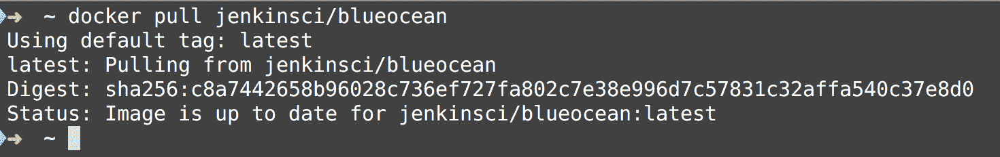

请注意，我已经提取了`jenkinsci/blueocean`Docker 映像，因此该命令不是从 Docker Hub 中提取的，而是打印出了阿沙哈希校验和。这说明我已经有了最新的`jenkinsci/blueocean`Docker 图片。

接下来，您需要启动并运行 Jenkins Docker 容器，并且需要在终端或命令提示符 shell 中运行以下命令:


您可以通过简单地创建一个 shell 脚本或创建一个别名来简化这一过程。

这是我在文本编辑器中创建的一个 shell 脚本:


我有一个个人`bin`目录，在这里我将我所有的个人脚本存储在`~/bin`中，然后我确保将其添加到`PATH`变量中。脚本文件名叫做`run-jenkinsci-blueocean`。我们需要通过发出以下命令来确保脚本是可执行的:

```
 chmod +x run-jenkinsci-blueocean
```

然后我要做的就是运行`~/bin/run-jenkinsci-blueocean`命令。

You can also create an alias in Unix similar to this:

```
# inside ~/.zshrc

alias runJenkinsDockerImage='docker run -u root jenkins-blueocean --rm -d -p 8080:8080 -p 50000:50000 -v jenkins-data:/var/jenkins_home -v /var/run/docker.sock:/var/run/docker.sock jenkinsci/blueocean'
```

请注意，我在我的`.zshrc`文件中添加了这个 shell 别名，但是您也可以很容易地将其添加到一个`.bashrc`文件中。

Windows 用户可以创建一个批处理文件，或者找到一些其他方法来简化 Docker 命令的运行。

为了停止 Docker 容器，您可以运行以下命令:

```
docker ps -a
```

该命令将显示系统中所有正在运行的容器；您将需要查看`Container ID`、`NAMES`列，并复制对应于 Docker 图像`jenkinsci/blueocean`的 ID。最后，要停止容器，您需要运行以下命令:

```
docker stop jenkins-blueocean
```

Notice that because we used the `--name jenkins-blueocean` options in the `docker run` command in the shell script, Docker created a container with the name `jenkins-blueocean`; if we had not done so, then Docker would have created a name for the container for us. We can also use the container ID and name to stop the container, that is shown when you issue the `docker ps -a` command in a Terminal or Command Prompt.

一旦 Jenkins 正在运行，您可以转到这里:`http://localhost:8080` ，您将需要通过提供为管理员生成的默认密码来解锁 Jenkins。在[第 5 章](05.html)、*Jenkins*的安装和基础知识中，我们跳过了安装建议插件的入门步骤，但这次我建议您在入门屏幕上安装建议插件:

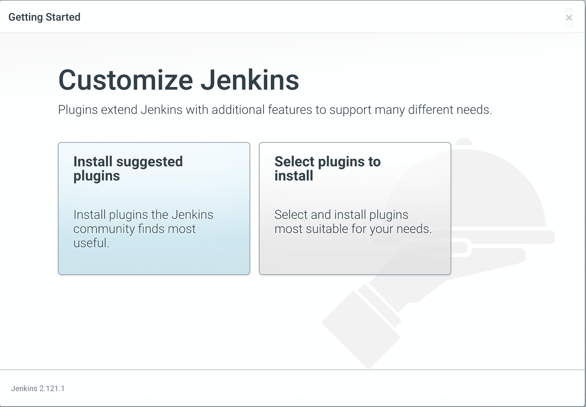

通过点击安装建议插件按钮，您将获得所有的建议插件和相关插件，这将有助于您在新的 Jenkins 2.0 流程中使用管道等。

# 访问蓝海 Jenkins 视图

您需要确保单击“打开蓝色海洋”按钮，该按钮看起来类似于:


一旦你点击打开蓝色海洋按钮，你将被重定向到这个网址:`http://localhost:8080/blue/organizations/jenkins/pipelines`。Jenkins 用户界面看起来会非常不同，行为也会不同。

这是您将看到的初始屏幕，因为我们尚未创建任何管道:


We will explore the Pipeline Syntax and how to navigate the Jenkins 2.0 UI in the following sections.

# Jenkins 管道

我们将使用 Jenkins 2.0 用户界面创建我们的第一个管道，并将使用内置于新的 Jenkins 2.0 用户界面中的管道编辑器创建一个 Jenkins 文件。

# 创建 Jenkins 管道

我们要做的第一步是单击“创建新管道”按钮。您将被重定向到以下屏幕:

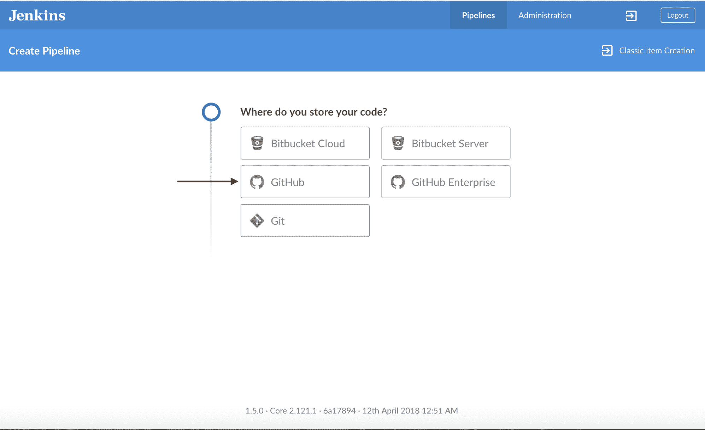

出于本章的目的，我们将使用我创建的现有 GitHub 存储库，但是您可以轻松地使用 Bitbucket 和托管在 GitHub 或 Bitbucket 上的您自己的代码。为了做到这一点，您需要确保您在 GitHub 上有一个帐户，如果没有，请确保注册 GitHub([https://github.com/](https://github.com/))。

# 为 GitHub 提供个人访问令牌

如果 GitHub 中没有个人访问令牌，您需要创建一个。请注意，在下面的截图中，这里有一个名为“创建访问密钥”的链接:


单击“在此创建访问密钥”链接后，您将被重定向到以下 GitHub 页面:

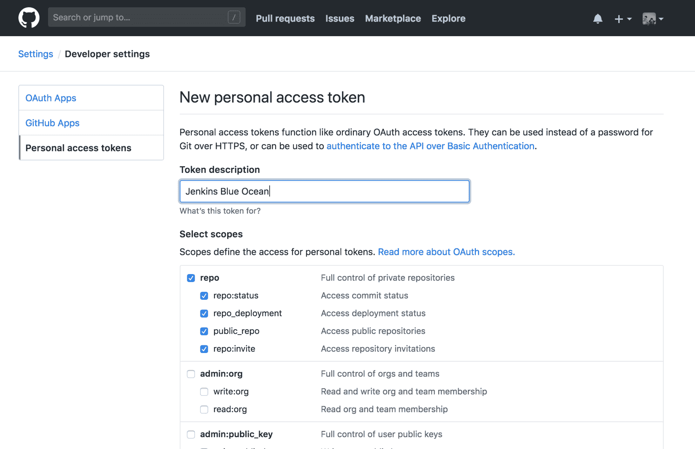

您可以选中默认选项，然后单击标题为“生成令牌”的绿色按钮。请确保将此个人访问令牌保存在安全的地方，因为它只会显示一次；根据我们的需要复制它。您需要将访问令牌粘贴到“连接到 Github”输入框中，然后单击蓝色的“连接”按钮:


# 选择您的 GitHub 组织

您需要选择您所属的 GitHub 组织。在下面的截图中，我选择了`jbelmont`的 GitHub 用户名组织:

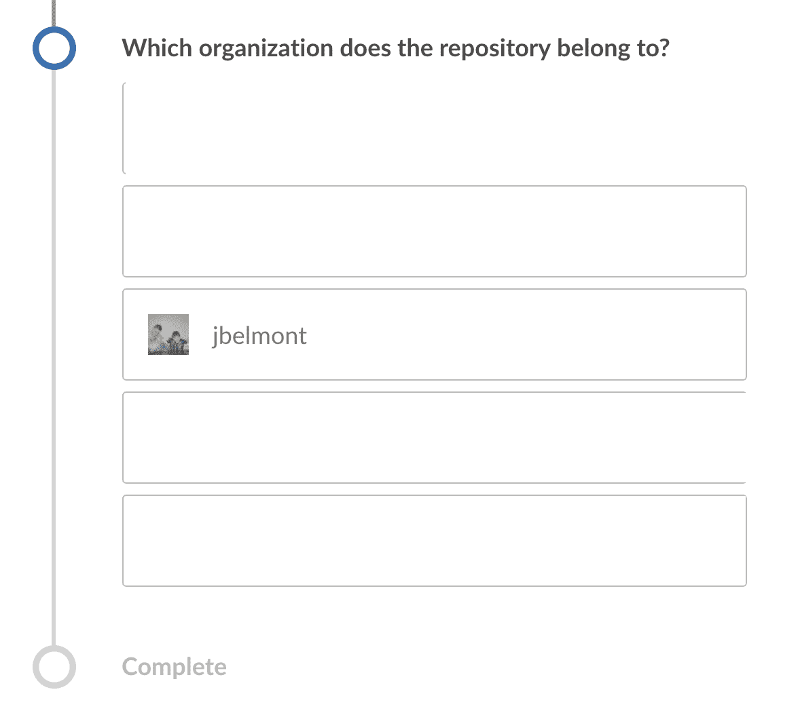

# 挑选 GitHub 存储库

您需要做的最后一步是实际选择想要在其中创建 Jenkins 管道的 GitHub 存储库。在这里的截图中，我输入了`cucumber-examples`并选择了下拉列表。然后蓝色的“创建管道”按钮被启用:


# 使用管道编辑器创建管道

在我们选择的 GitHub repo 中，没有现有的 Jenkinsfile，因此我们被重定向到管道编辑器屏幕，在那里我们可以创建第一个 Jenkinsfile:


我们需要为 Node.js 和代理添加一个 Docker 映像，如下所示:


请注意，我们使用 Docker 的`-v`选项给出了装载数据卷的图像和参数。

接下来，我们单击灰色加号按钮，我们将看到以下变化:


接下来，在给舞台命名后，我们单击蓝色的“添加步骤”按钮。在本演示中，我们将选择构建:


接下来，我们需要为该步骤选择一个选项。我们将选择标题为 Shell 脚本的选项，这将安装我们所有的 Node.js 依赖项:


接下来，我们在 Shell 脚本中输入一些要运行的命令:

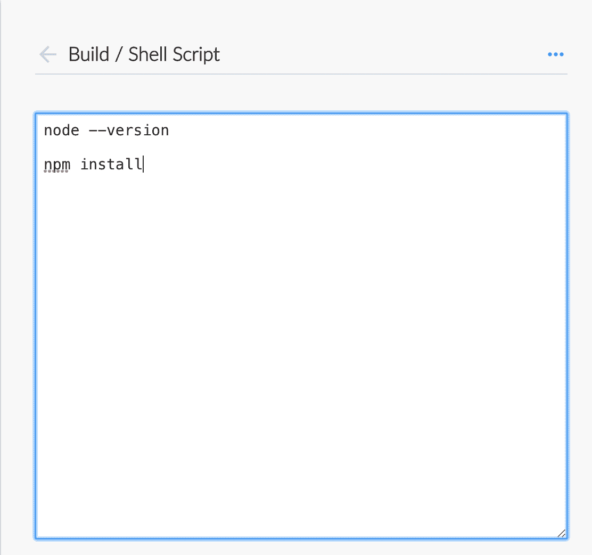

接下来，我们将再次单击灰色加号按钮，向管道中再添加一个阶段，现在看起来类似于这样:

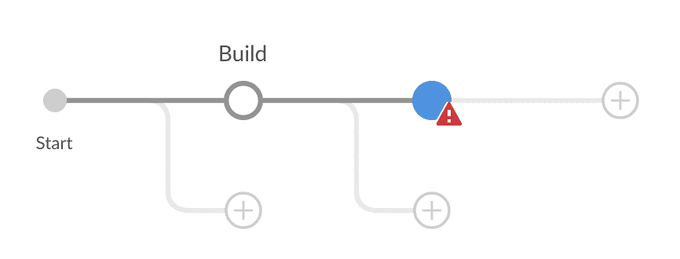

接下来我们将为这个阶段输入一个名称，为了本章的目的，我们将选择`Cucumber Tests`:

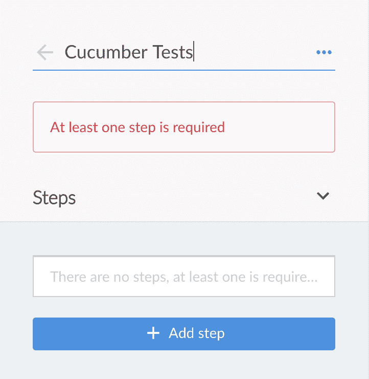

接下来，我们为这个阶段添加一个步骤，我们将再次选择 Shell 脚本作为选项:

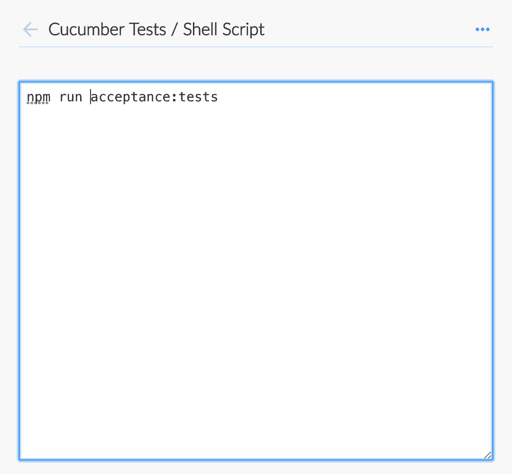

最后，我们将单击保存按钮并提供一条提交消息，以便将此更改推送到我们的 GitHub 存储库:


一旦您单击蓝色的保存并运行按钮，Jenkins 文件将被合并到主分支，管道将运行。

# 在 Jenkins 蓝色海洋中航行

Jenkins 经典视图中您习惯使用的一些视图在 Jenkins 蓝色海洋中不可用。Jenkins Blue Ocean 背后的主要概念是使 Jenkins 内的导航更容易访问，并在更好的图标和页面导航方面改进 Jenkins UI。新 Jenkins UI 的很多灵感来源于《蓝海战略》一书，该书强调世界已经从功能性开发工具转向开发人员体验，新 UI 渴望改善 Jenkins 的开发人员体验。

# 管道视图

下面的截图描述了 Jenkins 蓝色海洋的管道视图。请注意，对于两个不同的 GitHub 存储库，我们有两个不同的管道。第二个管道是通过单击“新建管道”按钮并添加个人 base64([https://github.com/jbelmont/decode-jwt](https://github.com/jbelmont/decode-jwt))Golang 库来创建的，该库通过命令行工具解码 JSON 网络令牌:

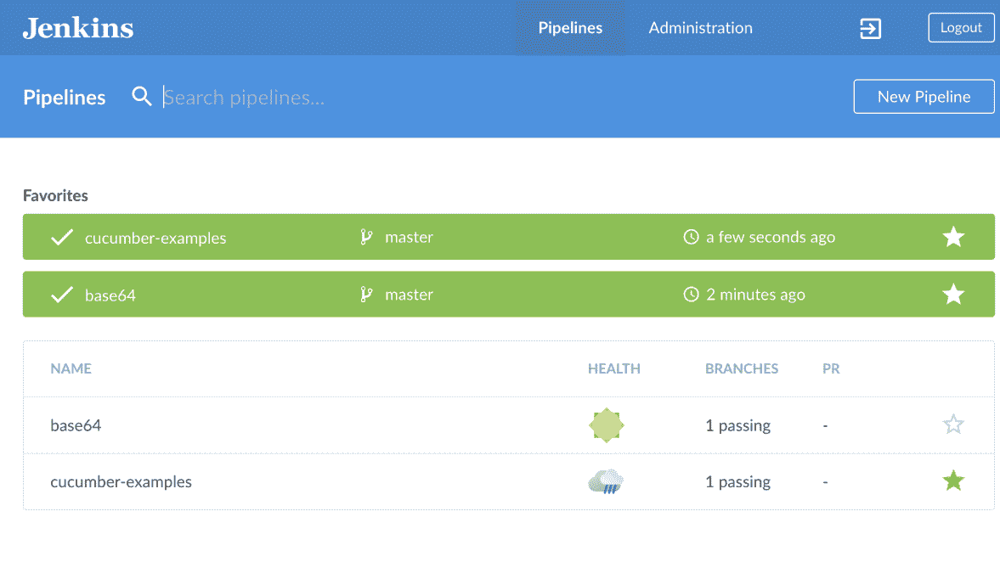

根据您添加到 Jenkins 实例中的管道数量，此列表会有所不同。请注意，您可以启动一个管道，并且有标记为“名称”、“健康”、“分支”和“公共关系”的列。

# 管道详细视图

如果您单击一个实际的管道，那么您将进入一个管道详细信息页面，该页面包含与您的特定管道中运行的所有阶段相关的所有详细信息。下面的截图是 base64 管道:


# 管道构建视图

您可以单击管道视图中的每个节点，查看该阶段完成的所有工作。在第一张截图中，我们点击了构建信息节点，查看在该特定阶段运行的命令，包括下拉 GitHub 存储库的新副本并运行`go version`和`go fmt`命令:

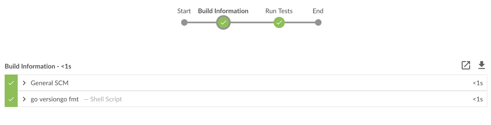

请注意，第二个节点被标记为运行测试，当我们单击该特定节点时，我们只看到`go test`命令，该命令在 Golang 中运行我们的单元测试用例:

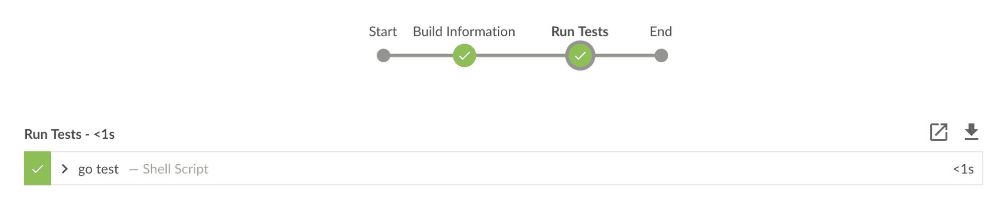

管道视图的一大好处是，在您的持续集成构建中，您可以为每个阶段获得更清晰、布局更好的可视化效果。

# 管道阶段视图

如果您单击管道中的实际阶段，即由`>`符号描述的阶段，它将显示一个下拉视图，其中包含该特定阶段的详细信息:

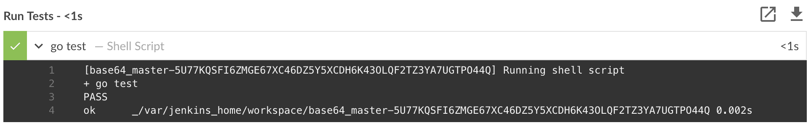

请注意，这里我们点击了运行测试阶段，看到一个报告说我们用 Golang 编写的单元测试用例通过了。

# Jenkins 管道中的其他视图

您还可以使用其他视图，例如“拉取请求”视图，它向您显示所有打开的拉取请求以及分支视图:

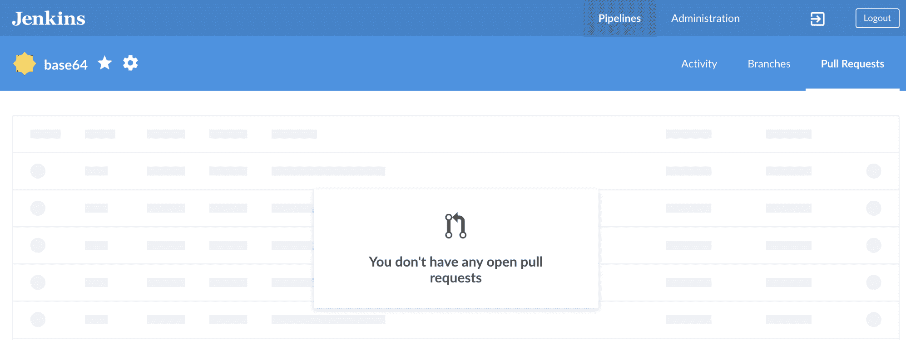

Jenkins 蓝色海洋视图仍在开发中，因此任何管理任务，如添加插件和添加安全信息，仍在 Jenkins 经典视图中完成。

# 管道语法

管道语法有两种形式(https://Jenkins . io/doc/book/Pipeline/语法/#declarative-pipeline ):

*   声明性管道
*   脚本管道

这两种形式的区别在于声明性管道语法意味着比脚本化管道更简单的语法。脚本管道语法是一种遵循 Groovy 编程语言语义的 DSL。

# 管道编辑器

在*黄瓜示例*存储库中，我们使用管道编辑器创建了一个 Jenkins 文件。您实际上可以不使用管道编辑器来编写 Jenkins 文件，尽管我建议使用它来调试管道脚本，因为编辑器有一些不错的特性。

# Jenkins 文件

这里我们有管道编辑器为我们创建的实际管道语法。它使用的是声明性管道语法，在该语法中有几个项目需要讨论:

```
pipeline {
  agent {
    docker {
      args '-v /Users/jean-marcelbelmont/jenkins_data'
      image 'node:10-alpine'
    }

  }
  stages {
    stage('Build') {
      steps {
        sh '''node --version

npm install'''
      }
    }
    stage('Cucumber Tests') {
      steps {
        sh 'npm run acceptance:tests'
      }
    }
  }
}
```

# 管道关键字

所有有效的声明性管道都必须包含在一个管道块中，正如您在前面的 Jenkins 文件中看到的那样。

# 代理关键字

代理部分指定整个管道或特定阶段在 Jenkins 环境中的执行位置，具体取决于代理部分的位置。该部分必须在管道块内部的顶层定义，但阶段级使用是可选的。

# 阶段关键字

stages 关键字包含一个或多个阶段指令的序列；阶段部分是管道描述的大部分工作的位置。

# 管道语法文档

如果你想阅读更多关于管道语法的内容，那么请查看文档([https://jenkins.io/doc/book/pipeline/syntax/](https://jenkins.io/doc/book/pipeline/syntax/))。

# 摘要

本章讨论了如何在现有的 Jenkins 实例中使用 Jenkins 蓝色海洋视图进行设置，以及如何使用 Docker 设置蓝色海洋视图。我们观察了许多不同的 Jenkins 蓝色海洋视图，并讨论了它们与 Jenkins 经典视图之间的一些差异。我们还讨论了管道语法和 Jenkins 文件。下一章将介绍 Travis CI 的安装和基本用法。

# 问题

1.  如果通过 Docker 安装 Jenkins，可以使用蓝海视图吗？
2.  为什么在蓝色海洋视图中使用管道编辑器很有用？
3.  Jenkins 经典视图和蓝色海洋视图有什么不同？
4.  你能详细看看管道的每个阶段吗？
5.  蓝海视图可以处理 Jenkins 的管理任务吗？
6.  stages 的语法是什么？
7.  声明性管道语法需要包装在管道块中吗？

# 进一步阅读

请查看*帕克特出版*的《扩展 Jenkins([https://www.amazon.com/dp/B015CYBP2A](https://www.amazon.com/dp/B015CYBP2A))一书，了解更多关于 Jenkins 插件的信息。