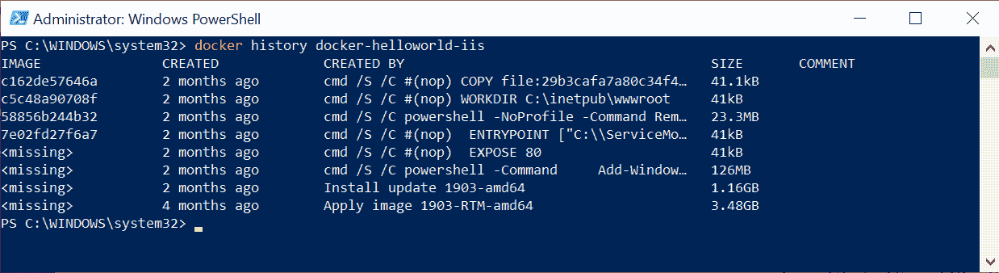
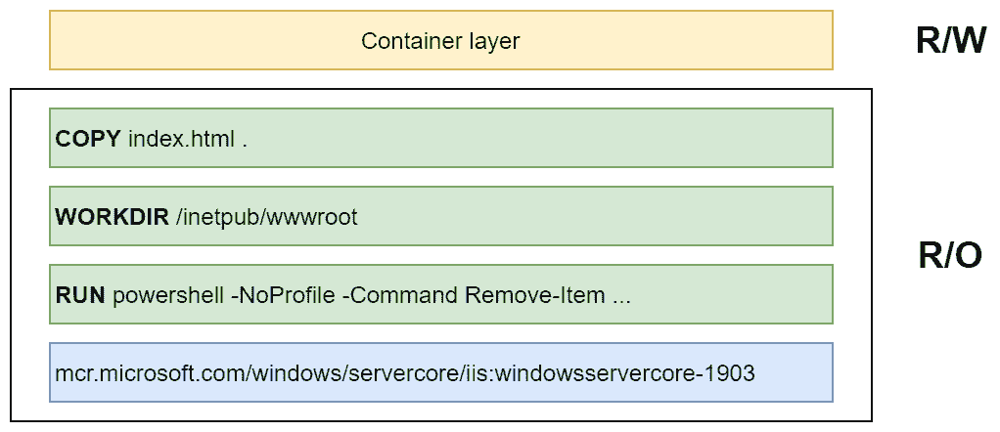
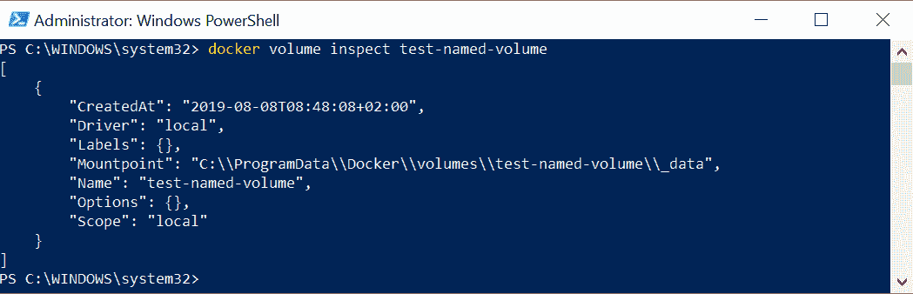
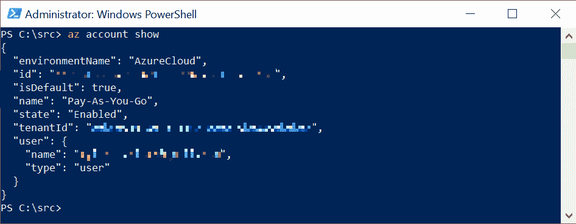
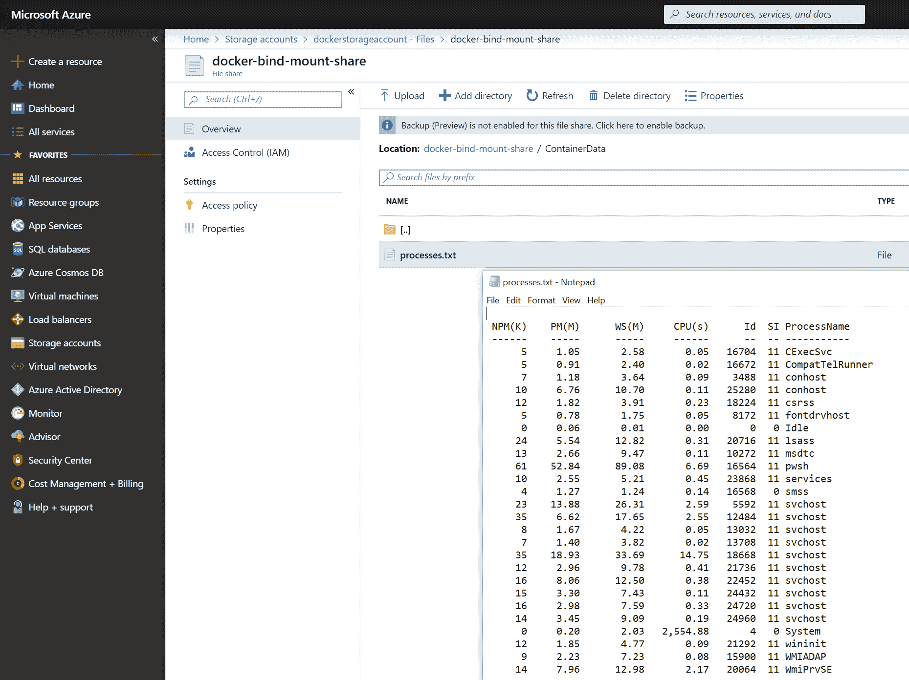
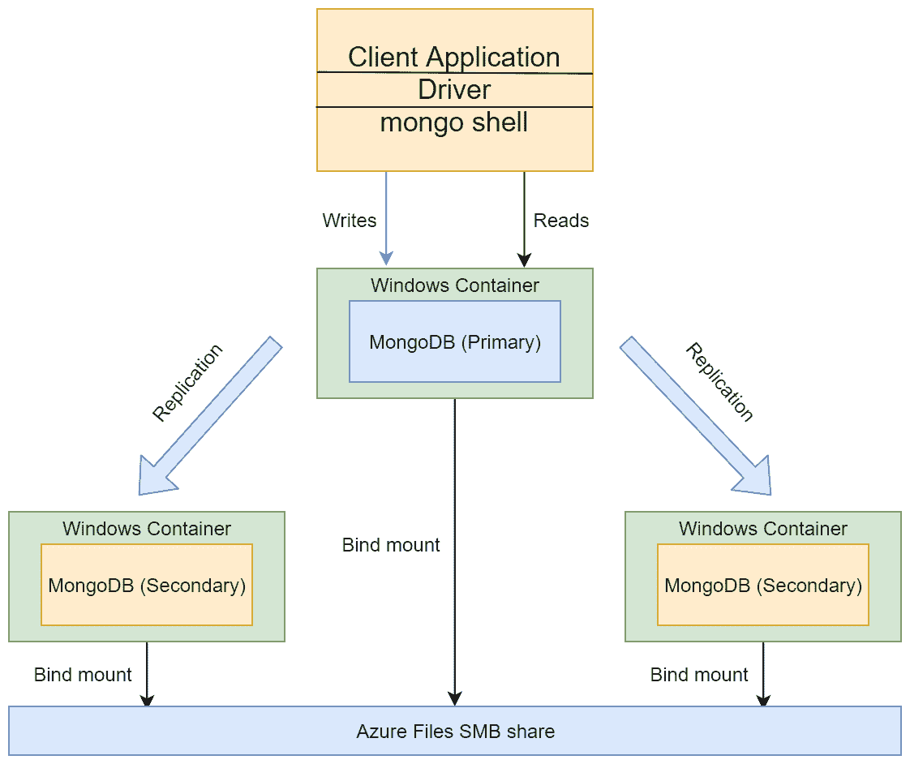
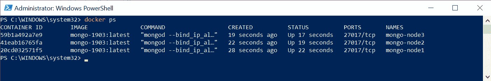
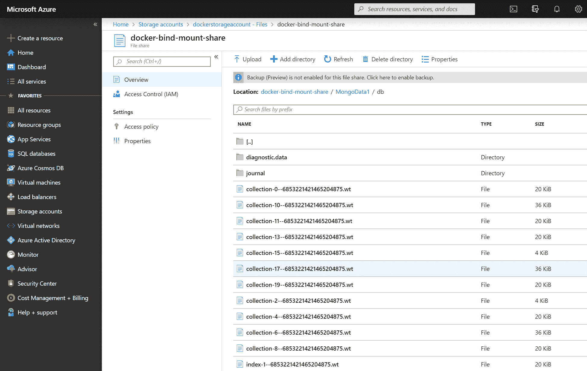

# 二、管理容器中的状态

管理应用的状态是设计任何软件解决方案的关键方面之一，无论它是单块桌面应用还是托管在云环境中的复杂分布式系统。即使系统中的大多数服务是无状态的，系统的某些部分也是有状态的，例如，云托管的 NoSQL 数据库或您自己实现的专用服务。如果您的设计以良好的可扩展性为目标，您必须确保有状态服务的存储能够适当扩展。在这些术语中，Docker 容器中托管的服务或应用没有什么不同–您需要管理状态，尤其是如果您希望数据在容器重新启动或失败时保持不变。

在本章中，我们将让您更好地了解如何在运行于 Windows 上的 Docker 容器中持久化状态，以及这些概念如何与 Kubernetes 应用中的数据持久化相关联。您将了解*卷*和*绑定挂载*的概念，以及如何使用它们来共享容器和容器主机之间的状态。

本章涵盖以下主题:

*   为有状态应用装载本地卷
*   将远程/云存储用于容器存储
*   在容器中运行集群解决方案

# 技术要求

对于本章，您将需要以下内容:

*   安装了 Windows 10 专业版、企业版或教育版(1903 版或更高版本，64 位)
*   适用于 Windows 2.0.0.3 或更高版本的 Docker 桌面

Windows Docker Desktop 的安装及其详细要求在[第 1 章](01.html) *【创建容器】*中进行了介绍。

您还需要自己的 Azure 帐户。您可以在这里阅读更多关于如何获得个人使用的有限免费账户的信息:[https://azure.microsoft.com/en-us/free/](https://azure.microsoft.com/en-us/free/)。

您可以从本书的官方 GitHub 资源库下载本章的最新代码示例:[https://GitHub . com/PacktPublishing/hand-Kubernetes-On-Windows/tree/master/chapter 02](https://github.com/PacktPublishing/Hands-On-Kubernetes-on-Windows/tree/master/Chapter02)。

# 为有状态应用装载本地卷

为了理解有状态应用的本机 Docker 存储选项，我们必须看一下层文件系统是如何组织的。这个文件系统服务的主要作用是基于 Docker 映像为每个容器提供一个虚拟逻辑文件系统。

Docker 映像由一系列只读层组成，其中每一层对应于 Dockerfile 中的一条指令。让我们看一下上一章中的以下 Dockerfile:

```
FROM mcr.microsoft.com/windows/servercore/iis:windowsservercore-1903

RUN powershell -NoProfile -Command Remove-Item -Recurse C:\inetpub\wwwroot\*
WORKDIR /inetpub/wwwroot
COPY index.html .
```

构建 Docker 映像时，(*几乎是*)每个指令都会创建一个新的层，该层只包含给定命令在文件系统中引入的一组差异。在这种情况下，我们有以下内容:

*   `FROM mcr.microsoft.com/windows/servercore/iis:windowsservercore-1903`:此指令从基础映像定义基础层(或一组层)。
*   `RUN powershell -NoProfile -Command Remove-Item -Recurse C:\inetpub\wwwroot\*`:该指令创建的图层将反映从原始基础映像中删除`C:\inetpub\wwwroot\`目录中的内容。
*   `WORKDIR /inetpub/wwwroot`:即使这个指令没有引起任何文件系统的改变，它仍然会创建**无操作** ( **nop** )层来保存这个信息。
*   `COPY index.html .`:这个最终指令在`C:\inetpub\wwwroot\`目录中创建一个由`index.html`组成的图层。

如果您有一个现有的 Docker 映像，您可以使用`docker history`命令自己检查图层:

```
docker history <imageName>
```

例如，对于由前面的 Dockerfile 生成的映像，您可以预期以下输出:



底部的五层来自`mcr.microsoft.com/windows/servercore/iis:windowsservercore-1903`基础映像，而顶部的三层是我们之前描述的指令的结果。

创建新容器时，会创建该容器的文件系统，该文件系统由只读映像层和可写顶层(也称为容器层)组成。对于容器来说，层是透明的，进程将其“视为”一个常规文件系统——在 Windows 系统上，这由 *Windows 容器隔离文件系统*服务*保证。*容器文件系统内部的进程对容器文件系统所做的任何更改都保存在可写层中。这个概念可以在下图中看到:



现在我们已经知道了 Docker 中的层文件系统的原理，我们可以关注*卷*和*绑定挂载*。

# 卷和绑定装载

此时，似乎每个容器都有一个可写容器层就足以为应用提供状态持久性。数据是持久化的，即使您在之后停止并重新启动同一个容器。不幸的是，您会很容易发现容器和它们的可写层是紧密耦合的，并且您不能很容易地在不同的容器甚至是同一映像的新实例之间共享数据。显而易见的一个简单场景如下:

1.  基于您当前的 Dockerfile 构建一个容器映像。
2.  基于此构建启动一个新容器。

3.  对可写容器层进行一些修改；例如，容器内的进程修改了存储应用数据的文件。
4.  现在，您希望通过使用附加说明修改 Dockerfile 来创建映像的新版本。同时，您希望重新创建容器，并重用已经在容器的可写层中修改过的文件中的数据。

您将意识到，在用新的映像版本重新创建容器之后，您使用应用状态对文件所做的所有更改都将消失。除此之外，使用容器层存储数据还有更多缺点:

*   可写层与容器主机相连，这意味着不可能轻松地将数据移动到不同的主机。
*   层文件系统提供的性能比直接访问主机文件系统差。
*   您不能在不同的容器之间共享可写层。

A general rule of thumb is to avoid storing data in a writeable container layer, especially for I/O-intensive applications.

Docker 为可装载到容器中的持久存储提供了两种解决方案:卷装载和绑定装载。在这两种情况下，数据都作为容器文件系统中的目录公开，并将被持久化，即使容器被停止和删除。就性能而言，卷和绑定装载都直接访问主机的文件系统，这意味着没有层文件系统开销。还可以使用这些 Docker 功能在多个容器之间共享数据。

绑定安装提供了一个简单的功能，可以将容器主机中的任何*文件*或*目录*安装到给定的容器中。这意味着绑定装载将充当主机和容器之间的共享文件或目录。一般来说，不建议使用绑定装载，因为它们比卷更难管理，但是在某些情况下，绑定装载是有用的，尤其是在卷支持有限的 Windows 平台上。

Bind mounts allow you to share any files from the container host. This means that if you mount sensitive directories such as `C:\Windows\` to an untrusted container, you risk a security breach.

卷提供了类似的功能来绑定装载，但是它们完全由 Docker 管理，这意味着您不必担心容器的主机文件系统中的物理路径。您可以创建名为的*匿名*或*卷，然后将其装入容器。除非使用 Docker 显式删除卷，否则不会删除卷中的任何数据。卷的一个非常常见的使用情形是为运行数据库实例的容器提供持久存储—当容器被重新创建时，它将使用包含前一个容器实例写入的数据的同一个卷。*

The basic functionality of volumes is that they provide storage in the container host filesystem. It is also possible to use *volume drivers *(*plugins*), which use volume abstraction to access remote cloud storage or network shares. Note that, currently, on the Windows platform, there is limited support for volume plugins and most of them can only be used on the Linux OS. More on the available plugins can be found at [https://docs.docker.com/engine/extend/legacy_plugins/#volume-plugins](https://docs.docker.com/engine/extend/legacy_plugins/#volume-plugins).

现在，让我们看看如何对 Docker 卷执行基本操作。

# 创建和装入卷

创建新卷可以使用`docker volume create`命令明确执行。当容器启动时，也可以自动创建命名卷和匿名卷。要手动创建名为 Docker 的卷，请执行以下步骤:

1.  执行以下命令:

```
docker volume create <volumeName>
```

2.  创建后，您可以使用`docker volume inspect`命令检查卷的详细信息:



如您所见，当使用默认的*本地*驱动程序时，卷数据作为常规目录存储在主机文件系统中。

要将卷装入容器，您必须使用`--mount`或`--volume`(短参数:`-v`)参数来执行`docker run`命令。最初，`--volume`用于独立容器，而`--mount`用于群体容器，但是从 Docker 17.06 开始，`--mount`也可以用于独立容器，并且是推荐的做法，因为它提供了更健壮的选项。关于这些旗帜的更多信息可以在官方文件中找到:[https://docs.docker.com/storage/volumes/#choose-the-v-or-mount-flag](https://docs.docker.com/storage/volumes/#choose-the--v-or---mount-flag)。

按照以下步骤学习如何挂载卷:

1.  假设您想将前一示例中的`test-named-volume`装载到`C:\Data`目录下的新 PowerShell 容器中，您必须指定`--mount`参数，如下所示:

```
docker run -it --rm `
 --isolation=process `
 --mount source=test-named-volume,target=C:\Data `
 mcr.microsoft.com/powershell:windowsservercore-1903
```

Omitting the `source=<volumeName>` parameter will cause the creation of an *anonymous* volume that can be accessed using the volume ID later. Bear in mind that if you run a container with the `--rm` option, anonymous volumes will be automatically deleted when the container is exited.

2.  容器启动并连接终端后，尝试在已装入卷的目录中创建一个简单文件:

```
echo "Hello, Volume!" > C:\Data\test.txt
```

3.  现在，退出容器(这将导致容器停止并由于`--rm`标志而被自动移除)并检查主机上的卷目录:

```
PS C:\WINDOWS\system32> cat C:\ProgramData\Docker\volumes\test-named-volume\_data\test.txt
Hello, Volume!
```

4.  为了演示命名卷可以很容易地装载到另一个容器中，让我们基于`mcr.microsoft.com/windows/servercore:1903`映像创建一个新的容器，并使用不同于上一个示例中的卷装载目标:

```
docker run -it --rm `
 --isolation=process `
 --mount source=test-named-volume,target=C:\ServerData `
 mcr.microsoft.com/windows/servercore:1903
```

5.  如果检查容器中的卷目录，您会注意到`test.txt`文件存在，并且包含预期的内容:

```
C:\>more C:\ServerData\test.txt
Hello, Volume!
```

It is also possible to use the `VOLUME` command in a Dockerfile in order to force the automatic creation of a volume on container start, even if the `--mount` parameter was not provided for the `docker run` command. This is useful if you would like to explicitly inform others of where state data is stored by your application and also when you need to ensure that the layer filesystem is not introducing additional overhead. You can find an example of the `VOLUME` command's usage in the following Dockerfile in the repository for this book: [https://github.com/PacktPublishing/Hands-On-Kubernetes-on-Windows/blob/master/Chapter02/03_MongoDB_1903/Dockerfile#L44](https://github.com/PacktPublishing/Hands-On-Kubernetes-on-Windows/blob/master/Chapter02/03_MongoDB_1903/Dockerfile#L44).

在下一小节中，我们将快速了解如何使用 Docker CLI 删除卷。

# 删除卷

要使用`docker volume rm`命令删除现有的命名卷或匿名卷，它们不能在任何容器中使用(即使是停止的容器)。标准程序如下:

```
docker stop <containerId>
docker rm <containerId>
docker volume rm <volumeId>
```

对于匿名卷，如果使用`docker run`命令的`--rm`标志，容器及其匿名卷将在退出时被移除。这个标志应该根据场景来使用——在大多数情况下，它对于测试和开发目的很有用，可以使清理变得更容易。

在开发过程中，您可能偶尔需要对 Docker 主机上的所有卷执行完全清理，例如，如果您需要释放磁盘空间。Docker CLI 提供了一个专用命令，可以删除任何容器中未使用的任何卷:

```
docker volume prune
```

接下来，我们将了解绑定装载以及它们与卷的区别。

# 使用绑定装载装载本地容器主机目录

绑定装载是容器和主机之间共享的最简单的持久存储形式。这样，您可以从容器中的主机文件系统装载任何现有目录。还可以用主机目录内容“覆盖”容器中的现有目录，这在某些情况下可能很有用。一般来说，卷是推荐的存储解决方案，但在一些情况下，绑定装载会很有用:

*   在主机和容器之间共享配置。一个常见的用例可能是域名系统配置或`hosts`文件。
*   在开发场景中，共享在主机上创建的构建工件，以便它们可以在容器中使用。
*   在 Windows 上，将中小型企业文件共享装载为容器中的目录。

Volumes can be seen as an *evolution* of bind mounts. They are fully managed by Docker, without tight coupling to the container host filesystem being visible to the user.

为容器创建绑定挂载需要使用附加参数`type=bind`为`--mount`标志指定`docker run`命令。在本例中，我们将在容器中将主机的`C:\Users`目录装载为`C:\HostUsers`:

```
docker run -it --rm `
 --isolation=process `
 --mount type=bind,source=C:\Users,target=C:\HostUsers `
 mcr.microsoft.com/powershell:windowsservercore-1903
```

您可以验证对`C:\HostUsers`进行的任何更改在`C:\Users`中的主机上也是可见的。

Windows-specific features and the limitations of bind mounts can be found in the official documentation from Microsoft: [https://docs.microsoft.com/en-us/virtualization/windowscontainers/manage-containers/container-storage#bind-mounts](https://docs.microsoft.com/en-us/virtualization/windowscontainers/manage-containers/container-storage#bind-mounts).

在下一节中，我们将学习如何利用绑定装载，以便在 Windows 容器中使用远程或云存储。

# 将远程/云存储用于容器存储

将数据本地存储在容器主机文件系统中不适合需要高可用性、故障转移和易于数据备份的用例。为了提供存储抽象，Docker 提供了卷驱动程序(插件)，可用于管理托管在远程机器或云服务中的卷。不幸的是，在撰写本书时，运行在内部的 Windows 容器不支持 Linux 操作系统上当前可用的卷插件。在 Windows 容器中使用云存储时，我们有三种选择:

*   使用 Docker for Azure 和 Cloudstor 卷插件，这是一个部分托管的解决方案，用于在 Azure 虚拟机上以*群集*模式运行 Docker。在本书中，我们不会介绍 Azure 的 Docker，因为该解决方案与 Kubernetes 是分开的，包括针对托管 Kubernetes 的 Azure 产品。如果您对此服务有兴趣，请参考[https://docs . docker . com/docker-for-azure/persistent-data-volumes/](https://docs.docker.com/docker-for-azure/persistent-data-volumes/)。
*   使用云服务提供商 SDKs 在应用代码中直接使用云存储。这是最明显的解决方案，但它需要将存储管理嵌入到应用代码中。
*   使用绑定装载和**服务器消息块** ( **中小企业**)全局映射来装载 Azure 文件，这是一个完全托管的云文件共享，可以通过中小企业协议访问。

很快，我们将演示如何利用最后一个选项:Azure 文件的 SMB 全局映射。但是首先，为了管理 Azure 资源，我们必须安装 Azure CLI。

# 安装 Azure 命令行界面和 Azure PowerShell 模块

为了从命令行高效管理 Azure 资源，建议使用官方的 Azure CLI。官方安装说明可在[https://docs . Microsoft . com/en-us/CLI/azure/install-azure-CLI-windows？view = azure-CLI-最新](https://docs.microsoft.com/en-us/cli/azure/install-azure-cli-windows?view=azure-cli-latest)。让我们开始吧:

1.  从 PowerShell 安装 Azure 命令行界面需要以管理员身份运行以下命令:

```
Invoke-WebRequest -Uri https://aka.ms/installazurecliwindows -OutFile .\AzureCLI.msi
Start-Process msiexec.exe -Wait -ArgumentList '/I AzureCLI.msi /quiet'
Remove-Item .\AzureCLI.msi
```

2.  安装 Azure 命令行界面后，您需要重新启动 PowerShell 窗口。接下来，登录您的 Azure 帐户:

```
az login
```

前面的命令将打开您的默认浏览器，并指示您登录到您的 Azure 帐户。

3.  现在，运行以下命令来验证您是否已正确登录:

```
az account show
```

您应该能够看到您的订阅详细信息，如下所示:



除此之外，我们需要安装 Azure PowerShell 模块，因为有些操作在 Azure CLI 中不可用。

4.  可以使用以下命令执行当前登录用户的安装:

```
Install-Module -Name Az -AllowClobber -Scope CurrentUser
```

官方安装步骤可以在这里找到:[https://docs . Microsoft . com/en-us/powershell/azure/install-az-PS？view = azps-2 . 5 . 0 # install-the-azure-powershell-module-1](https://docs.microsoft.com/en-us/powershell/azure/install-az-ps?view=azps-2.5.0#install-the-azure-powershell-module-1)。

5.  如果您在导入新安装的模块时遇到问题，您还需要以管理员身份将 PowerShell 执行策略设置为`RemoteSigned`:

```
Set-ExecutionPolicy RemoteSigned
```

6.  使用 PowerShell 模块登录 Azure 必须与 Azure 命令行界面分开进行，可以使用以下命令执行:

```
Connect-AzAccount
```

此时，您应该能够使用 Azure CLI 和 Azure PowerShell 模块管理您的资源，而无需打开 Azure Portal 网站！让我们看看如何创建 Azure 文件中小企业共享。

# 创建 Azure 文件中小型企业共享

假设您在一个新的 Azure 订阅上遵循这些示例，让我们首先创建一个 Azure 资源组和 Azure 存储帐户:

1.  在 PowerShell 窗口中，执行以下代码:

```
az group create `
 --name docker-storage-resource-group `
 --location westeurope
```

您可以选择最适合您的位置(要显示可用位置列表，请运行`az account list-locations`)。在这个例子中，我们使用的是`westeurope` Azure 位置。

You can also use the PowerShell script in this book's GitHub repository to do this: [https://github.com/PacktPublishing/Hands-On-Kubernetes-on-Windows/blob/master/Chapter02/01_CreateAzureFilesSMBShare.ps1](https://github.com/PacktPublishing/Hands-On-Kubernetes-on-Windows/blob/master/Chapter02/01_CreateAzureFilesSMBShare.ps1). Remember to run this script as an Administrator since global mappings for SMB share must be added from a privileged account.

2.  成功创建 Azure 资源组后，继续创建 Azure 存储帐户:

```
az storage account create `
 --name dockerstorageaccount `
 --resource-group docker-storage-resource-group `
 --location westeurope `
 --sku Standard_RAGRS `
 --kind StorageV2
```

前面的命令将在`docker-storage-resource-group`中创建一个名为`dockerstorageaccount`的`read-access geo-redundant`存储的`general-purpose v2`存储帐户。此操作可能需要几分钟才能完成。

3.  接下来，您必须创建实际的 Azure 文件中小型企业共享。首先，为您的 Azure 存储帐户创建一个连接字符串，并将其作为一个变量存储在 PowerShell 中:

```
$azureStorageAccountConnString = az storage account show-connection-string `
 --name dockerstorageaccount `
 --resource-group docker-storage-resource-group `
 --query "connectionString" `
 --output tsv

if (!$azureStorageAccountConnString) {
 Write-Error "Couldn't retrieve the connection string."
}
```

请记住保持连接字符串的安全，因为它可以用来管理您的存储帐户！

4.  使用存储在`$azureStorageAccountConnString`变量中的连接字符串，创建共享:

```
az storage share create `
 --name docker-bind-mount-share `
 --quota 2 `
 --connection-string $azureStorageAccountConnString 
```

这将创建一个名为`docker-bind-mount-share`的共享，配额限制为 2 GB，我们现在将在 Docker 容器中使用它。

# 在容器中装载 Azure 文件中小企业共享

为了将新的 Azure 文件 SMB 共享作为绑定装载装载到容器中，我们将利用 Window Server 1709 中引入的 *SMB 全局映射*功能。为此专门引入了全局映射，即在主机上装载 SMB 共享，以便容器可以看到它们。让我们开始吧:

1.  首先，确保您已经登录，以便可以执行 Azure PowerShell(使用`Connect-AzAccount`命令)。
2.  接下来，让我们定义一些变量，这些变量将在我们即将执行的命令中使用:

```
$resourceGroupName = "docker-storage-resource-group"
$storageAccountName = "dockerstorageaccount"
$fileShareName = "docker-bind-mount-share"
```

这里使用的名称与我们在创建 Azure 文件中小企业共享时在上一小节中使用的名称完全相同。

3.  下一步是定义`$storageAccount`和`$storageAccountKeys`变量:

```
$storageAccount = Get-AzStorageAccount `
 -ResourceGroupName $resourceGroupName `
 -Name $storageAccountName
$storageAccountKeys = Get-AzStorageAccountKey `
 -ResourceGroupName $resourceGroupName `
 -Name $storageAccountName
```

这些变量将用于检索文件共享详细信息和访问凭据，这两者都是中小型企业全局映射所必需的。

4.  现在，*可选地*，您可以使用`cmdkey`命令在 Windows 凭据管理器中保存您的共享凭据:

```
Invoke-Expression -Command `
 ("cmdkey /add:$([System.Uri]::new($storageAccount.Context.FileEndPoint).Host) " + `
 "/user:AZURE\$($storageAccount.StorageAccountName) /pass:$($storageAccountKeys[0].Value)")
```

5.  我们还需要关于 Azure Files SMB 共享的详细信息，因此让我们定义一个名为`$fileShare`的新变量:

```
$fileShare = Get-AzStorageShare -Context $storageAccount.Context | Where-Object { 
    $_.Name -eq $fileShareName -and $_.IsSnapshot -eq $false
}
```

6.  此时，您还可以检查文件共享详细信息是否已成功检索。通过这样做，您将能够检测到，例如，`$fileShareName`是否包含错误的共享名:

```
if ($fileShare -eq $null) {
    Write-Error "Azure File share not found"
}
```

7.  创建中小型企业全局映射之前的最后一步是定义凭据对象，该对象将用于映射创建:

```
$password = ConvertTo-SecureString `
    -String $storageAccountKeys[0].Value `
    -AsPlainText `
    -Force
$credential = New-Object System.Management.Automation.PSCredential `-ArgumentList "AZURE\$($storageAccount.StorageAccountName)", $password
```

8.  最后，我们可以使用`New-SmbGlobalMapping`命令来创建 Azure 文件 SMB 共享的映射:

```
New-SmbGlobalMapping `
 -RemotePath "\\$($fileShare.StorageUri.PrimaryUri.Host)\$($fileShare.Name)" `
 -Credential $credential `
 -Persistent $true `
 -LocalPath G:
```

If you need to remove SMB Global Mapping, you can do so using the `Remove-SmbGlobalMapping` command.

前面的命令将把您的 Azure 文件中小企业共享永久挂载为`G:`驱动器。您可以稍后将此路径用于 Docker 容器的绑定装载。现在，您可以通过使用 Windows 资源管理器将一些测试文件移动到`G:`驱动器来测试您的映射是否正常工作。

The principle of using bind mount for a globally mapped SMB share can be used for any SMB-compatible server, such as the following:

*   托管在本地网络中的传统文件服务器
*   中小型企业协议的第三方实施，如网络连接存储设备
*   传统存储区域网络或**横向扩展文件服务器** ( **固态硬盘**)位于**存储空间直接** ( **S2D** )

当全局映射的中小型企业共享用作绑定装载时，对于容器来说，它们作为本地文件系统中的常规目录是透明可见的。所有“繁重的工作”都由负责管理中小型企业共享连接的容器主机执行。

让我们通过创建一个简单的 PowerShell 进程隔离容器来演示这个特性:

1.  首先，在 SMB 共享中为我们的演示容器创建一个名为`G:\ContainerData`的目录:

```
 New-Item -ItemType Directory -Force -Path G:\ContainerData
```

2.  现在，我们可以通过提供 Azure Files SMB 共享中的新目录作为绑定挂载来运行容器，并将`C:\Data`作为目标:

```
docker run -it --rm `
 --isolation=process `
 --mount type=bind,source=G:\ContainerData,target=C:\Data               `mcr.microsoft.com/powershell:windowsservercore-1903
```

有了这个，我们可以很容易地证明我们的解决方案是有效的，并且容器状态文件确实存储在 Azure Cloud 中！

3.  在运行容器中，创建一个包含数据的文件。例如，获取当前正在运行的进程列表，并将其存储为`processes.txt`文件:

```
Get-Process > C:\Data\processes.txt
```

4.  现在，登录 Azure 门户(`https://portal.azure.com/`)并执行以下操作:
    1.  从主菜单导航到存储帐户。
    2.  打开 dockerstorageaccount 帐户。
    3.  在存储帐户菜单中，打开文件服务组下的文件。
    4.  从列表中打开 docker-bind-mount-share 文件共享。

您将看到一个熟悉的目录结构。导航到容器数据目录，查看`processes.txt`文件确实在那里，并且包含存储在容器中的数据:



In Kubernetes, a similar procedure can be performed in a managed way using *volumes* (not to be confused with Docker volumes). We will focus on this in [Chapter 11](11.html), *Configuring Applications to Use Kubernetes Features*. You can also refer to the official documentation: [https://kubernetes.io/docs/concepts/storage/](https://kubernetes.io/docs/concepts/storage/).

请注意，这种情况也可以通过本地网络中托管的常规中小型企业文件服务器来实现，如果您已经在基础架构中使用它们，这可能是一个合适的解决方案。

恭喜你！您已经成功创建了一个使用 Azure 云存储来保存容器状态的 Windows 容器。在下一节中，我们将学习如何在 Windows 容器中运行 MongoDB，作为多容器解决方案的示例。

# 在容器中运行集群解决方案

MongoDB 是一个免费的开源跨平台、面向文档的数据库程序，可以在集群模式下运行(使用分片和 ReplicaSets)。在本例中，我们将运行一个三节点 MongoDB ReplicaSet，因为它比完整的分片集群更容易配置，并且足以演示持久存储容器状态数据的原理。

If you would like to learn more about MongoDB and advanced sharded cluster components, please refer to the official documentation: [https://docs.mongodb.com/manual/core/sharded-cluster-components/](https://docs.mongodb.com/manual/core/sharded-cluster-components/).

我们的 MongoDB 副本集体系结构如下所示:



主节点负责管理所有写操作，一个复制集中只能有一个主节点。辅助节点仅复制主节点的*操作日志*，并应用数据操作，以便它们的数据集反映主节点的数据集。这种 MongoDB 部署的主要好处如下:

*   **自动故障转移**:如果主节点变得不可用，其余辅助节点将执行新的领导者选举并恢复集群功能。
*   **使用辅助设备读取数据的可能性**:您可以指定读取首选项，以便客户端卸载主设备进行读取操作。但是，您必须注意，异步复制可能会导致辅助节点与主节点稍微不同步。

现在，让我们创建我们的 MongoDB 副本集！

# 创建蒙古数据库副本集

按照以下步骤创建复制集:

1.  首先，让我们使用`docker network create`命令为新集群创建一个名为`mongo-cluster`的 Docker 网络:

```
docker network create --driver nat mongo-cluster
```

If you would like to learn more about Docker networks, please refer to the official documentation: [https://docs.docker.com/network/](https://docs.docker.com/network/).
For Windows-specific documentation, please go to [https://docs.microsoft.com/en-us/virtualization/windowscontainers/container-networking/network-drivers-topologies](https://docs.microsoft.com/en-us/virtualization/windowscontainers/container-networking/network-drivers-topologies).

我们将使用我们在上一节中创建的 Azure Files SMB 共享(全局映射到`G:`驱动器)，以便使用绑定挂载来存储 MongoDB 的状态。

2.  我们需要在 SMB 共享中创建新目录，每个 MongoDB 节点两个:

```
New-Item -ItemType Directory -Force -Path G:\MongoData1\db
New-Item -ItemType Directory -Force -Path G:\MongoData1\configdb
New-Item -ItemType Directory -Force -Path G:\MongoData2\db
New-Item -ItemType Directory -Force -Path G:\MongoData2\configdb
New-Item -ItemType Directory -Force -Path G:\MongoData3\db
New-Item -ItemType Directory -Force -Path G:\MongoData3\configdb
```

目前，Windows 的官方 MongoDB 映像只存在于 Windows Server Core 1803 中，这意味着我们将不得不使用 Hyper-V 隔离在 Windows 1903 上运行这样的容器。这意味着我们不能利用 SMB 全局映射，所以我们需要基于 Windows Server Core 1903 创建自己的 MongoDB 映像。这将使我们有可能使用进程隔离。我们要构建的映像基于 4.2.0 RC8 版本的官方 MongoDB 映像，可以在这里找到:[https://github . com/docker-library/mongo/blob/a3a 213 FD 2 B4 B2C 26 c 71408761534 fc 7 ea AFE 517 f/4.2-RC/windows/windowsservercore-1803/Dockerfile](https://github.com/docker-library/mongo/blob/a3a213fd2b4b2c26c71408761534fc7eaafe517f/4.2-rc/windows/windowsservercore-1803/Dockerfile)。要执行构建，请执行以下步骤:

1.  从本书的 GitHub 资源库下载 docker file:[https://GitHub . com/PacktPublishing/hand-On-Kubernetes-On-Windows/blob/master/chapter 02/03 _ MongoDB _ 1903/docker file](https://github.com/PacktPublishing/Hands-On-Kubernetes-on-Windows/blob/master/Chapter02/03_MongoDB_1903/Dockerfile)。

2.  在 PowerShell 中，导航到下载 Dockerfile 的位置(建议使用新的单独目录)。
3.  执行`docker build`命令，以便在本地映像注册表中创建名为`mongo-1903`的自定义 MongoDB 映像:

```
docker build -t mongo-1903:latest .
```

构建过程需要几分钟时间，因为 MongoDB 必须下载并安装在构建容器中。

该映像还将 MongoDB 数据显示为容器内`C:\data\db`和`C:\data\configdb`下的卷。考虑到所有这些，让我们创建第一个名为`mongo-node1`的 MongoDB 进程隔离容器，它将在后台运行(使用`-d`选项):

```
docker run -d `
 --isolation=process `
 --volume G:\MongoData1\db:C:\data\db `
 --volume G:\MongoData1\configdb:C:\data\configdb `
 --name mongo-node1 `
 --net mongo-cluster `
 mongo-1903:latest `
 mongod --bind_ip_all --replSet replSet0
```

在运行这个容器时，我们提供了一个自定义命令来运行容器进程，即`mongod --bind_ip_all --replSet replSet0`。`--bind_ip_all`参数指示 MongoDB 绑定到容器中所有可用的网络接口。对于我们的用例，`--replSet replSet0`参数确保守护程序在复制集模式下运行，期望在名为`replSet0`的复制集中运行。

成功创建第一个节点后，对接下来的两个节点重复此过程，适当更改它们的名称和卷装载点:

```
docker run -d `
 --isolation=process `
 --volume G:\MongoData2\db:C:\data\db `
 --volume G:\MongoData2\configdb:C:\data\configdb `
 --name mongo-node2 `
 --net mongo-cluster `
 mongo-1903:latest `
 mongod --bind_ip_all --replSet replSet0

docker run -d `
 --isolation=process `
 --volume G:\MongoData3\db:C:\data\db `
 --volume G:\MongoData3\configdb:C:\data\configdb `
 --name mongo-node3 `
 --net mongo-cluster `
 mongo-1903:latest `
 mongod --bind_ip_all --replSet replSet0
```

创建过程完成后，您可以使用`docker ps`命令验证容器是否正常运行:



The preceding steps have also been provided as a PowerShell script in this book's GitHub repository: [https://github.com/PacktPublishing/Hands-On-Kubernetes-on-Windows/blob/master/Chapter02/02_InitializeMongoDBReplicaSet.ps1](https://github.com/PacktPublishing/Hands-On-Kubernetes-on-Windows/blob/master/Chapter02/02_InitializeMongoDBReplicaset.ps1).

下一步是配置复制集。我们将使用 mongo shell 实现这一点。请遵循以下步骤:

1.  创建 mongo shell 的实例。如果您已经运行了一个 MongoDB 容器(例如，`mongo-node1`)，最简单的方法是将`exec`放入一个现有的容器中并运行`mongo`过程:

```
docker exec -it mongo-node1 mongo
```

2.  几秒钟后，您应该会看到 mongo shell 控制台提示，`>`。您可以使用`rs.initiate()`方法初始化复制集:

```
rs.initiate(
  {
    "_id" : "replSet0",
    "members" : [
      { "_id" : 0, "host" : "mongo-node1:27017" },
      { "_id" : 1, "host" : "mongo-node2:27017" },
      { "_id" : 2, "host" : "mongo-node3:27017" }
    ]
  }
)
```

前面的命令使用我们的三个节点创建了一个名为`replSet0`的复制集。这些可以通过它们在`mongo-cluster` Docker 网络中的域名来识别。

For more details regarding the initialization of ReplicaSets, please refer to the official documentation: [https://docs.mongodb.com/manual/reference/method/rs.initiate/](https://docs.mongodb.com/manual/reference/method/rs.initiate/).

3.  您也可以使用 mongo shell 中的`rs.status()`命令验证初始化状态。过了一会儿，当复制集完全初始化时，在命令 JSON 输出中，您应该能够在命令的输出中看到一个节点中带有`"stateStr": "PRIMARY"`的复制集和另外两个节点中带有`"stateStr": "SECONDARY"`的复制集。

在下一小节中，我们将通过生成测试数据并在另一个容器中读取它来快速验证我们的复制集。

# 写入和读取测试数据

按照以下步骤写入和读取测试数据:

1.  首先，在 ReplicaSet 主节点的 mongo shell 中(作为提示，您将看到`replSet0:PRIMARY>`，让我们在`demo`集合中添加 1000 个示例文档:

```
for (var i = 1; i <= 1000; i++) {
 db.demo.insert( { exampleValue : i } )
}
```

2.  您可以使用`demo`集合上的`find()`方法快速验证插入的文档:

```
db.demo.find()
```

3.  现在，我们将创建一个极简主义。在 Docker 容器中运行的. NET Core 3.0 控制台应用。这将连接到在我们的 Docker 容器中运行的 ReplicaSet，查询我们的`demo`集合，并将每个文档的`exampleValue`值写入标准输出。

你可以在本书的 GitHub 资源库中找到这个的源代码和 Dockerfile:[https://GitHub . com/PacktPublishing/hand-On-Kubernetes-On-Windows/tree/master/chapter 02/04 _ MongoDB _ dotnet](https://github.com/PacktPublishing/Hands-On-Kubernetes-on-Windows/tree/master/Chapter02/04_MongoDB_dotnet)。

If, during the execution of this scenario, you experience any instability issues with MongoDB, consider upgrading the `mongo-1903` Dockerfile to the latest MongoDB version.

为了读取我们的测试数据，我们需要构建应用 Docker 映像，并创建一个在`mongo-cluster`网络中运行的容器。为此，请执行以下步骤:

1.  克隆存储库，导航到 PowerShell 中的`Chapter02/04_MongoDB_dotnet`目录。
2.  在当前目录中执行`docker build`以创建`mongo-dotnet-sample` Docker 映像:

```
docker build -t mongo-dotnet-sample:latest .
```

3.  运行样本容器。这需要连接到`mongo-cluster`网络:

```
docker run --isolation=process `
 --rm `
 --net mongo-cluster `
 mongo-dotnet-sample:latest
```

在输出中，您应该会看到一个递增的数字序列，这是我们测试文档中`exampleValue`的值:


如果您有兴趣，可以在 Azure Portal([https://portal.azure.com/](https://portal.azure.com/))上查看 SMB 共享包含的内容:



恭喜你！您已经成功创建并测试了一个在 Windows 容器中运行的 MongoDB 复制集，其中 Azure Files SMB 共享被用作存储数据的绑定挂载。让我们快速总结一下本章所学的内容。

# 摘要

在本章中，您学习了 Windows 上 Docker 存储的关键方面:使用卷和绑定装载。在 Azure 的帮助下，您成功地设置了 Azure 文件中小企业共享，该共享可用于使用中小企业全局映射存储容器状态数据。最后但同样重要的是，您通过设置自己的三节点 MongoDB 副本集来完成所有这些，该副本集由 Azure 云存储支持，并验证了您的设置！

下一章将是最后一章纯粹关注 Windows 平台上的 Docker。您可以期望了解如何使用 Docker 映像的基础知识，以及如何在应用开发生命周期中使用它们。之后，我们将准备好开始我们的旅程。

# 问题

1.  Docker 存储体系结构中的容器层是什么？
2.  卷和绑定装载有什么区别？
3.  为什么不建议在容器层存储容器状态数据？
4.  如何在容器中透明地装载 Azure 文件中小企业共享？
5.  可以在 Hyper-V 隔离运行的容器中使用绑定挂载吗？
6.  什么命令删除容器主机上所有未使用的卷？
7.  什么是卷驱动程序(插件)？

你可以在本书的*评估*部分找到这些问题的答案。

# 进一步阅读

*   有关在 Docker(不仅在 Windows 上)中管理状态和卷的更多信息，请参考以下 Packt 书籍:
*   *学习 Docker–Docker 18 . x*的基础知识。
*   您也可以参考 Docker 官方文档，该文档很好地概述了 Docker 本身可能的存储选项:[https://docs.docker.com/storage/](https://docs.docker.com/storage/)。