# 使用容器图像

基于容器的软件开发生命周期需要简单的映像打包和可靠的方法来分发容器化的应用程序——这些是 Docker 生态系统已经解决的关键方面。我们在前面的章节中使用了 Dockerfiles 和 Docker 图像。简而言之，Dockerfile 定义了用于创建 Docker 映像的构建指令，Docker 映像是容器数据的不可变分层快照，可用于实例化容器。这两个概念允许我们为容器应用程序创建简单和标准化的包装。为了给 Docker 映像提供可靠且可扩展的分发，我们可以使用映像注册表。

在本章中，我们将重点介绍 Docker 注册中心的使用，主要是可公开访问的 Docker Hub 和私有的 Azure 容器注册中心，我们还将介绍 Docker 内容信任——一个用于发布和管理签名内容集合的概念。有了这个容器映像管理的介绍，你就可以在 Windows 上完全进入 Kubernetes 的世界了！

本章将涵盖以下主题:

*   存储和共享容器图像
*   使用云容器构建器
*   图像标记和版本控制
*   确保形象供应链的完整性

# 技术要求

对于本章，您将需要以下内容:

*   安装了 Windows 10 专业版、企业版或教育版(1903 版或更高版本，64 位)。
*   安装了 Windows 2.0.0.3 或更高版本的 Docker 桌面。
*   安装了 Azure 命令行界面。您可以在[第 2 章](02.html) *【容器内状态管理】*中找到详细的安装说明。

Windows Docker Desktop 的安装及其详细要求在[第 1 章](01.html) *【创建容器】*中进行了介绍。

为了能够使用云托管的注册中心，您将需要自己的 Azure 帐户。如果您还没有为前几章创建帐户，您可以在这里找到如何获得个人使用的有限免费帐户:[https://azure.microsoft.com/en-us/free/](https://azure.microsoft.com/en-us/free/)。

您可以从本书的官方 GitHub 资源库下载本章的最新代码示例:[https://GitHub . com/PacktPublishing/hand-Kubernetes-On-Windows/tree/master/chapter 03](https://github.com/PacktPublishing/Hands-On-Kubernetes-on-Windows/tree/master/Chapter03)。

# 存储和共享容器图像

到目前为止，您已经使用`docker pull hello-world`命令拉出了第一个`hello-world`容器，甚至使用了`docker run hello-world`命令。在引擎盖下，在图像拉伸过程中会发生一些事情:

1.  Docker 引擎连接到所谓的 Docker 映像注册表。可以明确指定注册表，但默认情况下，这是官方公共注册表，称为 Docker Hub([https://hub.docker.com/](https://hub.docker.com/))。
2.  如果需要，Docker 引擎向注册表进行身份验证。如果您正在为 Docker Hub 运行私有注册表或付费计划，则可能会出现这种情况。
3.  选择的`hello-world`图像作为一组由 SHA256 摘要识别的图层下载。每一层下载后都要解包。
4.  图像存储在本地。

如果您执行`docker run`命令，并且图像不在本地存储中，也会发生类似的过程。第一次，它将被拉出，稍后，将使用本地缓存的图像。

If you are familiar with GitHub or other source repository managed hosting, you will find many concepts in image management and image registries similar.

因此，直观地说，图像注册表是一个用于存储 Docker 图像的有组织的分层系统。图像的层次结构由以下级别组成:

*   **注册表**:这是层级的顶层。
*   **存储库**:注册管理机构托管多个存储库，它们是图像的存储单元。
*   **标签**:单个图像的版本标签。存储库对由相同图像名称和不同标签标识的多个图像进行分组。

注册表中的每个图像都由图像名称和标签标识，上面的层次结构反映在最终的图像名称中。使用以下方案:`<registryAddress>/<userName>/<repositoryName>:<tag>`，例如:`localregistry:5000/ptylenda/test-application:1.0.0`。使用 Docker 命令时，其中一些部分是可选的，如果不提供值，将使用默认值:

*   `<registryAddress>`是用于存储映像的注册表的 DNS 名称或 IP 地址(连同端口)。如果省略此部分，将使用默认的 Docker Hub 注册表(`docker.io`)。目前，没有办法更改注册表地址的默认值，所以如果您想使用自定义注册表，您必须始终提供这一部分。
*   `<userName>`标识拥有该图像的用户或组织。在 Docker Hub 的情况下，这是所谓的 Docker ID。是否需要这一部分取决于注册表——对于 Docker Hub，如果您不提供 Docker ID，它将采用官方图像，这是由 Docker 维护和审查的一组精选的 Docker 存储库。
*   `<repositoryName>`是您账户中唯一的名称。图像名称形成为`<registryAddress>/<userName>/<repositoryName>`。
*   `<tag>`是给定图像库中用于组织图像的唯一标签，在大多数情况下使用版本控制方案，例如`1.0.0`。如果未提供该值，将使用默认值`latest`。在本章的后面，我们将重点关注图像的标记和版本控制。

With multi-architecture Docker image variants, it is possible to have different images under the same image name and tag for different architectures. The version of the image will be automatically chosen based on the architecture of the machine running the Docker client. Identifying such images can be performed explicitly using an additional `@sha256:<shaTag>` part after the image tag, for example, `docker.io/adamparco/demo:latest@sha256:2b77acdfea5dc5baa489ffab2a0b4a387666d1d526490e31845eb64e3e73ed20`. For more details, please go to [https://engineering.docker.com/2019/04/multi-arch-img/](https://engineering.docker.com/2019/04/multi-arch-img/).

现在您已经知道了如何识别 Docker 映像，让我们来看看如何将映像推送到 Docker 注册表。

# 将图像推送到 Docker 注册表

使用注册表共享容器映像是通过映像推送来执行的。此过程将所需的图像层上传到注册表中的选定存储库，并使其可供有权访问给定存储库的其他用户提取。在 Docker Hub 的例子中，我们将在这个演示中使用它，您的存储库将是公共的，除非您有一个付费计划。

将图像推送到 Docker 集线器需要身份验证。如果您尚未在 Docker Hub 注册，请导航至[https://hub.docker.com/](https://hub.docker.com/)并按照那里的说明进行操作。注册后，您将需要您的 Docker ID 和密码，以便使用`docker login`命令登录服务:

```
PS C:\WINDOWS\system32> docker login 
Login with your Docker ID to push and pull images from Docker Hub. If you don't have a Docker ID, head over to https://hub.docker.com to create one.
Username: packtpubkubernetesonwindows
Password:
Login Succeeded
```

在本书中，我们将使用`packtpubkubernetesonwindows` Docker ID 来演示我们的示例。建议您创建自己的帐户，以便能够完全遵循本书中的示例。请遵循以下步骤:

1.  第一步是创建一个实际上可以推送到注册表的映像。我们将使用以下 Dockerfile 来创建图像:

```
FROM mcr.microsoft.com/windows/servercore/iis:windowsservercore-1903

WORKDIR /inetpub/wwwroot
RUN powershell -NoProfile -Command ; \
    Remove-Item -Recurse .\* ; \
    New-Item -Path .\index.html -ItemType File ; \
    Add-Content -Path .\index.html -Value \"This is an IIS demonstration!\"
```

这个 Dockerfile 创建了一个 IIS 网络主机映像，它提供了一个显示的极简网页。这是一个 IIS 演示！。

2.  将 Dockerfile 保存在当前目录中。要构建它，发出以下`docker build`命令:

```
docker build -t <dockerId>/iis-demo .
```

请记住，您必须提供您的 Docker ID 作为存储库名称的一部分，以便能够将映像推送到 Docker Hub。

3.  成功构建后，您就可以对注册表执行映像推送了。这可以通过`docker push`命令来执行:

```
docker push <dockerId>/iis-demo
```

下面的屏幕截图显示了前面命令的输出:

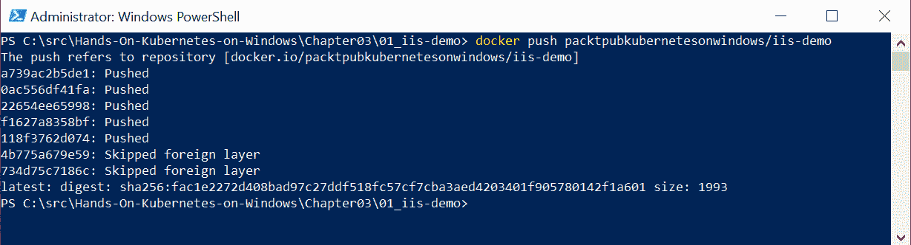

Docker 将图像作为一组层推送，如果正在使用已知的层，这也会优化推送过程。此外，请注意，在基于窗口的图像的情况下，您将看到跳过的外部层消息。这样做的原因是，任何来自 Docker Hub 之外的注册表的层，如**微软容器注册表** ( **MCR** )都不会被推送到 Docker Hub。

现在，您还可以导航到 Docker Hub 网页并查看您的图像详细信息–例如，您可以在此处查看图像:[https://cloud . Docker . com/repository/Docker/packtpubkubernetsonwindows/IIS-demo/](https://cloud.docker.com/repository/docker/packtpubkubernetesonwindows/iis-demo/)。任何有权访问您的存储库的用户现在都可以使用`docker pull <dockerId>/iis-demo`命令来使用您的图像。

您已成功将您的第一张图片推送到 Docker Hub！现在，让我们看一下将图像推送到自定义图像注册表。

# 使用自定义本地注册表

在为您的图像选择存储时，您不仅限于使用默认的 Docker Hub。事实上，在大多数情况下，当您运行生产代码时，您可能希望使用本地托管的 Docker 注册表，这是一个开源的、高度可扩展的应用程序，用于存储和分发 Docker 映像。您应该在以下情况下考虑此解决方案:

*   您希望在隔离的网络中分发 Docker 映像
*   您需要严格控制图像的存储和分发位置
*   您希望补充您的配置项/光盘工作流，以实现更快、更可扩展的图像交付

关于 Docker Registry 部署的详细信息可以在官方文档中找到:[https://docs.docker.com/registry/deploying/](https://docs.docker.com/registry/deploying/)。

For Kubernetes deployments, it is a common practice to host your own Docker Registry alongside or even inside the Kubernetes cluster. There are numerous automations available for this use case, for example, the official Helm chart for the deployment of registries on Kubernetes: [https://github.com/helm/charts/tree/master/stable/docker-registry](https://github.com/helm/charts/tree/master/stable/docker-registry).

为了使用自定义映像注册表，当使用拉或推命令时，您只需在映像名称中指定注册表地址(和端口，如果需要)，例如`localregistry:5000/ptylenda/test-application:1.0.0`，其中`localregistry:5000`是本地托管的 Docker 注册表的域名和端口。事实上，当您为演示 Windows IIS 应用程序提取图像时，您已经使用了自定义 Docker 图像注册表:`mcr.microsoft.com/windows/servercore/iis:windowsservercore-1903`。`mcr.microsoft.com`注册表是 MCR，它是微软发布图像的官方注册表。其他公共注册中心和 MCR 的主要区别在于，它与 Docker Hub 紧密集成，并利用其 UI 提供可浏览的图像目录。Docker Engine 能够使用任何公开 Docker 注册表 HTTP API([https://docs.docker.com/registry/spec/api/](https://docs.docker.com/registry/spec/api/))作为容器映像注册表的系统。

Currently, it is not possible to change the default container image registry for Docker Engine. Unless you specify the registry address in the image name, the target registry will always be assumed to be `docker.io`.

除了托管您自己的本地映像注册表之外，还有两种基于云的替代方案可以提供私有映像注册表:

*   **Azure Container Registry**(**ACR**)[https://Azure . Microsoft . com/en-in/services/Container-Registry/](https://azure.microsoft.com/en-in/services/container-registry/))。我们将在下一节介绍这个注册表，作为如何使用云托管构建容器的演示的一部分。
*   Docker 企业及其 Docker 可信注册中心([https://www.docker.com/products/image-registry](https://www.docker.com/products/image-registry))。
*   IBM 云容器注册中心([https://www.ibm.com/cloud/container-registry](https://www.ibm.com/cloud/container-registry))。
*   谷歌云容器注册([https://cloud.google.com/container-registry/](https://cloud.google.com/container-registry/)[)。](https://cloud.google.com/container-registry/)
*   红帽码头. io 和码头企业( [https://quay.io](https://quay.io) )。如果您不仅希望在内部托管注册中心，还希望在内部托管构建自动化和网络目录，那么 Quay 是一个有趣的解决方案，类似于 Docker Hub。

在下一节中，您将学习如何使用 Docker Hub 自动构建 Docker 映像，以及如何使用 ACR 托管您自己的注册表。

# 使用云容器构建器

Docker Hub 提供的功能之一是**自动化构建** ( **自动构建**)。这在连续集成和连续部署场景中特别有用，在这些场景中，您希望确保每次推送代码存储库都会导致构建、发布，并可能导致部署。

Currently, Docker Hub does not support Windows images, but this is likely to change in the near future. We will demonstrate this usage on a Linux image, but all the principles remain the same. For Windows container cloud builds, check out the next section about Azure Container Registry.

要设置自动生成，请完成以下步骤:

1.  创建一个 GitHub 存储库，其中包含您的应用程序代码，以及定义应用程序 Docker 映像的 Docker 文件。
2.  创建 Docker Hub 存储库并添加自动构建触发器。此触发器也可以在创建存储库后添加。

3.  自定义生成规则。
4.  或者，启用自动测试。这是 Docker Hub 提供的一个验证特性，您可以在其中定义您的测试套件，以便测试每个新的图像推送。

让我们从创建一个 GitHub 存储库开始！

# 创建 GitHub 存储库

如果你没有 GitHub 账号，可以在[https://github.com/join](https://github.com/join)免费创建一个。在本例中，我们将在`hands-on-kubernetes-on-windows`组织中创建一个名为`nginx-demo-index`的专用公共存储库。让我们开始吧:

1.  导航至[https://github.com/](https://github.com/)并使用 *+* 标志创建新的存储库:


不需要托管组织；您可以只使用自己的个人命名空间。该存储库旨在仅包含应用程序源代码(在我们的例子中，只是一个静态的`index.html`网页)和构建映像所需的 Dockerfile，这与 Docker 开发的建议最佳实践相一致。

2.  创建存储库后，我们可以为图像推送一些源代码。您可以在本书的 GitHub 资源库中找到我们使用 nginx 托管静态网页的极简 Docker 映像的源代码:[https://GitHub . com/packt publishing/hand-On-Kubernetes-On-Windows/tree/master/chapter 03/02 _ nginx-demo-index](https://github.com/PacktPublishing/Hands-On-Kubernetes-on-Windows/tree/master/Chapter03/02_nginx-demo-index)。
3.  为了克隆新创建的存储库，在 PowerShell 中，导航到您想要存储库的目录，并使用`git clone`命令:

```
git clone https://github.com/<userName>/<repositoryName>.git
```

4.  将所有需要的源文件复制到存储库中，并使用`git push`命令执行推送:

```
git add -A
git commit -am "Docker image source code"
git push -u origin master
```

5.  此时，当您导航到 GitHub 网页时，应该能够看到存储库中的文件，例如，[https://GitHub . com/hand-kubernetes-on-windows/nginx-demo-index](https://github.com/hands-on-kubernetes-on-windows/nginx-demo-index):

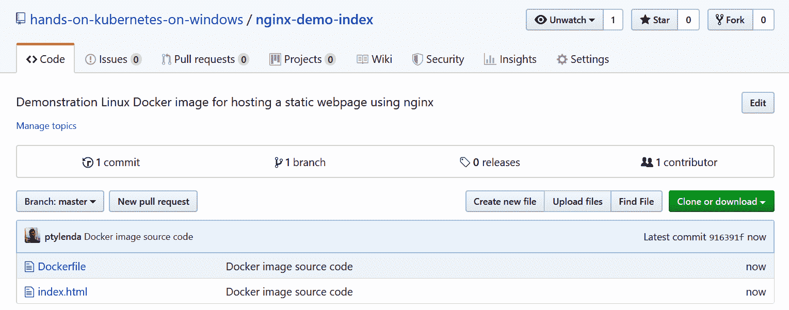

下一步是创建实际的 Docker Hub 存储库并配置自动构建。我们继续！

# 使用自动构建创建 Docker Hub 存储库

将 Docker Hub 存储库与自动构建集成需要将您的 GitHub 帐户连接到您的 Docker Hub 帐户，并创建存储库本身。让我们开始吧:

1.  打开[https://hub.docker.com/](https://hub.docker.com/)并导航至账户设置。在链接帐户部分，单击 GitHub 提供商的连接:

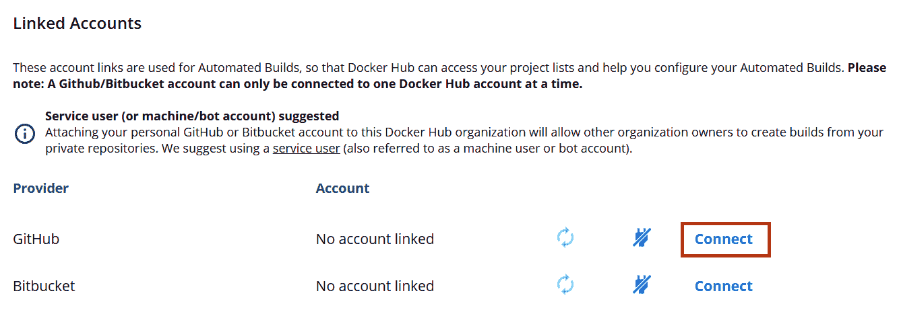

2.  授权 Docker 集线器构建器访问您的存储库。此时，如果需要，您还可以授予对任何组织的访问权限。
3.  连接帐户后，再次打开[https://hub.docker.com/](https://hub.docker.com/)，点击创建存储库部分的 *+* 按钮:

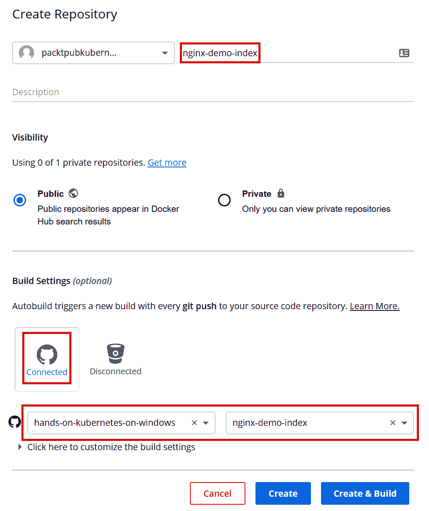

4.  填写所有需要的细节。在我们的例子中，我们的存储库的名称将是`packtpubkubernetesonwindows/nginx-demo-index`。
5.  在构建设置中，选择 GitHub 图标并选择您刚刚创建的 GitHub 存储库，如前面的截图所示。

6.  通过单击“单击此处”自定义生成设置来检查生成设置，以便了解默认配置是什么:

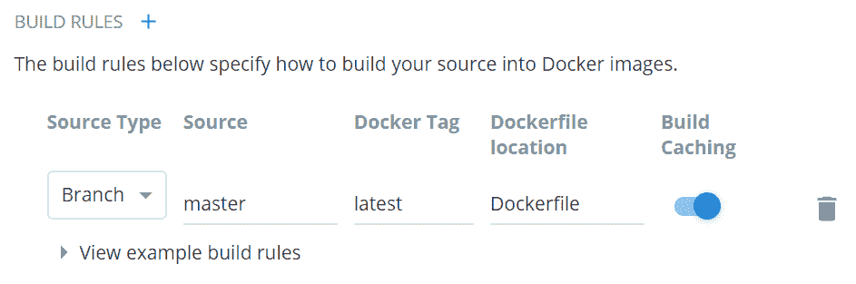

7.  默认设置适合我们的图像，因为我们希望每当新代码被推送到主分支时就触发构建。GitHub 存储库中名为 Dockerfile 的 Dockerfile 应该用于构建图像。
8.  单击“创建和构建”保存并立即基于存储库中的当前代码开始构建。
9.  在最近的版本中，您应该会看到您的映像的待定版本:

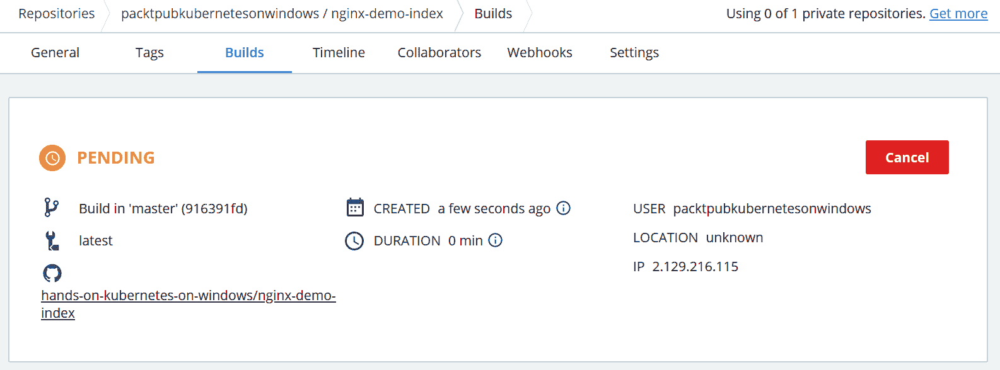

10.  几分钟后，构建应该完成，并且`packtpubkubernetesonwindows/nginx-demo-index:latest`图像应该可用。您可以通过使用`docker pull packtpubkubernetesonwindows/nginx-demo-index:latest`命令拖动图像来验证这一点。

现在，让我们看看如何通过新的代码提交轻松触发 Docker 映像构建。

# 触发码头工人中心自动建造

使用上一节中创建的自动构建设置，触发新的 Docker 映像构建就像向 GitHub 存储库提交新代码一样简单。为此，您必须执行以下操作:

1.  对 GitHub 上的图像源代码进行修改；例如，修改`index.html`文件:

```
<!DOCTYPE html>
<html>
    <head>
        <title>Hello World!</title>
    </head>
    <body>
        <h1>Hello World from nginx container! This is a new version of image for autobuild.</h1>
    </body>
</html>
```

2.  提交并推送代码更改:

```
git commit -am "Updated index.html"
git push -u origin master
```

3.  在 Docker Hub 上此映像存储库的 Builds 选项卡中，您几乎应该立即看到一个新的映像构建已被触发(source commit:[https://github . com/hand-kubernetes-on-window/nginx-demo-index/tree/5ee 600041912 dba3c 82 da 531542 f 48701 f0f 28](https://github.com/hands-on-kubernetes-on-windows/nginx-demo-index/tree/5ee600041912cdba3c82da5331542f48701f0f28)):

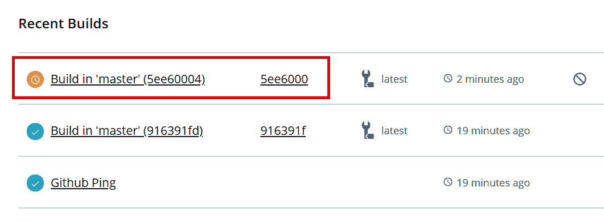

If your build fails, you can always inspect the Docker build logs in the build details and Build logs tab.

4.  构建成功后，通过在您的 Windows 计算机上运行新的容器来验证您的映像:

```
docker run -it --rm `
 -p 8080:80 `
 packtpubkubernetesonwindows/nginx-demo-index:latest
```

5.  图像将自动从 Docker Hub 存储库中取出。在网络浏览器中导航至`http://localhost:8080`。您应该会看到以下输出:

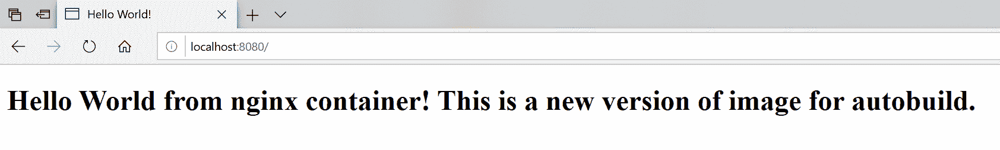

恭喜–您已经成功创建并触发了 Docker Hub 上的 Docker 映像自动构建！在下一节中，您将学习如何使用 Azure 容器注册表为基于 Windows 的映像创建类似的设置。

# 创建 Azure 容器注册表

**Azure 容器注册中心** ( **ACR** )是由 Azure Cloud 提供的完全托管的私有 Docker 注册中心。在本节中，我们将使用 Azure 命令行界面创建一个新的 ACR 实例。您将学习如何实现类似于 Docker Hub 提供的构建自动化，但是可以构建 Windows 映像并使用私有注册表。

You can find detailed installation instructions for the Azure CLI in [Chapter 2](02.html)*, Managing State in Containers*.

要创建 Azure 容器注册表实例，请执行以下步骤:

1.  确保您使用 PowerShell 中的`az login`命令登录到 Azure 命令行界面。继续为您的 ACR 实例创建专用资源组。在本例中，我们将使用`acr-resource-group`资源组和`westeurope`作为 Azure 位置:

```
az group create `
 --name acr-resource-group `
 --location westeurope

```

You can also use the PowerShell script available in this book's GitHub repository: [https://github.com/PacktPublishing/Hands-On-Kubernetes-on-Windows/blob/master/Chapter03/03_CreateAzureContainerRegistry.ps1](https://github.com/PacktPublishing/Hands-On-Kubernetes-on-Windows/blob/master/Chapter03/03_CreateAzureContainerRegistry.ps1). Remember to provide a globally unique ACR name in order to be able to create the instance.

2.  接下来，创建一个具有全局唯一名称的基本层 ACR 实例(出于演示目的，我们提供了`handsonkubernetesonwinregistry`，但您必须提供自己的唯一名称，因为它将是注册表 DNS 名称的一部分):

```
az acr create `
 --resource-group acr-resource-group `
 --name handsonkubernetesonwinregistry `
 --sku Basic
```

If you are interested in other service tiers of Azure Container Registry, please refer to the official documentation: [https://docs.microsoft.com/en-us/azure/container-registry/container-registry-skus](https://docs.microsoft.com/en-us/azure/container-registry/container-registry-skus).

您将获得有关新创建的注册表的详细信息:

```
{
  "adminUserEnabled": false,
  "creationDate": "2019-08-18T21:20:53.081364+00:00",
  "id": "/subscriptions/cc9a8166-829e-401e-a004-76d1e3733b8e/resourceGroups/acr-resource-group/providers/Microsoft.ContainerRegistry/registries/handsonkubernetesonwinregistry",
  "location": "westeurope",
  "loginServer": "handsonkubernetesonwinregistry.azurecr.io",
  "name": "handsonkubernetesonwinregistry",
  "networkRuleSet": null,
  "provisioningState": "Succeeded",
  "resourceGroup": "acr-resource-group",
  "sku": {
    "name": "Basic",
    "tier": "Basic"
  },
  "status": null,
  "storageAccount": null,
  "tags": {},
  "type": "Microsoft.ContainerRegistry/registries"
}
```

最重要的信息是`"loginServer": "handsonkubernetesonwinregistry.azurecr.io"`，将用于推拉 Docker 图像。

3.  最后，最后一步是登录到注册表，以便可以在 Docker CLI 中使用注册表:

```
az acr login `
   --name handsonkubernetesonwinregistry
```

随着 ACR 的建立，我们准备在云环境中使用 ACR 构建 Docker 映像。

# 使用 Azure 容器注册表构建 Docker 映像

出于演示的目的，我们将使用一个简单的 Windows IIS 映像来承载静态 HTML 网页。你可以在本书的 GitHub 资源库中找到 Docker 图片来源:[https://GitHub . com/PacktPublishing/hand-Kubernetes-On-Windows/tree/master/chapter 03/04 _ IIS-demo-index](https://github.com/PacktPublishing/Hands-On-Kubernetes-on-Windows/tree/master/Chapter03/04_iis-demo-index)。要在 ACR 中构建图像，请执行以下步骤:

1.  用图像源代码克隆存储库，导航到 PowerShell 中的`Chapter03/04_iis-demo-index`目录。

2.  执行`az acr build`命令，以便在云环境中开始 Docker 映像构建(记住提供 Docker 构建上下文目录，在本例中由当前目录的*点*表示):

```
az acr build `
 --registry handsonkubernetesonwinregistry `
 --platform windows `
 --image iis-demo-index:latest .
```

3.  `az acr build`命令启动 ACR 快速任务。这将 Docker 构建上下文上传到云中，并远程运行构建过程。几分钟后，构建过程应该会结束。您可以期待类似于本地`docker build`命令的输出。

4.  现在，您可以通过在本地机器上运行一个容器并从 ACR 中提取图像来验证图像。您需要为注册表使用完整的域名(在本例中，这是`handsonkubernetesonwinregistry.azurecr.io`):

```
docker run -it --rm `
 -p 8080:80 `
 handsonkubernetesonwinregistry.azurecr.io/iis-demo-index:latest
```

5.  在网络浏览器中导航至`http://localhost:8080`并验证容器是否按预期运行:

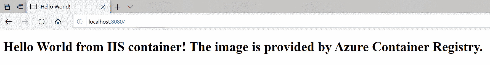

您已经成功执行了 ACR 快速构建任务！现在，我们可以像使用 Docker Hub 一样，开始自动化 GitHub 存储库代码推送的 ACR 构建触发器。

# Azure 容器注册表的自动生成

Azure 容器注册中心提供了与 Docker Hub 类似的功能，以实现基于代码推送的 Docker 映像构建的自动化。该管道是高度可定制的，可以支持一次构建多个容器映像，但是在本例中，我们将专注于在 GitHub 存储库代码推送上自动构建单个映像。

For more advanced multi-step and multi-container scenarios, check out the official documentation: [https://docs.microsoft.com/en-us/azure/container-registry/container-registry-tutorial-multistep-task](https://docs.microsoft.com/en-us/azure/container-registry/container-registry-tutorial-multistep-task).

集成 ACR 和 GitHub 可以按如下方式进行:

1.  创建一个新的 GitHub 存储库，并推送 Docker 映像源代码。在这个例子中，我们将使用来自[的源代码 https://github . com/PacktPublishing/hand-On-Kubernetes-On-Windows/tree/master/chapter 03/04 _ IIS-demo-index](https://github.com/PacktPublishing/Hands-On-Kubernetes-on-Windows/tree/master/Chapter03/04_iis-demo-index)，它将被推送到一个新的 GitHub 存储库，即[https://GitHub . com/hand-On-Kubernetes-On-Windows/IIS-demo-index](https://github.com/hands-on-kubernetes-on-windows/iis-demo-index)。
2.  生成一个 GitHub **个人访问令牌** ( **PAT** )以便访问 ACR 中的存储库。导航至[https://github.com/settings/tokens/new](https://github.com/settings/tokens/new)。
3.  输入 PAT 描述并选择回购:状态和 public _ 回购范围(对于私有存储库，您需要使用完整的回购范围):

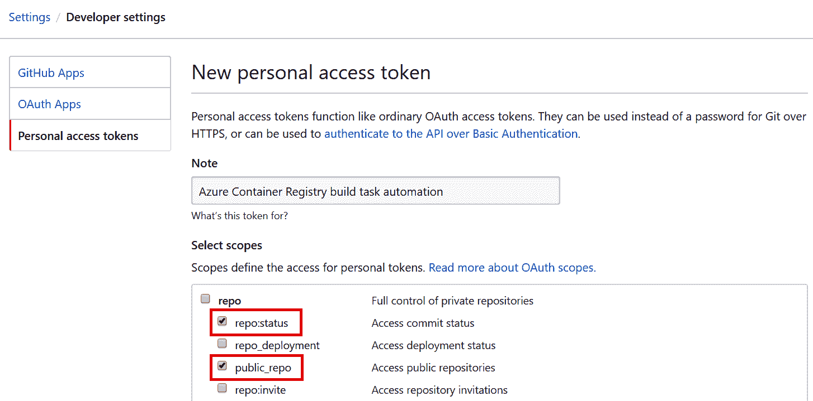

4.  单击生成令牌按钮。
5.  您将获得一个 PAT 值。将令牌复制到安全位置，因为您需要它来设置集成。
6.  现在，让我们创建一个名为`iis-demo-index-task`的 ACR 任务。当代码被推送到[https://github . com/动手-kubernetes-on-windows/IIS-demo-index](https://github.com/hands-on-kubernetes-on-windows/iis-demo-index)时，这将自动触发。所需参数类似于 Docker Hub 的构建配置:

```
az acr task create `
 --registry handsonkubernetesonwinregistry `
 --name iis-demo-index-task `
 --platform windows `
 --image "iis-demo-index:{{.Run.ID}}" `
 --context https://github.com/hands-on-kubernetes-on-windows/iis-demo-index `
 --branch master `
 --file Dockerfile `
 --git-access-token <gitHubPersonalAccessTokenValue>
```

If you run into an `az acr task create: 'utputformat' is not a valid value for '--output'. See 'az acr task create --help'.` error being returned by the Azure CLI, ensure that you are escaping/quoting curly brackets for PowerShell properly.

7.  使用`az acr task run`命令测试您的 ACR 任务定义:

```
az acr task run `
   --registry handsonkubernetesonwinregistry `
   --name iis-demo-index-task
```

8.  在 Docker 映像的源代码中，引入一个变更，提交并将其推送到 GitHub 存储库。例如，修改静态文本，使其如下所示:

```
Hello World from IIS container! The image is provided by Azure Container Registry and automatically built by Azure Container Registry task.
```

9.  检索 ACR 任务日志以验证任务是否确实被触发:

```
az acr task logs --registry handsonkubernetesonwinregistry
```

您应该会看到类似以下内容的输出，它指示推送触发了一个新的任务实例:

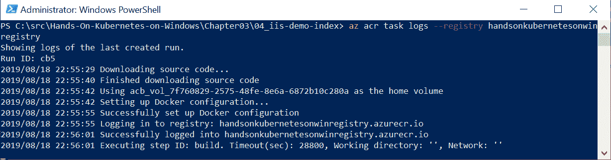

10.  任务完成后，拉出标记有运行标识的图像(在本例中，这是 cb5)。您也可以使用`latest`标记，但这需要使用`docker rmi`命令删除本地缓存的图像:

```
docker pull handsonkubernetesonwinregistry.azurecr.io/iis-demo-index:cb5
```

11.  使用`handsonkubernetesonwinregistry.azurecr.io/iis-demo-index:cb5`图像创建新容器:

```
docker run -it --rm `
 -p 8080:80 `
 handsonkubernetesonwinregistry.azurecr.io/iis-demo-index:cb5
```

12.  在网络浏览器中导航至`http://localhost:8080`并验证容器是否按预期运行。此外，验证静态 HTML 页面是否包含在代码推送中引入的更改:

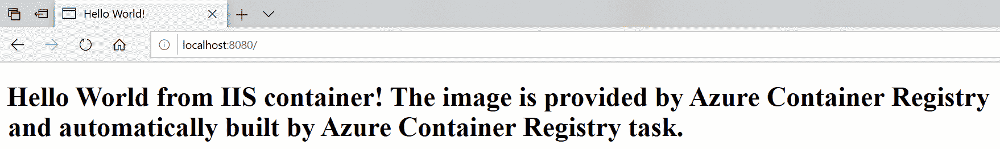

Other cloud service providers have similar offerings for setting up Docker image registries and build pipelines. If you are interested in Google Cloud Platform services, please check out GCP Cloud Build: [https://cloud.google.com/cloud-build/docs/quickstart-docker](https://cloud.google.com/cloud-build/docs/quickstart-docker).

您已经使用 GitHub 和 Azure 容器注册表成功设置了 Docker 映像构建管道–祝贺您！现在，我们将快速了解图像标记和版本控制的最佳实践。

# 图像标记和版本控制

Docker 映像使用标签，以便在存储库中提供同一映像的不同版本–每个映像标签对应于一个给定的 Docker 映像标识。为 Docker 图像指定标签通常在图像构建过程中执行，但是您也可以使用`docker tag`命令显式添加标签:

```
docker pull mcr.microsoft.com/dotnet/core/sdk
docker tag mcr.microsoft.com/dotnet/core/sdk:latest mydotnetsdk:v1
docker tag mcr.microsoft.com/dotnet/core/sdk:latest mydotnetsdk:v2
```

在本例中，我们提取了的`latest`图像标记(因为没有明确指定)。NET Core SDK，然后在本地图像缓存中用`mydotnetsdk:v1`和`mydotnetsdk:v2`标记图像。现在，可以在本地计算机上执行操作时使用这些标签，如下所示:

```
docker run -it --rm mydotnetsdk:v1
```

我们来看看`latest`标签，在使用 Docker 的时候经常用到。

# 使用最新的标签

默认情况下，Docker CLI 采用一个名为`latest`的特殊标签。这意味着，如果您执行`docker pull applicationimage`命令或`docker run -it applicationimage`命令，或在您的文件中使用`FROM applicationimage`，将使用`applicationimage:latest`标签。同样，当您执行`docker build -t applicationimage .`时，生成的 Docker 图像将被标记为`latest`标记，并且每个后续构建将生成一个新版本的`applicationimage:latest`。

重要的是要理解`latest`的行为就像任何其他 Docker 图像标签一样。它可以被视为一个默认值，每当用户没有提供标签时，Docker 总是使用它。这可能会导致一些混乱，如下所示:

*   在图像构建过程中，如果您为图像指定了标记，则不会添加最新的标记。这意味着如果将`applicationimage:v1`推送到注册表，并不意味着`applicationimage:latest`会更新。你必须明确地执行它。
*   当图像所有者将一个新的 Docker 图像版本推送到存储库，并再次用`latest`标记它时，这并不意味着您的本地缓存图像将在`docker build`期间更新和使用。您必须告诉 Docker CLI 尝试通过使用`docker build`的`--pull`参数来获取图像的更新版本。
*   对 Dockerfile 的`FROM`指令使用`latest`标签会导致在不同的时间点构建不同的图像，这通常是不可取的。例如，当`latest`指向 SDK 的 2.2 版本时，您可能正在使用`mcr.microsoft.com/dotnet/core/sdk`映像构建您的映像，但是几个月后，构建相同的 Dockerfile 将导致 3.0 版本被用作基础。

一般的最佳实践(对于 Kubernetes 也是如此)是避免使用`latest`标签部署生产容器，而仅将`latest`标签用于开发场景和本地环境的易用性。类似地，为了确保你的 Docker 图像是可预测的和自我描述的，你应该避免在 Dockerfile 中使用带有`latest`标签的基础图像，而是使用一个特定的标签。

# 语义版本控制

为了高效地管理 Docker 图像的版本化和标记，您可以使用**语义版本化** ( **塞姆弗**)作为一般策略。这种版本控制方案在图像发行商中被广泛采用，并帮助消费者了解您的图像是如何演变的。

一般来说，塞姆弗建议使用三个数字的方案——大、小和小——用点`<major>.<minor>.<patch>`隔开，每个数字根据需要递增。例如，2.1.5 意味着映像的主要版本是 2，次要版本是 1，补丁版本目前是 5。这些版本号和增量规则的含义类似于您对非容器化应用程序版本控制的预期:

*   **主要**:如果你正在引入破坏兼容性的特性或者引入其他破坏变化，增量。
*   **次要**:如果您要引入与以前版本完全兼容的功能，则增加。消费者不需要升级应用程序的使用。
*   **补丁**:发布 bug 修复或者补丁的话递增。

More details regarding Semver as a general concept can be found here: [https://semver.org/](https://semver.org/).

构建/推送 Docker 映像时使用 Semver 的最佳实践可以总结如下:

*   构建映像的新版本时，请始终创建一个新的修补程序标签(例如，2.1.5)。
*   始终覆盖现有的主要和次要标签(例如，2 和 2.1)。
*   永远不要覆盖补丁标签。这确保了希望使用应用程序特定版本的图像消费者能够确保它不会随着时间的推移而改变。
*   始终覆盖现有的`latest`标记。

以下命令集显示了构建和标记新版本的`applicationimage` Docker 映像的示例:

```
# New build a new version of image and push latest tag
docker build -t applicationimage:latest .
docker push applicationimage:latest

# New major tag
docker tag applicationimage:latest applicationimage:2
docker push applicationimage:2

# New minor tag
docker tag applicationimage:latest registry:2.1
docker push applicationimage:2.1

# New patch tag
docker tag applicationimage:latest applicationimage:2.1.5
docker push applicationimage:2.1.5
```

您还可以引入额外的标签，为您的构建系统标识或 git commit SHA-1 哈希添加相关性，这是用于图像构建的。

# 确保形象供应链的完整性

提供图像供应链的内容信任是管理 Docker 图像时最重要但经常被忽视的主题之一。在任何通过不可信介质(如互联网)通信和传输数据的分布式系统中，提供一种内容信任的方法至关重要——一种验证进入系统的数据的来源(发布者)和完整性的方法。对于 Docker 来说，这对于由 Docker Engine 执行的图像(数据)推送和拉取尤其如此。

Docker 生态系统描述了 **Docker 内容信任** ( **DCT** )的概念，它提供了一种验证在 Docker 引擎和 Docker 注册表之间传输的数据的数字签名的方法。这种验证允许发布者签署他们的图像，消费者(Docker Engine)验证签名，以确保图像的完整性和来源。

在 Docker CLI 中，可以使用`docker trust`命令对图像进行签名，该命令构建在 Docker 公证人之上。这是一个用于发布和管理可信内容集合的工具。签署图像需要一个带有相关公证服务器的 Docker 注册表，例如 Docker Hub。

To learn more about content trust for a private Azure Container Registry, please refer to [https://docs.microsoft.com/en-us/azure/container-registry/container-registry-content-trust](https://docs.microsoft.com/en-us/azure/container-registry/container-registry-content-trust).

# 签署图像

例如，我们将在本章中签署我们已经构建并推送到 Docker Hub 的 Docker 映像之一，即`packtpubkubernetesonwindows/iis-demo-index`。接下来，您需要在自己的映像存储库`<dockerId>/iis-demo-index`上执行操作。可以通过以下步骤执行签名:

1.  生成委托密钥对。在本地，这可以使用以下命令完成:

```
docker trust key generate <pairName>
```

2.  您将被要求输入私钥的密码。选择安全密码并继续。默认情况下(也在 Windows 上)，私有委托密钥将存储在`~/.docker/trust/private`中，公共委托密钥将保存在当前工作目录中。
3.  将委托公钥添加到公证服务器(对于 Docker Hub，是`notary.docker.io`)。为特定的图像存储库执行密钥加载，该存储库在公证处由**全球唯一名称** ( **GUN** )标识。对于 Docker Hub，它们具有`docker.io/<dockerId>/<repository>`的形式。执行以下命令:

```
docker trust signer add --key <pairName>.pub <signerName> docker.io/<dockerId>/<repository>

# For example
docker trust signer add --key packtpubkubernetesonwindows-key.pub packtpubkubernetesonwindows docker.io/packtpubkubernetesonwindows/iis-demo-index

```

4.  如果您是第一次为您的存储库执行委托，您将被自动要求使用本地公证规范根密钥进行启动。
5.  标记图像，使其具有可以签名的特定标记，如下所示:

```
docker tag packtpubkubernetesonwindows/iis-demo:latest packtpubkubernetesonwindows/iis-demo:1.0.1
```

6.  使用私有委托密钥签署新标签，并将其推送到 Docker Hub，如下所示:

```
docker trust sign packtpubkubernetesonwindows/iis-demo:1.0.1
```

7.  或者，这可以通过`docker push`来执行，前提是您在推送前已经在 PowerShell 中设置了`DOCKER_CONTENT_TRUST`环境变量:

```
$env:DOCKER_CONTENT_TRUST=1
docker tag packtpubkubernetesonwindows/iis-demo:latest packtpubkubernetesonwindows/iis-demo:1.0.2
docker push packtpubkubernetesonwindows/iis-demo:1.0.2
```

8.  现在，您可以检查存储库的远程信任数据:

```
docker trust inspect --pretty docker.io/packtpubkubernetesonwindows/iis-demo:1.0.1
```

接下来，让我们尝试在客户端运行一个启用了 DCT 的容器。

# 为客户端启用离散余弦变换

为了在对`push`、`build`、`create`、`pull`和`run`使用 Docker CLI 时实施 DCT，您必须将`DOCKER_CONTENT_TRUST`环境变量设置为`1`。默认情况下，Docker 客户端禁用 DCT。请遵循以下步骤:

1.  在当前 PowerShell 会话中设置`DOCKER_CONTENT_TRUST`环境变量:

```
$env:DOCKER_CONTENT_TRUST=1
```

2.  使用我们刚刚创建的签名图像运行新容器:

```
docker run -d --rm docker.io/packtpubkubernetesonwindows/iis-demo:1.0.1
```

3.  您会注意到容器启动没有任何问题。现在，尝试使用`latest`标签创建一个新容器，该标签没有签名:

```
PS C:\src> docker run -d --rm docker.io/packtpubkubernetesonwindows/iis-demo:latest
C:\Program Files\Docker\Docker\Resources\bin\docker.exe: No valid trust data for latest.
See 'C:\Program Files\Docker\Docker\Resources\bin\docker.exe run --help'.
```

这个简短的场景展示了如何使用离散余弦变换来确保用于容器创建的图像的完整性和来源。

# 摘要

在本章中，您学习了 Docker 生态系统如何使用 Docker 注册表为存储和共享容器映像提供基础架构。已经使用公共 Docker Hub 和私有 Azure 容器注册表演示了映像注册表和自动化云构建的概念，这是您使用 Azure CLI 从头开始设置的。您还了解了使用语义版本化方案标记和版本化图像的最佳实践。最后，向您介绍了如何使用 **Docker 内容信任** ( **DCT** )来确保图像完整性。

在下一章中，我们将对 Kubernetes 生态系统进行第一次深入研究，以了解一些关键概念以及它们目前如何适应 Windows 容器支持。

# 问题

1.  什么是 Docker 注册表，它与 Docker Hub 有什么关系？
2.  什么是图像标签？
3.  Docker Hub 的标准映像存储库命名方案是什么？
4.  什么是 Azure 容器注册表，它与 Docker Hub 有何不同？
5.  `latest`标签是什么，建议什么时候使用？
6.  我们如何使用语义版本控制来版本化(标记)图像？
7.  为什么要使用 Docker 内容信任？

你可以在本书的*评估*部分找到这些问题的答案。

# 进一步阅读

*   有关管理 Docker 容器映像和映像注册表的更多信息，请参考以下 Packt 书籍:
    *   *Windows Docker:从 101 到 Windows Docker 的量产*([https://www . packtpub . com/virtual-and-cloud/Docker-Windows-第二版](https://www.packtpub.com/virtualization-and-cloud/docker-windows-second-edition))
    *   *学习 Docker–Docker 18 . x*的基础知识
*   如果您想了解更多关于 Azure 容器注册表及其如何融入 Azure 生态系统的信息，请查看以下 Packt 书籍:
    *   *Architects Azure-第二版*([https://www . packtpub . com/虚拟化与云/Azure-Architects-第二版](https://www.packtpub.com/virtualization-and-cloud/azure-architects-second-edition))
*   您也可以参考 Docker 官方文档，该文档很好地概述了 Docker Hub([https://docs.docker.com/docker-hub/](https://docs.docker.com/docker-hub/))和开源 Docker 注册表([https://docs.docker.com/registry/](https://docs.docker.com/registry/))。