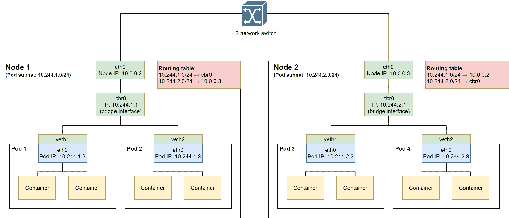
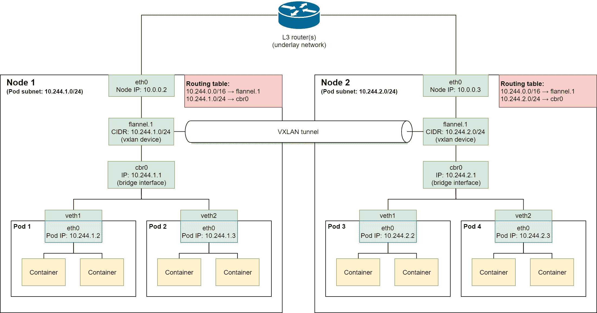
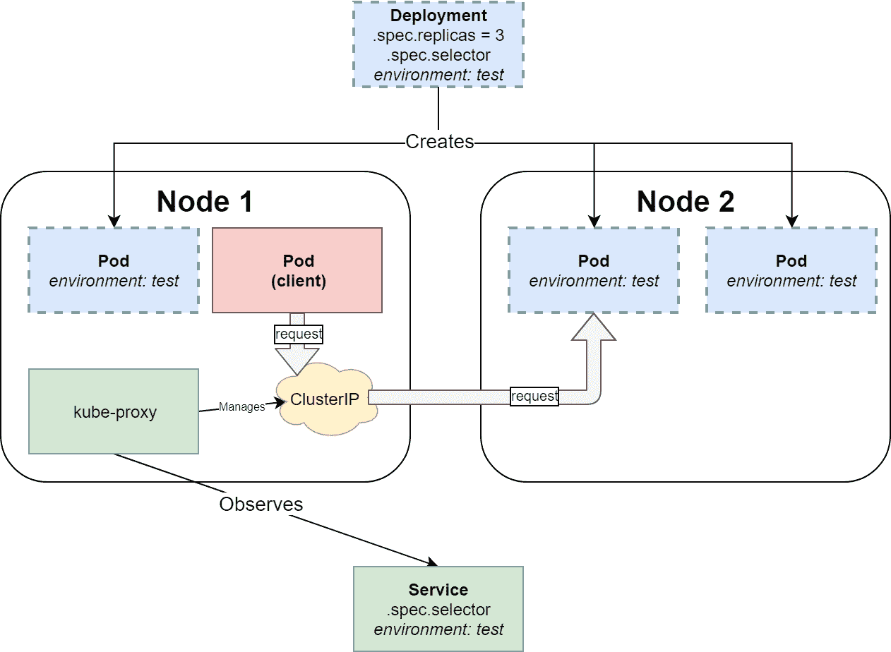
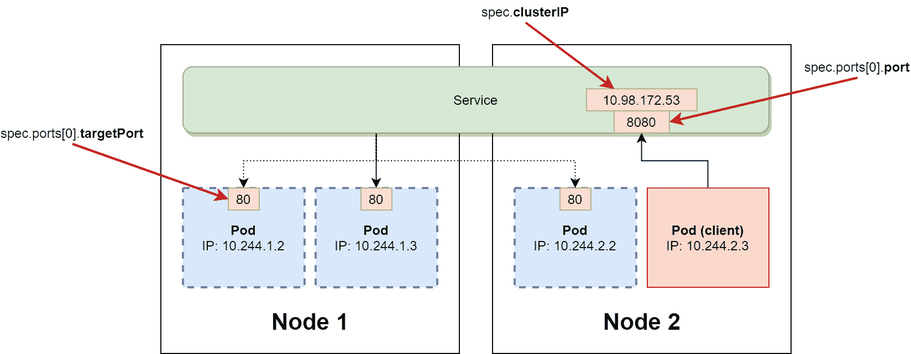
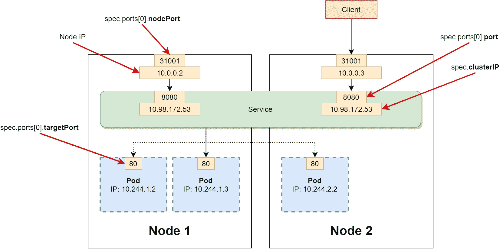
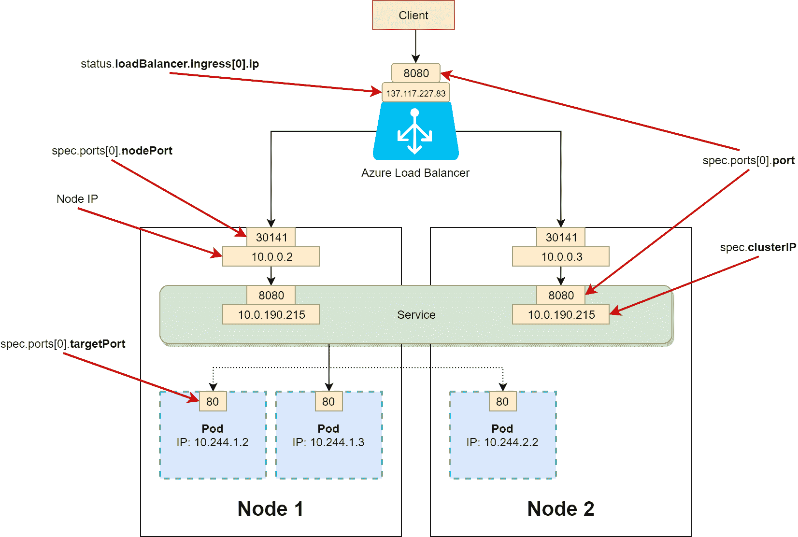
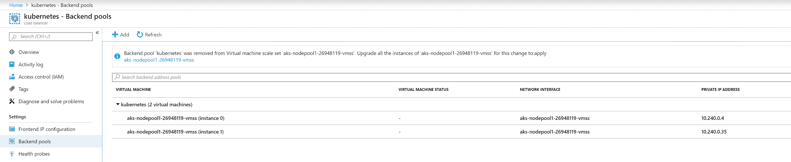
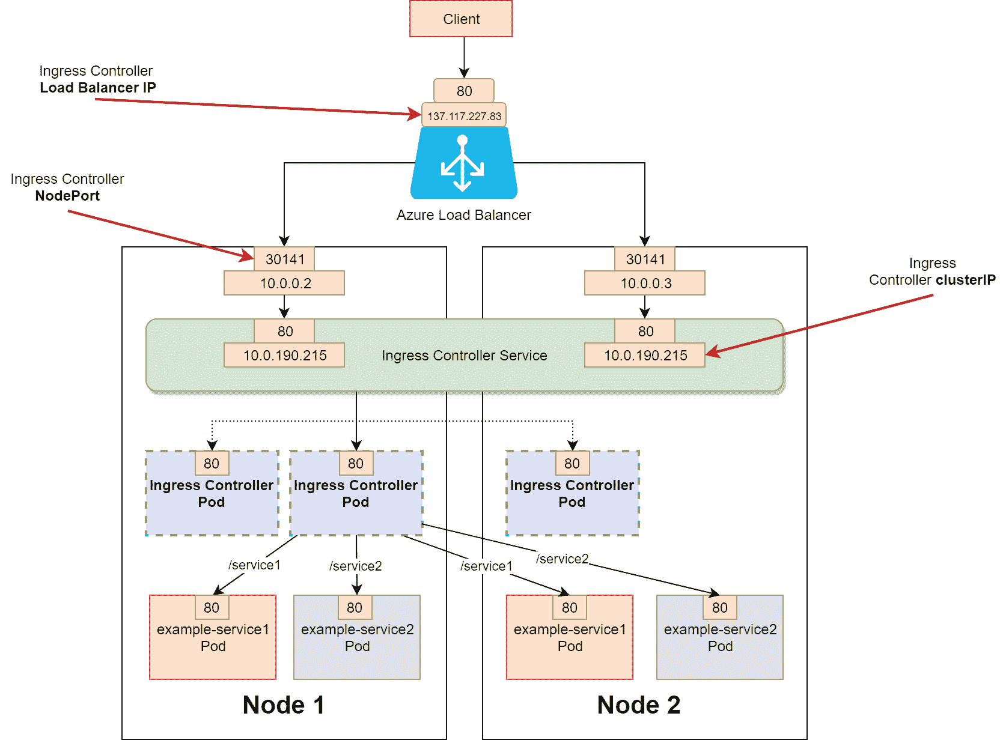

# 五、不可思议的网络

对于容器编排，有两个主要的挑战需要解决:管理容器主机(节点)和管理容器之间的网络。如果您将容器主机集群限制在一个节点上，联网将相当简单——对于 Linux 上的 Docker，您将使用默认的网桥网络驱动程序，它创建一个私有网络(在主机内部)，允许容器相互通信。对容器的外部访问需要将容器端口公开并映射为主机端口。但是现在，如果您考虑一个多节点集群，这个解决方案不能很好地扩展—您必须使用 NAT 并跟踪使用了哪些主机端口，此外，在容器中运行的应用必须知道网络拓扑。

幸运的是，Kubernetes 通过提供一个具有特定基本需求的网络模型，为这一挑战提供了一个解决方案——任何符合规范的网络解决方案都可以用作 Kubernetes 中的网络模型实现。该模型的目标是提供透明的容器到容器的通信和对容器的外部访问，而容器化的应用不需要任何关于底层网络挑战的知识。在本章中，我们将解释 Kubernetes 网络模型的假设，以及如何在混合 Linux/Windows 集群中解决 Kubernetes 网络问题。

在本章中，我们将涵盖以下主题:

*   Kubernetes 网络原则
*   kuble CNI 网络插件
*   Kubernetes 中的 Windows 服务器网络
*   选择 Kubernetes 网络模式

# 技术要求

对于本章，您将需要以下内容:

*   安装了 Windows 10 专业版、企业版或教育版(1903 版或更高版本，64 位)
*   适用于 Windows 2.0.0.3 或更高版本的 Docker 桌面
*   如果您想使用上一章中的 AKS 集群，请安装 Azure CLI

Windows Docker Desktop 的安装和系统要求包含在[第 1 章](01.html) *【创建容器】*中。

对于 Azure CLI，您可以在[第 2 章](02.html) *【管理容器中的状态】* *中找到详细的安装说明。*

您可以从官方 GitHub 资源库下载本章的最新代码示例:[https://GitHub . com/PacktPublishing/hand-Kubernetes-On-Windows/tree/master/chapter 05](https://github.com/PacktPublishing/Hands-On-Kubernetes-on-Windows/tree/master/Chapter05)

# Kubernetes 网络原则

作为一个容器编排者，Kubernetes 提供了一个网络模型，该模型由任何给定的网络解决方案必须满足的一组需求组成。最重要的要求如下:

*   在一个节点上运行的 Pods 必须能够与所有节点(包括 Pods 的节点)上的所有 Pods 通信，而无需 NAT 和显式端口映射。
*   在一个节点上运行的所有 Kubernetes 组件，例如 kubelet 或系统守护程序/服务，必须能够与该节点上的所有 Pods 通信。

这些要求强化了一个扁平的、无 NAT 的网络模型，这是 Kubernetes 的核心概念之一，使其如此强大、可扩展和易于使用。从这个角度来看，Pod 类似于在 Hyper-V 集群中运行的虚拟机—每个 Pod 都分配有自己的 IP 地址(每 Pod 一个 IP 的模型)，Pod 内的容器共享相同的网络命名空间(就像虚拟机上的进程一样)，这意味着它们共享相同的本地主机，并且需要知道端口分配。

简而言之，Kubernetes 的网络有以下挑战需要克服:

*   **容器之间的舱内通信**:由标准本地主机通信处理。

*   **Pod 到 Pod 通信**:由底层网络实现处理。
*   **Pod 到 Service 和外部到 Service 的通信**:由 Service API 对象处理，通信依赖于底层网络实现。我们将在这一节的后面讨论这个问题。
*   **创建新 Pod 时 kubelet 的网络设置自动化**:由**容器网络接口** ( **CNI** )插件处理。我们将在下一节讨论这个问题。

Kubernetes 网络模型有多种实现方式，从简单的 L2 网络(例如，带有主机-gw 后端的法兰绒)到复杂的高性能**软件定义网络** ( **SDN** )解决方案(例如，大云结构)。您可以在官方文档中找到网络模型的不同实现列表:[https://kubernetes . io/docs/concepts/cluster-administration/networking/#如何实现 kubernetes-networking-model](https://kubernetes.io/docs/concepts/cluster-administration/networking/#how-to-implement-the-kubernetes-networking-model) 。

在本书中，我们将只关注与 Windows 视角相关的实现:

*   L2 网络
*   覆盖网络

让我们从 L2 网络开始，这是现有的最简单的网络实现。

# L2 网络

**第二层** ( **L2** )是指数据链路层，是七层 OSI 参考模型中的第二层，用于网络协议设计。这一层用于在同一个局域网中的节点之间传输数据(所以，考虑在属于 L3 的 MAC 地址和交换机端口上操作，而不是在 IP 地址上操作)。对于 Kubernetes 来说，在每个 Kubernetes 节点上设置路由表的 L2 网络是满足 Kubernetes 网络模型实施要求的最简单的网络类型。一个很好的例子是带有主机千兆瓦后端的法兰绒。从高层次来看，法兰绒(主机千兆瓦)通过以下方式为 Pods 提供网络:

1.  每个节点运行一个**绒布**(或**flanneld.exe**Windows)代理，该代理负责从更大的预配置地址空间 **Pod CIDR** ( **无类域间路由**)分配子网租约。下图中，Pod CIDR 是`10.244.0.0/16`，而节点 1 拥有租用的子网`10.244.1.0/24`，节点 2 拥有租用的子网`10.244.2.0/24`。

2.  在大多数情况下，在集群中安装 Pod 网络期间，法兰绒代理被部署为**daemmonset**。这里可以找到一个 DaemonSet 定义的例子:[https://github . com/coreos/法兰绒/blob/master/Documentation/kube-法兰绒. yml](https://github.com/coreos/flannel/blob/master/Documentation/kube-flannel.yml) 。
3.  法兰绒直接使用 Kubernetes API 或 **etcd** 存储网络信息和租赁数据，具体取决于其配置。
4.  当一个新节点加入集群时，法兰绒为给定节点上的所有 Pods 创建一个`cbr0`桥接接口。节点上的操作系统中的路由表被更新，包含集群中每个节点的一个条目。例如，对于下图中的节点 2，路由表有两个条目，分别通过`10.0.0.2`网关将通信路由到`10.244.1.0/24`(到节点 1 的节点间通信)和通过本地`cbr0`接口将通信路由到`10.244.2.0/24`(节点 1 上的 Pods 之间的本地通信)。
5.  当一个新的 Pod 被创建时，一个新的 **veth** 设备对被创建。在 Pod 网络命名空间中创建一个`eth0`设备，在主机(根)命名空间中的配对另一端创建一个`vethX`设备。虚拟以太网设备用作网络名称空间之间的隧道。
6.  为了触发前面的动作，库布雷使用了 CNI，这是由法兰绒 CNI 插件实现的:



法兰绒执行的所有操作都可以使用命令行手动执行，但当然，法兰绒的目标是为 Kubernetes 用户透明地自动化新节点注册和新 Pod 网络创建的过程。

现在，让我们快速分析当 Pod 1 中的容器`10.244.1.2`(在节点 1 上)想要向 Pod 4 中的容器`10.244.2.3`(在节点 2 上)发送 TCP 数据包时会发生什么:

1.  Pod 1 出站数据包将被发送到`cbr0`网桥接口，因为它被设置为`eth0` Pod 接口的默认网关。
2.  由于节点 1 的`10.244.2.0/24 → 10.0.0.3`路由表条目，数据包被转发到`10.0.0.3`网关。
3.  数据包通过物理 L2 网络交换机，由节点 2 在`eth0`接口接收。
4.  节点 2 的路由表包含一个条目，该条目将去往`10.244.2.0/24` CIDR 的流量转发到本地`cbr0`网桥接口。
5.  该数据包由 Pod 2 接收。

Note that the preceding example uses Linux network interface naming and terminology. The Windows implementation of this model is generally the same but differs on OS-level primitives.

使用带有路由表的 L2 网络既高效又易于设置；但是，它也有一些缺点，尤其是随着集群的增长:

*   需要节点的 L2 邻接。换句话说，所有节点必须在同一个局域网中，中间没有 L3 路由器。
*   同步所有节点之间的路由表。当一个新节点加入时，所有节点都需要更新它们的路由表。
*   由于 L2 网络交换机在转发表中设置新的媒体访问控制地址的方式，可能会出现故障和延迟，尤其是对于寿命较短的容器。

Flannel with a **host-gw** backend has stable support for Windows.

通常，建议使用覆盖网络，这允许在现有的底层 L3 网络上创建虚拟 L2 网络。

# 覆盖网络

作为一般概念，覆盖网络使用封装，以便在现有 L2/L3 网络(称为底层网络)的基础上创建一个新的隧道虚拟网络。创建此网络时，底层网络的实际物理网络基础架构没有任何变化。覆盖网络中的网络服务通过封装与底层基础设施分离，封装是使用另一种类型的数据包封装一种类型数据包的过程。进入隧道时被封装的数据包随后在隧道的另一端被解封装。

覆盖网络是一个广泛的概念，有许多实现。在 Kubernetes 中，一种常用的实现是使用**虚拟可扩展局域网** ( **VXLAN)** 协议通过 UDP 数据包隧道传输 L2 以太网帧。重要的是，这种类型的覆盖网络适用于 Linux 和 Windows 节点。如果您有一个带有 VXLAN 后端的法兰绒网络，Pods 的网络以下列方式提供:

1.  与主机 gw 后端类似，每个节点上都部署了一个绒布代理作为 DaemonSet。
2.  当一个新节点加入集群时，法兰绒为给定节点上的所有 Pods 和一个附加的 VXLAN 设备(VXLAN 隧道端点，简称 VTEP；VNI 代表 VXLAN 网络标识符，在本例中为`1`)。这个设备负责流量的封装。仅针对新节点更新 IP 路由表。运行在同一节点上的 Pod 的流量被转发到`cbr0`接口，而 Pod CIDR 的所有剩余流量被转发到 VTEP 设备。例如，对于下图中的节点 2，路由表中有两个条目，它们通过`flannel.1` VTEP 设备将通信路由到`10.244.0.0/16`(覆盖网络中的节点间通信)，通过本地`cbr0`接口将通信路由到`10.244.2.0/24`(没有覆盖的节点 1 上的 Pods 之间的本地通信)。
3.  创建新的 Pod 时，会创建一个新的veth 设备对，类似于主机-gw 后端的情况:



现在，让我们快速分析当 Pod 1 中的容器`10.244.1.2`(在节点 1 上)想要向 Pod 4 中的容器`10.244.2.3`(在节点 2 上)发送 TCP 数据包时会发生什么:

1.  Pod 1 出站数据包将被发送到`cbr0`网桥接口，因为它被设置为`eth0` Pod 接口的默认网关。
2.  由于节点 1 的`10.244.0.0/16 → flannel.1`路由表条目，数据包被转发到`flannel.1` VTEP 设备。
3.  `flannel.1`使用`10.244.0.0/16`覆盖网络中 Pod 4 的 MAC 地址作为内部数据包目的地址。该地址由**转发数据库** ( **FDB** )中的**绒布**代理填写。
4.  `flannel.1 `使用 FDB 确定节点 2 处的目的地 VTEP 设备的 IP 地址，`10.0.0.3`用作外部封装数据包的目的地地址。
5.  数据包通过物理 L2/L3 网络，由节点 2 接收。该数据包被`flannel.1` VTEP 设备解封装。
6.  节点 2 的路由表包含一个条目，该条目将去往`10.244.2.0/24` CIDR 的流量转发到本地`cbr0`网桥接口。
7.  该数据包由 Pod 2 接收。

For Windows, Flannel with an Overlay backend is currently still in the alpha feature stage.

将 VXLAN 后端比主机千兆瓦后端用于法兰绒有几个优点:

*   不需要节点的 L2 邻接。
*   L2 覆盖网络不易受生成树故障的影响，这种故障可能发生在 L2 域跨越多个逻辑交换机的情况下。

The solution described earlier in this section is similar to Docker running in **swarm mode**. You can read more about Overlay networks for swarm mode in the official documentation: [https://docs.docker.com/network/Overlay/.](https://docs.docker.com/network/overlay/.)

前面两种网络解决方案是混合 Linux/Windows 集群最常用的解决方案，尤其是在内部运行时。对于其他场景，也可以使用**开放虚拟网络**(**【OVN】**)和 **L2 隧道**来实现特定于 Azure 的实现。

# 其他解决方案

在针对 Kubernetes 的 Windows 支持的网络解决方案方面，可以使用另外两种实现:

*   **开放虚拟网络** ( **OVN** )例如，作为 OpenStack 上部署的一部分
*   **L2 隧道**用于 Azure 上的部署

OVN 是一个网络虚拟化平台，用于实现将物理网络拓扑与逻辑网络拓扑分离的 SDN。使用 OVN，用户可以定义由逻辑交换机和路由器组成的网络拓扑。Kubernetes 使用专用的 CNI 插件**ovn-kubernetes**([https://github.com/ovn-org/ovn-kubernetes](https://github.com/ovn-org/ovn-kubernetes))支持 OVN 集成。

对于特定于 Azure 的场景，可以直接使用 **Azure-CNI** 插件利用微软云堆栈功能，该插件依赖于 **L2Tunnel** Docker 网络驱动程序。简而言之，Pod 连接到现有的虚拟网络资源和配置，所有 Pod 数据包都直接路由到虚拟化主机，以便应用 Azure SDN 策略。Pod 在 Azure 提供的虚拟网络中获得完全连接，这意味着每个 Pod 都可以从集群外部直接到达。您可以在 AKS 官方文档中找到关于此解决方案的更多详细信息:[https://docs . Microsoft . com/bs-latn-ba/azure/AKS/configure-azure-CNI](https://docs.microsoft.com/bs-latn-ba/azure/aks/configure-azure-cni)。

# 服务

在前一章中，我们将服务作为应用编程接口对象进行了介绍，并解释了它们如何与部署一起使用。简单回顾一下，服务应用编程接口对象允许基于标签选择器对一组 Pods 进行网络访问。就 Kubernetes 网络而言，服务是建立在标准网络模型之上的概念，旨在实现以下目标:

*   使用**虚拟 IP** ( **贵宾**)实现与一组POD的可靠通信。客户端 Pods 不需要知道单个 Pods 的当前 IP 地址，这些地址可能会随着时间的推移而改变。外部客户端也不需要知道 Pods 的当前 IP 地址。
*   对一组 Pods 的网络流量(内部和外部)进行负载平衡。
*   在集群中启用服务发现。这要求 DNS 服务附加组件在集群中运行。

Kubernetes 中有四种服务类型，可以在服务对象规范中指定:

*   ClusterIP(集群 IP)
*   节点端口
*   LoadBalancer(负载平衡器)
*   外部名称

我们将分别介绍每种类型，但首先让我们看看**服务**在部署和 Pods 环境中是什么样子的:



上图显示了最简单的集群 IP 类型的内部服务如何公开一个现有的部署，该部署管理三个标有`environment: test`的 Pods 副本。具有相同标签选择器`environment: test`的集群 IP 服务负责监控标签选择器评估的结果，并使用当前一组活动且就绪的 Pod IPs 更新**端点** API 对象。同时，kube-proxy 正在观察服务和端点对象，以便在 Linux 节点上创建 iptables 规则，或者在 Windows 节点上创建 HNS 策略，这些规则用于实现一个虚拟 IP 地址，其值为服务规范中指定的 ClusterIP。最后，当客户端 Pod 向虚拟 IP 发送请求时，它会使用规则/策略(由 kube-proxy 设置)转发到部署中的一个 Pod。如您所见，kube 代理是实现服务的核心组件，事实上，除了 ExternalName 之外，它用于所有服务类型。

# ClusterIP(集群 IP)

Kubernetes 中默认的服务类型是 ClusterIP，它使用内部 VIP 公开服务。这意味着只能从集群内部访问该服务。假设您正在运行以下`nginx`部署:

```
apiVersion: apps/v1
kind: Deployment
metadata:
  name: nginx-deployment-example
spec:
  replicas: 3
  selector:
    matchLabels:
      environment: test
  template:
    metadata:
      labels:
        environment: test
    spec:
      containers:
      - name: nginx
        image: nginx:1.17
        ports:
        - containerPort: 80
```

All of the manifest files are available in the official GitHub repository for this book: [https://github.com/PacktPublishing/Hands-On-Kubernetes-on-Windows/tree/master/Chapter05](https://github.com/PacktPublishing/Hands-On-Kubernetes-on-Windows/tree/master/Chapter05).

您可以使用以下清单文件部署集群 IP 类型的服务:

```
apiVersion: v1
kind: Service
metadata:
  name: nginx-deployment-example-clusterip
spec:
  selector:
    environment: test
  type: ClusterIP
  ports:
  - port: 8080
    protocol: TCP
    targetPort: 80
```

与每种服务类型一样，关键部分是`selector`规范，它必须与部署中的 Pods 相匹配。您将`type`指定为`ClusterIP`，并将`8080`指定为服务上的端口，该端口映射到 Pod 上的`targetPort: 80`。这意味着客户端 Pod 将使用`nginx-deployment-example:8080` TCP 端点与 nginx Pods 通信。实际的集群 IP 地址是动态分配的，除非您在`spec`中明确指定一个。作为服务发现的一部分，Kubernetes 集群中的内部 DNS 服务负责将`nginx-deployment-example`解析为实际的集群 IP 地址。

The diagrams in the rest of this section represent how the Services are implemented logically. Under the hood, kube-proxy is responsible for managing all the forwarding rules and exposing ports, as in the previous diagram.

下图显示了这一点:



集群 IP 服务是允许外部通信的其他类型服务的基础:节点端口和负载平衡器。

# 节点端口

允许外部入口通信到 Pods 的第一类服务是节点端口服务。这种类型的服务被实现为集群 IP 服务，具有使用任何集群节点 IP 地址和指定端口可到达的附加能力。为了实现这一点，kube-proxy 在 30000-32767(可配置)范围内的每个节点上公开相同的端口，并设置转发，以便到该端口的任何连接都将被转发到 ClusterIP。

您可以使用以下清单文件部署节点端口服务:

```
apiVersion: v1
kind: Service
metadata:
  name: nginx-deployment-example-nodeport
spec:
  selector:
    environment: test
  type: NodePort
  ports:
  - port: 8080
    nodePort: 31001
    protocol: TCP
    targetPort: 80
```

如果没有在规范中指定`nodePort`，将使用节点端口范围动态分配。请注意，该服务仍然充当集群 IP 服务，这意味着它可以在其集群 IP 端点内部访问。

下图可视化了节点端口服务的概念:



当您希望在服务前设置自己的负载平衡设置时，建议使用节点端口服务。您也可以直接公开节点端口，但是请记住，这样的解决方案更难保护，并且可能会带来安全风险。

# LoadBalancer(负载平衡器)

第二种允许外部入口通信的服务是负载平衡器，它在 Kubernetes 集群中可用，可以创建外部负载平衡器，例如云中的托管 Kubernetes 产品。这种类型的服务将节点端口的方法与它前面的额外外部负载平衡器相结合，后者将流量路由到节点端口。

您可以使用以下清单文件部署负载平衡器服务:

```
apiVersion: v1
kind: Service
metadata:
  name: nginx-deployment-example-lb
spec:
  selector:
    environment: test
  type: LoadBalancer
  ports:
  - port: 8080
    protocol: TCP
    targetPort: 80
```

请注意，为了应用这个清单文件，您需要一个支持外部负载平衡器的环境，例如，我们在[第 4 章](04.html)、 *Kubernetes 概念和 Windows 支持*中创建的 AKS 集群。Katacoda Kubernetes 游乐场还能够创建一个“外部”负载平衡器，可以从游乐场终端访问。如果您试图在不支持创建外部负载平衡器的环境中创建负载平衡器服务，这将导致负载平衡器入口 IP 地址无限期处于*待定*状态。

要获取外部负载平衡器地址，请执行以下命令:

```
PS C:\src> kubectl get svc nginx-deployment-example-lb
NAME                          TYPE           CLUSTER-IP     EXTERNAL-IP      PORT(S)          AGE
nginx-deployment-example-lb   LoadBalancer   10.0.190.215   137.117.227.83   8080:30141/TCP   2m23s
```

`EXTERNAL-IP`列显示负载平衡器具有 IP 地址`137.117.227.83`，为了访问您的服务，您必须与`137.117.227.83:8080` TCP 端点通信。此外，您可以看到服务有自己的内部集群 IP，`10.0.190.215`，并且暴露了节点端口`30141`。下图显示了在 AKS 上运行的负载平衡器服务:



如果您对服务前面的 Azure 负载平衡器的配置感兴趣，您需要转到[https://portal.azure.com](https://portal.azure.com)并导航到负载平衡器资源，在这里您将找到 Kubernetes 负载平衡器实例:



现在，让我们看看最后一种类型的服务:外部名称。

# 外部名称

在某些情况下，您需要定义一个指向不在 Kubernetes 集群中的外部资源的服务。例如，这可以包括云托管的数据库实例。Kubernetes 提供了一种方法来抽象与这些资源的通信，并通过使用 ExternalName Service 在集群服务发现中注册它们。

外部域名服务不使用选择器，只是服务名到外部域名的原始映射:

```
apiVersion: v1
kind: Service
metadata:
  name: externalname-example-service
spec:
  type: ExternalName
  externalName: cloud.database.example.com
```

在解析服务域名(`externalname-example-service.default.svc.cluster.local`)的过程中，内部集群域名系统将以值为`cloud.database.example.com`的 CNAME 记录进行响应。不涉及使用 kube 代理规则的实际流量转发—重定向发生在 DNS 级别。

扩展名称服务的一个很好的用例是根据环境类型提供不同的外部服务实例，例如数据库。从 Pods 的角度来看，这不需要任何配置或连接字符串更改。

# 进入

负载平衡器服务仅提供 L4 负载平衡功能。这意味着您不能使用以下内容:

*   HTTPS 交通终止和卸载
*   对多个域名使用相同负载平衡器的基于名称的虚拟主机
*   基于路径的服务路由，例如，作为应用编程接口网关

为了解决这个问题，Kubernetes 提供了入口应用编程接口对象(它不是一种服务类型)，可以用于 L7 负载平衡。

Ingress deployment and configuration is a broad topic and is out of scope of this book. You can find more detailed information regarding Ingress and Ingress controllers in the official documentation: [https://kubernetes.io/docs/concepts/services-networking/ingress/](https://kubernetes.io/docs/concepts/services-networking/ingress/).

使用入口首先需要在 Kubernetes 集群中部署入口控制器。入口控制器是手动部署到集群的 Kubernetes 控制器，通常作为 DaemonSet 或运行专用 Pods 的部署，用于处理入口流量负载平衡和智能路由。Kubernetes 常用的入口控制器是**入口-nginx**([https://www . nginx . com/products/nginx/Kubernetes-入口控制器](https://www.nginx.com/products/nginx/kubernetes-ingress-controller)，它作为 nginx 网络主机的部署安装在集群中，具有一组处理入口 API 对象的规则。入口控制器作为服务公开，其类型取决于安装。例如，对于只有 Linux 节点的 AKS 集群，可以使用以下清单执行作为负载平衡器服务公开的 ingress-nginx 的基本安装:

```
kubectl apply -f https://raw.githubusercontent.com/kubernetes/ingress-nginx/master/deploy/static/mandatory.yaml
kubectl apply -f https://raw.githubusercontent.com/kubernetes/ingress-nginx/master/deploy/static/provider/cloud-generic.yaml
```

一般来说，入口控制器的安装取决于 Kubernetes 集群环境和配置，必须根据您的需求进行调整。例如，对于带有 Windows 节点的 AKS，您需要确保使用正确的节点选择器，以便正确调度入口控制器 Pods。

You can find the customized nginx Ingress controller definition for AKS with Windows nodes, together with example Services and Ingress definitions, in the official GitHub repository for this book: [https://github.com/PacktPublishing/Hands-On-Kubernetes-on-Windows/tree/master/Chapter05/05_ingress-example](https://github.com/PacktPublishing/Hands-On-Kubernetes-on-Windows/tree/master/Chapter05/05_ingress-example).

当入口控制器已经安装在集群中时，入口应用编程接口对象可以被创建并将由控制器处理。例如，假设您已经部署了两个集群 IP 服务`example-service1`和`example-service2`，入口定义可能如下所示:

```
apiVersion: networking.k8s.io/v1beta1
kind: Ingress
metadata:
  name: example-ingress
  annotations:
    nginx.ingress.kubernetes.io/rewrite-target: /
spec:
  rules:
  - http:
      paths:
      - path: /service1
        backend:
          serviceName: example-service1
          servicePort: 80
      - path: /service2
        backend:
          serviceName: example-service2
          servicePort: 80
```

现在，当您向`https://<ingressServiceLoadBalancerIp>/service1`执行 HTTP 请求时，流量将由 nginx 路由到`example-service1`。请注意，此操作仅使用一个云负载平衡器，到 Kubernetes Services 的实际路由是由入口控制器使用基于路径的路由来执行的。

该设计的原理如下图所示:



For AKS, you can consider using the HTTP application routing add-on, which automates the management of Ingress controllers and External-DNS controllers for your cluster. More details can be found in the official documentation: [https://docs.microsoft.com/en-us/azure/aks/http-application-routing](https://docs.microsoft.com/en-us/azure/aks/http-application-routing).

选择实现入口还是服务的一般经验法则是使用入口来公开 HTTP(尤其是 HTTPS)端点，并使用服务来实现其他协议。

# kuble CNI 网络插件

在本章中，我们已经在 Kubernetes 网络设置的上下文中提到了术语**容器网络接口**(**【CNI】**)和 **CNI 插件**。事实上，CNI 并不局限于 Kubernetes——这个概念起源于 Rkt 容器运行时，并作为一个 CNCF 项目被采用，旨在为任何容器运行时和网络实现之间提供一个简单明了的接口。容器运行时使用 CNI 插件将容器连接到网络，并在需要时从网络中删除它们。

# 了解 CNI 项目

CNI 项目有三个不同的部分:

*   CNI 规范定义了一个通用的、基于插件的容器网络解决方案的架构，以及 CNI 插件必须实现的实际接口。规范见[https://github . com/container networking/CNI/blob/master/spec . MD](https://github.com/containernetworking/cni/blob/master/SPEC.md)。
*   用于将 CNI 集成到应用中的库，与规范提供在同一个存储库中:[https://github . com/container networking/CNI/tree/master/libcni](https://github.com/containernetworking/cni/tree/master/libcni)。
*   CNI 插件参考实现，在一个专用的存储库中:[https://github.com/containernetworking/plugins](https://github.com/containernetworking/plugins)。

CNI 的规格相当简单，可以总结如下:

*   CNI 插件是作为独立的可执行文件实现的。
*   在与 CNI 插件交互之前，容器运行时负责为容器准备一个新的网络命名空间(在 Windows 的情况下是网络隔间)。
*   根据网络配置的规定，CNI 插件负责将容器连接到网络。
*   容器运行时使用标准输入，以 JSON 格式向 CNI 插件提供网络配置。

*   使用环境变量向 CNI 插件提供参数。例如，`CNI_COMMAND`变量指定插件应该执行的操作类型。命令集是有限的，由`ADD`、`DEL`、`CHECK`和`VERSION`组成；最显著的是`ADD`和`DEL`，分别给网络增加一个容器和从网络中删除。

对于 CNI 插件，有三种通用类型的插件，它们在网络配置期间有不同的职责:

*   界面创建插件
*   **IP 地址管理** ( **IPAM** )插件，负责容器的 IP 地址分配
*   元插件，可以作为其他 CNI 插件的适配器，或者为其他 CNI 插件提供额外的配置，或者转换它们的输出

Currently, on Windows you can only use the following reference implementations: the host-local IPAM plugin, the win-bridge and win-Overlay interface-creating plugins, and the flannel meta plugin. Third-party plugins can be also used; for example, Microsoft provides the Azure-CNI plugin for integrating containers with Azure SDN ([https://github.com/Azure/azure-container-networking/blob/master/docs/cni.md](https://github.com/Azure/azure-container-networking/blob/master/docs/cni.md)).

在 Kubernetes 中，kubelet 在管理 Pod 的生命周期时使用 CNI 插件来确保 Pod 的连通性和可达性。库布雷执行的最基本操作是在POD创建时执行`ADD` CNI 命令，在POD销毁时执行`DELETE` CNI 命令。在某些情况下，CNI 插件也可以用来调整 kube 代理配置。

选择 CNI 插件和定义 CNI 插件的网络配置是在部署新集群时的 Pod 网络插件安装步骤中执行的。最常见的是，通过部署专用的 DaemonSet 来执行安装，它使用 init 容器来执行 CNI 插件的安装，并在需要时在每个节点上运行额外的代理容器。这种安装的一个很好的例子是法兰绒的官方 Kubernetes 清单:[https://github . com/coreos/法兰绒/blob/master/Documentation/kube-法兰绒. yml](https://github.com/coreos/flannel/blob/master/Documentation/kube-flannel.yml) 。

# CoreOS 法兰绒

在使用 Linux/Windows 混合 Kubernetes 集群时，尤其是在内部，您通常会安装**法兰绒**作为 Pod 网络附加组件([https://github.com/coreos/flannel](https://github.com/coreos/flannel))。法兰绒是一个极简的 L2/L3 虚拟网络提供商，面向多个节点，特别是 Kubernetes 和容器。法兰绒有三个主要成分:

*   运行在集群中每个节点上的**绒布**(或 Windows 机器上的`flanneld.exe`)代理/守护进程，通常在 Kubernetes 中部署为 DaemonSet。它负责为较大 Pod 的 CIDR 中的每个节点分配专用子网租约。例如，在本章中，我们大量使用`10.244.0.0/16`作为集群中的 Pod CIDR，`10.244.1.0/24`或`10.244.2.0/24`作为单个节点的子网租约。租赁信息和节点网络配置由`flanneld`使用 Kubernetes API 存储或直接存储在`etcd`中。该代理的主要职责是同步子网租用信息，配置法兰绒后端，并在节点上为其他组件(如法兰绒 CNI 插件)公开配置(作为容器主机文件系统中的文件)。
*   法兰绒**后端**，它定义了如何创建 Pods 之间的网络。我们在本章中已经使用的 Windows 和 Linux 支持的后端的例子是 Vxlan 和 host-gw。您可以在[上找到更多关于法兰绒后端的信息。](https://github.com/coreos/flannel/blob/master/Documentation/backends.md)
*   法兰绒 **CNI 插件**，在向网络中添加 Pod 或从网络中移除 Pod 时由 kubelet 执行。法兰绒 CNI 插件是一个元插件，使用其他界面创建和 IPAM 插件来执行操作。其职责是读取`flanneld`提供的子网信息，为合适的 CNI 插件生成 JSON 配置，并执行。目标插件的选择取决于法兰绒使用的后端；例如，对于 Windows 节点上的 vxlan 后端，法兰绒 CNI 插件将调用主机本地 IPAM 插件和 win-Overlay 插件。你可以在官方文档中找到更多关于这个元插件的信息。

让我们看一看在 vxlan 后端运行法兰绒的 Windows 节点上一步一步发生了什么——从法兰绒代理部署到 kubelet 创建 Pod(类似的步骤发生在 Linux 节点上，但是正在执行不同的目标 CNI 插件):

1.  `flanneld.exe`代理作为 DaemonSet 部署到节点，或者手动启动(如当前 Windows 文档所示)。
2.  代理读取提供的`net-conf.json`文件，该文件包含 Pod CIDR 和 vxlan 后端配置:

```
{
    "Network": "10.244.0.0/16",
    "Backend": {
        "Type": "vxlan",
        "VNI": 4096,
        "Port": 4789
    }
}
```

3.  代理为节点获取新的子网租约`10.244.1.0/24`。租赁信息是使用 Kubernetes API 存储的。创建`vxlan0`网络，创建 VTEP 设备，更新路由表和转发数据库。
4.  关于子网租用的信息被写入节点文件系统中的`C:\run\flannel\subnet.env`。这里有一个例子:

```
FLANNEL_NETWORK=10.244.0.0/16
FLANNEL_SUBNET=10.244.1.0/24
FLANNEL_MTU=1472
FLANNEL_IPMASQ=true
```

5.  每当新节点加入集群时，`flanneld.exe`代理对路由表和转发数据库执行任何额外的重新配置。
6.  现在，在这个节点上安排了一个新的 Pod，kubelet 初始化 pod infra container，并使用配置 JSON 在法兰绒元 CNI 插件上执行`ADD`命令，该命令将接口创建委托给`win-Overlay`插件，将 IPAM 管理委托给`host-local`插件。法兰绒 CNI 插件基于`subnet.env`生成配置 JSON，并为这些插件输入配置。
7.  使用`host-local` IPAM 插件租用了一个新的 IP。法兰绒不负责管理 IPAM，它只是从当前节点上的给定子网中检索一个新的空闲 IP 地址。
8.  `win-bridge`插件为 Pod 配置**主机网络服务** ( **HNS** )端点，并有效地将 Pod 连接到覆盖网络。

综上所述，法兰绒自动化了 Pods 的 L2/覆盖网络创建过程，并在创建新 Pods 或新节点加入集群时维护网络。目前，L2 网络(主机-gw 后端)在 Windows 上被认为是稳定的，而 Windows 上的 Overlay 网络(vxlan 后端)仍处于 alpha 当使用内部 Kubernetes 集群时，您会发现这两个后端都很有用。对于 AKS 和 AKS 引擎场景，安装 Pod 网络最有效的方法是使用默认的 Azure-CNI 插件。

# Kubernetes的视窗服务器网络

在高层次上，用于 Windows 节点的 Kubernetes 网络类似于 Linux 节点—kubelet 与 CNI 的网络操作分离。主要区别在于 Windows 容器网络的实际实现和 Windows 容器使用的术语。

Windows 容器联网的设置类似于 Hyper-V 虚拟机联网，实际上它共享了许多内部服务，尤其是**主机联网服务** ( **HNS** )与**主机计算服务** ( **HCS** )合作，后者管理容器的生命周期。当创建新的 Docker 容器时，该容器接收其自己的网络命名空间(隔间)和位于该命名空间中的**虚拟网络接口控制器** ( **vNIC** 或在 Hyper-V 的情况下，隔离容器或 **vmNIC** )。然后，虚拟网卡连接到 **Hyper-V 虚拟交换机** ( **虚拟交换机**)，虚拟交换机也使用主机虚拟网卡连接到主机默认网络命名空间。您可以将这个构造松散地映射到 Linux 容器世界中的**容器桥接口** (CBR)。虚拟交换机利用 Windows 防火墙和**虚拟过滤平台** ( **VFP** ) Hyper-V 虚拟交换机扩展来提供网络安全、流量转发、VXLAN 封装和负载平衡。这个组件对于 kube-proxy 提供服务功能至关重要，你可以把 VFP 想象成 Linux 容器世界中的 *iptables* 。vSwitch 可以是内部的(未连接到容器主机上的网络适配器)，也可以是外部的(连接到容器主机上的网络适配器)；这取决于容器网络驱动程序。在 Kubernetes 的情况下，您将始终使用创建外部虚拟交换机的网络驱动程序(L2Bridge、Overlay、Transparent)。

VFP utilizes Windows Kernel functionalities to filter and forward network traffic. Until Kubernetes 1.8, VFP was not supported by kube-proxy, and the only way to forward the traffic was to use **userspace** mode, which does all the traffic management in the user space, not the kernel space.

所有上述设置都是在创建容器时由 HNS 执行的。HNS 通常负责以下工作:

*   创建虚拟网络和虚拟交换机
*   创建网络命名空间(隔间)
*   创建虚拟网络接口(端点)并将其放入容器网络命名空间
*   正在创建虚拟交换机端口
*   管理 VFP 网络策略(负载平衡、封装)

在 Kubernetes 的例子中，CNI 插件是建立容器网络的唯一方法(对于 Linux，可能不使用它们)。他们执行与 HNS 和 HCS 的实际通信，以便设置选定的网络模式。与标准 Docker 网络设置相比，Kubernetes 的网络设置有一个显著的区别:容器 vNIC 连接到 pod infra container，网络命名空间在 pod 中的所有容器之间共享。这与 Linux Pods 的概念相同。

这些构造如下图所示:


Kubernetes 的 Windows 容器网络体系结构有一个更重要的概念:网络驱动程序(模式)。在下一节中，我们将浏览这些选项，看看哪一个适合 Kubernetes，但首先，让我们快速了解一下 Kubernetes 网络在 Windows 上的当前限制。

# 限制

Windows 容器联网不断发展，许多功能的实现仍在进行中。Kubernetes 目前在 Windows 平台上有一些网络限制:

*   Windows Pods 不支持主机网络模式。
*   不支持从节点本身访问节点端口。
*   L2Bridge、L2Tunnel 和 Overlay 网络驱动程序不支持 IPv6 堆栈。
*   不支持外部网络的 ICMP。换句话说，您将无法 ping 通 Kubernetes 集群之外的 IP 地址。
*   运行在 vxlan 后端的法兰绒被限制使用 VNI 4096 和 UDP 端口 4789。
*   不支持容器通信的 IPsec 加密。
*   容器内部不支持 HTTP 代理。
*   对于运行在 Windows 节点上的入口控制器，您必须选择同时支持 Windows 和 Linux 节点的部署。

你可以预期这个列表会变得更短，因为新版本的 Windows Server 和 Kubernetes 即将到来。

# 选择 Kubernetes 网络模式

网络模式(驱动程序)是 Docker 的一个概念，是**容器网络模型** ( **CNM** )的一部分。该规范由 Docker 提出，旨在以模块化、可插拔的方式解决容器网络设置和管理挑战。Docker 的 libnetwork 是 CNM 规范的规范实现。

在这一点上，你可能想知道 CNM 如何与 CNI 相关，这解决了一个类似的问题。是的，它们是容器网络的竞争规范！对于 Linux 容器，Docker 网络驱动程序和 CNI 的实现可能有很大的不同。然而，对于 Windows 容器，在 libnetwork 中实现的网络驱动程序是 HNS 的一个简单的填补程序，它执行所有的配置任务。CNI 插件，比如 win-bridge 和 win-Overlay，做的完全一样:调用 HNS API。这意味着对于 Windows，Docker 网络驱动程序和 CNI 插件是对等的，并且完全依赖于 HNS 及其本地网络配置。如果您感兴趣，可以查看 libnetwork Windows 驱动程序实现，看看它是如何与 HNS 交互的:[https://github . com/docker/libnetwork/blob/master/drivers/Windows/Windows . go](https://github.com/docker/libnetwork/blob/master/drivers/windows/windows.go)。

CNI and CNM have a long history and some significant differences. In the early days of Kubernetes, a decision was made not to use Docker's libnetwork in favor of CNI as an abstraction for container networking management. You can read more about this decision in this Kubernetes blog post: [https://kubernetes.io/blog/2016/01/why-kubernetes-doesnt-use-libnetwork/](https://kubernetes.io/blog/2016/01/why-kubernetes-doesnt-use-libnetwork/). If you are interested in more details about CNI versus CNM, please refer to this article: [https://thenewstack.io/container-networking-landscape-cni-coreos-cnm-docker/](https://thenewstack.io/container-networking-landscape-cni-coreos-cnm-docker/).

一般来说，对于 Windows 容器，可以互换使用 Docker 网络驱动程序和 HNS 网络驱动程序这两个术语。

Windows 容器目前支持五种 HNS 网络驱动程序:

*   l2bridge
*   l2tunnel
*   覆盖物
*   透明的
*   网络地址转换(不用于Kubernetes)

您可以使用以下命令手动创建新的 Docker 网络:

```
docker network create -d <networkType> <additionalParameters> <name> 
```

某些网络类型需要附加参数；您可以在官方文档中找到更多详细信息:[https://docs . Microsoft . com/en-us/virtual/windows containers/container-networking/network-drivers-topics](https://docs.microsoft.com/en-us/virtualization/windowscontainers/container-networking/network-drivers-topologies)。微软 SDN 存储库还提供了一个用于与 HNS API 交互的简单 PowerShell 模块，您可以使用它来分析您的网络配置:[https://github . com/Microsoft/SDN/blob/master/Kubernetes/windows/HNS . PS m1](https://github.com/microsoft/SDN/blob/master/Kubernetes/windows/hns.psm1)。

You can find the officially supported networking configurations for Windows containers in the support policy from Microsoft: [https://support.microsoft.com/da-dk/help/4489234/support-policy-for-windows-containers-and-docker-on-premises](https://support.microsoft.com/da-dk/help/4489234/support-policy-for-windows-containers-and-docker-on-premises).

现在让我们浏览每种类型的 HNS 网络，了解它们如何适合 Kubernetes，何时使用它们，以及它们与 CNI 插件的关系。

# L2Bridge

在 L2Bridge 网络模式下，容器连接到共享的外部 Hyper-V 虚拟交换机，该交换机提供对底层网络的访问。容器也与容器主机共享相同的 IP 子网，容器 IP 地址必须静态分配与容器主机 IP 相同的前缀。MAC 地址在主机地址的入口和出口被重写(这需要启用 MAC 欺骗；在本地 Hyper-V 虚拟机上测试 Kubernetes 集群时，请记住这一点)。

以下 CNI 插件使用 L2Bridge 网络:

*   双赢
*   阿祖尔-CNI
*   带有主机网关后端的法兰绒(作为一个元插件，它调用 win-bridge)

这些是 L2Bridge 的优势:

*   win-bridge 和法兰绒(主机千兆瓦)易于配置
*   Windows 中的稳定支持
*   最佳性能

L2Bridge 的缺点如下:

*   节点之间需要 L2 邻接

# L2Tunnel

L2Tunnel 网络模式是 L2Bridge 的一种特殊情况，其中来自容器的所有*网络流量被转发到虚拟化主机，以便应用 SDN 策略。这种网络类型仅用于微软云堆栈。*

 *以下 CNI 插件使用 L2Tunnel 网络:

*   阿祖尔-CNI

这些是 L2Tunnel 的优点:

*   用于 AKS 和 Azure 上的 AKS-engine，有稳定的支持。
*   您可以利用 Azure 虚拟网络([https://azure.microsoft.com/en-us/services/virtual-network/](https://azure.microsoft.com/en-us/services/virtual-network/))提供的功能。

L2Tunnel 的缺点如下:

*   它只能在 Azure 上使用

# 覆盖物

覆盖网络模式在外部 Hyper-V 虚拟交换机上使用 VFP 创建一个 VXLAN 覆盖网络。每个覆盖网络都有自己的 IP 子网，由可定制的 IP 前缀决定。

以下 CNI 插件使用覆盖网络:

*   双赢叠加
*   法兰绒与 vxlan 后端(作为元插件，它调用 win-Overlay)

这些是叠加的优点:

*   子网组织没有限制。
*   不需要节点的 L2 邻接。您可以在 L3 网络中使用此模式。
*   增强安全性和与底层网络的隔离。

这些是叠加的缺点:

*   它目前在 Windows 上处于 alpha 功能阶段。
*   您只能访问特定的 VNI (4096)和 UDP 端口(4789)。
*   性能比 L2Bridge 差。

# 透明的

视窗上的 Kubernetes 支持的最后一种 HNS 网络类型是透明网络。连接到透明网络的容器将通过物理网络静态或动态分配的 IP 地址连接到外部 Hyper-V 虚拟交换机。在 Kubernetes 中，这种网络类型用于支持 OVN，在那里通过逻辑交换机和路由器实现 Pod 内部通信。

以下 CNI 插件使用透明网络:

*   奥夫恩库比涅斯

透明网络的缺点如下:

*   如果您想在内部托管的 Kubernetes 中使用这种网络类型，您必须部署 OVN 和开放虚拟交换机，这本身就是一项复杂的任务。

# 摘要

在本章中，您已经了解了 Kubernetes 中的网络原理。我们已经介绍了 Kubernetes 网络模型以及任何模型实现必须满足的要求。接下来，我们从 Windows 的角度分析了两个最重要的网络模型实现:L2 网络和覆盖网络。在前一章中，您已经了解了服务应用编程接口对象，在这一章中，您更深入地了解了服务是如何在网络模型中实现的。最终，您了解了在 Windows 节点上的 Kubernetes 网络，CNI 插件，以及何时使用每种插件类型。

下一章将重点介绍使用 Kubernetes 命令行工具，即**Kubernetes**，从 Windows 机器与 Kubernetes 集群进行交互。

# 问题

1.  实现 Kubernetes 网络模型的要求是什么？
2.  什么时候可以在 Kubernetes 中使用带有主机-gw 后端的法兰绒？
3.  集群 IP 和节点端口服务有什么区别？
4.  在负载平衡器服务上使用入口控制器有什么好处？

5.  什么是 CNI 插件，Kubernetes如何使用它们？
6.  内部和外部 Hyper-V 虚拟交换机有什么区别？
7.  CNI 插件和 Docker 网络驱动程序有什么区别？
8.  什么是覆盖网络？

你可以在本书后面的*评估*中找到这些问题的答案。

# 进一步阅读

有关 Kubernetes 概念和网络的更多信息，请参考以下 Packt 书籍和资源:

*   完整的 Kubernetes 指南。
*   Kubernetes 入门-第三版(https://www . packtpub . com/虚拟化与云/入门-Kubernetes-第三版)。
*   kubernetes for Developers([https://www . packtpub . com/虚拟化与云/kubernetes-developers](https://www.packtpub.com/virtualization-and-cloud/kubernetes-developers) )。
*   动手 Kubernetes 联网(视频)([https://www . packtpub . com/虚拟化与云/动手-Kubernetes-联网-视频](https://www.packtpub.com/virtualization-and-cloud/hands-kubernetes-networking-video))。
*   您也可以参考优秀的官方 kubernetes 文档([https://Kubernetes . io/docs/concepts/cluster-administration/networking/](https://kubernetes.io/docs/concepts/cluster-administration/networking/))，它通常是关于 Kubernetes 的最新知识来源。
*   对于特定于 Windows 的网络场景，建议使用官方的 Microsoft Virtualization 文档:[https://docs . Microsoft . com/en-us/Virtualization/Windows containers/kubernetes/network-topics](https://docs.microsoft.com/en-us/virtualization/windowscontainers/kubernetes/network-topologies)适用于 Kubernetes 和[https://docs . Microsoft . com/en-us/Virtualization/Windows containers/container-networking/architecture](https://docs.microsoft.com/en-us/virtualization/windowscontainers/container-networking/architecture)适用于一般的 Windows 容器网络。*