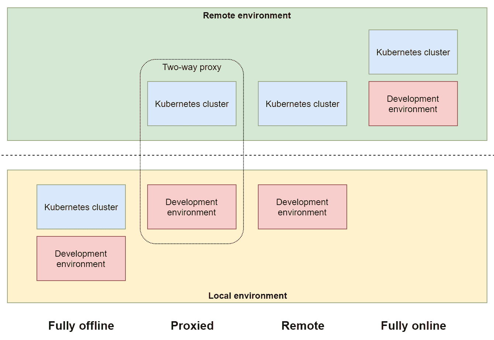
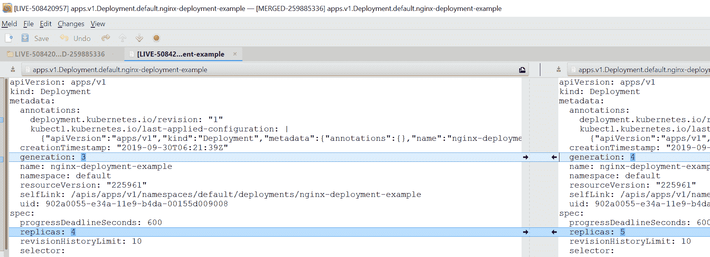

# 六、与Kubernetes集群交互

作为 Kubernetes 集群用户或操作员，您需要与 Kubernetes API 进行交互，以管理 Kubernetes 对象或调试集群中运行的应用。一般来说，有两种方法可以与 Kubernetes API 通信:您可以直接使用表示状态传输(RESTful) HTTPS 端点—例如，用于编程访问—或者您可以使用 Kubernetes 命令行工具 kubectl(或**命令行界面** ( **CLI** )。一般来说，kubectl 包装了 RESTful API 通信，并隐藏了关于定位和向 Kubernetes API 服务器进行身份验证的复杂性。创建或列出 Kubernetes 对象以及在 Pod 容器中执行等操作都可以作为组织有序的 Kubernetes 子命令使用，您可以在集群上执行特定操作时使用这些命令，也可以将其作为应用的**持续集成/持续部署** ( **CI/CD** )的一部分。

在本章中，我们将让您更好地了解如何在 Windows 机器上安装 kubectl，以及如何使用 kubectl 管理多个 Kubernetes 集群。您还将学习最常见和最有用的 Kubernetes 命令，用于管理 Kubernetes 对象和调试容器化应用。

本章由以下主题组成:

*   安装 Kubernetes 命令行工具
*   访问 Kubernetes 集群
*   与发展集群合作
*   查看常见的 kubectl 命令

# 技术要求

对于本章，您需要安装以下内容:

*   Windows 10 专业版、企业版或教育版(1903 版或更高版本，64 位)
*   适用于 Windows 2.0.0.3 或更高版本的 Docker 桌面
*   Windows 的巧克力包装管理器([https://chocolatey.org/](https://chocolatey.org/))
*   蓝色命令行界面

Windows Docker Desktop 的安装和系统要求包含在[第 1 章](01.html) *【创建容器】*中。

使用巧克力包管理器不是强制性的，但它使安装过程和应用版本管理变得更加容易。安装过程记录在这里:[https://chocolatey.org/install](https://chocolatey.org/install)。

对于 Azure CLI，您可以在[第 2 章](02.html) *【管理容器中的状态】* *中找到详细的安装说明。*

要继续使用 **Azure Kubernetes 服务** ( **AKS** )，您需要创建自己的 Azure 帐户和 AKS 实例。如果您还没有创建前几章的帐户，您可以在这里阅读更多关于如何获得个人使用的有限免费帐户的信息:[https://azure.microsoft.com/en-us/free/](https://azure.microsoft.com/en-us/free/)。AKS 集群部署在[第 4 章](04.html)、 *Kubernetes 概念和 Windows 支持*中介绍。您也可以使用该章中提供的 PowerShell 脚本。

您可以从官方 GitHub 资源库下载本章的最新代码示例:[https://GitHub . com/PacktPublishing/hand-Kubernetes-On-Windows/tree/master/chapter 06](https://github.com/PacktPublishing/Hands-On-Kubernetes-on-Windows/tree/master/Chapter06)。

# 安装 Kubernetes 命令行工具

Kubectl 可以在各种操作系统上使用，包括 Windows。如果您有在 Linux 上使用 kubectl 的经验，您可以预期唯一的区别是安装过程——命令和基本原则保持不变。对于 Windows，您有几个 kubectl 安装选项，如下所示:

*   直接下载 kubectl 二进制文件。
*   使用 PowerShell 图库([https://www.powershellgallery.com/](https://www.powershellgallery.com/))。
*   使用第三方 Windows 软件包管理器:巧克力([https://chocolatey.org/](https://chocolatey.org/))或勺子([https://scoop.sh/](https://scoop.sh/))。

Kubectl can also be installed automatically by Docker Desktop for Windows while creating a local development Kubernetes cluster (executable installed in `C:\Program Files\Docker\Docker\Resources\bin\kubectl.exe`) or using the Azure CLI when creating the AKS cluster instance (using the `az aks install-cli` command, which installs kubectl in `~/.azure-kubectl/kubectl.exe`). This may create conflicts with already installed kubectl instances in different locations—you can always check which kubectl installation is used in PowerShell by using the `(Get-Command kubectl).Path` command. Switching to a different kubectl installation requires the `PATH` environment to be modified and the desired precedence to be ensured.

您可以在官方文档中找到所有安装类型的详细说明:[https://kubernetes.io/docs/tasks/tools/install-kubectl/](https://kubernetes.io/docs/tasks/tools/install-kubectl/)。我们将演示如何使用 Chocolatey 安装 kubectl，因为这是在 Windows 上安装 kubectl 最简单、最方便的方法。请遵循以下步骤:

1.  如果你还没有安装巧克力包管理器，你可以在这里找到安装说明:[https://chocolatey.org/install](https://chocolatey.org/install)。
2.  以管理员身份打开 PowerShell 窗口，并使用以下命令安装 kubectl:

```
choco install kubernetes-cli
```

3.  如果需要将 kubectl 升级到最新版本，请使用以下命令:

```
choco upgrade kubernetes-cli
```

4.  验证是否已安装 kubectl，例如使用以下命令:

```
kubectl version
```

According to the Kubernetes version skew support policy, you should use a version of kubectl that is within one minor version (older or newer) of kube-apiserver. For example, kubectl 1.15 is guaranteed to work with kube-apiserver 1.14, 1.15, and 1.16\. It is advised that you use the latest kubectl version for your cluster whenever possible.

请注意，从 Chocolatey 安装的 kubectl 版本有时可能比最新的稳定版本旧。在这种情况下，如果您需要最新的稳定版本，请按照说明直接下载 kubectl 二进制文件。

在下一节中，我们将演示如何组织对多个 Kubernetes 集群的访问。

# 访问 Kubernetes 集群

默认情况下，kubectl 使用位于`~\.kube\config`的`kubeconfig`文件(注意我们称之为`kubeconfig`，但文件名为`config`，在 Windows 机器上扩展为`C:\Users\<currentUser>\.kube\config`。这个 YAML 配置文件包含 Kubernetes 连接到集群的 Kubernetes API 所需的所有参数。该配置文件也可以由不同于 kubectl 的工具使用，例如 *Helm* 。

You can use the `KUBECONFIG` environment variable or the `--kubeconfig` flag for individual commands to force kubectl to use a different `kubeconfig`. For the `KUBECONFIG` environment variable, it is possible to specify multiple `kubeconfig` and merge them in runtime. You can read more about this feature in the official documentation: [https://kubernetes.io/docs/concepts/configuration/organize-cluster-access-kubeconfig/#merging-kubeconfig-files](https://kubernetes.io/docs/concepts/configuration/organize-cluster-access-kubeconfig/#merging-kubeconfig-files). Please note that, for Windows, you should specify `KUBECONFIG` paths separated by a semicolon, contrary to Linux, where you use a colon.

使用上下文在`kubeconfig`中组织对多个 Kubernetes 集群的协调访问。每个上下文包含以下信息:

*   **集群**:Kubernetes API 服务器的地址。
*   **用户**:映射到用户凭证(在`kubeconfig`中指定)的用户名。
*   **命名空间**:可以选择提供默认的命名空间来使用。

如果您一直在遵循前面的章节，我们在窗口 Docker Desktop 中演示了 Minikube 和本地 Kubernetes 集群的安装，那么您已经使用了在这些集群安装过程中自动添加的上下文。使用 kubectl 时，总是有一个上下文标记为当前。您可以使用以下命令查看当前上下文:

```
PS C:\src> kubectl config current-context
minikube
```

在`kubeconfig`中列出所有可用的上下文可以通过以下方式完成:

```
PS C:\src> kubectl config get-contexts
CURRENT   NAME                  CLUSTER               AUTHINFO                                                     NAMESPACE
 aks-windows-cluster   aks-windows-cluster   clusterUser_aks-windows-resource-group_aks-windows-cluster
 docker-desktop        docker-desktop        docker-desktop
 docker-for-desktop    docker-desktop        docker-desktop
*         minikube              minikube              minikube
```

如果要切换到不同的上下文，例如`docker-desktop`，请执行以下命令:

```
PS C:\src> kubectl config use-context docker-desktop
Switched to context "docker-desktop".
```

您可以修改现有上下文或从命令行手动添加您自己的上下文。例如，以下命令将添加一个新的上下文，`docker-desktop-kube-system`，它将连接到`docker-desktop`集群，并默认使用`kube-system`命名空间:

```
kubectl config set-context docker-desktop-kube-system `
 --cluster docker-desktop `
 --user docker-desktop `
 --namespace kube-system
```

当您切换到新的上下文并运行任何命令时，例如`kubectl get pods`，它将针对`kube-system`命名空间执行。

At any given time, you can override the current context settings using `--cluster`, `--user`, `--namespace`, or even `--context` flags for kubectl commands.

通常，当使用托管 Kubernetes 提供程序或本地开发工具时，配置将作为单独的文件通过`KUBECONFIG`环境变量下载和使用，或者作为新的上下文直接合并到当前的`kubeconfig`中(在 AKS 的情况下，`az aks get-credentials`命令就是这样做的)。如果需要，您可以使用以下 PowerShell 命令手动执行`kubeconfigs`的合并:

```
$env:KUBECONFIG="c:\path\to\config;~\.kube\config"
kubectl config view --raw
```

该命令的输出可以作为新的默认`kubeconfig`—在覆盖默认配置文件之前，您应该验证结果是否有效。您可以使用以下代码片段用合并的代码片段覆盖默认的`kubeconfig`:

```
$env:KUBECONFIG="c:\path\to\config;~\.kube\config"
kubectl config view --raw > ~\.kube\config_new
Move-Item -Force ~\.kube\config_new ~\.kube\config
```

记住`kubeconfig`合并优先规则:如果在两个文件中找到相同的关键字，第一个文件中的值优先。

现在您已经知道如何使用 kubeconfig 和 kubectl 上下文来管理对 Kubernetes 集群的访问，让我们专注于使用开发集群的策略。

# 与发展集群合作

为 Kubernetes 开发应用引入了一些传统开发管道所没有的独特挑战。完美的解决方案是对管道和流程进行最小的更改，但不幸的是，事情并没有那么简单。首先，您需要维护一个开发 Kubernetes 集群，在这里您可以部署、测试和调试应用。其次，您必须将您的应用容器化，并将其部署到开发集群中，这可能比在安全的生产集群中更具灵活性和可访问性。

非正式地说，对于 Kubernetes 应用开发，您有四种模式(概念)，如下图所示:



让我们来看看这四种模式:

*   **完全离线**:在完全离线(本地)的环境中，你的开发环境和 Kubernetes 集群都是本地托管在你的机器上。这种配置的一个很好的例子是用于 Windows 本地 Kubernetes 集群的 Minikube 或 Docker Desktop。在这两种情况下，Kubernetes 集群都托管在专用的本地**虚拟机** ( **虚拟机**)中。这个开发工作流需要构建 Docker 映像，将它们推送到映像注册表(本地或远程)，并使用 kubectl 部署应用。当然，您可以利用集群在本地运行的事实，登录到集群节点并调试 Pod 容器。从 Windows 容器的角度来看，这需要在 Hyper-V 虚拟机上运行完整的混合 Linux/Windows Kubernetes 集群。此设置要求本地计算机能够运行至少两个虚拟机:一个用于 Linux 主节点，一个用于 Windows 工作节点。我们将在[第 7 章](07.html)、*中部署一个功能全面的混合集群，部署混合内部 Kubernetes 集群*。

The deployment strategies that are presented in the next chapters can be used for both development and production clusters. The disadvantage of this approach for development is the significant amount of configuration compared to Minikube or other fully offline solutions. Unfortunately, at this point, there are no easy turnkey solutions for hybrid development clusters—if you need a cluster for development as soon as possible, the fully managed AKS is the best option.

*   **代理**:使用代理环境时，您的 Kubernetes 集群托管在远程机器上(但也可以托管在本地虚拟机上！).开发环境仍然在您的本地机器上，但是您已经配置了双向网络代理，这样您就可以运行和调试您的应用，就像您在集群中的 Pod 中一样。换句话说，您可以简化开发工作流，并跳过开发和调试场景的 Docker 开销。这可以通过远程呈现([https://www.telepresence.io/](https://www.telepresence.io/))等工具来实现。遗憾的是，Windows 目前仅通过 Linux 的 Windows 子系统支持，这意味着没有本机 Windows 支持。
*   **远程**:下一种模式是远程模式，您可以针对远程集群进行本地开发，或者托管在本地数据中心，或者作为托管的 Kubernetes 产品。这类似于使用完全离线的环境，但是您必须小心使用托管 Kubernetes 集群的额外成本和对 Kubernetes 节点的有限访问。对于 Windows，如果您正在运行 AKS，您将无法登录到 Linux 主节点，但是，如果您正在裸机 Azure 虚拟机上使用 AKS 引擎进行部署，您可以同时访问 Linux 主节点和 Windows 节点。这种环境类型的优势在于，您可以利用 Kubernetes 的所有云集成，例如负载平衡器服务或云卷。我们将在[第 8 章](08.html)、*介绍 AKS 引擎部署，部署混合 Azure Kubernetes 服务集群*。
*   **完全在线**:在完全在线模式下，您的开发环境与 Kubernetes 集群一起远程托管。这种方法的好例子是 Eclipse Che()和 Azure Dev Spaces()，它们与 Visual Studio Code 完全集成。对 Windows 节点的支持目前还在开发中，需要手动配置([https://docs . Microsoft . com/en-us/azure/dev-spaces/how-run-dev-spaces-Windows-containers](https://docs.microsoft.com/en-us/azure/dev-spaces/how-to/run-dev-spaces-windows-containers))。未来，这是为 Windows 容器提供无缝 Kubernetes 开发生命周期的最佳选择。我们将在[第 12 章](12.html)、*使用 Kubernetes* 介绍 Azure 开发空间。

There are many tools that can boost your Kubernetes application development productivity and reduce the overhead of having "another cluster in the middle of everything". For example, for Windows support, you may want to check out Azure Draft ([https://draft.sh/](https://draft.sh/)), which simplifies the development pipeline using auto-generated Helm charts for your application, or ksync ([https://ksync.github.io/ksync/](https://ksync.github.io/ksync/)), which can be used for syncing your local code/binary changes to Pod containers, without a need for redeployment.

在下一节中，我们将快速查看工具箱中最常见和最有用的 kubectl 命令。

# 查看常见的 kubectl 命令

Kubectl 是一个强大的工具，它提供了与 Kubernetes 集群交互时所需的大部分功能。所有 kubectl 命令遵循相同的语法，如以下代码片段所示:

```
kubectl [command] [type] [name] [flags]

# Example:
kubectl get service kube-dns --namespace kube-system

```

`[command]`、`[type]`、`[name]`和`[flags]`的定义如下:

*   `[command]`指定操作，例如`get`、`apply`、`delete`。
*   `[type]`是资源类型(详细列表可在文档中找到:[https://kubernetes . io/docs/reference/kube CTL/overview/# resource-type](https://kubernetes.io/docs/reference/kubectl/overview/#resource-types))，以单数、复数或缩写形式(不区分大小写)指定，例如`service`、`services`、`svc`。您可以使用`kubectl explain [type]`命令找到关于每个资源的更多信息。
*   `[name]`确定资源的名称(区分大小写)。如果命令允许省略名称，则该操作将应用于给定类型的所有资源。
*   `[flags]`指定附加标志，这些标志或者是特定于命令的，或者是 kubectl 的全局标志，例如`--namespace kube-system`。

您可以随时使用`kubectl help`或`kubectl [command] --help`来访问关于每个命令如何工作以及可用标志的全面文档。kubectl 的官方参考可以在这里找到:[https://kubernetes . io/docs/reference/generated/kube CTL/kube CTL-commands](https://kubernetes.io/docs/reference/generated/kubectl/kubectl-commands)。

The terms *resource *and *object *are often used in Kubernetes interchangeably, although there are some differences considering Kubernetes internals. Objects are Kubernetes system entities (abstract concepts), whereas resources are the actual RESTful API resources that provide a representation of objects.

一些命令，如`get`或`create`，允许您使用`-o`或`--output`标志指定输出格式。例如，可以使用`-o json`强制 JSON 输出格式，或者使用`-o jsonpath=<template>`使用 JSONPath 模板提取信息。这在基于 kubectl 命令实现自动化时特别有用。您可以在这里找到更多关于输出类型的信息:[https://kubernetes . io/docs/reference/kube CTL/overview/# output-options](https://kubernetes.io/docs/reference/kubectl/overview/#output-options)。

对于 *Bash* 和 *Zsh* ，可以通过使用自动完成**([https://kubernetes . io/docs/tasks/tools/install-kubectl/# enable-shell-自动完成](https://kubernetes.io/docs/tasks/tools/install-kubectl/#enabling-shell-autocompletion))来提高 kube CTL 的工作效率。对于 Windows，还没有对 PowerShell 的自动完成支持，但是，如果您使用 Linux 的 Windows 子系统管理您的 Kubernetes 集群，您也可以安装 Bash 自动完成。**

 **# 创建资源

在[第 4 章](04.html)*Kubernetes 概念和 Windows 支持*中，我们已经解释了在 Kubernetes 中*命令式*和*声明式*资源管理背后的思想。简而言之，当使用命令式管理时，您依赖于创建、删除和替换资源的命令(想想脚本中的命令)。另一方面，在声明式管理中，您只描述资源的期望状态，Kubernetes 执行所有必需的操作，将资源的当前状态转换为期望的状态。

使用`kubectl create -f <manifestFile>`命令可以以命令方式创建 Kubernetes 资源。声明式的方式，就得用`kubectl apply -f <manifestFile>`。请注意，您可以应用`-R`标志并递归处理目录*，而不是单个文件。让我们在 Linux nginx Pods 的示例部署清单文件上演示一下，您可以从本书的 GitHub 存储库中下载该文件:[https://GitHub . com/packt publishing/hand-On-Kubernetes-On-Windows/blob/master/chapter 06/01 _ Deployment-example/nginx-Deployment . YAML](https://github.com/PacktPublishing/Hands-On-Kubernetes-on-Windows/blob/master/Chapter06/01_deployment-example/nginx-deployment.yaml)。*

 *假设您在当前目录中将清单文件保存为`nginx-deployment.yaml`，使用 PowerShell 执行以下命令来创建`nginx-deployment-example`部署:

```
kubectl create -f .\nginx-deployment.yaml
```

You can use the URL for manifest files directly in kubectl—for example, `kubectl create -f https://raw.githubusercontent.com/PacktPublishing/Hands-On-Kubernetes-on-Windows/master/Chapter06/01_deployment-example/nginx-deployment.yaml`. Remember to always verify the contents of the manifest file, especially from a security perspective, before deploying them to your cluster.

您可以使用`kubectl apply`命令实现同样的目的，如下所示:

```
kubectl apply -f .\nginx-deployment.yaml
```

此时，这些命令的行为方式相同:它们只是创建部署。但是现在，如果您修改`nginx-deployment.yaml`文件以使副本的数量增加到 4，请检查`kubectl create`和`kubectl apply`命令会发生什么:

```
PS C:\src> kubectl create -f .\nginx-deployment.yaml
Error from server (AlreadyExists): error when creating ".\\nginx-deployment.yaml": deployments.apps "nginx-deployment-example" already exists

PS C:\src> kubectl apply -f .\nginx-deployment.yaml
deployment.apps/nginx-deployment-example configured
```

不可能强制创建部署，因为它已经创建了—您必须替换它。在声明性`apply`命令的情况下，变更已经被接受，并且现有的部署已经被缩放到 4 个副本。

对于声明性管理，kubectl 提供了`kubectl diff`命令，该命令显示了集群和清单文件中资源的当前状态之间的差异。请注意，您需要在您的`PATH`环境变量中使用`diff`工具，或者使用任何其他文件比较工具，例如，Meld([http://meldmerge.org/](http://meldmerge.org/))并使用`KUBECTL_EXTERNAL_DIFF`环境变量指定它。将`nginx-deployment.yaml`中的`replicas`增加到 5，并检查比较结果，如下:

```
$env:KUBECTL_EXTERNAL_DIFF="meld"
kubectl diff -f .\nginx-deployment.yaml
```

您可以立即在下面的截图中看到，如果您执行`kubectl apply`，哪些属性会受到影响:



一般的经验法则是，只要有可能，您应该坚持声明性资源管理，将命令性命令只留给开发/黑客场景。对于 Kubernetes 应用的完全声明式管理，请考虑使用 Kustomize 的 kubectl。您可以在以下网址了解更多关于这种方法的信息:https://kubernetes . io/docs/tasks/manage-kubernetes-objects/kustomization/。

# 删除资源

要删除资源，可以使用`kubectl delete [type] [name]`命令。这也是仍然建议在声明性集群管理中使用的命令之一，因为它更显而易见。使用带有`--prune`标志的`kubectl apply`更危险，因为你可能会不小心删除更多资源。

使用以下命令删除`nginx-deployment-example`部署:

```
kubectl delete deployment nginx-deployment-example
```

如果要删除给定类型的所有资源，可以指定`--all`标志，而不是资源名称。

# 描述和列出资源

您将经常使用的下一个命令是`kubectl get [type] [name]`，它显示了关于给定类型的资源的详细信息。例如，要在当前上下文的默认命名空间中列出 Pods，请执行以下命令:

```
kubectl get pods
```

您可以使用`--all-namespaces`或`--namespace=<namespace>`全局标志，这允许您显示来自其他名称空间的资源，如以下代码片段所示:

```
kubectl get pods --all-namespaces
```

默认情况下，此命令显示有限的预定义列。使用`-o wide`标志可以看到更多细节，如下所示:

```
kubectl get pods -o wide
```

在某些情况下，您会发现观看资源很有用。以下命令列出所有 Pods，并定期用最新数据刷新视图:

```
kubectl get pods --watch
```

还有一个不同的命令`kubectl describe`，可以用来显示资源细节，如下面的代码片段所示:

```
kubectl describe pod nginx-deployment-example-7f5cfc59d6-2bvvx
```

`get`和`describe`命令之间的区别在于`get`显示了来自 Kubernetes API 的资源的纯表示，而`describe`准备了详细的描述，包括事件、控制器和其他资源。

`kubectl get`支持与表不同的输出，例如`-o json`或`-o yaml`，它们适合与其他工具集成或将资源状态转储到文件中，如以下代码片段所示:

```
kubectl get pod nginx-deployment-example-7f5cfc59d6-2bvvx -o yaml
```

如果需要对输出进行更多的处理，可以使用 JSONPath([https://github.com/json-path/JsonPath](https://github.com/json-path/JsonPath))，它集成到 kubectl 中。例如，以下表达式将列出群集中 Pods 中使用的所有容器映像:

```
kubectl get pods --all-namespaces -o jsonpath="{.items[*].spec.containers[*].image}"
```

最后，您可能会发现用一个命令列出所有名称空间中的所有资源非常有用，如下所示:

```
kubectl get all --all-namespaces
```

这应该总能让您很好地了解集群中正在发生的事情！

# 编辑资源

正如本节前面提到的，通常不鼓励对 Kubernetes 资源进行强制性编辑。`kubectl edit`是打开您最喜欢的文本编辑器的`kubectl get`和修改后的清单文件的`kubectl apply`的组合，如以下代码块所示:

```
kubectl edit deployment nginx-deployment-example
```

在 Windows 机器上，该命令将以`nginx-deployment-example`的当前状态打开`notepad.exe`(或任何其他编辑器，如果您指定了`EDITOR`或`KUBE_EDITOR`环境变量)。编辑后，保存文件，关闭编辑器，您的更改将被应用。

另一种方法是使用补丁，它可以用于声明式管理。`kubectl patch`通过合并当前资源状态和仅包含已修改属性的补丁来更新资源。修补的一个常见用例是，当您需要为混合 Linux/Windows 集群中的现有 DaemonSet 强制执行节点选择器时。以下 JSON 补丁可用于确保仅在 Linux 节点上运行诸如法兰绒或 kube 代理之类的 DaemonSet:

```
{
    "spec": {
        "template": {
            "spec": {
                "nodeSelector": {
                    "beta.kubernetes.io/os": "linux"
                }
            }
        }
    }
}
```

也可以使用 YAML 补丁，但不幸的是，由于 PowerShell 转义规则，我们无法为`beta.kubernetes.io/os`选择器演示这一点。JSON 在 PowerShell 中仍然需要额外的预处理。

要将此补丁应用于`nginx-deployment-example`部署，请将补丁保存为`linux-node-selector.json`文件，并运行以下命令:

```
$patch = $(cat .\linux-node-selector.json)
$patch = $patch.replace('"', '\"')
kubectl patch deployment nginx-deployment-example --patch "$patch"
```

您可以在官方文档中找到更多关于资源和合并类型的补丁:https://kubernetes . io/docs/tasks/run-application/update-API-object-kube CTL-patch/。

# 运行临时 Pod

在调试场景中，您可能会发现运行一个特殊的 Pod 并附加到它是很有用的。您可以使用`kubectl run`命令来执行此操作—请注意，此命令可以生成不同的资源，但是除了 Pod 之外的所有生成器都不推荐使用。以下代码片段将创建一个带有一个`busybox`容器的`busybox-debug` Pod，并在该容器中运行一个交互式伯恩 shell 会话:

```
kubectl run --generator=run-pod/v1 busybox-debug -i --tty --image=busybox --rm --restart=Never -- sh
```

出现 shell 提示符时，您可以从集群内部执行操作，例如 ping 内部 IP。当您退出外壳时，容器将被自动移除。

您可以使用类似的方法为 Windows 节点创建交互式 PowerShell Pod。

# 访问 Pod 容器日志

调试运行在 Kubernetes 上的应用时，容器日志提供了重要信息。您可以使用`kubectl logs`命令访问 Pod 容器日志，类似于 Docker 命令行界面，如下所示:

```
kubectl logs etcd-docker-desktop -n kube-system
```

如果 Pod 只运行一个容器，这将有效。如果 Pod 包含多个容器，则需要使用`--container`或`--all-containers`标志。

此外，您可能希望跟踪最后几行日志(`--tail=n`标志)并启用日志的实时流(`--follow`标志)，如以下代码片段所示:

```
kubectl logs etcd-docker-desktop -n kube-system --tail=10 --follow
```

# 执行到 Pod 容器中

当调试运行在 Kubernetes 上的应用时，您可以将`exec`放入在 Pods 中运行的容器中，就像对裸 Docker 容器一样。例如，要列出容器当前工作目录中的所有文件，请使用以下`kubectl exec`命令:

```
kubectl exec nginx-deployment-example-5997d7d5fb-p9fbn -- ls -al
```

可以附加一个交互式终端并运行一个 Bash 会话，如下所示:

```
kubectl exec nginx-deployment-example-5997d7d5fb-p9fbn -it bash
```

对于多容器POD，您必须使用`--container`标志，否则将选择POD中的第一个容器。

# 正在复制 Pod 容器文件

Kubectl 为您提供了在机器和 Pod 容器之间复制文件的可能性(两种方式都有)，类似于 Docker CLI。例如，要将`/var/log/dpkg.log`文件从运行在`nginx-deployment-example-5997d7d5fb-p9fbn` Pod 中的容器复制到当前目录，请执行`kubectl cp`命令，如下所示:

```
kubectl cp nginx-deployment-example-5997d7d5fb-p9fbn:/var/log/dpkg.log dpkg.log
```

通常，如果您使用 Pod 容器作为源或目标，您需要指定 Pod 名称和容器文件系统路径，用冒号(`:`)分隔。至于其他命令，如果 Pod 正在运行多个容器，则需要使用`--container`标志，否则将选择第一个容器。

# 端口转发和代理流量

Kubectl 可以作为访问 Kubernetes 集群的简单代理。如果需要从本地机器直接与 Pod 上的给定端口通信，请使用端口转发到 Pod。这无需使用`kubectl port-forward`命令手动暴露服务对象即可实现。该命令可用于转发到基于其他对象选择器自动选择的 Pod，例如部署，如下所示:

```
kubectl port-forward deployment/nginx-deployment-example 7000:80
```

该命令将把所有流量从本地机器端口`7000`转发到端口`80`，用于`nginx-deployment-example`部署中的一个POD。导航至`http://localhost:7000`确认默认 nginx 页面可访问。完成后，终止端口转发命令。

此外，kubectl 可以为您的本地机器提供对 Kubernetes API 服务器的访问。使用`kubectl proxy`命令在端口`8080`公开 API，如下所示:

```
kubectl proxy --port=8080
```

现在，当您在浏览器中导航到`http://localhost:8080/api/v1/namespaces/default/pods`时，您将看到集群中当前正在运行的 Pod 对象。祝贺您—您已经成功设置了 kubectl 端口转发！

# 摘要

在本章中，您已经学习了如何安装和使用 Kubernetes 命令行工具 kubectl。我们已经介绍了如何使用 Kubernetes 上下文组织访问多个 Kubernetes 集群，使用开发集群有哪些可能的策略，以及它们如何适合 Windows 集群。除此之外，您现在知道了基本的 kubectl 命令和一些可用于调试在 Kubernetes 上运行的应用的技术:运行即席 Pods、访问 Pod 容器日志、在 Pod 容器中执行 exec 以及在本地机器和 Pod 容器之间复制文件。

下一章将重点介绍在内部部署场景中混合 Linux/Windows Kubernetes 集群的部署。我们将演示如何使用 Hyper-V 虚拟机在您的本地计算机上创建功能齐全的多节点集群。

# 问题

1.  什么是`kubeconfig`？
2.  您将如何为 kubectl 设置自定义`kubeconfig`位置？
3.  上下文在 kubectl 中的作用是什么？
4.  `kubectl create`和`kubectl apply`命令有什么区别？
5.  什么是 kubectl 资源补丁，你会在什么时候使用它？
6.  从 Pod 容器显示实时日志的命令是什么？
7.  如何使用 kubectl 在本地机器和 Pod 容器之间复制文件？

你可以在本书的*评估*中找到这些问题的答案。

# 进一步阅读

*   有关 Kubernetes 概念和 Kubernetes 命令行界面的更多信息，请参考以下 Packt 书籍:
    *   *完整的 kubernetes 指南*([https://www . packtpub . com/虚拟化与云/完整的 Kubernetes 指南](https://www.packtpub.com/virtualization-and-cloud/complete-kubernetes-guide))
    *   *Kubernetes 入门-第三版*([https://www . packtpub . com/虚拟化与云/入门-Kubernetes-第三版](https://www.packtpub.com/virtualization-and-cloud/getting-started-kubernetes-third-edition))
    *   *Kubernetes for Developers*([https://www . packtpub . com/虚拟化与云/kubernetes-developers](https://www.packtpub.com/virtualization-and-cloud/kubernetes-developers) )
*   也可以参考优秀的官方 Kubernetes 文档([https://kubernetes.io/docs/home/](https://kubernetes.io/docs/home/))和 kubectl 参考文档([https://Kubernetes . io/docs/reference/generated/kube CTL/kube CTL-commands](https://kubernetes.io/docs/reference/generated/kubectl/kubectl-commands))。***