# 七、部署混合内部Kubernetes集群

在前面的章节中，我们从更理论的角度关注了 Docker 和 Kubernetes 的概念——现在，是时候利用这些知识从头开始部署 Kubernetes 集群了。本章的目标是在内部环境中拥有一个功能齐全的混合 Windows/Linux Kubernetes 集群。

根据您的需要，您可以使用这种方法创建一个最小化的本地开发集群(一个 Linux **虚拟机** ( **虚拟机**))作为主节点，一个 Windows 虚拟机作为节点)，或者部署一个具有 Linux 和 Windows 节点的生产级内部集群。您不局限于 Hyper-V 集群，这种方法可以用于裸机、VMware 集群或云中运行的虚拟机。使用 kubeadm 创建 Kubernetes 集群可以让您灵活地在任何地方部署集群，只要设置了适当的网络，并且机器能够运行容器化的工作负载。

我们还建议使用 kubeadm，因为它是一个低级工具，可以深入了解集群是如何实际创建的。未来，您可以期待在 kubeadm(如 Kubespray)之上构建的其他解决方案，它支持混合集群。但即便如此，仍然建议尝试纯 Kubernetes 方法来学习 Kubernetes 集群部署的基准步骤。

本章涵盖以下主题:

*   准备 Hyper-V 环境
*   使用 Kubernetes 主节点创建 Kubernetes 主节点
*   安装 Kubernetes 网络
*   为 Windows 节点准备虚拟机
*   使用 kubeadm 连接窗口节点
*   部署和检查第一个应用

# 技术要求

对于本章，您将需要以下内容:

*   Windows 10 Pro、企业版或教育版(1903 版或更高版本，64 位)；至少有 16 GB 内存的 Hyper-V 主机(如果您选择不为 Windows Server 和 Ubuntu Server 虚拟机安装桌面体验，可能会更少)。您可以使用任何其他具有 Hyper-V 的 Windows 或 Windows 服务器版本。对于 Hyper-V，您需要在**基本输入/输出系统** ( **BIOS** 中启用**英特尔虚拟化技术** ( **英特尔 VT** )或 **AMD 虚拟化** ( **AMD-V** )技术功能。

Note: Windows 10 Home cannot be used as a Hyper-V host.

*   Linux 主虚拟机至少有 15 GB 磁盘空间，每个 Windows 节点虚拟机至少有 30 GB 磁盘空间。
*   Ubuntu Server 18.04 **长期支持** ( **LTS** ) **国际标准组织**(**ISO**)([http://releases . Ubuntu . com/18 . 04 . 3/Ubuntu-18 . 04 . 3-live-Server-amd64 . ISO](http://releases.ubuntu.com/18.04.3/ubuntu-18.04.3-live-server-amd64.iso))。
*   Windows Server 2019 ( **长期服务渠道** ( **LTSC** ，提供桌面体验)ISO 或 Windows Server 1903 ( **半年度渠道** ( **SAC** ，无桌面体验)ISO。您应该查看[https://kubernetes . io/docs/setup/production-environment/Windows/intro-Windows-in-kubernetes/](https://kubernetes.io/docs/setup/production-environment/windows/intro-windows-in-kubernetes/)了解有关当前 Windows Server 版本的最新建议。您可以从微软评估中心([https://www . Microsoft . com/en-us/eval Center/eval-windows-server-2019](https://www.microsoft.com/en-us/evalcenter/evaluate-windows-server-2019))获取评估 ISOs，或者，如果您有 Visual Studio 订阅([https://my.visualstudio.com/Downloads/Featured](https://my.visualstudio.com/Downloads/Featured))，则可以下载 ISOs 用于开发和测试目的。
*   Kubectl 已安装—安装过程已在[第 6 章](06.html)、*与 Kubernetes 集群交互*中介绍。

您可以从官方 GitHub 资源库下载本章的最新代码示例，网址为:[https://GitHub . com/PacktPublishing/hand-Kubernetes-On-Windows/tree/master/chapter 07](https://github.com/PacktPublishing/Hands-On-Kubernetes-on-Windows/tree/master/Chapter07)。

# 准备 Hyper-V 环境

群集部署的第一步是为 Kubernetes 主机和节点虚拟机准备 Hyper-V 主机。

If you choose to use a different hypervisor or use bare-metal machines, you may skip this section.

现在，如果您已经在前面的章节中为您的计算机安装了 Docker Desktop for Windows，那么 Hyper-V 将被启用和配置。你只需要创建一个内部**网络地址转换** ( **NAT** )或者一个外部 Hyper-V **虚拟交换机** ( **虚拟交换机**)，你就可以开始了。

下图显示了我们将在本章中部署的集群的设计。请记住，主节点是*而不是*配置为**高可用性** ( **高可用性**)—根据官方文档([https://kubernetes . io/docs/setup/production-environment/tools/kube dam/high-availability/](https://kubernetes.io/docs/setup/production-environment/tools/kubeadm/high-availability/)),高可用性设置独立于 Windows 容器的支持，您可以在准备 Linux 主节点时执行:

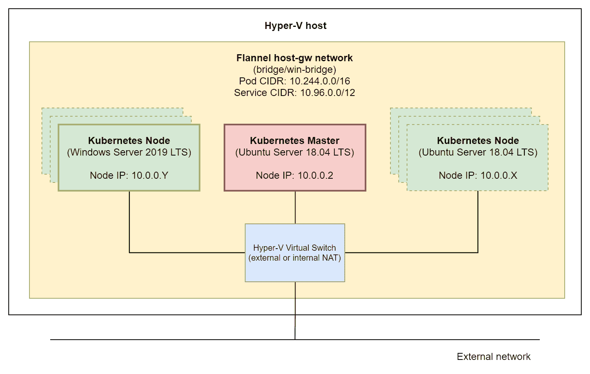

最小的部署是一个 Ubuntu 服务器 18.04 LTS Kubernetes主服务器(有可能安排应用POD)，带有一个 Windows Server 2019 LTS Kubernetes节点。或者，您可以按照相同的说明或克隆虚拟机，决定部署更多的 Windows 和 Linux 节点(图中用虚线标记)。

# 启用超级视频

首先，如果您之前没有启用 Hyper-V 功能，让我们启用它，如下所示:

1.  以管理员身份打开 PowerShell 窗口。
2.  执行以下命令启用 Hyper-V 功能:

```
Enable-WindowsOptionalFeature -Online -FeatureName Microsoft-Hyper-V -All
```

3.  重启机器。

If you are using Windows Server as your Hyper-V host, the instructions for enabling the Hyper-V role can be found in the official documentation at: [https://docs.microsoft.com/en-us/windows-server/virtualization/hyper-v/get-started/install-the-hyper-v-role-on-windows-server](https://docs.microsoft.com/en-us/windows-server/virtualization/hyper-v/get-started/install-the-hyper-v-role-on-windows-server).

现在，根据您的网络设置，您必须创建一个合适的 Hyper-V 虚拟交换机。你有两个选择:

1.  **内部 NAT Hyper-V vsswitch**:如果您计划仅将集群用于本地开发，请使用此选项。任何外部入站通信(除了您的 Hyper-V 主机)都需要 NAT。对于简单的 Windows 10 开发设置，此选项是首选选项，因为在大多数情况下，您连接到的外部网络(以太网或 Wi-Fi)不允许您自行管理**动态主机配置协议** ( **DHCP** )和**域名系统** ( **DNS** )。换句话说，如果您使用一个外部虚拟交换机，您将为您的节点分配不可预测的 IP 地址。没有 DNS，您将无法确保正确的 Kubernetes 集群连接。
2.  **外部 Hyper-V vsswitch**:如果您的网络有您(或网络管理员)可以管理的 DHCP 和 DNS 服务器，请使用此选项。大多数生产部署都是如此。然后，您需要为虚拟机分配适当的**媒体访问控制** ( **MAC** )地址，以便接收所需的 IP 地址。

我们将遵循网络默认网关为`10.0.0.1`，主节点拥有 IP 地址`10.0.0.2`，节点拥有后续 IP 地址`10.0.0.X`的惯例。

# 创建内部网络地址转换虚拟交换机

要创建内部网络地址转换虚拟交换机，请执行以下步骤:

1.  以管理员身份打开 PowerShell 窗口。
2.  执行以下命令创建名为`Kubernetes NAT Switch`的内部虚拟开关:

```
New-VMSwitch -SwitchName "Kubernetes NAT Switch" -SwitchType Internal
```

3.  找到你刚刚创建的虚拟开关的`ifIndex`。创建 NAT 网关需要`ifIndex`。您可以通过运行以下命令来实现这一点:

```
Get-NetAdapter
```

下面的屏幕截图显示了前面命令的输出:

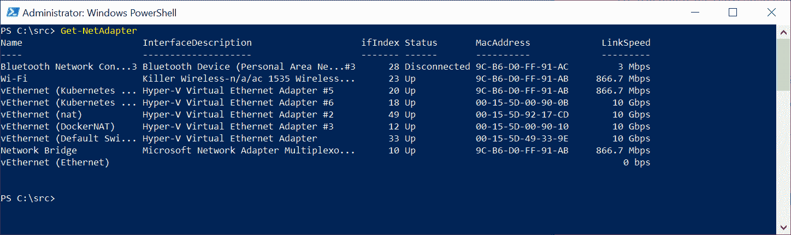

4.  配置 NAT 网关，如下所示:

```
New-NetIPAddress -IPAddress 10.0.0.1 -PrefixLength 8 -InterfaceIndex <ifIndex>
```

5.  创建一个新的网络地址转换网络，如下所示:

```
New-NetNAT -Name "Kubernetes NAT Network" -InternalIPInterfaceAddressPrefix 10.0.0.0/8
```

If you are using an internal NAT vSwitch, you must provide a static IP address, a gateway IP address, and DNS server information for each VM. The static IP address must be within the range of the NAT internal prefix.

请注意，目前，您的系统中只能有一个自定义内部 NAT vSwitch。您可以在官方文档中阅读更多内容，网址为:[https://docs . Microsoft . com/en-us/virtuality/hyper-v-on-windows/user-guide/setup-NAT-network](https://docs.microsoft.com/en-us/virtualization/hyper-v-on-windows/user-guide/setup-nat-network)。

# 创建外部 Hyper-V 虚拟交换机

或者，要创建外部虚拟交换机，请执行以下步骤:

1.  使用开始菜单启动 Hyper-V 管理器。
2.  单击虚拟交换机管理器...从操作选项卡中，选择外部，然后单击创建虚拟交换机。
3.  使用名称`Kubernetes External Switch`并选择用于连接互联网的网络适配器，例如，您的 Wi-Fi 适配器，如下图所示:

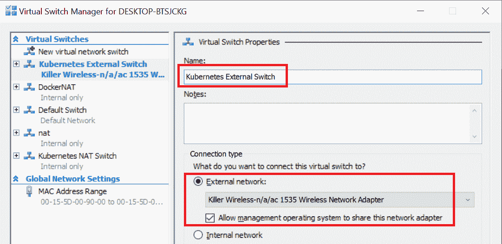

4.  单击“确定”接受更改。

现在，Hyper-V 环境准备就绪，您可以继续下一步了——创建运行在 Ubuntu Server 18.04 LTS 虚拟机上的 Kubernetes 主节点。

# 使用 Kubernetes 主节点创建 Kubernetes 主节点

对于混合的 Windows/Linux Kubernetes 集群，您需要部署一个 Linux 主服务器—这一步与仅支持 Linux 的 Kubernetes 集群几乎相同，您可以为此目的使用任何支持的操作系统。我们选择了 Ubuntu 服务器 18.04 LTS，因为它得到了广泛的支持(官方和社区)，安装过程简单，易于管理。

Instructions in this chapter focus on adding Windows nodes to the Kubernetes cluster. Master preparation steps are minimal. If you are deploying a development cluster on your local machine, using kubeadm to deploy a single control plane in your cluster is sufficient. For production deployments, you should consider deploying an HA master configuration. You can read more about HA and kubeadm at: [https://kubernetes.io/docs/setup/production-environment/tools/kubeadm/high-availability/](https://kubernetes.io/docs/setup/production-environment/tools/kubeadm/high-availability/).

如果你还没有下载 Ubuntu Server 18.04 LTS 的 ISO 映像，可以在以下网址找到官方映像:http://releases . Ubuntu . com/18 . 04 . 3/Ubuntu-18 . 04 . 3-live-Server-amd64 . ISO。

# 创建虚拟机并安装 Ubuntu 服务器

本小节将指导您完成以下步骤，这些步骤将使用 Ubuntu 服务器准备一个新的虚拟机:

1.  创建虚拟机
2.  安装 Ubuntu 服务器
3.  配置网络
4.  安装附加软件包以与 Hyper-V 集成
5.  设置无密码**安全外壳** ( **SSH** )登录

# 创建虚拟机

首先，您需要创建一个将用作主节点的虚拟机，运行 Ubuntu Server 18.04。为此，请打开 Hyper-V 管理器应用并执行以下步骤:

1.  从操作菜单中，选择新建，然后单击虚拟机。
2.  单击下一步，为主节点虚拟机选择一个名称。我们将为此目的使用`Kubernetes Master`。或者，配置一个自定义目录来存储虚拟机数据，以确保有足够的磁盘空间来托管虚拟机，如下图所示:

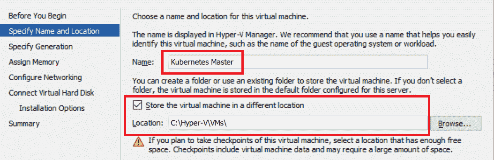

3.  在下一个对话框中，选择第 2 代并继续，如下图所示:

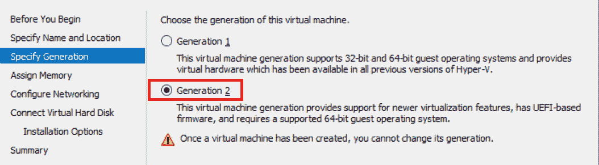

4.  为主节点分配至少`2048` MB 的内存。您也可以选择使用动态内存分配功能。您可以在官方文档中找到更多关于硬件最低要求的信息，网址为:[https://kubernetes . io/docs/setup/production-environment/tools/kube dam/install-kube dam/# before-begin](https://kubernetes.io/docs/setup/production-environment/tools/kubeadm/install-kubeadm/#before-you-begin)。对于生产场景，考虑使用至少`16384`兆内存。下面的截图说明了这个过程:

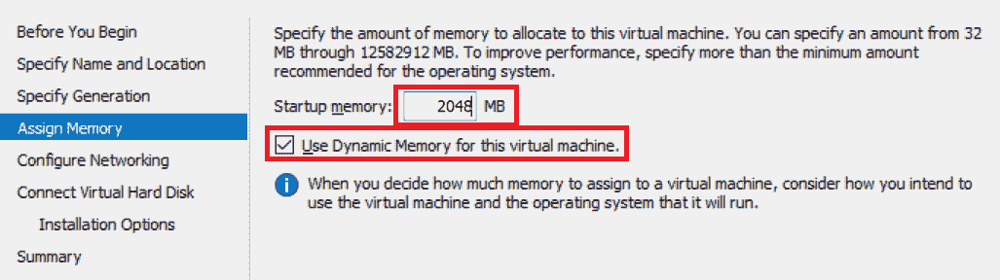

5.  选择内部 NAT 或外部交换机作为虚拟机的连接，如下图所示:

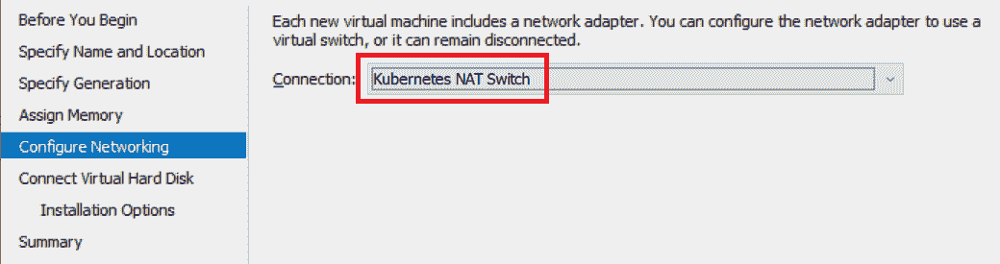

6.  新建一个`250` GB 大小的虚拟硬盘。由于**虚拟硬盘 v2** ( **VHDX** )是动态可扩展的，所以从一开始就分配更多的空间比以后扩展磁盘和分区更容易。下面的截图说明了这个过程:

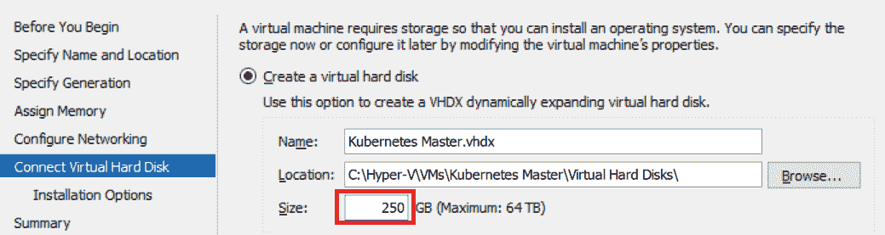

7.  选择从 ISO 安装操作系统，选择你的 Ubuntu Server 18.04 LTS 镜像文件，如下图截图所示:

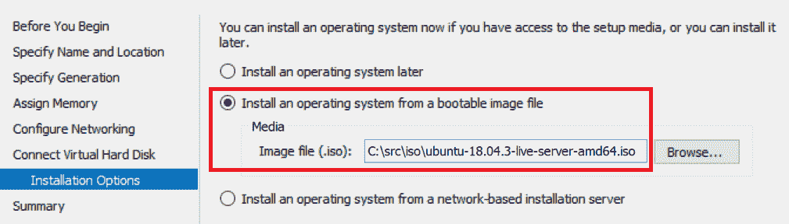

8.  完成虚拟机创建向导。在启动虚拟机之前，我们需要进一步配置它。右键单击 Kubernetes 主虚拟机并打开设置。
9.  在“安全”菜单中，确保将“安全引导模板”设置为“微软 UEFI 证书颁发机构”，如下图所示:

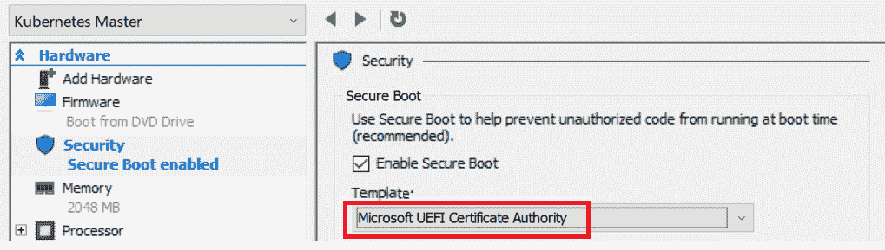

10.  在处理器菜单中，将虚拟处理器数量设置为至少`2`，如下图所示:

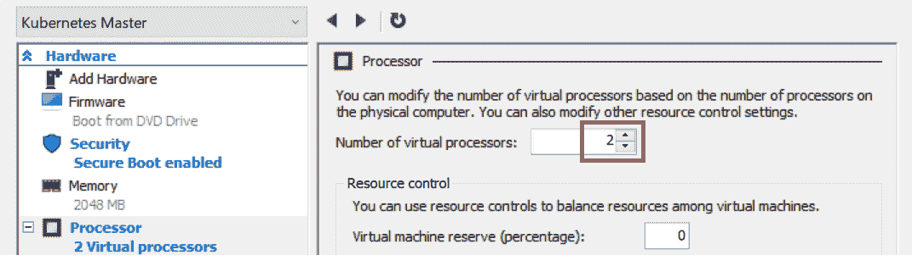

11.  在网络适配器高级功能菜单中，选择启用容器的媒体访问控制地址欺骗。如果您使用的是外部虚拟交换机，并且有外部 DHCP，您可能还想配置静态 DHCP 分配。对于内部 NAT 虚拟交换机，您可以保留默认的动态设置，如下图所示:

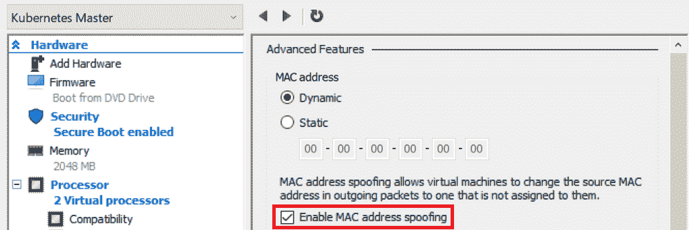

12.  应用所有更改并启动虚拟机。

If you think about fully automating this process, you may choose Vagrant ([https://www.vagrantup.com/](https://www.vagrantup.com/)) for development purposes or Packer for production scenarios ([https://www.packer.io/](https://www.packer.io/)). With Vagrant, you can easily create a development VM from scratch and automate the provisioning process using, for example, Ansible. Using Packer, you can produce machine images for VMs or cloud providers in order to use the **Infrastructure-as-Code** (**IaC**) paradigm.

# 安装 Ubuntu 服务器

主节点的虚拟机已经创建，现在我们需要在虚拟机上安装 Ubuntu Server 18.04 LTS。为此，请执行以下步骤:

1.  通过双击 Hyper-V 管理器中的 Kubernetes 主虚拟机，连接到正在运行的虚拟机终端。
2.  等待安装程序初始化。
3.  选择英语作为首选语言。
4.  选择所需的键盘布局。
5.  在网络连接中，根据您的外部网络配置继续:
    *   如果您使用内部网络地址转换虚拟交换机，您必须手动设置配置。打开 eth0 界面并编辑 IPv4，选择手动方法。设置子网`10.0.0.0/8`、地址`10.0.0.2`、网关`10.0.0.1`、名称服务器`8.8.8.8,8.8.4.4`(如果可能，也可以使用您提供商的域名系统服务器地址)。
    *   如果您使用外部虚拟交换机，请根据您的要求使用自动配置或手动配置网络。
6.  或者，配置网络代理。请记住，如果您在网络代理后面运行，您稍后需要配置 Docker 来使用该代理。
7.  继续使用默认镜像地址。
8.  在文件系统设置中，配置为使用整个磁盘。
9.  选择默认磁盘进行安装。
10.  继续建议的文件系统设置。
11.  在配置文件设置中，您可以配置机器名称和第一个用户名。我们将使用`kubernetes-master`作为机器名称，`ubuntu`作为用户名。
12.  在 SSH 菜单中，选择安装 OpenSSH 服务器。
13.  不要选择任何其他软件包，继续安装。
14.  等待安装完成。
15.  重启。

Automation of Ubuntu Server installation is possible using Kickstart or preseed configuration files. You can find more information in the official documentation, at: [https://help.ubuntu.com/lts/installation-guide/i386/ch04s06.html](https://help.ubuntu.com/lts/installation-guide/i386/ch04s06.html). This approach can be used together with Vagrant or Packer. An example preseed configuration file for Ubuntu Server 18.04 for Packer can be found at: [https://github.com/ptylenda/ironic-packer-template-ubuntu1804-kubernetes-ansible-proxy/blob/master/http/preseed.cfg](https://github.com/ptylenda/ironic-packer-template-ubuntu1804-kubernetes-ansible-proxy/blob/master/http/preseed.cfg).

让我们看看网络配置。

# 配置网络

如果您使用的是内部 NAT 虚拟交换机或带有外部基于 Windows 的 DHCP 服务器的外部虚拟交换机，则机器重新启动后还需要一些额外的网络配置，如下所示:

1.  在虚拟机终端窗口中，使用用户名`ubuntu`和密码登录。
2.  使用`vim`或`nano`打开以下文件:

```
sudo vim /etc/netplan/01-netcfg.yaml
```

If you are not familiar with the Vim editor, we highly recommend learning the basics. A minimal guide can be found, for example, at: [https://eastmanreference.com/a-quick-start-guide-for-beginners-to-the-vim-text-editor](https://eastmanreference.com/a-quick-start-guide-for-beginners-to-the-vim-text-editor). Vim is extremely useful for editing files both on Linux and on Windows, without the need for a desktop environment. As an alternative, you can use nano ([https://www.nano-editor.org/](https://www.nano-editor.org/)).

3.  如果您使用的是内部网络地址转换虚拟交换机，请强制执行Kubernetes主机的静态 IP 地址配置，如下所示:

```
network:
  ethernets:
    eth0:
      dhcp4: no
      addresses: [10.0.0.2/8]
      gateway4: 10.0.0.1
      nameservers:
        addresses: [8.8.8.8,8.8.4.4]
  version: 2
```

4.  或者，如果您使用的是外部虚拟交换机和外部基于 Windows 的 DHCP 服务器，请将文件内容设置为以下内容:

```
network:
  ethernets:
    eth0:
      dhcp4: yes
      dhcp-identifier: mac
  version: 2
```

将`dhcp-identifier`设置为`mac`对于 DHCP 租约正常工作至关重要。

5.  使用`sudo reboot`命令保存文件并重启机器。

我们现在将安装一些额外的软件包。

# 安装附加软件包以与 Hyper-V 集成

对于任何网络配置(内部 NAT 和外部 vSwitch)，您现在都应该安装额外的虚拟化工具，这些工具支持与虚拟机管理程序集成的一些专用功能，如下所示:

1.  再次登录机器。
2.  通过运行以下命令更新`apt-get`缓存:

```
sudo apt-get update
```

3.  安装其他虚拟化工具，如下所示:

```
sudo apt-get install -y --install-recommends linux-tools-virtual linux-cloud-tools-virtual
```

4.  重启。

现在，让我们设置一个无密码的 SSH 登录。

# 设置无密码 SSH 登录

此时，建议切换到使用 SSH 而不是虚拟机终端来管理机器。这将需要以下内容:

1.  在用于连接虚拟机的 Windows 计算机上安装 SSH 客户端(在大多数情况下，是虚拟机主机)
2.  生成一个 SSH 密钥对，以便为 SSH 禁用密码身份验证

要在您的 Windows 计算机上安装本机 SSH 客户端，请执行以下步骤:

1.  以管理员身份打开 PowerShell 窗口
2.  运行以下命令来获取 OpenSSH 客户端的当前可用版本:

```
PS C:\WINDOWS\system32> Get-WindowsCapability -Online | ? Name -like 'OpenSSH*'
Name : OpenSSH.Client~~~~0.0.1.0
State : NotPresent

Name : OpenSSH.Server~~~~0.0.1.0
State : NotPresent
```

3.  安装客户端，如下所示:

```
Add-WindowsCapability -Online -Name OpenSSH.Client~~~~0.0.1.0
```

4.  要连接到 Kubernetes 主节点 VM，您需要知道它的 IP 地址。如果你使用的是静态 IP 地址配置，那就相当简单了——你使用`10.0.0.2`。对于 DHCP 提供的动态 IP 地址，需要先确定。由于在前面的步骤中安装了虚拟化工具，您可以在 Hyper-V 管理器的“网络”选项卡中轻松找到这一点，如下图底部所示:

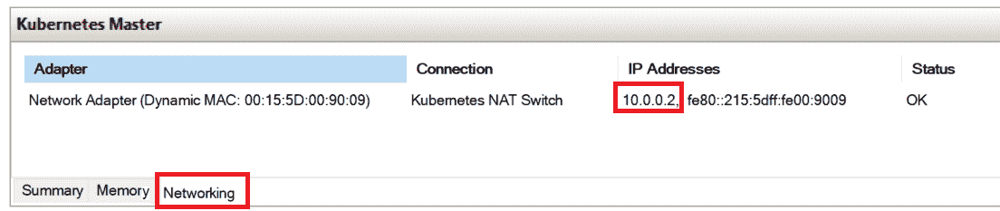

5.  在这种情况下，IP 地址是`10.0.0.2`，我们可以用它来 SSH 到 VM 中，如下所示:

```
PS C:\WINDOWS\system32> ssh ubuntu@10.0.0.2
The authenticity of host '10.0.0.2 (10.0.0.2)' can't be established.
ECDSA key fingerprint is SHA256:X6iv9E7Xixl5GFvV+WxiP10Gbkvh1j3xPsBEV/4YcFo.
Are you sure you want to continue connecting (yes/no)? yes
Warning: Permanently added '10.0.0.2' (ECDSA) to the list of known hosts.
ubuntu@10.0.0.2's password:
Welcome to Ubuntu 18.04.3 LTS (GNU/Linux 4.15.0-65-generic x86_64)
```

If you run into connection problems such as `Connection closed by 10.0.0.2 port 22`, you need to regenerate the SSH host keys. In the VM terminal, run `sudo ssh-keygen -A` and try connecting again. If problems persist, analyze the sshd service logs using `sudo service sshd status`.

下一步是生成一个 SSH 密钥对，用于无密码登录到您的 Kubernetes 主虚拟机。为此，请执行以下步骤:

1.  打开 PowerShell 窗口。
2.  运行以下命令生成密钥对。不要指定密码:

```
ssh-keygen.exe
```

3.  现在，您的公钥在`C:\Users\<user>\.ssh\id_rsa.pub`中可用。使用以下命令将其复制到 Kubernetes 主虚拟机。该命令确保`authorized_keys`文件具有正确、安全的访问权限:

```
cat ~/.ssh/id_rsa.pub | ssh ubuntu@10.0.0.2 "cat >> ~/.ssh/authorized_keys && chmod 600 ~/.ssh/authorized_keys"
```

4.  最后一步是测试无密码身份验证，并禁用 SSH 服务器的密码身份验证以获得最佳安全性，如以下代码片段所示:

```
ssh ubuntu@192.168.43.105
# You should not be asked for password at this point!
```

5.  编辑`/etc/ssh/sshd_config`，如下:

```
sudo vim /etc/ssh/sshd_config
```

6.  找到`PasswordAuthentication yes`行，注释出来，像这样:

```
#PasswordAuthentication yes
```

7.  保存更改并重新启动 SSH 服务器，如下所示:

```
sudo service sshd restart
```

8.  重新连接以验证您的配置。

此时，为`Kubernetes Master`导出 Hyper-V 虚拟机映像(或创建检查点)是一个好主意。如果在 Kubernetes 主配置期间出现任何问题，这将使恢复到初始配置变得更加容易。

# 安装和配置 Kubernetes 先决条件

为 Kubernetes 主节点(以及 Kubernetes 节点)准备 Ubuntu Server 18.04 LTS 机器需要以下步骤:

1.  更改操作系统配置，例如禁用交换。
2.  安装 Docker 容器运行时。

为 Kubernetes 准备 Ubuntu Server 的所有步骤也可以作为 bash 脚本在该书的官方 GitHub 资源库中找到，该库可以在以下网址找到:[https://GitHub . com/PacktPublishing/hand-On-Kubernetes-On-Windows/blob/master/chapter 07/02 _ Ubuntu-prepare-node . sh](https://github.com/PacktPublishing/Hands-On-Kubernetes-on-Windows/blob/master/Chapter07/02_ubuntu-prepare-node.sh)。

As of Kubernetes 1.17, the list of **validated** Docker versions is as follows: 1.13.1, 17.03, 17.06, 17.09, 18.06, 18.09, 19.03.

要配置运行 Kubernetes 的操作系统，请执行以下步骤:

1.  打开 PowerShell 窗口。
2.  SSH 进入 Kubernetes 主机器，就像这样:

```
ssh ubuntu@10.0.0.2
```

3.  更新`apt-get`并升级所有包，如下所示:

```
sudo apt-get update
sudo apt-get dist-upgrade -y
```

4.  安装所需的软件包，如下所示:

```
sudo apt-get install apt-transport-https ca-certificates curl software-properties-common ebtables ethtool -y 
```

5.  禁用当前引导的交换分区，如下所示:

```
sudo swapoff -a
```

6.  永久删除交换分区。编辑`sudo vim /etc/fstab`并删除任何类型为`swap`的行，例如，以下行:

```
/swap.img       none    swap    sw      0       0
```

Editing `/etc/fstab` should be always performed with a **backup** of the file created. Configuration errors in this file may lead to a non-bootable system!

7.  或者，重新启动计算机，检查交换分区是否没有再次装载。当机器重新启动时，SSH 进入机器并检查`swap`是否被禁用-列表应该为空，如下所示:

```
swapon -s
```

8.  确保在系统引导期间加载了`br_netfilter`内核模块。使用`sudo vim /etc/modules-load.d/kubernetes.conf`命令创建文件并设置以下内容:

```
br_netfilter
```

9.  为 Kubernetes 配置`sysctl`变量(法兰绒网络需要)。使用`sudo vim /etc/sysctl.d/99-kubernetes.conf`命令创建一个新文件，并确保该文件包含以下内容:

```
net.bridge.bridge-nf-call-ip6tables = 1
net.bridge.bridge-nf-call-iptables = 1
net.bridge.bridge-nf-call-arptables = 1
```

10.  为当前引导加载`br_netfilter`内核模块，并使用以下命令重新加载`sysctl`变量:

```
sudo modprobe br_netfilter
sudo sysctl --system
```

此时，您的 Ubuntu 服务器虚拟机已经准备好安装 Docker 和 Kubernetes 了。要安装 Docker 18.09(适用于 Kubernetes 1.16 的最新验证版本)，请执行以下步骤:

1.  为 Docker `apt`包库添加官方 **GNU 隐私保护** ( **GPG** )密钥，如下所示:

```
curl -fsSL https://download.docker.com/linux/ubuntu/gpg | sudo apt-key add -
```

The latest installation instructions for Docker on Ubuntu can be found at: [https://docs.docker.com/install/linux/docker-ce/ubuntu/](https://docs.docker.com/install/linux/docker-ce/ubuntu/). Always cross-check them with the Kubernetes container runtime installation documentation as it contains additional important information, and can be found at: [https://kubernetes.io/docs/setup/production-environment/container-runtimes/#docker](https://kubernetes.io/docs/setup/production-environment/container-runtimes/#docker).

2.  添加 Docker `apt`包存储库，如下所示:

```
sudo add-apt-repository \
 "deb [arch=amd64] https://download.docker.com/linux/ubuntu \
 $(lsb_release -cs) \
 stable"
```

3.  更新`apt-get`缓存以刷新存储库的信息，如下所示:

```
sudo apt-get update
```

4.  安装针对 Kubernetes 使用验证的最新 Docker 版本，如下所示:

```
sudo apt-get install docker-ce=5:18.09.9~3-0~ubuntu-bionic -y
```

5.  通过运行以下命令禁用`docker-ce`包的自动更新(这将阻止安装未验证的 Docker 版本):

```
sudo apt-mark hold docker-ce
```

6.  为 Kubernetes 配置 Docker 守护程序。使用`sudo vim /etc/docker/daemon.json`命令创建一个新文件，并设置以下内容:

```
{
 "exec-opts": ["native.cgroupdriver=systemd"],
 "log-driver": "json-file",
 "log-opts": {
 "max-size": "100m"
 },
 "storage-driver": "overlay2"
}
```

7.  使用以下命令重新加载`systemctl`并重新启动 Docker 守护程序:

```
sudo systemctl daemon-reload
sudo systemctl restart docker
```

8.  通过运行`hello-world`容器，验证 Docker 安装是否正确，如下所示:

```
ubuntu@kubernetes-master:~$ sudo docker run hello-world
Unable to find image 'hello-world:latest' locally
latest: Pulling from library/hello-world
1b930d010525: Pull complete Digest: sha256:c3b4ada4687bbaa170745b3e4dd8ac3f194ca95b2d0518b417fb47e5879d9b5f
Status: Downloaded newer image for hello-world:latest

Hello from Docker!
This message shows that your installation appears to be working correctly.
```

If you are working behind a network proxy, you should ensure you have the following:

*   一个包含适当代理变量的`/etc/environment`(示例指南:[。](https://kifarunix.com/how-to-set-system-wide-proxy-in-ubuntu-18-04/)
*   包含带有代理变量的附加文件的`/etc/systemd/system/docker.service.d`目录(示例指南:[https://docs.docker.com/config/daemon/systemd/](https://docs.docker.com/config/daemon/systemd/))。

您的 Ubuntu 服务器虚拟机现在已经准备好初始化为 Kubernetes 主节点。首先，让我们在安装 Kubernetes 二进制文件之前对集群进行初步规划。

# 规划集群

在开始初始化群集之前，您需要确定 Kubernetes 组件将使用的特定子网和地址范围。这取决于您的外部网络设置(例如，避免任何 IP 地址冲突)以及您计划在集群中运行的 Pods 和服务的数量。一般来说，使用默认值是一个好主意，尤其是对于运行在内部 NAT vSwitch 后面的本地机器上的开发集群。您需要从表中为集群确定以下值:

|  | **描述** | **默认值** |
| **服务子网** | Pods 用于访问服务的虚拟子网(不可路由)。虚拟 IP 的可路由地址转换由运行在节点上的`kube-proxy`执行。 | `10.96.0.0/12` |
| **集群(Pod)子网** | 群集中所有 Pods 使用的全局子网。一般来说，使用法兰绒时，每个节点都为其 Pods 分配了一个较小的/24 子网。请记住，对于群集中运行的所有 Pods，该子网必须足够大。 | `10.244.0.0/16` |
| **不变 DNS 服务 IP** | 用于集群服务发现和域名解析的`kube-dns`服务的 IP 地址。 | `10.96.0.10` |

初始化群集时，接下来的步骤将需要这些值。

# 正在初始化群集

对于 Kubernetes Ubuntu 主节点的初始化和加入 Windows 节点，我们将使用 Kubernetes—从 Kubernetes 1.16(也是 1.17)开始，这是针对混合 Windows/Linux 集群的唯一自动化良好的集群部署方法。第一步是在 Ubuntu 服务器虚拟机上安装 kubeadm、kubelet 和 kubectl。GitHub 存储库中的一个脚本也涵盖了这一点，该脚本位于:[https://GitHub . com/PacktPublishing/hand-Kubernetes-On-Windows/blob/master/chapter 07/03 _ Ubuntu-install-kube dam . sh](https://github.com/PacktPublishing/Hands-On-Kubernetes-on-Windows/blob/master/Chapter07/03_ubuntu-install-kubeadm.sh)。

The official instructions for installing kubeadm and initializing the Kubernetes master can be found at: [https://kubernetes.io/docs/setup/production-environment/tools/kubeadm/install-kubeadm/](https://kubernetes.io/docs/setup/production-environment/tools/kubeadm/install-kubeadm/) and [https://kubernetes.io/docs/setup/production-environment/tools/kubeadm/create-cluster-kubeadm/](https://kubernetes.io/docs/setup/production-environment/tools/kubeadm/create-cluster-kubeadm/).

SSH 进入 Ubuntu 服务器虚拟机，并执行以下步骤:

1.  为 Kubernetes apt 包存储库添加 GPG 密钥，如下所示:

```
curl -s https://packages.cloud.google.com/apt/doc/apt-key.gpg | sudo apt-key add -
```

2.  添加 Kubernetes apt 包存储库。使用`sudo vim /etc/apt/sources.list.d/kubernetes.list`命令创建一个新文件并设置以下内容(注意，由于`bionic`还不可用，您当前必须使用`kubernetes-xenial`存储库):

```
deb https://apt.kubernetes.io/ kubernetes-xenial main
```

3.  更新`apt-get`并安装所需的软件包，如下所示:

```
sudo apt-get update
sudo apt-get install kubelet kubeadm kubectl -y
```

4.  通过运行以下代码，验证是否安装了最新的 Kubernetes 版本:

```
ubuntu@kubernetes-master:~$ kubeadm version
kubeadm version: &version.Info{Major:"1", Minor:"16", GitVersion:"v1.16.1", GitCommit:"d647ddbd755faf07169599a625faf302ffc34458", GitTreeState:"clean", BuildDate:"2019-10-02T16:58:27Z", GoVersion:"go1.12.10", Compiler:"gc", Platform:"linux/amd64"}
```

5.  通过运行以下命令禁用 Kubernetes 包的自动更新(这一点尤其重要，因为任何 Kubernetes 组件的升级都应该有意识地以受控的方式执行，并考虑所有兼容性问题):

```
sudo apt-mark hold kubelet kubeadm kubectl
```

Up to this moment, initializing the Kubernetes master and node is exactly the same. You can follow the same steps when adding more dedicated Ubuntu nodes to the cluster or cloning your VM. If you decide to clone the machine, remember about ensuring that the hostname, MAC address, and `product_uuid` are unique for each node. Read more about how to ensure this in the official documentation, at: [https://kubernetes.io/docs/setup/production-environment/tools/kubeadm/install-kubeadm/#verify-the-mac-address-and-product-uuid-are-unique-for-every-node](https://kubernetes.io/docs/setup/production-environment/tools/kubeadm/install-kubeadm/#verify-the-mac-address-and-product-uuid-are-unique-for-every-node).

现在，我们准备使用 kubeadm 初始化集群。为此，请执行以下步骤:

1.  假设服务网络为`10.96.0.0/12`，Pod 网络为`10.244.0.0/16`，执行以下命令:

```
sudo kubeadm init --service-cidr "10.96.0.0/12" --pod-network-cidr "10.244.0.0/16"
```

2.  仔细检查 kubeadm 初始化输出，记下`kubeadm join`信息，如下所示:

```
Your Kubernetes control-plane has initialized successfully!

To start using your cluster, you need to run the following as a regular user:

 mkdir -p $HOME/.kube
 sudo cp -i /etc/kubernetes/admin.conf $HOME/.kube/config
 sudo chown $(id -u):$(id -g) $HOME/.kube/config

You should now deploy a pod network to the cluster.
Run "kubectl apply -f [podnetwork].yaml" with one of the options listed at:
 https://kubernetes.io/docs/concepts/cluster-administration/addons/

Then you can join any number of worker nodes by running the following on each as root:

kubeadm join 10.0.0.2:6443 --token c4kkga.50606d1zr7w0s2w8 \
 --discovery-token-ca-cert-hash sha256:44b2f0f05f79970cc295ab1a7e7ebe299c05fcbbec9d0c08133d4c5ab7fadb0b
```

3.  如果 kubeadm 令牌过期(24 小时后)，您始终可以使用以下命令创建一个新令牌:

```
kubeadm token create --print-join-command
```

4.  将您的 **kubectl 配置** ( **kubeconfig** )复制到默认位置，如下所示:

```
mkdir -p $HOME/.kube
sudo cp -i /etc/kubernetes/admin.conf $HOME/.kube/config
sudo chown $(id -u):$(id -g) $HOME/.kube/config
```

5.  现在，建议将配置复制到您的 Windows 机器上，以便能够在不登录主节点的情况下管理群集。在 PowerShell 窗口中，执行以下命令:

```
scp ubuntu@10.0.0.2:.kube/config config
$env:KUBECONFIG="config;$env:USERPROFILE\.kube\config"
kubectl config view --raw
```

6.  仔细检查合并后的配置，检查您没有覆盖任何现有集群的配置。你可以在 [第六章](06.html)*中阅读更多关于合并`kubeconfigs`与Kubernetes集群*互动的内容。如果合并配置良好，您可以将其保存为`$env:USERPROFILE\.kube\config`，并使用以下命令将上下文切换到`kubernetes-admin@kubernetes`:

```
$env:KUBECONFIG="config;$env:USERPROFILE\.kube\config"
kubectl config view --raw > $env:USERPROFILE\.kube\config_new 
Move-Item -Force $env:USERPROFILE\.kube\config_new $env:USERPROFILE\.kube\config

kubectl config use-context "kubernetes-admin@kubernetes"
```

7.  验证配置是否正常工作。检索节点列表，如下所示(注意`NotReady`状态是由于还没有安装 Pod 网络引起的):

```
PS C:\src> kubectl get nodes
NAME                STATUS     ROLES    AGE   VERSION
kubernetes-master   NotReady   master   22m   v1.16.1
```

8.  如果您不打算添加任何 Ubuntu 节点，您可以选择**取消主节点**，以便允许在主节点上调度 Linux Pods。请注意，这应该只对开发集群执行。这是通过运行以下代码实现的:

```
kubectl taint nodes --all node-role.kubernetes.io/master-
```

In case you would like to set up the cluster again, you first need to tear down the cluster using kubeadm. Read more about this procedure in the official documentation, at: [https://kubernetes.io/docs/setup/production-environment/tools/kubeadm/create-cluster-kubeadm/#tear-down](https://kubernetes.io/docs/setup/production-environment/tools/kubeadm/create-cluster-kubeadm/#tear-down).

您的 Kubernetes 主节点几乎准备好了。剩下的最后一步是安装 Pod 网络。我们继续！

# 安装 Kubernetes 网络

在 Kubernetes 主服务器用 kubeadm 初始化后，下一步是安装 Pod 网络。我们已经在[第 5 章](05.html)、 *Kubernetes Networking* 中介绍了 Kubernetes 网络选项，其中详细解释了混合 Windows/Linux 集群支持哪些**容器网络接口** ( **CNI** )插件。对于这种内部集群部署，我们将使用带有`host-gw`后端(Windows 节点上的`win-bridge` CNI 插件)的法兰绒网络。请记住，只有当节点之间存在**第 2 层** ( **L2** )连接(没有**第 3 层** ( **L3** )路由)时，才能使用这种方法。总的来说，`host-gw`后端是更好的，因为它处于稳定的特性状态，而对于 Windows 节点来说，覆盖后端仍然处于 alpha 特性状态。

If you are interested in Flannel with overlay backend installation, please refer to the official documentation for detailed steps, at: [https://kubernetes.io/docs/setup/production-environment/windows/user-guide-windows-nodes/#configuring-flannel-in-vxlan-mode-on-the-linux-control-plane](https://kubernetes.io/docs/setup/production-environment/windows/user-guide-windows-nodes/#configuring-flannel-in-vxlan-mode-on-the-linux-control-plane). Note that you need Windows Server 2019 with the KB4489899 patch installed for overlay networking.

要安装带有`host-gw`后端的法兰绒，请执行以下步骤(在 PowerShell 窗口中或通过 SSH 在 Kubernetes 主服务器上):

1.  为 Kubernetes 下载法兰绒的最新官方清单文件，如下所示:

```
# Bash
wget https://raw.githubusercontent.com/coreos/flannel/master/Documentation/kube-flannel.yml

# Powershell
wget https://raw.githubusercontent.com/coreos/flannel/master/Documentation/kube-flannel.yml -OutFile kube-flannel.yml
```

2.  自定义清单，使`net-conf.json`文件部分有一个`host-gw`后端类型和正确定义的 Pod 网络(默认:`10.244.0.0/16`)，如下所示:

```
net-conf.json: |
 {
 "Network": "10.244.0.0/16",
 "Backend": {
 "Type": "host-gw"
 }
 }
```

3.  应用修改后的清单，如下所示:

```
kubectl apply -f kube-flannel.yml
```

4.  最新的官方清单不需要额外的 Linux 调度补丁，因为它已经满足了这一要求。如果您正在遵循官方指南，您可以跳过这一步。
5.  验证 Pod 网络安装是否成功。您应该能够调度一个运行伯恩外壳的简单交互式 Pod——只有当您有一个未上漆的主节点用于 Pod 调度或有其他 Linux 节点时，这才会起作用。这是通过运行以下代码实现的:

```
PS C:\src> kubectl run --generator=run-pod/v1 busybox-debug -i --tty --image=busybox --rm --restart=Never -- sh
If you don't see a command prompt, try pressing enter.
/ #
```

随着 Kubernetes 主节点完全初始化，我们可以继续为 Windows 节点准备虚拟机。

# 为 Windows 节点准备虚拟机

本节遵循与 Ubuntu 服务器虚拟机准备类似的结构。对于 Windows 虚拟机，我们将执行以下步骤:

1.  创建虚拟机
2.  安装视窗服务器 2019
3.  配置网络
4.  安装 SSH 服务器
5.  安装和配置 Kubernetes 先决条件

# 创建虚拟机

创建 Windows Server 2019 虚拟机的步骤与创建 Ubuntu Server 18.04 的步骤几乎相同。如果您对该过程的截图感兴趣，请参考前面的部分。

要创建 Windows Server 2019 Kubernetes 节点虚拟机，请打开 Hyper-V 管理器应用并执行以下步骤:

1.  从操作菜单中，选择新建，然后单击虚拟机。
2.  单击下一步，并选择窗口节点虚拟机的名称。我们将为此目的使用`Kubernetes Windows Node 01`。或者，配置一个自定义目录来存储虚拟机数据，以确保有足够的磁盘空间来托管虚拟机。每个节点至少需要 30 GB 的磁盘空间。
3.  在下一个对话框中，选择第 2 代并继续。
4.  为窗口节点分配至少`4096`兆内存。使用较少的内存可能会导致`KubeletHasInsufficientMemory`偶尔被报告，并阻止 Pods 进行调度。动态内存分配功能将不起作用，因为我们将为此机器启用嵌套虚拟化。对于生产场景，考虑分配更多资源。
5.  选择内部网络地址转换或外部交换机作为虚拟机的连接。这必须与您用于主节点的交换机相同。
6.  创建一个新的`250` GB 或更大的虚拟硬盘。因为 VHDX 是动态扩展的，所以从一开始就分配更多的空间比以后扩展磁盘和分区更容易。
7.  选择从国际标准化组织安装操作系统，并选择您的视窗服务器 2019(或 1903)映像文件。

8.  完成虚拟机创建向导。在启动虚拟机之前，我们需要进一步配置它。右键单击`Kubernetes Windows Node 01`虚拟机，打开设置。
9.  在处理器菜单中，将虚拟处理器的数量至少设置为`2`
10.  在网络适配器高级功能菜单中，选择启用容器的媒体访问控制地址欺骗。如果您使用的是外部虚拟交换机，并且有外部 DHCP，您可能还想配置静态 DHCP 分配。对于内部网络地址转换虚拟交换机，您可以保留默认的动态设置。
11.  应用所有更改。
12.  在以管理员身份运行的 PowerShell 窗口中，使用以下命令启用嵌套虚拟化:

```
Set-VMProcessor -VMName "Kubernetes Windows Node 01" -ExposeVirtualizationExtensions $true
```

机器现在可以开始安装操作系统了。

# 安装视窗服务器 2019

使用图形界面执行 Windows Server 2019 的安装过程。如果您正在考虑自动化安装过程，例如，对于游民或打包者，您应该考虑使用虚拟软盘驱动器提供的`Autounattend.xml`文件。你可以在 GitHub 上找到这样一个配置文件的例子，网址是:[https://GitHub . com/ptylenda/kubernetes-for-windows/blob/master/packer/windows/http/autounattend . XML](https://github.com/ptylenda/kubernetes-for-windows/blob/master/packer/windows/http/Autounattend.xml)。

要执行安装，请执行以下步骤:

1.  双击 Hyper-V 管理器中的机器，连接到`Kubernetes Windows Node 01 VM`。
2.  启动虚拟机，并立即按任意键，以便从安装在虚拟机中的安装光盘启动。
3.  选择语言和区域设置。
4.  单击立即安装。
5.  为您的安装提供产品密钥。
6.  在下一个对话框中，您可以选择是否安装桌面体验。我们建议不要安装它，因为它使安装更加紧凑，并将配置留给命令行，这对**自动化**更好。

7.  阅读并接受许可条款。
8.  选择 Windows 服务器的自定义安装。
9.  继续默认安装目标(整个磁盘，不分区)。
10.  等待安装完成和机器重新启动。
11.  第一次登录时，您必须设置管理员密码。

现在，您已经启动并运行了一个 Windows Server 2019 虚拟机，但是在将其加入 Kubernetes 集群之前，我们需要配置网络并安装先决条件。

# 配置网络

仅当您运行内部 NAT vSwitch 时，才需要额外的网络配置—在这种情况下，您需要配置静态 IP 地址、网关地址和 DNS 服务器信息。如果您运行的是带有外部 DHCP 的外部虚拟交换机，配置应该会自动执行。

在本指南中，我们遵循 Kubernetes 节点具有以`10.0.0.3`开始的后续 IP 地址的惯例。要将`10.0.0.3`配置为集群中第一个节点的静态 IP 地址，请执行以下步骤:

1.  通过在虚拟机上运行`powershell`命令启动 PowerShell。
2.  执行以下命令找到主`Ethernet`界面的`ifIndex`:

```
Get-NetAdapter
```

3.  为接口创建一个新的`10.0.0.3`静态 IP 地址，如下所示:

```
New-NetIPAddress –IPAddress 10.0.0.3 -DefaultGateway 10.0.0.1 -PrefixLength 8 -InterfaceIndex <ifIndex>
```

4.  为接口设置 DNS 服务器信息，如下所示(如果需要，使用适当的 DNS 服务器):

```
Set-DNSClientServerAddress –InterfaceIndex <ifIndex> –ServerAddresses 8.8.8.8,8.8.4.4
```

In case you are behind a network proxy, you can define appropriate environment variables at the machine level using the following commands in PowerShell:

**`[Environment]::SetEnvironmentVariable("HTTP_PROXY", "http://proxy.example.com:80/", [EnvironmentVariableTarget]::Machine)`**
**`[Environment]::SetEnvironmentVariable("HTTPS_PROXY", "http://proxy.example.com:443/", [EnvironmentVariableTarget]::Machine)`**

现在让我们看一下如何远程访问 Windows Server 虚拟机。

# 安装 SSH 服务器

现在，我们需要一种无需 Hyper-V 终端即可连接到虚拟机的方法——如果您愿意，您仍然可以使用它，但它比使用**远程桌面协议** ( **RDP** )或 SSH 更受限制。您有以下选项:

1.  安装 SSH 服务器，并使用 Vim 管理配置文件。
2.  启用 RDP 连接(示例指南:[https://theitbros . com/如何远程启用远程桌面使用 powershell/](https://theitbros.com/how-to-remotely-enable-remote-desktop-using-powershell/) )。
3.  使用 PowerShell Remoting(示例指南:[https://docs . Microsoft . com/en-us/PowerShell/module/Microsoft . PowerShell . core/enable-PS Remoting？视图=powershell-6](https://docs.microsoft.com/en-us/powershell/module/microsoft.powershell.core/enable-psremoting?view=powershell-6) )。

我们将演示如何在 Windows Server 2019 上启用第一个选项 SSH server & Vim。该选项使对我们的 Kubernetes 集群的访问统一，并且您可以对所有节点使用相同的 SSH 密钥。请执行以下步骤:

1.  在 Windows Server 机器的 Hyper-V 终端连接中，使用`powershell`命令启动 PowerShell。
2.  通过运行以下代码，验证可以安装的 SSH 服务器的当前版本:

```
Get-WindowsCapability -Online | ? Name -like 'OpenSSH*'

Name : OpenSSH.Client~~~~0.0.1.0
State : NotPresent

Name : OpenSSH.Server~~~~0.0.1.0
State : NotPresent
```

3.  安装`OpenSSH.Server`能力，像这样:

```
Add-WindowsCapability -Online -Name OpenSSH.Server~~~~0.0.1.0
```

4.  启动`sshd`服务，如下所示:

```
Start-Service sshd
```

5.  启用`sshd`服务的自动启动，如下所示:

```
Set-Service -Name sshd -StartupType 'Automatic'
```

6.  确保适当的防火墙规则到位(`OpenSSH-Server-In-TCP`)，如下所示:

```
Get-NetFirewallRule -Name *ssh*
```

7.  如果不存在，请手动添加，如下所示:

```
New-NetFirewallRule -Name sshd -DisplayName 'OpenSSH Server (sshd)' -Enabled True -Direction Inbound -Protocol TCP -Action Allow -LocalPort 22
```

8.  在您的开发机器上，验证通过 SSH 连接到`10.0.0.3`虚拟机的可能性，如下所示:

```
PS C:\src> ssh Administrator@10.0.0.3
The authenticity of host '10.0.0.3 (10.0.0.3)' can't be established.
ECDSA key fingerprint is SHA256:VYTfj0b1uZmVgHu9BY17q1wpINNEuzb4dsSGtMFQKw4.
Are you sure you want to continue connecting (yes/no)? yes
Warning: Permanently added '10.0.0.3' (ECDSA) to the list of known hosts.
Administrator@10.0.0.3's password:
Microsoft Windows [Version 10.0.17763.737]
(c) 2018 Microsoft Corporation. All rights reserved.

administrator@WIN-GJD24M0P8DA C:\Users\Administrator>
```

9.  默认情况下，启动功能有限的`cmd` shell。使用`powershell`命令在 SSH 会话中启动 PowerShell。

10.  使用以下命令将 SSH 的默认外壳更改为`powershell`:

```
New-ItemProperty -Path "HKLM:\SOFTWARE\OpenSSH" -Name DefaultShell -Value "C:\Windows\System32\WindowsPowerShell\v1.0\powershell.exe" -PropertyType String -Force
```

9.  安装巧克力包管理器以安装 Vim 编辑器，如下所示:

```
Set-ExecutionPolicy Bypass -Scope Process -Force; iex ((New-Object System.Net.WebClient).DownloadString('https://chocolatey.org/install.ps1'))
```

11.  使用巧克力安装 Vim，如下所示:

```
 choco install vim -y
```

12.  配置无密码 SSH 登录。使用 vim `C:\ProgramData\ssh\administrators_authorized_keys`命令，将您的`~/.ssh/id_rsa.pub`公共 SSH 密钥添加到您的 Windows Server 虚拟机上的`administrators_authorized_keys`中。
13.  固定`administrators_authorized_keys`文件的权限，如下所示:

```
icacls C:\ProgramData\ssh\administrators_authorized_keys /remove "NT AUTHORITY\Authenticated Users"
icacls C:\ProgramData\ssh\administrators_authorized_keys /inheritance:r
```

14.  重启`sshd`服务，如下图:

```
Restart-Service -Name sshd -Force
```

All Windows provisioning operations can be performed by a mix of `Autounattend.xml` automated Windows setup (using regular `cmd` and `powershell` scripts) and Ansible, which is supported on Windows hosts. You can check how this approach works with Packer in this minimal example repository, at: [https://github.com/ptylenda/ironic-packer-template-windows2016](https://github.com/ptylenda/ironic-packer-template-windows2016).

此时，您的 Windows Server 虚拟机已连接到网络，并准备好安装 Kubernetes 先决条件。

# 安装和配置 Kubernetes 先决条件

首先，确保 Windows Server 2019 是最新的。为此，请使用 Hyper-V 终端连接并执行以下步骤:

If you do not want to use a third-party module for managing updates, you can use the `sconfig` command. Currently, these operations cannot be easily performed via SSH as they require a **graphical user interface** (**GUI**) interaction.

1.  使用`powershell`命令打开一个 PowerShell 会话。
2.  安装`PSWindowsUpdate`自定义模块管理 Windows 更新，如下所示:

```
Install-Module -Name PSWindowsUpdate
```

3.  通过运行以下代码触发窗口更新(此过程可能需要一点时间来完成):

```
Get-WUInstall -AcceptAll -Install
```

下一步是安装 Docker 和 Kubernetes 本身。这可以通过两种方式实现:

*   微软官方文档中的手动 Docker 安装和配置，网址为:[https://docs . Microsoft . com/en-us/virtualization/windows containers/kubernetes/joing-windows-workers](https://docs.microsoft.com/en-us/virtualization/windowscontainers/kubernetes/joining-windows-workers)
*   使用 Kubernetes `sig-windows-tools`脚本的半自动安装，如 Kubernetes 官方文档所示，位于:[https://Kubernetes . io/docs/setup/production-environment/windows/user-guide-windows-nodes/# join-windows-worker-node](https://kubernetes.io/docs/setup/production-environment/windows/user-guide-windows-nodes/#join-windows-worker-node)

我们将使用第二个选项，因为它是一种更新的方法，符合 kubeadm 对 Windows 节点的支持，从 1.16 版本开始提供。`sig-windows-tools`脚本执行以下操作:

1.  启用视窗服务器容器功能。
2.  下载选定的容器运行时(Docker 或**容器运行时界面** ( **CRI** ))。
3.  提取所需的 Docker 映像。
4.  下载 Kubernetes 和法兰绒二进制文件，安装它们，并将其添加到`$env:PATH`变量中。
5.  下载选定的 CNI 插件。

要在 Windows 上安装 Kubernetes 的所有先决条件，请执行以下步骤:

1.  SSH 进入 Windows 服务器节点虚拟机，如下所示:

```
ssh Administrator@10.0.0.3
```

2.  创建并使用将下载`sig-windows-tools`脚本的新目录，例如`sig-windows-tools-kubeadm`，如下所示:

```
mkdir .\sig-windows-tools-kubeadm
cd .\sig-windows-tools-kubeadm
```

3.  下载最新的`sig-windows-tools`资源库并解压。请注意，存储库中的路径可能会改变，因为它当前专用于`v1.15.0`(您可以查看最新版本的官方文档，网址为:[https://kubernetes . io/docs/setup/production-environment/windows/user-guide-windows-nodes/# preparing-a-windows-node](https://kubernetes.io/docs/setup/production-environment/windows/user-guide-windows-nodes/#preparing-a-windows-node))。或者，您可以使用 GitHub 存储库中该书的分叉:[https://GitHub . com/PacktPublishing/hand-Kubernetes-On-Windows/tree/master/chapter 07/07 _ SIG-Windows-tools-kube dam](https://github.com/PacktPublishing/Hands-On-Kubernetes-on-Windows/tree/master/Chapter07/07_sig-windows-tools-kubeadm)。这些脚本包含一些从`sig-windows-tools`精选的错误修复，以确保网络正常工作。这个步骤的代码可以在下面的代码片段中看到:

```
Invoke-WebRequest -Uri https://github.com/kubernetes-sigs/sig-windo
ws-tools/archive/master.zip -OutFile .\master.zip
tar -xvf .\master.zip --strip-components 3 sig-windows-tools-master/kubeadm/v1.15.0/*
Remove-Item .\master.zip
```

4.  现在，您需要自定义`Kubeclusterbridge.json`文件。该配置文件由安装先决条件并连接窗口节点的帮助程序 PowerShell 模块使用。在下面的代码块中，您可以找到 Windows Server 2019 节点的配置。你也可以从 GitHub 的书籍资源库下载，网址为:[https://GitHub . com/PacktPublishing/hand-Kubernetes-On-Windows/blob/master/chapter 07/07 _ SIG-Windows-tools-kubedam/kubecluster bridge . JSON](https://github.com/PacktPublishing/Hands-On-Kubernetes-on-Windows/blob/master/Chapter07/07_sig-windows-tools-kubeadm/Kubeclusterbridge.json)。您需要确保`Images`具有与您的节点操作系统版本相匹配的版本，并且`Network`具有合适的`ServiceCidr`和`ClusterCidr`。此外，您需要提供一个`KubeadmToken`和`KubeadmCAHash`，它们是在Kubernetes主机初始化时生成的。您可以使用`kubeadm token create --print-join-command`命令在 Kubernetes 主服务器上生成一个新令牌。这个步骤的代码可以在下面的代码片段中看到:

```
{
    "Cri" : {
       "Name" : "dockerd",
        "Images" : {
            "Pause" : "mcr.microsoft.com/k8s/core/pause:1.2.0",
            "Nanoserver" : "mcr.microsoft.com/windows/nanoserver:1809",
            "ServerCore" : "mcr.microsoft.com/windows/servercore:ltsc2019"
        }
    },
    "Cni" : {
        "Name" : "flannel",
        "Source" : [{ 
            "Name" : "flanneld",
            "Url" : "https://github.com/coreos/flannel/releases/download/v0.11.0/flanneld.exe"
            }
        ],
        "Plugin" : {
            "Name": "bridge"
        },
        "InterfaceName" : "Ethernet"
    },
    "Kubernetes" : {
        "Source" : {
            "Release" : "1.16.1",
            "Url" : "https://dl.k8s.io/v1.16.1/kubernetes-node-windows-amd64.tar.gz"
        },
        "ControlPlane" : {
            "IpAddress" : "10.0.0.2",
            "Username" : "ubuntu",
            "KubeadmToken" : "<token>",
            "KubeadmCAHash" : "<discovery-token-ca-cert-hash>"
        },
        "KubeProxy" : {
            "Gates" : "WinDSR=true"
        },
        "Network" : {
            "ServiceCidr" : "10.96.0.0/12",
            "ClusterCidr" : "10.244.0.0/16"
        }
    },
    "Install" : {
        "Destination" : "C:\\ProgramData\\Kubernetes"
    }
}
```

5.  此时，您需要切换到 RDP 连接或 Hyper-V 终端连接。安装脚本需要一些交互和提升的权限，这是无法通过 SSH PowerShell 会话执行的。
6.  使用`powershell`命令启动 PowerShell 会话，导航到`.\sig-windows-tools-kubeadm`目录，开始安装过程，如下所示:

```
cd .\sig-windows-tools-kubeadm
.\KubeCluster.ps1 -ConfigFile .\Kubeclusterbridge.json -Install
```

7.  在安装过程中，机器需要重新启动，在您再次登录后，安装将继续。通过检查以下屏幕截图中显示的信息，验证加载的配置是否符合预期:

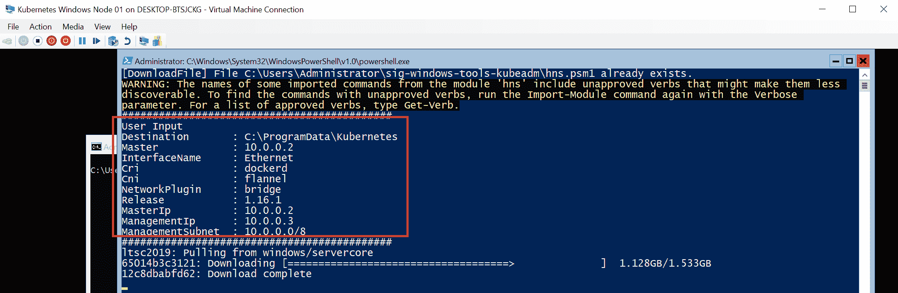

8.  您可能会在完全运行的 Docker 守护程序和被拉取的映像之间遇到*竞争情况*。如果出现错误，只需重新启动或使用相同的命令重新启动安装过程，请记住在下次尝试之前关闭现有的 PowerShell 会话并启动新的会话。根据您的网络连接，下载映像的过程可能需要一些时间。
9.  在提取映像并安装了 Kubernetes、法兰绒和 CNI 插件后，您将被要求生成一个新的 SSH 密钥对，以便从新的 Windows 节点访问主节点—或者，您可以自己操作或重用现有的密钥对。这将使加入过程更加容易，因为集群配置必须通过使用 SSH 的加入脚本来检索。在`10.0.0.2`主机上执行脚本输出的命令，以便为 Ubuntu 用户将公钥添加到`authorized_keys`，如下图所示:

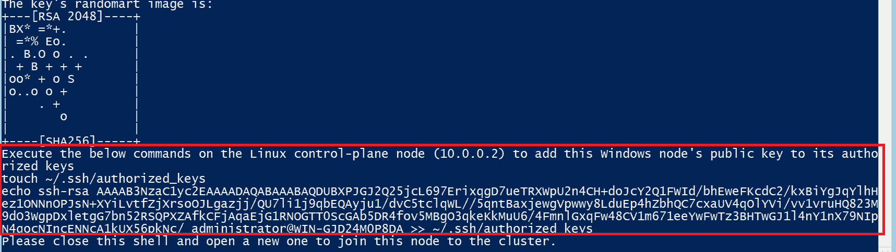

10.  安装完成后，使用`powershell`命令关闭 PowerShell 窗口并打开一个新窗口。
11.  目前，您需要清理在每次引导后重新运行脚本的`ContainerBootstrap`调度程序任务(这可能在未来版本中得到修复)，如下所示:

```
 Unregister-ScheduledTask -TaskName "ContainerBootstrap"
```

12.  验证 Docker 映像已使用`docker images`命令提取，并且 Kubernetes 二进制文件已安装—例如，通过运行`kubectl version`命令。

考虑导出虚拟机映像或创建检查点—如果您选择向群集添加更多 Windows 节点或在加入过程中遇到问题，这将非常有用。我们现在可以*最后*继续将我们的第一个 Windows 节点加入集群！

# 使用 kubeadm 连接窗口节点

下一个任务是将我们的 Windows Server 2019 虚拟机作为一个节点加入 Kubernetes 集群。我们将使用Kubernetes`sig-windows-tools`存储库中相同的`KubeCluster.ps1`脚本，该脚本在内部使用**库本**加入集群。该脚本将执行以下操作:

1.  使用 SSH 从`10.0.0.2`主机中检索 *kubeconfig* 文件。
2.  将 **kubelet** 注册为 Windows 服务。这将确保 kubelet 进程始终在窗口节点上运行。
3.  准备 CNI 插件的配置。
4.  创建**主机网络服务** ( **HNS** )网络。
5.  如果需要，添加防火墙规则。
6.  将**绒布**和 **kube-proxy** 注册为 Windows 服务。

If the join script fails, start a new PowerShell session and rerun the script.

要加入窗口节点，请执行以下步骤:

1.  在 Windows Server 虚拟机的 Hyper-V 终端中，使用`powershell`命令启动一个新的 PowerShell 会话。
2.  通过运行以下命令，使用`sig-windows-tools`脚本导航到目录:

```
cd .\sig-windows-tools-kubeadm
```

3.  执行 join 命令，如下所示:

```
.\KubeCluster.ps1 -ConfigFile .\Kubeclusterbridge.json -Join
```

In case of any problems with the `kubeadm join` command (for example, hanging preflight checks), you can edit the `KubeClusterHelper.psm1` file, find the `kubeadm join` command, and add the `--v=3` parameter (or any other verbosity level) to have more detailed info. Additionally, you can examine the services logs in the `C:\ProgramData\Kubernetes\logs` directory. It is also a good idea to verify whether the issue is not already known, at [https://github.com/kubernetes-sigs/sig-windows-tools/issues](https://github.com/kubernetes-sigs/sig-windows-tools/issues)—the fix may be already available.

4.  加入一个新的 Windows 节点是一个相对快速的过程，几秒钟后，操作应该会完成。现在，验证新节点在集群中是否可见并具有`Ready`状态，如下所示:

```
PS C:\src> kubectl get nodes
NAME                STATUS   ROLES    AGE   VERSION
kubernetes-master   Ready    master   26h   v1.16.1
win-gjd24m0p8da     Ready    <none>   11m   v1.16.1
```

5.  在 Windows 节点上，使用`ipconfig`命令验证`cbr0_ep`界面是否由法兰绒创建，如下图所示:

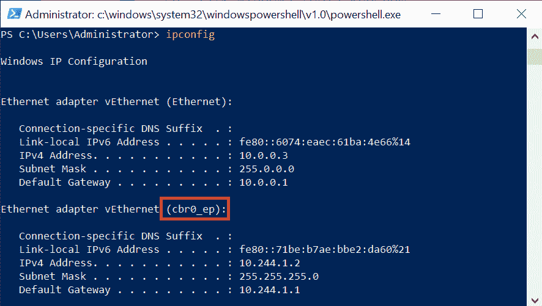

6.  通过创建一个名为`powershell-debug`的特设 PowerShell Pod，运行新节点的快速冒烟测试。Pod 规范覆盖必须包含`nodeSelector`，它匹配窗口节点，如以下代码块所示:

```
kubectl run `
 --generator=run-pod/v1 powershell-debug `
 -i --tty `
 --image=mcr.microsoft.com/powershell:nanoserver-1809 `
 --restart=Never `
 --overrides='{\"apiVersion\": \"v1\", \"spec\": {\"nodeSelector\": { \"beta.kubernetes.io/os\": \"windows\" }}}'
```

7.  映像提取可能需要一点时间。您可以使用以下命令观察 Pod 事件:

```
kubectl describe pod powershell-debug
```

8.  当 Pod 启动时，验证 DNS 解析和与外部地址的连接，例如，使用`ping google.com`命令，如下图所示:


9.  通过运行以下命令，退出容器并删除 Pod(我们没有使用`--rm`标志，因此您可以使用`kubectl describe`命令轻松调查任何问题):

```
kubectl delete pod powershell-debug
```

为完整起见，为了删除 Windows 节点并重置机器状态(例如，在配置更改后，为了再次安装和加入)，请使用相同的`KubeCluster.ps1`脚本并执行以下命令:

```
.\KubeCluster.ps1 -ConfigFile .\Kubeclusterbridge.json -Reset
```

恭喜—现在，您已经运行了一个功能齐全的混合 Windows/Linux Kubernetes 集群！您可以选择按照相同的说明或使用虚拟机映像来添加更多的 Windows 或 Linux 节点(请记住关于重新生成主机名、MAC 地址和`product_uuids`)。

# 部署和检查第一个应用

现在，是时候享受一下新创建的 Kubernetes 集群了。我们将使用节点端口服务创建一个最小的部署，向用户公开应用。该应用本身是作为 Docker 映像打包的官方 ASP.NET Core 3.0 示例—请随意使用任何其他 Windows web 应用容器映像，或者创建自己的映像。我们选择了官方示例，以便尽可能快地进行部署，这样我们就可以专注于 Kubernetes 操作。

要部署示例应用，请执行以下步骤:

1.  创建包含部署和服务定义的`windows-example.yaml`清单文件。您可以从 GitHub 资源库([https://raw . githubuser content . com/PacktPublishing/hand-On-Kubernetes-On-Windows/master/chapter 07/09 _ Windows-example/Windows-example . YAML](https://raw.githubusercontent.com/PacktPublishing/Hands-On-Kubernetes-on-Windows/master/Chapter07/09_windows-example/windows-example.yaml))下载或直接应用到集群，如下所示:

```
apiVersion: apps/v1
kind: Deployment
metadata:
  name: windows-example
  labels:
    app: sample
spec:
  replicas: 3
  selector:
    matchLabels:
      app: windows-example
  template:
    metadata:
      name: windows-example
      labels:
        app: windows-example
    spec:
      nodeSelector:
        "beta.kubernetes.io/os": windows
      containers:
      - name: windows-example
        image: mcr.microsoft.com/dotnet/core/samples:aspnetapp-nanoserver-1809
        resources:
          limits:
            cpu: 1
            memory: 800M
          requests:
            cpu: .1
            memory: 300M
        ports:
          - containerPort: 80
---
apiVersion: v1
kind: Service
metadata:
  name: windows-example
spec:
  type: NodePort
  ports:
  - protocol: TCP
    port: 80
    nodePort: 31001
    targetPort: 80
  selector:
    app: windows-example
```

清单文件中有三个要点，用粗体标出:

2.  打开 PowerShell 窗口，使用`kubectl`应用清单文件，如下所示:

```
kubectl apply -f .\windows-example.yaml
```

3.  等待 Pods 启动—初始映像提取可能需要几分钟时间。您可以使用以下命令观察 Pods 的状态:

```
PS C:\src> kubectl get pods --watch 
NAME                               READY STATUS   RESTARTS  AGE
windows-example-66cdf8c4bf-4472x   1/1   Running   0        9m17s
windows-example-66cdf8c4bf-647x8   1/1   Running   0        9m17s
windows-example-66cdf8c4bf-zxjdv   1/1   Running   0        9m17s
```

4.  打开互联网浏览器，导航至`http://10.0.0.2:31001`和`http://10.0.0.3:31001`。您应该会看到确认部署成功的示例应用网页，如下图所示:

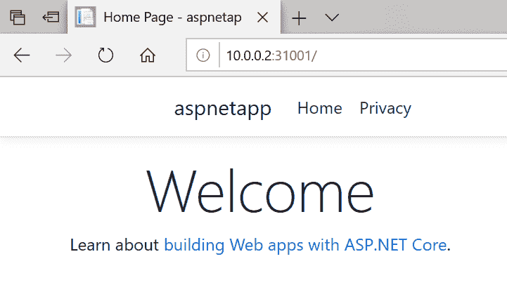

现在，让我们执行两个在调试应用时有用的常见操作，如下所示:

1.  检索 Pod 容器日志:要访问部署中的一个 Pod(`windows-example-66cdf8c4bf-4472x`)的日志，请使用以下`kubectl logs`命令:

```
PS C:\src> kubectl logs windows-example-66cdf8c4bf-4472x
warn: Microsoft.AspNetCore.DataProtection.Repositories.FileSystemXmlRepository[60]
 Storing keys in a directory 'C:\Users\ContainerUser\AppData\Local\ASP.NET\DataProtection-Keys' that may not be persisted outside of the container. Protected data will be unavailable when container is destroyed.
info: Microsoft.Hosting.Lifetime[0]
 Now listening on: http://[::]:80
info: Microsoft.Hosting.Lifetime[0]
 Application started. Press Ctrl+C to shut down.
info: Microsoft.Hosting.Lifetime[0]
 Hosting environment: Production
info: Microsoft.Hosting.Lifetime[0]
 Content root path: C:\app
warn: Microsoft.AspNetCore.HttpsPolicy.HttpsRedirectionMiddleware[3]
 Failed to determine the https port for redirect.
```

2.  执行到 Pod 容器中，以便检查应用配置。要启动新的`cmd` shell(在`nanoserver`映像中没有 PowerShell)，运行`kubectl exec`命令，如下所示:

```
PS C:\src> kubectl exec -it windows-example-66cdf8c4bf-4472x cmd
Microsoft Windows [Version 10.0.17763.802]
(c) 2018 Microsoft Corporation. All rights reserved.

C:\app>
```

3.  现在，您可以自由访问和修改容器，这在调试和测试场景中非常有用。例如，您可以获取`appsettings.json`文件的内容，如下所示:

```
C:\app>type appsettings.json
{
 "Logging": {
 "LogLevel": {
 "Default": "Information",
 "Microsoft": "Warning",
 "Microsoft.Hosting.Lifetime": "Information"
 }
 },
 "AllowedHosts": "*"
}
```

如您所见，将一个示例 Windows 应用部署到 Kubernetes 集群很容易，您从 Linux Kubernetes 集群中了解到的所有调试技术都完全相同。

# 摘要

在本章中，您已经完成了在 Hyper-V 主机上创建内部 Windows/Linux Kubernetes 集群的旅程。这种方法对于创建本地开发集群以及在云环境之外部署生产集群非常有用。让我们回顾一下这个过程——我们首先为节点、Pod 和 Service 规划了集群设计和网络**无类域间路由**(**CIDR**)。然后，我们创建了 Ubuntu Server 18.04 LTS 虚拟机——我们的 Kubernetes 主虚拟机。创建主节点需要操作系统的初始配置和 Docker 的安装。初始化是使用 kubeadm 执行的。下一个重要步骤是安装 Kubernetes Pod 网络，该网络必须与 Linux 和 Windows 节点兼容。在我们的案例中，我们选择了带有`host-gw`后端的法兰绒，这是目前唯一一个用于内部运行的混合集群的稳定网络解决方案。之后，您已经学习了如何创建 Windows Server 2019 LTS 虚拟机，以及如何使用 Kubernetes 和`sig-windows-tools`脚本将机器加入 Kubernetes 集群。最后，我们部署了一个示例 ASP.NET 核心 3.0 应用，并执行了一些常见操作，例如访问容器日志或在容器中执行。

在下一章中，您将学习如何使用 AKS 引擎执行类似的集群部署。目前，这是在云中部署混合 Kubernetes 集群的最佳和最稳定的方法。

# 问题

1.  什么时候应该使用内部 NAT Hyper-V vsswitch？外部虚拟交换机有哪些用例？
2.  准备 Linux 节点或主机需要哪些配置步骤？
3.  什么是服务子网范围和 Pod 子网范围？
4.  如何为加入集群生成新的 kubeadm 令牌？
5.  如何允许将应用 Pods 调度到主节点？
6.  对于带有 Linux 和 Windows 节点的内部集群，推荐的网络解决方案是什么？
7.  将 Windows 节点加入群集需要执行哪些步骤？
8.  访问 Pod 容器日志的命令是什么？

这些问题可以在本书后面的*评估*中找到答案。

# 进一步阅读

*   目前，大多数关于部署混合 Windows/Linux 集群的资源都可以在线获得。创建此类集群有两个官方指南:
    *   Kubernetes 指南，可在以下网址获得:[https://Kubernetes . io/docs/setup/production-environment/windows/intro-windows-in-Kubernetes/](https://kubernetes.io/docs/setup/production-environment/windows/intro-windows-in-kubernetes/)。
    *   微软指南，可从以下网址获得:https://docs . Microsoft . com/en-us/virtualization/windows containers/kubernetes/入门-kubernetes-windows 。

这两个指南经常更新，因此值得检查，因为随着时间的推移，部署过程可能会简化。

*   您可能还会发现以下来自微软的**软件定义网络** ( **SDN** )存储库很有用，可访问:[https://github . com/Microsoft/SDN/tree/master/Kubernetes/windows](https://github.com/microsoft/SDN/tree/master/Kubernetes/windows)。它包含许多助手脚本，这些脚本逐渐被正式的部署指令和 kubeadm 集成所采用。
*   有关 kube dam 的用法和文档，请参考[https://kubernetes . io/docs/setup/production-environment/tools/kube dam/create-cluster-kube dam/](https://kubernetes.io/docs/setup/production-environment/tools/kubeadm/create-cluster-kubeadm/)。
*   如果您需要疑难解答和常见问题的帮助，可以使用以下指南:
    *   [https://docs . Microsoft . com/en-us/virtualization/windows containers/kubernetes/common-problems](https://docs.microsoft.com/en-us/virtualization/windowscontainers/kubernetes/common-problems)。
    *   [https://kubernetes . io/docs/setup/production-environment/windows/intro-windows-in-kubernetes/#疑难解答](https://kubernetes.io/docs/setup/production-environment/windows/intro-windows-in-kubernetes/#troubleshooting)。
    *   [https://tech community . Microsoft . com/t5/Networking-Blog/疑难解答-Kubernetes-Networking-on-Windows-Part-1/ba-p/508648](https://techcommunity.microsoft.com/t5/Networking-Blog/Troubleshooting-Kubernetes-Networking-on-Windows-Part-1/ba-p/508648)—疑难解答指南，具体针对 Windows 容器的联网问题。