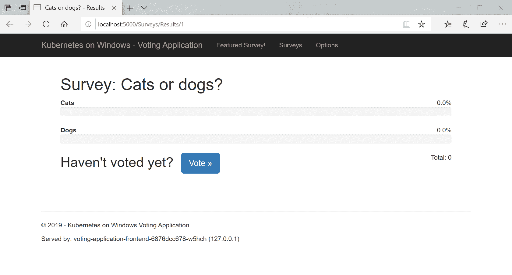
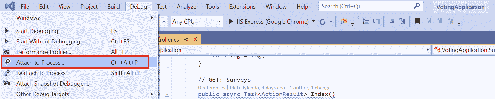
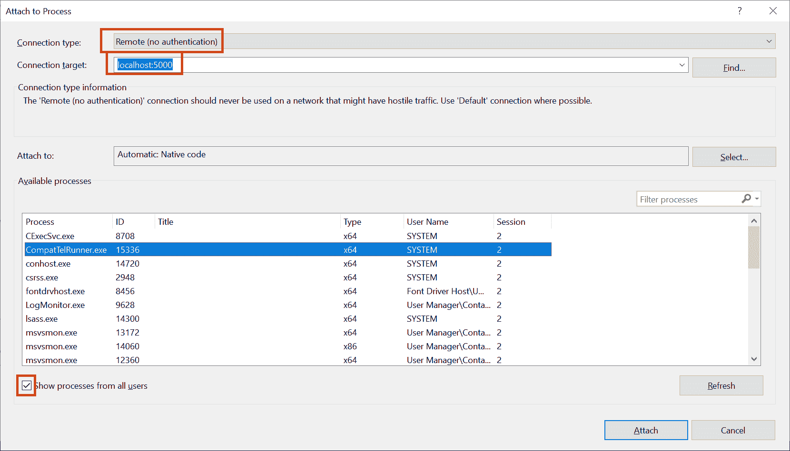
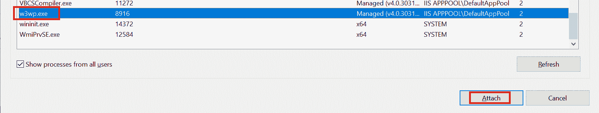
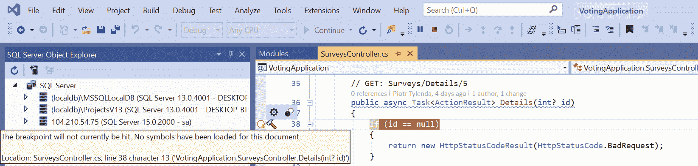
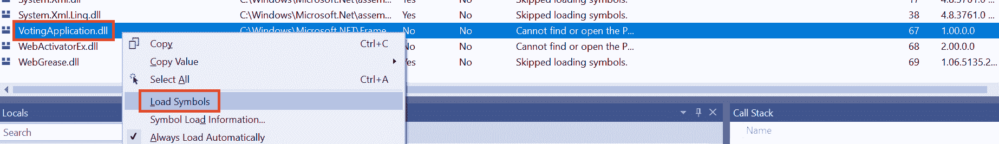
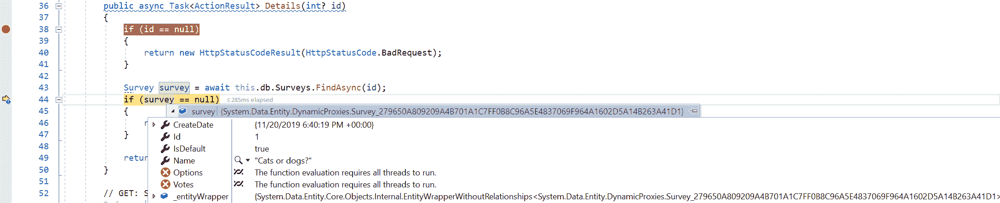

# 十、部署微软 SQL Server 2019 和 ASP.NET MVC 应用

前面的章节已经为您提供了部署和操作混合 Windows/Linux Kubernetes 集群的瑞士军刀—现在，您已经具备了将真正的 Windows 容器应用部署到 Kubernetes 集群的所有基本知识。本章将重点演示如何使用 C#编写的简单投票应用来实现容器化和部署。NET 框架 4.8 和 ASP.NET MVC 5，持久层采用微软 SQL Server 2019。技术堆栈的选择似乎是一个遗留问题(为什么不使用。NET Core？！)但这是有意为之的——如果你正在考虑在 Kubernetes 中使用 Windows 容器，很有可能你需要经典的。NET 框架运行时，因为您还没有准备好迁移到。NET 核心。

将现有应用迁移到 Kubernetes 的主题很广泛，本书不会完全涵盖。对于这个过程，有许多记录在案的最佳实践，但是我们将关注一个基本的方法，主要是演示部署，而不是关注。NET 框架应用实现和迁移。本章的目标是展示以下内容:

*   如何快速容器化一个窗口。NET 框架应用
*   如何注入环境配置，如 SQL 连接字符串
*   Windows 上容器日志的推荐方法
*   如何远程调试应用

更准确地说，在本章中，我们将涵盖以下主题:

*   创建一个 ASP.NET MVC 应用并发布到 Docker Hub
*   准备 **Azure Kubernetes 服务引擎** ( **AKS 引擎**)
*   部署故障转移 Microsoft SQL Server 2019
*   部署 ASP.NET MVC 应用
*   访问应用
*   扩展应用
*   调试应用

# 技术要求

对于本章，您将需要以下内容:

*   安装了 Windows 10 专业版、企业版或教育版(1903 版或更高版本，64 位)。
*   如果您想要编辑应用的源代码并进行调试，请选择 Microsoft Visual Studio 2019 社区(或任何其他版本)。**Visual Studio Code**(**VS Code**)对经典的支持有限。NET 框架。
*   Azure 帐户。
*   一个使用 AKS 引擎部署的 Windows/Linux Kubernetes 集群。

接下来，您将需要自己的 Azure 帐户，以便为 Kubernetes 集群创建 Azure 资源。如果您还没有创建前几章的帐户，您可以在这里阅读更多关于如何获得个人使用的有限免费帐户的信息:[https://azure.microsoft.com/en-us/free/](https://azure.microsoft.com/en-us/free/)。

使用 AKS 引擎部署 Kubernetes 集群已经在[第 8 章](08.html)、*中介绍了部署混合 Azure Kubernetes 服务引擎集群*。

您可以从官方 GitHub 资源库下载本书章节的最新代码示例，网址为[https://GitHub . com/PacktPublishing/hand-Kubernetes-On-Windows/tree/master/chapter 10](https://github.com/PacktPublishing/Hands-On-Kubernetes-on-Windows/tree/master/Chapter10)。

# 创建一个 ASP.NET MVC 应用并发布到 Docker Hub

为了演示一个真实的 Windows 容器应用的部署，我们将为一个小型 C#投票应用创建一个 Docker 映像。NET Framework 4.8 用于创建调查的网络应用。该应用是使用经典的 ASP.NET MVC 5 堆栈实现的，因为它最适合演示如何实现 Windows 应用的容器化。传统。NET Framework 应用，尤其是企业级应用，严重依赖于仅限 Windows 的功能，例如 **Windows 通信基金会** ( **WCF** )。在许多情况下，您可能很幸运能够轻松迁移到。NET Core 并使用 Linux 容器来托管您的应用，但是对于。NET 框架堆栈，它可能永远不会发生，即使在。NET 5。

关于我们的投票申请，有以下几个假设:

*   无论如何都不依赖于 Kubernetes 或 Windows 容器。应用不知道由容器编排系统托管。
*   **实体框架 6.3**(**EF 6.3**)([https://docs.microsoft.com/en-us/ef/ef6/](https://docs.microsoft.com/en-us/ef/ef6/))采用代码优先的方式作为**对象关系映射** ( **ORM** )。
*   微软 SQL Server 用于投票数据存储——这是 ASP.NET MVC 应用中常见的堆栈。对于本地开发，我们使用**Microsoft SQL**(**MSSQL**)Server Express LocalDB([https://docs . Microsoft . com/en-us/SQL/database-engine/configure-windows/SQL-Server-Express-LocalDB？view=sql-server-ver15](https://docs.microsoft.com/en-us/sql/database-engine/configure-windows/sql-server-express-localdb?view=sql-server-ver15) )，而对于 Kubernetes 部署，我们将使用 Linux 容器中托管的 MSSQL Server 2019([https://docs . Microsoft . com/en-us/SQL/Linux/quick start-install-connect-docker？view = SQL-server-ver 15&pivots = CS1-bash](https://docs.microsoft.com/en-us/sql/linux/quickstart-install-connect-docker?view=sql-server-ver15&pivots=cs1-bash)。
*   测井框架选择了 serilog([https://serilog.net/](https://serilog.net/))。
*   https://github.com/ninject/Ninject 把一切联系在一起，就像一个依赖注入器。
*   我们使用包含所有业务逻辑和数据访问层的简单 fat 控制器(因此没有存储库或其他设计模式)。这是为了使应用尽可能紧凑而特别选择的。
*   大多数视图和控制器都基于英孚模型的标准 MVC 5 框架。
*   视图模型的使用仅限于绝对必要的地方。

您可以在本书的官方 GitHub 资源库中找到应用源代码，网址为[。打开`VotingApplication.sln`解决方案文件，需要 Visual Studio 2019。也可以通过使用`docker build`命令来执行构建，如以下小节所述。在这一节的最后，您将有一个投票应用的 Docker 映像，准备在 Kubernetes 中使用。您可以按照步骤进行操作，也可以选择使用 Docker Hub 的现成映像，该映像可在](https://github.com/PacktPublishing/Hands-On-Kubernetes-on-Windows/tree/master/Chapter10/01_voting-application-src)[https://Hub . Docker . com/repository/Docker/packtpubkubernetsonwindows/投票应用](https://hub.docker.com/repository/docker/packtpubkubernetesonwindows/voting-application)上获得。

# 使用环境变量注入配置

开发容器友好的应用时，需要考虑如何注入配置数据，如数据库连接字符串。一般的经验法则是，您不应该将任何地址、用户名、密码或连接字符串硬编码到代码中。您应该总是能够在运行时注入这样的配置，一般来说，对于非容器化的应用也是如此。Kubernetes 为您提供了多种关于如何注入运行时配置的方法，如下所示:

*   向容器命令传递参数
*   为容器定义系统环境变量
*   将配置映射或机密装载为容器卷
*   可选地使用 pods preferences 包装所有内容

您可以在官方文档([https://kubernetes.io/docs/tasks/inject-data-application/](https://kubernetes.io/docs/tasks/inject-data-application/))中阅读更多关于它们的信息。重要的一点是，所有功能都使用标准的**操作系统** ( **操作系统)**级原语(如文件或环境变量)与容器化的应用集成在一起。这意味着，如果你很好地设计了你的应用，你可以在 Kubernetes 内部或外部使用它，而不需要任何改变。

我们将演示如何使用环境变量向我们的应用注入一个 MSSQL Server 连接字符串。这是最简单的方法，但是它有一个很大的限制——当容器运行时，您不能修改容器的环境变量。一旦设置了变量，它将在整个容器生命周期中具有相同的值。如果您需要能够在不重新启动容器的情况下修改配置，您应该看一下 ConfigMaps(与 Secrets 结合使用)，这将在下一章中介绍:[第 11 章](11.html)、*配置应用以使用 Kubernetes 功能*。

我们的投票应用使用`VotingApplicationContextFactory`类为**模型-视图-控制器** ( **MVC** )控制器创建一个 EF 数据库上下文。我们来看一下这个类的`Create()`方法(可在[https://github . com/PacktPublishing/hand-Kubernetes-On-Windows/blob/master/chapter 10/01 _ voting-application-src/factory/voting application contextfactory . cs](https://github.com/PacktPublishing/Hands-On-Kubernetes-on-Windows/blob/master/Chapter10/01_voting-application-src/Factories/VotingApplicationContextFactory.cs)获得)，如下:

```
public object Create(IContext context)
{
 var connectionString = Environment.GetEnvironmentVariable("CONNECTIONSTRING_VotingApplication");
 if (!string.IsNullOrEmpty(connectionString))
 {
 var safeConnectionString = SanitizeConnectionString(connectionString);
 this.log.Info("Using custom connection string provided by environment variable: {0}", safeConnectionString);
 return new VotingApplicationContext(connectionString);
 }

 this.log.Info("Using default connection string");
 return new VotingApplicationContext();
}
```

以下是一种常见的模式，您可以使用它将配置注入到您的应用中，尤其是在 Linux 世界中，依赖环境变量更为常见:

1.  检查您选择的环境变量`CONNECTIONSTRING_VotingApplication`是否已定义。
2.  如果是，使用变量中被覆盖的连接字符串创建一个 EF 数据库上下文。
3.  如果没有，使用标准连接字符串创建一个 EF 数据库上下文。在这种情况下，将从`Web.config`应用文件中检索。

您可以遵循这种模式，尤其是当您不使用自定义配置文件时。这个解决方案给了你很大的灵活性，你也可以在没有容器的情况下运行应用。

Another approach would be to inject the whole `Web.config` file as a Kubernetes ConfigMap object. We will explore this possibility in the next chapter.

这展示了一个重要的原则，当你封装任何应用时，你应该使用这个原则——考虑你的应用(系统)的外部接口，以及它如何与外部世界通信。这是影响或监视容器中运行的应用的唯一方法。提供和注入配置是应用的外部接口之一。同样，日志记录为您的应用定义了一个输出接口——让我们看看如何在 Windows 容器中实现这一点。

# 为 Windows 容器日志监视器配置日志记录

Kubernetes 本身提供了浏览 Pod 容器日志的简单工具。通常，您必须实现一个好的集群级日志解决方案——例如，使用 Elasticsearch、Logstash、Kibana 堆栈或使用 Azure 日志分析(如前几章中简要演示的)。官方文档很好地概述了日志解决方案的可能架构:[https://kubernetes . io/docs/concepts/cluster-administration/logging/](https://kubernetes.io/docs/concepts/cluster-administration/logging/)。在所有情况下，您都需要将容器中的应用日志公开给外界。从高层次来看，有三种主要方法:

*   使用容器**标准输出** ( **标准输出**)和**标准错误** ( **标准错误**)入口点，让容器运行时处理日志记录。稍后可以使用节点级日志记录代理(例如 Fluentd、Elastic Beats 或 Logstash)将日志转发给任何外部日志记录解决方案。如果您的容器化应用开箱即用地将所有内容写入控制台输出，这将特别有效。
*   在您的应用 Pod 中使用一个额外的 sidecar 容器，该容器从文件系统、事件日志或其他来源收集日志，并将其作为标准输出或直接公开给外部日志解决方案。如果您的应用登录到容器内的多个目标，这种方法非常有用。
*   将日志流嵌入应用本身。例如，在 C#应用中，您可以使用 log4net 和一个专用的 Elasticsearch appender([https://github.com/ptylenda/log4net.ElasticSearch.Async](https://github.com/ptylenda/log4net.ElasticSearch.Async))将日志流式传输到您的 elastic search 集群。这种方法是最受限制的——它对外部日志记录系统产生了紧密的依赖，并且可能会对性能造成影响，这种影响很难从应用工作负载本身中分离出来。

对于 Windows 应用，登录到 stdout 并不常见，尤其是对于旧应用，以及使用**互联网信息服务** ( **IIS** )托管您的网络应用时。在大多数情况下，使用**事件跟踪窗口** ( **ETW** )、事件日志或自定义日志文件对于窗口来说更常见。例如，我们的投票应用是使用 IIS 托管的。此外，当以容器化模式运行时，IIS 不提供公开应用标准输出的功能。您必须依赖事件日志或您自己的日志文件。除此之外，IIS 本身在标准位置(`c:\inetpub\logs`)公开额外的应用日志，并将自己的事件流式传输到 ETW。

您可以通过两种方式收集投票应用的日志:

*   使用另外一个运行的 sidecar 容器，例如 Elastic Beats 或 Winlogbeat([https://www.elastic.co/products/beats/winlogbeat](https://www.elastic.co/products/beats/winlogbeat))，它从应用容器中收集所有日志，并将其公开给 stdout([https://www . Elastic . co/guide/en/Beats/file beat/current/console-output . html](https://www.elastic.co/guide/en/beats/filebeat/current/console-output.html))或任何其他支持的输出。需要在 Pod 内部的容器之间使用一个卷来共享日志。
*   使用最近发布的 Windows 容器日志监视器扩展容器映像([https://github.com/microsoft/windows-container-tools](https://github.com/microsoft/windows-container-tools))。关于架构的更多细节可以在这里找到:[https://tech community . Microsoft . com/T5/Containers/Windows-Containers-Log-Monitor-Opensource-Release/ba-p/973947](https://techcommunity.microsoft.com/t5/Containers/Windows-Containers-Log-Monitor-Opensource-Release/ba-p/973947)。该工具使用与边车容器不同的方法。在 Docker 映像中，不是直接启动应用，而是用适当的 JSON 配置文件启动`LogMonitor.exe`，并将启动应用的命令行作为`LogMonitor.exe`的参数传递。换句话说，`LogMonitor.exe`充当应用进程的监督者，并将基于配置文件从不同来源收集的日志打印到 stdout。有计划进一步扩展此解决方案，以在 sidecar 容器模式中使用。

我们将使用日志监视器，因为它易于集成和配置。应用的 Dockerfile 的详细信息将在下一小节中显示。假设启动应用(在本例中是 IIS)的命令是`C:\ServiceMonitor.exe w3svc`，使用日志监视器的一般模式是按照以下方式定制 Dockerfile:

```
WORKDIR /LogMonitor
COPY LogMonitor.exe LogMonitorConfig.json .
SHELL ["C:\\LogMonitor\\LogMonitor.exe", "powershell.exe"]

ENTRYPOINT C:\ServiceMonitor.exe w3svc
```

我们的应用的`LogMonitoringConfig.json`文件([https://github . com/PacktPublishing/hand-Kubernetes-On-Windows/blob/master/chapter 10/01 _ voting-application-src/logmonitormonconfig . json](https://github.com/PacktPublishing/Hands-On-Kubernetes-on-Windows/blob/master/Chapter10/01_voting-application-src/LogMonitorConfig.json))具有以下 JSON 配置:

```
{
  "LogConfig": {
    "sources": [
      {
        "type": "EventLog",
        "startAtOldestRecord": true,
        "eventFormatMultiLine": false,
        "channels": [
          {
            "name": "system",
            "level": "Error"
          }
        ]
      },
      {
        "type": "EventLog",
        "startAtOldestRecord": true,
        "eventFormatMultiLine": false,
        "channels": [
          {
            "name": "VotingApplication",
            "level": "Verbose"
          }
        ]
      },
      {
        "type": "File",
        "directory": "c:\\inetpub\\logs",
        "filter": "*.log",
        "includeSubdirectories": true
      },
      {
        "type": "ETW",
        "providers": [
          {
            "providerName": "IIS: WWW Server",
            "ProviderGuid": "3A2A4E84-4C21-4981-AE10-3FDA0D9B0F83",
            "level": "Information"
          },
          {
            "providerName": "Microsoft-Windows-IIS-Logging",
            "ProviderGuid ": "7E8AD27F-B271-4EA2-A783-A47BDE29143B",
            "level": "Information",
            "keywords": "0xFF"
          }
        ]
      }
    ]
  }
}
```

该配置文件订阅 Windows 事件日志中的`system`日志和`VotingApplication`日志，监控`C:\inetpub\logs`日志，为 IIS 收集 ETW 数据。事件日志中的`VotingApplication`日志包含了我们应用中 Serilog 产生的所有日志。这是在`NinjectWebCommon`类([https://github . com/PacktPublishing/hand-On-Kubernetes-On-Windows/blob/master/chapter 10/01 _ voting-application-src/App _ Start/ninejectwebcommon . cs](https://github.com/PacktPublishing/Hands-On-Kubernetes-on-Windows/blob/master/Chapter10/01_voting-application-src/App_Start/NinjectWebCommon.cs)中配置的，在这里我们初始化记录器接收器，如下所示:

```
private static void RegisterServices(IKernel kernel)
{
    Log.Logger = new LoggerConfiguration()
        .ReadFrom.AppSettings()
        .Enrich.FromLogContext()
        .WriteTo.EventLog(source: "VotingApplication", logName: "VotingApplication", manageEventSource: false)
        .CreateLogger();

    kernel.Bind<VotingApplicationContext>().ToProvider(typeof(VotingApplicationContextFactory)).InRequestScope();
    kernel.Bind<IDateTimeProvider>().To<DateTimeProvider>().InRequestScope();
}
```

请注意，由于 Windows 容器没有在特权模式下运行，我们无法在事件日志(`manageEventSource: false`)中自动创建日志。这必须在构建时在 Dockerfile 中完成。

有了这个设置，我们的投票应用将把我们自己的所有日志，连同系统和 IIS 一起打印到容器的 stdout 中。这意味着您可以使用`docker logs`命令(运行独立容器时)或`kubectl logs`命令轻松调查它们。如果您与 Azure 日志分析集成，您的日志将可以使用 Kusto 进行查询。

# 创建文档文件

下一步是为我们的应用准备一个 Dockerfile。你可以查看关于如何接近架构的官方文件。NET Framework 应用在 Dockerfile 中位于[https://github . com/Microsoft/dotnet-Framework-docker/tree/master/samples/dotnetapp](https://github.com/microsoft/dotnet-framework-docker/tree/master/samples/dotnetapp)。我们的文档必须包含以下步骤:

1.  还原 NuGet 包。
2.  构建应用，最好使用本地文件系统的发布配置文件。
3.  用于应用 EF 迁移的复制工具(由 EF NuGet 包提供)。
4.  在事件日志中创建`VotingApplication`日志。
5.  复制日志监视器二进制文件和配置。
6.  将投票应用二进制文件复制到`C:\inetpub\wwwroot`进行 IIS 托管。

我们需要更多地讨论 EF 迁移的话题。应用 EF 数据库迁移而不导致应用宕机，并且有多个应用副本，这是一项复杂的任务。您需要确保迁移可以回滚，并且数据库模式与新旧应用版本完全兼容。换句话说，向后不兼容的更改(如重命名)必须特别处理，以使它们在各个步骤之间向后兼容。此过程的框架如下所示，例如，为实体重命名列:

1.  应用数据库迁移，用新名称添加新列。
2.  推出新版本的应用，对旧列和新列执行写入操作。应该使用旧列执行读取，因为它总是有正确的数据。
3.  执行将数据从旧列复制到新列的作业。
4.  推出新版本的应用，从新的专栏中阅读。
5.  推出仅写入新列的应用的新版本。
6.  应用数据库迁移，这将删除旧列。

正如您所看到的，为在 Kubernetes 中运行的应用正确处理数据库迁移而不停机需要严格的规则和兼容性/回滚测试—我们已经将此主题提请您注意，但详细的解决方案不在本书的讨论范围内。Spring 有一篇很好的文章解释了如何解决这个问题的细节([https://Spring . io/blog/2016/05/31/零停机-用数据库部署](https://spring.io/blog/2016/05/31/zero-downtime-deployment-with-a-database))还有一篇由 Weaveworks 专门为 Kubernetes 撰写的文章:[https://www . weave . works/blog/如何正确处理-db-schemas-in-Kubernetes-rolling](https://www.weave.works/blog/how-to-correctly-handle-db-schemas-during-kubernetes-rollouts)。

对于应用迁移，我们将使用相同的 Docker 映像—EF 数据库迁移是使用我们将在映像中提供的应用程序集和 EF 命令行工具来应用的。然后，迁移(和数据库播种)将使用适合运行一次性任务的 Kubernetes 作业来运行。在现实场景中，这应该作为您的**持续集成/持续部署** ( **CI/CD)** 流程的一部分，伴随着 Kubernetes 部署的展开。

投票应用包含一个名为`Dockerfile.production`([https://github . com/PacktPublishing/hand-On-Kubernetes-On-Windows/blob/master/chapter 10/01 _ voting-application-src/Dockerfile . production](https://github.com/PacktPublishing/Hands-On-Kubernetes-on-Windows/blob/master/Chapter10/01_voting-application-src/Dockerfile.production))的 Dockerfile，该 docker file 具有基于我们刚刚总结的内容的层。让我们一步步来分析一下:

1.  Dockerfile 定义了一个多阶段构建，这意味着在整个构建过程中使用多个基础映像。第一阶段是网络应用构建，使用`mcr.microsoft.com/dotnet/framework/sdk`映像。该映像包含所有的。运行时不需要的. NET Framework 构建工具。下面的代码块对此进行了说明:

```
FROM mcr.microsoft.com/dotnet/framework/sdk:4.8-windowsservercore-ltsc2019 AS build
ARG PUBLISH_PROFILE=DockerPublishProfile.pubxml
ARG BUILD_CONFIG=Release

WORKDIR /app

COPY *.sln ./
COPY *.csproj ./
COPY *.config ./
RUN nuget restore

COPY . .
RUN msbuild /p:DeployOnBuild=true /p:PublishProfile=$env:PUBLISH_PROFILE /p:Configuration=$env:BUILD_CONFIG
```

图层的组织方式使得构建过程中的图层缓存最大化——例如，只有当某些解决方案配置文件发生变化时，我们才会运行`nuget restore`。

2.  构建过程由标准的`msbuild`命令执行，使用具有以下形式的专用`DockerPublishProfile.pubxml`发布配置文件:

```
<Project ToolsVersion="4.0" >
  <PropertyGroup>
    <WebPublishMethod>FileSystem</WebPublishMethod>
    <PublishProvider>FileSystem</PublishProvider>
    <LastUsedBuildConfiguration>Release</LastUsedBuildConfiguration>
    <LastUsedPlatform>Any CPU</LastUsedPlatform>
    <SiteUrlToLaunchAfterPublish />
    <LaunchSiteAfterPublish>True</LaunchSiteAfterPublish>
    <ExcludeApp_Data>False</ExcludeApp_Data>
    <publishUrl>obj\Docker\publish</publishUrl>
    <DeleteExistingFiles>True</DeleteExistingFiles>
  </PropertyGroup>
</Project>
```

原则上，它对`obj\Docker\publish`执行`FileSystem`发布，稍后用于创建最终映像。

3.  接下来，我们基于运行时场景专用的`mcr.microsoft.com/dotnet/framework/aspnet`映像开始第二个也是最后一个构建阶段，如下所示:

```
FROM mcr.microsoft.com/dotnet/framework/aspnet:4.8-windowsservercore-ltsc2019 AS runtime

WORKDIR /ef6
COPY --from=build /app/packages/EntityFramework.6.3.0/tools/net45/any/ .
```

在第一步中，我们执行 EF6 迁移命令行工具的复制，这些工具由 EF NuGet 包提供。这里，关键是从上一阶段复制，使用`--from=build`参数。

4.  下一步是在事件日志中为我们的投票应用创建一个专用日志(在前面的小节中提到了这一要求)，如下所示:

```
RUN powershell.exe -Command New-EventLog -LogName VotingApplication -Source VotingApplication
```

5.  复制`LogMonitor`二进制和配置，同时覆盖容器的 shell 命令，如下所示:

```
WORKDIR /LogMonitor
ADD https://github.com/microsoft/windows-container-tools/releases/download/v1.0/LogMonitor.exe .
COPY --from=build /app/LogMonitorConfig.json .
SHELL ["C:\\LogMonitor\\LogMonitor.exe", "powershell.exe"]
```

6.  将前一阶段的`build`工件复制到`C:\inetpub\wwwroot` IIS 应用目录，如下所示:

```
WORKDIR /inetpub/wwwroot
COPY --from=build /app/obj/Docker/publish/. .
```

7.  最后，为启动 IIS 服务的`ServiceMonitor.exe`定义映像的默认入口点。这是您在`mcr.microsoft.com/dotnet/framework/aspnet`基础映像中看到的标准方法。唯一不同的是，整个流程树将在日志监视器的监督下运行。代码可以在下面的代码片段中看到:

```
ENTRYPOINT C:\ServiceMonitor.exe w3svc
```

就这样！Dockerfile 定义了 ASP.NET MVC 应用的完整构建过程——您可以选择用一个测试阶段来扩展它，从而执行适当的测试。现在，让我们构建映像并将其推送到映像注册表。

# 构建和推广 Docker 形象

这个过程的具体细节已经在[第 3 章](03.html)、*处理容器映像*中进行了介绍。简而言之，您可以在这里使用两种方法:

1.  在本地计算机上执行映像的手动构建，并将其推送到公共 Docker Hub。目前，在 Docker Hub 上无法为 Windows 容器映像设置自动构建。
2.  如果您有兴趣将自动化构建和 GitHub 钩子集成到您的应用中，您可以使用 **Azure 容器注册表** ( **ACR** )，如前面提到的章节所述。

为了简单起见，我们将执行手动构建并将映像推送到 Docker Hub。在现实场景中，您应该至少使用带有 GitHub 集成的 ACR 作为您的 CI/CD 管道的一部分。让我们执行 Docker 映像的构建——在示例中，我们将使用`packtpubkubernetesonwindows/voting-application`映像存储库名称，但是如果您要继续，您应该使用您自己的`<dockerId>/voting-application`存储库。请执行以下步骤:

1.  打开 PowerShell 窗口，导航到主`voting-application`源目录。

2.  使用以下命令执行 Docker 构建(记住最后一个点，它指定了构建上下文目录):

```
docker build -t packtpubkubernetesonwindows/voting-application -f .\Dockerfile.production .
```

3.  等待构建完成，并相应地标记映像。这对 Kubernetes 部署至关重要，因为我们可以指定要推出的映像的特定版本(使用最新版本可能不明确，通常不建议使用)。建议使用语义版本控制，如[第 3 章](03.html)、*中所述，使用容器映像*，这在以下代码块中进行了说明:

```
docker tag packtpubkubernetesonwindows/voting-application:latest packtpubkubernetesonwindows/voting-application:1.0.0
docker tag packtpubkubernetesonwindows/voting-application:latest packtpubkubernetesonwindows/voting-application:1.0
docker tag packtpubkubernetesonwindows/voting-application:latest packtpubkubernetesonwindows/voting-application:1
```

4.  将所有标签推送到映像存储库，如下所示:

```
docker push packtpubkubernetesonwindows/voting-application
```

5.  现在，您可以验证标签在 Docker Hub 页面中是否正确可见—例如，[https://Hub . Docker . com/repository/Docker/packtpubkubernetsonwindows/voting-application/tags？页面=1](https://hub.docker.com/repository/docker/packtpubkubernetesonwindows/voting-application/tags?page=1) 。

此时，我们的 Docker 映像既可以在本地使用(您需要使用环境变量向 SQL Server 提供有效的连接字符串)，也可以在 Kubernetes 中使用。让我们开始准备 AKS 引擎集群部署！

# 准备 AKS 发动机

如果您已经学习了[第 8 章](08.html)、*部署混合 Azure Kubernetes 服务引擎集群，*并使用 AKS 引擎创建了混合 Windows/Linux Kubernetes 集群，那么您就可以开始了—您可以在本节中验证集群的拓扑是否符合要求。此外，如果您还没有部署 AKS Engine 集群，我们将提供一种快速的方法，使用 GitHub 存储库中为本书提供的 PowerShell 脚本来部署它。

我们的投票应用可以托管在最小的混合 Windows/Linux 集群上，一个 Linux 主节点和一个 Windows 节点，其中 Linux 主节点充当常规节点。但是，为了充分展示部署的原理，我们将使用一个类似于生产集群的集群:一个运行在**虚拟机扩展集**(**【VMSS】**)**高可用性** ( **HA** )模式下的 Linux 主节点，两个 Linux 节点和两个 Windows 节点。在前一章中，我们已经将此配置用于 AKS 引擎集群部署。为了从头开始快速部署 AKS 引擎集群，您可以执行以下步骤:

1.  从该书的 GitHub 资源库下载以下 PowerShell 脚本:[https://GitHub . com/packt publishing/hand-On-Kubernetes-On-Windows/blob/master/chapter 08/01 _ aks-engine/01 _ createakengineclusterwitwindowsno](https://github.com/PacktPublishing/Hands-On-Kubernetes-on-Windows/blob/master/Chapter08/01_aks-engine/01_CreateAKSEngineClusterWithWindowsNodes.ps1)T2】des . PS1。
2.  在 PowerShell 窗口中，使用适当的参数执行脚本，如下所示:

```
.\01_CreateAKSEngineClusterWithWindowsNodes.ps1 `
 -azureSubscriptionId <subscriptionId> `
 -dnsPrefix <globallyUniqueDnsPrefix> `
 -windowsPassword <windowsNodesPassword>
```

3.  该脚本使用`aks-engine-windows-resource-group`资源组将集群部署到 Azure 中的西欧位置。如果 AKS 引擎部署有问题，您可以尝试指定不同的区域，例如`-azureLocation westus`。
4.  部署完成后，您需要确保默认的 kubeconfig 包含新集群的上下文。您可以使用以下命令快速将 kubeconfig 与 AKS Engine 为西欧位置生成的 kube config 合并(在覆盖默认配置文件之前，请记住仔细检查`config_new`文件的内容，以避免任何损失):

```
$env:KUBECONFIG=".\_output\<globallyUniqueDnsPrefix>\kubeconfig\kubeconfig.westeurope.json;$env:USERPROFILE\.kube\config"
kubectl config view --raw > $env:USERPROFILE\.kube\config_new
 Move-Item -Force $env:USERPROFILE\.kube\config_new $env:USERPROFILE\.kube\config
```

5.  在新的 PowerShell 窗口中，验证您是否能够访问群集，例如，通过运行以下命令:

```
kubectl get nodes
```

Running an AKS Engine cluster of this size can be costly, so you should always check the estimated cost for **virtual machine** (**VM**) hosting. If you do not need the cluster anymore, you can simply delete it using the `az group delete --name aks-engine-windows-resource-group --yes` command, optionally providing a `--no-wait` parameter.

此时，您已经准备好运行微软 SQL Server 2019 和投票应用的集群，所以让我们继续！

# 部署故障转移 Microsoft SQL Server 2019

从 MSSQL Server 2017 开始，可以将其托管在 Linux Docker 容器中。由于我们的应用需要 MSSQL Server 来实现数据持久性，我们将把最新版本——MSSQL Server 2019——部署到我们的 Kubernetes 集群中。目前，有两种模式可以将 MSSQL Server 部署到 Kubernetes，如下所示:

1.  由 Kubernetes 部署和 Azure 磁盘持久卷保证故障转移的单节点实例。
2.  使用专用 Kubernetes 运算符([https://Kubernetes . io/docs/concepts/extend-Kubernetes/operator/](https://kubernetes.io/docs/concepts/extend-kubernetes/operator/))的多节点高可用性集群。

第二种模式宣布从**社区技术预览** ( **CTP** ) 2.0 版本([https://cloudblogs . Microsoft . com/SQL server/2018/12/10/可用性-group-on-kubernetes-in-SQL-server-2019-Preview/](https://cloudblogs.microsoft.com/sqlserver/2018/12/10/availability-groups-on-kubernetes-in-sql-server-2019-preview/))开始预览，但目前在**通用可用性** ( **GA** )版本中，Docker 映像和 Kubernetes 清单如果您感兴趣，您可以在[https://github . com/Microsoft/SQL-server-samples/tree/master/samples/features/high % 20 availability/Kubernetes/sample-manifest-file](https://github.com/microsoft/sql-server-samples/tree/master/samples/features/high%20availability/Kubernetes/sample-manifest-files)查看此类部署的官方清单文件。

因此，我们将在更简单的单节点故障转移模式下部署 SQL Server。为此，请执行以下步骤:

1.  打开 PowerShell 窗口。

2.  使用以下内容为新的 Kubernetes 命名空间创建一个`dev.yaml`清单文件，并使用`kubectl apply -f .\dev.yaml`命令应用它:

```
kind: Namespace
apiVersion: v1
metadata:
  name: dev
  labels:
    name: dev
```

3.  为使用 Azure 磁盘资源调配器的 Kubernetes 存储类创建一个`storage-class.yaml`清单文件，并使用`kubectl apply -f .\storage-class.yaml`命令应用它，如下所示:

```
kind: StorageClass
apiVersion: storage.k8s.io/v1beta1
metadata:
  name: azure-disk
provisioner: kubernetes.io/azure-disk
parameters:
  storageaccounttype: Standard_LRS
  kind: Managed
```

4.  创建一个`pvc.yaml`清单文件，为 SQL Server 实例定义一个`mssql-data` **持久卷声明** ( **PVC** )。该聚氯乙烯将用于在容器中安装`/var/opt/mssql`中的数据。使用`kubectl apply -f .\pvc.yaml`命令应用清单，如下所示:

```
kind: PersistentVolumeClaim
apiVersion: v1
metadata:
  namespace: dev
  name: mssql-data
  annotations:
    volume.beta.kubernetes.io/storage-class: azure-disk
spec:
  accessModes:
  - ReadWriteOnce
  resources:
    requests:
      storage: 8Gi
```

5.  使用您自己的安全密码，为 SQL Server 定义一个包含**系统管理员** ( **SA** )用户密码的 Kubernetes `mssql`秘密，如下所示:

```
kubectl create secret generic -n dev mssql --from-literal=SA_PASSWORD="S3cur3P@ssw0rd"
```

6.  创建一个`sql-server.yaml`清单文件，定义 SQL Server 的 Kubernetes 部署，如下所示:

```
kind: Deployment
apiVersion: apps/v1
metadata:
  namespace: dev
  name: mssql-deployment
spec:
  replicas: 1
  selector:
    matchLabels:
      app: mssql
  template:
    metadata:
      labels:
        app: mssql
    spec:
      terminationGracePeriodSeconds: 10
      initContainers:
      - name: volume-mount-permissions-fix  # (1)
        image: busybox
        command: ["sh", "-c", "chown -R 10001:0 /var/opt/mssql"]
        volumeMounts:
        - name: mssqldb
          mountPath: /var/opt/mssql
      containers:
      - name: mssql
        image: mcr.microsoft.com/mssql/server:2019-GA-ubuntu-16.04
        ports:
        - containerPort: 1433
        env:
        - name: MSSQL_PID  # (2)
          value: "Developer"
        - name: ACCEPT_EULA
          value: "Y"
        - name: MSSQL_SA_PASSWORD  # (3)
          valueFrom:
            secretKeyRef:
              name: mssql
              key: SA_PASSWORD  # (4)
        volumeMounts:  # (5)
        - name: mssqldb
          mountPath: /var/opt/mssql
      volumes:
      - name: mssqldb
        persistentVolumeClaim:
          claimName: mssql-data
      nodeSelector:
        "beta.kubernetes.io/os": linux
```

这个清单文件有几个重要部分，如下所示:

1.  首先，我们需要一个额外的`volume-mount-permissions-fix` init 容器，这是确保目录在安装聚氯乙烯后对 SQL Server 具有适当的访问权限所必需的——该容器将在创建常规 Pod 容器之前运行。这是如何使用 init 容器的一个很好的例子。
2.  其次，我们需要使用`ACCEPT_EULA`环境变量接受**最终用户许可协议** ( **EULA** )并使用`MSSQL_PID`环境变量选择合适的 SQL Server 版本。
3.  我们将使用开发人员版，因为我们的应用仅用于开发目的。您可以在 https://hub.docker.com/_/microsoft-mssql-server 的图片文档中了解更多关于这些变量的用法。此外，您需要提供一个`MSSQL_SA_PASSWORD`环境变量，它包含实例的服务协议用户密码。
4.  为此，我们使用了之前创建的`mssql`秘密的值。
5.  接下来，我们需要将`mssql-data` PVC 提供的卷挂载到`/var/opt/mssql`路径。
6.  这将提供类似于 SQL Server 共享磁盘故障转移实例的故障转移。最后，我们必须确保`nodeSelector`设置为只选择 Linux 机器。

现在，使用以下步骤继续部署:

1.  使用`kubectl apply -f .\sql-server.yaml`命令应用清单文件。

2.  创建一个`sql-server-service.yaml`清单文件，为您的 SQL Server 实例创建一个 Kubernetes 服务。根据您的需要，您可以使用类型`ClusterIP`，或者，如果您从 Kubernetes 集群外部为连接公开了 SQL Server 实例(例如，**SQL Server Management Studio**(**SSMS**))，则可以使用`LoadBalancer`类型。使用`kubectl apply -f .\sql-server-service.yaml`命令应用清单文件，如下所示:

```
kind: Service
apiVersion: v1
metadata:
  namespace: dev
  name: mssql-deployment
spec:
  selector:
    app: mssql
  ports:
    - protocol: TCP
      port: 1433
      targetPort: 1433
  type: LoadBalancer
```

3.  您可以使用以下命令观察 Pod 的创建:

```
PS C:\src> kubectl get pods -n dev --watch
NAME                                READY   STATUS    RESTARTS   AGE
mssql-deployment-58bcb8b89d-7f9xz   1/1     Running   0          8m37s
```

此时，您的群集中有一个运行在`dev`命名空间中的 MSSQL Server 2019 实例，该实例可以使用群集中的`mssql-deployment` **域名系统** ( **DNS** )名称进行访问。此外，如果您已经创建了负载平衡器服务，则可以使用 SSMS 验证实例，提供服务的外部 IP 地址、用户服务协议和您选择的密码。

我们现在可以继续为投票应用创建清单文件，并将该应用部署到集群中。

# 部署 ASP.NET MVC 应用

终于到了大秀的时间了！我们现在将使用标准的 Kubernetes 部署来部署我们的投票应用，并且在下一节中，我们将使用 LoadBalancer 服务向外部用户公开它。首先，我们需要简要总结一下正确部署我们的应用需要什么，如下所示:

*   一个`packtpubkubernetesonwindows/voting-application:1.0.0` Docker 映像将用于部署应用。如果您已经将映像推送到自己的映像存储库，则需要相应地更改清单文件。我们明确地指定了一个`1.0.0`标签，因为我们希望避免拉出一个意外的容器映像版本。您可以在[https://kubernetes . io/docs/concepts/configuration/overview/# container-images](https://kubernetes.io/docs/concepts/configuration/overview/#container-images)的文档中阅读更多关于容器映像的最佳实践。
*   如果我们需要自定义连接字符串，应用需要设置`CONNECTIONSTRING_VotingApplication`环境变量。在我们的部署中，连接字符串应该具有以下形式:`Data Source=mssql-deployment;Initial Catalog=VotingApplication;MultipleActiveResultSets=true;User Id=sa;Password=$(MSSQL_SA_PASSWORD);`，其中`$(MSSQL_SA_PASSWORD)`将从Kubernetes秘密中检索。
*   为了播种数据库数据，需要应用初始数据库迁移。我们将使用 Kubernetes Job 来实现这一点——这种方法可以在您的 CI/CD 管道中推广。迁移本身是使用`ef6.exe database update`命令执行的——映像已经在`C:/ef6/`目录中包含了这个可执行文件。请注意，在生产环境中，您可能希望为包含所有必需工具的迁移创建单独的 Docker 映像。通过这种方式，您可以保持应用映像的干净和尽可能小。
*   我们不会创建任何专用的活跃度和就绪性探测器，因为这将在下一章中演示: [第 11 章](11.html)*配置应用以使用 Kubernetes 功能*。

要部署投票应用，请执行以下步骤:

1.  打开 PowerShell 窗口。
2.  为 Kubernetes 部署创建一个`voting-application.yaml`清单文件，包含以下内容:

```
apiVersion: apps/v1
kind: Deployment
metadata:
  namespace: dev
  name: voting-application-frontend
  labels:
    app: voting-application
spec:
  replicas: 5  # (1)
  minReadySeconds: 5  # (2)
  strategy:  # (3)
    type: RollingUpdate
    rollingUpdate:
      maxUnavailable: 25%
      maxSurge: 25%
  selector:
    matchLabels:
      app: voting-application
  template:
    metadata:
      name: voting-application-frontend
      labels:
        app: voting-application
    spec:
      nodeSelector:  # (4)
        "beta.kubernetes.io/os": windows
      containers:
      - name: frontend
        image: packtpubkubernetesonwindows/voting-application:1.0.0  # (5)
        env:
        - name: MSSQL_SA_PASSWORD  # (6b)
          valueFrom:
            secretKeyRef:
              name: mssql
              key: SA_PASSWORD  # (6a)
        - name: CONNECTIONSTRING_VotingApplication  # (6c)
          value: "Data Source=mssql-deployment;Initial Catalog=VotingApplication;MultipleActiveResultSets=true;User Id=sa;Password=$(MSSQL_SA_PASSWORD);"
        ports:
          - containerPort: 80
        resources:
          limits:
            cpu: 500m
          requests:
            cpu: 500m
```

让我们解释一下这个清单文件最重要的部分:

1.  我们将其定义为具有`5`初始副本的部署—我们可以按照自己的意愿扩展它，因为在我们的例子中，前端应用是无状态的。
2.  为了有一个简单的机制来防止访问 IIS 仍在初始化的 Pods，我们添加了`minReadySeconds: 5`。在下一章中，我们将配置一个适当的就绪和活性探测器。
3.  我们还将部署更新策略明确设置为`RollingUpdate`，不可用的 Pods 的最大数量设置为`25%`，允许我们在部署期间创建比所需数量更多的 Pods(这由`maxSurge`参数控制)。
4.  接下来，记得设置一个合适的`nodeSelector`只部署到 Windows 节点。
5.  映像被指定为使用特定的标签，如果您使用自己的映像，请相应地更新它。
6.  为了创建数据库的连接字符串，我们必须首先从`mssql` Secret `(6a)`中检索 SA 用户密码，并初始化`MSSQL_SA_PASSWORD`环境变量`(6b)`，该变量可用于创建存储在`CONNECTIONSTRING_VotingApplication`变量(6c)中的实际连接字符串。如所示，您可以使用现有的环境变量来初始化新的环境变量:`Data Source=mssql-deployment;Initial Catalog=VotingApplication;MultipleActiveResultSets=true;User Id=sa;Password=$(MSSQL_SA_PASSWORD);`。当您想要从秘密中检索一个值并使用它来定义另一个变量时，这是一种常见的模式。

现在，请使用以下步骤继续部署:

1.  使用`kubectl apply -f .\voting-application.yaml`命令应用清单文件。等待POD启动，如下所示:

```
PS C:\src> kubectl get pods -n dev
NAME                                           READY   STATUS    RESTARTS   AGE
mssql-deployment-58bcb8b89d-7f9xz              1/1     Running   0          19h
voting-application-frontend-6876dcc678-kdmcw   1/1     Running   0          19m
voting-application-frontend-6876dcc678-mhdr9   1/1     Running   0          19m
voting-application-frontend-6876dcc678-qsmst   1/1     Running   0          19m
voting-application-frontend-6876dcc678-w5hch   1/1     Running   0          19m
voting-application-frontend-6876dcc678-zqr26   1/1     Running   0          19m
```

应用已成功部署。在访问它之前，我们首先需要应用初始的数据库迁移——从技术上讲，您可以在不播种数据库的情况下访问应用，因为模式会自动初始化，但是表中根本没有数据。要执行数据库迁移，请执行以下步骤:

1.  为 Kubernetes 作业创建一个`ef6-update-database.yaml`清单文件，内容如下:

```
apiVersion: batch/v1
kind: Job
metadata:
  namespace: dev
  name: voting-application-ef6-update-database3
  labels:
    app: voting-application
spec:
  ttlSecondsAfterFinished: 600  # (1)
  template:
    spec:
      nodeSelector:  # (2)
        "beta.kubernetes.io/os": windows
      containers:
      - name: ef6-update-database
        image: packtpubkubernetesonwindows/voting-application:1.0.0  # (3)
        command: ["c:/ef6/ef6.exe",  # (4)
                  "database", "update", 
                  "--verbose",
                  "--assembly", "/inetpub/wwwroot/bin/VotingApplication.dll",
                  "--connection-string", "Data Source=mssql-deployment;Initial Catalog=VotingApplication;MultipleActiveResultSets=true;User Id=sa;Password=$(MSSQL_SA_PASSWORD);",
                  "--connection-provider", "System.Data.SqlClient",
                  "--config", "/inetpub/wwwroot/Web.config"]
        env:
        - name: MSSQL_SA_PASSWORD
          valueFrom:
            secretKeyRef:
              name: mssql
              key: SA_PASSWORD
      restartPolicy: Never
      nodeSelector:
        "beta.kubernetes.io/os": windows
  backoffLimit: 4
```

这里的要点是设置一个**生存时间** ( **TTL** )秒值，以触发作业`(1)`创建的 Pods 的自动清理，并确保 Pods 在 Windows 节点`(2)`上执行。最后一部分是设置容器映像`(3)`。在我们的例子中，我们对应用使用相同的，因为它包含所有的迁移工具。`(4)`命令是特定于 EF 的，但是一般来说，您必须提供到的路径。包含使用`--assembly`参数的迁移和使用`--connection-string`参数的正确连接字符串的. NET 程序集。

2.  使用`kubectl apply -f .\ef6-update-database.yaml`命令应用清单文件。
3.  等待作业运行完成，如下所示:

```
PS C:\src> kubectl get jobs -n dev
NAME                                      COMPLETIONS   DURATION   AGE
voting-application-ef6-update-database    1/1           50s        103s
```

4.  您可以使用标准的`kubectl logs`命令检查日志，但是您必须提供`jobs`前缀，如下所示:

```
PS C:\src> kubectl logs -n dev jobs/voting-application-ef6-update-database
Specify the '-Verbose' flag to view the SQL statements being applied to the target database.
Target database is: 'VotingApplication' (DataSource: mssql-deployment, Provider: System.Data.SqlClient, Origin: Explicit).
No pending explicit migrations.
Applying automatic migration: 201911201840183_AutomaticMigration.
CREATE TABLE [dbo].[Options] (
...
```

5.  现在，如果出现任何问题，例如，您无法访问日志(因为 Pod 甚至没有启动)或所有作业执行都以失败告终，最好的调查方法是描述作业对象并找到它创建的 Pod，如下所示:

```
PS C:\src> kubectl describe job -n dev voting-application-ef6-update-database
...
Events:
 Type    Reason            Age    From            Message
 ----    ------            ----   ----            -------
 Normal  SuccessfulCreate  6m23s  job-controller  Created pod: voting-application-ef6-update-database-chw6s
```

6.  使用这些信息，您可以描述任何未正常启动的 Pods，或者您甚至可以使用作业名称直接描述它们，如下所示:

```
kubectl describe pod -n dev voting-application-ef6-update-database
```

我们的应用已经准备好了——我们可以尝试访问它，即使它还没有负载平衡器服务。为此，我们将使用前面章节中描述的技术，如下所示:

1.  在 PowerShell 窗口中，执行以下命令，将所有网络流量从本地主机端口`5000`转发到`voting-application`部署中的一个 Pods 上的端口`80`，如下所示:

```
PS C:\src> kubectl port-forward -n dev deployment/voting-application-frontend 5000:80
Forwarding from 127.0.0.1:5000 -> 80
Forwarding from [::1]:5000 -> 80
```

2.  在不关闭 PowerShell 会话的情况下，打开您的网络浏览器并导航至`http://localhost:5000`。您应该会看到以下屏幕:



恭喜你！您已经成功部署了投票应用，现在，我们可以使用负载平衡器服务来公开部署。

# 访问应用

在本节中，我们将通过创建一个负载平衡器类型的 Kubernetes 服务向外部用户公开我们的投票应用。服务已经在[第 5 章](05.html)、*Kubernetes网络*中进行了深入介绍。在本节结束时，任何拥有新服务外部 IP 的人都可以访问该应用。

要创建服务，请执行以下步骤:

1.  打开 PowerShell 窗口。
2.  使用以下内容为 Kubernetes 服务创建一个`voting-application-service.yaml`清单文件:

```
apiVersion: v1
kind: Service
metadata:
  namespace: dev
  name: voting-application-frontend
  labels:
    app: voting-application
spec:
  type: LoadBalancer (1)
  ports:
  - protocol: TCP
    port: 80 (2)
  selector:
    app: voting-application
```

这里的重点是确保服务类型为`LoadBalancer (1)`，并为服务使用合适的端口`(2)`。在我们的例子中，物理 Azure 负载平衡器上的端口将与应用 Pods 相同，因此我们不需要指定`targetPort`参数。

3.  使用`kubectl apply -f .\voting-application-service.yaml`命令应用清单文件。
4.  等待为新服务提供外部 IP，如下所示:

```
PS C:\src> kubectl get svc -n dev -w
NAME                          TYPE           CLUSTER-IP     EXTERNAL-IP      PORT(S)          AGE
mssql-deployment              LoadBalancer   10.0.134.237   104.210.54.75    1433:31446/TCP   21h
voting-application-frontend   LoadBalancer   10.0.50.43     104.42.142.217   80:32357/TCP     62s
```

5.  这种情况下，外部 IP 为`104.42.142.217`。使用您的网络浏览器并导航至`http://104.42.142.217`。
6.  您可以尝试多次刷新页面，并从不同的浏览器访问它。你会在页脚看到不同的 Pods 为你服务。如果您在开始时遇到任何延迟，这是由 IIS 在第一次访问给定 Pod 时启动应用池引起的。代码可以在下面的代码片段中看到:

```
Served by: voting-application-frontend-6876dcc678-zqr26 (10.240.0.44)
```

现在，所有外部用户都可以访问该应用！现在，我们将了解如何扩展应用。

# 扩展应用

在我们的设计中，唯一可以扩展的组件是 ASP.NET MVC 前端。无法扩展 SQL Server，因为它在具有自动故障转移模式的单个节点中运行。如前几节所述，SQL Server 的真正扩展需要使用**可用性组** ( **公司**)和专用的 Kubernetes 操作器。

在前一章中，我们展示了关于如何扩展部署的不同声明性和命令性方法。我们现在将展示扩展部署的最安全的声明方式。自动缩放将不包括在内，因为它将在下一章详细描述:[第 11 章](11.html)、*配置应用使用 Kubernetes 功能*。要将前端部署从 5 个复制副本扩展到 10 个，请执行以下步骤:

1.  打开 PowerShell 窗口。
2.  修改您现有的`voting-application.yaml`清单文件以更改副本的数量，如下所示:

```
apiVersion: apps/v1
kind: Deployment
metadata:
  ...
spec:
  replicas: 10
```

3.  使用`kubectl apply -f .\voting-application.yaml`命令应用清单文件。
4.  观察卷展栏的状态，如以下代码块所示:

```
PS C:\src> kubectl get deployments -n dev -w
NAME                          READY   UP-TO-DATE   AVAILABLE   AGE
mssql-deployment              1/1     1            1           21h
voting-application-frontend   6/10    10           5           125m
```

5.  你最终会发现它永远达不到 10 个现成的复制品！发生了什么事？答案是，我们已经用尽了两个窗口节点的中央处理器预留限制——每个节点被安排有四个POD，为每个POD预留`500m`中央处理器。如果您检查 Standard_D2_v3 Azure 虚拟机的规范，您会看到它有两个 vCPUs，这意味着我们已经保留了所有的资源。您可以通过检查处于`Pending`状态的POD来验证这一理论，如下所示:

```
PS C:\src> kubectl get pods -n dev
NAME                                            READY   STATUS      RESTARTS   AGE
...
voting-application-frontend-6876dcc678-9ssc4    0/1     Pending     0          6m1s
...
```

6.  描述其中一个处于`Pending`状态的POD，如下所示:

```
PS C:\src> kubectl describe pod -n dev voting-application-frontend-6876dcc678-9ssc4
Events:
 Type     Reason            Age        From               Message
 ----     ------            ----       ----               -------
 Warning  FailedScheduling  <unknown>  default-scheduler  0/5 nodes are available: 2 Insufficient cpu, 3 node(s) didn't match node selector.
```

在这种情况下我们能做什么？请考虑以下选项:

*   通过添加更多的 Windows 节点来扩展您的 Kubernetes 集群。
*   不要向上扩展集群；降低部署的中央处理器限制。
*   不要向上扩展集群；不要更改部署的 CPU 限制，而是减少 CPU 请求，以实现超额承诺。您可以通过查看[https://kubernetes . io/docs/concepts/configuration/manage-compute-resources-container/# how-pods-with-resource-limits-run](https://kubernetes.io/docs/concepts/configuration/manage-compute-resources-container/#how-pods-with-resource-limits-are-run)上的官方文档来深入了解这个概念。

一般来说，要决定做什么，您必须了解应用的需求以及它在低 CPU 可用性下的表现。作为演示，我们将执行 CPU 资源的超额使用，如下所示:

1.  修改`voting-application-service.yaml`清单文件。
2.  将请求的中央处理器值更改为`250m`，保持限值不变。请注意，我们还需要修改`maxUnavailable`以允许更多的 Pods 在部署期间不可用。使用先前的`25%`值，我们会陷入僵局，因为已经有 10 个POD中有 2 个不可用。下面的代码块对此进行了说明:

```
apiVersion: apps/v1
kind: Deployment
...
spec:
  strategy:
    ...
    rollingUpdate:
      maxUnavailable: 50%
  ...
  template:
    ...
    spec:
      ...
      containers:
      - name: frontend
        ...
        resources:
          limits:
            cpu: 500m
          requests:
            cpu: 250m
```

3.  使用`kubectl apply -f .\voting-application.yaml`命令应用清单文件，观察部署如何扩展到 10 个副本。

现在您已经了解了如何扩展我们的投票应用，我们可以进入本章的最后一节，它将展示如何调试应用。

# 调试应用

调试应用是一个广泛的主题，根据需要涉及许多技术——它可能涉及详细的遥测、跟踪或性能计数器分析。从开发人员的角度来看，有一种技术特别重要:使用代码调试器。容器化工作负载的一个问题是，使用标准工具(如 Visual Studio)调试它们相对较重——进程不在本地运行，并且您不能像附加本地进程一样轻松地附加调试器。在本节中，我们将展示以下内容:

*   如何访问日志监视器生成的应用日志
*   如何通过`kubectl`端口转发启用 Visual Studio 远程调试

访问应用日志很简单，因为它涉及标准的`kubectl logs`命令。在生产场景中，您可能会使用 Azure 日志分析或 Elasticsearch 来更高效地浏览日志。要访问投票应用日志，请执行以下命令，该命令将从部署中的所有 Pods 加载日志:

```
PS C:\src> kubectl logs -n dev deployment/voting-application-frontend
...
<Source>EventLog</Source><Time>2019-11-20T22:51:17.000Z</Time><LogEntry><Channel>VotingApplication</Channel><Level>Information</Level><EventId>55509</EventId><Message>Using custom connection string provided by environment variable: "data source=mssql-deployment;initial catalog=VotingApplication;multipleactiveresultsets=true;user id=sa;password=*****" </Message></LogEntry>
...
```

当前的日志设置相当冗长，但是您可以看到 Serilog 记录到 Windows 事件日志中的所有日志消息——例如，前一行来自`VotingApplicationContextFactory`类([https://github . com/packt publishing/hand-Kubernetes-On-Windows/blob/master/chapter 10/01 _ voting-application-src/factory/voting applicationcontextfactory . cs # L28](https://github.com/PacktPublishing/Hands-On-Kubernetes-on-Windows/blob/master/Chapter10/01_voting-application-src/Factories/VotingApplicationContextFactory.cs#L28))。

现在，让我们进入更复杂的场景，即通过`kubectl`端口转发进行 Visual Studio 远程调试。这个用例还没有被记录下来，但是它包含了非容器化部署中已知的标准技术。我们将执行以下操作:

1.  创建安装了 Visual Studio 2019 远程工具的调试专用 Docker 映像([https://docs . Microsoft . com/en-us/visualstudio/debugger/remote-debug？view=vs-2019](https://docs.microsoft.com/en-us/visualstudio/debugger/remote-debugging?view=vs-2019) )。
2.  使用特殊标签将映像推送到注册表。
3.  修改我们的部署，使其使用新映像—对于生产场景，您宁愿创建单独的部署。
4.  从容器中复制**程序数据库** ( **PDB** )符号文件。我们必须执行这个步骤，因为在容器中构建应用可能会导致输出程序集和符号略有不同。
5.  使用`kubectl`端口转发功能将远程调试器暴露给本地开发机器。
6.  使用转发的远程调试器将 Visual Studio 附加到`w3wp.exe`进程。
7.  加载任何缺失的调试符号。

In our scenario, we are limited to the traditional Visual Studio remote debugger because we are running on the classic .NET Framework. For .NET Core, there are more approaches, which involve both Visual Studio Enterprise and Visual Studio Code. You can read more about Visual Studio Enterprise snapshot debugging for .NET Core running on Linux at [https://github.com/Microsoft/vssnapshotdebugger-docker](https://github.com/Microsoft/vssnapshotdebugger-docker), and  Visual Studio Code with Azure Dev Spaces at [https://microsoft.github.io/AzureTipsAndTricks/blog/tip228.html](https://microsoft.github.io/AzureTipsAndTricks/blog/tip228.html).

让我们从为调试创建修改后的 Dockerfile 开始。

# 创建调试文件并发布调试映像

为了创建一个调试 Dockerfile，我们将使用我们原始的`Dockerfile.production`文件并进行轻微的修改。生成的文件是`Dockerfile.debug`([https://github . com/PacktPublishing/hand-On-Kubernetes-On-Windows/blob/master/chapter 10/01 _ voting-application-src/dockerfile . debug](https://github.com/PacktPublishing/Hands-On-Kubernetes-on-Windows/blob/master/Chapter10/01_voting-application-src/Dockerfile.debug))。让我们总结一下它的内容:

1.  Dockerfile 中的构建阶段看起来几乎相同，唯一的区别是我们使用的是构建的调试配置。这将确保我们生成正确的调试程序集以及 PDB 符号，如下所示:

```
FROM mcr.microsoft.com/dotnet/framework/sdk:4.8-windowsservercore-ltsc2019 AS build
ARG PUBLISH_PROFILE=DockerPublishProfileDebug.pubxml
ARG BUILD_CONFIG=Debug

WORKDIR /app

COPY *.sln ./
COPY *.csproj ./
COPY *.config ./
RUN nuget restore

COPY . .
RUN msbuild /p:DeployOnBuild=true /p:PublishProfile=$env:PUBLISH_PROFILE /p:Configuration=$env:BUILD_CONFIG
```

2.  在最终构建阶段，我们首先下载并安装 Visual Studio 2019 远程工具。我们将公开端口`4020`，因为我们将使用该端口托管远程调试器，如以下代码块所示:

```
FROM mcr.microsoft.com/dotnet/framework/aspnet:4.8-windowsservercore-ltsc2019 AS runtime

WORKDIR /temp
RUN powershell.exe -Command Invoke-WebRequest https://aka.ms/vs/16/release/RemoteTools.amd64ret.enu.exe -OutFile VS_RemoteTools.exe 
RUN powershell.exe -Command ./VS_RemoteTools.exe /install /quiet
EXPOSE 4020
```

3.  除`ENTRYPOINT`外，其余映像保持不变。我们修改它，以便远程调试器进程(`msvsmon.exe`)在后台启动。原则上，不建议在容器中的后台启动另一个进程，但是在我们的例子中，我们希望以最快的方式启动远程调试器和其他服务。这个命令的语法是特定于 Powershell 的，可以在下面的代码块中看到:

```
ENTRYPOINT Start-Process -NoNewWindow 'C:\Program Files\Microsoft Visual Studio 16.0\Common7\IDE\Remote Debugger\x64\msvsmon.exe' -ArgumentList /nostatus,/silent,/noauth,/anyuser,/nosecuritywarn,/port,4020; C:\ServiceMonitor.exe w3svc
```

调试 Dockerfile 就绪后，我们可以创建映像并将其推送到 Docker Hub。请执行以下步骤:

1.  我们将使用一个约定，即调试映像将在标签中有一个`-debug`后缀——例如，对于一个生产标签 1.0.0，我们将使用一个调试标签`1.0.0-debug`。另一种选择是为调试映像创建一个新的专用映像存储库。要构建映像，请在投票应用源的根目录下执行以下命令(相应地使用您自己的映像存储库名称):

```
docker build -t packtpubkubernetesonwindows/voting-application:1.0.0-debug -f .\Dockerfile.debug .
```

2.  构建完成后，将新映像推送到 Docker Hub，如下所示:

```
docker push packtpubkubernetesonwindows/voting-application:1.0.0-debug
```

推送映像后，我们就可以开始应用的调试部署了。

# 更新 Kubernetes 部署

如前所述，为了简单起见，我们将重用相同的 Kubernetes 部署和服务来启用调试。我们需要对原始`voting-application.yaml`清单文件进行以下修改:

```
apiVersion: apps/v1
kind: Deployment
metadata:
  ...
spec:
  replicas: 1
  ...
  template:
    ...
    spec:
      ...
      containers:
      - name: frontend
        image: packtpubkubernetesonwindows/voting-application:1.0.0-debug
        imagePullPolicy: Always
```

将副本数量修改为`1`可以确保在调试时，我们只有一个 Pod 来重定向流量。这意味着我们可以使用调试器轻松中断在**用户界面** ( **用户界面**)中执行的任何操作。最重要的是，我们必须将映像更新为新的`packtpubkubernetesonwindows/voting-application:1.0.0-debug`标签，并将`imagePullPolicy`设置为`Always`，以便于引入更改。例如，如果您发现一个 bug，并且想要快速重新部署映像并重新附加，您可以构建具有相同标签的映像，推送它，并在部署中手动删除当前运行的 Pod。这将重新创建 Pod，并且由于`Always`政策，映像将被再次拉出。

现在，使用`kubectl apply -f .\voting-application.yaml`命令应用清单文件。我们的安装程序已准备好附加 Visual Studio 调试器。

# 附加 Visual Studio 远程调试器

顶部的樱桃是使用在容器内运行的远程调试器将您的 Visual Studio 2019 附加到 IIS 应用池进程。这个过程不是完全自动化的(但是可以编写脚本)，并且有可能在容器映像和本地开发机器之间进一步统一 PDB 符号。要附加调试器，请执行以下步骤:

1.  打开 PowerShell 窗口。
2.  使用以下标准命令确定应用 Pod 的名称:

```
kubectl get pods -n dev
```

3.  使用`kubectl cp`命令将`VotingApplication.pdb`文件复制到当前目录，如下所示:

```
PS C:\src> kubectl cp -n dev voting-application-frontend-66b95ff674-mmsbk:/inetpub/wwwroot/bin/VotingApplication.pdb VotingApplication.pdb
tar: Removing leading '/' from member names
```

4.  或者，您可以使用 Docker 在本地执行此操作，方法是创建一个临时容器，并使用以下命令复制文件:

```
$id = $(docker create packtpubkubernetesonwindows/voting-application:1.0.0-debug)
docker cp $id`:/inetpub/wwwroot/bin/VotingApplication.pdb VotingApplication.pdb
docker rm -v $id
```

5.  使用`kubectl port-forward`命令将所有流量从本地`5000`端口转发到 Pod 中的端口`4020`，这是 Visual Studio 远程调试器暴露的地方，如下所示:

```
PS C:\src> kubectl port-forward -n dev deployment/voting-application-frontend 5000:4020
Forwarding from 127.0.0.1:5000 -> 4020
Forwarding from [::1]:5000 -> 4020
```

6.  现在，您已经准备好将 Visual Studio 2019 附加到远程调试器。在 Visual Studio 中打开`VotingApplication.sln`，导航到调试>附加到流程...:，如下图所示:



7.  In the dialog, set Connection type as Remote (no authentication), set Connection target to the forwarded port `localhost:5000`, select Show processes from all users, and click the Refresh button, as shown in the following screenshot:

    

8.  您应该会看到容器中运行的所有进程的列表。如果此时遇到连接问题，可以在 Kubernetes 中执行到容器中，检查`msvsmon.exe`进程是否还在运行。如果不是，您可以重新创建容器，或者使用与 Dockerfile 中相同的命令手动启动进程，如下所示:

```
PS C:\src> kubectl exec -n dev -it voting-application-frontend-66b95ff674-vn256 powershell
Windows PowerShell
Copyright (C) Microsoft Corporation. All rights reserved.
PS C:\inetpub\wwwroot> Get-Process
...
 218      12     2240       9016       0.06  12360   2 msvsmon
```

9.  现在，在浏览器中导航到服务的外部 IP。我们需要确保启动 IIS 应用池进程(`w3wp.exe`)。

10.  在“附加到流程”对话框中，刷新流程列表，找到`w3wp.exe`流程，点击“附加”按钮，如下图截图所示:



11.  调试器已附加，但可能缺少符号。您可以通过在代码中的任何地方放置断点来验证这一点，如下图所示:



12.  如果是这种情况，要加载自定义 PDB 符号，导航到调试>窗口>模块，找到`VotingApplication.dll`程序集，右键单击，选择加载符号，如下图所示:



13.  导航至复制`VotingApplication.pdb`文件的目录。符号将自动加载，断点将变为可命中。

14.  在 web 浏览器中，执行应该导致断点被命中的操作。
15.  现在，根据您的连接速度，Visual Studio 可能会冻结一段时间(甚至几分钟)，直到调试器完全连接。但是，在这个最初的打嗝之后，调试体验应该是令人满意的，如下面的截图所示:



祝贺您—您已经成功地将调试器远程连接到在 Kubernetes Pod 中运行的进程！

# 摘要

在本章中，您已经学习了如何将 ASP.NET MVC 应用部署到 Kubernetes 集群，以及容器化的 Microsoft SQL Server 2019。我们已经展示了如何制作现有的。NET Framework 应用云就绪，以及如何为此类应用创建健壮的 Dockerfiles。接下来，我们为投票应用准备了一个 AKS Engine 集群部署，并在 Azure Disk 的支持下，以单节点故障转移模式部署了 Microsoft SQL Server 2019。应用是使用 Kubernetes 部署部署到集群的，为了应用 EF 数据库迁移，我们使用了 Kubernetes 作业。在此之后，您已经了解了更多关于扩展 Kubernetes 部署和过度使用计算资源的知识。最后，您对调试进行了深入研究。NET Framework 应用通过`kubectl`端口转发，使用 Visual Studio 2019 的远程调试器在 Kubernetes Pods 内部运行。

下一章将重点介绍更高级的 Kubernetes 功能—我们将扩展我们的投票应用，以充分利用 Kubernetes 的强大功能。

# 问题

1.  向运行在 Kubernetes Pod 中的应用注入配置的可能方法有哪些？
2.  微软提供的 Windows 容器日志监视器的用途是什么？
3.  为什么为复制的应用迁移数据库模式是一项具有挑战性的任务？
4.  为什么我们要为微软的 SQL Server 数据使用由 Azure 磁盘支持的持久卷？
5.  如何将 EF 数据库迁移应用于在 Kubernetes 中运行的应用？
6.  什么是 Kubernetes 中的 CPU/内存资源过量使用？
7.  为什么需要`kubectl`端口转发才能连接到容器中的 Visual Studio 远程调试器？

你可以在本书的*评估*中找到这些问题的答案。

# 进一步阅读

*   有关 Kubernetes 应用管理的更多信息，请参考以下 Packt 书籍:
    *   *完整的 kubernetes 指南*([https://www . packtpub . com/虚拟化与云/完整的 Kubernetes 指南](https://www.packtpub.com/virtualization-and-cloud/complete-kubernetes-guide))。
    *   *Kubernetes 入门-第三版*([https://www . packtpub . com/虚拟化与云/入门-Kubernetes-第三版](https://www.packtpub.com/virtualization-and-cloud/getting-started-kubernetes-third-edition))。
    *   *面向开发者的 Kubernetes*([https://www . packtpub . com/虚拟化与云/kubernetes-developers](https://www.packtpub.com/virtualization-and-cloud/kubernetes-developers) )。
*   有关调试运行在 Kubernetes 集群中的应用的替代方法(例如，远程呈现)，您可以阅读以下文章:
    *   [https://kubernetes . io/docs/tasks/debug-application-cluster/local-debug/](https://kubernetes.io/docs/tasks/debug-application-cluster/local-debugging/)。
    *   [https://www.telepresence.io/tutorials/kubernetes](https://www.telepresence.io/tutorials/kubernetes)。