# 十二、使用 Kubernetes 开发工作流

让我们面对现实吧——Kubernetes 应用开发并不简单。在前面的章节中，我们主要关注 Kubernetes 的集群配置和操作方面，它有自己的复杂性。作为一个在 Windows 上使用 Kubernetes 的软件开发人员，你将会遇到完全不同的挑战。事实上，您可能需要将您的设计方法切换到云优先、云原生、Kubernetes 优先或其他现代方法。您已经看到，Kubernetes 擅长处理在设计时从未打算托管在容器中的 Windows 应用，但是要充分利用 Kubernetes 的强大功能，您必须扭转这种依赖性，并开始考虑将 Kubernetes 作为设计和开发环境的中心。

在本章中，我们将演示一些流行的工具，您可以在 Windows 上的开发工作流中使用这些工具，从 Visual Studio 2019 和 Visual Studio Code 的基本集成开始，到使用 Azure Application Insights 的高级快照调试结束。您还将学习如何使用 Helm(第 3 版)为 Kubernetes 应用创建可再发行包。作为顶部的樱桃，我们将引入 Azure Dev Spaces，这大大简化了整个团队的 Kubernetes 开发。

本章将集中讨论以下主题:

*   使用 Kubernetes 开发人员工具
*   使用 Helm 打包应用
*   使用 Azure 应用洞察调试容器化应用
*   使用 Kubernetes 仪表板
*   使用 Azure 开发空间在团队中处理微服务

# 技术要求

在本章中，您将需要以下内容:

*   Windows 10 Pro、企业版或教育版(1903 版或更高版本；64 位)安装。
*   如果您想要编辑应用的源代码并进行调试，请选择 Microsoft Visual Studio 2019 社区(或任何其他版本)。请注意，对于快照调试器功能，您需要企业版。
*   Microsoft Visual Studio 代码，如果您想使用图形界面管理 Kubernetes 集群。
*   Windows([https://chocolatey.org/](https://chocolatey.org/))的巧克力包管理器。
*   Azure 帐户。
*   使用 **Azure Kubernetes 服务** ( **AKS** )引擎部署了一个 Windows/Linux Kubernetes 集群，准备部署前面章节中的投票应用。

使用巧克力包管理器不是强制性的，但它使安装过程和应用版本管理变得更加容易。安装过程记录在[https://chocolatey.org/install](https://chocolatey.org/install)处。

接下来，您将需要自己的 Azure 帐户，以便为 Kubernetes 集群创建 Azure 资源。如果您还没有创建前几章的帐户，您可以在[https://azure.microsoft.com/en-us/free/](https://azure.microsoft.com/en-us/free/)阅读更多关于如何获得个人使用的有限免费帐户的信息。

使用 AKS 引擎部署 Kubernetes 集群已经在[第 8 章](08.html)、*中介绍了部署混合 Azure Kubernetes 服务引擎 Clu* *ster* 。将投票应用部署到 Kubernetes 已经在[第 10 章](10.html)、*部署微软 SQL Server 2019 和 ASP.NET MVC 应用*中进行了介绍。

您可以从[官方 *GitHub* 资源库下载本书章节的最新代码示例。](https://github.com/PacktPublishing/Hands-On-Kubernetes-on-Windows/tree/master/Chapter12)

# 使用 Kubernetes 开发人员工具

在你的日常发展中。NET 应用，您很可能会使用 Visual Studio 2019 或 Visual Studio Code。在本节中，我们将向您展示如何为 Kubernetes 安装额外的扩展，这些扩展允许您为容器编排器引导应用。

Support for managing Windows containers in Kubernetes is currently very limited in Visual Studio 2019 and Visual Studio Code. You will not be able to use most of the features, such as integration with Azure Dev Spaces, although this is likely to change in the future. In the case of .NET Core, you can develop on Windows and rely on Linux Docker images.

首先，让我们看看如何启用对 Visual Studio 2019 的 Kubernetes 支持。

# Visual Studio 2019

最新版本的 Visual Studio 附带了预定义的 Azure 开发工作负载，您可以直接从 Visual Studio Installer 应用轻松安装。为了在 Visual Studio 中支持 Kubernetes，您不需要安装任何其他扩展。

If you have used Visual Studio Tools for Kubernetes (now deprecated) in the previous editions of Visual Studio, then you can expect a similar functionality in the Azure development workload in the latest version of Visual Studio.

要安装 Azure 开发工作负载，请执行以下步骤:

1.  在 Windows 的“开始”菜单中，搜索 Visual Studio 安装程序应用。
2.  选择您的 Visual Studio 版本，单击“更多”，然后选择“修改”。
3.  选择 Azure 开发并通过单击修改接受更改:

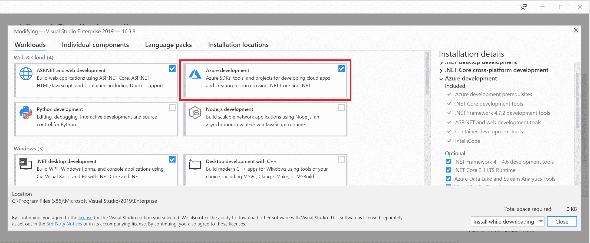

4.  等待安装完成并启动 Visual Studio。

现在，您可以为 Kubernetes 的类型容器应用创建新项目，它使用以下内容:

*   *ASP.NET*核心
*   包装舵图
*   AKS 上快速迭代开发的 Azure 开发空间

还可以为现有的 ASP.NET 核心增加库本内斯/赫尔姆支持:

1.  在解决方案资源管理器中右键单击项目。
2.  导航到添加|容器编排器支持
3.  选择库比特/头盔。

不幸的是，Visual Studio 2019 目前管理 Kubernetes 集群的功能有限。或者，您可以使用 Visual Studio 代码来完成此任务。

# Visual Studio 代码

对于 Visual Studio 代码，您可以使用微软的两个官方扩展:

*   **Kubernetes****(**`ms-kubernetes-tools.vscode-kubernetes-tools`**)**:使您能够在树形视图中浏览 Kubernetes 集群，管理 Kubernetes 对象，并为编辑清单文件和 Helm 图表提供智能感知。
*   **Azure Dev Spaces(**`azuredevspaces.azds`**)**:启用 Azure Dev Spaces 集成，类似于您在 Visual Studio 2019 中拥有的功能。

要安装这两个扩展，请打开 Visual Studio 代码并执行以下步骤:

1.  打开扩展面板(*Ctrl*+*Shift*+*X*)。
2.  在市场中搜索 Kubernetes。
3.  单击安装。
4.  对 Azure 开发空间重复同样的步骤。

在右边的菜单中，您现在可以使用 Kubernetes 面板，它会自动加载您的 kubeconfig。该扩展对于处理包含清单文件的工作区尤其有用，因为您可以获得自动完成、YAML 语法高亮显示和验证。

您可以从树状视图或使用命令(*Ctrl*+*Shift*+*P*)来管理集群，这可以用来代替在 PowerShell 中执行`kubectl`命令。例如，您可以跟踪容器的日志:

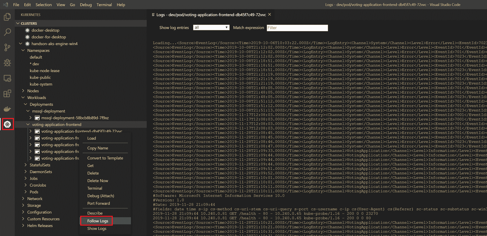

Visual Studio Code 是目前在 Windows 中使用 Kubernetes 和 Helm 最有用和最高级的工具。在下一节中，我们将展示如何使用 Helm 打包应用。

# 使用 Helm 打包应用

应用需要打包，以便于重新分发和依赖关系管理。在 Windows 中可以使用 Chocolatey，在 Ubuntu 中可以使用 **APT** (高级包工具的简称)，对于 Kubernetes 可以使用 Helm 作为包管理器**([https://v3.helm.sh/](https://v3.helm.sh/))。有几个替代方案，比如 Kustomize(在`kubectl`中自带原生支持)和 Kapitan，但总的来说，Helm 目前被认为是行业标准，拥有最大的 Helm 图表官方存储库([https://github.com/helm/charts](https://github.com/helm/charts))。**

 **Helm 的主要用例如下:

*   将流行软件部署到您的 Kubernetes 集群。软件包以 Helm 图表的形式分发。
*   将您自己的应用共享为 Helm 图表。这可以包括打包产品供最终用户使用，或者将 Helm 用作系统中微服务的内部包和依赖关系管理器。
*   确保应用得到适当的升级，包括依赖性管理。
*   根据您的需求配置软件部署。掌舵图基本上是通用的**另一种标记语言** ( **YAML** )库本内斯清单的参数化模板。Helm 使用 Go 模板([https://godoc.org/text/template](https://godoc.org/text/template))进行参数化。如果你熟悉围棋，那么你就在家；如果没有，那么你会发现它与其他模板系统非常相似，比如小胡子。

Please note that the architecture of Helm has drastically changed with the recent release of version 3.0.0.

以前，Helm 需要在 Kubernetes 上部署一个名为 Tiller 的专用服务，负责与 Kubernetes API 的实际通信。这导致了各种问题，包括安全和 RBAC(基于角色的访问控制的简称)问题。从 Helm 3.0.0 开始，不再需要 Tiller，图表管理由客户端完成。您可以在 https://helm.sh/docs/faq/#changes-since-helm-2 官方常见问题中阅读更多关于旧版本 Helm 之间差异的信息。

Helm 是作为一个客户端(库)分发的，带有类似于 kubectl 的命令行界面。现在可以使用客户端执行 Helm 中的所有操作。让我们在你的 Windows 机器上安装 Helm。

# 安装舵

建议您在使用巧克力的 Windows 机器上安装 Helm。要安装 Helm，请执行以下步骤:

1.  以管理员身份打开 PowerShell 窗口。
2.  执行以下安装命令:

```
 choco install kubernetes-helm
```

3.  安装完成后，确认您运行的是版本`3.0.0`或更高版本:

```
PS C:\src> helm version
version.BuildInfo{Version:"v3.0.0", GitCommit:"e29ce2a54e96cd02ccfce88bee4f58bb6e2a28b6", GitTreeState:"clean", GoVersion:"go1.13.4"}
```

4.  使用`helm repo list`命令检查您是否有任何已添加的存储库。如果没有(如 3.0.0 版)，添加官方`stable`库并更新:

```
helm repo add stable https://kubernetes-charts.storage.googleapis.com
helm repo update
```

5.  现在，尝试搜索一些 Helm 图表—例如，让我们检查是否有适用于 Microsoft SQL Server 的图表:

```
PS C:\src> helm search hub mssql
URL                                             CHART VERSION   APP VERSION     DESCRIPTION
https://hub.helm.sh/charts/stable/mssql-linux   0.10.1          14.0.3023.8     SQL Server 2017 Linux Helm Chart
```

**Helm Hub**([https://hub.helm.sh/](https://hub.helm.sh/))提供了一个用户友好的界面来浏览官方 Helm 资源库([https://github.com/helm/charts](https://github.com/helm/charts))。

我们已经为运行在 Linux 容器中的 SQL Server 找到了一个稳定的图表。它基于 2017 版，但我们仍然可以将其用于我们的投票应用。

# 使用 Helm 部署 Microsoft SQL Server

现在让我们来看看如何将微软的 SQL Server 部署到我们的 AKS 引擎集群中。每个图表的结构相似:

*   在`root`目录中，可以找到详细的自述文件，其中描述了如何安装图表以及可能的参数是什么([https://github . com/helm/charts/tree/master/stable/MSSQL-Linux](https://github.com/helm/charts/tree/master/stable/mssql-linux))。
*   `Chart.yaml`文件包含图表元数据，包括依赖关系信息。

*   `templates`目录包含Kubernetes清单的所有 Go 模板。
*   `values.yaml`文件定义了图表的默认值，可以使用命令行界面参数或通过提供 YAML 文件来覆盖这些默认值。

安装 Helm 图表的过程很简单:为您的需求定义正确的值(并可能分析模板以了解正在发生的事情)并运行`helm install`命令。查看 SQL Server 的图表，我们需要指定以下`values.yaml`文件:

```
acceptEula:
  value: "y"

edition:
  value: Developer

sapassword: "S3cur3P@ssw0rd"

service:
  type: LoadBalancer

persistence:
  enabled: true
  storageClass: azure-disk

nodeSelector:
  "kubernetes.io/os": linux
```

要使用 Helm 部署 SQL Server，请执行以下步骤:

1.  打开 PowerShell 窗口。
2.  将前面的文件保存为当前目录中的`values.yaml`。
3.  创建先决条件。我们需要`dev-helm`命名空间和`azure-disk`存储类。创建以下`prereq.yaml`清单文件:

```
---
kind: Namespace
apiVersion: v1
metadata:
  name: dev-helm
  labels:
    name: dev-helm
---
kind: StorageClass
apiVersion: storage.k8s.io/v1beta1
metadata:
  name: azure-disk
provisioner: kubernetes.io/azure-disk
parameters:
  storageaccounttype: Standard_LRS
  kind: Managed
```

4.  使用`kubectl apply -f .\prereq.yaml`命令应用清单文件。
5.  执行掌舵图安装的试运行。您将能够看到将应用哪些 Kubernetes 清单文件:

```
helm install demo-mssql stable/mssql-linux `
 --namespace dev-helm `
 --values .\values.yaml `
 --debug `
 --dry-run
```

该命令将在`dev-helm`名称空间中执行`stable/mssql-linux`安装的试运行，作为`demo-mssql` Helm 版本。

6.  如果您对结果满意，请执行安装:

```
helm install demo-mssql stable/mssql-linux `
 --namespace dev-helm `
 --values .\values.yaml
```

7.  使用以下命令观察 SQL Server 的部署:

```
kubectl get all --all-namespaces -l release=demo-mssql
```

8.  您也可以使用 Helm CLI 检查状态:

```
helm status -n dev-helm demo-mssql
```

9.  使用 SQL Server 管理工作室或 SQL 工具容器来验证 SQL Server 是否正常运行。您可以为该服务使用一个外部 IP 地址—我们已经公开了一个负载平衡器服务。

Commands for managing Helm releases are namespace-scoped in a similar manner to kubectl.

如您所见，使用 Helm 对于快速引导集群中的复杂应用非常有效。现在，让我们为我们的投票应用准备一个 Helm 图表。我们将使用一个 SQL Server 图表作为依赖项。

# 为我们的投票应用创建一个 Helm 图表

为了将我们的投票应用打包为 Helm 图表，我们将使用上一章中用于水平POD自动缩放器演示的清单文件。你可以在[https://GitHub . com/PacktPublishing/动手-Kubernetes-On-Windows/tree/master/chapter 12/02 _ 投票-应用-基础](https://github.com/PacktPublishing/Hands-On-Kubernetes-on-Windows/tree/master/Chapter12/02_voting-application-base)找到该书的基础清单文件。

要准备 Helm 图表，我们需要完成以下步骤:

1.  收集所有必需的 Kubernetes 清单文件，并确定哪些部分应该参数化。我们将使用这些来创建 Helm 模板文件和`default values`文件。
2.  为我们的应用定义所有的依赖项，并为它们定义合适的参数值。我们将把这些参数注入到父图表的`default values`文件中。
3.  将实体框架数据库迁移转化为安装后和升级后的 Helm 挂钩。

这里的大部分工作是将原始的 Kubernetes 清单文件转换成 Helm 模板。在接下来的几个步骤中，我们将只显示这个过程的相关部分。为了获得最佳的编码体验，请使用 Visual Studio Code 编辑 Helm 图表。您可以在 Github 资源库[中找到我们投票应用的最终 Helm 图表，网址为 https://Github . com/PacktPublishing/hand-Kubernetes-On-Windows/tree/master/chapter 12/03 _ Voting-application-Helm](https://github.com/PacktPublishing/Hands-On-Kubernetes-on-Windows/tree/master/Chapter12/03_voting-application-helm)。

请通过以下步骤创建您的 Helm 图表:

1.  首先，让我们从集群中卸载 SQL Server Helm 版本。我们将在投票应用父图表中自动安装此图表作为依赖项:

```
helm uninstall -n dev-helm demo-mssql
```

2.  运行以下命令创建一个 Helm 图表支架:

```
helm create voting-application
```

这将创建一个名为`voting-application`的目录，其中包含你的 Helm 图表的基本结构和模板。我们将重用其中的大部分。

3.  使用`cd .\voting-application\`导航到图表目录，修改`Chart.yaml`文件中的图表元数据:

```
apiVersion: v2
name: voting-application
description: Voting Application (Windows Containers) Helm chart
type: application
version: 0.1.0
appVersion: 1.4.0
dependencies:
  - name: mssql-linux
    version: 0.10.1
    repository: https://kubernetes-charts.storage.googleapis.com
sources:
- https://github.com/hands-on-kubernetes-on-windows/voting-application
```

这里代码最重要的部分涉及定义适当的依赖关系和设置适当的`apiVersion`，它将被用作模板中的 Docker 映像标签。在`https://kubernetes-charts.storage.googleapis.com`从官方稳定库添加最新图表版本(`0.10.1`)的`mssql-linux`。

4.  使用`cd .\templates\`命令导航至`templates`目录。我们将以原始形式使用`reuse _helpers.tpl`(包含模板助手功能)、`service.yaml`、`serviceaccount.yaml`和`ingress.yaml`。这些清单模板将在不做任何更改的情况下产生我们所需要的东西。
5.  下一步是为我们的部署定义一个名为`deployment.yaml`的清单模板；您应该检查图表支架中的原始`deployment.yaml`文件，因为您可以在我们的模板中使用其中的大部分。这个模板的最终版本可以在[https://github . com/packt publishing/hand-On-Kubernetes-On-Windows/blob/master/chapter 12/03 _ voting-application-helm/templates/deployment . YAML](https://github.com/PacktPublishing/Hands-On-Kubernetes-on-Windows/blob/master/Chapter12/03_voting-application-helm/templates/deployment.yaml)上找到。例如，让我们解释如何参数化 Docker 映像标记并注入 SQL Server 密码:

```
apiVersion: apps/v1
kind: Deployment
metadata:
  name: {{ include "voting-application.fullname" . }}
  labels:
    {{- include "voting-application.labels" . | nindent 4 }}
spec:
  ...
  template:
    ...
    spec:
      ...
      containers:
        - name: {{ .Chart.Name }}-frontend
          ...
          image: "{{ .Values.image.repository }}:{{ .Chart.AppVersion }}"
          imagePullPolicy: {{ .Values.image.pullPolicy }} 
          env:
          - name: MSSQL_SA_PASSWORD
            valueFrom:
              secretKeyRef:
                name: {{ .Release.Name }}-mssql-linux-secret
                key: sapassword
          - name: CONNECTIONSTRING_VotingApplication
            value: "Data Source={{ .Release.Name }}-mssql-linux;Initial Catalog=VotingApplication;MultipleActiveResultSets=true;User Id=sa;Password=$(MSSQL_SA_PASSWORD);"
```

我们一步一步来分析。`{{ include "voting-application.fullname" . }}`短语向您展示了如何包含在`_helpers.tpl`中定义的模板，并将其用作部署名称。如果有一些更高级的模板逻辑，您应该总是使用这个文件来定义可重用的模板。

pod 容器的 Docker 映像定义为`"{{ .Values.image.repository }}:{{ .Chart.AppVersion }}"`；使用`.Values`引用在`values.yaml`文件中定义的变量，使用`.Chart`引用图表元数据。最后，我们使用了`{{ .Release.Name }}-mssql-linux-secret`来引用依赖的 SQL Server 图表创建的秘密。

You need to know the internals of the dependent chart to know what value should be used ([https://github.com/helm/charts/blob/master/stable/mssql-linux/templates/secret.yaml](https://github.com/helm/charts/blob/master/stable/mssql-linux/templates/secret.yaml)[).](https://github.com/helm/charts/blob/master/stable/mssql-linux/templates/secret.yaml)

不幸的是，赫尔姆没有一个简单的引用过程来引用相关图表中的这些值，所以你要么按照赫尔姆使用的约定硬编码名称(我们做到了)，要么在`_helpers.tpl`中定义一个专用模板(这是一个更干净的方法，但也更复杂)。

6.  为了定义 RBAC 角色和角色绑定，我们创建了两个额外的模板文件，`rolebinding.yaml`和`role.yaml`。可以在[https://github . com/packt publishing/hand-Kubernetes-On-Windows/tree/master/chapter 12/03 _ voting-application-helm/templates](https://github.com/PacktPublishing/Hands-On-Kubernetes-on-Windows/tree/master/Chapter12/03_voting-application-helm/templates)找到内容。为应用定义 RBAC 清单可以是有条件的；你可以在官方的 Helm 图表中看到这种做法。
7.  我们需要定义的最后一个清单是用于运行 Entity Framework 数据库迁移的 Helm hook([https://helm.sh/docs/topics/charts_hooks/](https://helm.sh/docs/topics/charts_hooks/))([https://github . com/PacktPublishing/hand-Kubernetes-On-Windows/blob/master/chapter 12/03 _ voting-application-Helm/templates/post-install-job . YAML](https://github.com/PacktPublishing/Hands-On-Kubernetes-on-Windows/blob/master/Chapter12/03_voting-application-helm/templates/post-install-job.yaml))。钩子就像任何其他清单模板一样，但是它有额外的注释，以确保清单在图表发布的生命周期中的某个点被应用。此外，如果挂钩是 Kubernetes 作业，Helm 可以等待完成作业并提供清理。我们希望这个钩子是一个作业，与我们已经用于 EF 迁移的作业相同，我们希望它在版本安装或升级后执行。让我们看看如何在`post-install-job.yaml`文件中为我们的工作定义注释:

```
apiVersion: batch/v1
kind: Job
metadata:
  name: {{ .Release.Name }}-ef6-database-migrate
  ...
  annotations:
    "helm.sh/hook": post-install,post-upgrade
    "helm.sh/hook-weight": "-5"
    "helm.sh/hook-delete-policy": hook-succeeded
spec:
  backoffLimit: 10
```

将清单模板变成钩子的关键注释是`"helm.sh/hook"`。我们使用`post-install`和`post-upgrade`值来确保钩子在安装后和 Helm 版本升级后执行。`"helm.sh/hook-weight"`短语用于确定钩子的顺序，在我们的情况下这并不重要，因为我们只有一个钩子。

`"helm.sh/hook-delete-policy"`短语定义了应该自动删除作业实例的情况。我们希望仅在成功执行挂钩时删除它们；否则，我们想留下资源以便调试问题。

请注意，我们将作业`backoffLimit`指定为`10`；我们在创建一个长的 SQL Server pod 的情况下需要这个，在这种情况下，甚至可能需要几分钟；如果我们不这样做，钩子会很快失效。

8.  最后一步是在图表根目录下的`values.yaml`文件中提供默认模板值([https://github . com/PacktPublishing/hand-On-Kubernetes-On-Windows/blob/master/chapter 12/03 _ voting-application-helm/values . YAML](https://github.com/PacktPublishing/Hands-On-Kubernetes-on-Windows/blob/master/Chapter12/03_voting-application-helm/values.yaml))。让我们看一下文件中的一些重要部分:

```
...
image:
  repository: packtpubkubernetesonwindows/voting-application
  pullPolicy: IfNotPresent
...
nodeSelector: 
  "kubernetes.io/os": windows
...
mssql-linux:
  acceptEula:
    value: "y"
  edition:
    value: Developer
  sapassword: "S3cur3P@ssw0rd"
  service:
    type: LoadBalancer
  persistence:
    enabled: true
    storageClass: azure-disk
  nodeSelector:
    "kubernetes.io/os": linux
```

你可以组织价值观；然而，它们已经被方便地安排好了。例如，关于 Docker 映像的所有内容都被分组到映像节点中，然后您可以在图表中将映像存储库名称引用为`{{ .Values.image.repository }}`。需要记住的一件非常重要的事情是提供一个合适的`nodeSelector`，它确保POD只为 Windows 节点调度。最后，使用依赖图表的名称为其定义值。

这里，我们使用了`mssql-linux`，因为这是我们在`Chart.yaml`文件中引用的图表。您可以在[https://helm.sh/docs/topics/charts/#chart-dependencies](https://helm.sh/docs/topics/charts/#chart-dependencies)的文档中了解更多关于管理依赖关系和定义值的信息。

Many aspects of Helm are based on conventions. You can find more about the best practices for implementing charts in the documentation at [https://helm.sh/docs/topics/chart_best_practices/](https://helm.sh/docs/topics/chart_best_practices/). Use the `helm lint` command to check whether there are any issues with your chart.

我们投票应用的图表已经准备好了。现在，我们将把这个图表安装到`dev-helm`命名空间中的 Kubernetes 集群中:

1.  打开图表`root`目录下的 PowerShell 窗口。
2.  确保从存储库中提取所有相关图表:

```
helm dependency update
```

3.  执行 Helm 图表安装的`dry run`来检查清单文件:

```
helm install voting-application . `
 --namespace dev-helm `
 --debug `
 --dry-run
```

此命令将打印所有已解析的清单文件，这些文件将应用于当前目录`.`中图表的安装，并带有默认值。

4.  现在，安装图表。我们需要为安装提供一个延长的超时时间，因为我们的实体框架数据库迁移作业可能需要几分钟才能成功。这取决于 SQL Server 初始化和准备连接的速度。使用以下命令:

```
helm install voting-application . `
 --namespace dev-helm `
 --debug `
 --timeout 900s
```

5.  安装需要一点时间；您可以在单独的 PowerShell 窗口中观察单个 Kubernetes 对象的部署进度:

```
kubectl get all -n dev-helm
```

6.  安装结束后，使用`kubectl get -n dev-helm svc -w voting-application`为我们的投票应用获取负载平衡器服务的外部 IP 地址。在网络浏览器中导航到该地址，尽情享受吧！

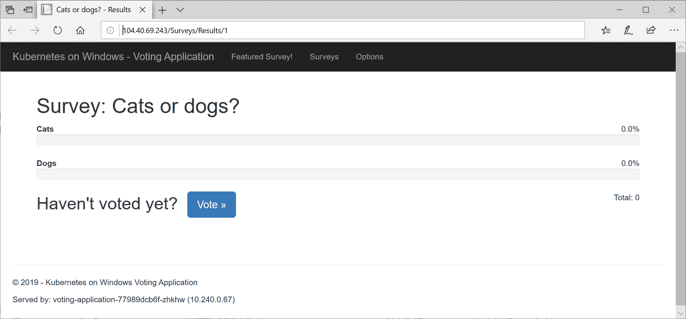

In a production environment, you should use a Helm chart repository to manage your charts. You can learn more about setting up a repository at [https://v3.helm.sh/docs/topics/chart_repository/](https://v3.helm.sh/docs/topics/chart_repository/). Additionally, to manage releases for Helm charts *declaratively*, similar to `kubectl apply`, you may consider using `Helmfile` ([https://github.com/roboll/helmfile](https://github.com/roboll/helmfile)).

在下一节中，您将学习如何轻松地将 Azure Application Insights 添加到在 Windows 容器中运行的 ASP.NET MVC 应用中。我们还将向您展示如何对我们刚刚安装的 Helm 版本进行升级。

# 使用 Azure 应用洞察调试容器化应用

Azure Application Insights 是 Azure Monitor 的一部分，它为您的应用提供**应用性能管理** ( **APM** )功能。它是一个大型平台，在 Azure 门户中有丰富的 **UI** (简称**用户界面**)，提供了以下功能(其中包括):

*   请求监控和跟踪，包括多个微服务之间的分布式跟踪
*   异常监控和快照调试
*   收集主机的性能计数器
*   智能异常检测和警报
*   轻松的日志收集和分析

我们最感兴趣的功能是快照调试，它可以帮助诊断生产部署中的问题，在生产部署中，不建议使用连接的远程调试器运行。为此，如果您想使用 Visual Studio 分析快照，您将需要 Visual Studio 2019 企业版。或者，您可以在 Azure 门户本身中执行分析，该门户拥有一个轻量级的基于 web 的调试器。

Alternatively, you can use zero-instrumentation application monitoring for Kubernetes applications running on Azure using out-of-band instrumentation provided by the Istio service mesh, as explained at [https://docs.microsoft.com/en-us/azure/azure-monitor/app/kubernetes](https://docs.microsoft.com/en-us/azure/azure-monitor/app/kubernetes).

要启用 Azure 应用洞察和快照调试，我们需要完成以下步骤:

1.  在 Visual Studio 项目中启用 Azure 应用洞察。
2.  安装`Microsoft.ApplicationInsights.SnapshotCollector` NuGet 包。
3.  配置快照调试，修改 Serilog 配置，使用接收器向`System.Diagnostics.Trace`发送日志。
4.  添加演示异常。
5.  构建一个新的 Docker 映像，并将其推送到 Docker Hub。
6.  升级头盔版本。

之后，我们将能够直接在 Azure 门户中分析跟踪图、应用日志和异常。请注意，此日志收集解决方案不同于我们在[第 8 章](08.html)、*中演示的部署混合 Azure Kubernetes 服务引擎集群、*中使用 Azure 日志分析进行 AKS 引擎的解决方案。它们使用相同的 Azure 服务，但是，在新的解决方案中，我们将只获得应用日志—您将不会在 Azure 日志分析视图中看到 Kubernetes 或容器运行时日志。

# 支持 Azure 应用洞察

请完成以下步骤，在我们的投票应用中启用 Azure 应用洞察。或者，您可以使用 Github 存储库中可用的现成源代码，网址为[https://Github . com/PacktPublishing/hand-Kubernetes-On-Windows/tree/master/chapter 12/04 _ voting-application-azure-application-insights-src](https://github.com/PacktPublishing/Hands-On-Kubernetes-on-Windows/tree/master/Chapter12/04_voting-application-azure-application-insights-src)。
如果您选择这样做，您需要在 Helm 版本升级的后续步骤中提供自己的 Azure 应用洞察密钥:

1.  在 Visual Studio 2019 中打开`VotingApplication`解决方案。
2.  在解决方案资源管理器中，右键单击`VotingApplication`项目，选择添加并选择应用洞察遥测...：

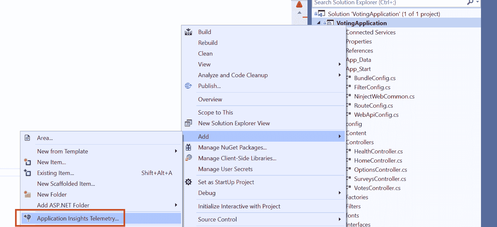

3.  单击开始。
4.  登录 Azure 并提供新的资源组和资源名称(或使用默认名称)。

5.  单击注册。手术需要几分钟。时间过去后，将在您的 Azure 订阅中创建一个新的 Azure Application Insights 实例，并将适当的 NuGet 包添加到 Visual Studio 项目中。
6.  更新 CodeLens 的资源，使其能够从`System.Diagnostics`收集跟踪:

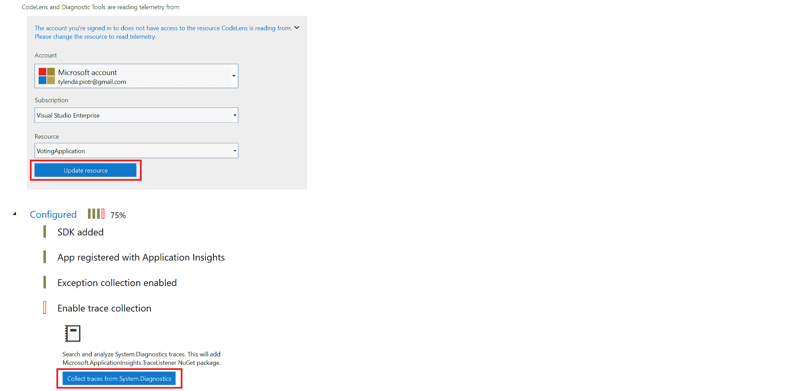

7.  我们不希望将检测密钥硬编码到 Docker 映像中。Application Insights 支持注入关键`APPINSIGHTS_INSTRUMENTATIONKEY`环境变量的能力。导航到解决方案中的`ApplicationInsights.config`文件，找到下面的 XML 节点，记下密钥以便进一步使用，并删除该 XML 节点:

```
<InstrumentationKey>4e810bf1-58c4-4af7-a67d-36fcdcf24a2f</InstrumentationKey>
```

8.  在解决方案中搜索您的检测密钥的所有匹配项。在`_Layout.cshtml`你会发现多了一个；用以下值替换它:

```
instrumentationKey: '@Microsoft.ApplicationInsights.Extensibility.TelemetryConfiguration.Active.InstrumentationKey'
```

9.  右键单击解决方案资源管理器中的`VotingApplication`项目，并选择管理新包....在`Microsoft.ApplicationInsights.SnapshotCollectorandSerilog.Sinks.Trace`中安装以下 NuGet 包。
10.  配置快照调试器。在`ApplicationInsights.config`文件中，确保在根节点`ApplicationInsights`中有以下 XML 节点:

```
<TelemetryProcessors>
 <Add Type="Microsoft.ApplicationInsights.SnapshotCollector.SnapshotCollectorTelemetryProcessor, Microsoft.ApplicationInsights.SnapshotCollector">
 <IsEnabled>true</IsEnabled>
 <IsEnabledInDeveloperMode>false</IsEnabledInDeveloperMode>
 <ThresholdForSnapshotting>1</ThresholdForSnapshotting>
 <MaximumSnapshotsRequired>3</MaximumSnapshotsRequired>
 <MaximumCollectionPlanSize>50</MaximumCollectionPlanSize>
 <ReconnectInterval>00:15:00</ReconnectInterval>
 <ProblemCounterResetInterval>1.00:00:00</ProblemCounterResetInterval>
 <SnapshotsPerTenMinutesLimit>3</SnapshotsPerTenMinutesLimit>
 <SnapshotsPerDayLimit>30</SnapshotsPerDayLimit>
 <SnapshotInLowPriorityThread>true</SnapshotInLowPriorityThread>
 <ProvideAnonymousTelemetry>false</ProvideAnonymousTelemetry>
 <FailedRequestLimit>3</FailedRequestLimit>
 </Add>
</TelemetryProcessors>
```

11.  用`RegisterServices`方法在`NinjectWebCommon.cs`文件中注册 Serilog 接收器。您的记录器配置应该如下所示:

```
Log.Logger = new LoggerConfiguration()
                 .ReadFrom.AppSettings()
                 .Enrich.FromLogContext()
                 .WriteTo.EventLog(source: "VotingApplication", logName: "VotingApplication", manageEventSource: false)
                 .WriteTo.Trace()
                 .CreateLogger();
```

12.  在`HomeController.cs`文件中，添加一个新的控制器动作`TestException`，我们将使用它来测试快照调试。它应该只是引发一个未处理的异常:

```
public ActionResult TestException()
{
    throw new InvalidOperationException("This action always throws an exception!");
}
```

此时，我们的投票应用已完全配置为使用 Azure 应用洞察。我们现在可以使用以下步骤升级 Helm 版本:

1.  构建一个带有`1.5.0`标签的新 Docker 映像，就像我们在前面几章中所做的那样，并将其推送到 Docker Hub。在我们的情况下，它将被称为`packtpubkubernetesonwindows/voting-application:1.5.0`。
2.  使用应用的 Helm 图表导航到目录。
3.  在`Chart.yaml`文件中，使用`1.5.0`(与 Docker 映像标签相同)作为`appVersion`。根据我们的最佳实践建议，更改图表的版本——例如，使用`0.2.0`。
4.  在`values.yaml`文件中，添加您的仪表键并将`replicaCount`增加到`5`:

```
azureApplicationInsightsKey: 4e810bf1-58c4-4af7-a67d-36fcdcf24a2f
replicaCount: 5
```

5.  现在，我们需要为我们的投票应用将 pod 模板的检测密钥注入`Deployment`中。修改`templates\deployment.yaml`，将`azureApplicationInsightsKey`注入`APPINSIGHTS_INSTRUMENTATIONKEY`环境变量:

```
apiVersion: apps/v1
kind: Deployment
metadata:
  name: {{ include "voting-application.fullname" . }}
  ...
spec:
  ...
  template:
    ...
    spec:
      ...
      containers:
        - name: {{ .Chart.Name }}-frontend
          ...
          env:
          - name: APPINSIGHTS_INSTRUMENTATIONKEY
            value: {{ .Values.azureApplicationInsightsKey }}
          ...
```

6.  使用我们图表的新版本对 Helm 版本进行升级`dry run`。您应该看到在输出清单中正确解析了检测密钥:

```
helm upgrade voting-application . `
 --namespace dev-helm `
 --debug `
 --dry-run
```

7.  运行`upgrade`:

```
helm upgrade voting-application . `
 --namespace dev-helm `
 --debug `
 --timeout 900s
```

8.  等待所有副本升级到新版本。

现在，您的应用应该正在运行，并将所有遥测数据发送到 Azure 应用洞察。您可以从 Azure 门户([https://portal.azure.com/](https://portal.azure.com/))导航到应用洞察，也可以通过右键单击连接的服务下的`Application Insights`并选择打开应用洞察门户，直接从 Visual Studio 打开应用洞察门户:

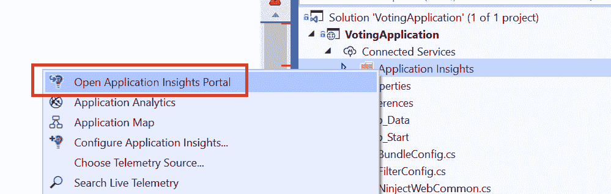

您可以探索当前配置中现成可用的多种功能，例如，将遥测数据可视化为应用图，显示应用中不同组件之间的依赖关系及其当前状态:

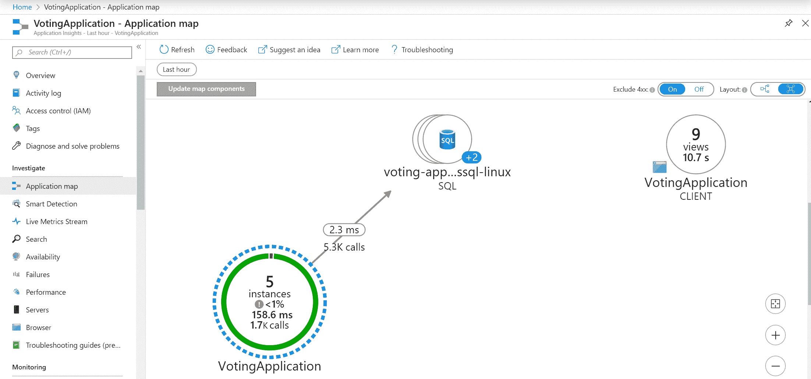

如果您对最终用户请求的整体性能感兴趣，您可以查看基于 ASP.NET MVC 遥测技术的专用仪表板:

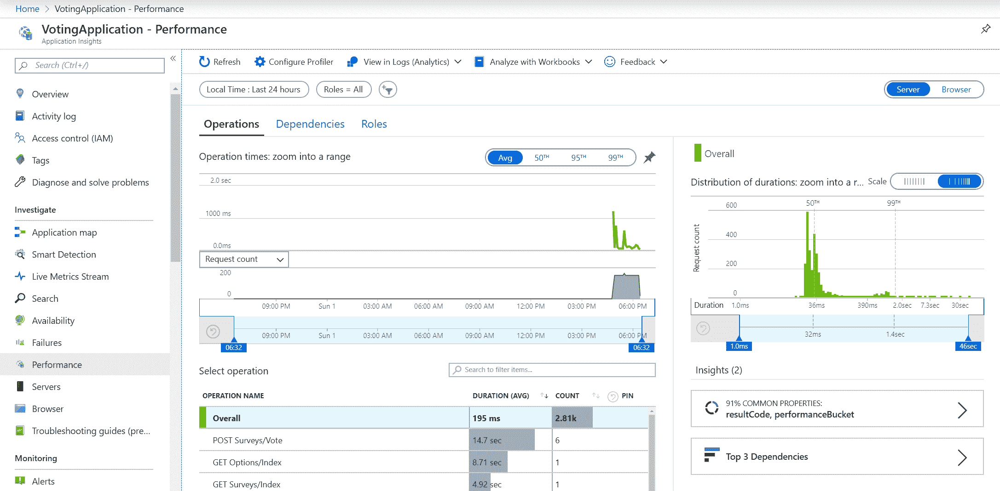

当然，您可以检查应用**日志**，它们是由 Serilog 接收器提供的。该视图中最重要的功能是使用库斯托语言([https://docs.microsoft.com/en-us/azure/kusto/query/](https://docs.microsoft.com/en-us/azure/kusto/query/))运行复杂查询的可能性，库斯托语言旨在分析日志数据:

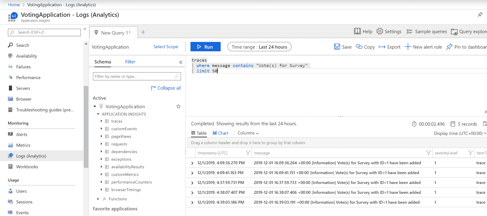

You can learn more about the Azure Application Insights features in the official documentation at [https://docs.microsoft.com/en-us/azure/azure-monitor/app/app-insights-overview](https://docs.microsoft.com/en-us/azure/azure-monitor/app/app-insights-overview).

现在，让我们看看如何使用快照调试器来调试您的容器化应用，即使您不能访问远程调试器。

# 快照调试器

Azure Application Insights 服务提供快照调试器，这是一项用于监控应用异常遥测的功能，包括生产场景。每当出现未处理的异常(顶部抛出)时，快照调试器都会收集托管内存转储，这些内存转储可以直接在 Azure Portal 或更高级的情况下在 Visual Studio 2019 企业版中进行分析。如果您在安装程序中选择了 ASP.NET 工作负载，Visual Studio 将默认安装此功能。

Snapshot debugging can be configured for regular .NET applications that are not using ASP.NET MVC. You can find out more in the documentation at [https://docs.microsoft.com/en-us/azure/azure-monitor/app/snapshot-debugger-vm#configure-snapshot-collection-for-other-net-applications](https://docs.microsoft.com/en-us/azure/azure-monitor/app/snapshot-debugger-vm#configure-snapshot-collection-for-other-net-applications).

在前面的段落中，我们已经通过安装`Microsoft.ApplicationInsights.SnapshotCollector` NuGet 包并提供额外的配置在我们的应用中启用了快照调试。现在，我们可以在我们的投票应用中测试这个特性:

1.  在您的 web 浏览器中，导航到总是引发异常的测试端点:`http://<serviceExternalIp>/Home/TestException`。触发此端点两次；默认情况下，我们必须多次命中同一个异常来触发快照收集。
2.  您将看到我们的投票应用的默认错误页面。同时，快照已经收集完毕，对最终用户没有任何明显的性能影响。
3.  导航到 Azure 门户中投票应用的应用洞察([https://portal.azure.com/](https://portal.azure.com/))。
4.  打开“失败”窗格，在查看“操作”选项卡时选择“操作”按钮，或在查看“例外”选项卡时选择“例外”按钮:

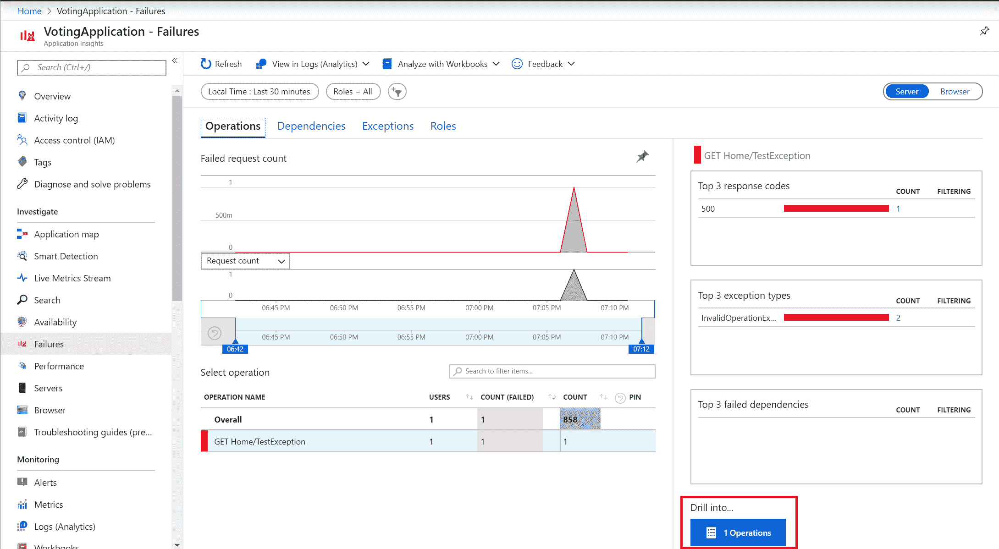

5.  从右侧，选择一个示例操作窗格，并打开其中一个异常事件。
6.  一开始，你不会在时间轴上看到任何快照；您必须首先添加应用洞察快照调试器角色。为此，请单击(看不到快照？疑难解答):

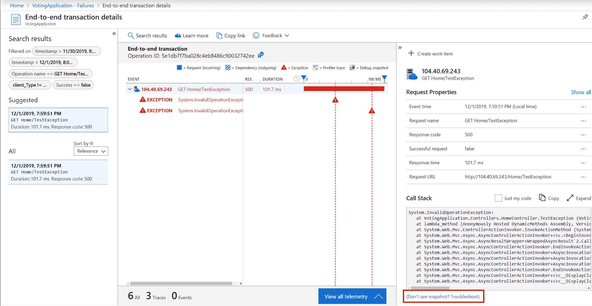

7.  单击添加应用洞察快照调试器角色:


8.  之后，将执行基本的健康检查。请记住，上传快照需要几分钟时间，因此，如果您遇到任何运行状况检查失败，请在几分钟后重试。
9.  现在，回到端到端事务细节视图，您将看到代表调试快照的小图标。单击其中一个:

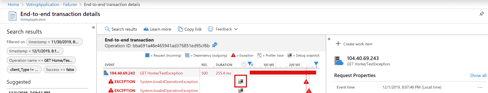

10.  调试快照视图为您提供轻量级调试器功能，包括代码反编译。要在 Visual Studio 2019 企业版中分析快照，请单击下载快照按钮:

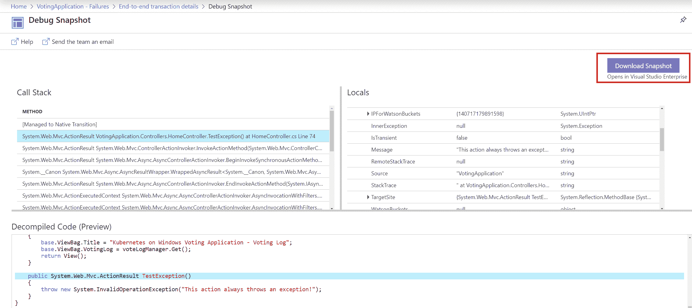

11.  文件下载后，在 Visual Studio 中双击打开它。
12.  在 Visual Studio 中，根据您的需要，单击“仅使用托管内存调试”或“调试托管内存”。当您分析内存泄漏和其他与内存相关的问题时，第二个选项非常有用。
13.  您可能需要选择源代码位置才能看到源代码视图([https://docs . Microsoft . com/en-us/visualstudio/debugger/specify-symbol-dot-pdb-和-source-files-in-visual studio-debugger？view=vs-2019](https://docs.microsoft.com/en-us/visualstudio/debugger/specify-symbol-dot-pdb-and-source-files-in-the-visual-studio-debugger?view=vs-2019) )。

14.  现在，您可以使用一直使用的所有调试工具，例如，您可以分析并行堆栈视图:

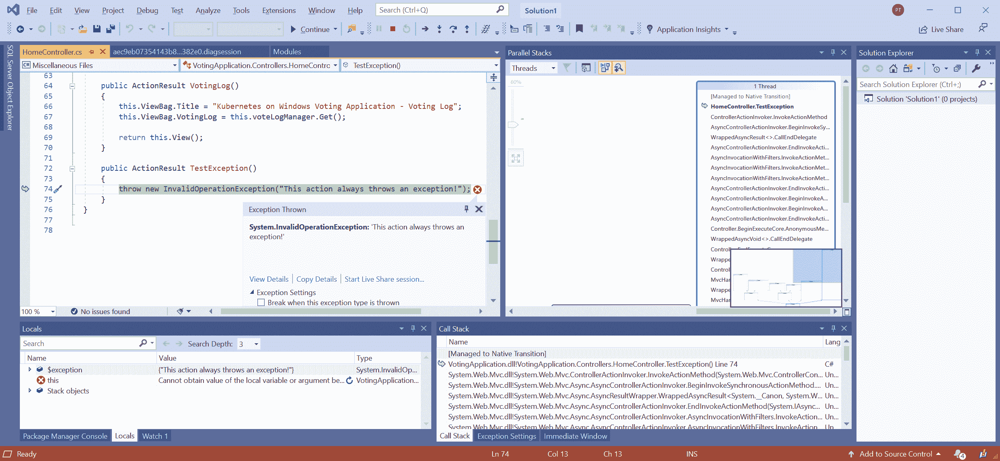

If you run into any other problems while using the snapshot debugger, check the official troubleshooting guide at [https://docs.microsoft.com/en-us/azure/azure-monitor/app/snapshot-debugger-troubleshoot](https://docs.microsoft.com/en-us/azure/azure-monitor/app/snapshot-debugger-troubleshoot).

快照调试器有更多的功能，可以设置实时快照点，这样您就可以创建快照而无需等待异常。不幸的是，目前该功能仅适用于 Azure 应用服务工作负载或在 Linux 容器中运行应用的托管 AKS 集群。你可以在[https://docs . Microsoft . com/en-us/visualstudio/debugger/debug-live-azure-applications 的文档中找到更多信息？view=vs-2019](https://docs.microsoft.com/en-us/visualstudio/debugger/debug-live-azure-applications?view=vs-2019) 。

在下一节中，我们将看看 Kubernetes 仪表板。

# 使用 Kubernetes 仪表板

Kubernetes Dashboard([https://github.com/kubernetes/dashboard](https://github.com/kubernetes/dashboard))是默认的、基于网络的用户界面，用于部署、管理和排除运行在 Kubernetes 上的应用的故障。一般来说，建议您使用集群的声明性 kubectl 管理，而不是使用 Dashboard，但是它仍然是一个有用的工具，可以进行集群概述、分析日志并快速执行到 pod 容器中。

要使用仪表板，您必须首先安装它。您有以下选项可以执行此操作:

*   通过运行`kubectl apply -f https://raw.githubusercontent.com/kubernetes/dashboard/v2.0.0-beta6/aio/deploy/recommended.yaml`使用官方清单进行部署。您可以在[https://kubernetes . io/docs/tasks/access-application-cluster/web-ui-dashboard/](https://kubernetes.io/docs/tasks/access-application-cluster/web-ui-dashboard/)上再次查看文档中的最新版本。
*   使用`helm install kubernetes-dashboard stable/kubernetes-dashboard`命令安装舵角图。
*   在 AKS 引擎中，使用`kubernetes-dashboard`插件，该插件在集群 ApiModel 中默认启用。

重要的是要知道 Kubernetes API 和 Kubernetes Dashboard 有严格的兼容性规则。您可以在[https://github.com/kubernetes/dashboard/releases](https://github.com/kubernetes/dashboard/releases)的官方发布页面查看矩阵。目前 AKS Engine 部署的是仪表盘`1.10.1`版本，与 Kubernetes API 最新版本不兼容。这意味着我们将使用官方清单部署 Dashboard。AKS Engine 集群默认情况下是一个支持 RBAC 的集群，因此我们需要配置 RBAC，以便将 Dashboard 用作集群管理员。

# 部署 Kubernetes 仪表板

要部署和配置 RBAC，请执行以下步骤:

1.  打开 PowerShell 窗口。
2.  使用官方清单部署 Kubernetes 仪表板:

```
kubectl apply -f https://raw.githubusercontent.com/kubernetes/dashboard/v2.0.0-beta6/aio/deploy/recommended.yaml
```

3.  为`admin-user`创建`serviceaccount.yaml`清单文件:

```
apiVersion: v1
kind: ServiceAccount
metadata:
 name: admin-user
 namespace: kubernetes-dashboard
```

4.  使用`kubectl apply -f serviceaccount.yaml`命令应用清单文件。

5.  创建`clusterrolebinding.yaml`清单文件，赋予该用户`cluster-admin`角色:

```
apiVersion: rbac.authorization.k8s.io/v1
kind: ClusterRoleBinding
metadata:
  name: admin-user
roleRef:
  apiGroup: rbac.authorization.k8s.io
  kind: ClusterRole
  name: cluster-admin
subjects:
- kind: ServiceAccount
  name: admin-user
  namespace: kubernetes-dashboard
```

6.  使用`kubectl apply -f clusterrolebinding.yaml`命令应用清单文件。
7.  要获取该用户的承载令牌，请在 PowerShell 中使用以下代码片段，并在`token:`后复制该值:

```
kubectl -n kubernetes-dashboard describe secrets ((kubectl -n kubernetes-dashboard get secrets | Select-String "admin-user-token") -Split "\s+")[0]
```

When granting the `cluster-admin` role to the ServiceAccount that will be used to access the dashboard, you need to understand any security implications. Anyone who has the token for the `admin-user` ServiceAccount will be able to perform any actions in your cluster. In production scenarios, consider creating roles that expose only the necessary functionalities.

现在，您可以访问仪表板了。为此，请执行以下步骤:

1.  在 PowerShell 窗口中，使用`kubectl proxy`命令启动连接到 API 的代理。仪表板没有作为外部服务公开，这意味着我们必须使用代理。
2.  打开网页浏览器，导航至`http://localhost:8001/api/v1/namespaces/kubernetes-dashboard/services/https:kubernetes-dashboard:/proxy/`。

3.  使用令牌选项进行身份验证，并提供我们在前面步骤中检索到的承载令牌。
4.  您将被重定向到集群概述:

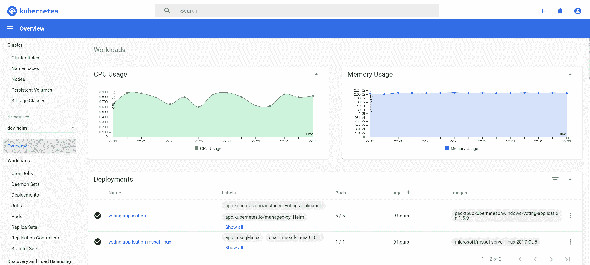

Kubernetes 仪表板具有多个功能，涵盖了`kubectl`提供的许多功能。在接下来的部分中，我们将探讨如何访问容器日志并执行到 pod 容器中，因为它们在调试场景中很有用。

# 访问 pod 容器日志

Kubernetes Dashboard 为您提供了一个快速访问 pod 容器日志的简单界面。要访问我们的投票应用的其中一个单元的日志，请执行以下步骤:

1.  在菜单中，导航至工作负载|面板。
2.  为我们的投票应用找到一个豆荚。在右侧，单击三点按钮并选择日志。

3.  您将被重定向到日志视图，在那里您可以实时检查日志，就像您使用`kubectl logs`命令一样:

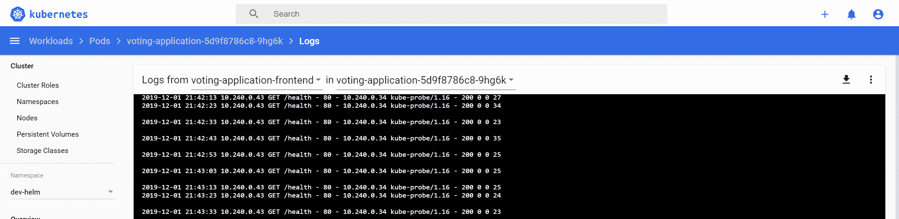

接下来，我们来看看如何将`exec`装入豆荚容器。

# 在 pod 容器中执行命令

以类似于访问日志的方式，您可以执行到 Pod 容器中，以便运行特定的命令。这种方法在调试问题或在开发集群中快速引入配置更改时非常有用。请执行以下步骤:

1.  在菜单中，导航至工作负载|面板。
2.  为我们的投票应用找到一个豆荚。在右侧，点击三点按钮，选择`e` `xec`。
3.  几秒钟后，PowerShell 终端将打开。您可以运行任意 PowerShell 命令并修改容器状态:

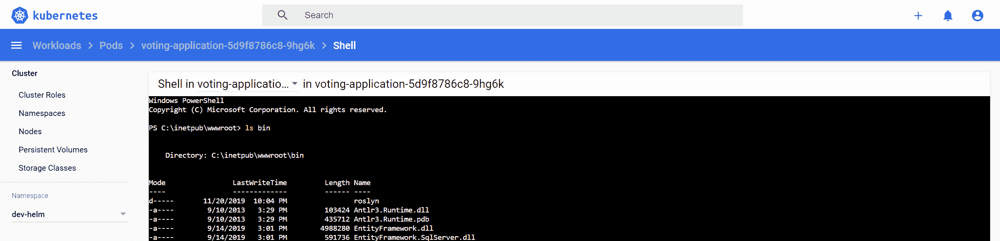

恭喜你！您已经成功部署了 Kubernetes Dashboard，现在您已经配备了另一个有用的调试工具。在下一节中，您将学习如何使用 Azure Dev Spaces 来改进 Kubernetes 的开发环境。

# 使用 Azure 开发空间在团队中处理微服务

Azure Dev Spaces([https://docs.microsoft.com/en-us/azure/dev-spaces/](https://docs.microsoft.com/en-us/azure/dev-spaces/))又称 **AZDS** (简称 **Azure Dev Spaces** )，是微软为增强 Kubernetes 开发体验而推出的最新产品之一。这项服务为使用 AKS 集群的团队提供了快速迭代的开发体验。请注意，目前仅支持托管 AKS 集群，这意味着您无法使用 AKS Engine 进行此项服务。更有甚者，当前版本不支持 Windows 容器应用的开发；可以与现有的 Windows pods 进行交互，但不会由 AZDS 进行管理([https://docs . Microsoft . com/en-us/azure/dev-spaces/how-run-dev-spaces-Windows-containers](https://docs.microsoft.com/en-us/azure/dev-spaces/how-to/run-dev-spaces-windows-containers))。从这个角度来看，AZDS 对 Windows 容器应用开发没有什么用处，但是，由于它很可能很快就会获得这种支持，我们将向您概述这一产品。

AZDS 的主要特点如下:

*   您可以最小化本地开发环境设置。您可以直接在 AKS 中调试和测试分布式应用的所有组件，而无需替换或模仿依赖项(开发/生产奇偶校验)。
*   您可以将 Kubernetes 集群组织成共享和私有开发空间。
*   它可以运行微服务的独立更新，而不会影响 AKS 集群的其余部分和其他开发人员。您可以开发自己的服务版本，单独测试它，当您准备好与其他团队成员共享它时，更新实例，以便每个人都可以看到它。
*   它与 Visual Studio Code 和 Visual Studio 2019 完全集成，包括它们的远程调试功能。也可以从 Azure 命令行界面进行管理。
*   它可以将您的本地机器连接到 Kubernetes 集群，并测试或调试具有所有依赖项的本地应用(有或没有容器)([https://docs . Microsoft . com/en-us/azure/dev-spaces/how-to/connect](https://docs.microsoft.com/en-us/azure/dev-spaces/how-to/connect))。这个功能类似于远程呈现。
*   只要检测到代码更改，它就直接在容器中使用增量代码编译来提供更快的开发循环。

要创建 AKS 集群，您可以使用我们在[第 4 章](04.html)、 *Kubernetes 概念和 Windows 支持*中提供的 Powershell 脚本([https://github . com/packt publishing/hand-Kubernetes-On-Windows/blob/master/Chapter 04/05 _ createakwitwindowsnodes . PS1](https://github.com/PacktPublishing/Hands-On-Kubernetes-on-Windows/blob/master/Chapter04/05_CreateAKSWithWindowsNodes.ps1))。

该脚本还可以创建一个只有两个节点的 Linux 池的集群。通过以下步骤创建启用了 AZDS 的 AKS 集群:

1.  下载脚本并用适当的参数执行它。您需要选择一个支持 AZDS 的 Azure 位置([https://docs . Microsoft . com/en-us/Azure/dev-spaces/about # supported-regions-and-configuration](https://docs.microsoft.com/en-us/azure/dev-spaces/about#supported-regions-and-configurations))并选择该位置可用的 Kubernetes 版本(使用`az aks get-versions --location <azureLocation>`命令)。在本例中，我们将在`westeurope`位置和 Kubernetes 版本`1.15.4`中创建一个名为`devspaces-demo`的 AKS 集群实例。请确保选择不包含保留字或商标的群集名称，否则您将无法启用 AZDS:

```
.\05_CreateAKSWithWindowsNodes.ps1 `
 -windowsPassword "S3cur3P@ssw0rd" `
 -azureLocation "westeurope" `
 -kubernetesVersion "1.15.4"
 -aksClusterName "devspaces-demo"
 -skipAddingWindowsNodePool $true
```

2.  群集部署可能需要大约 15 分钟。完成后，将添加名为`aks-windows-cluster`的`kubectl`的新上下文，并将其设置为默认值。

3.  使用以下命令为集群启用 AZDS:

```
az aks use-dev-spaces `
 --resource-group "aks-windows-resource-group" `
 --name "devspaces-demo"
```

4.  将安装 AZDS 命令行界面。出现提示时，使用`default`命名空间作为开发空间。

现在 AKS 集群已经启用了 AZDS，我们可以演示在 Visual Studio 2019 中创建新的 ASP.NET Core 3.0 Kubernetes 应用并直接在集群中调试它是多么容易。通过以下步骤创建应用:

1.  打开 Visual Studio 2019 并选择“创建新项目”。
2.  找到 Kubernetes 的容器应用模板，然后单击下一步。
3.  选择项目名称和位置，然后单击“下一步”。
4.  选择网络应用(模型-视图-控制器)类型，然后单击创建。

5.  我们需要对默认配置进行一些小的更改。在`charts\azds-demo\values.yaml`文件中，使用以下代码确保`ingress`已启用:

```
ingress:
 enabled: true
```

6.  默认情况下，红隼监听端口`5000`。我们需要将端口更改为`80`，以便与 Dockerfile 和 Kubernetes 服务兼容。在`Program.cs`文件中，确保应用启动如下所示:

```
public static IHostBuilder CreateHostBuilder(string[] args) =>
        Host.CreateDefaultBuilder(args)
            .ConfigureWebHostDefaults(webBuilder =>
            {
                webBuilder
                    .UseUrls("http://0.0.0.0:80")
                    .UseStartup<Startup>();
            });
```

启用了 AZDS 支持的项目具有`azds.yaml`文件，该文件定义了 Dev Spaces 配置、Dockerfile 和带有 Helm 图表的`charts`目录，准备由 AZDS 部署到集群。现在，让我们将应用部署到 AKS 集群中的`default`开发空间:

1.  从项目的启动设置中，选择 Azure 开发空间:

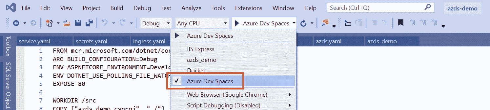

2.  选择 devspaces 演示 AKS 集群和默认空间，并将其标记为可公开访问，然后单击确定继续。
3.  AZDS 将构建 Dockerfile，安装 Helm 图表，并附加调试器。在 web 浏览器中，将自动打开 Ingress 公共端点—例如，[h](http://default.azds-demo.2dpkt6cj7f.weu.azds.io/)[t](http://default.azds-demo.2dpkt6cj7f.weu.azds.io/)[TP:/](http://default.azds-demo.2dpkt6cj7f.weu.azds.io/)[/default . azds-demo . 2d PKT 6 cj7f . weu . azds . io/](http://default.azds-demo.2dpkt6cj7f.weu.azds.io/)。

4.  在`HomeController.cs`文件中，在索引控制器动作中添加断点。在浏览器中刷新网页。您将看到断点被完全捕获，就像应用是在本地环境中调试的一样！
5.  停止调试并在`Index.cshtml`文件中引入一个变化。例如，将主标题更改为以下内容:

```
<h1 class="display-4">Welcome - Modified</h1>
```

6.  使用 Azure 开发空间配置再次启动应用。在“输出”窗口中，您将看到应用被快速重建，过了一会儿，带有修改后的主页的 web 浏览器再次打开:

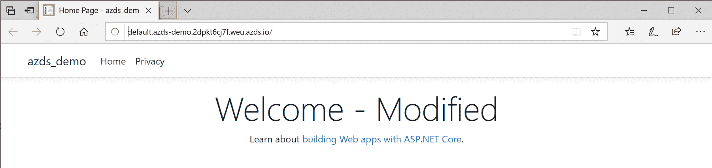

For more AZDS scenarios in team development, please check the official documentation at [https://docs.microsoft.com/en-us/azure/dev-spaces/team-development-netcore-visualstudio](https://docs.microsoft.com/en-us/azure/dev-spaces/team-development-netcore-visualstudio).

所有这些都直接发生在 AKS 集群上。正如您所看到的，在构建 Docker 映像、推送映像和推出新部署时，开发迭代比正常开发循环要快得多。

To delete the AKS cluster, use the `az group delete --name aks-windows-resource-group --yes` command.

恭喜你！您已经成功地为您的 AKS 集群设置了 Azure 开发空间。

# 摘要

本章重点介绍了作为一名开发人员，如何使用 Kubernetes 集群来改善您的开发体验。首先，我们学习了如何为 Visual Studio Code 和 Visual Studio 2019 配置必要的开发扩展。接下来，您学习了如何使用 Helm 打包 Kubernetes 应用，首先是使用微软 SQL Server 的官方 Helm 图表，然后是为我们的投票应用创建专用图表。

接下来，我们学习了如何将 Azure Application Insights 集成到您的应用中，以及如何利用快照调试器等高级功能来调试 Windows pods 生产场景中的问题。使用我们的新 Docker 映像和 Application Insights 工具，我们学习了如何执行 Helm 版本升级。我们介绍了 Kubernetes Dashboard，这是 Kubernetes 最常用的 web UI。最后，您学习了什么是 Azure Dev Spaces 服务，以及在使用 AKS 集群时如何使用它来提高开发迭代速度。

在下一章中，我们将集中讨论安全这个重要的话题，尤其是在 Windows 容器的上下文中。

# 问题

1.  什么是 Helm，为什么要用它？
2.  Helm 第二版和第三版最大的区别是什么？
3.  如何在 Helm 图表中实现实体框架数据库的自动迁移？
4.  如何执行作为 Helm 图表安装的应用新版本的首次展示？
5.  什么是快照调试器，如何在生产场景中使用它？
6.  为什么不建议您使用 Kubernetes Dashboard 来修改集群中的资源？
7.  使用 Azure Dev Spaces 有哪些优势？

你可以在本书的*评估*部分找到这些问题的答案。

# 进一步阅读

*   有关 Kubernetes 功能以及如何管理应用的更多信息，请参考以下 PacktPub 书籍:
    *   *完整的 kubernetes 指南*([https://www . packtpub . com/虚拟化与云/完整的 Kubernetes 指南](https://www.packtpub.com/virtualization-and-cloud/complete-kubernetes-guide))
    *   *Kubernetes 入门-第三版*([https://www . packtpub . com/虚拟化与云/入门-Kubernetes-第三版](https://www.packtpub.com/virtualization-and-cloud/getting-started-kubernetes-third-edition))
    *   *Kubernetes for Developers*([https://www . packtpub . com/虚拟化与云/kubernetes-developers](https://www.packtpub.com/virtualization-and-cloud/kubernetes-developers) )
*   如果您有兴趣了解更多关于 Azure 应用洞察的信息，请参考以下 PacktPub 书籍:
    *   *开发者手游 Azure*([https://www . packtpub . com/虚拟化与云/手游 Azure-开发者](https://www.packtpub.com/virtualization-and-cloud/hands-azure-developers))
    *   *Azure for Architects -第二版*([https://www . packtpub . com/virtual-and-cloud/Azure-Architects-第二版](https://www.packtpub.com/virtualization-and-cloud/azure-architects-second-edition))
*   有关 Helm 的更多信息，您可以查看以下 PacktPub 书籍:
    *   *掌握 Kubernetes -第二版*([https://www . packtpub . com/application-development/Mastering-Kubernetes-第二版](https://www.packtpub.com/application-development/mastering-kubernetes-second-edition))**