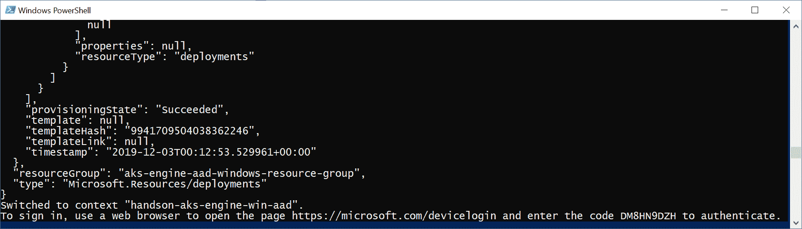
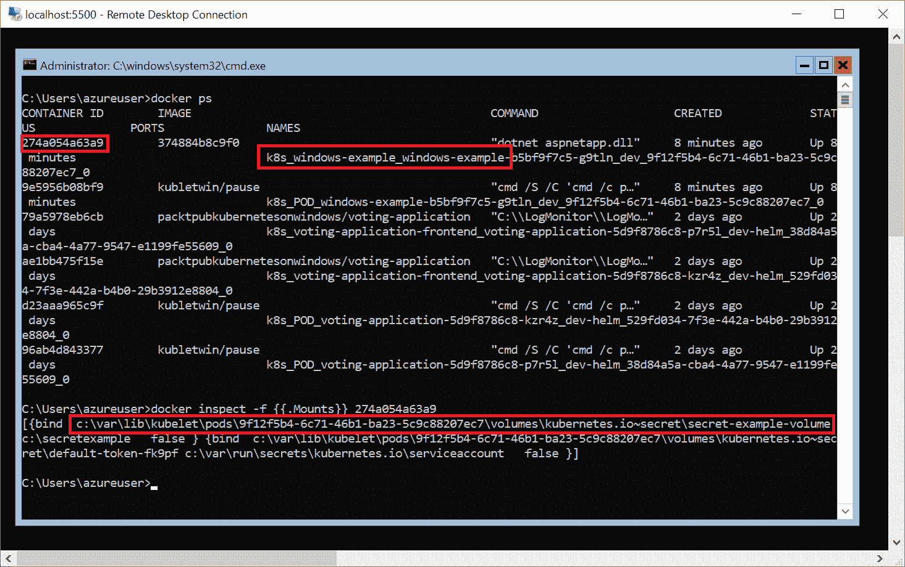
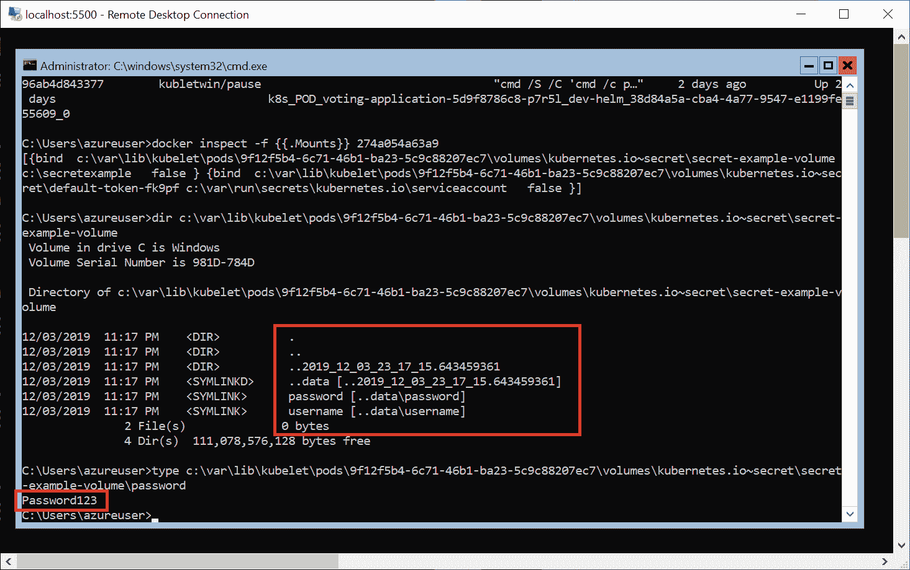

# 十三、保护 Kubernetes 集群和应用

安全的话题值得特别关注——Kubernetes 是一个庞大而复杂的系统，其安全性并不明显，潜在的**攻击向量**也不会立即可见。如果考虑到这个系统可以执行的强大操作，以及它与操作系统内部集成的深度，考虑 Kubernetes 中的安全性就更加重要。如果忽略配置细节，事情可能会变得更糟，为了说明这一点，请看一篇关于特斯拉是如何因 Kubernetes 仪表板([https://blog . hepio . com/on-secure-the-Kubernetes-Dashboard-16b 09 B1 B7 ACA](https://blog.heptio.com/on-securing-the-kubernetes-dashboard-16b09b1b7aca))的*公共*、*未经认证的*端点而被密码劫持的文章。

在本章中，我们将为您提供保护 Kubernetes 集群的一般最佳实践，包括 Windows 工作负载视角。Windows 节点有一些限制，例如，仅从节点存储(而不是内存)直接以明文形式装载机密，但它们在不同方面也比 Linux 节点更安全。

本章将涵盖以下主题:

*   保护Kubernetes集群
*   保护 Windows 上的容器运行时
*   使用网络策略部署安全应用
*   Windows 机器上的秘密

# 技术要求

在本章中，您将需要以下内容:

*   安装了 Windows 10 专业版、企业版或教育版(1903 版或更高版本，64 位)
*   Azure 帐户
*   使用 AKS 引擎部署的 Windows/Linux Kubernetes 集群

接下来，您将需要自己的 Azure 帐户，以便为 Kubernetes 集群创建 Azure 资源。如果您在前面几章中还没有创建帐户，您可以在[https://azure.microsoft.com/en-us/free/](https://azure.microsoft.com/en-us/free/)阅读更多关于如何获得个人使用的有限免费帐户的信息。

使用 AKS 引擎部署 Kubernetes 集群已经在[第 8 章](08.html)、*中介绍了部署混合 Azure Kubernetes 服务引擎集群*。

您可以从官方 GitHub 资源库[https://GitHub . com/PacktPublishing/hand-Kubernetes-On-Windows/tree/master/chapter 13](https://github.com/PacktPublishing/Hands-On-Kubernetes-on-Windows/tree/master/Chapter13)下载本书章节的最新代码示例。

# 保护Kubernetes集群

在本节中，我们将给出一些关于如何保护 Kubernetes 集群的一般指导。此外，我们将使用 **Azure 活动目录** ( **AAD** )集成来探讨 AKS 引擎集群中的 API 用户认证主题。本章提供的最佳实践列表并非详尽无遗，因此请务必查看最新的官方文档，以确保您遵循建议。

现在，让我们看一下以下小节中的一般建议列表。

# 使用内置 RBAC 进行授权

我们已经在[第 11 章](11.html)、*配置应用以使用 Kubernetes 功能*中介绍了 Kubernetes 为 API 授权提供的**基于角色的访问控制** ( **RBAC** )。这种机制允许您配置细粒度的权限集，并将其分配给用户、组和服务帐户。这样，作为集群管理员，您可以控制集群用户(内部和外部)如何与应用编程接口服务器交互，他们可以访问哪些应用编程接口资源，以及他们可以执行哪些操作。同时，您应该使用名称空间来创建资源之间的第一个边界。这也使得实施 RBAC 政策变得更加容易。

对于 RBAC 来说，使用最小特权原则，并且更喜欢将角色绑定分配给组，而不是单个用户，以减少管理开销。如果使用外部身份验证提供程序，您可以轻松地与该提供程序提供的组集成。引导集群时，建议您结合使用**节点限制**准入插件，同时使用节点和 RBAC 授权者(对应用编程接口服务器使用`--authorization-mode=Node,RBAC`参数)。这是 AKS 引擎初始化集群的默认方式。

# 使用外部身份验证提供程序

所有 API 调用都必须经过身份验证。对于外部(普通)用户以及内部 Kubernetes 基础设施的成员来说都是如此，例如 kubelet。在基础架构的情况下，此类用户通常使用带有令牌或 X509 客户端证书的服务帐户，这些证书是在引导群集时创建的。Kubernetes 本身不提供管理访问集群的正常外部用户的方法；这应该委托给可以与 Kubernetes 集成的外部身份验证提供者，例如，通过身份验证代理。

您应该选择适合您的组织并遵循用户通用访问模式的身份验证机制。例如，如果您正在运行 AKS 引擎，则很可能您已经在使用 Azure Active Directory 来管理您的 Azure 订阅中的用户和角色。除此之外，您应该考虑使用组来使 RBAC 策略管理更容易，并与 AAD 更集成。

Apart from AAD, authenticating proxies and authentication webhooks give you the possibility to integrate with different protocols, such as LDAP, SAML, or Kerberos.

在本节的最后，我们将演示如何为您的 AKS 引擎集群启用 AAD 集成。

# 使用 kubeadm 引导群集

如果是手动部署集群，使用**kube dam**，可以安全引导集群。它可以生成一个**自签名 CA** 为集群中的所有组件设置身份，生成**令牌**加入新节点(TLS 引导)，并提供**证书管理**功能([https://kubernetes . io/docs/tasks/administrator-cluster/kube dam/kube dam-certs/](https://kubernetes.io/docs/tasks/administer-cluster/kubeadm/kubeadm-certs/))。初始化一个**安全的** Kubernetes 集群是 kube dam 的最高设计优先级([https://github . com/Kubernetes/kube dam/blob/master/docs/design/design _ v 1.10 . MD](https://github.com/kubernetes/kubeadm/blob/master/docs/design/design_v1.10.md))。

# 禁用公共应用编程接口访问

对于生产场景，如果Kubernetes应用编程接口是公共可访问的，那么在Kubernetes应用编程接口的 RBAC 授权下使用适当的用户身份验证可能是不够的(从安全角度来看)。为了减少Kubernetes应用编程接口的攻击媒介，请考虑*禁用*公共应用编程接口访问，并且不要将任何Kubernetes节点直接暴露给互联网。当然，这需要您使用**虚拟专用网络**或**跳箱主机**来访问该应用编程接口，但它肯定更安全。

AKS 引擎可以通过对集群 apimodel 的简单更改来为您配置这一点。您可以在[官方文档中阅读更多关于禁用公共 API 访问的信息，网址为 https://github . com/Azure/aks-engine/blob/master/docs/tops/features . MD # private-cluster](https://github.com/Azure/aks-engine/blob/master/docs/topics/features.md#private-cluster)。或者，您可以考虑强化主虚拟机的 **NAT 入站规则**，限制允许通过 HTTPS 和 SSH 连接到机器的 IP 范围。

# 禁用公共仪表板

与 Kubernetes API 类似，您应该禁用可公开访问的 Kubernetes 仪表板。在常见安装中，仪表板可能作为负载平衡器服务公开；在最坏的情况下，这将发生在具有`cluster-admin`角色的 ServiceAccount 上。建议的做法是永远不要使用负载平衡器服务公开 Kubernetes Dashboard，并且始终使用`kubectl proxy`来访问页面。

此外，Kubernetes 仪表板的 ServiceAccount 应该具有最少的权限，这些权限足以满足您的用例。您很可能永远不会在生产环境中使用 Kubernetes Dashboard 来创建或编辑部署，那么为什么您需要对如此敏感的 API 资源进行写访问呢？

# 以非特权模式运行容器

在 Kubernetes 中，可以指定 pod 是否享有特权。特权POD可能具有以特权模式运行的容器，这实质上意味着容器可以访问主机上的所有设备，这类似于在主机上以 root(或管理)权限运行的进程。

确保 pod 容器在操作系统中以非特权模式运行是一个很好的做法；这遵循了最小特权原则。此外，您应该考虑使用 PodSecurityPolicy 接纳控制器来强制一组规则，pod 必须满足这些规则才能进行调度。限制性政策示例可在[https://raw . githubusercontent . com/kubernetes/网站/master/content/en/examples/policy/restricted-PSP . YAML](https://raw.githubusercontent.com/kubernetes/website/master/content/en/examples/policy/restricted-psp.yaml)上找到。

Please note that in the case of Windows containers, running privileged containers is not supported. Additionally, for Windows workloads, consider using **Group-Managed Service Accounts** (**gMSAs**, [https://kubernetes.io/docs/tasks/configure-pod-container/configure-gmsa/](https://kubernetes.io/docs/tasks/configure-pod-container/configure-gmsa/)).

# 加密静态数据

**对静态数据进行加密**被认为是所有系统的一般良好做法(有时也是法律强制要求)。在 Kubernetes 中，您需要确保 **etcd 集群**数据是加密的。这将为您的 API 资源和机密提供额外的安全层，否则这些资源和机密将以未加密的形式保存在 etcd 中。在[的官方 Kubernetes 文档中，静态加密机密作为一个单独的主题进行了介绍。](https://kubernetes.io/docs/tasks/administer-cluster/encrypt-data/)

对于秘密，您应该始终使用后期绑定，将秘密作为卷或环境变量注入到 pods 中。请注意，将秘密作为环境变量注入在 Linux 上不太安全；当您拥有 root 权限时，您可以从`/proc/<pid>/environ`开始枚举一个进程的所有环境变量。在 Windows 节点上，问题更加复杂:您仍然可以访问进程的环境变量，但是卷当前不能使用内存中的文件系统。这意味着机密将直接存储在节点磁盘存储上。这意味着您应该考虑加密您的 Windows 节点存储，以最大限度地减少凭据暴露。我们将在接下来的章节中研究这个问题。

# 使用网络策略

网络策略在您的 pods 之间充当防火墙，允许您控制进出容器化应用的网络访问。在 Kubernetes 集群中，默认情况下，pods 之间的网络通信没有限制——基本上，所有流量都是可能的。使用允许的网络策略模型是一种很好的做法，默认情况下，只有在定义了专用网络策略的情况下，才拒绝所有流量并允许连接。

您可以在[https://github . com/Azure/AKS-Engine/tree/master/examples/network policy](https://github.com/Azure/aks-engine/tree/master/examples/networkpolicy)的官方文档中阅读更多关于支持 AKS Engine 上可用的网络策略的网络提供商的信息。请注意，目前这些提供商不支持 Windows pods，除了作为 Tigera Essentials 订阅服务的一部分提供的企业版 Calico([https://www.tigera.io/media/pr-calico-for-windows](https://www.tigera.io/media/pr-calico-for-windows))。

# 保护映像供应链和扫描映像

在[第 3 章](03.html)、*处理容器映像*中，我们描述了如何使用 **Docker 内容信任** ( **DCT** )对您的 Docker 映像进行签名和验证。您肯定应该考虑在生产中对 Docker 映像管道使用这种方法。此外，考虑整合开源工具，如**Anchore**([https://github.com/anchore/anchore-engine](https://github.com/anchore/anchore-engine))和**Clair**([https://github.com/quay/clair](https://github.com/quay/clair))，它们可以帮助您识别常见漏洞和暴露( **CVEs** )并减轻它们。

# 轮换基础架构凭据和证书

一般来说，凭证或令牌的有效时间越短，攻击者就越难利用这种凭证。使用此原则为集群中使用的证书和令牌设置较短的生存期，并尽可能实现**自动循环**。当你察觉到自己受到攻击时，这可以成为你的秘密武器；如果可以有效地轮换证书，只需按需轮换证书，就可以使任何截获的凭据变得无用。

For AKS and AKS Engine, consider using integration with **Azure Key Vault**, which makes your secret and certificate management and rotation much easier. You can read more in the official documentation at [https://github.com/Azure/kubernetes-keyvault-flexvol](https://github.com/Azure/kubernetes-keyvault-flexvol).

此外，考虑集成一个身份验证提供程序，用于颁发到期时间较短的用户令牌。您可以使用这种方法来提供及时的特权访问管理，这可以极大地限制用户访问资源的时间。

# 启用审核日志记录

**审核日志**应该在生产集群中始终可用。这将有可能为访问异常和意外的应用编程接口调用设置监控和警报。越早检测到任何被禁止的应用编程接口响应，及时做出反应并阻止攻击者访问集群的机会就越大。您可以在[的官方文档中阅读更多关于 Kubernetes 审计的信息。](https://kubernetes.io/docs/tasks/debug-application-cluster/audit/)

Make sure you go through the official Kubernetes guide for securing a cluster when you set up a production cluster. You can find more details at [https://kubernetes.io/docs/tasks/administer-cluster/securing-a-cluster/](https://kubernetes.io/docs/tasks/administer-cluster/securing-a-cluster/).

现在，在我们了解了 Kubernetes 集群最重要的安全最佳实践之后，我们将了解如何在 AKS Engine 集群中启用**Azure Active Directory**(**AAD**)进行客户端身份验证。

# 将 AAD 与 AKS 引擎集成

AKS 引擎可以很容易地与 AAD 集成，以便提供 Kubernetes API 客户端身份验证。与 AAD **组**一起，这种方法可以用于为映射到 AAD 组的用户组创建角色绑定和集群角色绑定。

让我们看看如何通过 AAD 集成创建一个 AKS 引擎集群，并为集群管理员创建一个 AAD 组。这种方法可以扩展到管理多个在 RBAC 可以有不同绑定的 AAD 组。

Adding AAD integration to an existing AKS Engine cluster is not supported. Therefore, you need to make this decision at cluster deployment time.

为了您的方便，在[https://github . com/packt publishing/hand-Kubernetes-On-Windows/tree/master/chapter 13/01 _ akenginecreateaadprofile . PS1](https://github.com/PacktPublishing/Hands-On-Kubernetes-on-Windows/tree/master/Chapter13/01_AksEngineCreateAadProfile.ps1)上以 Powershell 脚本的形式提供了为服务器和客户端配置 AAD 应用的步骤，以及管理 AAD 组的创建。您可以使用该脚本或执行以下步骤:

1.  打开 PowerShell 窗口，用一个全局唯一的 DNS 前缀定义`$dnsPrefix`变量，稍后您将使用它来部署 AKS 引擎，例如:

```
$dnsPrefix = "handson-aks-engine-win-aad"
```

2.  创建一个 AAD 服务器应用，它将代表 Kubernetes API 服务器，并存储`appId`作为`$serverApplicationId`变量进一步使用:

```
$serverApplicationId = az ad app create `
 --display-name "${dnsPrefix}Server" `
 --identifier-uris "https://${dnsPrefix}Server" `
 --query appId -o tsv
```

3.  更新此应用的组成员资格声明:

```
az ad app update `
 --id $serverApplicationId `
 --set groupMembershipClaims=All
```

4.  创建将用于 Azure 平台身份验证的**服务主体**:

```
az ad sp create `
 --id $serverApplicationId
```

5.  获取服务主体的**秘密**，并将其存储为`$serverApplicationSecret`变量以供进一步使用:

```
$serverApplicationSecret = az ad sp credential reset `
 --name $serverApplicationId `
 --credential-description "AKSPassword" `
 --query password -o tsv
```

6.  现在，添加服务器应用读取目录数据、登录和读取用户配置文件的权限:

```
az ad app permission add `
 --id $serverApplicationId `
 --api 00000003-0000-0000-c000-000000000000 `
 --api-permissions e1fe6dd8-ba31-4d61-89e7-88639da4683d=Scope 06da0dbc-49e2-44d2-8312-53f166ab848a=Scope 7ab1d382-f21e-4acd-a863-ba3e13f7da61=Role
```

7.  授予权限:

```
az ad app permission grant `
 --id $serverApplicationId `
 --api 00000003-0000-0000-c000-000000000000 
az ad app permission admin-consent `
 --id $serverApplicationId
```

8.  接下来的步骤将是相似的，但将适用于代表 kubectl 的 AAD **客户端应用**。创建应用并存储`appId`作为`$clientApplicationId`变量进一步使用:

```
$clientApplicationId = az ad app create `
 --display-name "${dnsPrefix}Client" `
 --native-app `
 --reply-urls "https://${dnsPrefix}Client" `
 --query appId -o tsv
```

Depending on your AAD tenant configuration, you may require additional permissions to create the service principal. You can read more in the official documentation at [https://docs.microsoft.com/en-us/azure/active-directory/develop/howto-create-service-principal-portal#required-permissions](https://docs.microsoft.com/en-us/azure/active-directory/develop/howto-create-service-principal-portal#required-permissions).

9.  为应用创建服务主体:

```
az ad sp create `
 --id $clientApplicationId
```

10.  确定服务器应用的 OAuth2 标识并将其存储为`$oauth2PermissionId`:

```
$oauth2PermissionId = az ad app show 
 --id $serverApplicationId `
 --query "oauth2Permissions[0].id" -o tsv
```

11.  使用 OAuth2 标识允许客户端和服务器应用之间的身份验证流:

```
az ad app permission add `
 --id $clientApplicationId `
 --api $serverApplicationId `
 --api-permissions $oauth2PermissionId=Scope

az ad app permission grant `
 --id $clientApplicationId `
 --api $serverApplicationId
```

12.  为 AKS 引擎管理员创建一个名为`AksEngineAdmins`的 AAD 组，并将其标识存储为`$adminGroupId`变量:

```
$adminGroupId = az ad group create `
 --display-name AksEngineAdmins `
 --mail-nickname AksEngineAdmins `
 --query "objectId" -o tsv
```

13.  我们希望将当前用户添加到该组。首先，让我们为用户检索`objectId`并将其存储为`$currentUserObjectId`变量:

```
$currentUserObjectId = az ad signed-in-user show `
 --query "objectId" -o tsv
```

14.  将用户添加到 AKS 引擎管理员组:

```
az ad group member add `
 --group AksEngineAdmins `
 --member-id $currentUserObjectId
```

15.  确定您当前订阅的 AAD 租户标识，并将其存储为`$tenantId`变量:

```
$tenantId = az account show `
 --query "tenantId" -o tsv
```

16.  基于将在 AKS 引擎 apimodel 中使用的先前变量打印 JSON 对象:

```
echo @"
"aadProfile": {
 "serverAppID": "$serverApplicationId",
 "clientAppID": "$clientApplicationId",
 "tenantID": "$tenantId",
 "adminGroupID": "$adminGroupId"
}
"@
```

我们拥有部署带有 AAD 集成的 AKS 引擎所需的一切。为此，我们将使用一个 PowerShell 脚本，其方式几乎与我们在前面章节中使用的方式完全相同([https://github . com/packt publishing/动手-Kubernetes-On-Windows/blob/master/chapter 13/02 _ aks-engine-aad/createakengineclusterwitwindowsnodes . PS1](https://github.com/PacktPublishing/Hands-On-Kubernetes-on-Windows/blob/master/Chapter13/02_aks-engine-aad/CreateAKSEngineClusterWithWindowsNodes.ps1))以及 apimodel 模板([https://github . com/packt publishing/动手-Kubernetes-On-Windows/blob/master)要执行 AKS 引擎部署，请执行以下步骤:](https://github.com/PacktPublishing/Hands-On-Kubernetes-on-Windows/blob/master/Chapter13/02_aks-engine-aad/kubernetes-windows-template.json)

1.  下载 PowerShell 脚本和 apimodel 模板。
2.  在文件位置打开 PowerShell 窗口。
3.  在`kubernetes-windows-template.json`文件中，用上一段中自己的值替换`aadProfile`。
4.  使用适当的参数执行脚本:

```
.\CreateAKSEngineClusterWithWindowsNodes.ps1 `
 -azureSubscriptionId <azureSubscriptionId> `
 -dnsPrefix <dnsPrefix> `
 -windowsPassword 'S3cur3P@ssw0rd' `
 -resourceGroupName "aks-engine-aad-windows-resource-group" `
 -azureLocation "westus"
```

5.  几分钟后，脚本将执行`kubectl get pods`命令，并在网络浏览器中提示您*认证*:



6.  导航到网址，提供代码，然后登录。之后，您将在 Kubernetes API 服务器中成功通过身份验证，并能够使用 kubectl。

7.  要检查允许您访问的集群角色绑定的定义，请执行以下命令:

```
PS C:\src> kubectl describe clusterrolebinding aad-default-admin-group
Name:         aad-default-admin-group
Labels:       addonmanager.kubernetes.io/mode=EnsureExists
 kubernetes.io/cluster-service=true
Annotations:  <none>
Role:
 Kind:  ClusterRole
 Name:  cluster-admin
Subjects:
 Kind   Name                                  Namespace
 ----   ----                                  ---------
 Group  18d047eb-83f9-4740-96be-59555e88138f
```

根据您的需要，您现在可以配置更多的 AAD 组，创建角色并为它们提供适当的角色绑定。在下一节中，我们将了解如何确保 Windows 容器运行时安全运行。

# 在窗口中保护容器运行时

说到保护容器运行时，Windows 容器与 Linux 容器有点不同。对于 Windows 容器，操作系统使用一个`Job`对象(不要和 Kubernetes `Job`对象混淆！)**每个容器**有一个系统名称空间过滤器，用于给定容器中运行的所有进程。这提供了与主机的逻辑隔离，不能禁用。您可以在[第 1 章](01.html)、*创建容器中了解更多关于 Windows 容器架构的信息。*

这个事实有一个后果:**特权**容器在 Windows 中不可用，尽管它们在 Linux 中可用。此外，随着 Kubernetes 中对 Hyper-V 容器的支持，您将能够更好地保护容器运行时，并实施更好的隔离。

对于 Linux 容器**，**您可以考虑将`securityContext`用于 pod，以便作为**非特权**用户(具有不同于`0`的标识)运行:

```
apiVersion: v1
kind: Pod
metadata:
  name: secured-pod
spec:
  securityContext:
    runAsUser: 1000
```

此外，您可以实施 **PodSecurityPolicies** ，这些策略在调度 pod 之前由准入控制器验证。通过这种方式，作为一个例子，您可以确保给定命名空间中没有 pods 以特权模式运行。您必须使用 RBAC 来正确配置策略访问。

AKS Engine comes by default with the PodSecurityPolicy admission controller enabled and **privileged** and **restricted** policies available.

对于 Windows 容器，标准`securityContext`将不起作用，因为它意味着用于 Linux 容器。Windows 容器在`securityContext`内部有一个名为`windowsOptions`的专用对象，可以启用一些当前仍处于 **alpha** 状态的特定于 Windows 的功能:

*   使用不同的用户名配置正在运行的 pod 容器([https://kubernetes . io/docs/tasks/configure-pod-container/configure-runasusername/](https://kubernetes.io/docs/tasks/configure-pod-container/configure-runasusername/))。
*   为 pod 容器配置组管理的服务帐户(GMsa)([https://kubernetes . io/docs/tasks/configure-pod-container/configure-GMsa/](https://kubernetes.io/docs/tasks/configure-pod-container/configure-gmsa/))。gMSA 是一种特定类型的活动目录帐户，它提供自动密码管理、简化的服务主体名称管理以及将管理委托给多台服务器上的其他管理员的能力。Azure Active Directory 附带对 gMSA 的支持([https://docs . Microsoft . com/en-us/azure/Active-Directory-domain-services/create-gMSA](https://docs.microsoft.com/en-us/azure/active-directory-domain-services/create-gmsa))。

在下一节中，您将了解更多关于网络策略的信息，以及如何使用这些策略在 Kubernetes 上部署更安全的应用。

# 使用网络策略部署安全应用

在 Kubernetes 中，您可以使用网络策略在网络隔离方面为应用部署提供更好的粒度。由`NetworkPolicy`对象表示，它们定义了多组POD如何相互通信以及一般的网络端点——可以将它们视为在 OSI 模型的第 3 层实施网络分段的基本防火墙。当然，它们不是高级的替代品

`NetworkPolicy`对象使用标签选择器来识别它们所连接的豆荚。类似地，标签选择器和 IP CIDRs 用于定义这些单元的入口和出口规则目标。只有当给定的网络策略具有与给定 pod 匹配的标签选择器时，才使用该策略。如果没有与给定 Pod 匹配的网络策略，它可以接受任何流量。

# 网络策略支持

要使用网络策略，您需要使用支持网络策略的其中一个**网络提供商**(用于安装 pod 网络，如[第 5 章](05.html)、 *Kubernetes Networking* 所述)。最受欢迎的如下:

*   印花布([https://www.projectcalico.org/](https://www.projectcalico.org/))
*   纤毛([https://cilium.io/](https://cilium.io/))
*   Kube 路由器([https://www . kube-router . io/](https://www.kube-router.io/)
*   罗马( [https://romana.io/](https://romana.io/)
*   织网([https://www.weave.works/docs/net/latest/overview/](https://www.weave.works/docs/net/latest/overview/))

遗憾的是目前没有*也没有*网络提供商支持 Windows 节点，这意味着你只能在 Linux 集群中使用网络策略。唯一宣布支持 Windows 节点和网络策略的网络提供商是企业版的 Calico，它是作为 **Tigera Essentials** 订阅服务([https://www.tigera.io/media/pr-calico-for-windows](https://www.tigera.io/media/pr-calico-for-windows))的一部分提供的。您目前可以在私有预览版本中尝试此产品，包括 Windows 节点支持。请注意，如果您使用的是 AKS 或 AKS Engine，则仅限于 Calico 或 Cilium，与 **A** **zure** 或 **kubenet** 网络 CNI 插件协同工作。

For more details regarding AKS Engine configuration for network policy support, please refer to the official documentation at [https://github.com/Azure/aks-engine/tree/master/examples/networkpolicy](https://github.com/Azure/aks-engine/tree/master/examples/networkpolicy). Additionally, for managed AKS, you may consider using an **advanced networking** feature that allows you to configure your own VNet, define Azure network security groups, and provide automatic connectivity of your pods to the VNet—you can read more in the official documentation at [https://docs.microsoft.com/en-us/azure/aks/configure-azure-cni](https://docs.microsoft.com/en-us/azure/aks/configure-azure-cni.).

让我们看看如何使用网络策略在集群中实施 pod 隔离。

# 配置网络策略

从安全角度来看，网络策略很重要，因为默认情况下，Kubernetes 允许集群中的**全对全**通信。名称空间只提供简单的隔离，仍然允许 pods 通过 IP 地址相互通信。在较大的集群或多租户场景中，您必须提供更好的网络隔离。尽管 Windows 节点尚不支持网络策略(但最终它们**将得到支持)，我们认为让您了解如何使用本机 Kubernetes 构造来实现网络分段非常重要。**

 **如果你有一个 AKS Engine Linux 集群，它在 Azure CNI 插件上有一个 Calico 网络，你可以跟随它并为你的 pods 配置网络策略。部署具有这种配置的 AKS 引擎需要对集群 apimodel 进行简单的更改，即通过在`properties.orchestratorProfile`中添加以下属性:

```
"kubernetesConfig": {
    "networkPolicy": "calico",
    "networkPlugin": "azure"
}
```

现在，我们将创建一个网络策略*来阻止所有进入*到`default`命名空间中所有豆荚的流量。这与默认情况下集群中的情况相反——除非您特别允许，否则命名空间中的 pods 将无法相互通信。之后，我们将在负载平衡器服务后面部署一个简单的 Nginx web 服务器，并尝试从集群中的不同 pod 内部和 Azure 负载平衡器外部进行通信。然后，我们将创建一个网络策略，作为网络服务器的 TCP 端口 80 的**白名单规则**。请通过以下步骤创建默认的全部拒绝规则并部署 Nginx web 服务器:

1.  为`NetworkPolicy`对象创建一个`default-deny-all-ingress.yaml`清单文件，拒绝所有进入`default`命名空间中的 pods 的流量:

```
apiVersion: networking.k8s.io/v1
kind: NetworkPolicy
metadata:
  namespace: default
  name: default-deny-all-ingress
spec:
  podSelector: {}
  policyTypes:
  - Ingress
```

这是通过使用空的`podSelector`来实现的，它将选择所有的POD。

2.  使用`kubectl apply -f .\default-deny-all-ingress.yaml`命令应用清单文件。
3.  如果您想更好地了解网络策略的效果，可以对任何网络策略使用以下命令:

```
kubectl describe networkpolicy default-deny-all-ingress
```

4.  为 Nginx 部署创建一个名为`nginx-deployment.yaml`的简单清单文件:

```
apiVersion: apps/v1
kind: Deployment
metadata:
  namespace: default
  name: nginx-deployment
spec:
  selector:
    matchLabels:
      app: nginx
  replicas: 2
  template:
    metadata:
      labels:
        app: nginx
    spec:
      containers:
      - name: nginx
        image: nginx:1.7.9
        ports:
        - containerPort: 80
```

5.  使用`kubectl apply -f .\nginx-deployment.yaml`命令应用清单文件。
6.  为部署的负载平衡器服务创建`nginx-service.yaml`清单文件:

```
apiVersion: v1
kind: Service
metadata:
  namespace: default
  name: nginx-service
  labels:
    app: nginx
spec:
  type: LoadBalancer
  ports:
  - protocol: TCP
    port: 80
  selector:
    app: nginx
```

7.  使用`kubectl apply -f .\nginx-service.yaml`命令应用清单文件。

Be careful when defining very restrictive egress rules. With deny-all egress rules, you will block access to the Kubernetes DNS service for the pods.

部署我们的 Nginx 网络服务器，并使用默认规则拒绝所有进入`default`命名空间中的 pods 的流量，我们可以测试与网络服务器的连接:

1.  使用`kubectl get svc -w`等待服务的外部 IP 出现，并在网页浏览器中打开该地址。您将看到连接挂起并最终超时，这是意料之中的。
2.  让我们使用一个运行在同一个名称空间中的特设 pod 来检查这一点。在交互模式下创建一个`busybox`POD，运行伯恩外壳:

```
kubectl run --generator=run-pod/v1 busybox-debug -i --tty --image=busybox --rm --restart=Never -- sh
```

4.  在 pod 的 shell 会话中，尝试获取由 Nginx 托管的网页。您可以同时使用服务域名和其中一个POD的 IP。在这两种情况下，它都将失败:

```
wget http://nginx-service:80
wget http://10.240.0.30:80
```

现在，让我们创建一个网络策略，允许入站流量进入 TCP 端口`80`上的 Nginx pods。之后，您将能够从集群中的两个单元以及 Azure 负载平衡器进行通信。要配置策略，请执行以下步骤:

1.  让`busybox`交互会话保持运行，并打开一个新的 PowerShell 窗口。
2.  创建一个`default-nginx-allow-ingress.yaml`清单文件，允许 TCP 端口`80`上的入口流量从所有来源到达所有带有标签`app=nginx`的豆荚:

```
apiVersion: networking.k8s.io/v1
kind: NetworkPolicy
metadata:
  namespace: default
  name: default-nginx-allow-ingress
spec:
  podSelector:
    matchLabels:
      app: nginx
  ingress:
  - from: []
    ports:
    - protocol: TCP
      port: 80
```

3.  使用`kubectl apply -f .\default-nginx-allow-ingress.yaml`命令应用清单文件。
4.  在网络浏览器中，再次导航到该服务的外部 IP。现在，你应该可以毫无问题地到达网页了！
5.  同样，使用`wget`在`busybox`豆荚容器中进行同样的尝试。您还可以访问网页。
6.  作为练习，为了证明端口过滤工作正常，您可以修改网络策略以使用不同的端口，或者在不同于`80`的 TCP 端口上运行 Nginx。

恭喜你！您已成功使用网络策略在 Kubernetes 群集中配置许可网络规则。从*许可的*网络策略模型开始是一个很好的做法，在该模型中，您*拒绝所有进入您的 pods 的*流量(有时也包括来自 pods 的所有出口流量)，并通过特定的网络策略允许连接。请注意，为此，您应该使用命名约定以可预测的方式组织网络策略。这将使管理您的网络规则变得更加容易。

在下一节中，我们将探讨您应该如何在 Windows 机器上处理 Kubernetes 秘密。

# Windows 机器上的秘密

在[第 4 章](04.html)、 *Kubernetes 概念和 Windows 支持*中，我们提到了 Windows 的一个节点支持限制，即作为卷装载到 pods 的 Kubernetes 秘密是以*明文*的形式写在节点磁盘存储(不是 RAM 内存)上的。原因是 Windows 目前不支持将内存中的文件系统装载到 pod 容器中。这可能会带来安全风险，需要采取额外措施来保护群集。同时，将秘密作为环境变量挂载也有其自身的安全风险——如果您可以访问系统，您可以为进程枚举环境变量。在能够从内存文件系统中以卷的形式装载机密之前，除了使用第三方提供程序(如 Azure Key Vault)之外，没有完全安全的解决方案来为 Windows 容器注入机密。

Encryption of secrets *at rest* in a Kubernetes etcd cluster is a different and important topic that is covered in the official documentation at [https://kubernetes.io/docs/tasks/administer-cluster/encrypt-data/](https://kubernetes.io/docs/tasks/administer-cluster/encrypt-data/).

让我们做一个小实验来更好地理解这个问题和任何可能的影响。您将需要带有我们在前面章节中使用的窗口节点的 AKS 引擎集群。请完成以下步骤:

1.  打开 PowerShell 窗口，创建一个`secret-example.yaml`清单文件，其中包含以 Base64 编码的用户名`admin`和密码`Password123`:

```
apiVersion: v1
kind: Secret
metadata:
  name: secret-example
type: Opaque
data:
  username: YWRtaW4=
  password: UGFzc3dvcmQxMjM=
```

2.  使用 `kubectl apply -f .\secret-example.yaml` 命令应用清单文件。
3.  为在 Windows 上运行的示例 ASP.NET 应用的部署创建`windows-example-deployment.yaml`清单文件，其中`secret-example`秘密安装在 pod 上的`C:\SecretExample`目录中:

```
apiVersion: apps/v1
kind: Deployment
metadata:
  name: windows-example
  labels:
    app: sample
spec:
  replicas: 1
  selector:
    matchLabels:
      app: windows-example
  template:
    metadata:
      name: windows-example
      labels:
        app: windows-example
    spec:
      nodeSelector:
        "beta.kubernetes.io/os": windows
      containers:
      - name: windows-example
        image: mcr.microsoft.com/dotnet/core/samples:aspnetapp-nanoserver-1809
        ports:
          - containerPort: 80
        volumeMounts:
        - name: secret-example-volume
          mountPath: C:\SecretExample
          readOnly: true
      volumes:
      - name: secret-example-volume
        secret:
          secretName: secret-example
```

4.  使用`kubectl apply -f .\windows-example-deployment.yaml`命令应用清单文件。
5.  使用`kubectl get pods -o wide`命令确定哪个窗口节点正在运行 pod。在我们的情况下，就是`2972k8s011`。
6.  按照第 8 章*中【连接到虚拟机】小节*中【部署混合 Azure Kubernetes 服务引擎集群*的说明，创建到节点`2972k8s011`的远程桌面连接。*
7.  当命令行提示符初始化时，使用`docker ps`命令来标识运行我们的应用的 Docker 容器的 ID。接下来，运行`docker inspect -f {{.Mounts}} <containerID>`命令，在*主机的*磁盘存储器上获取 Docker 卷数据的*物理*位置:



8.  现在，只需使用此路径，检查目录内容，并使用`type <filePath>`命令显示映射到我们的秘密对象中的`password`键的文件内容:



如您所见，我们已经毫无问题地检索了`Password123`值。在一个使用内存中的 tmpfs(T2)文件系统将卷装入机密的 Linux 系统上，这并不容易！

这种当前的设计有一个明显的安全问题:无论谁设法访问节点磁盘存储数据，都可以在*纯文本*中获得您的秘密(当前使用的)。这不仅涉及对机器本身(物理或远程)的访问，还涉及存储 Docker 卷的磁盘的*备份*。

为了缓解这个问题，至少在某种程度上，您应该对 Windows 节点磁盘使用*磁盘加密*。在内部部署的情况下，可以考虑使用 BitLocker，它在 Windows 服务器操作系统上具有本机支持；您可以在[的官方文档中找到更多详细信息。](https://docs.microsoft.com/en-us/windows/security/information-protection/bitlocker/bitlocker-how-to-deploy-on-windows-server)

对于 Azure 部署来说，好消息是 Azure 虚拟机磁盘在 Azure 数据中心中总是*加密。如果您的场景要求您在虚拟机操作系统级别提供加密，则托管 AKS([https://github.com/Azure/AKS/issues/629](https://github.com/Azure/AKS/issues/629))尚不支持此功能，对于 AKS Engine，默认情况下创建的节点虚拟机没有加密(您不能在集群 apimodel 中控制它们)，但您可以自己手动启用。您可以在[官方文档中阅读更多关于 Windows 虚拟机加密的场景。](https://docs.microsoft.com/en-us/azure/virtual-machines/windows/disk-encryption-windows)*

为了演示如何手动加密 Windows 节点磁盘，让我们为集群中的一个节点`2972k8s011`打开加密:

1.  打开 PowerShell 窗口，创建一个名为`AksEngineEncryptionVault`的 Azure 密钥库:

```
az keyvault create `
 --resource-group "aks-engine-windows-resource-group" `
 --name "AksEngineEncryptionVault" `
 --location "westeurope"
```

2.  为 Azure 虚拟机启用用于磁盘加密的密钥库:

```
az keyvault update `
 --resource-group "aks-engine-windows-resource-group" `
 --name "AksEngineEncryptionVault" `
 --enabled-for-disk-encryption "true"
```

3.  为安装到虚拟机的`All`磁盘启用`2972k8s011`节点加密:

```
az vm encryption enable `
 --resource-group "aks-engine-windows-resource-group" `
 --name "2972k8s011" `
 --disk-encryption-keyvault "AksEngineEncryptionVault" `
 --volume-type All
```

4.  加密过程完成后，检查加密功能的当前状态:

```
PS C:\src> az vm encryption show `
>>            --resource-group "aks-engine-windows-resource-group" `
>>            --name "2972k8s011"
{
 "disks": [
 {
 ...
 "name": "2972k8s011_OsDisk_1_1986c424c52c46a39192cdc68c9b9cb9",
 "statuses": [
 {
 "code": "EncryptionState/encrypted",
 "displayStatus": "Encryption is enabled on disk",
 "level": "Info",
 "message": null,
 "time": null
 }
 ]
 }
 ]
}
```

这个过程必须对集群中的所有窗口节点重复，并且每当您扩展集群时都要重复。

恭喜你！您已经成功加密了一个 Windows 节点磁盘，以提高 Kubernetes 的秘密安全性。

# 摘要

本章主要介绍了 Kubernetes 的安全性。我们为您提供了保护 Kubernetes 集群的 11 项建议和最佳实践，从使用 RBAC 并集成外部身份验证提供程序(如 Azure Active Directory)，到禁用 Kubernetes API 和仪表板的公共访问并启用审核日志记录。我们演示了如何使用 Azure 活动目录集成在 AKS 引擎集群上简化您的 RBAC 管理和身份验证。接下来，我们讨论了如何在 Kubernetes 中保护容器运行时的安全，以及网络策略的作用(Windows 节点尚不支持)。

最后，您了解了在 Linux 和 Windows 机器上注入 Kubernetes 秘密之间的差异，并看到，在当前的设计下，在 Windows 机器上访问秘密更容易，并且会导致安全问题。为了缓解这种情况，我们向您展示了如何为用作集群中 Windows 节点的 Azure 虚拟机加密磁盘。

在下一章中，我们将重点讨论如何监控 Kubernetes 集群，尤其是 Windows 节点和。在视窗节点上运行的应用。

# 问题

1.  为什么要在 Kubernetes 中使用外部身份验证提供程序，比如 AAD？
2.  为什么禁止公众访问 Kubernetes 仪表板很重要？
3.  建议加密 etcd 静态数据存储的原因是什么？
4.  你能在 Windows 机器上运行特权容器吗？
5.  Kubernetes 中有哪些网络策略，启用这些策略的先决条件是什么？
6.  在将机密装载为卷方面，Linux 和 Windows 节点的主要区别是什么？
7.  为什么将秘密作为环境变量注入被认为不如使用卷安全，尤其是在 Linux 节点上？

你可以在本书的*评估*中找到这些问题的答案。

# 进一步阅读

*   有关 Kubernetes 安全性的更多信息，请参考以下 PacktPub 书籍:
    *   *Com**plette Kubernetes 指南*([https://www . packtpub . Com/虚拟化与云/complete-kubernetes-guide](https://www.packtpub.com/virtualization-and-cloud/complete-kubernetes-guide) )。
    *   *Kubernetes 入门-第三版*([https://www . packtpub . com/虚拟化与云/入门-Kubernetes-第三版](https://www.packtpub.com/virtualization-and-cloud/getting-started-kubernetes-third-edition))。
    *   *Kubernetes fo**r Developers*([https://www . packtpub . com/虚拟化与云/kubernetes-developers](https://www.packtpub.com/virtualization-and-cloud/kubernetes-developers) )。**