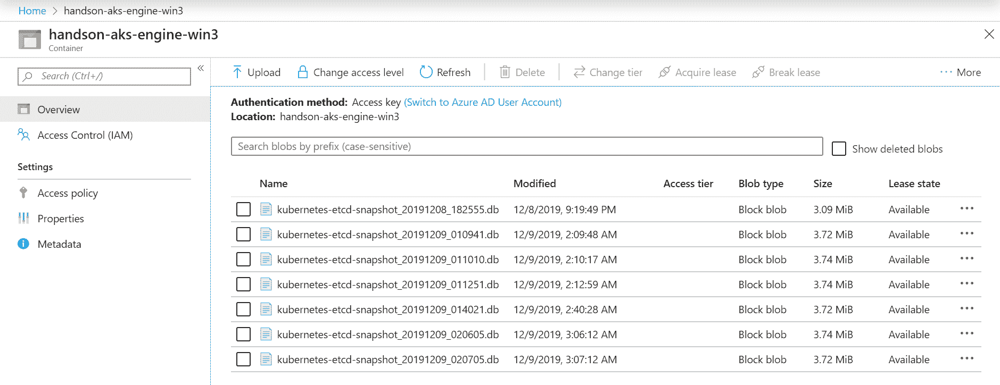

# 十五、灾难恢复

在每个生产系统中，**灾难恢复** ( **灾难恢复**)和**业务连续性** ( **BC** )是您必须牢记的关键概念，以便提供应用工作负载的可用性。在规划集群架构的早期阶段，您必须考虑到它们。谚语*未能做好准备，你就准备失败*对于操作分布式系统来说再正确不过了，比如 Kubernetes。本章将重点介绍运行 Kubernetes 集群时的灾难恢复。本章不包括业务连续性最佳实践，如多区域部署和持久卷的异步复制。

一般而言，灾难恢复由一套策略、工具和程序组成，用于在自然或人为灾难发生后恢复或延续重要的技术基础架构和系统。您可以在[https://cloud . Google . com/solutions/DR-scenarios-planning-guide](https://cloud.google.com/solutions/dr-scenarios-planning-guide)上的一篇优秀文章中阅读更多关于灾难恢复规划所涉及的概念。灾难恢复和业务连续性之间的主要区别在于，灾难恢复侧重于在停机后启动和运行基础架构，而业务连续性处理的是在重大事故期间保持业务场景的运行。Kubernetes 中关于灾难恢复的重要一点是，您基本上可以专注于集群的数据和状态保护:您需要有状态组件的备份和恢复策略。在 Kubernetes 集群中，最重要的有状态组件是 etcd 集群，它是 Kubernetes API 服务器的存储层。

在本章中，我们将涵盖以下主题:

*   Kubernetes 集群备份策略
*   备份 etcd 集群
*   正在恢复 etcd 集群备份
*   自动备份
*   替换失败的 etcd 集群成员

# 技术要求

在本章中，您将需要以下内容:

*   安装了 Windows 10 专业版、企业版或教育版(1903 版或更高版本，64 位)
*   安装在你的电脑上的 SSH 客户端
*   Azure 帐户
*   使用 AKS 引擎或本地集群部署的多主 Windows/Linux Kubernetes 集群(适用于某些场景)

接下来，您将需要自己的 Azure 帐户，以便为 Kubernetes 集群创建 Azure 资源。如果您还没有创建前面章节的帐户，您可以在[https://azure.microsoft.com/en-us/free/](https://azure.microsoft.com/en-us/free/)阅读更多关于如何获得个人使用的有限免费帐户的信息。

使用 AKS 引擎部署 Kubernetes 集群已经在[第 8 章](08.html)、*中介绍了部署混合 Azure Kubernetes 服务引擎集群*。

您可以从官方 GitHub 资源库[https://GitHub . com/PacktPublishing/hand-Kubernetes-On-Windows/tree/master/chapter 15](https://github.com/PacktPublishing/Hands-On-Kubernetes-on-Windows/tree/master/Chapter15)下载本章的最新代码示例。

# Kubernetes 集群备份策略

Kubernetes 的灾难恢复本质上涉及创建集群状态备份和恢复策略。我们先来看看 Kubernetes 中有哪些有状态组件:

*   Etcd 集群([https://etcd.io/](https://etcd.io/))保持 Kubernetes API 服务器资源的状态。
*   POD使用的持久卷。

而令人惊讶的是(还是*不是*，仅此而已！对于在工作节点上运行的主节点组件和 pods，不涉及任何不可恢复的状态；如果您调配新的替换节点，Kubernetes 可以轻松地将工作负载移动到新节点，从而提供完全的业务连续性。当您的 etcd 集群恢复时，Kubernetes 将负责协调集群组件的状态。

让我们看看如何备份和恢复持久卷。这完全取决于如何调配持久卷。您可以依赖外部存储的标准文件系统备份，或者，对于云备份的 PVs，您可以使用磁盘快照，并将它们作为云服务的一部分进行管理。对于使用 CSI 插件提供的 PVs，还有一个有趣的快照和恢复功能(目前处于 alpha 状态)。这将直接在 Kubernetes 集群级别提供更好的备份和恢复集成。

There is a general rule of thumb to keep your cluster workloads as stateless as possible. Think about using external, managed services to store your data (for example, Azure blob storage, Azure Cosmos DB) for which availability and data reliability are guaranteed by SLAs.

对于 etcd 集群，备份和恢复策略取决于两个因素:存储 etcd 数据的方式和 Kubernetes masters 的高可用性拓扑。在 etcd 数据存储的情况下，情况类似于持久卷。如果使用云卷装载存储，可以依赖云服务提供商提供的磁盘快照(AKS Engine 就是这种情况)，对于自我管理的磁盘，可以采用标准文件系统备份策略。在所有情况下，您还有第三个选择:您可以使用 etcd 本身的快照功能。稍后我们将向您展示如何使用`etcdctl`命令执行 etcd 的快照和恢复。

关于 Kubernetes 主服务器的高可用性拓扑，如[第 4 章](04.html)、 *Kubernetes 概念和 Windows 支持*中所述，您可以为 etcd 运行**堆叠**拓扑或**外部**拓扑。在堆叠拓扑中，etcd 成员在每个*主节点上作为 Kubernetes pod 运行。对于外部拓扑，您在 Kubernetes 集群之外运行一个 etcd 集群。它可以完全在外部，部署在单独的专用主机上，也可以与主节点共享相同的主机。后者是 AKS Engine 的情况:它运行外部拓扑，但是每个主节点都作为本地 Linux 服务托管一个 etcd 成员。对于这两种拓扑，您可以用相同的方式执行备份；唯一的区别在于如何执行恢复。在通常用于**kube DM**部署的堆叠拓扑中，您需要在覆盖本地 etcd 存储的新节点上执行`kubeadm init`。对于外部拓扑，您可以简单地使用`etcdctl`命令。*

An external topology for an etcd cluster has more components but is generally better at providing business continuity and disaster recovery.

此外，如果您运行的是 AKS Engine 集群，您可以考虑使用 Azure Cosmos DB([https://azure.microsoft.com/en-us/services/cosmos-db/](https://azure.microsoft.com/en-us/services/cosmos-db/))来代替自我管理的 etcd 集群。Cosmos DB 支持公开一个 etcd API，可以作为 Kubernetes 的后备存储，其方式与本地 etcd 集群完全相同。通过这种方式，您可以在服务级别协议中定义的级别获得全局分布、高可用性、弹性扩展和数据可靠性。除此之外，您还可以通过地理复制进行自动在线备份。您可以在[的官方文档中了解更多关于这个特性以及如何在集群 apimodel 中配置它的信息。](https://github.com/Azure/aks-engine/tree/master/examples/cosmos-etcd)

现在，我们将了解如何备份您的 etcd 集群。

# 备份 etcd 集群

备份 etcd 集群的过程很简单，但是有多种方法可以完成这项任务:

*   为 etcd 创建存储磁盘的备份或快照。这在云场景中尤其有效，在云场景中，您可以轻松管理 Kubernetes 集群之外的备份。
*   使用`etcdctl`命令执行 etcd 的手动快照。您需要自己管理备份文件:将它们上传到外部存储，并应用保留策略。
*   使用 **Velero** (原 hepio Ark([https://velero.io/](https://velero.io/)))，可以执行快照，在外部存储中进行管理，并在需要时进行恢复。此外，它还可以使用 **Restic** 集成([https://velero.io/docs/master/restic/](https://velero.io/docs/master/restic/))来执行持久卷的备份。
*   使用**etcd-operator**([https://github.com/coreos/etcd-operator](https://github.com/coreos/etcd-operator))在 Kubernetes 上调配 etcd 集群。您可以轻松管理 etcd 集群并执行备份-恢复操作。如果您计划在您的环境中管理多个 Kubernetes 集群，请使用这种方法。

我们将演示第二个选项，执行 etcd 的手动快照——在切换到高级自动化(如 Velero)之前，了解引擎盖下到底发生了什么通常是件好事。对于这个任务，您将需要一个多主 Kubernetes 集群；你可以使用 AKS 引擎创建一个。与前几章一样，您可以在[https://Github . com/PacktPublishing/hand-On-Kubernetes-On-Windows/blob/master/chapter 15/01 _ multimaster-aks-engine/Kubernetes-Windows-template . JSON](https://github.com/PacktPublishing/Hands-On-Kubernetes-on-Windows/blob/master/Chapter15/01_multimaster-aks-engine/kubernetes-windows-template.json)处使用 Github . com/PacktPublishing/hand-Kubernetes-On-Windows/blob/master/chapter 使用我们常用的 PowerShell 脚本进行部署该定义将部署三个主节点以及一个 Linux 工作节点和一个 Windows 节点。

Please make sure that you check the estimated costs of hosting a five-node Kubernetes cluster on Azure. The price will depend on the region in which you deploy it.

当集群准备就绪时，部署一个应用工作负载，例如前面章节中的投票应用。然后，通过以下步骤创建 etcd 快照:

1.  使用以下命令打开 PowerShell 窗口，并将 SSH 连接到其中一个主节点:

```
ssh azureuser@<dnsPrefix>.<azureLocation>.cloudapp.azure.com
```

2.  检查您的 Kubernetes 集群配置。使用`kubectl cluster-info dump`命令了解有关 etcd 设置的更多信息。您将看到每个主节点都在运行自己的 etcd 本地实例(但在集群外部)，该实例作为参数传递给 Kubernetes API 服务器:

```
azureuser@k8s-master-50659983-0:~$ kubectl cluster-info dump
...
 "--etcd-servers=https://127.0.0.1:2379",
...
```

3.  使用`etcdctl`命令获取 etcd 集群的拓扑，该集群在主节点上有成员:

```
azureuser@k8s-master-50659983-0:~$ sudo etcdctl cluster-health
member b3a6773c0e93604 is healthy: got healthy result from https://10.255.255.5:2379
member 721d9c3882dbe6f7 is healthy: got healthy result from https://10.255.255.7:2379
member 72b3415f69c52b2a is healthy: got healthy result from https://10.255.255.6:2379
cluster is healthy
```

您可以检查这些是否是 Azure 门户中主节点的私有 IP 地址。

4.  执行以下命令以创建 etcd 的快照:

```
sudo mkdir -p /backup
ETCDCTL_API=3 sudo -E etcdctl \
 --endpoints=https://127.0.0.1:2379 \
 --cacert=/etc/kubernetes/certs/ca.crt \
 --cert=/etc/kubernetes/certs/etcdclient.crt \
 --key=/etc/kubernetes/certs/etcdclient.key \
 --debug \
 snapshot save \
 /backup/kubernetes-etcd-snapshot_$(date +"%Y%m%d_%H%M%S").db
```

5.  过一会儿，备份应该就完成了。您可以使用以下命令检查备份状态:

```
azureuser@k8s-master-50659983-0:~$ ETCDCTL_API=3 sudo -E etcdctl --write-out=table snapshot status /backup/kubernetes-etcd-snapshot_20191208_182555.db
+----------+----------+------------+------------+
|   HASH   | REVISION | TOTAL KEYS | TOTAL SIZE |
+----------+----------+------------+------------+
| b4422ea6 |    28331 |       1034 |     3.2 MB |
+----------+----------+------------+------------+
```

Additionally, you should back up the certificates and keys used to access the etcd cluster. In our scenario, it will not be needed because we are going to restore the same master machines. For a general disaster-recovery scenario, you will need them.

准备好备份后，让我们看看如何将文件上传到 Azure blob 存储。请注意，您*不应该*直接在生产主机上执行这些操作，尤其是在快速安装 Azure CLI *时*。我们演示这一点是为了以后创建一个 Kubernetes **CronJob** ，它将运行一个 Docker 容器来执行这些操作。请为您的开发集群执行以下步骤:

1.  在本地机器上打开一个 PowerShell 窗口，使用`az login`命令登录 Azure。

2.  创建一个服务主体，我们将使用它将备份上传到 Azure blob 存储容器:

```
PS C:\src> az ad sp create-for-rbac `
 --role="Storage Blob Data Contributor" `
 --scopes="/subscriptions/<azureSubscriptionId>/resourceGroups/<aksEngineResourceGroupName>"

Creating a role assignment under the scope of "/subscriptions/cc9a8166-829e-401e-a004-76d1e3733b8e/resourceGroups/aks-engine-windows-resource-group"
...
{
 "appId": "89694083-0110-4821-9510-a74eedf7a27c",
 "displayName": "azure-cli-2019-12-08-19-15-41",
 "name": "http://azure-cli-2019-12-08-19-15-41",
 "password": "67b1f492-caea-463f-ac28-69177f52fecf",
 "tenant": "86be0945-a0f3-44c2-8868-9b6aa96b0b62"
}
```

Copy `appId`, `password`, and `tenant` for further use.

3.  执行以下命令创建一个专用的`aksenginebackups`存储帐户来处理备份。选择与 AKS 引擎集群相同的 Azure 位置:

```
az storage account create `
 --name aksenginebackups `
 --resource-group <aksEngineResourceGroupName> `
 --location <azureLocation> `
 --sku Standard_ZRS `
 --encryption blob
```

4.  列出新账户的账户键，复制`key1`的值以备后用:

```
az storage account keys list `
 --account-name $aksenginebackups `
 --resource-group <aksEngineResourceGroupName>
```

5.  继续为您的开发 AKS 引擎集群主节点使用上一段中的 SSH 会话。执行以下命令安装 Azure 命令行界面:

```
curl -sL https://aka.ms/InstallAzureCLIDeb | sudo bash
```

6.  使用服务负责人的`appId`、`password`和`tenant`登录 Azure:

```
az login --service-principal \
   -u 1775963c-8414-434d-839c-db5d417c4293 \
   -p 276952a9-fa51-44ef-b6c6-905e322dbaed \
   --tenant 86be0945-a0f3-44c2-8868-9b6aa96b0b62
```

7.  为我们的 AKS 引擎集群的备份创建一个新的容器。您可以使用任何名称，例如，集群的 DNS 前缀:

```
az storage container create \
 --account-name aksenginebackups \
 --account-key "<storageAccountKey>" \
 --name <dnsPrefix>
```

8.  使用我们在上一段中创建的备份创建一个 blob:

```
sudo az storage blob upload \
 --account-name aksenginebackups \
 --account-key "<storageAccountKey>" \
 --container-name <dnsPrefix> \
 --name kubernetes-etcd-snapshot_20191208_182555.db \
 --file /backup/kubernetes-etcd-snapshot_20191208_182555.db
```

9.  从本地磁盘删除备份文件:

```
sudo rm /backup/kubernetes-etcd-snapshot_20191208_182555.db
```

For the creation of the service principal and storage account, we have provided a PowerShell script in the GitHub repository at [https://github.com/PacktPublishing/Hands-On-Kubernetes-on-Windows/blob/master/Chapter15/02_CreateBlobContainerForBackups.ps1](https://github.com/PacktPublishing/Hands-On-Kubernetes-on-Windows/blob/master/Chapter15/02_CreateBlobContainerForBackups.ps1).

您已经成功创建了 etcd 快照，并将其上传到 Azure blob 存储中。现在，我们将演示如何恢复我们刚刚创建的备份。

# 正在恢复 etcd 集群备份

为了演示现有 AKS Engine 集群的 etcd 的恢复场景，我们首先需要修改一些 Kubernetes 对象，以便稍后证明备份恢复工作正常。请注意，本节中显示的所有命令都假设您正在运行 AKS Engine，其中外部 etcd 拓扑与运行在托管 Kubernetes 主组件的同一台机器上的 etcd 成员一起使用。对于其他集群，例如内部 kubeadm 设置，目录的结构会有所不同。

首先，让我们介绍一下集群状态的一些变化。例如，如果您正在运行我们的投票应用，请使用以下命令删除关联的`Deployment`对象:

```
kubectl delete deployment -n dev-helm voting-application
```

过一会儿，所有的POD都将被终止——让我们假设这是我们的**灾难事件**，导致集群不可用。我们将要恢复名为`kubernetes-etcd-snapshot_20191208_182555.db`的备份，它是我们之前创建并上传到 Azure blob 存储的！

If you have deleted the SQL Server Deployment together with the PVCs, then the restore will not be fully successful. As we mentioned in previous sections, for PVs you need to have a separate backup strategy that is coordinated with etcd backups. Then you can restore both the etcd snapshot and associated PV snapshots.

要执行恢复，您需要同时连接到所有三个 Kubernetes 节点。此操作可以按顺序执行，但必须同时停止和启动主机上的 etcd 服务。请完成以下步骤:

1.  打开三个 PowerShell 窗口(尽量让它们同时打开并可见，以便于发出命令)。每个窗口都将用于单独的 Kubernetes 主窗口。
2.  在 Azure 门户中，找到主节点的私有 IP。您也可以使用 Azure 命令行界面来实现这一点。他们要遵循`0`大师是`10.255.255.5`、`1`大师是`10.255.255.6`、`2`大师是`10.255.255.7`的惯例。

3.  在第一个 PowerShell 窗口中，执行以下命令以连接到其中一个主节点(Azure 负载平衡器后面)，并额外使用从您的本地端口`5500`到主节点`0`的 SSH 端口、从端口`5501`到主节点`1`的 SSH 端口以及从端口`5502`到主节点`2`的 SSH 端口的端口转发:

```
ssh -L 5500:10.255.255.5:22 `
 -L 5501:10.255.255.6:22 `
 -L 5502:10.255.255.7:22 `
 azureuser@<dnsPrefix>.<azureLocation>.cloudapp.azure.com
```

4.  通过这种方式，您可以从本地机器连接到任何想要的 Kubernetes 主服务器。检查您已经连接到哪个主节点，并在剩余的 PowerShell 窗口中创建到另外两个节点的 SSH 连接，例如:

```
# Connection to Master 0 already established

# Master 1
ssh azureuser@localhost -p 5501

# Master 2
ssh azureuser@localhost -p 5502
```

5.  现在，您有了一组 PowerShell 窗口，可以在其中分别管理每个主节点。第一步是安装 Azure 命令行界面。在所有主机上执行以下命令*:*

```
curl -sL https://aka.ms/InstallAzureCLIDeb | sudo bash
```

6.  使用服务负责人的`appId`、`password`和`tenant`登录 Azure，就像之前一样。在所有主机上执行以下命令*:*

```
az login --service-principal \
   -u 1775963c-8414-434d-839c-db5d417c4293 \
   -p 276952a9-fa51-44ef-b6c6-905e322dbaed \
   --tenant 86be0945-a0f3-44c2-8868-9b6aa96b0b62
```

7.  下载`kubernetes-etcd-snapshot_20191208_182555.db`快照文件。在所有主节点上执行以下命令:

```
az storage blob download \
 --account-name aksenginebackups \
 --account-key "<storageAccountKey>" \
 --container-name <dnsPrefix> \
 --name kubernetes-etcd-snapshot_20191208_182555.db \
 --file snapshot.db
```

8.  所有 etcd 成员必须从同一个快照文件中还原。这意味着您必须在所有节点上执行类似的操作，只是参数不同。在每个主机上，确定 etcd 服务的启动参数(对于 AKS 引擎，它作为 systemd 服务运行)。执行以下命令获取每个主机的参数:

```
cat /etc/default/etcd
```

9.  您需要为每个节点捕获`--name`、`--initial-cluster`、`--initial-cluster-token`和`--initial-advertise-peer-urls`。更准确的说，`--initial-cluster`和`--initial-cluster-token`对所有高手都一样。我们将使用这些值在每个主节点上初始化一个*新的* etcd 成员，例如，对于我们集群中的主节点`0`，这些参数如下:

```
--name k8s-master-50659983-0
--initial-cluster k8s-master-50659983-0=https://10.255.255.5:2380,k8s-master-50659983-1=https://10.255.255.6:2380,k8s-master-50659983-2=https://10.255.255.7:2380
--initial-cluster-token k8s-etcd-cluster
--initial-advertise-peer-urls https://10.255.255.5:2380
```

10.  我们可以继续恢复每个 etcd 集群成员的数据。此恢复操作仅创建一个新的数据目录。集群当前使用的原始数据目录是`/var/lib/etcddisk`(从云卷挂载)。我们将数据恢复到`/var/lib/etcdisk-restored`并在稍后交换内容。使用上一步中的参数，使用每个主机的匹配参数执行此命令:

```
# Master 0
ETCDCTL_API=3 sudo -E etcdctl snapshot restore snapshot.db \
 --name k8s-master-50659983-0 \
 --initial-cluster k8s-master-50659983-0=https://10.255.255.5:2380,k8s-master-50659983-1=https://10.255.255.6:2380,k8s-master-50659983-2=https://10.255.255.7:2380 \
 --initial-cluster-token k8s-etcd-cluster \
 --initial-advertise-peer-urls https://10.255.255.5:2380 \
 --data-dir=/var/lib/etcddisk-restored \
 --debug

# Master 1
ETCDCTL_API=3 sudo -E etcdctl snapshot restore snapshot.db \
 --name k8s-master-50659983-1 \
 --initial-cluster k8s-master-50659983-0=https://10.255.255.5:2380,k8s-master-50659983-1=https://10.255.255.6:2380,k8s-master-50659983-2=https://10.255.255.7:2380 \
 --initial-cluster-token k8s-etcd-cluster \
 --initial-advertise-peer-urls https://10.255.255.6:2380 \
 --data-dir=/var/lib/etcddisk-restored \
 --debug

# Master 2
ETCDCTL_API=3 sudo -E etcdctl snapshot restore snapshot.db \
 --name k8s-master-50659983-2 \
 --initial-cluster k8s-master-50659983-0=https://10.255.255.5:2380,k8s-master-50659983-1=https://10.255.255.6:2380,k8s-master-50659983-2=https://10.255.255.7:2380 \
 --initial-cluster-token k8s-etcd-cluster \
 --initial-advertise-peer-urls https://10.255.255.7:2380 \
 --data-dir=/var/lib/etcddisk-restored \
 --debug
```

11.  快照数据已准备好在新的 etcd 集群中使用。但是首先，我们需要优雅地停止现有的 Kubernetes 主组件；否则，您将在恢复后达到不一致的状态。
12.  Kubelet 观察存储主组件清单文件的`/etc/kubernetes/manifests`目录。kubelet 将对这些清单的任何更改应用于集群；这是在还没有 Kubernetes API 服务器的情况下如何引导 Kubernetes 主服务器的。要停止主组件，包括 Kubernetes API 服务器，只需将清单文件移动到不同的目录，并在所有主组件上执行命令:

```
sudo mv /etc/kubernetes/manifests /etc/kubernetes/manifests-stopped
```

几秒钟后，您将看到主组件的 Docker 容器正在停止(使用`docker ps`命令查看)。

13.  现在，停止所有主机上的 etcd 服务:

```
sudo service etcd stop
```

14.  停止所有主机上的 kubelet 服务:

```
sudo service kubelet stop
```

15.  为恢复准备主控文件的最后一步是删除所有其他在主控文件上运行的 Docker 容器，但这些容器没有使用`/etc/kubernetes/manifests`目录启动。在所有主机上执行以下命令:

```
docker stop $(docker ps -q)
```

16.  为 etcd 成员执行实际的数据目录恢复。在所有主机上执行以下命令。

```
# Backing up old data directory
sudo mkdir /var/lib/etcddisk-old
sudo mv /var/lib/etcddisk/member /var/lib/etcddisk-old/

# Move the contents of the snapshot directory to the target data directory
sudo mv /var/lib/etcddisk-restored/member /var/lib/etcddisk/
sudo chown etcd -R /var/lib/etcddisk
sudo chgrp etcd -R /var/lib/etcddisk
sudo ls -al /var/lib/etcddisk/member/

# Cleanup
sudo rm -rf /var/lib/etcddisk-restored
```

17.  我们现在可以开始使用恢复的快照引导集群。第一步是启动 etcd 集群。在所有主节点上执行以下命令:

```
sudo service etcd start
```

您可以使用`sudo -E etcdctl cluster-health`命令验证 etcd 集群的运行状况。

18.  将停止的清单文件移回它们在所有主机上的原始位置。一旦开始，它们将由 kubelet 接收:

```
sudo mv /etc/kubernetes/manifests-stopped /etc/kubernetes/manifests
```

19.  最后，执行最后一步:在所有主机上启动 kubelet 服务:

```
sudo service kubelet start
```

您可以使用`docker ps`命令快速验证主组件的容器是否正在启动。

20.  您可以在新的 PowerShell 窗口中检查集群是否已经在努力协调恢复的状态:

```
PS C:\src> kubectl get pods --all-namespaces
NAMESPACE     NAME                                               READY   STATUS              RESTARTS   AGE
dev-helm      voting-application-8477c76b67-4lkrm                0/1     CrashLoopBackOff    6          9h
dev-helm      voting-application-8477c76b67-7tbmw                0/1     CrashLoopBackOff    6          9h
dev-helm      voting-application-8477c76b67-dls6q                0/1     ContainerCreating   7          9h
dev-helm      voting-application-8477c76b67-dvcqz                0/1     ContainerCreating   7          9h
dev-helm      voting-application-8477c76b67-xttml                0/1     CrashLoopBackOff    9          9h
dev-helm      voting-application-mssql-linux-8548b4dd44-hdrpc    0/1     ContainerCreating   0          9h
kube-system   azure-cni-networkmonitor-6dr8c                     1/1     Running             1          9h
kube-system   azure-cni-networkmonitor-dhgsv                     1/1     Running             0          9h
...
```

我们的投票应用部署正在重新创建。这是*好消息*:快照恢复已经*成功*。几分钟后，所有的POD都将准备好，您可以在网络浏览器中导航到外部 IP 并再次享受应用。

The **Openshift** distribution of Kubernetes implements a native etcd snapshot restore functionality. You can see the details in the scripts in the repository at [https://github.com/openshift/machine-config-operator/blob/master/templates/master/00-master/_base/files/usr-local-bin-etcd-snapshot-restore-sh.yaml](https://github.com/openshift/machine-config-operator/blob/master/templates/master/00-master/_base/files/usr-local-bin-etcd-snapshot-restore-sh.yaml). The steps there are roughly similar to what we have done in this section.

如您所见，手动恢复场景有点复杂，并且容易出错。在生产场景中，当其他一切都失败时，您应该使用这个方法；一般来说，最好使用自动备份控制器，如 Velero([https://velero.io/](https://velero.io/))。

在下一节中，您将学习如何使用 Kubernetes CronJobs 在 AKS Engine 上自动执行备份过程。

# 自动备份

在本节中，我们将演示如何使用 Kubernetes CronJob 自动执行 etcd 集群的备份过程。为此，我们需要一个为映像安装了`etcdctl`和 Azure 命令行界面的 Dockerfile，以便创建快照并将其上传到选定的 Azure blob 容器中，就像我们在手动步骤中演示的那样。所有配置和服务主体秘密都将使用环境变量注入，这些变量可以使用 Kubernetes 秘密来设置。

要为 etcd 快照工作程序创建 Docker 映像，请执行以下步骤:

1.  使用 Linux 机器或切换到窗口 Docker 桌面中的 Linux 容器。
2.  打开一个新的 PowerShell 窗口。
3.  为你的源代码创建一个新的目录并导航到那里。
4.  创建一个包含以下内容的`Dockerfile`文件:

```
FROM ubuntu:18.04

ARG ETCD_VERSION="v3.3.15"

WORKDIR /temp
RUN apt-get update \
 && apt-get install curl -y \
 && curl -L https://github.com/coreos/etcd/releases/download/$ETCD_VERSION/etcd-$ETCD_VERSION-linux-amd64.tar.gz -o etcd-$ETCD_VERSION-linux-amd64.tar.gz \
 && tar xzvf etcd-$ETCD_VERSION-linux-amd64.tar.gz \
 && rm etcd-$ETCD_VERSION-linux-amd64.tar.gz \
 && cd etcd-$ETCD_VERSION-linux-amd64 \
 && cp etcdctl /usr/local/bin/ \
 && rm -rf etcd-$ETCD_VERSION-linux-amd64

RUN curl -sL https://aka.ms/InstallAzureCLIDeb | bash

WORKDIR /backup-worker
COPY ./docker-entrypoint.sh .
RUN chmod +x docker-entrypoint.sh

ENTRYPOINT ["/backup-worker/docker-entrypoint.sh"]
```

该 Dockerfile 基于 Ubuntu 18.04 Docker 映像，安装了 etcd 官方版本的`etcdctl`命令。此外，我们安装 Azure CLI 并将`ENTRYPOINT`设置为自定义外壳脚本，该脚本将在容器启动时执行快照操作。

5.  现在，用以下内容创建一个`docker-entrypoint.sh`文件。

```
#!/bin/bash

snapshot_file="kubernetes-etcd-snapshot_$(date +"%Y%m%d_%H%M%S").db"

ETCDCTL_API=3 etcdctl \
   --endpoints=$SNAPSHOT_ETCD_ENDPOINTS \
   --cacert=/etc/kubernetes/certs/ca.crt \
   --cert=/etc/kubernetes/certs/etcdclient.crt \
   --key=/etc/kubernetes/certs/etcdclient.key \
   --debug \
   snapshot save \
   $snapshot_file

ETCDCTL_API=3 etcdctl --write-out=table snapshot status $snapshot_file

az login --service-principal \
   -u $SNAPSHOT_AZURE_PRINCIPAL_APPID \
   -p $SNAPSHOT_AZURE_PRINCIPAL_PASSWORD \
   --tenant $SNAPSHOT_AZURE_PRINCIPAL_TENANT

az storage container create \
   --account-name $SNAPSHOT_AZURE_ACCOUNT_NAME \
   --account-key "$SNAPSHOT_AZURE_ACCOUNT_KEY" \
   --name $SNAPSHOT_AZURE_CONTAINER_NAME

az storage blob upload \
   --account-name $SNAPSHOT_AZURE_ACCOUNT_NAME \
   --account-key "$SNAPSHOT_AZURE_ACCOUNT_KEY" \
   --container-name $SNAPSHOT_AZURE_CONTAINER_NAME \
   --name $snapshot_file \
   --file $snapshot_file

rm -f $snapshot_file

echo "Backup $snapshot_file uploaded successfully!"
```

前面的脚本自动执行了我们在前面几节中提供的步骤。这里的想法是，使用环境变量、证书和密钥注入的用于访问 etcd 集群的所有配置和凭据必须作为主机卷装载到指定位置:`/etc/kubernetes/certs/`。对于 AKS 引擎主机，这种映射将是一对一的。

6.  使用包含您的 Docker ID 的标签构建映像—我们将使用`packtpubkubernetesonwindows/aks-engine-etcd-snapshot-azure-blob-job`:

```
docker build -t <dockerId>/aks-engine-etcd-snapshot-azure-blob-job .
```

7.  用版本`1.0.0`标记映像，并将映像连同所有标记一起推送到 Docker Hub:

```
docker tag <dockerId>/aks-engine-etcd-snapshot-azure-blob-job:latest <dockerId>/aks-engine-etcd-snapshot-azure-blob-job:1.0.0
docker push <dockerId>/aks-engine-etcd-snapshot-azure-blob-job
```

8.  您可以选择在开发环境中直接在 AKS 引擎主节点上运行 Docker 映像来测试它。SSH 到节点并执行以下命令:

```
docker run \
 -v /etc/kubernetes/certs:/etc/kubernetes/certs \
 -e SNAPSHOT_ETCD_ENDPOINTS=https://10.255.255.5:2379,https://10.255.255.6:2379,https://10.255.255.7:2379 \
 -e SNAPSHOT_AZURE_PRINCIPAL_APPID=1775963c-8414-434d-839c-db5d417c4293 \
 -e SNAPSHOT_AZURE_PRINCIPAL_PASSWORD=276952a9-fa51-44ef-b6c6-905e322dbaed \
 -e SNAPSHOT_AZURE_PRINCIPAL_TENANT=86be0945-a0f3-44c2-8868-9b6aa96b0b62 \
 -e SNAPSHOT_AZURE_ACCOUNT_NAME=aksenginebackups \
 -e SNAPSHOT_AZURE_ACCOUNT_KEY="<storageAccountKey>" \
 -e SNAPSHOT_AZURE_CONTAINER_NAME=<dnsPrefix> \
 packtpubkubernetesonwindows/aks-engine-etcd-snapshot-azure-blob-job:1.0.0
```

过一会儿，作业将结束，快照将上传到我们之前创建的容器中。

准备好 Docker 映像后，我们可以创建一个专用的 Kubernetes **CronJob** 来定期运行该操作。请注意，我们正在为此作业提供最低设置；您应该考虑使用专用服务帐户，并在生产环境中设置 RBAC。还建议使用 Helm 图表来有效管理这项工作。要创建克隆作业，请执行以下步骤:

1.  定义一个*本地*文件，`etcd-snapshot-secrets.txt`，该文件将用于为您的克隆作业定义秘密对象:

```
SNAPSHOT_ETCD_ENDPOINTS=https://10.255.255.5:2379,https://10.255.255.6:2379,https://10.255.255.7:2379
SNAPSHOT_AZURE_PRINCIPAL_APPID=1775963c-8414-434d-839c-db5d417c4293
SNAPSHOT_AZURE_PRINCIPAL_PASSWORD=276952a9-fa51-44ef-b6c6-905e322dbaed
SNAPSHOT_AZURE_PRINCIPAL_TENANT=86be0945-a0f3-44c2-8868-9b6aa96b0b62
SNAPSHOT_AZURE_ACCOUNT_NAME=aksenginebackups
SNAPSHOT_AZURE_ACCOUNT_KEY="<dnsPrefix>"
SNAPSHOT_AZURE_CONTAINER_NAME=<dnsPrefix>
```

2.  使用`etcd-snapshot-secrets.txt`文件创建`etcd-snapshot-azure-blob-job-secrets`秘密对象:

```
kubectl create secret generic `
 -n kube-system `
 etcd-snapshot-azure-blob-job-secrets `
 --from-env-file=etcd-snapshot-secrets.txt
```

3.  现在，为克隆作业本身创建`etcd-snapshot-cronjob.yaml`清单文件:

```
apiVersion: batch/v1beta1
kind: CronJob
metadata:
  name: etcd-snapshot-azure-blob-job
  namespace: kube-system
spec:
  schedule: "0 */6 * * *" # (1)
successfulJobsHistoryLimit: 2
  failedJobsHistoryLimit: 2
  jobTemplate:
    spec:
      ttlSecondsAfterFinished: 21600
      activeDeadlineSeconds: 600
      template:
        spec:
          tolerations:
          - key: node-role.kubernetes.io/master  # (2)
 operator: Exists
 effect: NoSchedule
 nodeSelector:
 node-role.kubernetes.io/master: ""
          containers:
          - name: snapshot-worker
            image: packtpubkubernetesonwindows/aks-engine-etcd-snapshot-azure-blob-job:1.0.0  # (3)
            volumeMounts:
            - mountPath: /etc/kubernetes/certs
              name: etcd-certs
            envFrom:
            - secretRef:
                name: etcd-snapshot-azure-blob-job-secrets  # (4)
          volumes:
          - name: etcd-certs
            hostPath:
              path: /etc/kubernetes/certs  # (5)
          restartPolicy: Never
          hostNetwork: true
```

在这个清单文件中，最重要的部分是定义适当的`schedule` **(1)** 的部分。我们使用`0 */6 * * *` cron 表达式，每 6 小时执行一次快照*。出于测试目的，您可以将其设置为`* * * * *`，以便每分钟安排工作*。接下来，我们需要确保可以在主节点上调度 CronJob 的 pod。我们用`tolerations`表示污点，用`nodeSelector` **(2)** 表示污点。这样做的原因是，我们需要访问 etcd 证书和密钥，它们必须从主主机文件系统装载。我们定义POD使用我们刚刚创建的 **(3)** 映像。为了填充容器的环境变量，我们使用`secretRef`作为我们的秘密对象，`etcd-snapshot-azure-blob-job-secrets` **(4)** 。最后，我们需要将*主机*目录`/etc/kubernetes/certs`安装到 pod 容器中，以便工作人员可以访问证书和密钥 **(5)** 。**

 *4.  使用`kubectl apply -f .\etcd-snapshot-cronjob.yaml`命令应用清单文件。

5.  等待第一个作业执行:

```
PS C:\src> kubectl get cronjob -n kube-system -w
NAME                           SCHEDULE      SUSPEND   ACTIVE   LAST SCHEDULE   AGE
etcd-snapshot-azure-blob-job   0 */6 * * *   False     0        2m              16m
```

6.  作业完成后，您可以检查相关 pod 的日志，还可以在 Azure Portal([https://portal.azure.com/](https://portal.azure.com/))中验证快照是否已上传到您的 Azure blob 容器:



When working with multiple etcd clusters (for multiple Kubernetes Deployments) you can achieve a similar result using the *etcd-operator* ([https://github.com/coreos/etcd-operator](https://github.com/coreos/etcd-operator)). For a small cluster, such as the one in this demonstration, it doesn't make sense to use such a complex solution.

恭喜你！您已经成功地为创建 etcd 集群快照设置了一个自动化的 CronJob，并自动将它们上传到 Azure blob 容器。现在，我们将演示如何替换出现故障的 etcd 成员，以便恢复 etcd 集群的完整操作。

# 替换失败的 etcd 集群成员

作为一个高可用的数据库，etcd 容忍少数故障，这意味着部分故障，此时大多数集群成员仍然可用且健康；但是，为了提高集群的整体运行状况并最大限度地降低多数失败的风险，尽快替换失败的成员是一个很好的做法。还强烈建议您在生产中始终保持集群大小大于两个成员。为了从少数故障中恢复，您需要执行两个步骤:

1.  从集群中删除失败的成员。
2.  添加新的替换成员。如果有多个失败的成员，请依次替换它们。

The etcd documentation provides a list of use cases for runtime configuration changes, as you can see at [https://etcd.io/docs/v3.3.12/op-guide/runtime-configuration/](https://etcd.io/docs/v3.3.12/op-guide/runtime-configuration/).

创建新成员的方式取决于失败的原因。如果是承载成员的机器上的磁盘故障或数据损坏，您可以考虑重用相同的主机，但数据目录在不同的*磁盘上。在主机完全故障的情况下，您可能需要调配一台新机器，并将其用作新的替换成员。我们将在 AKS Engine 中演示一个案例，其中我们*重用*相同的主机，并用不同的数据目录创建一个成员。这是一个相当具体的用例，但是整个过程在所有情况下都是相同的。*

 *首先，让我们模拟 etcd 集群成员的故障。为此，请执行以下步骤:

1.  使用 SSH 连接到其中一个 Kubernetes 主节点:

```
ssh azureuser@<dnsPrefix>.<azureLocation>.cloudapp.azure.com
```

假设我们用私有 IP `10.255.255.5`连接到主`0`。

2.  验证集群运行状况:

```
azureuser@k8s-master-50659983-0:~$ sudo etcdctl cluster-health
member b3a6773c0e93604 is healthy: got healthy result from https://10.255.255.5:2379
member 721d9c3882dbe6f7 is healthy: got healthy result from https://10.255.255.7:2379
member 72b3415f69c52b2a is healthy: got healthy result from https://10.255.255.6:2379
cluster is healthy
```

3.  使用以下命令停止主`0`上的 etcd 服务。这将模拟集群中一个成员的故障:

```
sudo service etcd stop
```

4.  再次检查集群运行状况，但这次只提供主设备`1`和主设备`2`的端点，它们运行正常:

```
azureuser@k8s-master-50659983-0:~$ sudo etcdctl --endpoints=https://10.255.255.6:2379,https://10.255.255.7:2379 cluster-health
failed to check the health of member b3a6773c0e93604 on https://10.255.255.5:2379: Get https://10.255.255.5:2379/health: dial tcp 10.255.255.5:2379: connect: connection refused
member b3a6773c0e93604 is unreachable: [https://10.255.255.5:2379] are all unreachable
member 721d9c3882dbe6f7 is healthy: got healthy result from https://10.255.255.7:2379
member 72b3415f69c52b2a is healthy: got healthy result from https://10.255.255.6:2379
cluster is degraded
```

5.  记下失败的成员 ID，在我们的例子中是`b3a6773c0e93604`。

现在，让我们演示如何替换失败的成员。请完成以下步骤:

1.  确定失败成员的标识。我们已经从前面的命令中获得了这些信息，但是一般来说，您可以使用`sudo etcdctl --endpoints=https://10.255.255.6:2379,https://10.255.255.7:2379 member list`命令。
2.  用失败的成员 SSH 到机器中。

3.  使用其标识从集群中删除故障成员:

```
azureuser@k8s-master-50659983-0:~$ sudo etcdctl --endpoints=https://10.255.255.6:2379,https://10.255.255.7:2379 member remove b3a6773c0e93604
Removed member b3a6773c0e93604 from cluster
```

4.  为集群添加一个名为`k8s-master-50659983-0-replace-0`的新成员；你可以用任何名字，但总的来说，遵循惯例是好的。在我们的案例中，该成员将拥有与之前相同的 IP 地址:

```
azureuser@k8s-master-50659983-0:~$ sudo etcdctl --endpoints=https://10.255.255.6:2379,https://10.255.255.7:2379 member add k8s-master-50659983-0-replace-0 https://10.255.255.5:2380
Added member named k8s-master-50659983-0-replace-0 with ID af466a622a247b09 to cluster
```

5.  现在，您需要修改 etcd 服务启动参数，以反映该机器上成员的变化。使用文本编辑器打开`/etc/default/etcd`作为根，例如`vim`。
6.  将`--name`参数修改为`k8s-master-50659983-0-replace-0`。
7.  将`--initial-cluster`参数修改为`k8s-master-50659983-2=https://10.255.255.7:2380,k8s-master-50659983-1=https://10.255.255.6:2380,k8s-master-50659983-0-replace-0=https://10.255.255.5:2380`。
8.  将`--initial-cluster-state`参数修改为`existing`。
9.  最后，将数据目录参数`--data-dir`修改为不同的参数，例如`/var/lib/etcddisk-replace-0`。
10.  保存文件。
11.  创建数据目录，确保其归`etcd`所有:

```
sudo mkdir /var/lib/etcddisk-replace-0
sudo chown etcd /var/lib/etcddisk-replace-0
sudo chgrp etcd /var/lib/etcddisk-replace-0
```

12.  启动 etcd 服务:

```
sudo service etcd start
```

13.  过一会儿，检查集群运行状况:

```
azureuser@k8s-master-50659983-0:~$ sudo etcdctl --endpoints=https://10.255.255.6:2379,https://10.255.255.7:2379 cluster-health
member 1f5a8b7d5b2a5b68 is healthy: got healthy result from https://10.255.255.5:2379
member 721d9c3882dbe6f7 is healthy: got healthy result from https://10.255.255.7:2379
member 72b3415f69c52b2a is healthy: got healthy result from https://10.255.255.6:2379
cluster is healthy
```

成功！新成员为`healthy`，集群整体状态也为`healthy`！

If you need to use a new machine with a *different* IP address for your etcd replacement member, remember to change the `--etcd-servers` argument for the Kubernetes API server and, if you use a load balancer in front of etcd, don't forget to update the load balancer configuration.

恭喜你！您已经成功地替换了 etcd 集群中的一个失败成员。即使新成员托管在同一台虚拟机上，它也有一个新的标识(`1f5a8b7d5b2a5b68`)，并被视为集群中的全新成员。

# 摘要

在本章中，您已经了解了在准备 Kubernetes DR 时应该牢记的要点。您已经了解了整个 Kubernetes 集群中的有状态组件，以及它们需要使用 etcd 集群和持久卷的备份和恢复策略这一事实。接下来，您学习了如何为 Kubernetes etcd 集群手动执行快照，并将其上传到 Azure blob 容器。然后，我们使用此快照将 Kubernetes 集群恢复到以前的状态，并验证恢复是否成功。除此之外，您还利用了所有的新知识来为快照工作人员创建 Docker 映像，该工作人员创建了 etcd 的快照(用于 AKS Engine)，并将其上传到 Azure blob 容器中。我们使用这个 Docker 映像创建了一个 Kubernetes CronJob 来执行备份，每六个小时执行一次。我们研究的最后一个主题是如何在 AKS 引擎中替换一个失败的 etcd 成员。有了这些知识，您应该能够为 Kubernetes 集群创建一个可靠的灾难恢复计划。

本书的最后一章将集中讨论运行 Kubernetes 的生产注意事项。您可以将这一章视为不同生产场景的一组松散耦合的建议和最佳实践。

# 问题

1.  灾难恢复(DC)和业务连续性(BC)之间有什么区别，它们之间有什么联系？
2.  在 Kubernetes 中需要备份哪些组件来确保恢复集群状态的可能性？
3.  什么是 etcd 快照？
4.  什么是 Velero 和 etcd-operator，它们的用例是什么？
5.  恢复 etcd 快照的高级步骤是什么？
6.  什么是 Kubernetes CronJob，如何使用它来自动化 etcd 集群的备份策略？
7.  更换故障 etcd 集群成员的高级步骤是什么？

你可以在本书的*评估*中找到这些问题的答案。

# 进一步阅读

*   有关 Kubernetes 功能和灾难恢复的更多信息，请参考以下 Packt 书籍:
    *   *完整的 kubernetes 指南*([https://www . packtpub . com/虚拟化与云/完整的 Kubernetes 指南](https://www.packtpub.com/virtualization-and-cloud/complete-kubernetes-guide))。
    *   *Kubernetes 入门-第三版*([https://www . packtpub . com/虚拟化与云/入门-Kubernetes-第三版](https://www.packtpub.com/virtualization-and-cloud/getting-started-kubernetes-third-edition))。
    *   *面向开发者的 Kubernetes*([https://www . packtpub . com/虚拟化与云/kubernetes-developers](https://www.packtpub.com/virtualization-and-cloud/kubernetes-developers) )。

*   如果您对 etcd 本身以及如何处理灾难恢复的细节感兴趣，您可以参考位于[https://etcd.io/docs/v3.4.0/op-guide/recovery/](https://etcd.io/docs/v3.4.0/op-guide/recovery/)的官方文档。
*   此外，我们建议观看以下来自**云原生计算基金会** ( **CNCF** )的精彩网络研讨会，内容涉及使用 Velero 的 Kubernetes 备份策略，以及在生产中操作 etcd:
    *   [https://www . cncf . io/webinars/kubernetes-备份和迁移-策略-使用-项目-velero/](https://www.cncf.io/webinars/kubernetes-backup-and-migration-strategies-using-project-velero/)
    *   [https://www . cncf . io/web inars/kubernetes-in-production-operating-etcd-with-etc dadm/](https://www.cncf.io/webinars/kubernetes-in-production-operating-etcd-with-etcdadm/)**