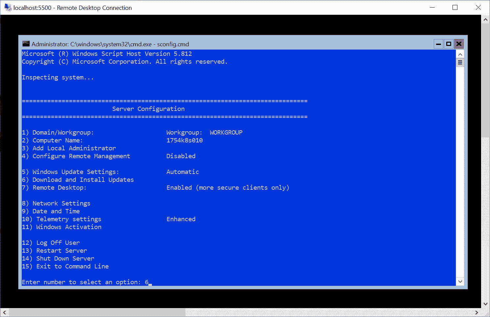
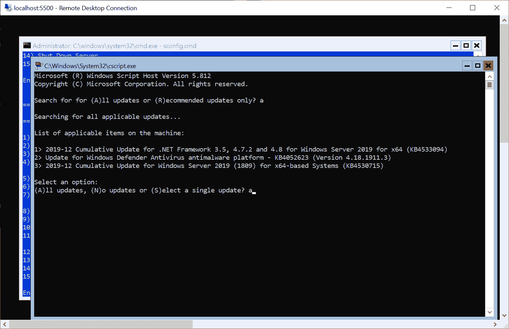

# 运行 Kubernetes 的生产注意事项

你已经读到了这本书的最后一章——干得好！在这短短的一章中，我们将为您提供在生产中运行 Kubernetes 的各种最佳实践和建议。每一种软件工程方法或工具总是有两个世界——如何在开发中使用它，以及如何在生产中使用它。对于 Kubernetes 来说，在生产环境中运行需要更多的操作开销，因为您希望以高可用性和可靠性运行工作负载，通常是大规模运行。您必须考虑如何对集群本身执行升级，以及如何修补底层操作系统，从而确保业务的连续性。如果您在企业数据中心的隔离网络中运行 Kubernetes，您可能需要在 Docker 和 Kubernetes 的所有组件中连接网络代理配置。

此外，随着代码和*不可变基础设施*的临近，确保使用*基础设施可重复地供应集群也很重要。但这并不是全部——您肯定希望以声明的方式管理集群工作负载(类似于您的基础架构)，为此，您可以采用 GitOps 方法。我们在本章中描述的所有概念都可以应用到纯 Linux 集群和混合 Windows/Linux 集群中。*

本书的最后一章将涵盖以下主题:

*   可重复地供应集群
*   Kubeadm 限制
*   升级集群
*   打补丁
*   为 Docker 守护程序和 Kubernetes 配置网络代理

# 技术要求

对于本章，您将需要以下内容:

*   安装了 Windows 10 专业版、企业版或教育版(1903 版或更高版本，64 位)
*   蔚蓝账户
*   头盔已安装
*   使用 AKS 引擎或内部集群部署的 Windows/Linux Kubernetes 集群

接下来，您将需要自己的 Azure 帐户来为 Kubernetes 集群创建 Azure 资源。如果您还没有创建前几章的帐户，您可以在这里阅读更多关于如何获得个人使用的有限免费帐户的信息:[https://azure.microsoft.com/en-us/free/](https://azure.microsoft.com/en-us/free/)。

使用 AKS 引擎部署 Kubernetes 集群已经在[第 8 章](08.html)、*中介绍了部署混合 Azure Kubernetes 服务引擎集群*。

您可以从官方 GitHub 资源库下载本章的最新代码示例:[https://GitHub . com/PacktPublishing/hand-Kubernetes-On-Windows/tree/master/chapter 16](https://github.com/PacktPublishing/Hands-On-Kubernetes-on-Windows/tree/master/Chapter16)。

# 可重复地供应集群

首先，让我们看一下如何配置您的集群和底层基础架构，以及如何声明性地管理您的应用程序工作负载，作为您的**持续集成**或**持续部署** ( **CI/CD** )管道的一部分。在所有情况下，将任何*基础设施设置为代码*方法比仅仅使用基础设施要困难和复杂一点，但是在最终游戏中它会有很大的回报。您可以获得配置一致性、引入复杂变更时的简单性、可测试/可分析的基础架构变更，以及开发工作流程任何阶段的可重现环境。

# 作为集群代码的基础设施

**基础设施作为代码** ( **IaC** )简单来说就是只使用声明性配置文件来管理整个 IT 基础设施的概念。这意味着您的目标是在配置文件中捕获基础架构的状态，并使用专用工具将更改应用到环境中，而不是使用脚本或交互式工具来执行物理硬件配置。对于 Azure，您可以使用 **Azure 资源管理器** ( **ARM** )模板([https://docs . Microsoft . com/en-us/Azure/Azure-资源管理器/资源组-创作-模板](https://docs.microsoft.com/en-us/azure/azure-resource-manager/resource-group-authoring-templates))来描述您的基础架构，或者使用 terra form([https://www.terraform.io/](https://www.terraform.io/))等通用 IaC 工具。事实上，在部署 AKS Engine 集群时，您已经间接使用了 ARM 模板——您可以将 AKS Engine 工具视为创建复杂 ARM 模板的另一个抽象层。

您可以进一步采用 IaC 方法:**不可变基础设施** ( **IM** )。在即时消息的情况下，您永远不会在部署机器后修改机器上的任何配置。如果您需要执行修复，您必须从具有修复的基本映像构建一台新机器，并取消提供旧机器。这听起来可能有些极端，但在虚拟机世界和裸机环境中都可以轻松实现。

packer([https://www.packer.io/](https://www.packer.io/))是帮助你为虚拟和裸机引入这个范例的最佳工具之一。但是如果你仔细考虑一下，我们已经在这本书里使用了很多 IaC 和 IM，但是是在一个不同的、更高的层次上。

Docker 本身就是*不可变基础设施*的一种表现形式，在这里你可以将你的软件作为不可变的操作系统容器映像发送，就像它们是虚拟机映像一样。Kubernetes 可以被视为一个平台，用于管理应用程序工作负载的不可变容器基础架构——每当您创建新的 Docker 映像并推出新版本的 Deployment 时，您只是在创建新的容器并扔掉旧的容器。如果你使用声明性的方法来管理你的 Kubernetes 对象(至少使用`kubectl apply -f`)，你最终会得到整洁的*基础设施作为代码*。

这篇冗长的介绍向我们展示了一些可以作为为 Kubernetes 调配基础架构和部署集群的建议的东西，从最低到最高:

*   始终使用*基础架构作为代码*或*不可改变的基础架构*方法，为集群调配底层基础架构，使用适合工作的工具。Terraform 或 ARM 模板非常适合这两种情况下的任务。AKS 引擎([https://github.com/Azure/aks-engine](https://github.com/Azure/aks-engine))是建立在 ARM 模板之上的*不可变基础设施*工具的完美例子。如果要为集群节点推出新版本的虚拟机映像，则需要使用新映像创建新的节点池，并停用旧的节点池。避免使用原本不打算这样做的工具，如 Ansible。
*   要在您的基础设施上创建 Kubernetes 集群本身，请使用*基础设施作为代码*概念。ansi ble([https://www.ansible.com/](https://www.ansible.com/))、Powershell 期望状态配置([https://docs . Microsoft . com/en-us/Powershell/scripting/DSC/overview/overview 等工具？view=powershell-6](https://docs.microsoft.com/en-us/powershell/scripting/dsc/overview/overview?view=powershell-6) )，或者专用的 kube spray([https://github.com/kubernetes-sigs/kubespray](https://github.com/kubernetes-sigs/kubespray))都非常适合这个任务。AKS 引擎出色地将基础架构配置和集群部署结合到一个工具中。如果您需要一个托管的 Kubernetes 服务，那么再次使用 Terraform 或 ARM 模板。但是不要在自我管理的集群中使用它们来调配软件，即使它们能够做到这一点，它们一开始也不应该这样做。
*   使用 Docker 和 Kubernetes 集群作为应用程序工作负载的*不可变基础设施*平台。使用专用的声明性工具管理该平台，如 Kustomize([https://kustomize.io/](https://kustomize.io/))或 Helm([https://helm.sh/](https://helm.sh/))。将 Helm 图表管理提升到一个更高的、也是声明性的水平——使用 Helm file([https://github.com/roboll/helmfile](https://github.com/roboll/helmfile))或 Flux([https://github.com/fluxcd/flux](https://github.com/fluxcd/flux))。您将不必担心再次运行`helm upgrade`命令！但同样，不要使用不适合这种情况的工具，如 Ansible 或 Terraform，即使它们有模块或提供者被宣传为能够管理 Kubernetes 对象或 Helm Charts。您可能会冒险绑定到一个没有所有 Kubernetes 特性的定制 API，并且很快就会过时。

If you want to manage multiple Kubernetes clusters declaratively, definitely keep an eye on the Kubernetes Cluster API ([https://cluster-api.sigs.k8s.io/introduction.html](https://cluster-api.sigs.k8s.io/introduction.html)), which is currently in alpha state. This Kubernetes project will allow you to create a special Kubernetes management cluster where you can operate on clusters or machines as Kubernetes custom resources.

所以，简而言之，永远使用适合工作的工具！这就是为什么我们现在要看看 Flux 和 GitOps 方法。

# 面向应用程序工作负载的 GitOps

flux([https://github.com/fluxcd/flux](https://github.com/fluxcd/flux))是一个工具，可以自动确保 Kubernetes 集群的状态与 Git 中的配置(清单和 Helm 图表)相匹配。这种方法符合 GitOps，这是一种管理 Kubernetes 集群和您的应用程序的方法，由 Weaveworks([https://www.weave.works/technologies/gitops/](https://www.weave.works/technologies/gitops/))提出，其中 Git 存储库是声明性基础架构和您的应用程序工作负载的唯一真实来源。这种方法完全符合*基础设施代码*范例。此外，您可以很好地分离关注点:开发人员将更改引入集群状态或应用程序配置，这些更改存储在 Git 存储库中(通过完整的 CI 管道)，一个专用的 GitOps 组件负责将配置应用于 Kubernetes 集群。您得到了这个清晰的边界，并且您可以始终确保存储库中的内容反映了实际的集群状态。

让我们来看看如何使用 Flux 来管理运行投票应用程序的集群，我们在本书中已经实现了该应用程序。为此，您将需要一个 AKS Engine 集群，该集群的 Linux 节点能够处理每个节点 4 个以上的卷装载—您可以使用以下集群 apimode:[https://github . com/PacktPublishing/hand-On-Kubernetes-On-Windows/blob/master/chapter 16/01 _ AKS-Engine-flux/Kubernetes-Windows-template . JSON](https://github.com/PacktPublishing/Hands-On-Kubernetes-on-Windows/blob/master/Chapter16/01_aks-engine-flux/kubernetes-windows-template.json)。

Support for Helm 3 in Flux is currently in the development state. You can track progress here: [https://github.com/fluxcd/helm-operator/issues/8](https://github.com/fluxcd/helm-operator/issues/8). For this reason, we need to use custom images for Flux components, but by the time you read this, the support may already be in a stable state.

首先，让我们为 Kubernetes 集群创建一个包含真实来源的存储库。请遵循以下步骤:

1.  创建新的 GitHub 存储库。我们将使用[https://github . com/动手-kubernetes-on-windows/投票-应用程序-flux](https://github.com/hands-on-kubernetes-on-windows/voting-application-flux) 进行演示。

2.  在`charts/voting-application`目录中，放置投票应用掌舵图。你可以在这里找到最新的一个(针对`post-install`钩子和等待在这个版本的 Flux 中无法正常工作的小变通方法):[https://github . com/packt publishing/hand-Kubernetes-On-Windows/tree/master/chapter 16/02 _ voting-application-Flux/charts/voting-application](https://github.com/PacktPublishing/Hands-On-Kubernetes-on-Windows/tree/master/Chapter16/02_voting-application-flux/charts/voting-application)。
3.  在`namespaces`目录中，用名称空间定义创建`demo.yaml`文件:

```
apiVersion: v1
kind: Namespace
metadata:
  labels:
    name: demo
  name: demo
```

4.  在`storageclasses`目录中，用`StorageClass`定义创建`azure-disk.yaml`文件:

```
kind: StorageClass
apiVersion: storage.k8s.io/v1beta1
metadata:
  name: azure-disk
provisioner: kubernetes.io/azure-disk
parameters:
  storageaccounttype: Standard_LRS
  kind: Managed
```

5.  在`releases`目录中，用`HelmRelease`自定义资源为我们的投票应用程序创建`voting-application.yaml`文件。此自定义资源由通量掌舵操作员处理:

```
apiVersion: helm.fluxcd.io/v1 
kind: HelmRelease
metadata:
  name: voting-application
  namespace: demo
  annotations:
    fluxcd.io/automated: "true"
spec:
  releaseName: voting-application
  helmVersion: v3
  timeout: 1200
  wait: false
  rollback:
    enable: false
  chart:
    git: ssh://git@github.com/hands-on-kubernetes-on-windows/voting-application-flux
    ref: master
    path: charts/voting-application
```

6.  将更改推送到您的 GitHub 存储库中。

Flux does not follow any directory convention—it is up to you how you define the structure. All it does is search for YAML files in the repository.

我们已经用真理的来源定义了我们的仓库。现在，让我们将 Flux 部署到我们的集群中，它能够处理 Helm 3 图表。执行以下步骤(或者可以使用 PowerShell 脚本:([https://github . com/PacktPublishing/hand-On-Kubernetes-On-Windows/blob/master/chapter 16/03 _ deployflux . PS1](https://github.com/PacktPublishing/Hands-On-Kubernetes-on-Windows/blob/master/Chapter16/03_DeployFlux.ps1)):

1.  以管理员身份打开新的 PowerShell 窗口。
2.  使用巧克力安装`fluxctl`:

```
choco install fluxctl
```

3.  为通量组件创建一个专用的`fluxcd`命名空间:

```
kubectl create namespace fluxcd
```

4.  添加通量舵存储库:

```
helm repo add fluxcd https://charts.fluxcd.io
```

5.  安装通量舵图。您需要确保所有组件都将`nodeSelector`设置为在 Linux 节点上运行。将`git.url`值设置到您的 GitHub 存储库中:

```
helm upgrade -i flux fluxcd/flux `
 --namespace fluxcd `
 --set "nodeSelector.`"kubernetes\.io/os`"=linux" `
 --set "memcached.nodeSelector.`"kubernetes\.io/os`"=linux" `
 --set "helmOperator.nodeSelector.`"kubernetes\.io/os`"=linux" `
 --set git.url=git@github.com:hands-on-kubernetes-on-windows/voting-application-flux `
 --debug
```

6.  应用 HelmRelease 定制资源定义的官方清单(这里我们使用来自`helm-v3-dev`分支的开发清单):

```
kubectl apply -f https://raw.githubusercontent.com/fluxcd/helm-operator/helm-v3-dev/deploy/flux-helm-release-crd.yaml
```

7.  为通量舵操作员安装舵图。这是运营商的一个版本，来自支持 Helm 3 的开发部门。记得保证 Linux `nodeSelector`:

```
helm upgrade -i helm-operator fluxcd/helm-operator `
 --namespace fluxcd `
 --set git.ssh.secretName=flux-git-deploy `
 --set configureRepositories.enable=true `
 --set configureRepositories.repositories[0].name=stable `
 --set configureRepositories.repositories[0].url=https://kubernetes-charts.storage.googleapis.com `
 --set extraEnvs[0].name=HELM_VERSION `
 --set extraEnvs[0].value=v3 `
 --set image.repository=docker.io/fluxcd/helm-operator-prerelease `
 --set image.tag=helm-v3-dev-ca9c8ba0 `
 --set "nodeSelector.`"kubernetes\.io/os`"=linux" 
```

8.  使用`fluxctl`检索必须作为部署密钥添加到 GitHub 存储库中的公共 SSH 密钥:

```
fluxctl identity --k8s-fwd-ns fluxcd
```

9.  复制密钥并在网络浏览器中打开你的 GitHub 库。
10.  导航到设置和部署密钥。
11.  添加具有写权限的密钥。
12.  现在，您可以等待一会儿，直到 Flux 自动同步存储库，或者使用以下命令强制同步:

```
fluxctl sync --k8s-fwd-ns fluxcd
```

13.  使用`kubectl get all -n demo`观察组件的创建。您还可以使用`kubectl logs`命令跟踪 Helm 操作员日志，尤其是在 Helm 版本安装过程中出现任何问题时:

```
PS C:\src> kubectl get all -n demo
NAME                                                  READY   STATUS    RESTARTS   AGE
pod/voting-application-5cb4987765-7ht4x               0/1     Running   1          2m
pod/voting-application-5cb4987765-dstml               0/1     Running   1          2m
...
```

In the preceding steps, we used imperative commands, as in the official guides from Flux. You can, of course, use declarative manifests and YAML files with values for the Helm releases.

如你所见，整个过程是完全自动的。您在 Git 存储库中定义状态，Flux 自动负责将更改应用到集群。现在，让我们测试一下在集群状态中推出变更是如何工作的。例如，我们将更改我们在投票应用程序中使用的图像的标签，就像我们正在推出新版本的应用程序一样:

1.  在集群状态的存储库中，开始编辑`charts/voting-application/Chart.yaml`。
2.  将`version`更改为`0.4.1`表示图表版本本身已经更改。
3.  将`appVersion`更改为不同的投票应用图像标签。我们可以用例如`1.5.0`，以前的版本之一。
4.  保存更改，提交到存储库，并推送到 GitHub。
5.  等待更改自动同步，或使用`fluxctl sync --k8s-fwd-ns fluxcd`命令强制同步。
6.  执行`kubectl get pods -n demo`命令，查看资源是否确实正在重新创建:

```
PS C:\src> kubectl get pods -n demo
NAME                                              READY   STATUS              RESTARTS   AGE
voting-application-55fb99587d-rjvmq               0/1     Running             0          16s
voting-application-55fb99587d-whrwv               1/1     Running             0          79s
voting-application-55fb99587d-x9j8q               0/1     ContainerCreating   0          79s
voting-application-5cb4987765-g2lx8               1/1     Terminating         0          21m
```

7.  描述其中一个新的 pod，以验证它是使用所需的 Docker 图像标签创建的:

```
PS C:\src> kubectl describe pod -n demo voting-application-55fb99587d-rjvmq
...
Containers:
 voting-application-frontend:
 Container ID: docker://61e207885bcfc3bde670702e342345127dcf0d6e782609bc68127078fc007034
 Image: packtpubkubernetesonwindows/voting-application:1.6.0
```

恭喜你！您已经成功地使用 Flux 设置了一个 GitOps 管道。在生产中，您可以通过添加与您的 Git 存储库集成的 CI/CD 组件来轻松扩展管道，例如，在将每个拉请求合并到集群状态存储库之前，它将执行对它的验证。您可以在下面的文章中了解更多关于更复杂管道的信息:[https://www.weave.works/blog/what-is-gitops-really](https://www.weave.works/blog/what-is-gitops-really)。

在下一节中，我们将研究 kubeadm 对生产用例的限制。

# Kubeadm 限制

kubedam([https://github.com/kubernetes/kubeadm](https://github.com/kubernetes/kubeadm))是一个命令行工具，用于配置 Kubernetes 集群，该工具专注于执行必要的操作，以用户友好的方式启动和运行最小可行的安全集群—我们在[第 4 章](04.html)、 *Kubernetes 概念和 Windows 支持*中介绍了该工具，后来在[第 7 章](07.html)、*部署混合内部 Kubernetes 集群*中使用了该工具。该工具的范围仅限于给定的机器和 Kubernetes API 通信，因此一般来说，它旨在作为其他自动化工具的构建块，这些自动化工具将集群作为一个整体进行管理。你会发现其他复杂的自动化工具，比如 kubespray，都是建立在 kubeadm 之上的。

从 Kubernetes 1.13 开始，kubeadm 被认为是稳定的，可以用于生产。但是，即使它当前的核心特性集处于稳定状态，您也应该考虑几个限制，这些限制可能不会使 kubeadm 成为您的生产 Kubernetes 部署的合适工具:

*   kubeadm 对 Windows 节点只有初始支持，关于这种支持的 API 可能会改变。这使得混合集群的生产部署成为一项艰巨的任务，目前唯一的替代方法是在 Windows 节点上手动配置 Kubernetes 组件，并将它们加入现有的 Linux 集群。当然，如果您在 Azure 上运行，您可以使用 AKS 或 AKS 引擎在生产中运行 Windows 容器工作负载。
*   高可用性的 Kubernetes 集群设置(具有堆叠和内部 etcd 拓扑)现在可以使用 kubeadm，但仍然相对复杂。您可以在官方文档中阅读更多内容:[https://kubernetes . io/docs/setup/production-environment/tools/kube dam/high-availability/](https://kubernetes.io/docs/setup/production-environment/tools/kubeadm/high-availability/)。此外，没有简单的方法可以在之后使用 kubeadm 管理 etcd 集群，这意味着像 kubespray 这样的解决方案提供了更大的灵活性。但当然，这是以目前不支持 Windows 为代价的。
*   kube dam 不能用于将新节点加入到没有 kube dam 引导的现有集群中。

一般来说，对于混合的 Windows/Linux Kubernetes 集群，如果不能使用 AKS 或 AKS Engine，就没有完美的方法来配置生产就绪集群。使用 kubeadm 仍然是建立这种集群的唯一半自动方式。

现在，让我们看看如何将 Kubernetes 集群升级到更新的版本。

# 升级集群

在生产中运行 Kubernetes 集群肯定需要在某个时候将 Kubernetes 组件升级到更新的版本。如何执行升级本身取决于您用来引导和管理群集的工具。但总的来说，高级程序如下:

1.  升级主主节点上运行的组件。
2.  升级附加主节点上运行的组件。
3.  升级工作节点。

为了确保安全升级，您必须遵循一个重要的规则:您一次只能升级一个次要版本的集群。这意味着，例如，版本为 1.16 的集群只能升级到 1.17，不能直接跳到 1.18。原因是 Kubernetes 主组件的版本偏差策略，它最多只允许运行一个较小的版本差异。Kubernetes 的次要版本的预期发布周期是三个月，这意味着您可能需要经常运行升级过程，尤其是考虑到每个次要版本将保持大约九个月。您可以在官方文档中阅读所有组件的策略:[https://kubernetes . io/docs/setup/release/version-skew-policy/](https://kubernetes.io/docs/setup/release/version-skew-policy/)。

根据引导群集的方式，确切的升级步骤会有所不同。例如，对于 kubeadm 集群，升级将在相同的机器上就地执行。但是如果您使用 AKS 或 AKS Engine，该过程将符合*不可变基础设施*范例:主虚拟机和工作虚拟机将被运行较新版本 Kubernetes 组件的虚拟机顺序替换。更详细地说，对于主节点，自动升级过程如下:

1.  `Cordon`(将节点标记为不可切割)其中一个主节点，并排空现有的豆荚。
2.  删除物理虚拟机。现在，控制平面的大小是`N-1`个节点。
3.  使用新版本的 Kubernetes 组件创建一个新的虚拟机。
4.  将新虚拟机添加到集群，并为节点应用任何现有标签、注释或污点。现在，数据平面的大小又是`N`。

对于工作节点，过程类似，包括以下步骤:

1.  使用新版本的 Kubernetes 组件创建一个新的虚拟机。
2.  将新虚拟机添加到集群中。现在，数据平面的大小是`M+1`。
3.  如果已经为新节点安排了任何 pods，请将其逐出。
4.  将任何现有标签、注释或污点应用到新节点。
5.  `Cordon`老节点并排空现有豆荚。
6.  删除旧虚拟机。现在，数据平面的大小又是`M`。

通过添加额外的节点(而不是先删除现有节点)来升级工作节点的原因是为了确保数据平面工作负载的群集容量不会缩减。这确保了升级对用户完全透明。您可以在以下网址阅读更多关于 AKS 升级程序的信息:[https://docs.microsoft.com/en-us/azure/aks/upgrade-cluster](https://docs.microsoft.com/en-us/azure/aks/upgrade-cluster)和 AKS 引擎的信息:[https://github . com/Azure/AKS-Engine/blob/master/docs/topics/upgrade . MD](https://github.com/Azure/aks-engine/blob/master/docs/topics/upgrade.md)。

You can use the *immutable infrastructure* approach for upgrades used in AKS and AKS Engine to perform manual upgrades of clusters bootstrapped using different tools, as long as the toolset allows adding new master and worker nodes.

现在让我们对使用 AKS 引擎创建的 Kubernetes 集群(带有 Windows 节点)进行升级。对于这个演示，我们运行的是 1.16.1 版本的集群，这是我们在前面几节中创建的。您将需要用于初始部署的集群加速模型。要执行升级，请遵循以下步骤:

1.  打开一个 PowerShell 窗口。确定有哪些可用的 Kubernetes 版本可用于升级带有 Windows 节点的 AKS 引擎集群。运行以下命令:

```
PS C:\src> aks-engine get-versions --version 1.16.1 --windows
Version Upgrades
1.16.1 1.17.0-alpha.1, 1.17.0-alpha.2, 1.17.0-alpha.3, 1.17.0-beta.1
```

2.  让我们将集群升级到最新版本`1.17.0-beta.1`。如果您没有 AKS 引擎服务主体，您必须生成一个新主体，因为不可能检索现有主体的密码。为此，请使用以下命令:

```
az ad sp create-for-rbac `
 --role="Contributor" `
 --scopes="/subscriptions/<azureSubscriptionId>/resourceGroups/<resourceGroupName>"
```

注意`appId`和`password`在升级命令中使用。

3.  执行以下命令来执行升级。您必须指定生成的集群 ApiModel:

```
aks-engine upgrade `
 --subscription-id <azureSubscriptionId> `
 --api-model .\_output\<dnsPrefix>\apimodel.json `
 --location <azureLocation> `
 --resource-group <resourceGroupName> `
 --upgrade-version "1.17.0-beta.1" `
 --auth-method client_secret `
 --client-id <appId> `
 --client-secret <password>
```

4.  升级可能需要大约 50 分钟(每个节点 10 分钟)，具体取决于集群的大小。如果您在集群中使用单节点控制平面，在升级过程中，您将有一段时间无法访问 Kubernetes API。升级完成后，运行以下命令来验证节点是否运行所需版本的 Kubernetes:

```
PS C:\src> kubectl get nodes
NAME                        STATUS   ROLES    AGE     VERSION
1754k8s010                  Ready    agent    17m     v1.17.0-beta.1
1754k8s012                  Ready    agent    26m     v1.17.0-beta.1
k8s-linuxpool1-17543130-0   Ready    agent    3m44s   v1.17.0-beta.1
k8s-linuxpool1-17543130-2   Ready    agent    9m51s   v1.17.0-beta.1
k8s-master-17543130-0       Ready    master   48m     v1.17.0-beta.1
```

In production clusters, especially if you are running a customized cluster with extensions or dedicated VM images, it is recommended to test the upgrade in a separate staging cluster that was created using exactly the same specification.

祝贺您，您已成功将您的 AKS 引擎集群升级到版本`1.17.0-beta.1`。在下一节中，您将学习如何在 Kubernetes 中进行操作系统修补。

# 打补丁

为了确保集群和底层基础架构的最佳安全性，您必须确保运行的操作系统在节点上安装了最新的补丁程序。幸运的是，在节点维护方面，Kubernetes 是灵活的。任何维护的一般方法，包括应用需要重新启动的操作系统补丁，如下所示:

1.  `Cordon`(将节点标记为不可切割)该节点并排空现有豆荚。
2.  应用所需的更新并重新启动机器。
3.  `Uncordon`使其可再次调度的节点。

或者，如果使用*不可变基础设施*方法，前面的步骤必须通过创建新的补丁机器和删除旧机器来扩展。例如，在 AKS 引擎中，假设您将虚拟机扩展集(VMSS)与自定义虚拟机映像一起用于节点池，则此场景可能如下所示:

1.  构建虚拟机映像的新版本。
2.  为您的 VMSS 更新虚拟机映像([https://docs . Microsoft . com/en-us/azure/virtual-machine-scale-set/virtual-machine-scale-set-upgrade-scale-set # update-OS-image-for-your-scale-set](https://docs.microsoft.com/en-us/azure/virtual-machine-scale-sets/virtual-machine-scale-sets-upgrade-scale-set#update-the-os-image-for-your-scale-set))，可能直接在 ARM 模板中更新。
3.  对于 VMSS 中的每个虚拟机，依次执行以下操作:`cordon`并清空节点，将虚拟机映像设置为 VMSS 实例的最新版本，`uncordon`节点。

If you are interested in creating your own custom VM images for AKS Engine Windows nodes, you can read the following description of the build process, which uses Packer and Azure DevOps: [https://github.com/Azure/aks-engine/blob/master/docs/topics/windows-vhd.md](https://github.com/Azure/aks-engine/blob/master/docs/topics/windows-vhd.md).

要对 Windows 节点进行手动维护，请执行以下步骤:

1.  让我们假设我们想要修补`1754k8s010`窗口节点。

2.  使用名称获取`1754k8s010`节点的私有 IP 地址:

```
PS C:\src> az vm show -g <resourceGroupName> -n 1754k8s010 --show-details --query 'privateIps'
"10.240.0.35,10.240.0.36,10.240.0.37,10.240.0.38,10.240.0.39,10.240.0.40,10.240.0.41,10.240.0.42,10.240.0.43,10.240.0.44,10.240.0.45,10.240.0.46,10.240.0.47,10.240.0.48,10.240.0.49,10.240.0.50,10.240.0.51,10.240.0.52,10.240.0.53,10.240.0.54,10.240.0.55,10.240.0.56,10.240.0.57,10.240.0.58,10.240.0.59,10.240.0.60,10.240.0.61,10.240.0.62,10.240.0.63,10.240.0.64,10.240.0.65"
```

3.  使用其中一个私有 IP 创建从您的本地`5500`端口通过主节点到 Windows 节点上的端口`3389` (RDP)的 SSH 隧道:

```
ssh -L 5500:10.240.0.35:3389 azureuser@<dnsPrefix>.<azureLocation>.cloudapp.azure.com
```

4.  在不同的 PowerShell 窗口中，通过隧道启动 RDP 会话:

```
mstsc /v:localhost:5500
```

5.  提供您的窗口节点凭据(如在 ApiModel 中)并连接。
6.  等待控制台初始化。
7.  现在，您已经准备好执行维护了，但是首先，我们需要先排空节点(也就是`cordons`节点)。在本地计算机上的新 PowerShell 窗口中，执行以下命令:

```
PS C:\src> kubectl drain 1754k8s010
node/1754k8s010 cordoned
node/1754k8s010 drained
```

8.  当节点耗尽时，您可以开始维护程序。例如，您可以使用控制台中的`sconfig.cmd`实用程序手动应用更新:



9.  选择选项`6`并选择您想要安装的更新:



10.  等待安装结束，并在需要时重新启动机器。
11.  当节点完全重启后，您可以`uncordon`节点，使其再次可调度:

```
PS C:\src> kubectl uncordon 1754k8s010
node/1754k8s010 uncordoned
```

您的节点现在将在集群中再次完全正常工作。

Alternatively, you may consider using Azure Update Management to manage operating system updates and patching in your cluster. You can read more in the official documentation: [https://docs.microsoft.com/en-us/azure/automation/automation-update-management](https://docs.microsoft.com/en-us/azure/automation/automation-update-management).

在最后一节中，我们将展示如果您在 HTTP(S)网络代理后面运行生产集群，Kubernetes 中的哪些组件需要额外的配置。

# 为 Docker 守护程序和 Kubernetes 配置网络代理

在企业环境中，通常使用 HTTP(S)网络代理来连接外部网络，尤其是互联网。这需要在代理后面运行的所有组件的额外配置成本——我们将简要概述在 Kubernetes 中需要哪些组件来使代理知道如何使用外部注册中心的 Docker 映像并将代理设置传播到容器。

让我们假设我们的代理地址如下:

*   `http://proxy.example.com:8080/`为 HTTP 代理
*   `http://proxy.example.com:9090/`为 HTTPS 代理

其他标准代理(如 SFTP)的配置也可以类似地完成。您可能还需要适当的无代理变量来排除 Kubernetes 节点和本地网络，否则，您将无法在节点之间通信，或者到节点的流量将另外通过代理路由！现在，对于 Linux 节点和主机(假设是基于 Debian 的发行版，如 Ubuntu)，您需要确保配置了以下设置:

1.  为默认环境`/etc/environment`定义代理设置。这将使 APT 等工具支持代理设置:

```
HTTP_PROXY=http://proxy.example.com:8080/
HTTPS_PROXY=http://proxy.example.com:9090/
http_proxy=http://proxy.example.com:8080/
https_proxy=http://proxy.example.com:9090/
```

2.  代理是为 Docker 守护程序环境设置的。这将确保容器也接收代理变量。您可以用以下内容定义`/etc/systemd/system/docker.service.d/http-proxy.conf`文件:

```
[Service]
Environment="HTTP_PROXY=http://proxy.example.com:8080/" "HTTPS_PROXY=http://proxy.example.com:9090/" 
```

3.  要在代理后面的计算机上构建 Docker 映像，请考虑将代理设置作为参数传递:

```
docker build --build-arg http_proxy=http://proxy.example.com:8080/ \
 --build-arg https_proxy=http://proxy.example.com:9090/ \
 -t someimage .
```

对于 Windows 工作节点，您可以采取以下步骤:

1.  以管理员身份从 PowerShell 定义全局环境变量:

```
[Environment]::SetEnvironmentVariable("HTTP_PROXY", "http://proxy.example.com:8080/", [EnvironmentVariableTarget]::Machine)
[Environment]::SetEnvironmentVariable("HTTPS_PROXY", "http://proxy.example.com:9090/", [EnvironmentVariableTarget]::Machine)
```

2.  此外，确保任何使用 web 浏览器引擎的流量也遵守代理设置:

```
reg add "HKCU\Software\Microsoft\Windows\CurrentVersion\Internet Settings" /v ProxyServer /t REG_SZ /d proxy.example.com:8080 /f
reg add "HKCU\Software\Microsoft\Windows\CurrentVersion\Internet Settings" /v ProxyEnable /t REG_DWORD /d 1 /f
```

这些配置步骤应该允许您提取 Docker 映像、引导集群，并在以后连接到外部网络时让 pod 容器知道这些设置。

# 摘要

在本章中，我们重点介绍了在生产环境中运行的 Kubernetes 集群的常见操作最佳实践。首先，我们介绍了为 Kubernetes 提供基础设施和可重复部署集群的方法，我们引入了*基础设施的概念作为代码*和*不可变基础设施*，并展示了它们如何适应 Kubernetes 环境。此外，我们还就配置基础架构和集群部署的最佳工具提供了建议。接下来，您学习了什么是 GitOps，以及如何使用 Flux 和 Git 存储库应用这一理念。我们重点关注升级的操作方面以及底层集群基础设施和 Kubernetes 本身的修补。最后，您学习了如何确保您的 Kubernetes 集群能够在企业环境中运行在 HTTP(S)网络代理之后。

恭喜你！这是一次进入 Windows 上 Kubernetes(几乎)*未知领域*的漫长旅程——祝您的 Kubernetes 之旅好运，感谢您的阅读。

# 问题

1.  *基础设施作为代码*和*不可变基础设施*有什么区别？
2.  为什么 Kubernetes 被认为是一个使用*基础设施作为代码*方法的平台？
3.  什么是 GitOps？
4.  在 Kubernetes 集群中使用 Flux 有什么好处？
5.  Kubernetes 集群版本升级过程中有哪些步骤？
6.  在 Kubernetes 节点上执行维护的过程是什么？

你可以在本书的*评估*中找到这些问题的答案。

# 进一步阅读

*   有关 Kubernetes 功能和在生产环境中运行集群的更多信息，请参考以下 Packt 书籍:
    *   *完整的 kubernetes 指南*([https://www . packtpub . com/虚拟化与云/完整的 Kubernetes 指南](https://www.packtpub.com/virtualization-and-cloud/complete-kubernetes-guide))
    *   *Kubernetes 入门-第三版*([https://www . packtpub . com/虚拟化与云/入门-Kubernetes-第三版](https://www.packtpub.com/virtualization-and-cloud/getting-started-kubernetes-third-edition))
*   如果你有兴趣探索*基础设施作为代码*的概念，你可以查看以下 Packt 书籍:
    *   *基础设施即代码(IaC)食谱*([https://www . packtpub . com/虚拟化与云/基础设施-代码-Iac-食谱](https://www.packtpub.com/virtualization-and-cloud/infrastructure-code-iac-cookbook))
*   Kubernetes 文档提供了一些运行集群的最佳实践:[https://kubernetes.io/docs/setup/best-practices/](https://kubernetes.io/docs/setup/best-practices/)。