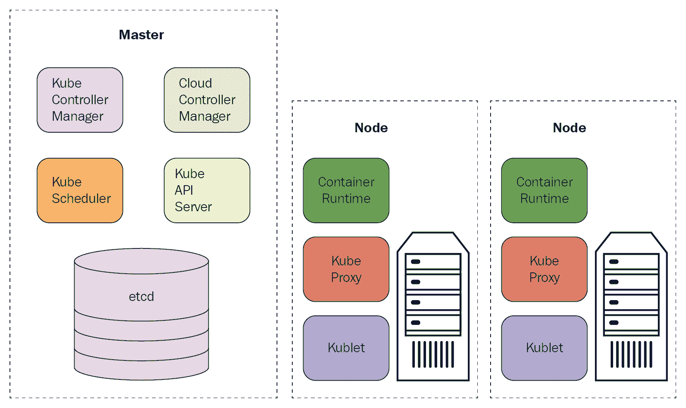
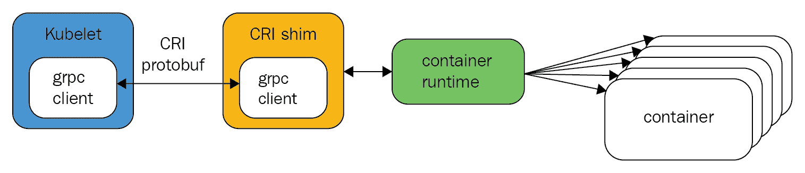
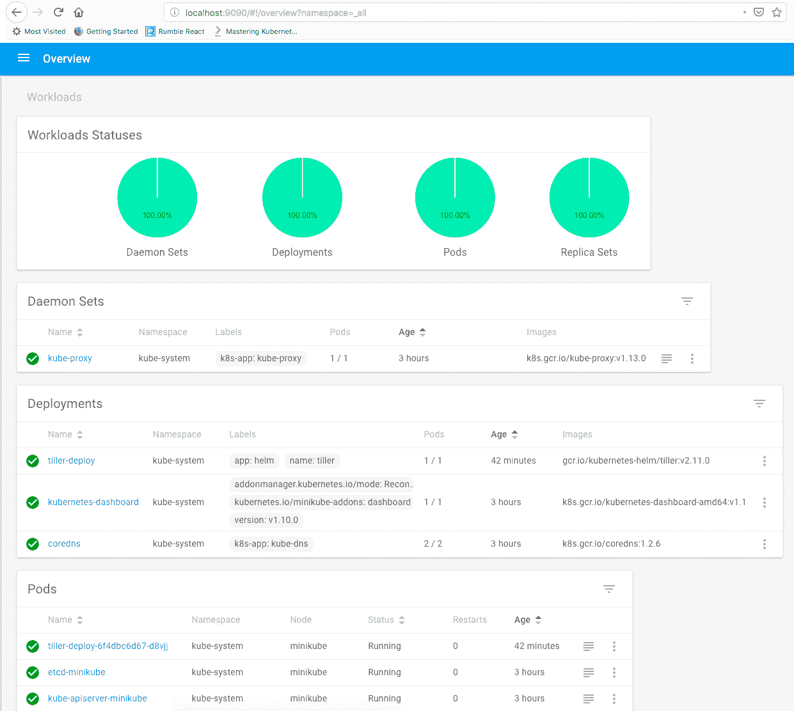

# 一、面向开发人员的 Kubernetes 简介

在本章中，我们将向您介绍 Kubernetes。Kubernetes 是一个很大的平台，很难用一个章节来公正地评价它。幸运的是，我们有一整本书来探索它。如果你感到有点不知所措，不要担心。我将简要提及许多概念和功能。在后面的章节中，我们将详细介绍其中的许多内容，以及这些 Kubernetes 概念之间的联系和相互作用。为了给事情增加趣味并尽早动手，您还将在您的机器上创建一个本地 Kubernetes 集群(Minikube)。本章将涵盖以下主题:

*   库伯内斯在 nutshell
*   永恒的建筑
*   立方结构与微服务
*   创建本地集群

# 技术要求

在本章中，您将需要以下工具:

*   码头工人
*   库布特雷
*   迷你库比

# 安装 Docker

要安装 Docker，请遵循此处的说明:[https://docs.docker.com/install/#supported-platforms](https://docs.docker.com/install/#supported-platforms)。我会用 Docker 做 macOS。

# 安装 kubectl

要安装 kubectl，请遵循此处的说明:[https://kubernetes.io/docs/tasks/tools/install-kubectl/](https://kubernetes.io/docs/tasks/tools/install-kubectl/)。

Kubectl 是 Kubernetes 命令行界面，我们将在整本书中广泛使用它。

# 安装 Minikube

要安装 Minikube，请遵循此处的说明:[https://kubernetes.io/docs/tasks/tools/install-minikube/](https://kubernetes.io/docs/tasks/tools/install-minikube/)。

请注意，您还需要安装虚拟机管理程序。对于 macOS，我觉得 VirtualBox 是最可靠的。您可能更喜欢另一个虚拟机管理程序，如 HyperKit。等你玩 Minikube 的时候会有更详细的说明。

# 代码

*   本章的代码可在此处获得:[https://github . com/PacktPublishing/hand-On-microservice-wit-Kubernetes/tree/master/chapter 01](https://github.com/PacktPublishing/Hands-On-Microservices-with-Kubernetes/tree/master/Chapter01)
*   还有另一个 Git 存储库，用于我们将一起构建的 Delinkcious 示例应用:[https://github.com/the-gigi/delinkcious](https://github.com/the-gigi/delinkcious)

# 库伯内斯在 nutshell

在这一节中，你将了解 Kubernetes 的全部内容，它的历史，以及它是如何变得如此受欢迎的。

# kubernetes——容器编排平台

Kubernetes 的主要功能是在一组机器(物理或虚拟)上部署和管理大量基于容器的工作负载。这意味着 Kubernetes 提供了向集群部署容器的方法。它确保遵守各种调度约束，并将容器高效地打包到集群节点中。此外，Kubernetes 会自动监视您的容器，并在它们出现故障时重新启动它们。Kubernetes 还会将工作负载从有问题的节点转移到其他节点。Kubernetes 是一个非常灵活的平台。它依赖于由计算、内存、存储和网络组成的调配基础架构层，有了这些资源，它就发挥了它的魔力。

# Kubernetes的历史

Kubernetes 和整个云原生场景正在以极快的速度移动，但是让我们花点时间来思考一下我们是如何到达这里的。这将是一个非常短的旅程，因为库本内斯是在 2014 年 6 月从谷歌出来的，就在几年前。当 Docker 变得流行时，它改变了人们打包、分发和部署软件的方式。但是，很快就变得很明显，Docker 不能独立扩展到大型分布式系统。一些编排解决方案变得可用，例如 Apache Mesos，以及后来 Docker 自己的 swarm。但是，他们从来没有达到库本内斯。Kubernetes 在概念上基于谷歌的博格系统。它汇集了十年谷歌工程的设计和技术优势，但它是一个新的开源项目。在 OSCON 2015 上，Kubernetes 1.0 发布了，闸门打开了。Kubernetes 的成长，它的生态系统，以及它背后的社区，与其卓越的技术一样令人印象深刻。

Kubernetes 在希腊语中是舵手的意思。你会注意到许多与 Kubernetes 相关的项目名称中的航海术语。

# Kubernetes州

Kubernetes 现在是一个家喻户晓的名字。DevOps 世界几乎将容器编排等同于 Kubernetes。所有主要的云提供商都提供托管 Kubernetes 解决方案。它在企业和初创公司中无处不在。虽然 Kubernetes 还很年轻，创新也在不断发生，但这一切都是以非常健康的方式发生的。核心是坚如磐石的，经过战斗考验的，并在许多公司的生产中使用。有非常大的玩家在合作，推动 Kubernetes 向前发展，比如谷歌(很明显)、微软、亚马逊、IBM 和 VMware。

**云原生计算基金会** ( **CNCF** )开源组织提供认证。每 3 个月就会有一个新的 Kubernetes 发布，这是数百名志愿者和付费工程师合作的结果。商业和开源项目的主要项目周围都有一个大的生态系统。稍后您将看到 Kubernetes 灵活且可扩展的设计如何鼓励这种生态系统，并帮助将 Kubernetes 集成到任何云平台中。

# 了解Kubernetes建筑

Kubernetes 是软件工程的奇迹。Kubernetes 的建筑和设计是其成功的重要因素。每个集群都有一个控制平面和数据平面。控制平面由几个组件组成，例如应用编程接口服务器、用于保持集群状态的元数据存储区以及负责管理数据平面中的节点并向用户提供访问的多个控制器。生产中的控制平面将分布在多台机器上，以实现高可用性和健壮性。数据平面由多个节点或工作人员组成。控制平面将在这些节点上部署和运行您的 pod(容器组)，然后观察变化并做出响应。

下面是一个图表，展示了整体架构:



让我们详细回顾一下控制平面和数据平面，以及 kubectl，它是您用来与 Kubernetes 集群交互的命令行工具。

# 控制平面

控制平面由几个组件组成:

*   应用编程接口服务器
*   etcd 元数据存储
*   调度程序
*   控制器管理器
*   云控制器管理器

让我们检查每个组件的角色。

# 应用编程接口服务器

**kube-api-server** 是一个向全世界公开 Kubernetes API 的大型 REST 服务器。为了获得高可用性，您可以在控制平面中拥有多个 API 服务器实例。API 服务器将集群状态保存在 etcd 中。

# etcd 商店

整个集群存储在 etcd([https://coreos.com/etcd/](https://coreos.com/etcd/))中，这是一个一致且可靠的分布式键值存储。 **etcd 商店**是一个开源项目(最初由 CoreOS 开发)。

通常有三个或五个 etcd 实例用于冗余。如果您丢失了 etcd 存储中的数据，您就丢失了集群。

# 调度程序

**kube-scheduler** 负责将 pods 调度到工作节点。它实现了一个复杂的调度算法，该算法考虑了许多信息，例如每个节点上的资源可用性、用户指定的各种约束、可用节点的类型、资源限制和配额，以及其他因素，例如相似性、反相似性、容忍性和污点。

# 控制经理

为了简单起见， **kube 控制器管理器**是一个包含多个控制器的单一进程。这些控制器监视集群的事件和变化，并做出相应的响应:

*   **节点控制器**:负责节点停机时的通知和响应。
*   **复制控制器**:这可以确保每个副本集或复制控制器对象都有正确数量的 pod。
*   **端点控制器**:这为每个服务分配了一个端点对象，该对象列出了服务的 pods。
*   **服务帐户和令牌控制器**:这些用默认服务帐户和对应的 API 访问令牌初始化新的名称空间。

# 数据平面

数据平面是集群中节点的集合，这些节点将您的容器化工作负载作为 pods 运行。数据平面和控制平面可以共享物理或虚拟机。当然，当您运行单节点集群(如 Minikube)时，就会出现这种情况。但是，通常在生产就绪部署中，数据平面会有自己的节点。为了通信、监视和调度 pods，Kubernetes 在每个节点上安装了几个组件:kubelet、kube-proxy 和容器运行时(例如 Docker 守护程序)。

# 库布雷人

**库伯莱**是库伯内斯特工。它负责与应用编程接口服务器对话，并负责运行和管理节点上的 pod。以下是 kubelet 的一些职责:

*   从应用编程接口服务器下载吊舱机密
*   安装卷
*   通过**容器运行界面** ( **CRI** )运行 pod 容器
*   报告节点和每个 pod 的状态
*   探测容器活性

# kube 代理

kube 代理负责节点的网络方面。它充当服务的本地前端，可以转发 TCP 和 UDP 数据包。它通过域名系统或环境变量发现服务的 IP 地址。

# 容器运行时

Kubernetes 最终运行容器，即使它们被组织在豆荚中。Kubernetes 支持不同的容器运行时。最初，只支持 Docker。现在，Kubernetes 通过一个名为 **CRI** 的接口运行容器，该接口基于 **gRPC** 。



实现 CRI 的每个容器运行时都可以在由 **kubelet** 控制的节点上使用，如上图所示。

# 库布特雷

**Kubectl** 是一个你应该非常熟悉的工具。这是你的库本内斯集群的**命令行界面** ( **命令行界面**)。我们将在整本书中广泛使用 kubectl 来管理和操作 Kubernetes。以下是 kubectl 让您触手可及的功能的简短列表:

*   集群管理
*   部署
*   故障排除和调试
*   资源管理(Kubernetes 对象)
*   配置和元数据

只需输入`kubectl`即可获得所有命令的完整列表，输入`kubectl <command> --help`即可获得特定命令的更多详细信息。

# Kubernetes 和微服务–完美匹配

Kubernetes 是一个神奇的平台，拥有惊人的功能和奇妙的生态系统。它对你的系统有什么帮助？正如您将看到的，Kubernetes 和微服务之间有非常好的一致性。Kubernetes 的构建模块，如名称空间、pods、部署和服务，直接映射到重要的微服务概念和敏捷的**软件开发生命周期** ( **SDLC** )。让我们开始吧。

# 打包和部署微服务

当您采用基于微服务的体系结构时，您将拥有大量的微服务。这些微服务通常可以独立开发，也可以独立部署。包装机制只是容器。您开发的每个微服务都将有一个 Dockerfile。生成的映像表示该微服务的部署单元。在 Kubernetes 中，您的微服务映像将在一个容器内运行(可能与其他容器一起运行)。但是一个运行在节点上的孤立的 pod 不是很有弹性。如果节点上的 kubelet 崩溃了，它将重新启动 pod 的容器，但是如果节点本身出了什么问题，pod 就没了。Kubernetes 有建立在 pod 上的抽象和资源。

**副本集**是具有一定数量副本的豆荚集。创建复制集时，Kubernetes 将确保您指定的正确数量的豆荚始终在集群中运行。部署资源使它更进一步，并提供了一个与您考虑和思考微服务的方式完全一致的抽象。当您准备好微服务的新版本时，您会想要部署它。下面是一个 Kubernetes 部署清单:

```
apiVersion: apps/v1
kind: Deployment
metadata:
  name: nginx
  labels:
    app: nginx
spec:
  replicas: 3
  selector:
    matchLabels:
      app: nginx
  template:
    metadata:
      labels:
        app: nginx
    spec:
      containers:
      - name: nginx
        image: nginx:1.15.4
        ports:
        - containerPort: 80
```

该文件可在[https://github . com/the-gigi/动手微服务-with-kubernetes-code/blob/master/ch1/nginx-deployment . YAML .](https://github.com/the-gigi/hands-on-microservices-with-kubernetes-code/blob/master/ch1/nginx-deployment.yaml)找到

这是一个 YAML 文件([https://yaml.org/](https://yaml.org/))，它有一些所有Kubernetes资源共有的字段，以及一些特定于部署的字段。让我们一点一点地把它分解。您在这里学到的几乎所有内容都适用于其他资源:

*   `apiVersion`字段标记了 Kubernetes 资源版本。Kubernetes API 服务器的特定版本(例如 V1.13.0)可以使用不同资源的不同版本。资源版本有两部分:一个应用编程接口组(在本例中为`apps`)和一个版本号(`v1`)。版本号可能包括**阿尔法**或**贝塔**名称:

```
apiVersion: apps/v1
```

*   `kind`字段指定我们正在处理什么资源或应用编程接口对象。在本章及以后的章节中，您将会遇到多种资源:

```
kind: Deployment
```

*   `metadata`部分包含资源的名称(`nginx`)和一组标签，它们只是键值字符串对。该名称用于指代该特定资源。标签允许在共享相同标签的一组资源上操作。标签非常有用和灵活。在这种情况下，只有一个标签(`app: nginx`):

```
metadata:
  name: nginx
  labels:
    app: nginx
```

*   接下来，我们有一个`spec`字段。这是一个副本集`spec`。您可以直接创建一个复制集，但它将是静态的。部署的全部目的是管理其副本集。副本集规范中有什么？显然，它包含了`replicas` ( `3`)的数量。它有一个带有一组`matchLabels`(也是`app: nginx`)的选择器，并且它有一个吊舱模板。复制集将管理标签与`matchLabels`匹配的豆荚:

```
spec:
  replicas: 3
  selector:
    matchLabels:
      app: nginx
  template:
     ...
```

*   让我们看看豆荚模板。模板有两部分:`metadata`和一个`spec`。`metadata`是你指定标签的地方。`spec`描述了吊舱中的`containers`。一个容器中可能有一个或多个容器。在这种情况下，只有一个容器。容器的关键字段是映像(通常是 Docker 映像)，您可以在其中打包微服务。这就是我们想要运行的代码。还有一个名称(`nginx`)和一组端口:

```
metadata:
  labels:
    app: nginx
spec:
  containers:
  - name: nginx
    image: nginx:1.15.4
    ports:
    - containerPort: 80
```

还有更多可选字段。如果您想深入了解，请在[https://kubernetes . io/docs/reference/generated/kubernetes-API/v 1.13/# deployment-v1-apps](https://kubernetes.io/docs/reference/generated/kubernetes-api/v1.13/#deployment-v1-apps)查看部署资源的 API 引用。

# 暴露和发现微服务

我们通过部署来部署我们的微服务。现在，我们需要公开它，这样它就可以被集群中的其他服务使用，并且还可能使它在集群之外可见。Kubernetes 为此提供了`Service`资源。Kubernetes 服务由豆荚支持，由标签标识:

```
apiVersion: v1
kind: Service
metadata:
  name: nginx
  labels:
    app: nginx
spec:
  ports:
  - port: 80
    protocol: TCP
  selector:
    app: nginx
```

服务使用 DNS 或环境变量在集群中发现彼此。这是默认行为。但是，如果您想让一个服务对全世界都是可访问的，您通常会设置一个入口对象或一个负载平衡器。我们将在后面详细探讨这个主题。

# 保护微服务

Kubernetes 是为运行大规模关键系统而设计的，在这些系统中，安全性是最重要的。微服务通常比单块系统更具安全挑战性，因为有太多跨越许多边界的内部通信。此外，微服务鼓励敏捷开发，这导致系统不断变化。没有一种稳定的状态是你可以一次获得并完成的。您必须不断调整系统的安全性以适应变化。Kubernetes 预装了几个概念和机制，用于微服务的安全开发、部署和操作。您仍然需要采用最佳实践，例如最小特权原则、深度安全和最小化爆炸半径。以下是 Kubernetes 的一些安全特性。

# 命名空间

名称空间允许您将集群的不同部分相互隔离。您可以创建任意数量的命名空间，并将许多资源和操作限定在它们的命名空间范围内，包括限制和配额。在命名空间中运行的 Pods 只能直接访问自己的命名空间。要访问其他名称空间，它们必须通过公共 API。

# 服务帐户

服务帐户为您的微服务提供身份。每个服务帐户都有与其帐户相关联的特定权限和访问权限。服务帐户非常简单:

```
apiVersion: v1
kind: ServiceAccount
metadata:
  name: custom-service-account
```

您可以将服务帐户与 pod 相关联(例如，在部署的 pod `spec`中)，并且在 pod 内运行的微服务将具有该身份以及与该帐户相关联的所有权限和限制。如果您没有分配服务帐户，那么 pod 将获得其名称空间的默认服务帐户。每个服务帐户都与一个用于验证它的秘密相关联。

# 秘密

Kubernetes 为所有微服务提供秘密管理功能。秘密可以在 etcd 上静态加密(从 Kubernetes 1.7 开始)，并且总是在线加密(通过 HTTPS)。秘密是按命名空间管理的。机密以文件(机密卷)或环境变量的形式安装在吊舱中。创造秘密有多种方式。秘密可以包含两个地图:`data`和`stringData`。数据映射中的值类型可以是任意的，但必须是 base64 编码的。参考以下内容，例如:

```
apiVersion: v1
kind: Secret
metadata:
  name: custom-secret
type: Opaque
data:
  username: YWRtaW4=
  password: MWYyZDFlMmU2N2Rm
```

以下是 pod 如何以卷的形式加载机密:

```
apiVersion: v1
kind: Pod
metadata:
  name: db
spec:
  containers:
  - name: mypod
    image: postgres
    volumeMounts:
    - name: db_creds
      mountPath: "/etc/db_creds"
      readOnly: true
  volumes:
  - name: foo
    secret:
      secretName: custom-secret
```

最终结果是，由 Kubernetes 在容器外部管理的数据库凭证秘密显示为容器内部的常规文件，可通过路径`/etc/db_creds`访问。

# 安全通信

Kubernetes 利用客户端证书来完全认证任何外部通信的双方(例如 kubectl)。从外部到 Kubernetes API 的所有通信都应该通过 HTTP 进行。API 服务器和节点上的 kubelet 之间的内部集群通信也通过 HTTPS(kube let 端点)进行。但是，默认情况下它不使用客户端证书(您可以启用它)。

默认情况下，应用编程接口服务器与节点、吊舱和服务之间的通信是通过 HTTP 进行的，并且没有经过身份验证。您可以将它们升级到 HTTPS，但请注意，客户端证书已被选中，因此不要在公共网络上运行您的工作节点。

# 网络策略

在分布式系统中，除了保护每个容器、容器和节点之外，还必须控制网络上的通信。Kubernetes 支持网络策略，这使您可以完全灵活地定义和塑造整个集群的流量和访问。

# 验证和授权微服务

身份验证和授权也与安全性相关，通过限制对可信用户和 Kubernetes 有限方面的访问。组织有多种方法来验证他们的用户。Kubernetes 支持许多常见的身份验证方案，例如 X.509 证书和 HTTP 基本身份验证(不太安全)，以及通过 webhook 提供的外部身份验证服务器，它可以让您最终控制身份验证过程。身份验证过程只是将请求的凭据与身份(原始用户或模拟用户)进行匹配。该用户被允许做什么由授权过程控制。进入 RBAC。

# 基于角色的访问控制

**不需要基于角色的访问控制** ( **RBAC** )！您可以使用 Kubernetes 中的其他机制来执行授权。但是，这是最佳实践。RBAC 基于两个概念:角色和约束。角色是一组定义为规则的资源权限。有两种类型的角色:`Role`，适用于单个命名空间，`ClusterRole`，适用于集群中的所有命名空间。

这里是默认名称空间中的一个角色，它允许获取、观察和列出所有 pods。每个角色都有三个组件:应用编程接口组、资源和谓词:

```
kind: Role
apiVersion: rbac.authorization.k8s.io/v1
metadata:
  namespace: default
  name: pod-reader
rules:
- apiGroups: [""] # "" indicates the core API group
  resources: ["pods"]
  verbs: ["get", "watch", "list"]
```

集群角色非常相似，只是没有名称空间字段，因为它们适用于所有名称空间。

绑定是将主题列表(用户、用户组或服务帐户)与角色相关联。绑定有`RoleBinding`和`ClusterRoleBinding`两种，分别对应`Role`和`ClusterRole`。

```
kind: RoleBinding
apiVersion: rbac.authorization.k8s.io/v1
metadata:
  name: pod-reader
  namespace: default
subjects:
- kind: User
  name: gigi # Name is case sensitive
  apiGroup: rbac.authorization.k8s.io
roleRef:
  kind: Role # must be Role or ClusterRole
  name: pod-reader # must match the name of the Role or ClusterRole you bind to
  apiGroup: rbac.authorization.k8s.io
```

有趣的是，您可以将`ClusterRole`绑定到单个名称空间中的主题。这便于定义应该在多个名称空间中使用的角色，一次作为集群角色，然后将它们绑定到特定名称空间中的特定主题。

集群角色绑定类似，但必须绑定一个集群角色，并且始终适用于整个集群。

Note that RBAC is used to grant access to Kubernetes resources. It can regulate access to your service endpoints, but you may still need fine-grained authorization in your microservices.

# 升级微服务

部署和保护微服务只是一个开始。随着系统的开发和演进，您需要升级微服务。关于如何进行，有许多重要的考虑，我们将在后面讨论(版本控制、滚动更新、蓝绿色和淡黄色)。Kubernetes 开箱即用地为这些概念中的许多概念提供了直接支持，并在此基础上构建了生态系统，以提供许多风格和固执己见的解决方案。

目标通常是零停机时间和发生问题时的安全回滚。Kubernetes 部署提供了原语，例如更新部署、暂停部署和回滚部署。特定的工作流程建立在这些坚实的基础上。
升级服务的机制通常包括将其映像升级到新版本，有时还会更改其支持资源和访问权限:卷、角色、配额、限制等。

# 扩展微服务

使用 Kubernetes 扩展微服务有两个方面。第一个方面是扩展支持特定微服务的吊舱数量。第二个方面是集群的总容量。您可以通过更新部署副本的数量来轻松地扩展微服务，但这需要您时刻保持警惕。对于那些长时间处理的请求量差异很大的服务(例如，工作时间对非工作时间，或者一周内几天对周末)，这可能需要很大的努力。Kubernetes 提供水平 pod 自动缩放，它基于 CPU、内存或自定义指标，可以自动上下缩放您的服务。

以下是如何扩展我们的`nginx`部署，该部署目前固定在三个副本上，在`2`和`5`之间进行，具体取决于所有实例的平均 CPU 使用率:

```
apiVersion: autoscaling/v1
kind: HorizontalPodAutoscaler
metadata:
    name: nginx
    namespace: default
spec:
    maxReplicas: 5
    minReplicas: 2
    targetCPUUtilizationPercentage: 90
    scaleTargetRef:
      apiVersion: v1
      kind: Deployment
      name: nginx
```

结果是 Kubernetes 将观察属于`nginx`部署的吊舱的 CPU 利用率。当某段时间(默认为 5 分钟)内的平均 CPU 超过 90%时，它将添加更多副本，直到达到最大值 5，或者利用率降至 90%以下。HPA 也可以缩小，但将始终保持最少两个副本，即使 CPU 利用率为零。

# 监控微服务

您的微服务在 Kubernetes 上部署和运行。您可以随时更新微服务的版本。Kubernetes 自动处理治疗和缩放。但是，您仍然需要监控系统并跟踪错误和性能。这对于解决问题很重要，但对于通知您潜在的改进、优化和成本削减也很重要。

有几类信息是相关的，您应该进行监控:

*   第三方日志
*   应用日志
*   应用错误
*   不可思议的事件
*   韵律学

当考虑由多个微服务和多个支持组件组成的系统时，日志的数量会很大。解决办法是中央日志，所有的日志都放在一个地方，你可以随意切割。当然，可以记录错误，但是通常使用额外的元数据(例如堆栈跟踪)报告错误，并在自己的专用环境(例如 sentry 或 rollbar)中查看它们是很有用的。度量对于检测性能和系统健康问题或长期趋势非常有用。

Kubernetes 为监控您的微服务提供了几种机制和抽象。生态系统也提供了许多有用的项目。

# 记录

使用 Kubernetes 实现中央日志记录有几种方法:

*   让日志代理在每个节点上运行
*   向每个应用容器注入一个日志边车容器
*   让您的应用将其日志直接发送到中央日志服务

每种方法都有利弊。但是，最主要的是 Kubernetes 支持所有方法，并使容器和 pod 日志可供使用。

Refer to [https://kubernetes.io/docs/concepts/cluster-administration/logging/#cluster-level-logging-architectures](https://kubernetes.io/docs/concepts/cluster-administration/logging/#cluster-level-logging-architectures) for an in-depth discussion.

# 韵律学

Kubernetes 附带了 cAdvisor([https://github.com/google/cadvisor](https://github.com/google/cadvisor))，这是一个用于收集集成到 kubelet 二进制文件中的容器度量的工具。Kubernetes 曾经提供一个叫做 **heapster** 的度量服务器，它需要额外的后端和一个用户界面。但是，如今，同类最佳的度量服务器是开源的普罗米修斯项目。如果您在谷歌的 GKE 上运行 Kubernetes，那么谷歌云监控是一个很好的选择，不需要在您的集群中安装额外的组件。其他云提供商也集成了他们的监控解决方案(例如，EKS 的 CloudWatch)。

# 创建本地集群

Kubernetes 作为一个部署平台的优势之一是，您可以创建一个本地集群，并且只需付出相对较少的努力，就可以拥有一个非常接近您的生产环境的现实环境。主要好处是开发人员可以在本地测试他们的微服务，并与集群中的其他服务协作。当您的系统由许多微服务组成时，更重要的测试通常是集成测试，甚至是配置和基础设施测试，而不是单元测试。Kubernetes 使这种测试变得容易得多，并且需要的嘲讽也少得多。

在本节中，您将安装一个本地 Kubernetes 集群和一些附加项目，然后使用无价的 kubectl 命令行工具来探索它。

# 安装 Minikube

Minikube 是一个单节点 Kubernetes 集群，可以安装在任何地方。我在这里使用过 macOS，但是，过去我也在 Windows 上成功使用过。在安装 Minikube 本身之前，您必须安装虚拟机管理程序。我更喜欢 HyperKit:

```
$ curl -LO https://storage.googleapis.com/minikube/releases/latest/docker-machine-driver-hyperkit \
 && chmod +x docker-machine-driver-hyperkit \
 && sudo mv docker-machine-driver-hyperkit /usr/local/bin/ \
 && sudo chown root:wheel /usr/local/bin/docker-machine-driver-hyperkit \
 && sudo chmod u+s /usr/local/bin/docker-machine-driver-hyperkit
```

但是，我不时遇到 HyperKit 的麻烦。如果您不能克服这些问题，我建议使用 VirtualBox 作为虚拟机管理程序。运行以下命令通过家酿安装 VirtualBox:

```
$ brew cask install virtualbox
```

现在，您可以安装 Minikube 本身。自制是最好的方法:

```
brew cask install minikube
```

如果您不在苹果电脑上，请遵循这里的官方说明:[https://kubernetes.io/docs/tasks/tools/install-minikube/](https://kubernetes.io/docs/tasks/tools/install-minikube/)。

You must turn off any VPN before starting Minikube with HyperKit. You can restart your VPN after Minikube has started.

Minikube 支持多个版本的 Kubernetes。目前，默认版本是 1.10.0，但 1.13.0 已经推出并受支持，所以让我们使用该版本:

```
$ minikube start --vm-driver=hyperkit --kubernetes-version=v1.13.0
```

如果使用 VirtualBox 作为虚拟机管理程序，则不需要指定`--vm-driver`:

```
$ minikube start --kubernetes-version=v1.13.0
```

您应该会看到以下内容:

```
$ minikube start --kubernetes-version=v1.13.0
Starting local Kubernetes v1.13.0 cluster...
Starting VM...
Downloading Minikube ISO
 178.88 MB / 178.88 MB [============================================] 100.00% 0s
Getting VM IP address...
E0111 07:47:46.013804   18969 start.go:211] Error parsing version semver:  Version string empty
Moving files into cluster...
Downloading kubeadm v1.13.0
Downloading kubelet v1.13.0
Finished Downloading kubeadm v1.13.0
Finished Downloading kubelet v1.13.0
Setting up certs...
Connecting to cluster...
Setting up kubeconfig...
Stopping extra container runtimes...
Starting cluster components...
Verifying kubelet health ...
Verifying apiserver health ...Kubectl is now configured to use the cluster.
Loading cached images from config file.

Everything looks great. Please enjoy minikube!
```

Minikube will automatically download the Minikube VM (178.88 MB) if it's the first time you are starting your Minikube cluster.

此时，您的 Minikube 集群已经准备就绪。

# Minikube 故障排除

如果您遇到一些问题(例如，如果您忘记关闭您的虚拟专用网络)，请尝试删除您的 Minikube 安装，并使用详细的日志记录重新启动它:

```
$ minikube delete
$ rm -rf ~/.minikube
$ minikube start --vm-driver=hyperkit --kubernetes-version=v1.13.0 --logtostderr --v=3
```

如果您的 Minikube 安装只是挂起(可能正在等待 SSH)，您可能需要重新启动才能将其解除锁定。如果这没有帮助，请尝试以下方法:

```
sudo mv /var/db/dhcpd_leases /var/db/dhcpd_leases.old
sudo touch /var/db/dhcpd_leases
```

然后，再次重新启动。

# 正在验证您的群集

如果一切正常，您可以查看您的 Minikube 版本:

```
$ minikube version
minikube version: v0.31.0
```

Minikube 还有许多其他有用的命令。只需键入`minikube`即可查看命令和标志列表。

# 玩你的集群

Minikube 正在运行，让我们玩得开心点。在这一部分中，您的 kubectl 将很好地为您服务。让我们从检查我们的节点开始:

```
$ kubectl get nodes
NAME       STATUS    ROLES     AGE       VERSION
minikube   Ready     master    4m        v1.13.0
```

您的集群已经运行了一些 pods 和服务。事实证明，Kubernetes 是狗食，它自己的许多服务都是简单的服务和豆荚。但是，这些 pods 和服务在名称空间中运行。以下是所有名称空间:

```
$ kubectl get ns
NAME          STATUS    AGE
default       Active    18m
kube-public   Active    18m
kube-system   Active    18m
```

要查看所有名称空间中的所有服务，可以使用`--all-namespaces`标志:

```
$ kubectl get svc --all-namespaces
NAMESPACE          NAME  TYPE   CLUSTER-IP  EXTERNAL-IP   PORT(S)   AGE
default  kubernetes   ClusterIP   10.96.0.1  <none>   443/TCP       19m
kube-system kube-dns  ClusterIP   10.96.0.10 <none>   53/UDP,53/TCP 19m
kube-system kubernetes-dashboard  ClusterIP 10.111.39.46 <none>        80/TCP          18m
```

Kubernetes API 服务器本身在默认命名空间中作为服务运行，然后我们有`kube-dns`和`kubernetes-dashboard`在`kube-system`命名空间中运行。

要浏览仪表板，您可以运行专用的 Minikube 命令`minikube dashboard`。您也可以使用`kubectl`，它更通用，将适用于任何 Kubernetes 集群:

```
$ kubectl port-forward deployment/kubernetes-dashboard 9090
```

然后，浏览至`http://localhost:9090`，会看到如下仪表盘:



# 安装舵

Helm 是 Kubernetes 包管理器。它没有 Kubernetes，所以你必须安装它。Helm 有两个组件:名为`tiller`的服务器端组件和名为`helm`的 CLI。

我们先在本地安装`helm`，用家酿:

```
$ brew install kubernetes-helm
```

然后，正确初始化服务器和客户端类型:

```
$ helm init
$HELM_HOME has been configured at /Users/gigi.sayfan/.helm.

Tiller (the Helm server-side component) has been installed into your Kubernetes Cluster.

Please note: by default, Tiller is deployed with an insecure 'allow unauthenticated users' policy.
To prevent this, run `helm init` with the --tiller-tls-verify flag.
For more information on securing your installation see: https://docs.helm.sh/using_helm/#securing-your-helm-installation
Happy Helming!
```

有了 Helm，您可以轻松地在 Kubernetes 集群中安装各种好东西。稳定图表库中目前有`275`个字符(包的 Helm 术语):

```
$ helm search | wc -l
275
```

例如，检查所有标有`db`类型的版本:

```
$ helm search db
NAME                               CHART VERSION  APP VERSION    DESCRIPTION
stable/cockroachdb                 2.0.6          2.1.1          CockroachDB is a scalable, survivable, strongly-consisten...
stable/hlf-couchdb                 1.0.5          0.4.9          CouchDB instance for Hyperledger Fabric (these charts are...
stable/influxdb                    1.0.0          1.7            Scalable datastore for metrics, events, and real-time ana...
stable/kubedb                      0.1.3          0.8.0-beta.2   DEPRECATED KubeDB by AppsCode - Making running production...
stable/mariadb                     5.2.3          10.1.37        Fast, reliable, scalable, and easy to use open-source rel...
stable/mongodb                     4.9.1          4.0.3          NoSQL document-oriented database that stores JSON-like do...
stable/mongodb-replicaset          3.8.0          3.6            NoSQL document-oriented database that stores JSON-like do...
stable/percona-xtradb-cluster      0.6.0          5.7.19         free, fully compatible, enhanced, open source drop-in rep...
stable/prometheus-couchdb-exporter 0.1.0          1.0            A Helm chart to export the metrics from couchdb in Promet...
stable/rethinkdb                   0.2.0          0.1.0          The open-source database for the realtime web
jenkins-x/cb-app-slack             0.0.1                         A Slack App for CloudBees Core
stable/kapacitor                   1.1.0          1.5.1          InfluxDB's native data processing engine. It can process ...
stable/lamp                        0.1.5          5.7            Modular and transparent LAMP stack chart supporting PHP-F...
stable/postgresql                  2.7.6          10.6.0         Chart for PostgreSQL, an object-relational database manag...
stable/phpmyadmin                  2.0.0          4.8.3          phpMyAdmin is an mysql administration frontend
stable/unifi                       0.2.1          5.9.29         Ubiquiti Network's Unifi Controller
```

我们将在整本书中大量使用 Helm。

# 摘要

在本章中，您将看到 Kubernetes 的旋风之旅，并了解它与微服务的契合程度。Kubernetes 的可扩展体系结构使企业组织、初创公司和开源组织的大型社区能够围绕 Kubernetes 进行协作并创建一个生态系统，从而使其优势倍增并确保其持久力。Kubernetes 内置的概念和抽象非常适合基于微服务的系统。它们支持 SDLC 的每个阶段，从开发、测试、部署，一直到监控和故障排除。Minikube 项目允许每个开发人员运行一个本地 Kubernetes 集群，这对于使用 Kubernetes 本身进行实验以及在与生产环境非常相似的环境中进行本地测试来说非常棒。Helm 项目是对 Kubernetes 的极好补充，并且作为事实上的包管理解决方案提供了巨大的价值。在下一章中，我们将深入到微服务的世界，了解为什么微服务是开发运行在云中的复杂且快速移动的分布式系统的最佳方法。

# 进一步阅读

*   如果你想了解更多关于 Kubernetes 的知识，我推荐我的书，*掌握 Kubernetes-第二版*，由 Packt:[https://www . packtpub . com/application-development/Mastering-Kubernetes-第二版](https://www.packtpub.com/application-development/mastering-kubernetes-second-edition)