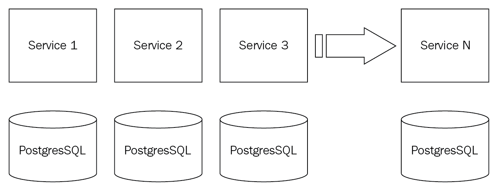
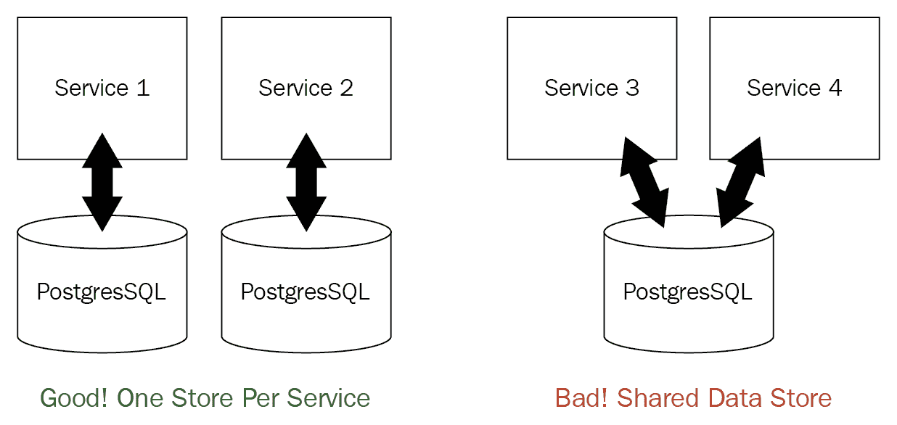
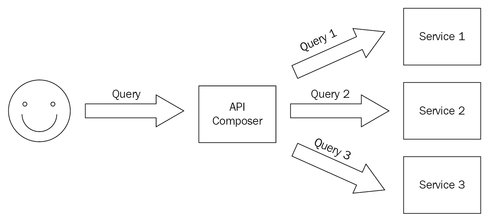

# 二、微服务入门

在前一章中，您了解了 Kubernetes 的全部内容，以及它如何很好地适合作为开发、部署和管理微服务的平台，甚至在自己的本地 Kubernetes 集群中玩了一会儿。在这一章中，我们将从总体上讨论微服务，以及为什么它们是构建复杂系统的最佳方式。我们还将讨论解决基于微服务的系统中常见问题的各个方面、模式和方法，以及它们与其他常见体系结构(如单体和大型服务)的比较。

我们将在本章中介绍大量材料:

*   小型编程–少即是多
*   让您的微服务实现自治
*   使用接口和契约
*   通过应用编程接口公开您的服务
*   使用客户端库
*   管理依赖关系
*   编排微服务
*   利用所有权
*   理解康威定律
*   跨多个服务的故障排除
*   利用共享服务库
*   选择源代码控制策略
*   创建数据策略

# 技术要求

在本章中，您将看到一些使用 Go 的代码示例。我建议您安装 Go，并尝试自己构建和运行代码示例。

# 在苹果电脑上安装自制软件

在 macOS 上，我建议使用家酿:

```
$ brew install go
```

接下来，确保`go`命令可用:

```
$ ls -la `which go`
lrwxr-xr-x  1 gigi.sayfan  admin  26 Nov 17 09:03 /usr/local/bin/go -> ../Cellar/go/1.11.2/bin/go
```

要查看所有选项，只需键入`go`。另外，确保在`.bashrc`文件中定义`GOPATH`，并将`$GOPATH/bin`添加到路径中。

Go 附带的 Go CLI 提供了许多功能，但您可能希望安装其他工具。看看[https://awesome-go.com/](https://awesome-go.com/)。

# 在其他平台上安装 Go

在其他平台上，按照这里的官方指示:[https://golang.org/doc/install.](https://golang.org/doc/install)

# 代码

你可以在这里找到本章的代码:[https://github . com/PacktPublishing/hand-On-microservice-with-Kubernetes/tree/master/chapter 02](https://github.com/PacktPublishing/Hands-On-Microservices-with-Kubernetes/tree/master/Chapter02)。

# 小型编程–少即是多

想想你学编程的时间。你编写了一些小程序，接受简单的输入，做一些处理，并产生一些输出。生活很美好。你可以把整个计划都记在脑子里。

你理解每一行代码。调试和故障排除很容易。例如，考虑一个在摄氏和华氏之间转换温度的程序:

```
package main

import (
        "fmt"
        "os"
        "strconv"
)

func celsius2fahrenheit(t float64) float64 {
        return 9.0/5.0*t + 32
}

func fahrenheit2celsius(t float64) float64 {
        return (t - 32) * 5.0 / 9.0
}

func usage() {
      fmt.Println("Usage: temperature_converter <mode> <temperature>")
      fmt.Println()
      fmt.Println("This program converts temperatures between Celsius and Fahrenheit")
      fmt.Println("'mode' is either 'c2f' or 'f2c'")
      fmt.Println("'temperature' is a floating point number to be converted according to mode")
     os.Exit(1)
}

func main() {
         if len(os.Args) != 3 {
                usage()
          }
          mode := os.Args[1]
          if mode != "f2c" && mode != "c2f" {
                  usage()
          }

          t, err := strconv.ParseFloat(os.Args[2], 64)
          if err != nil {
                  usage()
           }

          var converted float64
           if mode == "f2c" {
                  converted = fahrenheit2celsius(t)
           } else {
                   converted = celsius2fahrenheit(t)
           }
           fmt.Println(converted)
}
```

这个程序很简单。如果出现问题，它会很好地验证其输入并显示使用信息。程序所做的实际计算只是两行转换温度的代码，但它有 45 行长。甚至没有任何评论。然而，这 45 行非常易读且易于测试。没有任何第三方依赖(只有 Go 标准库)。没有 IO(文件、数据库、网络)。不需要认证或授权。没有必要对通话进行费率限制。没有日志记录，没有度量收集。没有版本控制、运行状况检查或配置。没有部署到多个环境，也没有生产中的监控。

现在，考虑将这个简单的程序集成到一个大型企业系统中。你必须考虑这些方面中的许多方面。系统的其他部分将开始使用温度转换功能。突然间，最简单的操作可能会产生连锁反应。系统其他部分的变化可能会影响温度转换器:


复杂性的这种跃升是自然的。大型企业系统有许多要求。微服务的承诺是，通过遵循适当的体系结构准则和已建立的模式，额外的复杂性可以被巧妙地打包，并跨许多小的微服务使用，这些服务一起工作来实现系统目标。理想情况下，服务开发人员可以在大部分时间里不受包含系统的影响。然而，要提供适当程度的隔离，并且仍然允许在整个系统的环境中进行测试和调试，这需要很大的努力。

# 让您的微服务实现自治

对抗复杂性的最好方法之一是让您的微服务自治。自治服务是一种不依赖于系统中其他服务或第三方服务的服务。自治服务管理自己的状态，并且很大程度上不知道系统的其余部分。

我喜欢认为自主微服务类似于不可变函数。自治服务永远不会改变系统中其他组件的状态。这种服务的好处是它们的复杂性保持不变，不管系统的其他部分如何发展，也不管其他服务如何使用它们。

# 使用接口和契约

接口是软件工程师可以使用的最好工具之一。一旦您将某个东西公开为接口，您就可以自由地更改它背后的实现。接口是在单个进程中使用的构造。它们对于测试与其他组件的交互非常有用，这在基于微服务的系统中非常丰富。这是我们的示例应用的一个界面:

```
type UserManager interface {
   Register(user User) error
   Login(username string, authToken string) (session string, err error)
   Logout(username string, session string) error
}
```

`UserManager`界面定义了一些方法、它们的输入和输出。但是，它没有指定语义。例如，如果为已经登录的用户调用`Login()`方法会发生什么？是错误吗？前一个会话是否已终止并创建了新会话？它是否在返回现有会话时没有错误(幂等方法)？这类问题通过合同来回答。合同很难完全指定，Go 不提供任何合同支持。但是，合同是重要的，它们总是存在的，即使只是隐含的。

Some languages don't support interfaces as a first-class syntactic construct of the language. However, it is very easy to accomplish the same effect. Languages with dynamic typing, such as Python, Ruby, and JavaScript, allow you to pass any object that satisfies the set of attributes and methods used by the caller. Static languages, such as C and C++, get by with sets of function pointers (C) or structs with only pure virtual functions (C++).

# 通过应用编程接口公开您的服务

微服务相互交互，有时通过网络与外部世界交互。服务通过应用编程接口公开其功能。我喜欢把 API 看作是网络接口。编程语言接口使用编写它们的语言的语法(例如，Go 的接口类型)。现代网络 API 也使用一些高级表示。基础是 UDP 和 TCP。然而，微服务通常会通过网络传输来展示它们的能力，比如 HTTP (REST，GraphQL，SOAP)，HTTP/2 (gRPC)，或者在某些情况下，网络套接字。有些服务可能会模仿其他有线协议，如 memcached，但这在特殊情况下很有用。2019 年，真的没有理由直接通过 TCP/UDP 构建自己的自定义协议，也没有理由使用专有的和特定语言的协议。诸如 Java RMI、.NET 远程处理、DCOM 和 CORBA 最好留在过去，除非您需要支持一些遗留的代码库。

微服务分为两类，如下所示:

*   内部微服务只能由通常在同一个网络/集群中运行的其他微服务访问，这些服务可以公开更专门的 API，因为您可以同时控制服务及其客户端(其他服务)。
*   外部服务对世界开放，通常需要从使用多种语言的网络浏览器或客户端使用。

与标准语言无关的传输相比，使用标准网络 API 的好处在于它支持微服务的多语种承诺。每个服务都可能用自己的编程语言实现(例如，一个服务用 Go 实现，另一个用 Python 实现)，它们甚至可能在以后迁移到完全不同的语言(Rust，有人吗？)而不会中断，因为所有这些服务都通过网络 API 进行交互。稍后我们将研究多语种方法及其权衡。

# 使用客户端库

使用接口非常方便。您在编程语言环境中操作，使用本机数据类型调用方法。使用网络 API 是不同的。根据传输方式，您需要使用网络库。您需要序列化您的负载和响应，并处理网络错误、断开连接和超时。客户端库模式封装了远程服务和所有这些决策，并为您提供了一个标准接口，作为服务的客户端，您只需调用它。幕后的客户端库将处理所有与调用网络应用编程接口相关的仪式。漏抽象定律([https://www . joelonsoftware . com/2002/11/11/漏抽象定律/](https://www.joelonsoftware.com/2002/11/11/the-law-of-leaky-abstractions/) )说，你不可能真正隐藏网络。但是，您可以对消费者服务非常有效地隐藏它，并使用关于超时、重试和缓存的策略对其进行正确配置。

One of the greatest selling points of gRPC is that it generates a client library for you.

# 管理依赖关系

现代系统有很多依赖性。有效地管理它们是软件开发生命周期的一大部分。有两种依赖关系:

*   库/包(链接到正在运行的服务流程)
*   远程服务(可通过网络访问)

这些依赖项可以是内部的，也可以是第三方的。您可以通过语言的包管理系统来管理库或包。Go 很长时间没有官方的包管理系统，出现了几个解决方案，比如 Glide 和 Dep。如今(围棋 1.12)，围棋模块是官方解决方案。

您通过发现端点和跟踪应用编程接口版本来管理远程服务。内部依赖和第三方依赖的区别在于变化的速度。内部依赖关系会变化得更快。有了微服务，您将拥有其他您所依赖的微服务。版本控制和跟踪 API 背后的契约成为开发中非常重要的方面。

# 协调微服务

当比较整体系统和基于微服务的系统时，有一点是清楚的。什么都有。单个微服务更简单，推理、修改和排除单个服务的故障也更容易。但是，理解整个系统、跨多个服务进行更改以及调试问题更具挑战性。在独立的微服务之间的网络上，还会发生更多的交互作用，在单块的情况下，这些交互作用会发生在同一个过程中。这意味着要从微服务中获益，您需要一种有纪律的方法，您需要应用最佳实践，并且有好的工具供您使用。

# 一致性与灵活性的权衡

假设你有一百个微服务，但是它们都非常小，非常相似。它们都使用相同的数据存储(例如，相同类型的关系数据库)。它们都以相同的方式配置(例如，配置文件)。它们都向集中式日志服务器报告错误和日志。它们都是使用相同的编程语言(例如，Go)实现的。通常，系统会处理几个用例。每个用例都将涉及这数百个微服务的某个子集。还会有一些在大多数用例中使用的通用微服务(例如，授权服务)。那么，如果有一些好的文档，从整体上理解系统可能就没有那么难了。您可以分别查看每个用例，当您扩展系统并添加更多用例，并且可能增长到一千个微服务时，复杂性仍然是有限的:



一个很好的类比是文件和目录。假设你按照流派、艺术家和歌曲来组织你的音乐。最初，你有三个流派，20 个艺术家，200 首歌曲。然后，你扩展了一切，现在有 10 个流派，50 个艺术家，3000 首歌曲。该组织仍然是流派/艺术家/歌曲的旧等级。的确，当你扩展的时候，纯粹的规模会带来新的问题。例如，对于音乐，当你有太多的音乐以至于它不适合你的硬盘时，你需要一个质的不同的解决方案(例如，把它保存在云中)。微服务也是如此，但分治法效果很好。如果你达到了互联网规模——亚马逊、谷歌、脸书——那么，是的，你将需要在每个方面都有更精细的解决方案。

但是，使用统一的微服务，您会牺牲许多好处。例如，团队和开发人员可能会被迫使用一种不适合该任务的编程语言，或者他们将不得不遵守严格的日志记录和错误报告操作标准，即使对于小型非关键内部服务也是如此。

您需要了解统一微服务和不同微服务的优缺点。从完全统一的微服务到无所不在的丛林，每个微服务都是独一无二的雪花。你的责任是为你的系统找到这个光谱上的最佳点。

# 利用所有权

因为微服务很小。单个开发人员可以拥有一个完整的微服务并完全理解它。其他开发人员可能也很熟悉它，但是即使只有一个开发人员熟悉某项服务，新开发人员接手应该也是相对简单和无痛的，因为范围非常有限，理想情况下是相似的。

独资可以非常强大。开发人员需要通过服务 API 与其他开发人员和团队进行通信，但是可以在实现上快速迭代。您可能仍然希望团队中的其他开发人员审查内部设计和实现，但是即使在所有者完全独立工作而没有监督的极端情况下，潜在的损害也是有限的，因为每个微服务的范围都很小，并且它通过定义良好的 API 与系统的其他部分进行交互。

生产率的差异可能令人瞠目结舌。

# 理解康威定律

康威定律定义如下:

"Organizations which design systems ... are constrained to produce designs which are copies of the communication structures of these organizations."

这意味着系统的结构将反映构建它的团队的结构。埃里克·雷蒙德的一个著名的变体是:

"If you have four groups building a compiler you'll get a 4-pass compiler."

这非常有见地，我个人在许多不同的组织中一次又一次地见证了这一点。这与基于微服务的系统非常相关。有了许多小型微服务，您不需要为每个微服务都有一个专门的团队。将会有一些更高级别的微服务组一起工作来产生系统的某些方面。现在，问题是如何思考高层结构。有三个主要选项:

*   垂直的
*   水平的
*   [数]矩阵

在这方面，微服务可能非常重要。作为小型自治组件，它们支持所有结构。但是，更重要的是当组织需要从一种方法过渡到另一种方法时。通常的轨迹是:水平|垂直|矩阵。

如果软件遵循基于微服务的体系结构，组织可以以更少的摩擦执行这些转换。这甚至可能是一个决定性因素。即使是一个不遵循基于微服务的架构的组织，也决定保留一个不合适的结构，因为打破整体的风险和努力太高了。

# 垂直的

垂直方法从包含多个微服务的系统中获取一部分功能，并且一个团队完全负责该功能，从设计到实施，再到部署和维护。团队像孤岛一样运作，他们之间的沟通通常是有限的和正式的。这种方法有利于微服务的各个方面，例如:

*   懂得多种语言的
*   灵活性
*   独立移动的零件
*   端到端所有权
*   垂直部分中不太正式的合同
*   易于扩展到更多垂直切片(只需组建另一个团队)
*   很难在垂直切片之间应用更改，尤其是当垂直切片的数量缩放时

由于其可伸缩性优势，这种方法在非常大的组织中很常见。全面改进也需要大量的创造力和努力。筒仓之间会有重复劳动。以完全重用和协调为目标是徒劳的。垂直方法的诀窍是找到最佳点，即公共功能以一种可以被多个孤岛使用的方式打包，但不需要明确的协调。

# 水平的

横向方法将系统视为分层架构。团队结构是沿着这些层组织的。可能有前端组、后端组和 DevOps 组。每个小组负责他们所在层的所有方面。垂直功能是通过跨所有层的不同组之间的协作来实现的。这种方法更适合拥有少量产品(有时只有一个)的小型组织。

横向方法的好处是，组织可以跨整个横向层构建专业知识和共享知识。通常，组织从一个横向组织开始，随着他们的发展，然后扩展到更多的产品，或者可能分布在多个地理位置，他们分成一个更垂直的结构。在每个筒仓内，结构通常是水平的。

# [数]矩阵

矩阵组织是最复杂的。您有自己的垂直筒仓，但组织认识到筒仓之间的重复和变化量浪费了资源，并且如果垂直筒仓过于多样化，也会使人员在垂直筒仓之间的调动具有挑战性。在矩阵式组织中，除了垂直筒仓之外，还有跨领域的小组，他们与所有垂直筒仓一起工作，并试图带来某种程度的一致性、统一性和有序性。例如，组织可能要求所有垂直思洛必须将其软件部署到 AWS 上的云中。在这种情况下，可能有一个云平台组在垂直孤岛之外进行管理，并为所有垂直孤岛提供指导、工具和其他共享服务。安全是另一个很好的例子。许多组织认为安全性是一个必须集中管理的领域，不能让每个孤岛随心所欲。

# 跨多个服务的故障排除

由于系统的大部分功能将涉及多个微服务之间的交互，因此能够跟踪所有这些微服务和各种数据存储中的请求是非常重要的。实现这一点的最好方法之一是分布式跟踪，您可以标记每个请求，并从头到尾跟踪它。

调试一般的分布式系统和基于微服务的分布式系统需要大量的专业知识。考虑系统中单个请求的以下方面:

*   处理请求的微服务可以使用不同的编程语言。
*   微服务可以使用不同的传输/协议公开应用编程接口。
*   请求可能是异步工作流的一部分，涉及在队列中等待和/或定期处理。
*   请求的持久状态可以分布在由不同微服务控制的许多独立数据存储中。

当您需要调试系统中所有微服务的问题时，每个微服务的自治特性就会成为障碍。您必须构建明确的支持，以便能够通过聚合来自多个微服务的内部信息来获得系统级可见性。

# 利用共享服务库

如果您选择统一的微服务方法，那么拥有一个所有服务都使用的共享库(或多个库)并实现许多交叉关注点是非常有用的，例如:

*   配置
*   秘密管理
*   服务发现
*   原料药包装
*   记录
*   分布式跟踪

该库可以实现整个工作流，如身份验证和授权，与其他微服务或第三方依赖项进行交互，并为每个微服务执行繁重的工作。这样，微服务只负责正确使用这些库，并实现自己的功能。

即使您选择多语种路径并支持多种语言，这种方法也可以工作。您可以为所有支持的语言实现这个库，并且服务本身可以用不同的语言实现。

然而，共享库的维护和发展以及所有微服务采用它们的速度都有相关的成本。一个真正的危险是，当使用不同版本共享库的服务试图通信时，不同的微服务将使用许多版本的共享库，并导致微妙(或不那么微妙)的问题。

我们将在本书后面探讨的服务网格方法可以为这个问题提供一些答案。

# 选择源代码控制策略

这是一个非常有趣的场景。主要有两种方式:单一回购和多重回购。让我们探讨一下每种方法的优缺点。

# 单一回购

在 monorepo 方法中，您的整个代码库都在一个源代码管理存储库中。对整个代码库执行操作非常容易。每当您进行更改时，它都会立即反映在您的整个代码库中。版本控制几乎是不可能的。这对于保持所有代码同步非常有用。但是，如果您确实需要增量升级系统的某些部分，您将需要想出变通办法，例如用新的更改创建一个单独的副本。此外，您的源代码总是同步的这一事实并不意味着您部署的服务都使用最新版本。如果你总是一次部署所有的服务，你几乎是在建造一个整体。请注意，如果您向第三方开源项目投稿，您可能仍然有多个回购(即使您在合并更改后仅使用上游版本)。

单一回购的另一个大问题是，您可能需要大量定制工具来管理您的多回购。大型公司，如谷歌和微软，使用多回购方法。他们有特殊的需求，定制的工具不会阻止他们。我对多回购方法是否适合较小的组织持观望态度。然而，我将使用一个面向 Delinkcious 的单一回购——演示应用——因此，我们将一起探讨它并形成一个观点。一个主要的缺点是，许多现代 CI/CD 工具链使用 GitOps，这触发了源代码控制重新发布的变化。当只有一个 monorepo 时，就会丢失源代码管理 repo 和微服务之间的一对一映射。

# 多次回购

多重回购的方式恰恰相反。每个项目，通常还有每个库，都有一个独立的源代码管理存储库。项目就像第三方库一样相互消耗。这种方法有几个优点:

*   明确项目和服务之间的物理界限。
*   源代码管理存储库和服务或项目的一对一映射。
*   将服务部署映射到源代码管理存储库很容易。
*   统一处理所有依赖关系—内部和第三方。

但是，这种方法有很大的成本，尤其是随着服务和项目数量的增长，它们之间的依赖关系图变得更加复杂:

*   应用更改通常需要跨多个存储库进行更改。
*   您经常需要维护一个存储库的多个版本，因为不同的服务依赖于不同的服务。
*   很难在所有存储库中应用跨领域的更改。

# 混合物

混合方法包括使用少量的存储库。每个存储库包含多个服务和项目。每个存储库都与其他存储库隔离开来，但是在每个 repo 中，可以同步开发多个服务和项目。这种方法平衡了单一回购和多重回购的利弊。当有明确的组织边界和地理边界时，这可能是有用的。例如，如果一家公司有多个完全独立的产品线，将每个产品线分成自己的 monorepo 可能是个好主意。

# 创建数据策略

软件系统最重要的职责之一是管理数据。有许多类型的数据，并且大多数数据应该在系统出现任何故障时仍然存在，或者您应该能够重建它。数据通常与其他数据有复杂的关系。这在关系数据库中非常明显，但也存在于其他类型的数据中。单片通常使用大型数据存储来保存所有相关数据，因此可以对整个数据集执行查询和事务。微服务是不同的。每个微服务都是自治的，并对其数据负责。然而，系统作为一个整体需要查询和操作现在存储在许多独立数据存储中并由许多不同服务管理的数据。让我们看看如何使用最佳实践来解决这个难题。

# 每个微服务一个数据存储

每个微服务一个数据存储是微服务架构的一个关键元素。一旦两个微服务可以直接访问同一个数据存储，它们就会紧密耦合，不再独立。有几个重要的细微差别需要理解。多个微服务使用同一个数据库实例可能是可以的，但是它们不能共享同一个逻辑数据库。

数据库实例是一个资源调配问题。在某些情况下，开发微服务的团队也负责提供其数据存储。在这种情况下，明智的做法可能是为每个微服务创建物理上独立的数据库实例，而不仅仅是逻辑实例。请注意，当使用云数据存储时，微服务开发人员无法控制并且不知道数据存储的物理配置。

我们同意两个微服务不应该共享同一个数据存储。但是，一个微服务管理两个或更多数据存储怎么办？这也是一般人所不赞同的。如果您的设计需要两个独立的数据存储，最好为每个存储指定一个微服务:



有一个常见的例外——您可能希望通过同一个微服务来管理内存中的数据存储(缓存)和持久数据存储。工作流是服务正在写入持久存储和缓存，并从缓存中提供查询。缓存或者定期刷新，或者基于更改通知，或者在缓存未命中时刷新。

但是，即使在这种情况下，拥有一个单独的集中式缓存可能是一个更好的设计，例如由单独的微服务管理的 Redis。请记住，在为许多用户服务的大型系统中，每个微服务可能有多个实例。

从微服务本身抽象出数据存储的物理配置和供应的另一个原因是，这些配置在不同的环境中可能不同。您的生产环境可能为每个微服务提供物理上独立的数据存储，但是，在您的开发环境中，最好只有一个包含大量小型逻辑数据库的物理数据库实例。

# 运行分布式查询

我们同意每个微服务都应该有自己的数据存储。这意味着系统的整体状态将分布在多个数据存储中，只能从它们自己的微服务中访问。最有趣的查询将涉及多个数据存储中可用的数据。每个消费者只需访问所有这些微服务，并聚合所有数据来满足他们的查询。然而，这是次优的，原因有几个:

*   消费者非常清楚系统是如何管理数据的。
*   消费者需要访问存储与查询相关的数据的每一项服务。
*   改变架构可能需要改变很多消费者。

有两种常见的解决方案来解决这个问题:CQRS 和原料药组成。它很酷的一点是，支持这两种解决方案的服务具有相同的 API，因此可以从一种解决方案切换到另一种解决方案，甚至混合匹配，而不会影响用户。这意味着一些查询将由 CQRS 提供服务，而其他查询将由 API 组合提供服务，所有这些都由同一个服务实现。总的来说，我建议从原料药的组成开始，只有在适当的条件存在，并且由于其高得多的复杂性，利益是令人信服的情况下，才过渡到 CQRS。

# 使用命令查询责任分离

借助**命令查询责任隔离** ( **CQRS** )，来自各种微服务的数据被聚合到一个新的只读数据存储中，该存储旨在回答特定的查询。该名称的含义是将更新数据(命令)的责任与读取数据(查询)的责任分开(隔离)。不同的部门负责这些活动。它通常通过监视所有数据存储的更改来实现，并且需要一个适当的更改通知系统。您也可以使用轮询，但这通常是不可取的。当存在经常使用的已知查询时，这种解决方案会非常有用。

这里有一个 CQRS 在行动的例子。CQRS 服务(负责查询)从三个微服务(负责更新)接收变更通知，并将它们聚合到自己的数据存储中。

当查询到来时，CQRS 服务通过访问自己的聚合视图来响应，而不触及微服务:


优点如下:

*   查询不会干扰主数据存储的更新。
*   聚合器服务公开了一个为特定查询定制的应用编程接口。
*   在不影响消费者的情况下，更容易改变数据的幕后管理方式。
*   快速响应时间。

缺点如下:

*   它增加了系统的复杂性。
*   它复制了数据。
*   局部视图需要明确处理。

# 使用原料药组成

应用编程接口组合方法更加轻量级。从表面上看，它就像 CQRS 解决方案。它公开了一个可以跨多个微服务回答众所周知的查询的应用编程接口。不同的是，它没有自己的数据存储。每当有请求进来时，它将访问包含数据的单个微服务，合成结果，并返回它们。当系统不支持数据更改的事件通知时，当对主数据存储运行查询的负载是可接受的时，这种解决方案就能发挥作用。

下面是一个正在运行的 API 组合的示例，其中对 API composer 服务的查询被翻译成对三个微服务的查询:



优点如下:

*   轻量级解决方案。
*   聚合器服务公开了一个为特定查询定制的应用编程接口。
*   结果总是最新的。
*   没有架构要求，例如事件通知。

缺点如下:

*   任何服务的失败都会导致查询失败。这需要关于重试和超时的策略决策。
*   大量查询可能会影响主数据存储。

# 使用实景图管理跨多个服务的事务

当一切运行良好时，API composer 和 CQRS 模式为分布式查询提供了足够的解决方案。然而，维护分布式数据完整性是一个复杂的问题。如果您将所有数据存储在单个关系数据库中，并在模式中指定适当的约束，那么您可以依赖数据库引擎来处理数据完整性。当多个微服务在隔离的数据存储(关系或非关系)中维护您的数据时，情况就大不相同了。数据完整性是必不可少的，但它必须由您的代码来维护。佐贺模式解决了这个问题。在深入研究 saga 模式之前，让我们先了解一下数据完整性。

# 理解 ACID

数据完整性的一个常见度量是修改数据的所有事务都具有 ACID 属性:

*   **原子**:事务中所有操作成功或全部失败。
*   **一致**:数据的状态符合交易前后的所有约束。
*   **孤立的**:并发事务的行为就像序列化一样。
*   **持久**:当事务成功完成时，结果被持久化。

ACID 属性并不特定于关系数据库，但经常在该上下文中使用，这主要是因为关系模式及其形式约束提供了方便的一致性度量。隔离属性通常具有严重的性能影响，并且在一些偏好高性能和最终一致性的系统中可能会有所放松。

耐久性非常明显。如果您的数据不能安全地持久化，那么就没有必要去找所有的麻烦。持久性有不同的级别:

*   **对磁盘的持久性**:可以挺过节点重启，但没有磁盘故障
*   **多个节点上的冗余内存**:可以承受节点重启和磁盘故障，但不能承受所有节点的临时故障
*   **冗余磁盘**:可以在磁盘出现故障时存活
*   **地理分布副本**:可以在整个数据中心宕机的情况下存活
*   **备份**:存储大量信息成本较低，但恢复速度较慢，往往滞后于实时

原子性要求也是显而易见的。没有人喜欢局部更改，这可能会破坏数据完整性，并以难以排除故障的不可预测的方式破坏系统。

# 理解 CAP 定理

CAP 定理指出，分布式系统不能同时具有所有三个属性:

*   一致性
*   有效性
*   分区弹性

实际上，你可以选择你想要的是 CP 系统还是 AP 系统。一个 **CP** 系统(**一致和分区弹性**)总是一致的，如果组件之间存在网络分区，它将不会服务于查询或进行更改。只有当系统完全连接时，它才会起作用。这显然意味着您没有可用性。另一方面，一个 **AP** 系统(**可用，分区弹性**)始终可用，并且可以以裂脑方式运行。当系统分裂时，每个部分都可以继续正常运行，但是系统会不一致，因为每个部分都不知道另一部分正在发生事务。

接入点系统通常被称为最终一致系统，因为当连接恢复时，一些协调过程会确保整个系统再次同步。一个有趣的变体是冻结系统，其中，当网络分区发生时，它们优雅地降级，并且两个部分继续服务于查询，但是拒绝对系统的所有修改。请注意，不能保证在分区时，两个部分是一致的，因为一个部分中的一些事务可能仍然不会复制到另一个部分。通常，这已经足够好了，因为分割部分之间的差异很小，并且不会随着时间的推移而增加，因为新的更改被拒绝。

# 将 saga 模式应用于微服务

关系数据库可以通过算法为分布式系统提供 ACID 遵从性，例如两阶段提交和对所有数据的控制。两阶段提交算法分两个阶段工作:准备和提交。但是，参与分布式事务的服务必须共享同一个数据库。这对管理自己数据库的微服务不起作用。

输入传奇模式。saga 模式的基本思想是对所有微服务的操作进行集中管理，对于每个操作，都有一个补偿操作，如果由于某种原因整个事务无法完成，就会执行这个补偿操作。这实现了 ACID 的原子性。但是，每个微服务上的变化是立即可见的，而不仅仅是在整个分布式事务的末尾。这违反了一致性和隔离属性。如果你把你的系统设计成 AP，也就是**最终一致**，这不是问题。但是，它要求您的代码意识到这一点，并且能够处理可能部分不一致或过时的数据。在许多情况下，这是一个可以接受的妥协。

传奇是如何运作的？saga 是微服务上的一组操作和相应的补偿操作。当一个操作失败时，它的补偿操作和所有先前操作的补偿操作被反向调用，以回滚系统的整个状态。

实录的实现并不简单，因为补偿操作也可能失败。一般来说，临时状态必须是持久的并标记为持久状态，并且必须存储大量元数据以实现可靠的回滚。一个好的做法是让带外流程频繁运行，并清理未能实时完成所有补偿操作的失败传奇。

思考传奇的一个好方法是将其视为工作流。工作流很酷，因为它们支持甚至涉及人类而不仅仅是软件的长流程。

# 摘要

在这一章中，我们涉及了很多方面。我们讨论了微服务的基本原理——少即是多——以及将您的系统分解为许多小型且独立的微服务如何帮助它扩展。我们还讨论了利用微服务架构的开发人员面临的挑战。我们提供了一系列概念、选项、最佳实践和关于构建基于微服务的系统的实用建议。在这一点上，您应该欣赏微服务提供的灵活性，但也应该对您可以选择的许多利用它们的方式有一点担心。

在本书的其余部分，我们将详细探索地形，并使用一些最佳的可用框架和工具一起构建一个基于微服务的系统，并将其部署在 Kubernetes 上。在下一章中，您将遇到我们的示例应用 Delinkcious，它将作为一个动手实验室。您还将看到 Go-kit，一个用于构建 Go 微服务的基于微服务的框架。

# 进一步阅读

如果你对微服务感兴趣，我推荐以下文章作为起点:[https://www.martinfowler.com/](https://www.martinfowler.com/)