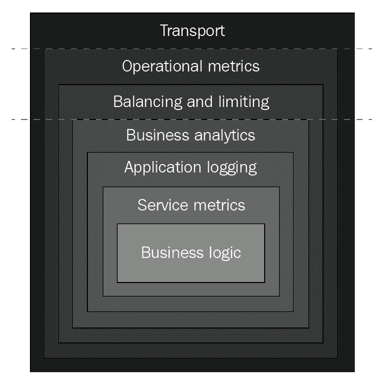

# 三、Delinkcious——示例应用

Delinkcious 是一个美味([https://en . Wikipedia . org/wiki/Delicious _(网站)](https://en.wikipedia.org/wiki/Delicious_(website)))的崇拜者。美味曾经是一个为用户管理链接的网络热门。它被雅虎收购，被反弹，被多次出售。它最终被 Pinboard 收购，后者经营着类似的服务，并打算很快关闭美味。

Delinkcious 允许用户将网址存储在网络上很酷的地方，标记它们，并以各种方式查询它们。在本书中，德林奇斯将作为一个实时实验室，展示许多微服务和Kubernetes概念，以及现实世界应用环境中的特性。重点将放在后端，因此不会有时髦的前端网络应用或移动应用。我会把这些作为可怕的练习留给你。

在这一章中，我们将了解我为什么选择 Go 作为 delinkcies 的编程语言，然后看看 **Go 工具包**——我将用来构建 delinkcies 的一个优秀的 Go 微服务工具包。然后，我们将使用社交图服务作为运行示例来剖析 Delinkcious 本身的不同方面。

我们将涵盖以下主题:

*   美味的微服务
*   美味的数据存储
*   美味的 api
*   美味的客户图书馆

# 技术要求

如果到目前为止您一直在关注这本书，那么您将已经安装了 Go。我建议安装一个好的 Go IDE 来遵循本章中的代码，因为要经历的事情很多。让我们来看看几个好的选择。

# Visual Studio 代码

**Visual Studio Code** ，又名**VS Code**([https://code.visualstudio.com/docs/languages/go](https://code.visualstudio.com/docs/languages/go))，是微软的开源 IDE。它不是 Go 专用的，但是通过专用的复杂 Go 扩展与 Go 深度集成。它被认为是最好的免费 Go IDE。

# 戈兰高地

喷气大脑的高尔夫([https://www.jetbrains.com/go/](https://www.jetbrains.com/go/))是我个人最喜欢的。它遵循了 IntelliJ IDEA、PyCharm 和其他伟大的 IDEA 的伟大传统。这是一个 30 天免费试用的付费版本。不幸的是，没有社区版。如果你买得起，我强烈推荐。如果你不能或者不想为 IDE 付费(完全合理)，看看其他选项。

# LiteIDE

litide 或 litide X([https://github.com/visualfc/liteide](https://github.com/visualfc/liteide))是一个非常有趣的开源项目。这是最早的 Go IDEs 之一，它早于 GoLand 和 VS Code 的 Go 扩展。我早期用过，对它的质量感到惊讶。由于通过 **GNU 项目调试器** ( **GDB** )进行交互调试遇到困难，我最终放弃了它。它是积极开发的，有很多贡献者，并支持所有最新和最伟大的围棋功能，包括围棋 1.1 和围棋模块。您现在可以使用 Delve 进行调试，这是类 Go 调试器中最好的。

# 其他选项

如果你是一个死忠的命令行人，一点也不喜欢 IDEs，你有很多选择。大多数编程和文本编辑器都有某种形式的 Go 支持。围棋维基([https://github.com/golang/go/wiki/IDEsAndTextEditorPlugins](https://github.com/golang/go/wiki/IDEsAndTextEditorPlugins))有一大堆 ide 和文本编辑器插件，所以去看看吧。

# 代码

在本章中，没有任何代码文件，因为您将刚刚开始了解德林奇应用:

*   它托管在自己的 GitHub 存储库中，可以在:[https://github.com/the-gigi/delinkcious](https://github.com/the-gigi/delinkcious)找到。
*   查看 **v0.1** 标签|发布:[https://github.com/the-gigi/delinkcious/releases/tag/v0.1](https://github.com/the-gigi/delinkcious/releases/tag/v0.1)。
*   克隆它，并使用您最喜欢的 IDE 或文本编辑器来跟进。
*   请记住，本书的一般代码示例在另一个 GitHub 存储库中:[https://GitHub . com/PacktPublishing/hand-microservice-with-Kubernetes/](https://github.com/PacktPublishing/Hands-On-Microservices-with-Kubernetes/)。

# 选择美味的 go

我用许多优秀的语言编写并发布了生产后端代码，比如 C/C++、Python、C#，当然还有 Go。我也使用了一些不太好的语言，但是我们不要讨论这些。我决定使用 Go 作为 Delinkcious 的编程语言，因为它是一种非常适合微服务的语言:

*   Go 编译成一个没有外部依赖的二进制文件(对于简单的 Dockerfiles 来说太棒了)。
*   围棋可读性很强，容易学。
*   Go 对网络编程和并发性有很好的支持。
*   Go 是许多云原生数据存储、队列和框架(包括 Docker 和 Kubernetes)的实现语言。

你可能会说微服务应该是语言不可知的，我不应该只关注一种语言。这是真的，但我的目标是在这本书里非常实际，深入研究在 Kubernetes 上构建微服务的所有细节。要做到这一点，我必须做出具体的选择并坚持下去。试图用多种语言达到同样的深度是徒劳的。也就是说，微服务的边界非常清晰(微服务的优势之一)，您可以看到用另一种语言实现微服务会给系统的其他部分带来一些问题。

# 了解围棋套件

您可以从头开始编写您的微服务(用 Go 或任何其他语言)，它们将通过它们的 API 很好地相互交互。但是，在现实世界的系统中，会有大量您希望保持一致的共享和/或交叉问题:

*   配置
*   秘密管理
*   中央日志记录
*   韵律学
*   证明
*   批准
*   安全
*   分布式跟踪
*   服务发现

实际上，大多数大型生产系统中的微服务都需要遵守针对这些问题的特定策略。

进入围棋套件([https://gokit.io/](https://gokit.io/))。Go kit 在微服务领域采用了非常模块化的方法。它提供了高度的关注点分离，推荐的构建微服务的方法，以及很大的灵活性。正如网站所说，*没什么意见，淡淡地持有*。

# 使用 Go 工具包构建微服务

Go kit 是关于最佳实践的。您的业务逻辑被实现为只处理接口和 Go 结构的纯 Go 库。API、序列化、路由和网络中涉及的所有复杂方面都将被归入明显不同的层，这些层利用了 Go kit 的概念和基础设施，如传输、端点和服务。这带来了很好的开发体验，您可以在尽可能简单的环境中开发和测试应用代码。这是德林奇服务之一的界面——社交图。请注意，它是普通围棋。没有应用编程接口、微服务甚至围棋工具包导入的概念:

```
type SocialGraphManager interface {
   Follow(followed string, follower string) error
   Unfollow(followed string, follower string) error

   GetFollowing(username string) (map[string]bool, error)
   GetFollowers(username string) (map[string]bool, error)
}
```

该接口的实现驻留在一个 Go 包中，该包仍然完全不知道 Go 工具包，甚至不知道它正被用于微服务的事实:

```
package social_graph_manager

import (
   "errors"
   om "github.com/the-gigi/delinkcious/pkg/object_model"
)

type SocialGraphManager struct {
   store om.SocialGraphManager
}

func (m *SocialGraphManager) Follow(followed string, follower string) (err error) {
    ...
}

func (m *SocialGraphManager) Unfollow(followed string, follower string) (err error) {
    ...
}

func (m *SocialGraphManager) GetFollowing(username string) (map[string]bool, error) {
    ...
}

func (m *SocialGraphManager) GetFollowers(username string) (map[string]bool, error) {
    ...
}
```

将 Go kit 服务视为不同层次的洋葱是一个很好的方法。核心是您的业务逻辑，最重要的是各种关注点，如路由、速率限制、日志记录和指标，它们最终会通过传输暴露给其他服务或世界:



Go kit 主要通过使用请求-响应模型来支持 RPC 风格的通信。

# 理解运输

微服务最大的问题之一是它们通过网络相互之间以及与客户之间进行交互；也就是说，至少比在同一个进程中调用方法要复杂一个数量级。Go kit 通过传输概念为微服务的网络方面提供了明确的支持。

Go kit 传输封装了所有复杂性，并与请求、响应和端点等其他 Go kit 结构相集成。Go 套件正式支持以下开箱运输:

*   超文本传送协议
*   gRPC
*   节约
*   net/rpc

然而，在其 GitHub 存储库中还有几个传输，包括用于消息队列和发布/订阅的 AMQP 和 NATS 传输。关于 Go kit 传输的一个很酷的事情是，你可以通过多个传输来公开同一个服务，而不需要改变你的代码。

# 了解端点

Go kit 微服务实际上只是一组端点。每个端点对应于服务接口中的一个方法。端点总是与至少一个传输和您为服务请求而实现的处理程序相关联。Go 工具包端点支持 RPC 风格的通信，并具有请求和响应结构。

以下是`Follow()`方法端点的工厂功能:

```
func makeFollowEndpoint(svc om.SocialGraphManager) endpoint.Endpoint {
   return func(_ context.Context, request interface{}) (interface{}, error) {
      req := request.(followRequest)
      err := svc.Follow(req.Followed, req.Follower)
      res := followResponse{}
      if err != nil {
         res.Err = err.Error()
      }
      return res, nil
   }
}
```

我很快会解释这里发生了什么。现在，只需注意它接受一个`om.SocialGraphManager`类型的`svc`参数，这是一个接口，它调用它的`Follow()`方法。

# 了解服务

这是你的代码插入系统的地方。当调用端点时，它会调用服务实现中相应的方法来完成所有工作。编码和解码请求和响应的所有艰苦工作都由端点包装器完成。您可以使用最有意义的抽象来关注您的应用逻辑。

下面是`SocialGraphManager`函数的`Follow()`方法的实现:

```
func (m *SocialGraphManager) Follow(followed string, follower string) (err error) {
   if followed == "" || follower == "" {
      err = errors.New("followed and follower can't be empty")
      return
   }

   return m.store.Follow(followed, follower)
}
```

# 理解中间件

Go kit 是可组合的，如前面的洋葱图所示。除了强制的传输、端点和服务之外，Go kit 还使用装饰器模式来可选地包装具有交叉关注的服务和端点，例如:

*   弹性(例如，指数回退重试)
*   认证和授权
*   记录
*   度量收集
*   分布式跟踪
*   服务发现
*   限速

这种具有少量抽象(如传输、端点和服务)的坚实核心的方法，可以使用统一的中间件机制进行扩展，很容易理解和使用。Go kit 在为中间件提供足够的内置功能和为您的需求留出空间之间取得了适当的平衡。例如，在 Kubernetes 上运行时，会为您处理服务发现。在这种情况下，您不必绕着 Go kit 工作，这很好。您并不绝对需要的特性和功能是可选的。

# 理解客户

在[第 2 章](02.html)*微服务入门*中，我们讨论了微服务的客户端库原理。与另一个微服务对话的微服务理想地利用了通过接口公开的客户端库。Go kit 为编写这样的客户端库提供了出色的支持和指导。使用微服务只是接收一个接口。事实上，它与另一个服务对话是完全不可知的。对于(几乎)所有的意图和目的，远程服务可以在相同的进程中运行。这对于测试或重构服务以及将稍微过大的服务分成两个独立的服务来说是非常好的。

Go kit 的客户端端点类似于服务端点，但工作方向相反。服务端点解码请求，将工作委托给服务，并对响应进行编码。客户端端点编码请求，通过网络调用远程服务，并解码响应。

下面是客户端的`Follow()`方法的样子:

```
func (s EndpointSet) Follow(followed string, follower string) (err error) {
   resp, err := s.FollowEndpoint(context.Background(), FollowRequest{Followed: followed, Follower: follower})
   if err != nil {
      return err
   }
   response := resp.(SimpleResponse)

   if response.Err != "" {
      err = errors.New(response.Err)
   }
   return
}
```

# 生成样板文件

关注点的清晰分离和 Go kit 整洁的架构分层是有代价的。代价是在不同的结构和方法签名之间转换请求和响应的大量无聊、令人麻木和容易出错的样板代码。了解 Go kit 如何以通用的方式支持强类型接口是很有用的，但是对于大型项目，首选的解决方案是从 Go 接口和数据类型生成所有样板文件。这个任务有几个项目，包括 Go kit 自己开发的名为**kitgen**([https://github.com/go-kit/kit/tree/master/cmd/kitgen](https://github.com/go-kit/kit/tree/master/cmd/kitgen))的项目。

目前它被认为是实验性的。我是代码生成的忠实粉丝，强烈推荐。然而，在接下来的部分中，我们将查看大量手动样板代码，以弄清楚发生了什么，并避免任何魔法。

# 介绍美味的目录结构

处于初始开发阶段的脱欧系统包括三项服务:

*   链接服务
*   用户服务程序
*   社交图服务

高级目录结构包括以下子目录:

*   `cmd`
*   `pkg`
*   `svc`

`root`目录还包括一些常用文件如`README.md`和支持 Go 模块的重要`go.mod`和`go.sum`文件。我在这里使用的是 monorepo 方法，因此整个 Delinkcious 系统将生活在这个目录结构中，并被认为是一个单一的 Go 模块，尽管有许多包:

```
$ tree -L 1
.
├── LICENSE
├── README.md
├── go.mod
├── go.sum
├── cmd
├── pkg
└── svc
```

# cmd 子目录

`cmd`子目录包含支持开发和操作的各种工具和命令，以及涉及多个参与者、服务或外部依赖的端到端测试；例如，通过微服务的客户端库测试微服务。

目前，它只包含社交图服务的一个端到端测试:

```
$ tree cmd
cmd
└── social_graph_service_e2e
 └── social_graph_service_e2e.go
```

# pkg 子目录

`pkg`子目录是所有包所在的地方。它包括微服务、客户端库、抽象对象模型、其他支持包和单元测试的实现。大部分代码都是 Go 包的形式，在捆绑到实际的微服务中之前，开发和测试起来很简单:

```
$ tree pkg
pkg
├── link_manager
│   ├── abstract_link_store.go
│   ├── db_link_store.go
│   ├── db_link_store_test.go
│   ├── in_memory_link_store.go
│   ├── link_manager.go
│   └── link_manager_suite_test.go
├── link_manager_client
│   └── client.go
├── object_model
│   ├── README.md
│   ├── interfaces.go
│   └── types.go
├── social_graph_client
│   ├── client.go
│   └── endpoints.go
├── social_graph_manager
│   ├── db_scoial_graph_store.go
│   ├── db_social_graph_manager_test.go
│   ├── in_memory_social_graph_manager_test.go
│   ├── in_memory_social_graph_store.go
│   ├── social_graph_manager.go
│   └── social_graph_manager_suite_test.go
└── user_manager
 ├── db_user_manager_test.go
 ├── db_user_store.go
 ├── in_memory_user_manager.go
 ├── in_memory_user_manager_test.go
 ├── in_memory_user_store.go
 └── user_manager_suite_test.go
```

# svc 子目录

`svc`子目录是德林克微服务所在的地方。每个微服务都是一个独立的二进制文件，有自己的主包。`delinkcious_service`是遵循 API 网关([https://microservices.io/patterns/apigateway.html](https://microservices.io/patterns/apigateway.html))模式的公共伞式服务:

```
$ tree svc
svc
├── delinkcious_service
│   └── README.md
├── link_service
│   ├── link_service.go
│   └── transport.go
├── social_graph_service
│   ├── social_graph_service.go
│   └── transport.go
└── user_service
 ├── transport.go
 └── user_service.go
```

# 介绍美味的微服务

让我们详细检查一下德林奇服务，然后剥洋葱皮。我们将从内到外，从服务层开始，通过端点一直到传输。

有三种不同的服务:

*   链接服务
*   用户服务程序
*   社交图服务

他们共同协作提供了 Delinkcious 的功能，即管理用户的链接并跟踪他们的社交图(被关注者/追随者关系)。

# 对象模型

对象模型是服务实现的所有接口和相关数据类型的集合。我选择把它们都放在一个包裹里:`github.com/the-gigi/delinkcious/pkg/object_model`。它包含两个文件:`interfaces.go`和`types.go`。

`interfaces.go`文件包含三个描述服务的接口:

```
package object_model

type LinkManager interface {
   GetLinks(request GetLinksRequest) (GetLinksResult, error)
   AddLink(request AddLinkRequest) error
   UpdateLink(request UpdateLinkRequest) error
   DeleteLink(username string, url string) error
}

type UserManager interface {
   Register(user User) error
   Login(username string, authToken string) (session string, err error)
   Logout(username string, session string) error
}

type SocialGraphManager interface {
   Follow(followed string, follower string) error
   Unfollow(followed string, follower string) error

   GetFollowing(username string) (map[string]bool, error)
   GetFollowers(username string) (map[string]bool, error)
}

type LinkManagerEvents interface {
   OnLinkAdded(username string, link *Link)
   OnLinkUpdated(username string, link *Link)
   OnLinkDeleted(username string, url string)
}
```

`types.go`文件包含各种接口方法的签名中使用的结构:

```
package object_model

import "time"

type Link struct {
   Url         string
   Title       string
   Description string
   Tags        map[string]bool
   CreatedAt   time.Time
   UpdatedAt   time.Time
}

type GetLinksRequest struct {
   UrlRegex         string
   TitleRegex       string
   DescriptionRegex string
   Username         string
   Tag              string
   StartToken       string
}

type GetLinksResult struct {
   Links         []Link
   NextPageToken string
}

type AddLinkRequest struct {
   Url         string
   Title       string
   Description string
   Username    string
   Tags        map[string]bool
}

type UpdateLinkRequest struct {
   Url         string
   Title       string
   Description string
   Username    string
   AddTags     map[string]bool
   RemoveTags  map[string]bool
}

type User struct {
   Email string
   Name  string
}
```

`object_model`包只是使用基本的 Go 类型、标准库类型(`time.Time`)和用户定义的类型来描述域。都是纯围棋。在这个级别上，不存在对网络、应用编程接口、微服务或 Go 工具包的依赖或意识。

# 服务实现

下一层是将服务接口实现为简单的 Go 包。此时，每个服务都有自己的包:

*   `github.com/the-gigi/delinkcious/pkg/link_manager`
*   `github.com/the-gigi/delinkcious/pkg/user_manager`
*   `github.com/the-gigi/delinkcious/pkg/social_graph_manager`

请注意，这些是 Go 包名称，而不是网址。

让我们检查一下`social_graph_manager`包。它将`object_model`包导入为`om`，因为它需要实现`om.SocialGraphManager`接口。它定义了一个名为`SocialGraphManager`的`struct`，它有一个名为`om.SocialGraphManager`类型的`store`字段。因此，`store`字段的界面与本例中管理器的界面相同:

```
package social_graph_manager

import (
   "errors"
   om "github.com/the-gigi/delinkcious/pkg/object_model"
)

type SocialGraphManager struct {
   store om.SocialGraphManager
}
```

这可能有点令人困惑。其思想是`store`字段实现相同的接口，这样顶层管理器就可以实现一些验证逻辑，并将重任委托给商店。你很快就会看到这一点。

此外，`store`字段是一个接口的事实允许我们使用实现相同接口的不同商店。这非常有用。`NewSocialGraphManager()`函数接受一个不一定是`nil`的`store`字段，然后用提供的存储返回一个新的`SocialGraphManager`实例:

```
func NewSocialGraphManager(store om.SocialGraphManager) (om.SocialGraphManager, error) {
   if store == nil {
      return nil, errors.New("store can't be nil")
   }
   return &SocialGraphManager{store: store}, nil
}
```

结构本身非常简单。它执行一些有效性检查，然后将工作委托给它的`store`:

```
func (m *SocialGraphManager) Follow(followed string, follower string) (err error) {
   if followed == "" || follower == "" {
      err = errors.New("followed and follower can't be empty")
      return
   }

   return m.store.Follow(followed, follower)
}

func (m *SocialGraphManager) Unfollow(followed string, follower string) (err error) {
   if followed == "" || follower == "" {
      err = errors.New("followed and follower can't be empty")
      return
   }

   return m.store.Unfollow(followed, follower)
}

func (m *SocialGraphManager) GetFollowing(username string) (map[string]bool, error) {
   return m.store.GetFollowing(username)
}

func (m *SocialGraphManager) GetFollowers(username string) (map[string]bool, error) {
   return m.store.GetFollowers(username)
}
```

社交图管理器是一个非常简单的库。让我们继续剥洋葱，看看服务本身，它位于`svc`子目录下:[https://github . com/the-gigi/delinkcious/tree/master/SVC/social _ graph _ service](https://github.com/the-gigi/delinkcious/tree/master/svc/social_graph_service)。

先说`social_graph_service.go`档。我们将讨论与大多数服务相似的主要部分。文件存在`service`包中，这是我使用的约定。它导入了几个重要的包:

```
package service

import (
   httptransport "github.com/go-kit/kit/transport/http"
   "github.com/gorilla/mux"
   sgm "github.com/the-gigi/delinkcious/pkg/social_graph_manager"
   "log"
   "net/http"
)
```

Go 套件`http`传输包对于使用 HTTP 传输的服务是必要的。`gorilla/mux`封装提供了顶级的路由功能。`social_graph_manager`是服务的实现，它承担了所有的重担。`log`包用于日志记录，`net/http`包用于服务 HTTP，因为它是一个 HTTP 服务。

只有一个函数叫做`Run()`。它首先为社交图管理器创建一个数据存储，然后创建社交图管理器本身，并将其传递给`store`字段。因此，`social_graph_manager`的功能是在包中实现的，但是`service`负责做出策略决策并传递配置好的数据存储。如果此时出现任何问题，服务将会以`log.Fatal()`呼叫退出，因为在此早期阶段无法恢复:

```
func Run() {
   store, err := sgm.NewDbSocialGraphStore("localhost", 5432, "postgres", "postgres")
   if err != nil {
      log.Fatal(err)
   }
   svc, err := sgm.NewSocialGraphManager(store)
   if err != nil {
      log.Fatal(err)
   }
```

下一部分是为每个端点构造处理程序。这是通过为每个端点调用 HTTP 传输的`NewServer()`函数来完成的。参数是`Endpoint`工厂功能，我们将很快回顾，请求解码器功能和`response`编码器功能。对于 HTTP 服务，请求和响应通常被编码为 JSON:

```
followHandler := httptransport.NewServer(
   makeFollowEndpoint(svc),
   decodeFollowRequest,
   encodeResponse,
)

unfollowHandler := httptransport.NewServer(
   makeUnfollowEndpoint(svc),
   decodeUnfollowRequest,
   encodeResponse,
)

getFollowingHandler := httptransport.NewServer(
   makeGetFollowingEndpoint(svc),
   decodeGetFollowingRequest,
   encodeResponse,
)

getFollowersHandler := httptransport.NewServer(
   makeGetFollowersEndpoint(svc),
   decodeGetFollowersRequest,
   encodeResponse,
)
```

此时，我们已经正确初始化了`SocialGraphManager`和所有端点的处理程序。是时候通过`gorilla`路由器把它们暴露给世界了。每个端点都与一条路由和一种方法相关联。在这种情况下，`follow`和`unfollow`操作使用开机自检方法，`following`和`followers`操作使用获取方法:

```
r := mux.NewRouter()
r.Methods("POST").Path("/follow").Handler(followHandler)
r.Methods("POST").Path("/unfollow").Handler(unfollowHandler)
r.Methods("GET").Path("/following/{username}").Handler(getFollowingHandler)
r.Methods("GET").Path("/followers/{username}").Handler(getFollowersHandler)
```

最后一部分只是将配置好的路由器传递给标准 HTTP 包的`ListenAndServe()`方法。该服务被硬编码为在端口`9090`上监听。在本书的后面，我们将看到如何以一种灵活且更具工业实力的方式配置事物:

```
log.Println("Listening on port 9090...")
log.Fatal(http.ListenAndServe(":9090", r))
```

# 实现支持功能

大家可能还记得，`pkg/social_graph_manager`包中的社交图实现是完全与传输无关的。它在围棋方面实现了`SocialGraphManager`接口，不在乎有效载荷是 JSON 还是 protobuf，也不在乎通过 HTTP、gRPC、节俭或任何其他方法通过网络传输。该服务负责翻译、编码和解码。这些支持功能在`transport.go`文件中实现。

对于每个端点，有三个函数，它们是 HTTP 传输的 Go 工具包的`NewServer()`函数的输入:

*   `Endpoint`工厂功能
*   `request`解码器
*   `response`编码器

先说`Endpoint`工厂功能，最有意思。我们以`GetFollowing()`操作为例。`makeGetFollowingEndpoint()`功能以一个`SocialGraphManager`界面作为输入(正如你之前看到的，实际上是在`pkg/social_graph_manager`实现的)。它返回一个泛型`endpoint.Endpoint`函数，该函数取一个`Context`和一个泛型`request`，并返回一个泛型`response`和`error`:

```
type Endpoint func(ctx context.Context, request interface{}) (response interface{}, err error)
```

`makeGetFollowingEndpoint()`方法的工作是返回一个符合这个签名的函数。它返回这样一个函数，在它的实现中，在将它断言为一个具体的请求(即`getByUsernameRequest`)之前，接受通用请求(空接口)和类型:

```
req := request.(getByUsernameRequest)
```

这是一个关键概念。我们跨越了泛型对象的边界，它可以是从任何对象到强类型结构。这确保了即使 Go kit 端点在空接口方面运行，我们的微服务的实现也是经过类型检查的。如果请求不包含正确的字段，它就会死机。我还可以检查是否可以执行类型断言并返回错误，而不是惊慌失措，这在某些情况下可能更合适:

```
req, ok := request.(getByUsernameRequest)
if !ok {
   ...
}
```

让我们看看请求本身。它只是一个结构，只有一个名为`Username`的字符串字段。它有 JSON 结构标记，在这种情况下是可选的，因为 JSON 包可以自动处理与实际 JSON 不同的字段名，就像(`Username`对`username`):

```
type getByUsernameRequest struct {
   Username string `json:"username"`
}
```

请注意，请求类型是`getByUsernameRequest`而不是`getFollowingRequest`，正如您可能期望的那样，以便与其支持的操作保持一致。这样做的原因是，我实际上对多个端点使用相同的请求。`GetFollowers()`操作也需要一个`username`，而`getByUsernameRequest`同时服务于`GetFollowing()`和`GetFollowers()`。

此时，我们有了来自请求的用户名，我们可以调用底层实现的`GetFollowing()`方法:

```
followingMap, err := svc.GetFollowing(req.Username)
```

结果是被请求用户正在跟随的用户的地图和标准错误。但是，这是一个 HTTP 端点，所以下一步是将这些信息打包到`getFollowingResponse`结构中:

```
type getFollowingResponse struct {
   Following map[string]bool `json:"following"`
   Err       string          `json:"err"`
}
```

下面的地图可以翻译成`string->bool`的 JSON 地图。但是，没有直接等同于 Go 错误的接口。解决方案是将错误编码为字符串(通过`err.Error()`)，其中空字符串表示没有错误:

```
res := getFollowingResponse{Following: followingMap}
if err != nil {
   res.Err = err.Error()
}
```

以下是整个功能:

```
func makeGetFollowingEndpoint(svc om.SocialGraphManager) endpoint.Endpoint {
   return func(_ context.Context, request interface{}) (interface{}, error) {
      req := request.(getByUsernameRequest)
      followingMap, err := svc.GetFollowing(req.Username)
      res := getFollowingResponse{Following: followingMap}
      if err != nil {
         res.Err = err.Error()
      }
      return res, nil
   }
}
```

现在，我们来看看`decodeGetFollowingRequest()`功能。它接受标准的`http.Request`对象。它需要从请求中提取用户名，并返回一个`getByUsernameRequest`结构，端点可以稍后使用。在 HTTP 请求级别，用户名将是请求路径的一部分。该函数将解析路径，提取用户名，准备请求，如果出现任何问题(例如，没有提供用户名)，则返回该路径或错误:

```
func decodeGetFollowingRequest(_ context.Context, r *http.Request) (interface{}, error) {
   parts := strings.Split(r.URL.Path, "/")
   username := parts[len(parts)-1]
   if username == "" || username == "following" {
      return nil, errors.New("user name must not be empty")
   }
   request := getByUsernameRequest{Username: username}
   return request, nil
```

最后一个支持功能是`encodeResonse()`功能。理论上，每个端点都可以有自己的自定义`response`编码功能。但是，在这种情况下，我使用一个通用函数，它知道如何将所有响应编码到 JSON 中:

```
func encodeResponse(_ context.Context, w http.ResponseWriter, response interface{}) error {
   return json.NewEncoder(w).Encode(response)
}
```

这要求所有响应结构都是 JSON 可序列化的，这是通过端点实现将 Go 错误接口转换为字符串来解决的。

# 通过客户端库调用应用编程接口

社交图管理器现在可以通过 HTTP REST 应用编程接口访问。这是一个快速的本地演示。首先，我将启动 Postgres DB(我有一个名为`postgres`的 Docker 映像)，它用作数据存储，然后我将在`service`目录中运行服务本身，即`delinkcious/svc/social_graph_service`:

```
$ docker restart postgres
$ go run main.go

2018/12/31 10:41:23 Listening on port 9090...
```

让我们通过调用`/follow`端点来添加几个从/从关系。我会用优秀的 HTTPie([https://httpie.org/](https://httpie.org/)，老实说是更好的`curl`。但是，如果您愿意，可以使用`curl`:

```
$ http POST http://localhost:9090/follow followed=liat follower=gigi
HTTP/1.1 200 OK
Content-Length: 11
Content-Type: text/plain; charset=utf-8
Date: Mon, 31 Dec 2018 09:19:01 GMT

{
 "err": ""
}

$ http POST http://localhost:9090/follow followed=guy follower=gigi
HTTP/1.1 200 OK
Content-Length: 11
Content-Type: text/plain; charset=utf-8
Date: Mon, 31 Dec 2018 09:19:01 GMT

{
 "err": ""
}
```

这两个电话让`gigi`用户追随`liat`和`guy`用户。让我们使用`/following`端点来验证这一点:

```
$ http GET http://localhost:9090/following/gigi
HTTP/1.1 200 OK
Content-Length: 37
Content-Type: text/plain; charset=utf-8
Date: Mon, 31 Dec 2018 09:37:21 GMT

{
 "err": "",
 "following": {
 "guy": true
 "liat": true
 }
}
```

JSON 响应有一个空错误，`following`地图如预期包含`guy`和`liat`用户。

虽然 REST API 很酷，但我们可以做得更好。与其强迫调用者理解我们服务的 URL 模式，并对 JSON 有效负载进行解码和编码，为什么不提供一个客户端库来完成所有这些呢？对于内部微服务来说尤其如此，所有这些微服务都使用少量的语言进行交互，并且在许多情况下，只使用一种语言。服务和客户端可以共享同一个接口，甚至可以共享一些常见的类型。此外，Go kit 为与服务端端点非常相似的客户端端点提供支持。这直接转化为非常精简的端到端开发人员体验，您只需停留在编程语言领域。所有的端点、传输、编码和解码在很大程度上都可以作为实现细节来隐藏。

社交图服务提供了一个位于`pkg/social_graph_client`包中的客户端库。`client.go`文件类似于`social_graph_service.go`文件，负责在`NewClient()`函数中创建一组端点，并返回`SocialGraphManager`界面。`NewClient()`函数以基本 URL 为参数，然后使用 Go kit 的 HTTP 传输的`NewClient()`函数构造一组客户端端点。每个端点都需要一个网址、一个方法(在本例中为`GET`或`POST`)、一个`request`编码器和一个`response`解码器。这就像是服务的镜像。然后，它将客户端端点分配给`EndpointSet`结构，该结构可以通过`SocialGraphManager`接口公开它们:

```
func NewClient(baseURL string) (om.SocialGraphManager, error) {
   // Quickly sanitize the instance string.
   if !strings.HasPrefix(baseURL, "http") {
      baseURL = "http://" + baseURL
   }
   u, err := url.Parse(baseURL)
   if err != nil {
      return nil, err
   }

   followEndpoint := httptransport.NewClient(
      "POST",
      copyURL(u, "/follow"),
      encodeHTTPGenericRequest,
      decodeSimpleResponse).Endpoint()

   unfollowEndpoint := httptransport.NewClient(
      "POST",
      copyURL(u, "/unfollow"),
      encodeHTTPGenericRequest,
      decodeSimpleResponse).Endpoint()

   getFollowingEndpoint := httptransport.NewClient(
      "GET",
      copyURL(u, "/following"),
      encodeGetByUsernameRequest,
      decodeGetFollowingResponse).Endpoint()

   getFollowersEndpoint := httptransport.NewClient(
      "GET",
      copyURL(u, "/followers"),
      encodeGetByUsernameRequest,
      decodeGetFollowersResponse).Endpoint()

   // Returning the EndpointSet as an interface relies on the
   // EndpointSet implementing the Service methods. That's just a simple bit
   // of glue code.
   return EndpointSet{
      FollowEndpoint:       followEndpoint,
      UnfollowEndpoint:     unfollowEndpoint,
      GetFollowingEndpoint: getFollowingEndpoint,
      GetFollowersEndpoint: getFollowersEndpoint,
   }, nil
}
```

`EndpointSet`结构在`endpoints.go`文件中定义。它包含端点本身，端点本身是函数，它实现了`SocialGraphManager`方法，在这里它将工作委托给端点的函数:

```
type EndpointSet struct {
   FollowEndpoint       endpoint.Endpoint
   UnfollowEndpoint     endpoint.Endpoint
   GetFollowingEndpoint endpoint.Endpoint
   GetFollowersEndpoint endpoint.Endpoint
}
```

让我们检查一下`EndpointSet`结构的`GetFollowing()`方法。它接受用户名为字符串，然后用一个填充了输入用户名的`getByUserNameRequest`调用端点。如果调用终结点函数返回错误，它就退出。否则，它会键入断言，将泛型响应转换为`getFollowingResponse`结构。如果它的错误字符串不是空的，它会从中创建一个 Go 错误。最终，它将响应中的以下用户作为地图返回:

```
func (s EndpointSet) GetFollowing(username string) (following map[string]bool, err error) {
   resp, err := s.GetFollowingEndpoint(context.Background(), getByUserNameRequest{Username: username})
   if err != nil {
      return
   }

   response := resp.(getFollowingResponse)
   if response.Err != "" {
      err = errors.New(response.Err)
   }
   following = response.Following
   return
}
```

# 存储数据

我们已经看到了 Go kit 和我们自己的代码如何使用 JSON 负载接受 HTTP 请求，将其转换为 Go 结构，调用服务实现，并将响应编码为 JSON 返回给调用者。现在，让我们更深入地了解一下数据的持久存储。社交图管理器负责维护用户之间的追随者/追随者关系。存储这种数据有许多选择，包括关系数据库、键值存储，当然还有图形数据库，这可能是最自然的。我选择在这个阶段使用关系数据库，因为它熟悉、可靠，并且能够很好地支持以下必要的操作:

*   跟随
*   取消跟踪
*   获取关注者
*   获取以下信息

但是，如果我们后来发现我们更喜欢不同的数据存储或使用某种缓存机制扩展关系数据库，那么这样做将非常容易，因为社交图管理器的数据存储隐藏在一个接口后面。它实际上使用的是非常相同的接口，即`SocialGraphManager`。您可能还记得，社交图管理器包在其工厂函数中接受`SocialGraphManager`类型的存储参数:

```
func NewSocialGraphManager(store om.SocialGraphManager) (om.SocialGraphManager, error) {
   if store == nil {
      return nil, errors.New("store can't be nil")
   }
   return &SocialGraphManager{store: store}, nil
}
```

由于社交图管理器通过这个接口与其数据存储进行交互，更改实现可以在不对社交图管理器本身进行任何代码更改的情况下完成。
我将利用这一点进行单元测试，我使用易于设置的内存数据存储，可以快速填充测试数据，并允许我在本地运行测试。

Let's look at the in-memory social graph data store, which can be found at [https://github.com/the-gigi/delinkcious/blob/master/pkg/social_graph_manager/in_memory_social_graph_store.go](https://github.com/the-gigi/delinkcious/blob/master/pkg/social_graph_manager/in_memory_social_graph_store.go).

它几乎没有依赖关系——只有`SocialGraphManager`接口和标准错误包。它定义了一个`SocialUser`结构，该结构包含用户名和它所跟随的用户的名称，以及他们所跟随的用户的名称:

```
package social_graph_manager

import (
   "errors"
   om "github.com/the-gigi/delinkcious/pkg/object_model"
)

type Followers map[string]bool
type Following map[string]bool

type SocialUser struct {
   Username  string
   Followers Followers
   Following Following
}

func NewSocialUser(username string) (user *SocialUser, err error) {
   if username == "" {
      err = errors.New("user name can't be empty")
      return
   }

   user = &SocialUser{Username: username, Followers: Followers{}, Following: Following{}}
   return
}
```

数据存储本身是一个名为`InMemorySocialGraphStore`的结构，它包含用户名和相应的`SocialUser`结构之间的映射:

```
type SocialGraph map[string]*SocialUser

type InMemorySocialGraphStore struct {
   socialGraph SocialGraph
}

func NewInMemorySocialGraphStore() om.SocialGraphManager {
   return &InMemorySocialGraphStore{
      socialGraph: SocialGraph{},
   }
}
```

这些都很普通。`InMemorySocialGraphStore`结构实现了`SocialGraphManager`接口方法。例如，这里有`Follow()`法:

```
func (m *InMemorySocialGraphStore) Follow(followed string, follower string) (err error) {
   followedUser := m.socialGraph[followed]
   if followedUser == nil {
      followedUser, _ = NewSocialUser(followed)
      m.socialGraph[followed] = followedUser
   }

   if followedUser.Followers[follower] {
      return errors.New("already following")
   }

   followedUser.Followers[follower] = true

   followerUser := m.socialGraph[follower]
   if followerUser == nil {
      followerUser, _ = NewSocialUser(follower)
      m.socialGraph[follower] = followerUser
   }

   followerUser.Following[followed] = true

   return
```

在这一点上，没有必要过多关注它是如何工作的。我想表达的要点是，通过使用接口作为抽象，您可以获得很大的灵活性和关注点的清晰分离，当您想要在测试期间开发系统或服务的特定部分时，这非常有帮助。如果你想做重大的改变，比如改变你的底层数据存储或者交替使用多个数据存储，那么有一个合适的接口是一个救命稻草。

# 摘要

在这一章中，您将近距离了解 Go kit 工具包、整个 Delinkcious 系统及其微服务，并深入了解 Delinkcious 的社交图组件。本章的主题是 Go kit 提供了干净的抽象，例如服务、端点和传输，以及用于将微服务分解成层的通用功能。然后，您为一个由松散耦合但内聚的微服务组成的一致系统添加代码。您还遵循来自客户端的请求的路径，一直到服务，再通过所有层返回。在这一点上，您应该对 Go kit 如何帮助构建德林奇体系结构以及它将如何有益于任何其他系统有一个大致的了解。您可能会对所有这些信息感到有些不知所措，但请记住，这些信息包装得非常简洁，您可以在大多数时候忽略它们，专注于您的应用，然后收获好处。

在下一章中，我们将讨论任何现代基于微服务的系统的一个非常关键的部分——CI/CD 管道。我们将创建一个 Kubernetes 集群，配置 CircleCI，部署 Argo CD 连续交付解决方案，并看看如何在 Kubernetes 上部署 Delinkcious。

# 进一步阅读

让我们参考以下参考资料:

*   要了解更多关于围棋的知识，请查看[https://gokit.io/](https://gokit.io/)。
*   为了更好地理解德灵奇运用的立体设计原则，请查看[https://en.wikipedia.org/wiki/SOLID](https://en.wikipedia.org/wiki/SOLID)。