# 四、设置CI/CD流水线

在基于微服务的系统中，有许多移动部件。Kubernetes 是一个丰富的平台，为您的系统提供了许多构建模块。可靠且可预测地管理和部署所有这些组件需要高水平的组织和自动化。进入CI/CD流水线。

在本章中，我们将了解 CI/CD 管道解决的问题，介绍 Kubernetes 的 CI/CD 管道的不同选项，最后为 Delinkcious 构建一个 CI/CD 管道。

在本章中，我们将讨论以下主题:

*   理解配置项/内容分发管道
*   Kubernetes CI/CD 管道的选项
*   GitOps
*   自动化CI/CD
*   使用 CircleCI 构建您的映像
*   为美味建立连续递送

# 技术要求

在本章中，您将使用 CircleCI 和 Argo 光盘。稍后我将向您展示如何在 Kubernetes 集群中安装 Argo 光盘。要免费设置 CircleCI，请按照位于[https://circleci.com/docs/2.0/getting-started/](https://circleci.com/docs/2.0/getting-started/)的网站上的*Getti**ng start*说明进行操作。

# 代码

本章的详细版本可以在[https://github.com/the-gigi/delinkcious/releases/tag/v0.2](https://github.com/the-gigi/delinkcious/releases/tag/v0.2)找到。

我们将在主要的德林奇代码基础上工作，因此没有代码片段或示例。

# 理解配置项/内容分发管道

软件系统的开发生命周期从代码，通过测试，生成工件，甚至更多的测试，最终，部署到生产。基本思想是，每当开发人员提交对他们的源代码控制系统(例如，GitHub)的更改时，这些更改都会被**持续集成** ( **CI** )系统检测到，该系统会立即运行测试。

随后通常是同行的审查，并将代码变更(或拉取请求)从特性分支或开发分支合并到主模块中。在 Kubernetes 的上下文中，CI 系统还负责为服务构建 Docker 映像，并将它们推送到映像注册中心。此时，我们有包含新代码的 Docker 映像。这就是光盘系统的作用。

当新映像可用时，**连续交付** ( **光盘**)系统会将其部署到目标环境。光盘是确保整个系统处于理想状态的过程，这是通过供应和部署来完成的。有时，如果系统不支持动态配置，配置更改会导致部署。我们将在[第 5 章](05.html)、*中详细讨论使用 Kubernetes* 配置微服务。

因此，CI/CD 管道是一组工具，可以检测代码更改，并根据组织的流程和策略将它们一直带到生产中。构建和维护这个管道通常是 DevOps 工程师的责任，它被开发人员大量使用。

每个组织和公司(甚至同一公司内的不同小组)都会有一个特定的流程。在我的第一份工作中，我的第一个任务是用许多没有人再理解的递归 makefiles 替换一个基于 Perl 的构建系统(那是当时 CI/CD 管道的叫法)。该构建系统必须使用一些建模软件在 Windows 上运行代码生成步骤，使用两种不同的工具链在两种风格的 Unix(包括嵌入式风格)上编译和运行 C++单元测试，并触发开放式 CVS。我选择了 Python，必须从头开始创建一切。

这很有趣，但非常针对这家公司。通常认为 CI/CD 管道是由事件驱动的步骤工作流。

下图演示了一个简单的CI/CD流水线:

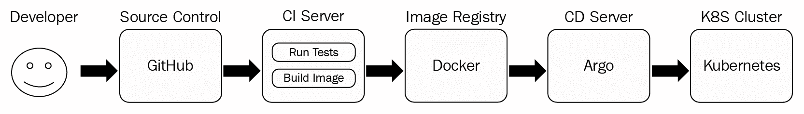

此管道中的阶段的功能如下:

1.  开发人员将他们的更改提交给 GitHub(源代码管理)
2.  配置项服务器运行测试，构建 Docker 映像，并将映像推送到 DockerHub(映像注册表)
3.  Argo 光盘服务器检测到有新的映像可用，并部署到 Kubernetes 集群

既然我们已经理解了配置项/目录管道，那么让我们来检查一个特定的配置项/目录管道选择。

# 描述性CI/CD流水线的选项

为您的系统选择CI/CD流水线是一项重大决策。当我为德林契斯面对这个决定时，我研究了几种选择。这里没有明显的选择。Kubernetes 发展很快，工具和流程也很难赶上。我评估了几个选择，定了 CircleCI 持续集成，Argo CD 持续交付。我最初考虑的是为整个 CI/CD 管道提供一站式服务，在审查了一些选项后，我决定将它们视为两个独立的实体，并为 CI 和 CD 选择了不同的解决方案。让我们简单回顾一下其中的一些选项(还有很多很多):

*   詹金斯
*   大三角帆
*   特拉维斯·西和瑟切莱奇
*   泰顿
*   蓉城光盘
*   滚自己的

# 詹金斯

詹金斯 X 是我的第一选择和最爱。我读了一些文章，看了一些演讲，让我想喜欢它。它提供了您想要的所有功能，包括一些高级功能:

*   自动化CI/CD
*   通过 GitOps 促进环境
*   请求预览环境
*   对提交和拉取请求的自动反馈

在封面下，它利用了詹金斯，这是一个成熟的，虽然复杂的产品。Jenkins X 的前提是它将掩盖 Jenkins 的复杂性，并提供一个 Kubernetes 特有的简化工作流。

当我试图实际使用詹金斯 X 时，我对几个问题感到失望:

*   它不是开箱即用的，故障排除很复杂。
*   它非常固执己见。
*   它不太支持单一回购方法(或者根本不支持)。

我试着让它工作了一段时间，但在阅读了其他人的经历并看到 Jenkins X slack 社区渠道缺乏回应后，我被 Jenkins X 关闭了，我仍然喜欢这个想法，但它真的必须超级稳定，然后我才能再次尝试。

# 大三角帆

Spinnaker 是来自网飞的开源 CI/CD 解决方案。它有许多好处，包括:

*   已经被很多公司采用。
*   它与其他产品有很多集成。
*   它支持许多最佳实践。

Spinnaker 的缺点如下:

*   这是一个庞大而复杂的系统。
*   它有一个陡峭的学习曲线。
*   它不是Kubernetes特有的。

最后，我决定跳过 Spinnaker——不是因为 Spinnaker 本身的任何错误，而是因为我没有这方面的经验。我不想在开发 Delinkcious 本身和写这本书的时候从头学这么大的产品。你很可能会发现 Spinnaker 是适合你的 CI/CD 解决方案。

# 特拉维斯·西和瑟切莱奇

我更喜欢将配置项解决方案与光盘解决方案分开。从概念上讲，配置项流程的作用是生成一个容器映像，并将其推送到注册表。它根本不需要意识到 Kubernetes。另一方面，光盘解决方案必须支持 Kubernetes，并且最好在集群内部运行。

对于 CI，我考虑了 Travis CI 和 CircleCI。两者都为开源项目提供免费的 CI 服务。我之所以选择 CircleCI，是因为它的功能更全面，并且有更好的 UI，这一点很重要。我相信特拉维斯 CI 也会工作得很好。我在其他一些开源项目中使用了 Travis CI。需要注意的是，管道的 CI 部分是完全不依赖于 Kubernetes 的。最终结果是映像注册表中的 Docker 映像。这个 Docker 映像可以用于其他目的，不一定部署在 Kubernetes 集群中。

# 泰顿

Tekton 是一个非常有趣的项目。它是 Kubernetes 原生的，对步骤、任务、运行和管道有很好的抽象。它相对年轻，但似乎很有前途。它还被选为光盘基金会的创始项目之一:[https://cd.foundation/projects/](https://cd.foundation/projects/)。

看看它是如何演变的将会很有趣。

泰克顿的优势如下:

*   现代设计与清洁概念模型
*   由裁谈会基金会资助
*   建立在船头之上(Kubernetes本身的 CI/CD 解决方案)
*   库比涅斯本地解决方案

泰克顿的缺点如下:

*   它仍然相当新，而且不稳定。
*   它不具备其他解决方案的所有特性和功能。

# 蓉城光盘

与 CI 解决方案相反，CD 解决方案非常适合 Kubernetes。我选择蓉城光盘有几个原因:

*   忽必烈意识
*   在通用工作流引擎(Argo)之上实现
*   伟大的用户界面
*   在您的 Kubernetes 集群上运行
*   在 Go 中实现(没那么重要，但我喜欢)

蓉城光盘也有很多缺点:

*   它不是 CD 基金会或 CNCF 的成员(在社区中的认可度较低)。
*   背后的主要公司 Intuit 并不是主要的云原生企业。

Argo CD 是一个来自 Intuit 的年轻项目，Intuit 收购了 Argo 项目的原始开发者——Applatix。我真的很喜欢它的建筑，当我尝试的时候，一切都很有魅力。

# 滚自己的

我曾短暂考虑过创建自己的简单 CI/CD 管道。操作并不复杂。出于本书的目的，我不需要一个非常可靠的解决方案，并且很容易解释每一步到底发生了什么。然而，考虑到读者，我决定最好使用可以直接利用的现有工具，同时也节省我开发一个糟糕的 CI/CD 解决方案的时间。

此时，您应该对 Kubernetes 上 CI/CD 解决方案的不同选项有一个很好的了解。我们回顾了大多数流行的解决方案，并选择了 CircleCI 和 Argo 光盘作为德林奇 CI/光盘解决方案的最佳选择。接下来，我们将讨论 GitOps 的热门新趋势。

# GitOps

GitOps 是一个新的流行语，尽管这个概念并不是很新。它是*基础设施的另一个变体，代码为*。基本思想是，您的代码、配置和它所需要的资源都应该被描述并存储在源代码管理存储库中，在那里它们是受版本控制的。每当您将更改推送到存储库时，您的CI/CD解决方案都会做出响应并采取正确的操作。甚至回滚也可以通过恢复到存储库中以前的版本来启动。当然，存储库不一定是 Git，但是 GitOps 听起来比源代码管理 Ops 好得多，而且大多数人都使用 Git，所以我们来了。

CircleCI 和 Argo 光盘都全力支持和倡导 GitOps 模式。当你的`git push`代码改变时，CircleCI 会在上面触发并开始构建正确的映像。当你`git push`对Kubernetes清单进行更改时，阿尔戈光盘将触发这些更改并将其部署到你的Kubernetes集群。

现在我们已经清楚了 GitOps 是什么，我们可以开始为 Delinkcious 实现管道的持续集成部分了。我们将使用 CircleCI 从源代码构建 Docker 映像。

# 使用 CircleCI 构建您的映像

让我们深入研究一下德林奇 CI 管道。我们将检查持续集成流程中的每一步，包括以下内容:

*   查看源树
*   配置配置项管道
*   理解构建脚本
*   用多阶段 Dockerfile 记录 Go 服务
*   探索 CircleCI 用户界面

# 查看源树

持续集成是关于构建和测试的东西。第一步是了解在德林奇需要构建和测试什么。让我们再来看一下德林契斯源树:

```
$ tree -L 2
.
├── LICENSE
├── README.md
├── build.sh
├── cmd
│   ├── link_service_e2e
│   ├── social_graph_service_e2e
│   └── user_service_e2e
├── go.mod
├── go.sum
├── pkg
│   ├── db_util
│   ├── link_manager
│   ├── link_manager_client
│   ├── object_model
│   ├── social_graph_client
│   ├── social_graph_manager
│   ├── user_client
│   └── user_manager
└── svc
 ├── api_gateway_service
 ├── link_service
 ├── social_graph_service
 └── user_service
```

`pkg`目录包含服务和命令使用的包。我们应该运行这些包的单元测试。`svc`目录包含我们的微服务。我们应该构建这些服务，将每个服务打包到一个版本正确的 Docker 映像中，并将这些映像推送到 DockerHub(映像注册表)。`cmd`目录目前包含端到端测试。那些是为本地运行而设计的，不需要由配置项管道构建(如果您想在我们的测试过程中添加端到端测试，这可以更改)。

# 配置配置项管道

CircleCI 由具有标准名称和位置的单个 YAML 文件配置，即`<root directory>/.circleci/config.yaml`:

```
version: 2
jobs:
  build:
    docker:
    - image: circleci/golang:1.11
    - image: circleci/postgres:9.6-alpine
      environment: # environment variables for primary container
        POSTGRES_USER: postgres
    working_directory: /go/src/github.com/the-gigi/delinkcious
    steps:
    - checkout
    - run:
        name: Get all dependencies
        command: |
          go get -v ./...
          go get -u github.com/onsi/ginkgo/ginkgo
          go get -u github.com/onsi/gomega/...
    - run:
        name: Test everything
        command: ginkgo -r -race -failFast -progress
    - setup_remote_docker:
        docker_layer_caching: true
    - run:
        name: build and push Docker images
        shell: /bin/bash
        command: |
          chmod +x ./build.sh
          ./build.sh
```

让我们把它拆开，了解发生了什么。第一部分指定构建作业，下面是必要的 Docker 映像`(golang`和`postgres`)及其环境。然后，我们有了工作目录，应该在其中执行`build`命令:

```
version: 2
jobs:
 build:
 docker:
 - image: circleci/golang:1.11
 - image: circleci/postgres:9.6-alpine
      environment: # environment variables for primary container
        POSTGRES_USER: postgres
    working_directory: /go/src/github.com/the-gigi/delinkcious
```

下一部分是构建步骤。第一步就是结账。在 CircleCI 用户界面中，我将项目与 Delinkcious GitHub 存储库相关联，以便它知道从哪里签出。如果存储库不是公共的，那么您也需要提供一个访问令牌。第二步是一个`run`命令，获取德林契斯的所有 Go 依赖关系:

```
steps:
- checkout
- run:
    name: Get all dependencies
    command: |
      go get -v ./...
      go get -u github.com/onsi/ginkgo/ginkgo
      go get -u github.com/onsi/gomega/...
```

I had to explicitly `go get` the `ginkgo` framework and the `gomega` library because they are imported using Golang dot notation, which makes them invisible to `go get ./...`.

一旦我们有了所有的依赖项，我们就可以运行测试了。我在这种情况下使用`ginkgo`测试框架:

```
- run:
    name: Test everything
    command: ginkgo -r -race -failFast -progress
```

下一部分是构建和推送 Docker 映像的地方。由于需要访问 Docker 守护程序，因此需要通过`setup_remote_docker`步骤进行特殊设置。`docker_layer_caching`选项用于通过重用以前的层来提高效率和速度。实际的构建和推送由`build.sh`脚本处理，我们将在下一节中查看。请注意，我通过`chmod +x`确保它是可执行的:

```
- setup_remote_docker:
    docker_layer_caching: true
- run:
    name: build and push Docker images
    shell: /bin/bash
    command: |
      chmod +x ./build.sh
      ./build.sh
```

我只是触及表面。CircleCI 还有更多内容，包括可重用配置、工作流、触发器和工件的 orbs。

# 理解 build.sh 脚本

`build.sh`脚本可在[上获得。](https://github.com/the-gigi/delinkcious/blob/master/build.sh)

让我们一点一点地检查它。这里我们将遵循几个最佳实践。首先，最好添加一个 shebang，其中包含将执行您的脚本的二进制文件的路径，也就是说，如果您知道它的位置。如果您试图编写一个跨平台脚本，在许多不同的平台上工作，您可能需要依赖路径或其他技术。`set -eo pipefail`如果出现任何问题，将立即失效(甚至在管道中间)。

强烈建议在生产环境中使用:

```
#!/bin/bash

set -eo pipefail
```

接下来的几行只是为目录和 Docker 映像的标签设置了一些变量。有两个标签:`STABLE_TAB`和`TAG`。`STABLE_TAG`标签有主版本和次版本，不会在每个版本中改变。`TAG`包括由 CircleCI 提供的`CIRCLE_BUILD_NUM`，并且在每次构建中递增。这意味着`TAG`永远是独一无二的。这被认为是标记和版本化映像的最佳实践:

```
IMAGE_PREFIX='g1g1'
STABLE_TAG='0.2'

TAG="${STABLE_TAG}.${CIRCLE_BUILD_NUM}"
ROOT_DIR="$(pwd)"
SVC_DIR="${ROOT_DIR}/svc"
```

接下来，我们转到`svc`目录，这是我们所有服务的父目录，并使用我们在 CircleCI 项目中设置的环境变量登录 DockerHub。

```
cd $SVC_DIR
docker login -u $DOCKERHUB_USERNAME -p $DOCKERHUB_PASSWORD
```

现在，我们进入主题。脚本遍历`svc`目录的所有子目录寻找`Dockerfile`。如果它找到一个`Dockerfile`，它会构建一个映像，使用服务名称和`TAG`和`STABLE_TAG`的组合来标记它，最后将标记的映像推送到注册表:

```
cd "${SVC_DIR}/$svc"
    if [[ ! -f Dockerfile ]]; then
        continue
    fi
    UNTAGGED_IMAGE=$(echo "${IMAGE_PREFIX}/delinkcious-${svc}" | sed -e 's/_/-/g' -e 's/-service//g')
    STABLE_IMAGE="${UNTAGGED_IMAGE}:${STABLE_TAG}"
    IMAGE="${UNTAGGED_IMAGE}:${TAG}"
    docker build -t "$IMAGE" .
    docker tag "${IMAGE}" "${STABLE_IMAGE}"
    docker push "${IMAGE}"
    docker push "${STABLE_IMAGE}"
done
cd $ROOT_DIR
```

# 用多阶段 Dockerfile 记录 Go 服务

您在微服务系统中构建的 Docker 映像非常重要。你会建造许多这样的建筑，每一个都会建造很多很多次。这些映像也将通过网络来回传送，它们是攻击者的目标。考虑到这一点，构建具有以下属性的映像是有意义的:

*   轻量级选手
*   呈现最小攻击面

这可以通过使用适当的基础映像来完成。例如，阿尔卑斯山因其占地面积小而非常受欢迎。然而，没有什么比划痕基础映像更好了。使用基于 Go 的微服务，您可以创建一个只包含服务二进制文件的映像。让我们继续剥洋葱，看看其中一个服务的 Dockerfile。剧透提醒:它们实际上都是一样的，只是服务名称不同。

You can find the `Dockerfile` of `link_service` at [https://github.com/the-gigi/delinkcious/blob/master/svc/link_service/Dockerfile](https://github.com/the-gigi/delinkcious/blob/master/svc/link_service/Dockerfile).

我们这里使用的是多级`Dockerfile`。我们将使用标准的 Golang 映像来构建映像。最后一行中的神秘魔法是构建一个不需要动态运行时库的真正静态和独立的 Golang 二进制文件所需要的:

```
FROM golang:1.11 AS builder
ADD ./main.go main.go
ADD ./service service
# Fetch dependencies
RUN go get -d -v

# Build image as a truly static Go binary
RUN CGO_ENABLED=0 GOOS=linux go build -o /link_service -a -tags netgo -ldflags '-s -w' .
```

然后，我们将最终的二进制文件复制到一个暂存库映像中，并创建尽可能最小和最安全的映像。我们公开了`7070`端口，这是服务监听的端口:

```
FROM scratch
MAINTAINER Gigi Sayfan <the.gigi@gmail.com>
COPY --from=builder /link_service /app/link_service
EXPOSE 7070
ENTRYPOINT ["/app/link_service"]
```

# 探索循环界面

CircleCI 有一个非常友好的 UI。在这里，您可以设置各种项目设置，浏览您的版本，并深入到特定的版本。请记住，我们使用了单一回购方法，并且在`build.sh`文件中，我们负责构建多个服务。从 CircleCI 的角度来看，Delinkcious 是一个单一的内聚项目。这是项目的视图，显示了最近的构建:

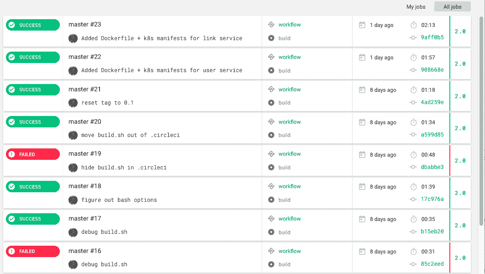

让我们深入了解一个成功的构建。一切都很好，绿色的:

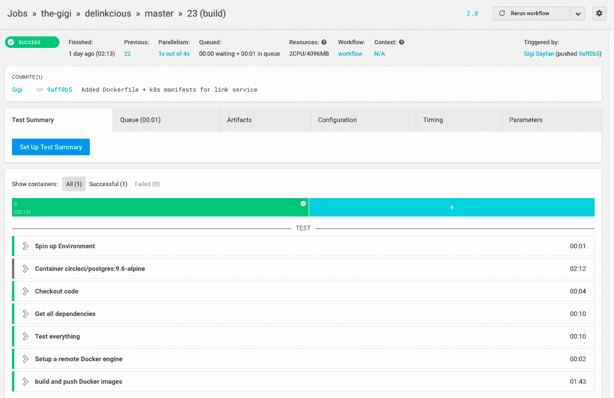

您甚至可以展开任何步骤并检查控制台输出。下面是测试阶段的输出:

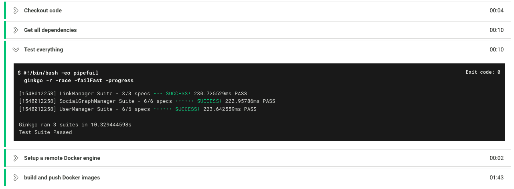

这很酷，但是当事情出错并且你需要找出原因时，这就更有用了。例如，有一次，我试图将`build.sh`脚本隐藏在`config.yaml`文件旁边的`.circleci`目录中，但它没有被添加到 Docker 上下文中，并产生了以下错误:

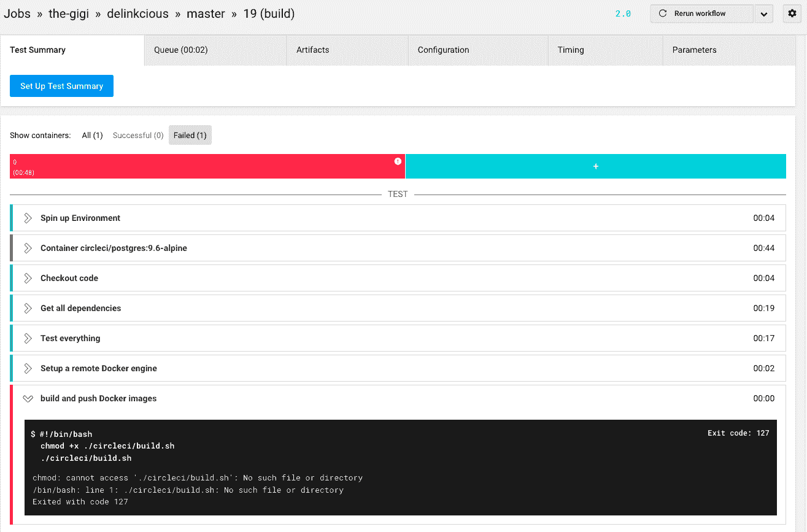

# 考虑未来的改进

Dockerfiles 基本上是重复的，有些假设是可以参数化的。在 Kubernetes 生态系统中，有一些有趣的项目有助于解决这些问题。有些解决方案是针对本地开发的，可以自动生成必要的 Dockerfiles，而其他解决方案则更倾向于一致和统一的生产设置。我们将在后面的章节中研究其中的一些。在这一章中，我想保持简单，避免用太多的选项和间接层来压倒你。

另一个改进的机会是只测试和构建已经改变的服务(或者它们的依赖关系已经改变)。照目前的情况来看，`build.sh`脚本总是构建所有的映像并用相同的标签标记它们。

到目前为止，我们已经使用 CircleCI 和 Docker 构建了一个完整的 CI 管道。下一阶段是建立阿尔戈光盘作为一个连续的输送管道。

# 为美味建立连续递送

随着 CircleCI 的持续整合，我们可以将注意力转向持续交付。首先，我们将了解将德林奇微服务部署到 Kubernetes 集群需要什么，然后我们将研究 Argo 光盘本身，最后，我们将通过 Argo 光盘为德林奇建立完整的连续交付。

# 部署美味的微服务

每个德林克西微服务在其`k8s`子目录中有一组在 YAML 清单中定义的Kubernetes资源。这里是链接服务`k8s`目录:

```
]$ tree k8s
k8s
├── db.yaml
└── link_manager.yaml
```

`link_manager.yaml`文件包含两个资源:Kubernetes 部署和 Kubernetes 服务。Kubernetes 部署如下:

```
apiVersion: apps/v1
kind: Deployment
metadata:
  name: link-manager
  labels:
    svc: link
    app: manager
spec:
  replicas: 1
  selector:
    matchLabels:
      svc: link
      app: manager
  template:
    metadata:
      labels:
        svc: link
        app: manager
    spec:
      containers:
      - name: link-manager
        image: g1g1/delinkcious-link:0.2
        ports:
        - containerPort: 8080
```

Kubernetes 服务如下:

```
apiVersion: v1
kind: Service
metadata:
  name: link-manager
spec:
  ports:
  - port:  8080
  selector:
    svc: link
    app: manager
```

`db.yaml`文件描述了链接服务用来保持其状态的数据库。通过将`k8s`目录传递给`kubectl apply`，两者都可以通过`kubectl`在单个命令中部署:

```
$ kubectl apply -f k8s
deployment.apps "link-db" created
service "link-db" created
deployment.apps "link-manager" created
service "link-manager" created
```

The main difference between kubectl create and `kubectl apply` is that `create` will return an error if a resource already exists.

使用`kubectl`从命令行部署很好，但是我们的目标是自动化这个过程。让我们明白这一点。

# 理解蓉城光盘

Argo CD 是 Kubernetes 的开源连续交付解决方案。它由 Intuit 创建，并被许多其他公司采用，包括谷歌、英伟达、数据狗和 Adobe。它有一组令人印象深刻的功能，如下所示:

*   将应用自动部署到特定的目标环境
*   应用的命令行界面和网络可视化以及所需状态和实时状态之间的差异
*   用于支持高级部署模式(蓝色/绿色和淡黄色)的钩子
*   支持多种配置管理工具(普通 YAML、ksonnet、kustomize、Helm 等)
*   持续监控所有部署的应用
*   将应用手动或自动同步到所需状态
*   回滚到 Git 存储库中提交的任何应用状态
*   应用所有组件的运行状况评估
*   单点登录集成
*   GitOps webhook 集成(GitHub、GitLab 和 BitBucket)
*   与配置项管道集成的服务帐户/访问密钥管理
*   应用事件和应用编程接口调用的审计跟踪

# 蓉城光盘建立在蓉城之上

Argo 光盘是一个专门的光盘管道，但它是建立在坚实的 Argo 工作流引擎上的。我非常喜欢这种分层方法，在这种方法中，您有一个强大的通用基础来解决编排由步骤组成的工作流的问题，然后在此基础上构建光盘特定的特性和功能。

# 蓉城光盘利用 GitOps

蓉城光盘坚持 GitOps 方法。基本原理是你的系统状态存储在 Git 中。Argo 光盘通过检查 Git 差异和使用 Git 原语回滚和协调实时状态来管理您的实时状态和所需状态。

# 蓉城光盘入门

Argo 光盘遵循最佳实践，并希望安装在 Kubernetes 集群上的专用命名空间中:

```
$ kubectl create namespace argocd
$ kubectl apply -n argocd -f https://raw.githubusercontent.com/argoproj/argo-cd/stable/manifests/install.yaml
```

让我们看看创造了什么。Argo 光盘安装了四种类型的对象:吊舱、服务、部署和副本集。这是豆荚:

```
$ kubectl get all -n argocd NAME                                        READY  STATUS RESTARTS  AGE
pod/argocd-application-controller-7c5cf86b76-2cp4z 1/1   Running  1  1m
pod/argocd-repo-server-74f4b4845-hxzw7             1/1   Running  0  1m
pod/argocd-server-9fc58bc5d-cjc95                  1/1   Running  0  1m
pod/dex-server-8fdd8bb69-7dlcj                     1/1   Running  0  1m
```

服务如下:

```
NAME                                  TYPE        CLUSTER-IP       EXTERNAL-IP  PORT(S) 
service/argocd-application-controller ClusterIP   10.106.22.145    <none>       8083/TCP 
service/argocd-metrics                ClusterIP   10.104.1.83      <none>       8082/TCP 
service/argocd-repo-server            ClusterIP   10.99.83.118     <none>       8081/TCP 
service/argocd-server                 ClusterIP   10.103.35.4      <none>       80/TCP,443/TCP 
service/dex-server                    ClusterIP   10.110.209.247   <none>       5556/TCP,5557/TCP 
```

部署如下:

```

NAME                                            DESIRED   CURRENT   UP-TO-DATE   AVAILABLE   AGE
deployment.apps/argocd-application-controller   1         1         1            1           1m
deployment.apps/argocd-repo-server              1         1         1            1           1m
deployment.apps/argocd-server                   1         1         1            1           1m
deployment.apps/dex-server                      1         1         1            1           1m

```

最后，这里是副本集:

```
NAME                                                       DESIRED   CURRENT   READY     AGE
replicaset.apps/argocd-application-controller-7c5cf86b76   1         1         1         1m
replicaset.apps/argocd-repo-server-74f4b4845               1         1         1         1m
replicaset.apps/argocd-server-9fc58bc5d                    1         1         1         1m
replicaset.apps/dex-server-8fdd8bb69                       1         1         1         1m
```

不过，蓉城光盘还安装了两个**自定义资源定义** ( **CRDs** ):

```
$ kubectl get crd
NAME                       AGE
applications.argoproj.io   7d
appprojects.argoproj.io    7d
```

CRDs 允许各种项目扩展 Kubernetes API 并添加自己的域对象，以及控制器来监控它们和其他 Kubernetes 资源。Argo 光盘为 Kubernetes 的世界增加了应用和项目的概念。很快，您将看到它们如何集成到内置的 Kubernetes 资源(如部署、服务和 pods)中，以实现持续交付。让我们开始吧:

1.  安装蓉城光盘命令行界面:

```
$ brew install argoproj/tap/argocd
```

2.  访问蓉城光盘服务器的端口转发:

```
$ kubectl port-forward -n argocd svc/argocd-server 8080:443
```

3.  管理员用户的初始密码是 Argo 光盘服务器的名称:

```
$ kubectl get pods -n argocd -l app.kubernetes.io/name=argocd-server -o name | cut -d'/' -f 2
```

4.  登录到服务器:

```
$ argocd login :8080
```

5.  如果抱怨登录不安全，只需按 *y* 确认即可:

```
WARNING: server certificate had error: tls: either ServerName or InsecureSkipVerify must be specified in the tls.Config. Proceed insecurely (y/n)?
```

6.  或者，要跳过警告，请键入以下内容:

```
argocd login --insecure :8080
```

然后，您可以更改密码。

7.  如果您将密码存储在一个环境变量中(例如，`ARGOCD_PASSWORD`)，那么您可以有一个单行密码，这样您就可以登录，而不会被询问更多的问题:

```
argocd login --insecure --username admin --password $ARGOCD_PASSWORD :8080
```

# 配置蓉城光盘

记住转发 argocd 服务器:

```
$ kubectl port-forward -n argocd svc/argocd-server 8080:443
```

然后，您只需浏览至`https://localhost:8080`并提供`admin`用户的密码即可登录:

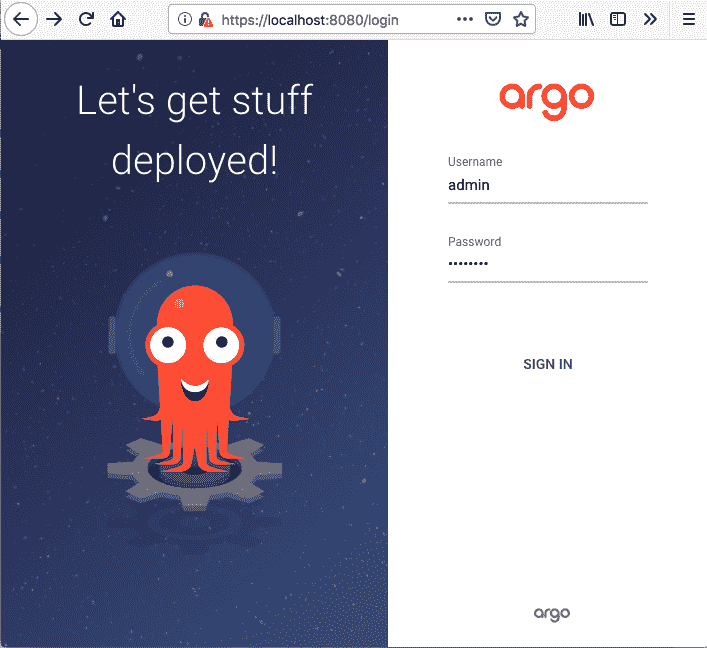

配置蓉城光盘是一种乐趣。它的用户界面非常令人愉快，易于使用。它支持开箱即用的 Delinkcious monorepo，并且没有假设每个 Git 存储库包含一个应用或项目。

它会要求您提供一个 Git 存储库来监视更改，一个 Kubernetes 集群(默认为它所安装的集群)，然后它会尝试检测存储库中的清单。Argo 光盘支持多种清单格式和模板，如 Helm、ksonnet 和 kustomize。我们将在本书的后面介绍这些优秀的工具。为了简单起见，我们为每个应用配置了包含原始 YAML 清单的目录，Argo 光盘也支持该目录。

说了这么多，做了这么多，蓉城光盘准备好了！

# 使用同步策略

默认情况下，Argo 光盘会检测应用的清单何时不同步，但不会自动同步。这是一个很好的默认。在某些情况下，在将变更推向生产之前，需要在专用环境中运行更多的测试。在其他情况下，一定有人类在其中。但是，在许多其他情况下，可以立即自动将更改部署到集群，而无需人工干预。蓉城光盘跟随 GitOps 的事实也使得它非常容易同步回任何以前的版本(包括最后一个版本)。

对于 Delinkcious，我选择了自动同步，因为这是一个演示项目，部署一个坏版本的后果可以忽略不计。这可以在用户界面或命令行界面中完成:

```
argocd app set <APPNAME> --sync-policy automated
```

自动同步策略不能保证应用总是同步的。控制自动同步过程的限制如下:

*   处于错误状态的应用不会尝试自动同步。
*   Argo 光盘将仅尝试针对特定提交 SHA 和参数的单次自动同步。
*   如果自动同步因任何原因失败，它将不会再次尝试。
*   您不能使用自动同步回滚应用。

在所有这些情况下，您要么必须更改清单以触发另一次自动同步，要么手动同步。要回滚(或通常同步到以前的版本)，您必须关闭自动同步。

Argo 光盘提供了另一种在部署时修剪资源的策略。当 Git 中不再存在现有资源时，默认情况下 Argo CD 不会将其删除。这是一种安全机制，用于在编辑 Kubernetes 清单时，如果有人出错，避免破坏关键资源。但是，如果您知道自己在做什么(例如，对于无状态应用)，您可以打开自动修剪:

```
argocd app set <APPNAME> --auto-prune
```

# 探索蓉城光盘

现在我们已经登录并配置了蓉城光盘，让我们稍微探索一下。我非常喜欢用户界面，但是如果您想以编程方式访问它，您也可以从命令行或通过 REST API 来做任何事情。

我已经为蓉城光盘配置了三个德林克西微服务。每项服务都被认为是 Argo 光盘播放器中的一项应用。让我们看看应用视图:

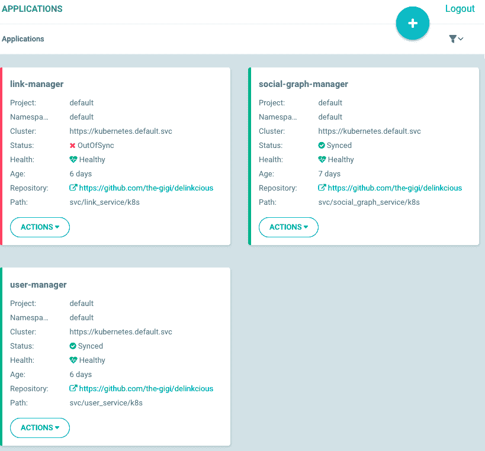

这里有一些有趣的事情。我们来谈谈每一个:

*   该项目是一个阿尔戈光盘概念，用于分组应用。
*   命名空间是应该安装应用的 Kubernetes 命名空间。
*   集群是 Kubernetes 集群，也就是`https://kubernetes.default.svc`，这是安装 Argo 光盘的集群。
*   该状态告诉您当前应用是否与其在 Git 存储库中的 YAML 清单同步。
*   运行状况会告诉您应用是否正常。
*   存储库是应用的 Git 存储库。
*   该路径是存储库中`k8s` YAML 实时清单的相对路径(蓉城光盘监控该目录的变化)。

以下是您从命令行界面获得的信息:

```
$ argocd app list
NAME                  CLUSTER                         NAMESPACE  PROJECT  STATUS     HEALTH   SYNCPOLICY  CONDITIONS
link-manager          https://kubernetes.default.svc  default    default  OutOfSync  Healthy  Auto-Prune  <none>
social-graph-manager  https://kubernetes.default.svc  default    default  Synced     Healthy  Auto-Prune  <none>
user-manager          https://kubernetes.default.svc  default    default  Synced     Healthy  Auto-Prune  <none>
```

如您所见(在用户界面和命令行界面中)，`link-manager`不同步。我们可以通过从操作下拉列表中选择同步来同步它:

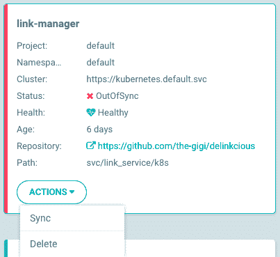

或者，您可以从命令行界面执行此操作:

```
$ argocd app sync link-manager
```

用户界面最酷的事情之一是它如何呈现与应用相关的所有`k8s`资源。通过点击`social-graph-manager`应用，我们得到如下视图:

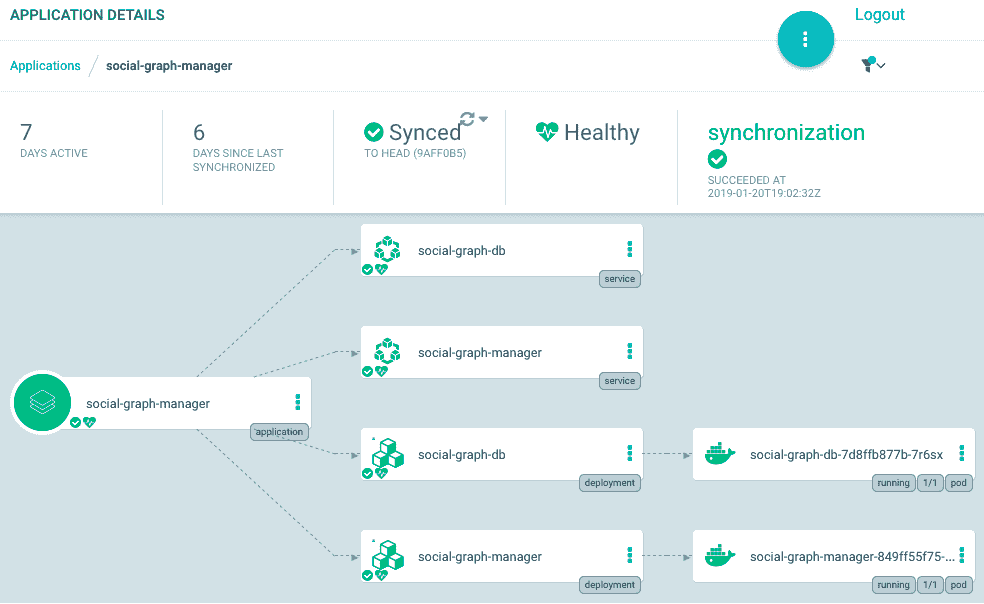

我们可以看到应用本身、服务、部署和 pods，包括有多少 pods 正在运行。这实际上是一个过滤视图，如果我们愿意，我们可以将与每个部署和每个服务的端点相关联的副本集添加到显示中。然而，这些在大多数时候并不有趣，所以蓉城光盘默认不显示它们。

我们可以点击一个服务并查看其信息摘要，包括清单:

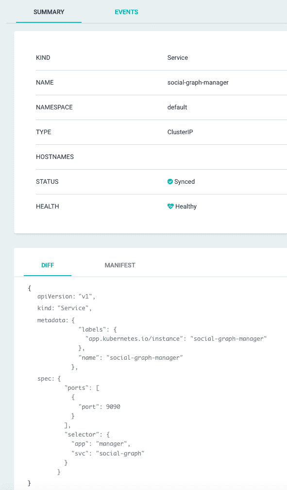

对于 pods，我们甚至可以查看日志，如下图所示，所有这些都来自 Argo CD UI 的舒适性:

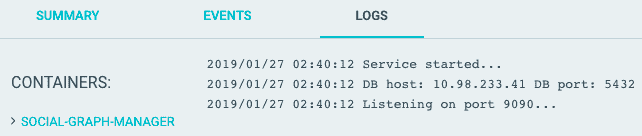

蓉城光盘已经可以带你走很长的路了。然而，它还有很多东西可以提供，我们将在本书后面深入探讨这些东西。

# 摘要

在本章中，我们讨论了基于微服务的分布式系统中 CI/CD 管道的重要性。我们查看了 Kubernetes 的一些 CI/CD 选项，并确定了 CI 部分的 CircleCI(代码更改| Docker 映像)和 CD 部分的 Argo CD 的组合(`k8s`清单更改|部署的应用)。

我们还介绍了使用多阶段构建构建 Docker 映像的最佳实践、Postgres DB 的`k8s` YAML 清单以及部署和服务`k8s`资源。然后，我们在集群中安装了 Argo 光盘，配置它来构建我们所有的微服务，并探索了 UI 和 CLI。此时，您应该清楚地了解 CI/CD 的概念及其重要性，各种解决方案的优缺点，以及如何为您的系统选择最佳选项。

然而，未来还有很多。在后面的章节中，我们将通过额外的测试、安全检查和高级多环境部署选项来改进我们的 CI/CD 管道。

在下一章中，我们将关注配置我们的服务。配置是开发复杂系统的一个重要部分，需要由大型团队来开发、测试和部署。我们将探索各种常规配置选项，例如命令行参数、环境变量和配置文件，以及更动态的配置选项和 Kubernetes 的特殊配置功能。

# 进一步阅读

有关本章内容的更多信息，您可以参考以下来源:

*   这里有一些很好的资源来扩展您对 Kubernetes 上 CI/CD 选项的了解。首先也是最重要的一点，这是我在德令状 CI/CD 解决方案中使用的两个项目:

    *   **循环**:[https://circlesi . com/docs/](https://circleci.com/docs/)
    *   **蓉城**:[https://argoproj.github.io/docs/argo-cd/docs/](https://argoproj.github.io/docs/argo-cd/docs/)
*   然后，有这个免费的迷你电子书关于 CI/CD 与 Kubernetes:
    *   [https://thenewstack . io/ebooks/kublets/ci-CD-with-kublets/](https://thenewstack.io/ebooks/kubernetes/ci-cd-with-kubernetes/)
*   最后，这里是我为德林契斯放弃的其他几个选项，但对你来说可能是个不错的选择:
    *   **詹金斯 X**:[https://jenkins-x.io/](https://jenkins-x.io/)
    *   **spinneker**:https://www.spinnaker.io/