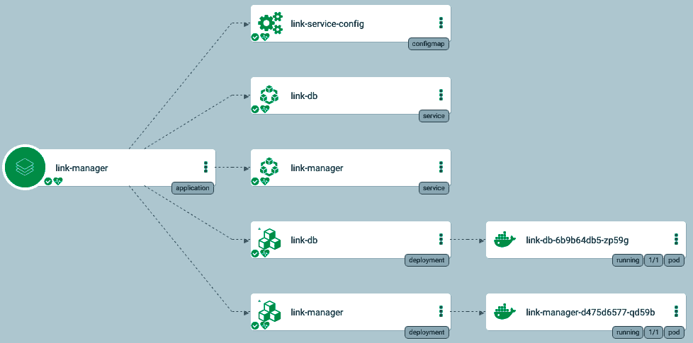
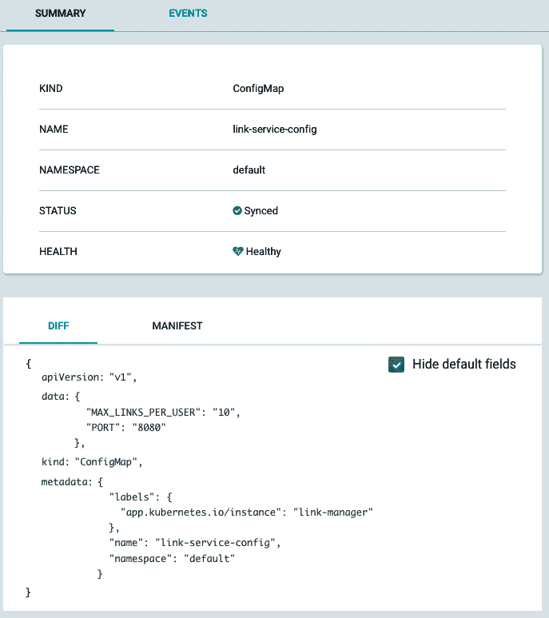

# 五、使用 Kubernetes 配置微服务

在本章中，我们将进入微服务配置的实际领域。配置是构建复杂分布式系统的一大部分。一般来说，配置涉及到代码应该知道的系统的任何方面，但这并没有编码在代码本身中。以下是我们将在本章中讨论的主题:

*   配置到底是什么？
*   用传统方式管理配置
*   动态管理配置
*   使用 Kubernetes 配置微服务

到本章结束时，您将对配置的价值有一个坚实的理解。您还将学习静态和动态配置软件的许多方法，以及 Kubernetes 提供的特殊配置选项(它的最佳特性之一)。作为开发人员和操作人员，您还将获得从 Kubernetes 为您提供的灵活性和控制中受益的见解和知识。

# 技术要求

在本章中，我们将查看许多 Kubernetes 清单，并将扩展 Delinkcious 的功能。没有必要安装任何新的东西。

# 代码

像往常一样，代码被分成两个 Git 存储库:

*   您可以在[https://github . com/PacktPublishing/hand-On-microservice-wit-Kubernetes/tree/master/chapter 05](https://github.com/PacktPublishing/Hands-On-Microservices-with-Kubernetes/tree/master/Chapter05)找到代码示例
*   您可以在[https://github.com/the-gigi/delinkcious/releases/tag/v0.3](https://github.com/the-gigi/delinkcious/releases/tag/v0.3)找到更新的德令状应用

# 配置到底是什么？

配置是一个非常超载的术语。让我们在这里为我们的目的清楚地定义它:配置主要指计算所需的操作数据。环境之间的配置可能不同。以下是一些典型的配置项目:

*   服务发现
*   支持测试
*   特定于环境的元数据
*   秘密
*   第三方配置
*   特征标志
*   超时设定
*   费率限制
*   各种默认值

一般来说，处理输入数据的代码利用配置数据来控制计算的操作方面，而不是算法方面。有一些特殊的情况，通过配置，你可以在运行时在不同的算法之间切换，但是这就进入了灰色区域。为了我们的目的，让我们保持简单。

在考虑配置时，考虑谁应该创建和更新配置数据是很重要的。它可能是也可能不是代码的开发者——例如，速率限制可能由 DevOps 团队成员决定，但是特性标志将由开发者设置。另外，在不同的环境中，不同的人可能会修改相同的值。在生产中，您通常会受到最多的限制。

# 配置和秘密

机密是用于访问数据库和其他服务(内部和/或外部)的凭据。从技术上来说，它们是配置数据，但在实践中，由于它们的敏感性，它们往往需要在静止时加密，并得到更仔细的控制。与常规配置分开存储和管理机密是很常见的。

在本章中，我们将只考虑非敏感配置。在下一章，我们将详细讨论秘密。Kubernetes 还在 API 级别将配置与秘密分开。

# 用传统方式管理配置

当我说老式的方式时，我指的是库本内斯之前的静态配置。但是正如您将会看到的，老式的方法有时是最好的方法，并且也经常得到 Kubernetes 的支持。让我们回顾一下配置程序的各种方法，考虑它们的优缺点，以及它们什么时候合适。我们将在这里介绍的配置机制如下:

*   无配置(约定优于配置)
*   命令行参数
*   环境变量
*   配置文件

虽然 Delinkcious 主要在 Go 中实现，但我们将使用不同的编程语言来演示配置选项，只是为了好玩和多样化。

# 配置约定

有时候，你真的不需要配置；程序可以做一些决定，记录下来，就这样。例如，输出文件的目录名是可以配置的，但是程序可以决定它将输出*，就这样。这种方法的好处是它是非常可预测的:您不必考虑配置，只需阅读程序的代码，您就可以确切地知道它做什么，以及一切应该在哪里。操作人员几乎没有什么工作要做。缺点是，如果需要更大的灵活性，您就没有办法了(例如，程序运行的卷上可能没有足够的空间)。*

 *请注意，约定优于配置并不意味着根本没有配置。这意味着您可以在使用约定时减少配置量。

这里有一个小的 Rust 程序，可以将斐波那契数列打印到屏幕上 100。按照惯例，它决定不会超过 100。您不能将其配置为在不更改代码的情况下打印更多或更少的数字:

```
fn main() {
    let mut a: u8 = 0;
    let mut b: u8 = 1;
    println!("{}", a);
    while b <= 100 {
        println!("{}", b);
        b = a + b;
        a = b - a;
    }
}

Output:

0
1
1
2
3
5
8
13
21
34
55
89
```

# 命令行标志

命令行标志或参数是编程的主要部分。运行程序时，您提供了程序用来配置自身的参数。使用它们有利弊:

*   **优点**:
    *   非常灵活
    *   熟悉每种编程语言，并且可用
    *   短期和长期选项都有既定的最佳实践
    *   与交互式使用文档配合良好
*   **Cons** :
    *   参数总是字符串
    *   需要引用包含空格的参数
    *   难以处理多行参数
    *   对命令行参数数量的限制
    *   对每个参数大小的限制

Command-line arguments are often used for input in addition to configuration. The boundaries between input and configuration can be a little murky sometimes. In most cases, it doesn't really matter, but it can make it confusing to users that just want to pass their input to a program through a command-line argument and are presented with a large and confusing array of configuration options.

这里有一个小的 Ruby 程序，它将斐波那契序列写入一个作为命令行参数提供的数字:

```
if __FILE__ == $0
  limit = Integer(ARGV[0])
  a = 0
  b = 1
  puts a
  while b < limit
    puts b
    b = a + b
    a = b - a
  end
end
```

# 环境变量

环境变量是另一个最爱。当您的程序在可能由另一个程序(或 shell 脚本)设置的环境中运行时，它们非常有用。环境变量通常继承自父环境。当用户总是希望向程序提供相同的选项(或选项集)时，它们也用于运行交互式程序。与其一次又一次地键入带有相同选项的长命令行，不如设置一次环境变量(甚至可能在您的配置文件中)，然后在没有参数的情况下运行程序要方便得多。一个很好的例子是 AWS 命令行界面，它允许您指定许多配置选项作为环境变量(例如，`AWS_DEFAULT_REGION`或`AWS_PROFILE`)。

这里有一个小的 Python 程序，它将斐波那契序列写入一个作为环境变量提供的数字。注意`FIB_LIMIT`环境变量被读取为字符串，程序必须将其转换为整数:

```
import os

limit = int(os.environ['FIB_LIMIT'])
a = 0
b = 1
print(a)
while b < limit:
    print(b)
    b = a + b
    a = b - a
```

# 配置文件

当您有大量配置数据时，配置文件特别有用，尤其是当这些数据具有层次结构时。在大多数情况下，通过命令行参数或环境变量来配置一个具有几十个甚至上百个选项的应用是过于困难的。配置文件还有一个优点，那就是可以链接多个配置文件。通常，应用有一个搜索路径，在那里它们寻找配置文件，例如`/etc/conf`，然后是`home`目录，然后是当前目录。这提供了很大的灵活性，因为您有通用的配置，同时您还能够覆盖每个用户或每次运行的某些部分。

配置文件很棒！您应该考虑什么格式最适合您的用例。有很多选择。配置文件格式遵循趋势，每隔几年就会有一颗新星闪耀。让我们回顾一些旧的格式，以及一些新的格式。

# INI 格式

INI 文件曾经在 Windows 上风靡一时。INI 代表**初始化**。在八十年代，摆弄`windows.ini`和`system.ini`来获得一些有用的东西是很常见的。格式本身非常简单，包括了带有键值对和注释的部分。这里有一个简单的 INI 文件:

```
[section]
a=1
b=2

; here is a comment
[another_section]
c=3
d=4
e=5
```

Windows API 有读取和写入 INI 文件的功能，所以很多 Windows 应用都把它们作为自己的配置文件。

# XML 格式

XML([https://www.w3.org/XML/](https://www.w3.org/XML/))是一个在 90 年代非常流行的 W3C 标准。它代表**可扩展标记语言**，它被用于*所有的东西*:数据、文档、应用编程接口(SOAP)，当然还有配置文件。它非常啰嗦，其成名的主要诉求是自描述，包含自己的元数据。XML 有模式和许多建立在模式之上的标准。在某种程度上，人们认为它会取代 HTML(还记得 XHTML 吗？).现在都过去了。下面是一个示例 XML 配置文件:

```
<?xml version="1.0" encoding="UTF-8"?>
    <startminimized value="False">
  <width value="1024">
  <height value = "768">
  <dummy />
  <plugin>
    <name value="Show Warning Message Box">
    <dllfile value="foo.dll">
    <method value = "warning">
  </plugin>
  <plugin>
    <name value="Show Error Message Box">
    <dllfile value="foo.dll">
    <method value = "error">
  </plugin>
  <plugin>
    <name value="Get Random Number">
    <dllfile value="bar.dll">
        <method value = "random">
  </plugin>
</xml>
```

# JSON 格式

JSON([https://json.org/](https://json.org/))代表 **JavaScript 对象符号**。随着动态 web 应用和 REST APIs 的增长，它变得流行起来。与 XML 相比，它的简洁是一股新鲜空气，它很快接管了这个行业。它的名气在于它将一对一转换为 JavaScript 对象。下面是一个简单的 JSON 文件:

```
{
  "firstName": "John",
  "lastName": "Smith",
  "age": 25,
  "address": {
    "streetAddress": "21 2nd Street",
    "city": "New York",
    "state": "NY",
    "postalCode": "10021"
  },
  "phoneNumber": [
    {
      "type": "home",
      "number": "212 555-1234"
    },
    {
      "type": "fax",
      "number": "646 555-4567"
    }
  ],
  "gender": {
    "type": "male"
  }
}
```

我个人从来不喜欢 JSON 作为配置文件格式；它不支持注释，对数组末尾多余的逗号要求不必要的严格，将日期和时间序列化到 JSON 总是一件费力的事情。它也相当冗长，包含了所有的引号、括号，并且需要转义许多字符(尽管它没有 XML 那么糟糕)。

# YAML 格式

你已经在这本书里看到了很多 YAML([https://yaml.org/](https://yaml.org/))，因为Kubernetes人的清单经常被写成 YAML。YAML 是 JSON 的一个超集，但是它也提供了一个更加简洁的语法，非常容易被人理解，以及更多的特性，比如引用、类型的自动检测和对对齐的多行值的支持。

这里有一个 YAML 文件的例子，它比你在一个普通的 Kubernetes 清单中通常看到的更有特色:

```
# sequencer protocols for Laser eye surgery
---
- step:  &id001                  # defines anchor label &id001
    instrument:      Lasik 3000
    pulseEnergy:     5.4
    pulseDuration:   12
    repetition:      1000
    spotSize:        1mm

- step: &id002
    instrument:      Lasik 3000
    pulseEnergy:     5.0
    pulseDuration:   10
    repetition:      500
    spotSize:        2mm
- step: *id001                   # refers to the first step (with anchor &id001)
- step: *id002                   # refers to the second step
- step:
    <<: *id001
    spotSize: 2mm                # redefines just this key, refers rest from &id001
- step: *id002
```

YAML 没有 JSON 那么受欢迎，但它慢慢聚集了势头。像 Kubernetes 和 AWS CloudFormation 这样的大型项目使用 YAML(和 JSON 一起，因为它是一个超集)作为它们的配置格式。CloudFormation 后来增加了 YAML 的支持；Kubernetes从 YAML 开始。

它是目前我最喜欢的配置文件格式；然而，YAML 有它的陷阱和批评，尤其是当你使用它的一些更先进的功能。

# TOML 格式

进入 TOML([https://github.com/toml-lang/toml](https://github.com/toml-lang/toml))——**汤姆明显的最小语言**。TOML 就像一个类固醇的 INI 文件。它是所有格式中最不为人知的，但自从被 Rust 的包管理器 Cargo 使用以来，它已经开始获得势头。在表现力方面，TOML 介于 JSON 和 YAML 之间。它支持自动检测数据类型和注释，但不如 YAML 强大。也就是说，它是人类最容易读写的东西。它支持嵌套，主要是通过点符号，而不是缩进。

下面是一个 TOML 文件的例子；看看它的可读性如何:

```
# This is how to comment in TOML.

title = "A TOML Example"

[owner]
name = "Gigi Sayfan"
dob = 1968-09-28T07:32:00-08:00 # First class dates

# Simple section with various data types
[kubernetes]
api_server = "192.168.1.1"
ports = [ 80, 443 ]
connection_max = 5000
enabled = true

# Nested section
[servers]

  # Indentation (tabs and/or spaces) is optional
  [servers.alpha]
  ip = "10.0.0.1"
  dc = "dc-1"

  [servers.beta]
  ip = "10.0.0.2"
  dc = "dc-2"

[clients]
data = [ ["gamma", "delta"], [1, 2] ]

# Line breaks are OK when inside arrays
hosts = [
  "alpha",
  "omega"
]
```

# 专有格式

有些应用只是想出了自己的格式。以下是 Nginx 网络服务器的配置文件示例:

```
user       www www;  ## Default: nobody
worker_processes  5;  ## Default: 1
error_log  logs/error.log;
pid        logs/nginx.pid;
worker_rlimit_nofile 8192;

events {
  worker_connections  4096;  ## Default: 1024
}

http {
  include    conf/mime.types;
  include    /etc/nginx/proxy.conf;
  include    /etc/nginx/fastcgi.conf;
  index    index.html index.htm index.php;

  default_type application/octet-stream;
  log_format   main '$remote_addr - $remote_user [$time_local]  $status '
    '"$request" $body_bytes_sent "$http_referer" '
    '"$http_user_agent" "$http_x_forwarded_for"';
  access_log   logs/access.log  main;
  sendfile     on;
  tcp_nopush   on;
  server_names_hash_bucket_size 128; # this seems to be required for some vhosts

  server { # php/fastcgi
    listen       80;
    server_name  domain1.com www.domain1.com;
    access_log   logs/domain1.access.log  main;
    root         html;

    location ~ \.php$ {
      fastcgi_pass   127.0.0.1:1025;
    }
  }
}
```

我不建议为您的应用发明另一种糟糕的配置格式。在 JSON、YAML 和 TOML 之间，您应该找到表现力、人类可读性和熟悉度之间的最佳点。此外，所有语言都有库来解析和组合那些熟悉的格式。

Don't invent your own configuration format!

# 混合配置和默认值

到目前为止，我们已经回顾了主要的配置机制:

*   配置约定
*   命令行参数
*   环境变量
*   配置文件

这些机制并不相互排斥。许多应用将支持其中的一些甚至全部。通常，会有一种配置解析机制，其中配置文件具有标准的名称和位置，但是您仍然可以通过环境变量指定不同的配置文件，甚至可以使用命令行参数覆盖特定运行的配置文件。你不必看得很远。Kubectl 是默认在`$HOME/.kube`中查找其配置文件的程序；您可以通过`KUBECONFIG`环境变量指定不同的文件。您可以通过传递`--config`命令行标志为特定命令指定一个特殊的配置文件。

说到这里，kubectl 也使用 YAML 作为它的配置格式。这是我的 Minikube 配置文件:

```
$ cat ~/.kube/config
apiVersion: v1
clusters:
- cluster:
 certificate-authority: /Users/gigi.sayfan/.minikube/ca.crt
 server: https://192.168.99.121:8443
 name: minikube
contexts:
- context:
 cluster: minikube
 user: minikube
 name: minikube
current-context: minikube
kind: Config
preferences: {}
users:
- name: minikube
 user:
 client-certificate: /Users/gigi.sayfan/.minikube/client.crt
 client-key: /Users/gigi.sayfan/.minikube/client.key
```

Kubectl 在同一个配置文件中支持多个集群/上下文。您可以通过`kubectl use-context`在它们之间切换；然而，许多经常使用多个集群的人不喜欢将它们都保存在同一个配置文件中，更喜欢为每个集群创建一个单独的文件，然后使用`KUBECONFIG`环境变量或通过在命令行上传递`--config`在它们之间切换。

# 十二因素应用配置

Heroku 是云平台即服务的先驱之一。2011 年，他们发布了构建网络应用的 12 因素方法。这是一个非常可靠的方法，在当时非常有创新性。这也恰好是构建可以在 Heroku 上轻松部署的应用的最佳方式。

For our purposes, the most interesting part of their website is the config section, which can be found at [https://12factor.net/config](https://12factor.net/config).

简而言之，他们建议 web 服务和应用总是将配置存储在环境变量中。这是一个安全但有些有限的指导方针。这意味着只要配置发生变化，服务就必须重新启动，并且受到环境变量的一般限制。

稍后，我们将看到 Kubernetes 如何支持作为环境变量的配置和作为配置文件的配置，以及一些特殊的转折。但是首先，让我们讨论动态配置。

# 动态管理配置

到目前为止，我们讨论的配置选项是静态的。您必须重新启动，并且在某些情况下(例如使用嵌入式配置文件)，重新部署您的服务以更改其配置。当配置发生变化时重新启动服务的好处是，您不必担心新的配置变化对内存状态和运行中请求处理的影响，因为您是从头开始；但是，不利的一面是，您会丢失所有正在运行的请求(除非您使用的是正常关机)以及任何预热缓存或一次性初始化工作，这可能是相当大的工作量。不过，您可以通过使用滚动更新和蓝绿色部署来缓解这种情况。

# 了解动态配置

动态配置是指服务以相同的代码和相同的内存状态继续运行，但它可以检测到配置发生了变化，并将根据新的配置动态调整其行为。从操作员的角度来看，当配置需要更改时，他们可以只更新中央配置存储，而不需要强制重新启动/重新部署代码没有更改的服务。

重要的是要明白这不是二元选择；有些配置可能是静态的，当它发生变化时，您必须重新启动服务，但有些其他配置项目可能是动态的。

由于动态配置可以以源代码管理无法捕获的方式改变系统的行为，所以通常的做法是保留谁在何时改变了什么的历史记录和审计。让我们看看什么时候应该使用动态配置，什么时候不应该！

# 动态配置什么时候有用？

动态配置在以下情况下很有用:

*   如果您只有一个服务实例，那么重新启动就意味着一个小的中断
*   如果您有想要快速来回切换的功能标志
*   如果您有初始化或丢弃飞行中请求的服务
*   如果您的服务不支持高级部署策略，如滚动更新、蓝绿色或淡黄色部署
*   重新部署新的配置文件时，可能会从源代码管理中引入尚未准备好部署的不相关的代码更改

# 什么时候应该避免动态配置？

然而，动态配置并不是所有情况的万灵药。如果你想完全安全，那么当配置改变时重新启动你的服务会使事情更容易理解和分析。也就是说，微服务通常足够简单，您可以掌握配置更改的所有含义。

在以下情况下，最好避免动态配置:

*   配置变更必须经过审查和批准流程的受监管服务
*   静态配置的低风险胜过动态配置的任何优势的关键服务
*   动态配置机制并不存在，其好处并不能证明开发这样的机制是合理的
*   具有大量服务的现有系统，迁移到动态配置的好处不能证明成本合理
*   高级部署策略提供了动态配置与静态配置以及重新启动/重新部署的优势
*   跟踪和审核配置更改的额外复杂性太高

# 远程配置存储

动态配置的选项之一是远程配置存储。所有服务实例都可以定期查询配置存储，检查配置是否已更改，并在更改时读取新配置。可能的选项包括以下内容:

*   关系数据库(Postgres、MySQL)
*   key-value stores(etcd，Redis)
*   共享文件系统(EFS NFS)

一般来说，如果您的所有/大部分服务已经与特定类型的商店一起工作，那么将您的动态配置放在那里通常会更简单。反模式是将配置存储在与服务持久存储相同的存储中。这里的问题是，配置将分布在多个数据存储中，一些配置更改是核心。很难管理、跟踪和审计所有服务的配置更改。

# 远程配置服务

更高级的方法是创建专用的配置服务。该服务的目的是为所有配置需求提供一站式服务。每个服务将只能访问其配置，并且很容易为每个配置更改实现控制机制。配置服务的缺点是您需要构建和维护它。如果你不小心，它也会成为一个单点故障。

到目前为止，我们已经非常详细地介绍了系统配置的许多选项。现在，是时候研究一下 Kubernetes 带来了什么。

# 使用 Kubernetes 配置微服务

使用 Kubernetes 或任何容器编排器，您可以获得有趣的配置选项组合。Kubernetes 为您管理您的容器。没有办法为特定的运行设置不同的环境选项和命令行参数，因为 Kubernetes 决定何时何地运行您的容器。您可以做的是在 Docker 映像中嵌入配置文件，或者更改它正在运行的命令；但是，这意味着为每个配置更改烘焙一个新映像，并将其部署到您的集群中。这不是世界末日，但这是一个重量级的行动。您也可以使用我前面提到的动态配置选项:

*   远程配置存储
*   远程配置服务

然而，在动态配置方面，Kubernetes 有一些非常巧妙的技巧。最具创新性的动态配置机制是配置映射。您还可以通过定制资源变得更加有趣。让我们开始吧。

# 使用 Kubernetes 配置映射

配置映射是由 Kubernetes 按名称空间管理的 Kubernetes 资源，可以被任何 pod 或容器引用。以下是`link-manager`服务的配置图:

```
apiVersion: v1
kind: ConfigMap
metadata:
  name: link-service-config
  namespace: default
data:
  MAX_LINKS_PER_USER: "10"
  PORT: "8080"
```

`link-manager`部署资源使用`envFrom`键将其导入 pod:

```
apiVersion: apps/v1
kind: Deployment
metadata:
  name: link-manager
  labels:
    svc: link
    app: manager
spec:
  replicas: 1
  selector:
    matchLabels:
      svc: link
      app: manager
  template:
    metadata:
      labels:
        svc: link
        app: manager
    spec:
      containers:
      - name: link-manager
        image: g1g1/delinkcious-link:0.2
        ports:
        - containerPort: 8080
      envFrom:
      - configMapRef:
          name: link-manager-config
```

这样做的效果是，当`link-manager`服务运行时，配置图的`data`部分中的键值对被投影为环境变量:

```
MAX_LINKS_PER_PAGE=10
PORT=9090
```

让我们看看蓉城光盘如何可视化`link-manager`服务有一个配置图。请注意名为`link-service-config`的顶框:



您甚至可以通过单击配置地图框，从阿尔戈光盘用户界面深入查看配置地图本身。非常圆滑:



请注意，由于配置映射是作为环境变量使用的，因此这是静态配置。如果您想更改其中任何一项，您需要重新启动服务。在 Kubernetes 中，这可以通过两种方式实现:

*   杀死POD(部署的副本集将创建新的POD)
*   删除并重新创建部署(这具有相同的效果，但是您不需要显式终止 pods)
*   应用一些其他更改和重新部署

让我们看看代码是如何使用它的。这个代码可以在[SVC/link _ manager/service/link _ manager _ service . go](https://github.com/the-gigi/delinkcious/blob/14c91f1c675dea9729d80876a3798897b925712a/svc/link_service/service/link_service.go#L37)找到:

```
port := os.Getenv("PORT")
if port == "" {
   port = "8080"
}

maxLinksPerUserStr := os.Getenv("MAX_LINKS_PER_USER")
if maxLinksPerUserStr == "" {
   maxLinksPerUserStr = "10"
}
```

`os.Getenv()`标准库函数从环境中获取`PORT`和`MAX_LINKS_PER_USER`。这很好，因为它允许我们在 Kubernetes 集群之外测试服务，并且仍然可以正确配置它。例如，链接服务端到端测试(设计用于 Kubernetes 之外的本地测试)在启动社交图管理器和`link-manager`服务之前设置环境变量:

```
func runLinkService(ctx context.Context) {
   // Set environment
   err := os.Setenv("PORT", "8080")
   check(err)

   err = os.Setenv("MAX_LINKS_PER_USER", "10")
   check(err)

   runService(ctx, ".", "link_service")
}

func runSocialGraphService(ctx context.Context) {
   err := os.Setenv("PORT", "9090")
   check(err)

   runService(ctx, "../social_graph_service", "social_graph_service")
}
```

既然我们已经了解了德林克西如何使用配置映射，那么让我们继续讨论使用配置映射的具体细节。

# 创建和管理配置映射

Kubernetes 为您提供了多种创建配置映射的方法:

*   从命令行值
*   来自一个或多个文件
*   从整个目录
*   通过直接创建配置映射 YAML 清单

最后，所有配置映射都是一组键值对。键和值取决于创建配置映射的方法。玩配置地图时，我发现使用`--dry-run`标志很有用，这样我就可以在提交实际创建之前看到将创建什么配置地图。我们来看一些例子。以下是如何从命令行参数创建配置映射:

```
$ kubectl create configmap test --dry-run --from-literal=a=1 --from-literal=b=2 -o yaml
apiVersion: v1
data:
 a: "1"
 b: "2"
kind: ConfigMap
metadata:
 creationTimestamp: null
 name: test
```

这种方法应该主要用于玩配置地图。你必须用一个麻烦的`--from-literal`参数单独指定每个配置项。

从文件创建配置映射是一种更可行的方法。它与 GitOps 概念配合得很好，在 GitOps 概念中，您可以保留用于创建配置映射的源配置文件的历史记录。我们可以创建一个非常简单的名为`comics.yaml`的 YAML 文件:

```
superhero: Doctor Strange
villain: Thanos
```

接下来，让我们使用以下命令从该文件创建一个配置映射(好吧，只是一个干的`run`):

```
$ kubectl create configmap file-config --dry-run --from-file comics.yaml -o yaml

apiVersion: v1
data:
 comics.yaml: |+
 superhero: Doctor Strange
 villain: Thanos

kind: ConfigMap
metadata:
 creationTimestamp: null
 name: file-config
```

这里有趣的是，文件的全部内容被映射到一个键:`comics.yaml`。该值是文件的全部内容。YAML 的`|+`表示下面的多行块是一个值。如果我们添加额外的`--from-file`参数，那么每个文件在配置映射中都有自己的键。同样，如果`--from-file`的参数是一个目录，那么目录中的每个文件都会成为配置映射中的一个键。

最后，让我们看一看手动构造的配置图。做到这一点并不难:只需在`data`部分下添加一堆键值对即可:

```
apiVersion: v1
kind: ConfigMap
metadata:
  name: env-config
  namespace: default
data:
  SUPERHERO: Superman
  VILLAIN: Lex Luthor
```

在这里，我们创建了专用的`SUPERHERO`和`VILLAIN`键。

让我们看看 pod 如何使用这些配置图。POD从`env-config`配置图中获取其环境。它执行一个命令，监视`SUPERHERO`和`VILLAIN`环境变量的值，每两秒钟回显一次当前值:

```
apiVersion: v1
kind: Pod
metadata:
  name: some-pod
spec:
  containers:
  - name: some-container
    image: busybox
    command: [ "/bin/sh", "-c", "watch 'echo \"superhero: $SUPERHERO villain: $VILLAIN\"'" ]
    envFrom:
    - configMapRef:
        name: env-config
  restartPolicy: Never
```

必须在 pod 启动之前创建配置映射！

```
$ kubectl create -f env-config.yaml
configmap "env-config" created

$ kubectl create -f some-pod.yaml
pod "some-pod" created
```

`kubectl`命令对于检查输出非常有用:

```
$ kubectl logs -f some-pod

Every 2s: echo "superhero: $SUPERHERO villain: $VILLAIN"      2019-02-08 20:50:39

superhero: Superman villain: Lex Luthor
```

正如预期的那样，这些值与配置图相匹配。但是如果我们改变配置图会发生什么呢？`kubectl edit configmap`命令允许您在编辑器中更新现有的配置图:

```
$ kubectl edit configmap env-config

# Please edit the object below. Lines beginning with a '#' will be ignored,
# and an empty file will abort the edit. If an error occurs while saving this file will be
# reopened with the relevant failures.
#
apiVersion: v1
data:
 SUPERHERO: Batman
 VILLAIN: Joker
kind: ConfigMap
metadata:
 creationTimestamp: 2019-02-08T20:49:37Z
 name: env-config
 namespace: default
 resourceVersion: "874765"
 selfLink: /api/v1/namespaces/default/configmaps/env-config
 uid: 0c83dee5-2be3-11e9-9999-0800275914a6

configmap "env-config" edited
```

我们把超级英雄和反派改成了蝙蝠侠和小丑。让我们验证这些更改:

```
$ kubectl get configmap env-config -o yaml

apiVersion: v1
data:
 SUPERHERO: Batman
 VILLAIN: Joker
kind: ConfigMap
metadata:
 creationTimestamp: 2019-02-08T20:49:37Z
 name: env-config
 namespace: default
 resourceVersion: "875323"
 selfLink: /api/v1/namespaces/default/configmaps/env-config
 uid: 0c83dee5-2be3-11e9-9999-0800275914a6
```

新的价值观就在那里。让我们检查一下POD日志。没有什么应该改变的，因为 pod 将 ConfigMap 作为环境变量使用，在 pod 运行时不能从外部更改:

```
$ kubectl logs -f some-pod

Every 2s: echo "superhero: $SUPERHERO villain: $VILLAIN"    2019-02-08 20:59:22

superhero: Superman villain: Lex Luthor
```

但是，如果我们删除并重新创建 pod，情况就不同了:

```
$ kubectl delete -f some-pod.yaml
pod "some-pod" deleted

$ kubectl create -f some-pod.yaml
pod "some-pod" created

$ kubectl logs -f some-pod

Every 2s: echo "superhero: $SUPERHERO villain: $VILLAIN" 2019-02-08 21:45:47

superhero: Batman villain: Joker
```

我把最好的留到最后。让我们来看看一些动态配置。名为`some-other-pod`的 pod 正在将名为`file-config`的配置图作为文件使用。首先，它创建一个名为`config-volume`的卷，该卷从`file-config`配置图中填充。然后，本卷被装入`/etc/config`。正在运行的命令只是查看`/etc/config/comics`文件:

```
apiVersion: v1
kind: Pod
metadata:
  name: some-other-pod
spec:
  containers:
  - name: some-container
    image: busybox
    command: [ "/bin/sh", "-c", "watch \"cat /etc/config/comics\"" ]
    volumeMounts:
    - name: config-volume
      mountPath: /etc/config
  volumes:
  - name: config-volume
    configMap:
      name: file-config
  restartPolicy: Never
```

以下是`file-config`配置图:

```
apiVersion: v1
kind: ConfigMap
metadata:
  name: file-config
  namespace: default
data:
  comics: |+
    superhero: Doctor Strange
    villain: Thanos
```

它有一个名为`comics`的键(文件名)，该值是一个多行 YAML 字符串，包含超级英雄和反派条目(`Doctor Strange`和`Thanos`)。说了这么多，ConfigMap `data`部分下的 comics 键的内容将作为`/etc/config/comics`文件安装在容器内。

让我们验证一下:

```
$ kubectl create -f file-config.yaml
configmap "file-config" created

$ kubectl create -f some-other-pod.yaml
pod "some-other-pod" created

$ kubectl logs -f some-other-pod

Every 2s: cat /etc/config/comics      2019-02-08 22:15:08

superhero: Doctor Strange
villain: Thanos
```

目前看来不错。现在主要吸引人的是。让我们将配置图的内容更改为超级英雄神奇女侠和反派美杜莎。这次我们将使用`kubectl apply`命令，而不是删除和重新创建配置映射。配置图已正确更新，但我们也会收到一条警告(忽略这一点也没关系):

```
$ kubectl apply -f file-config.yaml
Warning: kubectl apply should be used on resource created by either kubectl create --save-config or kubectl apply
configmap "file-config" configured

$ kubectl get configmap file-config -o yaml
apiVersion: v1
data:
 comics: |+
 superhero: Super Woman
 villain: Medusa

kind: ConfigMap
metadata:
 annotations:
 kubectl.kubernetes.io/last-applied-configuration: |
 {"apiVersion":"v1","data":{"comics":"superhero: Super Woman\nvillain: Medusa\n\n"},"kind":"ConfigMap","metadata":{"annotations":{},"name":"file-config","namespace":"default"}}
 creationTimestamp: 2019-02-08T22:14:01Z
 name: file-config
 namespace: default
 resourceVersion: "881662"
 selfLink: /api/v1/namespaces/default/configmaps/file-config
 uid: d6e892f4-2bee-11e9-9999-0800275914a6
```

Note the preceding annotation. It's interesting that it stores the last applied change, which is available in the data and not the previous values for historical context.

现在，让我们在不重启POD的情况下再次查看日志*！*

```
$ kubectl logs -f some-other-pod

Every 2s: cat /etc/config/comics     2019-02-08 23:02:58

superhero: Super Woman
villain: Medusa
```

是的，这是一个巨大的成功！pod 现在打印更新的配置信息，无需重新启动。

在本节中，我们演示了如何使用作为文件装载的配置映射来进行动态配置。让我们看看当大规模系统的配置需求由多个团队长时间开发时，我们应该做些什么。

# 应用高级配置

对于具有大量服务和大量配置的大规模系统，您可能希望拥有使用多个配置映射的服务。这与单个配置映射可以包含任意组合的多个文件、目录和文字值的事实是分开的。例如，每个服务可能都有自己特定的配置，但也可能使用一些需要配置的共享库。在这种情况下，共享库可以有一个配置映射，每个服务可以有一个单独的配置映射。在这种情况下，服务将同时使用它们的配置映射和共享库的配置映射。

另一个常见的场景是针对不同的环境(开发、试运行和生产)进行不同的配置。因为在 Kubernetes 中，每个环境通常都有自己的名称空间，所以您需要在这里发挥创造力。配置映射的范围是它们的命名空间。这意味着，即使您跨环境的配置是相同的，您仍然需要在每个命名空间中创建一个副本。您可以使用各种解决方案来管理配置文件和 Kubernetes 清单的激增。我不会详细讨论这些，我只是简单介绍一些比较受欢迎的选项:

*   **头盔** : [https://helm.sh/](https://helm.sh/)
*   **Kustomize**:[https://kustomize.io/](https://kustomize.io/)
*   **JSON nt**:[https://JSON nt . org/articles/ku brines . html](https://jsonnet.org/articles/kubernetes.html)
*   **Ksonnet**:[https://github.com/ksonnet/ksonnet](https://github.com/ksonnet/ksonnet)(不再维护)

您也可以自己构建一些工具来实现这一点。在下一节中，我们将看看另一个非常酷但更复杂的选择——定制资源。

# Kubernetes 自定义资源

Kubernetes 是一个非常可扩展的平台。您可以将自己的资源添加到 Kubernetes API 中，并享受 API 机制的所有好处，包括管理它们的 kubectl 支持。是的，有那么好。您需要做的第一件事是定义一个自定义资源，也称为 CRD。该定义将指定 Kubernetes API 上的端点、版本、范围、种类以及用于与这种新类型的资源交互的名称。

这是超级英雄 CRD:

```
apiVersion: apiextensions.k8s.io/v1beta1
kind: CustomResourceDefinition
metadata:
  # name must match the spec fields below, and be in the form: <plural>.<group>
  name: superheros.example.org
spec:
  # group name to use for REST API: /apis/<group>/<version>
  group: example.org
  # list of versions supported by this CustomResourceDefinition
  versions:
  - name: v1
    # Each version can be enabled/disabled by Served flag.
    served: true
    # One and only one version must be marked as the storage version.
    storage: true
  # either Namespaced or Cluster
  scope: Cluster
  names:
    # plural name to be used in the URL: /apis/<group>/<version>/<plural>
    plural: superheros
    # singular name to be used as an alias on the CLI and for display
    singular: superhero
    # kind is normally the CamelCased singular type. Your resource manifests use this.
    kind: SuperHero
    # shortNames allow shorter string to match your resource on the CLI
    shortNames:
    - hr
```

自定义资源可从所有命名空间获得。当构造可从中获得范围的 URL 时，以及当从命名空间中删除所有对象时(命名空间范围 CRD 将与其命名空间一起被删除)，范围是相关的。

让我们创造一些超级英雄资源。`antman`超级英雄的 API 版本和种类与超级英雄 CRD 中定义的相同。在`metadata`有名字，`spec`完全开放。你可以在那里定义任何你想要的字段。在这种情况下，字段为`superpower`和`size`:

```
apiVersion: "example.org/v1"
kind: SuperHero
metadata:
  name: antman
spec:
  superpower: "can shrink"
  size: "tiny"
```

让我们看看绿巨人。非常相似，但其`spec`中也有一个颜色字段:

```
apiVersion: "example.org/v1"
kind: SuperHero
metadata:
  name: hulk
spec:
  superpower: "super strong"
  size: "big"
  color: "green"
```

让我们创建整个帮派，从 CRD 本身开始:

```
$ kubectl create -f superheros-crd.yaml
customresourcedefinition.apiextensions.k8s.io "superheros.example.org" created

$ kubectl create -f antman.yaml
superhero.example.org "antman" created

$ kubectl create -f hulk.yaml
superhero.example.org "hulk" created
```

现在让我们用`kubectl`来检查它们。我们可以使用简称`hr`，这里:

```
$ kubectl get hr
NAME               AGE
antman              5m
hulk                5m
```

我们还可以查看超级英雄的细节:

```
$ kubectl get superhero hulk -o yaml
apiVersion: example.org/v1
kind: SuperHero
metadata:
 creationTimestamp: 2019-02-09T09:58:32Z
 generation: 1
 name: hulk
 namespace: default
 resourceVersion: "932374"
 selfLink: /apis/example.org/v1/namespaces/default/superheros/hulk
 uid: 4256d27b-2c51-11e9-9999-0800275914a6
spec:
 color: green
 size: big
 superpower: super strong
```

这很酷，但是你能用定制资源做什么呢？嗯，很多。仔细想想，您会得到一个免费的 CRUD API，它具有 CLI 支持和可靠的持久存储。只需发明您的对象模型，并创建、获取、列出、更新和删除任意多的自定义资源。但是它走得更远:你可以有自己的控制器来监视你的定制资源，并在需要时采取行动。这实际上是 Argo 光盘的工作原理，您可以从以下命令中看到:

```
$ kubectl get crd -n argocd
NAME                         AGE
applications.argoproj.io     20d
appprojects.argoproj.io      20d
```

这对配置有什么帮助？由于自定义资源在集群中是可用的，因此您可以将它们用于跨命名空间的共享配置。CRDs 可以作为集中的远程配置服务，正如我们前面在*动态配置*部分所讨论的，但是您不需要自己实现任何东西。另一种选择是创建一个控制器来监视这些 CRD，然后自动将它们复制到每个名称空间的适当配置映射中。你只是被你对库本内斯的想象所限制。底线是，对于管理配置是一项巨大努力的大型复杂系统，Kubernetes 为您提供了扩展配置的工具。让我们将注意力转向配置的一个方面——服务发现，这个方面通常会给其他系统带来很多困难。

# 服务发现

Kubernetes 内置了对服务发现的支持，无需您做任何额外的工作。每个服务都有一个端点资源，Kubernetes 用该服务的所有支持单元的地址来更新该资源。以下是单节点 Minikube 集群的端点。请注意，每个 pod 都有自己的 IP 地址，即使只有一个物理节点。这展示了 Kubernetes 引以为傲的平面网络模型。只有 Kubernetes 应用编程接口服务器有一个公共的 IP 地址:

```
$ kubectl get endpoints
NAME                   ENDPOINTS             AGE
kubernetes             192.168.99.122:8443   27d
link-db                172.17.0.13:5432      16d
link-manager           172.17.0.10:8080      16d
social-graph-db        172.17.0.8:5432       26d
social-graph-manager   172.17.0.7:9090       19d
user-db                172.17.0.12:5432      18d
user-manager           172.17.0.9:7070       18d
```

通常，您不会直接处理端点资源。每个服务都通过域名系统和环境变量自动暴露给集群中的其他服务。

如果您处理在 Kubernetes 集群之外运行的外部服务的发现，那么您就只能靠自己了。一个好的方法是将它们添加到配置映射中，并在这些外部服务需要更改时更新它。如果您需要管理秘密凭证来访问这些外部服务(这很有可能)，最好将它们放在 Kubernetes secrets 中，我们将在下一章中介绍。

# 摘要

在本章中，我们讨论了与配置相关的所有内容，不包括秘密管理。首先，我们考虑了经典配置，然后我们看了动态配置，重点是远程配置存储和远程配置服务。

接下来，我们讨论了特定于 Kubernetes 的选项，特别是配置映射。我们讨论了创建和管理配置映射的所有方法。我们还看到了 pod 如何使用配置映射作为环境变量(静态配置)或装载卷中的配置文件，当操作员修改相应的配置映射时，这些配置文件会自动更新。最后，我们看了更强大的选项，如定制资源，并讨论了服务发现的特殊但非常重要的情况。在这一点上，您应该对总体配置有一个清晰的了解，并且有可用的选项来配置微服务，无论是传统的还是库伯内特特定的方式。

在下一章中，我们将研究安全这个关键话题。部署在 Kubernetes 集群中的基于微服务的系统通常提供基本服务并管理关键数据。在许多情况下，保护数据和系统本身都是重中之重。Kubernetes 在遵循最佳实践时，提供了跨不同层的多种机制来帮助构建安全系统。

# 进一步阅读

这里有一些资源供您使用，以便您能够理解我们在本章中讨论的概念和机制的细节:

*   **12 个要素应用**:[https://12factor.net/](https://12factor.net/)
*   **Python 中的程序配置**:[http://www . drdobbs . com/开源/Python 中的程序配置/240169310](http://www.drdobbs.com/open-source/program-configuration-in-python/240169310)
*   **构建动态配置服务**:[https://www . compose . com/articles/Building-a-dynamic-configuration-service-with-etcd-and-python/](https://www.compose.com/articles/building-a-dynamic-configuration-service-with-etcd-and-python/)
*   **扩展立方(视频)**:[https://www . YouTube . com/watch？v=qvznu 滑块](https://www.youtube.com/watch?v=qVZnU8rXAEU)*