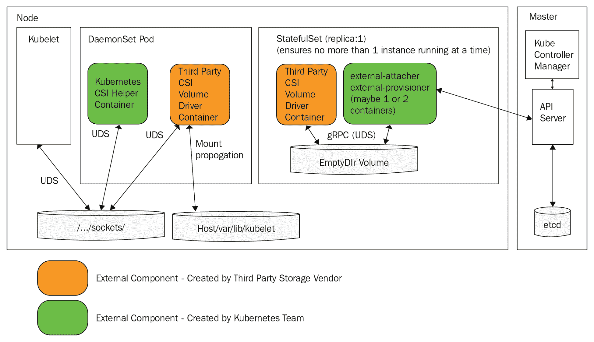
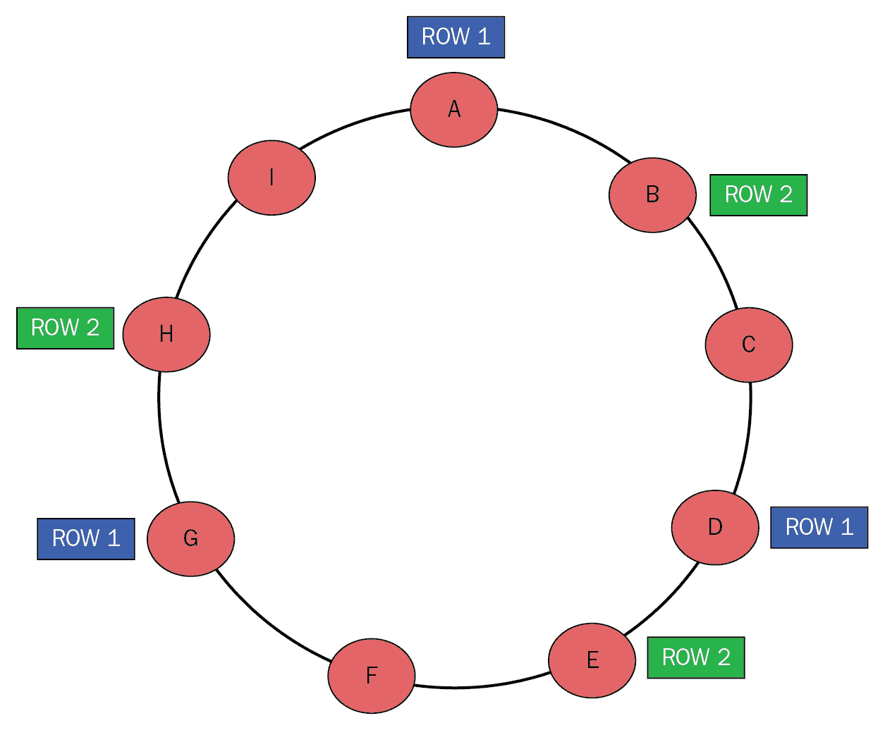

# 八、使用有状态服务

到目前为止，一切都很有趣和游戏。我们构建服务，将它们部署到 Kubernetes，并针对这些服务运行命令和查询。我们让 Kubernetes 能够通过在部署时或出现任何问题时调度 pods 来启动和运行这些服务。这对于可以在任何地方运行的无状态服务非常有用。在现实世界中，分布式系统管理着重要的数据。如果一个数据库将其数据存储在主机文件系统上，而该主机发生故障，您(或 Kubernetes)就不能在新节点上启动数据库的新实例，因为数据会丢失。

一般来说，您可以防止数据因冗余而丢失；您可以保留多个副本、存储备份、利用仅附加日志等等。Kubernetes 通过提供包含概念和相关资源(如卷、卷声明和状态集)的整个存储模型来提供帮助。

在本章中，我们将深入探讨 Kubernetes 存储模型。我们还将扩展德林奇新闻服务，将其数据存储在 Redis 中，而不是内存中。我们将涵盖以下主题:

*   抽象存储
*   在 Kubernetes 集群之外存储数据
*   使用状态集在 Kubernetes 集群中存储数据
*   利用本地存储实现高性能
*   在 Kubernetes 中使用关系数据库
*   在 Kubernetes 中使用非关系数据存储

# 技术要求

在本章中，我们将检查许多 Kubernetes 清单，使用不同的存储选项，并扩展 Delinkcious 以支持新的数据存储。没有必要安装任何新的东西。

# 代码

代码在两个 Git 存储库之间被分割，如下所示:

*   您可以在[https://github . com/PacktPublishing/hand-On-microservice-wit-Kubernetes/tree/master/chapter 08](https://github.com/PacktPublishing/Hands-On-Microservices-with-Kubernetes/tree/master/Chapter08)找到代码示例
*   您可以在[https://github.com/the-gigi/delinkcious/releases/tag/v0.6](https://github.com/the-gigi/delinkcious/releases/tag/v0.6)找到更新的德令状应用

# 抽象存储

从本质上来说，Kubernetes 是一个用于管理容器化工作负载的编排引擎。注意，这里的关键词是*容器化*。Kubernetes 不关心工作负载是什么，只要它们被打包在容器中；它知道如何处理它们。最初，Kubernetes 只支持 Docker 映像，后来，它增加了对其他运行时的支持。然后，Kubernetes 1.5 引入了**容器运行时接口** ( **CRI** )，逐步将对其他运行时的显式支持推出树外。在这里，Kubernetes 不再关心节点上实际部署了哪个容器运行时，只需要使用 CRI。

网络也有类似的故事，早期定义了**容器网络接口** ( **CNI** )。Kubernetes的生活很简单。这是留给不同的网络解决方案提供他们的 CNI 插件。然而，存储是不同的(直到它不是)。在接下来的小节中，我们将浏览 Kubernetes 存储模型，了解树内和树外存储插件之间的区别，最后，了解**容器存储接口** ( **CSI** )，它为 Kubernetes 中的存储提供了一个简洁的解决方案。

# Kubernetes 存储模型

Kubernetes 存储模型由几个概念组成:存储类、卷、持久卷和持久卷声明。让我们研究一下这些概念如何相互作用，以允许容器化的工作负载在执行过程中访问存储。

# 存储类

存储类是描述可以调配的可用存储类型的一种方式。通常，在未指定特定存储类别的情况下，调配卷时会使用默认存储类别。下面是 Minikube 中的标准存储类，它在主机(即托管节点)上存储数据:

```
$ kubectl get storageclass
NAME PROVISIONER AGE
standard (default) k8s.io/minikube-hostpath 65d
```

不同的存储类具有与实际后备存储相关的不同参数。卷资源调配者知道如何使用其存储类的参数。存储类元数据包括资源调配程序，如下所示:

```
$ kubectl get storageclass -o jsonpath='{.items[0].provisioner}'
k8s.io/minikube-hostpath
```

# 卷、持久卷和资源调配

Kubernetes 中的卷具有与其 pod 一致的显式生存期。当豆荚消失时，储藏室也消失了。有许多类型的卷非常有用。我们已经看到了一些例子，例如配置映射和秘密卷。但是还有其他卷类型用于读写。

You can take a look at the full list of volume types here: [https://kubernetes.io/docs/concepts/storage/volumes/#types-of-volumes](https://kubernetes.io/docs/concepts/storage/volumes/#types-of-volumes).

Kubernetes 还支持持久卷的概念。这些卷必须由系统管理员调配，并且不由 Kubernetes 本身管理。当您想要永久存储数据时，可以使用永久卷。管理员可以提前静态调配持久卷。该过程包括管理员调配外部存储并创建用户可以使用的`PersistentVolume` Kubernetes 对象。

动态资源调配是动态创建卷的过程。用户请求存储，这是动态创建的。动态资源调配取决于存储类别。用户可以指定特定的存储类，否则将使用默认存储类(如果存在)。所有 Kubernetes 云提供商都支持动态资源调配。Minikube 也支持它(后备存储是 localhost 文件系统)。

# 持续批量索赔

因此，群集管理员要么调配一些持久卷，要么群集支持动态调配。我们现在可以通过创建一个持久的卷声明来为我们的工作负载声明一些存储。但是，首先，理解短暂存储和持久存储之间的区别很重要。我们将在 pod 中创建一个临时文件，重新启动 pod，并检查文件是否消失。然后，我们将再次做同样的事情，但是，这一次，将文件写入持久存储，并检查一旦 pod 重新启动，文件是否仍然存在。

在我们开始之前，让我分享一些我创建的方便的 shell 函数和别名，以便在特定的 pods 中快速启动交互会话。Kubernetes 部署会生成随机的 pod 名称。例如`trouble`部署，当前吊舱名称为`trouble-6785b4949b-84x22`:

```
$ kubectl get po | grep trouble
trouble-6785b4949b-84x22     1/1 Running   1     2h
```

这不是一个很容易记住的名字，每当 pod 重新启动(由部署自动执行)时，它也会改变。不幸的是，`kubectl exec`命令需要一个精确的 pod 名称来运行命令。我创建了一个名为`get_pod_name_by_label()`的小 shell 函数，它根据标签返回一个 pod 名称。由于 pod 模板中的标签不会改变，这是发现 pod 名称的好方法。但是，同一部署中可能有多个带有相同标签的单元。我们只需要任何一种豆荚，所以我们可以简单地选择第一种。这是功能，我把它别名为`kpn`，这样更容易使用:

```
get_pod_name_by_label ()
 {
 kubectl get po -l $1 -o custom-columns=NAME:.metadata.name | tail +2 | uniq
 }

alias kpn='get_pod_name_by_label'
```

例如，`trouble`部署吊舱可以有一个名为`run=trouble`的标签。以下是如何找到实际的 pod 名称:

```
$ get_pod_name_by_label run=trouble
trouble-6785b4949b-84x22
```

使用这个函数，我创建了一个名为`trouble`的别名，它在`trouble`窗格中启动一个交互式 bash 会话:

```
$ alias trouble='kubectl exec -it $(get_pod_name_by_label run=trouble) bash'
```

现在，我们可以连接到`trouble`吊舱并开始在其中工作:

```
$ trouble
root@trouble-6785b4949b-84x22:/#
```

这是一个很长的题外话，但这是一个非常有用的技巧。现在，让我们回到我们的计划，创建一个临时文件，如下所示:

```
root@trouble-6785b4949b-84x22:/# echo "life is short" > life.txt
root@trouble-6785b4949b-84x22:/# cat life.txt
life is short
```

现在，让我们杀死豆荚。`trouble`部署将安排一个新的`trouble`吊舱，如下所示:

```
$ kubectl delete pod $(get_pod_name_by_label run=trouble)
pod "trouble-6785b4949b-84x22" deleted

$ get_pod_name_by_label run=trouble
trouble-6785b4949b-n6cmj
```

当我们进入新的吊舱时，我们发现`life.txt`如预期的那样消失了:

```
$ trouble
root@trouble-6785b4949b-n6cmj:/# cat life.txt
cat: life.txt: No such file or directory
```

这是可以理解的，因为它存储在容器的文件系统中。下一步是让`trouble`吊舱获得一些持久存储。这里有一个持久的卷声明，它动态地提供一个 gibibyte:

```
apiVersion: v1
kind: PersistentVolumeClaim
metadata:
  name: some-storage
spec:
  accessModes:
  - ReadWriteOnce
  resources:
    requests:
      storage: 1Gi
  volumeMode: Filesystem
```

以下是整个`trouble`部署的 YAML 清单，它将该声明作为一个卷使用并将其安装到容器中:

```
---
apiVersion: apps/v1
kind: Deployment
metadata:
  name: trouble
  labels:
    run: trouble
spec:
  replicas: 1
  selector:
    matchLabels:
      run: trouble
  template:
    metadata:
      labels:
        run: trouble
    spec:
      containers:
      - name: trouble
        image: g1g1/py-kube:0.2
        imagePullPolicy: Always
        command: ["/bin/bash", "-c", "while true ; do sleep 10 ; done"]
        volumeMounts:
        - name: keep-me
          mountPath: "/data"
      imagePullSecrets:
      - name: private-dockerhub
      volumes:
      - name: keep-me
        persistentVolumeClaim:
          claimName: some-storage
```

`keep-me`卷基于`some-storage`持久卷声明:

```
volumes:
- name: keep-me
  persistentVolumeClaim:
    claimName: some-storage
```

该卷被装入容器内的`/data`目录:

```
volumeMounts:
- name: keep-me
  mountPath: "/data"
```

现在，让我们写点东西给`/data`，如下:

```
$ trouble
root@trouble-64554479d-tszlb:/# ls /data
root@trouble-64554479d-tszlb:/# cd /data/
root@trouble-64554479d-tszlb:/data# echo "to infinity and be-yond!" > infinity.txt
root@trouble-64554479d-tszlb:/data# cat infinity.txt
to infinity and beyond!
```

最后的状态是删除 pod，当创建新的 pod 时，验证`infinity.txt`文件是否仍在`/data`中:

```
$ kubectl delete pod trouble-64554479d-tszlb
pod "trouble-64554479d-tszlb" deleted

$ trouble
root@trouble-64554479d-mpl24:/# cat /data/infinity.txt
to infinity and beyond!
```

耶，成功了！一个新的容器被创建，带有`infinity.txt`文件的持久存储被装载到新的容器中。

持久性卷还可以用于在同一映像的多个实例之间直接共享信息，因为相同的持久性存储将使用相同的持久性存储声明装载到所有容器中。

# 树内和树外存储插件

有两种类型的存储插件:树内和树外。树内意味着这些存储插件是 Kubernetes 本身的一部分。在 volume 子句中，您可以通过名称来引用它们。比如这里，一个**谷歌计算引擎** ( **GCE** )持久盘是按名称配置的。Kubernetes 明确知道这样的卷具有诸如`pdName`和`fsType`的字段:

```
volumes:
  - name: test-volume
    gcePersistentDisk:
      pdName: my-data-disk
      fsType: ext4
```

Take a look at the complete list of in-tree storage plugins at: [https://kubernetes.io/docs/concepts/storage/persistent-volumes/#types-of-persistent-volumes](https://kubernetes.io/docs/concepts/storage/persistent-volumes/#types-of-persistent-volumes).

还有其他几个专门的卷类型，如`emptyDir`、`local`、`downwardAPI`和`hostPath`，你可以阅读更多。树内插件的概念有点麻烦。它膨胀了 Kubernetes，并且每当提供商想要改进他们的存储插件或者引入一个新的插件时，就需要改变 Kubernetes 本身。

这就是树外插件出现的地方。这个想法是，Kubernetes 定义了一个标准的存储接口和一种提供插件的标准方式，以便在运行的集群中实现该接口。然后，集群管理员的工作是确保适当的树外插件可用。

Kubernetes 支持两种树外插件:FlexVolume 和 CSI。FlexVolume 是旧的，不推荐使用。关于 FlexVolume 我就不细说了，只建议大家不要用。

For more detail, you can refer to the following link: [https://kubernetes.io/docs/concepts/storage/volumes/#flexVolume](https://kubernetes.io/docs/concepts/storage/volumes/#flexVolume)

存储领域的大明星是 CSI。让我们深入了解 CSI 是如何工作的，以及它是多么巨大的改进。

# 了解犯罪现场调查

CSI 旨在解决树内插件的所有问题以及 FlexVolume 插件的繁琐问题。CSI 之所以对存储提供商如此有吸引力，是因为它不是 Kubernetes 独有的标准，而是全行业的标准。它允许存储提供商为其存储解决方案编写单一驱动程序，并立即与多种容器编排平台兼容，如 Docker、Cloud Foundry、Mesos，当然还有 Kubernetes。

You can find the official specification at [https://github.com/container-storage-interface/spec](https://github.com/container-storage-interface/spec).

Kubernetes 团队提供了三个边车容器组件，为任何 CSI 存储提供商提供通用 CSI 支持。这些组件如下:

*   驾驶员登记员
*   外部置备程序
*   外部专员

他们的工作是与 kubelet 以及 API 服务器接口。存储提供商通常会将这些边车容器及其存储驱动程序实现打包在一个 pod 中，该 pod 可以作为 Kubernetes DaemonSet 部署在所有节点上。

下面是一个图表，展示了所有部分之间的交互:



这相当复杂，但这种复杂性对于分离关注点是必要的，允许 Kubernetes 团队完成大量繁重的工作，并让存储提供商专注于他们的存储解决方案。对于用户和开发者来说，这都是完全透明的。他们继续通过存储类、卷和持久卷声明的相同 Kubernetes 存储抽象与存储交互。

# 容器安全倡议标准化

CSI 优于树内插件(和 FlexVolume 插件)。然而，目前的混合情况，你可以使用树内插件(或 FlexVolume 插件)或 CSI 插件是次优的。Kubernetes 团队有一个将树内插件迁移到 CSI 的详细计划。

You can find out more about this detailed plan at [https://github.com/kubernetes/community/blob/master/contributors/design-proposals/storage/csi-migration.md](https://github.com/kubernetes/community/blob/master/contributors/design-proposals/storage/csi-migration.md).

# 在 Kubernetes 集群之外存储数据

Kubernetes 不是一个封闭的系统。运行在 Kubernetes 集群内部的工作负载可以访问运行在集群外部的存储。当您迁移已经在存储中并且在 Kubernetes 之外配置和操作的现有应用时，这是最合适的。在这种情况下，循序渐进是明智之举。首先，将工作负载移动到由 Kubernetes 管理的容器中运行。这些容器将配置有位于集群外部的数据存储的端点。稍后，您可以考虑将这种外部存储纳入考虑范围是否值得。

还有一些使用群集外存储的其他使用情形，例如:

*   您的存储集群使用了一些奇特的硬件，或者网络没有成熟的树内插件或 CSI 插件(希望随着 CSI 成为黄金标准，这将变得罕见)。
*   您通过云提供商运行 Kubernetes，迁移所有数据会太贵、太冒险和/或太慢。
*   组织中的其他应用使用相同的存储集群，将组织中的所有应用和系统迁移到 Kubernetes 通常不切实际且不经济。
*   由于法规要求，您必须保持对数据的控制。

在 Kubernetes 之外管理存储有几个缺点:

*   安全性(您需要提供从工作负载到独立存储集群的网络访问)。
*   您必须实施存储集群的扩展、可用性、监控和配置。
*   当存储集群端发生变化时，您通常需要在 Kubernetes 端进行相应的配置更改。
*   由于额外的网络跳数和/或身份验证、授权或加密，您可能会遭受性能或延迟开销。

# 使用状态集在集群中存储数据

最好将数据存储在 Kubernetes 集群中。这为管理您的工作负载及其依赖的所有资源(不包括第三方外部服务)提供了统一的一站式服务。此外，您可以将存储与简化的监控集成在一起，这一点非常重要。我们将在以后的章节中深入讨论监控。然而，磁盘空间不足是许多系统管理员的克星。但是，如果您将数据存储在一个节点上，并且您的数据存储单元被重新调度到另一个节点，并且它期望可用的数据不在那里，那么就会出现问题。Kubernetes 的设计师们意识到短命的豆荚哲学不适用于储藏。您可以尝试使用 pod-node affinity 和 Kubernetes 提供的其他机制来自己管理它，但是使用 StatefulSet 要好得多，StatefulSet 是在 Kubernetes 中管理存储感知服务的特定解决方案。

# 理解状态集

从本质上来说，StatefulSet 是一个控制器，它管理一组带有一些额外属性的豆荚，比如有序性和唯一性。StatefulSet 允许部署和扩展其豆荚集，同时保留其特殊属性。在 Kubernetes 1.9 中，状态集达到了**g**T2(**GA**状态。您可以将 StatefulSet 视为一个增强的部署。让我们看一下用户服务的示例 StatefulSet，它使用关系 PostgresDB 作为其数据存储:

```
apiVersion: apps/v1
kind: StatefulSet
metadata:
  name: user-db
spec:
  selector:
    matchLabels:
      svc: user
      app: postgres
  serviceName: user-db
  replicas: 1
  template:
    metadata:
      labels:
        svc: user
        app: postgres
    spec:
      terminationGracePeriodSeconds: 10
      containers:
      - name: nginx
        image: postgres:11.1-alpine
        ports:
        - containerPort: 5432
        env:
        - name: POSTGRES_DB
          value: user_manager
        - name: POSTGRES_USER
          value: postgres
        - name: POSTGRES_PASSWORD
          value: postgres
        - name: PGDATA
          value: /data/user-db

        volumeMounts:
        - name: user-db
          mountPath: /data/user-db
  volumeClaimTemplates:
  - metadata:
      name: user-db
    spec:
      accessModes: [ "ReadWriteOnce" ]
      # storageClassName: <custom storage class>
      resources:
        requests:
          storage: 1Gi
```

这里发生了很多事情，但都是由熟悉的概念组成的。让我们把它分成几部分。

# StatefulSet 组件

状态集由以下三个主要部分组成:

*   **状态集合元数据和定义**:状态集合元数据和定义非常类似于部署。您有标准的应用编程接口版本、种类和元数据名称；然后是`spec`，它包括一个 pod 的选择器(必须与接下来的 pod 模板选择器相匹配)、副本的数量(在本例中只有一个)以及与部署相比的主要差异，即`serviceName`:

```
apiVersion: apps/v1
kind: StatefulSet
metadata:
  name: user-db
spec:
  selector:
    matchLabels:
      svc: user
      app: postgres
  replicas: 1
  serviceName: user-db
```

状态集合*必须*有一个与状态集合相关联的无头服务来管理吊舱的网络身份。本例中服务名称为`user-db`；这里是为了完整起见:

```
apiVersion: v1
kind: Service
metadata:
  name: user-db
spec:
  ports:
  - port: 5432
  clusterIP: None
  selector:
    svc: user
    app: postgres
```

*   **一个吊舱模板**:下一部分是标准吊舱模板。PGDATA 环境变量(`/data/user-db`)告诉 postgres 在哪里读写其数据，它必须与`user-db`卷(`/data/user-db`)或子目录的装载路径相同。这是我们将数据存储与底层存储连接起来的地方:

```
template:
  metadata:
    labels:
      svc: user
      app: postgres
  spec:
    terminationGracePeriodSeconds: 10
    containers:
    - name: nginx
      image: postgres:11.1-alpine
      ports:
      - containerPort: 5432
      env:
      - name: POSTGRES_DB
        value: user_manager
      - name: POSTGRES_USER
        value: postgres
      - name: POSTGRES_PASSWORD
        value: postgres
      - name: PGDATA
        value: /data/user-db
      volumeMounts:
      - name: user-db
        mountPath: /data/user-db
```

*   **批量索赔模板**:最后一部分是批量索赔模板。注意这是复数；一些数据存储可能需要多种类型的卷(例如，用于日志记录或缓存)，这些卷需要自己的持久声明。在这种情况下，一个持久的声明就足够了:

```
volumeClaimTemplates:
- metadata:
    name: user-db
  spec:
    accessModes: [ "ReadWriteOnce" ]
    # storageClassName: <custom storage class>
    resources:
      requests:
        storage: 1Gi
```

现在是一个深入了解状态集的特殊属性以及它们为什么重要的好时机。

# Pod 身份

StatefulSet pods 有一个稳定的标识，包括以下三元组:稳定的网络标识、序数索引和稳定的存储。这些总是一起走；每个吊舱的名称为`<statefulset name>-<ordinal>`。

与 StatefulSet 关联的无头服务提供了稳定的网络标识。服务域名如下:

```
<service name>.<namespace>.svc.cluster.local
```

每个吊舱 *X* 将有一个稳定的域名，如下所示:

```
<statefulset name>-<ordinal>.<service name>.<namespace>.svc.cluster.local
```

例如，`user-db`状态集合的第一个荚将被称为:

```
user-db-0.user-db.default.svc.cluster.local
```

此外，StatefulSet pods 会自动分配一个标签，如下所示:

```
statefulset.kubernetes.io/pod-name=<pod-name>
```

# 整齐

StatefulSet 中的每个 pod 都有一个序号索引。但是，这是为了什么？一些数据存储依赖于有序的初始化序列。statefleset 确保在初始化、放大或缩小 statefleset 单元时，总是按顺序进行。

在 Kubernetes 1.7 中，有序限制被放宽。对于不需要有序性的数据存储，允许在 StatefulSet 中的多个 pod 上进行并行操作是有意义的。这可以在`podPolicy`字段中指定。允许的值为默认有序行为的`OrderedReady`，或放松并行模式的*并行*，在这种模式下，吊舱可以启动或终止，而其他吊舱仍在启动或终止。

# 什么时候应该使用状态集？

当您自己在云中管理数据存储并且需要对数据存储使用的存储进行良好控制时，您应该使用 StatefulSet。主要用例是分布式数据存储，但是 StatefulSet 是有用的，即使您的数据存储只有一个实例或 pod。稳定的吊舱身份与稳定的附加存储是非常值得的，尽管有序，当然，不是必需的。如果您的数据存储由共享存储层(如 NFS)备份，则可能不需要状态集。

此外，这可能是常识，但是如果您自己不管理数据存储，那么您就不需要担心存储层，也不需要定义自己的状态集。例如，如果您在 AWS 上运行您的系统，并使用 S3、无线电数据系统、动态数据库和红移，那么您实际上不需要状态集。

# 比较部署和状态集

部署旨在管理任何一组吊舱。它们也可以用来管理分布式数据存储的单元。StatefulSets 是专门为支持分布式数据存储的需求而设计的。然而，有序性和唯一性的特殊性质并不总是必要的。让我们将部署与状态集进行比较，自己看看:

*   部署没有关联的存储，而状态集有。
*   部署没有关联的服务，而状态集有关联的服务。
*   部署单元没有域名，而状态集单元有。
*   部署以任何顺序启动和终止吊舱，而状态集遵循规定的顺序(默认)。

我建议您坚持部署，除非您的分布式数据存储需要 StatefulSets 的特殊属性。如果你只需要一个稳定的身份，而不是一个有序的启动和关闭，那么使用`podPolicy=Parallel`。

# 回顾一个大型状态集示例

卡珊德拉([https://cassandra.apache.org/](https://cassandra.apache.org/))是一个有趣的分布式数据存储，我有很多经验。它非常强大，但它需要大量的知识才能正常运行和发展。这也是 StatefulSets 的一个很好的用例。让我们快速回顾一下 Cassandra，并了解如何在 Kubernetes 中部署它。请注意，我们不会在德林契亚使用卡珊德拉。

# 卡珊德拉简介

Cassandra 是一个 Apache 开源项目。这是一个柱状数据存储，非常适合管理时间序列数据。三年多来，我一直用它来收集和管理数千个空气质量传感器网络的数据。

卡珊德拉有一个有趣的建模方法，但是，在这里，我们关心的是存储。卡珊德拉是高度可用的，线性可扩展的，并且通过冗余非常可靠(没有 SPOF)。Cassandra 节点分担数据的责任(数据通过**分布式哈希表**或**分布式哈希表**进行分区)。数据的多个副本分布在多个节点上(通常是三个或五个)。

这样，如果一个 Cassandra 节点关闭，那么还有另外两个节点拥有相同的数据，可以响应查询。所有节点都是一样的；没有主人，也没有奴隶。节点通过八卦协议不断地相互聊天，当新节点加入集群时，卡珊德拉会在所有节点之间重新分配数据。下图显示了数据在 Cassandra 集群中的分布情况:



您可以将节点视为一个环，DHT 算法对每个宽行(工作单位)进行哈希处理，并将其分配给 *N* 个节点(取决于集群的复制因子)。通过将单个行精确地放置在特定的节点上，您可以看到 StatefulSet 的稳定标识和排序属性是如何派上用场的。

让我们探索在 Kubernetes 中将 Cassandra 集群部署为 StatefulSet 需要什么。

# 使用状态集在 Kubernetes 上部署 Cassandra

这里有一个截断的版本，包含了我们应该关注的部分。

第一部分包括`apiVersion`、`kind`、`metadata`和`spec`，我们之前已经看到了。名字是`cassandra`，标签是`app: cassandra`。在`spec`中，`serviceName`的名字也是`cassandra`，有三个副本:

```
apiVersion: apps/v1
kind: StatefulSet
metadata:
  name: cassandra
  labels:
    app: cassandra
 spec:
   serviceName: cassandra
   replicas: 3
   selector:
     matchLabels:
       app: cassandra 
```

pod 模板有一个匹配的标签`app: cassandra`。这个容器也被命名为`cassandra`，并且使用了一个带有总是拉取策略的谷歌样本映像。这里，`terminationGraceInSeconds`设置为 1800 秒(即 30 分钟)。这是 StatefulSet 允许 pod 在没有响应的情况下尝试恢复的时间。Cassandra 内置了大量冗余，因此让一个节点尝试恢复 30 分钟是可以的。我删除了许多端口、环境变量和就绪检查(省略号)。卷装叫`cassandra-data`，路径是`/cassandra_data`。那是卡珊德拉存储数据文件的地方:

```
template:
  metadata:
    labels:
      app: cassandra
  spec:
    terminationGracePeriodSeconds: 1800
    containers:
    - name: cassandra
      image: gcr.io/google-samples/cassandra:v13
      imagePullPolicy: Always
      ...
      volumeMounts:
      - name: cassandra-data
        mountPath: /cassandra_data
```

最后，卷声明模板定义了与装载在名为`cassandra-data`的容器中的卷相匹配的持久存储。此处未显示存储类`fast`，但它通常是运行 Cassandra pod 的同一节点上的本地存储。存储大小为一千兆字节:

```
volumeClaimTemplates:
- metadata:
    name: cassandra-data
  spec:
    accessModes: [ "ReadWriteOnce" ]
    storageClassName: fast
    resources:
      requests:
        storage: 1Gi
```

在这一点上，你们应该都很熟悉。然而，还有更成功的卡珊德拉部署有待发现。如果你回忆起来，卡珊德拉没有主人；卡珊德拉节点使用八卦协议不断地相互交谈。

但是卡珊德拉节点是怎么找到对方的呢？输入种子提供商；每当一个新节点被添加到集群中时，它都会被配置一些种子节点的 IP 地址(在本例中为`10.0.0.1`、`10.0.0.2`和`10.0.0.3`)。它开始与这些种子节点交换消息，这些种子节点通知集群中其他 Cassandra 节点的新节点，并通知所有其他现有节点新节点已加入集群。通过这种方式，集群中的每个节点可以非常快速地了解集群中的其他每个节点。

这里是一个典型的 Kubernetes 配置文件(`cassandra.yaml`)的一部分，它定义了种子提供程序。在这种情况下，它只是一个简单的 IP 地址列表:

```
seed_provider:
    - class_name: SEED_PROVIDER
        parameters:
        # seeds is actually a comma-delimited list of addresses.
        # Ex: "<ip1>,<ip2>,<ip3>"
        - seeds: "10.0.0.1,10.0.0.2,10.0.0.3,"
```

种子提供程序也可以是自定义类。这是一个非常好的可扩展设计。在 Kubernetes 中，这是必要的，因为原始种子节点可能会四处移动并获得新的 IP 地址。

为了解决这个问题，有一个定制的`KubernetesSeedProvider`类，它与 Kubernetes API 服务器对话，并且总是可以在查询时返回种子节点的 IP 地址。Cassandra 是用 Java 实现的，实现`SeedProvider` Java 接口的自定义种子提供者也是如此。

我们不打算详细剖析这段代码。需要注意的主要事情是，它与一个名为`cassandra-seed.so`的原生 Go 库接口，然后使用它来获取 Cassandra 服务的 Kubernetes 端点:

```
package io.k8s.cassandra;

import java.io.IOException;
import java.net.InetAddress;
import java.util.Collections;
import java.util.List;
import java.util.Map;

...

 /**
 * Create new seed provider
 *
 * @param params
 */
 public KubernetesSeedProvider(Map<String, String> params) {
 }

...
 }
 }

private static String getEnvOrDefault(String var, String def) {
 String val = System.getenv(var);
...
 static class Endpoints {
 public List<InetAddress> ips;
 }
 }
```

The complete source code can be found at [https://github.com/kubernetes/examples/blob/master/cassandra/java/src/main/java/io/k8s/cassandra/KubernetesSeedProvider.java](https://github.com/kubernetes/examples/blob/master/cassandra/java/src/main/java/io/k8s/cassandra/KubernetesSeedProvider.java).

这就是连接卡珊德拉和Kubernetes的魔力，让他们可以一起工作。现在我们已经了解了如何在 Cassandra 中部署复杂的分布式数据存储，让我们来看看本地存储，它在 Kubernetes 1.14 中升级到 GA。

# 利用本地存储实现高性能

现在让我们讨论计算和存储之间的密切关系。速度、容量、持久性和成本之间有一种有趣的关系。当您的数据在处理器附近时，您可以立即开始处理它，而不是通过网络获取它。这就是本地存储的前景。

本地存储数据有两种主要方式:内存和本地驱动器。但是，也有细微差别；内存最快，SSD 驱动器比内存慢 4 倍左右，旋转磁盘比 SSD 驱动器大约慢 20 倍([https://gist.github.com/jboner/2841832](https://gist.github.com/jboner/2841832))。

让我们考虑以下两个选项:

*   将数据存储在内存中
*   将您的数据存储在本地固态硬盘上

# 将数据存储在内存中

就读写延迟和吞吐量而言，最高的性能是将数据保存在内存中。有不同的内存类型和缓存，但底线是内存超级快。然而，内存也有明显的缺点，例如:

*   与磁盘相比，节点的内存更有限(也就是说，它需要更多的机器来存储相同数量的数据)。
*   内存非常昂贵。
*   记忆是短暂的。

有些用例需要将整个数据集存储在内存中。在这些情况下，要么数据集非常小，要么您可以将其拆分到多台机器上。如果数据很重要并且不容易生成，那么可以通过以下两种方式解决内存的短暂性:

*   保留一份永久副本。
*   冗余性(也就是说，将数据保存在多个机器的内存中，并可能进行地理分布)。

# 将您的数据存储在本地固态硬盘上

本地固态硬盘不如内存快，但速度非常快。当然，您也可以总是结合内存缓存(任何值得尊敬的数据存储都将使用内存缓存)。当您需要快速性能，但您的工作集不适合内存时，使用固态硬盘是合适的，或者，当您可以使用便宜得多但仍然非常快速的固态硬盘时，您不想支付大内存的溢价。例如，卡珊德拉建议使用本地固态硬盘存储作为其数据的后备存储。

# 在 Kubernetes 中使用关系数据库

到目前为止，我们已经在所有服务中使用了关系数据库，但是，正如我们将很快发现的，我们没有真正的持久性。首先，我们将看看数据存储在哪里，然后我们将探索它有多持久。最后，我们将迁移其中一个数据库，以使用 StatefulSet 来实现适当的持久性和持久性。

# 了解数据存储在哪里

对于 PostgreSQL，有一个`data`目录；可以使用`PGDATA`环境变量设置该目录。默认设置为`/var/lib/postgresql/data`:

```
$ kubectl exec -it link-db-6b9b64db5-zp59g env | grep PGDATA
PGDATA=/var/lib/postgresql/data
```

让我们看看这个目录包含什么:

```
$ kubectl exec -it link-db-6b9b64db5-zp59g ls /var/lib/postgresql/data
PG_VERSION pg_multixact pg_tblspc
base pg_notify pg_twophase
global pg_replslot pg_wal
pg_commit_ts pg_serial pg_xact
pg_dynshmem pg_snapshots post-gresql.auto.conf
pg_hba.conf pg_stat postgresql.conf
pg_ident.conf pg_stat_tmp postmaster.opts
pg_logical pg_subtrans postmaster.pid
```

然而，`data`目录可以是短暂的，也可以是持久的，这取决于它是如何装载到容器中的。

# 使用部署和服务

有了面向数据库单元的服务，您可以轻松访问数据。当数据库 pod 被终止时，它将由部署重新启动。但是，由于 pod 可以安排在不同的节点上，因此您需要确保它能够访问实际数据所在的存储。否则，它将开始为空，您将丢失所有数据。这是一个只用于开发的设置，也是大多数 Delinkcious 服务保存数据的方式——通过运行一个 PostgresDB 容器，该容器只像它的 pod 一样持久。事实证明，数据存储在 pod 内部运行的 Docker 容器本身中。

在 Minikube 中，我可以直接检查 Docker 容器，方法是首先 SSH 进入节点，找到 postgres 容器的 ID，然后检查它(也就是说，只有在显示相关信息的情况下):

```
$ minikube ssh
_ _
_ _ ( ) ( )
___ ___ (_) ___ (_)| |/') _ _ | |_ __
/' _ ` _ `\| |/' _ `\| || , < ( ) ( )| '_`\ /'__`\
| ( ) ( ) || || ( ) || || |\`\ | (_) || |_) )( ___/
(_) (_) (_)(_)(_) (_)(_)(_) (_)`\___/'(_,__/'`\____)

$ docker ps -f name=k8s_postgres_link-db -q
409d4a52a7f5

$ docker inspect -f "{{json .Mounts}}" 409d4a52a7f5 | jq .[1]
{
"Type": "volume",
"Name": "f9d090d6defba28f0c0bfac8ab7935d189332478d0bf03def6175f5c0a2e93d7",
 "Source": "/var/lib/docker/volumes/f9d090d6defba28f0c0bfac8ab7935d189332478d0bf03def6175f5c0a2e93d7/_data",
"Destination": "/var/lib/postgresql/data",
"Driver": "local",
"Mode": "",
"RW": true,
"Propagation": ""
}
```

这意味着，如果容器消失了(例如，如果我们升级到新版本)，当然如果节点消失了，那么我们所有的数据都会消失。

# 使用状态集

有了州政府，情况就不同了。数据目录装载到容器中，但存储本身由外部管理。只要外部存储可靠且冗余，我们的数据就是安全的，无论特定的容器、容器和节点发生了什么。我们之前提到过如何使用无头服务为用户数据库定义 StatefulSet。然而，消耗 StatefulSet 的存储空间可能有点挑战性。附加到状态集的无头服务没有群集 IP。那么，用户服务将如何连接到它的数据库呢？好吧，我们必须帮助它。

# 帮助用户服务定位状态集盒

无头`user-db`服务没有集群 IP，如下:

```
$ kubectl get svc user-db
NAME TYPE CLUSTER-IP EXTERNAL-IP PORT(S) AGE
user-db ClusterIP None <none> 5432/TCP 4d
```

但是，它确实有端点，这些端点是支持服务的所有单元的集群中的 IP 地址:

```
$ kubectl get endpoints user-db
NAME ENDPOINTS AGE
user-db 172.17.0.25:5432 4d
```

这是一个很好的选择；端点不会通过环境变量公开，例如具有集群 IP ( `<service name>_SERVICE_HOST and <service name>_SERVICE_PORT`)的服务。因此，要让服务找到无头服务的端点，他们必须直接查询 Kubernetes API。虽然这是可能的，但它增加了服务和 Kubernetes 之间不必要的耦合。我们将无法在 Kubernetes 之外运行该服务进行测试，因为它依赖于 Kubernetes API。然而，我们可以欺骗用户服务，并使用配置图填充`USER_DB_SERVICE_HOST`和`USER_DB_SERVICE_PORT`。

这个想法是 StatefulSet 荚有一个稳定的域名。对于用户数据库，有一个 pod 的 DNS 名称为`user-db-0.user-db.default.svc.cluster.local`。在疑难解答容器外壳中，我们可以通过运行`dig`命令来验证域名是否解析为用户数据库端点`172.17.0.25`:

```
root@trouble-64554479d-zclxc:/# dig +short us-er-db-0.user-db.default.svc.cluster.local
172.17.0.25
```

现在，我们可以将这个稳定的域名分配给`user-manager`服务的配置图中的`USER_DB_SERVICE_HOST`:

```
apiVersion: v1
kind: ConfigMap
metadata:
  name: user-manager-config
  namespace: default
data:
  USER_DB_SERVICE_HOST: "us-er-db-0.user-db.default.svc.cluster.local"
  USER_DB_SERVICE_PORT: "5432"
```

一旦应用了这个配置映射，用户服务将能够通过环境变量找到 StatefulSet 的用户数据库窗格。下面是从`pkg/db_util/db_util.go`开始使用这些环境变量的代码:

```
func GetDbEndpoint(dbName string) (host string, port int, err error) {
 hostEnvVar := strings.ToUpper(dbName) + "_DB_SERVICE_HOST"
 host = os.Getenv(hostEnvVar)
 if host == "" {
 host = "localhost"
 }

portEnvVar := strings.ToUpper(dbName) + "_DB_SERVICE_PORT"
 dbPort := os.Getenv(portEnvVar)
 if dbPort == "" {
 dbPort = "5432"
 }

port, err = strconv.Atoi(dbPort)
 return
 }
```

用户服务在其`Run()`函数中调用它来初始化其数据库存储:

```
func Run() {
 dbHost, dbPort, err := db_util.GetDbEndpoint("user")
 if err != nil {
 log.Fatal(err)
 }

store, err := sgm.NewDbUserStore(dbHost, dbPort, "postgres", "postgres")
 if err != nil {
 log.Fatal(err)
 }
 ...
 }
```

现在，让我们看看如何解决管理模式更改的问题。

# 管理架构更改

使用关系数据库时，最具挑战性的主题之一是管理 SQL 模式。当模式发生变化时，变化可能是向后兼容的(通过添加一列)，也可能是非向后兼容的(通过将一个表拆分成两个单独的表)。当模式改变时，我们需要迁移我们的数据库，但是也要迁移受模式改变影响的代码。

如果您能够承受短暂的停机时间，那么该过程可能非常简单，如下所示:

1.  关闭所有受影响的服务并执行数据库迁移。
2.  部署知道如何使用新模式的新代码。
3.  一切正常。

但是，如果您需要保持系统运行，您将不得不经历一个更复杂的过程，将模式更改分解为多个向后兼容的更改，包括相应的代码更改。

例如，将一个表拆分为两个表时，可以执行以下过程:

1.  保留原表。
2.  添加两个新表。
3.  部署既能写入旧表又能写入新表并能读取所有表的代码。
4.  将所有数据从旧表迁移到新表。
5.  部署一个只从新表中读取的代码更改(现在新表中有所有数据)。
6.  删除旧表。

关系数据库非常有用；然而，有时，正确的解决方案是非关系数据存储。

# 在 Kubernetes 中使用非关系数据存储

Kubernetes 和 StatefulSets 不受限制，甚至不面向关系数据存储。非关系(也称为 NoSQL)数据存储对于许多用例非常有用。Redis 是最通用、最受欢迎的内存数据存储之一。让我们了解一下 Redis，并研究如何迁移 Delinkcious 新闻服务来使用 Redis，而不是将事件存储在短暂的内存中。

# 一篇导言

Redis 通常被描述为数据结构服务器。由于它将整个数据存储在内存中，因此可以高效地对数据执行许多高级操作。你付出的代价，当然是你要把*的所有*的数据保存在内存中。这仅适用于小型数据集，即便如此，成本也很高。如果您不能访问大部分数据，将其保存在内存中是一种巨大的浪费。Redis 可以用作热数据的快速分布式缓存；因此，即使您不能将其用作内存中整个数据集的分布式缓存，您仍然可以对热数据(经常使用)使用 Redis。Redis 还支持数据跨多个节点共享的集群，因此它也能够处理非常大的数据集。Redis 有一个令人印象深刻的功能列表，包括以下内容:

*   它提供多种数据结构，如列表、散列、集合、排序集合、位图、流和地理空间索引。
*   它在许多数据结构上提供原子操作。
*   它支持交易。
*   它支持自动驱逐与 TTL。
*   它支持驱逐 LRU。
*   它支持酒馆/酒馆。
*   它允许可选的磁盘持久性。
*   它允许可选地将操作附加到日志。
*   它提供 Lua 脚本。

现在，让我们来看看德林克西如何使用 Redis。

# 新闻服务中的持续事件

新闻服务提供一个 Redis 实例作为状态集，如下所示:

```
apiVersion: apps/v1
kind: StatefulSet
metadata:
  name: news-manager-redis
spec:
  serviceName: news-manager-redis
  replicas: 1
  selector:
    matchLabels:
      app: redis
      svc: news-manager
  template:
    metadata:
      labels:
        app: redis
        svc: news-manager
    spec:
      containers:
      - name: redis-primary
        image: redis:5.0.3-alpine
        imagePullPolicy: Always
        ports:
        - containerPort: 6379
          name: redis
        volumeMounts:
        - name: news-manager-redis
          mountPath: /data
  volumeClaimTemplates:
  - metadata:
      name: news-manager-redis
    spec:
      accessModes: [ "ReadWriteOnce" ]
      resources:
        requests:
          storage: 1Gi
```

无头服务支持它:

```
apiVersion: v1
kind: Service
metadata:
  name: news-manager-redis
  labels:
    app: redis
    svc: news-manager
spec:
  selector:
    app: redis
    svc: news-manager
  type: None
  ports:
  - port: 6379
    name: redis
```

我们可以使用相同的技巧，使用配置映射通过环境变量注入 Redis pod 的 DNS 名称:

```
apiVersion: v1
kind: ConfigMap
metadata:
  name: news-manager-config
  namespace: default
data:
  PORT: "6060"
  NEWS_MANAGER_REDIS_SERVICE_HOST: "news-manager-redis-0.news-manager-redis.default.svc.cluster.local"
  USER_DB_SERVICE_PORT: "6379"
```

随着资源调配的进行，让我们来看看代码是如何访问 Redis 的。在新闻服务的`Run()`功能中，如果 Redis 的环境变量不是空的，那么它将创建一个新的 Redis 存储:

```
redisHostname := os.Getenv("NEWS_MANAGER_REDIS_SERVICE_HOST")
redisPort := os.Getenv("NEWS_MANAGER_REDIS_SERVICE_PORT")

var store nm.Store
if redisHostname == "" {
store = nm.NewInMemoryNewsStore()
} else {
address := fmt.Sprintf("%s:%s", redisHostname, redisPort)
store, err = nm.NewRedisNewsStore(address)
if err != nil {
log.Fatal(err)
}
}
```

`NewRedisNewStore()`功能在`pkg/new_manager/redis_news_store`中定义。它创建了一个新的 Redis 客户端(来自`go-redis`图书馆)。它还调用客户端的`Ping()`方法来确保 Redis 已启动并正在运行，并且可以访问:

```
package news_manager

import (
 "github.com/go-redis/redis"
 "github.com/pelletier/go-toml"
 om "github.com/the-gigi/delinkcious/pkg/object_model"
 )

// RedisNewsStore manages a UserEvents data structure
 type RedisNewsStore struct {
 redis *redis.Client
 }

func NewRedisNewsStore(address string) (store Store, err error) {
 client := redis.NewClient(&redis.Options{
 Addr: address,
 Password: "", // use empty password for simplicity. should come from a secret in production
 DB: 0, // use default DB
 })

_, err = client.Ping().Result()
 if err != nil {
 return
 }

store = &RedisNewsStore{redis: client}
 return
 }
```

`RedisNewsStore`将事件存储在 Redis 列表中，该列表被序列化为 TOML。这都是在`AddEvent()`实现的，具体如下:

```
func (m *RedisNewsStore) AddEvent(username string, event *om.Event) (err error) {
 t, err := toml.Marshal(*event)
 if err != nil {
 return
 }
err = m.redis.RPush(username, t).Err()
 return
 }
```

`RedisNewsStore`执行`GetNews()`方法按顺序获取事件。首先，它根据起始索引和最大页面大小计算开始和结束索引来查询事件列表。然后，它获得结果，这些结果被序列化为 TOML，将它们解组到`om.Event`结构中，并将它们附加到事件的结果列表中。最后，它计算要获取的下一个索引(如果没有更多事件，则为`-1`):

```
const redisMaxPageSize = 10

func (m *RedisNewsStore) GetNews(username string, startIndex int) (events []*om.Event, nextIndex int, err error) {
 stop := startIndex + redisMaxPageSize - 1
 result, err := m.redis.LRange(username, int64(startIndex), int64(stop)).Result()
 if err != nil {
 return
 }

for _, t := range result {
 var event om.Event
 err = toml.Unmarshal([]byte(t), &event)
 if err != nil {
 return
 }

events = append(events, &event)
 }

if len(result) == redisMaxPageSize {
 nextIndex = stop + 1
 } else {
 nextIndex = -1
 }

return
 }
```

此时，您应该已经很好地掌握了非关系数据存储，包括何时使用它们，以及如何将 Redis 集成为您的服务的数据存储。

# 摘要

在这一章中，我们讨论了存储和真实世界数据持久性这一非常重要的主题。我们了解了 Kubernetes 存储模型、通用存储接口和 StatefulSets。然后，我们讨论了如何在 Kubernetes 中管理关系和非关系数据，并通过 StatefulSet 迁移了几个 Delinkcious 服务来使用适当的持久存储，包括如何为 StatefulSet pods 提供数据存储端点。最后，我们使用 Redis 为新闻服务实现了一个非短暂的数据存储。此时，您应该对 Kubernetes 如何管理存储有一个清晰的概念，并且能够为您的系统选择合适的数据存储，以及将它们集成到您的 Kubernetes 集群和您的服务中。

在下一章中，我们将探索无服务器计算这一激动人心的领域。我们将考虑无服务器模型何时有用，讨论 Kubernetes 的当前解决方案，并通过一些无服务器任务扩展 Delinkcious。

# 进一步阅读

有关更多信息，您可以参考以下参考资料:

*   **CSI**:[https://medium . com/Google-cloud/了解-容器-存储-界面-csi-ddbeb966a3b](https://medium.com/google-cloud/understanding-the-container-storage-interface-csi-ddbeb966a3b)
*   **StatefulSet**:[https://kubernetes . io/docs/concepts/workloads/controller/StatefulSet/](https://kubernetes.io/docs/concepts/workloads/controllers/statefulset/)
*   **卡珊德拉**:[https://cassandra.apache.org/](https://cassandra.apache.org/)
*   **:[http://redis . io/](http://redis.io/)**
***   **每个程序员都应该知道的延迟数**:[https://gist.github.com/jboner/2841832](https://gist.github.com/jboner/2841832)**