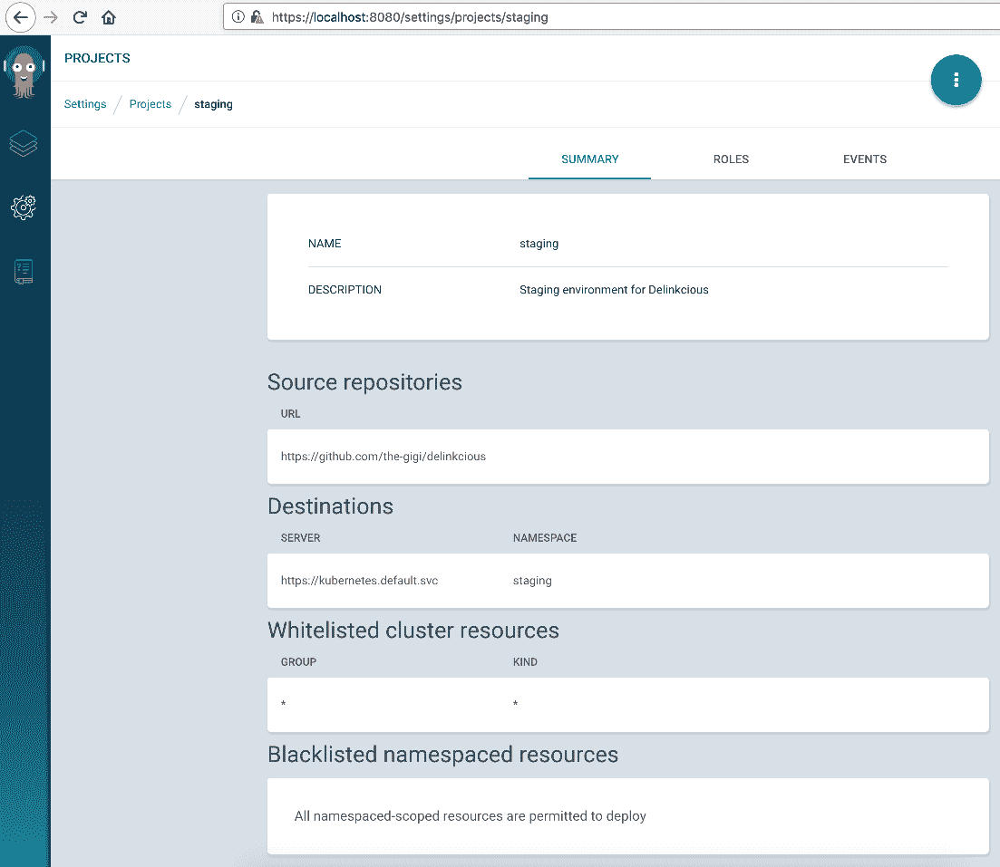
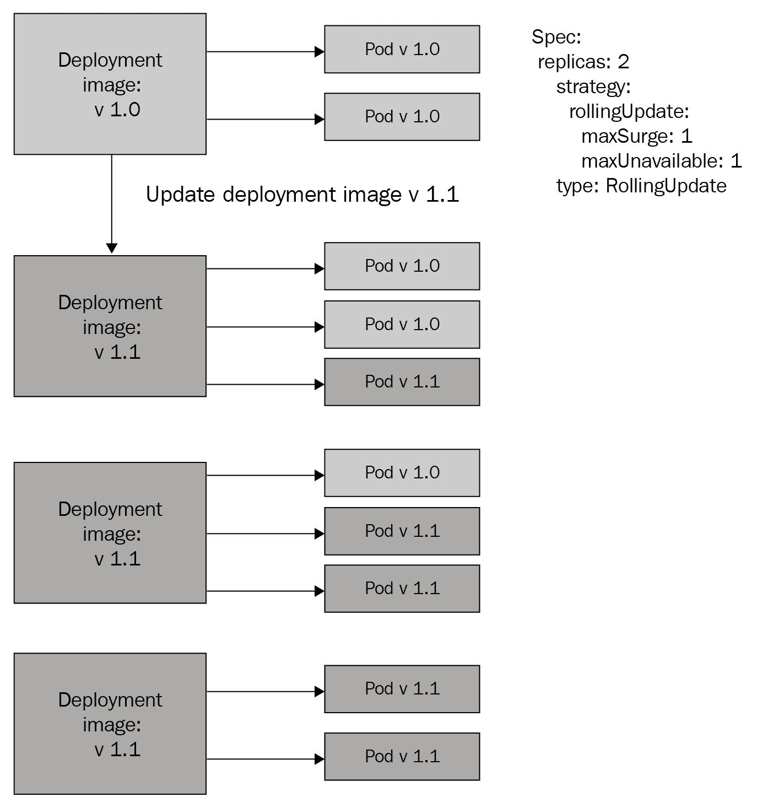
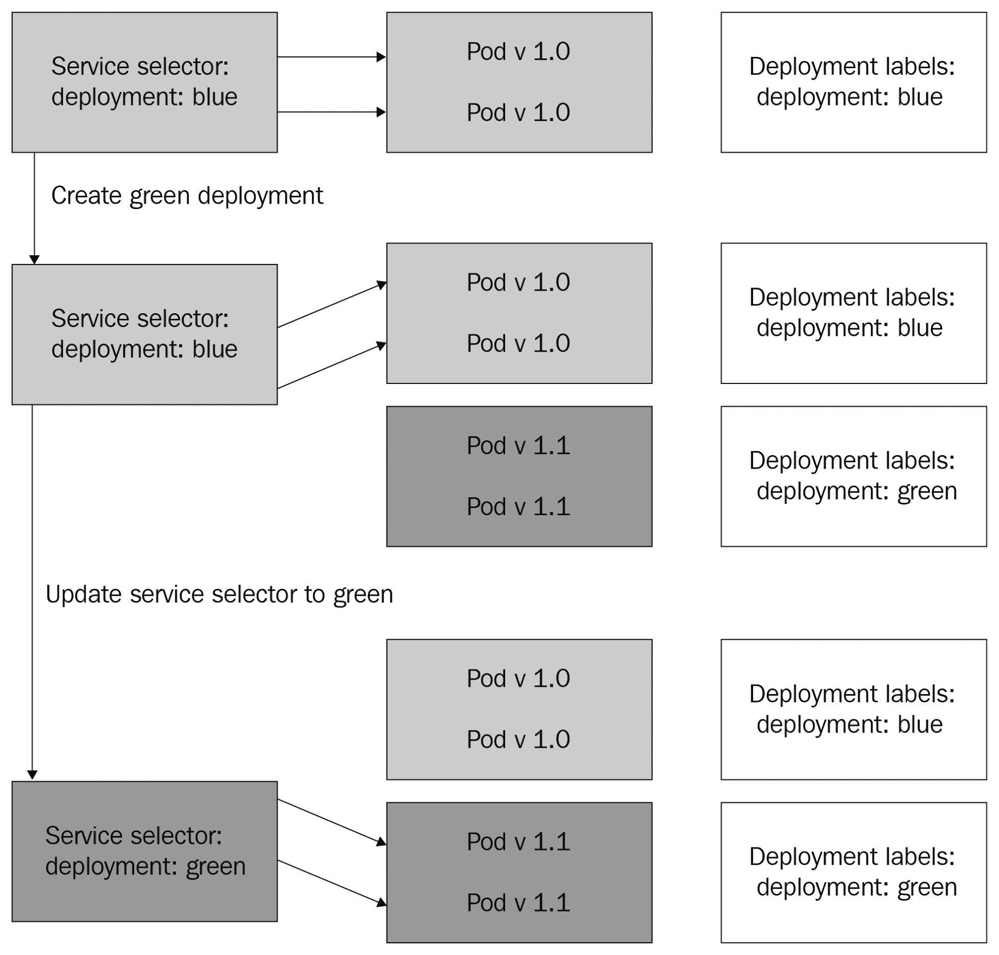
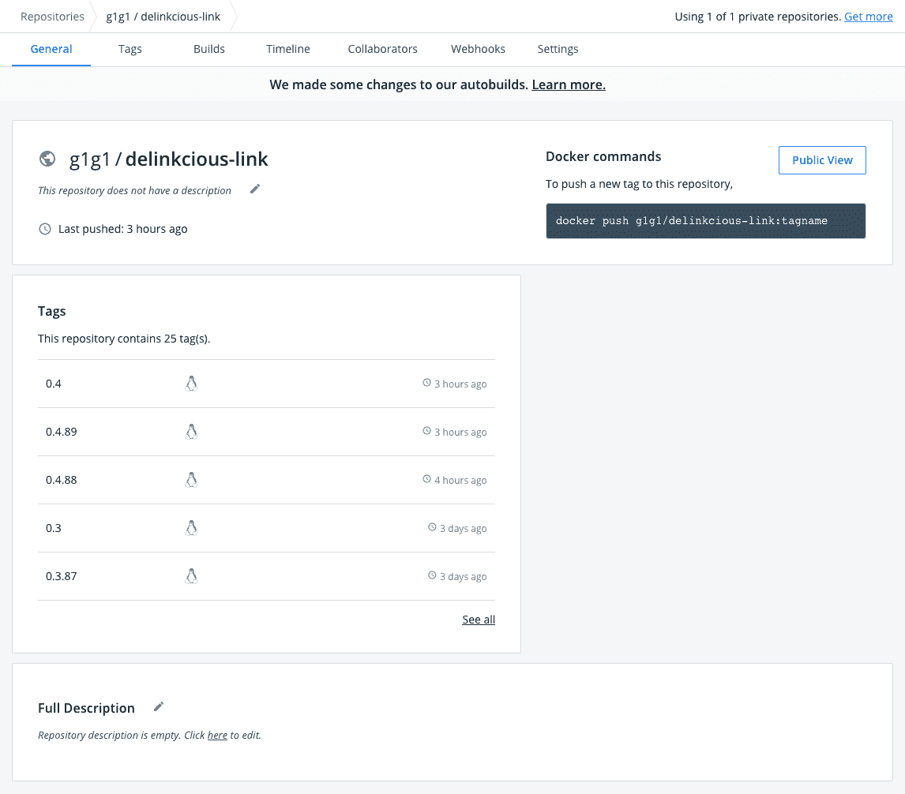
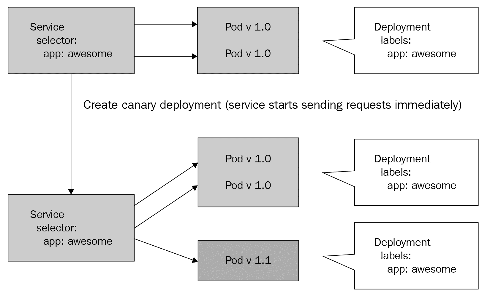
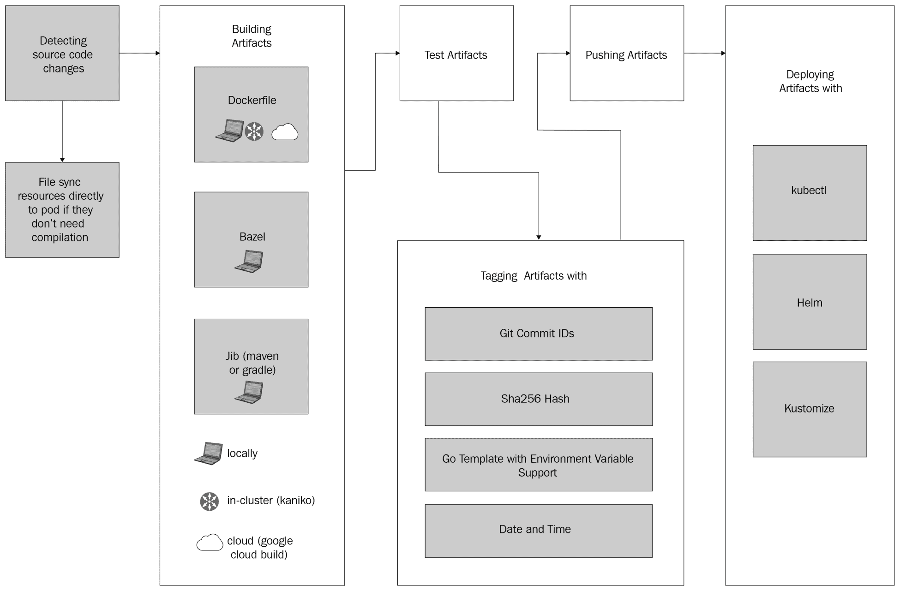
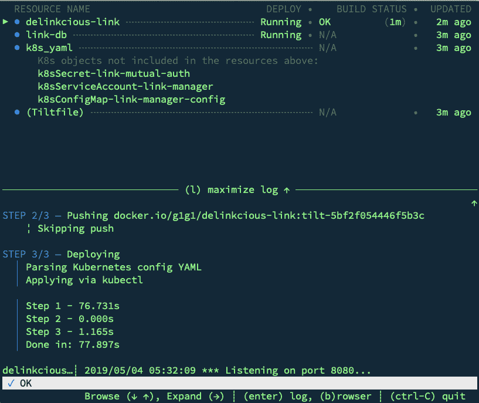
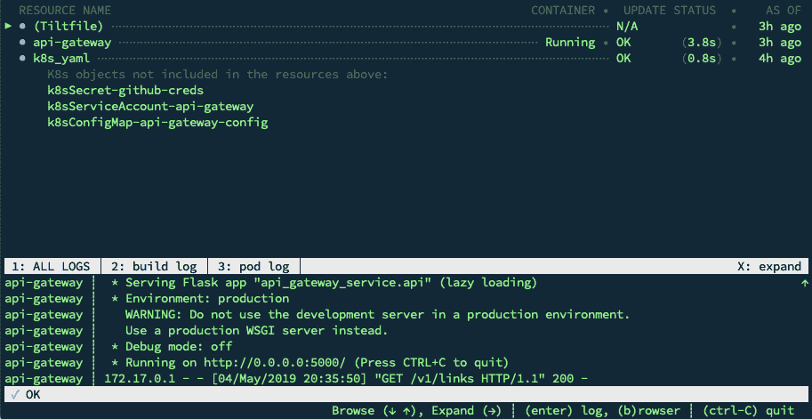
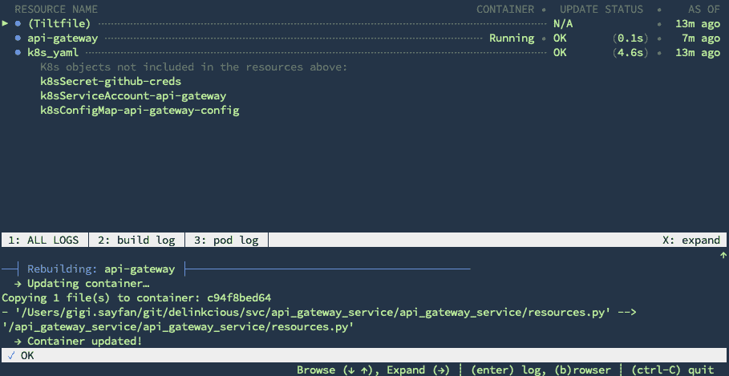

# 十一、部署微服务

在本章中，我们将讨论两个相关但独立的主题:生产部署和开发部署。用于这两个领域的关注点、流程和工具非常不同。在这两种情况下，目标都是向集群部署新软件，但其他一切都不同。对于生产部署，希望保持系统稳定，能够获得可预测的构建和部署体验，最重要的是，能够识别并回滚糟糕的部署。对于开发部署，希望每个开发人员都有独立的部署，快速的周转，并能够避免混乱的源代码控制或具有临时开发版本的**持续集成** / **持续部署** ( **CI** / **CD** )系统(包括映像注册表)。因此，不同的侧重点有利于将生产部署与开发部署隔离开来。

在本章中，我们将涵盖以下主题:

*   Kubernetes 部署
*   部署到多个环境
*   了解部署策略(滚动更新、蓝绿色部署、canary 部署)
*   回滚部署
*   管理版本和升级
*   本地开发部署

# 技术要求

在本章中，我们将安装许多工具，包括:

*   击倒取胜
*   Ksync
*   起草
*   脚手架
*   倾斜

没有必要提前安装它们。

# 代码

代码在两个 Git 存储库之间被分割:

*   您可以在这里找到代码示例:[https://github . com/PacktPublishing/hand-microservice-with-Kubernetes/tree/master/chapter 11](https://github.com/PacktPublishing/Hands-On-Microservices-with-Kubernetes/tree/master/Chapter11)
*   你可以在这里找到更新的德令状应用:[https://github.com/the-gigi/delinkcious/releases/tag/v0.9](https://github.com/the-gigi/delinkcious/releases/tag/v0.9)

# Kubernetes 部署

我们在[第 1 章](01.html)、*开发者 Kubernetes 简介*中简单地讨论了部署，我们几乎在每一章中都使用了 Kubernetes 部署。然而，在深入研究更复杂的模式和策略之前，回顾一下基本的构建模块以及 Kubernetes 部署、Kubernetes 服务和扩展或自动扩展之间的关系将是非常有用的。

部署是 Kubernetes 资源，通过复制集管理豆荚。Kubernetes 副本集是一组豆荚，由一组带有一定数量副本的公共标签来标识。副本集与其容器之间的联系是容器元数据中的`ownerReferences`字段。副本集控制器确保始终运行正确数量的副本。如果一个POD由于某种原因死亡，复制集控制器将安排一个新的POD代替它。下图说明了这种关系:


Deployment and ReplicaSet

我们还可以用 kubectl 观察元数据中的所有权链。首先，让我们获取社交图管理器窗格的名称，并从`ownerReferences`元数据中找到其副本集所有者的名称:

```
$ kubectl get po -l svc=social-graph,app=manager
NAME READY STATUS RESTARTS AGE
social-graph-manager-7d84ffc5f7-bst7w 1/1 Running 53 20d

 $ kubectl get po social-graph-manager-7d84ffc5f7-bst7w -o jsonpath="{.metadata.ownerReferences[0]['name']}"
 social-graph-manager-7d84ffc5f7

 $ kubectl get po social-graph-manager-7d84ffc5f7-bst7w -o jsonpath="{.metadata.ownerReferences[0]['kind']}"
 ReplicaSet
```

接下来，我们将获得拥有复制集的部署的名称:

```
$ kubectl get rs social-graph-manager-7d84ffc5f7 -o jsonpath="{.metadata.ownerReferences[0]['name']}"
 graph-manager

 $ kubectl get rs social-graph-manager-7d84ffc5f7 -o jsonpath="{.metadata.ownerReferences[0]['kind']}"
 Deployment
```

那么，如果 ReplicaSet 控制器负责管理豆荚的数量，`Deployment`对象增加了什么？`Deployment`对象封装了部署的概念，包括部署策略和部署历史。它还提供了面向部署的操作，例如更新部署和回滚部署，我们将在后面讨论。

# 部署到多个环境

在本节中，我们将在一个新的分段命名空间中为 Delinkcious 创建一个分段环境。`staging`命名空间将是默认命名空间的完整副本，将作为我们的生产环境。

首先，让我们创建名称空间:

```
$ kubectl create ns staging
namespace/staging created
```

然后，在 Argo 光盘中，我们可以创建一个名为`staging`的新项目:



Argo CD staging project

现在，我们需要配置我们的所有服务，以便 Argo 光盘可以将它们同步到登台环境。既然我们有大量的服务，在用户界面中这样做可能会有点乏味。相反，我们将使用蓉城命令行界面和一个名为`bootstrap_staging.py`的 Python 3 程序来自动化这个过程。该计划预期如下:

*   暂存命名空间已创建。
*   蓉城命令行界面安装在路径中。
*   蓉城光盘服务可通过端口`8080`上的本地主机获得。
*   Argo 光盘管理员密码被配置为环境变量。

要在端口`80`的本地主机上公开 Argo 光盘，我们可以运行以下命令:

```
kubectl port-forward -n argocd svc/argocd-server 8080:443
```

让我们分解这个程序，了解它是如何工作的。这是一个很好的基础，您可以通过自动化命令行界面工具来开发自己的自定义CI/CD解决方案。唯一的依赖是 Python 的标准库模块:`subprocess`(允许你运行命令行工具)和`os`(用于访问环境变量)。在这里，我们只需要运行 Argo 光盘 CLI。

`run()`函数隐藏了所有的实现细节，并提供了一个方便的接口，您只需要将参数作为字符串传递。`run()`功能将准备一个适当的命令列表，该列表可以传递给`subprocess`模块的`check_output()`功能，捕获输出，并将其从字节解码为字符串:

```
import os
 import subprocess

def run(cmd):
     cmd = ('argocd ' + cmd).split()
     output = subprocess.check_output(cmd)
     return output.decode('utf-8')
```

`login()`功能利用`run()`，从环境中获取管理员密码，并使用所有必要的标志构建适当的命令字符串，以便您可以作为管理员用户登录 Argo 光盘:

```
def login():
     host = 'localhost:8080'
     password = os.environ['ARGOCD_PASSWORD']
     cmd = f'login {host} --insecure --username admin --password {password}'
     output = run(cmd)
     print(output)
```

`get_apps()`函数取一个名字空间，返回其中 Argo 光盘应用的相关字段。该函数将用于`default`命名空间和`staging`命名空间。该函数调用`app list`命令，解析输出，并用相关信息填充 Python 字典:

```
def get_apps(namespace):
     """ """
     output = run(f'app list -o wide')
     keys = 'name project namespace path repo'.split()
     apps = []
     lines = output.split('\n')
     headers = [h.lower() for h in lines[0].split()]
     for line in lines[1:]:
         items = line.split()
         app = {k: v for k, v in zip(headers, items) if k in keys}
         if app:
             apps.append(app)
     return apps
```

`create_project()`功能获取创建新的 Argo CD 项目所需的所有信息。请注意，多个 Argo CD 项目可以共存于同一个 Kubernetes 命名空间中。它还允许访问所有集群资源，这是创建应用所必需的。由于我们已经在 Argo CD UI 中创建了这个项目，所以没有必要在这个程序中使用它，但是有它在身边是很好的，以防我们将来需要创建更多的项目:

```
def create_project(project, cluster, namespace, description, repo):
     """ """
     cmd = f'proj create {project} --description {description} -d {cluster},{namespace} -s {repo}'
     output = run(cmd)
     print(output)

     # Add access to resources
     cmd = f'proj allow-cluster-resource {project} "*" "*"'
     output = run(cmd)
     print(output)
```

最后一个通用函数叫做`create_app()`，它获取创建 Argo CD 应用所需的所有信息。假设蓉城光盘在目的集群内运行，那么`--dest-server`永远是`https://kubernetes.default.svc`:

```
def create_app(name, project, namespace, repo, path):
     """ """
     cmd = f"""app create {name}-staging --project {project} --dest-server https://kubernetes.default.svc
               --dest-namespace {namespace} --repo {repo} --path {path}"""
     output = run(cmd)
     print(output)
```

`copy_apps_from_default_to_staging()`函数使用我们前面声明的一些函数。它从默认命名空间获取所有应用，遍历它们，并在临时项目和命名空间中创建相同的应用:

```
def copy_apps_from_default_to_staging():
     apps = get_apps('default')

     for a in apps:
         create_app(a['name'], 'staging', 'staging', a['repo'], a['path'])
```

最后，这里是`main`功能:

```
def main():
     login()
     copy_apps_from_default_to_staging()

     apps = get_apps('staging')
     for a in apps:
         print(a)

 if __name__ == '__main__':
     main()
```

现在我们有了两个环境，让我们考虑一些工作流程和推广策略。每当推送一个变更，GitHub CircleCI 都会检测到。如果所有测试都通过，它将为每个服务烘焙一个新的映像，并将其推送到 Docker Hub。问题是，部署端应该发生什么？Argo CD 有同步策略，我们可以将它们配置为每当 Docker Hub 上有新映像可用时自动同步/部署。例如，通常的做法是自动部署到试运行，只有在试运行通过各种测试(例如`smoke`测试)后才部署到生产中。从试运行到生产的升级可以是自动的，也可以是手动的。

没有放之四海而皆准的答案。即使在同一个组织中，不同的部署策略和策略也经常被用于具有不同需求集的项目或服务。

让我们看看一些更常见的部署策略以及它们支持的用例。

# 了解部署策略

在 Kubernetes 中部署新版本的服务意味着将运行版本 *X* 的服务的 *N* 后备POD替换为运行版本 *X+1* 的 *N* 后备POD。从 N 豆荚运行版 *X* ，到零豆荚运行版 *X* 、 *N* 豆荚运行版 *X+1* 有多种获取方式。Kubernetes 部署支持两种开箱即用的策略:`Recreate`和`RollingUpdate`(默认策略)。蓝绿色部署和金丝雀部署是另外两种流行的策略。在深入研究各种部署策略及其优缺点之前，了解在 Kubernetes 中更新部署的过程非常重要。

当且仅当部署规范的 pod 模板发生变化时，才会为部署推出一组新的 pod。这通常发生在您更改 pod 模板的映像版本或容器的标签集时。请注意，扩展部署(增加或减少其副本数量)是*而不是*更新，因此不使用部署策略。与当前运行的POD相同版本的映像将用于添加的任何新POD。

# 重新创建部署

一个简单而天真的方法是终止所有运行版本 *X* 的 pod，然后创建一个新的部署，其中 pod 模板规范中的映像版本被设置为 *X+1* 。这种方法有几个问题:

*   在新的POD上线之前，该服务将不可用。
*   如果新版本有问题，该服务将不可用，直到过程反转(忽略错误和数据损坏)。

`Recreate`部署策略适合于开发，或者当您更喜欢有一个短暂的中断，但是确保没有同时运行的版本的混合。例如，如果服务从队列中取出其工作，并且如果服务在升级到新版本时短暂停机，则不会有不良后果，那么短暂停机可能是可以接受的。另一种情况是，如果您想以非向后兼容的方式更改服务的公共 API 或它的一个依赖项。在这种情况下，必须一次性终止当前的POD，并且必须部署新的POD。对于不兼容变更的多阶段部署，有一些解决方案，但在某些情况下，只需切断电源线并支付短暂中断的成本，这是更容易接受的。

要启用此策略，请编辑部署清单，将策略类型更改为`Recreate`，并删除`rollingUpdate`部分(仅当类型为`RollingUpdate`时才允许这样做):

```
$ kubectl edit deployment user-manager
 deployment.extensions/user-manager edited

 $ kubectl get deployment user-manager -o yaml | grep strategy -A 1
 strategy:
 type: Recreate
```

对于大多数服务来说，升级时最好保持服务连续性和零停机时间，并在检测到问题时立即回滚。`RollingUpdate`策略解决了这些情况。

# 滚动更新

默认部署策略为`RollingUpdate`:

```
$ kubectl get deployment social-graph-manager -o yaml | grep strategy -A 4
 strategy:
 rollingUpdate:
 maxSurge: 25%
 maxUnavailable: 25%
 type: RollingUpdate
```

滚动更新的工作方式如下:POD的总数(旧的和新的)将是当前副本数量加上最大激增。部署控制器将开始用新POD替换旧POD，确保不超过限制。最大浪涌可以是一个绝对数字，如 4，也可以是一个百分比，如 25%。例如，如果部署的副本数量为 4，最大激增为 25%，则可以添加一个额外的新 pod，并终止其中一个旧 pod。`maxUnavailable`是部署过程中低于副本计数的POD数量。

下图说明了滚动更新的工作原理:



Rolling update

当新版本与当前版本兼容时，滚动更新是有意义的。准备好处理请求的活动盒数量保持在您使用`maxSurge`和`maxUnavailable`指定的副本数量的合理范围内，并且逐渐地，所有当前盒被新盒替换。整体服务没有中断。

然而，有时你必须立即更换所有的POD，对于必须保持可用的关键服务，`Recreate`策略不起作用。这就是蓝绿色部署的好处。

# 蓝绿色部署

蓝绿色部署是众所周知的模式。想法是不更新现有的部署；相反，您使用新版本创建了一个全新的部署。最初，你的新版本不提供流量服务。然后，当您验证新部署已经启动并运行时(您甚至可以对其运行一些`smoke`测试)，您可以一下子将所有流量从当前版本切换到新版本。如果您在切换到新版本后遇到任何问题，您可以立即将所有流量切换回以前的部署，该部署仍在运行。当您确信新部署运行良好时，您可以销毁以前的部署。

蓝绿色部署的最大优势之一是，它们不必在单个 Kubernetes 部署的级别上运行。这在必须同时更新多个交互服务的微服务架构中至关重要。如果您试图通过同时更新多个 Kubernetes 部署来做到这一点，可能会有一些服务已经被替换，一些没有被替换(即使您接受`Recreate`策略的成本)。如果单个服务在部署过程中遇到问题，您现在必须回滚所有其他服务。有了蓝绿色部署，您就不会遇到这些问题，并且可以完全控制何时需要跨所有服务切换到新版本。

如何从蓝色(当前)切换到绿色(新)？与 Kubernetes 一起工作的传统方法是在负载平衡器级别进行。大多数需要如此复杂的部署策略的系统都有一个负载平衡器。当您使用负载平衡器切换流量时，您的绿色部署包括绿色 Kubernetes 部署和绿色 Kubernetes 服务，以及任何其他需要更改的资源，如机密和配置图。如果您需要更新多个服务，那么您将有一个绿色资源的集合，它们都相互引用。

如果您有一个入口控制器，如 contour，那么如果需要，它通常可以用来将流量从蓝色切换到绿色，然后再切换回来。

下图说明了蓝绿色部署的工作原理:



Blue-green deployment

让我们为 link manager 服务做一个单一服务蓝绿色部署。我们将起点称为*蓝色*，我们希望在不中断的情况下部署*绿色*版本的链路管理器。计划是这样的:

1.  将`deployment: blue`标签添加到当前`link-manager`部署中。
2.  更新`link-manager`服务选择器以匹配`deployment: blue`标签。
3.  实现新版本的`LinkManager`，用`[green]`字符串作为每个链接描述的前缀。

4.  将`deployment: green`标签添加到部署的 pod 模板规范中。
5.  撞版本号。
6.  让 CircleCI 创建一个新版本。
7.  将新版本部署为名为`green-link-manager`的单独部署。
8.  更新`link-manager`服务选择器以匹配`deployment: green`标签。
9.  验证从服务返回的链接的描述，并包括`[green]`前缀。

这听起来可能很复杂，但是就像许多 CI/CD 过程一样，一旦您建立了一个模式，您就可以围绕它自动化和构建工具。这允许您在没有人工参与的情况下执行复杂的工作流，或者在重要的节点(例如，在真正部署到生产之前)注入人工审查和批准。让我们详细检查一下步骤。

# 添加部署–蓝色标签

除了现有的`svc: link`和`app: manager`标签外，我们只需编辑部署并手动添加`deployment: blue`:

```
$ kubectl edit deployment link-manager 
deployment.extensions/link-manager edited
```

这将触发POD的重新部署，因为我们改变了标签。让我们验证新的豆荚是否有`deployment: blue`标签。这里有一个非常奇特的`kubectl`命令，它使用自定义列来显示名称、部署标签和所有匹配`svc=link`和`app=manager`的POD的 IP 地址。

如你所见，三个豆荚都有`deployment:blue`标签，果然不出所料:

```
$ kubectl get po -l svc=link,app=manager
 -o custom columns="NAME:.metadata.name,DEPLOYMENT:.metadata.labels.deployment,IP:.status.podIP" 
NAME                           DEPLOYMENT IP 
link-manager-65d4998d47-chxpj  blue       172.17.0.37 
link-manager-65d4998d47-jwt7x  blue       172.17.0.36 
link-manager-65d4998d47-rlfhb  blue       172.17.0.35
```

我们甚至可以验证 IP 地址是否与`link-manager`服务的端点匹配:

```
$ kubectl get ep link-manager
 NAME ENDPOINTS AGE
 link-manager 172.17.0.35:8080,172.17.0.36:8080,172.17.0.37:8080 21d
```

现在豆荚上贴了`blue`标签，我们需要更新服务。

# 更新链接管理器服务以仅匹配蓝色窗格

您可能还记得，该服务匹配任何带有`svc: link`和`app: manager`标签的豆荚:

```
$ kubectl get svc link-manager -o custom-columns=SELECTOR:.spec.selector
SELECTOR 
map[app:manager svc:link]
```

通过添加`deployment: blue`标签，我们没有干扰匹配。然而，在准备我们的绿色部署时，我们应该确保服务只匹配当前蓝色部署的 pod。

让我们将`deployment: blue`标签添加到服务的`selector`中:

```
selector: app: manager svc: link deployment: blue
```

我们可以使用以下命令来验证它是否有效:

```
$ kubectl get svc link-manager -o custom-columns=SELECTOR:.spec.selector 
SELECTOR 
map[app:manager deployment:blue svc:link]
```

在我们切换到绿色版本之前，让我们对代码进行更改，以明确这是一个不同的版本。

# 在每个链接的描述前面加上[绿色]

让我们在链路服务的传输层中实现这一点。

目标文件为[https://github . com/the-gigi/delinkcius/blob/master/SVC/link _ service/service/transport . go # L26](https://github.com/the-gigi/delinkcious/blob/master/svc/link_service/service/transport.go#L26)。

变化非常小。在`newLink()`函数中，我们将使用`[green]`字符串作为描述的前缀:

```
func newLink(source om.Link) link { 
return link{ 
Url: source.Url, 
Title: source.Title, 
Description: "[green] " + source.Description, 
Status: source.Status, 
Tags: source.Tags, 
CreatedAt: source.CreatedAt.Format(time.RFC3339), 
UpdatedAt: source.UpdatedAt.Format(time.RFC3339), } }
```

为了部署我们的新绿色版本，我们需要创建一个新的映像。这需要碰撞德令状版本号。

# 碰撞版本号

Delincious 版本保存在调用 CircleCI 的([https://github . com/the-gigi/Delincious/blob/master/build . sh # L6](https://github.com/the-gigi/delinkcious/blob/master/build.sh#L6)处的`[build.sh]`文件中，即位于([https://github.com/the-gigi/delinkcious/blob/master/.的`[.circleci/config.yml]`文件中 circleci/config.yml#L28](https://github.com/the-gigi/delinkcious/blob/master/.circleci/config.yml#L28) )文件。

`STABLE_TAG`变量控制版本号。目前的版本是`0.3`。让我们把它提到`0.4`:

```
#!/bin/bash
set -eo pipefail
IMAGE_PREFIX='g1g1' STABLE_TAG='0.4'
TAG="{CIRCLE_BUILD_NUM}" ...
```

好的。我们修改了版本，准备让 CircleCI 建立一个新的映像。

# 让 CircleCI 建立新形象

由于 GitOps 和我们的 CircleCI 自动化，这一步只需要将我们的更改推送到 GitHub。CircleCI 检测到更改，构建新代码，创建新的 Docker 映像，并将其推送到 Docker Hub 注册表。这是:



Docker Hub link service 0.4

现在，新的映像已经构建并推送到 Docker Hub 注册表中，我们可以将其部署到集群中作为绿色部署。

# 部署新(绿色)版本

好的–我们在 Docker Hub 上有了新的`delinkcious-link:0.4`映像。让我们将其部署到集群中。请记住，我们希望将其与我们当前的(蓝色)部署并排部署，这称为`link-manager`。让我们创建一个名为`green-link-manager`的新部署。它与我们的蓝色部署的区别如下:

*   名字叫`green-link-manager`。
*   pod 模板规格具有`deployment: green`标签。
*   图片版本为`0.4`。

```
apiVersion: apps/v1
kind: Deployment
metadata:
  name: green-link-manager
  labels:
    svc: link
    app: manager
    deployment: green
spec:
  replicas: 3
  selector:
    matchLabels:
      svc: link
      app: manager
      deployment: green
  template:
    metadata:
      labels:
        svc: link
        app: manager
        deployment: green
    spec:
      serviceAccount: link-manager
      containers:
      - name: link-manager
        image: g1g1/delinkcious-link:0.4
        imagePullPolicy: Always
        ports:
        - containerPort: 8080
        envFrom:
        - configMapRef:
            name: link-manager-config
        volumeMounts:
        - name: mutual-auth
          mountPath: /etc/delinkcious
          readOnly: true
      volumes:
      - name: mutual-auth
        secret:
          secretName: link-mutual-auth
```

现在，是时候部署了:

```
$ kubectl apply -f green_link_manager.yaml
deployment.apps/green-link-manager created
```

在我们更新服务以使用绿色部署之前，让我们回顾一下集群。如您所见，我们同时进行蓝色和绿色部署:

```
$ kubectl get po -l svc=link,app=manager -o custom-columns="NAME:.metadata.name,DEPLOYMENT:.metadata.labels.deployment"
NAME                                  DEPLOYMENT
green-link-manager-5874c6cd4f-2ldfn   green
green-link-manager-5874c6cd4f-mvm5v   green
green-link-manager-5874c6cd4f-vcj9s   green
link-manager-65d4998d47-chxpj         blue
link-manager-65d4998d47-jwt7x         blue
link-manager-65d4998d47-rlfhb         blue
```

# 更新链接管理器服务以使用绿色部署

首先，让我们确保服务仍然使用蓝色部署。当我们得到一个链接描述时，不应该有任何`[green]`前缀:

```
$ http "${DELINKCIOUS_URL}/v1.0/links" "Access-Token:
${DELINKCIOUS_TOKEN}"'
HTTP/1.0 200 OK
Content-Length: 214
Content-Type: application/json
Date: Tue, 30 Apr 2019 06:02:03 GMT
Server: Werkzeug/0.14.1 Python/3.7.2

{
 "err": "",
 "links": [
 {
 "CreatedAt": "2019-04-30T06:01:47Z",
 "Description": "nothing to see here...",
 "Status": "invalid",
 "Tags": null,
 "Title": "gg",
 "UpdatedAt": "2019-04-30T06:01:47Z",
 "Url": "http://gg.com"
 }
 ]
}
```

描述为`nothing to see here..*.*`。这次，我们将使用`kubectl patch`命令应用一个补丁，将部署标签从`blue`切换到`green`，而不是使用`kubectl edit`交互编辑服务。这是补丁文件–`green-patch.yaml`:

```
 spec:
   selector:
     deployment: green
```

让我们应用补丁:

```
$ kubectl patch service/link-manager --patch "$(cat green-patch.yaml)"
 service/link-manager patched 
```

最后一步是验证服务现在使用绿色部署。

# 验证服务现在是否使用绿色容器来服务请求

让我们有条不紊地做这件事，从服务中的选择器开始:

```
$ kubectl get svc link-manager -o jsonpath="{.spec.selector.deployment}"
 green

```

好–选择器是绿色的。让我们再次获取链接，看看`[green]`前缀是否出现:

```
$ http "${DELINKCIOUS_URL}/v1.0/links" "Access-Token: ${DELINKCIOUS_TOKEN}"'

 HTTP/1.0 200 OK
 Content-Length: 221
 Content-Type: application/json
 Date: Tue, 30 Apr 2019 06:19:43 GMT
 Server: Werkzeug/0.14.1 Python/3.7.2

 {
 "err": "",
 "links": [
 {
 "CreatedAt": "2019-04-30T06:01:47Z",
 "Description": "[green] nothing to see here...",
 "Status": "invalid",
 "Tags": null,
 "Title": "gg",
 "UpdatedAt": "2019-04-30T06:01:47Z",
 "Url": "http://gg.com"
 }
 ]
 }
```

没错。描述现在是`[green] nothing to see here...`

现在，我们可以摆脱蓝色部署，我们的服务将继续运行在绿色部署之上:

```
$ kubectl delete deployment link-manager
 deployment.extensions "link-manager" deleted

 $ kubectl get po -l svc=link,app=manager
 NAME                                  READY   STATUS    RESTARTS   AGE
 green-link-manager-5874c6cd4f-2ldfn   1/1     Running   5          1h
 green-link-manager-5874c6cd4f-mvm5v   1/1     Running   5          1h
 green-link-manager-5874c6cd4f-vcj9s   1/1     Running   5          1h
```

我们已经成功地在德林奇进行了蓝绿色的部署。让我们讨论最后一种模式，即金丝雀部署。

# 金丝雀部署

Canary 部署是另一种复杂的部署模式。考虑具有大量用户的大规模分布式系统的情况。您想要引入新版本的服务。您已经尽最大努力测试了这一变化，但是生产系统过于复杂，无法在试运行环境中完全模拟。因此，你不能确定你的新版本不会引起一些问题。你是做什么的？你使用金丝雀部署。这个想法是，一些变化必须在生产中进行测试，然后您才能合理地确定它们是否如预期的那样工作。金丝雀部署模式允许您限制新版本在出现问题时可能造成的损害。

Kubernetes 上的基本加那利部署是通过在您的大多数POD上运行当前版本来工作的，只有少数POD使用新版本。大多数请求将由当前版本处理，只有一小部分将由新版本处理。

这假设了一个循环负载平衡算法(默认)，或者任何其他在所有单元中或多或少均匀分布请求的算法。

下图说明了 canary 部署的样子:



Canary deployment

请注意，canary 部署要求您的当前版本和新版本可以共存。例如，如果您的更改涉及模式更改，那么您的当前版本和新版本是不兼容的，天真的 canary 部署将不起作用。

基本的 canary 部署的好处是，它可以使用现有的 Kubernetes 对象工作，并且可以由操作员从外部进行配置。不需要自定义代码或在集群中安装额外的组件。但是，基本的 canary 部署有几个限制:

*   粒度为 K/N(最坏的情况是 N = 1 的单态)。
*   无法为同一服务的不同请求控制不同的百分比(例如，仅读取请求的 canary 部署)。
*   无法控制同一版本用户的所有请求。

在某些情况下，这些限制过于严重，需要另一种解决方案。复杂的 canary 部署通常利用应用级别的知识。这可以通过入口对象、服务网格或专用的应用级流量整形器来完成。我们将在[第 13 章](13.html)、*服务网格-与 Istio* 合作中查看这方面的示例。

是动手操作加那利部署链接服务的时候了。

# 使用基本的加那利部署美味

创建金丝雀部署与蓝绿色部署非常相似。我们的`link-manager`服务目前运行绿色部署。这意味着它有一个带有`deployment: green`的选择器。金丝雀是黄色的，所以我们将创建一个新版本的代码，在链接描述前面加上`[yellow]`。让我们将 10%的请求定位到新版本。为了实现这一点，我们将把当前版本扩展到九个副本，并在新版本中添加一个带有一个 pod 的部署。这是金丝雀的技巧——我们将从服务选择器中删除部署标签。这意味着它将选择两个POD；也就是`deployment: green`和`deployment: yellow`。我们也可以从部署中删除标签(因为没有人根据这个标签进行选择)，但是最好将它们作为元数据保留下来，以防我们想要进行另一个蓝绿色部署。

计划如下:

1.  构建新版本的代码。
2.  为新版本创建副本计数为 1 的部署，标记为`deployment: yellow`。
3.  将当前绿色部署扩展到 9 个副本。
4.  更新服务以选择`svc: link`和`app: manager`(忽略`deployment: <color>`)。
5.  对该服务运行多个查询，并验证 canary 部署服务的请求比率为 10%。

代码变更为`trivial: [green]  -> [yellow]`:

```
func newLink(source om.Link) link {
     return link{
         Url:         source.Url,
         Title:       source.Title,
         Description: "[green] " + source.Description,
         Status:      source.Status,
         Tags:        source.Tags,
         CreatedAt:   source.CreatedAt.Format(time.RFC3339),
         UpdatedAt:   source.UpdatedAt.Format(time.RFC3339),
     }
 }
```

然后，我们需要将`build.sh`中的版本从`0.4`撞向`0.5`:

```
#!/bin/bash

 set -eo pipefail

 IMAGE_PREFIX='g1g1'
 STABLE_TAG='0.4'

 TAG="${STABLE_TAG}.${CIRCLE_BUILD_NUM}"
...
```

一旦我们将这些更改推送到 GitHub，CircleCI 将构建一个新的映像并推送到`DockerHub: g1g1/delinkcious-link:0.5`。

此时，我们可以使用新的`0.5`版本、单个副本和更新的标签来创建部署。姑且称之为`yellow_link_manager.yaml`:

```
---
apiVersion: apps/v1
 kind: Deployment
 metadata:
   name: yellow-link-manager
   labels:
     svc: link
     app: manager
     deployment: yellow
 spec:
   replicas: 1
   selector:
     matchLabels:
       svc: link
       app: manager
       deployment: yellow
   template:
     metadata:
       labels:
         svc: link
         app: manager
         deployment: yellow
     spec:
       serviceAccount: link-manager
       containers:
       - name: link-manager
         image: g1g1/delinkcious-link:0.5
         imagePullPolicy: Always
         ports:
         - containerPort: 8080
         envFrom:
         - configMapRef:
             name: link-manager-config
         volumeMounts:
         - name: mutual-auth
           mountPath: /etc/delinkcious
           readOnly: true
       volumes:
       - name: mutual-auth
         secret:
           secretName: link-mutual-auth
```

下一步是部署我们的金丝雀:

```
$ kubectl apply -f yellow_link_manager.yaml
 deployment.apps/yellow-link-manager created 
```

在更改服务以包括 canary 部署之前，让我们将绿色部署扩展到 9 个副本，这样一旦激活 canary，它就可以接收 90%的流量:

```
$ kubectl scale --replicas=9 deployment/green-link-manager
 deployment.extensions/green-link-manager scaled

 $ kubectl get po -l svc=link,app=manager
 NAME                                  READY   STATUS    RESTARTS   AGE
 green-link-manager-5874c6cd4f-2ldfn    1/1    Running   10         15h
 green-link-manager-5874c6cd4f-9csxz    1/1    Running   0          52s
 green-link-manager-5874c6cd4f-c5rqn    1/1    Running   0          52s
 green-link-manager-5874c6cd4f-mvm5v    1/1    Running   10         15h
 green-link-manager-5874c6cd4f-qn4zj    1/1    Running   0          52s
 green-link-manager-5874c6cd4f-r2jxf    1/1    Running   0          52s
 green-link-manager-5874c6cd4f-rtwsj    1/1    Running   0          52s
 green-link-manager-5874c6cd4f-sw27r    1/1    Running   0          52s
 green-link-manager-5874c6cd4f-vcj9s    1/1    Running   10         15h
 yellow-link-manager-67847d6b85-n97b5   1/1    Running   4        6m20s
```

好的，我们有九个绿色POD和一个黄色(淡黄色)POD正在运行。让我们更新服务，仅根据`svc: link`和`app: manager`标签进行选择，这将包括所有十个豆荚。我们需要移除`deployment: green`标签。

我们之前使用的 YAML 补丁文件方法在这里不起作用，因为它只能添加或更新一个标签。这次我们将使用 JSON 补丁*移除*操作，并在选择器中指定*部署*键的路径。

注意，补丁前选择器有`deployment: green`，补丁后只剩下`svc: link`和`app: manager`:

```
$ kubectl get svc link-manager -o custom-columns=NAME:.metadata.name,SELECTOR:.spec.selector
 NAME           SELECTOR
 link-manager   map[app:manager deployment:green svc:link]

 $ kubectl patch svc link-manager --type=json -p='[{"op": "remove", "path": "/spec/selector/deployment"}]'
 service/link-manager patched

 $ kubectl get svc link-manager -o custom-columns=NAME:.metadata.name,SELECTOR:.spec.selector
 NAME           SELECTOR
 link-manager   map[app:manager svc:link]
```

表演时间到了。我们将发送 30 个 GET 请求给 Delinkcious，并检查描述:

```
$ for i in {1..30}
 > do
 >   http "${DELINKCIOUS_URL}/v1.0/links" "Access-Token: ${DELINKCIOUS_TOKEN}" | jq .links[0].Description
 > done

 "[green] nothing to see here..."
 "[yellow] nothing to see here..."
 "[green] nothing to see here..."
 "[green] nothing to see here..."
 "[green] nothing to see here..."
 "[green] nothing to see here..."
 "[green] nothing to see here..."
 "[green] nothing to see here..."
 "[green] nothing to see here..."
 "[yellow] nothing to see here..."
 "[green] nothing to see here..."
 "[green] nothing to see here..."
 "[green] nothing to see here..."
 "[green] nothing to see here..."
 "[green] nothing to see here..."
 "[yellow] nothing to see here..."
 "[green] nothing to see here..."
 "[yellow] nothing to see here..."
 "[yellow] nothing to see here..."
 "[green] nothing to see here..."
 "[green] nothing to see here..."
 "[green] nothing to see here..."
 "[green] nothing to see here..."
 "[yellow] nothing to see here..."
 "[green] nothing to see here..."
 "[green] nothing to see here..."
 "[green] nothing to see here..."
 "[green] nothing to see here..."
 "[green] nothing to see here..."
 "[green] nothing to see here..."
```

有趣——我们有 24 个绿色回答和 6 个黄色回答。这比预期的要高得多(平均三个黄色回答)。我又运行了几次，第二次运行又得到了六个黄色响应，第三次运行只有一个黄色响应。这都是在 Minikube 上运行的，所以负载平衡可能有点特殊。让我们宣布胜利。

# 使用加那利部署进行甲乙测试

加那利部署也可以用来支持模拟/模拟测试。我们可以部署任意多的版本，只要我们有足够的POD来平衡负载。每个版本都可以包含特殊的代码来记录相关的数据，然后您可以获得洞察力并将用户行为与特定版本关联起来。这是可能的，但是您可能需要构建许多工具和约定来使其可用。如果 A/B 测试是你的设计工作流程中的一个重要部分，我建议使用已经建立的 A/B 测试解决方案之一。在我看来，A/B 测试轮不值得重新发明。

我们来考虑一下出了问题怎么办，需要尽快回到工作状态。

# 回滚部署

当部署后生产中出现问题时，最佳做法是回滚更改，回到已知的上一个版本。实现这一点的方式取决于您所采用的部署模式。让我们一个一个来考虑。

# 回滚标准 Kubernetes 部署

Kubernetes 的部署保留了一段历史。例如，如果我们编辑用户管理器部署并将映像版本设置为`0.5`，那么我们可以看到现在有两个版本:

```
$ kubectl get po -l svc=user,app=manager -o jsonpath="{.items[0].spec.containers[0].image}"
 g1g1/delinkcious-user:0.5

 $ kubectl rollout history deployment user-manager
 deployment.extensions/user-manager
 REVISION  CHANGE-CAUSE
 1         <none>
 2         <none>
```

默认不记录`CHANGE-CAUSE`列。让我们对 0.4 版本进行另一个更改，但是使用`--record=true`标志:

```
$ kubectl edit deployment user-manager --record=true
 deployment.extensions/user-manager edited

 $ kubectl rollout history deployment user-manager
 deployment.extensions/user-manager
 REVISION  CHANGE-CAUSE
 1         <none>
 2         <none>
 3         kubectl edit deployment user-manager --record=true
```

好的。让我们回滚到最初的 0.3 版本。那将是第一次修订。我们也可以通过在特定的版本中使用`rollout history`命令来查看这一点:

```
$ kubectl rollout history deployment user-manager --revision=1
 deployment.extensions/user-manager with revision #1
 Pod Template:
 Labels:    app=manager
 pod-template-hash=6fb9878576
 svc=user
 Containers:
 user-manager:
 Image:    g1g1/delinkcious-user:0.3
 Port:    7070/TCP
 Host Port:    0/TCP
 Limits:
 cpu:    250m
 memory:    64Mi
 Requests:
 cpu:    250m
 memory:    64Mi
 Environment Variables from:
 user-manager-config    ConfigMap    Optional: false
 Environment:    <none>
 Mounts:    <none>
 Volumes:    <none>
```

如您所见，修订版 1 的版本为 0.3。回滚的命令如下:

```
$ kubectl rollout undo deployment user-manager --to-revision=1
 deployment.extensions/user-manager rolled back

 $ kubectl get deployment user-manager -o jsonpath="{.spec.template.spec.containers[0].image}"
 g1g1/delinkcious-user:0.3
```

回滚将使用滚动更新的相同机制，逐渐替换POD，直到所有运行的POD都有正确的版本。

# 回滚蓝绿色部署

Kubernetes 不直接支持蓝绿色部署。从绿色切换回蓝色(假设蓝色部署的POD仍在运行)非常简单。你只需改变`Service`选择器，选择`deployment: blue`而不是`deployment: green`。从蓝色到绿色以及从绿色到蓝色的即时切换是蓝绿色部署模式的主要动机，所以难怪会这么容易。一旦切换回蓝色，您就可以删除绿色部署，并找出问题所在。

# 回滚金丝雀部署

金丝雀部署可以说更容易回滚。你的大部分豆荚运行的是真实的版本。canary 部署的 pods 只服务于少量请求。如果您检测到 canary 部署有问题，只需删除该部署。您的主要部署将继续为传入的请求提供服务。如有必要(例如，您的 canary 部署服务于少量但大量的流量)，您可以扩展您的主部署，以弥补不再存在的 canary pods。

# 处理模式、应用编程接口或负载更改后的回滚

您选择的部署策略通常取决于新版本引入的变更的性质。例如，如果您的更改涉及到一个中断的数据库模式更改，例如将表 A 拆分为两个表 B 和 C，那么您不能简单地部署从 B 和 C 读取/写入的新版本。需要首先迁移数据库。但是，如果您遇到问题并想回滚到以前的版本，那么您将在相反的方向上遇到相同的问题。您的旧版本将尝试从表 A 读取/写入表 A，该表已不存在。如果您更改某个网络协议上的配置文件或有效负载的格式，也会发生同样的问题。如果你不协调，API 的改变会破坏客户端。

解决这些兼容性问题的方法是跨多个部署执行这些更改，其中每个部署都与以前的部署完全兼容。这需要一些计划和工作。让我们考虑将表 A 拆分为表 B 和表 c 的情况。假设我们在 1.0 版本上，并且最终希望以 2.0 版本结束。

我们的第一次改动会被标记为 1.1 版本。它将执行以下操作:

*   创建表 B 和表 C(但保留表 A 不变)。
*   改代码写 B 和 c。
*   将代码更改为从 A、B 和 C 中读取，并合并结果(旧数据来自 A，而新数据来自 B 和 C)。
*   如果数据需要删除，它只是被标记为删除。

我们部署了 1.1 版本，如果我们发现有问题，我们将回滚到 1.0 版本。我们所有的旧数据都还在表 A 中，1.0 版本完全兼容。我们可能丢失或损坏了表 B 和表 C 中的少量数据，但这是我们之前没有正确测试所要付出的代价。1.1 版本可能是一个 canary 部署，因此只有少量请求丢失。

然后，我们发现问题，修复问题，并部署 1.2 版，这就像 1.1 版如何向 B 和 C 写入，但从 A、B 和 C 读取，并且不从 A 删除数据一样。

我们观察了一段时间，直到我们确信 1.2 版本如预期的那样工作。

下一步是迁移数据。我们将表 A 中的数据写入到表 B 和表 C 中，活动部署 1.2 版保持从 B 和 C 中读取，只合并从 A 中丢失的数据，我们仍然将所有旧数据保留在 A 中，直到完成所有代码更改。

此时，所有的数据都在表 B 和表 c 中。我们部署了 1.3 版本，它忽略了表 A，完全针对表 B 和表 c 工作。

我们再次观察，如果遇到 1.3 的问题，可以回到 1.2 版本，发布 1.4、1.5 等版本。然而，在某个时候，我们的代码会像预期的那样工作，然后我们可以将最终版本重命名/重新标记为 2.0，或者只是剪切一个除版本号之外完全相同的新版本。

最后一步是删除表 a。

这可能是一个缓慢的过程，需要在部署新版本时运行大量测试，但是当您进行可能会损坏数据的危险更改时，这是必要的。

当然，您会在开始之前备份数据，但是对于高吞吐量系统，即使在糟糕的升级期间短暂停机也会非常昂贵。

归根结底，包含模式更改的更新是复杂的。管理它的方法是执行多阶段升级，其中每个阶段都与前一阶段兼容。只有当你证明当前阶段工作正常时，你才能继续前进。单个微服务拥有每个数据存储的原则的好处是，至少数据库模式更改被限制在单个服务中，并且不需要跨多个服务进行协调。

# 管理版本和依赖关系

管理版本是一个棘手的话题。在基于微服务的体系结构中，您的微服务可能有许多依赖项，以及许多内部和外部客户端。有几类版本化资源，它们都需要不同的管理策略和版本化方案。

# 管理公共 API

公共 API 是在集群之外使用的网络 API，通常由大量用户和/或开发人员使用，他们可能与您的组织有正式关系，也可能没有。公共 API 可能需要身份验证，但有时可能是匿名的。公共 API 的版本化方案通常只涉及一个主要版本，如 V1、V2 等。Kubernetes API 是这种版本化方案的一个很好的例子，尽管它也有 API 组的概念，并使用 alpha 和 beta 限定符，因为它迎合了开发人员。

到目前为止，Delinkcious 只有一个使用`<major>.<minor>`版本控制方案的公共应用编程接口:

```
     api = Api(app)
     resource_map = (
         (Link, '/v1.0/links'),
         (Followers, '/v1.0/followers'),
         (Following, '/v1.0/following'),
     )
```

这是矫枉过正，一个大版本就够了。让我们改变它(当然还有所有受影响的测试):

```
     api = Api(app)
     resource_map = (
         (Link, '/v1/links'),
         (Followers, '/v1/followers'),
         (Following, '/v1/following'),
     )
```

请注意，我们保持相同的版本，即使我们在这本书里做了重大的改变。这很好，因为到目前为止还没有外部用户，所以我们可以自由更改我们的公共 API。然而，一旦我们正式发布我们的应用，如果我们在不改变应用编程接口版本的情况下进行重大更改，我们就有义务考虑用户的负担。这是一个非常糟糕的反模式。

# 管理跨服务依赖关系

跨服务依赖关系通常被很好地定义并记录为内部 API。然而，实施和/或合同的细微变化会显著影响其他服务。例如，如果我们改变`object_model/types.go`中的结构，可能需要修改大量代码。在经过良好测试的 mono-repo 中，这不成问题，因为进行更改的开发人员可以确保所有相关的消费者和测试都得到更新。许多系统是由多个存储库构建而成的，识别所有的消费者可能很有挑战性。在这些情况下，突破性的更改会保留下来，并在部署后被发现。

Delinkcious 是一个单一回购，它实际上在其端点的 URL 中根本没有使用任何版本控制方案。下面是社交图管理器的 API:

```
     r := mux.NewRouter()
     r.Methods("POST").Path("/follow").Handler(followHandler)
     r.Methods("POST").Path("/unfollow").Handler(unfollowHandler)
     r.Methods("GET").Path("/following/{username}").Handler(getFollowingHandler)
     r.Methods("GET").Path("/followers/{username}").Handler(getFollowersHandler)
```

如果您从未打算运行同一服务的多个版本，这种方法是可以接受的。在大型系统中，这不是一种可扩展的方法。总会有一些消费者不想马上升级到最新最棒的。

# 管理第三方依赖关系

第三方依赖有三种类型:

*   您用来构建软件的库和包(如[第 2 章](02.html)、*微服务入门*中所述)
*   代码通过应用编程接口访问的第三方服务
*   您用来操作和运行系统的服务

例如，如果您在云中运行您的系统，那么您的云提供商是一个巨大的依赖(Kubernetes 可以帮助降低风险)。另一个很好的例子是使用第三方服务作为您的CI/CD解决方案。

选择第三方依赖时，你会放弃一些(或很多)控制权。您应该始终考虑如果第三方依赖突然变得不可用或不可接受会发生什么。发生这种情况的原因有很多:

*   开源项目被放弃或失去动力
*   第三方提供商关闭
*   库有太多安全漏洞
*   服务中断太多

假设您明智地选择了依赖项，让我们考虑两种情况:

*   升级到库的新版本
*   升级到第三方服务的新 API 版本

每一次这样的升级都需要对系统中使用这些依赖关系的任何组件(库或服务)进行相应的升级。通常，这些升级不应该修改任何服务的应用编程接口，也不应该修改库的公共接口。它们可能会改变您的服务的操作模式(希望变得更好，比如内存更少，性能更高)。

升级服务很简单。您只需部署依赖于新的第三方依赖关系的服务的新版本，就可以开始了。对第三方库的更改可能会更复杂一些。您需要确定依赖于该第三方库的所有库。升级您的库，然后确定每个使用您的(现在升级的)库的服务，并升级这些服务。

强烈建议您的库和包使用语义版本控制。

# 管理您的基础架构和工具链

您的基础设施和工具链也必须小心管理，甚至进行版本控制。在大型系统中，您的 CI/CD 管道通常会调用各种脚本来自动化重要任务，例如迁移数据库、预处理数据和调配云资源。这些内部工具会发生巨大变化。基于容器的系统中的另一个重要类别是基础映像的版本。代码方法的基础结构，结合 GitOps，提倡版本控制，并将系统的这些方面存储在源代码控制系统(Git)中。

到目前为止，我们已经讲述了许多关于现实世界部署以及如何安全可靠地演进和升级大型系统的黑暗角落和困难用例。让我们回到个人开发者。对于在集群中需要快速编辑-测试-调试周期的开发人员来说，有一组非常不同的需求和关注点。

# 本地开发部署

开发人员希望快速迭代。当我对一些代码进行代码更改时，我想尽快运行测试，如果有问题，就尽快修复。我们已经看到了这种方法在单元测试中的效果。然而，当系统使用封装为容器并部署到 Kubernetes 集群的微服务架构时，这是不够的。为了真正评估变更的影响，我们通常必须构建一个映像(可能包括更新 Kubernetes 清单，如部署、机密和配置映射)，并将其部署到集群中。针对 Minikube 进行本地开发非常棒，但是即使部署到本地 Minikube 集群也需要花费时间和精力。在[第 10 章](10.html)、*测试微服务*中，我们使用远程呈现进行交互调试，效果非常好。然而，网真有自己的怪癖和缺点，它并不总是这项工作的最佳工具。在下面的小节中，我们将介绍在某些情况下可能是更好选择的其他几种选择。

# 击倒

ko([)https://github.com/google/ko](https://github.com/google/ko))是一个非常有趣的围棋专用工具。它的目标是简化和隐藏构建映像的过程。想法是，在 Kubernetes 部署中，用 Go 导入路径替换注册表中的映像路径。Ko 将读取这个导入路径，为您构建一个 Docker 映像，将其发布到注册表(如果使用 Minikube，则发布到本地)，并将其部署到您的集群。Ko 提供了指定基础映像并在生成的映像中包含静态数据的方法。

试一试，以后再讨论体验。

可以通过标准的`go get`命令安装 Ko:

```
go get github.com/google/ko/cmd/ko
```

Ko 要求你在`GOPATH`工作。出于各种原因，我通常不在`GOPATH`内工作(德令哈使用不需要`GOPATH`的围棋模块)。为了适应 Ko，我使用了以下代码:

```
 $ export GOPATH=~/go
 $ mkdir -p ~/go/src/github.com/the-gigi
 $ cd ~/go/src/github.com/the-gigi
 $ ln -s ~/git/delinkcious delinkcious
 $ cd delinkcious
 $ go get -d ./...
```

在这里，我复制了 Go 期望在`GOPATH`下的目录结构，包括复制 GitHub 上的路径到 Delinkcious。然后，我用`go get -d ./...`递归地得到了德令集的所有依赖关系。

最后一个准备步骤是为当地发展设置 Ko。当 Ko 构建一个映像时，我们不应该将它推送到 Docker Hub 或任何远程注册表。我们想要一个快速的本地环路。Ko 允许你用各种方式来做这件事。最简单的方法如下:

```
export KO_DOCKER_REPO=ko.local
```

其他方式包括配置文件或在运行 Ko 时传递`-L`标志。

现在，我们可以继续使用 Ko。这里是`ko-link-manager.yaml`文件，其中映像被替换为链接管理器服务(`github.com/the-gigi/delinkcious/svc/link_service`)的 Go 导入路径。注意我把`imagePullPolicy`从`Always`改成了`IfNotPresent`。

`Always`策略是安全且生产就绪的策略，但在本地工作时，它将忽略本地 Ko 映像，而是从 Docker Hub 中提取:

```
---
 apiVersion: apps/v1
 kind: Deployment
 metadata:
   name: ko-link-manager
   labels:
     svc: link
     app: manager
 spec:
   replicas: 1
   selector:
     matchLabels:
       svc: link
       app: manager
   template:
     metadata:
       labels:
         svc: link
         app: manager
     spec:
       serviceAccount: link-manager
       containers:
       - name: link-manager
         image: "github.com/the-gigi/delinkcious/svc/link_service"
         imagePullPolicy: IfNotPresent
         ports:
         - containerPort: 8080
         envFrom:
         - configMapRef:
             name: link-manager-config
         volumeMounts:
         - name: mutual-auth
           mountPath: /etc/delinkcious
           readOnly: true
       volumes:
       - name: mutual-auth
         secret:
           secretName: link-mutual-auth
```

下一步是在修改后的部署清单上运行 Ko:

```
$ ko apply -f ko_link_manager.yaml
 2019/05/01 14:29:31 Building github.com/the-gigi/delinkcious/svc/link_service
 2019/05/01 14:29:34 Using base gcr.io/distroless/static:latest for github.com/the-gigi/delinkcious/svc/link_service
 2019/05/01 14:29:34 No matching credentials were found, falling back on anonymous
 2019/05/01 14:29:36 Loading ko.local/link_service-1819ff5de960487aed3f9074cd43cc03:1c862ed08cf571c6a82a3e4a1eb2d79dbe122fc4901e73f88b51f0731d4cd565
 2019/05/01 14:29:38 Loaded ko.local/link_service-1819ff5de960487aed3f9074cd43cc03:1c862ed08cf571c6a82a3e4a1eb2d79dbe122fc4901e73f88b51f0731d4cd565
 2019/05/01 14:29:38 Adding tag latest
 2019/05/01 14:29:38 Added tag latest
 deployment.apps/ko-link-manager configured
```

为了测试部署，让我们运行我们的`smoke`测试:

```
 $ go run smoke.go
 2019/05/01 14:35:59 ======= Links =======
 2019/05/01 14:35:59 ===== Add Link ======
 2019/05/01 14:35:59 Adding new link - title: 'Gigi on Github', url: 'https://github.com/the-gigi'
 2019/05/01 14:36:00 ======= Links =======
 2019/05/01 14:36:00 title: 'Gigi on Github', url: 'https://github.com/the-gigi', status: 'pending', description: '[yellow] '
 2019/05/01 14:36:04 ======= Links =======
 2019/05/01 14:36:04 title: 'Gigi on Github', url: 'https://github.com/the-gigi', status: 'valid', description: '[yellow] '
```

一切看起来都很好。链接描述包含来自我们金丝雀部署工作的`[yellow]`前缀。我们换成`[ko]`看看 Ko 重新部署的速度有多快:

```
func newLink(source om.Link) link {
     return link{
         Url:         source.Url,
         Title:       source.Title,
         Description: "[ko] " + source.Description,
         Status:      source.Status,
         Tags:        source.Tags,
         CreatedAt:   source.CreatedAt.Format(time.RFC3339),
         UpdatedAt:   source.UpdatedAt.Format(time.RFC3339),
     }
 }
```

在修改后的代码上再次运行 Ko 只需要 19 秒，一直到集群中的部署。这令人印象深刻:

```
$ ko apply -f ko_link_manager.yaml
 2019/05/01 14:39:37 Building github.com/the-gigi/delinkcious/svc/link_service
 2019/05/01 14:39:52 Using base gcr.io/distroless/static:latest for github.com/the-gigi/delinkcious/svc/link_service
 2019/05/01 14:39:52 No matching credentials were found, falling back on anonymous
 2019/05/01 14:39:54 Loading ko.local/link_service-1819ff5de960487aed3f9074cd43cc03:1af7800585ca70a390da7e68e6eef506513e0f5d08cabc05a51c453e366ededf
 2019/05/01 14:39:56 Loaded ko.local/link_service-1819ff5de960487aed3f9074cd43cc03:1af7800585ca70a390da7e68e6eef506513e0f5d08cabc05a51c453e366ededf
 2019/05/01 14:39:56 Adding tag latest
 2019/05/01 14:39:56 Added tag latest
 deployment.apps/ko-link-manager configured
```

`smoke`测试工作正常，描述现在包含`[ko]`前缀而不是`[yellow]`，这证明 Ko 工作正常，确实非常快速地构建了一个 Docker 容器并将其部署到集群:

```
$ go run smoke.go
 2019/05/01 22:12:10 ======= Links =======
 2019/05/01 22:12:10 ===== Add Link ======
 2019/05/01 22:12:10 Adding new link - title: 'Gigi on Github', url: 'https://github.com/the-gigi'
 2019/05/01 22:12:10 ======= Links =======
 2019/05/01 22:12:10 title: 'Gigi on Github', url: 'https://github.com/the-gigi', status: 'pending', description: '[ko] '
 2019/05/01 22:12:14 ======= Links =======
 2019/05/01 22:12:14 title: 'Gigi on Github', url: 'https://github.com/the-gigi', status: 'valid', description: '[ko] '
```

让我们来看看 Ko 构建的映像。为此，我们将`ssh`放入 Minikube 节点并检查 Docker 映像:

```
$ mk ssh
 _             _
 _         _ ( )           ( )
 ___ ___  (_)  ___  (_)| |/')  _   _ | |_      __
 /' _ ` _ `\| |/' _ `\| || , <  ( ) ( )| '_`\  /'__`\
 | ( ) ( ) || || ( ) || || |\`\ | (_) || |_) )(  ___/
 (_) (_) (_)(_)(_) (_)(_)(_) (_)`\___/'(_,__/'`\____)

 $ docker images | grep ko
 ko.local/link_service-1819ff5de960487aed3f9074cd43cc03           1af7800585ca70a390da7e68e6eef506513e0f5d08cabc05a51c453e366ededf   9188384722a5        49 years ago        14.1MB
 ko.local/link_service-1819ff5de960487aed3f9074cd43cc03           latest                                                             9188384722a5        49 years ago        14.1MB
```

出于某种原因，该映像的创建日期似乎是 Unix 纪元的开始(1970 年)。除此之外，一切看起来都很好。请注意，该映像比我们正常的链接管理器更大，因为默认情况下，Ko 使用[【gcr.io/distroless/base:latest】](http://gcr.io/distroless/base:latest)作为基础映像，而 Delinkcious 使用 SCRATCH 映像。如果需要，可以使用`.ko.yaml`配置文件覆盖基础映像。

简单来说，Ko 很容易安装，配置，而且效果很好。然而，我发现它太有限了:

*   这是一个唯我独尊的工具。
*   您必须将代码放在`GOPATH`中，并使用标准的 Go 目录结构(在 Go 1.11+模块中已过时)。
*   您必须修改您的清单(或使用 Go 导入路径创建一个副本)。

在将新的 Go 服务集成到您的 CI/CD 系统之前，测试它们可能是一个不错的选择。

# Ksync

Ksync 是一个非常有趣的工具。它根本不建立映像。它直接在本地目录和集群中运行的容器内的远程目录之间同步文件。没有比这更精简的了，尤其是如果您同步到本地 Minikube 集群。然而，这种令人敬畏是有代价的。Ksync 对于使用动态语言实现的服务尤其有效，例如 Python 和 Node，它们可以在同步更改时热重新加载应用。如果您的应用不进行热重载，那么 Ksync 可以在每次更改后重新启动容器。我们开始工作吧:

1.  安装 Ksync 很简单，但是记得在把它安装到`bash`之前检查一下你在安装什么！

```
curl https://vapor-ware.github.io/gimme-that/gimme.sh | bash
```

如果您愿意，您可以使用`go`命令安装它:

```
go get github.com/vapor-ware/ksync/cmd/ksync
```

2.  我们还需要启动 Ksync 的集群端组件，它将在每个节点上创建一个 DaemonSet 来监听更改，并将它们反映到运行的容器中:

```
ksync init
```

3.  现在，我们可以告诉 Ksync 注意变化。这是一个阻塞操作，Ksync 将永远关注。我们可以在单独的终端或选项卡中运行它:

```
ksync watch
```

4.  设置的最后一部分是在目标 pod 上建立本地目录和远程目录之间的映射。像往常一样，我们通过标签选择器识别豆荚。唯一使用动态语言的 Delinkcious 服务是 API 网关，因此我们将在这里使用它:

```
cd svc/api_gateway_service ksync create --selector=svc=api-gateway $PWD /api_gateway_service
```

5.  我们可以通过修改我们的 API 网关来测试 Ksync 是否工作。让我们给我们的`get()`方法添加一条 Ksync 消息:

```
def get(self):
     """Get all links
     """
     username, email = _get_user()
     parser = RequestParser()
     parser.add_argument('url_regex', type=str, required=False)
     parser.add_argument('title_regex', type=str, required=False)
     parser.add_argument('description_regex', type=str, required=False)
     parser.add_argument('tag', type=str, required=False)
     parser.add_argument('start_token', type=str, required=False)
     args = parser.parse_args()
     args.update(username=username)
     r = requests.get(self.base_url, params=args)

     if not r.ok:
         abort(r.status_code, message=r.content)

     result = r.json()
     result.update(ksync='Yeah, it works!')
     return result
```

6.  几秒钟后，我们将看到来自 Ksync 的`Yeah, it works!`消息。这是一个巨大的成功:

```
$ http "${DELINKCIOUS_URL}/v1/links" "Access-Token: ${DELINKCIOUS_TOKEN}"'
HTTP/1.0 200 OK Content-Length: 249 Content-Type: application/json Date: Thu, 02 May 2019 17:17:07 GMT Server: Werkzeug/0.14.1 Python/3.7.2
{ "err": "", "ksync": "Yeah, it works!", "links": [ { "CreatedAt": "2019-05-02T05:12:10Z", "Description": "[ko] ", "Status": "valid", "Tags": null, "Title": "Gigi on Github", "UpdatedAt": "2019-05-02T05:12:10Z", "Url": "https://github.com/the-gigi" } ] }
```

概括地说，Ksync 极其精简和快速。我真的很喜欢这样一个事实，它不烘焙映像，将它们推送到注册表，然后部署到集群。如果您的所有工作负载都使用动态语言，那么使用 Ksync 是很容易的。

# 起草

Draft 是另一个来自微软(最初来自 Deis)的工具，它可以让你在没有 Dockerfile 的情况下快速构建映像。它使用各种语言的标准构建包。你似乎不能提供自己的基本形象。这是一个问题，原因有二:

*   您的服务可能不仅仅是代码，还可能取决于您在 Dockerfile 中设置的内容。
*   草稿使用的基本映像非常大。

草稿取决于 Helm，因此您必须在集群上安装 Helm。安装非常通用，支持多种方法。

可以肯定的是，Draft 在 Windows 上运行良好，不像云原生领域的许多其他工具，在云原生领域，Windows 是二等公民。由于微软、Azure 和 AKS 是 Kubernetes 生态系统的杰出贡献者，这种心态开始改变。好的，让我们进行一次试驾:

1.  在 macOS 上安装`draft`(假设您已经安装了 Helm)就像执行以下操作一样简单:

```
brew install azure/draft/draft
```

2.  让我们将 Draft 配置为将其映像直接推送到 Minikube(与 Ko 相同):

```
$ draft init
$ draft init Installing default plugins... Installation of default plugins complete Installing default pack repositories... Installation of default pack repositories complete $DRAFT_HOME has been configured at /Users/gigi.sayfan/.draft. Happy Sailing!
$ eval $(minikube docker-env)
```

像往常一样，让我们在描述中添加一个前缀`[draft]`:

```
func newLink(source om.Link) link { return link{ Url: source.Url, Title: source.Title, Description: "[draft]" + source.Description, Status: source.Status, Tags: source.Tags, CreatedAt: source.CreatedAt.Format(time.RFC3339), UpdatedAt: source.UpdatedAt.Format(time.RFC3339), } }
```

3.  接下来，我们通过调用`draft create`命令并使用`--app`选择 Helm 发布名称来准备草稿:

```
$ draft create --app draft-link-manager --> Draft detected Go (67.381270%) --> Ready to sail
```

4.  最后，我们可以部署到集群:

```
$ draft up
Draft Up Started: 'draft-link-manager': 01D9XZD650WS93T46YE4QJ3V70 draft-link-manager: Building Docker Image: SUCCESS (9.0060s) draft-link-manager: Pushing Docker Image
```

可惜的是，选秀挂在了`Pushing Docker Image`阶段。它在过去对我有效，所以可能是最新版本的新问题。

总的来说，草稿很简单，但是太有限了。它创建的大映像和无法提供自己的基础映像是交易破坏者。文档也很少。我建议只有当你在 Windows 上并且其他工具不够好用的时候才使用它。

# 脚手架

斯卡福德([https://skaffold.dev/](https://skaffold.dev/))是一个非常完整的解决方案。它非常灵活，支持本地开发和与 CI/CD 的集成，并且具有优秀的文档。以下是斯卡福德的一些特色:

*   检测代码更改、构建映像、推送和部署。
*   可以直接将源文件同步到 pods(就像 Ksync 一样)。
*   它有一个复杂的概念模型，包含构建者、测试者、部署者、标签策略和推送策略。
*   你可以定制每个方面。
*   通过从头到尾运行 Skaffold，或使用特定阶段作为构建块，与您的 CI/CD 管道集成。
*   通过配置文件、用户级配置、环境变量或命令行标志进行每个环境的配置。
*   这是一个客户端工具，不需要在集群中安装任何东西。
*   自动将容器端口转发到本地计算机。
*   从部署的POD中收集日志。

以下图表说明了斯卡福德的工作流程:



Skaffold

让我们安装 Skaffold 并带它去兜风:

```
$ brew install skaffold
```

接下来，让我们在`link_service`目录中创建一个配置文件。Skaffold 会问我们一些关于不同元素使用哪个 Dockerfile 的问题，比如数据库和服务本身:

```
$ skaffold init ? Choose the dockerfile to build image postgres:11.1-alpine None (image not built from these sources) ? Choose the dockerfile to build image g1g1/delinkcious-link:0.6 Dockerfile WARN[0014] unused dockerfiles found in repository: [Dockerfile.dev] apiVersion: skaffold/v1beta9 kind: Config build: artifacts: - image: g1g1/delinkcious-link:0.6 deploy: kubectl: manifests: - k8s/configmap.yaml - k8s/db.yaml - k8s/link_manager.yaml - k8s/secrets.yaml
Do you want to write this configuration to skaffold.yaml? [y/n]: y Configuration skaffold.yaml was written You can now run [skaffold build] to build the artifacts or [skaffold run] to build and deploy or [skaffold dev] to enter development mode, with auto-redeploy.
```

让我们试着用斯卡福德建立一个形象:

```
$ skaffold build Generating tags... - g1g1/delinkcious-link:0.6 -> g1g1/delinkcious-link:0.6:v0.6-79-g6b178c6-dirty Tags generated in 2.005247255s Starting build... Found [minikube] context, using local docker daemon. Building [g1g1/delinkcious-link:0.6]... Sending build context to Docker daemon 10.75kB Complete in 4.717424985s FATA[0004] build failed: building [g1g1/delinkcious-link:0.6]: build artifact: docker build: Error response from daemon: invalid reference format
```

哦，不——它失败了。我做了一些搜索，有一个公开的问题:

```
https://github.com/GoogleContainerTools/skaffold/issues/1749 
```

斯卡福德是一个很大的解决方案。它不仅仅是地方发展。它也有一个不平凡的学习曲线(例如，同步文件需要手动设置每个目录和文件类型)。如果您喜欢它的模型，并且在您的 CI/CD 解决方案中使用它，那么将它用于本地开发也是有意义的。一定要去看看，自己拿主意。如果您有一个类似于 Delinkcious 的混合系统，它可以构建映像以及直接同步文件是一个很大的优势。

# 倾斜

最后，但绝对不是最不重要的，是倾斜。到目前为止，Tilt 是我最喜欢的开发工具。倾斜也非常全面和灵活。它以一个用 Starlark([https://github.com/bazelbuild/starlark/](https://github.com/bazelbuild/starlark/))语言编写的 Tiltfile 为中心，这是 Python 的一个子集。我完全被迷住了。Tilt 的特别之处在于，它不仅仅是自动构建映像并将其部署到集群或同步文件。它实际上为您提供了一个完整的实时开发环境，提供了大量信息，突出显示了事件和错误，并让您深入了解集群中正在发生的事情。我们开始吧。

让我们安装 Tilt，然后进入正题:

```
brew tap windmilleng/tap brew install windmilleng/tap/tilt
```

我为链接服务编写了一个非常通用的 Tiltfile。

```
# Get all the YAML files
script = """python -c 'from glob import glob; print(",".join(glob("k8s/*.yaml")))'""" yaml_files = str(local(script))[:-1] yaml_files = yaml_files.split(',') for f in yaml_files: k8s_yaml(f)

# Get the service name
script = """import os; print('-'.join(os.getcwd().split("/")[-1].split("_")[:-1])""" name = str(local(script))[:-1]
docker_build('g1g1/delinkcious-' + name, '.', dockerfile='Dockerfile.dev')
```

让我们把它分解并分析一下。首先，我们需要 k8s 子目录下的所有 YAML 文件。我们可以硬编码，但这有什么意思呢？此外，不同的服务将有不同的 YAML 文件列表。云雀很像 Python，但是不能使用 Python 库。例如，glob 库非常适合枚举带有通配符的文件。下面是 Python 代码，列出了`k8s`子目录中所有带`.yaml`后缀的文件:

```
Python 3.7.3 (default, Mar 27 2019, 09:23:15) [Clang 10.0.1 (clang-1001.0.46.3)] on darwin Type "help", "copyright", "credits" or "license" for more information. >>> from glob import glob >>> glob("k8s/*.yaml") ['k8s/db.yaml', 'k8s/secrets.yaml', 'k8s/link_manager.yaml', 'k8s/configmap.yaml']
```

我们不能在 Starlark 中直接这样做，但是我们可以使用`local()`功能，它允许我们运行任何命令并捕获输出。因此，我们可以通过 Tilt 的`local()`函数，用一个小脚本运行 Python 解释器来执行前面的 Python 代码:

```
script = """python -c 'from glob import glob; print(",".join(glob("k8s/*.yaml")))'""" yaml_files = str(local(script))[:-1]
```

这里有一些额外的细节。首先，我们将 glob 返回的文件列表转换成逗号分隔的字符串。然而，`local()`函数返回一个名为 Blob 的倾斜对象。我们只需要一个普通的字符串，所以我们通过用`str()`函数包装`local()`调用来将斑点转换成字符串。最后，我们删除最后一个字符(最后的`[:-1]`)，它是一个换行符(因为我们使用了 Python 的`print()`函数)。

最终结果是，在`yaml_files`变量中，我们有一个字符串，它是所有 YAML 清单的逗号分隔列表。

接下来，我们将这个逗号分隔的字符串拆分回 Python/Starlark 文件名列表:

```
yaml_files = yaml_files.split(',')
```

对于这些文件中的每一个，我们称之为 Tilt 的`k8s_yaml()`函数。该功能告诉 Tilt 监控这些文件的变化:

```
for f in yaml_files: k8s_yaml(f)
```

接下来，我们重复与之前相同的技巧，并执行一个 Python 一行程序，从当前目录名中提取服务名。所有的描述服务目录都遵循相同的命名约定，即`<service name>_service`。这一行拆分当前目录，处理最后一个组件(总是`service`，并通过`-`作为分隔符将组件连接回来。

现在，我们需要获取服务名称:

```
script = """import os; print('-'.join(os.getcwd().split("/")[-1].split("_")[:-1]),""" name = str(local(script))[:-1]
```

现在我们有了服务名称，最后一步是通过调用 Tilt 的`docker_build()`函数来构建映像。请记住，Delinkcious 使用的 Docker 映像命名约定是`g1g1/delinkcious-<service name>`。我这里也用了一个特殊的`Dockerfile.dev`，不同于生产 Dockerfile，更方便调试和故障排除。如果没有指定 Docker 文件，那么默认为`Dockerfile`:

```
docker_build('g1g1/delinkcious-' + name, '.', dockerfile='Dockerfile.dev')
```

这可能看起来非常复杂和费解，但好处是我可以将这个文件放在任何服务目录中，它将按原样工作。

对于链接服务，等效的硬编码文件如下:

```
k8s_yam('k8s/db.yaml') k8s_yam('k8s/secrets.yaml') k8s_yam('k8s/link_manager.yaml') k8s_yam(''k8s/configmap.yaml'')
docker_build('g1g1/delinkcious-link, '.', dockerfile='Dockerfile.dev')
```

这还不算太坏，但是每次您添加新的清单时，您都必须记得更新您的 Tiltfile，并且您需要为每个服务保留一个单独的 Tiltfile。

让我们看看 Tilt 的实际表现。当我们键入`tilt up`时，会看到如下文本 UI:



Tilt

您可以在 Tilt 控制台中做许多事情，包括检查日志和探索错误。Tilt 不断地显示系统的更新和状态，并总是试图显示最有用的信息。

有趣的是，Tilt 用自己的标签构建映像:

```
$ kubectl get po link-manager-654959fd78-9rnnh -o jsonpath="{.spec.containers[0].image}"
docker.io/g1g1/delinkcious-link:tilt-2b1afed5db0064f2
```

让我们改变标准，看看 Tilt 的反应:

```
func newLink(source om.Link) link { return link{ Url: source.Url, Title: source.Title, Description: "[tilt] " + source.Description, Status: source.Status, Tags: source.Tags, CreatedAt: source.CreatedAt.Format(time.RFC3339), UpdatedAt: source.UpdatedAt.Format(time.RFC3339), } }
```

Tilt 检测到这一变化并构建了一个新的映像，然后迅速将其部署到集群中:

```
$ http "${DELINKCIOUS_URL}/v1/links" "Access-Token: ${DELINKCIOUS_TOKEN}" HTTP/1.0 200 OK Content-Length: 221 Content-Type: application/json Date: Sat, 04 May 2019 07:38:32 GMT Server: Werkzeug/0.14.1 Python/3.7.2
{ "err": "", "links": [ { "CreatedAt": "2019-05-04T07:38:28Z", "Description": "[tilt] nothing to see here...", "Status": "pending", "Tags": null, "Title": "gg", "UpdatedAt": "2019-05-04T07:38:28Z", "Url": "http://gg.com" } ] }
```

让我们尝试一下文件同步。我们必须在调试模式下运行 Flask，热重装才能工作。这就像在 Dockerfile 中将`FLASK_DEBUG=1`添加到`ENTRYPOINT`一样简单:

```
FROM g1g1/delinkcious-python-flask-grpc:0.1 MAINTAINER Gigi Sayfan "the.gigi@gmail.com" COPY . /api_gateway_service WORKDIR /api_gateway_service EXPOSE 5000 ENTRYPOINT FLASK_DEBUG=1 python run.py
```

您可以决定是否想要一个单独的`Dockerfile.dev`文件与 Tilt 一起使用，就像我们用于链接服务一样。下面是一个用于应用编程接口网关服务的倾斜文件，它使用倾斜的实时更新工具:

```
# Get all the YAML files
yaml_files = str(local("""python -c 'from glob import glob; print(",".join(glob("k8s/*.yaml")))'"""))[:-1] yaml_files = yaml_files.split(',') for f in yaml_files: k8s_yaml(f)
# Get the service name
script = """python -c 'import os; print("-".join(os.getcwd().split("/")[-1].split("_")[:-1]))'""" name = str(local(script))[:-1]
docker_build('g1g1/delinkcious-' + name, '.', live_update=[ # when requirements.txt changes, we need to do a full build fall_back_on('requirements.txt'), # Map the local source code into the container under /api_gateway_service sync('.', '/api_gateway_service'), ])
```

此时，我们可以运行`tilt up`并点击`/links`端点:

```
$ http "${DELINKCIOUS_URL}/v1/links" "Access-Token: ${DELINKCIOUS_TOKEN}"
HTTP/1.0 200 OK 
Content-Length: 221 
Content-Type: application/json 
Date: Sat, 04 May 2019 20:39:42 GMT 
Server: Werkzeug/0.14.1 Python/3.7.2
{ 
"err": "", 
"links": [ { 
"CreatedAt": "2019-05-04T07:38:28Z", 
"Description": "[tilt] nothing to see here...", 
"Status": "pending", 
"Tags": null, 
"Title": "gg", 
"UpdatedAt": "2019-05-04T07:38:28Z", 
"Url": "http://gg.com" 
} ] 
}
```

Tilt 将向我们显示请求和成功的`200`响应:



Tilt API gateway

让我们做一个小小的改变，看看 tilt 是否拿起它并同步容器中的代码。在`resources.py`文件中，让我们在 GET 链接的结果中添加键值对- `tilt: Yeah, sync works!!`。

```
class Link(Resource): host = os.environ.get('LINK_MANAGER_SERVICE_HOST', 'localhost') port = os.environ.get('LINK_MANAGER_SERVICE_PORT', '8080') base_url = 'http://{}:{}/links'.format(host, port)
def get(self):
     """Get all links
     """
     username, email = _get_user()
     parser = RequestParser()
     parser.add_argument('url_regex', type=str, required=False)
     parser.add_argument('title_regex', type=str, required=False)
     parser.add_argument('description_regex', type=str, required=False)
     parser.add_argument('tag', type=str, required=False)
     parser.add_argument('start_token', type=str, required=False)
     args = parser.parse_args()
     args.update(username=username)
     r = requests.get(self.base_url, params=args)

     if not r.ok:
         abort(r.status_code, message=r.content)
     r['tilt'] = 'Yeah, sync works!!!'
     return r.json()
```

如下图截图所示，Tilt 检测到`resources.py`中的代码变化，并将新文件复制到容器中:



Tilt API gateway 2

让我们再次调用端点并观察结果。它按预期工作。在结果中的链接之后，我们得到了预期的键值:

```
$ http "${DELINKCIOUS_URL}/v1/links" "Access-Token:
${DELINKCIOUS_TOKEN}"

HTTP/1.0 200 OK 
Content-Length: 374 
Content-Type: application/json 
Date: Sat, 04 May 2019 21:06:13 GMT 
Server: Werkzeug/0.14.1 Python/3.7.2
{
 "err": "", 
"links": 
[ { 
"CreatedAt": "2019-05-04T07:38:28Z", 
"Description": "[tilt] nothing to see here...", 
"Status": "pending", 
"Tags": null, 
"Title": "gg", "UpdatedAt": 
"2019-05-04T07:38:28Z", 
"Url": "http://gg.com" 
} ], 
"tilt": "Yeah, 
sync works!!!" 
} 
```

总的来说，Tilt 做得非常好。它基于一个坚实的概念模型，执行得非常好，它比任何其他工具都更好地解决了本地开发的问题。Tiltfile 和 Starlark 功能强大且简洁。它支持成熟的 Docker 构建和动态语言的文件同步。

# 摘要

在本章中，我们涵盖了与 Kubernetes 部署相关的大量主题。我们从深入研究 Kubernetes 部署对象开始，考虑并实现了对多个环境的部署(例如，试运行和生产)。我们深入研究了高级部署策略，如滚动更新、蓝绿色部署和加那利部署，并在 Delinkcious 上对它们进行了实验。然后，我们研究了回滚失败的部署以及管理依赖关系和版本的关键主题。后来，我们转向本地开发，并调查了多种快速迭代工具，在这些工具中，您可以对代码进行更改，并且它们会自动部署到您的集群中。我们报道了 Ko、Ksync、Draft、Skaffold 和我个人的最爱 Tilt。

在这一点上，您应该对各种部署策略、何时在您的系统上使用它们有深刻的理解，并且对可以集成到您的工作流中的 Kubernetes 本地开发工具有良好的实践经验。

在下一章中，我们将把它带到下一个层次，并认真监控我们的系统。我们将研究故障模式、如何设计自修复系统、自动扩展、资源调配和性能。然后，我们将考虑日志记录、收集指标和分布式跟踪。

# 进一步阅读

如果您想了解本章内容的更多信息，请参考以下链接:

*   **ko**:[https://github . com/Google/ko](https://github.com/google/ko)
*   **克休 NC**:[https://vapor-ware . github . io/克休 nc/](https://vapor-ware.github.io/ksync/)
*   **选秀**:[https://draft.sh/](https://draft.sh/)
*   **斯卡福德**:[https://skaffold.dev/](https://skaffold.dev/)
*   **Tilt**:[https://docs . Tilt . dev](https://docs.tilt.dev)