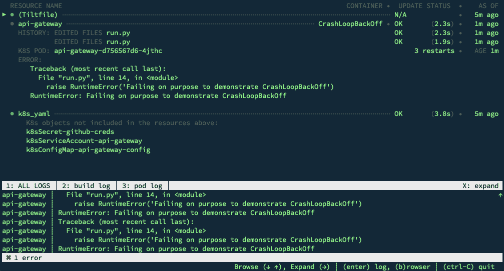
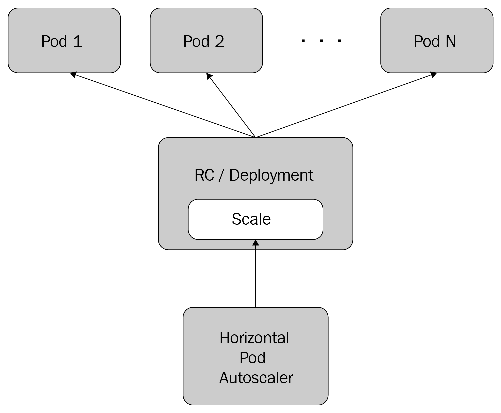
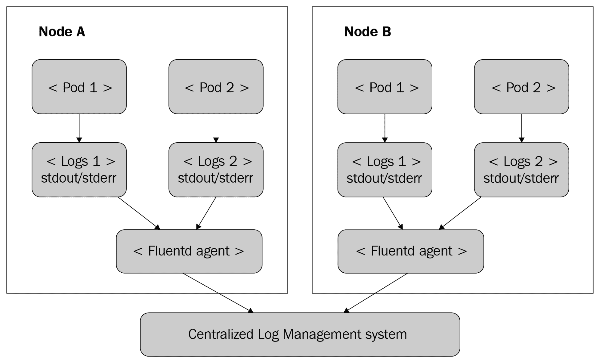
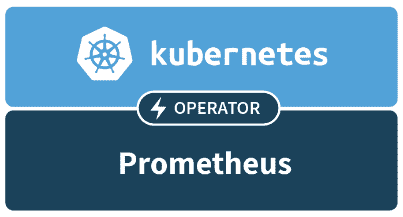
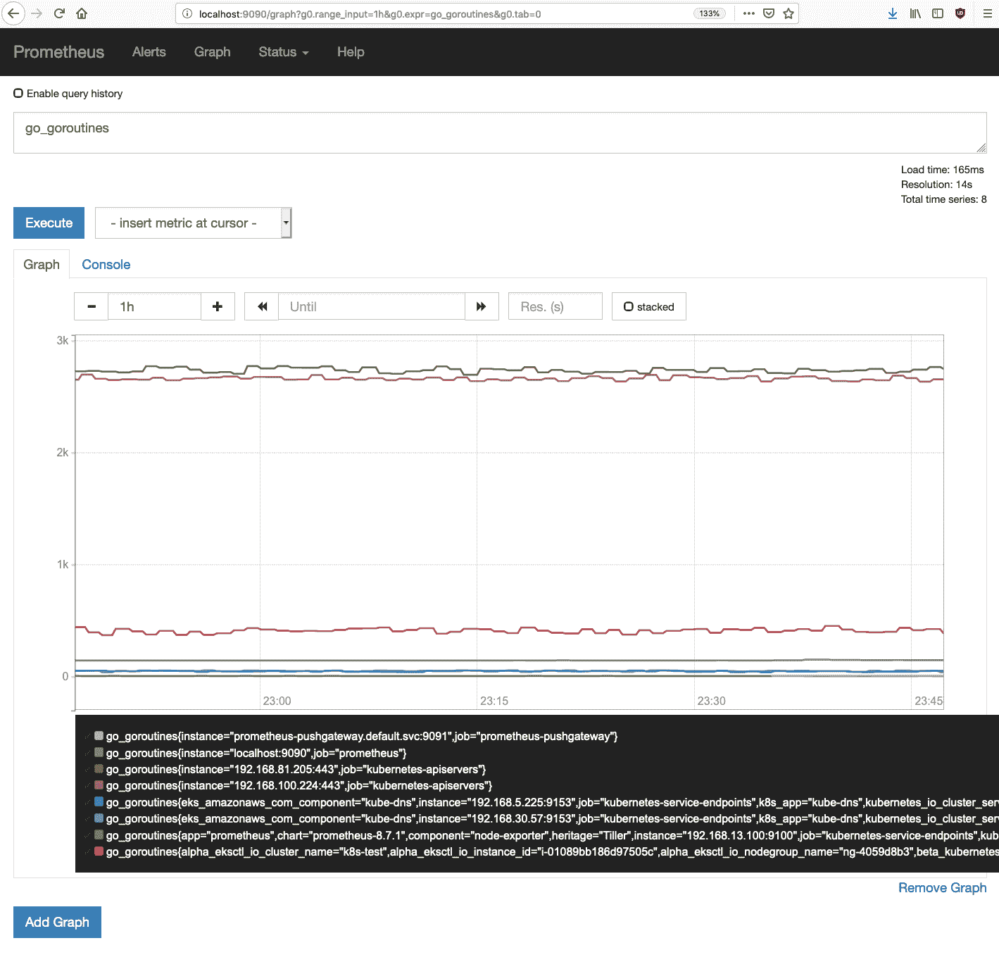
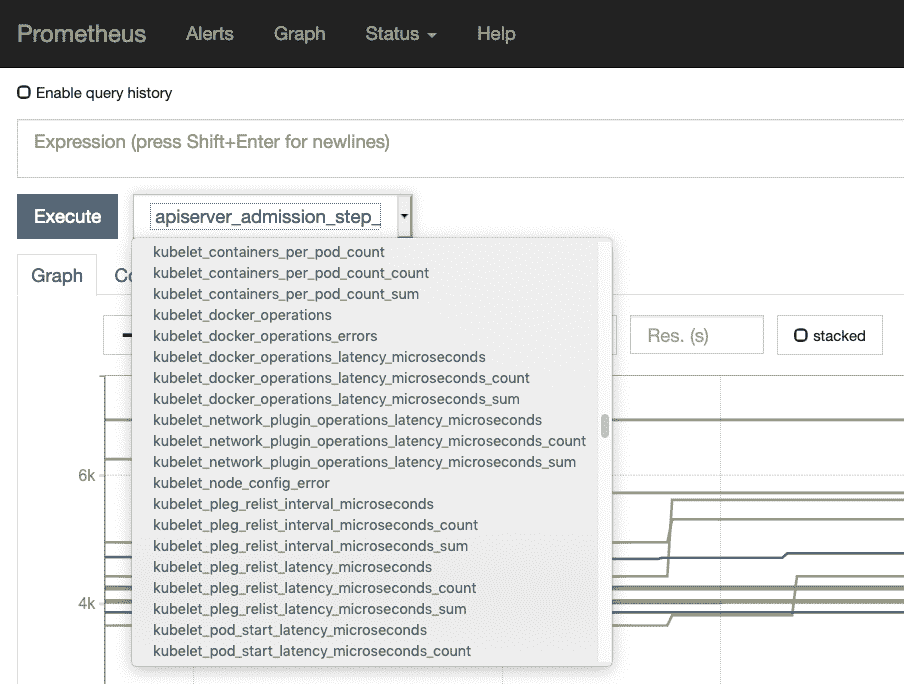
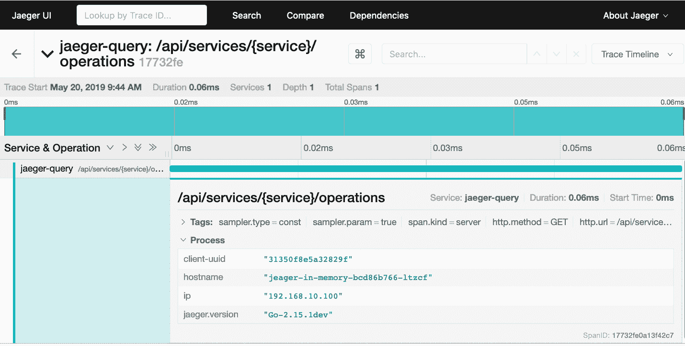

# 监控、记录和度量

在这一章中，我们将重点讨论在 Kubernetes 上运行大规模分布式系统的操作方面，以及如何设计系统以及需要考虑什么来确保一流的操作姿态。也就是说，事情总是会变得很糟糕，你必须准备好尽快检测、排除故障并做出响应。Kubernetes 提供的现成操作最佳实践包括以下内容:

*   自愈
*   自动缩放
*   资源管理

但是，集群管理员和开发人员必须了解这些功能是如何工作、配置和交互的，以便正确理解它们。高可用性、健壮性、性能、安全性和成本之间总是有一种平衡。认识到所有这些因素以及它们之间的关系随着时间的推移而变化也很重要，必须定期重新审视和评估。

这就是监控的作用。监控就是了解您的系统发生了什么。有几个信息来源与不同的目的相关:

*   **日志**:在应用程序代码中明确记录相关信息(使用的库也可以记录)。
*   **指标**:收集系统的详细信息，如 CPU、内存、磁盘使用情况、磁盘 I/O、网络和自定义应用程序指标。
*   **跟踪**:附加一个标识来跟踪跨多个微服务的请求。

在本章中，我们将看到 Go-kit、Kubernetes 和生态系统如何支持和支持所有相关的用例。

本章涵盖以下主题:

*   库本内特斯的自我修复
*   自动缩放 Kubernetes 集群
*   使用 Kubernetes 提供资源
*   获得正确的性能
*   记录
*   收集关于 Kubernetes 的指标
*   发信号
*   分布式跟踪

# 技术要求

在本章中，我们将向集群中安装几个组件:

*   **普罗米修斯**:度量和警报解决方案
*   **fluent**:中央测井代理
*   **Jaeger** :分布式追踪系统

# 代码

代码在两个 Git 存储库之间被分割:

*   您可以在这里找到代码示例:[https://github . com/PacktPublishing/hand-microservice-with-Kubernetes/tree/master/chapter 12](https://github.com/PacktPublishing/Hands-On-Microservices-with-Kubernetes/tree/master/Chapter12)
*   你可以在这里找到更新的德令状应用:[https://github.com/the-gigi/delinkcious/releases/tag/v0.10](https://github.com/the-gigi/delinkcious/releases/tag/v0.10)

# 库本内特斯的自我修复

自愈是由无数物理和虚拟组件组成的大规模系统的一个非常重要的特性。运行在大型 Kubernetes 集群上的基于微服务的系统就是一个很好的例子。组件可能以多种方式出现故障。自愈的前提是整个系统不会出现故障，能够自动自愈，即使这导致它暂时在降低的容量下运行。

这种可靠系统的组成部分如下:

*   裁员
*   可观察性
*   自动恢复

基本前提是每个组件都可能出现故障——机器崩溃、磁盘损坏、网络连接中断、配置可能不同步、新软件版本有 bug、第三方服务中断等等。冗余意味着没有**单点故障** ( **单点故障**)。您可以运行许多组件(如节点和 pod)的多个副本，将数据写入多个数据存储区，并在多个数据中心、可用性区域或区域中部署您的系统。您甚至能够在多个云平台上部署您的系统(尤其是如果您使用 Kubernetes)。当然，冗余是有限度的。总冗余非常庞大。例如，在 AWS 和 GKE 上运行一个完整的冗余系统可能是一种奢侈，很少有公司能够负担得起甚至需要。

可观察性是发现事情何时出错的能力。为了检测异常情况，您必须监控您的系统并了解您观察到的信号。这是补救和恢复之前的第一步。

理论上不需要自动修复和恢复的自动化部分。您可以让一组操作员整天观察仪表板，并在发现问题时采取纠正措施。实际上，这种方法无法扩展。人类的反应、解释和行动都很慢——更不用说他们更容易出错。也就是说，大多数自动化解决方案都是从手动流程开始的，随着重复手动干预的成本变得明显，这些流程会在以后实现自动化。如果有些问题千载难逢，那么通过人工干预来解决这些问题可能是可以的。

让我们讨论几种失败模式，看看 Kubernetes 如何帮助实现自我修复的所有支柱。

# 集装箱故障

Kubernetes 在豆荚里运行容器。如果一个容器因为任何原因而死亡，默认情况下，Kubernetes 会检测到它并立即重启它。Kubernetes 的行为可以通过 pod 规范的`restartPolicy`文件来控制。可能的值有`Always`(默认)、`OnFailure`和`Never`。请注意，重启策略适用于 pod 中的所有容器。无法为每个容器指定重启策略。这似乎有点短视，因为您可能在一个 pod 中有多个容器，需要不同的重启策略。

如果一个容器持续失效，它将进入`CrashOff`。让我们通过向我们的应用编程接口网关引入一个有意的错误来看到这一点:

```
import os
 from api_gateway_service.api import app
 def main():
     port = int(os.environ.get('PORT', 5000))
     login_url = 'http://localhost:{}/login'.format(port)
     print('If you run locally, browse to', login_url)
     host = '0.0.0.0'
     app.run(host=host, port=port)

 if __name__ == "__main__":
     raise RuntimeError('Failing on purpose to demonstrate CrashLoopBackOff')
     main()
```

执行向上倾斜后，我们可以看到 API 网关进入`CrashLoopBackOff`状态。这意味着它不断失败，Kubernetes 不断重新启动它。退避部分是重启尝试之间的延迟。Kubernetes 使用指数回退延迟，从 10 秒开始，每次增加一倍，最大延迟为 5 分钟:



Crash loop backoff

这种方法非常有用，因为如果故障是暂时的，那么 Kubernetes 将通过重新启动容器进行自我修复，直到暂时的问题消失。然而，如果问题持续存在，那么容器状态和错误日志就在附近，并提供可观察性，可被更高级别的恢复过程使用，或者作为人类操作员或开发人员的最后手段。

# 节点故障

当一个节点出现故障时，该节点上的所有 pod 都将不可用，Kubernetes 将安排它们在集群中的其他节点上运行。假设您设计的系统具有适当的冗余，并且故障节点不是 SPOF，则系统应该会自动恢复。如果集群只有几个节点，那么一个节点的丢失对于集群处理流量的能力来说是非常重要的。

# 系统故障

有时候，会发生系统性的失败。其中一些如下:

*   网络故障总数(整个群集不可达)
*   数据中心停机
*   可用性区域中断
*   区域中断
*   云提供商中断

在这些情况下，您可能没有设计冗余(成本效益比不经济)。系统将关闭。用户将经历停机。重要的是不要丢失或损坏任何数据，并且能够在解决根本原因后立即恢复在线。但是，如果您的组织不惜一切代价保持在线非常重要，Kubernetes 将为您提供多种选择。关键词是*将*，一如未来。这方面的工作是在一个名为 federation v2 的项目下进行的，(v1 被否决了，因为它遇到了太多的问题。)

您将能够在不同的数据中心、不同的可用性区域、不同的区域甚至不同的云提供商中创建完整的 Kubernetes 集群甚至一组集群。您将能够运行、管理这些物理分布的集群，并将它们视为一个逻辑集群，并有望在这些集群之间无缝地进行故障转移。

如果您想实现这种集群级冗余，您可以考虑使用园丁([https://gardener.cloud/](https://gardener.cloud/))项目来构建它。

# 自动缩放 Kubernetes 集群

自动缩放就是让你的系统适应需求。这可能意味着向部署中添加更多副本、扩展现有节点的容量或添加新节点。尽管向上或向下扩展集群并不是失败，但它遵循与自我修复相同的模式。您可以认为与需求不一致的集群是不健康的。如果群集资源调配不足，则请求不会得到处理或等待时间过长，这可能会导致超时或性能低下。如果群集过度配置，那么您要为不需要的资源付费。在这两种情况下，您可以认为集群是不健康的，即使吊舱和服务本身已经启动并运行。

就像自我修复一样，您首先需要检测到需要扩展集群，然后才能采取正确的行动。扩展集群容量有几种方法:可以添加更多的吊舱，可以添加新节点，还可以增加现有节点的容量。让我们详细回顾一下。

# 水平吊舱自动缩放

水平吊舱自动缩放器是一种控制器，用于调整部署中吊舱的数量，以匹配这些吊舱上的负载。部署应该扩大(添加 pods)还是缩小(删除 pods)的决定是基于指标的。开箱即用，水平吊舱自动缩放器支持 CPU 利用率，但也可以添加自定义指标。水平自动缩放器很酷的一点是，它位于标准的 Kubernetes 部署之上，只需调整其副本数量。部署本身和吊舱幸福地没有意识到它们正在被扩展:



Horizontal pod autoscaler

上图说明了水平自动缩放器的工作原理。

# 使用水平吊舱自动缩放器

我们可以使用 kubectl 进行自动缩放。由于自动缩放器依赖于 Heapster 和度量服务器，我们需要使用`minikube addons`命令来启用它们。我们已经启用了 Heapster，所以这应该足够好了:

```
$ minikube addons enable metrics-server
 metrics-server was successfully enabled
```

我们还必须在部署的 pod 规范中指定一个 CPU 请求:

```
    resources:
       requests:
         cpu: 100m
```

您可能还记得，资源请求是 Kubernetes 承诺的，如果它被调度，它可以提供给容器。这样，水平吊舱自动缩放器可以确保只有当它能够向新吊舱提供所请求的最小 CPU 时，它才会启动新吊舱。

让我们介绍一些会导致社交图管理器浪费大量 CPU 的代码:

```
func wasteCPU() {
     fmt.Println("wasteCPU() here!")
     go func() {
         for {
             if rand.Int() % 8000 == 0 {
                 time.Sleep(50 * time.Microsecond)
             }
         }
     }()
 }
```

这里，我们根据 50%的 CPU 利用率在 1 到 5 个单元之间扩展社交图管理器:

```
$ kubectl autoscale deployment social-graph-manager --cpu-percent=50 --min=1 --max=5
```

在运行向上倾斜并部署浪费 CPU 的代码后，CPU 利用率提高了，创建了越来越多的吊舱，最多可达 5 个。这是 Kubernetes 仪表板的截图，显示了 CPU、吊舱和水平吊舱自动缩放器:


Hp dashboard

让我们回顾一下水平吊舱自动缩放器本身:

```
$ kubectl get hpa
NAME   REFERENCE  TARGETS    MINPODS   MAXPODS   REPLICAS   AGE
social-graph-manager   Deployment/social-graph-manager   138%/50%   1         5         5          12h
```

可以看到，当前负载是 CPU 利用率的`138%`，也就是说需要一个以上的 CPU 核心，大于 50%。因此，社交图管理器将继续运行五个豆荚(允许的最大数量)。

水平吊舱自动缩放器是一种通用机制，长期以来一直是 Kubernetes 的一部分。它只依赖内部组件来收集指标。我们已经在这里演示了默认的基于 CPU 的自动缩放，但是它也可以配置为基于多个自定义指标工作。现在是看看其他自动缩放方法的好时机。

# 集群自动缩放

Pod 自动缩放是给开发人员和运营商的礼物——他们不需要手动上下缩放服务或编写自己的半基自动缩放脚本。Kubernetes 提供了一个健壮的解决方案，它设计良好，实现良好，并且经过了战斗测试。然而，这就留下了集群能力的问题。如果 Kubernetes 试图向您的集群添加更多的 pod，但集群正在以最大容量运行，则 pod 自动缩放器将失败。另一方面，如果您过度配置集群，以防 pod 自动缩放器需要再添加几个 pod，那么您就是在浪费钱。

进入`auto-scaler`集群([https://github . com/kubernetes/autoscaler/tree/master/cluster-autoscaler](https://github.com/kubernetes/autoscaler/tree/master/cluster-autoscaler))。

这是一个 Kubernetes 项目，自 Kubernetes 1.8 以来已经普遍可用。它与 GCP、AWS、Azure、AliCloud 和 BaiduCloud 合作。如果 GKE、EKS 和 AKS 为您提供了一个托管控制平面(它们负责管理 Kubernetes 本身)，那么集群自动缩放器将为您提供一个托管数据平面。它将根据您的需求和配置在集群中添加或删除节点。

调整集群大小的触发器是当 Kubernetes 由于资源不足而无法调度豆荚时。这对于水平吊舱自动缩放器非常有效。结合在一起，您将获得一个真正有弹性的 Kubernetes 集群，它可以自动增长和收缩(在一定范围内)，以匹配当前的负载。

集群自动缩放器本质上非常简单。它不在乎为什么不能安排吊舱。只要不能调度 pods，它就会向集群添加节点。它将删除空节点或其 pods 可以在其他节点上重新调度的节点。话虽如此，它并不是一个完全没有头脑的机制。

它了解几个 Kubernetes 概念，并在决定扩大或缩小集群时将它们考虑在内:

*   播客中断预算
*   总体资源限制
*   亲和力和反亲和力
*   Pod 优先级和抢占

例如，如果无法调度具有尽力而为优先级的 pods，集群自动缩放器将不会增长集群。特别是，它不会删除具有以下一个或多个属性的节点:

*   使用本地存储
*   注释为`"cluster-autoscaler.kubernetes.io/scale-down-disabled": "true"`
*   主机吊舱注释`"cluster-autoscaler.kubernetes.io/safe-to-evict": "false"`
*   具有限制性的主机节点`PodDisruptionBudget`

添加节点的总时间通常不到 5 分钟。群集自动缩放器每 10 秒扫描一次未计划的 pods，并在必要时立即配置新节点。但是，云提供商需要 3-4 分钟来提供节点并将其连接到群集。

让我们进入另一种自动缩放形式:垂直吊舱自动缩放。

# 垂直吊舱自动缩放

垂直吊舱自动缩放器目前(Kubernetes 1.15)处于测试阶段。它承担了一项与自动缩放相关的不同任务——微调您的 CPU 和内存请求。考虑这样一个 pod，它实际上做的不多，需要 100 MiB 的内存，但它目前请求 500 MiB。首先，总是分配给 pod 的 400 MiB 内存是一种净浪费，而且从未使用过。然而，影响可能要大得多。因为豆荚更厚，它可以防止其他豆荚被安排在它旁边。

垂直自动缩放器通过监控 pods 的实际 CPU 和内存使用并自动调整它们的请求来解决这个问题。它还要求您安装度量服务器。

这很酷。垂直吊舱自动缩放器在几种模式下工作:

*   **初始**:创建 pod 时分配资源请求
*   **自动**:在 pod 创建时分配资源请求，并在 pod 的生命周期内更新它们
*   **重新创建**:类似于自动，pod 总是在它的资源请求需要更新时重新启动
*   **更新关闭**:不修改资源请求，但是可以查看推荐

目前，自动工作就像重新创建一样，并在每次更改时重新启动豆荚。未来，它将使用就地更新。让我们乘垂直自动缩放器旋转一下。安装相当粗糙，需要克隆 Git 存储库并运行一个 shell 脚本(运行许多其他 shell 脚本):

```
$ git clone https://github.com/kubernetes/autoscaler.git
$ cd autoscaler/vertical-pod-autoscaler/hack/ 
$ ./vpa-up.sh
```

它安装了一项服务、两个 CRD 和三个 pod:

```
$ kubectl -n kube-system get svc | grep vpa
vpa-webhook    ClusterIP   10.103.169.18    <none>        443/TCP

$ kubectl -n kube-system get po | grep vpa
vpa-admission-controller-68c748777d-92hbg 1/1  Running   0   72s
vpa-recommender-6fc8c67d85-shh8g          1/1  Running   0   77s
vpa-updater-786b96955c-8mcrc              1/1  Running   0   78s

$ kubectl get crd | grep vertical
verticalpodautoscalercheckpoints.autoscaling.k8s.io  2019-05-08T04:58:24Z
verticalpodautoscalers.autoscaling.k8s.io            2019-05-08T04:58:24Z
```

让我们为链路管理器部署创建一个 VPA 配置文件。我们将模式设置为`Off`，这样它只推荐合适的 CPU 和内存请求值，而不实际设置它们:

```
apiVersion: autoscaling.k8s.io/v1beta2
kind: VerticalPodAutoscaler
metadata:
  name: link-manager
spec:
  targetRef:
    apiVersion: "extensions/v1beta1"
    kind:       Deployment
    name:       link-manager
  updatePolicy:
    updateMode: "Off"
```

我们可以创建它并检查建议:

```
$ kubectl create -f link-manager-vpa.yaml
 verticalpodautoscaler.autoscaling.k8s.io/link-manager created

$ kubectl get vpa link-manager -o jsonpath="{.status.recommendation.containerRecommendations[0].lowerBound}"
 map[cpu:25m memory:262144k]

$ kubectl get vpa link-manager -o jsonpath="{.status.recommendation.containerRecommendations[0].target}"
 map[cpu:25m memory:262144k]
```

在这一点上，我不建议让垂直吊舱自动缩放器在您的系统上松动。它仍在不断变化，有一些严重的局限性。最大的一个是它不能和水平吊舱自动缩放器并排运行。

一个有趣的方法，如果你想利用它来微调你的资源请求，那就是在模拟你的生产集群的测试集群上运行一段时间，关闭水平吊舱自动缩放器，看看它表现如何。

# 使用 Kubernetes 提供资源

传统上，资源调配是操作员或系统管理员的工作。然而，使用 DevOps 方法，开发人员经常要承担自我配置的任务。如果组织有一个传统的信息技术部门，他们通常更关心开发人员应该拥有什么样的资源调配权限，以及应该设置什么样的全局限制。在本节中，我们将从两个角度来看资源调配问题。

# 您应该提供哪些资源？

区分 Kubernetes 资源和它们所依赖的底层基础设施资源非常重要。对于 Kubernetes 资源来说，Kubernetes API 是必由之路。如何与应用编程接口交互由您决定，但我建议您生成 YAML 文件，并通过`kubectl create`或`kubectl apply`运行它们，作为您的配置项/光盘管道的一部分。

像`kubectl run`和`kubectl scale`这样的命令对于集群的交互探索和运行特定任务非常有用，但是它们与声明性基础设施的代码颗粒相违背。

如果您有一个非常复杂的 CI/CD 工作流，您可以使用一些更高级的编程语言(如 Python)来实现，那么您也可以直接使用 Kubernetes API 的 REST 端点或使用客户端库。即使在那里，你也可以考虑只调用`kubectl`。

让我们继续到您的集群运行的基础设施层。主要资源是计算、内存和存储。节点结合了计算、内存和本地存储。共享存储是单独调配的。在云中，您可以使用预调配的云存储。这意味着您主要关心的是为集群调配节点和外部存储。但这还不是全部。您还需要通过网络层连接所有这些节点，并考虑权限。Kubernetes 集群中的网络大部分时间由 CNI 提供商负责。著名的平面网络模型，每个 pod 都有自己的 IP，这是 Kubernetes 最好的特性之一，为开发人员简化了许多事情。

权限和访问通常由 Kubernetes 上的**基于角色的访问控制** ( **RBAC** )处理，正如我们在[第 6 章](06.html)、*利用 Kubernetes 保护微服务*中详细讨论的那样。

鉴于我们努力实现自动资源调配，对资源实施合理的配额和限制非常重要。

# 定义容器限制

在 Kubernetes 上，我们可以定义每个容器的 CPU 和内存限制。这些确保了容器的使用不会超过限制。它有两个主要目的:

*   防止同一个节点上的容器和容器相互拆卸
*   通过了解 pod 将使用的最大资源量，帮助 Kubernetes 以最有效的方式安排 pod

我们已经在 [第 6 章](06.html)*中从安全的角度看了限制，保护库本内斯*上的微服务。重点是控制爆炸半径。如果容器遭到破坏，它可以利用的资源将超过为其配置的资源限制。

这里有一个为`user-manager`服务设置 CPU 和内存限制的例子。它遵循将资源限制和资源请求设置为相同值的最佳实践:

```
apiVersion: apps/v1
kind: Deployment
metadata:
  name: user-manager
  labels:
    svc: user
    app: manager
spec:
  replicas: 1
  selector:
    matchLabels:
      svc: user
      app: manager
  template:
    metadata:
      labels:
        svc: user
        app: manager
    spec:
      containers:
      - name: user-manager
        image: g1g1/delinkcious-user:0.3
        imagePullPolicy: Always
        ports:
        - containerPort: 7070
        resources:
          requests:
            memory: 64Mi
            cpu: 250m
          limits:
            memory: 64Mi
            cpu: 250m
```

设置容器限制非常有用，但它无助于解决许多容器或其他资源的失控分配问题。这就是资源配额的作用。

# 指定资源配额

Kubernetes 允许您指定每个命名空间的配额。您可以设置不同类型的配额，例如，CPU、内存和各种对象的计数，包括永久卷声明。让我们为 Delinkcious 的默认命名空间设置一些配额:

```
apiVersion: v1
kind: List
items:
- apiVersion: v1
  kind: ResourceQuota
  metadata:
    name: awesome-quota
  spec:
    hard:
      cpu: "1000"
      memory: 200Gi
      pods: "100"
```

以下是应用于`quota`的命令:

```
$ kubectl create -f resource-quota.yaml 
resourcequota/awesome-quota created
```

现在，我们可以检查资源配额对象的实际使用情况，并将其与配额进行比较，看看我们有多接近:

```
$ kubectl get resourcequota awesome-quota -o yaml | grep status -A 8
status:
 hard:
 cpu: 1k
 memory: 200Gi
 pods: "100"
 used:
 cpu: 350m
 memory: 64Mi
 pods: "10"
```

显然，这个资源配额远远超出了集群的当前利用率。没关系。它不分配或保留任何资源。这只是意味着配额没有很大的限制。

资源配额还有很多细微差别和选择。存在对具有特定条件或状态的资源应用资源配额的范围(`Terminating`、`NotTerminating`、`BestEffort`和`NotBestEffort`)。有些资源是特定于特定优先级类别的配额。要点是，您可以获得相当精细的粒度，并提供资源配额策略来控制集群中的资源分配，即使面临配置错误或攻击。

此时，我们已经用资源配额覆盖了我们的基础，可以继续实际调配资源。有几种方法可以做到这一点，我们可能希望对复杂的系统采用其中的一些方法，如果不是全部的话。

# 手动设置

手动配置听起来像是一种反模式，但实际上它在几种情况下很有用；例如，如果您正在管理内部集群，您必须在物理上调配服务器，将它们连接在一起，并安装存储。另一个常见的用例是在开发过程中，当您想要开发您的自动化配置，但是您有一个交互式实验(可能不在生产中)时。但是，即使在生产中，如果您发现一些错误配置或其他问题，您可能需要通过手动调配一些资源来应对危机。

# 利用自动缩放

在云上，强烈建议使用我们前面讨论的自动缩放解决方案。水平吊舱自动缩放器是一个显而易见的。如果您的集群处理非常动态的工作负载，并且您不想定期过度配置，那么集群自动缩放器也很棒。此时，垂直自动缩放器可能最适合微调您的资源请求。

# 滚动您自己的自动资源调配

如果你有更复杂的需求，你可以自己滚。Kubernetes 鼓励运行您自己的控制器，这些控制器可以监视不同的事件，并通过在本地调配一些资源甚至运行一些工具来做出响应，或者作为您的 CI/CD 管道的一部分，检查集群的状态并做出一些调配决策。

正确配置集群后，您应该开始考虑性能。性能很有趣，因为有太多的权衡需要考虑。

# 获得正确的性能

性能很重要，原因有很多，我们将很快深入研究。了解什么时候是尝试和提高绩效的合适时机非常重要。我的指导原则是:让它工作，让它正确，让它快速。也就是说，首先，让系统做它需要做的任何事情，无论多么缓慢和笨拙。然后，清理架构和代码。现在，您已经准备好接受性能，并考虑重构、更改和许多其他可能影响性能的因素。

但是有一个提高性能的初步步骤，那就是性能分析和基准测试。试图提高性能而不衡量你试图提高什么就像试图让你的代码正确工作而不写任何测试一样。这不仅是徒劳的，而且，即使你真的很幸运，提高了性能，如果没有测量，你怎么知道呢？

让我们了解一下性能。它让一切变得复杂。然而，它往往是一种必要的邪恶。当性能影响用户体验或成本时，提高性能非常重要。更糟糕的是，改善用户体验往往是有代价的。找到最佳位置很难。不幸的是，甜蜜点并没有停留在原地。您的系统在发展，用户数量在增长，技术在变化，资源成本也在变化。例如，一家小型社交媒体初创公司没有建立自己的数据中心的业务，但像脸书这样的社交媒体巨头现在设计自己的定制服务器，以挤压更多的性能并节省成本。规模变化很大。

最重要的是，为了做出这些决定，您必须了解您的系统是如何工作的，并且能够衡量每个组件以及对您的系统所做的更改对性能的影响。

# 性能和用户体验

用户体验是关于感知性能的。点击按钮后，我在屏幕上看到漂亮图片的速度有多快？显然，您可以提高系统的实际性能，购买更快的硬件，并行运行，改进算法，将依赖关系升级到更新更高性能的版本，等等。但是，通常情况下，它更多的是关于更智能的架构，以及通过添加缓存、提供近似结果和将工作推给客户端来完成更少的工作。然后，还有像预取这样的方法，在那里您试图在需要工作之前做工作，以便预测用户的需求。

用户体验决策会显著影响性能。考虑一个聊天程序，在这个程序中，客户端每秒钟不断轮询服务器的每一次按键，而不是每分钟检查一次新消息。这是一种不同的用户体验，具有 60 倍的性能价格比。

# 性能和高可用性

系统上可能发生的最糟糕的例行事件之一是超时。超时意味着用户不能按时得到答案。超时意味着你做了很多现在被浪费的工作。您可能有重试逻辑，用户最终会得到他们的答案，但是性能会受到影响。当您的系统及其所有组件高度可用(并且没有过载)时，您可以最大限度地减少超时的发生。如果您的系统非常冗余，您甚至可以多次向不同的后端发送相同的请求，只要其中一个后端做出响应，您就有了答案。

另一方面，一个高度可用和冗余的系统有时需要与所有碎片/后端(或至少一个法定人数)同步，以确保您有最新的、最新的答案。当然，插入或更新数据也更复杂，并且在高可用性系统上通常需要更长的时间。如果冗余跨越多个可用性区域、地区或大洲，则可能会增加几个数量级的响应时间。

# 性能和成本

性能和成本有着非常有趣的关系。有许多方法可以提高性能。其中一些可以降低成本，比如优化代码，压缩发送的数据，或者将计算推送到客户端。但是，提高性能的其他方法会增加成本，例如在更强的硬件上运行、将数据复制到离客户端很近的多个位置以及预取未请求的数据。

说到底，这是一个商业决策。即使是双赢的性能改进也不总是像改进你的算法那样，处于高度优先地位。例如，您可以投入大量时间来想出一个比以前的算法运行速度快 10 倍的算法。但是，在处理请求的总时间中，计算时间可能可以忽略不计，因为它主要由对数据库的访问、序列化数据以及将其发送到客户端来决定。在这种情况下，您只是浪费了本可以用于开发更有用的东西的时间，您潜在地破坏了代码的稳定性并引入了错误，使代码更难理解。同样，良好的度量和分析将帮助您确定系统中在性能和成本方面值得改进的热点。

# 性能和安全性

性能和安全性通常不一致。安全性通常会推动集群内外的全面加密。有很强的身份验证和授权方法，可能是必要的，但有性能开销。然而，安全性有时会通过提倡减少不必要的功能和减少系统的表面积来间接帮助性能。这种产生更紧密系统的斯巴达式方法允许你专注于更小的目标来提高性能。通常情况下，安全系统不会在不仔细考虑的情况下添加会影响性能的任意功能。

稍后，我们将探讨如何使用 Kubernetes 收集和使用指标，但首先让我们看一下日志记录，这是监视您的系统的另一个支柱。

# 记录

日志是在系统运行期间记录消息的能力。日志消息通常是结构化的，并且有时间戳。在尝试诊断问题和排除系统故障时，它们通常是不可或缺的。在做死后检查和事后发现根本原因时，它们也很重要。在大规模分布式系统中，会有许多记录消息的组件。收集、组织和筛选它们是一项不平凡的任务。但是首先，让我们考虑哪些信息对记录有用。

# 你应该记录什么？

这是一个百万美元的问题。一个简单的方法是记录一切。你永远不会有太多的数据，当你试图找出你的系统出了什么问题时，很难预测你需要什么数据。然而，一切到底意味着什么？你显然可以走得太远。例如，您可以记录代码中每个小函数的每个调用，包括所有参数以及当前状态，或者记录每个网络调用的负载。有时，存在安全和监管限制，阻止您记录某些数据，如**受保护的健康信息** ( **PHI** )和**个人身份信息** ( **PII** )。你需要充分了解你的系统，才能决定什么样的信息与你相关。一个很好的起点是记录微服务之间以及微服务和第三方服务之间的任何传入请求和交互。

# 日志记录与错误报告

错误是一种特殊的信息。您的代码可以处理一些错误(例如，重试或使用一些替代方法)。但是，也有必须尽快处理的错误，否则系统将遭受部分或全部停机。但是即使是不紧急的错误，有时也需要你记录大量的信息。您可以像记录任何其他信息一样记录错误，但是将错误记录到像 Rollbar 或 Sentry 这样的专用错误报告服务中通常是值得的。有错误的关键信息之一是堆栈跟踪，它包括堆栈中每个帧的状态(局部变量)。对于生产系统，除了日志记录之外，我建议您使用专用的错误报告服务。

# 追求完美的围棋记录界面

Delinkcious 主要是用 Go 实现的，所以我们来谈谈登录 Go。有一个标准的库 Logger，它是一个结构，而不是接口。它是可配置的，创建时可以传递一个`io.Writer`对象。然而，`Logger`结构的方法是刚性的，不支持日志级别或结构化日志。此外，在某些情况下，只有一个输出编写器的事实可能是一个限制。以下是标准记录器的规范:

```
type Logger struct { ... } // Not an interface!

func New(out io.Writer, prefix string, flag int) *Logger

// flag controls date, time, µs, UTC, caller

// Log
func (l *Logger) Print(v ...interface{})
func (l *Logger) Printf(format string, v ...interface{})
func (l *Logger) Println(v ...interface{})

// Log and call os.Exit(1)
func (l *Logger) Fatal(v ...interface{})
func (l *Logger) Fatalf(format string, v ...interface{})
func (l *Logger) Fatalln(v ...interface{})

// Log and panic
func (l *Logger) Panic(v ...interface{})
func (l *Logger) Panicf(format string, v ...interface{})
func (l *Logger) Panicln(v ...interface{})

func (l *Logger) Output(calldepth int, s string) error
```

如果你需要这些能力，你需要使用位于标准库之上的另一个库`Logger`。有几种包装提供不同的口味:

*   `glog`:[https://godoc . org/github . com/golang/glog](https://godoc.org/github.com/golang/glog)
*   `logrus`:[https://github . com/sirups/logrus](https://github.com/Sirupsen/logrus)
*   `loggo`:[https://godoc . org/github . com/jujuju/loggo](https://godoc.org/github.com/juju/loggo)
*   `log15`:[https://github . com/inconvenible/log 15](https://github.com/inconshreveable/log15)

他们以不同的方式处理界面、可比性和可玩性。然而，我们使用的是 Go-kit，它有自己的日志记录方式。

# 使用工具箱记录

Go-kit 有史以来最简单的界面。只有一个方法`Log()`，它接受一个可以是任何类型的键和值的列表:

```
type Logger interface {
 Log(keyvals ...interface{}) error
}
```

这里的基本思想是，Go-kit 对如何记录您的消息没有意见。你总是添加时间戳吗？你有日志记录级别吗？什么水平？所有这些问题的答案都取决于你。您得到了一个完全通用的接口，并决定要记录哪些键值。

# 使用 Go-kit 设置记录器

好的。接口是通用的，但是我们需要一个实际的记录器对象来使用。Go-kit 支持几个编写器和记录器对象，它们生成熟悉的日志格式，如 JSON、logfmt 或开箱即用的 logrus。让我们设置一个带有 JSON 格式化程序和同步编写器的记录器。从多个 Go 例程中使用同步编写器是安全的，JSON 格式化程序将键值格式化为 JSON 字符串。此外，我们可以添加一些默认字段，例如服务名称，这是日志消息在源代码中的来源，以及当前的时间戳。因为我们可能希望使用来自多个服务的相同的记录器规范，让我们把它放在一个所有服务都可以使用的包中。最后一件事是还增加一个`Fatal()`功能，它将转发到标准的`log.Fatal()`功能。这允许当前使用`Fatal()`的代码继续工作而不做任何改变。以下是包含记录器工厂功能和`Fatal()`功能的 Delinkcious 日志包:

```
package log

import (
  kit_log "github.com/go-kit/kit/log"
  std_log "log"
  "os"
)

func NewLogger(service string) (logger kit_log.Logger) {
  w := kit_log.NewSyncWriter(os.Stderr)
  logger = kit_log.NewJSONLogger(w)
  logger = kit_log.With(logger, "service", service)
  logger = kit_log.With(logger, "timestamp", kit_log.DefaultTimestampUTC)
  logger = kit_log.With(logger, "called from", kit_log.DefaultCaller)

  return
}

func Fatal(v ... interface{}) {
  std_log.Fatal(v...)
}
```

编写器只需写入标准错误流，该错误流将被捕获并发送到 Kubernetes 上的容器日志。

要看到我们的记录器在运行，让我们把它附加到我们的链接服务上。

# 使用日志中间件

让我们考虑一下我们想在哪里实例化我们的日志记录程序，然后我们想在哪里使用它并记录消息。这很重要，因为我们需要确保记录器在代码中需要记录消息的所有地方都可用。一个简单的方法是向我们所有的接口添加一个记录器参数，并以这种方式传播记录器。然而，这是非常破坏性的，将违反我们的干净对象模型。日志记录实际上是一个实现和操作细节。理想情况下，它不应该出现在我们的对象模型类型或接口中。此外，它是一个 Go-kit 类型，到目前为止，我们已经设法保持我们的对象模型，甚至我们的域包完全忘记了它们被 Go-kit 包装的事实。SVC 下的描述服务是 Go-kit 知道的代码的唯一部分。

我们尽量保持这样吧。Go-kit 提供了中间件概念，它允许我们以松散耦合的方式链接多个中间件组件。一个服务的所有中间件组件都实现了服务接口，一个小垫片允许 Go-kit 一个接一个地调用它们。让我们从垫片开始，它只是一个接受`LinkManager`接口并返回`LinkManager`接口的函数类型:

```
type linkManagerMiddleware func(om.LinkManager) om.LinkManager
```

`logging_middleware.go`文件有一个名为`newLoggingMiddlware()`的工厂函数，该函数接受一个记录器对象并返回一个与`linkManagerMiddleware`匹配的函数。该函数反过来实例化`loggingMiddelware`结构，将其传递给链中的下一个组件和记录器:

```
// implement function to return ServiceMiddleware
func newLoggingMiddleware(logger log.Logger) linkManagerMiddleware {
  return func(next om.LinkManager) om.LinkManager {
    return loggingMiddleware{next, logger}
  }
}
```

这可能非常令人困惑，但基本思想是能够链接任意的中间件组件，这些组件做一些工作并让剩余的计算继续进行。我们有所有这些间接层的原因是 Go-kit 对我们的类型和接口一无所知，所以我们必须通过编写这些样板代码来提供帮助。正如我前面提到的，所有这些都可以而且应该是自动生成的。让我们检查一下`loggingMiddleware`结构及其方法。结构本身有一个`linkManager`接口，它是链中的下一个组件和记录器对象:

```
type loggingMiddleware struct {
  next om.LinkManager
  logger log.Logger
}
```

作为`LinkManager`中间件组件，必须实现`LinkManager`接口方法。下面是`GetLinks()`的实现。它使用记录器记录一些值，特别是方法名，即`GetLinks`、请求对象、结果和持续时间。然后，它对链中的下一个组件调用`GetLinks()`方法:

```
func (m loggingMiddleware) GetLinks(request om.GetLinksRequest) (result om.GetLinksResult, err error) {
  defer func(begin time.Time) {
    m.logger.Log(
      "method", "GetLinks",
      "request", request,
      "result", result,
      "duration", time.Since(begin),
    )
  }(time.Now())
  result, err = m.next.GetLinks(request)
  return
}
```

为简单起见，其他方法只是调用链中的下一个组件来做任何事情:

```
func (m loggingMiddleware) AddLink(request om.AddLinkRequest) error {
  return m.next.AddLink(request)
}

func (m loggingMiddleware) UpdateLink(request om.UpdateLinkRequest) error {
  return m.next.UpdateLink(request)
}

func (m loggingMiddleware) DeleteLink(username string, url string) error {
  return m.next.DeleteLink(username, url)
}
```

中间件链概念非常强大。中间件可以在将输入传递给下一个组件之前对它们进行预处理，它可以短路并立即返回，而无需调用下一个组件，或者它可以对来自下一个组件的结果进行后处理。

让我们看看运行冒烟测试时链接服务的日志输出。对人类来说，这看起来有点混乱，但所有必要的信息都在那里，标记清晰，并准备好进行大规模分析(如果需要的话)。很容易 grep，也很容易使用`jq`之类的工具深入挖掘:

```
$ kubectl logs svc/link-manager
{"called from":"link_service.go:133","msg":"*** listening on ***","port":"8080","service":"link manager","timestamp":"2019-05-13T02:44:42.588578835Z"}
{"called from":"logging_middleware.go:25","duration":"1.526953ms","method":"GetLinks","request":{"UrlRegex":"","TitleRegex":"","DescriptionRegex":"","Username":"Gigi Sayfan","Tag":"","StartToken":""},"result":{"Links":[],"NextPageToken":""},"service":"link manager","timestamp":"2019-05-13T02:45:05.302342532Z"}
{"called from":"logging_middleware.go:25","duration":"591.148µs","method":"GetLinks","request":{"UrlRegex":"","TitleRegex":"","DescriptionRegex":"","Username":"Gigi Sayfan","Tag":"","StartToken":""},"result":{"Links":[{"Url":"https://github.com/the-gigi","Title":"Gigi on Github","Description":"","Status":"pending","Tags":null,"CreatedAt":"2019-05-13T02:45:05.845411Z","UpdatedAt":"2019-05-13T02:45:05.845411Z"}],"NextPageToken":""},"service":"link manager","timestamp":"2019-05-13T02:45:06.134842509Z"}
{"called from":"logging_middleware.go:25","duration":"911.499µs","method":"GetLinks","request":{"UrlRegex":"","TitleRegex":"","DescriptionRegex":"","Username":"Gigi Sayfan","Tag":"","StartToken":""},"result":{"Links":[{"Url":"https://github.com/the-gigi","Title":"Gigi on Github","Description":"","Status":"pending","Tags":null,"CreatedAt":"2019-05-13T02:45:05.845411Z","UpdatedAt":"2019-05-13T02:45:05.845411Z"}],"NextPageToken":""},"service":"link manager","timestamp":"2019-05-13T02:45:09.438915897Z"}

```

得益于 Go-kit，我们拥有强大而灵活的日志机制。然而，用`kubectl logs`手动获取日志并不能扩展。对于现实世界的系统，我们需要集中的日志管理。

# 使用 Kubernetes 进行集中日志记录

在 Kubernetes 中，容器写入标准输出和标准错误流。Kubernetes 使这些日志可用(例如，通过`kubectl logs`)。如果容器崩溃了，你甚至可以通过使用`kubectl logs -p`获得它之前运行的日志，但是，如果吊舱被重新安排，那么它的容器和它们的日志就会消失。如果节点本身崩溃，您也会丢失日志。即使当所有的日志对于具有大量服务的集群都可用时，筛选容器日志并尝试了解系统的状态也不是一件小事。进入集中日志记录。这个想法是让一个日志代理运行，或者作为每个 pod 中的侧容器，或者作为每个节点上的守护程序集，监听所有日志，并将它们实时发送到一个集中的位置，在那里可以对它们进行聚合、过滤和排序。当然，您也可以显式地将容器中的日志直接记录到集中式日志服务中。

在我看来，最简单、最稳健的方法是恶魔集。群集管理器确保每个节点上都安装了日志代理，仅此而已。没有必要改变您的 pod 规范来注入辅助容器，没有必要依赖特殊的库来与远程日志服务通信。您的代码写入标准输出和标准错误，您就完成了。您可能使用的大多数其他服务，如 web 服务器和数据库，也可以配置为写入标准输出和标准错误。

Kubernetes 上最受欢迎的日志代理之一是 Fluentd([https://www.fluentd.org](https://www.fluentd.org))。这也是一个 CNCF 毕业的项目。您应该使用 Fluentd，除非您有非常充分的理由使用另一个日志代理。下面的图表说明了 Fluentd 如何作为部署到每个节点的 DaemonSet 适合 Kubernetes，提取所有 pods 的所有日志，并将其发送到集中式日志管理系统:



Fluentd

我们来谈谈日志管理系统。在开源世界中，ELK 堆栈——弹性搜索、日志存储和基巴纳——是一个非常受欢迎的组合。弹性搜索存储日志，并提供各种方式对它们进行切片和切割。LogStash 是日志摄取管道，Kibana 是一个强大的可视化解决方案。Fluentd 可以取代 LogStash 作为日志代理，您就可以获得 EFK 堆栈——弹性搜索。Fluentd 和 Kibana 在 Kubernetes 上工作得非常好。还有 Helm 图表和 GitHub 存储库，可以在你的 Kubernetes 集群上一键安装 EFK。但是，您还应该考虑脱离集群日志记录服务。正如我们之前所讨论的，日志对于故障排除和事后分析非常有帮助。如果您的集群有问题，您可能无法在最需要日志的时候访问日志。Fluentd 可以集成大量数据输出。在此查看完整列表:[https://www.fluentd.org/dataoutputs](https://www.fluentd.org/dataoutputs)。我们已经讨论了日志记录，所以现在是时候讨论指标了。

# 收集关于 Kubernetes 的指标

度量是一个关键组件，它支持许多有趣的用例，如自我修复、自动伸缩和警报。作为一个分布式平台，Kubernetes 有一个非常强大的度量产品，它有一个强大但通用且灵活的度量 API。

Kubernetes 一直通过 cAdvisor(集成到 kube-proxy)和 Heapster([https://github.com/kubernetes-retired/heapster](https://github.com/kubernetes-retired/heapster))支持指标。然而，cAdvisor 在 Kubernetes 1.12 中被移除，Heapster 在 Kubernetes 1.13 中被移除。您仍然可以安装它们(就像我们之前在 minikube 上使用 Heapster 插件一样)，但是它们不是 Kubernetes 的一部分，不再推荐使用。在 Kubernetes 上进行度量的新方法是使用度量 API 和度量服务器([https://github.com/kubernetes-incubator/metrics-server](https://github.com/kubernetes-incubator/metrics-server))。

# 介绍库本内斯指标应用编程接口

Kubernetes 度量 API 非常通用。它支持节点和 pod 指标，以及自定义指标。度量有使用字段、时间戳和窗口(度量收集的时间范围)。以下是节点指标的应用编程接口定义:

```
// resource usage metrics of a node.
type NodeMetrics struct {
  metav1.TypeMeta
  metav1.ObjectMeta

  // The following fields define time interval from which metrics were
  // collected from the interval [Timestamp-Window, Timestamp].
  Timestamp metav1.Time
  Window metav1.Duration

  // The memory usage is the memory working set.
  Usage corev1.ResourceList
}

// NodeMetricsList is a list of NodeMetrics.
type NodeMetricsList struct {
  metav1.TypeMeta
  // Standard list metadata.
  // More info: https://git.k8s.io/community/contributors/devel/api-conventions.md#types-kinds
  metav1.ListMeta

  // List of node metrics.
  Items []NodeMetrics
}
```

使用字段类型是`ResourceList`，但它实际上是资源名称到数量的映射:

```
// ResourceList is a set of (resource name, quantity) pairs.
type ResourceList map[ResourceName]resource.Quantity
```

还有两个与度量相关的应用编程接口:外部度量应用编程接口和自定义度量应用编程接口。它们是为扩展 Kubernetes 度量而设计的，带有任意定制度量或来自 Kubernetes 外部的度量，例如云提供商监控。您可以注释这些额外的指标，并将其用于自动缩放。

# 了解 Kubernetes 指标服务器

Kubernetes 度量服务器是 Heapster 和 cAdvisor 的现代替代品。它实现了度量应用编程接口，并提供了节点和 pods 度量。在处理尽力而为的场景时，这些度量由各种自动缩放器和 Kubernetes 调度器本身使用。根据您的 Kubernetes 发行版，可能会也可能不会安装度量服务器。如果需要安装，可以使用 helm。例如，在 AWS EKS 上，您必须使用以下命令自己安装度量服务器(您可以选择任何名称空间):

```
helm install stable/metrics-server \
 --name metrics-server \
 --version 2.0.4 \
 --namespace kube-system
```

通常，您不会直接与度量服务器交互。您可以使用`kubectl get --raw`命令访问这些指标:

```
$ kubectl get --raw "/apis/metrics.k8s.io/v1beta1/nodes" | jq .
{
 "kind": "NodeMetricsList",
 "apiVersion": "metrics.k8s.io/v1beta1",
 "metadata": {
 "selfLink": "/apis/metrics.k8s.io/v1beta1/nodes"
 },
 "items": [
 {
 "metadata": {
 "name": "ip-192-168-13-100.ec2.internal",
 "selfLink": "/apis/metrics.k8s.io/v1beta1/nodes/ip-192-168-13-100.ec2.internal",
 "creationTimestamp": "2019-05-17T20:05:29Z"
 },
 "timestamp": "2019-05-17T20:04:54Z",
 "window": "30s",
 "usage": {
 "cpu": "85887417n",
 "memory": "885828Ki"
 }
 }
 ]
}
```

此外，您可以使用非常有用的`kubectl`命令，即`kubectl top`，它可以让您快速了解节点或吊舱的性能:

```
$ kubectl top nodes
NAME                        CPU(cores) CPU%  MEMORY(bytes)  MEMORY%
ip-192-168-13-100.ec2.internal   85m   4%     863Mi           11%

$ kubectl top pods
NAME                                    CPU(cores)   MEMORY(bytes)
api-gateway-795f7dcbdb-ml2tm            1m           23Mi
link-db-7445d6cbf7-2zs2m                1m           32Mi
link-manager-54968ff8cf-q94pj           0m           4Mi
nats-cluster-1                          1m           3Mi
nats-operator-55dfdc6868-fj5j2          2m           11Mi
news-manager-7f447f5c9f-c4pc4           0m           1Mi
news-manager-redis-0                    1m           1Mi
social-graph-db-7565b59467-dmdlw        1m           31Mi
social-graph-manager-64cdf589c7-4bjcn   0m           1Mi
user-db-0                               1m           32Mi
user-manager-699458447-6lwjq            1m           1Mi
```

请注意，截止到 Kubernetes 1.15(撰写本文时的当前版本)，Kubernetes 仪表板还没有与性能指标服务器集成。它仍然需要 Heapster。我相信你很快就能使用度量服务器了。

metrics-server 是针对 CPU 和内存的标准 Kubernetes 度量解决方案，但是，如果你想更进一步，考虑定制度量，有一个显而易见的选择:Prometheus。与 Kubernetes 的大多数东西不同，在那里你在度量领域有太多的选择，普罗米修斯站在所有其他免费和开源选项之上。

# 利用普罗米修斯

普罗米修斯([https://prometheus.io/](https://prometheus.io/))是一个开源和 CNCF 毕业的项目(仅次于 Kubernetes 本身)。它是 Kubernetes 事实上的标准度量收集解决方案。它有一套令人印象深刻的功能，一个基于 Kubernetes 的大型安装库，以及一个活跃的社区。一些突出的特点如下:

*   一种通用的多维数据模型，其中每个指标都被建模为键值对的时间序列
*   一种强大的查询语言，称为 PromQL，它允许您生成报告、图形和表格
*   一个内置的警报引擎，由 PromQL 查询定义和触发警报
*   强大的可视化功能–Grafana、控制台模板语言等
*   与 Kubernetes 之外的其他基础设施组件的许多集成

让我们看看以下参考资料:

*   **用普罗米修斯监控你的库本内斯部署**:[https://super giant . io/blog/Monitoring-your-Kubernetes-deployment-with-Prometheus/](https://supergiant.io/blog/monitoring-your-kubernetes-deployments-with-prometheus/)
*   **使用自定义指标配置 Kubernetes 自动缩放**:[https://docs . bitnami . com/Kubernetes/how/Configure-Autoscaling-Custom-Metrics/](https://docs.bitnami.com/kubernetes/how-to/configure-autoscaling-custom-metrics/)

# 将普罗米修斯部署到集群中

普罗米修斯是一个大型项目，有许多功能、选项和集成。部署和管理它不是一件小事。有几个项目可以帮忙。普罗米修斯操作符([https://github.com/coreos/prometheus-operator](https://github.com/coreos/prometheus-operator))提供了一种使用库本内斯资源深度配置普罗米修斯的方法。

运营商概念([https://coreos.com/blog/introducing-operators.html](https://coreos.com/blog/introducing-operators.html))是 2016 年由 CoreOS(被红帽收购，被 IBM 收购)引入的。Kubernetes 操作符是一个控制器，负责使用 Kubernetes CRDs 管理集群内的有状态应用程序。实际上，运营商扩展了 Kubernetes API，以便在管理像 Prometheus 这样的外来组件时提供无缝体验。实际上，普罗米修斯操作符是第一个操作符(和 Etcd 操作符一起):



Prometheus operator

库贝-普罗梅斯([https://github.com/coreos/kube-prometheus](https://github.com/coreos/kube-prometheus))项目建立在普罗米修斯操作器的基础上，并增加了以下内容:

*   Grafana 可视化
*   高度可用的普罗米修斯集群
*   高度可用的`Alertmanager`集群
*   库本内特度量 API 的适配器
*   通过普罗米修斯节点导出器的内核和操作系统指标
*   通过`kube-state-metrics`对库本内特对象状态的各种度量

Prometheus 操作符能够将 Prometheus 实例启动到 Kubernetes 命名空间中，对其进行配置，并通过表中的标签来定位服务。

目前，我们将只使用 helm 部署一个完整的普罗米修斯安装:

```
$ helm install --name prometheus stable/prometheus
 This will create service accounts, RBAC roles, RBAC bindings, deployments, services and even a daemon set. In addition it will print the following information to connect to different components:
```

The Prometheus server can be accessed via port `80` on the following DNS name from within your cluster: `prometheus-server.default.svc.cluster.local`.

通过在同一个 shell 中运行以下命令来获取普罗米修斯服务器的 URL:

```
  export POD_NAME=$(kubectl get pods --namespace default -l "app=prometheus,component=server" -o jsonpath="{.items[0].metadata.name}")
  kubectl --namespace default port-forward $POD_NAME 9090
```

普罗米修斯`alertmanager`可以通过端口`80`从您的集群中访问以下域名:

```
prometheus-alertmanager.default.svc.cluster.local
```

通过在同一个 shell 中运行以下命令获得`Alertmanager` URL:

```
export POD_NAME=$(kubectl get pods --namespace default -l "app=prometheus,component=alertmanager" -o jsonpath="{.items[0].metadata.name}")
  kubectl --namespace default port-forward $POD_NAME 9093
```

普罗米修斯`pushgateway`可以通过端口 9091 从您的集群中访问以下域名:

```
 prometheus-pushgateway.default.svc.cluster.local
```

通过在同一个 shell 中运行以下命令获得`PushGateway` URL:

```
  export POD_NAME=$(kubectl get pods --namespace default -l "app=prometheus,component=pushgateway" -o jsonpath="{.items[0].metadata.name}")
  kubectl --namespace default port-forward $POD_NAME 9091
```

让我们看看安装了哪些服务:

```
$ kubectl get svc -o name | grep prom
service/prometheus-alertmanager
service/prometheus-kube-state-metrics
service/prometheus-node-exporter
service/prometheus-pushgateway
service/prometheus-server
```

一切似乎都井井有条。让我们按照说明来查看普罗米修斯网络用户界面:

```
$ export POD_NAME=$(kubectl get pods --namespace default -l "app=prometheus,component=server" -o jsonpath="{.items[0].metadata.name}")

$ kubectl port-forward $POD_NAME 9090
Forwarding from 127.0.0.1:9090 -> 9090
Forwarding from [::1]:9090 -> 9090
```

我们现在可以浏览到`localhost:9090`并做一些检查。让我们检查集群中的 goroutines 数量:



Prometheus web UI

普罗米修斯收集的指标数量令人麻木。有数百种不同的内置指标。打开指标选择下拉菜单时，查看右侧的滚动指针有多小:



Prometheus dropdown

有比你所需要的更多的度量标准，但是它们中的每一个对于一些特定的故障排除任务都很重要。

# 记录来自美味的定制指标

好的:普罗米修斯已经安装并自动收集标准度量，但是我们也想记录我们自己的定制度量。普罗米修斯在拉模式下工作。想要提供度量的服务需要公开一个`/metrics`端点(也可以使用 Prometheus 的推送网关将度量推送到 Prometheus)。让我们利用 Go-kit 的中间件概念，添加一个类似于日志中间件的度量中间件。我们将利用普罗米修斯提供的 Go 客户端库。

客户端库提供了几个原语，如计数器、摘要、直方图和标尺。为了理解如何记录 Go 服务的指标，我们将检测链接服务的每个端点，以记录请求的数量(一个计数器)以及所有请求的摘要(一个摘要)。让我们从在一个名为 pkg/metrics 的独立库中提供工厂函数开始。该库为普罗米修斯围棋客户端提供了一个方便的包装器。Go-kit 在 Prometheus Go 客户端之上有自己的抽象层，但是它并没有提供很多价值，除非你计划切换到另一个类似`statsd`的度量提供者。这不太可能发生在德林契亚，也可能发生在你的系统中。服务名、度量名和帮助字符串将在以后用于构造完全限定的度量名:

```
package metrics

import (
  "github.com/prometheus/client_golang/prometheus"
  "github.com/prometheus/client_golang/prometheus/promauto"
)

func NewCounter(service string, name string, help string) prometheus.Counter {
  opts := prometheus.CounterOpts{
    Namespace: "",
    Subsystem: service,
    Name: name,
    Help: help,
  }
  counter := promauto.NewCounter(opts)
  return counter
}

func NewSummary(service string, name string, help string) prometheus.Summary {
  opts := prometheus.SummaryOpts{
    Namespace: "",
    Subsystem: service,
    Name: name,
    Help: help,
  }

  summary := promauto.NewSummary(opts)
  return summary
}
```

下一步是构建中间件。它应该看起来非常熟悉，因为它几乎与日志中间件相同。`newMetricsMiddleware()`函数为每个端点创建一个计数器和一个汇总指标，并将其作为我们前面定义的通用`linkManagerMiddleware`函数返回(该函数接受下一个中间件，并返回自己来组装一系列组件，所有组件都实现`om.LinkManager`接口):

```
package service

import (
  "github.com/prometheus/client_golang/prometheus"
  "github.com/the-gigi/delinkcious/pkg/metrics"
  om "github.com/the-gigi/delinkcious/pkg/object_model"
  "strings"
  "time"
)

// implement function to return ServiceMiddleware
func newMetricsMiddleware() linkManagerMiddleware {
  return func(next om.LinkManager) om.LinkManager {
    m := metricsMiddleware{next,
      map[string]prometheus.Counter{},
      map[string]prometheus.Summary{}}
    methodNames := []string{"GetLinks", "AddLink", "UpdateLink", "DeleteLink"}
    for _, name := range methodNames {
      m.requestCounter[name] = metrics.NewCounter("link",
                                                  strings.ToLower(name)+"_count",
                                                  "count # of requests")
      m.requestLatency[name] = metrics.NewSummary("link",
                                                  strings.ToLower(name)+"_summary",
                                                  "request summary in milliseconds")

    }
    return m
  }
```

`metricsMiddleware`结构存储下一个中间件和两个映射。一个映射是方法名到普罗米修斯计数器的映射，而另一个映射是方法名到普罗米修斯摘要的映射。它们被`LinkManager`接口方法用来分别记录每种方法的度量:

```
type metricsMiddleware struct {
  next om.LinkManager
  requestCounter map[string]prometheus.Counter
  requestLatency map[string]prometheus.Summary
}
```

中间件方法使用执行动作的模式，在这种情况下，它记录度量，然后调用下一个组件。以下是`GetLinks()`方法:

```
func (m metricsMiddleware) GetLinks(request om.GetLinksRequest) (result om.GetLinksResult, err error) {
  defer func(begin time.Time) {
    m.recordMetrics("GetLinks", begin)
  }(time.Now())
  result, err = m.next.GetLinks(request)
  return
}
```

实际的度量记录是通过`recordMetrics()`方法完成的，该方法采用方法名称(此处为`GetLinks`)和开始时间。它被推迟到`GetLinks()`方法结束，这允许它计算`GetLinks()`方法本身的持续时间。它使用与方法名匹配的映射中的计数器和摘要:

```
func (m metricsMiddleware) recordMetrics(name string, begin time.Time) {
  m.requestCounter[name].Inc()
  durationMilliseconds := float64(time.Since(begin).Nanoseconds() * 1000000)
  m.requestLatency[name].Observe(durationMilliseconds)
}
```

此时，我们已经准备好了度量中间件，但是我们仍然需要将其连接到中间件链，并将其公开为`/metrics`端点。由于我们已经完成了所有的准备工作，这些只是链接服务的`Run()`方法中的两行:

```
// Hook up the metrics middleware
svc = newMetricsMiddleware()(svc)

...

// Expose the metrics endpoint
r.Methods("GET").Path("/metrics").Handler(promhttp.Handler())
```

现在，我们可以查询`/metrics`端点，并看到我们的度量被返回。让我们运行三次烟雾测试，并检查`GetLinks()`和`AddLink()`方法的指标。不出所料，`AddLink()`方法在每次烟雾测试中被调用一次(总共三次)，而`GetLinks()`方法在每次测试中被调用三次，总共九次。我们还可以看到帮助字符串。

摘要分位数在处理大型数据集时非常有用:

```
$ http http://localhost:8080/metrics | grep 'link_get\|add'

# HELP link_addlink_count count # of requests
# TYPE link_addlink_count counter
link_addlink_count 3
# HELP link_addlink_summary request summary in milliseconds
# TYPE link_addlink_summary summary
link_addlink_summary{quantile="0.5"} 2.514194e+12
link_addlink_summary{quantile="0.9"} 2.565382e+12
link_addlink_summary{quantile="0.99"} 2.565382e+12
link_addlink_summary_sum 7.438251e+12
link_addlink_summary_count 3
# HELP link_getlinks_count count # of requests
# TYPE link_getlinks_count counter
link_getlinks_count 9
# HELP link_getlinks_summary request summary in milliseconds
# TYPE link_getlinks_summary summary
link_getlinks_summary{quantile="0.5"} 5.91539e+11
link_getlinks_summary{quantile="0.9"} 8.50423e+11
link_getlinks_summary{quantile="0.99"} 8.50423e+11
link_getlinks_summary_sum 5.710272e+12
link_getlinks_summary_count 9

```

自定义指标很棒。然而，除了看大量的数字、图表和直方图，欣赏你的作品之外，度量的真正价值是告知自动化系统或你系统状态的变化。这就是警报的来源。

# 发信号

警报对于关键系统来说非常重要。您可以随心所欲地规划和构建弹性功能，但您永远无法构建一个防故障系统。构建健壮可靠系统的正确心态是尽量减少故障，但也要承认故障会发生。当故障确实发生时，您需要快速检测并提醒合适的人员，以便他们能够调查并解决问题。注意我明确说了*提醒人*。如果您的系统具有自我修复功能，那么您可能有兴趣查看系统能够自行纠正的问题的报告。我不考虑这些故障，因为系统是为处理它们而设计的。例如，容器可以随心所欲地崩溃；库布雷会继续重启它们。从 Kubernetes 的角度来看，容器崩溃不被认为是失败。如果您在容器中运行的应用程序不是为处理这种崩溃和重启而设计的，那么您可能想要为这种情况配置一个警报，但这是您的决定。

我想提出的要点是，失败是一个很大的词。许多可能被视为故障的情况包括进程内存不足、服务器崩溃、磁盘损坏、间歇性或长时间网络中断以及数据中心离线。然而，如果你为它设计并采取缓解措施，它们不是系统的故障。系统将按设计继续运行，可能会降低容量，但仍在运行。如果这些事件经常发生，并严重降低了系统的总吞吐量或用户体验，您可能需要调查根本原因并加以解决。这是定义**服务级别目标** ( **服务级别协议**)和**服务级别协议** ( **服务级别协议**)的一部分。只要您在您的服务级别协议范围内运行，系统就不会出现故障，即使多个组件出现故障，即使某项服务不符合其 SLO 要求。

# 包含组件故障

拥抱失败意味着认识到在一个大系统中，组件会一直失败。这种情况并不罕见。您希望最小化组件故障，因为每个故障都有不同的成本，即使系统作为一个整体继续工作。但它会发生的。大多数组件故障可以自动处理，也可以通过设置冗余来不紧急处理。然而，系统一直在发展，大多数系统并不处于每个组件故障都有针对每种故障的缓解措施的完美位置。因此，理论上可以预防的组件故障可能会变成系统故障。例如，如果您将日志写入本地磁盘，并且不旋转日志文件，那么最终您将耗尽磁盘空间(非常常见的故障)，并且，如果使用该磁盘的服务器正在运行一些没有冗余的关键组件，那么您将面临系统故障。

# 勉强接受系统故障

所以，系统故障就会发生。即使是最大的云提供商也不时会出现宕机。存在不同级别的系统故障，从非关键子系统的暂时短暂故障，到整个系统长时间完全停机，一直到大量数据丢失。一个极端的例子是，恶意攻击者以一家公司及其所有备份为目标，这可能会使其停业。这与安全性更相关，但是了解系统故障的全部范围是很好的。

处理系统故障的常见方法是冗余、备份和划分。这些都是可靠的方法，但是成本很高，而且，正如我们前面提到的，不能防止所有的失败。将系统故障的可能性和影响降至最低后的下一步是规划快速灾难恢复。

# 考虑到人的因素

现在，我们严格来说是在人们对实际事件做出反应的领域。一些关键系统可能会有 24/7 的实时监控，人们会努力观察系统状态并准备采取行动。大多数公司会根据各种触发因素发出警报。请注意，即使您对复杂系统进行了全天候实时监控，您仍然需要向监控系统的人员发出警报，因为对于此类系统，通常会有大量描述当前状态的数据和信息。

让我们来看看合理的警报计划的几个方面，这些方面对人们来说都很有效。

# 警告与警报

让我们再考虑一下磁盘空间不足的情况。这是一个随着时间的推移国家变得更糟的情况。随着越来越多的数据被记录到日志文件中，磁盘空间逐渐减少。如果你什么都没有，你会发现当一个应用程序开始发出奇怪的错误时，你已经用完了磁盘空间，通常是在实际失败的下游，你必须追溯到源头。我去过那里，做过那件事；一点都不好玩。更好的方法是定期检查磁盘空间，并在超过某个阈值(例如 95%)时发出警报。但是为什么要等到情况变得危急的时候呢？在这种逐渐恶化的情况下，尽早发现问题(例如 75%)并通过某种机制发出警告要好得多。这将使系统操作员有充足的时间做出反应，而不会造成不必要的危机。

# 考虑严重程度

这将我们带到警报严重性级别。不同的严重程度应得到不同的回应。不同的组织可以定义自己的级别。例如，寻呼机职责有 1-5 个等级，遵循 DEFCON 阶梯。我个人比较喜欢两个级别的提醒:*凌晨 3 点叫醒我*和*可以等到早上*。我喜欢从实际角度考虑严重程度。对于每个严重级别，您会采取什么样的响应或跟进措施？如果您总是对严重性级别 3 -5 做同样的事情，那么将它们分类为 3、4 和 5 与仅仅将它们组合成一个低优先级严重性级别相比有什么好处？

你的情况可能不同，所以确保你考虑了所有的利益相关者。生产事件并不好玩。

# 确定警报渠道

警报渠道与严重程度紧密相关。让我们考虑以下选项:

*   给随叫随到工程师的叫醒电话
*   向公共频道发送即时消息
*   电子邮件

通常，同一事件会被广播到多个频道。显然，唤醒呼叫是最具侵入性的，即时消息(例如 slack)可能会作为通知弹出，但必须有人在旁边查看。这封邮件的内容通常更丰富。多通道合并很常见。例如，随叫随到的工程师收到唤醒电话，团队事件通道收到消息，而组经理收到电子邮件。

# 微调嘈杂的警报

嘈杂的警报是一个问题。如果警报太多，尤其是低优先级警报，那么就会出现两个主要问题:

*   它分散了所有接到通知的人的注意力(尤其是半夜被叫醒的可怜工程师)。
*   这可能会导致人们忽略警报。

您不想因为大量嘈杂的低优先级警报而错过重要的警报。微调您的警报是一门艺术，也是一个持续的过程。

我推荐阅读并采纳 Rob Ewaschuk(前谷歌网站可靠性工程师)的*我的警告哲学* ( [)。](https://docs.google.com/document/d/199PqyG3UsyXlwieHaqbGiWVa8eMWi8zzAn0YfcApr8Q/edit)

# 利用普罗米修斯警报管理器

警报自然依赖于指标。普罗米修斯，除了是一个了不起的指标收集器，还提供了一个警报管理器。我们已经将其作为普罗米修斯整体安装的一部分进行了安装:

```
$ kubectl get svc prometheus-alertmanager
NAME                      TYPE     CLUSTER-IP EXTERNAL-IP PORT(S) AGE
prometheus-alertmanager  ClusterIP  10.100.109.90 <none>  80/TCP   24h
```

我们不会配置任何警报，因为我不想为德林契斯待命。

警报管理器的概念模型包括以下内容:

*   分组
*   集成
*   禁止
*   沉默

分组处理将多个信号合并成一个通知。例如，如果您的许多服务使用 AWS S3，并且服务中断，那么许多服务可能会触发警报。但是通过分组，您可以将警报管理器配置为只发送一个通知。

集成是通知目标。警报管理器支持许多现成的目标，如电子邮件、寻呼机、Slack、HipChat、PushOver、OpsGenie、VictoOps 和微信。对于所有其他集成，建议使用通用的 HTTP webhook 集成。

抑制是一个有趣的概念，如果其他警报已经触发，您可以跳过发送警报通知。这是分组之上的另一种方式，以避免为同一个高级问题发送多个通知。

沉默只是暂时关闭一些警报的机制。如果您的警报规则没有整齐地配置分组和禁止，或者即使一些有效的警报持续触发，但您已经在处理这种情况，并且目前不需要更多的通知，这将非常有用。您可以在网络用户界面中配置静音。

# 在普罗米修斯中配置警报

您可以通过在 Prometheus 服务器配置文件中配置规则来发出警报。这些警报由警报管理器处理，该管理器根据其配置决定如何处理它们。这里有一个例子:

```
groups:
- name: link-manager
  rules:
  - alert: SlowAddLink
    expr: link_addlink_summary{quantile="0.5"} > 5
    for: 1m
    labels:
      severity: critical
    annotations:
      description: the AddLink() method takes more than 5 seconds for more than half of the request in the last minute
      summary: the AddLink() method takes too long
```

该规则有一个表达式，如果为真，则触发警报。有一段时间(此处为 1 分钟)条件必须为真，这样可以避免触发一次性异常(如果您选择这样做)。警报和一些注释有相关的严重性。

涵盖了指标和警报后，让我们继续，看看当警报触发并且我们收到问题通知时该怎么办。

# 分布式跟踪

提醒你有问题的通知可以像*一样模糊，网站*有问题。嗯，这对于故障排除、检测根本原因并修复它不是很有用。对于基于微服务的体系结构来说尤其如此，在这种体系结构中，每个用户请求都可以由大量微服务处理，并且每个组件都可能以有趣的方式失败。有几种方法可以尝试缩小范围:

*   查看最近的部署和配置更改。
*   检查您的任何第三方依赖项是否中断。
*   如果根本原因尚未解决，请考虑类似的问题。

如果你幸运的话，你可以马上诊断出问题。但是，在调试大规模分布式系统时，并不是真的要靠运气。有条不紊的方法更好。输入分布式跟踪。

我们将使用耶格([https://www.jaegertracing.io/](https://www.jaegertracing.io/))分布式追踪系统。这是另一个作为优步开源项目开始的 CNCF 项目。耶格可以帮助解决的问题如下:

*   分布式事务监控
*   性能和延迟优化
*   根本原因分析
*   服务依赖分析
*   分布式上下文传播

在使用 Jaeger 之前，我们需要将其安装到集群中。

# 安装耶格

安装 Jaeger 的最好方法是使用 Jaeger-operator，所以让我们先安装 operator:

```
$ kubectl create -f https://raw.githubusercontent.com/jaegertracing/jaeger-operator/master/deploy/crds/jaegertracing_v1_jaeger_crd.yaml
customresourcedefinition.apiextensions.k8s.io/jaegers.jaegertracing.io created
$ kubectl create -f https://raw.githubusercontent.com/jaegertracing/jaeger-operator/master/deploy/service_account.yaml
serviceaccount/jaeger-operator created
$ kubectl create -f https://raw.githubusercontent.com/jaegertracing/jaeger-operator/master/deploy/role.yaml
clusterrole.rbac.authorization.k8s.io/jaeger-operator created
$ kubectl create -f https://raw.githubusercontent.com/jaegertracing/jaeger-operator/master/deploy/role_binding.yaml
clusterrolebinding.rbac.authorization.k8s.io/jaeger-operator created
$ kubectl create -f https://raw.githubusercontent.com/jaegertracing/jaeger-operator/master/deploy/operator.yaml
deployment.apps/jaeger-operator created
```

安装操作器后，我们可以使用以下清单创建 Jaeger 实例:

```
apiVersion: jaegertracing.io/v1
kind: Jaeger
metadata:
  name: jaeger-in-memory
spec:
  agent:
    strategy: DaemonSet
```

这是一个简单的内存实例。您还可以创建由 Elasticsearch 和 Cassandra 备份的实例:



Jaeger UI

Jaeger 有一个非常光滑的网络用户界面，可以让你深入探索分布式工作流。

# 将跟踪集成到您的服务中

这里有几个步骤，但其要点是您可以将跟踪视为另一种形式的中间件。核心抽象是一个跨度。一个请求跨越多个微服务，您记录这些跨越并关联日志。

这里是跟踪中间件，它类似于日志中间件，只是它开始了`GetLinks()`方法的跨度，而不是日志。像往常一样，有一个返回`linkManagerMiddleware`函数的工厂函数，该函数调用链中的下一个中间件。工厂函数接受一个跟踪器，它可以开始和结束一个跨度:

```
package service

import (
  "github.com/opentracing/opentracing-go"
  om "github.com/the-gigi/delinkcious/pkg/object_model"
)

func newTracingMiddleware(tracer opentracing.Tracer) linkManagerMiddleware {
  return func(next om.LinkManager) om.LinkManager {
    return tracingMiddleware{next, tracer}
  }
}

type tracingMiddleware struct {
  next om.LinkManager
  tracer opentracing.Tracer
}

func (m tracingMiddleware) GetLinks(request om.GetLinksRequest) (result om.GetLinksResult, err error) {
  defer func(span opentracing.Span) {
    span.Finish()
  }(m.tracer.StartSpan("GetLinks"))
  result, err = m.next.GetLinks(request)
  return
}
```

让我们添加以下函数来创建 Jaeger 跟踪器:

```
// createTracer returns an instance of Jaeger Tracer that samples
// 100% of traces and logs all spans to stdout.
func createTracer(service string) (opentracing.Tracer, io.Closer) {
  cfg := &jaegerconfig.Configuration{
    ServiceName: service,
    Sampler: &jargerconfig.SamplerConfig{
      Type: "const",
      Param: 1,
    },
    Reporter: &jaegerconfig.ReporterConfig{
      LogSpans: true,
    },
  }
  logger := jaegerconfig.Logger(jaeger.StdLogger)
  tracer, closer, err := cfg.NewTracer(logger)
  if err != nil {
    panic(fmt.Sprintf("ERROR: cannot create tracer: %v\n", err))
  }
  return tracer, closer
}
```

然后，`Run()`函数创建一个新的跟踪器和一个跟踪中间件，它连接到中间件链:

```
// Create a tracer
 tracer, closer := createTracer("link-manager")
 defer closer.Close()

 ...

 // Hook up the tracing middleware
 svc = newTracingMiddleware(tracer)(svc)
```

运行烟雾测试后，我们可以在日志中搜索跨度报告。自从烟雾测试三次调用`GetLinks()`以来，我们预计有三个跨度:

```
$ kubectl logs svc/link-manager | grep span
2019/05/20 16:44:17 Reporting span 72bce473b1af5236:72bce473b1af5236:0:1
2019/05/20 16:44:18 Reporting span 6e9f45ce1bb0a071:6e9f45ce1bb0a071:0:1
2019/05/20 16:44:21 Reporting span 32dd9d1edc9e747a:32dd9d1edc9e747a:0:1
```

追溯和耶格还有很多。这才刚刚开始触及表面。我鼓励你阅读更多关于它的内容，尝试它，并将其集成到你的系统中。

# 摘要

在本章中，我们涵盖了大量主题，包括自我修复、自动缩放、日志记录、度量和分布式跟踪。监控分布式系统很困难。仅仅安装和配置像 Fluentd、Prometheus 和 Jaeger 这样的各种监控服务是一个不小的项目。管理它们之间的交互以及您的服务如何支持日志记录、检测和跟踪增加了另一层复杂性。我们已经看到了 Go-kit 及其中间件概念如何使得以与核心业务逻辑分离的方式添加这些操作问题变得更加容易。一旦您对这些系统进行了所有监控，就需要考虑一系列新的挑战—您如何从所有数据中获得洞察力？您如何将其集成到您的警报和事件响应流程中？如何不断提高对系统的理解，改进流程？这些都是你必须自己回答的难题，但是你可以在接下来的*进一步阅读*部分找到一些指导。

在下一章中，我们将看看令人兴奋的服务网格和 Istio 世界。服务网格是一项真正的创新，它可以真正地从服务中卸下许多操作上的顾虑，让它们专注于自己的核心领域。然而，像 Istio 这样的服务网格有很大的表面积，并且有一个显著的学习曲线需要克服。服务网格的好处是否补偿了增加的复杂性？我们很快就会知道。

# 进一步阅读

请参考以下链接，了解本章内容的更多信息:

*   **立方联合会**:[https://github . com/ku brites-sigs/Federation-v2](https://github.com/kubernetes-sigs/federation-v2)
*   **【立方自动扶梯】**:[【https://github . com/立方自动扶梯】](https://github.com/kubernetes/autoscaler)
*   **寻找日志界面**:[https://go-talks . appspot . com/github . com/ChrisHines/talks/structured-logging/structured-logging . slide # 1](https://go-talks.appspot.com/github.com/ChrisHines/talks/structured-logging/structured-logging.slide#1)
*   **grader ner**:[https://gardener . cloud](https://gardener.cloud)
*   **普罗米修斯**:[https://prometheus.io/docs/introduction/overview/](https://prometheus.io/docs/introduction/overview/)
*   **fluent**:[https://www.fluentd.org/](https://www.fluentd.org/)
*   **集群级日志**:[https://kubernetes . io/docs/concepts/集群-管理/日志/#集群级日志-架构](https://kubernetes.io/docs/concepts/cluster-administration/logging/#cluster-level-logging-architectures)
*   **监控最佳实践**:[https://docs . Google . com/document/d/199 pqyg3usyxlwiehaqbgiwva8 mwi 8 zzn0ycapr8q/edit #](https://docs.google.com/document/d/199PqyG3UsyXlwieHaqbGiWVa8eMWi8zzAn0YfcApr8Q/edit#)
*   **机甲猎人**:[https://github . com/机甲猎人/机甲猎人](https://github.com/jaegertracing/jaeger)