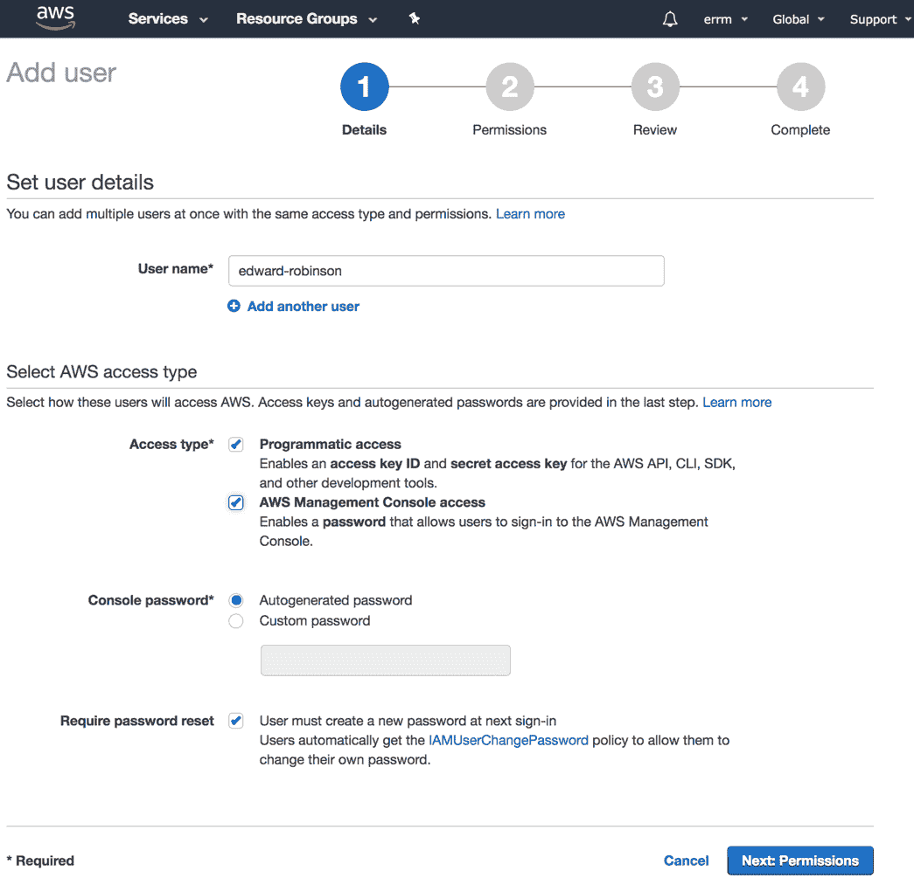
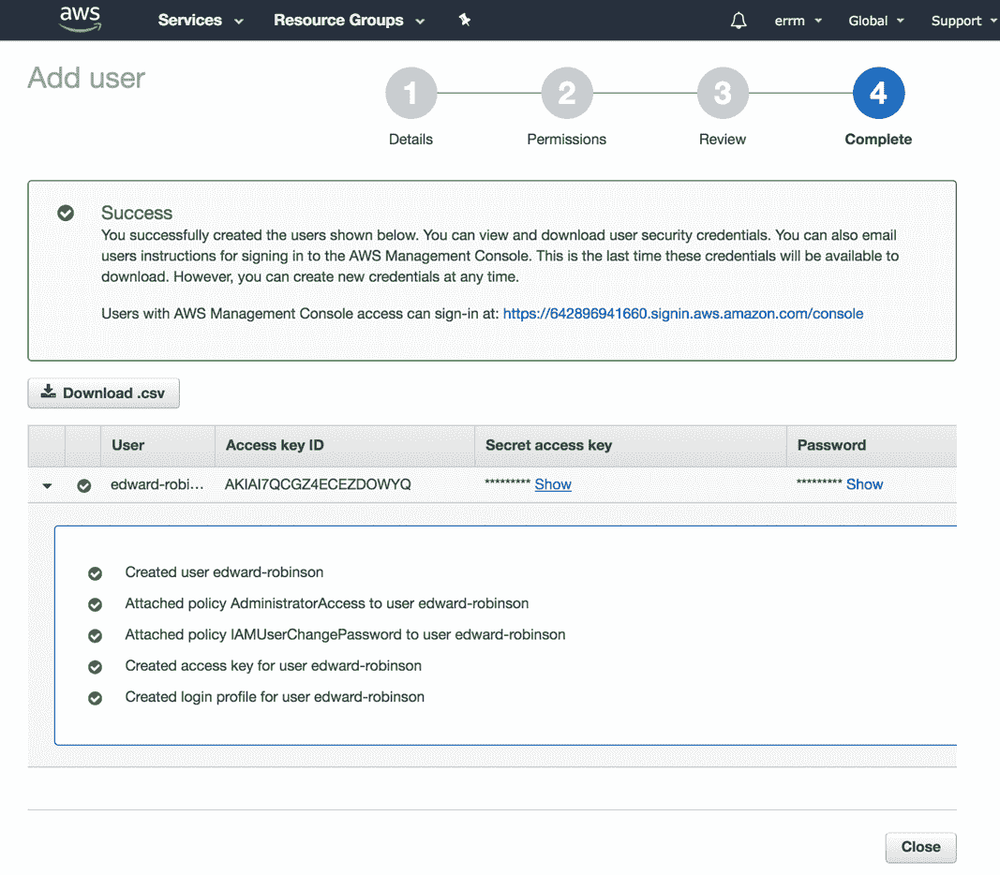
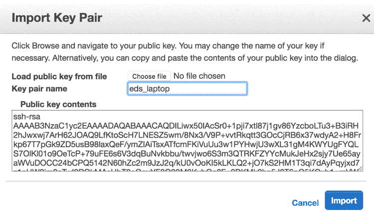

# 三、接触云

在这一章中，我们将学习如何从基本原则出发，构建一个运行在亚马逊网络服务上的 Kubernetes 集群。为了了解 Kubernetes 如何工作，我们将手动启动将形成第一个集群的 EC2 实例，并手动安装和配置 Kubernetes 组件。

我们将构建的集群适合您在学习管理 Kubernetes 和开发可以在 Kubernetes 上运行的应用时使用。有了这些说明，我们的目标是构建最简单的集群，我们可以部署到 AWS。当然，这确实意味着在构建任务关键型应用集群时，有些事情您会希望以不同的方式去做。但是不要担心，第 3 部分有三章“准备投入生产”，我们将介绍您需要了解的一切，以便让您的集群为最苛刻的应用做好准备。

Running a Kubernetes cluster on AWS costs money. The configuration we will cover in our instructions (a basic cluster with one master and one worker node) at the time of writing will cost around US 75 dollars a month. So if you are just using your cluster for experimentation and learning, remember to shut the instances down when you are finished for the day.

If you have finished with the cluster, terminate the instances and make sure that the EBS volumes have been deleted, because you will pay for these storage volumes even if the instances they are attached to have been stopped.

这一章旨在成为一种学习体验，所以请通读并在阅读时键入命令。如果你有这本书的电子书版本，那么抵制复制和粘贴的冲动，因为如果你键入命令并花一些时间理解你在做什么，你会学到更多。有一些工具可以通过运行一个命令来完成本章涵盖的所有内容，但希望一步一步地手动构建您的第一个集群，将为您提供一些有价值的见解，了解让 Kubernetes 集群运转起来需要什么。

# 集群架构

我们将在本章中设置的集群将由两个 EC2 实例组成——一个将运行 Kubernetes 控制平面的所有组件，另一个是您可以用来运行应用的工作节点。

因为我们从头开始，本章还将介绍一种在专用网络中隔离 Kubernetes 集群的方法，同时允许您从自己的工作站轻松访问机器。

我们将通过使用一个额外的实例作为堡垒主机来实现这一点，该实例将允许来自外部世界的传入 SSH 连接，如下图所示。如果您的 AWS 帐户已经有一些可以实现这一点的基础架构，那么请随意跳过这一部分:


The architecture of the cluster you will set up in this chapter

# 创建 AWS 帐户

如果你还没有 AWS 账户，那就去[https://aws.amazon.com/](https://aws.amazon.com/)注册一个吧。在您可以在您的帐户中创建资源之前，您需要向您的帐户添加一张信用卡来支付任何费用。

当您首次注册 AWS 帐户时，您将有资格在最初 12 个月内免费使用某些服务。不幸的是，这个免费层没有提供足够的资源来运行 Kubernetes，但是在本章中，我们已经针对实例的低成本优化了实例的选择，因此您应该能够在不花费太多的情况下遵循示例。

# 创建 IAM 用户

当您注册 AWS 帐户时，您选择的电子邮件地址和密码将用于登录根帐户。在您开始与 AWS 交互之前，最好创建一个 IAM 用户，您将使用它与 AWS 交互。这样做的好处是，如果您愿意，您可以让每个 IAM 用户根据需要访问 AWS 服务。如果您使用根帐户，您将自动拥有完全访问权限，并且无法管理或撤销权限。通过以下步骤设置帐户:

1.  登录 AWS 控制台后，通过单击服务并在搜索框中键入`IAM`进入身份和访问管理仪表板。
2.  从边栏中，选择“用户”以查看您的 AWS 帐户中的 IAM 用户。如果您刚刚设置了一个新帐户，这里还不会有任何用户——根帐户不算用户。
3.  单击屏幕顶部的添加用户按钮，开始设置新用户帐户的过程。

4.  首先为您的用户选择一个用户名。选中这两个框，启用**编程访问**(这样您就可以使用命令行客户端)和 **AWS 管理控制台访问**，这样您就可以登录到网络控制台，如前面的截图所示:



5.  在下一个屏幕上，您可以为您的用户配置权限。选择直接附加现有策略，然后选择管理员访问策略，如下图所示:


6.  检查您的设置，然后点按“创建用户:


7.  创建用户后，记下凭据。您将很快需要**访问密钥 ID** 和**机密访问密钥**来配置 AWS 命令行客户端。还要注意控制台登录链接，因为这是您的 AWS 帐户独有的，如下所示:



8.  为自己设置了 IAM 用户后，在浏览器中注销根帐户，并检查您是否可以使用您的用户名和密码重新登录。

You might want to set up two-factor authentication for your AWS account for greater security. Remember that anyone with Administrator access to the account can access or delete any of the resources in your account.

# 获取命令行界面

您可以使用网络控制台控制 AWS，但是如果您使用 AWS 命令行客户端从命令行执行所有操作，您对 AWS 的控制将更加精确。

您应该按照 AWS 提供的说明在您的系统上安装命令行客户端(或使用您的系统包管理器)，使用在[中找到的说明。](https://docs.aws.amazon.com/cli/latest/userguide/installing.html)

安装命令行客户端后，运行`aws configure`命令，用您的凭据配置命令行界面。该命令将更新主目录中的`aws config`文件。

在这个阶段，您应该为集群选择一个 AWS 区域。对于测试和实验来说，选择一个相对靠近你的位置是有意义的。这样做将在您使用`ssh`或`connect`访问库本内特斯应用编程接口的实例时改善延迟。

# 设置密钥对

当我们启动 EC2 实例时，我们希望能够通过 SSH 访问它。我们可以在 EC2 控制台中注册一个密钥对，以允许我们在实例启动后登录。

我们可以指示 AWS 为您生成一个密钥对(您可以下载)。但是最佳实践是在您的工作站上生成一个密钥对，并将公共部分上传到 AWS。这确保了您(也只有您)可以控制实例，因为密钥的私有部分永远不会离开您自己的机器。要设置密钥对，请执行以下步骤:

1.  您的机器上可能已经有您想要使用的密钥对。您可以通过查看您的`.ssh`目录来检查现有密钥，如下所示:

```
$ ls -la ~/.ssh
total 128
drwx------    6 edwardrobinson  staff    192 25 Feb 15:49 .
drwxr-xr-x+ 102 edwardrobinson  staff   3264 25 Feb 15:49 ..
-rw-r--r--    1 edwardrobinson  staff   1759 25 Feb 15:48 config
-rw-------    1 edwardrobinson  staff   3326 25 Feb 15:48 id_rsa
-rw-r--r--    1 edwardrobinson  staff    753 25 Feb 15:48 
id_rsa.pub
-rw-r--r--    1 edwardrobinson  staff  53042 25 Feb 15:48 
known_hosts  
```

2.  在这个例子中，你可以看到我的`.ssh`目录中有一个密钥对——私钥的默认名称是`id_rsa`，公钥叫做`id_rsa.pub`。
3.  如果您还没有设置密钥对，或者如果您想要创建一个新的密钥对，那么您可以使用`ssh-keygen`命令创建一个新的密钥对，如下所示:

```
$ ssh-keygen -t rsa -b 4096 -C "email@example.com"
Generating public/private rsa key pair.  
```

4.  此命令使用您的电子邮件地址作为标签创建一个新的密钥对。
5.  接下来，选择保存新密钥对的位置。如果您还没有配对钥匙，只需按*进入*将其写入默认位置，如下所示:

```
Enter file in which to save the key (/home/edwardrobinson/.ssh/id_rsa):  
```

6.  接下来，您将被要求输入密码。如果只是按*进入*，那么创建的密钥将没有任何密码保护，如下命令所示。如果您选择密码，请确保您记得它或安全地存储它，因为没有它，您将无法使用您的 SSH 密钥(或访问您的实例)。

```
Enter passphrase (empty for no passphrase):
Enter same passphrase again:
Your identification has been saved in /home/edwardrobinson/.ssh/id_rsa.
Your public key has been saved in /home/edwardrobinson/.ssh/id_rsa.
The key fingerprint is:
SHA256:noWDFhnDxcvFl7DGi6EnF9EM5yeRMfGX1wt85wnbxxQ email@example.com  
```

7.  一旦你的机器上有了一个 SSH 密钥对，你就可以开始把它导入到你的 AWS 帐户中。请记住，您只需要导入密钥对的公共部分。这将在一个以`.pub`扩展名结尾的文件中。

8.  从 AWS EC2 控制台(点击服务，然后搜索 EC2)，从屏幕左侧的菜单中选择**键对**，如下图所示:


9.  在该屏幕中，选择**导入密钥对**会弹出一个对话框，您可以在其中上传您的密钥对，如下图所示:



10.  选择一个可以在 AWS 中识别您的密钥对的名称(我选择了`eds_laptop`)。然后，要么导航到您的按键位置，要么将其文本粘贴到大文本框中，然后单击**导入**。导入钥匙后，您应该会在**钥匙对**页面看到钥匙列表。

如果您在多个区域中使用 AWS，则需要在要启动实例的每个区域中导入一个密钥对。

# 准备网络

我们将在您的 AWS 帐户中设置一个新的 VPC。VPC 或虚拟私有云允许我们拥有一个与 EC2 和互联网的所有其他用户隔离的私有网络，我们可以在其上启动实例。

它提供了一个安全的基础，我们可以用它来为我们的集群构建一个安全的网络，如以下命令所示:

```
$ VPC_ID=$(aws ec2 create-vpc --cidr-block 10.0.0.0/16 --query "Vpc.VpcId" --output text)
```

`VpcId`对你的账户来说是唯一的，所以我要设置一个 shell 变量，我们需要的时候可以用它来引用。您可以从您的帐户中使用`VpcId`进行同样的操作，或者您可能更喜欢在每次需要时直接键入。

本章的其余步骤遵循这种模式，但是如果您不明白发生了什么，不要害怕查看 shell 变量，并将 id 与 AWS 控制台中的资源相关联，如下所示:

```
$ echo $VPC_ID  
```

Kubernetes 根据 AWS 分配给它们的内部 DNS 主机名来命名您的实例。如果我们在 VPC 启用 DNS 支持，那么当使用 VPC 内部提供的 DNS 服务器时，我们将能够解析这些主机名，如下所示:

```
$ aws ec2 modify-vpc-attribute \
    --enable-dns-support \
    --vpc-id $VPC_ID
$ aws ec2 modify-vpc-attribute \
    --enable-dns-hostnames \
    --vpc-id $VPC_ID  
```

Kubernetes 广泛使用 AWS 资源标签，因此它知道可以使用哪些资源，哪些资源由 Kubernetes 管理。这些标签的关键是`kubernetes.io/cluster/<cluster_name>`。对于可能在几个不同集群之间共享的资源，我们使用`shared`值。这意味着 Kubernetes 可以使用它们，但永远不会从您的帐户中删除它们。

我们会将此用于 VPCs 等资源。生命周期完全由 Kubernetes 管理的资源的标签值为`owned`，如果不再需要，Kubernetes 可能会将其删除。Kubernetes 通常在创建资源(如自动扩展组、EBS 卷或负载平衡器中的实例)时自动创建这些标记。

I like to name the clusters I create after famous people from the history of computer science. The cluster I created for this chapter is named after Grace Hopper, who designed the COBOL programming language.

让我们给新的 VPC 添加一个标签，这样 Kubernetes 就可以使用它了，如下命令所示:

```
aws ec2 create-tags \
--resources $VPC_ID \
--tags Key=Name,Value=hopper \
  Key=kubernetes.io/cluster/hopper,Value=shared  
```

当我们创建 VPC 时，会自动创建一个主路由表。我们将在专用子网中使用它进行路由。让我们获取稍后要使用的 ID，如以下命令所示:

```
$ PRIVATE_ROUTE_TABLE_ID=$(aws ec2 describe-route-tables \
    --filters Name=vpc-id,Values=$VPC_ID \
    --query "RouteTables[0].RouteTableId" \
    --output=text) 
```

现在，我们将添加第二个路由表来管理 VPC 公共子网的路由，如下所示:

```
$ PUBLIC_ROUTE_TABLE_ID=$(aws ec2 create-route-table \
  --vpc-id $VPC_ID \
  --query "RouteTable.RouteTableId" --output text)  
```

现在我们将给出路由表的名称，以便以后跟踪它们:

```
$ aws ec2 create-tags \
  --resources $PUBLIC_ROUTE_TABLE_ID \
  --tags Key=Name,Value=hopper-public
$ aws ec2 create-tags \
  --resources $PRIVATE_ROUTE_TABLE_ID \
  --tags Key=Name,Value=hopper-private  
```

接下来，我们将创建两个子网供我们的集群使用。因为我正在`eu-west-1`区域(爱尔兰)创建集群，所以我将在`eu-west-1a`子网中创建这些子网。您应该通过运行`aws ec2 describe-availability-zones`，从您正在使用的区域中为您的集群选择一个可用性区域。在第 3 部分中，我们将学习如何创建跨多个可用性区域的高可用性集群。

让我们首先为只能从我们的专用网络中访问的实例创建一个子网。我们将在 CIDR 区块上使用`/20 netmask`，如下命令所示；这样，AWS 将为我们提供 4089 个 IP 地址，这些地址可分配给我们的 EC2 实例和 Kubernetes 推出的 pods:

```
$ PRIVATE_SUBNET_ID=$(aws ec2 create-subnet \
  --vpc-id $VPC_ID \
  --availability-zone eu-west-1a \
  --cidr-block 10.0.0.0/20 --query "Subnet.SubnetId" \
  --output text)

$ aws ec2 create-tags \
  --resources $PRIVATE_SUBNET_ID \
  --tags Key=Name,Value=hopper-private-1a \
    Key=kubernetes.io/cluster/hopper,Value=owned \
    Key=kubernetes.io/role/internal-elb,Value=1  
```

接下来，让我们将另一个子网添加到相同的可用性区域，如以下命令所示。对于需要从互联网访问的实例，例如公共负载平衡器和堡垒主机，我们将使用此子网:

```
$ PUBLIC_SUBNET_ID=$(aws ec2 create-subnet \
  --vpc-id $VPC_ID \
  --availability-zone eu-west-1a \
 --cidr-block 10.0.16.0/20 --query "Subnet.SubnetId" \
  --output text)

$ aws ec2 create-tags \
 --resources $PUBLIC_SUBNET_ID \
 --tags Key=Name,Value=hopper-public-1a \
    Key=kubernetes.io/cluster/hopper,Value=owned \
    Key=kubernetes.io/role/elb,Value=1  
```

接下来，我们应该将此子网与公共路由表相关联，如下所示:

```
$ aws ec2 associate-route-table \
  --subnet-id $PUBLIC_SUBNET_ID \
  --route-table-id $PUBLIC_ROUTE_TABLE_ID  
```

为了让公共子网中的实例与互联网通信，我们将创建一个互联网网关，将其连接到我们的 VPC，然后向路由表添加一条路由，将去往互联网的流量路由到网关，如下命令所示:

```
$ INTERNET_GATEWAY_ID=$(aws ec2 create-internet-gateway \
    --query "InternetGateway.InternetGatewayId" --output text)

$ aws ec2 attach-internet-gateway \
    --internet-gateway-id $INTERNET_GATEWAY_ID \
    --vpc-id $VPC_ID

$ aws ec2 create-route \
    --route-table-id $PUBLIC_ROUTE_TABLE_ID \
    --destination-cidr-block 0.0.0.0/0 \
    --gateway-id $INTERNET_GATEWAY_ID
```

为了配置私有子网中的实例，我们需要它们能够建立到互联网的出站连接，以便安装软件包等。为了实现这一点，我们将向公共子网添加一个 NAT 网关，然后向专用路由表添加一条路由，用于互联网流量，如下所示:

```
$ NAT_GATEWAY_ALLOCATION_ID=$(aws ec2 allocate-address \
  --domain vpc --query AllocationId --output text)

$ NAT_GATEWAY_ID=$(aws ec2 create-nat-gateway \
  --subnet-id $PUBLIC_SUBNET_ID \
  --allocation-id $NAT_GATEWAY_ALLOCATION_ID \
  --query NatGateway.NatGatewayId --output text)  
```

在此阶段，在创建路由之前，您可能需要等待几分钟来创建 NAT 网关，如以下命令所示:

```
$ aws ec2 create-route \
    --route-table-id $PRIVATE_ROUTE_TABLE_ID \
    --destination-cidr-block 0.0.0.0/0 \
    --nat-gateway-id $NAT_GATEWAY_ID  
```

# 建立堡垒

我们将使用我们准备推出的第一台主机作为堡垒主机，它将允许我们连接到其他服务器，这些服务器只能从我们 VPC 网络的专用端访问。

我们将创建一个安全组来允许 SSH 流量进入这个实例。我们将使用`aws ec2 create-security-group`命令为我们的堡垒主机创建一个安全组，如下命令所示。安全组是 AWS 提供的一种抽象，用于将相关的防火墙规则分组在一起，并将它们应用于主机组:

```
$ BASTION_SG_ID=$(aws ec2 create-security-group \
    --group-name ssh-bastion \
    --description "SSH Bastion Hosts" \
    --vpc-id $VPC_ID \
    --query GroupId --output text)  
```

一旦我们创建了一个安全组，我们就可以给它附加一个规则来允许 SSH 进入端口`22`，如下命令所示。这将允许您使用 SSH 客户端访问您的主机。在这里，我允许从 CIDR 范围`0.0.0.0/0`进入，但是如果您的互联网连接有一个稳定的 IP 地址，您可能想限制访问只有您自己的 IP:

```
$ aws ec2 authorize-security-group-ingress \
  --group-id $BASTION_SG_ID \
  --protocol tcp \
  --port 22 \
  --cidr 0.0.0.0/0  
```

现在我们已经为堡垒主机设置了安全组，我们可以开始启动我们的第一个 EC2 实例了。在本章中，我将使用 Ubuntu Linux(一个流行的 Linux 发行版)。在我们可以启动实例之前，我们需要为我们想要使用的操作系统发现 AMI(亚马逊机器映像)的 ID。

Ubuntu 项目定期向他们的 AWS 帐户发布更新的映像，这些映像可用于启动 EC2 实例。我们可以运行以下命令来发现所需映像的标识:

```
$ UBUNTU_AMI_ID=$(aws ec2 describe-images --owners 099720109477 \
  --filters Name=root-device-type,Values=ebs \
            Name=architecture,Values=x86_64 \
            Name=name,Values='*hvm-ssd/ubuntu-xenial-16.04*' \
  --query "sort_by(Images, &Name)[-1].ImageId" --output text)  
```

我们将使用一个`t2.micro`实例作为堡垒主机(如下命令所示)，因为该实例类型的使用包含在 AWS 免费层中，所以在您设置 AWS 帐户后的前 12 个月，您不必为此付费:

```
$ BASTION_ID=$(aws ec2 run-instances \
  --image-id $UBUNTU_AMI_ID \
  --instance-type t2.micro \
  --key-name eds_laptop \
  --security-group-ids $BASTION_SG_ID \
  --subnet-id $PUBLIC_SUBNET_ID \
  --associate-public-ip-address \
  --query "Instances[0].InstanceId" \
  --output text)  
```

请注意，我们正在传递我们选择使用的子网的标识、我们刚刚创建的安全组的标识以及我们上传的密钥对的名称。

接下来，让我们用一个`Name`标记更新实例，这样我们在查看 EC2 控制台时就可以识别它了，如下命令所示:

```
$ aws ec2 create-tags \
  --resources $BASTION_ID \
  --tags Key=Name,Value=ssh-bastion  
```

实例启动后，您应该能够运行`aws ec2 describe-instances`命令来发现新实例的公共 IP 地址，如下所示:

```
$ BASTION_IP=$(aws ec2 describe-instances \
  --instance-ids $BASTION_ID \
  --query "Reservations[0].Instances[0].PublicIpAddress" \
  --output text)  
```

现在，您应该能够使用 SSH 访问该实例，如下所示:

```
$ ssh ubuntu@$BASTION_IP  
```

登录时，您应该会看到如下消息:

```
Welcome to Ubuntu 16.04.3 LTS (GNU/Linux 4.4.0-1052-aws x86_64)

 * Documentation:  https://help.ubuntu.com
 * Management:     https://landscape.canonical.com
 * Support:        https://ubuntu.com/advantage

  Get cloud support with Ubuntu Advantage Cloud Guest:
        http://www.ubuntu.com/business/services/cloud

 0 packages can be updated.
 0 updates are security updates.

 To run a command as administrator (user "root"), use "sudo <command>".
 See "man sudo_root" for details.

 ubuntu@ip-10-0-26-86:~$  
```

If you saved your key pair as something other than the default `~/.ssh/id_rsa`, you can pass the path to your key using the `-i` flag, as follows:

`**ssh -i ~/.ssh/id_aws_rsa ubuntu@$BASTION_IP**`

As an alternative, you can add the key to your SSH agent first by running the following:

`**ssh-add ~/.ssh/id_aws_rsa**`

# 来往于两地之间的航班（或班车、火车）

只需使用 SSH 就可以将流量从您的工作站转发到专用网络。然而，通过使用`sshuttle`工具，我们可以使通过堡垒实例访问服务器更加方便。

在你的工作站上安装`sshuttle`很简单。

您可以使用自制程序将其安装在 macOS 上，如下所示:

```
brew install sshuttle  
```

您也可以在 Linux 上安装它(如果您安装了 Python)，如下所示:

```
    pip install sshuttle

```

要将流量透明地代理到专用网络中的实例，我们可以运行以下命令:

```
$ sshuttle -r ubuntu@$BASTION_IP 10.0.0.0/16 --dns
[local sudo] Password:
client: Connected.  
```

首先，我们传递我们的`ubuntu@$BASTION_IP`堡垒实例的 SSH 登录细节，然后是我们的 VPC 的 CIDR(因此只有去往专用网络的流量通过隧道)；这可以通过运行`aws ec2 describe-vpcs`找到。最后，我们传递`--dns`标志，以便远程实例的 DNS 服务器能够解析您工作站上的 DNS 查询。

使用`sshuttle`需要输入您的本地 sudo 密码才能设置其代理服务器。

You might want to run `sshuttle` in a separate terminal or in the background so that you still have access to the shell variables we have been using.

我们可以通过尝试通过实例的专用域名登录到实例来验证该设置是否正常工作，如下所示:

```
$ aws ec2 describe-instances \
  --instance-ids $BASTION_ID \
  --query "Reservations[0].Instances[0].PrivateDnsName"

"ip-10-0-21-138.eu-west-1.compute.internal"

$ ssh ubuntu@ip-10-0-21-138.eu-west-1.compute.internal  
```

这将测试您是否可以将域名系统条目从 AWS 提供的专用域名系统解析到您的 VPC 内运行的实例，以及该查询现在返回的专用 IP 地址是否可达。

如果您有任何困难，请检查`sshuttle`是否有任何连接错误，并确保您已经记住在您的 VPC 启用 DNS 支持。

# 实例配置文件

为了让 Kubernetes 利用它与 AWS 云 API 的集成，我们需要设置 IAM 实例概要文件。实例概要文件是 Kubernetes 软件使用 AWS API 进行身份验证的一种方式，也是我们为 Kubernetes 可以采取的操作分配细粒度权限的一种方式。

了解 Kubernetes 正确运行所需的所有权限可能会令人困惑。您可以只设置允许完全访问 AWS 的实例配置文件，但是这将牺牲安全性最佳实践。

每当我们分配安全权限时，我们的目标应该是为我们的软件正确运行授予足够的权限。为此，我整理了一组最小 IAM 策略，这些策略将允许我们的集群正常运行，而不会泄露多余的权限。

您可以在[https://github.com/errm/k8s-iam-policies](https://github.com/errm/k8s-iam-policies)查看这些政策，我在那里记录了每项政策，并简要描述了其目的。

存储库包含一个简单的 shell 脚本，我们可以使用它为集群中的主节点和工作节点创建 IAM 实例配置文件，如下所示:

```
$ curl https://raw.githubusercontent.com/errm/k8s-iam-policies/master/setup.sh -o setup.sh
$ sh -e setup.sh
  {
      "InstanceProfile": {
          "Path": "/",
          "InstanceProfileName": "K8sMaster",
          "InstanceProfileId": "AIPAJ7YTS67QLILBZUQYE",
          "Arn": "arn:aws:iam::642896941660:instance-profile/K8sMaster",
          "CreateDate": "2018-02-26T19:06:19.831Z",
          "Roles": []
      }
  }
  {
      "InstanceProfile": {
          "Path": "/",
          "InstanceProfileName": "K8sNode",
          "InstanceProfileId": "AIPAJ27KNVOKTLZV7DDA4",
          "Arn": "arn:aws:iam::642896941660:instance-profile/K8sNode",
          "CreateDate": "2018-02-26T19:06:25.282Z",
          "Roles": []
      }
  }  
```

# 库比勒软件

我们将启动一个实例，在其中我们将安装组成集群的不同节点所需的所有软件。然后我们将创建一个 AMI，或者亚马逊机器映像，我们可以用它来启动我们集群上的节点。

首先，我们为此实例创建一个安全组，如下所示:

```
$ K8S_AMI_SG_ID=$(aws ec2 create-security-group \
    --group-name k8s-ami \
    --description "Kubernetes AMI Instances" \
    --vpc-id $VPC_ID \
    --query GroupId \
    --output text)
```

为了登录和安装软件，我们需要能够从我们的堡垒主机访问该实例，因此让我们添加一个规则，允许来自`ssh-bastion`安全组中实例的端口`22`上的 SSH 流量，如下所示:

```
$ aws ec2 authorize-security-group-ingress \
    --group-id $K8S_AMI_SG_ID \
    --protocol tcp \
    --port 22 \
    --source-group $BASTION_SG_ID

```

我们只是在这里使用一个`t2.mico`实例，因为我们不需要一个非常强大的实例来安装软件包，如下命令所示:

```
$ K8S_AMI_INSTANCE_ID=$(aws ec2 run-instances \
    --subnet-id $PRIVATE_SUBNET_ID \
    --image-id $UBUNTU_AMI_ID \
    --instance-type t2.micro \
    --key-name eds_laptop \
    --security-group-ids $K8S_AMI_SG_ID \
    --query "Instances[0].InstanceId" \
    --output text) 
```

我们添加了一个`Name`标签，这样我们可以在以后需要时识别该实例，如下所示:

```
$ aws ec2 create-tags \
    --resources $K8S_AMI_INSTANCE_ID \
    --tags Key=Name,Value=kubernetes-node-ami
```

获取实例的 IP 地址，如下所示:

```
$ K8S_AMI_IP=$(aws ec2 describe-instances \
    --instance-ids $K8S_AMI_INSTANCE_ID \
    --query "Reservations[0].Instances[0].PrivateIpAddress" \
    --output text)
```

然后用`ssh`登录，如下:

```
$ ssh ubuntu@$K8S_AMI_IP  
```

现在，我们准备开始使用集群中所有节点都需要的软件和配置来配置实例。首先同步 apt 存储库，如下所示:

```
$ sudo apt-get update  
```

# 码头工人

Kubernetes 可以使用许多容器运行时，但是 Docker 仍然是最广泛使用的。

在安装 Docker 之前，我们将向 Docker 服务添加一个`systemd`插件配置文件，如下所示:

```
/etc/systemd/system/docker.service.d/10-iptables.conf
[Service]
ExecStartPost=/sbin/iptables -P FORWARD ACCEPT  
```

为了让集群中的其他实例可以访问我们的 Kubernetes pods，我们需要为`iptables FORWARD`链设置默认策略，如下命令所示；否则，Docker 会将其设置为`DROP`，Kubernetes 服务的流量将被丢弃:

```
$ sudo mkdir -p /etc/systemd/system/docker.service.d/
$ printf "[Service]\nExecStartPost=/sbin/iptables -P FORWARD ACCEPT" |   sudo tee /etc/systemd/system/docker.service.d/10-iptables.conf
```

Kubernetes 将与 Ubuntu 存储库中包含的 Docker 版本配合良好，因此我们只需安装`docker.io`包就可以安装它，如下所示:

```
$ sudo apt-get install -y docker.io  
```

通过运行以下命令检查 Docker 是否已安装:

```
$ sudo docker version  
```

# 安装 Kubeadm

接下来，我们将安装在该主机上设置 Kubernetes 控制平面所需的包。下面的列表描述了这些包:

*   `kubelet`:Kubernetes 用来控制容器运行时的节点代理。这用于在 Docker 容器中运行控制平面的所有其他组件。
*   `kubeadm`:这个实用程序负责引导一个 Kubernetes 集群。
*   `kubectl`:Kubernetes 命令行客户端，这将允许我们与 Kubernetes API 服务器进行交互。

首先，为托管 Kubernetes 包的 apt 存储库添加签名密钥，如下所示:

```
$ curl -s https://packages.cloud.google.com/apt/doc/apt-key.gpg | sudo apt-key add -
OK  
```

接下来添加 Kubernetes apt 存储库，如下所示:

```
$ sudo apt-add-repository 'deb http://apt.kubernetes.io/ kubernetes-xenial main'  
```

然后，重新同步包索引，如下所示:

```
$ sudo apt-get update  
```

然后，安装所需的软件包，如下所示:

```
$ sudo apt-get install -y kubelet kubeadm kubectl  
```

This will install the latest version of the packages. If you want to pin to a specific version of Kubernetes, try running `apt-cache madison kubeadm` to see the different versions available.

I have prepared this chapter using Kubernetes 1.10\. If, you wanted to install the most recent release of Kubernetes 1.10, you could run the following command:

`**sudo apt-get install kubeadm=1.10.* kubectl=1.10.* kubelet=1.10.***`

# 构建 AMI

现在我们已经完成了在这个实例上安装软件包，我们可以关闭它，如下所示:

```
$ sudo shutdown -h now
Connection to 10.0.13.93 closed by remote host.
Connection to 10.0.13.93 closed.  
```

我们可以使用`create-image`命令来指示 AWS 对实例的根卷进行快照，并使用它来生成 AMI，如下命令所示(在运行该命令之前，您可能需要等待一会儿实例完全停止):

```
$ K8S_AMI_ID=$(aws ec2 create-image \
 --name k8s-1.10.3-001 \
 --instance-id $K8S_AMI_INSTANCE_ID \
 --description "Kubernetes v1.10.3" \
 --query ImageId \ 
 --output text)
```

映像可能需要几分钟才能供您使用，但您可以使用`describe-images`命令检查其状态，如下所示:

```
aws ec2 describe-images \
     --image-ids $K8S_AMI_ID \
     --query "Images[0].State"
```

在构建映像时，您将看到`pending`，但是一旦准备好使用，状态将变为`available`。

# 引导集群

现在我们可以为 Kubernetes 控制平面组件启动一个实例。首先，我们将为这个新实例创建一个安全组，如下所示:

```
$ K8S_MASTER_SG_ID=$(aws ec2 create-security-group \
    --group-name k8s-master \
    --description "Kubernetes Master Hosts" \
    --vpc-id $VPC_ID \
    --query GroupId \
    --output text) 
```

我们需要能够从我们的堡垒主机访问这个实例，以便登录和配置集群。我们将添加一个规则，允许来自`ssh-bastion`安全组中实例的`22`端口上的 SSH 流量，如下所示:

```
$ aws ec2 authorize-security-group-ingress \
    --group-id $K8S_MASTER_SG_ID \
    --protocol tcp \
    --port 22 \
    --source-group $BASTION_SG_ID 
```

现在我们可以启动实例，如下所示:

```
$ K8S_MASTER_INSTANCE_ID=$(aws ec2 run-instances \
    --private-ip-address 10.0.0.10 \
    --subnet-id $PRIVATE_SUBNET_ID \
    --image-id $K8S_AMI_ID \
    --instance-type t2.medium \
    --key-name eds_laptop \
    --security-group-ids $K8S_MASTER_SG_ID \
    --credit-specification CpuCredits=unlimited \
    --iam-instance-profile Name=K8sMaster \
    --query "Instances[0].InstanceId" \
    --output text) 
```

我们应该给实例一个名称，为了确保 Kubernetes 能够将所有资源与我们的集群相关联，我们还将为这个集群添加一个名为`KubernetesCluster`的标签，如下所示:

```
$ aws ec2 create-tags \
  --resources $K8S_MASTER_INSTANCE_ID \
  --tags Key=Name,Value=hopper-k8s-master \
    Key=kubernetes.io/cluster/hopper,Value=owned

$ ssh ubuntu@10.0.0.10  
```

为了确保所有 Kubernetes 组件使用相同的名称，我们应该将主机名设置为与 AWS 元数据服务给出的名称相匹配，如下命令所示。这是因为启用了 AWS 云提供程序的组件使用元数据服务中的名称:

```
$ sudo hostnamectl set-hostname $(curl http://169.254.169.254/latest/meta-data/hostname)
$ hostnamectl status
   Static hostname: ip-10-0-0-10.eu-west-1.compute.internal  
```

为了正确配置 kubelet 以使用 AWS 云提供程序，我们创建了一个`systemd`插入文件，将一些额外的参数传递给 kubelet，如下所示:

```
/etc/systemd/system/kubelet.service.d/20-aws.conf
[Service]
Environment="KUBELET_EXTRA_ARGS=--cloud-provider=aws --node ip=10.0.0.10"
$ printf '[Service]\nEnvironment="KUBELET_EXTRA_ARGS=--cloud-provider=aws --node-ip=10.0.0.10"' | sudo tee /etc/systemd/system/kubelet.service.d/20-aws.conf 
```

添加该文件后，重新加载`systemd`配置，如下所示:

```
$ sudo systemctl daemon-reload
$ sudo systemctl restart kubelet  
```

我们需要为`kubeadm`提供一个配置文件，以便在它将要启动的每个组件上启用 AWS 云供应商。在这里，我们还将`tokenTTL`设置为`0`，如下命令所示；这意味着为允许工作节点加入集群而颁发的令牌不会过期。这一点很重要，因为我们计划使用自动伸缩组来管理我们的员工，并且新节点可能会在一段时间后加入该组:

```
kubeadm.config
apiVersion: kubeadm.k8s.io/v1alpha1
kind: MasterConfiguration
cloudProvider: aws
tokenTTL: "0"  
```

现在我们只需要运行以下命令来引导主机:

```
$ sudo kubeadm init --config=kubeadm.config 
[init] Using Kubernetes version: v1.10.3 .. .
. . .
. . . 
Your Kubernetes master has initialized successfully!
. . .
```

您应该会看到前面的消息，后面跟着一些设置集群其余部分的说明。记下`kubeadm join`命令，因为我们需要它来设置工作节点。

我们可以按照`kubeadm`给出的指令在主机上设置`kubectl`来检查 API 服务器是否正常运行，如下命令所示:

```
$ mkdir -p $HOME/.kube
$ sudo cp -i /etc/kubernetes/admin.conf $HOME/.kube/config
$ sudo chown $(id -u):$(id -g) $HOME/.kube/config  
```

尝试运行`kubectl`版本。如果`kubectl`能够正确连接到主机，那么您应该能够在客户端(`kubectl`)和服务器上看到 Kubernetes 软件的版本，如以下命令所示:

```
$ kubectl version
Client Version: version.Info{Major:"1", Minor:"9", GitVersion:"v1.9.3", GitCommit:"d2835416544f298c919e2ead3be3d0864b52323b", GitTreeState:"clean", BuildDate:"2018-02-07T12:22:21Z", GoVersion:"go1.9.2", Compiler:"gc", Platform:"linux/amd64"}
Server Version: version.Info{Major:"1", Minor:"9", GitVersion:"v1.9.3", GitCommit:"d2835416544f298c919e2ead3be3d0864b52323b", GitTreeState:"clean", BuildDate:"2018-02-07T11:55:20Z", GoVersion:"go1.9.2", Compiler:"gc", Platform:"linux/amd64"}
```

# 刚刚发生了什么？

所以这很简单，对吧？通过运行一个命令，我们使库本内特斯控制飞机启动并运行。

`kubeadm`命令是一个非常棒的工具，因为它消除了正确配置 Kubernetes 的大量猜测。但是，让我们从建立集群开始，做一个短暂的间歇，深入挖掘一下，看看到底发生了什么。

看一下`kubeadm`命令的输出应该会给我们一些线索。

`kubeadm`做的第一件事就是建立私钥基础设施。如果您查看`/etc/kubernetes/pki`目录，您可以看到许多`ssl`证书和私钥，以及用于签署每个密钥对的证书颁发机构。现在，当我们向集群添加工作节点时，它们将能够在 kubelet 和`apiserver`之间建立安全通信。

接下来，`kubedam`将静态 pod 清单写入`/etc/kubernetes/manifests/`目录。这些清单就像你提交给 Kubernetes API 服务器来运行你自己的应用的 pod 定义，但是由于 API 服务器还没有启动，这个定义是由`kubelet`直接从磁盘读取的。

`kubelet`被配置为读取`kubeadm`在`etc/systemd/system/kubelet.service.d/10-kubeadm.conf`创建的`systemd dropin`中的这些静态 pod 清单。在其他配置中，您可以看到以下标志:

```
--pod-manifest-path=/etc/kubernetes/manifests  
```

如果您查看`/etc/kubernetes/manifests/`，您将看到构成控制平面的每个组件的 Kubernetes 吊舱规格，如下表所述:

*   `etcd.yaml`:存储 API 服务器状态的键值存储
*   `kube-apiserver.yaml`:API 服务器
*   `kube-controller-manager.yaml`:控制器管理器
*   `kube-scheduler.yaml`:调度器

最后，一旦应用编程接口服务器启动，`kubeadm`向应用编程接口提交两个附加组件，如下表所述:

*   `kube-proxy`:这是在每个节点上配置 iptables，使服务 IPs 路由正确的过程。它通过一个 DaemonSet 在每个节点上运行。你可以通过运行`kubectl -n kube-system describe ds kube-proxy`来查看这个配置。
*   `kube-dns`:这个过程提供了 DNS 服务器，运行在集群上的应用可以使用该服务器进行服务发现。请注意，在为集群配置 pod 网络之前，它将无法正常运行。您可以通过运行`kubectl -n kube-system describe deployment kube-dns`查看`kube-dns`的配置。

You could try using `kubectl` to explore the different components that make up the Kubernetes control plane. Try running the following commands:
`**$ kubectl -n kube-system get pods**`
`**$ kubectl -n kube-system describe pods**`
`**$ kubectl -n kube-system get daemonsets**`
`**$ kubectl -n kube-system get deployments**`
`**Before you continue with the next section, log out of the master instance, as follows:**`
`**$ exit**`
`**logout**`
`**Connection to 10.0.0.10 closed.**`

# 从您的工作站访问应用编程接口

通过工作站上的`kubectl`可以方便的访问 Kubernetes API 服务器。这意味着您可以向运行在 AWS 上的集群提交您可能已经开发的任何清单。

我们需要允许来自堡垒服务器的流量访问 API 服务器。让我们给`K8S-MASTER`安全组添加一个规则来允许这个流量，如下所示:

```
$ aws ec2 authorize-security-group-ingress \
    --group-id $K8S_MASTER_SG_ID \
    --protocol tcp \
    --port 6443 \
    --source-group $BASTION_SG_ID
```

如果您还没有在工作站上安装 kubectl，请返回[第 2 章](02.html)、*启动您的引擎*，了解如何安装。

现在我们可以从主实例中复制`kubeconfig`文件。

如果您的本地`~/.kube/config`文件中尚未配置任何集群，您可以从主文件中复制该文件，如下所示:

```
$ scp ubuntu@10.0.0.10:~/.kube/config ~/.kube/config  
```

If you already have a cluster configured (for example, minikube), then you may wish to merge the config for your new cluster, or use another file and pass its location to `kubectl` with the `--kubeconfig` flag, or in the `KUBECONFIG` environment variable.

检查您是否可以使用本地`kubectl`连接到应用编程接口服务器，如下所示:

```
$ kubectl get nodes
NAME               STATUS     AGE       VERSION
ip-10-0-9-172...   NotReady   5m        v1.9.3 
```

如果连接有任何问题，请检查`sshuttle`是否仍在运行，以及您是否正确地允许从堡垒主机访问 k8s-master 安全组。

# 设置 pod 网络

你可能已经注意到了，在跑`kubectl get nodes`的时候，`NodeStatus`就是`NotReady`。这是因为我们引导的集群缺少一个基本组件，即允许运行在我们集群上的 pod 相互通信的网络基础设施。

Kubernetes 集群的网络模型与标准 Docker 安装的网络模型有些不同。有许多网络基础设施的实现可以为 Kubernetes 提供集群网络，但是它们都有一些共同的关键属性，如下表所示:

*   每个 pod 都被分配了自己的 IP 地址
*   每个 pod 都可以在没有 NAT 的情况下与集群中的任何其他 pod 通信(不考虑额外的安全策略)
*   在 pod 内部运行的软件看到的内部网络与集群中其他 pod 看到的网络相同，也就是说，它看到的 IP 地址是相同的，并且没有发生端口映射

这种网络布置(对于集群的用户)比 Docker 的标准网络方案简单得多，该方案将容器中的内部端口映射到主机上的其他端口。

然而，它确实需要网络基础设施和 Kubernetes 之间的一些集成。Kubernetes 通过一个名为**容器网络接口** ( **CNI** )的接口来管理这种集成。用 Kubernetes DaemonSet 在集群的每个节点上部署一个 **CNI** 插件很简单。

如果你想了解更多关于 Kubernetes 集群组网的知识，我推荐你在[https://Kubernetes . io/docs/concepts/cluster-administration/networking/](https://kubernetes.io/docs/concepts/cluster-administration/networking/)阅读底层概念的综合文档。

我们将部署一个名为`amazon-vpc-cni-k8s`的 CNI 插件，它将 Kubernetes 与 AWS VPC 网络的本地网络功能集成在一起。这个插件的工作原理是，将二级私有 IP 地址附加到构成我们集群节点的 EC2 实例的弹性网络接口上，然后按照 Kubernetes 的调度将它们分配到每个节点。然后，流量由 AWS VPC 网络结构直接路由到正确的节点。

部署这个插件的过程类似于使用`kubectl`向 Kubernetes API 提交任何其他清单，如以下命令所示:

```
$ kubectl apply -f https://raw.githubusercontent.com/aws/amazon-vpc-cni-k8s/master/config/v1.3/aws-k8s-cni.yaml 
daemonset "aws-node" created
```

您可以通过运行以下命令来监控正在安装和启动的网络插件:

```
$ kubectl -n kube-system describe pods aws-node  
```

我们可以通过再次查看节点状态来检查网络是否已正确设置，如下所示:

```
$ kubectl get nodes
NAME               STATUS    ROLES     AGE       VERSION
ip-172-31-29-230   Ready     master    10m       v1.9.3  
```

# 启动工作节点

我们现在将为工作节点创建一个新的安全组，如下所示:

```
$ K8S_NODES_SG_ID=$(aws ec2 create-security-group \
    --group-name k8s-nodes \
    --description "Kubernetes Nodes" \
    --vpc-id $VPC_ID \
    --query GroupId \
    --output text)  
```

我们将允许通过 bastion 主机访问工作节点，以便登录进行调试，如下所示:

```
$ aws ec2 authorize-security-group-ingress \
    --group-id $K8S_NODES_SG_ID \
    --protocol tcp \
    --port 22 \
    --source-group $BASTION_SG_ID
```

我们希望工作节点上运行的 kubelet 和其他进程能够连接到主节点上的 API 服务器。我们使用以下命令来实现:

```
$ aws ec2 authorize-security-group-ingress \
    --group-id $K8S_MASTER_SG_ID \
    --protocol tcp \
    --port 6443 \
    --source-group $K8S_NODES_SG_ID  
```

由于 kube-dns 加载项可能在主节点上运行，让我们允许来自节点安全组的流量，如下所示:

```
$ aws ec2 authorize-security-group-ingress \
    --group-id $K8S_MASTER_SG_ID \
    --protocol all \
    --port 53 \
    --source-group $K8S_NODES_SG_ID 
```

我们还需要主节点能够连接到 kubelet 公开的 API，以便流式传输日志和其他指标。我们通过输入以下命令来启用此功能:

```
$ aws ec2 authorize-security-group-ingress \
    --group-id $K8S_NODES_SG_ID \
    --protocol tcp \
    --port 10250 \
    --source-group $K8S_MASTER_SG_ID

$ aws ec2 authorize-security-group-ingress \
    --group-id $K8S_NODES_SG_ID \
    --protocol tcp \
    --port 10255 \
    --source-group $K8S_MASTER_SG_ID
```

最后，我们需要允许任何节点上的任何 pod 能够连接到任何其他 pod。我们使用以下命令来实现:

```
$ aws ec2 authorize-security-group-ingress \
    --group-id $K8S_NODES_SG_ID \
    --protocol all \
    --port -1 \
    --source-group $K8S_NODES_SG_ID  
```

为了让工作节点在启动时向主节点注册，我们将创建一个用户数据脚本。

该脚本在节点第一次启动时运行。它进行一些配置更改，然后运行`kubeadm join`，如下命令所示。当我们初始化主机时，您应该注意到`kubeadm join`命令。

```
user-data.sh
#!/bin/bash

set -exuo pipefail
hostnamectl set-hostname $(curl http://169.254.169.254/latest/meta-data/hostname)

cat << EOF $ /etc/systemd/system/kubelet.service.d/20-aws.conf
[Service]
Environment="KUBELET_EXTRA_ARGS=--cloud-provider=aws --node-ip=$(curl http://169.254.169.254/latest/meta-data/local-ipv4)     --node-labels=node-role.kubernetes.io/node="
EOF

systemctl daemon-reload
systemctl restart kubelet

kubeadm join \
  --token fddaf9.1f07b60a8268aac0 \
  --discovery-token-ca-cert-hash sha256:872757bce0df91c2b046b0d8bb5d930bc1ecfa245b14c25ad8a52746cb8b8e8b \
10.0.0.10:6443  
```

首先，我们使用以下命令创建一个启动配置。这就像一个配置模板，自动缩放组将使用它来启动我们的工作节点。许多参数与我们传递给 EC2 运行实例命令的参数相似:

```
$ aws autoscaling create-launch-configuration \
    --launch-configuration-name k8s-node-1.10.3-t2-medium-001 \
    --image-id $K8S_AMI_ID \ --key-name 
  eds_laptop \    
     --security-groups $K8S_NODES_SG_ID \  
     --user-data file://user-data.sh \    
     --instance-type t2.medium \    
     --iam-instance-profile K8sNode \    
     --no-associate-public-ip-address
```

创建启动配置后，我们可以创建一个自动缩放组，如下所示:

```
> aws autoscaling create-auto-scaling-group \
    --auto-scaling-group-name hopper-t2-medium-nodes \
    --launch-configuration-name k8s-node-1.10.3-t2-medium-001 \
    --min-size 1 \
    --max-size 1 \
    --vpc-zone-identifier $PRIVATE_SUBNET_ID \
    --tags Key=Name,Value=hopper-k8s-node \
      Key=kubernetes.io/cluster/hopper,Value=owned \
      Key=k8s.io/cluster-autoscaler/enabled,Value=1  
```

您需要等待几分钟，让自动缩放组启动节点，并等待`kubeadm`将其注册到主节点，如下所示。

```
> kubectl get nodes --watch
NAME              STATUS    AGE       VERSION
ip-10-0-0-10       Ready     37m       v1.10.3
ip-10-0-2-135      Ready     53s       v1.10.3  
```

If your node starts but doesn't join the cluster after a few minutes, try logging into the node and looking at the `cloud-init` log file. The end of this log will include the output from your script.

```
> cat /var/log/cloud-init-output.log  
```

# 演示时间

恭喜你，如果你已经完成了这一章！到目前为止，您应该已经有了一个功能齐全的 Kubernetes 集群，可以用它来更全面地试验和探索 Kubernetes。

让我们通过将一个应用部署到我们的集群来演示我们构建的集群正在工作，如下所示:

```
kubectl apply -f
 https://raw.githubusercontent.com/PacktPublishing/Kubernetes-on-AWS/master/chapter03/demo.yaml
```

这个清单部署了一个简单的 web 应用和一个服务，使用负载平衡器将应用公开给互联网。我们可以使用`kubectl get service`命令查看负载平衡器的公共域名，如下所示:

```
> kubectl get svc demo -o wide  
```

一旦您有了负载平衡器的公共地址，您可能需要等待几分钟，地址才会开始解析。访问浏览器中的地址；您应该会看到如下所示的屏幕:


# 摘要

到目前为止，您应该已经有了一个功能齐全的 Kubernetes 集群，可以用它来更全面地试验和探索 Kubernetes。您的集群配置正确，可以利用 Kubernetes 与 AWS 的许多集成。

虽然有许多工具可以自动化并帮助您在 AWS 上构建和管理 Kubernetes 集群，但希望通过学习如何从头开始完成任务，您将更好地了解支持 Kubernetes 集群所需的网络和计算资源。

在第 3 部分中，我们将基于本章中的知识，讨论需要添加到集群中的其他组件，以使其适合托管生产服务。我们刚刚构建的集群是 Kubernetes 的全功能安装。继续阅读，了解在 Kubernetes 上成功操作生产服务所需的工具和技术:

*   我们将研究您可以采用的工具和程序，以便使用 Kubernetes 有效地管理服务的部署和更新
*   我们将研究您可以采用的策略和工具，以保护您的集群和其上运行的应用
*   我们将看看 Kubernetes 通常用于监控和日志管理的工具
*   我们将研究设计应用和集群的最佳方法，以实现可用性目标