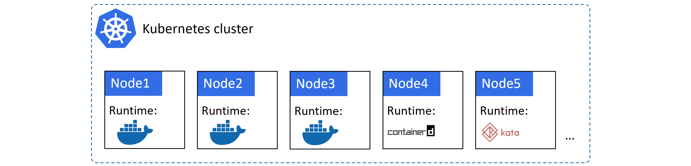
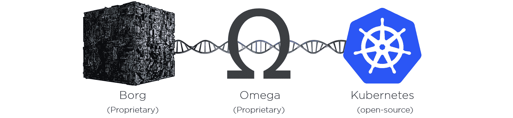

## 1： Kubernetes 入门

本章分为两个主要部分。

*   Kubernetes 背景-它来自哪里等。
*   云操作系统

### 忽必烈的背景

Kubernetes 是一个*应用程序编排器*。在很大程度上，它编排了容器化的云原生微服务应用程序。对于一个充满流行语的句子来说怎么样！

在与 Kubernetes 一起工作时，您会经常遇到这些术语，所以让我们花一分钟来解释每个术语的含义。

#### 什么是管弦乐队

一个*指挥者*是一个部署和管理应用程序的系统。它可以部署您的应用程序并动态响应变化。例如，Kubernetes 可以:

*   部署应用程序
*   根据需求动态上下扩展
*   当事情破裂时自我修复
*   执行零停机滚动更新和回滚
*   更多

库本内特最好的一点是……它可以做到所有这些，而你不必监督或参与决策。很明显，你必须在第一时间设置事情，但是一旦你完成了，你可以坐下来，让库本内特斯发挥它的魔力。

#### 什么是容器应用

一个*容器化应用*是一个在容器中运行的应用。

在我们有容器之前，应用程序在物理服务器或虚拟机上运行。容器是我们打包和运行应用程序的下一个迭代，它们比服务器和虚拟机更快、更轻、更适合现代业务需求。

这样想吧:

*   在开放系统时代(大约在 20 世纪 80 年代和 90 年代)，应用程序在物理服务器上运行
*   在虚拟机时代(2000 年代到 2010 年代)，应用程序在虚拟机中运行
*   云原生时代(现在)应用程序在容器中运行

虽然 Kubernetes 可以编排其他工作负载类型，包括虚拟机和无服务器功能，但它最常用于编排容器化应用程序。

#### 什么是云原生应用

一个*云原生应用*是一个为满足现代业务需求(自动扩展、自我修复、滚动更新等)而设计的应用。)并且可以在 Kubernetes 上运行。

我觉得有一点很重要，那就是明确云原生应用程序不是只能在公共云上运行的应用程序。是的，它们绝对可以在公共云上运行，但是它们可以在任何有 Kubernetes 的地方运行，甚至是您的内部数据中心。

#### 什么是微服务应用

一个*微服务应用程序*是一个商业应用程序，由许多小的专门部分构建而成，这些部分进行通信并形成一个有意义的应用程序。例如，您可能有一个电子商务应用程序，它包含以下所有小型专业组件:

*   web 前端
*   目录服务
*   购物车
*   认证服务
*   日志服务
*   持久存储
*   更多…

这些单独的服务中的每一个都被称为微服务。通常，每个版本都可以由不同的团队编码和管理，每个版本都有自己的发布节奏，并且可以独立于其他版本进行扩展。例如，您可以修补和扩展日志微服务，而不会影响任何其他应用程序组件。

以这种方式构建应用程序是云原生应用程序的一个重要方面。

考虑到所有这些，让我们重新定义这个充满时髦词汇的定义…

Kubernetes 部署和管理(编排)打包并作为容器(容器化)运行的应用程序，这些应用程序以允许它们扩展、自我修复并根据现代业务需求进行内联更新的方式(云原生微服务)构建。

我们将在整本书中大量讨论这些概念，但就目前而言，这应该有助于您理解一些主要的行业流行语。

### 库本内特斯来自哪里

让我们从头开始…

亚马逊网络服务(AWS)给我们带来了现代云计算，改变了世界。从那以后，其他人都在努力追赶。

试图迎头赶上的公司之一是谷歌。谷歌有自己非常好的云，需要一种方法来抽象 AWS 的价值，让潜在客户更容易使用谷歌云。

谷歌有大量大规模处理容器的经验。例如，巨大的谷歌应用程序，如搜索和 Gmail，已经在容器上以极高的规模运行了很多年——早在 Docker 给我们带来易于使用的容器之前。为了协调和管理这些容器应用程序，谷歌有几个内部专有系统。他们从这些内部系统中吸取经验教训，创建了一个名为 Kubernetes 的新平台，并于 2014 年作为开源项目捐赠给新成立的云原生计算基金会(CNCF)。

<figcaption>Figure 1.1</figcaption>

从那时起，Kubernetes 已经成为地球上最重要的云原生技术。

像许多现代云原生项目一样，它是用 Go (Golang)编写的，它是在 GitHub 上公开构建的(在`kubernetes/kubernetes`)，它在 IRC 频道上被积极讨论，你可以在 Twitter(@ kuberneteio)上关注它，`slack.k8s.io`是一个相当不错的 slack 频道。世界各地也有定期的聚会和会议。

#### 库柏人和码头人

Kubernetes 和 Docker 是互补的技术。例如，通常使用 Docker 开发应用程序，并使用 Kubernetes 在生产中编排它们。

在这个模型中，您用自己喜欢的语言编写代码，然后使用 Docker 对其进行打包、测试和发布。但是部署和运行它的最后步骤由 Kubernetes 处理。

在高级别上，您可能有一个带有 10 个节点的 Kubernetes 集群来运行您的生产应用程序。在幕后，每个节点都在运行 Docker 作为其*容器运行时*。这意味着 Docker 是启动和停止容器化应用程序的底层技术。Kubernetes 是更高层次的技术，关注更大的图景，例如；决定在哪些节点上运行容器，决定何时向上或向下扩展，以及执行更新。

图 1.2 显示了一个简单的 Kubernetes 集群，其中一些节点使用 Docker 作为容器运行时。

<figcaption>Figure 1.2</figcaption>

如图 1.2 所示，Docker 并不是 Kubernetes 支持的唯一*容器运行时*。事实上，Kubernetes 有几个抽象容器运行时的特性(使其可互换):

1.  *容器运行时接口(CRI)* 是一个抽象层，它标准化了第三方容器运行时与 Kubernetes 接口的方式。它允许容器运行时代码存在于 Kubernetes 之外，但以一种受支持的标准化方式与之交互。
2.  *运行时类*是在 Kubernetes 1.12 中引入的一个新特性，并在 1.14 中升级为 beta 版。它允许不同的*类*运行时。例如， *gVisor* 或 *Kata Containers* 运行时可能比 *Docker* 和*Containers*运行时提供更好的工作负载隔离。

在撰写本文时，`containerd`正在赶上 Docker，成为 Kubernetes 中最常用的容器运行时。这是 Docker 的精简版，只有 Kubernetes 需要的东西。发音为*容器 dee* 。

虽然所有这些都很有趣，但这些低级的东西不应该影响你的 Kubernetes 学习体验。例如，无论您使用哪个容器运行时，常规的 Kubernetes 命令和模式都将继续正常工作。

#### 库本内斯 vs 道克·斯旺怎么样

在 2016 年和 2017 年，我们经历了*管弦乐团大战*，Docker Swarm、中间层 DCOS 和 Kubernetes 竞相成为事实上的容器管弦乐团。长话短说，库本内特斯赢了。

诚然，Docker Swarm 和其他容器编排器仍然存在，但与 Kubernetes 相比，它们的发展和市场份额都很小。

#### 库本内斯和博格:反抗是徒劳的！

你很有可能会听到人们谈论 Kubernetes 与谷歌的*博格*和*欧米茄*系统之间的关系。

如前所述，谷歌长期以来一直在大规模运行容器——显然每周要处理数十亿个容器。所以，是的，谷歌已经在很多容器上运行了很长时间，比如*搜索*、 *Gmail* 和 *GFS* 。

策划这些容器应用程序是谷歌内部几项名为*博格*和*欧米茄*的技术的工作。因此，与 Kubernetes 建立联系并不困难——这三家公司都在大规模编排容器，而且都与谷歌有关。

然而，重要的是要理解库本内斯**不是*博格*或*欧米茄*的开源版本**。更像是 Kubernetes 与博格和欧米茄分享了自己的 DNA 和家族历史。有点像这样……一开始是博格，博格生了欧米茄。欧米茄*知道*开源社区，并诞生了她的 Kubernetes-)

<figcaption>Figure 1.3 - Shared DNA</figcaption>

重点是，三者是分开的，但三者是相关的。事实上，建造博格和欧米茄的一些人参与了库本内特的建造。因此，尽管 Kubernetes 是从零开始构建的，但它利用了谷歌从博格和欧米茄那里学到的很多东西。

从目前的情况来看，Kubernetes 是 2014 年捐赠给 CNCF 的一个开源项目，它是根据 Apache 2.0 许可证获得许可的，1.0 版本早在 2015 年 7 月就发布了，在撰写本文时，我们已经通过了 1.16 版本。

#### kubernetes–名称是什么

名字**Kubernetes**(koo-ber-net-EEZ)来自希腊单词，意思是*舵手*——驾驶航海船的人。这个主题体现在 logo 上。

<figcaption>Figure 1.4 - The Kubernetes logo</figcaption>

显然，一些参与创造库本内特斯的人想称之为九分之七。如果你了解你的《星际迷航》，你会知道*九分之七*是一个女的**博格人**，在凯瑟琳·珍妮薇船长的指挥下被航海家号的船员救了出来。可悲的是，版权法阻止了它被称为九个中的七个。然而，标志上的七根辐条是九个中的*七个*的尖端。

在继续之前，关于这个名字还有最后一件事。你会经常看到 Kubernetes 缩短为 **K8s** (发音为“Kates”)。数字 8 取代了 **K** 和 **s** 之间的 8 个字符——非常适合我这样的推文和懒人打字员；-)

### 云的操作系统

Kubernetes 已经成为部署和管理云原生应用程序的事实平台。在许多方面，它就像是一个面向云的操作系统。考虑一下:

*   你在服务器上安装一个传统的操作系统(Linux 或 Windows)，操作系统*抽象*物理服务器的资源，*调度*进程等。
*   您在云上安装 Kubernetes，它抽象出云的资源，并安排云原生应用程序的各种微服务

就像 Linux *抽象*不同服务器平台的硬件差异一样，Kubernetes *抽象*不同私有云和公有云之间的差异。最终结果……只要您在运行 Kubernetes，底层系统是在您自己的数据中心、边缘集群还是在公共云中都没有关系。

考虑到这一点，Kubernetes 实现了真正的*混合云*，允许您跨多个不同的公共云和私有云基础架构无缝移动和平衡工作负载。你也可以从不同的云迁移*到*和*，这意味着你今天可以选择一个云，而不必一辈子坚持这个决定。*

#### 云尺度

一般来说，云原生微服务应用程序让我们以前的可扩展性挑战看起来很容易——我们刚刚说过，谷歌每周要经历数十亿个容器！

这很好，但我们大多数人都没有谷歌那么大。我们其他人呢？

嗯……一般来说，如果您的传统应用程序有数百个虚拟机，那么您的容器化云原生应用程序很有可能会有数千个容器。考虑到这一点，我们迫切需要帮助来管理它们。

向忽必烈问好。

此外，我们生活在一个越来越支离破碎的商业和技术世界里，处于不断的混乱状态。考虑到这一点，我们迫切需要一个被广泛接受并隐藏复杂性的框架和平台。

再次向库本内斯问好。

#### 应用程序调度

典型的计算机是 CPU、内存、存储和网络的集合。但是现代操作系统已经做了大量的工作来抽象其中的大部分。例如，有多少开发人员关心他们的应用程序使用哪个 CPU 核心或确切的内存地址？不是很多，我们让操作系统处理类似的事情。这是一件好事，它让应用程序开发的世界变得更加友好。

Kubernetes 对云和数据中心资源做了类似的事情。从高层次来看，云或数据中心是计算、网络和存储的集合。Kubernetes 将其抽象化。这意味着我们不需要硬编码我们的应用程序在哪个节点或存储卷上运行，我们甚至不需要关心它们在哪个云上运行——我们让 Kubernetes 来处理这个问题。命名您的服务器、在电子表格中映射存储卷以及以其他方式将您的基础架构资产视为*宠物*的日子已经一去不复返了。像 Kubernetes 这样的系统不在乎。拿着你的应用说*“在这个特定的节点上，用这个 IP，在这个特定的卷上运行应用的这个部分……”*的日子一去不复返了。在云原生的 Kubernetes 世界里，我们只说*“嘿 Kubernetes，这里有个应用。请将其展开并确保其保持运行…*。

#### 一个简单的类比…

考虑通过快递服务发送货物的过程。

你把货物包装在快递员的标准包装里，贴上标签，交给快递员。快递员负责一切。这包括:所有复杂的物流，包括哪些飞机和卡车，使用哪些高速公路，司机应该是谁等等。他们还提供服务，让你做的事情，如跟踪你的包裹，并作出交付改变。重点是，你唯一要做的就是对商品进行包装和贴标签，快递员把其他的都抽象出来，负责排班和其他物流。

Kubernetes 上的应用程序也是如此。您将应用程序打包为一个容器，给它一个声明性清单，并让 Kubernetes 负责部署它并保持它运行。您还可以获得一套丰富的工具和 API，让您可以内省(观察和检查)您的应用程序。这是一件美好的事情。

### 章节总结

Kubernetes 是谷歌根据多年来大规模运行容器的经验教训创建的。它是作为开源项目捐赠给社区的，现在是部署和管理云原生应用程序的行业标准应用编程接口。它运行在任何云或内部数据中心上，并抽象底层基础架构。这允许您构建混合云，以及在云平台之间轻松迁移。它是在 Apache 2.0 许可下开源的，位于云原生计算基金会(CNCF)内。

小费！

Kubernetes 是一个正在积极开发的快速项目。但不要让这让你分心——拥抱它。**变化是新常态。**

为了帮助您了解最新情况，我建议您订阅我的几个 YouTube 频道:

*   #KubernetesMoment:讨论或解释关于 Kubernetes 的一些事情的每周短视频
*   这个月的库本内斯:所有在库本内斯世界发生的重要事情的每月综述

您还应该查看:

*   我在 nigelpoulton.com 的网站
*   我在 pluralsight.com 和一群古鲁的视频培训课程
*   我在 MSB(msb.com)的实践学习
*   KubeCon 和您当地的 Kubernetes 和云原生会议