## 二、Kubernetes 操作原理

在本章中，您将了解构建 Kubernetes 集群和部署应用所需的主要组件。目的是给你一个主要概念的概述。所以不要担心，如果你不能马上理解所有的东西，我们会在阅读这本书的过程中再次介绍大部分内容。

我们将这一章划分如下:

*   来自 40K 英尺的 Kubernetes 人
*   主节点和节点
*   打包应用
*   声明性配置和所需状态
*   PODS
*   部署
*   服务

### 来自 40K 英尺的 Kubernetes 人

从最高层面来说，Kubernetes 是两件事:

*   运行应用的集群
*   云原生微服务应用的协调者

#### Kubernetes as the cluster

Kubernetes 就像任何其他集群一样——一堆节点和一个控制平面。控制平面公开一个应用编程接口，有一个为节点分配工作的调度程序，状态记录在一个持久存储中。节点是应用服务运行的地方。

将*控制平面*视为集群的大脑，将*节点*视为肌肉，这可能会很有用。在这个类比中，控制平面是大脑，因为它实现了所有重要的功能，如自动缩放和零停机滚动更新。节点是肌肉，因为它们每天都在执行应用代码。

#### 库比涅斯 as an orchestrator

*Orchestrator* 只是一个负责部署和管理应用的系统的高级词汇。

让我们看一个快速的类比。

在现实世界中，足球队是由个人组成的。没有两个人是一样的，每个人在团队中都扮演着不同的角色——有些人防守，有些人进攻，有些人擅长传球，有些人铲球，有些人投篮……教练来了，他或她给每个人一个位置，把他们组织成一个有目的的团队。我们从图 2.1 转到图 2.2。

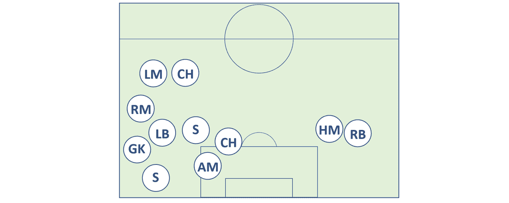

<figcaption>Figure 2.1</figcaption>

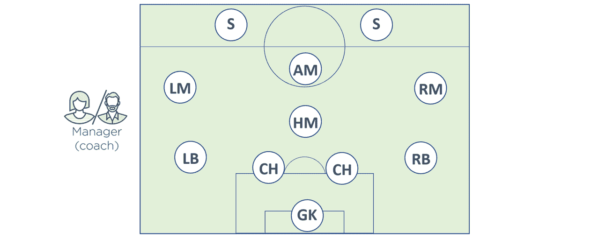

<figcaption>Figure 2.2</figcaption>

教练还确保球队保持队形，坚持比赛计划，并处理任何伤病和其他环境变化。

好吧，你猜怎么着 Kubernetes 上的微服务应用都是一样的。

坚持我的观点…

我们从许多单独的专业服务开始。有些服务于网页，有些进行身份验证，有些执行搜索，还有一些保存数据。Kubernetes 出现了——有点像足球类比中的教练——将一切组织成一个有用的应用，并保持事情顺利进行。它甚至对事件和其他变化做出反应。

在体育界，我们称之为*教练*。在应用世界中，我们称之为*编排*。Kubernetes *协调*云原生微服务应用。

#### 它是如何工作的

为了实现这一点，你从一个应用开始，把它打包并交给集群(Kubernetes)。集群由一个或多个*主节点*和一堆*节点*组成。

大师们，有时被称为*头*或*头节点*，负责集群。这意味着他们做出调度决策、执行监控、实施更改、响应事件等等。由于这些原因，我们通常称大师为*控制平面*。

节点是应用服务运行的地方，我们有时称之为*数据平面*。每个节点都有一条返回到主节点的报告线，并不断监视新的工作分配。

要在 Kubernetes 集群上运行应用，我们遵循以下简单模式:

1.  用我们最喜欢的语言将应用写成小型独立的微服务。
2.  将每个微服务打包到自己的容器中。
3.  将每个容器包装在自己的容器中。
4.  通过更高级别的控制器将 Pods 部署到集群，例如；*部署、任务集、状态集、核心任务等。*

那么，现在……我们离这本书的开始还很近，你还不知道这一切意味着什么。但是，在高级别上，*部署*提供可伸缩性和滚动更新，*daemmonsets*在集群中的每个节点上运行一个服务实例，*statefleset*用于有状态应用组件， *CronJobs* 用于需要在设定时间运行的短期任务。不止这些，但目前这些就够了。

Kubernetes 喜欢以声明的方式管理应用*。这是一种模式，您可以在一组 YAML 文件中描述应用的外观。你`POST`把这些文件交给 Kubernetes，然后在 Kubernetes 让这一切发生的时候坐以待毙。*

 *但并不止于此。因为声明性模式告诉 Kubernetes 应用应该是什么样子，所以 Kubernetes 可以观察它，并确保事情不会偏离您的要求。如果事情不像它应该的那样，Kubernetes 试图修复它。

这就是大局。让我们再深入一点。

### 主节点和节点

Kubernetes 集群由*主节点*和*节点*组成。这些是 Linux 主机，可以是虚拟机(VM)、数据中心的裸机服务器，也可以是私有云或公共云中的实例。

#### 主控(控制平面)

Kubernetes *主节点*是组成集群控制平面的系统服务的集合。

最简单的设置是在一台主机上运行所有主*服务*。但是，这仅适用于实验室和测试环境。对于生产环境，多主机高可用性是**必须具备的。**这就是为什么主要云提供商将高可用性大师作为其*托管的 Kubernetes* 平台的一部分，如 Azure Kubernetes 服务(AKS)、AWS Elastic Kubernetes 服务(EKS)和 Google Kubernetes 引擎(GKE)。

一般来说，建议在高可用性配置中运行 3 或 5 个复制主服务器。

不在 masters 上运行用户应用也被认为是一种好的做法。这使得主机可以完全专注于管理集群。

让我们快速了解一下组成控制平面的不同主服务。

##### 应用编程接口服务器

API 服务器是 Kubernetes 的大中央站。所有组件之间的所有通信都必须通过应用编程接口服务器。我们将在本书的后面讨论细节，但是理解内部系统组件以及外部用户组件都通过同一个 API 进行通信是很重要的。

它公开了一个 RESTful 应用编程接口，您可以通过 HTTPS 向其提供 YAML 配置文件。这些 YAML 文件，我们有时称之为*清单*，包含您的应用的 ***期望状态*** 。这种期望的状态包括以下内容:使用哪个容器映像、公开哪些端口以及运行多少 Pod 副本。

对应用编程接口服务器的所有请求都要经过身份验证和授权检查，但是一旦这些检查完成，YAML 文件中的配置就会得到验证，保存到集群存储中，并部署到集群中。

##### 集群存储

集群存储是控制平面唯一的*有状态*部分，它持久地存储集群的整个配置和状态。因此，它是集群的重要组成部分，没有集群存储就没有集群。

集群存储目前基于流行的分布式数据库 **etcd** 。由于这是集群的唯一真实来源*，您应该在 3-5 个 etcd 副本之间运行以获得高可用性，并且您应该提供足够的方法在出现问题时进行恢复。*

 *关于*可用性*的话题，etcd 更喜欢一致性而不是可用性。这意味着它不能容忍大脑分裂的情况，并将停止对集群的更新以保持一致性。但是，如果 etcd 变得不可用，运行在集群上的应用应该继续工作，您将无法更新任何内容。

与所有分布式数据库一样，数据库写入的一致性至关重要。例如，需要处理来自不同节点的对同一值的多次写入。etcd 使用流行的 RAFT 共识算法来实现这一点。

##### 控制经理

控制器管理器实现所有监视集群和响应事件的后台控制循环。

这是控制器的*控制器，意味着它产生所有独立的控制回路并监控它们。*

一些控制回路包括:节点控制器、端点控制器和复制集控制器。每一个都作为一个后台观察环运行，不断观察应用编程接口服务器的变化——游戏的目的是确保集群的*当前状态*与*期望状态*匹配(稍后将详细介绍)。

每个控制回路实现的逻辑实际上是这样的:

1.  获得所需状态
2.  观察当前状态
3.  确定差异
4.  调和分歧

这个逻辑是 Kubernetes 和声明式设计模式的核心。

每一个控制回路也是极其专门化的，只对 Kubernetes 集群中自己的小角落感兴趣。没有人试图通过实现对系统其他部分的感知来使事情变得过于复杂——每个控制回路都负责自己的业务，而将其他一切都置之不理。这是 Kubernetes 分布式设计的关键，并遵循了从小型专业部件构建复杂系统的 Unix 理念。

> **注:**在整本书中，我们将使用*控制回路、观察回路、*和*调节回路*等术语来表示同一事物。

##### 调度程序

在高层次上，调度器监视应用编程接口服务器的新工作任务，并将它们分配给适当的健康节点。在幕后，它实现了复杂的逻辑，过滤掉不能运行任务的节点，然后对有能力的节点进行排序。排名系统比较复杂，但是选择排名分数最高的节点来运行任务。

当识别能够运行任务的节点时，调度器执行各种谓词检查。这些包括:节点是否被污染，是否有任何相似性或反相似性规则，节点上所需的网络端口是否可用，节点是否有足够的空闲资源等。任何不能运行任务的节点都会被忽略，剩下的节点会根据以下情况进行排名:节点是否已经有了所需的映像，节点有多少空闲资源，节点已经运行了多少任务。每个标准都值点，选择点数最多的节点运行任务。

如果计划程序找不到合适的节点，任务将无法计划，并被标记为挂起。

调度器不负责运行任务，只负责挑选任务将要运行的节点。

##### 云控制器管理器

如果您在受支持的公共云平台上运行集群，例如 AWS、Azure、GCP、DO、IBM Cloud 等。你的控制平面将运行一个*云控制器管理器*。它的工作是管理与底层云技术和服务(如实例、负载平衡器和存储)的集成。例如，如果您的应用需要一个面向互联网的负载平衡器，那么云控制器管理器会参与在您的云平台上配置一个合适的负载平衡器。

##### 控制平面摘要

Kubernetes masters 运行集群的所有控制平面服务。把它想象成集群的大脑，所有的控制和调度决策都是在这里做出的。在幕后，一个主控器是由许多小的专门控制回路和服务组成的。这些包括应用编程接口服务器、集群存储、控制器管理器和调度器。

应用编程接口服务器是控制平面的前端，所有指令和通信都必须通过它。默认情况下，它会在端口 443 上公开一个 RESTful 端点。

图 2.3 显示了 Kubernetes 主机(控制平面)的高级视图。

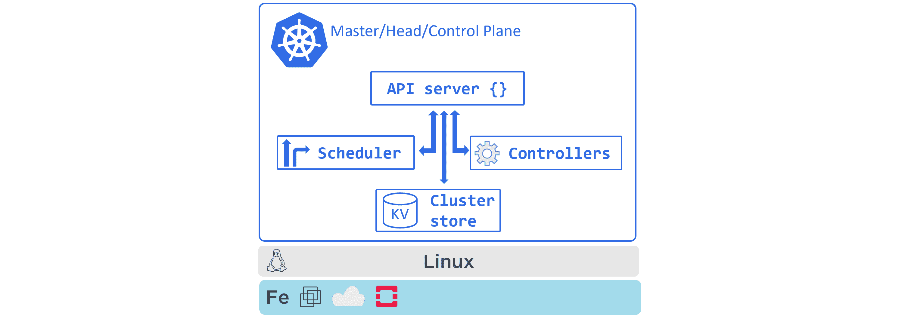

<figcaption>Figure 2.3 - Kubernetes Master</figcaption>

#### 节点

*节点*是 Kubernetes 集群的工作者。在高层，他们做三件事:

1.  关注应用编程接口服务器的新工作分配
2.  执行新的工作分配
3.  向控制平面报告(通过应用编程接口服务器)

从图 2.4 可以看出，它们比*主控*简单一点。

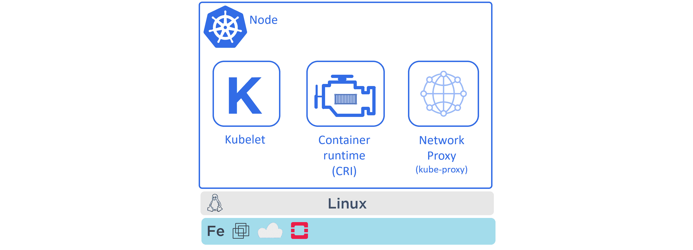

<figcaption>Figure 2.4 - Kubernetes Node (formerly Minion)</figcaption>

让我们看看节点的三个主要组件。

##### KubernetesKubernetesKubernetesKubernetesKubernetesKubernetesKubernetesKubernetesKubernetesKubernetesKubernetesKubernetesKubernetesKubernetesKubernetesKubernetes

库布雷是每个节点上的明星。它是主要的 Kubernetes 代理，运行在集群中的每个节点上。事实上，术语*节点*和*库布雷*互换使用是很常见的。

当您将新节点加入集群时，该过程会将 kubelet 安装到该节点上。kubelet 负责向集群注册该节点。注册可以有效地将节点的 CPU、内存和存储集中到更大的集群池中。

kubelet 的主要工作之一是监视 API 服务器的新工作分配。每当它看到一个，它就执行任务，并维护一个返回控制平面的报告通道。

如果一个 kubelet 不能运行一个特定的任务，它会向主设备报告，并让控制平面决定采取什么行动。例如，如果一个 Kubelet 不能执行一个任务，那么负责寻找另一个节点来运行它的是**而不是**。它只是向控制平面报告，控制平面决定做什么。

##### 容器运行时

Kubelet 需要一个*容器运行时*来执行与容器相关的任务——比如拉映像、启动和停止容器。

在早期，Kubernetes 对一些容器运行时(如 Docker)有本地支持。最近，它转向了一个名为容器运行时接口的插件模型。在高层次上，CRI 屏蔽了 Kubernetes 的内部机制，并为第三方容器运行时提供了一个干净的文档化接口。

Kubernetes 有很多可用的容器运行时。一个流行的例子是`cri-containerd`。这是一个基于社区的开源项目，将 CNCF `containerd`运行时移植到 CRI 接口。它有很多支持，并且正在取代 Docker 成为 Kubernetes 中使用的最流行的容器运行时。

> **注意:** `containerd`(发音为“container-dee”)是从 Docker Engine 中剥离出来的容器监管器和运行时逻辑。它是由多克公司捐赠给 CNCF 的，得到了许多社区的支持。还存在其他符合 CRI 的容器运行时。

##### 多维数据集代理

*节点*拼图的最后一块是 kube-proxy。它在集群中的每个节点上运行，负责本地集群网络。例如，它确保每个节点获得自己唯一的 IP 地址，并实现本地 IPTABLES 或 IPVS 规则来处理 Pod 网络上流量的路由和负载平衡。

### 不可解的 DNA

除了各种控制平面和节点组件，每个 Kubernetes 集群都有一个对运营至关重要的内部 DNS 服务。

集群的 DNS 服务有一个静态 IP 地址，它被硬编码到集群中的每个 Pod 中，这意味着所有容器和 Pod 都知道如何找到它。每个新服务都会自动注册到集群的域名系统，这样集群中的所有组件都可以通过名称找到每个服务。向集群 DNS 注册的一些其他组件是状态集和状态集管理的单个 Pods。

集群 DNS 基于 CoreDNS (https://coredns.io/)。

现在我们已经了解了 masters 和 nodes 的基本原理，让我们换个话题，看看我们是如何打包应用以在 Kubernetes 上运行的。

### kubernetes 打包应用

对于在 Kubernetes 集群上运行的应用，需要勾选几个框。其中包括:

1.  包装成容器
2.  包在豆荚里
3.  通过声明性清单文件部署

事情是这样的……你用自己选择的语言编写一个应用服务。您将其构建到容器映像中，并将其存储在注册表中。此时，应用服务被*容器化*。

接下来，您将定义一个 Kubernetes Pod 来运行容器化应用。在我们所处的这种高层次上，Pod 只是一个包装器，允许容器在 Kubernetes 集群上运行。一旦定义了 Pod，就可以在集群上部署它了。

可以在 Kubernetes 集群上运行独立的 Pod。但首选模式是通过更高级别的控制器部署所有 Pods。最常见的控制器是*部署*。它提供可扩展性、自我修复和滚动更新。您可以在 YAML 清单文件中定义*部署*，具体如下:使用哪个映像以及部署多少副本。

图 2.5 显示了打包为*容器*的应用代码，在*POD*内运行，由*部署*控制器管理。

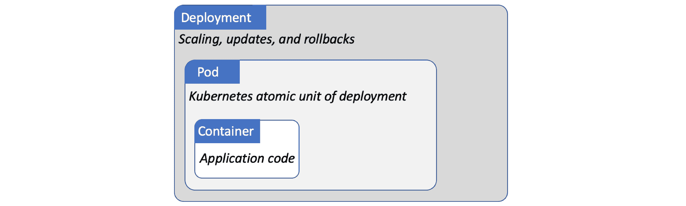

<figcaption>Figure 2.5</figcaption>

一旦在*部署* YAML 文件中定义了所有内容，您就将它作为应用的*期望状态*发布到应用接口服务器，并让 Kubernetes 实现它。

说到理想状态…

### 声明性模型和期望状态

*陈述模型*和*期望状态*的概念是 Kubernetes 的核心。

在 Kubernetes 中，声明性模型是这样工作的:

1.  在清单文件中声明应用(微服务)的所需状态
2.  将其发布到应用编程接口服务器
3.  Kubernetes 将其存储在集群存储中，作为应用的*期望状态*
4.  Kubernetes 在集群上实现所需的状态
5.  Kubernetes 实现了监视循环，以确保应用的*当前状态*不会与*期望的状态*不同

让我们更详细地看看每一步。

清单文件是用简单的 YAML 编写的，它们告诉 Kubernetes 您希望应用是什么样子。这被称为*期望状态*。它包括以下内容:使用哪个映像、运行多少副本、监听哪些网络端口以及如何执行更新。

一旦您创建了清单，您就可以将其`POST`发送到应用编程接口服务器。最常见的方法是使用`kubectl`命令行工具。这将清单作为 HTTP POST 发送到控制平面，通常在端口 443 上。

一旦请求通过身份验证并获得授权，Kubernetes 就会检查清单，识别要将其发送到哪个控制器(例如*部署控制器*，并将配置记录在集群存储中，作为集群整体*期望状态*的一部分。一旦完成这项工作，就可以在集群上安排工作。这包括提取映像、启动容器、构建网络和启动应用进程的艰苦工作。

最后，Kubernetes 利用不断监控集群状态的后台协调循环。如果集群的*当前状态*与*期望状态*不同，Kubernetes 将执行协调问题所需的任何任务。

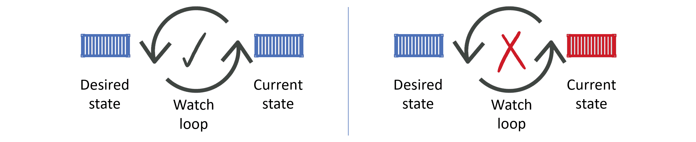

<figcaption>Figure 2.6</figcaption>

重要的是要明白，我们所描述的是传统*命令式模型*的反面。命令式模型是您发布一长串特定于平台的命令来构建东西的地方。

声明性模型不仅比包含大量命令的长脚本简单得多，它还支持自我修复、扩展，并有助于版本控制和自我记录。它通过告诉集群*事情应该是什么样子*来做到这一点。如果他们不再看起来像这样，集群会注意到这种差异，并尽一切努力来调和这种情况。

但是陈述性的故事并没有就此结束——事情变了，事情也变了。当他们这样做时，集群的 ***当前状态*** 不再匹配 ***期望状态*** 。一旦发生这种情况，Kubernetes 就开始行动，并试图让两人恢复和谐。

让我们考虑一个例子。

#### 声明性示例

假设你有一个包含 10 个 web 前端 Pod 副本的应用。如果运行两个副本的节点出现故障，*当前状态*将减少到 8 个副本，但*期望状态*仍为 10 个副本。这将通过一个协调循环来观察，Kubernetes 将安排两个新的副本，使总数恢复到 10 个。

如果您有意增加或减少所需的副本数量，也会发生同样的情况。你甚至可以改变你想要使用的映像。例如，如果应用当前正在使用某个映像的`v2.00`，而您将所需状态更新为使用`v2.01`，Kubernetes 将会注意到这一差异，并完成更新所有副本的过程，以便它们使用新的*所需状态*中指定的新版本。

说清楚。不用写一长串的命令来完成将每个副本更新到新版本的过程，你只需告诉 Kubernetes 你想要新版本，Kubernetes 就会为我们做艰苦的工作。

尽管这看起来很简单，但它非常强大，是 Kubernetes 运作的核心。您给 Kubernetes 一个声明性清单，描述您希望应用是什么样子。这构成了应用所需状态的基础。Kubernetes 控制平面记录它，实现它，并运行后台协调循环，不断检查正在运行的是您所要求的。当当前状态与期望状态匹配时，世界就是一个快乐的地方。如果没有，Kubernetes 就会忙着修复它。

### PODS

在 VMware 世界中，调度的原子单位是虚拟机(VM)。在码头工人的世界里，它是容器。嗯……在 Kubernetes 的世界里，是 ***POD*** 。

Kubernetes 确实运行容器化的应用。但是，您不能直接在 Kubernetes 集群上运行容器，容器必须始终在 Pods 内部运行。

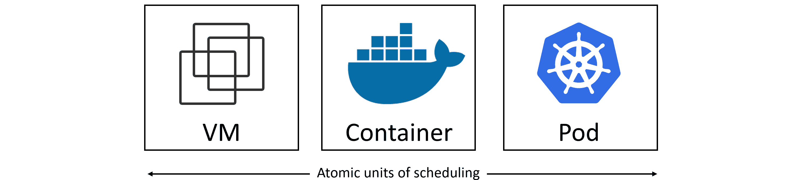

<figcaption>Figure 2.7</figcaption>

#### 豆荚和容器

首先要理解的是术语*荚*来自于一群*鲸*——在英语中我们称一群鲸为*鲸荚*。由于 Docker 的标志是一条鲸鱼，我们称一组容器为 *Pod* 是有道理的。

最简单的模型是每个 Pod 运行一个容器。然而，有一些在单个 Pod 中运行多个容器的高级用例。这些*多容器 POD*超出了我们在这里讨论的范围，但是强大的例子包括:

*   服务网格
*   由拉取最新内容的*助手*容器支持的网络容器
*   带有紧密连接的原木刮刀的容器

关键是，Kubernetes Pod 是运行一个或多个容器的构造。图 2.8 显示了一个多容器 Pod。

<figcaption>Figure 2.8</figcaption>

#### 荚果解剖学

在最高层，一个*POD*是一个运行容器的环形环境。Pod 本身实际上并不运行任何东西，它只是一个托管容器的沙箱。保持它的高层次，你圈住主机操作系统的一个区域，构建一个网络堆栈，创建一堆内核名称空间，并在其中运行一个或多个容器。那是一个豆荚。

如果您在一个 Pod 中运行多个容器，它们都共享同一个 Pod 环境。这包括 IPC 名称空间、共享内存、卷、网络堆栈等。例如，这意味着同一 Pod 中的所有容器将共享相同的 IP 地址(Pod 的 IP)。这如图 2.9 所示。

<figcaption>Figure 2.9</figcaption>

如果同一个 Pod 中的两个容器需要相互对话(Pod 中的容器到容器)，它们可以使用 Pod 的`localhost`界面上的端口，如图 2.10 所示。

<figcaption>Figure 2.10</figcaption>

当您对可能需要共享内存和存储的紧密耦合的容器有要求时，多容器 Pods 是理想的选择。但是，如果您不需要**来紧密耦合您的容器，您应该将它们放在自己的 Pods 中，并通过网络松散耦合它们。这通过让每个 Pod 专注于一个任务来保持事物的干净。它还会产生大量未加密的网络流量。您应该认真考虑使用服务网格来保护 Pods 和应用服务之间的流量。**

#### 作为缩放单位的豆荚

豆荚也是 Kubernetes 的最小调度单位。如果您需要扩展您的应用，您可以添加或删除 Pods。您**不会通过向现有 Pod 添加更多容器来进行**缩放。多容器 Pods 仅适用于两个不同但互补的容器需要共享资源的情况。图 2.11 展示了如何使用多个 Pods 作为缩放单位来缩放应用的`nginx`前端。

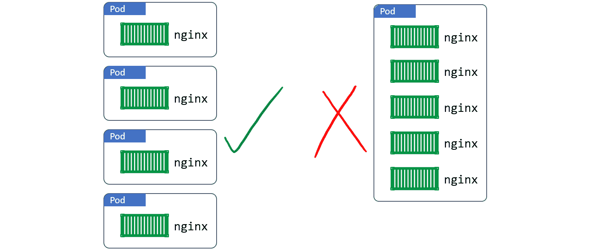

<figcaption>Figure 2.11 - Scaling with Pods</figcaption>

#### Pods -原子操作

Pod 的部署是一个原子操作。这意味着，只有当一个 Pod 的所有容器都启动并运行时，它才被视为准备好服务。从未出现过部分部署的 Pod 服务请求的情况。整个 POD 要么启动并投入使用，要么不启动并失败。

单个 Pod 只能调度到单个节点。多容器 Pod 也是如此——同一 Pod 中的所有容器将在同一节点上运行。

#### Pod 生命周期

豆荚是凡人。他们被创造，他们生存，他们死亡。如果他们意外死亡，你不会让他们起死回生。相反，Kubernetes 在它的位置上开始了一个新的。然而，尽管新的 Pod 看起来、闻起来和感觉上都像旧的，但它不是。这是一个闪亮的新豆荚，有一个闪亮的新身份和 IP 地址。

这对您应该如何设计应用有影响。不要将它们设计成与特定的 Pod 实例紧密耦合。相反，设计它们是为了当 Pods 失败时，一个全新的 Pods(具有新的 ID 和 IP 地址)可以在集群中的其他地方弹出，并无缝地取代它。

### 部署

大多数情况下，您将通过更高级别的控制器间接部署 Pods。高级控制器的例子包括:*部署*、*daemmonsets*和*状态集*。

例如，部署是一个更高级别的 Kubernetes 对象，它围绕一个特定的 Pod，并添加了诸如扩展、零宕机更新和版本回滚等功能。

在幕后，Deployments、DaemonSets 和 StatefulSets 实现了一个控制器和一个监视循环，该循环不断观察集群，确保当前状态与所需状态相匹配。

从 1.2 版本开始，Kubernetes 中就存在部署，并在 1.9 版本中升级到 GA(稳定)。你会经常见到他们。

### 服务和网络稳定联网

我们刚刚得知，Pods 是凡人，可以死亡。但是，如果通过部署或 DaemonSets 进行管理，它们会在出现故障时被替换。但是替换的 IP 地址完全不同。当您执行扩展操作时，也会发生这种情况–向上扩展会添加带有新 IP 地址的新 Pods，而向下扩展会带走现有 Pods。诸如此类的事件造成了大量的知识产权流失。

我要说的是 **Pods 不可靠**，这就带来了挑战……假设你有一个微服务应用，有一堆 Pods 在执行视频渲染。如果应用中需要使用渲染服务的其他部分在需要时不能依赖渲染 Pods，这将如何工作？

这里是*服务*进场的地方。**服务为一组 Pods 提供可靠的网络。**

图 2.12 显示了上传者微服务通过 Kubernetes 服务对象与呈现者微服务对话。Kubernetes 服务提供了一个可靠的名称和 IP，并对其背后的两个渲染器 Pods 请求进行负载平衡。

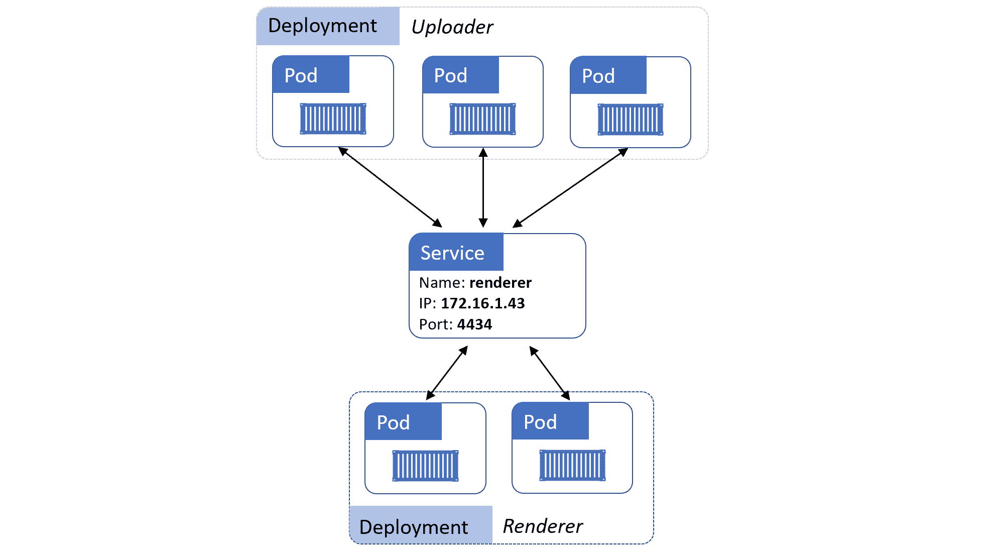

<figcaption>Figure 2.12</figcaption>

深入了解更多细节。服务是 Kubernetes API 中成熟的对象，就像 Pods 和 Deployments 一样。它们有一个由稳定的域名、IP 地址和端口组成的前端。在后端，它们在一组动态的 Pods 上实现负载平衡。随着 Pods 的来去，服务会观察到这一点，自动更新自己，并继续提供稳定的网络端点。

如果您向上或向下缩放 Pods 的数量，同样适用。新的 Pods 无缝添加到服务中，并将接收流量。终止的 Pods 将从服务中无缝移除，并且不会接收流量。

这就是服务的工作——它是一个稳定的网络抽象点，在一组动态的 Pods 上提供 TCP 和 UDP 负载平衡。

由于它们在 TCP 和 UDP 层运行，服务不具备应用智能，不能提供应用层主机和路径路由。为此，您需要一个了解 HTTP 并提供基于主机和路径的路由的入口。

#### 将 POD 连接到服务

服务使用*标签*和*标签选择器*来知道要将流量负载平衡到哪组 Pods。该服务有一个*标签选择器*，它是一个 Pod 必须拥有的所有*标签的列表，这样它才能从该服务接收流量。*

图 2.13 显示了一个服务，该服务被配置为向集群上标记有以下三个标签的所有 Pods 发送流量:

*   zone=prod
*   env=be
*   ver=1.3

图表中的两个 Pods 都有三个标签，因此服务将对它们的流量进行负载平衡。

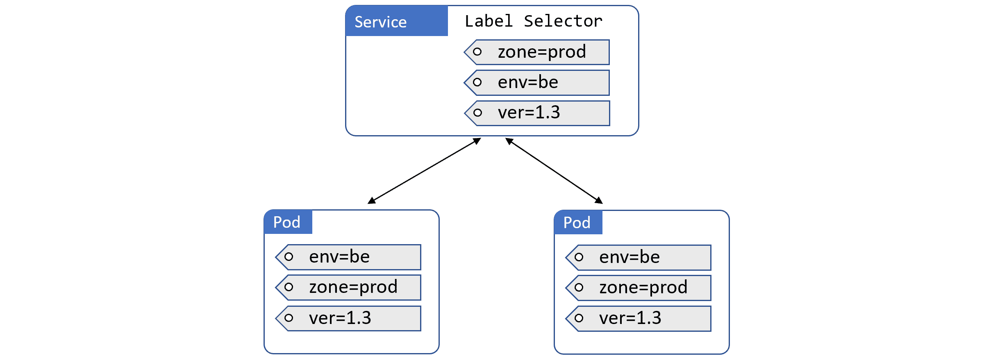

<figcaption>Figure 2.13</figcaption>

图 2.14 显示了类似的设置。但是，右侧的附加 Pod 与服务的标签选择器中配置的标签集不匹配。这意味着服务不会向其加载平衡请求。

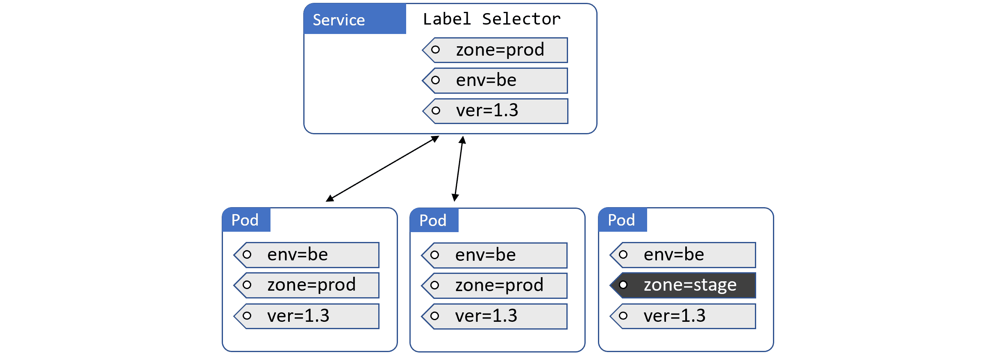

<figcaption>Figure 2.14</figcaption>

关于服务的最后一件事。他们只向健康的豆荚发送流量。这意味着未通过运行状况检查的 Pod 将不会收到来自服务的流量。

这是最基本的。服务给不稳定的 Pods 世界带来了稳定的 IP 地址和 DNS 名称。

### 章节总结

在本章中，我们介绍了 Kubernetes 集群的一些主要组件。

主控器是控制平面组件运行的地方。在幕后，有几个系统服务，包括向集群公开公共 REST 接口的应用编程接口服务器。主节点做出所有的部署和调度决策，多主节点高可用性对于生产级环境非常重要。

节点是用户应用运行的地方。每个节点运行一个名为`kubelet`的服务，该服务向集群注册该节点并与应用编程接口服务器通信。它监视新工作任务的应用编程接口，并维护一个报告通道。节点也有一个容器运行时和`kube-proxy`服务。容器运行时，如 Docker 或 container der，负责所有与容器相关的操作。`kube-proxy`负责节点上的联网。

我们还讨论了一些主要的 Kubernetes API 对象，如 Pods、部署和服务。POD 是基本的构件。部署增加了自我修复、扩展和更新。服务增加了稳定的网络和负载平衡。

既然我们已经介绍了基础知识，那么让我们进入细节。**