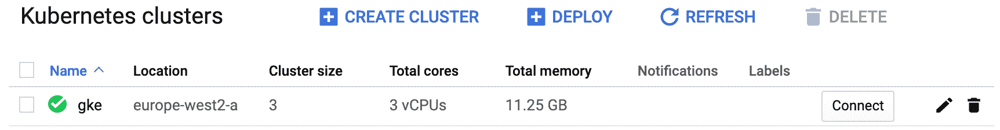

## 3:安装库组件

在本章中，我们将看几个快速安装 Kubernetes 的方法。

有三种典型的方法可以得到 Kubernetes:

1.  测试操场
2.  忽必烈旅社
3.  自己动手安装

### 忽必烈的游乐场

测试操场是获得 Kubernetes 最简单的方法，但它们不是为了生产。常见的例子有*魔法沙盒(msb.com)*、*和Kubernetes(https://labs.play-with-k8s.com/)*一起玩、 *Docker Desktop* 。

使用魔术沙盒，您可以注册一个帐户并登录。就这样，您马上就有了一个可以运行的多节点专用集群。你还可以得到精心策划的课程和实践实验室。

玩 Kubernetes 需要您使用 GitHub 或 Docker Hub 帐户登录，并遵循一些简单的步骤来构建一个持续 4 小时的集群。

Docker Desktop 是 Docker，Inc .提供的免费桌面应用。您可以下载并运行安装程序，只需点击几下鼠标，您的笔记本电脑上就有了一个单节点开发集群。

### 忽必烈旅社

大多数主要的云平台现在都提供自己的*托管 Kubernetes* 服务。在这个模型中，控制平面(masters)组件由您的云平台管理。例如，您的云提供商确保控制平面高度可用、高性能，并处理所有控制平面升级。另一方面，你对版本的控制较少，定制的选择有限。

不考虑利弊，*托管的 Kubernetes* 服务几乎是零工作量的生产级 Kubernetes。事实上，谷歌 Kubernetes 引擎(GKE)让您只需点击几下鼠标，就可以部署生产级 Kubernetes 集群和 Istio 服务网格。其他云提供类似的服务:

*   AWS:弹性立方结构服务(EKS)
*   蓝色:蓝色立方体服务(AK)
*   Linode:库柏发动机 linode(ike)
*   数字海洋:数字海洋立方
*   IBM 云:IBM 云 Kubernetes 服务
*   谷歌云平台:谷歌 Kubernetes 引擎(GKE)

考虑到这些产品，在构建自己的 Kubernetes 集群之前，问自己以下问题:*构建和管理自己的 Kubernetes 集群是否是对时间和其他资源的最佳利用？*如果答案不是**【地狱是】**，我强烈建议你 ***考虑*** 一个托管服务。

### 迪库比厄斯群集

到目前为止，获得 Kubernetes 集群最困难的方法是自己构建一个集群。

是的，DIY 安装比以前容易多了，但仍然很难。然而，它们提供了最大的灵活性，并为您提供了对配置的最终控制，这可能是好事，也可能是坏事。

### 正在安装 kubernetes

获得 Kubernetes 集群的方法多得离谱，我们并不是想展示所有的方法(可能有上百种)。这里显示的方法很简单，我之所以选择它们，是因为它们是获得 Kubernetes 集群的快速而简单的方法，您可以遵循大多数示例。

所有的例子都将在《魔法沙盒》和《GKE》上运行，其中大部分将在其他装置上运行。入口示例和卷可能不适用于 Docker Desktop 和 Play with Kubernetes 等平台。

我们将查看以下内容:

*   与库比涅斯(PWK)游戏
*   Docker 台式机:笔记本电脑上的本地开发集群
*   谷歌 Kubernetes 引擎(GKE):生产级托管集群

### 和忽必烈一起玩

玩Kubernetes(PWK)是一个快速简单的方法，让你的手在开发Kubernetes集群。你只需要一台电脑，一个互联网连接，和一个 Docker Hub 或 GitHub 上的账户。

然而，它有一些需要注意的局限性。

*   这是有时间限制的——你会得到一个持续 4 小时的集群
*   它缺少一些与外部服务的集成，例如基于云的负载平衡器和卷
*   它经常受到容量问题的困扰(它是作为免费服务提供的)

让我们看看它是什么样子的(命令可能略有不同)。

1.  将您的浏览器指向 https://https://labs . play-with-k8s . com/
2.  使用您的 GitHub 或 Docker Hub 帐户登录，然后单击`Start`
3.  Click `+ ADD NEW INSTANCE` from the navigation pane on the left of your browser

    您将在浏览器的右侧看到一个终端窗口。这是一个 Kubernetes 节点(`node1`)。

4.  Run a few commands to see some of the components pre-installed on the node.

    ```
    $ docker version
    Docker version 19.03.11-ce...

    $ kubectl version --output=yaml
    clientVersion:
    ...
      major: "1"
      minor: "18" 
    ```

     `如输出所示，该节点已经预装了 Docker 和`kubectl`(Kubernetes 客户端)。其他工具，包括`kubeadm`，也是预装的。稍后将详细介绍这些工具。

    还值得注意的是，虽然命令提示符是一个`$`，但你实际上是作为`root`运行的。您可以通过运行`whoami`或`id`确认这一点。` 
`*   Run the provided `kubeadm init` command to initialize a new cluster

    当您在步骤 3 中添加一个新实例时，PWK 给了您一个简短的命令列表来初始化一个新的 Kubernetes 集群。其中之一是`kubeadm init...`。运行此命令将初始化一个新集群，并将应用编程接口服务器配置为侦听正确的 IP 接口。

    您可以通过在命令中添加`--kubernetes-version`标志来指定要安装的 Kubernetes 版本。最新版本可以在 https://github.com/kubernetes/kubernetes/releases.看到。并非所有版本都适用于 PWK。

    ```
    $ kubeadm init --apiserver-advertise-address $(hostname -i) --pod-network-cidr...
    [kubeadm] WARNING: kubeadm is in beta, do not use it for prod...
    [init] Using Kubernetes version: v1.18.8
    [init] Using Authorization modes: [Node RBAC]
    <Snip>
    Your Kubernetes master has initialized successfully!
    <Snip> 
    ```

     `恭喜你！您有一个全新的单节点 Kubernetes 集群。您从(`node1`)执行命令的节点被初始化为*主节点*。

    `kubeadm init`的输出给你一个它希望你运行的命令的简短列表。这些将复制 Kubernetes 配置文件并设置权限。你可以忽略这些，因为 PWK 已经为你配置好了。随意在`$HOME/.kube`里面乱逛。` `*   Verify the cluster with the following `kubectl` command.

    ```
    $ kubectl get nodes
    NAME      STATUS     ROLES   AGE       VERSION
    node1     NotReady   master  1m        v1.18.4 
    ```

     `输出显示了一个单节点 Kubernetes 集群。但是，节点的状态是`NotReady`。这是因为你还没有配置*吊舱网络*。当您第一次登录到 PWK 节点时，您得到了三个配置集群的命令。到目前为止，您只执行了第一个(`kubeadm init...`)。` `*   Initialize the Pod network (cluster networking).

    从您第一次创建`node1`时打印在屏幕上的三个命令列表中复制第二个命令(它将是一个`kubectl apply`命令)。将其粘贴到终端中的新行上。在书中，该命令可以换行并插入反斜杠(`\`)。

    ```
    $ kubectl apply -f https://raw.githubusercontent.com...
    configmap/kube-router-cfg created
    daemonset.apps/kube-router created
    serviceaccount/kube-router created
    clusterrole.rbac.authorization.k8s.io/kube-router created
    clusterrolebinding.rbac.authorization.k8s.io/kube-router created 
    ```

    `*   Verify the cluster again to see if `node1` has changed to `Ready` (it may take a few seconds to transition to ready).

    ```
    $ kubectl get nodes
    NAME      STATUS    ROLES   AGE       VERSION
    node1     Ready     master  2m        v1.18.4 
    ```

     `现在 *Pod 网络*已经初始化，控制平面为`Ready`，您可以添加一些工作节点了。` `*   Copy the long `kubeadm join` that was displayed as part of the output from the `kubeadm init` command.

    当您使用`kubeadm init`初始化新集群时，该命令的最终输出列出了添加节点时要使用的`kubeadm join`命令。该命令包括集群加入令牌、应用编程接口服务器正在侦听的 IP 套接字以及将新节点加入集群所需的其他位。复制此命令，并准备将其粘贴到新节点(`node2`)的终端。

    *   单击 PWK 窗口左窗格中的`+ ADD NEW INSTANCE`按钮。`````

 ``你会得到一个新节点`node2`。

1.  将`kubeadm join`命令粘贴到`node2`的终端。

加入令牌和 IP 地址在您的环境中会有所不同。

```
 $ kubeadm join --token 948f32.79bd6c8e951cf122 10.0.29.3:6443...
   Initializing machine ID from random generator.
   [preflight] Skipping pre-flight checks
   <Snip>
   Node join complete:
   * Certificate signing request sent to master and response received.
   * Kubelet informed of new secure connection details. 
```

 `1.  切换回`node1`运行另一个`kubectl get nodes`

```
 $ kubectl get nodes
   NAME      STATUS    ROLES    AGE       VERSION
   node1     Ready     master   5m        v1.18.4
   node2     Ready     <none>   1m        v1.18.4 
```

 `您的 Kubernetes 集群现在有两个节点——一个主节点和一个工作节点。

请随意添加更多节点。

恭喜你！您有一个完全正常工作的 Kubernetes 集群，可以用作测试实验室。

值得指出的是`node1`被初始化为 Kubernetes *主节点*，其他节点将作为* worker 节点*加入集群。PWK 通常在*masters* 旁边放置一个蓝色图标，在*节点*旁边放置一个透明图标。这有助于你识别哪个是哪个。

最后，PWK 会议仅持续 4 小时，显然不打算用于生产。

玩得开心！

### Docker 桌面

*Docker Desktop* 是在 Mac 或 Windows 笔记本电脑上获得本地开发集群的好方法。只需几个简单的步骤，您就可以得到一个单节点 Kubernetes 集群，您可以用它来开发和测试。

它的工作原理是在您的笔记本电脑上创建一个虚拟机，并在该虚拟机内启动一个单节点 Kubernetes 集群。它还为`kubectl`客户端配置了一个允许其与集群对话的上下文。最后，您会得到一个简单的图形用户界面，允许您执行基本操作，例如在所有`kubectl`上下文之间切换。

> **注意:**kube CTL 上下文是一组设置，`kubectl`向哪个集群发送命令以及使用哪个凭据进行身份验证。

1.  将您的网络浏览器指向`www.docker.com`并选择`Products` > `Desktop`。
2.  Follow the links to download for either Mac or Windows.

    您可能需要登录 Docker 商店。账户是免费的，产品也是。

3.  Open the installer and follow the simple installation instructions.

    一旦安装完成，你会在窗口任务栏或苹果电脑菜单栏上看到一个鲸鱼图标。

4.  单击鲸鱼图标(您可能需要右键单击它)，转到`Settings`并从`Kubernetes`选项卡启用 Kubernetes。

您可以打开终端窗口并查看您的集群:

```
$ kubectl get nodes
NAME                 STATUS   ROLES    AGE   VERSION
docker-for-desktop   Ready    master   28d   v1.16.6 
```

 `恭喜，您现在有了一个本地开发集群。

### Google kuble engine(gke)

谷歌 Kubernetes 引擎是一个运行在谷歌云平台(GCP)上的*托管的 Kubernetes* 服务。像大多数*托管的 Kubernetes* 服务一样，它提供:

*   获得生产级 Kubernetes 集群的快速简便方法
*   受控控制平面(您不管理*主设备*
*   分项计费

> **警告:** GKE 等托管 Kubernetes 服务不免费。一些服务可能提供*免费等级*或一定数量的*初始免费信用*。但是，一般来说，你必须付费才能使用它们。

#### 配置 GKE

要与 GKE 合作，你需要在谷歌云上配置一个计费账户和一个空白项目。这些都很容易设置，所以我们不会花时间在这里解释它们——在本节的剩余部分，我们将假设您有这些。

以下步骤将引导您通过网络浏览器配置 GKE。一些细节将来可能会改变，但总体流程将保持不变。

1.  在谷歌云平台(GCP)项目的控制台中，打开左侧的导航窗格，选择`Kubernetes Engine` > `Clusters`。您可能需要单击控制台左上角的三个水平栏(汉堡包)来使导航窗格可见。
2.  Click the `Create cluster` button.

    这将启动向导来创建一个新的 Kubernetes 集群。

3.  给集群一个有意义的名称和描述。
4.  选择您想要的是`Regional`还是`Zonal`簇。区域更新，潜在的弹性更大–您的主节点和节点将分布在多个区域，但仍然可以通过单个高可用性端点进行访问。
5.  为集群选择区域或区域。
6.  Select the `Master version`. This is the version of Kubernetes that will run on your master and nodes. You are limited to the versions available in the drop-down lists. Choose an up-to-date version.

    设置`Master version`的另一种方法是选择*发布频道*，它会影响集群升级到新版本的方式。

7.  此时，您可以在左窗格中指定更多可用的高级选项。其中包括诸如 Nodes 是否将运行 Docker 或 containrd，以及是否启用 Istio 服务网格等内容。探索这些选项是值得的，但是你可以把它们都设为默认值。
8.  一旦你对你的选项满意，点击`Create`。

现在将创建您的集群。

“集群”页面显示了项目中 Kubernetes 集群的高级概述。图 3.1 显示了一个名为`gke`的 3 节点集群。



<figcaption>Figure 3.1</figcaption>

您可以单击群集名称来深入了解更多详细信息。

单击网络用户界面顶部的`> CONNECT`图标，您可以在笔记本电脑上运行一个命令来配置`kubectl`与集群对话。将此命令复制到剪贴板。

只有下载并安装了`gcloud`和`kubectl`，以下步骤才会起作用。它们都可以从这里安装`https://cloud.google.com/sdk/`。

安装配置好`gcloud`后，打开一个终端，将长的`gcloud`命令粘贴进去。这将配置您的`kubectl`客户端与您的新 GKE 集群对话。

运行`kubectl get nodes`命令，列出集群中的节点。

```
$ kubectl get nodes
NAME             STATUS     AGE    VERSION
gke-cluster...   Ready      5m     v1.17.9-gke.1503
gke-cluster...   Ready      6m     v1.17.9-gke.1503
gke-cluster...   Ready      6m     v1.17.9-gke.1503 
```

 `恭喜你！您知道如何使用谷歌 Kubernetes 引擎(GKE)创建生产级 Kubernetes 集群。你也知道如何检查和连接它。

你可以使用这个集群来跟随书中的例子。但是，请务必在使用完 GKE 群集后立即将其删除。GKE 和其他托管 K8s 平台，即使不使用也可能会产生成本。

### 其他安装方法

如前所述，有很多方法可以安装 Kubernetes。其中包括:

*   肺
*   库比德姆

**kops** 是一个固执己见的工具，用于在 AWS 上安装 Kubernetes。术语*固执己见*意味着它想以一种特殊的方式配置 Kubernetes，并且不让您进行太多的定制。如果你需要更多的安装自由，你可能会考虑**kubedam**。

这本书的前几个版本为每种方法专门写了几十页。然而，这种材料极其干燥，难以理解。在这个版本中，我建议读者按照在线指南使用 **kops** 或**Kubernetes**构建 Kubernetes。

### 库布特雷

`kubectl`是 Kubernetes 的主要命令行工具，也是您将用于日常 Kubernetes 管理活动的工具。把`kubectl`想象成*对库本内斯来说可能是有用的。*可用于 Linux、Mac、Windows。

因为它是主要的命令行工具，所以使用比集群高或低不超过一个次要版本的版本是很重要的。例如，如果你的集群运行的是 Kubernetes 1.18.x，你的`kubectl`应该在 1.17.x 到 1.19.x 之间。

在高级别上，`kubectl`将用户友好的命令转换为 API 服务器所需的 JSON 有效负载。它使用一个配置文件来知道`POST`命令指向哪个集群和应用编程接口服务器端点。

`kubectl`配置文件叫`config`，住在`$HOME/.kube`。它包含以下定义:

*   簇
*   用户(凭据)
*   内容

*集群*是`kubectl`知道的集群列表，如果您计划使用单个工作站来管理多个集群，则非常理想。每个集群定义都有一个名称、证书信息和应用编程接口服务器端点。

*用户*允许您定义不同的用户，这些用户在每个集群上可能具有不同的权限级别。例如，您可能有一个*开发*用户和一个*运营*用户，每个用户都有不同的权限。每个*用户*定义都有一个友好的名称、一个用户名和一组凭证。

*上下文*用一个友好的名称将集群和用户聚集在一起。例如，您可能有一个名为`deploy-prod`的上下文，它将`deploy`用户凭证与`prod`集群定义相结合。如果您在这个上下文中使用`kubectl`，您将作为`deploy`用户向`prod`集群的应用编程接口服务器发布命令。

下面是一个简单的`kubectl`配置文件，有一个名为`minikube`的集群，一个名为`minikube`的用户，以及一个名为`minikube`的上下文。`minikube`上下文结合了`minikube`用户和集群，也设置为默认上下文。

```
apiVersion: v1
clusters:
- cluster:
    certificate-authority: C:\Users\nigel\.minikube\ca.crt
    server: https://192.168.1.77:8443
  name: minikube
contexts:
- context:
    cluster: minikube
    user: minikube
  name: minikube
current-context: minikube
kind: Config
preferences: {}
users:
- name: minikube
  user:
    client-certificate: C:\Users\nigel\.minikube\client.crt
    client-key: C:\Users\nigel\.minikube\client.key 
```

 `您可以使用`kubectl config view`命令查看您的`kubectl`配置。敏感数据将从输出中删除。

您可以使用`kubectl config current-context`查看您当前的上下文。以下示例显示了一个系统，其中`kubectl`被配置为向名为`eks-k8sbook`的集群发出命令。

```
$ kubectl config current-context
eks_k8sbook 
```

 `您可以使用`kubectl config use-context`更改当前/活动的上下文。以下命令将当前上下文设置为`docker-desktop`，以便将来的命令将被发送到`docker-desktop`上下文中定义的集群。这显然需要在`kubectl`配置文件中存在一个名为`docker-desktop`的上下文。

```
$ kubectl config use-context docker-desktop
Switched to context "docker-desktop".

$ kubectl config current-context
docker-desktop 
```

 `### 章节总结

在本章中，您看到了获得 Kubernetes 集群的几种方法。

您看到了在 Kubernetes Play(PWK)上设置 Kubernetes 集群是多么快速和简单，在那里您可以获得 4 小时的游乐场，而无需在您的笔记本电脑或云中安装任何东西。

您看到了如何在我们的笔记本电脑上设置 Docker Desktop 以获得出色的单节点开发人员体验。

您学习了如何使用谷歌 Kubernetes 引擎(GKE)在谷歌云中加速托管/托管的 Kubernetes 集群。

本章最后概述了`kubectl`，然后是 Kubernetes 命令行工具。`````````