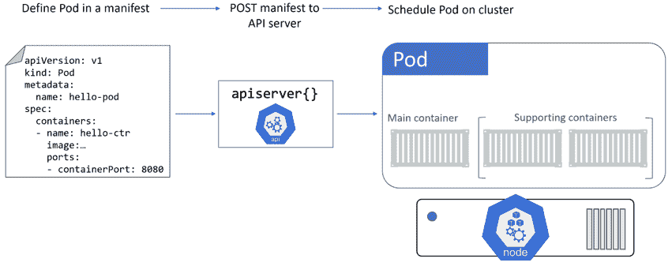
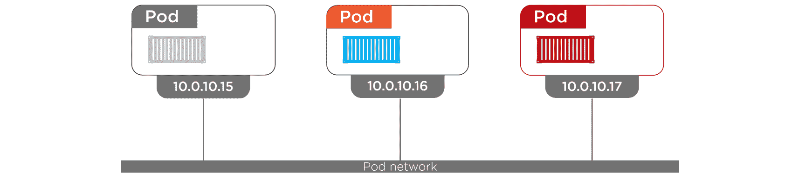
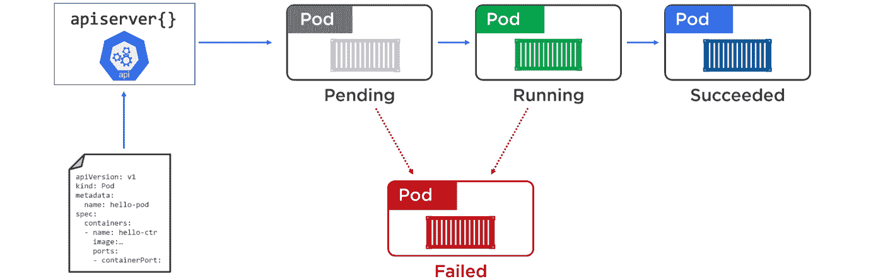

## 4:使用 Pods

我们将把这一章分成两个主要部分:

*   理论
*   动手

让我们继续这个理论。

### Pod 理论

虚拟化世界中的原子调度单元是虚拟机(VM)。这意味着**在虚拟化世界中部署应用程序**是通过在虚拟机上调度它们来完成的。

在 Docker 世界中，原子单位是容器。这意味着**在 Docker 上部署应用程序**是通过在容器内部调度它们来完成的。

在库本内斯世界，原子单位是*吊舱*。因此，**在 Kubernetes 上部署应用程序**意味着在 Pods 中淘汰它们。

这是理解 Kubernetes 的基础，所以一定要在大脑中把它标记为重要>>虚拟化做虚拟机，Docker 做容器， **Kubernetes 做 Pods。**


<figcaption>Figure 4.1</figcaption>

由于 Pods 是 Kubernetes 中的基本部署单元，因此了解它们的工作方式至关重要。

> **注:**这一章我们会讲很多关于 Pods 的内容。然而，不要忽视这样一个事实，即 Pods 只是**部署应用程序**的工具。

#### 吊舱与集装箱

在前一章中，我们说过一个 Pod 承载一个或多个容器。从占用空间的角度来看，这将 Pods 置于容器和虚拟机之间，它们比容器大一点，但比虚拟机小得多。

再深入一点，Pod 是一个用于一个或多个容器的*共享执行环境*。

最简单的模型是每个 Pod 一个容器的模型。然而，多容器 Pods 越来越受欢迎，对于高级配置非常重要。

多容器 Pods 的一个以应用程序为中心的用例是共同调度紧密耦合的工作负载。例如，如果两个共享内存的容器被安排在集群中的不同节点上，它们将无法工作。通过将两个容器放在同一个 Pod 中，您可以确保它们被调度到同一个节点并共享同一个执行环境。

多容器 Pods 的以基础设施为中心的用例是服务网格。在服务网格模型中，代理容器被插入到每个应用程序 Pod 中。这个代理容器处理进出 Pod 的所有网络流量，这意味着它非常适合实现流量加密、网络遥测、智能路由等功能。

#### 多容器吊舱:典型的例子

比较单容器和多容器 Pods 的一个常见例子是使用文件同步器的网络服务器。

在这个例子中，有两个明显的关注点:

1.  服务网页
2.  确保内容是最新的

问题是，是在单个容器中还是在两个独立的容器中解决这两个问题。

在这种情况下，一个*关注*是一个需求或任务。一般来说，微服务设计模式要求我们*分离关注点*。这意味着我们每个集装箱只处理一个问题。

假设前面的例子，这将需要两个容器:一个用于 web 服务，另一个用于文件同步服务。

这种分离关注点的模式有很多优点，包括:

*   不同的团队可以负责两个容器中的每一个
*   每个容器都可以独立缩放
*   每个容器都可以独立开发和迭代
*   每个容器都可以有自己的发布节奏
*   如果一个失败了，另一个继续运行

尽管分离关注点有好处，但通常需要在单个 Pod 中共同调度这些独立的容器。这确保了两个容器被调度到同一个节点，并且共享同一个执行环境(Pod 的环境)。

多容器 Pods 的常见用例包括:需要共享内存或共享一个卷的两个容器(见图 4.2)。


<figcaption>Figure 4.2</figcaption>

与两个容器共享一个卷的最简单方法是将这两个容器配置为同一个 Pod 的一部分。这将确保它们在同一个节点上运行，并且可以访问同一个共享执行环境(包括任何卷)。

总的来说，一般的规则是通过设计容器完成一项工作来分离关注点。最简单的模型为每个 Pod 安排一个容器，但是更高级的用例为每个 Pod 安排多个容器。

#### 我们如何部署 Pods

请记住，Pods 只是执行应用程序的工具。因此，每当我们谈论运行或部署 Pods 时，我们都在谈论运行和部署应用程序。

要将 Pod 部署到 Kubernetes 集群，您可以在*清单文件*和`POST`中定义它，该清单文件将应用编程接口服务器。控制平面验证 YAML 文件的配置，将其作为意图记录写入集群存储，调度程序将其部署到具有足够可用资源的健康节点。该过程对于单容器容器和多容器容器容器是相同的。



<figcaption>Figure 4.3</figcaption>

让我们再深入一点…

#### 豆荚的解剖学

在最高层次上，Pod 是一个或多个容器的共享执行环境。*共享执行环境*意味着 Pod 拥有一组资源，这些资源由作为 Pod 一部分的每个容器共享。这些资源包括:IP 地址、端口、主机名、套接字、内存、卷等等…

如果您使用 Docker 作为容器运行时，Pod 实际上是一种特殊类型的容器，称为**暂停容器**。没错，Pod 只是一个特殊容器的奇特名称。这意味着在 Pods 内部运行的容器实际上是在容器内部运行的容器。更多信息，请观看莱昂纳多·迪卡普里奥主演的克里斯托弗·诺兰《盗梦空间》；-)

不过，说真的，Pod(暂停容器)只是系统资源的集合，运行在其中的容器将继承和共享这些资源。这些系统资源是内核名称空间，包括:

*   **网络命名空间:** IP 地址、端口范围、路由表…
*   **UTS 名称空间:**主机名
*   **IPC 命名空间:** Unix 域套接字…

正如我们刚才提到的，这意味着 Pod 中的所有容器共享一个主机名、IP 地址、内存地址空间和卷。

让我们看看这是如何影响网络的。

#### 豆荚和共享网络

每个 Pod 创建自己的网络命名空间。这包括:单个 IP 地址、单个范围的 TCP 和 UDP 端口以及单个路由表。如果 Pod 只有一个容器，则该容器可以完全访问 IP、端口范围和路由表。如果是多容器 Pod，Pod 中的所有容器将共享 IP、端口范围和路由表。

图 4.4 显示了两个豆荚，每个豆荚都有自己的 IP。即使其中一个是多容器 Pod，它仍然只能获得一个 IP。


<figcaption>Figure 4.4</figcaption>

在图 4.4 中，对容器 1 中的容器的外部访问是通过容器的 IP 地址以及您希望到达的容器端口来实现的。例如，`10.0.10.15:80`会把你带到主容器。容器到容器的通信通过 Pod 的本地主机适配器和端口号工作。例如，主容器可以通过`localhost:5000`到达支撑容器。

最后一次(如果感觉我在重复自己的话，请道歉)…Pod 中的每个容器共享 **Pod 的**整个网络命名空间—IP、`localhost`适配器、端口范围、路由表等等。

然而，正如我们已经说过的，这不仅仅是网络。Pod 中的所有容器都可以访问相同的卷、相同的内存、相同的 IPC 套接字等等。从技术上讲，Pod 保存了所有的名称空间，作为 Pod 一部分的任何容器都继承并共享它们。

这种网络模式使得*Pod 间*的交流变得非常简单。群集中的每个 Pod 都有自己的 IP 地址，这些地址在 *Pod 网络*上是完全可路由的。如果您阅读了关于安装 Kubernetes 的章节，您将会看到我们如何在*玩转 Kubernetes* 和*kubernete*部分的末尾创建 Pod 网络。因为每个 Pod 都有自己的可路由 IP，所以 Pod 网络上的每个 Pod 都可以直接与其他 Pod 对话，而不需要糟糕的端口映射。



<figcaption>Figure 4.5 Inter-Pod communication</figcaption>

如前所述，*吊舱内部*通信——同一吊舱中的两个容器需要通信——可以通过吊舱的`localhost`接口进行。


<figcaption>Figure 4.6 Intra-Pod communication</figcaption>

如果您需要让同一个 Pod 中的多个容器对外部世界可用，您可以在单独的端口上公开它们。每个容器都需要自己的端口，同一个 Pod 中的两个容器不能使用同一个端口。

总之。都是关于**吊舱的！****吊舱**被部署，**吊舱**获得了 IP，**吊舱**拥有所有的名称空间……**吊舱**位于库服务器的中心。

#### Pods 和 cgroups

在高级别上，控制组(cgroups)是一种 Linux 内核技术，它防止单个容器消耗节点上所有可用的 CPU、内存和 IOPS。你可以说 cgroups 积极地*监管*资源的使用。

单个容器有自己的组限制。

这意味着同一个 Pod 中的两个容器可能有自己的一组组限制。这是一个强大而灵活的模型。如果我们采用本章前面的典型多容器 Pod 示例，您可以在文件同步容器上设置一个 cgroup 限制，这样它可以比 web 服务容器访问更少的资源。这可能会降低 web 服务容器的 CPU 和内存不足的风险。

#### 吊舱的原子部署

部署吊舱是一个*原子操作*。这意味着这是一个全有或全无的操作——没有部分部署的 Pod 可以服务请求。这也意味着 Pod 中的所有容器将被安排在同一个节点上。

一旦所有的 Pod 资源都准备好了，Pod 就可以开始服务请求了。

#### Pod 生命周期

典型 Pod 的生命周期是这样的。您在 YAML 清单文件中定义它，并将清单发送到应用编程接口服务器。一旦到达那里，清单的内容作为意图(期望状态)的记录被持久保存到集群存储中，并且 Pod 被调度到具有足够资源的健康节点。一旦它被调度到一个节点，它就进入*挂起*状态，同时节点上的容器运行时下载图像并启动任何容器。吊舱保持在*等待*状态，直到**所有资源**都准备就绪。一旦一切就绪，吊舱进入*运行*状态。一旦它完成了所有的任务，就会被终止并进入*成功*状态。

当吊舱不能启动时，它可以保持在*等待*状态或进入*失败*状态。这些都显示在图 4.7 中。



<figcaption>Figure 4.7 Pod lifecycle</figcaption>

通过 Pod 清单文件部署的 Pod 是*单件*-它们不由控制器管理，该控制器可能会添加自动扩展和自修复功能等功能。出于这个原因，我们几乎总是通过更高级别的控制器来部署 Pods，例如*部署*和*daemmonsets*，因为它们可以在 Pods 失败时重新安排它们。

关于这个话题，重要的是要把 Pods 想象成*凡人*。当他们死了，他们就走了。不可能让他们起死回生。这遵循了*宠物 vs 牛*的类比，Pods 应该被视为*牛*。当他们死了，你用另一个代替他们。没有眼泪，没有葬礼。旧的已经不在了，一个闪亮的新的——配置相同，但 ID 和 IP 不同——神奇地出现并取代了它的位置。

这是您应该设计应用程序的主要原因之一，这样它们就不会在 Pods 中存储*状态*。这也是为什么我们不应该依赖单个 Pod IPs 的原因。单体吊舱不可靠！

#### Pod 理论概述

1.  在库本内特斯，荚是调度的原子单位
2.  一个 Pod 中可以有多个容器。单容器 Pods 是最简单的，但多容器 Pods 非常适合需要紧密耦合的容器。它们也非常适合日志记录和服务网格
3.  Pod 在节点上进行调度–您不能调度单个 Pod 实例跨越多个节点
4.  Pods 以声明方式在清单文件中定义，该清单文件被发布到 API 服务器并由调度程序分配给节点
5.  您几乎总是通过更高级别的控制器部署 Pods

### 用豆荚动手

是时候看看 Pods 的行动了。

对于本章剩余部分的示例，我们将使用图 4.8 所示的 3 节点集群。


<figcaption>Figure 4.8</figcaption>

这个集群在哪里或者它是如何部署的并不重要。重要的是，您将三个 Linux 主机配置到一个 Kubernetes 集群中，该集群至少有一个主节点和两个节点。您还需要安装并配置`kubectl`来与集群对话。

获得 Kubernetes 集群的三种超快速方法包括:

*   注册 msb.com 并访问您自己的私人在线集群(外加大量学习内容)
*   将 Docker Desktop 下载并安装到您的计算机上
*   搜索“与 kubernetes 一起玩”，获得一个临时的在线游乐场

遵循*可组合基础设施*的 Kubernetes 口头禅，您在清单文件中定义 Pods，将它们发布到 API 服务器，并让调度程序在集群上实例化它们。

#### Pod 清单文件

对于本章中的示例，我们将使用以下 Pod 清单。这本书的 GitHub repo 在名为 pod.yml 的`pods`文件夹下有售:

```
apiVersion: v1
kind: Pod
metadata:
  name: hello-pod
  labels:
    zone: prod
    version: v1
spec:
  containers:
  - name: hello-ctr
    image: nigelpoulton/k8sbook:latest
    ports:
    - containerPort: 8080 
```

 `让我们来看看 YAML 文件是怎么描述的。

我们可以直接看到四个顶级资源:

*   `apiVersion`
*   `kind`
*   `metadata`
*   `spec`

`.apiVersion`字段告诉您两件事-*API 组*和 *API 版本*。`apiVersion`通常的格式为`<api-group>/<version>`。然而，Pods 是在一个特殊的 API 组中定义的，该组称为*核心*组，省略了 *api 组*部分。例如，存储类对象在`storage.k8s.io`应用编程接口组的`v1`中定义，在 YAML 文件中描述为`storage.k8s.io/v1`。但是 Pods 在*核心* API 组中，比较特殊，因为省略了 API 组名，所以我们在 YAML 文件中描述为只是`v1`。

一个资源可以在一个应用编程接口组的多个版本中定义。例如`some-api-group/v1`和`some-api-group/v2`。在这种情况下，较新组中的定义可能会包括扩展资源功能的附加功能和字段。想象一下 *apiVersion* 字段定义了模式——更新通常更好。有趣的是，在某些情况下，您可以通过 YAML 文件中的一个版本来部署一个对象，但是当您反思它时，返回值显示它是另一个版本。例如，您可以通过在 YAML 文件中指定`v1`来部署一个对象，但是当您对其运行命令时，返回可能会将其显示为`v1beta1`。这是正常的行为。

总之，Pods 是在`v1`路径上定义的。

`.kind`字段告诉 Kubernetes 正在部署的对象类型。

到目前为止，您知道您正在部署一个在*核心应用编程接口组*的`v1`中定义的 Pod 对象。

`.metadata`部分是您附加名称和标签的地方。这些有助于您识别集群中的对象，并在不同对象之间创建松散耦合。您还可以定义对象应该部署到的命名空间。简而言之，名称空间是一种从逻辑上将集群划分为多个虚拟集群的方法，用于管理目的。在现实世界中，强烈建议使用名称空间，但是，您不应该将它们视为强安全边界。

这个 Pod 清单的`.metadata`部分将 Pod 命名为“你好-pod”，并为它分配了两个标签。标签是简单的键值对，但它们的功能强大得惊人。随着您知识的积累，我们将在后面更多地讨论标签。

由于`.metadata`部分没有指定名称空间，Pod 将被部署到`default`名称空间。在现实世界中使用默认的名称空间并不是一个好的做法，但是对于这些例子来说，这很好。

`.spec`部分是您定义将在 Pod 中运行的容器的地方。这个例子是基于`nigelpoulton/k8sbook:latest`图像部署一个带有单个容器的 Pod。它正在调用集装箱`hello-ctr`并在港口`8080`暴露它。

如果这是一个多容器 Pod，您可以在`.spec`部分定义额外的容器。

#### 清单文件:移情为代码

快速侧步。

配置文件，如 Kubernetes 清单文件，是很好的文档来源。因此，它们有一些次要的好处。其中两个包括:

*   加快新团队成员的入职流程
*   弥合开发人员和运营人员之间的差距

例如，如果您需要一个新的团队成员来理解一个应用程序的基本功能和需求，让他们阅读应用程序的 Kubernetes 清单文件。

此外，如果您的运营团队抱怨开发人员没有给出准确的应用程序需求和文档，请让您的开发人员使用 Kubernetes。Kubernetes 迫使开发人员通过 Kubernetes 清单来描述他们的应用程序，然后操作人员可以使用这些清单来了解应用程序是如何工作的，以及它对环境的要求。

尼马尔·梅塔在他 2017 年题为“坚定的信念，松散地持有:将同理心带入信息技术”的 DockerCon 演讲中，将这些好处描述为一种“像代码一样的同理心”。

我理解将 YAML 文件描述为*“移情为代码”*听起来有点极端。然而，这个概念也有优点——它们确实有帮助。

回到正轨…

#### 从清单文件部署 Pods

如果您正在跟随示例，请将清单文件保存为当前目录中的`pod.yml`，然后使用以下`kubectl`命令将清单发布到应用编程接口服务器。

```
$ kubectl apply -f pod.yml
pod/hello-pod created 
```

 `尽管 Pod 显示为已创建，但它可能尚未完全部署和可用。这是因为拉图像需要时间。

运行`kubectl get pods`命令检查状态。

```
$ kubectl get pods
NAME        READY    STATUS             RESTARTS   AGE
hello-pod   0/1      ContainerCreating  0          9s 
```

 `您可以看到容器仍在创建中——可能正在等待从 Docker Hub 中提取图像。

您可以将`--watch`标志添加到`kubectl get pods`命令中，这样您就可以对其进行监控，并查看状态何时变为`Running`。

恭喜你！您的 Pod 已被安排到集群中的一个健康节点，并由本地`kubelet`进程监控。`kubelet`进程是运行在节点上的 Kubernetes 代理。

在未来的章节中，您将看到如何连接到在 Pod 中运行的网络服务器。

#### 反思跑步吊舱

虽然`kubectl get pods`命令不错，但细节上有点轻。不过，不用担心，有很多选项可以让你更深刻地反省。

首先，`kubectl get`命令提供了几个非常简单的标志，可以为您提供更多信息:

`-o wide`标志给出了更多的列，但仍然是单行输出。

`-o yaml`标志将事情带入下一个层次。这将从集群存储中返回 Pod 清单的完整副本。输出大致分为两部分:

*   期望状态(`.spec`)
*   当前观察状态(`.status`)

以下命令显示了`kubectl get pods -o yaml`命令的剪切版本。

```
$ kubectl get pods hello-pod -o yaml
apiVersion: v1
kind: Pod
metadata:
  annotations:
    kubectl.kubernetes.io/last-applied-configuration: |
      ...
  name: hello-pod
  namespace: default
spec:  #Desired state
  containers:
  - image: nigelpoulton/k8sbook:latest
    imagePullPolicy: Always
    name: hello-ctr
    ports:
status:  #Observed state
  conditions:
  - lastProbeTime: null
    lastTransitionTime: 2019-11-19T15:24:24Z
    state:
      running:
        startedAt: 2019-11-19T15:26:04Z
... 
```

 `请注意，输出包含的值比您最初在 13 行 YAML 文件中设置的值要多。这些额外的信息来自哪里？

两个主要来源:

*   Kubernetes Pod 对象的设置比我们在清单中定义的要多得多。Kubernetes 会自动用默认值扩展那些没有显式设置的。
*   当您使用`-o yaml`运行`kubectl get pods`时，您将获得吊舱*当前观察状态*及其*期望状态*。这个观察到的状态列在`.status`部分。

#### 忽必烈描述

另一个伟大的库本内特自省命令是`kubectl describe`。这提供了一个格式良好的对象多行概述。它甚至包括一些重要的对象生命周期事件。以下命令描述了 hello-pod Pod 的状态。

```
$ kubectl describe pods hello-pod
Name:         hello-pod
Namespace:    default
Node:         k8s-slave-lgpkjg/10.48.0.35
Start Time:   Tue, 19 Nov 2019 16:24:24 +0100
Labels:       version=v1
              zone=prod
Status:       Running
IP:           10.1.0.21
Containers:
  hello-ctr:
    Image:          nigelpoulton/k8sbook:latest
    Port:           8080/TCP
    Host Port:      0/TCP
    State:          Running
Conditions:
  Type           Status
  Initialized    True
  Ready          True
  PodScheduled   True
...
Events:
  Type    Reason     Age   Message
  ----    ------     ----  -------
  Normal  Scheduled  2m   Successfully assigned...
  Normal  Pulling    2m   pulling image "nigelpoulton/k8sbook:latest"
  Normal  Pulled     2m   Successfully pulled image
  Normal  Created    2m   Created container
  Normal  Started    2m   Started container 
```

 `输出被剪掉，以帮助它适合这本书。

#### kubectl exec:在 Pods 中运行命令

另一种反思正在运行的 Pod 的方法是登录它或在其中执行命令。您可以使用`kubectl exec`命令完成这两项操作。以下示例显示了如何在`hello-pod`吊舱的第一个容器中执行`ps aux`命令。

```
$ kubectl exec hello-pod -- ps aux
PID   USER     TIME   COMMAND
  1   root     0:00   node ./app.js
 11   root     0:00   ps aux 
```

 `您也可以使用`kubectl exec`登录在 Pods 中运行的容器。当您这样做时，您的终端提示将会改变，以指示您的会话现在正在 Pod 中的容器内运行，并且您将能够从那里执行命令(只要命令二进制文件安装在容器中)。

以下`kubectl exec`命令将登录到`hello-container`吊舱中的第一个容器。进入容器后，安装`curl`实用程序并运行`curl`命令，从监听端口`8080`传输数据。

```
$ kubectl exec -it hello-pod -- sh

# apk add curl
<Snip>

# curl localhost:8080
<html><head><title>Pluralsight Rocks</title><link rel="stylesheet" href="http://netdna.bootstrapcdn.co\
m/bootstrap/3.1.1/css/bootstrap.min.css"/></head><body><div class="container"><div class="jumbotron"><\
h1>Yo Pluralsighters!!!</h1><p>Click the button below to head over to my podcast...</p><p> <a href="ht\
tp://intechwetrustpodcast.com" class="btn btn-primary">Podcast</a></p><p></p></div></div></body></html\
> 
```

 ``-it`标志使`exec`会话具有交互性，并将终端上的标准输入和标准输出连接到 Pod 中第一个容器内的标准输入和标准输出。当命令完成时，您的 shell 提示符将会改变，以指示您的 shell 现在已连接到容器。

如果您正在运行多容器 Pods，您将需要向`kubectl exec`命令传递`--container`标志，并给它一个您想要与之创建 exec 会话的容器的名称。如果不指定此标志，该命令将对 Pod 中的第一个容器执行。您可以使用`kubectl describe pods <pod>`命令查看 Pod 中容器的顺序和名称。

#### 立方结构日志

另一个用于内省 Pods 的有用命令是`kubectl logs`命令。与其他与 Pod 相关的命令一样，如果不使用`--container`按名称指定容器，它将针对 Pod 中的第一个容器执行。命令的格式是`kubectl logs <pod>`。

很明显，Pods 的内容远不止我们所介绍的内容。然而，你已经学到了足够的东西，可以开始了。

通过键入`exit`退出容器内的执行会话，然后运行`kubectl delete`删除 Pod 来清理实验室。

```
# exit
$ kubectl delete -f pod.yml
pod "hello-pod" deleted 
```

 `### 章节总结

在本章中，您了解到库本内斯世界中的原子部署单位是*吊舱*。每个 Pod 由一个或多个容器组成，并部署到集群中的单个节点。部署操作是一个全有或全无的*原子操作*。

Pods 是使用 YAML 清单文件以声明方式定义和部署的，通常通过部署等更高级别的控制器来部署它们。您使用`kubectl`命令将清单`POST`发送到应用编程接口服务器，它被存储在集群存储中，并被转换为 PodSpec，该 PodSpec 被调度到具有足够可用资源的健康集群节点。

工作节点上接受 PodSpec 的进程是`kubelet`。这是运行在集群中每个节点上的主 Kubernetes 代理。它接受 PodSpec 并负责拉取所有图像和启动 Pod 中的所有容器。

如果您将单例 Pod(不是通过控制器部署的 Pod)部署到您的集群，并且它运行的节点出现故障，则单例 Pod 不会在另一个节点上重新调度。因此，您几乎总是通过更高级别的控制器来部署 Pods，例如部署和 DaemonSets。这些增加了自我修复和回滚等功能，这些功能是 Kubernetes 如此强大的核心。````````