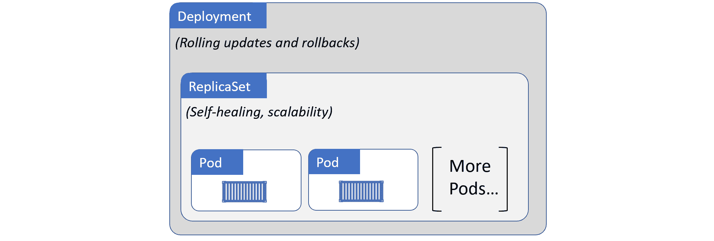
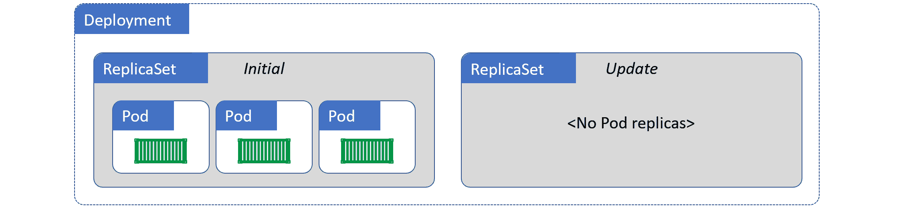
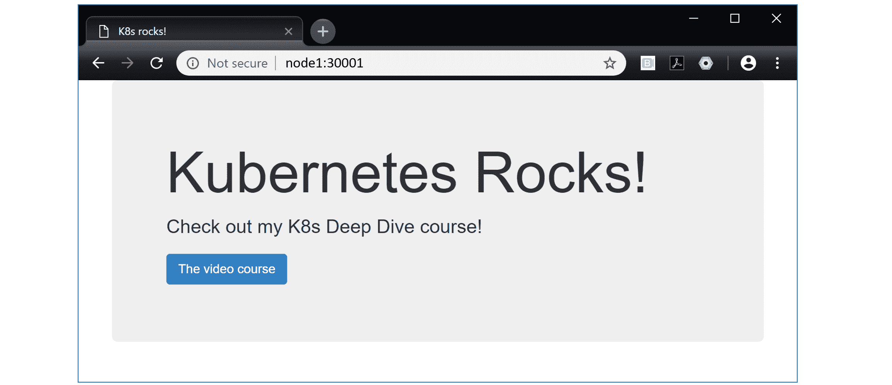
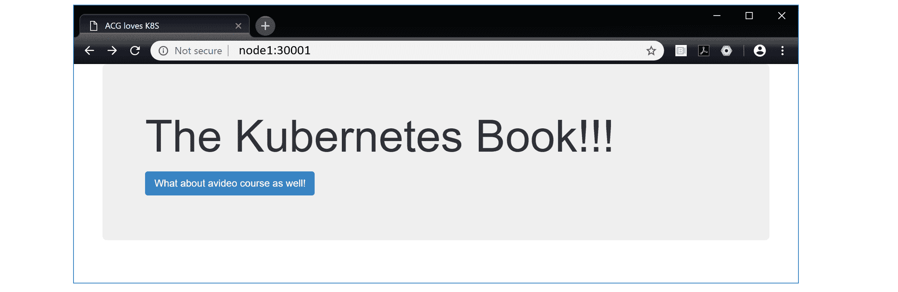

## 五、Kubernetes 部署

在本章中，您将看到*部署*如何为 Kubernetes 带来自我修复、可伸缩性、滚动更新和版本回滚。

我们将这一章划分如下:

*   部署理论
*   如何创建部署
*   如何执行滚动更新
*   如何执行回滚

### 部署理论

在高层次上，您从应用代码开始。它被包装成一个容器，包装在一个豆荚里，这样它就可以在 Kubernetes 上运行。然而，Pods 不能自我修复，不能扩展，也不允许简单的更新或回滚。部署完成了所有这些。因此，您几乎总是通过部署控制器来部署 Pods。

图 5.1 显示了一些由部署控制器管理的 Pods。


<figcaption>Figure 5.1</figcaption>

重要的是要知道，单个部署对象只能管理单个 Pod 模板。例如，如果您有一个应用，其中一个 Pod 模板用于 web 前端，另一个 Pod 模板用于目录服务，那么您将需要两个部署。然而，如图 5.1 所示，一个部署可以管理同一个 Pod 的多个副本。例如，图 5.1 可能是一个当前管理两个复制 web 服务器 Pods 的部署。

接下来要知道的是，部署是 Kubernetes API 中成熟的对象。这意味着您可以在清单文件中定义它们，并将其`POST`发送到应用编程接口服务器。

最后要注意的是，在幕后，部署利用了另一个称为复制集的对象。虽然最好不要直接与副本集交互，但了解它们所扮演的角色很重要。

保持高水平，部署使用复制集来提供自我修复和扩展。

图 5.2。显示了由同一部署管理的相同 Pods。然而，这次我们在关系中添加了一个复制集对象，并显示了哪个对象负责哪个特性。



<figcaption>Figure 5.2</figcaption>

总之，把*部署*想象成管理*副本集*，把*副本集*想象成管理*POD*。将它们放在一起，您就有了一个在 Kubernetes 上部署和管理应用的好方法。

#### 自我修复和可扩展性

豆荚很棒。它们通过允许容器共处一地、共享卷、共享内存、简化网络等等来扩充容器。但是它们在自我修复和可伸缩性方面没有提供任何东西——如果 Pod 正在运行的节点出现故障，Pod 将不会重新启动。

输入部署…

部署通过增加自我修复和可扩展性等功能来增强 Pods。这意味着:

*   如果由部署管理的 Pod 出现故障，它将被替换–*自愈*。
*   如果由部署管理的 Pod 发现负载增加，您可以轻松地添加更多相同的 Pod 来处理负载–*扩展*。

请记住，在幕后，部署使用一个名为复制集的对象来实现自我修复和可伸缩性。但是，复制集在后台运行，您应该始终对部署执行操作。因此，我们将重点关注部署。

##### 都是关于*状态*

在进一步讨论之前，了解对 Kubernetes 的一切都至关重要的三个概念非常重要:

*   期望状态
*   当前状态(有时称为*实际状态*或*观察状态*
*   声明模型

*想要的状态*就是你**想要的**。*当前状态*就是你**拥有的**。如果两者匹配，每个人都很开心。

*声明模型*是一种告诉Kubernetes你的*期望状态*是什么的方式，而不需要进入*如何*实现它的细节。你把*怎么*留给库本内斯。

##### 声明性模型

有两种竞争模式。*陈述模型*和*命令模型*。

声明性模型是关于描述最终目标的——告诉 Kubernetes 你想要什么。命令式模型是关于达到最终目标的一长串命令——告诉 Kubernetes **如何**做某事。

下面是一个极其简单的类比，可能会有所帮助:

*   **声明性:**我需要一个能喂饱 10 个人的巧克力蛋糕。
*   **命令式:**开车去商店。购买；鸡蛋、牛奶、面粉、可可粉……开车回家。打开烤箱。混合配料。放入烤盘。将托盘放入烤箱 30 分钟。从烤箱中取出并关闭烤箱。加糖霜。站着别动。

陈述模型是陈述你想要什么(10 块巧克力蛋糕)。命令式模型是制作 10 块巧克力蛋糕所需的一长串步骤。

让我们看一个更具体的例子。

假设您有一个包含两个服务的应用——前端和后端。您已经构建了容器映像，这样就可以有一个用于前端服务的 Pod 和一个单独的用于后端服务的 Pod。为了满足预期需求，您总是需要 5 个前端 Pod 实例和 2 个后端 Pod 实例。

采用声明式方法，编写一个配置文件，告诉 Kubernetes 您希望应用是什么样子。例如，*我想要 5 个前端 Pod 的副本，请全部在端口 80 上进行外部监听。我还想让 2 个后端 Pods 在端口 27017 上进行内部监听。*这就是想要的状态。显然，配置文件的 YAML 格式会有所不同，但你会明白这一点。

一旦您描述了所需的状态，您就可以将配置文件交给 Kubernetes，并在 Kubernetes 努力实现它的过程中静观其变。

但是事情并不止于此……Kubernetes 实现了不断检查你是否得到了你想要的东西的观察循环——当前状态是否与期望状态相匹配。

相信我，当我告诉你，这是一件美好的事情。

声明性模型的对立面是命令性模型。在命令式模型中，没有你实际想要什么的概念。至少没有你想要什么的*记录*，你得到的只是一张说明清单。

更糟糕的是，命令式指令可能有多种变体。例如，启动`containerd`容器的命令不同于启动`gVisor`容器的命令。这最终会导致更多的工作，容易出现更多的错误，并且因为它没有声明一个期望的状态，所以没有自我修复。

相信我，当我告诉你，这不是那么美好。

Kubernetes 支持这两种模型，但更喜欢声明性模型。

##### 调节循环

理想状态的基础是后台协调循环(又称控制循环)的概念。

例如，复制集实现了一个后台协调循环，不断检查集群上是否存在正确数量的 Pod 复制。如果不够，它会增加更多。如果太多，它会终止一些。

非常清楚的是，**Kubernetes一直在确保*当前状态*与*期望状态相匹配。***

如果它们不匹配——可能期望的状态是 10 个副本，但只有 8 个在运行——Kubernetes宣布红色警报状态，命令控制飞机进入战斗状态，并调出另外两个副本。最棒的是…它在凌晨 4:20 不打电话给你的情况下完成了所有这些！

但这不仅仅是失败的场景。这些完全相同的调节循环支持缩放。

例如，如果您`POST`更新了一个配置，将副本计数从 3 更改为 5，新的值 5 将被注册为应用新的*期望状态*。下一次运行 ReplicaSet 调节循环时，它将注意到差异并遵循相同的过程——拉响红色警报的喇叭，再旋转两个副本。

这真的是一件美好的事情。

#### 随着部署滚动更新

除了自我修复和扩展，部署还为我们提供零停机滚动更新。

如前所述，部署使用复制集进行一些后台工作。事实上，每次您创建一个部署时，您都会自动获得一个管理该部署的 Pods 的复制集。

> **注意:**最佳实践指出，您不应该直接管理副本集。您应该对部署对象执行所有操作，并让部署管理复制集。

它是这样工作的。您将每个离散服务设计为一个 Pod。为了方便起见(自我修复、扩展、滚动更新等)，您将 Pods 包装在部署中。这意味着创建一个描述以下所有内容的 YAML 配置文件:

*   有多少个豆荚复制品
*   Pod 的容器使用什么映像
*   使用什么网络端口
*   有关如何执行滚动更新的详细信息

您将 YAML 文件发送到应用编程接口服务器，剩下的工作由Kubernetes完成。

一旦一切正常运行，Kubernetes 就会设置观察循环，以确保观察到的状态与所需状态相匹配。

目前一切顺利。

现在，假设您遇到了一个错误，您需要部署一个实现修复的更新映像。为此，您需要用新的映像版本更新**同一个部署 YAML 文件**，并将其重新发布到应用编程接口服务器。这将在集群上注册一个新的所需状态，请求相同数量的 Pods，但都运行新版本的映像。为了实现这一点，Kubernetes 用新的映像为 Pods 创建了一个新的副本集。现在你有两个副本集——一个是旧版本的原副本集，另一个是更新版本的副本集。每次库本内斯增加新副本集中的豆荚数量(使用新版本的映像)时，它就会减少旧副本集中的豆荚数量(使用旧版本的映像)。最终结果是，您可以获得零停机时间的平滑滚动更新。您可以为将来的更新冲洗并重复这个过程——只需继续更新清单文件(应该存储在版本控制系统中)。

太棒了。

图 5.3 显示了已经更新过一次的部署。初始部署在左侧创建了复制集，更新在右侧创建了复制集。您可以看到，初始部署的副本集已经缩减，不再有任何 Pod 副本。与更新相关联的复制集是活动的，并且拥有所有的 Pods。


<figcaption>Figure 5.3</figcaption>

重要的是要理解旧的复制集仍然有它的整个配置，包括它使用的旧版本的映像。这在下一节中很重要。

#### 卷回

正如我们在图 5.3 中所看到的，旧的复制集被关闭，不再管理任何 Pods。但是，它们仍然以完整的配置存在。这使得它们成为恢复到以前版本的一个很好的选择。

回滚的过程本质上与滚动更新相反——卷起一个旧的副本集，然后卷起当前的副本集。很简单。

图 5.4 显示了回滚到初始版本的同一个应用。



<figcaption>Figure 5.4</figcaption>

但这还不是结束。有内置的智能，让我们可以说类似*“在每个POD出现后等待 X 秒钟，然后再进入下一个POD”。*还有启动探测器、就绪探测器和活性探测器，可以检查 Pods 的运行状况和状态。总而言之，部署非常适合执行滚动更新和版本化回滚。

考虑到所有这些，让我们开始着手创建一个部署。

### 如何创建部署

在本节中，您将从 YAML 文件创建一个全新的 Kubernetes 部署。您可以使用`kubectl run`命令强制执行同样的操作，但是您不应该这样做。正确的方式是陈述方式。

以下 YAML 代码片段是您将使用的部署清单文件。它可以在书的 GitHub repo 的“部署”文件夹中找到，叫做`deploy.yml`。

这些例子假设你的系统路径中有一个副本，叫做`deploy.yml`。

```
apiVersion: apps/v1  #Older versions of k8s use apps/v1beta1
kind: Deployment
metadata:
  name: hello-deploy
spec:
  replicas: 10
  selector:
    matchLabels:
      app: hello-world
  minReadySeconds: 10
  strategy:
    type: RollingUpdate
    rollingUpdate:
      maxUnavailable: 1
      maxSurge: 1
  template:
    metadata:
      labels:
        app: hello-world
    spec:
      containers:
      - name: hello-pod
        image: nigelpoulton/k8sbook:latest
        ports:
        - containerPort: 8080 
```

 `> **警告:**本书使用的图片未维护，可能存在漏洞等安全问题。小心使用。

让我们浏览一下配置并解释一些重要的部分。

就在最上面，您指定要使用的应用编程接口版本。假设您使用的是最新版本的 Kubernetes，部署对象位于`apps/v1` API 组中。

接下来，`.kind`字段告诉 Kubernetes 您正在定义一个部署对象。

`.metadata`部分是我们给部署命名和标签的地方。

`.spec`部分是大部分动作发生的地方。`.spec`正下方的任何东西都与POD相关。嵌套在`.spec.template`下面的任何内容都与部署将管理的 Pod 模板相关。在本例中，Pod 模板定义了一个容器。

`.spec.replicas`告诉 Kubernetes 如何部署 Pod 副本。`spec.selector`是 Pods 必须具有的标签列表，以便部署管理它们。`.spec.strategy`告诉Kubernetes如何对部署管理的 Pods 进行更新。

使用`kubectl apply`在集群上实现。

> **注意:** `kubectl apply`将 YAML 文件发布到 Kubernetes API 服务器。

```
$ kubectl apply -f deploy.yml
deployment.apps/hello-deploy created 
```

 `部署现已在群集上实例化。

#### 检查部署

您可以使用普通的`kubectl get`和`kubectl describe`命令查看部署的详细信息。

```
$ kubectl get deploy hello-deploy
NAME          DESIRED   CURRENT  UP-TO-DATE  AVAILABLE   AGE
hello-deploy  10        10       10          10          24s

$ kubectl describe deploy hello-deploy
Name:         hello-deploy
Namespace:    default
Selector:     app=hello-world
Replicas:               10 desired | 10 updated | 10 total ...
StrategyType:           RollingUpdate
MinReadySeconds:        10
RollingUpdateStrategy:  1 max unavailable, 1 max surge
Pod Template:
  Labels:               app=hello-world
  Containers:
        hello-pod:
          Image:        nigelpoulton/k8sbook:latest
          Port:         8080/TCP
<SNIP> 
```

 `为了可读性，命令输出已经过调整。您的将显示更多信息。

正如我们前面提到的，部署会自动创建关联的复制集。使用以下`kubectl`命令确认这一点。

```
$ kubectl get rs
NAME                  DESIRED   CURRENT  READY   AGE
hello-deploy-7bbd...  10        10       10      1m 
```

 `现在你只有一个副本集。这是因为您只执行了部署的初始部署。您还可以看到复制集的名称与部署的名称相匹配，最后是一个散列。该散列是 YAML 清单文件的 Pod 模板部分(低于`.spec.template`的任何内容)的散列。

您可以使用常用的`kubectl describe`命令获得关于复制集的更多详细信息。

#### 访问应用

为了从一个稳定的名称或 IP 地址，甚至从集群外部访问应用，您需要一个 Kubernetes 服务对象。我们将在下一章中详细讨论服务对象，但现在只要知道它们为一组 Pods 提供了稳定的 DNS 名称和 IP 地址就足够了。

以下 YAML 定义了一项服务，该服务将与之前部署的 Pod 副本一起工作。YAML 被包括在这本书的 GitHub repo 的“部署”文件夹中，名为`svc.yml`。

```
 apiVersion: v1
  kind: Service
  metadata:
    name: hello-svc
    labels:
      app: hello-world
  spec:
    type: NodePort
    ports:
    - port: 8080
      nodePort: 30001
      protocol: TCP
    selector:
      app: hello-world 
```

 `使用以下命令部署它(该命令假设清单文件被称为`svc.yml`，并且在您系统的路径中)。

```
 $ kubectl apply -f svc.yml
  service/hello-svc created 
```

 `现在，该服务已经部署，您可以从以下任一位置访问该应用:

1.  从集群内部使用端口`8080`上的域名`hello-svc`
2.  从集群外部通过点击端口`30001`上的任何集群节点

图 5.5 显示了通过端口`30001`上名为`node1`的节点从集群外部访问的服务。它假设`node1`是可解析的，并且端口`30001`被任何中间防火墙允许。

如果使用的是 Minikube，应该在 Minikube IP 地址的末尾追加端口`30001`。使用`minikube ip`命令获取您的迷你库的 IP 地址。



<figcaption>Figure 5.5</figcaption>

### 执行滚动更新

在本节中，您将看到如何对刚刚部署的应用执行滚动更新。我们将假设新版本的应用已经被创建并封装为带有`edge`标签的 Docker 映像。剩下要做的就是使用 Kubernetes 将更新推向生产。对于这个例子，我们忽略了真实世界的 CI/CD 工作流和版本控制工具。

您需要做的第一件事是更新部署清单文件中使用的映像标签。该应用的初始版本使用了标记为`nigelpoulton/k8sbook:latest`的映像。您将更新部署清单的`.spec.template.spec.containers`部分，以引用新的`nigelpoulton/k8sbook:edge`映像。这将确保下次清单发布到应用编程接口服务器时，部署中的所有 Pods 都将被运行新`edge`映像的新 Pods 替换。

以下是更新后的`deploy.yml`清单文件–唯一的变化是注释行指示的`.spec.template.spec.containers.image`。

```
apiVersion: apps/v1
kind: Deployment
metadata:
  name: hello-deploy
spec:
  replicas: 10
  selector:
    matchLabels:
      app: hello-world
  minReadySeconds: 10
  strategy:
    type: RollingUpdate
    rollingUpdate:
      maxUnavailable: 1
      maxSurge: 1
  template:
    metadata:
      labels:
        app: hello-world
    spec:
      containers:
      - name: hello-pod
        image: nigelpoulton/k8sbook:edge   # This line changed
        ports:
        - containerPort: 8080 
```

 `在将更新后的配置发布到 Kubernetes 之前，让我们看看控制更新如何进行的设置。

清单的`.spec`部分包含与如何执行更新相关的所有设置。第一个感兴趣的值是`.spec.minReadySeconds`。这被设置为`10`，告诉Kubernetes在每个POD更新之间等待 10 秒钟。这对于限制更新发生的速度非常有用—较长的等待时间让您有机会发现问题，并避免将所有 Pods 更新为错误配置的情况。

还有一个嵌套的`.spec.strategy`地图，它告诉 Kubernetes 您希望这个部署:

*   使用`RollingUpdate`策略更新
*   在理想状态下(T0)，不得有一个以上的POD
*   永远不要让一个以上的POD超过所需状态(`maxSurge: 1`)

由于应用的期望状态需要 10 个副本，`maxSurge: 1`意味着在更新过程中，你永远不会有超过 11 个 Pods，`maxUnavailable: 1`意味着你永远不会有少于 9 个。最终结果将是一次更新两个 Pods 的滚动更新(9 和 11 之间的增量为 2)。

更新清单准备就绪后，您可以通过将更新后的 YAML 文件重新发布到 API 服务器来启动更新。

```
$ kubectl apply -f deploy.yml --record
deployment.apps/hello-deploy configured 
```

 `更新可能需要一些时间才能完成。这是因为它将一次迭代两个 Pods，拉下每个节点上的新映像，启动新的 Pods，然后等待 10 秒钟再继续下两个。

您可以通过`kubectl rollout status`监控更新进度。

```
$ kubectl rollout status deployment hello-deploy
Waiting for rollout to finish: 4 out of 10 new replicas...
Waiting for rollout to finish: 4 out of 10 new replicas...
Waiting for rollout to finish: 5 out of 10 new replicas...
^C 
```

 `如果您按下`Ctrl+C`停止观看更新进度，您可以在更新过程中运行`kubectl get deploy`命令。这使您可以看到清单中某些更新相关设置的效果。例如，以下命令显示 5 个副本已经更新，而您当前有 11 个。11 比期望的状态 10 多 1。这是清单中`maxSurge=1`值的结果。

```
$ kubectl get deploy
NAME           DESIRED   CURRENT   UP-TO-DATE   AVAILABLE   AGE
hello-deploy   10        11        5            9           28m 
```

 `一旦更新完成，我们可以通过`kubectl get deploy`进行验证。

```
$ kubectl get deploy hello-deploy
NAME          DESIRED   CURRENT   UP-TO-DATE   AVAILABLE   AGE
hello-deploy  10        10        10           10          39m 
```

 `输出显示更新完成-10 个 Pods 是最新的。

您可以使用`kubectl describe deploy`命令获得关于部署状态的更多详细信息。这将在输出的`Pod Template`部分包括映像的新版本。

如果你一直跟着例子，你将能够在你的浏览器中点击`refresh`并看到更新的应用(图 5.6)。旧版本的应用显示“Kubernetes岩石！”，新版本显示“Kubernetes之书！！!"。



<figcaption>Figure 5.6</figcaption>

### 如何执行回滚

刚才，您使用`kubectl apply`对部署执行滚动更新。您使用了`--record`标志，这样 Kubernetes 就可以维护部署的记录修订历史。以下`kubectl rollout history`命令显示了带有两个版本的部署。

```
$ kubectl rollout history deployment hello-deploy
deployment.apps/hello-deploy
REVISION  CHANGE-CAUSE
1         <none>
2         kubectl apply --filename-deploy.yml --record=true 
```

 `修订版`1`是使用`latest`映像标签的初始部署。修订`2`是你刚刚执行的滚动更新。您可以看到，用于调用更新的命令已经记录在对象的历史记录中。这只是因为您使用了`--record`标志作为调用更新的命令的一部分。这可能是你使用`--record`旗的一个很好的理由。

在本章前面，我们说过更新部署会创建一个新的复制集，并且不会删除任何以前的复制集。你可以用`kubectl get rs`来验证这一点。

```
$ kubectl get rs
NAME                  DESIRED  CURRENT  READY  AGE
hello-deploy-6bc8...  10       10       10     10m
hello-deploy-7bbd...  0        0        0      52m 
```

 `输出显示初始版本的副本集仍然存在(`hello-deploy-7bbd...`)，但是它已经被关闭，并且没有管理任何副本。`hello-deploy-6bc8...`副本集是最新版本的副本集，有 10 个副本处于管理状态。然而，之前的版本仍然存在的事实使得回滚变得非常简单。

如果你正在跟随，值得对旧的复制集运行一个`kubectl describe rs`来证明它的配置仍然存在。

以下示例使用`kubectl rollout`命令将应用回滚到版本 1。这是一个必要的操作，不推荐使用。但是，快速回滚可能很方便，只要记住更新您的源 YAML 文件，以反映您对集群所做的必要更改。

```
$ kubectl rollout undo deployment hello-deploy --to-revision=1
deployment.apps "hello-deploy" rolled back 
```

 `虽然看起来回滚操作是瞬时的，但事实并非如此。回滚遵循部署清单的滚动更新部分中规定的相同规则—`minReadySeconds: 10`、`maxUnavailable: 1`和`maxSurge: 1`。您可以通过以下`kubectl get deploy`和`kubectl rollout`命令验证并跟踪进度。

```
$ kubectl get deploy hello-deploy
NAME          DESIRED  CURRNET  UP-TO-DATE  AVAILABE  AGE
hello-deploy  10       11       4           9         45m

$ kubectl rollout status deployment hello-deploy
Waiting for rollout to finish: 6 out of 10 new replicas have been updated...
Waiting for rollout to finish: 7 out of 10 new replicas have been updated...
Waiting for rollout to finish: 8 out of 10 new replicas have been updated...
Waiting for rollout to finish: 1 old replicas are pending termination...
Waiting for rollout to finish: 9 of 10 updated replicas are available...
^C 
```

 `恭喜你。您已经执行了滚动更新并成功回滚。

使用`kubectl delete -f deploy.yml`和`kubectl delete -f svc.yml`删除示例中使用的部署和服务。

只是提醒一下。您刚刚启动的回滚操作是一个必需的操作。这意味着集群的当前状态将与您的源 YAML 文件不匹配–最新版本的 YAML 文件列出了`edge`映像，但您已经将集群回滚到了`latest`映像。这是命令式方法的一个问题。在现实世界中，在类似这样的回滚操作之后，您应该手动更新您的源 YAML 文件，以反映回滚所引起的更改。

### 章节总结

在本章中，您了解到*部署*是管理 Kubernetes 应用的好方法。他们在 Pods 的基础上增加了自我修复、可伸缩性、滚动更新和回滚。在幕后，他们利用复制集实现自我修复和可伸缩性。

像 Pods 一样，部署是 Kubernetes API 中的对象，您应该以声明的方式使用它们。

当您使用`kubectl apply`命令执行更新时，旧版本的副本集会逐渐减少，但它们会一直存在，使得执行回滚变得很容易。```````````````