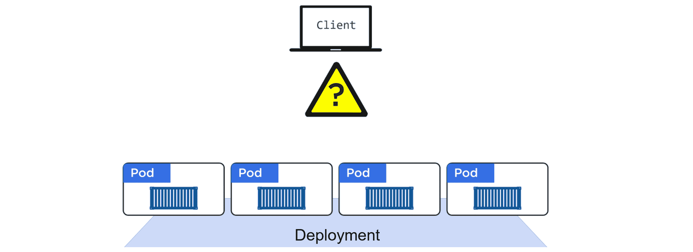
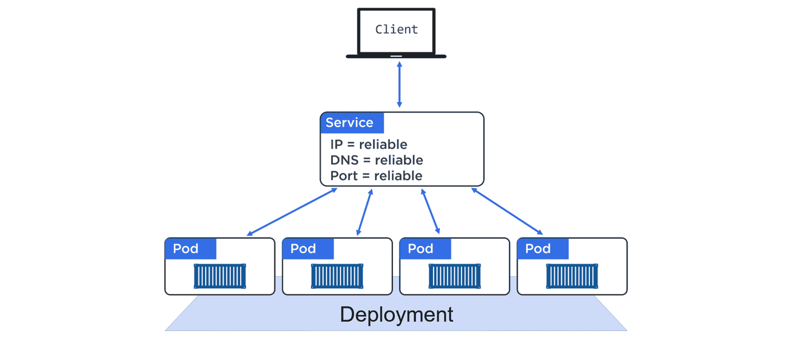
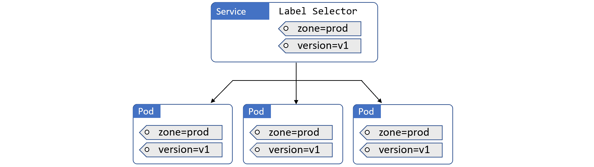
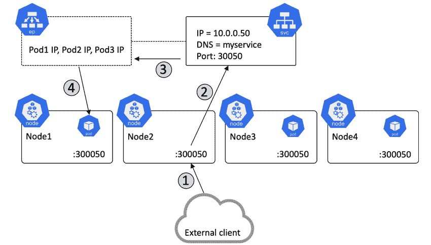
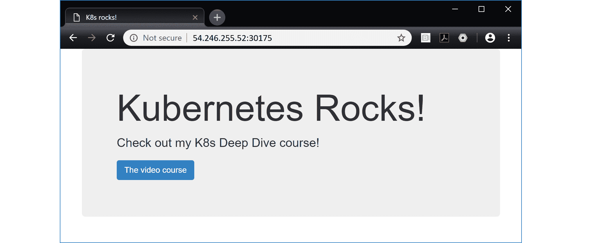
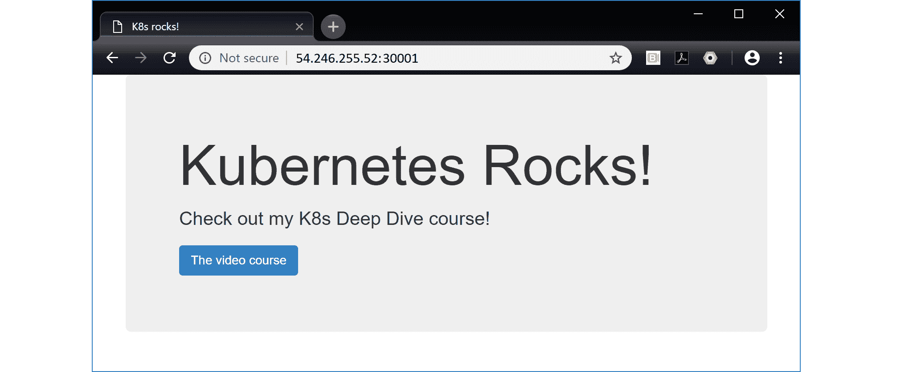
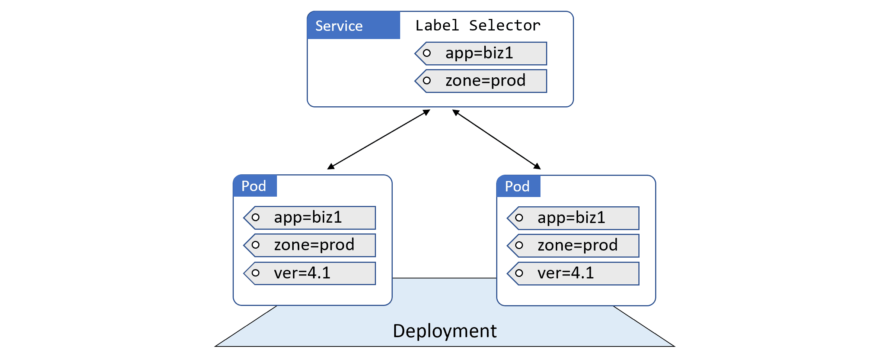
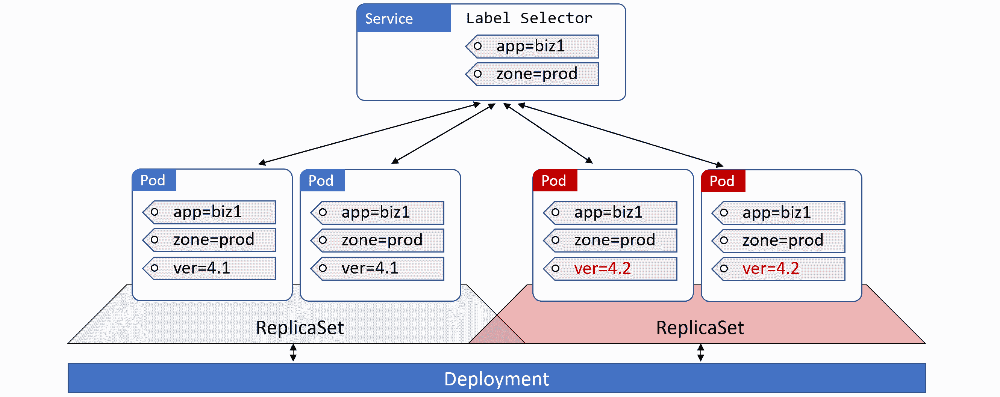
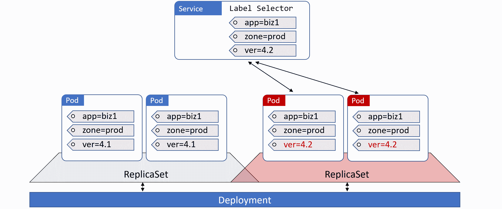
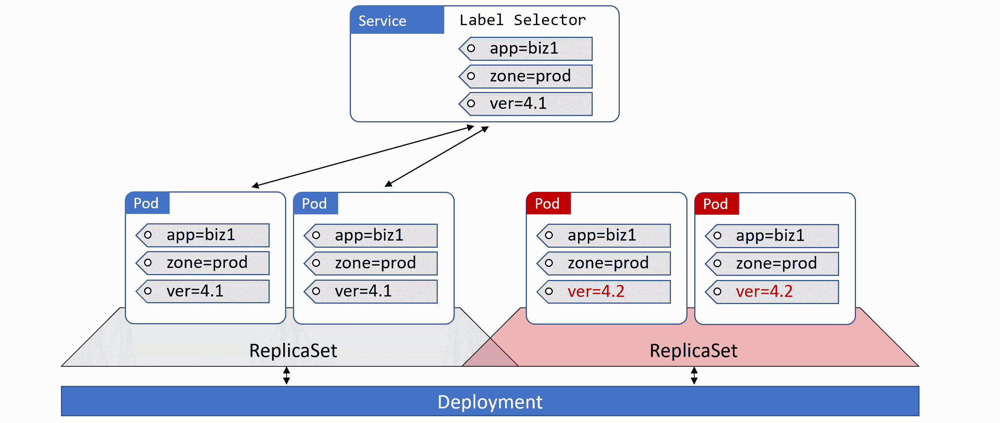

## 六、Kubernetes服务

在前面的章节中，我们已经了解了一些用于部署和运行应用的 Kubernetes 对象。我们将 Pods 视为部署微服务应用的最基本单元，然后我们研究了添加了扩展、自我修复和滚动更新等功能的部署控制器。然而，尽管有部署的所有好处，**我们仍然不能依赖单个 Pod IPs！**这是 Kubernetes *Service* 对象发挥作用的地方——它们为一组动态 Pods 提供稳定可靠的网络。

我们将这一章划分如下:

*   设置场景
*   理论
*   动手
*   真实世界的例子

### 设置场景

在潜入之前，我们需要提醒自己，Pod IPs 是不可靠的。当吊舱出现故障时，它们会被具有新入侵防御系统的新吊舱所取代。扩展部署引入了带有新 IP 地址的新 Pods。缩小部署会移除 Pods。这就造成了大量的 *IP 流失*，造成了不能依赖 Pod IPs 的局面。

您还需要了解关于 Kubernetes 服务的 3 个基本知识。

首先，让我们弄清楚一些术语。当谈论带大写“S”的*服务*时，我们谈论的是 Kubernetes 中为 Pods 提供稳定网络的服务对象。就像*吊舱*、*副本集*或*部署*一样，Kubernetes ***服务*** 是您在清单中定义的应用编程接口中的 REST 对象，并将其发布到应用编程接口服务器。

其次，你要知道每个服务都有自己的**稳定 IP 地址**，自己的**稳定 DNS 名称**，自己的**稳定端口**。

第三，您需要知道服务利用*标签*来动态选择他们将向其发送流量的集群中的 Pods。

### 理论

图 6.1 显示了通过 Kubernetes 部署部署的一个简单的基于 Pod 的应用。它显示了一个客户端(可能是应用的另一个组件)，该客户端没有用于访问 Pods 的可靠网络端点。请记住，直接与单个 Pod 对话不是一个好主意，因为该 Pod 可能会通过扩展操作、更新和回滚以及故障在任何时候消失。



<figcaption>Figure 6.1</figcaption>

图 6.2 显示了同一个应用，其中添加了一个服务。该服务与 Pods 相关联，并为它们提供稳定的 IP、DNS 和端口。它还跨 Pods 负载平衡请求。



<figcaption>Figure 6.2</figcaption>

在一组 Pods 前面有一个服务，Pods 可以向上和向下扩展，它们可以失败，并且它们可以更新、回滚……当类似的事件发生时，它们前面的服务观察变化并更新其健康 Pods 列表。但是它从不改变它所暴露的稳定的 IP、DNS 和端口。

将服务视为具有静态前端和动态后端。前端，由 IP、域名和端口组成，永不改变。由 Pods 组成的后端可以不断变化。

#### 标签和松耦合

服务通过*标签*和*标签选择器*与 Pods 松散耦合。这是将部署松散地耦合到 Pods 的技术，也是 Kubernetes 提供的灵活性的关键。图 6.3 显示了一个例子，其中 3 个吊舱被标记为`zone=prod`和`version=1`，服务有一个匹配的*标签选择器*。



<figcaption>Figure 6.3</figcaption>

在图 6.3 中，服务为所有三个 Pods 提供了稳定的网络，您可以向服务发送请求，服务会将它们转发到 Pods。它还提供了简单的负载平衡。

要让服务匹配一组 Pods，并因此向它们发送流量，Pods 必须拥有服务标签选择器中的每个标签。但是，Pod 可以有未在服务的标签选择器中列出的附加标签。如果这令人困惑，图 6.4 和 6.5 中的例子应该会有所帮助。

图 6.4 显示了一个服务与任何 Pods 都不匹配的例子。这是因为该服务正在寻找有两个标签的豆荚，但豆荚只拥有其中之一。这背后的逻辑是一个布尔`AND`。


<figcaption>Figure 6.4</figcaption>

图 6.5 展示了一个可行的例子。它之所以有效，是因为服务正在寻找两个标签，而图中的 Pods 同时拥有这两个标签。Pods 拥有服务不需要的附加标签并不重要。该服务正在寻找带有两个标签的 Pods，它找到了它们，并忽略了 Pods 有附加标签的事实——重要的是 Pods 拥有该服务正在寻找的标签。


<figcaption>Figure 6.5</figcaption>

以下摘录自 YAML 服务和 YAML 部署，展示了如何实现*选择器*和*标签*。我在兴趣线中添加了注释。

**svc.yml**

```
apiVersion: v1
kind: Service
metadata:
  name: hello-svc
spec:
  ports:
  - port: 8080
  selector:
    app: hello-world   # Label selector
    # Service is looking for Pods with the label `app=hello-world` 
```

 `**部署. yml**

```
apiVersion: apps/v1
kind: Deployment
metadata:
  name: hello-deploy
spec:
  replicas: 10
  selector:
    matchLabels:
      app: hello-world
  template:
    metadata:
      labels:
        app: hello-world   # Pod labels
        # The label matches the Service's label selector
    spec:
      containers:
      - name: hello-ctr
        image: nigelpoulton/k8sbook:latest
        ports:
        - containerPort: 8080 
```

 `在示例文件中，服务有一个标签选择器(`.spec.selector`)和一个值`app=hello-world`。这是服务在向集群查询匹配的 Pods 时要寻找的标签。部署指定了具有相同`app=hello-world`标签(`.spec.template.metadata.labels`)的 Pod 模板。这意味着它部署的任何吊舱都将带有`app=hello-world`标签。正是这两个属性将服务松散地耦合到部署的 Pods。

部署和服务完成后，服务将选择所有 10 个 Pod 副本，并为它们提供稳定的网络端点和负载平衡流量。

#### 服务和端点对象

随着 Pods 来来去去(上下扩展、故障、滚动更新等)。)，服务会动态更新其健康匹配 Pods 列表。它通过标签选择器和称为*端点*对象的构造的组合来实现这一点。

创建的每个服务都会自动获得一个关联的*端点*对象。这个端点对象是一个动态列表，列出了集群中与服务的标签选择器匹配的所有健康的 Pods。

它是这样工作的…

Kubernetes 一直在根据集群上当前健康的 Pods 列表评估服务的标签选择器。任何与选择器匹配的新 Pods 都会被添加到端点对象中，任何消失的 Pods 都会被移除。这意味着端点对象始终是最新的。然后，当服务向 Pods 发送流量时，它会向其端点对象查询健康匹配 Pods 的最新列表。

当通过服务向 Pods 发送流量时，应用通常会向群集的内部 DNS 查询服务的 IP 地址。然后，它将流量发送到这个稳定的 IP 地址，服务将其发送到 Pod。然而，一个 *Kubernetes-native* 应用(这是一个理解 Kubernetes 并可以查询 Kubernetes API 的应用的奇特说法)可以直接查询端点 API，绕过 DNS 查找和服务 IP 的使用。

现在，您已经了解了服务工作的基本原理，让我们来看看一些用例。

#### 从集群内部访问服务

Kubernetes 支持几种*类型的*服务。默认类型为**集群 IP** 。

群集 IP 服务有一个稳定的 IP 地址和端口，只能从群集内部访问。它被编程到网络结构中，并保证在服务期间保持稳定。*编程到网络结构中*是网络的花哨说法*只是知道而已*你不需要为细节(低级别的 IPTABLES 和 IPVS 规则之类的东西)费心。

无论如何，集群 IP 会根据集群内部 DNS 服务上的服务名称进行注册。集群中的所有 Pods 都是预先编程的，以了解集群的 DNS 服务，这意味着所有 Pods 都能够解析服务名称。

让我们看一个简单的例子。

创建一个名为“魔法沙盒”的新服务将触发以下事件。Kubernetes 将向集群的 DNS 服务注册名称“magic-sandbox”，以及集群 IP 和端口。名称、集群 IP 和端口保证长期稳定，集群中的所有 Pods 都向内部 DNS 发送服务发现请求，因此能够将“魔法沙盒”解析到集群 IP。IPTABLES 或 IPVS 规则分布在集群中，确保发送到集群 IP 的流量被路由到后端的 Pods。

最终结果…只要 Pod(应用微服务)知道服务的名称，它就可以将其解析为其集群 IP 地址，并连接到所需的 Pod。

这仅适用于 Pods 和集群上的其他对象，因为它需要访问集群的 DNS 服务。它在集群之外不起作用。

#### 从群集外部访问服务

Kubernetes 有另一种类型的服务叫做**节点端口服务**。这建立在集群 IP 之上，支持从集群外部进行访问。

您已经知道默认的服务类型是集群 IP，它向集群的 DNS 注册一个 DNS 名称、虚拟 IP 和端口。一种不同类型的服务称为节点端口服务，它在此基础上增加了另一个端口，可用于从集群外部访问服务。这个额外的端口被称为*节点端口。*

以下示例表示节点端口服务:

*   **名称:**魔法-沙盒
*   **聚类 IP:** 172.12.5.17
*   **港口:** 8080
*   节点端口: 30050

该`magic-sandbox`服务可通过端口`8080`上的`magic-sandbox`或端口`8080`上的`172.12.5.17`从集群内部访问。也可以通过向端口`30050`上任何集群节点的 IP 地址发送请求，从集群外部访问它。

堆栈底部是承载 Pods 的集群节点。您可以添加服务，并使用标签将其与 Pods 相关联。服务对象有一个可靠的节点端口映射到集群中的每个节点——节点端口值在每个节点上都是相同的。这意味着来自集群外部的流量可以到达节点端口上集群中的任何节点，并到达应用(Pods)。

图 6.6 显示了一个节点端口服务，其中在集群中每个节点的端口`30050`上有 3 个 Pods 暴露在外部。在步骤 1 中，外部客户端点击端口`30050`上的**节点 2** 。在步骤 2 中，它被重定向到服务对象(即使**节点 2** 没有从服务运行 Pod，也会发生这种情况)。步骤 3 显示服务有一个关联的端点对象，该对象有一个始终最新的与标签选择器匹配的 Pods 列表。步骤 4 显示客户端被定向到**节点 1** 上的 **pod1** 。



<figcaption>Figure 6.6</figcaption>

该服务可以很容易地将客户导向 pod2 或 pod3。事实上，随着服务执行基本的负载平衡，未来的请求可能会转到其他 Pods。

还有其他类型的服务，如负载平衡器和外部名称。

负载平衡器服务与您的云提供商(如 AWS、Azure、DO、IBM Cloud 和 GCP)的负载平衡器集成。它们建立在节点端口服务的基础上(而节点端口服务又建立在集群 IP 服务的基础上)，并允许互联网上的客户端通过云的负载平衡器之一到达您的 Pods。它们非常容易设置。但是，只有在受支持的云平台上运行 Kubernetes 集群时，它们才有效。例如，如果您的 Kubernetes 集群运行在 Microsoft Azure 上，您就不能在 AWS 上利用 ELB 负载平衡器。

外部名称服务将流量路由到 Kubernetes 集群之外的系统(所有其他服务类型都将流量路由到集群中的 Pods)。

#### 服务发现

Kubernetes 以几种方式实现服务发现:

*   域名系统(首选)
*   环境变量(绝对不是首选)

基于域名系统的服务发现需要域名系统*集群插件*-这只是本地库本内斯域名系统服务的一个花哨名称。我不记得曾经见过没有它的集群，如果您遵循“安装 Kubernetes”一章中的安装方法，您将已经拥有这个了。它在幕后实施:

*   运行域名系统服务的控制平面吊舱
*   位于吊舱前面的名为`kube-dns`的服务对象
*   Kubelets 用域名系统的知识对每个容器进行编程(通过`/etc/resolv.conf`)

域名系统插件不断监视应用编程接口服务器的新服务，并自动在域名系统中注册它们。这意味着每个服务都有一个可以在整个集群中解析的域名。

服务发现的另一种形式是通过环境变量。每个 Pod 都有一组环境变量，用于解析集群中当前的每个服务。但是，如果您没有在集群中使用域名系统，这是一个极其有限的备份。

环境变量的一个主要问题是，它们只在 Pod 最初创建时插入到 Pod 中。这意味着在 Pod 本身创建后，Pods 无法了解添加到集群中的新服务。这远非理想，也是 DNS 成为首选方法的一个主要原因。另一个限制可能是在具有大量服务的集群中。

#### 服务理论综述

服务就是为 Pods 提供稳定的网络。它们还提供负载平衡和从集群外部访问的方法。

服务的前端提供稳定的 IP、DNS 名称和端口，保证在服务的整个生命周期内不会改变。服务的后端使用标签来平衡一组潜在的动态应用单元之间的流量。

### 服务实践

我们就要动手把理论付诸实践了。

您将使用 Kubernetes 服务来扩充一个简单的单 Pod 应用。你将从两个方面学习如何做:

*   命令式方式(不推荐)
*   陈述的方式

#### 必由之路

**警告！**命令式方式是**而不是**Kubernetes方式。它引入了这样的风险，即您进行了强制性的更改，但从未更新声明性清单，从而使清单不正确且过时。这就带来了这样的风险，即过时的清单随后会被用来在以后更新集群，无意中覆盖了强制进行的重要更改。

使用`kubectl`声明性地部署以下部署(后面的步骤将强制执行)。

YAML 文件被称为`deploy.yml`，可以在该书 GitHub repo 的`services`文件夹中找到。

```
apiVersion: apps/v1
kind: Deployment
metadata:
  name: web-deploy
spec:
  replicas: 10
  selector:
    matchLabels:
      app: hello-world
  template:
    metadata:
      labels:
        app: hello-world
    spec:
      containers:
      - name: hello-ctr
        image: nigelpoulton/k8sbook:latest
        ports:
        - containerPort: 8080

`$ kubectl apply -f deploy.yml
deployment.apps/hello-deploy created` 
```

 ``现在部署正在运行，是时候为其强制部署服务了。

强制创建Kubernetes服务的命令是`kubectl expose`。运行以下命令创建一个新服务，为上一步中部署的 Pods 提供网络和负载平衡。

```
$ kubectl expose deployment web-deploy \
  --name=hello-svc \
  --target-port=8080 \
  --type=NodePort

service/hello-svc exposed 
```

 `让我们解释一下命令在做什么。`kubectl expose`是创建新的*服务*对象的必由之路。`deployment web-deploy`正在告诉库本内斯暴露您在上一步中创建的`web-deploy`部署。`--name=hello-svc`告诉 Kubernetes 将该服务命名为“hello-svc”，`--target-port=8080`告诉它应用正在监听哪个端口(这是**而不是**您将在哪个集群范围内的节点端口上访问该服务)。最后，`--type=NodePort`告诉 Kubernetes 您想要一个集群范围的服务端口。

创建服务后，您可以使用`kubectl describe svc hello-svc`命令对其进行检查。

```
$ kubectl describe svc hello-svc
Name:                     hello-svc
Namespace:                default
Labels:                   <none>
Annotations:              <none>
Selector:                 app=hello-world
Type:                     NodePort
IP:                       192.168.201.116
Port:                     <unset>  8080/TCP
TargetPort:               8080/TCP
NodePort:                 <unset> 30175/TCP
Endpoints:                192.168.128.13:8080,192.168.128.249:8080, + more...
Session Affinity:         None
External Traffic Policy:  Cluster
Events:                   <none> 
```

 `输出中一些有趣的值包括:

*   `Selector`是 Pods 必须拥有的标签列表，以便服务向其发送流量
*   `IP`是服务的永久内部集群 IP (VIP)
*   `Port`是服务在集群内部监听的端口
*   `TargetPort`是应用正在监听的端口
*   `NodePort`是群集范围内的端口，可用于从群集外部访问它
*   `Endpoints`是当前与服务的标签选择器匹配的健康 Pod IPs 的动态列表。

现在，您已经知道了可以访问该服务的集群范围的端口(`30175`)，您可以打开网络浏览器并访问该应用。为此，您需要知道集群中至少一个节点的 IP 地址，并且您需要能够从浏览器访问该地址，例如，如果您通过互联网访问，则需要一个可公开路由的 IP。

图 6.7 显示了一个网络浏览器在群集范围的节点端口`30175`上访问一个 IP 地址为`54.246.255.52`的群集节点。



<figcaption>Figure 6.7</figcaption>

您部署的应用是一个简单的 web 应用。它是为监听端口`8080`而构建的，您已经配置了 Kubernetes *服务*，将每个集群节点上的端口`30175`映射回应用上的端口`8080`。默认情况下，群集范围内的端口(节点端口值)在 30，000 - 32，767 之间。在本例中，它是动态分配的，但是您也可以指定一个端口。

接下来，你将看到如何以正确的方式做同样的事情——陈述方式。为此，您需要通过删除刚刚创建的服务来进行清理。您可以使用以下`kubectl delete svc`命令来完成

```
$ kubectl delete svc hello-svc
service "hello-svc" deleted 
```

 `#### 陈述的方式

是时候用正确的方式做事了……Kubernetes的方式。

##### 服务清单文件

您将使用以下服务清单文件来部署您在上一节中部署的相同的*服务*。但是，这次您将为集群范围的端口指定一个值。

```
apiVersion: v1
kind: Service
metadata:
  name: hello-svc
spec:
  type: NodePort
  ports:
  - port: 8080
    nodePort: 30001
    targetPort: 8080
    protocol: TCP
  selector:
    app: hello-world 
```

 `让我们来看一下其中的一些台词。

服务是成熟的对象，在`v1`核心 API 组(`.apiVersion`)中被完全定义。

`.kind`字段告诉 Kubernetes 您正在定义一个服务对象。

`.metadata`部分定义了服务的名称。您也可以在此处应用标签。您在此添加的任何标签都用于标识服务，与选择 Pods 的标签无关。

`.spec`部分是您实际定义服务的地方。在这个例子中，您告诉 Kubernetes 部署一个`NodePort`服务。`port`值配置服务在端口`8080`上监听内部请求，`NodePort`值告诉它在端口`30001`上监听外部请求。`targetPort`值是服务后端配置的一部分，它告诉 Kubernetes 向端口`8080`上的应用 Pods 发送流量。然后你明确告诉它使用 TCP(默认)。

最后，`.spec.selector`告诉服务将流量发送到群集中具有`app=hello-world`标签的所有 Pods。这意味着它将为所有带有该标签的 Pods 提供稳定的网络和负载平衡。

在部署和测试服务之前，让我们提醒自己主要的服务类型。

##### 常见服务类型

三种常见的*服务类型*是:

*   `ClusterIP.`这是默认选项，为*服务*在集群内部提供了一个稳定的 IP 地址。它不会使服务在群集外可用。
*   `NodePort.`这建立在`ClusterIP`之上，并添加了一个集群范围的 TCP 或 UDP 端口。它使服务在群集外的稳定端口上可用。
*   `LoadBalancer.`这建立在`NodePort`之上，并与基于云的负载平衡器集成。

还有一种服务类型叫做`ExternalName`。这用于将流量定向到 Kubernetes 集群之外的服务。

清单需要发布到 API 服务器。最简单的方法就是`kubectl apply`。

YAML 文件被称为`svc.yml`，可以在图书 GitHub repo 的`services`文件夹中找到。

```
$ kubectl apply -f svc.yml
service/hello-svc created 
```

 `该命令告诉 Kubernetes 从名为`svc.yml`的文件中部署一个新对象。YAML 文件中的`.kind`字段告诉 Kubernetes 您正在部署一个新的服务对象。

##### 反思服务

现在服务已经部署，您可以使用常用的`kubectl get`和`kubectl describe`命令对其进行检查。

```
$ kubectl get svc hello-svc
NAME        TYPE       CLUSTER-IP      EXTERNAL-IP   PORT(S)         AGE
hello-svc   NodePort   100.70.40.2     <none>        8080:30001/TCP  8s

$ kubectl describe svc hello-svc
Name:                     hello-svc
Namespace:                default
Labels:                   <none>
Annotations:              kubectl.kubernetes.io/last-applied-configuration...
Selector:                 app=hello-world
Type:                     NodePort
IP:                       100.70.40.2
Port:                     <unset>  8080/TCP
TargetPort:               8080/TCP
NodePort:                 <unset>  30001/TCP
Endpoints:                100.96.1.10:8080, 100.96.1.11:8080, + more...
Session Affinity:         None
External Traffic Policy:  Cluster
Events:                   <none> 
```

 `在前面的示例中，您将服务作为整个集群中端口`30001`上的`NodePort`公开。这意味着您可以将网络浏览器指向任何节点上的该端口，并访问它所代理的服务和 Pods。您需要使用可以到达的节点的 IP 地址，并且需要确保任何防火墙和安全规则都允许流量流动。

图 6.8 显示了一个网络浏览器通过集群端口`30001`上的一个 IP 地址为`54.246.255.52`的集群节点访问该应用。



<figcaption>Figure 6.8</figcaption>

##### 端点对象

在本章的前面，我们说过每个服务都有自己的端点对象，其名称与服务相同。该对象包含服务匹配的所有 Pods 的列表，并随着匹配 Pods 的来去而动态更新。您可以使用正常的`kubectl`命令查看端点。

在以下命令中，您使用端点控制器的`ep`简称。

```
$ kubectl get ep hello-svc
NAME        ENDPOINTS                                        AGE
hello-svc   100.96.1.10:8080, 100.96.1.11:8080 + 8 more...   1m

$ Kubectl describe ep hello-svc
Name:         hello-svc
Namespace:    default
Labels:       <none>
Annotations:  endpoints.kubernetes.io/last-change...
Subsets:
  Addresses:  100.96.1.10,100.96.1.11,100.96.1.12...
  NotReadyAddresses:   <none>
  Ports:
    Name      Port     Protocol
    ----      ----     --------
    <unset>   8080     TCP
Events: <none> 
```

 `#### 部署服务摘要

与所有 Kubernetes 对象一样，部署和管理服务的首选方式是声明方式。标签允许他们将流量发送到一组动态的 Pods。这意味着您可以部署新的服务，这些服务将与已经在群集上运行并正在使用的 Pods 和部署一起使用。每个服务都有自己的端点对象，该对象维护匹配 Pods 的最新列表。

### 真实世界的例子

虽然到目前为止你学到的一切都很酷很有趣，但重要的问题是:*它是如何带来价值的？*和*它如何保持业务运行并使其更加敏捷和有弹性？*

让我们花一分钟来看一个常见的真实例子——对应用进行更新。

我们都知道更新应用是生活的一部分——错误修复、新功能、性能提升等等。

图 6.9 显示了部署在 Kubernetes 集群上的一个简单应用，它是由一个部署管理的一堆 Pods。作为它的一部分，在带有匹配`app=biz1`和`zone=prod`标签的 Pods 上有一个服务选择(注意 Pods 是如何在标签选择器中列出这两个标签的)。应用已启动并运行。



<figcaption>Figure 6.9</figcaption>

现在假设您需要推送一个新版本，但是您需要在不导致停机的情况下完成。

为此，您可以添加运行新版本应用的 Pods，如图 6.10 所示。



<figcaption>Figure 6.10</figcaption>

在幕后，更新后的*吊舱*被贴上标签，以便与现有的标签选择器相匹配。该服务现在在应用的两个版本 ( `version=4.1`和`version=4.2`)之间对请求进行负载平衡。发生这种情况是因为服务的标签选择器不断被评估，并且它的端点对象不断被新的匹配 Pods 更新。

一旦你对更新后的版本感到满意，强制**所有流量**使用它就像更新服务的标签选择器以包括标签`version=4.2`一样简单。突然之间，旧的 Pods 不再匹配，服务将只向新版本转发流量(图 6.11)。



<figcaption>Figure 6.11</figcaption>

然而，旧版本仍然存在，你只是不再向它发送流量。这意味着，如果您遇到新版本的问题，您可以通过简单地将服务上的标签选择器更改为选择`version=4.1`而不是`version=4.2`来切换回以前的版本。见图 6.12。



<figcaption>Figure 6.12</figcaption>

现在每个人都得到旧版本。

这个功能可以用于各种各样的东西——蓝绿色，金丝雀，你说了算。如此简单，却又如此强大。

使用以下命令清理实验室。这些将删除示例中使用的部署和服务。

```
$ kubectl delete -f deploy.yml
$ kubectl delete -f svc.yml 
```

 `### 章节总结

在本章中，您了解到*服务*为部署在 Kubernetes 上的应用带来了稳定可靠的联网。它们还执行负载平衡，并允许您将应用的元素暴露给外部世界(在 Kubernetes 集群之外)。

服务的前端是固定的，为其背后的 Pods 提供稳定的网络。服务的后端是动态的，允许 Pods 来来去去，而不会影响服务提供负载平衡的能力。

服务是 Kubernetes API 中的一级对象，可以在标准的 YAML 清单文件中定义。他们使用标签选择器来动态匹配 Pods，使用它们的最佳方式是声明式的。````````````