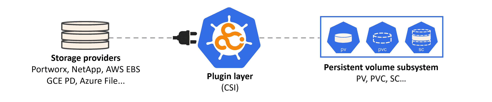
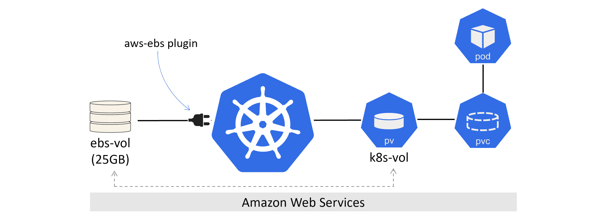
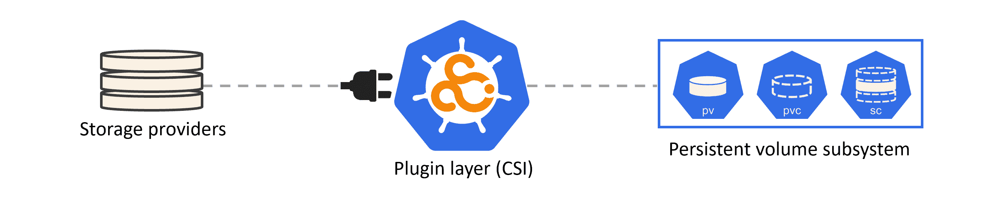
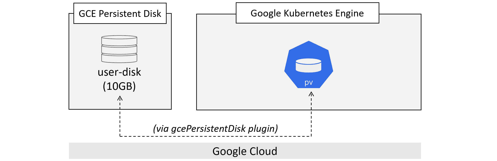
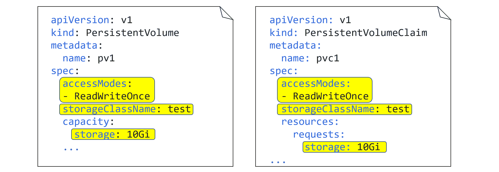

## 8:永久存储

存储对于大多数现实生产应用程序至关重要。幸运的是，Kubernetes 有一个成熟且功能丰富的存储子系统，称为*持久卷子系统*。

我们将这一章划分如下:

*   整体情况
*   存储供应程序
*   集装箱存储接口
*   Kubernetes 持久卷子系统
*   存储类别和动态资源调配
*   演示

### 整体情况

首先，Kubernetes 支持来自许多不同地方的许多类型的存储。例如，iSCSI、中小企业、NFS 和对象存储区，它们都来自各种外部存储系统，可以位于云中，也可以位于您的内部数据中心。然而，无论您有什么类型的存储，或者它来自哪里，当它暴露在您的 Kubernetes 集群上时，它被称为 ***卷*** 。例如，Kubernetes 中出现的 Azure 文件资源称为*卷*，AWS 弹性块存储中的块设备也是如此。Kubernetes 集群上的所有存储称为*卷*。

图 8.1 显示了高级架构。



<figcaption>Figure 8.1</figcaption>

左边是存储提供商。它们可以是来自 EMC 和 NetApp 等供应商的传统企业存储阵列，也可以是云存储服务，如 AWS 弹性数据块存储(EBS)和 GCE 持久磁盘(PD)。你只需要一个插件，允许他们的存储资源在 Kubernetes 中以卷的形式出现。

图的中间是插件层。最简单地说，这是连接外部存储和 Kubernetes 的粘合剂。未来，插件将基于容器存储接口(CSI)，这是一个开放标准，旨在为插件提供一个干净的接口。如果您是编写存储插件的开发人员，CSI 会提取内部 Kubernetes 存储细节，并让您在树外开发*。*

 *> **注意:**在 CSI 之前，所有存储插件都是作为 Kubernetes 主代码树的一部分实现的(*树内*)。这意味着它们都必须是开源的，所有的更新和错误修复都与 Kubernetes 的主要发布周期相关联。这对于插件开发人员和 Kubernetes 维护人员来说都是一场噩梦。然而，现在我们有了 CSI，存储供应商不再需要开源他们的代码，他们可以根据自己的时间框架发布更新和错误修复。

图 8.1 右侧是 Kubernetes 持久卷子系统。这是一组允许应用程序使用存储的应用编程接口对象。在高级别上，持久卷(PV)是您将外部存储映射到群集的方式，持久卷声明(PVC)就像授权应用程序(Pods)使用 PV 的票证。

让我们假设图 8.2 所示的快速例子。

一个 Kubernetes 集群正在 AWS 上运行，AWS 管理员创建了一个名为“ebs-vol”的 25GB EBS 卷。Kubernetes 管理员创建了一个名为“k8s-vol”的 PV，通过`kubernetes.io/aws-ebs`插件链接回“ebs-vol”。虽然这听起来很复杂，但事实并非如此。PV 只是表示 Kubernetes 集群上的外部存储的一种方式。最后，吊舱使用聚氯乙烯来声明进入光伏并开始使用它。



<figcaption>Figure 8.2</figcaption>

几分不值。

1.  有保护从多个 Pods 访问单个卷的规则(稍后将详细介绍)。
2.  单个外部存储卷只能由单个 PV 使用。例如，一个 50GB 的外部卷不能有两个 25GB 的 Kubernetes PVs，每个都使用其中的一半。

既然你已经了解了基本原理，让我们再深入一点。

### 存储提供商

Kubernetes 可以使用各种外部系统的存储。这些通常是原生云服务，如`AWSElasticBlockStore`或`AzureDisk`，但它们也可以是提供`iSCSI`或`NFS`卷的传统内部存储阵列。还有其他选择，但重点是 Kubernetes 从各种外部系统获得存储。

一些明显的限制适用。例如，如果您的 Kubernetes 集群在 Microsoft Azure 中运行，则不能使用`AWSElasticBlockStore`置备程序。

### 集装箱存储接口

CSI 是 Kubernetes 存储拼图的一个重要部分。然而，除非你是一个编写存储插件的开发人员，否则你不太可能经常与它交互。

这是一个开源项目，它定义了一个基于标准的接口，这样就可以在多个容器编排器之间以统一的方式利用存储。换句话说，存储供应商*应该能够编写一个单一的 CSI 插件，可以跨多个管弦乐队工作，比如 Kubernetes 和 Docker Swarm。现实中，库本内特斯是焦点。*

 *在 Kubernetes 世界中，CSI 是编写驱动程序(插件)的首选方式，这意味着插件代码不再需要存在于 Kubernetes 主代码树中。它还提供了一个简洁明了的界面，抽象了所有复杂的内部 Kubernetes 存储机制。基本上，CSI 公开了一个干净的界面，并隐藏了 Kubernetes 代码中所有丑陋的体积机制(无意冒犯)。

从日常管理的角度来看，您与 CSI 的唯一真正交互将是引用您的 YAML 清单文件中的适当插件。此外，现有的树内插件可能需要一段时间才能被 CSI 插件取代。

有时我们将插件*称为“提供者”*，尤其是当我们在本章后面讨论存储类时。

### Kubernetes 持久卷子系统

从日常角度来看，这是您花费大部分时间配置和交互 Kubernetes 存储的地方。

您从图 8.3 左侧的原始存储开始。这个*通过 CSI 插件插入*到 Kubernetes。然后，您可以使用持久卷子系统提供的资源来利用和使用应用程序中的存储。



<figcaption>Figure 8.3</figcaption>

持久卷子系统中的三个主要资源是:

*   持久卷
*   持续批量索赔
*   存储类别

从高层次上来说， **PVs** 就是你在 Kubernetes 中代表存储的方式。 **PVCs** 就像是授予 Pod 访问 PV 的门票。 **SCs** 让一切都充满活力。

让我们快速浏览一个例子。

假设您有一个 Kubernetes 集群和一个外部存储系统。存储供应商提供了一个 CSI 插件，以便您可以在 Kubernetes 集群中利用其存储资产。您可以在存储系统上调配 3 个 10GB 的卷，并创建 3 个 Kubernetes PV 对象，使它们在您的群集上可用。每个 PV 通过 CSI 插件引用存储阵列上的一个卷。此时，这三个卷是可见的，可以在 Kubernetes 集群上使用。

现在假设您将要部署一个需要 10GB 存储的应用程序。太好了，你已经有三个 10GB 的 PVs 了。为了让应用程序使用其中一个，它需要一个聚氯乙烯。如前所述，聚氯乙烯就像一张票，让一个吊舱(应用程序)使用光伏。一旦应用程序有了聚氯乙烯，它就可以将相应的光伏组件作为一个卷安装到其吊舱中。如果需要可视化表示，请参考图 8.2。

这是一个高层次的例子。开始吧。

这个例子是针对运行在谷歌云上的 Kubernetes 集群的。我正在使用云选项，因为它们最容易跟随，您*可能*能够使用云的免费层/初始免费信用。也可以通过改变一些值来跟随其他云。

该示例假设名为“超级磁盘”的 10GB 固态硬盘卷已在与群集相同的谷歌云区域或分区中预创建。Kubernetes 的步骤是:

1.  创建 PV
2.  创造聚氯乙烯
3.  将卷定义到 PodSpec 中
4.  将其装入容器中

下面的 YAML 文件创建了一个 PV 对象，该对象映射回预先创建的名为“超级磁盘”的谷歌永久磁盘。YAML 文件可以在该书名为`gke-pv.yml`的 GitHub repo 的`storage`文件夹中找到。

```
apiVersion: v1
kind: PersistentVolume
metadata:
  name: pv1
spec:
  accessModes:
  - ReadWriteOnce
  storageClassName: test
  capacity:
    storage: 10Gi
  persistentVolumeReclaimPolicy: Retain
  gcePersistentDisk:
    pdName: uber-disk 
```

 `让我们浏览一下文件。

持久卷资源在*核心*应用编程接口组的`v1`中定义。您将该 PV 命名为“pv1”，将其访问模式设置为`ReadWriteOnce`，并使其成为名为“test”的存储类的一部分。您将它定义为 10GB 卷，设置回收策略，并将其映射回一个名为“超级磁盘”的**预创建的** GCE 持久磁盘。

以下命令将创建 PV。它假设 YAML 文件在你的`PATH`中，并被称为`gke-pv.yml`。如果您没有在后端存储系统上预先创建“超级磁盘”，操作将会失败(在本例中，后端存储由谷歌计算引擎提供)。

```
$ kubectl apply -f gke-pv.yml
persistentvolume/pv1 created 
```

 `检查 PV 是否存在。

```
$ kubectl get pv pv1
NAME   CAPACITY   MODES   RECLAIM POLICY   STATUS      STORAGECLASS ...
pv1    10Gi       RWO     Retain           Available   test 
```

 `如果你愿意，你可以用`kubectl describe pv pv1`看到更详细的信息，但目前你有如图 8.4 所示的信息。



<figcaption>Figure 8.4</figcaption>

让我们快速解释一下 YAML 文件中列出的一些光伏特性。

`.spec.accessModes`定义如何安装光伏。有三种选择:

*   `ReadWriteOnce` (RWO)
*   `ReadWriteMany` (RWM)
*   `ReadOnlyMany`(罗马)

`ReadWriteOnce`定义了一个只能由单个聚氯乙烯安装/绑定为拆装的光伏。来自多个 PVC 的绑定(声明)尝试将会失败。

`ReadWriteMany`定义一个 PV，可以被多个 PV 绑定为 R/W。这种模式通常只受文件和对象存储(如 NFS)的支持。块存储通常只支持`RWO`。

`ReadOnlyMany`定义了一个可以被多个 PVC 绑定为 R/O 的 PV

有几件事值得注意。首先，一个光伏组件只能在一种模式下打开——在只读存储器模式下，单个光伏组件不能绑定一个聚氯乙烯，而在 RWM 模式下，另一个聚氯乙烯不能绑定到它。其次，Pods 不直接作用于 PVs，它们总是作用于与 PV 绑定的 PVC 对象。

`.spec.storageClassName`告诉 Kubernetes 将这个 PV 分组到一个名为“test”的存储类中。在本章的后面，您将了解更多关于存储类的信息，但是您需要在这里确保 PV 将在后面的步骤中与 PVC 正确绑定。

另一个属性是`spec.persistentVolumeReclaimPolicy`。这告诉 Kubernetes 当它的聚氯乙烯已经被释放时如何处理一个光伏。目前有两种政策:

*   `Delete`
*   `Retain`

`Delete`是最危险的，也是通过*存储类*动态创建的 PVs 的默认值(稍后将详细介绍)。此策略删除外部存储系统上的 PV **和相关存储资源，因此将导致数据丢失！你显然应该谨慎使用这项政策。**

`Retain`将保留集群上相关的`PV`对象以及存储在相关外部资产上的任何数据。然而，这将阻止另一个`PVC`在未来使用光伏。

如果你想重新使用一个*保留的* PV，你需要执行以下三个步骤:

1.  手动删除 Kubernetes 上的 PV
2.  重新格式化外部存储系统上的相关存储资产，以擦除任何数据
3.  重新创建 PV

> **提示:**如果您正在实验室中进行实验并重新使用 PV，很容易忘记在尝试重新使用具有*保留*策略的旧的已删除 PV 时，您必须执行前面的三个步骤。

`.spec.capacity`告诉 Kubernetes PV 应该有多大。该值可以小于实际物理存储资产，但不能大于该值。例如，您不能创建映射回外部存储系统上 50GB 设备的 100GB PV。但是你可以创建一个 50GB 的 PV，映射回一个 100GB 的外部卷(但是那会很浪费)。

最后，YAML 文件的最后一行将 PV 链接到后端预创建设备的名称。

您也可以使用光伏 YAML 的`.parameters`部分指定供应商特定的属性。稍后，当您查看*存储类*时，您会看到更多这方面的内容，但目前，如果您的存储系统支持粉色蓬松的 NVMe 设备，您可以在这里指定它们。

现在您已经有了一个 PV，让我们创建一个 PVC，这样 Pod 就可以声明访问存储。

下面的 YAML 定义了一个聚氯乙烯，可以被豆荚用来访问你之前创建的`pv1`光伏。该文件位于该书名为`gke-pvc.yml`的 GitHub repo 的`storage`文件夹中。

```
apiVersion: v1
kind: PersistentVolumeClaim
metadata:
  name: pvc1
spec:
  accessModes:
  - ReadWriteOnce
  storageClassName: test
  resources:
    requests:
      storage: 10Gi 
```

 `与光伏一样，光伏是*核心*原料药组中稳定的`v1`资源。

关于聚氯乙烯对象，最重要的一点是`.spec`部分的值必须与绑定它的光伏相匹配。在本例中，*访问模式*、*存储等级*和*容量*必须与光伏相匹配。

> **注:**光伏有可能比聚氯乙烯有更大的容量。例如，一个 10GB 的聚氯乙烯可以绑定到一个 15GB 的光伏(显然这将浪费 5GB 的光伏)。但是，15GB 聚氯乙烯不能绑定到 10GB 光伏。

图 8.5 显示了示例光伏和聚氯乙烯 YAML 文件的并排比较，并强调了需要匹配的属性。



<figcaption>Figure 8.5</figcaption>

使用以下命令部署聚氯乙烯。它假设 YAML 文件被称为“gke-pvc.yml”，并且存在于您的`PATH`中。

```
$ kubectl apply -f gke-pvc.yml
persistentvolumeclaim/pvc1 created 
```

 `检查聚氯乙烯是否已创建并绑定到光伏。

```
$ kubectl get pvc pvc1
NAME   STATUS   VOLUME   CAPACITY   ACCESS MODES   STORAGECLASS
pvc1   Bound    pv1      10Gi       RWO            test 
```

 `好的，在我们的 Kubernetes 集群上有一个名为`pv1`的 PV，代表 10GB 的外部存储，并且您已经将一个名为`pvc1`的 PVC 绑定到它。让我们了解一下 Pod 如何利用聚氯乙烯并使用实际存储。

通常情况下，您会通过更高级别的控制器来部署您的应用程序，例如*部署*和*状态集*，但是为了简单起见，您将部署单个 *Pod* 。像这样部署的吊舱通常被称为*“单件”*，不建议用于生产，因为它们不能提供高可用性，也不能自我修复。

下面的 YAML 定义了一个单容器 Pod，它有一个名为“数据”的卷，利用了您已经创建的 PVC 和 PV 对象。该文件位于该书名为`volpod.yml`的 GitHub repo 的`storage`文件夹中。

```
apiVersion: v1
kind: Pod
metadata:
  name: volpod
spec:
  volumes:
  - name: data
    persistentVolumeClaim:
      claimName: pvc1
  containers:
  - name: ubuntu-ctr
    image: ubuntu:latest
    command:
    - /bin/bash
    - "-c"
    - "sleep 60m"
    volumeMounts:
    - mountPath: /data
      name: data 
```

 `可以看到第一个提到存储的是`.spec.volumes`。这定义了一个称为“数据”的卷，它利用了以前创建的称为“pvc1”的 PVC。

您可以运行`kubectl get pv`和`kubectl get pvc`命令来显示您已经创建了一个名为“pvc1”的聚氯乙烯，该聚氯乙烯绑定到一个名为“pv1”的光伏上。`kubectl describe pv pv1`还将证明`pv1`与一个名为“超级磁盘”的 10GB GCE 持久磁盘有关。

使用以下命令部署 Pod。

```
$ kubectl apply -f volpod.yml
pod/volpod created 
```

 `您可以运行`kubectl describe pod volpod`命令来查看 Pod 是否成功使用`data`卷和`pvc1`声明。

在我们了解如何利用*存储类*实现所有这些动态之前，是时候进行快速总结了。

您从外部存储系统上的存储资产开始。您使用 CSI 插件将外部存储系统与 Kubernetes 集成，并使用持久卷(PV)对象使外部系统资产可访问和可用。每个 PV 都是 Kubernetes 集群上的一个对象，它映射回外部存储系统上的特定存储资产(LUN、共享、blob……)。最后，对于使用光伏的吊舱，它需要一个持久的体积索赔(聚氯乙烯)。这就像一张票，将吊舱授予光伏。一旦光伏和聚氯乙烯对象被创建和绑定，聚氯乙烯可以在 PodSpec 中被引用，并且关联的光伏作为卷安装在容器中。

如果这看起来很复杂，不要担心，我们将在本章末尾的演示中把它们整合在一起。

### 存储类别和动态资源调配

到目前为止，您所看到的一切都是正确的，也是 Kubernetes 存储的基础。但是它不能扩展——管理大型 Kubernetes 环境的人不可能手动创建和维护大量的 PVs 和 PVC。你需要更有活力的东西。

进入*存储类* …

顾名思义，存储类允许您定义不同的存储类或存储层。如何定义类由您决定，但取决于您可以访问的存储类型。例如，您可以定义一个*快速*类、*慢速*类和一个*加密*类(您的外部存储系统需要支持不同的存储速度并支持加密卷，因为 Kubernetes 不支持这些)。

就 Kubernetes 而言，存储类被定义为`storage.k8s.io/v1` API 组中的资源。资源类型是`StorageClass`，您可以在常规的 YAML 文件中定义它们，并将其发布到应用编程接口服务器进行部署。使用`kubectl`时，可以使用`sc`简称来指代存储类对象。

> **注意:**您可以使用`kubectl api-resources`命令查看完整的 API 资源列表及其简称。命令的输出显示:每个资源所属的应用编程接口组(空字符串表示*核心*应用编程接口组)，如果资源是命名空间的，写 YAML 文件时它的对等物`kind`是什么。

#### a 存储类 yaml

下面是一个简单的存储类 YAML 文件的例子。它定义了一个名为“fast”的存储类别，基于爱尔兰地区(`eu-west-1a`)的 AWS 固态硬盘(`io1`)。它还要求每千兆字节 10 IOPs 的性能水平。

```
kind: StorageClass
apiVersion: storage.k8s.io/v1
metadata:
  name: fast
provisioner: kubernetes.io/aws-ebs
parameters:
  type: io1
  zones: eu-west-1a
  iopsPerGB: "10" 
```

 `和所有的库本内特 YAML 一样，`kind`告诉 API 服务器正在定义什么类型的对象，`apiVersion`告诉它将模式的哪个版本应用于资源。`metadata.name`是一个任意的字符串值，让你给对象一个友好的名字——这个例子定义了一个名为“fast”的类。`provisioner`告诉 Kubernetes 使用哪个插件，`parameters`字段让您可以微调后端要利用的存储类型。

一些快速的事情毫无价值:

1.  存储类对象是不可变的，这意味着一旦部署就不能修改它们
2.  `metadata.name`应该是有意义的，因为它是其他对象引用类的方式
3.  术语*供应器*和*插件*可以互换使用
4.  `parameters`部分是针对插件特定的值，每个插件都可以自由支持自己的一组值。配置本节需要存储插件和相关存储后端的知识

#### 多个存储评估

您可以根据需要配置任意多的存储类对象。但是，每一个都与单个置备程序相关。例如，如果您有一个带有 StorageOS 和 Portworx 存储后端的 Kubernetes 集群，您将至少需要两个 StorageClass 对象。也就是说，每个后端可以提供多个存储类/层，每个存储类/层都可以有自己的存储类。例如，您可以从同一个后端为不同类别的存储**拥有以下两个存储类对象:**

1.  高性能加密卷的“快速安全”
2.  高性能未加密卷的“快速”

存储类在 Portworx 后端定义加密卷的示例可能如下所示。它只有在你有 Portworx 的情况下才会起作用。

```
kind: StorageClass
apiVersion: storage.k8s.io/v1
metadata:
  name: portworx-db-secure
provisioner: kubernetes.io/portworx-volume
parameters:
  fs: "xfs"
  block_size: "32"
  repl: "2"
  snap_interval: "30"
  io-priority: "medium"
  secure: "true" 
```

 `如您所见，`.parameters`部分很长，列出了一些神秘的值。配置此部分需要了解插件以及存储后端支持什么。有关详细信息，请参考您的存储插件文档。

#### 实施存储评估

在集群上部署*和使用*存储类的基本工作流程如下:

1.  使用存储后端创建您的 Kubernetes 集群
2.  确保存储后端的插件可用
3.  创建存储类对象
4.  创建一个通过名称引用存储类的 pvc 对象
5.  部署一个使用基于聚氯乙烯的卷的 Pod

请注意，工作流程不包括创建 PV。这是因为存储类动态创建 PVs。

下面的 YAML 代码片段包含了存储类、持久卷声明和 Pod 的定义。通过用三个破折号(`---`)分隔每个对象，可以在单个 YAML 文件中定义所有三个对象。

请注意 PodSpec 如何通过名称引用聚氯乙烯，而聚氯乙烯又如何通过名称引用供应链。

```
kind: StorageClass
apiVersion: storage.k8s.io/v1
metadata:
  name: fast  # Referenced by the PVC
provisioner: kubernetes.io/gce-pd
parameters:
  type: pd-ssd
---
apiVersion: v1
kind: PersistentVolumeClaim
metadata:
  name: mypvc  # Referenced by the PodSpec
  namespace: mynamespace
spec:
  accessModes:
  - ReadWriteOnce
  resources:
    requests:
      storage: 50Gi
  storageClassName: fast    # Matches name of the SC
---
apiVersion: v1
kind: Pod
metadata:
  name: mypod
spec:
  volumes:
    - name: data
      persistentVolumeClaim:
        claimName: mypvc  # Matches PVC name
  containers: ...
  <SNIP> 
```

 `之前的 YAML 被截断，不包括完整的 PodSpec。

到目前为止，您已经看到了一些 SC 定义。但是，每一个都略有不同，因为每个都与不同的置备程序(存储插件/后端)相关。您需要参考存储插件的文档来了解您的置备程序支持哪些选项。

在演示之前，让我们快速总结一下您对存储课程的了解。

存储评估使您不必手动创建 PVs。您创建存储类对象，并使用插件将其绑定到特定存储后端的特定存储类型。例如，AWS 孟买地区的高性能 AWS 固态硬盘存储。SC 需要一个名称，并在您使用`kubectl`部署的 YAML 文件中定义。一旦部署完成，存储类就会监视应用编程接口服务器，寻找引用其名称的新的聚氯乙烯对象。当匹配的卷影副本出现时，存储类会在后端存储系统上动态创建所需的卷，并在 Kubernetes 上创建卷影副本。

总会有更多的细节，比如*挂载选项*和*卷绑定模式*，但是到目前为止你学到的已经足够让你不仅仅是开始。

让我们用一个演示把所有的东西集合起来。

### 演示

在本节中，您将浏览一个使用存储类的演示。演示的基本步骤是:

1.  创建存储类
2.  创建一个聚氯乙烯
3.  创建一个充分利用它的 Pod

Pod 将使用 PVC 映射一个卷，进而触发 SC 动态创建一个 PV 和相关的外部存储资产。演示将在谷歌云平台上进行，并假设您有一个正确配置了`kubectl`的工作集群。

#### 清理

如果你一直跟着，你会有一个豆荚，一个聚氯乙烯和光伏已经创建。在继续演示之前，让我们删除这些内容。

```
$ kubectl delete pods volpod
pod "volpod" deleted

$ kubectl delete pvc pvc1
persistentvolumeclaim "pvc1" deleted

$ kubectl delete pv pv1
persistentvolume "pv1" deleted 
```

 `#### 创建存储类

我们将使用下面的 YAML 创建一个名为“慢”的存储类，它基于谷歌 GCE 标准持久磁盘。我们不会讨论存储后端的细节，但可以说它是一个缓慢的磁盘层。YAML 还设置了回收策略，以便在释放聚氯乙烯绑定时不会丢失数据。最后，它使用*注释*来尝试将其设置为集群上的默认存储类。

这是 YAML 的文件，可以在这本书名为`google-sc.yml`的 GitHub repo 的存储文件夹中找到。

```
kind: StorageClass
apiVersion: storage.k8s.io/v1
metadata:
  name: slow
  annotations:
    storageclass.kubernetes.io/is-default-class: "true"
provisioner: kubernetes.io/gce-pd
parameters:
  type: pd-standard
reclaimPolicy: Retain 
```

 `部署供应链之前需要注意两件事:

1.  本实验室在 Kubernetes 1.16.2 上进行了测试
2.  在 Kubernetes 的测试版本上设置默认存储类是通过注释完成的。这在未来的版本中可能会改变。

使用以下命令部署供应链:

```
$ kubectl apply -f google-sc.yml
storageclass.storage.k8s.io/slow created 
```

 `可以用`kubectl get sc slow`和`kubectl describe sc slow`检查检查。例如:

```
$ kubectl get sc slow
NAME             PROVISIONER            AGE
slow (default)   kubernetes.io/gce-pd   32s 
```

 `#### 创建一个聚氯乙烯

使用以下 YAML 创建一个引用上一步创建的`slow`存储类的聚氯乙烯对象。YAML 可以在这本书名为`google-pvc.yml`的生长激素报告的存储文件夹中找到。

```
apiVersion: v1
kind: PersistentVolumeClaim
metadata:
  name: pv-ticket
spec:
  accessModes:
  - ReadWriteOnce
  storageClassName: slow
  resources:
    requests:
      storage: 25Gi 
```

 `需要注意的重要事情是，聚氯乙烯被称为`pv-ticket`，它链接到`slow`类，用于 25GB 的卷。

让我们部署它。

```
$ kubectl apply -f google-pvc.yml
persistentvolumeclaim/pv-ticket created 
```

 `用`kubectl get pvc`验证操作。

```
$ kubectl get pvc pv-ticket
NAME        STATUS   VOLUME         CAPACITY   ACCESS MODES   STORAGECLASS
pv-ticket   Bound    pvc-881a23...  25Gi       RWO            slow 
```

 `请注意，聚氯乙烯已经绑定到`pvc-881a23...`卷-您不必手动创建光伏。操作背后的机制如下:

1.  您创建了`slow`存储类
2.  创建了一个循环来监视应用编程接口服务器，以查找引用`slow`存储集的新物理卷
3.  您创建了`pv-ticket` PVC，该 PVC 请求绑定到来自**慢速存储类**的 25GB 卷
4.  存储类循环注意到了这个聚氯乙烯，并动态创建了请求的 PV

使用以下命令验证集群上是否存在自动创建的 PV。

```
$ kubectl get pv
NAME         CAPACITY  Mode  STATUS  CLAIM       STORAGECLASS
pvc-881...   25Gi      RWO   Bound   pv-ticket   slow 
```

 `为了更好地适应这本书，一些栏目已经从输出中删除了。

下面的 YAML 定义了单容器 Pod。Pod 模板使用`pv-ticket`聚氯乙烯定义了一个名为`data`的体积。它还定义了一个将`data`体积安装到`/data`的容器。YAML 的文件在该书名为`google-pod.yml`的 GitHub repo 的存储文件夹中。

```
apiVersion: v1
kind: Pod
metadata:
  name: class-pod
spec:
  volumes:
  - name: data
    persistentVolumeClaim:
      claimName: pv-ticket
  containers:
  - name: ubuntu-ctr
    image: ubuntu:latest
    command:
    - /bin/bash
    - "-c"
    - "sleep 60m"
    volumeMounts:
    - mountPath: /data
      name: data 
```

 `用`kubectl apply -f google-pod.yml`展开吊舱。

恭喜你。您已经部署了一个新的默认存储类，并使用了一个聚氯乙烯来动态创建一个光伏。您还有一个 Pod，它将聚氯乙烯作为一个卷安装在一个容器中。

#### 清理

如果您已经完成了演示，您将看到一个名为“类-pod”的 Pod，其卷使用了通过“慢速”SC 动态创建的“PV-ticket”PVC。以下命令将删除所有这些对象。

```
$ kubectl delete pod class-pod
pod "class-pod" deleted

$ kubectl delete pvc pv-ticket
persistentvolumeclaim "pv-ticket" deleted

$ kubectl delete sc slow
storageclass.storage.k8s.io "slow" deleted 
```

 `#### 使用默认存储类

最后一件事…

如果您的集群有一个*默认存储类*，您可以只使用一个 PodSpec 和一个 PVC 来部署 Pod。您不需要手动创建存储类。但是，实际的生产集群通常会有多个存储资产，因此最佳做法是创建和管理适合您的业务和应用程序需求的存储资产。默认存储类通常只在开发环境和没有特定存储要求的时候有用。

### 章节总结

在本章中，您了解到 Kubernetes 有一个强大的存储子系统，允许它利用各种外部存储后端的存储。

每个后端都需要一个插件，这样它的存储资产就可以在集群上使用，首选的插件类型是 CSI 插件。启用插件后，持久卷(PV)用于表示 Kubernetes 集群上的外部存储资源，持久卷声明(PVC)用于让 Pods 访问 PV 存储。

存储类通过允许应用程序动态请求存储，将事情推向了一个新的高度。您可以从存储后端创建引用存储类或存储层的存储类对象。一旦创建，存储类将监视应用编程接口服务器，寻找引用该存储类的新持久卷声明。当匹配的聚氯乙烯到达时，供应链动态创建存储，并使其作为光伏可用，可作为卷装入吊舱(容器)。`````````````````````**