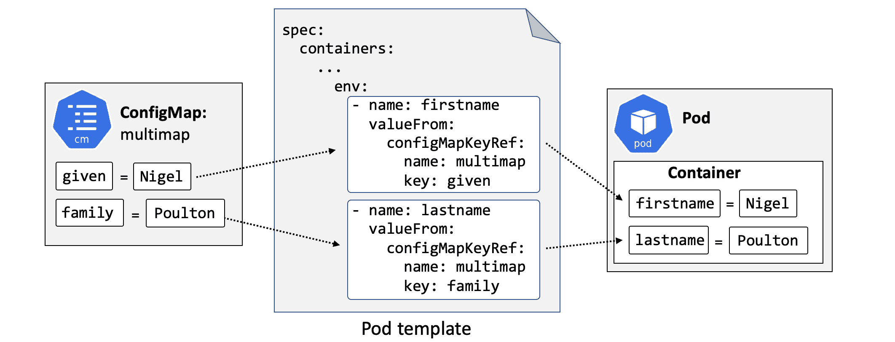
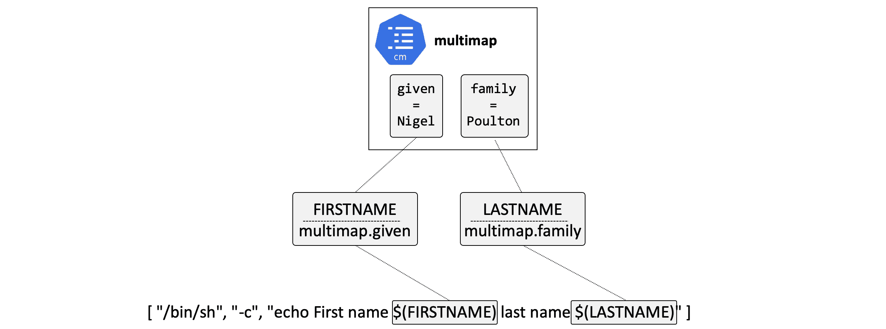
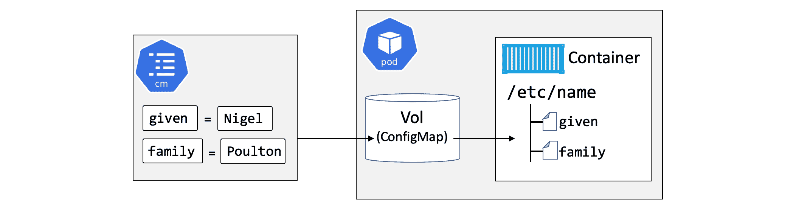

## 九、配置映射

大多数业务应用包括两个主要部分:

*   应用二进制
*   配置

一个简单的例子是网络服务器，如 NGINX 或 httpd (Apache)。如果没有配置，这两者都不是很有用。但是，当您将应用与配置相结合时，它会变得非常有用。

过去，我们将应用和配置耦合到一个易于部署的单元中。随着我们进入云原生微服务应用的早期，我们带来了这个模型。然而，这是云原生世界的反模式。云原生微服务应用应该将应用和配置分离，从而带来以下好处:

*   可重复使用的应用映像
*   更简单的测试
*   更简单、更少的破坏性变更

我们将在本章中解释所有这些以及更多内容。

我们将这一章分为以下几部分:

*   整体情况
*   配置图理论
*   实际操作配置图

### 整体情况

如前所述，大多数应用包括两个不同的部分——应用二进制和配置。这种模式不会随着运行在 Kubernetes 上的云原生微服务应用而改变。然而，这些类型的应用的一个核心原则是将两个组件解耦——您分别构建和存储它们，但在运行时将它们放在一起。

让我们考虑一个例子来了解一些好处…

#### 快速示例

想象如下。

您为一家向 Kubernetes 部署现代应用的公司工作，您有三个不同的环境:

*   偏差
*   试验
*   刺

您的开发人员编写和更新应用。初始测试在*开发*环境中进行，进一步测试在*测试*环境中进行，在该环境中应用了更严格的规则等。最后，稳定的组件升级到 *prod* 环境。

每个环境都有细微的差别，比如；节点数量、节点配置、网络和安全策略、不同的凭据和证书集等等。

您当前将每个应用微服务及其配置打包到容器中(应用和配置被打包为单个产品)。考虑到这一点，您必须为每个业务应用执行以下所有操作:

*   *构建*三个不同的映像(一个用于开发，一个用于测试，一个用于生产)
*   *将映像存储在三个不同的存储库中(开发、测试、生产)*
*   *在特定环境中运行*映像的每个版本(开发中的开发、测试中的测试、生产中的生产)

每次对应用配置进行更改时，您都需要创建一个全新的映像，并对整个应用执行某种类型的滚动更新——即使更改只是简单的修复一个错别字或更改字体的大小或颜色；-)

#### 分析示例

将应用及其配置存储为单个人工制品(容器映像)的方法有几个缺点。

由于您的 *dev* 、 *test* 、 *prod* 环境各有特点，每个环境都需要自己的形象。由于差异，产品*映像在*开发*或*测试*环境中无法工作。这需要额外的工作来创建和维护每个应用的 3 倍副本。这可能会使事情复杂化，增加错误配置的机会。*

您还必须在 3 个不同的存储库中存储 3 倍的映像。另外，您需要非常小心存储库的权限。这是因为您的*产品*映像将包含敏感的配置数据、敏感的密码和敏感的加密密钥。您可能不希望开发和测试工程师能够访问产品映像—访问映像意味着访问存储在其中的敏感数据。

此外，如果您推送的更新既包括应用二进制更新又包括配置更新，则更难解决问题。如果两者紧密耦合，就更难隔离故障。此外，如果您需要做一个小的配置更改(例如修复网页上的一个突出的错别字)，您需要重新打包、重新测试和重新部署整个应用二进制文件**和**配置。

这些都不理想。

#### 去耦合世界中的样子

现在假设你在同一家公司工作，但你做的事情不同。这一次，您的应用及其配置被解除耦合。这一次；

*   您构建了一个跨所有三个环境共享的映像
*   您将单个映像存储在单个存储库中
*   您可以在所有环境中运行每个映像的单一版本

为了做到这一点，您需要尽可能通用地构建应用映像，而不需要嵌入式配置。然后在单独的对象中创建和存储配置，并在运行时将配置应用于应用。例如，您有一个 web 服务器的单一副本，可以部署到所有三个环境中。当您将其部署到*戳*时，您将对其应用*戳*配置。当您在*开发*中运行它时，您将*开发*配置应用于它…

在这个模型中，您创建并测试存储在单个存储库中的每个应用映像的单个版本。所有员工都可以访问映像存储库，因为映像中没有存储敏感数据。最后，您可以轻松地将更改相互独立地推送到应用及其配置—更新一个简单的错别字不再需要重建和重新部署整个应用二进制文件和映像。

让我们看看 Kubernetes 是如何实现这一点的…

### 配置图理论

Kubernetes 提供了一个名为 ConfigMap (CM)的对象，允许您将配置数据存储在 Pod 之外。它还允许您在运行时动态地将数据注入 Pod。

> **注:**当我们使用术语*POD*时，我们指的是 POD 及其所有容器。毕竟，最终是容器接收配置数据。

配置图是*核心*应用编程接口组下的 Kubernetes 应用编程接口中的一级对象，它们是`v1`。这告诉我们很多事情:

1.  他们很稳定
2.  他们已经存在了一段时间(事实上他们是核心 API 组的成员)
3.  你可以用通常的`kubectl`命令对它们进行操作
4.  它们可以通过通常的 YAML 清单来定义和部署

配置映射通常用于存储非敏感配置数据，例如:

*   环境变量值
*   整个配置文件(如 web 服务器配置和数据库配置)
*   主机名
*   服务端口
*   账户名称
*   更多…

您应该**而不是**使用配置映射来存储敏感数据，如证书和密码。Kubernetes 提供了一个不同的对象，称为*秘密*，用于存储敏感数据。Secrets 和 ConfigMaps 在设计和实现上非常相似，主要区别在于 Kubernetes 采取的步骤掩盖了存储在 Secrets 中的值。它没有这样的努力来隐藏存储在配置映射中的数据。

#### 配置地图是如何工作的

在高级别上，配置图是存储配置数据的地方，这些数据可以在运行时无缝地注入到容器中，然后以应用不可见的方式加以利用。

让我们仔细看看…

在幕后，配置映射是键/值对的映射，我们将每个键/值对称为**条目**。

*   **键**是一个任意名称，可以由字母数字、破折号、点和下划线创建
*   **值**可以包含任何内容，包括回车
*   我们用冒号分隔键和值

一些简单的例子可能是:

*   db 端口:13306
*   主机名:msb-prd-db1

更复杂的示例可以存储整个配置文件，如下所示:

`value:`conf`value:`

```
directive in;
main block;
http {
  server {
    listen        80 default_server;
    server_name   *.msb.com;
    root          /var/www/msb.com;
    index         index.html

    location / {
      root   /usr/share/nginx/html;
      index  index.html;      
    }
  }
} 
```

 `一旦数据存储在配置映射中，就可以通过以下任何方法在运行时将其注入容器:

*   环境变量
*   容器启动命令的参数
*   卷中的文件

所有方法都可以与现有应用无缝协作。事实上，一个应用看到的只是它的配置数据；环境变量、启动命令的参数或文件系统中的文件。应用不知道数据最初来自配置映射。

图 9.1 显示了这些部分是如何连接的。


<figcaption>Figure 9.1</figcaption>

三种方法中最灵活的是*卷*选项，最受限的是*启动命令*。我们将依次查看每一个，但是在此之前，我们将快速考虑一个 *Kubernetes-native* 应用。

#### 配置地图和 Kubernetes-本地应用

Kubernetes 本地应用是一个知道自己在 Kubernetes 上运行的应用，并且具有查询 Kubernetes API 的智能。因此，Kubernetes 本地应用可以通过 API 直接访问 ConfigMap 数据，而不需要环境变量和卷之类的东西。这可以简化应用配置，但是应用将只在 Kubernetes 上运行。在撰写本文时，基于 Kubernetes 的本地应用很少。

### 实际操作配置图

与大多数 Kubernetes 对象一样，您可以强制性地和声明性地创建它们。我们先来看看命令式方法。

#### 强制创建配置映射

强制创建配置映射的命令是`kubectl create configmap`，但是您可以将`configmap`缩短为`cm`。该命令接受两个数据源:

*   命令行上的文字值(`--from-literal`)
*   命令行中引用的文件(`--from-file`)

运行以下命令创建一个名为`testmap1`的配置映射，该配置映射由命令行中传递的文字值填充两个映射条目。

```
$ kubectl create configmap testmap1 \
  --from-literal shortname=msb.com \
  --from-literal longname=magicsandbox.com 
```

 `下面的 description 命令显示了这两个条目是如何存储在地图中的。

```
$ kubectl describe cm testmap1
Name:         testmap1
Namespace:    default
Labels:       <none>
Annotations:  <none>

Data
====
shortname:
----
msb.com
longname:
----
magicsandbox.com
Events:  <none> 
```

 `您可以看到，该对象本质上是一个键/值对的映射，装扮成一个 Kubernetes 对象。这两个映射条目正是您对命令输入的期望:-条目 1: shortname=msb.com -条目 2: longname=magicsandbox.com

下一个命令将从名为`cmfile.txt`的文件创建一个配置映射。该命令假设您的工作目录中有一个名为`cmfile.txt`的本地文件。该文件包含以下单行文本，您可以在 configmaps 目录下从图书的 GitHub repo 中克隆一个副本。

```
Magic Sandbox, hands-on learning that blurs the lines between training and the real world. 
```

 `运行此命令从文件内容创建配置映射。请注意，该命令使用的是`--from-file`参数，而不是`--from-literal`。

```
$ kubectl create cm testmap2 --from-file cmfile.txt
configmap/testmap2 created 
```

 `下面的 description 命令很有趣，因为它显示了以下内容:

*   创建了单个地图条目
*   条目关键字的名称是文件名(`cmfile.txt`)
*   条目的值是文件的内容

```
$ kubectl describe cm testmap2
Name:         testmap2
Namespace:    default
Labels:       <none>
Annotations:  <none>

Data
====
cmfile.txt:
----
Magic Sandbox, hands-on learning that blurs the lines between training and the real world.
Events:  <none> 
```

 `#### 正在检查配置映射

配置映射是第一类应用编程接口对象。这意味着您可以像检查任何其他应用编程接口对象一样检查和查询它们。您已经看到了`kubectl describe`命令，但是其他`kubectl`命令也有效。`kubectl get`可以列出所有配置图，通常的`-o yaml`和`-o json`标志从集群存储中提取完整配置。

运行`kubectl get`列出当前命名空间中的所有配置映射。

```
$ kubectl get cm
AME       DATA   AGE
testmap1   2      11m
testmap2   1      2m23s 
```

 `下面带有`-o yaml`标志的`kubectl get`显示了对象的整个配置，并提示了一些有趣的东西。

```
$ kubectl get cm testmap1 -o yaml
apiVersion: v1
data:
  longname: magic-sandbox
  shortname: msb
kind: ConfigMap
metadata:
  creationTimestamp: "2019-10-27T11:42:23Z"
  name: testmap1
  namespace: default
  resourceVersion: "39223"
  selfLink: /api/v1/namespaces/default/configmaps/testmap1
  uid: 0b2f5daa-5905-419c-a1bc-0289e32fdead 
```

 `有趣的是，ConfigMap 对象没有状态的概念(期望状态和实际状态)。这就是为什么他们有一个`data`区块而不是`spec`和`status`区块。

让我们先了解如何以声明方式创建配置映射，然后再看如何将数据从配置映射注入到 Pod 中。

#### 以声明方式创建配置映射

以下配置映射清单定义了两个映射条目；`firstname`和`lastname`。这本书的 GitHub repo 中有一个名为`multimap.yml`的配置图文件夹。或者，您可以创建一个空文件，并从头开始练习编写自己的清单。

```
kind: ConfigMap 
apiVersion: v1 
metadata:
  name: multimap 
data:
  given: Nigel
  family: Poulton 
```

 `您可以看到一个配置映射清单有正常的`kind`和`apiVersion`字段，以及通常的`metadata`部分。但是，如前所述，它们没有`spec`部分。相反，他们有一个定义键/值映射的`data`部分。

您可以使用以下命令部署它(该命令假设您的工作目录中有一个名为`multimap.yml`的文件副本)。

```
$ kubectl apply -f multimap.yml
configmap/multimap created 
```

 `下一个 YAML 看起来稍微复杂一些，但实际上并不复杂——它在`data`块中创建了一个只有一个地图条目的配置地图。它看起来更复杂，因为地图条目的*值*部分是一个完整的配置文件。

```
kind: ConfigMap 
apiVersion: v1 
metadata:
  name: test-conf
data:
  test.conf: |
    env = plex-test
    endpoint = 0.0.0.0:31001
    char = utf8
    vault = PLEX/test
    log-size = 512M 
```

 `上一个 YAML 文件在条目的*键*属性的名称后插入了一个管道字符(|)。这告诉 Kubernetes，管道后面的所有内容都将被视为单个文字值。因此，配置地图对象被称为`test-config`，它包含如下单个地图条目:

*   键:`test.conf`
*   值: `env = plex-test endpoint = 0.0.0.0:31001 char = utf8 vault = PLEX/test log-size = 512M`

你可以用下面的`kubectl command`来部署之前的 CM。该命令假设您拥有名为`singlemap.yml`的文件的本地副本。

```
$ kubectl apply -f singlemap.yml 
configmap/test-conf created 
```

 `列出并描述您刚刚创建的`multimap`和`test-conf`配置图。下图显示了`kubectl describe`对`test-conf`地图的输出。

```
$ kubectl describe cm test-conf
Name:         test-conf
Namespace:    default
Labels:       <none>
Annotations:  kubectl.kubernetes.io/last-applied-configuration:
                {"apiVersion":"v1","data":{"test.config":"env = 
                plex-test\nendpoint = 0.0.0.0:31001\nchar = utf8
                \nvault = PLEX/test\nlog-size = 512M\n"},"...
Data
====
test.config:
----
env = plex-test
endpoint = 0.0.0.0:31001
char = utf8
vault = PLEX/test
log-size = 512M

Events:  <none> 
```

 `ConfigMaps 非常灵活，可以用来在运行时将复杂的配置文件(如 JSON 文件甚至脚本)插入容器。

#### 将配置映射数据注入 Pods 和容器

您已经看到了如何强制地和声明性地创建 ConfigMap 对象并用数据填充它们。现在让我们看看如何将这些数据放入在容器中运行的应用中。

将配置映射数据注入容器有三种主要方式:

*   作为环境变量
*   作为容器启动命令的参数
*   作为卷中的文件

让我们看看每一个。

##### 配置映射和环境变量

将配置映射数据获取到容器中的一种常见方式是通过环境变量。创建配置映射，然后将其条目映射到 Pod 模板容器部分的环境变量中。当容器启动时，环境变量在容器中显示为标准的 Linux 或 Windows 环境变量。

图 9.2。显示了这一点。



<figcaption>Figure 9.2</figcaption>

您已经有一个名为`multimap`的配置图，它有两个值:

*   给定=奈杰尔
*   家庭=波尔顿

下面的 Pod 清单部署了一个容器，在容器中创建了两个环境变量。

*   名字:映射到`multimap`配置映射中的`given`条目
*   姓氏:映射到`multimap`配置映射中的`family`条目

当 Pod 被调度并且容器被启动时，`FIRSTNAME`和`LASTNAME`将被创建为容器内的标准 Linux 环境变量。这些可以被运行在容器中的应用使用。

这本书的 GitHub repo 的 configmaps 文件夹中有一个名为`envpod.yml`的清单。以下命令将从`envpod.yml`文件部署 Pod，然后列出名称中包含`name`字符串的环境变量–这将列出`firstname`和`lastname`变量。您将看到它们填充了来自`multimap`配置图的值。

```
$ kubectl apply -f envpod.yml
pod/envpod created

$ kubectl exec envpod -- env | grep NAME
HOSTNAME=envpod
FIRSTNAME=Nigel
LASTNAME=Poulton 
```

 `将配置映射用于环境变量的一个缺点是环境变量是静态的。这意味着您对配置映射中的值所做的任何更新都不会反映在运行的容器中。例如，如果更新配置图中的`given`和`family`值，现有容器中的环境变量将不会得到更新。

##### 配置映射和容器启动命令

将配置映射用于容器启动命令的概念很简单。高层是这样的。可以为容器指定一个启动命令，并且可以使用变量自定义该启动命令。让我们看一个简单的例子…

以下 Pod 模板(YAML 清单中定义 Pod 及其容器的部分)定义了一个名为`args1`的容器。该容器基于`busybox`映像，运行第 5 行概述的`/bin/sh`命令。

```
spec:
  containers:
    - name: args1
      image: busybox
      command: [ "/bin/sh", "-c", "echo First name $(FIRSTNAME) last name $(LASTNAME)" ]
      env:
        - name: FIRSTNAME
          valueFrom:
            configMapKeyRef:
              name: multimap
              key: given
        - name: LASTNAME
          valueFrom:
            configMapKeyRef:
              name: multimap
              key: family 
```

 `如果你仔细观察启动命令，你会发现它引用了两个变量；`FIRSTNAME`和`LASTNAME`。这些都在启动命令正下方的`env:`部分定义。

*   `FIRSTNAME`基于`multimap`配置图中的`given`条目
*   `LASTNAME`基于同一配置图中的`family`条目

关系如图 9.3 所示。



<figcaption>Figure 9.3</figcaption>

运行一个基于先前 YAML 的 Pod 会将“名字奈杰尔姓氏波尔顿”打印到容器的日志文件中。您可以通过命令`$ kubectl logs <pod-name> -c args1`查看容器的日志

描述 POD 将产生以下描述 POD 环境的行。

```
Environment:
  FIRSTNAME:  <set to the key 'given' of config map 'multimap'> 
  LASTNAME:  <set to the key 'family' of config map 'multimap'> 
```

 `将 ConfigMaps 与容器启动命令一起使用与将它们与环境变量一起使用具有相同的局限性–对映射中条目的更新不会反映在运行的容器中。

##### 配置映射和卷

对卷使用配置映射是最灵活的选择。您可以引用整个配置文件，也可以对配置图进行更新，并将它们反映在运行的容器中。这意味着您可以在部署容器后对 ConfigMap 中的条目进行更改，这些更改可以在容器中看到，并可用于运行应用。

通过卷公开配置映射数据的高级过程如下所示。

1.  创建配置映射
2.  在 Pod 模板中创建*配置地图体积*
3.  将*配置映射体积*装入容器
4.  配置映射中的条目将作为单个文件出现在容器中

这个过程如图 9.4 所示



<figcaption>Figure 9.4</figcaption>

您仍然有两个值的`multimap`配置图。

*   给定=奈杰尔
*   家庭=波尔顿

下面的 YAML 创建了一个名为`cmvol`的 Pod，配置如下。

*   `spec.volumes`基于**多地图**配置地图创建名为 **volmap** 的卷
*   `spec.containers.volumeMounts`将 **volmap** 卷挂载到`/etc/name`

```
apiVersion: v1
kind: Pod
metadata:
  name: cmvol
spec:
  volumes:
    - name: volmap
      configMap:
        name: multimap
  containers:
    - name: ctr
      image: nginx
      volumeMounts:
        - name: volmap
          mountPath: /etc/name 
```

 `让我们更详细地介绍一下事情…

`spec.volumes`块创建一种特殊类型的卷，称为*配置映射卷*。该卷称为 **volmap** ，基于`multimap`配置图。这意味着该卷将填充存储在配置图的`data`块中的条目。在本例中，该卷将有两个文件；`given`和`family`。`given`文件会有`Nigel`的内容，`family`文件会有`Poulton`的内容。

`spec.containers`块将**体积图**装入`/etc/name`处的容器中。这意味着两个文件将在容器中显示为:

*   `/etc/name/given`
*   `/etc/name/family`

以下命令部署容器(从`cmvol.yml`清单)，然后运行`kubectl exec`命令列出`/etc/name/目录中的文件。

```
$ kubectl apply -f cmpod.yml
pod/cmvol created

$ kubectl exec volpod -- ls /etc/name
family
given 
```

 `### 章节总结

配置映射是 Kubernetes 提供的机制，用于分离应用及其配置。

配置映射是 Kubernetes API 中的一级对象，可以用常用的`kubectl create`、`kubectl get`和`kubectl describe`命令来创建和操作。它们是存储应用配置参数以及整个配置文件的理想选择，但是它们不应该用于存储敏感数据。

ConfigMap 数据在运行时注入容器，您可以通过环境变量、容器启动命令和卷注入数据。volumes 方法最灵活，因为它允许您使用整个配置文件。它还允许更新最终反映到已经运行的容器中。``````````````````