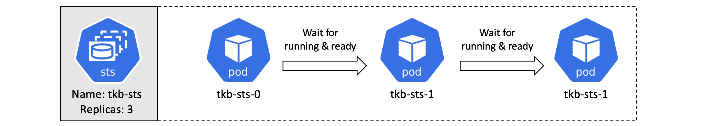
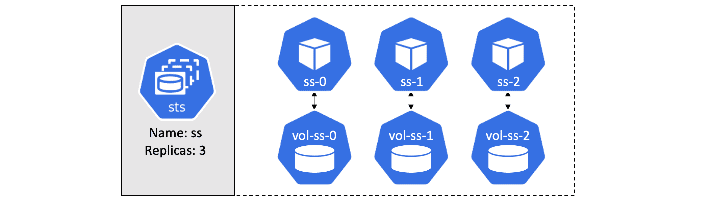

## 十、状态集

在本章中，您将学习如何使用*状态集*在 Kubernetes 上部署和管理有状态应用。

为了本章的目的，我们将*状态应用*定义为创建和保存有价值数据的应用。一个例子可能是保存客户端会话数据并将其用于未来客户端会话的应用。其他示例包括数据库和其他数据存储。

我们将这一章划分如下:

*   状态集理论
*   使用状态集进行操作

理论部分将向您介绍状态集的工作方式以及它们带来的内容。但是，如果您一开始并不了解所有内容，请不要担心，当我们完成实践部分时，我们会再次介绍大部分内容。

### 状态集理论

将状态集与部署进行比较通常很有用。两者都是 Kubernetes API 中的一级对象，并且遵循典型的 Kubernetes 控制器架构。这些控制器作为协调环运行，通过应用编程接口服务器监视集群的状态，并不断将集群的*观察状态*与*期望状态*同步。部署和状态集还支持自我修复、扩展、更新等。

然而，有一些重要的区别。状态集保证:

*   可预测且持久的 Pod 名称
*   可预测且持久的 DNS 主机名
*   可预测且持久的卷绑定

这三个属性形成了豆荚的*状态*，有时被称为豆荚*粘性 ID* 。该状态/粘性标识在故障、扩展和其他调度操作中保持不变，这使得状态集非常适合于 Pods 有点独特且不可互换的应用。

举一个简单的例子，由 StatefulSet 管理的故障 Pods 将被具有完全相同的 Pods 名称、完全相同的 DNS 主机名和完全相同的卷的新 Pods 替换。即使替换 Pod 在不同的群集节点上启动，也是如此。对于由部署管理的 Pods 来说，情况并非如此。

下面的 YAML 片段显示了典型状态集清单中的一些字段。

```
apiVersion: apps/v1
kind: StatefulSet
metadata:
  name: tkb-sts
spec:
  selector:
    matchLabels:
      app: mongo
  serviceName: "tkb-sts"
  replicas: 3
  template:
    metadata:
      labels:
        app: mongo
    spec:
      containers:
      - name: ctr-mongo
        image: mongo:latest
        ... 
```

 `StatefulSet 的名称是`tkb-sts`，它定义了三个运行`mongo:latest`映像的 Pod 副本。您将此发布到应用编程接口服务器，它被保存到集群存储，工作被分配到集群节点，状态集控制器监控集群的共享状态，并确保*观察到的状态*与*期望的状态*匹配。

这就是大局。在介绍一个例子之前，让我们先来看看 StatefulSets 的一些主要特性。

#### 状态集 Pod 命名

由一个状态集管理的所有 Pods 都获得了*可预测的*和*持久的*名称。这些名称至关重要，是 Pods 如何启动、自我修复、缩放、删除、附加到卷等等的核心。

StatefulSet Pod 名称的格式为`<StatefulSetName>-<Integer>`。整数是一个*从零开始的索引序数*，这只是一种说“从 0 开始的数字”的奇特方式。由 StatefulSet 创建的第一个 Pod 总是获得索引序号“0”，并且每个后续 Pod 都获得次高的序号。假设前面的 YAML 片段，第一个创建的 Pod 将被称为`tkb-sts-0`，第二个将被称为`tkb-sts-1`，第三个将被称为`tkb-sts-2`。

请注意，StatefulSet 名称需要是有效的 DNS 名称，因此不要使用外来字符！你以后会明白原因的。

#### 有序创建和删除

状态集的另一个基本特征是它们启动和停止 Pods 的受控有序方式。

状态集合一次创建一个 Pod，并且在创建下一个之前，总是等待前一个 Pod*正在运行并准备好*。这与使用复制集控制器同时启动所有 Pods 的部署不同，后者会导致潜在的竞争情况。

根据前面的 YAML 片段，`tkb-sts-0`将首先启动，并且必须在*运行*和*准备好*之后，StatefulSet 控制器才会启动`tkb-sts-1`。这同样适用于随后的吊舱–`tkb-sts-1`需要在`tkb-sts-2`开始之前*运行*和*准备好*等。参见图 10.1



<figcaption>Figure 10.1</figcaption>

> **注意:** *运行*和*就绪*是技术术语，用于指示 Pod 中的所有容器正在执行，Pod 已准备好服务请求。

缩放操作也由相同的有序启动规则控制。例如，从 3 个副本扩展到 5 个副本将启动一个名为`tkb-sts-3`的新 Pod，并等待它成为*运行并准备好*，然后再创建`tkb-sts-4`。按比例缩小遵循相反的规则–控制器首先终止具有最高索引序号(数字)的 Pod，等待它完全终止，然后再终止具有下一个最高序号的 Pod。

知道 Pods 缩小的顺序，以及知道 Pods 不会被并行终止，对于许多有状态应用来说是一个游戏规则的改变者。例如，如果多个副本同时宕机，存储数据的集群应用通常面临丢失数据的高风险。StatefulSets 保证这种情况永远不会发生，您可以通过`terminationGracePeriodSeconds`之类的东西插入其他延迟，以进一步控制缩减过程。总之，对于存储数据的集群应用来说，状态集带来了很多好处。

最后，值得注意的是，StatefulSet 控制器可以进行自我修复和扩展。这在架构上不同于使用单独的复制集控制器进行这些操作的部署。

#### 删除状态集

删除状态集时，需要考虑两个主要因素。

首先，删除状态集不会按顺序终止 Pods。考虑到这一点，您可能希望在删除状态集之前将其扩展到 0 个副本。

您也可以使用`terminationGracePeriodSeconds`来进一步控制 Pods 的终止方式。通常将该时间设置为至少 10 秒，以使在 Pods 中运行的应用有机会刷新本地缓冲区并安全地提交任何仍在进行中的写入。

#### 卷

卷是状态集 Pods *粘性 ID* (状态)的重要组成部分。

创建 StatefulSet Pod 时，它需要的任何卷都会同时创建，并以将它们连接到正确 Pod 的方式命名。图 10.2 显示了一个名为“ss”的状态集，请求 3 个副本。您可以看到每个 Pod 和卷(PVC)是如何创建的，以及这些名称如何将卷连接到 Pods。



<figcaption>Figure 10.2</figcaption>

卷通过正常的库本内斯持久卷子系统结构(持久卷和持久卷声明)与 Pods 适当地分离。这意味着卷对 Pods 具有独立的生命周期，并允许卷在 Pods 故障和终止操作中幸存下来。例如，每当 StatefulSet Pod 出现故障或终止时，关联的卷都不会受到影响。这允许替换的 Pods 连接到与它们要替换的 Pods 相同的存储设备。即使替换 Pod 计划到不同的群集节点，也是如此。

缩放操作也是如此。如果作为缩减操作的一部分删除了 StatefulSet Pod，后续的扩展操作会将新的 Pod 附加到与其名称匹配的现有卷上。

如果您不小心删除了 StatefulSet Pod，这种行为可能是一种救命稻草，尤其是当它是最后一个副本时！

#### 处理故障

状态集控制器观察集群的状态，并试图保持观察到的状态与期望的状态同步。最简单的例子是 Pod 故障。如果您有一个名为`tkb-sts`的状态集，有 5 个副本，`tkb-sts-3`失败，控制器将启动一个同名的替换 Pod，并将其连接到相同的卷。

但是，如果一个故障的 Pod 在 Kubernetes 更换后恢复，您将在网络上有两个相同的 Pod 写入相同的卷。这可能会导致数据损坏。考虑到这一点，StatefulSet 控制器在处理故障时非常小心。

潜在的节点故障尤其难以处理。例如，如果 Kubernetes 与一个节点失去联系，它如何知道该节点是否已关闭并且永远不会恢复，或者它是一个临时故障，如网络分区、崩溃的 Kubelet，还是该节点只是在重新启动？更复杂的是，控制器甚至不能强制 Pod 终止，因为 Kubelet 可能永远不会收到指令。考虑到这些因素，在 Kubernetes 替换故障节点上的 Pods 之前，需要手动干预。

#### 网络标识和无头服务

我们已经说过，状态集适用于需要 Pods 可预测且寿命更长的应用。因此，应用的其他部分以及其他应用可能需要直接连接到单个 Pods。为此，状态集使用无头服务为每个 Pod 副本创建可预测的 DNS 主机名。然后，其他应用可以向域名系统查询 Pod 副本的完整列表，并使用这些详细信息直接连接到 Pod。

下面的 YAML 片段显示了一个名为“mongo-prod”的无头服务，该服务在 YAML 州的州级集合中被列为管理服务。

```
apiVersion: v1
kind: Service
metadata:
  name: mongo-prod
spec:
  clusterIP: None
  selector:
    app: mongo
    env: prod
---
apiVersion: apps/v1
kind: StatefulSet
metadata:
  name: sts-mongo
spec:
  serviceName: mongo-prod 
```

 `我们来解释一下*无头服务*和*管理服务*这两个术语。

无头服务只是一个常规的 Kubernetes 服务对象，其`spec.clusterIP`设置为`None`。当你把它列在`spec.serviceName`下的状态集合清单中时，它就变成了管理服务的状态集合。

当这两个对象像这样组合时，服务将为与无头服务的标签选择器匹配的每个 Pod 副本创建 DNS SRV 记录。然后，其他 Pods 可以通过对无头服务的名称执行 DNS 查找来找到状态集的成员。稍后您将看到这一点，显然应用需要知道如何做到这一点。

这涵盖了大部分理论，让我们通过一个例子，看看这一切是如何结合在一起的。

### 使用状态集进行操作

在本章的这一节中，您将部署一个工作状态集。该示例旨在演示状态集的工作方式，并巩固您已经学习的内容。它不打算作为生产级应用配置。

引用的例子将适用于运行在 GCP 和 GKE 的 Kubernetes 集群。该课程的 GitHub repo 包含其他云平台的 YAML 文件。

我们将参考的所有 YAML 文件都在该书 GitHub repo 的`StatefulSets`文件夹中。您可以使用以下命令克隆 repo。

```
$ git clone https://github.com/nigelpoulton/TheK8sBook.git 
```

 `如果您跟随，您将部署以下三个对象:1。存储类 2。无头军种 3。州集合

为了更容易理解，您将分别检查和部署每个对象。但是，所有三个对象都可以组合在一个由三个破折号分隔的 YAML 文件中(参见回购的状态集合文件夹中的`app.yml`)。

#### 部署存储类

使用卷的状态集需要能够动态创建它们。为此，需要两个对象:

*   StorageClass (SC)
*   持续体积索赔

下面的 YAML 来自`/StatefulSets/gcp-sc.yml`文件，它定义了一个名为`flash`的存储类对象，该对象将使用 GCP 持久磁盘 CSI 驱动程序(`pd.csi.storage.gke.io`)从 GCP 动态调配固态硬盘卷(`type=pd-ssd`)。它将只适用于在 GCP 或 GKE 运行并启用了 CSI 驱动程序的 Kubernetes 集群。报告中还提供了用于在其他云平台(包括 AWS、Azure 和 Linode)上创建存储评估的 YAML 文件。

```
apiVersion: storage.k8s.io/v1
kind: StorageClass
metadata:
  name: flash
provisioner: pd.csi.storage.gke.io
volumeBindingMode: WaitForFirstConsumer
allowVolumeExpansion: true
parameters:
  type: pd-ssd 
```

 `部署存储类，确保为您的实验室环境使用适当的文件。

```
$ kubectl apply -f gcp-sc.yml
storageclass.storage.k8s.io/flash created 
```

 `列出集群的存储评估，以确保其创建正确。

```
$ kubectl get sc
NAME   PROVISIONER            RECLAIMPOLICY  VOLUMEBINDINGMODE      ALLOWEXPANSION   AGE
flash  pd.csi.storage.gke.io  Delete         WaitForFirstConsumer   true             5s 
```

 `有了存储类，PersistentVolumeClaims(聚氯乙烯)可以使用它来动态创建新卷。我们将在后面的例子中回到这一点。

#### 创建管理无头服务

当了解无头服务时，可视化一个有头有尾的服务对象可能会很有用。头部是网络上暴露的稳定 IP，尾部是它将向其发送流量的 Pods 列表。因此，无头服务是没有集群 IP 的服务对象。

以下 YAML 来自`StatefulSets/headless-svc.yml`文件，描述了一个名为`dullahan`的无头服务，没有 IP 地址(`spec.clusterIP: None`)。

```
apiVersion: v1
kind: Service
metadata:
  name: dullahan
  labels:
    app: web
spec:
  ports:
  - port: 80
    name: web
  clusterIP: None
  selector:
    app: web 
```

 `与常规服务的唯一区别是无头服务必须将值`clusterIP`设置为`None`。

当与状态集合相结合时，无头服务为每个与状态集合标签选择器相匹配的 Pod 创建可预测的稳定 DNS 条目。您将在后面的步骤中看到这一点。

将无头服务部署到您的集群。

```
$ kubectl apply -f headless-svc.yml
service/tkb-sts created 
```

 `验证操作。

```
$ kubectl get svc
NAME         TYPE        CLUSTER-IP   EXTERNAL-IP   PORT(S)   AGE
kubernetes   ClusterIP   10.0.0.1     <none>        443/TCP   145m
dullahan     ClusterIP   None         <none>        80/TCP    10s 
```

 `#### 部署状态集

有了存储类和无头服务，是时候部署状态集了。

下面的 YAML 来自`StatefulSets/sts.yml`文件，定义了状态集合。请记住，这仅用于学习目的，并不打算作为应用的生产级部署。

```
apiVersion: apps/v1
kind: StatefulSet
metadata:
  name: tkb-sts
spec:
  replicas: 3 
  selector:
    matchLabels:
      app: web
  serviceName: "dullahan"
  template:
    metadata:
      labels:
        app: web
    spec:
      terminationGracePeriodSeconds: 10
      containers:
      - name: ctr-web
        image: nginx:latest
        ports:
        - containerPort: 80
          name: web
        volumeMounts:
        - name: webroot
          mountPath: /usr/share/nginx/html
  volumeClaimTemplates:
  - metadata:
      name: webroot
    spec:
      accessModes: [ "ReadWriteOnce" ]
      storageClassName: "flash"
      resources:
        requests:
          storage: 1Gi 
```

 `有很多东西需要理解，所以让我们一步一步来看重要的部分。

状态集的名称是`tkb-sts`。这一点很重要，因为它构成了 statefolset 将创建的每个 Pod 的名称的一部分——由该 statefolset 创建的每个 Pod 都有一个以`tkb-sts`开头的名称。

`spec.replicas`字段定义了 3 个 Pod 副本。这些将被命名为`tsk-sts-0`、`tsk-sts-1`和`tsk-sts-2`。它们将按数字顺序创建，StatefulSet 控制器将等待每个副本运行并准备好，然后再开始下一个副本。

`spec.serviceName`字段指定管理服务*。这是上一步中创建的无头服务的名称，将为每个状态集副本创建 DNS SRV 记录。它被称为*管理服务*，因为它负责国家域名系统使用的域名子域。*

`spec.template`部分的剩余部分定义了将用于消除 Pod 副本的 Pod 模板，例如使用哪个容器映像和暴露哪个端口。

最后，也是最重要的，是`spec.volumeClaimTemplates`部分。

在本章的前面，我们说过每个使用卷的 StatefulSet 都需要能够动态创建它们。为此，您需要一个存储类和一个持久卷声明。

您已经创建了存储类，所以您已经准备好了。然而，聚乙烯吡咯烷酮提出了一个有趣的挑战。

每个 StatefulSet Pod 都需要自己独特的存储。这意味着每个人都需要自己的聚氯乙烯。然而，这是不可能的，因为每个 Pod 都是从同一个模板创建的。此外，您必须为每个潜在的状态集 Pod 预先创建一个唯一的聚氯乙烯，当您考虑状态集可以上下扩展时，这也是不可能的。

显然，需要一种更智能的状态集感知方法。这就是*卷索赔模板*发挥作用的地方。

在高级别上，每次动态创建新的 Pod 副本时，volumeClaimTemplate 都会动态创建一个 PVC。它还包含命名聚氯乙烯的智能，因此它可以正确地连接到豆荚。这样，StatefulSet 清单包含一个用于冲压出 Pod 副本的 Pod 模板部分，以及一个用于冲压出 PVC 的卷声明模板部分。

下面的 YAML 代码片段显示了来自示例 StatefulSet 应用的 volumeClaimTemplate。它定义了一个名为`webroot`的声明模板，该模板从之前创建的`flash`存储池中请求一个 10GB 的卷。

```
volumeClaimTemplates:
- metadata:
    name: webroot
  spec:
    accessModes: [ "ReadWriteOnce" ]
    storageClassName: "flash"
    resources:
      requests:
        storage: 10Gi 
```

 `部署 StatefulSet 对象时，它将创建三个 Pod 副本和三个 PVC。

部署状态集，并观看 Pods 和 PVC 的创建。

```
$ kubectl apply -f sts.yml
statefulset.apps/tkb-sts created 
```

 `观看 StatefulSet 增加到 3 个运行副本。这将需要一分钟左右的时间来创建 3 个吊舱和相关的 PVCs 每个吊舱都需要在下一个开始之前运行并准备好。

```
$ kubectl get sts --watch
NAME      READY   AGE
tkb-sts   0/3     10s
tkb-sts   1/3     23s
tkb-sts   2/3     46s
tkb-sts   3/3     69s 
```

 `注意启动第一个副本需要大约 23 秒。一旦它开始运行并准备好，它又花了 23 秒开始第二次，然后又花了 23 秒开始第三次。

现在检查 PVC。

```
$ kubectl get pvc
NAME                STATUS   VOLUME            CAPACITY   MODES   STORAGECLASS   AGE
webroot-tkb-sts-0   Bound    pvc-1146...f274   10Gi       RWO     flash          86s
webroot-tkb-sts-1   Bound    pvc-3026...6bcb   10Gi       RWO     flash          63s
webroot-tkb-sts-2   Bound    pvc-2ce7...e56d   10Gi       RWO     flash          40s 
```

 `有 3 个新的 PVC，每个 PVC 都是作为一个 StatefulSet Pod 副本同时创建的。查看每个聚氯乙烯的名称如何基于状态集的名称及其关联的 Pod。聚氯乙烯名称的格式是 volumeClaimTemplate 名称，后跟破折号，再跟与之关联的 Pod 副本的名称。

```
Pod Name     |    PVC Name 
tkb-sts-0   <->   webroot-tkb-sts-0
tkb-sts-0   <->   webroot-tkb-sts-1
tkb-sts-0   <->   webroot-tkb-sts-2 
```

 `此时，状态集已启动并运行，应用副本正在执行。

#### 测试对等发现

您知道，将无头服务与状态集配对会为每个与服务的标签选择器匹配的状态集 Pod 创建 DNS SRV 记录。您已经运行了一个无头服务和 3 个状态集 Pod，因此您应该有三个 DNS SRV 记录——每个 Pod 一个。

然而，在测试这一点之前，值得花点时间了解一下域名系统主机名和域名系统子域是如何与状态集一起工作的。

默认情况下，Kubernetes 将所有对象放置在`cluster.local` DNS 子域内。您可以选择不同的东西，但是大多数实验室环境都使用这个域，所以我们将在本例中假设它。在该域中，Kubernetes 构建了如下 DNS 子域:

`<object-name>.<service-name>.<namespace>.svc.cluster.local`

*   `svc`表示服务背后对象的子域。

到目前为止，已经有三个名为`tkb-sts-0`、`tkb-sts-1`和`tkb-sts-2`的豆荚由`dullahan`无头服务管理。这意味着 3 个 pod 将具有以下完全限定的域名:

*   `tkb-sts-0.dullahan.default.svc.cluster.local`
*   `tkb-sts-1.dullahan.default.svc.cluster.local`
*   `tkb-sts-2.dullahan.default.svc.cluster.local`

为了测试这一点，您将部署一个预装了域名系统`dig`实用程序的跳转模块。你将`exec`放到那个吊舱上，你将使用`dig`在`dullahan.default.svc.cluster.local`子域中查询域名系统中的服务请求记录。

在课程的 GitHub 报告中从`/StatefulSets/jump-pod.yml`文件部署跳转。

```
$ kubectl apply -f jump-pod.yml
pod/jump-pod created 
```

 `执行到吊舱。

```
$ kubectl exec -it jump-pod -- bash
root@jump-pod:/# 
```

 `你的终端现在已经连接到跳跃舱了。从跳舱运行以下挖掘命令。

```
$ dig SRV dullahan.default.svc.cluster.local
<Snip>
;; ADDITIONAL SECTION:
tkb-sts-0.dullahan.default.svc.cluster.local. 30 IN A 10.24.1.25
tkb-sts-2.dullahan.default.svc.cluster.local. 30 IN A 10.24.1.26
tkb-sts-1.dullahan.default.svc.cluster.local. 30 IN A 10.24.0.17
<Snip> 
```

 `该查询返回每个 Pod 的完全限定域名及其 IP。包括应用本身在内的其他应用可以使用这种方法来发现 StatefulSet 中 Pods 的完整列表。

为了使这种发现方法有用，应用显然需要知道如何使用它。他们还必须知道状态集的管理服务的名称，并且状态集 Pods 必须与管理服务的标签选择器匹配。

#### 缩放状态集

每次扩大状态集时，都会创建一个 Pod **和**聚氯乙烯。但是，当缩小状态集时，Pod 会终止，但 PVC 不会。这意味着未来的扩展操作只需要创建一个新的 Pod，然后将其连接到幸存的 PVC。StatefulSet 控制器包括跟踪和管理 Pods 和 PVC 之间映射的所有智能。

您目前有 3 个状态集 Pod 副本和 3 个 PVC。编辑`sts.yml`文件，将副本数量从 3 更改为 2，并保存您的更改。完成后，运行以下命令将 YAML 文件重新发布到集群。

```
$ kubectl apply -f sts.yml
statefulset.apps/tkb-sts configured 
```

 `检查状态集的状态，并验证 Pod 计数已减少到 2。

```
$ kubectl get sts tkb-sts
NAME      READY   AGE
tkb-sts   2/2     14m

$ kubectl get pods
NAME        READY   STATUS    RESTARTS   AGE
tkb-sts-0   1/1     Running   0          15m
tkb-sts-1   1/1     Running   0          15m 
```

 `Pod 副本的数量已成功缩减至 2，索引序号最高的 Pod 已被删除。但是，您仍然会有 3 个聚氯乙烯–记住，缩小和删除 Pod 副本不会**删除相关的聚氯乙烯。核实一下。**

```
$ kubectl get pvc
NAME                STATUS   VOLUME            CAPACITY   MODES   STORAGECLASS   AGE
webroot-tkb-sts-0   Bound    pvc-1146...f274   10Gi       RWO     flash          15m
webroot-tkb-sts-1   Bound    pvc-3026...6bcb   10Gi       RWO     flash          15m
webroot-tkb-sts-2   Bound    pvc-2ce7...e56d   10Gi       RWO     flash          15m 
```

 `事实上，所有三个 PVC 仍然存在，这意味着缩减到三个副本只需要创建一个新的 Pod。由于幸存的聚氯乙烯的名称是`webroot-tkb-sts-2`，StatefulSet 控制器知道将其自动连接到新的 Pod。

编辑`sts.yml`文件，将副本数量增加回 3，并保存您的更改。完成后，使用以下命令将 YAML 文件重新发布到应用编程接口服务器。

```
$ kubectl apply -f sts.yml
statefulset.apps/tkb-sts configured 
```

 `给它几秒钟来部署新的 Pod，然后使用以下命令进行验证。

```
$ kubectl get sts tkb-sts
NAME      READY   AGE
tkb-sts   3/3     20m 
```

 `你又有 3 个豆荚了。描述新的`webroot-tkb-sts-2`聚氯乙烯，以验证它是否安装在正确的吊舱上。

```
$ kubectl describe pvc webroot-tkb-sts-2 | grep Mounted
Mounted By:    tkb-sts-2 
```

 `值得注意的是，如果任何 Pods 处于失败状态，缩减操作将被暂停。这是为了保护应用的弹性及其数据的完整性。

最后，可以通过 StatefulSet 的`spec.podManagementPolicy`属性来调整 Pods 的受控有序启动和停止。

默认设置为`OrderedReady`，并执行前面解释的严格的有条不紊的排序。将该值设置为`Parallel`将使状态集更像一个部署，在该部署中，Pods 被并行创建和删除。例如，从 2 >缩小 5 个豆荚将立即创建所有三个新豆荚，从 5 >缩小 2 将并行删除三个豆荚。StatefulSet 命名规则仍会实施，该设置仅适用于缩放操作，不会影响滚动更新。

#### 执行滚动更新

状态集支持滚动更新。您在 YAML 更新映像版本，并将其重新发布到应用编程接口服务器。一旦通过认证和授权，控制器将用新的 Pods 替换旧的 Pods。然而，这个过程总是从编号最高的 Pod 开始，一次一个，直到所有 Pod 都在新版本上。控制器还等待每个新的 Pod 运行并准备就绪，然后用下一个最低的索引序号替换它。

更多信息，运行`$ kubectl explain sts.spec.updateStrategy`。

#### 测试吊舱故障

测试故障的一个简单方法是手动删除 Pod。这将删除 Pod，但不会删除关联的聚氯乙烯。状态集控制器将注意到观察到的状态与所需状态不同，意识到一个 Pod 已被删除，并在其位置启动一个新的相同 Pod。这个新的吊舱将具有相同的名称，并将连接到相同的聚氯乙烯。

我们来测试一下。

确认您的状态集中有三个健康的豆荚。

```
$ kubectl get pods
NAME        READY   STATUS   AGE
tkb-sts-0   1/1     Running  37m
tkb-sts-1   1/1     Running  37m
tkb-sts-2   1/1     Running  18m 
```

 `你将要删除`tkb-sts-0`吊舱。但在此之前，我们先用`$ kubectl describe`确认一下它目前使用的 PVC。您不需要这样做，因为您可以从 volumeClaimTemplate 和 StatefulSet 的名称中推导出 PVC 的名称。不过，确认一下也不错。

```
$ kubectl describe pod tkb-sts-0
Name:         tkb-sts-0
Namespace:    default
<Snip>
Status:       Running
IP:           10.24.1.13
<Snip>
Volumes:
  webroot:
    Type:       PersistentVolumeClaim (a reference to a PersistentVolumeClaim...)
    ClaimName:  webroot-tkb-sts-0
<Snip> 
```

 `根据输出(您的实验室会有所不同)，这些值如下:

*   名称:tkb-sts-0
*   PVC:webroot-tkb STS-0

让我们删除`tkb-sts-0` Pod，看看 StatefulSet 控制器是否会重新创建它。

```
$ kubectl delete pod tkb-sts-0
pod "tkb-sts-0" deleted

$ kubectl get pods --watch
NAME        READY   STATUS              RESTARTS   AGE
tkb-sts-1   1/1     Running             0          43m
tkb-sts-2   1/1     Running             0          24m
tkb-sts-0   0/1     Terminating         0          43m
tkb-sts-0   0/1     Pending             0          0s
tkb-sts-0   0/1     ContainerCreating   0          0s
tkb-sts-0   1/1     Running             0          34s 
```

 `在命令上放置`--watch`显示状态集合控制器注意到终止的 Pod 并创建替换-期望的状态是 3 个副本，但是观察到的状态下降到 2 个。由于故障干净且易于验证，控制器立即启动了创建新 Pod 的过程。

你可以看到新的 Pod 和失败的有相同的名字，但是它有相同的 PVC 吗？

下面的命令证实了这一点。

```
$ kubectl describe pod tkb-sts-0 | grep ClaimName
    ClaimName:  webroot-tkb-sts-0 
```

 `从潜在的节点故障中恢复要复杂得多，需要手动干预。这是因为众所周知，出现故障的节点很难诊断和确认，并且始终存在故障可能是暂时的风险。如果状态集控制器假设某个节点出现故障并替换了任何状态集单元，但该节点随后恢复，则网络上的重复单元有可能争夺相同的存储。这会导致各种坏事发生，包括破坏数据。

#### 删除状态集

在本章的前面，您了解到删除状态集不会按顺序终止托管 Pods。因此，如果您的应用需要按顺序关闭 Pods，您应该在启动删除操作之前将 StatefulSet 扩展到 0 个副本。

将您的状态集扩展到 0 个副本，并确认操作。该集可能需要几秒钟才能一直缩小到 0。

```
$ kubectl scale sts tkb-sts --replicas=0
statefulset.apps/tkb-sts scaled

$ kubectl get sts tkb-sts
NAME      READY   AGE
tkb-sts   0/0     86m 
```

 `一旦状态集没有副本，您就可以将其删除。

```
$ kubectl delete sts tkb-sts
statefulset.apps "tkb-sts" deleted 
```

 `也可以通过`$ kubectl delete -f sts.yml`引用其 YAML 文件来删除状态集。

请随意在跳转面板上执行并运行另一个`dig`来证明 SRV 记录已经从域名系统中删除。

此时，StatefulSet 对象被删除，但是无头服务、存储类和跳转容器仍然存在。您可能也想删除它们。

### 章节总结

在本章中，您学习了状态集如何创建和管理需要保持状态的应用。

它们可以自我修复、上下扩展和执行更新。回滚需要手动注意。

由 StatefulSet 产生的每个 Pod 复制副本都有一个可预测且持久的名称、DNS 主机名和唯一的卷集。这些会伴随 Pod 的整个生命周期，包括故障、重启、扩展和其他调度操作。事实上，StatefulSet Pod 名称对于扩展操作和连接到存储卷是不可或缺的。

然而，状态集只是一个框架。应用需要以利用状态集行为方式的方式编写。``````````````````````````````