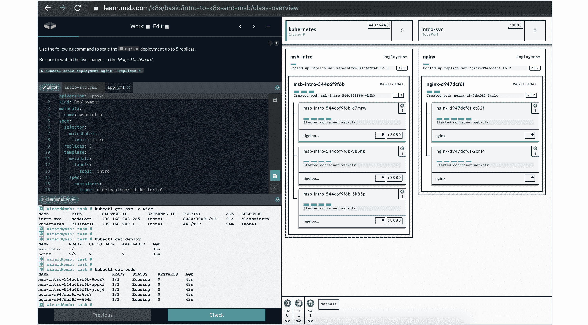

## 下一步怎么样

有很多方法可以让你的 Kubernetes 之旅更上一层楼，幸运的是，大多数方法都很简单。

### 熟能生巧

我知道这次我是*明显队长*，但是没有什么可以代替动手练习。幸运的是，在你成为世界权威之前，在 Kubernetes 的操场上旋转从来没有这么容易过！

我建议如下:

*   魔法沙盒(msb.com)
*   和忽必烈一起玩
*   Docker 桌面

魔力沙盒是一家和我关系极其密切的公司(我是内容主管)。这是亲身体验您自己的私有全功能多节点集群的最佳场所。您还可以获得精心策划的实验室，一个惊人的实时仪表板，实时显示您的集群和应用，等等。这是一项基于订阅的服务，但我强烈建议您查看一下，它甚至有一个免费层供您试用。

<figcaption>

与 Kubernetes 一起玩可以获得一个有时间限制的基于互联网的沙盒——你可以在自己的集群上玩 4 个小时。它是作为免费服务提供的，所以有时性能和可用性并不好。但是，嘿，这是免费的。

Docker Desktop 是 Docker，Inc .推出的一款免费桌面应用，可用于你的 Mac 和 PC。它包括一个单节点开发集群，如果您需要在笔记本电脑上玩一些东西，这是非常好的。

还有其他选择，它们都比过去简单得多。我记得在 Windows NT 上为我的 MSCE 学习，花了无数个小时从我卧室里积满灰尘的旧康柏电脑上的光盘安装中重建 NT 域。现在事情简单多了，没有借口不弄脏我们的手。

### 更多的书

我有一本书在 Docker 上获得了好评，包括被 BookAuthority 评为有史以来最佳 Docker 书籍。Docker 和容器是 Kubernetes 不可或缺的一部分，所以如果你需要了解更多关于 Docker 和容器的知识，请查看它——它被称为 Docker Deep Dive，你可以在亚马逊和 Leanpub 上获得它。

### 视频培训

如果你喜欢这本书，你会爱上我的视频课程的！

*   库比涅斯 101
*   Kubernetes 入门(pluralsight.com)
*   库比涅斯·迪瓦(acloud . guru/learn/ku 比涅斯·迪瓦)

我在 Pluralsight 上也有几门 Docker 课程。

如果你不是 Pluralsight 或云宗师的成员，我建议你成为其中一员！是的，它们需要钱，但它们可能是你职业生涯中最好的投资！每个平台的每月订阅可以让您访问该平台库中的每门课程，从开发人员到信息技术运营。如果你不确定是否要花钱，通常会有一个免费试用，你可以在有限的时间内免费使用。

### 活动和会议

你应该参加像 KubeCon 和 ServiceMeshCon 这样的活动。在这些活动中有如此多的伟人，有如此多的东西需要学习。

您还应该参与本地的 Kubernetes、DevOps、云原生和 Docker 会议。转到`meetup.com`并输入“Kubernetes”或“DevOps”，它会在您的本地找到会议。或者，你可以在谷歌上输入类似“kubernetes meetup Manchester”的内容，它会找到你的本地 meetup。

现在就这样。继续学习！

### 反馈

非常感谢你读了我的书。你买了它，我感到很谦卑，希望你喜欢它。

如果你能:

*   把这件事告诉朋友或同事
*   在亚马逊上留下评论

写一篇亚马逊评论完全不需要时间，即使你是从 Leanpub 或者其他地方买的书，你也可以留下评论。

还有，随时在[推特](https://twitter.com/nigelpoulton)上打我。

<figcaption>

并随时访问**nigelpoulton.com**找到我的所有内容，包括；新闻&更新、最新 YouTube 视频、研讨会、网络研讨会等。

就这样。长寿繁荣…

</figcaption>

</figcaption>