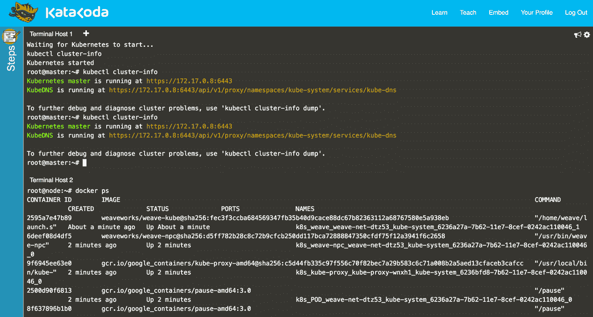
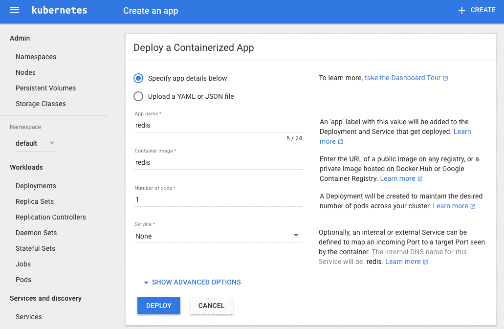
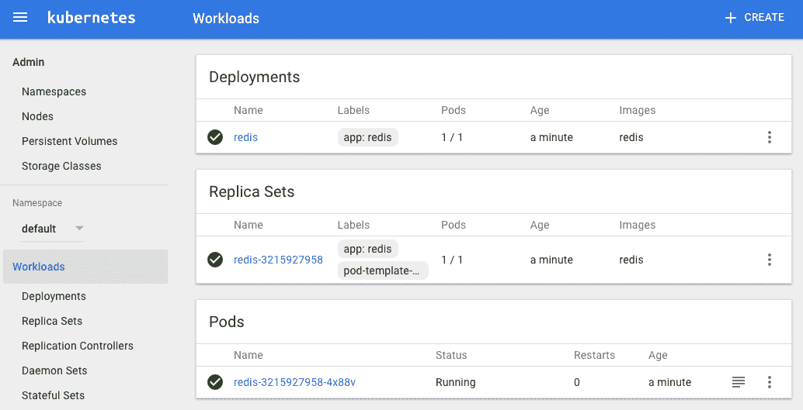

# 一、Kubernetes 入门

在这第一章中，我们将介绍帮助您开始使用 Kubernetes 的食谱。我们向您展示了如何在不安装 Kubernetes 的情况下使用它，并介绍了命令行界面(CLI)和仪表板(允许您与集群交互)等组件，以及 Minikube(一种可以在笔记本电脑上运行的一体化解决方案)。

# 1.1 不安装使用 Kubernetes

## 问题

你想不用安装就试试 Kubernetes 。

## 解决办法

要使用 Kubernetes 而不安装它，请遵循 Kubernetes 网站上的[互动教程。](https://kubernetes.io/docs/tutorials/kubernetes-basics/)

你也可以使用卡塔科达上的 [Kubernetes 游乐场](https://www.katacoda.com/courses/kubernetes/playground)。一旦您使用 GitHub 或其中一种社交媒体身份验证方法登录，您将看到在[图 1-1](#katacoda_k8s_playground) 中描绘的页面。



###### 图 1-1。卡塔科达·Kubernetes 游乐场截图

请注意，您在操场上启动的环境只在有限的时间内可用——目前是一个小时——但它是免费的，您只需要一个浏览器。

# 1.2 安装 Kubernetes CLI Kubernetes

## 问题

您希望安装 Kubernetes 命令行界面，以便可以与 Kubernetes 集群进行交互。

## 解决办法

通过以下方式之一安装`kubectl`:

*   下载源 tarballs。

*   使用包管理器。

*   从源构建(参见[配方 13.1](13.html#compiling_source) )。

[文档](https://kubernetes.io/docs/tasks/kubectl/install/)强调了一些获得`kubectl`的机制。最简单的就是下载最新的官方版本。例如，在 Linux 系统上，要获得最新的稳定版本，请输入:

```
$ curl -LO https://storage.googleapis.com/kubernetes-release/release/ \
       $(curl -s https://storage.googleapis.com/kubernetes-release/ \
       release/stable.txt) \
       /bin/linux/amd64/kubectl

$ chmod +x ./kubectl

$ sudo mv ./kubectl /usr/local/bin/kubectl
```

macOS 用户只需通过家酿就能获得`kubectl`:

```
$ brew install kubectl
```

谷歌 Kubernetes 引擎用户(见[食谱 2.7](02.html#gke_start) )将获得`kubectl`作为`gcloud`命令安装的一部分。 例如，在塞巴斯蒂安的本地机器上:

```
$ which kubectl
/Users/sebgoa/google-cloud-sdk/bin/kubectl
```

还要注意的是，Minikube 的最新版本(见[食谱 1.3](#minikube_install) )打包了`kubectl`，如果找不到的话会安装到你的`$PATH`中。

在你继续这个食谱之前，通过列出它的版本来确保你有一个有效的`kubectl`。该命令还将尝试获取默认 Kubernetes 集群的版本:

```
$ kubectl version
Client Version: version.Info{Major:"1", \
                             Minor:"7", \
                             GitVersion:"v1.7.0", \
                             GitCommit:"fff5156...", \
                             GitTreeState:"clean", \
                             BuildDate:"2017-03-28T16:36:33Z", \
                             GoVersion:"go1.7.5", \
                             Compiler:"gc", \
                             Platform:"darwin/amd64"}
...
```

## 请参见

*   关于[安装`kubectl`T2 的文件](https://kubernetes.io/docs/tasks/kubectl/install/)

# 1.3 安装 Minikube 以运行本地 Kubernetes 实例

## 问题

您希望在本地机器上使用 Kubernetes 进行测试、开发或培训。

## 解决办法

使用 Minikube。Minikube 是一个工具，可以让你在本地机器上使用 Kubernetes，除了`minikube`二进制以外，不需要任何安装。它利用您的本地虚拟机管理程序(例如 VirtualBox、KVM)，并在单个节点中启动运行 Kubernetes 的虚拟机。

要在本地安装 Minikube CLI，可以从源代码获取最新版本或内部版本。要获得 v0.18.0 版本并在基于 Linux 的机器上安装`minikube`，请执行以下操作:

```
$ curl -Lo minikube https://storage.googleapis.com/minikube/releases/v0.18.0/ \
                    minikube-linux-amd64

$ chmod +x minikube

$ sudo mv minikube /usr/local/bin/
```

这将把`minikube`二进制放在你的路径中，并使它可以从任何地方访问。

## 讨论

一旦安装了`minikube`，您可以使用以下命令验证正在运行的版本:

```
$ minikube version
minikube version: v0.18.0
```

您可以从以下内容开始:

```
$ minikube start
```

一旦启动阶段结束，您的 Kubernetes 客户端`kubectl`将拥有一个`minikube`上下文，并将自动开始使用该上下文。检查集群中有哪些节点将返回`minikube`主机名:

```
$ kubectl get nodes
NAME       STATUS    AGE
minikube   Ready     5d
```

## 请参见

*   [迷你库布文件](https://kubernetes.io/docs/getting-started-guides/minikube/)

*   `minikube`来源于 [GitHub](https://github.com/kubernetes/minikube)

# 1.4 在本地使用 Minikube 进行开发

## 问题

您希望在本地使用 Minikube 来测试和开发 Kubernetes 应用。您已经安装并启动了`minikube`(参见[食谱 1.3](#minikube_install) )并想知道一些额外的命令来简化您的开发体验。

## 解决办法

Minikube 命令行界面提供了一些命令，让您的生活更轻松。CLI 有内置的帮助，您可以使用它来自行发现子命令——下面是一个片段:

```
$ minikube
...
Available Commands:
  addons           Modify minikube's kubernetes addons.
...
  start            Starts a local kubernetes cluster.
  status           Gets the status of a local kubernetes cluster.
  stop             Stops a running local kubernetes cluster.
  version          Print the version of minikube.
```

除了`start`、`stop`、`delete`外，你应该熟悉`ip`、`ssh`、`dashboard`和`docker-env`命令。

###### 小费

Minikube 运行 Docker 引擎来启动容器。为了使用本地 Docker 客户端从本地机器访问这个 Docker 引擎，您需要使用`minikube docker-env`设置正确的 Docker 环境。

## 讨论

`minikube start`命令启动将在本地运行 Kubernetes 的虚拟机(VM)。默认情况下，它会分配 2 GB 的内存，所以当你完成后，不要忘记用`minikube stop`停止它。此外，您可以给虚拟机更多内存和 CPU，并选择某个 Kubernetes 版本来运行，例如:

```
$ minikube start --cpus=4 --memory=4000 --kubernetes-version=v1.7.2
```

为了调试 Minikube 内部使用的 Docker 守护程序，您可能会发现`minikube ssh`很方便；它会让你登录虚拟机。要获取 Minikube 虚拟机的 IP 地址，请使用`minikube ip`。最后，要在默认浏览器中启动 Kubernetes 仪表盘，请使用`minikube dashboard`。

###### 小费

如果因为任何原因你的 Minikube 变得不稳定，或者你想重新开始，你可以用`minikube stop`和`minikube delete`移除它。然后一个`minikube start`会给你一个全新的安装。

# 1.5 在 Minikube 上启动您的第一个应用

## 问题

您已经启动了 Minikube(参见[食谱 1.3](#minikube_install) ，现在您想在 Kubernetes 上启动您的第一个应用。

## 解决办法

例如，您可以使用两个`kubectl`命令在 Minikube 上启动 [Ghost](https://ghost.org) 微博平台:

```
$ kubectl run ghost --image=ghost:0.9
$ kubectl expose deployments ghost --port=2368 --type=NodePort
```

手动监控 pod，查看其何时开始运行，然后使用`minikube service`命令自动打开您的浏览器并访问 Ghost:

```
$ kubectl get pods
NAME                     READY     STATUS    RESTARTS   AGE
ghost-8449997474-kn86m   1/1       Running   0          2h

$ minikube service ghost
```

## 讨论

`kubectl run`命令称为*发电机*；创建`Deployment`对象是一个方便的命令(参见[配方 4.4](04.html#deployments) )。`kubectl expose`命令也是一个生成器，一个创建`Service`对象(参见[配方 5.1](05.html#simple_service) )的便利命令，该对象将网络流量路由到由您的部署启动的容器。

# 1.6 在 Minikube 中访问仪表板

## 问题

您正在使用 Minikube，并希望访问 Kubernetes 仪表板，从图形用户界面启动您的第一个应用。

## 解决办法

您可以通过以下方式从 Minikube 打开 Kubernetes 仪表板:

```
$ minikube dashboard
```

点击浏览器中打开的 UI 右上角的加号(+)，会看到[图 1-2](#dashboard_create) 中描绘的页面。



###### 图 1-2。仪表板应用创建视图的快照

## 讨论

要创建应用，请单击右上角的“创建”按钮，为应用命名，并指定要使用的 Docker 映像。然后单击“部署”按钮，您将看到一个显示部署和副本集的新视图，一段时间后，您将看到一个窗格。这些是一些关键的 API 原语，我们将在本书的剩余部分中更详细地讨论。

[图 1-3](#redis-dashboard) 中的快照展示了使用 Redis 容器创建单个应用后的典型仪表板视图。



###### 图 1-3。带有 Redis 应用的仪表板概述

如果您回到终端会话并使用命令行客户端，您将看到相同的内容:

```
$ kubectl get pods,rs,deployments
NAME                        READY     STATUS    RESTARTS   AGE
po/redis-3215927958-4x88v   1/1       Running   0          24m

NAME                  DESIRED   CURRENT   READY     AGE
rs/redis-3215927958   1         1         1         24m

NAME           DESIRED   CURRENT   UP-TO-DATE   AVAILABLE   AGE
deploy/redis   1         1         1            1           24m
```

您的 Redis pod 将运行 Redis 服务器，如下日志所示:

```
$ kubectl logs redis-3215927958-4x88v
...
                _._
           _.-``__ ''-._
      _.-``    `.  `_.  ''-._           Redis 3.2.9 (00000000/0) 64 bit
  .-`` .-```.  ```\/    _.,_ ''-._
 (    '      ,       .-`  | `,    )     Running in standalone mode
 |`-._`-...-` __...-.``-._|'` _.-'|     Port: 6379
 |    `-._   `._    /     _.-'    |     PID: 1
  `-._    `-._  `-./  _.-'    _.-'
 |`-._`-._    `-.__.-'    _.-'_.-'|
 |    `-._`-._        _.-'_.-'    |           http://redis.io
  `-._    `-._`-.__.-'_.-'    _.-'
 |`-._`-._    `-.__.-'    _.-'_.-'|
 |    `-._`-._        _.-'_.-'    |
  `-._    `-._`-.__.-'_.-'    _.-'
      `-._    `-.__.-'    _.-'
          `-._        _.-'
              `-.__.-'

...
1:M 14 Jun 07:28:56.637 # Server started, Redis version 3.2.9
1:M 14 Jun 07:28:56.643 * The server is now ready to accept connections on
port 6379
```