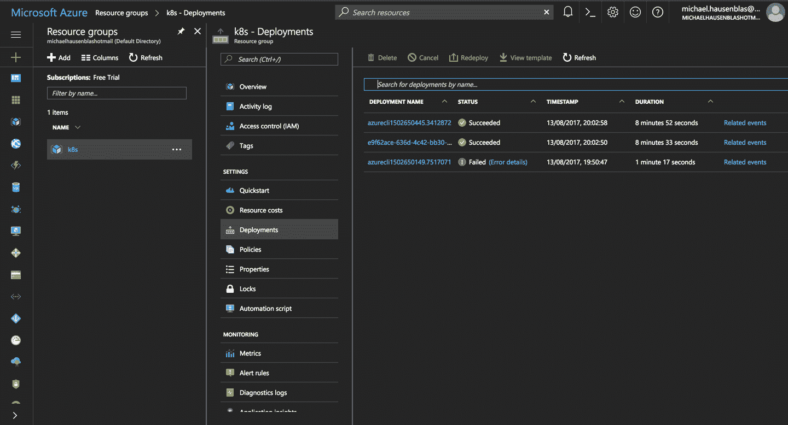

# 第二章。创建库本内特集群

在本章中，我们将讨论多种方法来建立一个完整的 Kubernetes 集群。我们涵盖了低级的标准化工具(`kubeadm`)，它也是其他安装程序的基础，并向您展示了在哪里可以找到控制平面以及工作节点的相关二进制文件。我们用`hyperkube`讨论了一个容器化的 Kubernetes 设置，演示了如何编写`systemd`单元文件来管理 Kubernetes 组件，最后展示了如何在谷歌云和 Azure 上设置集群。

# 2.1 安装 Kubernetes 以创建 Kubernetes 集群

## 问题

你想用`kubeadm`从头开始引导一个 Kubernetes 集群。

## 解决办法

从 Kubernetes 包存储库中下载`kubeadm` CLI 工具。

您需要将`kubeadm`安装在将成为 Kubernetes 集群一部分的所有服务器上，不仅是主服务器，还有所有节点。

例如，如果您正在使用基于 Ubuntu 的主机，请在每台主机上以 root 用户身份执行以下操作来设置 Kubernetes 包存储库:

```
# apt-get update && apt-get install -y apt-transport-https

# curl -s https://packages.cloud.google.com/apt/doc/apt-key.gpg | apt-key add -

# cat <<EOF >/etc/apt/sources.list.d/kubernetes.list
  deb http://apt.kubernetes.io/ kubernetes-xenial main
  EOF

# apt-get update
```

现在，您可以安装 Docker 引擎和各种 Kubernetes 工具。您将需要以下 :

*   `kubelet`二进制

*   `kubeadm`命令行界面

*   `kubectl`客户端

*   `kubernetes-cni`，容器网络接口(CNI)插件

使用以下工具安装它们:

```
# apt-get install -y docker.io
# apt-get install -y kubelet kubeadm kubectl kubernetes-cni
```

## 讨论

一旦安装了所有二进制文件和工具，您就可以开始引导您的 Kubernetes 集群了。在主节点上，使用以下命令初始化集群:

```
# kubeadm init
[kubeadm] WARNING: kubeadm is in beta, please do not use it for production
clusters.
[init] Using Kubernetes version: v1.7.8
[init] Using Authorization modes: [Node RBAC]
[preflight] Running pre-flight checks
...
```

在初始化结束时，您将获得一个在所有工作节点上执行的命令(参见[配方 2.2](#kubeadm_create) )。该命令使用初始化过程自动生成的令牌。

## 请参见

*   [使用 kubeadm 创建集群](https://kubernetes.io/docs/setup/independent/create-cluster-kubeadm/)

# 2.2 使用 Kubernetes 集群自举

## 问题

您已经初始化了您的 Kubernetes 主节点(参见[配方 2.1](#kubeadm_install) ，现在需要将工作节点添加到您的集群中。

## 解决办法

如[配方 2.1](#kubeadm_install) 所示，配置并安装 Kubernetes 软件包存储库后，使用在主节点上运行`init`步骤时给你的令牌运行`join`命令:

```
$ kubeadm join --token *<token>*
```

返回到您的主终端会话，您将看到您的节点加入:

```
$ kubectl get nodes
```

## 讨论

最后一步是创建一个满足 Kubernetes 网络要求的网络，尤其是每个 pod 的单个 IP 地址。您可以使用任何网络附件。 <sup>[1](#idm139735600720576)</sup> 织网， <sup>[2](#idm139735600719152)</sup> 例如，可以用单个`kubectl`命令安装在 Kubernetes 集群 v1.6.0 及以上版本上，如是:

```
$ export kubever=$(kubectl version | base64 | tr -d '\n')
$ kubectl apply -f "https://cloud.weave.works/k8s/net?k8s-version=$kubever"
```

该命令将创建在集群中所有节点上运行的守护程序集(参见[配方 7.3](07.html#daemonset) )。这些守护程序集使用主机网络和一个 [CNI](https://github.com/containernetworking/cni) 插件来配置本地节点网络。一旦网络到位，您的集群节点将进入`READY`状态。

有关在引导过程中可以使用`kubeadm`创建 pod 网络的其他网络附件，请参见[文档](https://kubernetes.io/docs/setup/independent/create-cluster-kubeadm/#pod-network)。

## 请参见

*   关于[使用`kubeadm`](https://kubernetes.io/docs/setup/independent/create-cluster-kubeadm/) 创建集群的文档

# 2.3 从 GitHub 下载 Kubernetes 版本

## 问题

您希望下载官方的 Kubernetes 版本，而不是从源代码编译。

## 解决办法

您可以遵循手动流程，进入 GitHub [发布页面](https://github.com/kubernetes/kubernetes/releases)。选择您想要下载的发行版或潜在的预发行版。然后选择你需要编译的源码包，或者下载*kubernetes.tar.gz*文件。

或者，您可以使用 GitHub API 检查最新的发布标签，如下所示:

```
$ curl -s https://api.github.com/repos/kubernetes/kubernetes/releases | \
          jq -r .[].assets[].browser_download_url
https://github.com/kubernetes/kubernetes/releases/download/v1.9.0/
        kubernetes.tar.gz
https://github.com/kubernetes/kubernetes/releases/download/v1.9.0-beta.2/
        kubernetes.tar.gz
https://github.com/kubernetes/kubernetes/releases/download/v1.8.5/
        kubernetes.tar.gz
https://github.com/kubernetes/kubernetes/releases/download/v1.9.0-beta.1/
        kubernetes.tar.gz
https://github.com/kubernetes/kubernetes/releases/download/v1.7.11/
        kubernetes.tar.gz
...
```

然后下载你选择的*kubernetes.tar.gz*发布包。例如，要获得 v1.7.11，请执行以下操作:

```
$ wget https://github.com/kubernetes/kubernetes/releases/download/ \
       v1.7.11/kubernetes.tar.gz
```

如果要从源代码编译 Kubernetes，请参见[食谱 13.1](13.html#compiling_source) 。

###### 警告

不要忘记验证*kubernetes.tar.gz*档案的安全散列。`SHA256 hash`列在 GitHub 发布页面上。本地下载存档后，生成哈希并进行比较。即使发行版没有与 GPG 签署，验证散列将检查档案的完整性。

# 2.4 下载客户端和服务器二进制文件

## 问题

您已经下载了一个发布档案(参见[配方 2.3](#release_download) ，但它不包含实际的二进制文件。T3】

## 解决办法

为了保持发行存档文件的小尺寸，它不包含发行二进制文件。你需要单独下载它们。为此，运行如下所示的*get-kube-binary . sh*脚本:

```
$ tar -xvf kubernetes.tar.gz
$ cd kubernetes/cluster
$ ./get-kube-binaries.sh
```

一旦完成，您将在*客户端/bin* 中拥有客户端二进制文件:

```
$ tree ./client/bin
./client/bin
├── kubectl
└── kubefed
```

以及*服务器/kubernetes/server/bin* 中的服务器二进制文件:

```
$ tree server/kubernetes/server/bin
server/kubernetes/server/bin
├── cloud-controller-manager
├── kube-apiserver
...
```

###### 小费

如果想跳过下载版本，快速下载客户端和/或服务器二进制文件，可以直接从 *https://dl.k8s.io* 获取。例如，要获取 Linux 的 v1.7.11 二进制文件，请执行以下操作:

```
$ wget https://dl.k8s.io/v1.7.11/ \
  \kubernetes-client-linux-amd64.tar.gz

$ wget https://dl.k8s.io/v1.7.11/ \
  kubernetes-server-linux-amd64.tar.gz
```

# 2.5 使用 hyperkube 映像运行带有 Docker 的 Kubernetes 主节点

## 问题

您希望使用几个 Docker 容器创建一个 Kubernetes 主节点。具体来说，您希望在容器中运行应用编程接口服务器、调度器、控制器和`etcd`键/值存储。

## 解决办法

您可以使用`hyperkube`二进制加上一个`etcd`容器。`hyperkube`是一个多合一二进制文件，可作为 Docker 映像使用。您可以使用它来启动所有的 Kubernetes 进程。

要创建 Kubernetes 集群，您需要一个存储解决方案来保持集群状态。在 Kubernetes 中，这个解决方案是一个名为`etcd`的分布式键/值存储；因此，首先需要启动一个`etcd`实例。你可以这样运行它:

```
$ docker run -d \
         --name=k8s \
         -p 8080:8080 \
         gcr.io/google_containers/etcd:3.1.10 \
         etcd --data-dir /var/lib/data
```

然后您将使用所谓的`hyperkube` *映像*启动 API 服务器，该映像包含 API 服务器二进制文件。 该图片可在`gcr.io/google_containers/hyperkube:v1.7.11`的谷歌容器登记处(GCR)获得。我们使用一些设置在本地端口上不安全地提供 API。将`v1.7.11`替换为最新版本或您想要运行的版本:

```
$ docker run -d \
         --net=container:k8s \
         gcr.io/google_containers/hyperkube:v1.7.11/ \
         apiserver --etcd-servers=http://127.0.0.1:2379 \
         --service-cluster-ip-range=10.0.0.1/24 \
         --insecure-bind-address=0.0.0.0 \
         --insecure-port=8080 \
         --admission-control=AlwaysAdmit
```

最后，您可以启动准入控制器，它指向应用编程接口服务器:

```
$ docker run -d \
         --net=container:k8s \
         gcr.io/google_containers/hyperkube:v1.7.11/ \
         controller-manager --master=127.0.0.1:8080
```

请注意，由于`etcd`、应用编程接口服务器和控制器管理器共享同一个网络名称空间，即使它们运行在不同的容器中，它们也可以在 127.0.0.1 上相互联系。

要测试您是否有工作设置，请使用`etcd`容器中的`etcdctl`和列出*/注册表*目录中的内容:

```
$ `docker``exec``-ti``k8s``/bin/sh`# `export ETCDCTL_API=3`# `etcdctl get "/registry/api" --prefix=true`
```

您还可以访问您的 Kubernetes API 服务器并开始探索该 API:

```
$ `curl``-s``curl``http://127.0.0.1:8080/api/v1``|``more`{"kind":"APIResourceList","groupVersion":"v1","resources":[{"name":"bindings","singularName":"","namespaced":true,"kind":"Binding","verbs":["create"]},...
```

到目前为止，您还没有启动调度程序，也没有用`kubelet`和`kube-proxy`设置节点。这只是向您展示了如何通过启动三个本地容器来运行 Kubernetes API 服务器。

###### 小费

有时使用`hyperkube` Docker 映像来验证其中一个 Kubernetes 二进制文件的一些配置选项会很有帮助。例如，要查看主`/apiserver`命令的帮助，请尝试:

```
$ docker run --rm -ti \
         gcr.io/google_containers/hyperkube:v1.7.11 \
         /apiserver --help
```

## 讨论

虽然这是在本地开始探索各种 Kubernetes 组件的非常有用的方法，但不建议在生产环境中使用。

## 请参见

*   [`hyperkube`码头工人图像](https://github.com/kubernetes/kubernetes/tree/master/clustimg/hyperkube)

# 2.6 编写系统单元文件来运行 Kubernetes 组件

## 问题

您已经使用 Minikube(参见[配方 1.3](01.html#minikube_install) )学习并知道如何使用`kubeadm`引导 Kubernetes 集群(参见[配方 2.2](#kubeadm_create) ，但是您想从头开始安装集群。 为此，需要使用`systemd`单元文件运行 Kubernetes 组件。你只是在寻找一个通过`systemd`运行`kubelet`的基本例子。

## 解决办法

`systemd` <sup>[3](#idm139735595112272)</sup> 是一个系统和服务管理器，有时也称为 init 系统。它现在是 Ubuntu 16.04 和 CentOS 7 上的默认服务管理器。

检查`kubeadm`是如何做的，这是一个非常好的方法来弄清楚如何自己做。如果仔细观察`kubeadm`配置，您会发现运行在集群中每个节点上的`kubelet`，包括主节点，都是由`systemd`管理的。

这里有一个例子，你可以通过登录到用`kubeadm`构建的集群中的任何节点来复制(参见[配方 2.2](#kubeadm_create) ):

```
# systemctl status kubelet
● kubelet.service - kubelet: The Kubernetes Node Agent
   Loaded: loaded (/lib/systemd/system/kubelet.service; enabled; vendor preset:
           enabled)
  Drop-In: /etc/systemd/system/kubelet.service.d
           └─10-kubeadm.conf
   Active: active (running) since Tue 2017-06-13 08:29:33 UTC; 2 days ago
     Docs: http://kubernetes.io/docs/
 Main PID: 4205 (kubelet)
    Tasks: 17
   Memory: 47.9M
      CPU: 2h 2min 47.666s
   CGroup: /system.slice/kubelet.service
           ├─4205 /usr/bin/kubelet --kubeconfig=/etc/kubernetes/kubelet.conf \
           |                       --require-kubeconfig=true \
           |                       --pod-manifest-path=/etc/kubernetes/manifests \
           |                       --allow-privileged=true \
           |                       --network-plugin=cni \
           |                       --cni-conf
           └─4247 journalctl -k -f
```

这将为您提供到*/lib/system d/system/kube DTM . service*中的`systemd`单元文件及其在*/etc/system d/system/kube DTM . service . d/10-kube DTM . conf*中的配置的链接。

单位文件很简单——它指向安装在 */usr/bin* 中的`kubelet`二进制文件:

```
[Unit]
Description=kubelet: The Kubernetes Node Agent
Documentation=http://kubernetes.io/docs/

[Service]
ExecStart=/usr/bin/kubelet
Restart=always
StartLimitInterval=0
RestartSec=10

[Install]
WantedBy=multi-user.target
```

配置文件告诉你`kubelet`二进制是如何启动的:

```
[Service]
Environment="KUBELET_KUBECONFIG_ARGS=--kubeconfig=/etc/kubernetes/kubelet.conf
 --require-kubeconfig=true"
Environment="KUBELET_SYSTEM_PODS_ARGS=--pod-manifest-path=/etc/kubernetes/
 manifests --allow-privileged=true"
Environment="KUBELET_NETWORK_ARGS=--network-plugin=cni
 --cni-conf-dir=/etc/cni/net.d --cni-bin-dir=/opt/cni/bin"
Environment="KUBELET_DNS_ARGS=--cluster-dns=10.96.0.10
 --cluster-domain=cluster.local"
Environment="KUBELET_AUTHZ_ARGS=--authorization-mode=Webhook
 --client-ca-file=/etc/kubernetes/pki/ca.crt"
ExecStart=
ExecStart=/usr/bin/kubelet $KUBELET_KUBECONFIG_ARGS $KUBELET_SYSTEM_PODS_ARGS
          $KUBELET_NETWORK_ARGS $KUBELET_DNS_ARGS $KUBELET_AUTHZ_ARGS
          $KUBELET_EXTRA_ARGS
```

所有指定的选项，例如由环境变量`$KUBELET_CONFIG_ARGS`定义的`--kubeconfig`，都是`kubelet`二进制的启动[选项](https://kubernetes.io/docs/admin/kubelet/)。

## 讨论

刚才显示的单位文件只处理`kubelet`。您可以为 Kubernetes 集群的所有其他组件(即 API 服务器、控制器管理器、调度器、代理)编写自己的单元文件。Kubernetes the Hard Way 有每个组件的单元文件示例。 <sup>[4](#idm139735595020784)</sup>

但是，你只需要运行`kubelet`。实际上，配置选项`--pod-manifest-path`允许您传递一个目录，在该目录中`kubelet`将寻找它将自动启动的清单。在`kubeadm`中，该目录用于传递应用编程接口服务器、调度程序、`etcd`和控制器管理器的清单。因此，Kubernetes 自行管理，唯一由`systemd`管理的是`kubelet`流程。

为了说明这一点，您可以在基于`kubeadm`的集群中列出*/etc/kubernetes/manifest*目录的内容:

```
# ls -l /etc/kubernetes/manifests
total 16
-rw------- 1 root root 1071 Jun 13 08:29 etcd.yaml
-rw------- 1 root root 2086 Jun 13 08:29 kube-apiserver.yaml
-rw------- 1 root root 1437 Jun 13 08:29 kube-controller-manager.yaml
-rw------- 1 root root  857 Jun 13 08:29 kube-scheduler.yaml
```

查看 *etcd.yaml* 舱单的详细信息，可以看到它是一个`Pod`，单个容器运行`etcd`:

```
# cat /etc/kubernetes/manifests/etcd.yaml
```

```
apiVersion:          v1
kind:                Pod
metadata:
  creationTimestamp: null
  labels:
    component:       etcd
    tier:            control-plane
  name:              etcd
  namespace:         kube-system
spec:
  containers:
  - command:
    - etcd
    - --listen-client-urls=http://127.0.0.1:2379
    - --advertise-client-urls=http://127.0.0.1:2379
    - --data-dir=/var/lib/etcd
    image:           gcr.io/google_containers/etcd-amd64:3.0.17
...
```

## 请参见

*   [`kubelet`配置选项](https://kubernetes.io/docs/admin/kubelet/)

# 2.7 在谷歌 Kubernetes 引擎上创建 Kubernetes 集群(GKE)

## 问题

你想在谷歌库本内特搜索引擎(GKE)上创建一个库本内特集群。

## 解决办法

使用`gcloud`命令行界面，使用`container clusters create`命令创建一个 Kubernetes 集群，如下所示:

```
$ gcloud container clusters create oreilly
```

默认情况下，这将创建一个具有三个工作节点的 Kubernetes 集群。主节点由 GKE 服务管理，无法访问。

## 讨论

要使用 GKE，您首先需要做几件事:

*   在启用计费的谷歌云平台上创建账户。

*   创建一个项目，并在其中启用 GKE 服务。

*   在您的机器上安装`gcloud`命令行界面。

为了加快`gcloud`的设置，你可以使用[谷歌云外壳](https://cloud.google.com/shell/docs/)，一个纯基于在线浏览器的解决方案。

创建集群后，您可以将其列出，如下所示:

```
$ gcloud container clusters list
NAME     ZONE            MASTER_VERSION  MASTER_IP     ...  STATUS
oreilly  europe-west1-b  1.7.8-gke.0     35.187.80.94  ...  RUNNING
```

###### 注意

`gcloud`命令行界面允许您调整集群的大小、更新和升级集群:

```
...
COMMANDS
...
     resize
        Resizes an existing cluster for running containers.
     update
        Update cluster settings for an existing container cluster.
     upgrade
        Upgrade the Kubernetes version of an existing container
        cluster.
```

使用完集群后，不要忘记将其删除，以免被收费:

```
$ gcloud container clusters delete oreilly
```

## 请参见

*   GKE [快速启动](https://cloud.google.com/container-engine/docs/quickstart)

*   谷歌云外壳[快速启动](https://cloud.google.com/shell/docs/quickstart)

# 2.8 在 Azure 容器服务(ACS)上创建 Kubernetes 集群

## 问题

您想要在 Azure 容器服务(ACS)上创建一个 Kubernetes 集群。

## 解决办法

要执行以下步骤，您需要注册一个(免费的) [Azure 帐户](https://azure.microsoft.com/en-us/free/)，并安装 [Azure 命令行界面(`az`)2.0 版本](https://docs.microsoft.com/en-us/cli/azure/install-azure-cli)。

首先，确保您安装了正确的命令行界面版本，然后登录:

```
$ az --version | grep ^azure-cli
azure-cli (2.0.13)

$ az login
To sign in, use a web browser to open the page https://aka.ms/devicelogin and
enter the code XXXXXXXXX to authenticate.
[
  {
    "cloudName": "AzureCloud",
    "id": "****************************",
    "isDefault": true,
    "name": "Free Trial",
    "state": "Enabled",
    "tenantId": "*****************************",
    "user": {
      "name": "******@hotmail.com",
      "type": "user"
    }
  }
]
```

作为准备，创建一个名为`k8s`的 Azure 资源组(相当于谷歌云中的一个项目)。该资源组将保存您的所有资源，如虚拟机和网络组件，并便于以后清理和拆除:

```
$ az group create --name k8s --location northeurope
{
  "id": "/subscriptions/************************/resourceGroups/k8s",
  "location": "northeurope",
  "managedBy": null,
  "name": "k8s",
  "properties": {
    "provisioningState": "Succeeded"
  },
  "tags": null
}
```

###### 小费

如果你不确定[区域](https://azure.microsoft.com/en-us/regions/)用于`--location`参数，执行`az account list-locations`并选择一个靠近你的区域。

现在您已经设置了资源组`k8s`，您可以用一个工作节点(*代理【Azure 术语中的 T2】)创建集群，如下所示:*

```
$ az acs create --orchestrator-type kubernetes \
                --resource-group k8s \
                --name k8scb \
                --agent-count 1 \
                --generate-ssh-keys
waiting for AAD role to propagate.done
{
...
"provisioningState": "Succeeded",
"template": null,
"templateLink": null,
"timestamp": "2017-08-13T19:02:58.149409+00:00"
},
"resourceGroup": "k8s"
}
```

请注意，`az acs create`命令可能需要 10 分钟才能完成。

###### 警告

使用 Azure 免费帐户时，您没有足够的配额来创建默认(三代理)Kubernetes 集群，因此如果您尝试一下，您会看到如下内容:

```
Operation results in exceeding quota limits of Core.
Maximum allowed: 4, Current in use: 0, Additional
requested: 8.
```

要解决这个问题，要么创建一个更小的集群(例如`--agent-count 1`)，要么使用付费订阅。

因此，在 Azure 门户中，您现在应该会看到类似于[图 2-1](#azure-portal) 的内容。首先找到`k8s`资源组，然后在“部署”选项卡中导航。



###### 图 2-1。Azure 门户的屏幕截图，显示了 k8s 资源组中的 ACS 部署

您现在可以连接到群集了:

```
$ az acs kubernetes get-credentials --resource-group=k8s --name=k8scb
```

现在，您可以在环境中四处查看并验证设置:

```
$ kubectl cluster-info
Kubernetes master is running at https://k8scb-k8s-143f1emgmt.northeurope.cloudapp
  .azure.com
Heapster is running at https://k8scb-k8s-143f1emgmt.northeurope.cloudapp.azure
  .com/api/v1/namespaces/kube-system/services/heapster/proxy
KubeDNS is running at https://k8scb-k8s-143f1emgmt.northeurope.cloudapp.azure
  .com/api/v1/namespaces/kube-system/services/kube-dns/proxy
kubernetes-dashboard is running at https://k8scb-k8s-143f1emgmt.northeurope
  .cloudapp.azure.com/api/v1/namespaces/kube-system/services/kubernetes-dashboard
  /proxy
tiller-deploy is running at https://k8scb-k8s-143f1emgmt.northeurope.cloudapp
  .azure.com/api/v1/namespaces/kube-system/services/tiller-deploy/proxy

To further debug and diagnose cluster problems, use 'kubectl cluster-info dump'.

$ kubectl get nodes
NAME                    STATUS                     AGE       VERSION
k8s-agent-1a7972f2-0    Ready                      7m        v1.7.8
k8s-master-1a7972f2-0   Ready,SchedulingDisabled   7m        v1.7.8
```

事实上，从输出中可以看到，有一个代理(工作)节点和一个主节点。

发现 ACS 后，不要忘记关闭集群，通过删除资源组`k8s`来删除所有资源:

```
$ az group delete --name k8s --yes --no-wait
```

虽然`az group delete`命令会立即返回，但删除所有资源(如虚拟机、虚拟网络或磁盘)并实际销毁资源组可能需要 10 分钟。您可能需要登录 Azure 门户，以确保一切都按照计划进行。

###### 小费

如果您不想或不能安装 Azure 命令行界面，您可以从浏览器中使用 [Azure 云壳](https://azure.microsoft.com/en-us/features/cloud-shell/)来执行前面的步骤来安装 Kubernetes 集群。

## 请参见

*   [“为 Linux 容器部署 Kubernetes 集群”](https://docs.microsoft.com/en-us/azure/container-service/kubernetes/container-service-kubernetes-walkthrough)在微软 Azure 文档中

【立方】，[【安装附件】](https://kubernetes.io/docs/concepts/cluster-administration/addons/)。

<sup>[【2】](#idm139735600719152-marker)</sup>织工，[【阿多整合库本内特斯】](https://www.weave.works/docs/net/latest/kube-addon/)。

【free desktop . org】[【系统】](https://www.freedesktop.org/wiki/Software/systemd/)。

<sup>[4](#idm139735595020784-marker)</sup> 库本内斯艰难之路，[【启动库本内斯控制平面】](https://github.com/kelseyhightower/kubernetes-the-hard-way/blob/master/docs/08-bootstrapping-kubernetes-controllers.md?)。