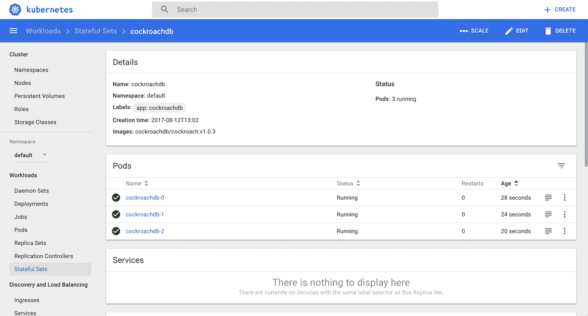

# 第七章。管理专门的工作负载

在[第 4 章](04.html#ch_fundamental_workloads)中，我们探讨了如何启动应该永远运行的应用程序，比如 web 服务器或应用服务器。在本章中，我们将讨论更加专业化的工作负载，例如，启动批处理作业等终止流程、在特定节点上运行 pods 或管理有状态和非有状态本机应用程序的工作负载。

# 7.1 运行批处理作业

## 问题

您希望运行一个运行一定时间才能完成的进程，例如批处理转换、备份操作或数据库模式升级。

## 解决办法

使用 Kubernetes 作业资源启动并监督将执行批处理的 pod。 <sup>[1](#idm139735593685952)</sup>

首先，在一个名为*的文件中定义作业的库本内特清单:*

```
apiVersion:          batch/v1
kind:                Job
metadata:
  name:              counter
spec:
  template:
    metadata:
      name:          counter
    spec:
      containers:
      - name:        counter
        image:       busybox
        command:
         - "sh"
         - "-c"
         - "foriin123;doecho$i;done"
      restartPolicy: Never
```

然后启动作业并查看其状态:

```
$ kubectl create -f counter-batch-job.yaml
job "counter" created

$ kubectl get jobs
NAME      DESIRED   SUCCESSFUL   AGE
counter   1         1            22s

$ kubectl describe jobs/counter
Name:           counter
Namespace:      default
Selector:       controller-uid=634b9015-7f58-11e7-b58a-080027390640
Labels:         controller-uid=634b9015-7f58-11e7-b58a-080027390640
                job-name=counter
Annotations:    <none>
Parallelism:    1
Completions:    1
Start Time:     Sat, 12 Aug 2017 13:18:45 +0100
Pods Statuses:  0 Running / 1 Succeeded / 0 Failed
Pod Template:
  Labels:       controller-uid=634b9015-7f58-11e7-b58a-080027390640
                job-name=counter
  Containers:
   counter:
    Image:      busybox
    Port:       <none>
    Command:
      sh
      -c
      for i in 1 2 3 ; do echo $i ; done
    Environment:        <none>
    Mounts:             <none>
  Volumes:              <none>
Events:
  FirstSeen  ...  ...  ...  Type    Reason            Message
  ---------  ...  ...  ...  ------  ------            -------
  31s        ...  ...  ...  Normal  SuccessfulCreate  Created pod: counter-0pt20

```

最后，您希望验证它是否实际执行了任务(从 1 到 3 计数):

```
$ kubectl logs jobs/counter
1
2
3

```

的确，如你所见，`counter`工作果然算了。

如果你不再需要这份工作，使用`kubectl delete jobs/counter`将其移除。

# 7.2 在 Pod 中按计划运行任务

## 问题

您希望在 Kubernetes 管理的 pod 中按照特定的计划运行任务。

## 解决办法

使用 Kubernetes `CronJob`对象。`CronJob`对象是更通用的`Job`对象的衍生(参见[食谱 7.1](#run_job) )。

您可以通过编写类似于此处所示的清单来定期安排作业。 在`spec`中，您会看到遵循 crontab 格式的`schedule`部分。`template`部分描述了将要运行的 pod 和将要执行的命令(每小时将当前日期和时间打印到`stdout`):

```
apiVersion:              batch/v2alpha1
kind:                    CronJob
metadata:
  name:                  hourly-date
spec:
  schedule:              "0****"
  jobTemplate:
    spec:
      template:
        spec:
          containers:
          - name:        date
            image:       busybox
            command:
              - "sh"
              - "-c"
              - "date"
          restartPolicy: OnFailure
```

## 请参见

*   [`CronJob`文档](https://kubernetes.io/docs/concepts/workloads/controllers/cron-jobs/)

# 7.3 每个节点运行基础架构守护程序

## 问题

您希望启动一个基础架构守护程序，例如日志收集器或监控代理，确保每个节点恰好运行一个 pod。

## 解决办法

使用`DaemonSet`启动并监督守护进程。 例如，要在集群中的每个节点上启动 Fluent 代理，请创建一个名为*Fluent-daemmonset . YAML*的文件，其内容如下:

```
kind:                 DaemonSet
apiVersion:           extensions/v1beta1
metadata:
  name:               fluentd
spec:
  template:
    metadata:
      labels:
        app:          fluentd
      name:           fluentd
    spec:
      containers:
      - name:         fluentd
        image:        gcr.io/google_containers/fluentd-elasticsearch:1.3
        env:
         - name:      FLUENTD_ARGS
           value:     -qq
        volumeMounts:
         - name:      varlog
           mountPath: /varlog
         - name:      containers
           mountPath: /var/lib/docker/containers
      volumes:
         - hostPath:
             path:    /var/log
           name:      varlog
         - hostPath:
             path:    /var/lib/docker/containers
           name:      containers
```

现在启动`DaemonSet`，像这样:

```
$ kubectl create -f fluentd-daemonset.yaml
daemonset "fluentd" created

$ kubectl get ds
NAME     DESIRED  CURRENT  READY  UP-TO-DATE  AVAILABLE  NODE-SELECTOR  AGE
fluentd  1        1        1      1           1          <none>         17s

$ kubectl describe ds/fluentd
Name:           fluentd
Selector:       app=fluentd
Node-Selector:  <none>
Labels:         app=fluentd
Annotations:    <none>
Desired Number of Nodes Scheduled: 1
Current Number of Nodes Scheduled: 1
Number of Nodes Scheduled with Up-to-date Pods: 1
Number of Nodes Scheduled with Available Pods: 1
Number of Nodes Misscheduled: 0
Pods Status:    1 Running / 0 Waiting / 0 Succeeded / 0 Failed
...

```

## 讨论

请注意，在前面的输出中，因为命令是在 Minikube 上执行的，所以您只看到一个 pod 在运行，因为在这个设置中只有一个节点。如果您的集群中有 15 个节点，那么您总共将有 15 个 pod，每个节点运行一个 pod。您也可以使用`DaemonSet`清单的`spec`部分将守护程序限制在特定节点。

# 7.4 管理有状态和领导者/追随者应用程序

## 问题

你想运行一个应用程序，要求它的吊舱有明显的，潜在的不同的特征，比如一个数据库，其中你有一个处理读写的领导者和几个只提供读取服务的追随者。你不能使用部署，因为他们只监督相同的豆荚，你需要一个能处理更像宠物而不是牛的豆荚的主管。

## 解决办法

使用`StatefulSet`，其支持具有唯一网络名称、良好部署/扩展/终止或持久存储的工作负载。例如，要运行流行的可扩展数据存储库 CockroachDB，您可以使用提供的示例， <sup>[2](#idm139735593475776)</sup> ，其核心包含以下`StatefulSet`:

```
apiVersion: apps/v1beta1
kind:                        StatefulSet
metadata:
  name:                      cockroachdb
spec:
  serviceName:               "cockroachdb"
  replicas:                  3
  template:
    metadata:
      labels:
        app:                 cockroachdb
    spec:
      initContainers:
      - name:                bootstrap
        image:               cockroachdb/cockroach-k8s-init:0.2
        imagePullPolicy:     IfNotPresent
        args:
        - "-on-start=/on-start.sh"
        - "-service=cockroachdb"
        env:
        - name:              POD_NAMESPACE
          valueFrom:
            fieldRef:
              fieldPath:     metadata.namespace
        volumeMounts:
        - name: datadir
          mountPath:         "/cockroach/cockroach-data"
      affinity:
        podAntiAffinity:
          preferredDuringSchedulingIgnoredDuringExecution:
          - weight: 100
            podAffinityTerm:
              labelSelector:
                matchExpressions:
                - key: app
                  operator:  In
                  values:
                  - cockroachdb
              topologyKey:   kubernetes.io/hostname
      containers:
      - name:                cockroachdb
        image:               cockroachdb/cockroach:v1.0.3
        imagePullPolicy:     IfNotPresent
        ports:
        - containerPort:     26257
          name: grpc
        - containerPort:     8080
          name: http
        volumeMounts:
        - name: datadir
          mountPath:         /cockroach/cockroach-data
        command:
          - "/bin/bash"
          - "-ecx"
          - |
            if [ ! "$(hostname)" == "cockroachdb-0" ] || \
               [ -e "/cockroach/cockroach-data/cluster_exists_marker" ]
            then
              CRARGS+=("--join" "cockroachdb-public")
            fi
            exec /cockroach/cockroach ${CRARGS[*]}
      terminationGracePeriodSeconds: 60
      volumes:
      - name:                 datadir
        persistentVolumeClaim:
          claimName:          datadir
  volumeClaimTemplates:
  - metadata:
      name:                   datadir
      annotations:
        volume.alpha.kubernetes.io/storage-class: anything
    spec:
      accessModes:
        - "ReadWriteOnce"
      resources:
        requests:
          storage:            1Gi
```

要启动它，请执行以下操作:

```
$ curl -s -o cockroachdb-statefulset.yaml \
             https://raw.githubusercontent.com/kubernetes/kubernetes/master/ \
             examples/cockroachdb/cockroachdb-statefulset.yaml

$ curl -s -o crex.sh \
             https://raw.githubusercontent.com/kubernetes/kubernetes/master/ \
             examples/cockroachdb/minikube.sh

$ ./crex.sh
+ kubectl delete statefulsets,persistentvolumes,persistentvolumeclaims,services...
...
+ kubectl create -f -
persistentvolumeclaim "datadir-cockroachdb-3" created
+ kubectl create -f cockroachdb-statefulset.yaml
service "cockroachdb-public" created
service "cockroachdb" created
poddisruptionbudget "cockroachdb-budget" created
statefulset "cockroachdb" created

```

现在，您可以在库本内特仪表板中看到与吊舱一起创建的`StatefulSet`对象([图 7-1](#statefulset-screenshot) )。



###### 图 7-1。状态集的截图

## 讨论

最初，现在在库本内斯被称为`StatefulSet`的东西被称为`PetSet`。这应该会让你知道动机是什么。在 Kubernetes 1.7 中，`StatefulSet`成为了一个 beta 特性，这意味着 API 不会再改变了；预计只会出现 UX 式的修复。一个`StatefulSet`是一个控制器，为它所监管的豆荚提供独特的身份。请注意，作为安全措施，删除`StatefulSet`不会删除与之相关的卷。

另一个经常在野外发现的`StatefulSet`用例是运行一个没有考虑到 Kubernetes 的应用程序。从 Kubernetes 的角度来看，这类应用有时被称为“T2”遗留应用“T3”。未来，我们将把这些应用称为非云原生应用。使用`StatefulSet`是监管这样一个 app 的好方法。

## 请参见

*   [状态集基础](https://kubernetes.io/docs/tutorials/stateful-application/basic-stateful-set/)

*   [运行复制的有状态应用程序](https://kubernetes.io/docs/tasks/run-application/run-replicated-stateful-application/)

*   [示例:使用状态集部署卡珊德拉](https://kubernetes.io/docs/tutorials/stateful-application/cassandra/)

*   [库伯涅斯作为状态集与哨兵](https://github.com/corybuecker/redis-stateful-set)

*   Oleg Chunikhin 的文章[“如何在 Kubernetes PetSet 或 StatefulSet 上运行 MongoDb 副本集”](https://www.linkedin.com/pulse/how-run-mongodb-replica-set-kubernetes-petset-oleg-chunikhin)

*   黑客新闻[关于状态集](https://news.ycombinator.com/item?id=13225183)的讨论

# 7.5 影响吊舱的启动行为

## 问题

您的 pod 依赖于其他可用的服务才能正常运行。

## 解决办法

使用[初始化容器](https://kubernetes.io/docs/concepts/workloads/pods/init-containers/)来影响容器的启动行为。

假设您想要启动一个依赖后端服务来提供内容的 nginx web 服务器。因此，您希望确保 nginx pod 仅在后端服务启动并运行后才启动。

首先，创建 web 服务器所依赖的后端服务:

```
$ kubectl run backend --image=mhausenblas/simpleservice:0.5.0
deployment "backend" created

$ kubectl expose deployment backend --port=80 --target-port=9876

```

然后，您可以使用以下清单*nginx-init-container . YAML*来启动 nginx 实例，并确保它仅在`backend`部署提供数据时启动:

```
kind:                 Deployment
apiVersion:           apps/v1beta1
metadata:
  name:               nginx
spec:
  replicas:           1
  template:
    metadata:
      labels:
        app:          nginx
    spec:
      containers:
      - name:         webserver
        image:        nginx
        ports:
        - containerPort: 80
      initContainers:
      - name:         checkbackend
        image:        busybox
        command:      ['sh', '-c', 'untilnslookupbackend.default.svc;doecho
                       "Waitingforbackendtocomeup";sleep3;done;echo
                       "Backendisup,readytolaunchwebserver"']
```

现在，您可以启动`nginx`部署，并通过查看它所监督的 pod 的日志来验证 init 容器是否完成了它的工作:

```
$ kubectl create -f nginx-init-container.yaml
deployment "nginx" created

$ kubectl get po
NAME                      READY     STATUS    RESTARTS   AGE
backend-853383893-2g0gs   1/1       Running   0          43m
nginx-2101406530-jwghn    1/1       Running   0          10m

$ kubectl logs nginx-2101406530-jwghn -c checkbackend
Server:    10.0.0.10
Address 1: 10.0.0.10 kube-dns.kube-system.svc.cluster.local

Name:      backend.default.svc
Address 1: 10.0.0.46 backend.default.svc.cluster.local
Backend is up, ready to launch web server

```

如您所见，init 容器中的命令确实按计划运行。

<sup>[1](#idm139735593685952-marker)</sup> 库本内特斯，[【乔布斯-奔向完成】](https://kubernetes.io/docs/concepts/workloads/controllers/jobs-run-to-completion/)。

<sup xmlns:epub="http://www.idpf.org/2007/ops">[2](#idm139735593475776-marker)T3【库本内特斯小强示例在 GitHub 上，[T5【小强-statefleset . YAML](https://github.com/kubernetes/kubernetes/blob/master/examples/cockroachdb/cockroachdb-statefulset.yaml)。</sup>