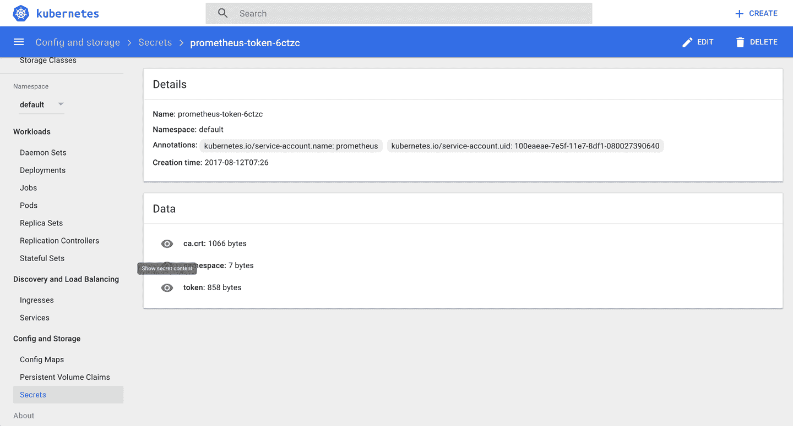
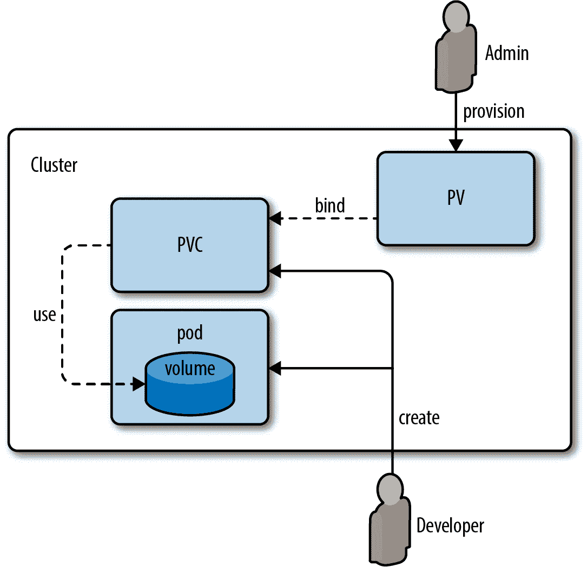

# 八、配置卷和数据

Kubernetes 中的一个*卷*是一个目录，运行在一个 pod 中的所有容器都可以访问该目录，并且额外保证了数据在单个容器重新启动时得到保存。

根据支持卷的内容和潜在的附加语义，我们区分了卷的类型:

*   *节点-本地*卷，如`emptyDir`或`hostPath`

*   通用*联网*卷，如`nfs`、`glusterfs`或`cephfs`

*   *云提供商–特定的*卷，如`awsElasticBlockStore`、`azureDisk`或`gcePersistentDisk`

*   *专用*卷，如`secret`或`gitRepo`

您选择哪种卷类型完全取决于您的用例。例如，对于临时暂存空间来说，一个`emptyDir`就可以了，但是当您需要确保您的数据在节点故障后仍然存在时，如果您在公共云环境中运行 Kubernetes，您将需要查看网络卷或云提供商特定的卷。

# 8.1 通过本地卷在容器之间交换数据

## 问题

您有两个或多个容器在一个 pod 中运行，并且希望能够通过文件系统操作交换数据。

## 解决办法

使用类型为`emptyDir`的本地音量。

起点是下面的 pod 清单， *exchangedata.yaml* ，它有两个容器(`c1`和`c2`，每个容器使用不同的挂载点将本地卷`xchange`挂载到它们的文件系统中:

```
apiVersion:          v1
kind:                Pod
metadata:
  name:              sharevol
spec:
  containers:
  - name:            c1
    image:           centos:7
    command:
      - "bin/bash"
      - "-c"
      - "sleep10000"
    volumeMounts:
      - name:        xchange
        mountPath:   "/tmp/xchange"
  - name:            c2
    image:           centos:7
    command:
      - "bin/bash"
      - "-c"
      - "sleep10000"
    volumeMounts:
      - name:        xchange
        mountPath:   "/tmp/data"
  volumes:
  - name:            xchange
    emptyDir:        {}
```

现在，您可以将 pod`exec`放入其中，从一个容器中创建数据，并从另一个容器中读取数据:

```
$ kubectl create -f exchangedata.yaml
pod "sharevol" created

$ kubectl exec sharevol -c c1 -i -t -- bash
[root@sharevol /]# mount | grep xchange
/dev/vda1 on /tmp/xchange type ext4 (rw,relatime,data=ordered)
[root@sharevol /]# echo 'some data' > /tmp/xchange/data
[root@sharevol /]# exit

$ kubectl exec sharevol -c c2 -i -t -- bash
[root@sharevol /]# mount | grep /tmp/data
/dev/vda1 on /tmp/data type ext4 (rw,relatime,data=ordered)
[root@sharevol /]# cat /tmp/data/data
some data

```

## 讨论

本地卷由 pod 及其容器运行所在的节点支持。如果节点宕机或者你必须对节点进行维护(见[菜谱 12.8](12.html#drain_nodes) ，那么本地卷就没了，所有数据都丢失了。

在某些使用情况下，本地卷是可以的，例如，对于一些暂存空间，或者当规范状态从其他地方获得时，例如 S3 存储桶，但是一般来说，您会希望使用由网络存储支持的卷(参见[配方 8.6](#pvc_gke) )。

## 请参见

*   立方〔t0〕卷文献〔t1〕

# 8.2 使用秘密将应用编程接口访问密钥传递给 Pod

## 问题

作为管理员，您希望以安全的方式向您的开发人员提供 API 访问密钥；也就是说，不要在 Kubernetes 清单中以明文形式共享它。

## 解决办法

使用本地卷类型 [`secret`](https://kubernetes.io/docs/concepts/storage/volumes/#secret) 。

假设您想让您的开发人员通过密码短语`open sesame`访问外部服务。

首先，创建一个名为*密码短语*的文本文件，其中包含密码短语:

```
$ echo -n "open sesame" > ./passphrase

```

接下来，使用*密码短语*文件创建[秘密](https://kubernetes.io/docs/concepts/configuration/secret/):

```
$ kubectl create secret generic pp --from-file=./passphrase
secret "pp" created

$ kubectl describe secrets/pp
Name:           pp
Namespace:      default
Labels:         <none>
Annotations:    <none>

Type:   Opaque

Data
====
passphrase:     11 bytes

```

从管理员的角度来看，您现在已经准备好了，是时候让您的开发人员使用这个秘密了。因此，让我们交换一下帽子，假设您是一名开发人员，并且希望在 pod 中使用密码短语。

例如，您可以将秘密作为一个卷装入您的 pod，然后作为一个普通文件读出。创建 pod 并立即装载卷:

```
apiVersion:        v1
kind:              Pod
metadata:
  name:            ppconsumer
spec:
  containers:
  - name:          shell
    image:         busybox
    command:
      - "sh"
      - "-c"
      - "mount|grepaccess&&sleep3600"
    volumeMounts:
      - name:      passphrase
        mountPath: "/tmp/access"
        readOnly:  true
  volumes:
  - name:          passphrase
    secret:
      secretName:  pp
```

现在启动 POD 并查看其日志，您将会看到`pp`秘密文件挂载为*/tmp/access/密码短语*:

```
$ kubectl create -f ppconsumer.yaml
pod "ppconsumer" created

$ kubectl logs ppconsumer
tmpfs on /tmp/access type tmpfs (ro,relatime)

```

要从运行容器中访问密码短语，只需读出 */tmp/access* 中的*密码短语*文件，如下所示:

```
$ kubectl exec ppconsumer -i -t -- sh

/ # cat /tmp/access/passphrase
open sesame

```

## 讨论

秘密存在于命名空间的上下文中，因此在设置和/或使用它们时，您需要考虑到这一点。

您可以通过以下方式之一从 pod 中运行的容器中访问机密:

*   一个卷(如解决方案所示，内容存储在`tmpfs`卷中)

*   一个[环境变量](https://kubernetes.io/docs/concepts/configuration/secret/#using-secrets-as-environment-variables)

此外，请注意，秘密的大小限制为 1 MB。

除了用户定义的秘密之外，Kubernetes 还自动为服务帐户创建秘密，以访问 API。例如，安装了普罗米修斯(见[配方 11.6](11.html#prom_minikube) )，你会在 Kubernetes 仪表盘上看到类似[的图 8-1](#prom-sa-secret) 。



###### 图 8-1。普罗米修斯服务账号秘密截图

###### 小费

`kubectl create secret`处理三种类型的秘密，根据您的用例，您可能想要选择不同的秘密:

*   `docker-registry`类型用于 Docker 注册表。

*   `generic`类型是我们在解决方案中使用的类型；它从本地文件、目录或文字值创建一个秘密(您需要自己对其进行 base64 编码)。

*   例如，通过`tls`，您可以创建一个用于入口的安全 SSL 证书。

`kubectl describe`不在明文中显示秘密的内容。这避免了“越过肩膀”的密码抓取。但是，您可以轻松地手动解码，因为它没有加密，只有 base64 编码:

```
$ kubectl get secret pp -o yaml | \
  grep passphrase | \
  cut -d":" -f 2 | \
  awk '{$1=$1};1' | \
  base64 --decode
open sesame

```

在这个命令中，第一行检索秘密的 YAML 表示，第二行用`grep`拉出第一行 `passphrase: b3BlbiBzZXNhbWU=`(注意这里的前导空格)。然后，`cut`提取密码短语的内容，`awk`命令去掉前导空格。最后，`base64`命令再次将其转换为原始数据。

###### 小费

在 Kubernetes 1.7 之前，API 服务器在`etcd`中以纯文本的形式存储秘密。现在您可以选择在启动`kube-apiserver`时使用`--experimental-encryption-provider-config`选项加密它们。

## 请参见

*   Kubernetes〔t0〕秘密文件〔t1〕

*   [静态加密机密数据](https://kubernetes.io/docs/tasks/administer-cluster/encrypt-data/)

# 8.3 向应用提供配置数据

## 问题

您希望向应用提供配置数据，而不将其存储在容器映像中，也不将其硬编码到 pod 规范中。

## 解决办法

使用配置图。这些是一流的 Kubernetes 资源，您可以通过环境变量或文件向 pod 提供配置数据。

假设您想用键`siseversion`和值`0.9`创建一个配置。就这么简单:

```
$ kubectl create configmap siseconfig --from-literal=siseversion=0.9
configmap "siseconfig" created

```

现在，您可以在部署中使用配置图，比如在名为 *cmapp.yaml* 的清单文件中，包含以下内容:

```
apiVersion:                  extensions/v1beta1
kind:                        Deployment
metadata:
  name:                      cmapp
spec:
  replicas:                  1
  template:
    metadata:
      labels:
        app:                 cmapp
    spec:
      containers:
      - name:                sise
        image:               mhausenblas/simpleservice:0.5.0
        ports:
        - containerPort:     9876
        env:
        - name:              SIMPLE_SERVICE_VERSION
          valueFrom:
            configMapKeyRef:
              name:          siseconfig
              key:           siseversion
```

我们刚刚展示了如何将配置作为环境变量传递。但是，您也可以使用卷将其作为文件装载到 pod 中。

假设您有以下配置文件，*示例. cfg* :

```
debug: true
home: ~/abc
```

您可以创建保存配置文件的配置映射，如下所示:

```
$ kubectl create configmap configfile --from-file=example.cfg

```

现在，您可以像使用任何其他卷一样使用配置映射。以下是名为`oreilly`的 POD 的清单文件；它用的是`busybox`映像，刚睡了 3600 秒。在`volumes`部分，有一个名为`oreilly`的卷，它使用了我们刚刚创建的配置图`configfile`。该体积随后被安装在容器内的路径`/oreilly`处。因此，该文件可以在 pod 中访问:

```
apiVersion:        v1
kind:              Pod
metadata:
  name:            oreilly
spec:
  containers:
  - image:         busybox
    command:
      - sleep
      - "3600"
    volumeMounts:
    - mountPath:   /oreilly
      name:        oreilly
    name:          busybox
  volumes:
  - name:          oreilly
    configMap:
      name:        configfile
```

创建 pod 后，您可以验证*示例. cfg* 文件确实在其中:

```
$ kubectl exec -ti oreilly -- ls -l /oreilly
total 0
lrwxrwxrwx   1 root   root   18 Dec 16 19:36 example.cfg -> ..data/example.cfg

$ kubectl exec -ti oreilly -- cat /oreilly/example.cfg
debug: true
home: ~/abc

```

有关如何从文件创建配置图的完整示例，请参见[配方 11.6](11.html#prom_minikube) 。

## 请参见

*   [配置 POD 以使用配置图](https://kubernetes.io/docs/tasks/configure-pod-container/configure-pod-configmap/)

# 8.4 使用带 Minikube 的持久卷

## 问题

您不想丢失容器使用的磁盘上的数据，也就是说，您想确保它在主机重新启动后仍然存在。

## 解决办法

使用持久卷。在 Minikube 的情况下，您可以创建一个类型为`hostPath`的 PV，并将其像普通卷一样装入容器的文件系统。

首先，在名为*主机路径-pv.yaml* 的清单中定义 PV `hostpathpv`:

```
kind:               PersistentVolume
apiVersion:         v1
metadata:
  name:             hostpathpv
  labels:
    type:           local
spec:
  storageClassName: manual
  capacity:
    storage:        1Gi
  accessModes:
  - ReadWriteOnce
  hostPath:
    path:           "/tmp/pvdata"
```

然而，在创建 PV 之前，您需要准备节点上的目录 */tmp/pvdata* ，也就是 Minikube 实例本身。您可以使用`minikube ssh`进入运行 Kubernetes 集群的节点:

```
$ minikube ssh

$ mkdir /tmp/pvdata && \
  echo 'I am content served from a delicious persistent volume' > / \
  tmp/pvdata/index.html

$ cat /tmp/pvdata/index.html
I am content served from a delicious persistent volume

$ exit

```

现在您已经准备好了节点上的目录，您可以从清单文件 *hostpath-pv.yaml* 创建 PV:

```
$ kubectl create -f hostpath-pv.yaml
persistentvolume "hostpathpv" created

$ kubectl get pv
NAME        CAPACITY   ACCESSMODES   RECLAIMPOLICY   STATUS      ...   ...   ...
hostpathpv  1Gi        RWO           Retain          Available   ...   ...   ...

$ kubectl describe pv/hostpathpv
Name:           hostpathpv
Labels:         type=local
Annotations:    <none>
StorageClass:   manual
Status:         Available
Claim:
Reclaim Policy: Retain
Access Modes:   RWO
Capacity:       1Gi
Message:
Source:
    Type:       HostPath (bare host directory volume)
    Path:       /tmp/pvdata
Events:         <none>

```

至此，您将以管理员的身份执行这些步骤。您可以定义 PVs，并让 Kubernetes 集群上的开发人员可以使用它们。

从开发人员的角度来看，现在您可以在一个容器中使用 PV 了。这是通过*持久卷声明*(聚氯乙烯)来完成的，之所以这么叫是因为，嗯，你实际上声明了一个满足某些特征的 PV，比如大小或存储类别。

创建一个名为 *pvc.yaml* 的清单文件，定义一个 pvc，要求 200 MB 的空间:

```
kind:               PersistentVolumeClaim
apiVersion:         v1
metadata:
  name:             mypvc
spec:
  storageClassName: manual
  accessModes:
  - ReadWriteOnce
  resources:
    requests:
      storage:      200Mi
```

接下来，启动聚氯乙烯并验证其状态:

```
$ kubectl create -f pvc.yaml
persistentvolumeclaim "mypvc" created

$ kubectl get pv
NAME        CAPACITY  ACCESSMODES  ...  STATUS  CLAIM          STORAGECLASS
hostpathpv  1Gi       RWO          ...  Bound   default/mypvc  manual

```

请注意，PV `hostpathpv`的状态已从`Available`更改为`Bound`。

最后，是时候在容器中使用来自 PV 的数据了，这一次是通过在文件系统中装载数据的部署。因此，创建一个名为 *nginx-using-pv.yaml* 的文件，内容如下:

```
kind:                          Deployment
apiVersion:                    extensions/v1beta1
metadata:
  name:                        nginx-with-pv
spec:
  replicas:                    1
  template:
    metadata:
      labels:
        app:                   nginx
    spec:
      containers:
      - name:                  webserver
        image:                 nginx
        ports:
        - containerPort:       80
        volumeMounts:
        - mountPath:           "/usr/share/nginx/html"
          name:                webservercontent
      volumes:
      - name:                  webservercontent
        persistentVolumeClaim:
          claimName:           mypvc
```

启动部署，就像这样:

```
$ kubectl create -f nginx-using-pv.yaml
deployment "nginx-with-pv" created

$ kubectl get pvc
NAME   STATUS  VOLUME      CAPACITY  ACCESSMODES  STORAGECLASS  AGE
mypvc  Bound   hostpathpv  1Gi       RWO          manual        12m

```

如您所见，光伏通过您之前创建的聚氯乙烯使用。

为了验证数据是否已经到达，您现在可以创建一个服务(参见[配方 5.1](05.html#simple_service) )以及一个`ingress`对象(参见[配方 5.5](05.html#ingress) )，然后像这样访问它:

```
$ curl -k -s https://192.168.99.100/web
I am content served from a delicious persistent volume

```

干得好！您(作为管理员)提供了一个持久卷，并(作为开发人员)通过持久卷声明来声明它，并通过将它装入容器文件系统来使用它。

## 讨论

在解决方案中，我们使用了类型为`hostPath`的持久卷。在生产环境中，您可能不希望使用这种方式，而是要求集群管理员很好地调配由 NFS 或亚马逊弹性块存储(EBS)卷支持的网络卷，以确保您的数据能够保留下来，并在单节点故障中幸存下来。

###### 注意

请记住，PVs 是集群范围的资源；也就是说，它们没有命名空间。然而，PVC 是有命名空间的。您可以使用命名空间的命名空间声明来自特定命名空间的命名空间。

## 请参见

*   Kubernetes[持久卷文档](https://kubernetes.io/docs/concepts/storage/persistent-volumes/)

*   [配置一个 Pod 使用持久卷进行存储](https://kubernetes.io/docs/tasks/configure-pod-container/configure-persistent-volume-storage/)

# 8.5 了解 Minikube 上的数据持久性

## 问题

您希望使用 Minikube 来理解如何在 Kubernetes 中部署有状态应用。 具体来说，你想部署一个 MySQL 数据库。

## 解决办法

在 pod 定义和/或数据库模板中使用`PersistentVolumeClaim`对象(参见[配方 8.4](#pv_minikube) )。

首先，您需要请求特定的存储量。以下*数据. yaml* 清单请求 1 GB 的存储空间。

```
kind:          PersistentVolumeClaim
apiVersion:    v1
metadata:
  name:        data
spec:
  accessModes:
    - ReadWriteOnce
  resources:
    requests:
      storage: 1Gi
```

在 Minikube 上，创建此 PVC，并立即查看如何创建持久卷来匹配此声明:

```
$ kubectl create -f data.yaml

$ kubectl get pvc
NAME  STATUS  VOLUME                                    CAPACITY ...  ...  ...
data  Bound   pvc-da58c85c-e29a-11e7-ac0b-080027fcc0e7  1Gi      ...  ...  ...

$ kubectl get pv
NAME                                      CAPACITY  ...  ...  ...  ...  ...
pvc-da58c85c-e29a-11e7-ac0b-080027fcc0e7  1Gi       ...  ...  ...  ...  ...

```

您现在可以在您的 pod 中使用该声明了。在`volumes`部分，通过名称、聚氯乙烯类型和对刚刚创建的聚氯乙烯的引用来定义体积。在`volumeMounts`字段中，您将在容器内的特定路径挂载该卷。对于 MySQL，您可以在`/var/lib/mysql`安装它:

```
apiVersion:        v1
kind:              Pod
metadata:
  name:            db
spec:
  containers:
  - image:         mysql:5.5
    name:          db
    volumeMounts:
    - mountPath:   /var/lib/mysql
      name:        data
    env:
      - name:      MYSQL_ROOT_PASSWORD
        value:     root
  volumes:
  - name:          data
    persistentVolumeClaim:
      claimName:   data
```

## 讨论

Minkube 开箱即用地配置了一个默认存储类，该类定义了一个默认的持久卷置备程序。这意味着当创建持久卷声明时，Kubernetes 将动态创建匹配的持久卷来填充该声明。

这就是解决方案中发生的情况。一旦你创建了`data`聚氯乙烯，Kubernetes 自动创建了一个光伏来匹配该声明。如果您更深入地查看 Minikube 上的默认存储类，您将看到置备程序类型:

```
$ kubectl get storageclass
NAME                 PROVISIONER
standard (default)   k8s.io/minikube-hostpath

$ kubectl get storageclass standard -o yaml
apiVersion: storage.k8s.io/v1
kind: StorageClass
...
provisioner: k8s.io/minikube-hostpath
reclaimPolicy: Delete

```

这个特定的存储类使用一个存储资源调配器来创建类型为`hostPath`的持久卷。您可以通过查看与您之前创建的声明相匹配的 PV 清单来了解这一点:

```
$ kubectl get pv
NAME                                       CAPACITY   ... CLAIM           ...
pvc-da58c85c-e29a-11e7-ac0b-080027fcc0e7   1Gi        ... default/foobar  ...

$ kubectl get pv pvc-da58c85c-e29a-11e7-ac0b-080027fcc0e7 -o yaml
apiVersion: v1
kind: PersistentVolume
...
  hostPath:
    path: /tmp/hostpath-provisioner/pvc-da58c85c-e29a-11e7-ac0b-080027fcc0e7
    type: ""
...

```

要验证创建的主机卷是否保存数据库`data`，您可以连接到 Minikube 并列出目录中的文件:

```
$ minikube ssh
                         _             _
            _         _ ( )           ( )
  ___ ___  (_)  ___  (_)| |/')  _   _ | |_      __
/' _ ` _ `\| |/' _ `\| || , <  ( ) ( )| '_`\  /'__`\
| ( ) ( ) || || ( ) || || |\`\ | (_) || |_) )(  ___/
(_) (_) (_)(_)(_) (_)(_)(_) (_)`\___/'(_,__/'`\____)

$ ls -l /tmp/hostpath-provisioner/pvc-da58c85c-e29a-11e7-ac0b-080027fcc0e7
total 28688
-rw-rw---- 1 999 999        2 Dec 16 20:02 data.pid
-rw-rw---- 1 999 999  5242880 Dec 16 20:02 ib_logfile0
-rw-rw---- 1 999 999  5242880 Dec 16 20:02 ib_logfile1
-rw-rw---- 1 999 999 18874368 Dec 16 20:02 ibdata1
drwx------ 2 999 999     4096 Dec 16 20:02 mysql
drwx------ 2 999 999     4096 Dec 16 20:03 oreilly
drwx------ 2 999 999     4096 Dec 16 20:02 performance_schema

```

事实上，您现在拥有了数据持久性。如果 pod 死亡(或您删除它)，您的数据仍然可用。

通常，`storage classes`允许集群管理员定义他们可能提供的各种类型的存储。对于开发人员来说，它抽象了存储的类型，并允许他们使用聚氯乙烯，而不必担心存储提供商本身。

## 请参见

*   [持久卷文档](https://kubernetes.io/docs/concepts/storage/persistent-volumes/#persistentvolumeclaims)

*   [存储类文档](https://kubernetes.io/docs/concepts/storage/storage-classes/)

# 8.6 在 GKE 上动态调配持久存储

## 问题

与其像[配方 8.4](#pv_minikube) 那样手动调配具有持久卷声明的持久卷，不如自动化该过程— ，即根据存储或定价要求动态调配卷。

## 解决办法

对于 GKE，请遵循萨阿德·阿里的博客文章[“Kubernetes 中的动态资源调配和存储类”](http://blog.kubernetes.io/2016/10/dynamic-provisioning-and-storage-in-kubernetes.html)中概述的步骤。

## 讨论

一般来说，配置和申请 PVs 的工作流程如图 8-2[所示。](#persistent-volumes-and-claims-flow)



###### 图 8-2。配置和申请永久卷的工作流

该工作流程涉及管理员和开发人员协调卷的可用类型和大小。通过动态配置，可以简化此工作流程。