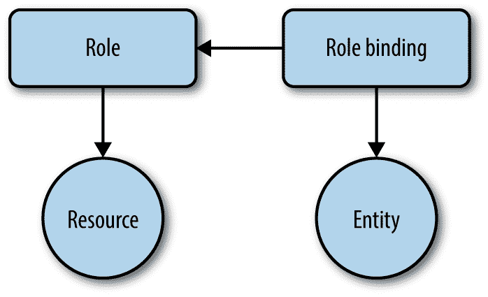

# 第十章。安全

在 Kubernetes 中运行应用程序伴随着开发人员和运营人员的共同责任，以确保攻击媒介最小化，遵循最低特权原则，并明确定义对资源的访问。在这一章中，我们将介绍您可以并且应该使用的方法，以确保您的集群和应用程序安全运行。本章中的食谱包括:

*   服务帐户的作用和用途

*   基于角色的访问控制(RBAC)

*   定义 pod 的安全上下文

# 10.1 为应用程序提供唯一标识

## 问题

您希望为应用程序提供唯一的标识，以便在细粒度级别上控制对资源的访问。

## 解决办法

创建一个服务帐户并在 pod 规范中使用它。

首先，创建一个名为`myappsa`的新服务帐户，并仔细查看它:

```
$ kubectl create serviceaccount myappsa
serviceaccount "myappsa" created

$ kubectl describe sa myappsa
Name:           myappsa
Namespace:      default
Labels:         <none>
Annotations:    <none>

Image pull secrets:     <none>

Mountable secrets:      myappsa-token-rr6jc

Tokens:                 myappsa-token-rr6jc

$ kubectl describe secret myappsa-token-rr6jc
Name:           myappsa-token-rr6jc
Namespace:      default
Labels:         <none>
Annotations:    kubernetes.io/service-account.name=myappsa
                kubernetes.io/service-account.uid=0baa3df5-c474-11e7-8f08...

Type:   kubernetes.io/service-account-token

Data
====
ca.crt:         1066 bytes
namespace:      7 bytes
token:          eyJhbGciOiJSUzI1NiIsInR5cCI6IkpXVCJ9 ...

```

您可以在 pod 中使用此服务帐户，如下所示:

```
kind:                 Pod
apiVersion:           v1
metadata:
  name:               myapp
spec:
  serviceAccountName: myappsa
  containers:
  - name:             main
    image:            centos:7
    command:
      - "bin/bash"
      - "-c"
      - "sleep10000"
```

然后，您可以通过运行以下命令来验证服务帐户`myappsa`是否已被您的 pod 正确使用:

```
$ kubectl exec myapp -c main \
          cat  /var/run/secrets/kubernetes.io/serviceaccount/token \
          eyJhbGciOiJSUzI1NiIsInR5cCI6IkpXVCJ9 ...

```

事实上，`myappsa`服务帐户令牌已经安装在 pod 中的预期位置，可以继续使用。

虽然服务帐户本身并不是非常有用，但它构成了细粒度访问控制的基础；详见[配方 10.2](#rbac_intro) 。

## 讨论

能够识别实体是身份验证和授权的先决条件。从 API 服务器的角度来看，有两种实体:人类用户和应用程序。虽然用户身份(管理)不在 Kubernetes 的范围内，但有一个代表应用身份的一流资源:服务帐户。

从技术上来说，应用程序的认证是通过`/var/run/secrets/kubernetes.io/serviceaccount/token`位置的文件中可用的令牌来捕获的，该令牌是通过秘密自动装载的。服务帐户是命名空间资源，表示如下:

```
system:serviceaccount:$NAMESPACE:$SERVICEACCOUNT
```

在某个命名空间中列出服务帐户会给你带来如下信息:

```
$ kubectl get sa
NAME         SECRETS   AGE
default      1         90d
myappsa      1         19m
prometheus   1         89d

```

注意这里叫`default`的服务账号。这是自动创建的；如果您没有像解决方案中所做的那样为 pod 显式设置服务帐户，它将在其名称空间中被分配`default`服务帐户。

## 请参见

*   [管理服务账户](https://kubernetes.io/docs/admin/service-accounts-admin/)

*   [为 Pods 配置服务帐户](https://kubernetes.io/docs/tasks/configure-pod-container/configure-service-account/)

*   [从私有注册表中提取图像](https://kubernetes.io/docs/tasks/configure-pod-container/pull-image-private-registry/)

# 10.2 列出和查看访问控制信息

## 问题

您希望了解允许您执行哪些操作，例如，更新部署或列出机密。

## 解决办法

以下解决方案假设您使用基于角色的访问控制作为[授权方法](https://kubernetes.io/docs/admin/authorization/)。

要检查特定用户是否允许对资源执行特定操作，请使用`kubectl auth can-i`。例如，您可以执行此命令来检查服务帐户`system:serviceaccount:sec:myappsa`是否允许在名称空间`sec`中列出 pods:

```
$ kubectl auth can-i list pods --as=system:serviceaccount:sec:myappsa -n=sec
yes

```

###### 注意

如果你想在 Minikube 中尝试这个食谱，你需要在执行二进制时添加`--extra-config=apiserver.Authorization.Mode=RBAC`。

要列出命名空间中可用的角色，请执行以下操作:

```
$ kubectl get roles -n=kube-system
NAME                                             AGE
extension-apiserver-authentication-reader        1d
system::leader-locking-kube-controller-manager   1d
system::leader-locking-kube-scheduler            1d
system:controller:bootstrap-signer               1d
system:controller:cloud-provider                 1d
system:controller:token-cleaner                  1d

$ kubectl get clusterroles -n=kube-system
NAME                                             AGE
admin                                            1d
cluster-admin                                    1d
edit                                             1d
system:auth-delegator                            1d
system:basic-user                                1d
system:controller:attachdetach-controller        1d
system:controller:certificate-controller         1d
system:controller:cronjob-controller             1d
system:controller:daemon-set-controller          1d
system:controller:deployment-controller          1d
system:controller:disruption-controller          1d
system:controller:endpoint-controller            1d
system:controller:generic-garbage-collector      1d
system:controller:horizontal-pod-autoscaler      1d
system:controller:job-controller                 1d
system:controller:namespace-controller           1d
system:controller:node-controller                1d
system:controller:persistent-volume-binder       1d
system:controller:pod-garbage-collector          1d
system:controller:replicaset-controller          1d
system:controller:replication-controller         1d
system:controller:resourcequota-controller       1d
system:controller:route-controller               1d
system:controller:service-account-controller     1d
system:controller:service-controller             1d
system:controller:statefulset-controller         1d
system:controller:ttl-controller                 1d
system:discovery                                 1d
system:heapster                                  1d
system:kube-aggregator                           1d
system:kube-controller-manager                   1d
system:kube-dns                                  1d
system:kube-scheduler                            1d
system:node                                      1d
system:node-bootstrapper                         1d
system:node-problem-detector                     1d
system:node-proxier                              1d
system:persistent-volume-provisioner             1d
view                                             1d

```

输出显示了预定义的角色，可以直接用于用户和服务帐户。

要进一步探索某个角色并了解允许哪些操作，请使用:

```
$ kubectl describe clusterroles/view -n=kube-system
Name:           view
Labels:         kubernetes.io/bootstrapping=rbac-defaults
Annotations:    rbac.authorization.kubernetes.io/autoupdate=true
PolicyRule:
  Resources                                     Non-Resource URLs     ...  ...
  ---------                                     -----------------     ---  ---
  bindings                                      []                    ...  ...
  configmaps                                    []                    ...  ...
  cronjobs.batch                                []                    ...  ...
  daemonsets.extensions                         []                    ...  ...
  deployments.apps                              []                    ...  ...
  deployments.extensions                        []                    ...  ...
  deployments.apps/scale                        []                    ...  ...
  deployments.extensions/scale                  []                    ...  ...
  endpoints                                     []                    ...  ...
  events                                        []                    ...  ...
  horizontalpodautoscalers.autoscaling          []                    ...  ...
  ingresses.extensions                          []                    ...  ...
  jobs.batch                                    []                    ...  ...
  limitranges                                   []                    ...  ...
  namespaces                                    []                    ...  ...
  namespaces/status                             []                    ...  ...
  persistentvolumeclaims                        []                    ...  ...
  pods                                          []                    ...  ...
  pods/log                                      []                    ...  ...
  pods/status                                   []                    ...  ...
  replicasets.extensions                        []                    ...  ...
  replicasets.extensions/scale                  []                    ...  ...
  replicationcontrollers                        []                    ...  ...
  replicationcontrollers/scale                  []                    ...  ...
  replicationcontrollers.extensions/scale       []                    ...  ...
  replicationcontrollers/status                 []                    ...  ...
  resourcequotas                                []                    ...  ...
  resourcequotas/status                         []                    ...  ...
  scheduledjobs.batch                           []                    ...  ...
  serviceaccounts                               []                    ...  ...
  services                                      []                    ...  ...
  statefulsets.apps                             []                    ...  ...

```

除了`kube-system`命名空间中定义的默认角色外，还可以定义自己的角色；参见[食谱 10.3](#access_control) 。

###### 小费

启用 RBAC 后，在许多环境中(包括 Minikube 和 GKE)，当您尝试访问 Kubernetes 仪表板时，您可能会看到一个禁止(403)状态代码和一条如下所示的错误消息:

> 用户“system:service account:kube-system:default”无法在命名空间“sec”中列出 pods。(获取豆荚)

要访问仪表板，您需要给予`kube-system:default`服务帐户必要的权限:

```
$ kubectl create clusterrolebinding admin4kubesystem \
  --clusterrole=cluster-admin \
  --serviceaccount=kube-system:default

```

请注意，此命令赋予服务帐户很多权限，在生产环境中可能并不可取。

## 讨论

在[图 10-1](#rbac-concept) 中可以看到，在处理 RBAC 授权时有几个移动部件:

*   实体—即组、用户或服务帐户

*   资源，如容器、服务或秘密

*   角色，它定义资源上的操作规则

*   角色绑定，将角色应用于实体



###### 图 10-1。RBAC 概念

角色在其规则中使用的对资源的操作是所谓的动词:

*   `get`、`list`、`watch`

*   `create`

*   `update` / `patch`

*   `delete`

关于角色，我们区分两种类型:

*   集群范围:集群角色及其各自的集群角色绑定

*   命名空间范围:角色和角色绑定

在[食谱 10.3](#access_control) 中，我们将进一步讨论如何创建自己的规则并将其应用于用户和资源。

## 请参见

*   Kubernetes [授权概述](https://kubernetes.io/docs/admin/authorization/)

*   [使用 RBAC 授权](https://kubernetes.io/docs/admin/authorization/rbac/)

# 10.3 控制资源访问

## 问题

对于给定的用户或应用程序，您希望允许或拒绝某个操作，例如查看机密或更新部署。

## 解决办法

让我们假设您想要限制一个应用程序只能查看豆荚，也就是说，列出豆荚并获取豆荚的详细信息。

您可以从 YAML 货单中的 pod 定义开始，使用专用服务帐户`myappsa`(参见[食谱 10.1](#service_accounts) ):

```
kind:                 Pod
apiVersion:           v1
metadata:
  name:               myapp
  namespace:          sec
spec:
  serviceAccountName: myappsa
  containers:
  - name:             main
    image:            centos:7
    command:
      - "bin/bash"
      - "-c"
      - "sleep10000"
```

接下来，您将定义一个角色——让我们称之为清单中的`podreader`*pod-reader . YAML*——它定义了资源上允许的操作:

```
kind:        Role
apiVersion:  rbac.authorization.k8s.io/v1beta1
metadata:
  name:      podreader
  namespace: sec
rules:
- apiGroups: [""]
  resources: ["pods"]
  verbs:     ["get", "list"]
```

最后但同样重要的是，您需要将角色`podreader`应用于服务帐户`myappsa`，使用 *pod-reader-binding.yaml* 中的角色绑定:

```
kind:        RoleBinding
apiVersion:  rbac.authorization.k8s.io/v1beta1
metadata:
  name:      podreaderbinding
  namespace: sec
roleRef:
  apiGroup:  rbac.authorization.k8s.io
  kind:      Role
  name:      podreader
subjects:
- kind:      ServiceAccount
  name:      myappsa
  namespace: sec
```

创建相应的资源时，您可以直接使用 YAML 清单(假设已经创建了服务帐户):

```
$ kubectl create -f pod-reader.yaml
$ kubectl create -f pod-reader-binding.yaml
$ kubectl create -f pod-with-sa.yaml

```

您可以使用以下命令，而不是为角色和角色绑定创建清单:

```
$ kubectl create role podreader \
          --verb=get --verb=list \
          --resource=pods -n=sec

$ kubectl create rolebinding podreaderbinding \
          --role=sec:podreader \
          --serviceaccount=sec:myappsa \
          --namespace=sec -n=sec

```

请注意，这是命名空间访问控制设置的情况，因为您使用的是角色和角色绑定。对于集群范围的访问控制，您可以使用相应的`create clusterrole`和`create clusterrolebinding`命令。

###### 小费

有时，您是否应该使用角色或集群角色和/或角色绑定并不明显，因此以下是一些您可能会发现有用的经验法则:

*   如果您想限制对某个命名空间中的命名空间资源(如服务或 pod)的访问，请使用角色和角色绑定(就像我们在本食谱中所做的那样)。

*   如果您想在两个名称空间中重用一个角色，请使用带有角色绑定的集群角色。

*   如果要限制对群集范围内的资源(如节点)或所有命名空间内的命名空间资源的访问，请使用带有群集角色绑定的群集角色。

## 请参见

*   [在您的 Kubernetes 集群中配置 RBAC](https://docs.bitnami.com/kubernetes/how-to/configure-rbac-in-your-kubernetes-cluster/)

*   安托万·科顿的博客发布[“库本内特斯 v1.7 安全实践”](https://acotten.com/post/kube17-security)

# 10.4 固定吊舱

## 问题

您希望在 pod 级别定义应用程序的安全上下文。 例如，您希望将应用程序作为非特权进程运行，或者限制应用程序可以访问的卷类型。

## 解决办法

要在 Kubernetes 中实施 pod 级别的策略，请使用 pod 规范中的`securityContext`字段。

让我们假设您希望一个应用程序作为非根用户运行。为此，您将使用容器级别的安全上下文，如下清单所示: *securedpod.yaml* :

```
kind:                Pod
apiVersion:          v1
metadata:
  name:              secpod
spec:
  containers:
  - name:            shell
    image:           centos:7
    command:
      - "bin/bash"
      - "-c"
      - "sleep10000"
    securityContext:
      runAsUser:     5000
```

现在创建 pod，并检查运行容器的用户:

```
$ kubectl create -f securedpod.yaml
pod "secpod" created

$ kubectl exec secpod ps aux
USER       PID %CPU %MEM    VSZ   RSS TTY      STAT START   TIME COMMAND
5000         1  0.0  0.0   4328   672 ?        Ss   12:39   0:00 sleep 10000
5000         8  0.0  0.1  47460  3108 ?        Rs   12:40   0:00 ps aux

```

不出所料，它以 ID 为`5000`的用户身份运行。请注意，您也可以在容器级别而不是特定容器上使用`securityContext`字段。

在 pod 级别实施策略的一个更强大的方法是使用 pod 安全策略(PSP)。这些是群集范围的资源，允许您定义一系列策略，包括一些类似于您在这里看到的策略，但也包括围绕存储和网络的限制。有关如何使用 PSP 的演练，请参见 Kubernetes Bitnami 文档中的[“使用 Pod 安全策略保护 Kubernetes 集群”](https://docs.bitnami.com/kubernetes/how-to/secure-kubernetes-cluster-psp/)。

## 请参见

*   [Pod 安全策略文档](https://kubernetes.io/docs/concepts/policy/pod-security-policy/)

*   [为容器或容器配置安全上下文](https://kubernetes.io/docs/tasks/configure-pod-container/security-context/)