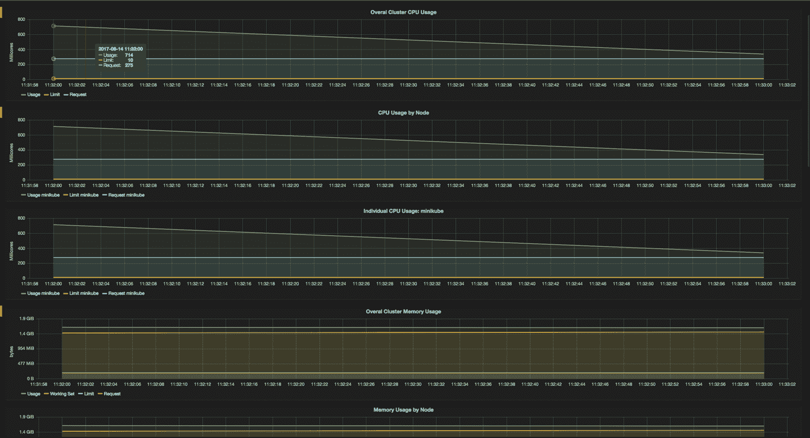
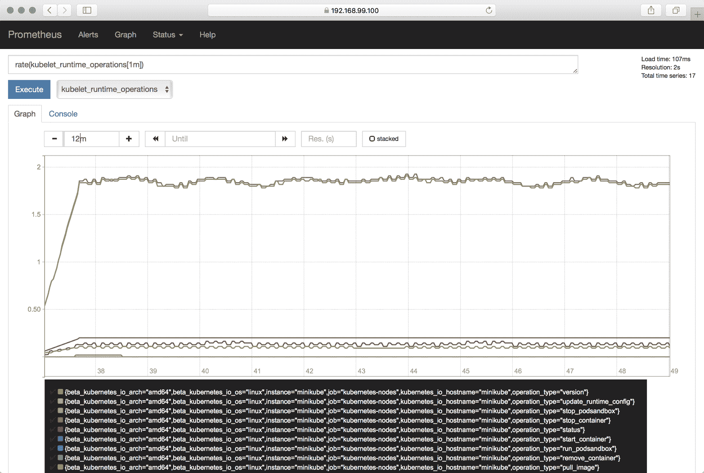

# 第十一章。监控和记录

在本章中，我们将重点关注基础设施和应用程序级别的监控和日志记录方法。 在 Kubernetes 的上下文中，不同的角色通常具有不同的范围:

*   *管理员角色*，例如集群管理员、网络操作人员或命名空间级别的管理员，专注于基础架构方面。典型问题可能是:淋巴结健康吗？我们要添加一个工作节点吗？什么是集群范围的利用率？用户是否接近其使用配额？

*   *开发人员角色*主要在他们的应用环境中思考和行动，在微服务时代，这很可能是少数几个。例如，一个开发人员可能会问:我有足够的资源来运行我的应用程序吗？我应该将我的应用程序扩展到多少个副本？我是否可以访问正确的卷，它们有多满？我的某个应用失败了吗？如果是，为什么？

我们将首先围绕利用 Kubernetes 活跃度和就绪性探测器的集群内部监控来讨论配方，然后重点讨论使用 [Heapster](https://github.com/kubernetes/heapster) 和 [Prometheus](https://prometheus.io/) 进行监控，最后讨论与日志记录相关的配方。

# 11.1 访问容器的日志

## 问题

您希望访问在特定容器中运行的应用程序的日志。

## 解决办法

使用`kubectl logs`命令。要查看各种选项，请检查用法，如:

```
$ kubectl logs --help | more
Print the logs for a container in a pod or specified resource. If the pod has only
one container, the container name is optional.

Aliases:
logs, log

Examples:
  # Return snapshot logs from pod nginx with only one container
  kubectl logs nginx
...

```

例如，给定一个由部署启动的 pod(参见[配方 4.1](04.html#kubectl_run) ，您可以这样检查日志:

```
$ kubectl get pods
NAME                           READY     STATUS    RESTARTS   AGE
ghost-8449997474-kn86m         1/1       Running   0          1m

$ kubectl logs ghost-8449997474-kn86m
[2017-12-16 18:44:18] INFO Creating table: posts
[2017-12-16 18:44:18] INFO Creating table: users
[2017-12-16 18:44:18] INFO Creating table: roles
[2017-12-16 18:44:18] INFO Creating table: roles_users
...

```

###### 小费

如果一个吊舱有多个容器，您可以通过使用`kubectl logs`的`-c`选项指定容器的名称来获取其中任何一个容器的日志。

# 11.2 使用活性探针从中断状态恢复

## 问题

您希望确保如果在您的一些豆荚中运行的应用程序进入中断状态，Kubernetes 会自动重新启动豆荚。

## 解决办法

使用活性探针。 <sup>[1](#idm139735591142544)</sup> 如果探头出现故障，`kubelet`会自动重启吊舱。探头是吊舱规格的一部分，并被添加到`containers`部分。吊舱中的每个容器都可以有一个活性探测器。

探测可以有三种不同的类型:它可以是在容器内执行的命令、对容器内 web 服务器所服务的特定路由的 HTTP 请求，或者是更通用的 TCP 探测。

在下面的例子中，我们展示了一个基本的 HTTP 探测:

```
apiVersion:   v1
kind:         Pod
metadata:
  name:       liveness-nginx
spec:
  containers:
  - name:     liveness
    image:    nginx
    livenessProbe:
      httpGet:
        path: /
        port: 80
```

完整示例见[配方 11.4](#liveness_readiness_probes) 。

## 请参见

*   Kubernetes [容器探测器文档](https://kubernetes.io/docs/concepts/workloads/pods/pod-lifecycle/#container-probes)。

# 11.3 使用就绪探测器控制吊舱的交通流量

## 问题

根据活跃度探测，你的豆荚已经启动并运行(见[食谱 11.2](#liveness) ，但是如果应用程序准备好服务请求，你只希望向它们发送流量。

## 解决办法

将就绪探测器添加到您的吊舱规格中。<sup>[【2】](#idm139735591088304)</sup>与活跃度探头类似，准备状态探头可以有三种类型(详见文档)。下面是一个使用`nginx` Docker 映像运行单个 pod 的简单示例。就绪探测器向端口 80 发出 HTTP 请求:

```
apiVersion:   v1
kind:         Pod
metadata:
  name:       readiness-nginx
spec:
  containers:
  - name:     readiness
    image:    nginx
    readinessProbe:
      httpGet:
        path:  /
        port:  80
```

## 讨论

虽然此配方中显示的就绪探测器与[配方 11.2](#liveness) 中的活性探测器相同，但它们通常应该不同，因为两个探测器旨在提供关于应用程序不同方面的信息。活动探测器检查应用程序进程是否活动，但它可能还没有准备好接受请求。就绪探测器检查应用程序是否正确地服务于请求。因此，只有当准备就绪探测器通过时，吊舱才成为服务的一部分(参见[配方 5.1](05.html#simple_service) )。

## 请参见

*   Kubernetes [容器探测器文档](https://kubernetes.io/docs/concepts/workloads/pods/pod-lifecycle/#container-probes)

# 11.4 为您的部署添加活跃度和就绪性探测

## 问题

您希望能够自动检查您的应用程序是否健康，如果不是这样，让 Kubernetes 采取行动。

## 解决办法

要向 Kubernetes 表明您的应用程序运行得如何，请添加活跃度和就绪性探测器，如下所述。

起点是一个部署清单:

```
apiVersion:              extensions/v1beta1
kind:                    Deployment
metadata:
  name:                  webserver
spec:
  replicas:              1
  template:
    metadata:
      labels:
        app:             nginx
    spec:
      containers:
      - name:            nginx
        image:           nginx:stable
        ports:
        - containerPort: 80
```

活跃度和准备状态探测器在吊舱规范的`containers`部分定义。参见介绍性示例([配方 11.2](#liveness) 和[配方 11.3](#readiness) )并将以下内容添加到部署的 pod 模板中的容器规范中:

```
...
     livenessProbe:
       initialDelaySecond: 2
       periodSeconds: 10
       httpGet:
         path: /
         port: 80
     readinessProbe:
       initialDelaySecond: 2
       periodSeconds: 10
       httpGet:
         path: /
         port: 80
...
```

现在你可以启动它并检查探测器:

```
$ kubectl create -f webserver.yaml

$ kubectl get pods
NAME                         READY     STATUS    RESTARTS   AGE
webserver-4288715076-dk9c7   1/1       Running   0          2m

$ kubectl describe pod/webserver-4288715076-dk9c7
Name:           webserver-4288715076-dk9c7
Namespace:      default
Node:           node/172.17.0.128
...
Status:         Running
IP:             10.32.0.2
Controllers:    ReplicaSet/webserver-4288715076
Containers:
  nginx:
    ...
    Ready:           True
    Restart Count:   0
    Liveness:        http-get http://:80/ delay=2s timeout=1s period=10s #...
...

```

注意`kubectl describe`命令的输出已经被编辑到重要的位；有更多的信息可用，但它与我们这里的问题无关。

## 讨论

为了验证容器中的容器是否健康并准备好服务于流量，Kubernetes 提供了一系列健康检查机制。 健康检查，或在 Kubernetes 中称为*探测器*，是在容器级别上定义的，而不是在容器级别上定义的，由两个不同的组件执行:

*   每个工作节点上的`kubelet`使用规范中的`livenessProbe`指令来确定何时重启容器。这些活性探测有助于克服上升问题或死锁。

*   对一组 pod 进行负载平衡的服务使用`readinessProbe`指令来确定 pod 是否准备好，因此应该接收流量。如果不是这样，它将被排除在服务的端点池之外。请注意，当一个容器都准备好了，它就被认为已经准备好了。

什么时候应该用哪个探头？这取决于容器的行为，真的。使用活性探针和`Always`或`OnFailure`中的一个`restartPolicy`,如果探针失败，容器可以并且应该被杀死并重新启动。如果你想在一个吊舱准备好的时候发送流量，使用准备探测器。请注意，在后一种情况下，就绪探测器可以与活动探测器相同。

## 请参见

*   [配置活跃度和就绪探测器](https://kubernetes.io/docs/tasks/configure-pod-container/configure-liveness-readiness-probes/)

*   [吊舱生命周期文档](https://kubernetes.io/docs/concepts/workloads/pods/pod-lifecycle/)

*   [初始化容器文档](https://kubernetes.io/docs/concepts/workloads/pods/init-containers/)(稳定在 v1.6 及以上版本)

# 11.5 启用 Minikube 上的 Heapster 来监控资源

## 问题

您想要使用 Minikube 中的`kubectl top`命令来监控资源使用情况，但是 Heapster 加载项似乎没有运行:

```
$ kubectl top pods
Error from server (NotFound): the server could not find the requested resource
(get services http:heapster:)

```

## 解决办法

最新版本的`minikube`命令包括一个插件管理器，它允许您通过一个命令启用 Heapster 以及一些其他插件，如入口控制器:

```
$ minikube addons enable heapster

```

启用 Heapster 插件会触发在`kube-system`命名空间中创建两个 pod:一个 pod 运行 Heapster，另一个 pod 运行 [InfluxDB](https://www.influxdata.com/) 时间序列数据库以及 [Grafana](https://grafana.com/grafana) 仪表盘。

几分钟后，一旦收集到第一个指标，`kubectl top`命令将返回资源指标，如预期的那样:

```
$ kubectl top node
NAME       CPU(cores)   CPU%      MEMORY(bytes)   MEMORY%
minikube   187m         9%        1154Mi          60%

$ kubectl top pods --all-namespaces
NAMESPACE     NAME                             CPU(cores)   MEMORY(bytes)
default       ghost-2663835528-fb044           0m           140Mi
kube-system   kube-dns-v20-4bkhn               3m           12Mi
kube-system   heapster-6j5m8                   0m           21Mi
kube-system   influxdb-grafana-vw9x1           23m          37Mi
kube-system   kube-addon-manager-minikube      47m          3Mi
kube-system   kubernetes-dashboard-scsnx       0m           14Mi
kube-system   default-http-backend-75m71       0m           1Mi
kube-system   nginx-ingress-controller-p8fmd   4m           51Mi

```

现在，您还可以访问 Grafana 仪表板，并根据自己的喜好进行定制:

```
$ minikube service monitoring-grafana -n kube-system
Waiting, endpoint for service is not ready yet...
Waiting, endpoint for service is not ready yet...
Waiting, endpoint for service is not ready yet...
Waiting, endpoint for service is not ready yet...
Opening kubernetes service kube-system/monitoring-grafana in default browser...

```

这个命令的结果是，你的默认浏览器会自动打开，你会看到类似于[图 11-1](#minikube-grafana-dashboard) 的内容。



###### 图 11-1。格拉夫纳仪表板截图，显示 Minikube 指标

请注意，此时您可以深入 Grafana 中的指标。

# 11.6 在迷你库贝上使用普罗米修斯

## 问题

您希望在中心位置查看和查询集群的系统和应用程序指标。

## 解决办法

使用普罗米修斯如下:

1.  创建一个保存普罗米修斯配置的配置图。

2.  为普罗米修斯设置一个服务帐户，并通过 RBAC(参见[配方 10.3](10.html#access_control) )向服务帐户(参见[配方 10.1](10.html#service_accounts) )分配权限，允许访问所有指标。

3.  为普罗米修斯创建一个由部署、服务和`Ingress`资源组成的应用程序，以便您可以通过集群外部的浏览器访问它。

首先，您需要通过`ConfigMap`对象设置普罗米修斯配置(参见[配方 8.3](08.html#configmaps) 了解配置地图的介绍)。稍后您将在普罗米修斯应用程序中使用它。创建一个名为*普罗米修斯. yml* 的文件，保存普罗米修斯配置，内容如下:

```
global:
  scrape_interval:        5s
  evaluation_interval:    5s
scrape_configs:
- job_name:               'kubernetes-nodes'
  scheme:                 https
  tls_config:
    ca_file:              /var/run/secrets/kubernetes.io/serviceaccount/ca.crt
    server_name:          'gke-k8scb-default-pool-be16f9ee-522p'
    insecure_skip_verify: true
  bearer_token_file:      /var/run/secrets/kubernetes.io/serviceaccount/token
  kubernetes_sd_configs:
  - role:                 node
  relabel_configs:
  - action:               labelmap
    regex:                __meta_kubernetes_node_label_(.+)
- job_name:               'kubernetes-cadvisor'
  scheme:                 https
  tls_config:
    ca_file:              /var/run/secrets/kubernetes.io/serviceaccount/ca.crt
  bearer_token_file:      /var/run/secrets/kubernetes.io/serviceaccount/token
  kubernetes_sd_configs:
  - role:                 node
  relabel_configs:
  - action:               labelmap
    regex:                __meta_kubernetes_node_label_(.+)
  - target_label:         __address__
    replacement:          kubernetes.default.svc:443
  - source_labels:        [__meta_kubernetes_node_name]
    regex:                (.+)
    target_label:         __metrics_path__
    replacement:          /api/v1/nodes/${1}:4194/proxy/metrics
```

我们可以使用来创建一个配置图，如下所示:

```
$ kubectl create configmap prom-config-cm --from-file=prometheus.yml

```

接下来，在名为*的清单文件中设置普罗米修斯服务帐户和角色绑定(权限)，如下所示:*

```
apiVersion:  v1
kind:        ServiceAccount
metadata:
  name:      prometheus
  namespace: default
---
apiVersion:  rbac.authorization.k8s.io/v1beta1
kind:        ClusterRoleBinding
metadata:
  name:      prometheus
roleRef:
  apiGroup:  rbac.authorization.k8s.io
  kind:      ClusterRole
  name:      cluster-admin
subjects:
- kind:      ServiceAccount
  name:      prometheus
  namespace: default
```

使用该清单，您现在可以创建服务帐户和角色绑定:

```
$ kubectl create -f prometheus-rbac.yaml

```

现在，您已经对所有先决条件(配置和访问权限)进行了排序，您可以继续使用普罗米修斯应用程序本身。请记住，该应用程序由一个部署、一个服务和一个`Ingress`资源组成，并使用您在前面步骤中创建的配置图和服务帐户。

接下来，在*普罗米修斯-app.yaml* 中定义普罗米修斯应用清单:

```
kind:                                     Deployment
apiVersion:                               extensions/v1beta1
metadata:
  name:                                   prom
  namespace:                              default
  labels:
    app:                                  prom
spec:
  replicas:                               1
  selector:
    matchLabels:
      app:                                prom
  template:
    metadata:
      name:                               prom
      labels:
        app:                              prom
    spec:
      serviceAccount:                     prometheus
      containers:
      - name:                             prom
        image:                            prom/prometheus
        imagePullPolicy:                  Always
        volumeMounts:
        - name:                           prometheus-volume-1
          mountPath:                      "/prometheus"
        - name:                           prom-config-volume
          mountPath:                      "/etc/prometheus/"
      volumes:
      - name:                             prometheus-volume-1
        emptyDir:                         {}
      - name:                             prom-config-volume
        configMap:
          name:                           prom-config-cm
          defaultMode:                    420
---
kind:                                     Service
apiVersion:                               v1
metadata:
  name:                                   prom-svc
  labels:
    app:                                  prom
spec:
  ports:
  - port:                                 80
    targetPort:                           9090
  selector:
    app:                                  prom
  type:                                   LoadBalancer
  externalTrafficPolicy:                  Cluster
---
kind:                                     Ingress
apiVersion:                               extensions/v1beta1
metadata:
  name:                                   prom-public
  annotations:
    ingress.kubernetes.io/rewrite-target: /
spec:
  rules:
  - host:
    http:
      paths:
      - path:                             /
        backend:
          serviceName:                    prom-svc
          servicePort:                    80
```

现在从清单中创建应用程序:

```
$ kubectl create -f prometheus-app.yaml

```

祝贺您—您刚刚创建了一个成熟的应用程序！现在可以通过`$MINISHIFT_IP/graph`(例如`https://192.168.99.100/graph`)访问普罗米修斯，应该会在[图 11-2](#prometheus-screenshot) 中看到类似的内容。



###### 图 11-2。普罗米修斯截图

## 讨论

普罗米修斯是一个强大而灵活的监控和警报系统。你可以使用它——或者更好地说，许多[工具库](https://prometheus.io/docs/instrumenting/clientlibs/)中的一个——来让你自己的应用程序报告更高级别的指标，比如，执行的事务数量，就像一个`kubelet`报告 CPU 使用情况的方式一样。

虽然普罗米修斯速度快且可扩展，但您可能希望使用其他东西来可视化度量。规范的方法是[用 Grafana](https://prometheus.io/docs/visualization/grafana/) 连接。

###### 警告

将 Prometheus 与 Kubernetes 1.7.0 到 1.7.2 版本一起使用存在一个已知的[问题](https://github.com/prometheus/prometheus/issues/2916)，因为`kubelet`关于公开容器度量的行为在 1 . 7 . 0 版本中发生了变化

请注意，解决方案中显示的普罗米修斯配置对 v1.7.0 到 v1.7.2 有效；如果您使用的是 v1.7.3 或更高版本，则需要查看[示例普罗米修斯配置文件](https://github.com/prometheus/prometheus/blob/master/documentation/examples/prometheus-kubernetes.yml#L88)了解需要更改的详细信息。

请注意，这里描述的解决方案不限于 Minikube。事实上，只要您可以创建服务帐户(也就是说，您有足够的权限授予 Prometheus 必要的权限)，您就可以将相同的解决方案应用于 GKE、ACS 或 OpenShift 等环境。

## 请参见

*   [普罗米修斯文档中的仪器](https://prometheus.io/docs/practices/instrumentation/)

*   [格拉法娜与普罗米修斯在《普罗米修斯文件》](https://prometheus.io/docs/visualization/grafana/)

# 11.7 在 Minikube 上使用弹性搜索–Fluentd–Kibana(EFK)

## 问题

您希望在中心位置查看和查询集群中所有应用程序的日志。

## 解决办法

使用弹性搜索、[fluent](https://www.fluentd.org/)和 [Kibana](https://www.elastic.co/products/kibana) ，如下所述。

作为准备，确保 Minikube 分配了足够的资源。例如，使用`--cpus=4 --memory=4000`并确保入口插件已启用，如下所示:

```
$ minikube start
Starting local Kubernetes v1.7.0 cluster...
Starting VM...
Getting VM IP address...
Moving files into cluster...
Setting up certs...
Starting cluster components...
Connecting to cluster...
Setting up kubeconfig...
Kubectl is now configured to use the cluster.

$ minikube addons list | grep ingress
- ingress: enabled

```

如果加载项未启用，请启用它:

```
$  minikube addons enable ingress

```

接下来，创建一个名为 *efk-logging.yaml* 的清单文件，内容如下:

```
kind:                                     Ingress
apiVersion:                               extensions/v1beta1
metadata:
  name:                                   kibana-public
  annotations:
    ingress.kubernetes.io/rewrite-target: /
spec:
  rules:
  - host:
    http:
      paths:
      - path:                             /
        backend:
          serviceName:                    kibana
          servicePort:                    5601
---
kind:                                     Service
apiVersion:                               v1
metadata:
  labels:
    app:                                  efk
  name:                                   kibana
spec:
  ports:
  - port:                                 5601
  selector:
    app:                                  efk
---
kind:                                     Deployment
apiVersion:                               extensions/v1beta1
metadata:
  name:                                   kibana
spec:
  replicas:                               1
  template:
    metadata:
      labels:
        app:                              efk
    spec:
      containers:
      - env:
        - name:                           ELASTICSEARCH_URL
          value:                          http://elasticsearch:9200
        name:                             kibana
        image:                            docker.elastic.co/kibana/kibana:5.5.1
        ports:
          - containerPort:                5601
---
kind:                                     Service
apiVersion:                               v1
metadata:
  labels:
    app:                                  efk
  name:                                   elasticsearch
spec:
  ports:
  - port:                                 9200
  selector:
    app:                                  efk
---
kind:                                     Deployment
apiVersion:                               extensions/v1beta1
metadata:
  name:                                   es
spec:
  replicas:                               1
  template:
    metadata:
      labels:
        app:                              efk
    spec:
      containers:
      - name:                             es
        image:                            docker.elastic.co/elasticsearch/
                                          elasticsearch:5.5.1
        ports:
        - containerPort:                  9200
        env:
        - name:                           ES_JAVA_OPTS
          value:                          "-Xms256m-Xmx256m"
---
kind:                                     DaemonSet
apiVersion:                               extensions/v1beta1
metadata:
  name:                                   fluentd
spec:
  template:
    metadata:
      labels:
        app:                              efk
      name:                               fluentd
    spec:
      containers:
      - name:                             fluentd
        image:                            gcr.io/google_containers/fluentd-
                                          elasticsearch:1.3
        env:
         - name:                          FLUENTD_ARGS
           value:                         -qq
        volumeMounts:
         - name:                          varlog
           mountPath:                     /varlog
         - name:                          containers
           mountPath:                     /var/lib/docker/containers
      volumes:
         - hostPath:
             path:                        /var/log
           name:                          varlog
         - hostPath:
             path:                        /var/lib/docker/containers
           name:                          containers
```

现在，您可以启动 EFK 堆栈:

```
$ kubectl create -f efk-logging.yaml

```

一切启动后，使用以下凭据登录基巴纳:

*   用户名:`kibana`

*   密码:`changeme`

访问`https://$IP/app/kibana#/discover?_g=()`处的发现选项卡，并从那里开始浏览日志。

如果要清理和/或重新启动 EFK 堆栈，请使用以下命令:

```
$ kubectl delete deploy/es && \
  kubectl delete deploy/kibana && \
  kubectl delete svc/elasticsearch && \
  kubectl delete svc/kibana && \
  kubectl delete ingress/kibana-public && \
  kubectl delete daemonset/fluentd

```

## 讨论

日志传送也可以使用日志存储来完成。我们选择在解决方案中使用 Fluentd，因为这是一个 CNCF 项目，正在获得很大的吸引力。

请注意，Kibana 可能需要一些时间才能启动，在进入配置位之前，您可能需要重新加载 web 应用程序几次。

## 请参见

*   Manoj Bhagwat 的博文[“用 Kubernetes 上的 Fluentd 和 ElasticSearch 来集中你的 Docker 日志”](https://medium.com/@manoj.bhagwat60/to-centralize-your-docker-logs-with-fluentd-and-elasticsearch-on-kubernetes-42d2ac0e8b6c)

*   [AWS 的非晶 EFK 堆栈](https://github.com/Skillshare/kubernetes-efk)

*   [elk-kublantes](https://github.com/kayrus/elk-kubernetes)

<sup>[1](#idm139735591142544-marker)</sup> 库本内斯，[【配置活跃度和就绪探测器】](https://kubernetes.io/docs/tasks/configure-pod-container/configure-liveness-readiness-probes/#define-a-liveness-command)。

<sup>[2](#idm139735591088304-marker)</sup> 库本内斯，[【定义就绪探测器】](https://kubernetes.io/docs/tasks/configure-pod-container/configure-liveness-readiness-probes/#define-readiness-probes)。