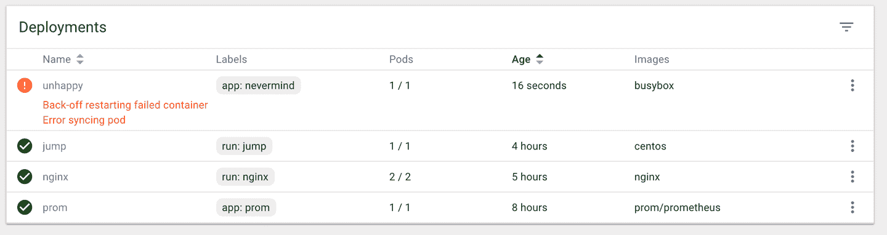
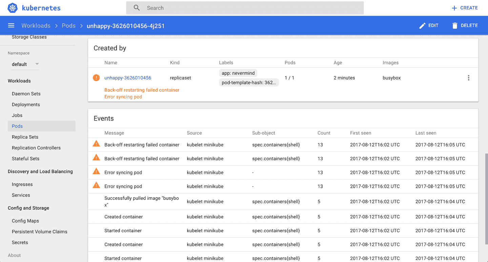
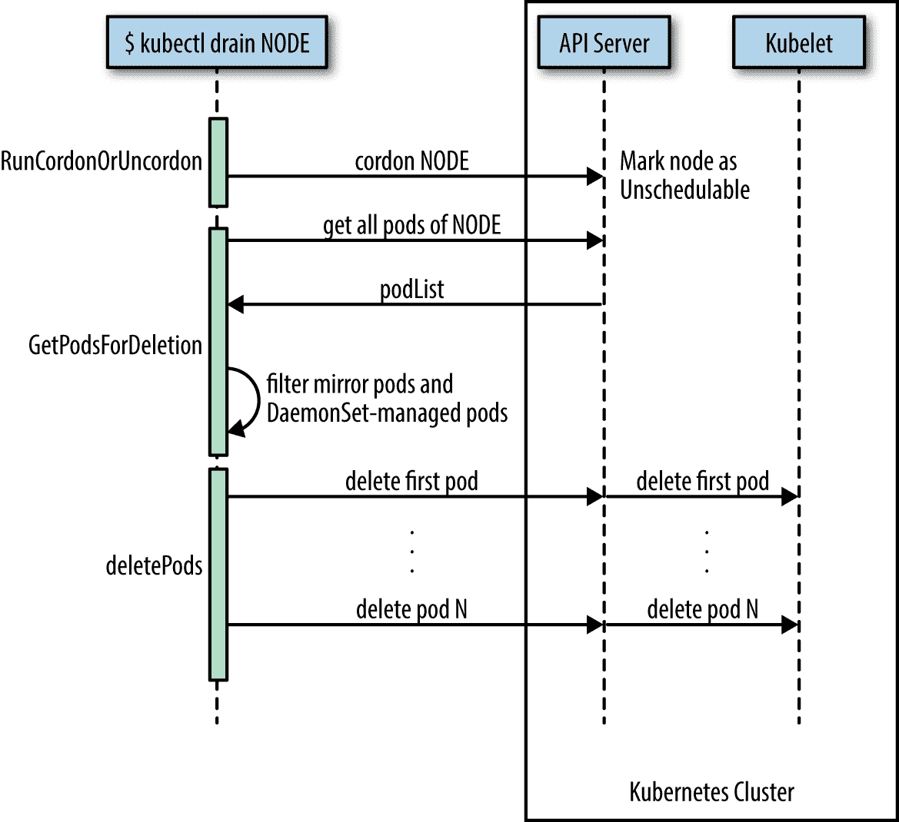

# 第十二章。维护和故障排除

在这一章中，你会发现处理应用级和集群级维护的方法。我们涵盖了故障排除的各个方面，从调试吊舱和容器，到测试服务连接，解释资源状态，以及节点维护。最后但同样重要的是，我们来看看如何处理`etcd`，Kubernetes 控制平面存储组件。本章与集群管理员和应用开发人员都相关。

# 12.1 为 kubectl 启用自动完成

## 问题

为`kubectl`命令键入完整的命令和参数是很麻烦的，所以你需要一个自动完成功能。

## 解决办法

为`kubectl`启用自动完成。

对于 Linux 和 *bash* 外壳，您可以使用以下命令在当前外壳中启用`kubectl`自动完成:

```
$ source <(kubectl completion bash)

```

对于其他操作系统和外壳，请查看[文档](https://kubernetes.io/docs/tasks/tools/install-kubectl/#enabling-shell-autocompletion)。

## 请参见

*   [kube CTL 概述](https://kubernetes.io/docs/user-guide/kubectl-overview/)

*   [立方切叶](https://kubernetes.io/docs/user-guide/kubectl-cheatsheet/)

# 12.2 从服务中移除容器

## 问题

你有一个定义明确的服务(见[食谱 5.1](05.html#simple_service) )由几个豆荚支持。 但是其中一个吊舱行为不检，您希望将其从端点列表中删除，以便稍后检查。

## 解决办法

使用`--overwrite`选项重新标记容器-这将允许您更改容器上`run`标签的值。通过覆盖此标签，您可以确保它不会被服务选择器([食谱 5.1](05.html#simple_service) )选择，并将从端点列表中删除。与此同时，监视你的吊舱的副本集将看到一个吊舱已经消失，并将开始一个新的副本。

要看到这一点，请从使用`kubectl run`生成的简单部署开始(参见[配方 4.4](04.html#deployments) ):

```
$ kubectl run nginx --image nginx --replicas 4

```

当你列出豆荚并用键`run`显示标签时，你会看到四个豆荚，值为`nginx` ( `run=nginx`是由`kubectl run`命令自动生成的标签):

```
$ kubectl get pods -Lrun
NAME                     READY     STATUS            RESTARTS   AGE       RUN
nginx-d5dc44cf7-5g45r    1/1       Running           0          1h        nginx
nginx-d5dc44cf7-l429b    1/1       Running           0          1h        nginx
nginx-d5dc44cf7-pvrfh    1/1       Running           0          1h        nginx
nginx-d5dc44cf7-vm764    1/1       Running           0          1h        nginx

```

然后，您可以通过服务公开此部署，并检查对应于每个 pod 的 IP 地址的端点:

```
$ kubectl expose deployments nginx --port 80

$ kubectl get endpoints
NAME         ENDPOINTS                                                 AGE
nginx        172.17.0.11:80,172.17.0.14:80,172.17.0.3:80 + 1 more...   1h

```

通过重新标记将第一个 pod 移出服务流量只需一个命令:

```
$ kubectl label pods nginx-d5dc44cf7-5g45r run=notworking --overwrite

```

###### 小费

要查找容器的 IP 地址，您可以在 JSON 中列出容器的清单，并运行 JQuery 查询:

```
$ kubectl get pods nginx-d5dc44cf7-5g45r -o json | \
  jq -r .status.podIP172.17.0.3

```

您将看到一个带有标签`run=nginx`的全新窗格出现，您将看到您的非工作窗格仍然存在，但不再出现在服务端点列表中:

```
$ kubectl get pods -Lrun
NAME                     READY     STATUS        RESTARTS   AGE       RUN
nginx-d5dc44cf7-5g45r    1/1       Running       0          21h       notworking
nginx-d5dc44cf7-hztlw    1/1       Running       0          21s       nginx
nginx-d5dc44cf7-l429b    1/1       Running       0          5m        nginx
nginx-d5dc44cf7-pvrfh    1/1       Running       0          5m        nginx
nginx-d5dc44cf7-vm764    1/1       Running       0          5m        nginx

$ kubectl describe endpoints nginx
Name:         nginx
Namespace:    default
Labels:       run=nginx
Annotations:  <none>
Subsets:
  Addresses:          172.17.0.11,172.17.0.14,172.17.0.19,172.17.0.7
...

```

# 12.3 访问集群外的集群 IP 服务

## 问题

您有一个内部服务给您带来了麻烦，您想测试它在本地是否工作正常，而不需要向外部公开该服务。

## 解决办法

使用本地代理到带有`kubectl proxy`的 Kubernetes API 服务器。

让我们假设您已经创建了部署和服务，如[配方 12.2](#relabel) 中所述。当您列出服务时，您应该会看到一个`nginx`服务:

```
$ kubectl get svc
NAME         TYPE        CLUSTER-IP     EXTERNAL-IP   PORT(S)   AGE
nginx        ClusterIP   10.109.24.56   <none>        80/TCP    22h

```

在 Kubernetes 集群之外无法访问此服务。但是，您可以在单独的终端中运行代理，然后在`localhost`上到达它。

首先在单独的终端上运行代理:

```
$ kubectl proxy
Starting to serve on 127.0.0.1:8001

```

###### 小费

您可以使用`--port`选项指定希望代理运行的端口。

在您的原始终端中，您可以使用浏览器或`curl`访问您的服务公开的应用。请注意服务的具体路径；它包含一个`/proxy`部分。如果没有这个，您将得到表示服务的 JSON 对象:

```
$ curl http://localhost:8001/api/v1/proxy/namespaces/default/services/nginx/
<!DOCTYPE html>
<html>
<head>
<title>Welcome to nginx!</title>
...

```

###### 注意

请注意，您现在也可以使用`curl`通过`localhost`访问整个库本内斯应用编程接口。

# 12.4 理解和解析资源状态

## 问题

您希望基于脚本或另一个自动化环境(如配置项/光盘管道)中的资源状态(如 pod)做出反应。

## 解决办法

使用`kubectl get $KIND/$NAME -o json`并使用这里描述的两种方法之一解析 JSON 输出。

如果你安装了[的 JSON 查询工具`jq`，你可以用它来解析资源状态。](https://github.com/stedolan/jq/wiki/Installation)假设您有一个名为`jump`的 pod，并想知道 pod 的服务质量等级为 <sup xmlns:epub="http://www.idpf.org/2007/ops">[1](#idm139735589877392)</sup> :

```
$ kubectl get po/jump -o json | jq --raw-output .status.qosClass
BestEffort

```

请注意，`jq`的`--raw-output`参数将显示原始值，`.status.qosClass`是与相应子字段匹配的表达式。

另一个状态查询可能与事件或状态转换有关:

```
$ kubectl get po/jump -o json | jq .status.conditions
[
  {
    "lastProbeTime": null,
    "lastTransitionTime": "2017-08-28T08:06:19Z",
    "status": "True",
    "type": "Initialized"
  },
  {
    "lastProbeTime": null,
    "lastTransitionTime": "2017-08-31T08:21:29Z",
    "status": "True",
    "type": "Ready"
  },
  {
    "lastProbeTime": null,
    "lastTransitionTime": "2017-08-28T08:06:19Z",
    "status": "True",
    "type": "PodScheduled"
  }
]

```

当然，这些查询不限于 pods，您可以将这种技术应用于任何资源。例如，您可以查询部署的修订:

```
$ kubectl get deploy/prom -o json | jq .metadata.annotations
{
  "deployment.kubernetes.io/revision": "1"
}

```

或者您可以列出组成服务的所有端点:

```
$ kubectl get ep/prom-svc -o json | jq '.subsets'
[
  {
    "addresses": [
      {
        "ip": "172.17.0.4",
        "nodeName": "minikube",
        "targetRef": {
          "kind": "Pod",
          "name": "prom-2436944326-pr60g",
          "namespace": "default",
          "resourceVersion": "686093",
          "uid": "eee59623-7f2f-11e7-b58a-080027390640"
        }
      }
    ],
    "ports": [
      {
        "port": 9090,
        "protocol": "TCP"
      }
    ]
  }
]

```

现在您已经看到了`jq`的作用，让我们继续讨论一种不需要外部工具的方法——即使用 Go 模板的内置特性。

Go 编程语言在一个名为`text/template`的包中定义模板，可以用于任何类型的文本或数据转换，`kubectl`内置了对它的支持。例如，要列出当前命名空间中使用的所有容器映像，请执行以下操作:

```
$ kubectl get pods -o go-template \
          --template="{{range .items}}{{range .spec.containers}}{{.image}} \
          {{end}}{{end}}"
busybox prom/prometheus

```

## 请参见

*   [jq 手册](https://stedolan.github.io/jq/manual/)

*   [jq 游乐场](https://jqplay.org/)在不安装`jq`的情况下尝试查询

*   [转单中的包模板](https://golang.org/pkg/text/template/)

# 12.5 调试单元

## 问题

你会遇到这样的情况，一个吊舱要么没有按预期启动，要么在一段时间后出现故障。

## 解决办法

为了系统地发现并修复问题的原因，进入 [OODA 循环](https://en.wikipedia.org/wiki/OODA_loop):

1.  *观察*。你在容器日志里看到了什么？发生了什么事件？网络连接如何？

2.  *定向*。制定一套合理的假设——尽可能保持开放的思想，不要急于下结论。

3.  *决定*。选择一个假设。

4.  *行动*。检验假设。如果证实了，你就完了；否则，返回步骤 1 并继续。

让我们看一个具体的例子，一个吊舱发生故障。用以下内容创建一个名为*的清单:*

```
apiVersion:       extensions/v1beta1
kind:             Deployment
metadata:
  name:           unhappy
spec:
  replicas:       1
  template:
    metadata:
      labels:
        app:      nevermind
    spec:
      containers:
      - name:     shell
        image:    busybox
        command:
        - "sh"
        - "-c"
        - "echoIwilljustprintsomethinghereandthenexit"
```

现在，当您启动该部署并查看它创建的 pod 时，您会发现它并不令人满意:

```
$ kubectl create -f unhappy-pod.yaml
deployment "unhappy" created

$ kubectl  get po
NAME                       READY     STATUS             RESTARTS   AGE
unhappy-3626010456-4j251   0/1       CrashLoopBackOff   1          7s

$ kubectl describe po/unhappy-3626010456-4j251
Name:           unhappy-3626010456-4j251
Namespace:      default
Node:           minikube/192.168.99.100
Start Time:     Sat, 12 Aug 2017 17:02:37 +0100
Labels:         app=nevermind
                pod-template-hash=3626010456
Annotations:    kubernetes.io/created-by={"kind":"SerializedReference","apiVersion":
"v1","reference":{"kind":"ReplicaSet","namespace":"default","name":
"unhappy-3626010456","uid":
"a9368a97-7f77-11e7-b58a-080027390640"...
Status:         Running
IP:             172.17.0.13
Created By:     ReplicaSet/unhappy-3626010456
Controlled By:  ReplicaSet/unhappy-3626010456
...
Conditions:
  Type          Status
  Initialized   True
  Ready         False
  PodScheduled  True
Volumes:
  default-token-rlm2s:
    Type:       Secret (a volume populated by a Secret)
    SecretName: default-token-rlm2s
    Optional:   false
QoS Class:      BestEffort
Node-Selectors: <none>
Tolerations:    <none>
Events:
  FirstSeen   ...   Reason                  Message
  ---------   ...   ------                  -------
  25s         ...   Scheduled               Successfully assigned
                                            unhappy-3626010456-4j251 to minikube
  25s         ...   SuccessfulMountVolume   MountVolume.SetUp succeeded for
                                            volume "default-token-rlm2s"
  24s         ...   Pulling                 pulling image "busybox"
  22s         ...   Pulled                  Successfully pulled image "busybox"
  22s         ...   Created                 Created container
  22s         ...   Started                 Started container
  19s         ...   BackOff                 Back-off restarting failed container
  19s         ...   FailedSync              Error syncing pod

```

如您所见，Kubernetes 认为这个 pod 没有准备好提供流量，因为它遇到了“同步 pod 错误”

观察这种情况的另一种方法是使用 Kubernetes 仪表板查看部署([图 12-1](#unhappy-deployment-screenshot) )，以及受监督的副本集和 pod ( [图 12-2](#unhappy-pod-events-screenshot) )。



###### 图 12-1。错误状态下的部署截图



###### 图 12-2。处于错误状态的 pod 截图

## 讨论

一个问题，无论是 pod 故障还是节点行为异常，都可能有许多不同的原因。在怀疑软件错误之前，您需要检查以下几点:

*   清单正确吗？查看 [Kubernetes JSON 模式](https://github.com/garethr/kubernetes-json-schema)。

*   容器是独立运行还是本地运行(也就是说，在 Kubernetes 之外)？

*   Kubernetes 能否到达容器注册表并实际拉取容器映像？

*   这些节点可以相互对话吗？

*   节点能到达主节点吗？

*   DNS 在集群中可用吗？

*   节点上是否有足够的可用资源？

*   你限制容器的[资源使用](https://hackernoon.com/container-resource-consumption-too-important-to-ignore-7484609a3bb7)了吗？

## 请参见

*   Kubernetes [应用故障排除文档](https://kubernetes.io/docs/tasks/debug-application-cluster/debug-application/)

*   [应用自检和调试](https://kubernetes.io/docs/tasks/debug-application-cluster/debug-application-introspection/)

*   [调试吊舱和复制控制器](https://kubernetes.io/docs/tasks/debug-application-cluster/debug-pod-replication-controller/)

*   [调试服务](https://kubernetes.io/docs/tasks/debug-application-cluster/debug-service/)

*   [集群故障排除](https://kubernetes.io/docs/tasks/debug-application-cluster/debug-cluster/)

# 12.6 获取群集状态的详细快照

## 问题

您希望获得总体群集状态的详细快照，以便进行定位、审核或故障排除。

## 解决办法

使用`kubectl cluster-info dump`命令。例如，要在子目录*集群状态-2017-08-13* 中创建集群状态转储，请执行以下操作:

```
$ kubectl cluster-info dump --all-namespaces \
  --output-directory=$PWD/cluster-state-2017-08-13

$ tree ./cluster-state-2017-08-13
.
├── default
│   ├── cockroachdb-0
│   │   └── logs.txt
│   ├── cockroachdb-1
│   │   └── logs.txt
│   ├── cockroachdb-2
│   │   └── logs.txt
│   ├── daemonsets.json
│   ├── deployments.json
│   ├── events.json
│   ├── jump-1247516000-sz87w
│   │   └── logs.txt
│   ├── nginx-4217019353-462mb
│   │   └── logs.txt
│   ├── nginx-4217019353-z3g8d
│   │   └── logs.txt
│   ├── pods.json
│   ├── prom-2436944326-pr60g
│   │   └── logs.txt
│   ├── replicasets.json
│   ├── replication-controllers.json
│   └── services.json
├── kube-public
│   ├── daemonsets.json
│   ├── deployments.json
│   ├── events.json
│   ├── pods.json
│   ├── replicasets.json
│   ├── replication-controllers.json
│   └── services.json
├── kube-system
│   ├── daemonsets.json
│   ├── default-http-backend-wdfwc
│   │   └── logs.txt
│   ├── deployments.json
│   ├── events.json
│   ├── kube-addon-manager-minikube
│   │   └── logs.txt
│   ├── kube-dns-910330662-dvr9f
│   │   └── logs.txt
│   ├── kubernetes-dashboard-5pqmk
│   │   └── logs.txt
│   ├── nginx-ingress-controller-d2f2z
│   │   └── logs.txt
│   ├── pods.json
│   ├── replicasets.json
│   ├── replication-controllers.json
│   └── services.json
└── nodes.json

```

# 12.7 添加 Kubernetes 工作节点

## 问题

您需要向 Kubernetes 集群添加一个工作节点。

## 解决办法

以您的环境所需的任何方式调配新机器(例如，在裸机环境中，您可能需要在机架中物理安装新服务器，在公共云环境中，您需要创建新虚拟机，等等)。)，然后安装组成 Kubernetes 工作节点的三个组件:

`kubelet`

这是所有 pods 的节点管理器和监管器，无论它们是由 API 服务器控制还是在本地运行，例如静态 pods。请注意，`kubelet`是给定节点上哪些 pods 可以运行或不可以运行的最终仲裁器，负责:

*   向应用编程接口服务器报告节点和 pod 状态。

*   定期执行活性探测。

*   安装吊舱卷和下载秘密。

*   控制容器运行时(见下文)。

`Container runtime`

这是负责下载容器映像和运行容器。最初，这是硬连线到 Docker 引擎的，但是现在它是基于[容器运行时接口(CRI)](https://github.com/kubernetes/community/blob/master/contributors/devel/container-runtime-interface.md) 的可插拔系统，所以你可以，例如，使用 [CRI-O](http://cri-o.io/) 而不是 Docker。

`kube-proxy`

该过程在节点上动态配置 iptables 规则，以启用 Kubernetes 服务抽象(将 VIP 重定向到端点，一个或多个 pods 代表服务)。

组件的实际安装在很大程度上取决于您的环境和使用的安装方法(cloud、`kubeadm`等)。).有关可用选项的列表，请参见[参考](https://kubernetes.io/docs/admin/kubelet/)和[T2 参考](https://kubernetes.io/docs/admin/kube-proxy/)。

## 讨论

与部署或服务等其他 Kubernetes 资源不同，Worker 节点不是由 Kubernetes 控制平面直接创建的，而是由其管理的。也就是说，当 Kubernetes 创建一个节点时，它实际上只创建了一个代表工作者节点的对象。它通过基于节点的`metadata.name`字段的健康检查来验证节点，如果节点有效——也就是说，所有必要的组件都在运行——它就被认为是集群的一部分；否则，任何集群活动都将忽略它，直到它变得有效。

## 请参见

*   Kubernetes建筑设计文件中的“Kubernetes节点”

*   [主节点通信](https://kubernetes.io/docs/concepts/architecture/master-node-communication/)

*   [静态吊舱](https://kubernetes.io/docs/tasks/administer-cluster/static-pod/)

# 12.8 排空 Kubernetes 节点进行维护

## 问题

您需要对节点进行维护，例如，应用安全补丁或升级操作系统。

## 解决办法

使用`kubectl drain`命令。比如在节点`123-worker`上做维护:

```
$ kubectl drain 123-worker

```

当您准备好将节点重新投入服务时，使用`kubectl uncordon 123-worker`，这将使节点再次可调度。

## 讨论

`kubectl drain`命令的作用是首先将指定的节点标记为不可调度，以防止新的吊舱到达(本质上是一个`kubectl cordon`)。然后，如果应用编程接口服务器支持[驱逐](http://kubernetes.io/docs/admin/disruptions/)，它将驱逐豆荚。否则，它将使用正常的`kubectl delete`删除豆荚。Kubernetes 文档有一个简洁的步骤顺序图，复制在[图 12-3](#drain-node) 中。



###### 图 12-3。节点漏极序列图

`kubectl drain`命令驱逐或删除除镜像豆荚(不能通过 API 服务器删除)之外的所有豆荚。对于由`DaemonSet`监管的吊舱，`drain`在不使用`--ignore-daemonsets`的情况下不会继续，无论如何也不会删除任何`DaemonSet`管理的吊舱——这些吊舱将立即被`DaemonSet`控制器取代，该控制器会忽略不可切割的标记。

###### 警告

`drain`等待优雅的终止，所以在`kubectl drain`命令完成之前，您不应该在这个节点上操作。请注意，`kubectl drain $NODE --force`也将驱逐不受 RC、RS、job、`DaemonSet`或`StatefulSet`管理的豆荚。

## 请参见

*   [在尊重应用 SLOs 的同时安全地排空节点](https://kubernetes.io/docs/tasks/administer-cluster/safely-drain-node/)

*   `kubectl` [参考文件](https://kubernetes.io/docs/reference/generated/kubectl/kubectl-commands#drain)

# 12.9 管理 etcd

## 问题

需要访问`etcd`进行备份或直接验证集群状态。

## 解决办法

使用`curl`或 [`etcdctl`](https://github.com/coreos/etcd/tree/master/etcdctl) 进入`etcd`并进行查询。例如，在 Minikube(安装了`jq`)的环境中:

```
$ minikube ssh

$ curl 127.0.0.1:2379/v2/keys/registry | jq .
{
  "action": "get",
  "node": {
    "key": "/registry",
    "dir": true,
    "nodes": [
      {
        "key": "/registry/persistentvolumeclaims",
        "dir": true,
        "modifiedIndex": 241330,
        "createdIndex": 241330
      },
      {
        "key": "/registry/apiextensions.k8s.io",
        "dir": true,
        "modifiedIndex": 641,
        "createdIndex": 641
      },
...

```

该技术可用于`etcd`与 [v2 API](https://coreos.com/etcd/docs/latest/v2/README.html) 一起使用的环境。

## 讨论

在 Kubernetes 中，`etcd`是控制平面的一个组成部分。API 服务器(参见[食谱 6.1](06.html#api_endpoints) )是无状态的，并且是唯一直接与`etcd`通信的 Kubernetes 组件，后者是管理集群状态的分布式存储组件。本质上，`etcd`是一个钥匙/价值商店；在`etcd2`中，键形成了一个层次结构，但是随着 [`etcd3`](https://coreos.com/blog/etcd3-a-new-etcd.html) 的引入，这被一个平面模型所取代(同时保持关于层次键的向后兼容性)。

###### 注意

直到 Kubernetes 1.5.2 我们使用了`etcd2`，从那以后我们切换到`etcd3`。在 Kubernetes 1.5.x 中，`etcd3`仍然在 v2 API 模式下使用，并且随着 v2 很快被否决，这将改变为`etcd` v3 API。尽管从开发人员的角度来看，这没有任何含义，因为 API 服务器负责将交互抽象出来，作为管理员，您需要注意在哪个 API 模式下使用哪个 etcd 版本。

一般来说，管理`etcd`是集群管理员的责任，也就是升级它并确保数据得到备份。在某些为您管理控制平面的环境中，例如在谷歌 Kubernetes 引擎中，您无法直接访问`etcd`。这是设计好的，没有解决办法。

## 请参见

*   [etcd v2 集群管理指南](https://coreos.com/etcd/docs/latest/v2/admin_guide.html)

*   [etcd v3 灾难恢复指南](https://coreos.com/etcd/docs/latest/op-guide/recovery.html)

*   [运行Kubernetes的 etcd 集群](https://kubernetes.io/docs/tasks/administer-cluster/configure-upgrade-etcd/)

*   [“从 Pod 内部访问 Localkube 资源:示例 etcd”](https://github.com/kubernetes/minikube/blob/master/docs/accessing_etcd.md)在 Minikube 文档中

*   Stefan Schimanski 和 Michael Hausenblas 的博文[“Kubernetes Deep Dive:API 服务器–第 2 部分”](https://blog.openshift.com/kubernetes-deep-dive-api-server-part-2/)

*   迈克尔·豪森布拉斯的博客文章[“从 etcd2 转到 etcd3 的注意事项”](https://hackernoon.com/notes-on-moving-from-etcd2-to-etcd3-dedb26057b90)

<sup>[1](#idm139735589877392-marker)</sup> 中，[“什么是 Kubernetes 中的服务质量等级”](https://medium.com/google-cloud/quality-of-service-class-qos-in-kubernetes-bb76a89eb2c6)。