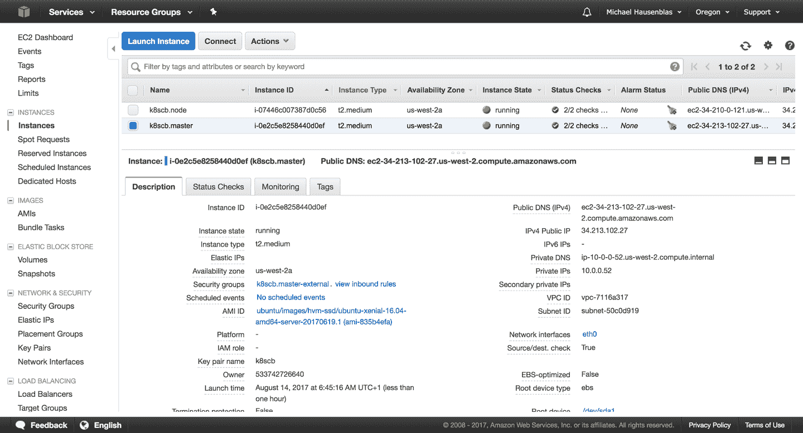

# 第十四章。生态系统

在这一章中，我们来看看更广泛的 Kubernetes 生态系统；也就是 Kubernetes [孵化器](https://github.com/kubernetes-incubator)中的软件以及相关项目如 [Helm](https://helm.sh) 和[T0](http://kompose.io/)。

# 14.1 安装 Helm，Kubernetes 包管理器

## 问题

您不希望手工编写所有的 Kubernetes 清单。相反，您希望能够在存储库中搜索包，并通过命令行界面下载和安装它。

## 解决办法

使用[舵](https://github.com/kubernetes/helm)。Helm 是 Kubernetes 包管理器；它将 Kubernetes 包定义为一组清单和一些元数据。清单实际上是模板。当 Helm 实例化包时，模板中的值被填充。Helm 包称为图表。

Helm 有一个名为`helm`的客户端 CLI 和一个名为`tiller`的服务器。您可以使用`helm`与图表交互，并且`tiller`在您的 Kubernetes 集群中作为常规的 Kubernetes 部署运行。

您可以从源代码构建 Helm，或者从 GitHub [发布页面](https://github.com/kubernetes/helm/releases)下载 Helm，提取档案，并将`helm`二进制文件移动到您的`$PATH`中。例如，在 macOS 上，对于 Helm 的 v2.7.2 版本，请执行以下操作:

```
$ wget https://storage.googleapis.com/kubernetes-helm/ \
  helm-v2.7.2-darwin-amd64.tar.gz

$ tar -xvf helm-v2.7.2-darwin-amd64.tar.gz

$ sudo mv darwin-amd64/64 /usr/local/bin

$ helm version

```

现在`helm`命令在您的`$PATH`中，您可以使用它来启动 Kubernetes 集群上的服务器端组件`tiller`。这里我们以 Minikube 为例:

```
$ kubectl get nodes
NAME       STATUS    AGE       VERSION
minikube   Ready     4m        v1.7.8

$ helm init
$HELM_HOME has been configured at /Users/sebgoa/.helm.

Tiller (the helm server side component) has been installed into your Kubernetes
Cluster. Happy Helming!

$ kubectl get pods --all-namespaces | grep tiller
kube-system   tiller-deploy-1491950541-4kqxx   0/1  ContainerCreating  0  1s

```

你现在都准备好了，可以安装 100 多个可用包中的一个。

# 14.2 使用 Helm 安装应用程序

## 问题

您已经安装了`helm`命令(参见[配方 14.1](#helm_install) ，现在您想要搜索图表并部署它们。

## 解决办法

默认情况下，Helm 附带一些已配置的图表存储库。这些存储库由社区维护；你可以在 [GitHub](https://github.com/kubernetes/charts) 上阅读更多关于它们的内容。有 100 多张图表。

例如，让我们假设您想要部署 Redis。可以在 Helm 库中搜索`redis`，然后安装。Helm 将获取该图表，并创建一个名为*版本*的实例。

首先，验证`tiller`正在运行，并且您已经配置了默认存储库:

```
$ kubectl get pods --all-namespaces | grep tiller
kube-system   tiller-deploy-1491950541-4kqxx   1/1   Running   0   3m

$ helm repo list
NAME   	URL
stable 	http://storage.googleapis.com/kubernetes-charts

```

您现在可以搜索 Redis 包:

```
$ helm search redis
NAME                    	VERSION	DESCRIPTION
stable/redis            	0.5.1  	Open source, advanced key-value store. It ...
testing/redis-cluster   	0.0.5  	Highly available Redis cluster with multiple...
testing/redis-standalone 0.0.1   Standalone Redis Master
stable/sensu            	0.1.2  	Sensu monitoring framework backed by the ...
testing/example-todo    	0.0.6  	Example Todo application backed by Redis

```

使用`helm install`创建一个发布，如下所示:

```
$ helm install stable/redis

```

Helm 将创建图表中定义的所有 Kubernetes 对象；例如，秘密(参见[配方 8.2](08.html#special_volumes) )、聚氯乙烯(参见[配方 8.5](08.html#pvc_minikube) )、服务(参见[配方 5.1](05.html#simple_service) )和/或部署。这些对象共同组成了一个 Helm 版本，您可以将其作为一个单元进行管理。

最终结果是你将有一个`redis`吊舱运行:

```
$ helm ls
NAME           REVISION	 UPDATED                   STATUS  	 CHART        ...
broken-badger  1         Fri May 12 11:50:43 2017  DEPLOYED  redis-0.5.1  ...

$ kubectl get pods
NAME                                   READY     STATUS    RESTARTS   AGE
broken-badger-redis-4040604371-tcn14   1/1       Running   0          3m

```

要了解更多关于 Helm 图表以及如何创建自己的图表，请参见[配方 14.3](#create_chart) 。

# 14.3 创建您自己的图表，用 Helm 打包您的应用程序

## 问题

您已经编写了一个具有多个 Kubernetes 清单的应用程序，并希望将其打包为 Helm 图表。

## 解决办法

使用`helm create`和`helm package`命令。

使用`helm create`，可以生成图表的骨架。在终端发出命令，指定图表的名称。例如，要创建`oreilly`图表:

```
$ helm create oreilly
Creating oreilly

$ tree oreilly/
oreilly/
├── Chart.yaml
├── charts
├── templates
│   ├── NOTES.txt
│   ├── _helpers.tpl
│   ├── deployment.yaml
│   ├── ingress.yaml
│   └── service.yaml
└── values.yaml

2 directories, 7 files

```

如果你已经写好了所有的清单，你可以将它们复制到*/模板*目录中，并删除脚手架创建的内容。如果您想要模板化您的清单，那么在 *values.yaml* 文件中写下清单中需要替换的值。编辑元数据文件 *Chart.yaml* ，如果有任何相关图表，将其放入 */charts* 目录。

您可以通过运行以下命令在本地测试图表:

```
$ helm install ./oreilly

```

最后可以用`helm package oreilly/`打包。这将生成您的图表的目标球，将其复制到本地图表存储库中，并为您的本地存储库生成一个新的 *index.yaml* 文件。看向 *~/。helm* 目录下，你应该会看到类似如下的东西:

```
$ ls -l ~/.helm/repository/local/
total 16
-rw-r--r--  1 sebgoa  staff   379 Dec 16 21:25 index.yaml
-rw-r--r--  1 sebgoa  staff  1321 Dec 16 21:25 oreilly-0.1.0.tgz

```

A `helm search oreilly`现在应该返回您的本地图表:

```
$ helm search oreilly
NAME         	VERSION	DESCRIPTION
local/oreilly	0.1.0  	A Helm chart for Kubernetes

```

## 请参见

*   [“如何创建你的第一个掌舵图”](https://docs.bitnami.com/kubernetes/how-to/create-your-first-helm-chart/)在库本内特斯的 Bitnami 文档中

*   赫尔姆文档中的“图表最佳实践指南”

# 14.4 将您的 Docker 编写文件转换为 Kubernetes 清单

## 问题

您已经开始使用带有 Docker 的容器，并编写了一些 Docker 编写文件来定义您的多容器应用程序。 现在你想开始使用 Kubernetes，并想知道是否以及如何重用你的 Docker 编写文件。

## 解决办法

使用`kompose`，一个命令行界面工具，将你的 Docker 编写文件转换成 Kubernetes 清单。

首先，从 GitHub [发布页面](https://github.com/kubernetes-incubator/kompose/releases)下载`kompose`并移动到你的`$PATH`上，方便起见。

例如，在 macOS 上，请执行以下操作:

```
$ wget https://github.com/kubernetes-incubator/kompose/releases/download/ \
       v1.6.0/kompose-darwin-amd64

$ sudo mv kompose-darwin-amd64 /usr/local/bin/kompose

$ sudo chmod +x /usr/local/bin/kompose

$ kompose version
1.6.0 (ae4ef9e)

```

给定以下启动`redis`容器的 Docker 编写文件:

```
version: '2'

services:
  redis:
    image: redis
    ports:
    - "6379:6379"
```

您可以使用以下命令自动将其转换为 Kubernetes 清单:

```
$ kompose convert --stdout

```

清单将被打印到`stdout`中，结果您将看到一个 Kubernetes 服务和一个部署。要自动创建这些对象，您可以使用 Docker compose-compliant 命令`up`，如下所示:

```
$ kompose up

```

###### 警告

一些 Docker 编写指令没有转换为 Kubernetes。在这种情况下，`kompose`会打印出一条警告，通知您转换没有发生。

虽然一般来说它不会引起问题，但是转换可能不会在 Kubernetes 中产生工作清单。这是意料之中的，因为这种类型的转换不可能是完美的。然而，它让你接近一个工作库本内特清单。最值得注意的是，处理卷和网络隔离通常需要您手动定制。

## 讨论

主`kompose`命令为`convert`、`up`和`down`。您可以使用`--help`选项在命令行界面中查看每个命令的详细帮助。

默认情况下，`kompose`将您的 Docker 服务转换为 Kubernetes 部署和相关服务。您也可以指定使用`DaemonSet`(参见[食谱 7.3](07.html#daemonset) ，或者您可以使用特定于 OpenShift 的对象，如 [`DeploymentConfiguration`](https://docs.openshift.org/latest/architecture/core_concepts/deployments.html#deployments-and-deployment-configurations) 。

# 14.5 使用 kubicorn 创建 Kubernetes 集群

## 问题

您想要在 AWS 上创建一个 Kubernetes 集群。

## 解决办法

使用 [`kubicorn`](https://github.com/kris-nova/kubicorn) 在 AWS 上创建和管理 Kubernetes 集群。 由于`kubicorn`目前不提供二进制版本，您需要安装[Go](https://golang.org/dl/)以使以下版本工作。

首先，安装`kubicorn`并确保 Go(1.8 版或更高版本)可用。这里，我们使用的是 CentOS 环境。

```
$ go version
go version go1.8 linux/amd64

$ yum group install "Development Tools" \
  yum install ncurses-devel

$ go get github.com/kris-nova/kubicorn
...
Create, Manage, Image, and Scale Kubernetes infrastructure in the cloud.

Usage:
  kubicorn [flags]
  kubicorn [command]

Available Commands:
  adopt       Adopt a Kubernetes cluster into a Kubicorn state store
  apply       Apply a cluster resource to a cloud
  completion  Generate completion code for bash and zsh shells.
  create      Create a Kubicorn API model from a profile
  delete      Delete a Kubernetes cluster
  getconfig   Manage Kubernetes configuration
  help        Help about any command
  image       Take an image of a Kubernetes cluster
  list        List available states
  version     Verify Kubicorn version

Flags:
  -C, --color         Toggle colorized logs (default true)
  -f, --fab           Toggle colorized logs
  -h, --help          help for kubicorn
  -v, --verbose int   Log level (default 3)

Use "kubicorn [command] --help" for more information about a command.

```

一旦安装了`kubicorn`命令，您可以通过选择*配置文件*并验证资源是否正确定义来创建集群资源:

```
$ kubicorn create --name k8scb --profile aws
2017-08-14T05:18:24Z [✔]  Selected [fs] state store
2017-08-14T05:18:24Z [✿]  The state [./_state/k8scb/cluster.yaml] has been...

$ cat _state/k8scb/cluster.yaml
SSH:
  Identifier: ""
  metadata:
    creationTimestamp: null
  publicKeyPath: ~/.ssh/id_rsa.pub
  user: ubuntu
cloud: amazon
kubernetesAPI:
  metadata:
    creationTimestamp: null
  port: "443"
location: us-west-2
...

```

###### 注意

我们使用的默认资源配置文件假设您在 *~/中有一个密钥对。ssh* 命名为`id_rsa`(私钥)和`id_rsa.pub`(公钥)。如果不是这种情况，您可能想改变这一点。另外，请注意，使用的默认区域是 T2 俄勒冈州。

要继续，您需要有一个具有以下可用权限的 AWS 身份和访问管理(IAM)用户:`AmazonEC2FullAccess`、`AutoScalingFullAccess`和`AmazonVPCFullAccess`。如果你没有这样的 IAM 用户，现在是创建一个的好时机。 <sup>[1](#idm139735588913952)</sup>

要使`kubicorn`工作，您需要做的最后一件事是将您正在使用的 IAM 用户的凭据设置为环境变量，如下所示:

```
$ export AWS_ACCESS_KEY_ID=***************************
$ export AWS_SECRET_ACCESS_KEY=*****************************************

```

现在，您可以根据上面的资源定义以及您提供的 AWS 访问权限创建集群了:

```
$ kubicorn apply --name k8scb
2017-08-14T05:45:04Z [✔]  Selected [fs] state store
2017-08-14T05:45:04Z [✔]  Loaded cluster: k8scb
2017-08-14T05:45:04Z [✔]  Init Cluster
2017-08-14T05:45:04Z [✔]  Query existing resources
2017-08-14T05:45:04Z [✔]  Resolving expected resources
2017-08-14T05:45:04Z [✔]  Reconciling
2017-08-14T05:45:07Z [✔]  Created KeyPair [k8scb]
2017-08-14T05:45:08Z [✔]  Created VPC [vpc-7116a317]
2017-08-14T05:45:09Z [✔]  Created Internet Gateway [igw-e88c148f]
2017-08-14T05:45:09Z [✔]  Attaching Internet Gateway [igw-e88c148f] to VPC ...
2017-08-14T05:45:10Z [✔]  Created Security Group [sg-11dba36b]
2017-08-14T05:45:11Z [✔]  Created Subnet [subnet-50c0d919]
2017-08-14T05:45:11Z [✔]  Created Route Table [rtb-8fd9dae9]
2017-08-14T05:45:11Z [✔]  Mapping route table [rtb-8fd9dae9] to internet gate...
2017-08-14T05:45:12Z [✔]  Associated route table [rtb-8fd9dae9] to subnet ...
2017-08-14T05:45:15Z [✔]  Created Launch Configuration [k8scb.master]
2017-08-14T05:45:16Z [✔]  Created Asg [k8scb.master]
2017-08-14T05:45:16Z [✔]  Created Security Group [sg-e8dca492]
2017-08-14T05:45:17Z [✔]  Created Subnet [subnet-cccfd685]
2017-08-14T05:45:17Z [✔]  Created Route Table [rtb-76dcdf10]
2017-08-14T05:45:18Z [✔]  Mapping route table [rtb-76dcdf10] to internet gate...
2017-08-14T05:45:19Z [✔]  Associated route table [rtb-76dcdf10] to subnet ...
2017-08-14T05:45:54Z [✔]  Found public IP for master: [34.213.102.27]
2017-08-14T05:45:58Z [✔]  Created Launch Configuration [k8scb.node]
2017-08-14T05:45:58Z [✔]  Created Asg [k8scb.node]
2017-08-14T05:45:59Z [✔]  Updating state store for cluster [k8scb]
2017-08-14T05:47:13Z [✿]  Wrote kubeconfig to [/root/.kube/config]
2017-08-14T05:47:14Z [✿]  The [k8scb] cluster has applied successfully!
2017-08-14T05:47:14Z [✿]  You can now `kubectl get nodes`
2017-08-14T05:47:14Z [✿]  You can SSH into your cluster ssh -i ~/.ssh/id_rsa ...

```

虽然你在这里看不到漂亮的着色，但最后四行输出是绿色的，告诉你一切都已经设置成功了。也可以在浏览器中访问亚马逊 EC2 控制台进行验证，如图[图 14-1](#azure-ec2-kubicorn) 所示。



###### 图 14-1。亚马逊 EC2 控制台截图，展示了 kubicorn 创建的两个节点

现在，按照`kubicorn apply`命令和`ssh`最后一行的指示进入集群:

```
$ ssh -i ~/.ssh/id_rsa ubuntu@34.213.102.27
The authenticity of host '34.213.102.27 (34.213.102.27)' can't be established.
ECDSA key fingerprint is ed:89:6b:86:d9:f0:2e:3e:50:2a:d4:09:62:f6:70:bc.
Are you sure you want to continue connecting (yes/no)? yes
Warning: Permanently added '34.213.102.27' (ECDSA) to the list of known hosts.
Welcome to Ubuntu 16.04.2 LTS (GNU/Linux 4.4.0-1020-aws x86_64)

 * Documentation:  https://help.ubuntu.com
 * Management:     https://landscape.canonical.com
 * Support:        https://ubuntu.com/advantage

  Get cloud support with Ubuntu Advantage Cloud Guest:
    http://www.ubuntu.com/business/services/cloud

75 packages can be updated.
32 updates are security updates.

To run a command as administrator (user "root"), use "sudo <command>".
See "man sudo_root" for details.

ubuntu@ip-10-0-0-52:~$ kubectl get all -n kube-system
NAME                                           READY     STATUS
po/calico-etcd-qr3f1                           1/1       Running
po/calico-node-9t472                           2/2       Running
po/calico-node-qlpp6                           2/2       Running
po/calico-policy-controller-1727037546-f152z   1/1       Running
po/etcd-ip-10-0-0-52                           1/1       Running
po/kube-apiserver-ip-10-0-0-52                 1/1       Running
po/kube-controller-manager-ip-10-0-0-52        1/1       Running
po/kube-dns-2425271678-zcfdd                   0/3       ContainerCreating
po/kube-proxy-3s2c0                            1/1       Running
po/kube-proxy-t10ck                            1/1       Running
po/kube-scheduler-ip-10-0-0-52                 1/1       Running

NAME              CLUSTER-IP      EXTERNAL-IP   PORT(S)         AGE
svc/calico-etcd   10.96.232.136   <none>        6666/TCP        4m
svc/kube-dns      10.96.0.10      <none>        53/UDP,53/TCP   4m

NAME                              DESIRED   CURRENT   UP-TO-DATE   AVAILABLE   AGE
deploy/calico-policy-controller   1         1         1            1           4m
deploy/kube-dns                   1         1         1            0           4m

NAME                                     DESIRED   CURRENT   READY     AGE
rs/calico-policy-controller-1727037546   1         1         1         4m
rs/kube-dns-2425271678                   1         1         0         4m

```

完成后，像这样拆除 Kubernetes 集群(注意，这可能需要几分钟时间):

```
$ kubicorn delete --name k8scb
2017-08-14T05:53:38Z [✔]  Selected [fs] state store
Destroying resources for cluster [k8scb]:
2017-08-14T05:53:41Z [✔]  Deleted ASG [k8scb.node]
...
2017-08-14T05:55:42Z [✔]  Deleted VPC [vpc-7116a317]

```

## 讨论

虽然`kubicorn`是一个相当年轻的项目，但是它功能齐全，你也可以用它在 [Azure](http://kubicorn.io/documentation/azure-walkthrough.html) 和[数字海洋](http://kubicorn.io/documentation/do-walkthrough.html)上创建集群。

它确实需要您安装 Go，因为它不提供二进制文件，但是它在配置方面非常灵活，并且处理起来也相当直观，尤其是如果您有管理员背景的话。

## 请参见

*   [在`kubicorn`文档的](http://kubicorn.io/documentation/aws-walkthrough.html)中设置库本内特

*   拉克伦·艾文森 视频漫游[“使用库比孔在数字海洋上建立库本内特集群”](https://www.youtube.com/watch?v=XpxgSZ3dspE)

# 14.6 在版本控制中存储加密机密

## 问题

您希望将所有 Kubernetes 清单存储在版本控制中，并安全地共享它们(甚至公开共享)，包括秘密。

## 解决办法

使用[密封机密](https://github.com/bitnami/sealed-secrets)。 Sealed-secrets 是一个 Kubernetes 控制器，它解密单向加密的秘密并创建集群内`Secret`对象(参见[配方 8.2](08.html#special_volumes) )。

您的敏感信息被加密到一个`SealedSecret`对象中，该对象是一个自定义的 CRD 资源(参见[配方 13.4](13.html#writing_crd) )。`SealedSecret`可以在版本控制下安全存储，甚至可以公开共享。一旦在 Kubernetes API 服务器上创建了一个`SealedSecret`，控制器就解密它并创建相应的`Secret`对象(它只有 base64 编码)。

首先，下载最新版本的`kubeseal`二进制文件。这将允许你加密你的秘密:

```
$ GOOS=$(go env GOOS)

$ GOARCH=$(go env GOARCH)

$ wget https://github.com/bitnami/sealed-secrets/releases/download/v0.5.1/
       kubeseal-$GOOS-$GOARCH

$ sudo install -m 755 kubeseal-$GOOS-$GOARCH /usr/local/bin/kubeseal

```

然后创建`SealedSecret` CRD 并启动控制器:

```
$ kubectl create -f https://github.com/bitnami/sealed-secrets/releases/
                    download/v0.5.1/sealedsecret-crd.yaml

$ kubectl create -f https://github.com/bitnami/sealed-secrets/releases/
                    download/v0.5.1/controller.yaml

```

结果将是您有一个新的自定义资源和一个新的 pod 在`kube-system`命名空间中运行:

```
$ kubectl get customresourcedefinitions
NAME                        AGE
sealedsecrets.bitnami.com   34s

$ kubectl get pods -n kube-system | grep sealed
sealed-secrets-controller-867944df58-l74nk   1/1       Running   0          38s

```

你现在准备开始使用密封的秘密。首先，生成一个通用的秘密清单:

```
$ kubectl create secret generic oreilly --from-literal=password=root -o json
                                        --dry-run > secret.json

$ cat secret.json
{
    "kind": "Secret",
    "apiVersion": "v1",
    "metadata": {
        "name": "oreilly",
        "creationTimestamp": null
    },
    "data": {
        "password": "cm9vdA=="
    }
}

```

###### 小费

要在应用编程接口服务器上创建清单但不创建对象，请使用`--dry-run`选项。这会将您的清单打印到`stdout`。如果你想要 YAML，使用`-o yaml`选项；而如果想要 JSON，就用`-o json`。

然后使用`kubeseal`命令生成新的自定义`SealedSecret`对象:

```
$ kubeseal < secret.json > sealedsecret.json

$ cat sealedsecret.json
{
  "kind": "SealedSecret",
  "apiVersion": "bitnami.com/v1alpha1",
  "metadata": {
    "name": "oreilly",
    "namespace": "default",
    "creationTimestamp": null
  },
  "spec": {
    "data": "AgDXiFG0V6NKF8e9k1NeBMc5t4QmfZh3QKuDORAsFNCt50wTwRhRLRAQOnz0sDk..."
  }
}

```

您现在可以在版本控制中安全地存储 *sealedsecret.json* 。只有存储在密封秘密控制器中的私钥才能解密它。一旦你创建了`SealedSecret`对象，控制器将检测它，解密它，并生成相应的秘密:

```
$ kubectl create -f sealedsecret.json
sealedsecret "oreilly" created

$ kubectl get sealedsecret
NAME      AGE
oreilly   5s

$ kubectl get secrets
NAME       TYPE    DATA      AGE
...
oreilly    Opaque  1         5s

```

## 请参见

*   [密封秘密仓库](https://github.com/bitnami/sealed-secrets)

*   安格斯·李斯的文章[“密封的秘密:在密码到达库本内斯之前保护它们”](https://engineering.bitnami.com/articles/sealed-secrets.html)

# 14.7 使用无库部署功能

## 问题

您希望将 Python、Node.js、Ruby 或 PowerShell 函数部署到 Kubernetes，而不必构建 Docker 容器。 您还希望能够通过 HTTP 或通过向消息总线发送事件来调用这些函数。

## 解决办法

使用 Kubernetes 本地无服务器解决方案`kubeless`。

`kubeless`使用`CustomResourceDefinition`(参见[配方 13.4](13.html#writing_crd) )来定义`Function`对象，并使用控制器在库本内特斯集群内的吊舱中部署这些功能。

虽然可能性相当高，但在本食谱中，我们将展示一个部署 Python 函数的基本示例，该函数返回您发送给它的 JSON 有效负载。

首先，创建一个`kubeless`名称空间并启动控制器。为此，您可以在 GitHub [发布页面](https://github.com/kubeless/kubeless/releases)上获取每个版本发布的清单。从同一个发布页面，也下载`kubeless`二进制:

```
$ kubectl create ns kubeless

$ curl -sL https://github.com/kubeless/kubeless/releases/download/v0.3.1/ \
           kubeless-rbac-v0.3.1.yaml | kubectl create -f -

$ wget https://github.com/kubeless/kubeless/releases/download/v0.3.1/ \
       kubeless_darwin-amd64.zip

$ sudo cp bundles/kubeless_darwin-amd64/kubeless /usr/local/bin

```

在`kubeless`命名空间中，您将看到三个豆荚:监视`Function`自定义端点的控制器，以及卡夫卡和动物园管理员豆荚。后两个吊舱仅用于由事件触发的功能。对于 HTTP 触发的功能，您只需要控制器处于运行状态:

```
$ kubectl get pods -n kubeless
NAME                                  READY     STATUS    RESTARTS   AGE
kafka-0                               1/1       Running   0          6m
kubeless-controller-9bff848c4-gnl7d   1/1       Running   0          6m
zoo-0                                 1/1       Running   0          6m

```

要尝试`kubeless`，在名为 *post.py* 的文件中编写以下 Python 函数:

```
def handler(context):
    print context.json
    return context.json
```

然后，您可以使用`kubeless`命令行界面在 Kubernetes 中部署该功能。`function deploy`命令接受几个可选参数。`--runtime`选项指定函数用什么语言编写；`--http-trigger`选项指定通过 HTTP(S)调用触发函数；`--handler`选项指定函数的名称，前缀是存储函数的文件的基本名称。最后，`--from-file`选项指定写入函数的文件:

```
$ kubeless function deploy post-python --trigger-http \
                                       --runtime python2.7 \
                                       --handler post.handler \
                                       --from-file post.py
INFO[0000] Deploying function...
INFO[0000] Function post-python submitted for deployment
INFO[0000] Check the deployment status executing 'kubeless function ls post-python'

$ kubeless function ls
NAME                 NAMESPACE	HANDLER      RUNTIME  	 TYPE	 TOPIC
post-python	default 	hellowithdata.handler 	python     2.7	  HTTP

$ kubectl get pods
NAME                           READY   STATUS    RESTARTS   AGE
post-python-5bcb9f7d86-d7nbt   1/1     Running   0          6s

```

`kubeless`控制器检测到新的`Function`对象，并为其创建部署。功能代码存储在配置图中(见[配方 8.3](08.html#configmaps) )，并在运行时注入运行吊舱。那么这个函数是可以通过 HTTP 调用的。下面显示了这几个对象:

```
$ kubectl get functions
NAME          AGE
post-python   2m

$ kubectl get cm
NAME          DATA      AGE
post-python   3         2m

$ kubectl get deployments
NAME          DESIRED   CURRENT   UP-TO-DATE   AVAILABLE   AGE
post-python   1         1         1            1           2m

```

要调用该函数，可以使用`kubeless function call`命令，如下所示:

```
$ kubeless function call post-python --data '{"oreilly":"function"}'
{"oreilly": "function"}

```

###### 注意

`kubeless`可以用于比基本的 HTTP 触发功能多得多的功能。使用`--help`选项浏览命令行界面:`kubeless --help`。

## 请参见

*   [`kubeless`仓库](https://github.com/kubeless/kubeless)

*   [`kubeless`例](https://github.com/kubeless/kubeless/tree/master/examples)

*   [蓝色容器服务上的无库](https://github.com/kubeless/kubeless/blob/master/docs/kubeless-on-azure-container-services.md)

<sup>[1](#idm139735588913952-marker)</sup> AWS 身份和访问管理用户指南，[【在您的 AWS 帐户中创建 IAM 用户】](http://docs.aws.amazon.com/IAM/latest/UserGuide/id_users_create.html)。