# 一、构建生产就绪型Kubernetes集群

本章提出了在流行的云服务和内部使用的最常见的部署方法，尽管您肯定会在互联网上找到许多其他教程来解释其他方法。本章解释托管/托管云服务与自我管理云或内部 Kubernetes 部署之间的区别，以及一个供应商相对于另一个供应商的优势。

在这一章中，我们将介绍以下食谱:

*   在亚马逊网络服务上配置 Kubernetes 集群
*   在谷歌云平台上配置 Kubernetes 集群
*   在 Microsoft Azure 上配置 Kubernetes 集群
*   在阿里巴巴云上配置 Kubernetes 集群
*   使用 Rancher 配置和管理 Kubernetes 集群
*   配置红帽 OpenShift
*   使用 Ansible 配置 Kubernetes 集群
*   安装问题疑难解答

# 技术要求

建议您对 Linux 容器和 Kubernetes 有基本的了解。为了准备 Kubernetes 集群，建议使用 Linux 主机。如果您的工作站是基于 Windows 的，那么我们建议您使用**Linux Windows 子系统** ( **WSL** )。WSL 在 Windows 上给你一个 Linux 命令行，让你在 Windows 上运行 ELF64 Linux 二进制文件。

使用与将在生产中使用的环境相同的环境(这意味着相同的发行版和相同的版本)来开发总是一个好的实践。这将避免意外的惊喜，如**它在我的机器上工作** ( **IWOMM** )。如果您的工作站使用不同的操作系统，另一个好方法是在您的工作站上设置虚拟机。VirtualBox([https://www.virtualbox.org/](https://www.virtualbox.org/))是一款运行在 Windows、Linux 和 macOS 上的免费开源虚拟机管理程序。

在本章中，我们将假设您使用的是一个 Ubuntu 主机(18.04，编写本文时的代码名为仿生海狸)。没有具体的硬件要求，因为本章中的所有方法都将在云实例上部署和运行。以下是您的本地主机完成配方所需的软件包列表:

*   卷曲
*   计算机编程语言
*   Vim 或 Nano(或您最喜欢的文本编辑器)

# 在亚马逊网络服务上配置 Kubernetes 集群

本节中的方法将带您了解如何获得一个功能全面的 Kubernetes 集群，该集群具有完全可定制的主节点和工作节点，您可以在后面的章节中或在生产中使用这些节点。

在本节中，我们将介绍亚马逊 EC2 和亚马逊 EKS 食谱，这样我们就可以在**亚马逊网络服务** ( **AWS** 上运行 Kubernetes。

# 准备好

这里提到的所有操作都需要一个 AWS 帐户和一个拥有使用相关服务权限的策略的 AWS 用户。如果没有，去[https://aws.amazon.com/account/](https://aws.amazon.com/account/)创建一个。

在运行 Kubernetes 时，AWS 提供了两个主要选项。如果您想完全管理您的部署并有特定的强大实例需求，您可以考虑使用**亚马逊弹性计算云** ( **亚马逊 EC2** )。否则，强烈建议考虑为 Kubernetes ( **亚马逊 EKS** )使用**亚马逊弹性容器服务等托管服务。**

# 怎么做…

根据您是想使用 AWS EC2 服务还是 EKS，您可以按照以下方法使用 kops 或 eksctl 工具启动和运行您的集群:

*   安装命令行工具来配置 AWS 服务
*   安装 kops 以配置 Kubernetes 集群
*   在亚马逊 EC2 上配置 Kubernetes 集群
*   在亚马逊 EKS 提供托管Kubernetes集群

# 安装命令行工具来配置 AWS 服务

在这个菜谱中，我们将获得 AWS **命令行界面** ( **CLI** ) `awscli`和亚马逊 EKS CLI `eksctl`来访问和配置 AWS 服务。

让我们执行以下步骤:

1.  在您的工作站上安装`awscli`:

```
$ sudo apt-get update && sudo apt-get install awscli
```

2.  配置 AWS 命令行界面，使其使用您的访问密钥标识和秘密访问密钥:

```
$ aws configure
```

3.  下载并安装亚马逊 EKS 命令行界面，`eksctl`:

```
$ curl --silent --location "https://github.com/weaveworks/eksctl/releases/download/latest_release/eksctl_$(uname -s)_amd64.tar.gz" | tar xz -C /tmp
$ sudo mv /tmp/eksctl /usr/local/bin
```

4.  验证其版本并确保安装了`eksctl`:

```
$ eksctl version
```

为了能够执行以下食谱，`eksctl`版本应该是`0.13.0`或更高版本。

# 安装 kops 以配置 Kubernetes 集群

在本食谱中，我们将安装 Kubernetes 操作工具`kops`和 Kubernetes 命令行工具`kubectl`，以便调配和管理 Kubernetes 集群。

让我们执行以下步骤:

1.  下载并安装 Kubernetes 操作工具`kops`:

```
$ curl -LO https://github.com/kubernetes/kops/releases/download/$(curl -s https://api.github.com/repos/kubernetes/kops/releases/latest | grep tag_name | cut -d '"' -f 4)/kops-linux-amd64
$ chmod +x kops-linux-amd64 && sudo mv kops-linux-amd64 /usr/local/bin/kops
```

2.  运行以下命令，确保安装了`kops`，并确认版本为`1.15.0`或更高版本:

```
$ kops version
```

3.  下载并安装 Kubernetes 命令行工具，`kubectl`:

```
$ curl -LO https://storage.googleapis.com/kubernetes-release/release/$(curl -s https://storage.googleapis.com/kubernetes-release/release/stable.txt)/bin/linux/amd64/kubectl
$ chmod +x ./kubectl && sudo mv ./kubectl /usr/local/bin/kubectl
```

4.  验证其版本并确保安装了`kubectl`:

```
$ kubectl version --short
```

为了能够执行以下食谱，`kubectl`版本应该是`v1.15`或更高版本。

# 在亚马逊 EC2 上配置 Kubernetes 集群

本食谱将带您了解如何获得一个功能全面的 Kubernetes 集群，该集群具有完全可定制的主节点和工作节点，您可以将其用于以下章节中的食谱或生产中。

让我们执行以下步骤:

1.  为集群创建一个域。

It is a cloud management best practice to have subdomains and to divide your clusters with logical and valid DNS names for `kops` to successfully discovery them.

例如，我将使用`k8s.containerized.me`子域作为我们的托管区域。此外，如果您的域是向除 Amazon Route 53 之外的注册服务商注册的，您必须向注册服务商更新名称服务器，并将托管区域的 Route 53 NS 记录添加到注册服务商的 DNS 记录中:

```
$ aws route53 create-hosted-zone --name k8s.containerized.me \
--caller-reference k8s-devops-cookbook \
--hosted-zone-config Comment="Hosted Zone for my K8s Cluster" 
```

2.  创建一个 S3 存储桶来存储 Kubernetes 配置和集群状态。在我们的例子中，我们将使用`s3.k8s.containerized.me`作为我们的桶名:

```
$ aws s3api create-bucket --bucket s3.k8s.containerized.me \
--region us-east-1
```

3.  通过列出可用铲斗来确认您的 S3 铲斗:

```
$ aws s3 ls
2019-07-21 22:02:58 s3.k8s.containerized.me
```

4.  启用桶版本控制:

```
$ aws s3api put-bucket-versioning --bucket s3.k8s.containerized.me \
--versioning-configuration Status=Enabled
```

5.  为`kops`设置环境参数，这样您可以默认使用位置:

```
$ export KOPS_CLUSTER_NAME=useast1.k8s.containerized.me
$ export KOPS_STATE_STORE=s3://s3.k8s.containerized.me
```

6.  如果您尚未创建 SSH 密钥，请创建一个:

```
$ ssh-keygen -t rsa
```

7.  使用您希望主节点运行的区域列表创建集群配置:

```
$ kops create cluster --node-count=6 --node-size=t3.large \
 --zones=us-east-1a,us-east-1b,us-east-1c \
 --master-size=t3.large \
 --master-zones=us-east-1a,us-east-1b,us-east-1c
```

8.  创建集群:

```
$ kops update cluster --name ${KOPS_CLUSTER_NAME} --yes
```

9.  等待几分钟，让节点启动并验证:

```
$ kops validate cluster
```

10.  现在，您可以使用`kubectl`管理您的集群:

```
$ kubectl cluster-info
```

默认情况下，`kops`在`~/.kube/config`下创建并导出Kubernetes配置。因此，使用`kubectl`连接集群不需要额外的步骤。

# 在亚马逊 EKS 提供托管Kubernetes集群

执行以下步骤，使用`eksctl`在亚马逊 EKS 上启动并运行您的托管 Kubernetes 即服务集群:

1.  使用默认设置创建集群:

```
$ eksctl create cluster
...
[√] EKS cluster "great-outfit-123" in "us-west-2" region is ready
```

默认情况下，`eksctl`使用`us-west-2`区域的 AWS EKS AMI 在两个`m5.large`实例上部署带有工作人员的集群。`eksctl`在`~/.kube/config`下创建并导出Kubernetes配置。因此，使用`kubectl`连接集群不需要额外的步骤。

2.  确认集群信息和工作人员:

```
$ kubectl cluster-info && kubectl get nodes
Kubernetes master is running at https://gr7.us-west-2.eks.amazonaws.com
CoreDNS is running at https://gr7.us-west-2.eks.amazonaws.com/api/v1/namespaces/kube-system/services/kube-dns:dns/proxy
NAME                                  STATUS ROLES  AGE   VERSION
ip-1-2-3-4.us-west-2.compute.internal Ready  <none> 5m42s v1.13.8-eks-cd3eb0
ip-1-2-3-4.us-west-2.compute.internal Ready  <none> 5m40s v1.13.8-eks-cd3eb0
```

现在，您有一个双节点的亚马逊 EKS 集群已经启动并运行。

# 它是如何工作的...

亚马逊 EC2 上的第一个食谱向您展示了如何调配主节点的多个副本，这些副本可以在主节点出现故障以及单个 AZ 停机时幸存下来。虽然它类似于亚马逊 EKS 上的第二个配方在多 AZ 支持下获得的效果，但 EC2 上的集群为您提供了更高的灵活性。当您改为运行亚马逊 EKS 时，它为每个集群运行一个单租户 Kubernetes 控制平面，该控制平面由至少两个 API 服务器节点和三个`etcd`节点组成，它们跨一个区域内的三个 az 运行。

让我们看看我们在 s *tep 7* 中使用`kops create cluster`命令使用的集群选项:

*   `--node-count=3`设置要创建的节点数。在我们的例子中，这是`6`。该配置将在每个由`--zones=us-east-1a,us-east-1b,us-east-1c`定义的区域部署两个节点，总共有三个主节点和六个工作节点。
*   `--node-size`和`--master-size`设置工作节点和主节点的实例大小。在我们的示例中，`t2.medium`用于工作节点，`t2.large`用于主节点。对于较大的集群，建议工人使用`t2.large`。
*   `--zones`和`--master-zones`设置集群将要运行的区域。在我们的例子中，我们使用了三个区域，分别叫做`us-east-1a`、`us-east-1b`和`us-east-1c`。

如需更多区域信息，请查看*部分的 AWS 全球基础设施链接。*

AWS clusters cannot span across multiple regions and all the zones that have been defined for the master and worker nodes should be within the same region.

部署多主集群时，应创建奇数个主实例。另外，请记住 Kubernetes 依赖于 etcd，一个分布式的键/值存储。etcd 仲裁要求超过 51%的节点随时可用。因此，有了三个主节点，我们的控制平面只能承受单个主节点或 AZ 停机。如果您需要处理更多，您需要考虑增加主实例的数量。

# 还有更多…

了解以下信息也很有用:

*   使用 AWS 外壳
*   使用基于流言的集群
*   为 S3 桶使用不同的区域
*   编辑集群配置
*   正在删除您的集群
*   使用亚马逊 EKS 仪表板调配 EKS 集群
*   部署 Kubernetes 仪表板

# 使用 AWS 外壳

这里值得一提的另一个有用的工具是`aws-shell`。这是一个与 AWS 命令行界面一起工作的集成外壳。它使用 AWS 命令行界面配置，并通过自动完成功能提高工作效率。

使用以下命令安装`aws-shell`并运行:

```
$ sudo apt-get install aws-shell && aws-shell
```

您将看到以下输出:

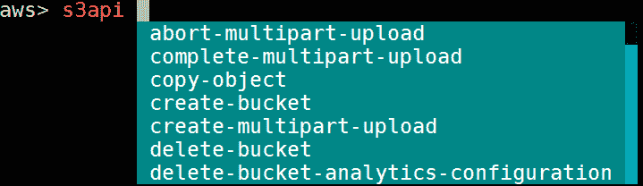

您可以使用带有`aws-shell`的 AWS 命令，只需较少的输入。按下 *F10* 键退出外壳。

# 使用基于流言的集群

在这个食谱中，我们创建了一个域(从亚马逊或其他注册商那里购买)和一个托管区域，因为 kops 使用 DNS 进行发现。虽然它需要是一个有效的域名，从 kops 1.6.2 开始，域名系统配置成为可选的。可以轻松创建基于流言的集群，而不是实际的域或子域。通过使用注册域名，我们使我们的集群更容易被其他人共享和访问，以供生产使用。

如果出于任何原因，您更喜欢基于八卦的集群，您可以跳过托管区域创建，使用以`k8s.local`结尾的集群名称:

```
$ export KOPS_CLUSTER_NAME=devopscookbook.k8s.local
$ export KOPS_STATE_STORE=s3://devops-cookbook-state-store
```

为`kops`设置环境参数是可选的，但强烈推荐，因为它缩短了命令行界面命令。

# 为 S3 桶使用不同的区域

为了让 kops 存储集群配置，需要一个专用的 S3 存储桶。

`eu-west-1`区域的示例如下所示:

```
$ aws s3api create-bucket --bucket s3.k8s.containerized.me \
--region eu-west-1 --create-bucket-configuration \
LocationConstraint=eu-west-1
```

这个 S3 桶将成为我们的 Kubernetes 集群配置的真理之源。为简单起见，建议使用`us-east-1`区域；否则，需要指定适当的`LocationConstraint`，以便在所需区域创建铲斗。

# 编辑集群配置

我们用来创建集群配置的`kops create cluster`命令实际上并没有创建集群本身，也没有启动 EC2 实例；相反，它在我们的 S3 桶中创建配置文件。

创建配置文件后，您可以使用`kops edit cluster`命令对配置进行更改。

您可以使用以下命令单独编辑节点实例组:

```
$ kops edit ig nodes 
$ kops edit ig master-us-east-1a
```

从 S3 存储桶的状态存储位置调用配置文件。如果您喜欢不同的编辑器，例如，您可以设置`$KUBE_EDITOR=nano`来更改它。

# 正在删除您的集群

要删除集群，请使用以下命令:

```
$ kops delete cluster --name ${KOPS_CLUSTER_NAME} --yes
```

这个过程可能需要几分钟，完成后，您将得到确认。

# 使用亚马逊 EKS 管理控制台配置 EKS 集群

在*在亚马逊 EKS* 配方上配置托管 Kubernetes 集群时，我们使用 eksctl 来部署集群。或者，您也可以使用 AWS 管理控制台网络用户界面来部署 EKS 集群。

执行以下步骤，让您的集群在亚马逊 EKS 上启动并运行:

1.  打开浏览器，进入亚马逊 EKS 控制台[https://console.aws.amazon.com/eks/home#/clusters](https://console.aws.amazon.com/eks/home#/clusters)。
2.  埃特娜
3.  在“创建集群”页面上，从子网列表中选择Kubernetes版本、角色名称、至少两个或更多可用性区域以及安全组。
4.  点击创建。

5.  使用 EKS 创建集群大约需要 20 分钟。15-20 分钟后刷新页面并检查其状态。
6.  使用以下命令更新您的`kubectl`配置:

```
$ aws eks --region us-east-1 update-kubeconfig \
--name K8s-DevOps-Cookbook

```

7.  现在，使用`kubectl`管理您的集群:

```
$ kubectl get nodes
```

现在您的集群已经配置好了，您可以配置`kubectl`来管理它。

# 部署 Kubernetes 仪表板

最后但同样重要的是，要在 AWS 集群上部署 Kubernetes Dashboard 应用，您需要遵循以下步骤:

1.  在我写这个食谱的时候，Kubernetes Dashboard v.2.0.0 还在测试阶段。由于 v.1.x 版本即将过时，我强烈建议您安装最新版本，即 v.2.0.0，新版本为 Kubernetes v.1.16 及更高版本带来了很多功能和支持。在部署仪表板之前，如果您有以前的版本，请确保删除以前的版本。按照以下信息框中的链接检查最新版本，并使用最新版本进行部署，类似于执行以下操作:

```
$ kubectl delete ns kubernetes-dashboard
# Use the latest version link from https://github.com/kubernetes/dashboard/releases
$ kubectl apply -f https://raw.githubusercontent.com/kubernetes/dashboard/v2.0.0-beta5/aio/deploy/recommended.yaml
```

As the Kubernetes version gets upgraded, the dashboard application also gets frequently updated. To use the latest version, find the latest link to the YAML manifest on the release page at [https://github.com/kubernetes/dashboard/releases](https://github.com/kubernetes/dashboard/releases). If you experience compatibility issues with the latest version of Dashboard, you can always deploy the previous stable version by using the following command:
`$ kubectl apply -f`
`https://raw.githubusercontent.com/kubernetes/dashboard/v1.10.1/src/depl`
`oy/recommended/kubernetes-dashboard.yaml`

2.  默认情况下，`kubernetes-dashboard`服务使用`ClusterIP`类型公开。如果您想从外部访问，请使用以下命令编辑服务，并将`ClusterIP`类型替换为`LoadBalancer`；否则，使用端口转发来访问它:

```
$ kubectl edit svc kubernetes-dashboard -n kubernetes-dashboard
```

3.  从`kubernetes-dashboard`服务获取仪表板的外部 IP:

```
$ kubectl get svc kubernetes-dashboard -n kubernetes-dashboard
NAME                 TYPE          CLUSTER-IP    EXTERNAL-IP PORT(S) AGE
kubernetes-dashboard LoadBalancer 100.66.234.228 myaddress.us-east-1.elb.amazonaws.com 443:30221/TCP 5m46s
```

4.  在浏览器中打开外部 IP 链接。在我们的例子中，是`https://myaddress.us-east-1.elb.amazonaws.com`。

5.  我们将使用令牌选项来访问 Kubernetes 仪表板。现在，让我们使用以下命令在集群中找到令牌。在本例中，命令返回`kubernetes-dashboard-token-bc2w5`作为令牌名称:

```
$ kubectl get secrets -A | grep dashboard-token
kubernetes-dashboard kubernetes-dashboard-token-bc2w5 kubernetes.io/service-account-token 3 17m
```

6.  将前一个命令的输出中的机密名称替换为您的名称。从秘密的描述中获取令牌详细信息:

```
$ kubectl describe secrets kubernetes-dashboard-token-bc2w5 -nkubernetes-dashboard
```

7.  从前面命令的输出中复制令牌部分，并将其粘贴到 Kubernetes 仪表板中，以登录仪表板:

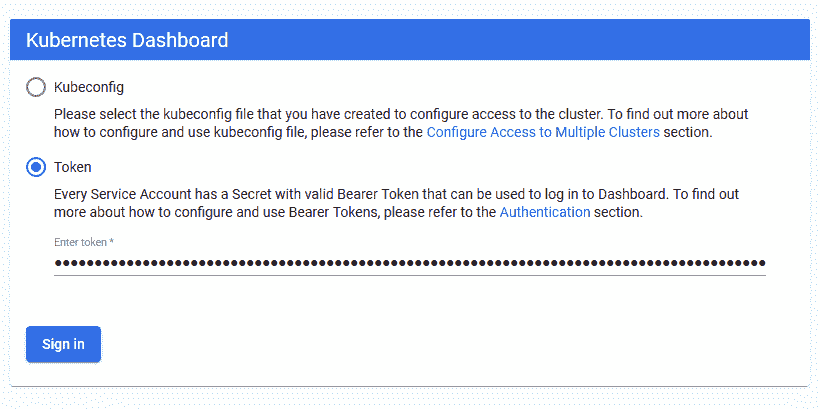

现在，您可以访问 Kubernetes 仪表板来管理您的集群。

# 请参见

*   最新版本和附加`create cluster`参数的 Kops 文档:
    *   [https://github . com/kubrines/kops/blob/master/docs/AWS . MD](https://github.com/kubernetes/kops)
    *   [https://github . com/kubrines/kops/blob/master/docs/CLI/kops _ create _ cluster . MD](https://github.com/kubernetes/kops/blob/master/docs/cli/kops_create_cluster.md)中
*   AWS 命令参考 S3 创建桶 API:[https://docs . AWS . Amazon . com/CLI/latest/Reference/s3api/Create-Bucket . html](https://docs.aws.amazon.com/cli/latest/reference/s3api/create-bucket.html)
*   AWS 全球基础设施地图:[https://aws.amazon.com/about-aws/global-infrastructure/](https://aws.amazon.com/about-aws/global-infrastructure/)
*   Amazon EKS 常见问题解答:[https://AWS . Amazon . com/eks/FAQ/](https://aws.amazon.com/eks/faqs/)
*   AWS Fargate 产品，另一种 AWS 服务，如果你更喜欢在不管理服务器或集群的情况下运行容器:[https://aws.amazon.com/fargate/](https://aws.amazon.com/fargate/)T2】
*   CNCF 认证的 Kubernetes 安装程序的完整列表:[https://landscape . cncf . io/category = certified-Kubernetes-installer&format = card-mode&group = category](https://landscape.cncf.io/category=certified-kubernetes-installer&format=card-mode&grouping=category)。

*   在 AWS 上获得高可用性集群的其他推荐工具:
    *   康沃伊:[https://d2iq.com/solutions/ksphere/konvoy](https://d2iq.com/solutions/ksphere/konvoy)
    *   kublatt:t0]https://github . com/kubrites/kublatt
    *   Kubernetes:[https://github . com/kuberematic/kubebe](https://github.com/kubermatic/kubeone)
    *   kubriay:https://github . com/kubrites-sigs/kubriay

# 在谷歌云平台上配置 Kubernetes 集群

本节将逐步指导您在 GCP 配置 Kubernetes 集群。您将学习如何运行托管的 Kubernetes 集群，而不需要使用 GKE 配置或管理 master 和 etcd 实例。

# 准备好

这里提到的所有操作都需要启用计费的 GCP 帐户。如果你还没有，去[https://console.cloud.google.com](https://console.cloud.google.com)创建一个账户。

在**谷歌云平台** ( **GCP** )上，运行 Kubernetes 主要有两个选择。如果您想要完整地管理您的部署并有特定的强大实例需求，您可以考虑使用**谷歌计算引擎** ( **GCE** )。否则，强烈建议使用托管的**谷歌 Kubernetes 引擎** ( **GKE** )。

# 怎么做…

本节进一步分为以下几个小节，以使这一过程更容易进行:

*   安装命令行工具来配置 GCP 服务
*   在 GKE 配置托管Kubernetes集群
*   连接到 GKE 集群

# 安装命令行工具来配置 GCP 服务

在本食谱中，我们将安装谷歌云平台的主命令行界面`gcloud`，以便我们可以配置 GCP 服务:

1.  运行以下命令下载`gcloud`命令行界面:

```
$ curl https://sdk.cloud.google.com | bash
```

2.  初始化软件开发工具包，并遵循给定的说明:

```
$ gcloud init
```

3.  在初始化过程中，当被询问时，选择您拥有权限的现有项目或创建新项目。
4.  为项目启用计算引擎应用编程接口:

```
$ gcloud services enable compute.googleapis.com
Operation "operations/acf.07e3e23a-77a0-4fb3-8d30-ef20adb2986a" finished successfully.
```

5.  设置默认区域:

```
$ gcloud config set compute/zone us-central1-a
```

6.  确保您可以从命令行启动一个 GCE 实例:

```
$ gcloud compute instances create "devops-cookbook" \
--zone "us-central1-a" --machine-type "f1-micro"
```

7.  删除测试虚拟机:

```
$ gcloud compute instances delete "devops-cookbook"
```

如果所有命令都成功，您可以调配您的 GKE 集群。

# 在 GKE 配置托管Kubernetes集群

让我们执行以下步骤:

1.  创建集群:

```
$ gcloud container clusters create k8s-devops-cookbook-1 \
--cluster-version latest --machine-type n1-standard-2 \
--image-type UBUNTU --disk-type pd-standard --disk-size 100 \
--no-enable-basic-auth --metadata disable-legacy-endpoints=true \
--scopes compute-rw,storage-ro,service-management,service-control,logging-write,monitoring \
--num-nodes "3" --enable-stackdriver-kubernetes \
--no-enable-ip-alias --enable-autoscaling --min-nodes 1 \
--max-nodes 5 --enable-network-policy \
--addons HorizontalPodAutoscaling,HttpLoadBalancing \
--enable-autoupgrade --enable-autorepair --maintenance-window "10:00"
```

集群创建需要 5 分钟或更长时间才能完成。

# 连接到谷歌 Kubernetes 引擎(GKE)集群

要访问您的 GKE 集群，您需要执行以下步骤:

1.  配置`kubectl`以访问您的`k8s-devops-cookbook-1`集群:

```
$ gcloud container clusters get-credentials k8s-devops-cookbook-1
```

2.  验证您的 Kubernetes 集群:

```
$ kubectl get nodes
```

现在，您有一个三节点的 GKE 集群正在运行。

# 它是如何工作的…

该方法向您展示了如何使用一些默认参数快速配置 GKE 集群。

在*步骤 1 中，*我们用一些默认参数*创建了一个集群。*虽然所有的参数都很重要，但我想在这里解释其中的一些。

`--cluster-version`设置用于主节点和节点的 Kubernetes 版本。仅当您想要使用不同于默认版本的版本时才使用它。要获取可用的版本信息，可以使用`gcloud container get-server-config`命令。

我们通过使用`--machine-type`参数来设置实例类型。如果没有设置，默认为`n1-standard-1`。要获取预定义类型的列表，可以使用`gcloud compute machine-types list`命令。

默认的镜像类型是 COS，但是我个人比较喜欢的是 Ubuntu，所以我用`--image-type UBUNTU`将 OS 镜像设置为`UBUNTU`。如果未设置，服务器将选择默认映像类型，即 COS。要获取可用映像类型的列表，可以使用`gcloud container get-server-config`命令。

GKE 提供高级集群管理功能，并附带自动扩展节点实例、自动升级和自动修复功能，以保持节点可用性。`--enable-autoupgrade`启用集群节点的 GKE 自动升级功能，`--enable-autorepair`启用自动修复功能，该功能在用`--maintenance-window`参数定义的时间启动。这里设置的时间是世界协调时时区，必须是`HH:MM`格式。

# 还有更多…

除了上一节中描述的方法之外，以下是一些可以采用的替代方法:

*   使用谷歌云外壳
*   使用自定义网络配置进行部署
*   正在删除您的集群
*   查看工作负载仪表板

# 使用谷歌云外壳

作为 Linux 工作站的替代方案，您可以在浏览器上获得命令行界面来管理云实例。

前往[https://cloud.google.com/shell/](https://cloud.google.com/shell/)获取谷歌云外壳。

# 使用自定义网络配置进行部署

以下步骤演示了如何为集群配置自定义网络配置:

1.  创建 VPC 网络:

```
$ gcloud compute networks create k8s-devops-cookbook \
--subnet-mode custom
```

2.  在 VPC 网络中创建一个子网。在我们的例子中，这是`10.240.0.0/16`:

```
$ gcloud compute networks subnets create kubernetes \
--network k8s-devops-cookbook --range 10.240.0.0/16
```

3.  创建防火墙规则以允许内部流量:

```
$ gcloud compute firewall-rules create k8s-devops-cookbook-allow-int \
--allow tcp,udp,icmp --network k8s-devops-cookbook \
--source-ranges 10.240.0.0/16,10.200.0.0/16
```

4.  创建防火墙规则以允许外部 SSH、ICMP 和 HTTPS 流量:

```
$ gcloud compute firewall-rules create k8s-devops-cookbook-allow-ext \
--allow tcp:22,tcp:6443,icmp --network k8s-devops-cookbook \
--source-ranges 0.0.0.0/0
```

5.  验证规则:

```
$ gcloud compute firewall-rules list
 NAME                          NETWORK             DIRECTION PRIORITY ALLOW  DENY    DISABLED
 ...
 k8s-devops-cookbook-allow-ext k8s-devops-cookbook INGRESS   1000     tcp:22,tcp:6443,icmp      False
 k8s-devops-cookbook-allow-int k8s-devops-cookbook INGRESS   1000     tcp,udp,icmp              False
```

6.  将`--network k8s-devops-cookbook`和`--subnetwork kubernetes`参数添加到您的`container clusters create`命令中并运行它。

# 正在删除您的集群

要删除您的`k8s-devops-cookbook-1`集群，请使用以下命令:

```
$ gcloud container clusters delete k8s-devops-cookbook-1
```

此过程可能需要几分钟，完成后，您将收到一条确认消息。

# 查看工作负载仪表板

在 GCP，您可以使用内置的工作负载仪表板并通过谷歌市场部署容器化的应用，而不是使用 Kubernetes 仪表板应用。请遵循以下步骤:

1.  要从 GCP 控制面板访问工作负载控制面板，请选择您的 GKE 集群，然后单击工作负载。
2.  单击显示系统工作负载，查看已经部署在`kube-system`命名空间中的现有组件和容器。

# 请参见

*   GCP 文件:[https://cloud.google.com/docs/](https://cloud.google.com/docs/)
*   GKE 现场安装:[https://cloud . Google . com/gke-on-prem/docs/how-to/install-overview-basic](https://cloud.google.com/gke-on-prem/docs/how-to/install-overview-basic)

# 在 Microsoft Azure 上配置 Kubernetes 集群

在本节中，我们将介绍使用微软 **Azure Kubernetes 服务** ( **AKS** )在微软 Azure 云上创建 Kubernetes 集群的方法。

# 准备好

这里提到的所有操作都需要微软 Azure 订阅。如果你还没有，去[https://portal.azure.com](https://portal.azure.com)T2 创建一个免费账号。

# 怎么做…

本节将带您了解如何在 Microsoft Azure 上配置 Kubernetes 集群。本节进一步分为以下几个小节，以简化这一过程:

*   安装命令行工具来配置 Azure 服务
*   在 AKS 上配置托管 Kubernetes 集群
*   连接到 AKS 集群

# 安装命令行工具来配置 Azure 服务

在这个食谱中，我们将安装名为`az`和`kubectl`的 Azure CLI 工具。

让我们执行以下步骤:

1.  安装必要的依赖项:

```
$ sudo apt-get update && sudo apt-get install -y libssl-dev \
libffi-dev python-dev build-essential
```

2.  下载并安装`az`命令行界面工具:

```
$ curl -L https://aka.ms/InstallAzureCli | bash
```

3.  验证您正在使用的`az`版本:

```
$ az --version
```

4.  安装`kubectl`，如果还没有安装:

```
$ az aks install-cli
```

如果所有命令都成功，您可以开始配置 AKS 集群。

# 在 AKS 上配置托管 Kubernetes 集群

让我们执行以下步骤:

1.  登录您的帐户:

```
$ az login
```

2.  在您的首选区域创建名为`k8sdevopscookbook`的资源组:

```
$ az group create --name k8sdevopscookbook --location eastus
```

3.  创建一个服务负责人，记下您的`appId`和`password`以进行后续步骤:

```
$ az ad sp create-for-rbac --skip-assignment
{
 "appId": "12345678-1234-1234-1234-123456789012",
 "displayName": "azure-cli-2019-05-11-20-43-47",
 "name": "http://azure-cli-2019-05-11-20-43-47",
 "password": "12345678-1234-1234-1234-123456789012",
 "tenant": "12345678-1234-1234-1234-123456789012"
```

4.  创建集群。将`appId`和`password`替换为前面命令的输出:

```
$ az aks create --resource-group k8sdevopscookbook \
 --name AKSCluster \
 --kubernetes-version 1.15.4 \
 --node-vm-size Standard_DS2_v2 \
 --node-count 3 \
 --service-principal <appId> \
 --client-secret <password> \
 --generate-ssh-keys
```

创建集群大约需要 5 分钟。成功完成后会看到`"provisioningState": Succeeded"`。

# 连接到 AKS 集群

让我们执行以下步骤:

1.  收集一些凭证并配置`kubectl`以便您可以使用它们:

```
$ az aks get-credentials --resource-group k8sdevopscookbook \
--name AKSCluster
```

2.  验证您的 Kubernetes 集群:

```
$ kubectl get nodes
```

现在，您有一个三节点的 GKE 集群正在运行。

# 它是如何工作的…

这个方法向您展示了如何使用一些常见选项快速配置 AKS 集群。

在*第 3 步*中，命令以`az aks create`开始，然后是`-g`或`--resource-group`，这样您就可以选择您的资源组的名称。您可以使用`az configure --defaults group=k8sdevopscookbook`配置默认组，下次跳过此参数。

我们使用`--name AKSCluster`参数将被管理集群的名称设置为`AKSCluster`。其余参数是可选的；`--kubernetes-version`或`-k`设置集群使用的Kubernetes版本。您可以使用`az aks get-versions --location eastus --output table`命令获取可用选项列表。

我们使用`--node-vm-size`为 Kubernetes 工作节点设置实例类型。如果没有设置，默认为`Standard_DS2_v2`。

接下来，我们使用`--node-count`来设置 Kubernetes 工作节点的数量。如果没有设置，默认为`3`。这可以使用`az aks scale`命令进行更改。

最后，`--generate-ssh-keys`参数用于自动生成 SSH 公钥和私钥文件，保存在`~/.ssh`目录下。

# 还有更多…

虽然基于 Windows 的容器现在得到了 Kubernetes 的支持，但是为了能够运行 Windows Server 容器，您需要运行基于 Windows Server 的节点。AKS 节点目前运行在 Linux 操作系统上，基于 Windows Server 的节点在 AKS 中不可用。但是，您可以使用虚拟库元素在容器实例上调度Windows容器，并将它们作为集群的一部分进行管理。在本节中，我们将了解以下内容:

*   正在删除您的集群
*   查看 Kubernetes 仪表板

# 正在删除您的集群

要删除集群，请使用以下命令:

```
$ az aks delete --resource-group k8sdevopscookbook --name AKSCluster
```

此过程需要几分钟时间，完成后，您将收到确认。

# 查看 Kubernetes 仪表板

要查看 Kubernetes 仪表板，您需要执行以下步骤:

1.  要启动 Kubernetes 仪表板，请使用以下命令:

```
$ az aks browse --resource-group k8sdevopscookbook --name AKSCluster
```

2.  如果您的集群启用了 RBAC，则创建`Clusterrolebinding`:

```
$ kubectl create clusterrolebinding kubernetes-dashboard \
--clusterrole=cluster-admin \
--serviceaccount=kube-system:kubernetes-dashboard
```

3.  打开浏览器窗口，转到代理运行的地址。在我们的例子中，这是`http://127.0.0.1:8001/`。

# 请参见

*   microsoft aks 常见问题解答:https://docs . Microsoft . com/en-us/azure/AK/FAQ
*   GitHub 上 AKS 开源核心库:[https://github.com/Azure/aks-engine](https://github.com/Azure/aks-engine)

# 在阿里巴巴云上配置 Kubernetes 集群

阿里巴巴云(也称为阿里云)提供了多个模板，您可以使用这些模板来配置 Kubernetes 环境。有四个主要服务类别:

*   Kubernetes:自我管理的 Kubernetes 在单个区域内的 ECS 实例上部署了三个主节点。工作节点可以在 ECS 上，也可以在裸机上。
*   托管 Kubernetes:类似于 Kubernetes 集群选项，只是主节点由阿里巴巴云管理。
*   Multi-AZ Kubernetes:类似于 Kubernetes 集群选项，除了自我管理的主实例和工作实例可以部署在单独的可用性区域。
*   无服务器 Kubernetes:Kubernetes 服务产品，您无需管理和维护集群实例即可部署容器应用:

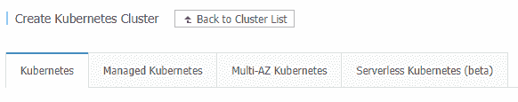

在本节中，我们将介绍如何在不需要调配或管理主实例和 etcd 实例的情况下调配高可用性 Multi-AZ Kubernetes 集群。

# 准备好

这里提到的所有操作都需要一个带有访问密钥的阿里巴巴云账户(也称为阿里云)。如果你还没有，去[https://account.alibabacloud.com](https://account.alibabacloud.com)创建一个账户。

# 怎么做…

本节将带您了解如何在阿里巴巴云上配置 Kubernetes 集群。本节进一步分为以下几个小节，以简化这一过程:

*   安装命令行工具来配置阿里巴巴云服务
*   在阿里巴巴云上提供高可用性的 Kubernetes 集群
*   连接到阿里巴巴容器服务集群

# 安装命令行工具来配置阿里巴巴云服务

对于这个配方，我们将使用阿里巴巴云控制台，并从仪表板生成将与命令行界面一起使用的应用编程接口请求参数。您还需要安装阿里巴巴云命令行界面、`aliyun`和`kubectl`。

1.  运行以下命令下载`aliyun`工具:

```
$ curl -O https://aliyuncli.alicdn.com/aliyun-cli-linux-3.0.15-amd64.tgz
```

You can find the link to the latest version here: [https://github.com/aliyun/aliyun-cli](https://github.com/aliyun/aliyun-cli).

2.  提取文件并安装它们:

```
$ tar –zxvf aliyun-cli*.tgz && sudo mv aliyun /usr/local/bin/.
```

3.  验证您正在使用的`aliyun`命令行界面版本:

```
$ aliyun --version
```

4.  如果您尚未创建访问密钥，请转到您帐户中的安全管理并创建一个([https://usercenter.console.aliyun.com/#/manage/ak](https://account.alibabacloud.com/login/login.htm?spm=a2c44.11131515.0.0.4e57525cYlZEdf))。

5.  通过输入您的访问密钥标识、访问密钥密码和区域标识，完成命令行界面配置:

```
$ aliyun configure
Configuring profile '' in '' authenticate mode...
Access Key Id []: <Your AccessKey ID>
Access Key Secret []: <Your AccessKey Secret>
Default Region Id []: us-west-1
Default Output Format [json]: json (Only support json))
Default Language [zh|en] en: en
Saving profile[] ...Done.
```

6.  启用`bash/zsh`自动完成:

```
$ aliyun auto-completion
```

7.  转到容器服务控制台([https://cs.console.aliyun.com](https://cs.console.aliyun.com))授予容器服务访问云资源的权限。在这里，选择`AliyunCSDefaultRole`、`AliyunCSServerlessKuberentesRole`、`AliyunCSClusterRole`和`AliyunCSManagedKubernetesRole`，点击确认授权策略。

确保您启用了**资源编排服务** ( **ROS** )和自动缩放服务，因为它们是部署 Kubernetes 集群所必需的。ROS 用于根据您的模板自动调配和配置用于自动部署、操作和维护的资源，而自动缩放用于根据需求调整计算资源。

# 在阿里巴巴云上提供高可用性的 Kubernetes 集群

让我们执行以下步骤:

1.  打开浏览器窗口，进入[https://vpc.console.aliyun.com](https://vpc.console.aliyun.com)的阿里巴巴云虚拟私有云控制台。
2.  确保选择至少有三个区域的区域(mainland China 的大多数区域都有三个以上的区域)，然后单击创建 VPC。
3.  为您的 VPC 指定一个唯一的名称，并选择一个 IPv4 CIDR 块。在我们的例子中，这是`10.0.0.0/8`。

4.  输入第一个虚拟交换机的名称(`k8s-1`)，然后选择一个区域(`Beijing Zone A`)。
5.  设置一个 IPv4 CIDR 块。在我们的例子中，我们使用了`10.10.0.0./16`。
6.  点击添加按钮，重复*步骤 4* 和*步骤 5* 获得不同的区域。使用以下 CIDR 区块信息:

|  | **电压开关 2** | **vsswitch 3** |
| **名称:** | k8s-2 | k8s-3 |
| 区域: | 北京 B 区 | 北京五区 |
| **IPv4 CIDR 区块:** | 10.20.0.0/16 | 10.30.0.0/16 |

7.  单击“确定”创建您的 VPC 交换机和虚拟交换机。
8.  在网络浏览器上打开阿里云网络控制台([https://cs.console.aliyun.com](https://cs.console.aliyun.com))。).
9.  单击创建Kubernetes集群。
10.  选择标准受管集群。
11.  单击 Multi-AZ Kubernetes 选项卡，为集群命名，并选择用于创建虚拟专用网络和虚拟交换机的相同区域。
12.  如果您选择了相同的地区，VPC 下拉列表将填充`k8s-devops-cookbook-vpc`。现在，选择我们创建的所有三个虚拟交换机:

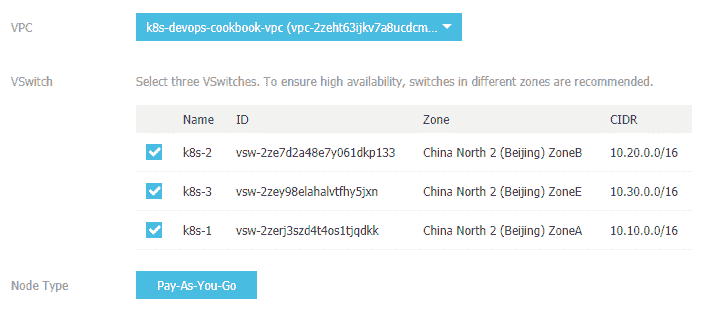

13.  为每个区域中的主节点配置设置实例类型。
14.  将每个区域中 Worker 节点配置的实例类型和每个区域中的节点数量设置为`3`。否则，使用默认值。
15.  选择 Kubernetes 版本(`1.12.6-aliyun.1`，编写时)。

16.  从下拉菜单中选择密钥对名称，或通过单击创建新密钥对来创建密钥对:

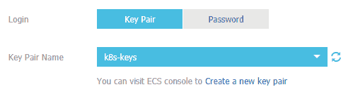

17.  阿里巴巴提供两种 CNI 选择:法兰绒和泰尔维。这个区别在本食谱的*部分有更多的解释。使用`Flannel`保留默认网络选项。默认参数支持集群中最多 512 台服务器。*
18.  监控和记录将在[第 8 章](08.html)、*Kubernetes的可观测性和监控*、[第 10 章](10.html)、*Kubernetes的记录*中说明。因此，这一步是可选的。检查`Install cloud monitoring plug-in on your ECS`和`Using Log Service`选项以启用监控和记录。
19.  现在，单击创建来调配您的多 AZ Kubernetes 集群。此步骤可能需要 15-20 分钟才能完成。

# 连接到阿里巴巴容器服务集群

要访问阿里巴巴云上的集群，您需要遵循以下步骤:

1.  要获取集群的凭据，请转到集群菜单，然后单击要访问的集群名称:

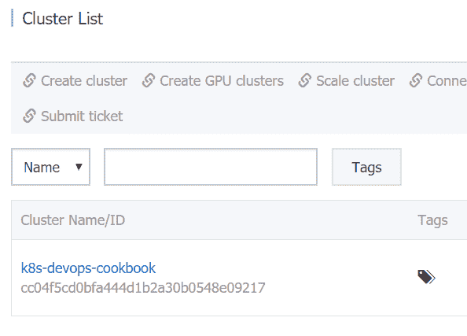

2.  将 KubeConfig 选项卡中显示的内容复制到本地机器的`$HOME/.kube/config`文件中:

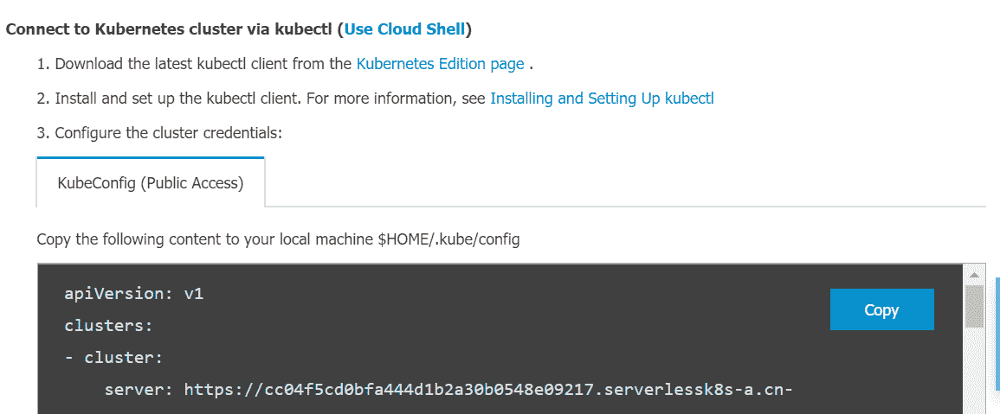

3.  验证您的 Kubernetes 集群:

```
$ kubectl get nodes
```

作为替代方案，参见*下的*查看Kubernetes仪表板*说明，还有更多...*部分管理你的集群。

# 它是如何工作的…

本食谱向您展示了如何使用集群模板在阿里巴巴云上配置托管 Kubernetes 集群。

在容器服务菜单下，阿里巴巴云提供了几个 Kubernetes 集群，为你提供了七个集群模板。我们在这里使用了标准托管集群。此选项仅允许您管理工作节点，并为您节省了主节点的资源和管理成本:

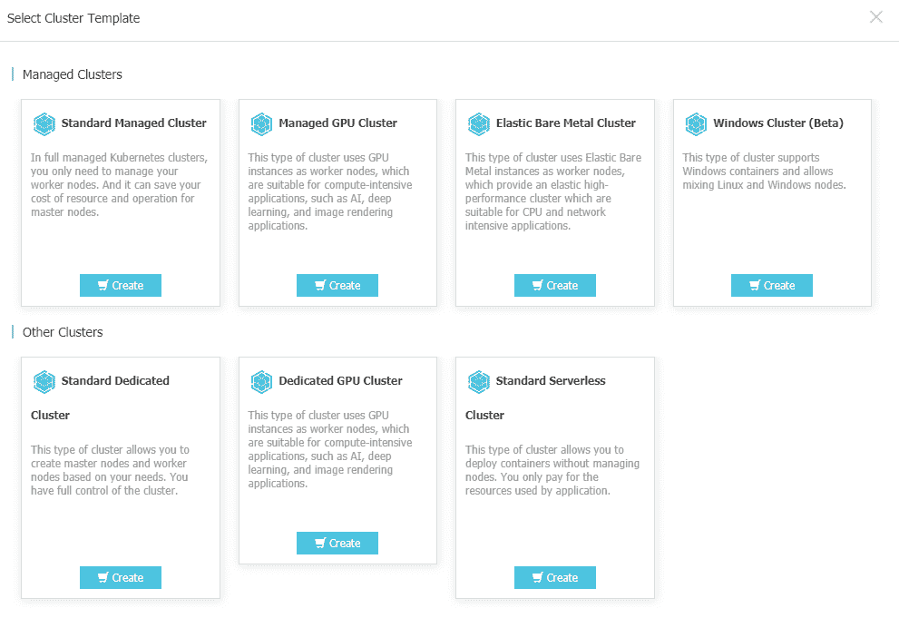

默认情况下，帐户最多支持 20 个集群和每个集群中的 40 个节点。您可以通过提交支持票证来请求增加配额。

# 还有更多…

作为使用阿里巴巴云控制台的替代方式，您可以通过`aliyuncli`使用 REST API 调用来创建 ECS 实例和您的集群。请按照以下步骤操作:

1.  在阿里巴巴云控制台上配置好集群选项后，点击创建按钮下的生成应用编程接口请求参数，生成与`aliyun`命令行界面一起使用的开机自检请求正文内容。
2.  将内容保存在文件中。在我们的例子中，这个文件叫做`cscreate.json`。
3.  有关本节中列出的附加参数的说明，请参考位于[https://www.alibabacloud.com/help/doc-detail/87525.htm](https://www.alibabacloud.com/help/doc-detail/87525.htm)的*创建Kubernetes*部分。
4.  使用以下命令创建集群:

```
$ aliyun cs POST /clusters --header "Content-Type=application/json" \
--body "$(cat cscreate.json)"
```

阿里巴巴云容器服务为其 Kubernetes 集群提供了两个网络插件选项:Terway 和法兰绒。

法兰绒是基于社区法兰绒 CNI 插件。法兰绒是一个非常常见和稳定的网络插件，提供基本的网络功能。它是大多数用例的推荐选项，除了它不支持 Kubernetes 网络策略。Terway 是阿里巴巴云 CS 开发的网络插件。它与法兰绒完全兼容。Terway 可以基于 Kubernetes 网络策略定义容器之间的访问策略。Terway 还支持容器的带宽限制。

# 使用 Rancher 配置和管理 Kubernetes 集群

Rancher 是一个容器管理平台，可以灵活地使用**Rancher Kubernetes Engine**(**【RKE】**)或基于云的 Kubernetes 服务创建 Kubernetes 集群，如 GKE、AKS 和 EKS，这些我们在前面的菜谱中讨论过。

在本节中，我们将介绍配置 Rancher 的方法，以便我们可以部署和管理 Kubernetes 服务。

# 准备好

Rancher 可以安装在 Ubuntu、RHEL/CentOS、RancherOS 甚至 Windows Server 上。您可以在高可用性配置或单个节点中启动 Rancher Server。参见*另请参见...*部分，获取备选安装说明的链接。在本食谱中，我们将在单个节点上运行 Rancher。

# 怎么做…

本节将带您了解如何使用 Rancher 配置和管理 Kubernetes 集群。为此，本节进一步分为以下几个小节，以简化这一过程:

*   安装牧场主服务器
*   部署 Kubernetes 集群
*   导入现有集群
*   启用集群和节点提供程序

# 安装牧场主服务器

按照以下步骤安装牧场主服务器:

1.  安装支持的 Docker 版本。如果您已经安装了 Docker，则可以跳过此步骤:

```
$ sudo apt-get -y install apt-transport-https ca-certificates curl \
software-properties-common
$ curl -fsSL https://download.docker.com/linux/ubuntu/gpg | sudo apt-key add -
$ sudo add-apt-repository "deb [arch=amd64] https://download.docker.com/linux/ubuntu $(lsb_release -cs) stable"
$ sudo apt-get -y install docker-ce && docker --version
```

2.  将用户添加到 Docker 组:

```
$ sudo usermod -a -G docker $USER
```

3.  要安装牧场主服务器，请运行以下命令:

```
docker run -d --restart=unless-stopped \
-p 80:80 -p 443:443 rancher/rancher:latest
```

4.  打开浏览器窗口，进入`https://localhost`。如有必要，将`localhost`替换为您主机的 IP。
5.  设置新密码，然后单击继续。
6.  设置牧场主服务器的公共 IP 地址，点击保存网址。该 IP 需要可以从您的集群外部访问。

# 部署 Kubernetes 集群

要部署新集群，您需要遵循以下步骤:

1.  单击添加集群。
2.  选择提供商。在我们的例子中，我们将使用 GKE。其他提供商的某些设置可能略有不同:

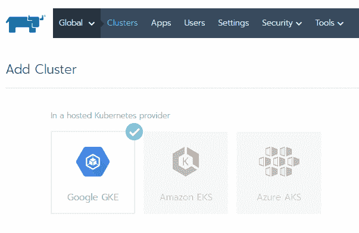

3.  输入集群名称。

如果您有我们之前保存的 GCP 服务帐户 JSON 文件，请跳到*步骤 10* 。

4.  从 GCP 导航菜单中，转到 IAM 并单击服务帐户链接。
5.  单击创建服务帐户。
6.  埃特娜
7.  添加所需的最低权限；即计算查看器、查看器、Kubernetes 引擎管理和服务帐户用户，然后单击继续。
8.  单击创建密钥。使用 JSON 作为密钥类型，以便保存您的服务帐户。
9.  在 Rancher 用户界面上，单击从文件中读取，并加载您之前保存的服务帐户 JSON 文件。
10.  根据需要自定义集群选项；否则，使用默认设置并单击创建来部署 Kubernetes 集群:


您的集群将被列出，并准备好立即在您的 Rancher 仪表板上进行管理。

# 导入现有集群

要导入现有集群，您需要执行以下步骤:

1.  单击添加集群
2.  点击导入:

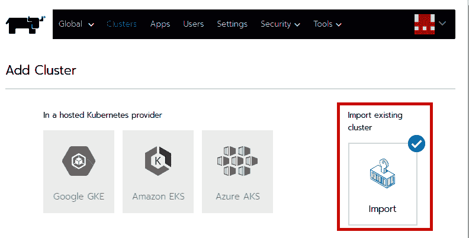

3.  埃特娜
4.  按照所示说明，将屏幕上显示的`kubectl`命令复制并运行到现有的 Kubernetes 集群。如果您使用不受信任的/自签名的 SSL 证书运行，此命令将类似于以下内容:

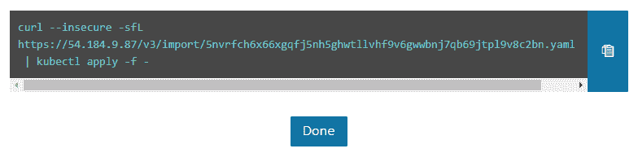

5.  单击完成，您的集群将被列出，并准备好立即在您的牧场主仪表板上进行管理:

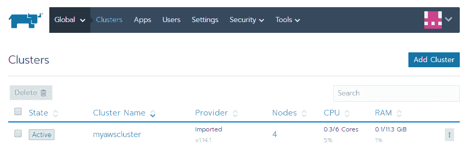

最后一步可能需要一分钟才能完成。最终，当集群准备就绪时，它的状态将从挂起变为活动。

# 启用集群和节点提供程序

为了能够支持多个提供者，Rancher 使用集群和节点驱动程序。如果您在列表中没有看到您的提供商，则它很可能未启用。

要启用其他提供程序，请按照下列步骤操作:

1.  从工具中，单击驱动程序。
2.  在列表中找到您的提供商，然后单击激活:

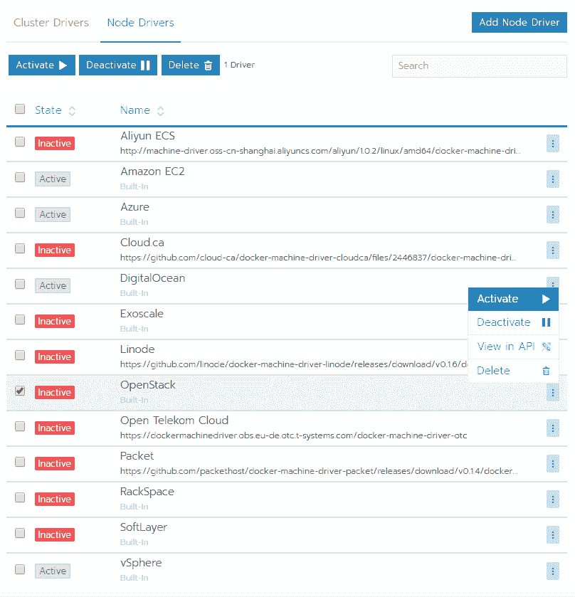

在同一页面上，您还可以停用不打算使用的提供程序。

# 它是如何工作的…

本食谱向您展示了如何快速运行牧场主服务器来管理您的 Kubernetes 集群。

在*步骤 1* 中，我们使用了单节点安装，使用了默认的自签名证书方法。出于安全目的，需要 SSL 与集群进行交互。因此，需要证书。

如果您更喜欢使用您自己的由公认的 CA 签名的证书，您可以使用以下命令并提供您的证书的路径，通过用您签名的证书替换`FULLCHAIN.pem`和`PRIVATEKEY.pem`文件来将它们装入您的容器中:

```
$ docker run -d --restart=unless-stopped \
 -p 80:80 -p 443:443 \
 -v /<CERTDIRECTORY>/<FULLCHAIN.pem>:/etc/rancher/ssl/cert.pem \
 -v /<CERTDIRECTORY>/<PRIVATEKEY.pem>:/etc/rancher/ssl/key.pem \
 rancher/rancher:latest --no-cacerts
```

使用可识别的证书将消除登录页面上的安全警告。

# 还有更多…

了解以下信息也很有用:

*   绑定装载主机卷以保留数据
*   保持用户卷的持久性
*   保持数据在主机卷上的持久性
*   在相同的 Kubernetes 节点上运行 Rancher

# 绑定装载主机卷以保留数据

使用单节点安装时？，持久数据保存在容器中的`/var/lib/rancher`路径上。

要将数据保留在主机上，可以使用以下命令将装载主机卷绑定到某个位置:

```
$ docker run -d --restart=unless-stopped \
 -p 80:80 -p 443:443 \
 -v /opt/rancher:/var/lib/rancher \
 -v /var/log/rancher/auditlog:/var/log/auditlog \
 rancher/rancher:latest 
```

与卷相比，绑定装载的功能有限。当使用绑定装载启动 Rancher 时，主机上的目录将被装载到容器中的指定目录。

# 保持用户卷的持久性

使用 RancherOS 时，只有特定的目录会将`user-volumes`参数定义的数据保持持久。

要添加额外的持久`user-volumes`，例如，添加`/var/openebs`目录:

```
$ ros config set rancher.services.user-volumes.volumes \[/home:/home,/opt:/opt,/var/lib/kubelet:/var/lib/kubelet,/etc/kubernetes:/etc/kubernetes,/var/openebs]
$ system-docker rm all-volumes
$ reboot
```

重新启动后，指定目录中的数据将保持不变。

# 在相同的 Kubernetes 节点上运行 Rancher

要在集群上添加运行 Rancher Server 的节点，请按如下方式替换默认端口`-p 80:80 -p 443:443`，并使用以下命令启动 Rancher:

```
$ docker run -d --restart=unless-stopped \
 -p 8080:80 -p 8443:443 rancher/rancher:latest
```

在这种情况下，牧场主服务器将通过`https://localhost:8443`而不是标准的`443`端口进行访问。

# 请参见

*   牧场主 2.x 文档:[https://rancher.com/docs/rancher/v2.x/en/](https://rancher.com/docs/rancher/v2.x/en/)
*   K3s，来自牧场实验室的轻量级 Kubernetes:[https://k3s.io/](https://k3s.io/)
*   Rio，来自 Rancher Labs 的 Kubernetes 的应用部署引擎:[https://rio.io/](https://rio.io/)

# 配置红帽 OpenShift

在本食谱中，我们将学习如何在 AWS、裸机或 VMware 虚拟卷虚拟机上部署红帽 OpenShift。

*供应 OpenShift 集群配方*中的步骤可用于在虚拟化环境或裸机服务器上运行的虚拟机上部署 OpenShift。

# 准备好

这里提到的所有操作都需要一个红帽帐户，该帐户具有活动的红帽企业 Linux 和 OpenShift 容器平台订阅。如果你还没有，去[https://access.redhat.com](https://access.redhat.com)创建一个账户。

When you deploy on VMs, make sure to plan that the zones you create on Kubernetes nodes are actually physically located on separate hypervisor nodes.

对于这个配方，我们需要至少有六个节点，并在其上安装红帽企业 CoreOS。这些节点可以是裸机、虚拟机，也可以是裸机和虚拟机的混合。

# 怎么做…

本节将带您了解如何配置红帽 OpenShift。为此，本节进一步分为以下几个小节，以简化这一过程:

*   正在下载 OpenShift 二进制文件
*   设置 OpenShift 集群
*   连接到 OpenShift 集群

# 正在下载 OpenShift 二进制文件

请确保您在第一台主机的终端上，并且您拥有具有超级用户访问权限的帐户，或者您是以超级用户身份运行的。请遵循以下步骤:

1.  前往[https://cloud.redhat.com/openshift/install](https://cloud.redhat.com/openshift/install)下载最新`OpenShift Installer`:

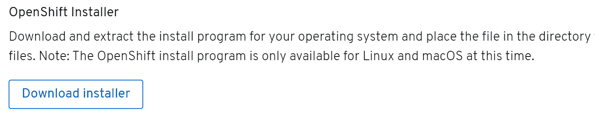

2.  提取工作站上的安装程序文件:

```
$ tar -xzf openshift-install-linux-*.tar.gz
```

前面的命令将在同一个文件夹中创建一个名为`openshift-install`的文件。

# 设置 OpenShift 集群

在本食谱中，我们将使用 AWS 平台部署 OpenShift:

1.  要启动 OpenShift 集群，请使用以下命令:

```
$ ./openshift-install create cluster
```

2.  选择`aws`作为你的平台，进入你的`AWS Access Key ID`和`Secret Access Key`。
3.  选择您的地区。在我们的例子中，这是`us-east-1`。
4.  选择一个基本域。在我们的例子中，这是`k8s.containerized.me`。
5.  埃特娜
6.  从红帽网站复制拉秘密并粘贴到命令行:

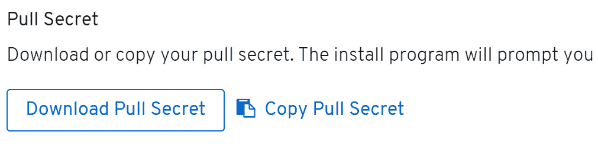

7.  安装完成后，您将看到用于访问新集群的控制台 URL 和凭据，如下所示:

```
INFO Install complete!
INFO To access the cluster as the system:admin user when using 'oc', run 'export KUBECONFIG=/home/ubuntu/auth/kubeconfig'
INFO Access the OpenShift web-console here: https://console-openshift-console.apps.os.k8s.containerized.me
INFO Login to the console with user: kubeadmin, password: ABCDE-ABCDE-ABCDE-ABCDE
```

8.  切换到红帽网站，点击`Download Command-Line Tools`链接下载`openshift-client`。
9.  提取工作站中的`openshift-client`文件:

```
$ tar -xzf openshift-client-linux-*.tar.gz && sudo mv oc /usr/local/bin
```

前面的命令将在同一个文件夹中创建`kubectl`和`oc`文件，并将`oc`二进制文件移动到路径。

# 连接到 OpenShift 集群

要连接到 OpenShift 集群，请执行以下步骤:

1.  要访问 OpenShift 集群，请使用以下命令:

```
$ export KUBECONFIG=~/auth/kubeconfig
```

2.  更换`password`和`cluster address`后，登录您的 OpenShift 集群:

```
$ oc login -u kubeadmin -p ABCDE-ABCDE-ABCDE-ABCDE \
https://api.openshift.k8s.containerized.me:6443 \
--insecure-skip-tls-verify=true
```

如果您更喜欢使用网络控制台，请在*步骤 7* 中从*打开网络控制台网址，提供一个 OpenShift 集群*配方。

# 它是如何工作的…

这个食谱向您展示了如何在 AWS 上快速部署 OpenShift 集群。

在*步骤 1* 中，我们使用安装程序提供的基础架构的默认配置创建了一个集群。

安装程序询问了一系列关于用户信息的问题，并在其他配置选项中使用了大部分默认值。如果需要，可以使用`install-config.yaml`文件编辑和自定义这些默认值。

要查看用于部署的默认值，让我们创建一个`install-config.yaml`文件并查看它:

```
$ ./openshift-install create install-config && cat install-config.yaml
```

从以下输出可以看出，该文件的默认配置创建了一个由三个主节点和三个工作节点组成的集群:

```
apiVersion: v1
baseDomain: k8s.containerized.me
compute:
- hyperthreading: Enabled
 name: worker
 platform: {}
 replicas: 3
controlPlane:
 hyperthreading: Enabled
 name: master
 platform: {}
 replicas: 3
...
```

根据需要编辑`install-config.yaml`。下次创建集群时，将使用新参数。

# 还有更多…

了解以下信息也很有用:

*   正在删除您的集群

# 正在删除您的集群

要删除集群，请使用以下命令:

```
$ ./openshift-install destroy cluster
```

此过程将需要几分钟时间，完成后，您将收到一条确认消息。

# 请参见

*   OpenShift 容器平台 4.3 文档:[https://docs . OpenShift . com/Container-Platform/4.3/welcome/index . html](https://docs.openshift.com/container-platform/4.3/welcome/index.html)

# 使用 Ansible 配置 Kubernetes 集群

像 Ansible 这样强大的 IT 自动化引擎可以用来自动化几乎任何日常 IT 任务，包括在裸机集群上部署 Kubernetes 集群。在本节中，我们将学习如何使用 Ansible 行动手册部署一个简单的 Kubernetes 集群。

# 准备好

在本食谱中，我们将使用 Ansible 剧本。将在这些食谱中使用的例子可以通过`k8sdevopscookbook` GitHub 存储库访问。

在开始执行本节的方法中的命令之前，请使用以下命令克隆 Ansible 行动手册示例:

```
$ git clone https://github.com/k8sdevopscookbook/src.git
```

你会发现存储在`k8sdevopscookbook/src`目录下的例子。

# 怎么做…

本节将带您了解如何使用 Ansible 配置 Kubernetes 集群。为此，本节进一步分为以下几个小节，以简化这一过程:

*   安装 Ansible
*   使用 Ansible 行动手册配置 Kubernetes 集群
*   连接到 Kubernetes 集群

# 安装 Ansible

要使用 Ansible 行动手册调配 Kubernetes 集群，请执行以下步骤:

1.  要在您的 Linux 工作站上安装 Ansible，首先，我们需要添加必要的存储库:

```
$ sudo apt-get install software-properties-common
$ sudo apt-add-repository --yes --update ppa:ansible/ansible
```

2.  使用以下命令安装 Ansible:

```
$ sudo apt-get update && *sudo apt-get install ansible -y*
```

3.  验证其版本并确保安装了 Ansible:

```
$ ansible --version
```

在写这个食谱的时候，最新的 Ansible 版本是`2.9.4`。

# 使用 Ansible 行动手册配置 Kubernetes 集群

要使用 Ansible 行动手册调配 Kubernetes 集群，请执行以下步骤:

1.  编辑`hosts.ini`文件，用您希望配置 Kubernetes 的节点 IP 替换主 IP 地址和节点 IP 地址:

```
$ cd src/chapter1/ansible/ && vim hosts.ini
```

2.  `hosts.ini`文件应该如下所示:

```
[master]
192.168.1.10
[node]
192.168.1.[11:13]
[kube-cluster:children]
master
node
```

3.  编辑`groups_vars/all.yml`文件以自定义您的配置。下面是如何做到这一点的一个例子:

```
kube_version: v1.14.0
token: b0f7b8.8d1767876297d85c
init_opts: ""
kubeadm_opts: ""
service_cidr: "10.96.0.0/12"
pod_network_cidr: "10.244.0.0/16"
calico_etcd_service: "10.96.232.136"
network: calico
network_interface: ""
enable_dashboard: yes
insecure_registries: []
systemd_dir: /lib/systemd/system
system_env_dir: /etc/sysconfig
network_dir: /etc/kubernetes/network
kubeadmin_config: /etc/kubernetes/admin.conf
kube_addon_dir: /etc/kubernetes/addon
```

4.  运行`site.yaml`行动手册来创建您的集群:

```
$ ansible-playbook site.yaml
```

您的集群将根据您的配置进行部署。

# 连接到 Kubernetes 集群

要访问 Kubernetes 集群，您需要执行以下步骤:

1.  从`master1`节点复制配置文件:

```
$ scp root@master:/etc/kubernetes/admin.conf ~/.kube/config
```

2.  现在，使用`kubectl`来管理您的集群。

# 请参见

*   使用 Kubernetes 的 Ansible 模块:[https://docs . ansi ble . com/ansi ble/latest/modules/k8s _ module . html](https://docs.ansible.com/ansible/latest/modules/k8s_module.html)
*   使用 Ansible 和 Operator SDK 的 Kubernetes 运算符示例:[https://github . com/Operator-framework/Operator-SDK/blob/master/doc/Ansible/user-guide . MD](https://github.com/operator-framework/operator-sdk/blob/master/doc/ansible/user-guide.md)

# 安装问题疑难解答

Kubernetes 由许多松散耦合的组件和 API 组成。基于环境的差异，你可能会遇到一些问题，需要多一点注意才能让一切正常运行。幸运的是，Kubernetes 提供了许多指出问题的方法。

在本节中，我们将学习如何获取集群信息，以便对潜在问题进行故障排除。

# 怎么做…

按照以下步骤收集集群信息，以便排除潜在问题:

1.  创建名为`cluster-state`的集群状态文件转储:

```
$ kubectl cluster-info dump --all-namespaces \
 --output-directory=$PWD/cluster-state
```

2.  显示主地址和服务地址:

```
$ kubectl cluster-info
Kubernetes master is running at https://172.23.1.110:6443
Heapster is running at https://172.23.1.110:6443/api/v1/namespaces/kube-system/services/heapster/proxy
KubeDNS is running at https://172.23.1.110:6443/api/v1/namespaces/kube-system/services/kube-dns:dns/proxy
```

3.  显示`us-west-2.compute.internal`节点的资源使用情况:

```
$ kubectl top node us-west-2.compute.internal
NAME CPU(cores) CPU% MEMORY(bytes) MEMORY%
us-west-2.compute.internal 42m 2% 1690Mi 43%
```

4.  将`us-west-2.compute.internal`节点标记为不可剖分:

```
$ kubectl cordon us-west-2.compute.internal
```

5.  从`us-west-2.compute.internal`节点安全驱逐所有POD进行维护:

```
$ kubectl drain us-west-2.compute.internal
```

6.  维护后将`us-west-2.compute.internal`节点标记为可调度:

```
$ kubectl uncordon us-west-2.compute.internal
```

# 它是如何工作的…

本食谱向您展示了如何快速解决常见的 Kubernetes 集群问题。

在步骤 1 中，当使用`--output-directory`参数执行`kubectl cluster-info`命令时，Kubernetes 将集群状态的内容转储到指定的文件夹下。您可以使用以下命令查看完整列表:

```
$ tree ./cluster-state
./cluster-state
├── default
│ ├── daemonsets.json
│ ├── deployments.json
│ ├── events.json
│ ├── pods.json
│....
```

在第 4 步中，我们使用`kubectl cordon`命令将节点标记为不可用。Kubernetes 有一个调度应用的概念，这意味着它将 pods 分配给可用的节点。如果您事先知道集群上的某个实例将被终止或更新，则不希望在该特定节点上计划新的 pods。封锁意味着用`node.Spec.Unschedulable=true`修补节点。当一个节点被设置为不可用时，将不会在该节点上计划新的 pods。

在第 5 步中，我们使用`kubectl drain`命令驱逐现有的POD，因为仅封锁不会对当前计划的POD产生影响。驱逐 API 将中断预算考虑在内。如果由所有者设置，中断预算会限制复制的应用因自愿中断而同时停机的盒数。如果不支持或设置这一点，退出应用编程接口将在宽限期后简单地删除节点上的 pod。

# 还有更多…

了解以下信息也很有用:

*   设置日志级别

# 设置日志级别

使用`kubectl`命令时，您可以使用`--v`标志设置输出详细度，后面跟一个 0 到 9 之间的整数作为日志级别。一般的 Kubernetes 日志记录约定和相关的日志级别在[的 Kubernetes 文档中有描述。](https://kubernetes.io/docs/reference/kubectl/cheatsheet/#kubectl-output-verbosity-and-debugging)

通过向命令中添加以下参数之一，以特定格式获取输出详细信息非常有用:

*   `-o=wide`用于获取资源的附加信息。一个例子如下:

```
$ kubectl get nodes -owide
NAME STATUS ROLES AGE VERSION INTERNAL-IP EXTERNAL-IP OS-IMAGE KERNEL-VERSION CONTAINER-RUNTIME
ip-192-168-41-120.us-west-2.compute.internal Ready <none> 84m v1.13.8-eks-cd3eb0 192.168.41.120 34.210.108.135 Amazon Linux 2 4.14.133-113.112.amzn2.x86_64 docker://18.6.1
ip-192-168-6-128.us-west-2.compute.internal Ready <none> 84m v1.13.8-eks-cd3eb0 192.168.6.128 18.236.119.52 Amazon Linux 2 4.14.133-113.112.amzn2.x86_64 docker://18.6.1
```

*   `-o=yaml`用于返回 YAML 格式的输出。一个例子如下:

```
$ kubectl get pod nginx-deployment-5c689d88bb-qtvsx -oyaml
apiVersion: v1
kind: Pod
metadata:
 annotations:
 kubernetes.io/limit-ranger: 'LimitRanger plugin set: cpu request for container
 nginx'
 creationTimestamp: 2019-09-25T04:54:20Z
 generateName: nginx-deployment-5c689d88bb-
 labels:
 app: nginx
 pod-template-hash: 5c689d88bb
 name: nginx-deployment-5c689d88bb-qtvsx
 namespace: default
...
```

如您所见，`-o=yaml`参数的输出也可以用来从现有资源中创建清单文件。

# 请参见

*   kubectl 命令的概述和详细用途:[https://kubernetes.io/docs/reference/kubectl/overview/](https://kubernetes.io/docs/reference/kubectl/overview/)
*   Kubernetes cheat sheet:[https://Kubernetes. io/docs/reference/Kubernetes/cheatsheet/](https://kubernetes.io/docs/reference/kubectl/cheatsheet/)
*   Kubernetes 部署故障排除可视化指南:[https://learnk8s.io/a/troubleshooting-kubernetes.pdf](https://learnk8s.io/a/troubleshooting-kubernetes.pdf)
*   k9s–Kubernetes CLI，以风格管理您的集群:[https://github.com/derailed/k9s](https://github.com/derailed/k9s)