# 构建配置项/内容分发管道

在本章中，我们将讨论端到端**持续集成/持续交付** ( **CI/CD** )管道的配置，这些管道使用自管理公共云和使用 Kubernetes 的 SaaS 解决方案上最流行的 CI/CD 工具。遵循本章中的方法后，您将获得构建、部署和将应用程序从开发环境提升到生产环境所需的技能。在持续的集成过程中，您将能够使用我们将在这些方法中实现的工具来检测错误、反模式和许可证问题。

在本章中，我们将介绍以下食谱:

*   在詹金斯十公司创建竞争情报/消费者数据管道
*   在 GitLab 中创建配置项/光盘管道
*   使用 CircleCI 创建配置项/光盘管道
*   使用 GitHub 操作设置配置项/光盘管道
*   在亚马逊网络服务上建立竞争情报/光盘管道
*   在谷歌云构建上与 Spinnaker 建立 CI/CD 管道
*   在 Azure DevOps 上设置配置项/光盘管道

# 技术要求

本节中的方法假设您在遵循[第 1 章](01.html)、*中描述的推荐方法之一构建生产就绪型 Kubernetes 集群*后部署了一个功能性 Kubernetes 集群。

Kubernetes 的命令行界面`kubectl`将用于本节的其余部分，因为它是针对 Kubernetes 集群运行命令的主要命令行界面。如果你使用的是红帽 OpenShift 集群，你可以用`oc`代替`kubectl`。所有命令的功能都是相似的。

本节中的配方需要一个带有容器化项目的 Git 存储库。

# 在詹金斯 X 中创建配置项/光盘管道

Jenkins X 是一个相当新的开源解决方案，它扩展了 Jenkins 生态系统，并使用 Kubernetes 解决了云中 CI/CD 自动化的问题。

在本节中，我们将学习如何将您的应用程序作为管道导入詹金斯 X，您将按照[第 2 章](02.html) *中的*部署和管理詹金斯 X 的生命周期*配方说明进行部署。有了这些，您将学习如何使用自动化 GitOps 创建 CI/CD 管道，并通过简单的命令将应用程序从登台升级到生产。*

# 准备好

确保您遵循了[第 2 章](02.html) *【在库本内特斯上运行应用程序】**中关于部署和管理詹金斯 X* 配方的生命周期的说明，并准备好了一个功能性的库本内特斯集群和一个詹金斯 X 部署。你也可以在那一章找到安装`helm`的说明。

在下面的食谱中，您将学习如何使用 GitOps 推广创建管道。

该方法需要`kubectl`、`helm`、詹金斯 X 命令行界面、`jx`和您首选的云提供商命令行界面，您在其中使用詹金斯 X 安装了 Kubernetes 集群

Jenkins X 支持 Azure、AWS、GCP、IBM Cloud、Oracle Cloud、minikube、minishift 和 OpenShift 作为部署流程的提供者。您还需要有一个 GitHub 组织和 GitHub 帐户。

# 怎么做…

本节进一步分为以下几个小节，以简化这一过程:

*   连接到詹金斯管道控制台
*   将应用程序作为管道导入
*   检查应用程序状态
*   将应用程序推广到生产
*   使用快速启动应用程序创建管道

# 连接到詹金斯管道控制台

让我们执行以下步骤来访问詹金斯管道控制台网络界面:

1.  切换到詹金斯 X 部署的`jx`命名空间:

```
$ jx ns
? Change namespace: [Use arrows to move, space to select, type to filter]
 default
> jx
 jx-production
 jx-staging
 kube-public
 kube-system
```

2.  使用以下命令获取詹金斯(蓝色海洋)控制台地址，并在浏览器中打开链接。在该配方中，控制台地址是以下`jx console`命令的输出，即`http://jenkins.jx.your_ip.nip.io/blue`:

```
$ jx console
Jenkins Console: http://jenkins.jx.your_ip.nip.io/blue
```

3.  从*步骤 2* 的输出中打开詹金斯控制台链接后，单击列表中的一个管道。例如，您可以在下面的演示环境中看到两条管道:

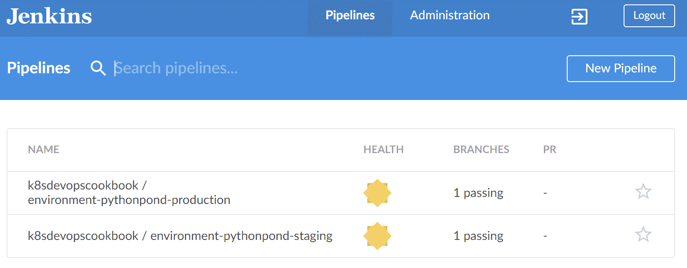

4.  选择最后一次运行，并确保两条管道都是健康的，这意味着您的环境可以工作。与下面的截图类似，您应该会在验证环境和更新环境阶段看到绿色复选标记:

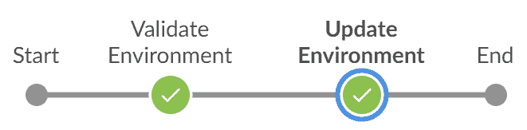

现在我们已经验证了环境是正常的，我们可以开始为自己的应用程序添加新的管道。

# 将应用程序作为管道导入

大多数情况下，您需要将本地项目或 Git 存储库导入到 Jenkins 中。让我们执行以下步骤来创建现有存储库的本地克隆，并将其作为管道导入:

1.  首先，将示例代码的副本转移到您的帐户。在浏览器中转到[https://github.com/k8sdevopscookbook/python-flask-docker](https://github.com/k8sdevopscookbook/python-flask-docker)，点击右上角的分叉按钮。
2.  将存储库克隆到您的本地计算机。确保在分叉示例的地方用您的 GitHub 用户名替换`your_github_username`:

```
$ git clone https://github.com/your_github_username/python-flask-docker.git
```

3.  现在，您应该有一份`python-flash-docker`应用程序的本地副本。使用以下命令导入项目:

```
$ cd python-flask-docker
$ jx import
```

4.  现在，您可以从詹金斯蓝海视图或命令行界面观看管道活动。以下屏幕截图显示了詹金斯蓝海仪表板上的管道活动:

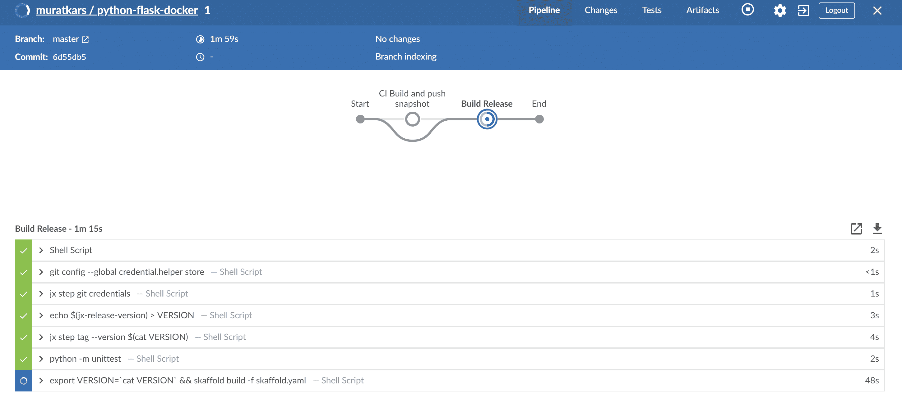

5.  或者，您可以使用`jx get activity`命令在命令行界面上观看活动:

```
$ jx get activity -f python-flask-docker -w
STEP STARTED AGO DURATION STATUS
muratkars/python-flask-docker/master #1 1m3s Running
 Checkout Source 22s 5s Succeeded
 CI Build and push snapshot 17s NotExecuted
 Build Release 17s Pending
...
 Promoted 2m5s 2m0s Succeeded Application is at: http://python-flask-docker.jx-staging.35.188.140.152.nip.io
 Clean up 1s 0s Succeeded
```

# 检查应用程序状态

创建管道后，您需要确认其状态。让我们执行以下步骤，以确保在将应用程序转移到生产环境之前，该应用程序已经部署在临时环境中:

1.  如果管道已经成功构建，您的登台环境中应该有 0.0.1 版。管道完成时列出应用程序:

```
$ jx get applications
APPLICATION STAGING PODS URL
python-flask-docker 0.0.1 1/1 http://python-flask-docker.jx-staging.35.188.140.152.nip.io
```

2.  在这里，您可以看到应用程序已经部署。访问网址查看应用程序:

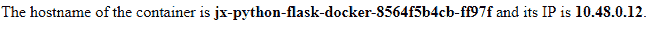

3.  我们的 pod 目前正在`jx-staging`命名空间中运行。确认`jx-staging`和`jx-production`名称空间中的容器。第二个命名空间不应该返回任何东西，直到我们将我们的应用程序提升到生产环境:

```
$ kubectl get pods -n jx-staging
NAME READY STATUS RESTARTS AGE
jx-python-flask-docker-8564f5b4cb-ff97f 1/1 Running 0 21m
$ kubectl get pods -n jx-production
No resources found.
```

# 将应用程序推广到生产

一旦一个应用程序已经部署在临时环境中，下一步就是将其提升到生产环境中。让我们执行以下步骤，将应用程序从暂存升级到生产:

1.  确认应用程序稳定后，下一步是将其投入生产。让我们使用以下命令将当前版本从`staging`推送到`production`:

```
$ jx promote python-flask-docker --version 0.0.1 --env production
```

2.  由于各种原因，主要是环境限制，将应用程序成功部署到试运行中并不能保证成功部署到生产中。升级应用程序后，使用以下命令检查生产部署的进度。运行此命令后，您需要看到一条`Succeeded`消息:

```
$ jx get activity -f python-flask-docker -w
```

3.  我们的 pod 已经升级到`jx-production`命名空间。确认吊舱现在也在`jx-production`命名空间中运行:

```
$ kubectl get pods -n jx-production
NAME                                    READY STATUS  RESTARTS AGE
jx-python-flask-docker-8564f5b4cb-fhcpm 1/1   Running 0        104m
```

4.  列出申请。您将获得同一应用程序的登台和生产链接:

```
$ jx get applications
APPLICATION         STAGING PODS URL                                                         PRODUCTION PODS URL
python-flask-docker 0.0.1   1/1  http://python-flask-docker.jx-staging.35.188.140.152.nip.io 0.0.1      1/1  http://python-flask-docker.jx-production.35.188.140.152.nip.io
```

# 使用快速启动应用程序创建管道

如果您没有要导入的项目，那么您可以通过执行以下步骤，从 QuickStart 创建一个新的应用程序，并将新生成的代码导入 Git 和 Jenkins，用于 CI/CD:

1.  从标准化模板创建构建。此命令将向您显示可用于创建新应用程序的应用程序模板:

```
$ jx create quickstart
```

2.  选择您的 GitHub 用户名和组织:

```
? Git user name? 
? Which organisation do you want to use?
```

3.  输入新的存储库名称。在这个食谱中，这是`chapter2-jx-tutorial`:

```
Enter the new repository name: chapter2-jx-tutorial
```

4.  选择您想要创建的快速启动示例。在我们的食谱中，这是`golang-http`。
5.  对以下问题指定`Yes`:

```
Would you like to initialise git now? (Y/n) y
```

6.  管道需要一些时间来完成。使用以下命令列出可用管道:

```
$ jx get pipelines
```

# 它是如何工作的...

本节的第二个食谱*将应用程序导入为* *管道*，向您展示了如何使用现有项目创建詹金斯管道。

在*步骤 3* 中，当您使用`jx import`命令导入应用程序时，会发生以下情况:

1.  首先，从存储库中签出项目源，并应用新的语义版本号。然后，在 Skaffold 的帮助下，创建了 Git 标记 v0.0.1 并执行单元测试(在我们的例子中，没有单元测试)，Skaffold 是一个命令行工具，有助于 Kubernetes 应用程序的持续开发。
2.  在单元测试被执行之后，一个 Docker 映像被创建并推送到本地容器注册中心。您可以在以下代码中看到这个过程:

```
Starting build...
Building [devopscookbook/python-flask-docker]...
Sending build context to Docker daemon    127kB
Step 1/8 : FR
OM python:3.6 
3.6: Pulling from library/python 
4ae16bd47783: Pulling fs layer 
bbab4ec87ac4: Pulling fs layer 
...
```

3.  将容器映像推送到注册表后，您可以在 Docker 注册表中找到它:

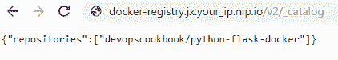

4.  在升级到环境阶段，将执行 Helm 构建。图表被推送到本地`chartmuseum`存储库后，您可以在存储库中找到 Helm 图表:

```
$ helm search python-flask-docker
NAME CHART VERSION APP VERSION DESCRIPTION
jenkins-x-chartmuseum/python-flask-docker 0.0.1 0.0.1 A Helm chart for Kubernetes
```

5.  最后，登台管道从主分支运行，并将我们的 pod 从 Helm 存储库部署到`jx-staging`命名空间中。在此步骤之后，登台和应用程序管道都将完成。

# 在 GitLab 中创建配置项/光盘管道

GitLab 是一个完整的 DevOps 工具链，在单个应用程序平台中交付。GitLab 提供了管理、规划、创建、验证、打包、发布、配置、监控和保护应用程序所需的所有必要工具。

在本节中，我们将重点介绍 GitLab 的 CI/CD 管道功能，这些功能可以作为 SaaS 或自托管服务使用。我们将导入一个应用程序，并在 GitLab 中创建一个管道。您将学习如何使用自动开发工具创建配置项/光盘管道，并将应用程序从暂存升级到生产。

# 准备好

在下面的食谱中，您将学习如何使用自动开发工具创建管道。这个方法需要 gitrab(自我管理或 SaaS)和一个你喜欢的云供应商的账户，你在那里用 gitrab 安装了你的 Kubernetes 集群。

The Community Edition of GitLab includes the Auto Build, Auto Test, Auto Review Apps, Auto Deploy, and Auto Monitoring features. In addition to these features, the subscription-based SaaS version of GitLab also provides Auto Code Quality, Auto **Static Application Security Testing** (**SAST**), Auto Dependency Scanning, Auto License Compliance, Auto Container Scanning, Auto **Dynamic Application Security Testing** (**DAST**), and Auto Browser Performance Testing functionalities, depending on your subscription plan.

确保您已经遵循了*部署和管理 GitLab* 配方生命周期中[第 2 章](02.html) *【在 Kubernetes* 上操作应用程序】中的说明，并部署了一个自主托管的 GitLab。

If you prefer, you can also use the SaaS offering hosted by GitLab. In that case, visit the GitLab website at [https://about.gitlab.com/free-trial/](https://about.gitlab.com/free-trial/) and sign in to your account.

GitLab Auto DevOps 支持 GKE 在任何公共或私有云上创建新的 Kubernetes 集群以及现有集群。

# 怎么做…

本节进一步分为以下几个小节，以简化这一过程:

*   使用模板创建项目
*   从 GitHub 导入现有项目
*   启用自动开发
*   启用 Kubernetes 集群集成
*   使用自动开发工具创建管道
*   逐步向生产环境推出应用程序

# 使用模板创建项目

GitLab 上的大部分动作都是在项目上完成的。当你第一次开始一个项目时，你有几个选择。您可以使用其中一个项目模板创建项目、导入现有项目或启动空白项目。在本食谱中，您将通过执行以下步骤来学习如何使用项目模板创建项目:

1.  使用非根用户帐户登录 GitLab。
2.  单击欢迎来到 GitLab 屏幕上的创建项目按钮:

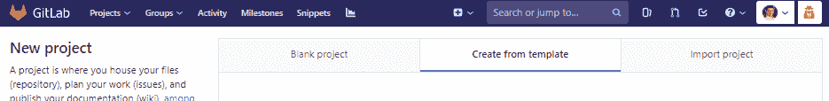

3.  选择“从模板创建”选项卡，并通过单击“使用模板”按钮选择一个列出的代码模板。对于本例，我们将使用以下 Pages/GitBook 模板:

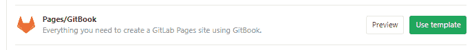

4.  GitLab 项目可以是私有的、内部的或公共的。此项目访问级别由项目中的可见性字段决定。为新项目命名，并将可见性级别设置为“公共”:

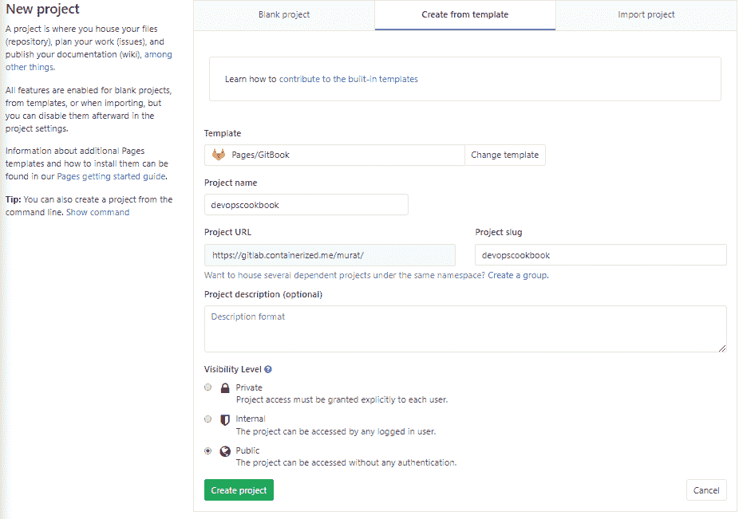

5.  单击“创建项目”按钮。

现在，您将看到模板项目已经成功导入。

# 从 GitHub 导入现有项目

并非总是可以从干净的项目模板开始。通常，您需要为现有项目创建一个管道。让我们执行以下步骤，将一些现有的项目源代码添加到 GitLab 环境中:

1.  使用非根用户帐户登录 GitLab。
2.  如果您还没有项目，请在“欢迎来到 GitLab”屏幕上单击“创建项目”按钮。如果您以前创建过项目，请单击以下视图右上角的“新建项目”按钮:

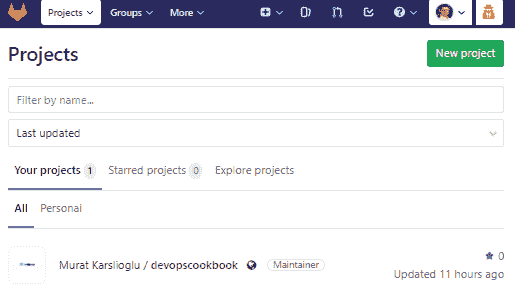

3.  GitLab 可以从各种 Git 存储库中导入项目，包括 GitHub、Bitbucket、Google Code、Fogbugz、Gitea 和 GitLab 本身。在这里，选择导入项目选项卡，然后选择 GitHub:

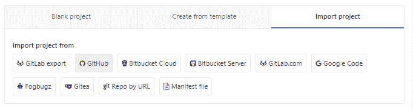

4.  在新窗口打开[https://github.com/settings/tokens](https://github.com/settings/tokens)，进入你的 GitHub 账号。
5.  点击在您的 GitHub 帐户上生成新令牌。
6.  为了让 GitLab 能够访问您的 GitHub 帐户，需要创建一个访问令牌。在“新建个人访问令牌”页面上，选择回购范围，然后单击“生成令牌”按钮。此页面显示您可以使用令牌分配的权限:

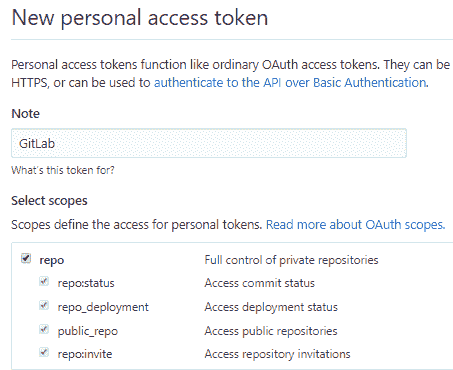

7.  复制在 GitHub 上创建的新个人访问令牌，将其粘贴到 GitHub 中，然后单击列出您的 GitHub 存储库按钮:

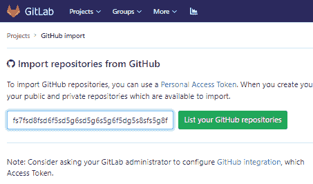

8.  GitLab 将访问和发现您的 GitHub 存储库中的项目。导入您要用于此配方的存储库。在这个例子中，我们将使用来自[https://github.com/k8sdevopscookbook/auto-devops-example](https://github.com/k8sdevopscookbook/auto-devops-example)仓库的项目。这就是本书中所有例子的位置:

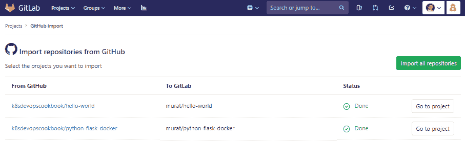

导入完成后，状态将显示完成。最后，点击“转到项目”按钮，在 GitLab 中查看您的项目。

# 启用自动开发

GitLab 的 Auto DevOps 功能提供了预定义的 CI/CD 配置，可以自动检测、构建、测试、部署和监控您的应用程序。让我们执行以下步骤，为您现有的项目启用自动开发选项:

1.  使用您的项目用户帐户登录。
2.  在“欢迎来到 GitLab”屏幕上，您将看到帮助您入门的链接。在这里，单击“配置 GitLab”按钮访问配置选项:

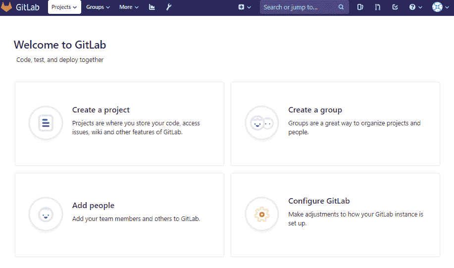

3.  只有具有维护者和管理员权限的项目用户才能访问项目设置。从屏幕左侧的管理区域菜单中，选择设置|配置项/光盘菜单以访问配置项/光盘选项。以下屏幕截图显示了配置项/光盘设置的位置:

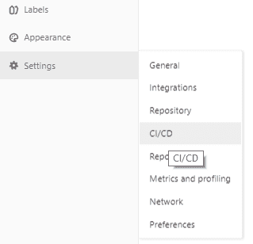

4.  在下面的“持续集成和部署”页面下，确保选中了“所有项目默认为自动开发”复选框。或者，如果您想使用自动审查应用程序和自动部署功能，请输入您的基本域:

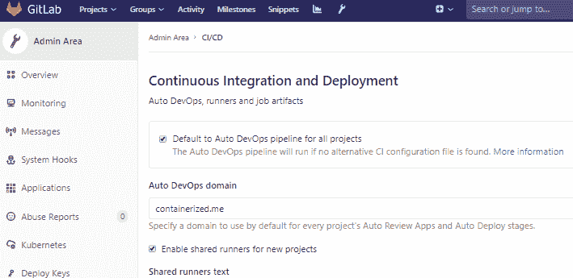

5.  单击保存更改按钮。

# 启用 Kubernetes 集群集成

GitLab 以多种方式与 Kubernetes 合作或在 Kubernetes 内部合作。让我们执行以下步骤并添加 Kubernetes 自动化，这样我们就可以跨多个项目共享集群:

1.  以 root 用户身份登录。
2.  在“您的项目”页面下选择一个项目。
3.  在项目的详细信息页面中，单击添加库本内斯集群按钮:

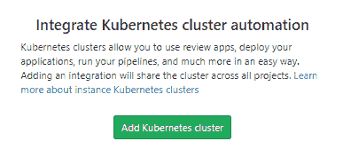

4.  您可以在 GKE 创建新群集，也可以添加现有群集。假设您已经按照[第 1 章](01.html) *中的方法创建了一个集群，构建生产就绪的库本内斯集群*，我们将添加一个现有集群。在以下屏幕截图所示的视图中，选择添加现有集群选项卡:

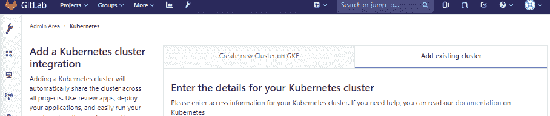

5.  输入 Kubernetes 群集名称。在我们的例子中，这是`AWSCluster`。

6.  在命令行中，您的`kubectl`实例已经被配置，以便您可以访问您现有的 Kubernetes 集群，使用以下命令获取应用编程接口网址:

```
$ kubectl cluster-info | grep 'Kubernetes master' | awk '/http/ {print $NF}'
```

7.  为了让 GitLab 能够使用 API 访问您的集群，需要一个身份验证令牌。库本内斯将`default-token`存储为秘密。要找到该令牌，请使用以下命令列出集群上的机密:

```
$ kubectl get secrets | grep default-token
default-token-75958 kubernetes.io/service-account-token 3 4d12h
```

8.  使用前面命令返回的令牌名称并获取证书颁发机构证书:

```
$ kubectl get secret <secret name> -o jsonpath="{['data']['ca\.crt']}" | base64 --decode
-----BEGIN CERTIFICATE-----
MID...h5x
-----END CERTIFICATE-----
```

9.  在集群上创建一个名为`ServiceAccount`的 GitLab 管理员:

```
cat <<EOF | kubectl apply -f -
apiVersion: v1
kind: ServiceAccount
metadata:
 name: gitlab-admin
 namespace: kube-system
EOF
```

10.  在集群上创建一个名为`ClusterRoleBinding`的 GitLab 管理员:

```
cat <<EOF | kubectl apply -f -
apiVersion: rbac.authorization.k8s.io/v1beta1
kind: ClusterRoleBinding
metadata:
 name: gitlab-admin
roleRef:
 apiGroup: rbac.authorization.k8s.io
 kind: ClusterRole
 name: cluster-admin
subjects:
- kind: ServiceAccount
 name: gitlab-admin
 namespace: kube-system
EOF
```

11.  获取服务帐户令牌。以下命令将在令牌部分返回您的令牌:

```
$ kubectl -n kube-system describe secret $(kubectl -n kube-system get secret | grep gitlab-admin | awk '{print $1}')

Name: gitlab-admin-token-xkvss
...
Data
====
ca.crt: 1119 bytes
namespace: 11 bytes
token: 
<your_token_here>
```

12.  从*步骤 11* 的输出中复制令牌信息后，单击同一窗口上的添加库本内斯集群按钮。您应该会看到类似于以下视图的内容，这是我们将集群添加到 GitLab 的地方:

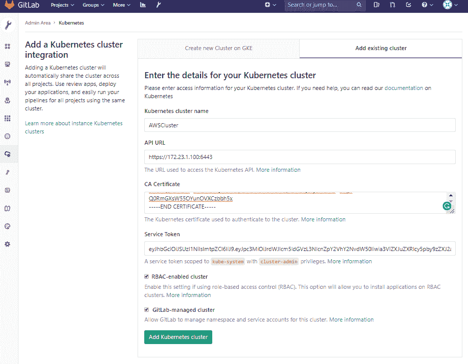

13.  接下来，输入您的基本域名。在我们的示例中，我们使用`k8s.containerized.me`子域作为我们的托管区域，该子域是我们在 [第 1 章](01.html)*中创建的，用于构建生产就绪的 Kubernetes 集群*，在*中，我们在亚马逊 EC2* 配方上提供了一个 Kubernetes 集群。
14.  点击舵柄旁边的安装按钮。此选项会将 Helm 服务器部署到您的集群中:

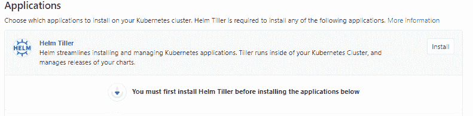

15.  安装 Helm 后，单击这些选项旁边的安装按钮，安装入口、证书管理器、普罗米修斯和 GitLab Runner。
16.  所有 GitLab 管理的应用程序都安装在`gitlab-managed-apps`命名空间下。验证它们在您的 Kubernetes 集群上处于`Running`状态。您应该会看到一个类似于以下内容的面板列表:

```
$ kubectl get pods -n gitlab-managed-apps
NAME                                                   READY STATUS  RESTARTS AGE
certmanager-cert-manager-574b6d6cdd-s87kn              1/1   Running 0        3m39s
ingress-nginx-ingress-controller-7d44688bf-8x7ld       1/1   Running 0        4m39s
ingress-nginx-ingress-default-backend-66645696bf-sz545 1/1   Running 0        4m39s
prometheus-kube-state-metrics-744949b679-2rwnh         1/1   Running 0        2m8s
prometheus-prometheus-server-646888949c-j4wn7          2/2   Running 0        2m8s
runner-gitlab-runner-84fc959dcf-4wxfc                  1/1   Running 0        56s
tiller-deploy-5d76d4796c-fdtxz                         1/1   Running 0        7m13s
```

# 使用自动开发工具创建管道

一旦启用，自动开发软件简化了软件开发生命周期的设置和执行。让我们执行以下步骤来利用 Auto DevOps 并创建我们的第一个自动化管道:

1.  如果您有多个项目，您需要选择要运行管道的目标项目。首先，在“您的项目”页面中选择您的项目。
2.  单击配置项/光盘菜单下的管道。此选项将带您进入可以查看现有管道的页面。在此页面上，单击运行管道按钮。此选项将帮助我们手动运行管道:

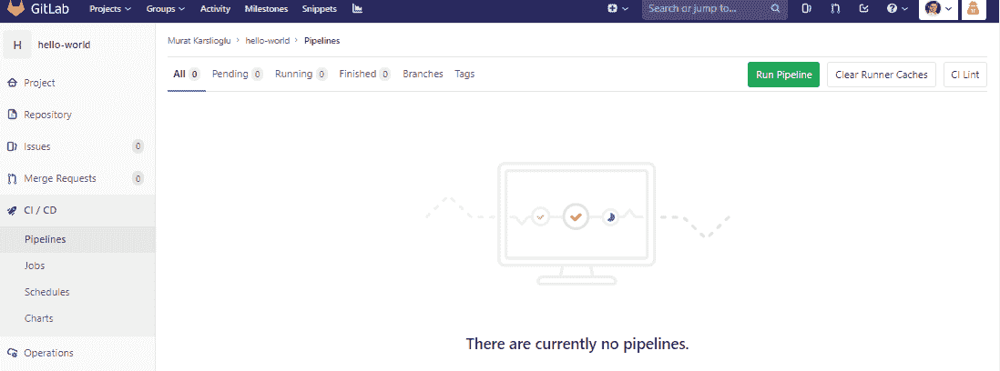

3.  在这里，您可以选择在不同的分支上运行管道。对于本例，选择要运行管道的主分支。在下面的截图中，您可以看到管道阶段正在完成:

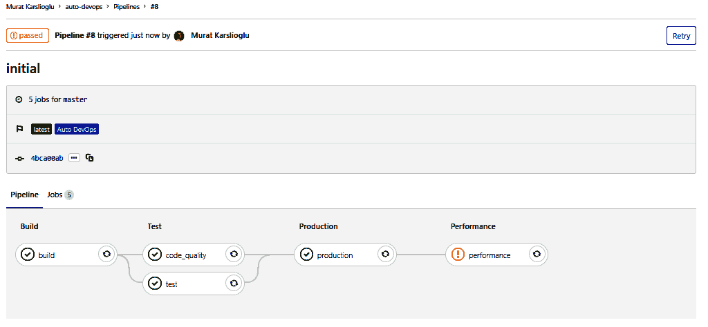

当管道完成时，您将看到执行的每个作业的结果，您的应用程序应该可以在`http://application_name.your_domain.com`访问。在我们这里，这个地址是`http://murat-auto-devops.k8s.containerized.me`。

# 逐步向生产环境推出应用程序

默认情况下，自动开发软件使用生产连续部署策略。如果要更改该设置以执行增量展开，请执行以下步骤:

1.  在“您的项目”页面中选择您的项目。
2.  单击设置菜单中的配置项/光盘。
3.  单击展开按钮，展开自动展开部分。

4.  将部署策略更改为自动部署到转移，手动部署到生产，然后单击保存更改按钮。您还将看到其他自动开发选项:

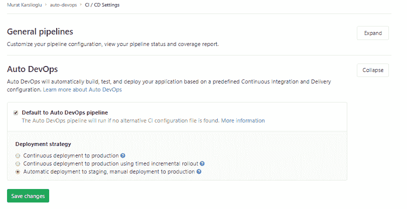

5.  单击配置项/光盘菜单下的管道。单击运行管道按钮手动运行管道。
6.  转移作业完成后，管道将暂停。您将看到已经执行的每个作业的结果，并且您的应用程序应该可以在`http://application-name-staging.your_domain.com`访问。在我们这里，这个地址是`http://murat-auto-devops-staging.k8s.containerized.me`
7.  现在，单击操作菜单中的环境。

8.  一旦您的应用程序处于试运行环境中，您就可以逐步将其投入生产。为了能够在分段环境中做到这一点，请单击“部署到”按钮(看起来像播放按钮的按钮)，并选择要展开到的百分比，如下图所示。在下拉菜单中，您将看到 10%、25%、50%和 100%的选项:

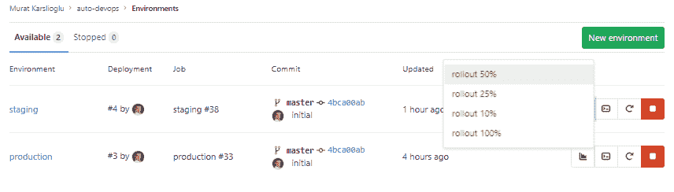

# 它是如何工作的...

前面的食谱*使用自动开发工具*创建管道，向您展示了如何利用自动开发工具的功能来简化管道的创建。

在*步骤 2* 中，运行管道后，当在项目中没有找到`.gitlab-ci.yml`文件时，GitLab Auto DevOps 为您节省了手动创建阶段和作业的时间和精力。这个文件是由 GitLab 创建的，为所有没有配置项的项目提供配置项/光盘配置。

If you like to use the `.gitlab-ci.yaml` file instead, disable Auto DevOps and use the Set up CI/CD button on your project to create your GitLab CI/CD YAML file from a template. Follow the link regarding the *Creating a simple* *.gitlab-ci.yaml* *file* instructions in the *See also* section to learn more about creating the YAML file.

在*第 3 步*中，Auto DevOps 使用 Herokuish Buildpacks，这是一个在容器中模拟 Heroku 构建和运行时任务的工具。通过使用 Herokuish，GitLab 检测到您的项目所用的语言，并自动创建管道。

# 还有更多...

您还将从了解以下内容中受益:

*   GitLab Web IDE
*   监控环境

# GitLab Web IDE

GitLab 不仅仅是一个 CI/CD 解决方案，它还有许多其他功能，并为您提供了一个类似于 GitHub 的私有代码存储库。您可以使用 GitLab 网络集成开发环境来编辑和提交您的更改，并将它们推向生产。要编辑代码而不将其克隆到您自己的计算机上，请执行以下步骤:

1.  在“您的项目”页面上选择您的项目。
2.  单击网络集成开发环境按钮。
3.  从存储库中选择一个文件进行编辑。
4.  编辑文件，一旦完成，点击提交...按钮，如下图所示:

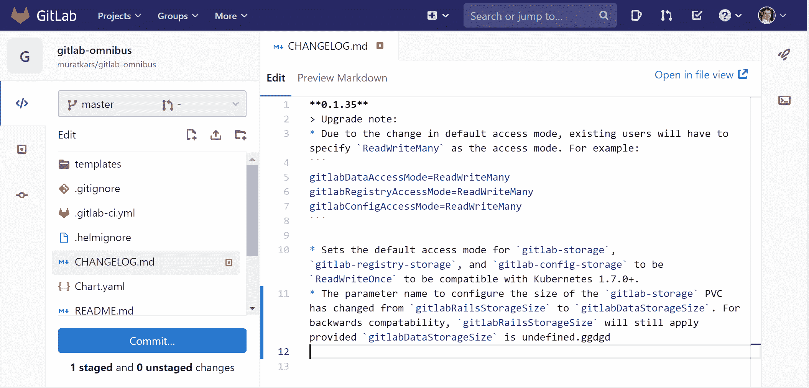

5.  创建一条提交消息，然后单击阶段和提交按钮，如下图所示:

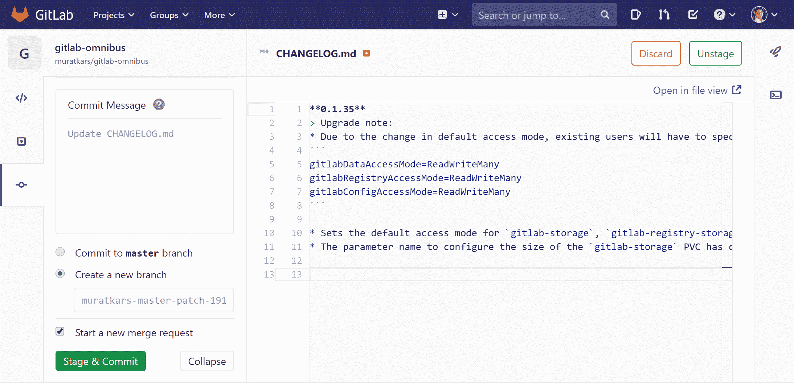

您的提交将触发一个新的管道。因此，GitLab 将构建、测试和准备您的变更。

# 监控环境

使用 GitLab，您可以监控 Kubernetes 集群资源使用情况和应用程序响应指标。如果您尚未在 Kubernetes 集群上启用 Prometheus，请按照*启用 Kubernetes 集群集成*配方中的说明进行操作，然后执行以下步骤:

1.  在“您的项目”页面上选择您的项目。
2.  单击操作菜单中的指标。

3.  从下拉菜单中选择生产环境。在下拉菜单中，您将拥有生产和暂存环境:

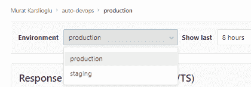

4.  GitLab 将显示一个类似于下面的页面，其中包含您的应用程序性能数据和 Kubernetes 资源利用率指标的最后 8 个小时。在此视图中，您将能够看到应用程序的历史平均值以及总 CPU 和内存利用率:

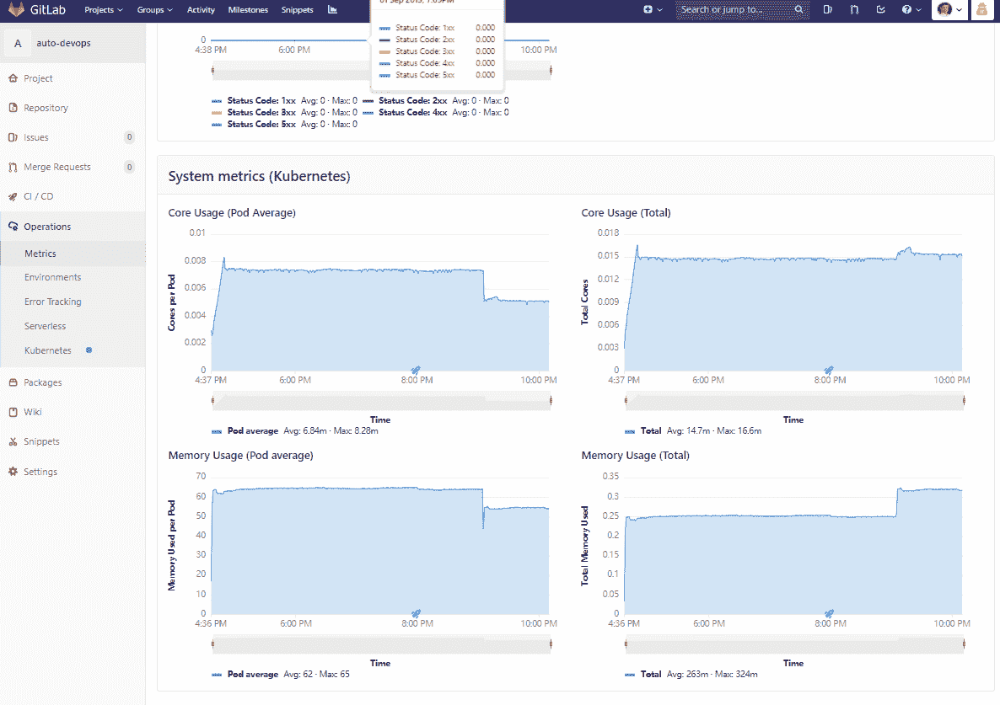

现在，您知道如何在 GitLab 上创建项目，并使用 Auto DevOps 功能来自动创建 CI/CD 管道。

# 请参见

*   如果你想了解更多关于 GitLab 的信息，Adam O'Grady 的《快速入门指南》是一个很好的资源:[https://www . packtpub . com/virtual-and-cloud/git lab-快速入门指南](https://www.packtpub.com/virtualization-and-cloud/gitlab-quick-start-guide)
*   GitLab 训练轨迹:[https://about.gitlab.com/training/](https://about.gitlab.com/training/)
*   GitLab Git 小抄:[https://about.gitlab.cimg/press/git-cheat-sheet.pdf](https://about.gitlab.cimg/press/git-cheat-sheet.pdf)
*   学习 git lab:[https://www . packtpub . com/application-development/learning-git lab-video](https://www.packtpub.com/application-development/learning-gitlab-video)
*   用 GitLab CI 进行手动自动开发
*   创建一个简单的`.gitlab-ci.yaml`文件:[https://docs . git lab . com/ee/ci/quick _ start/#创建一个简单的 git lab-ciyml-文件](https://docs.gitlab.com/ee/ci/quick_start/#creating-a-simple-gitlab-ciyml-file)

# 在 CircleCI 中创建配置项/光盘管道

在本节中，我们将介绍使用 CircleCI 部署和管理 Kubernetes 服务的初始配置和要求。您将学习如何创建管道，以便构建容器映像并将它们存储在容器注册表中。

# 准备好

这个食谱需要一个活跃的 GitHub 帐户和一个要建立的项目。我们将使用 AWS EKS 来演示 CircleCI 的 CI。

首先，访问我们演示应用程序项目的以下 GitHub 页面，并将您的副本转移到您的 GitHub 帐户:

```
$ git clone https://github.com/k8sdevopscookbook/circleci-demo-aws-eks.git
```

将`k8sdevopscookbook/circleci-demo-aws-eks`存储库克隆到您的工作站，以便在[https://github.com/k8sdevopscookbook/circleci-demo-aws-eks](https://github.com/k8sdevopscookbook/circleci-demo-aws-eks)使用`circleci-demo-aws-eks`示例。

# 怎么做...

本节进一步分为以下几个小节，以简化这一过程:

*   CircleCI 入门
*   将更改部署到亚马逊 EKS 的 Kubernetes 集群

# CircleCI 入门

Circle CI 是一个连续的集成平台，可以在干净的容器或虚拟机中自动运行您的构建，允许存储在您的存储库中的代码在每次提交时都被直接测试。CircleCI 可以作为 SaaS 解决方案在云中使用，也可以作为自托管解决方案安装在您的环境中。让我们执行以下步骤来开始使用云版本的 CircleCI:

1.  前往[https://circleci.com/signup/](https://circleci.com/signup/)，使用您的 GitHub 账户注册 CircleCI。
2.  注册后，单击仪表板视图左侧的添加项目按钮:


3.  从左上角的下拉菜单中，选择您想要构建项目的 GitHub 帐户。

# 将更改部署到 EKS 的 Kubernetes 集群

在这个食谱中，我们将使用亚马逊 EKS。让我们执行以下步骤来开始:

1.  专门为 CircleCI 创建一个新的 AWS IAM 用户，并记下新用户的访问密钥 ID 和秘密访问密钥。
2.  在 AWS 弹性容器注册中心 ECR 上创建一个名为`eks_orb_demo_app`的存储库。记下你的电子病历网址。看起来应该和`1234567890.dkr.ecr.us-east-2.amazonaws.com`差不多。
3.  确保您已登录到圆形配置项。点击“添加项目”按钮，搜索`demo-aws`关键字，然后点击其旁边的“设置项目”按钮:

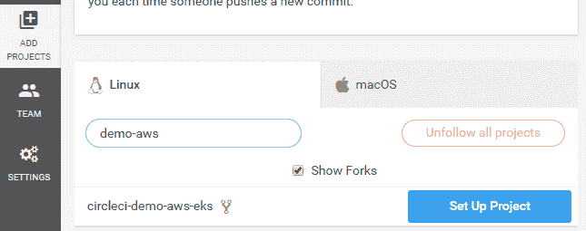

4.  点击构建。构建将会失败，因为它缺少访问您的 AWS 帐户的环境变量。

5.  单击项目设置。转至“构建设置”下的“环境变量”页面。通过单击添加变量按钮创建以下四个变量:

```
AWS_DEFAULT_REGION = us-east-2
AWS_ACCESS_KEY_ID = [Enter your Access key ID here]
AWS_SECRET_ACCESS_KEY = [Enter your Secret Access Key here]
AWS_ECR_URL = [Enter your ECR URL here] 
```

这个的输出可以在下面的截图中看到:

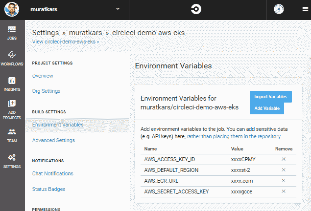

6.  设置环境变量将允许您的管道访问 AWS 资源。定义云变量后，单击构建按钮开始构建。
7.  如果您的 AWS 用户没有所需的权限，生成可能会失败；否则，应在 35-40 分钟内成功完成。

# 它是如何工作的...

本食谱向您展示了如何使用运行在 Kubernetes 集群上的演示应用程序快速创建 CI/CD 管道。

在*的**步骤 2* 中，将更改部署到 EKS* 食谱上的 Kubernetes 集群，我们在 AWS ECR 上创建了一个存储库来推送我们由 CircleCI 构建的容器映像。成功构建后，图像将被保存并可通过私有注册表位置访问。*

 *在*步骤 6* 中，当我们运行管道时，CircleCI 将依次执行六个作业。第一个作业(`build-and-push-image`)将调出一个虚拟机，检查我们的代码，安装任何先决条件，并从代码构建映像。第二个作业(`aws-eks/create-cluster`)将使用云信息堆栈创建一个 EKS 集群，并验证该集群。第三项工作(`deploy-application`)将推出该应用程序。第四个作业(`test-application`)将使用`kubectl get service demoapp`命令获取服务的外部 IP，并连接到服务以验证返回。该服务将返回类似于以下内容的页面:

```
Hello World! (Version info: 63d25fd14ef8dfb1c718cf81a815b36d80138d19, build date: 20190820224253)
```

最后，第五个(`undeploy-application`)和第六个(`aws-eks/delete-cluster`)作业将分别删除应用程序并再次使用云信息来销毁 EKS 群集。

至此，您已经学习了如何使用部署在 CircleCI 上的预定义容器环境轻松构建应用程序。

# 请参见

*   圈出 CI 文档:[https://circleci.com/docs/](https://circleci.com/docs/)
*   圈 CI 你好世界示例:[https://circleci.com/docs/2.0/hello-world/](https://circleci.com/docs/2.0/hello-world/)
*   Circle CI AWS EKS 演示应用程序:https://github . com/k8 sdevopscookbook/CIRC-demo-AWS-eks
*   Circle CI GCP 演示应用程序:[https://github . com/k8sdevopskokbook/circle CI-demo-k8s-GCP-hello-app](https://github.com/k8sdevopscookbook/circleci-demo-k8s-gcp-hello-app)

# 使用 GitHub 操作设置配置项/光盘管道

GitHub Actions 使您能够直接在 GitHub 存储库中创建自定义软件开发工作流。如果您已经在使用 GitHub 作为您的代码存储库，内置的 CI/CD 功能使这个选项非常引人注目。

在本节中，我们将介绍 GitHub Actions 工作流配置和内置的 CI/CD 功能。您将学习如何管理工作流和创建新的 GitHub 操作。

# 准备好

在下面的方法中，您将学习如何通过添加 Dockerfile 在您拥有的存储库中创建一个基本操作示例。这个食谱需要一个活跃的 GitHub 帐户和一个要建立的项目。我们将使用 AWS EKS 来演示 GitHub 的 CI。

# 怎么做...

本节进一步分为以下几个小节，以简化这一过程:

*   创建工作流文件
*   创建基本的 Docker 构建工作流
*   构建图像并发布到 Docker 注册表
*   添加工作流状态标记

# 创建工作流文件

GitHub 流是 GitHub 最近推出的一个轻量级分支。让我们执行以下步骤来创建我们的第一个工作流:

1.  在[https://github.com/](https://github.com/)登录您的 GitHub 帐户。
2.  选择一个您拥有维护者访问权限的存储库。在我们的例子中，我们使用的是`k8sdevopscookbook/python-flask-docker`项目的分叉。

3.  在`.github/workflows`目录下创建一个`ci.yml`文件，内容如下:

```
name: My Application
on:
 pull_request:
 branches:
 - master
jobs:
 build:
 runs-on: ubuntu-16.04
 steps:
 - uses: actions/checkout@v1
 - name: Set up Python 3.7
 uses: actions/setup-python@v1
 with:
 python-version: 3.7
```

4.  添加以下行来安装任何依赖项:

```
 - name: Install dependencies
 run: |
 python -m pip install --upgrade pip
 pip install -r requirements.txt 
```

5.  当使用计算机编程语言时，lint 工具用于对源代码进行静态分析，以检查语义差异。在我们的示例中，我们将使用以下命令使用`flake8`来清理 Python 代码:

```
 - name: Lint with flake8
 run: |
 pip install flake8
 # stop the build if there are Python syntax errors or undefined names
 flake8 . --count --select=E9,F63,F7,F82 --show-source --statistics
 # exit-zero treats all errors as warnings. The GitHub editor is 127 chars wide
 flake8 . --count --exit-zero --max-complexity=10 --max-line-length=127 --statistics
```

6.  如果您有单元测试，请添加以下几行来使用`pytest`测试您的应用程序，这是一个在 Python 编程中用来编写小测试的框架:

```
- name: Test with pytest
 run: |
 pip install pytest
 pytest
```

7.  配置完成后，向您的存储库发送一个请求来触发管道:

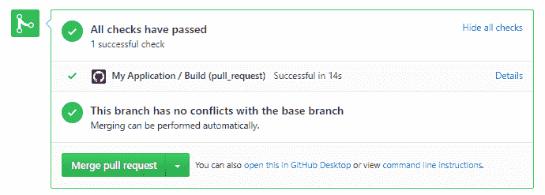

管道完成后，您将能够在您的**拉动请求** ( **PR** )上看到绿色勾号。在前面的截图中，您可以看到所有的检查都通过了，并且拉取请求成功了。

# 创建基本的 Docker 构建工作流

让我们执行以下步骤，直接从我们的 GitHub 存储库中自动构建 Docker 映像:

1.  登录您的 GitHub 帐户。
2.  选择一个您拥有维护者访问权限的存储库。在我们的例子中，我们使用的是`k8sdevopscookbook/python-flask-docker`项目的分叉。
3.  单击操作选项卡。
4.  从这里，单击添加新工作流。
5.  在`.github/workflows`目录下创建一个`dockerimage.yml`文件，内容如下:

```
name: Docker Image CI
on: [push]
jobs:
 build: 
 runs-on: ubuntu-latest 
 steps:
 - uses: actions/checkout@v1
 - name: Build the Docker image
 run: docker build . --file Dockerfile --tag my-image-name:$(date +%s)
```

每次将新代码推送到存储库时，工作流都会创建一个新的 Docker 映像。

# 构建图像并发布到 Docker 注册表

您可以使用一个操作一次性完成所有操作，而不是创建多个操作来构建、标记、登录和推送至 Docker Repository。让我们执行以下步骤:

1.  登录您的 GitHub 帐户。
2.  选择一个您拥有维护者访问权限的存储库。在我们的例子中，我们使用的是`k8sdevopscookbook/python-flask-docker`项目的分叉。
3.  单击操作选项卡。
4.  从这里，单击添加新工作流。
5.  在`.github/workflows`目录下创建一个`dockerpush.yml`文件，内容如下。请务必更改`MyDockerRepo/repository`，使其使用您想要推送的图像的名称:

```
name: Build and Push to DockerHub
on: [push]
jobs:
 build:
    runs-on: ubuntu-latest
    steps:
    - uses: actions/checkout@master
    - name: Publish to Registry
      uses: elgohr/Publish-Docker-Github-Action@master
      with:
        name: MyDockerRepo/repository
        username: ${{ secrets.DOCKER_USERNAME }}
        password: ${{ secrets.DOCKER_PASSWORD }} 
```

6.  单击“设置”选项卡，然后转到“机密”菜单。
7.  创建一个`DOCKER_USERNAME`秘密，其值等于您用来登录到 Docker 注册表的用户名。
8.  创建`DOCKER_PASSWORD`秘密，其值等于您用来登录 Docker 注册表的密码。创建两个机密后，您应该能够在“机密”菜单中看到它们，如下图所示:

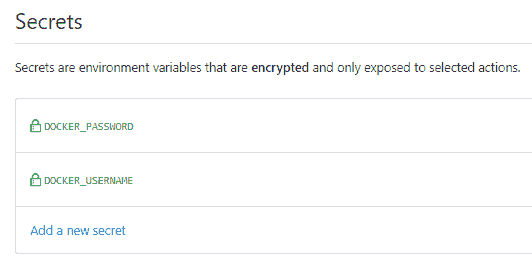

存储为机密的环境变量将被加密，并且仅可用于选定的操作。

# 添加工作流状态标记

GitHub 上许多优秀的源代码存储库在其主页上使用徽章来显示已经在存储库上完成的各种测试的状态。同样，在这个配方中，我们将向我们的存储库添加一个操作状态摘要，以告知我们的访问者和用户当前的工作流状态:

1.  登录到您的 GitHub 帐户，并选择一个您拥有维护者访问权限的存储库。在我们的例子中，我们使用的是`k8sdevopscookbook/python-flask-docker`项目的分叉。
2.  在您的存储库的顶部目录中编辑`README.md`文件。
3.  按照`https://github.com/{owner}/{repo}/workflows/{workflow_name}/badge.svg`格式添加徽章链接，如下例所示:

```
[
```

# 请参见

*   与码头工人互动的 GitHub 动作:[https://github.com/docker-actions](https://github.com/docker-actions)
*   自动气象站的 GitHub 行动:[https://github.com/aws-actions](https://github.com/aws-actions)
*   天蓝色的 GitHub 行动:[https://github.com/Azure/k8s-actions](https://github.com/Azure/k8s-actions)
*   GitHub 行动:[https://github.com/GoogleCloudPlatform/github-actions](https://github.com/GoogleCloudPlatform/github-actions)

# 在亚马逊网络服务上建立竞争情报/光盘管道

在本节中，我们将介绍 AWS 上的 CI/CD 管道构建工作流和内置的 CI/CD 功能。您将学习如何管理管道，如何在管道步骤中运行构建命令，以及如何在亚马逊**弹性容器注册表** ( **ECR** 上存储构建结果图像。

# 准备好

在下面的食谱中，您将学习如何构建、测试和部署基于 AWS 服务的示例服务。这里提到的所有操作都需要一个 AWS 帐户和一个拥有使用相关服务权限的策略的 AWS 用户，分配了 CodeCommit 的 HTTPS Git 凭据，以及一个使用 AWS EKS 部署的 Kubernetes 集群。如果没有，去[https://aws.amazon.com/account/](https://aws.amazon.com/account/)创建一个。

# 怎么做...

本节进一步分为以下几个小节，以简化这一过程:

*   创建 AWS 代码提交代码存储库
*   使用 AWS 代码构建构建项目
*   创建 AWS 代码部署部署
*   使用 AWS 代码管道创建管道

# 创建 AWS 代码提交代码存储库

AWS CodeCommit 服务是一个托管源代码控制服务，在 AWS 平台上托管安全的基于 Git 的存储库。在本食谱中，我们将学习如何在 CodeCommit 上创建我们的第一个存储库:

1.  登录您的 AWS 账户，在[https://us-west-2.console.aws.amazon.com/codesuite](https://us-west-2.console.aws.amazon.com/codesuite)开通 AWS 开发者工具。
2.  从“开发人员工具”菜单中，展开“源”菜单，然后单击“存储库”。您可以在下面的截图中看到完整的菜单内容:

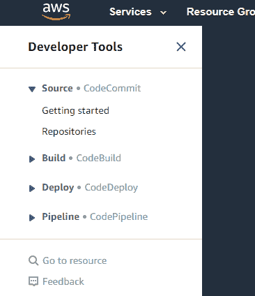

3.  在“存储库”页面上，单击“创建存储库”按钮，在代码提交时启动代码存储库。

4.  输入存储库名称，然后单击创建按钮。在本例中，存储库名称为`k8sdevopscookbook`:

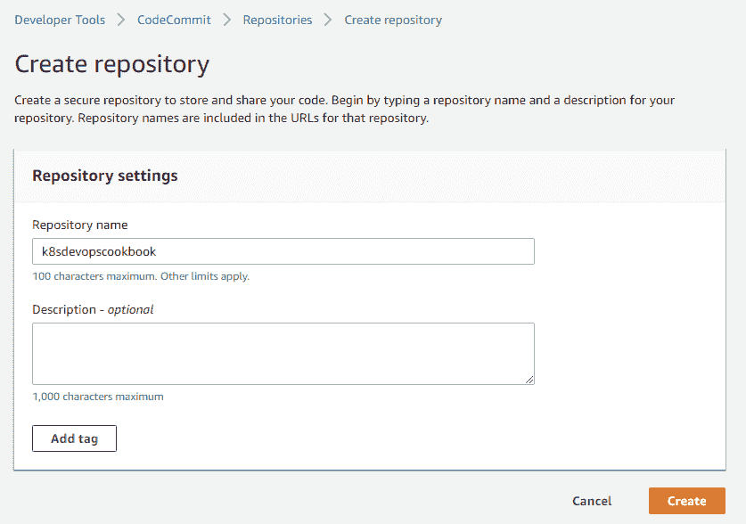

5.  从 AWS 管理控制台，转到 IAM 服务。
6.  从现有用户列表中，选择您想要使用的 IAM 用户。
7.  在“用户摘要”页面上，单击“安全凭据”选项卡。以下屏幕截图显示了选项卡的位置:

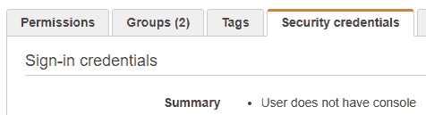

8.  在 AWS 代码提交的 HTTPS Git 凭据下，单击生成按钮。这将创建一个用户名和密码，我们将在以后用于身份验证:

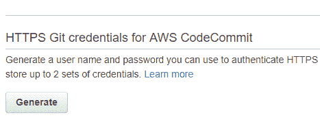

9.  在 Git 凭据生成窗口中，单击下载凭据按钮记录您的代码提交凭据。下面的截图显示了为我创建的用户名和密码。这是您查看或复制凭据的唯一机会:

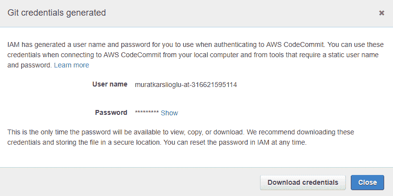

8.  从 AWS 管理控制台，转到代码提交服务。
9.  在克隆网址列下，选择 HTTPS。在这个食谱中，我们的示例存储库位于[https://git-code commit . us-west-2 . amazonaws . com/v1/repos/k8 sdevopskoobook](https://git-codecommit.us-west-2.amazonaws.com/v1/repos/k8sdevopscookbook)。

10.  在您的 Linux 工作站上，克隆空存储库:

```
$ git clone <your_new_repo>
```

11.  使用您的代码提交凭据克隆存储库。
12.  下载我们的示例应用程序并提取它:

```
$ wget https://github.com/k8sdevopscookbook/python-flask-docker/archive/master.zip && unzip master.zip
```

13.  现在，将示例应用程序复制到您的存储库克隆中:

```
$ cp -r python-flask-docker-master/. k8sdevopscookbook/.
$ cd k8sdevopscookbook
```

14.  准备好你所有的文件。以下命令将在项目目录中找到所有新的和更新的文件，并在将其推送到目标存储库之前将其添加到临时区域:

```
$ git add -A
```

15.  用消息提交文件。当与`-m`参数一起使用时，以下命令添加提交:

```
$ git commit -m "Add example application files"
```

16.  将文件从本地存储库文件夹推送到代码提交存储库:

```
$ git push
```

现在，您将能够查看代码提交存储库中的文件。

# 使用 AWS 代码构建构建项目

让我们执行以下步骤，从我们在前面的配方中创建的 CodeCommit 存储库中构建一个项目:

1.  登录您的 AWS 账户，在[https://us-west-2.console.aws.amazon.com/codesuite](https://us-west-2.console.aws.amazon.com/codesuite)开通 AWS 开发者工具。

2.  从“开发人员工具”菜单中，展开“生成”菜单，然后单击“生成项目”。下面的截图显示了菜单的位置:

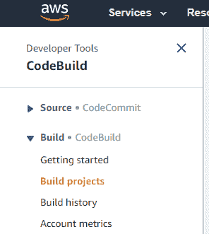

3.  在“生成项目”页面上，单击“创建生成项目”按钮。下面的屏幕截图显示了其他可用的菜单选项和“创建生成项目”按钮的位置:

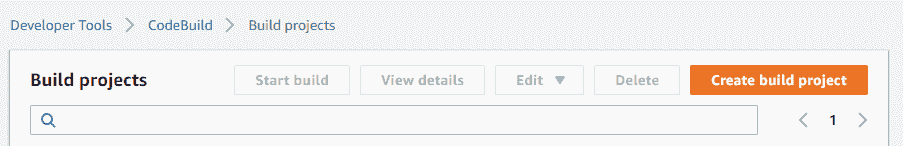

4.  输入项目名称。
5.  现在，我们将设置项目的主要来源。在源框中，选择 AWS 代码提交作为源提供程序。选择您在*创建 AWS 代码提交代码存储库*配方中创建的存储库。选择主分支。在我们的示例中，存储库的名称是`k8sdevopscookbook`:

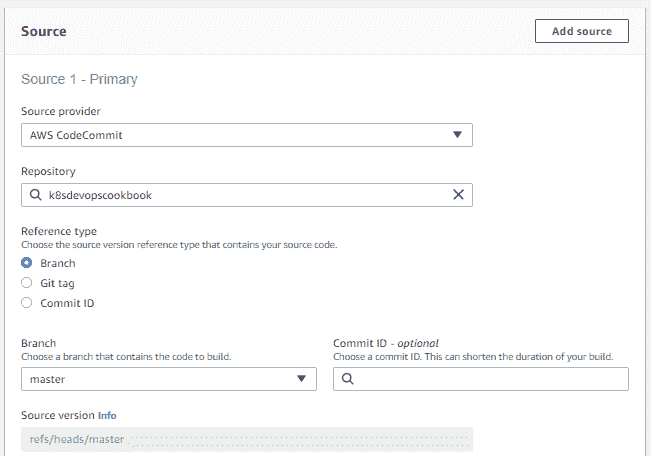

6.  在环境框中，选择托管映像和 Ubuntu 作为您的操作系统。
7.  选择新服务角色:

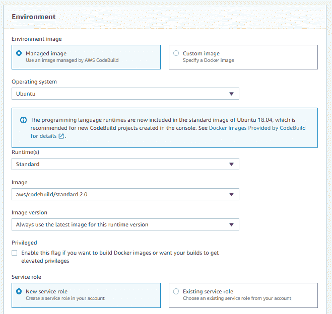

8.  展开附加配置设置。添加`AWS_DEFAULT_REGION`、`AWS_ACCOUNT_ID`、`IMAGE_TAG`、`IMAGE_REPO_NAME`环境变量，如下图截图所示:

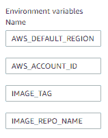

Never store environmental variables in a repository location. Always use environmental parameters to provide the values during the build process.

9.  在“构建规范”框中，选择“使用构建规范文件”。确保`buildspec.yaml`文件存在于代码库的根目录中。该文件应该如下所示:

```
version: 0.2
phases:
 install:
 runtime-versions:
 docker: 18
 pre_build:
 commands:
 - echo Logging in to Amazon ECR...
 - $(aws ecr get-login --no-include-email --region $AWS_DEFAULT_REGION)
 build:
 commands:
 - echo Build started on `date`
 - echo Building the Docker image...
 - docker build -t $IMAGE_REPO_NAME:$IMAGE_TAG .
...
```

10.  最后，点击创建构建项目。
11.  在**身份和访问管理** ( **IAM** )中找到您在*步骤 7* 中创建的服务角色，并将此声明添加到代码构建服务角色附带的策略中:

```
{
  "Version": "2012-10-17"
  "Statement": [     *### BEGIN ADDING STATEMENT HERE ###*     {       "Action": [
         "ecr:BatchCheckLayerAvailability",
         "ecr:CompleteLayerUpload",
         "ecr:GetAuthorizationToken",
         "ecr:InitiateLayerUpload",
         "ecr:PutImage",
         "ecr:UploadLayerPart"       ],
       "Resource": "*",
       "Effect": "Allow"
     },     *### END ADDING STATEMENT HERE ###*     ...   ],
 }
```

12.  现在项目已经准备好了，单击页面右上角的开始构建按钮。在下面的截图中，您可以在构建历史选项卡下查看它的状态。在我们的示例中，它显示构建成功:

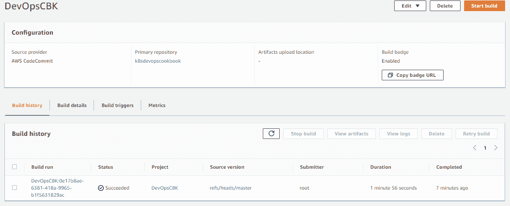

If your builds fail, make sure that the `AmazonEC2ContainerRegistryPowerUser` policy is assigned to your IAM role.

# 创建 AWS 代码部署部署

让我们执行以下步骤，从代码构建版本创建部署:

1.  登录您的自动气象站账户，在[https://us-west-2.console.aws.amazon.com/codesuite](https://us-west-2.console.aws.amazon.com/codesuite)打开自动气象站开发工具。
2.  从“开发人员工具”菜单中，展开“部署”菜单，然后单击“应用程序”。
3.  单击创建应用程序按钮:

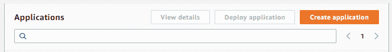

4.  输入应用程序名称。
5.  选择 AWS Lambda 作为计算平台。

# 使用 AWS 代码管道构建管道

最后，我们已经到了 AWS 开发工具的最后阶段。让我们执行以下步骤，使用 AWS 代码管道服务构建管道:

1.  登录您的自动气象站账户，在[https://us-west-2.console.aws.amazon.com/codesuite](https://us-west-2.console.aws.amazon.com/codesuite)打开自动气象站开发工具。

2.  从“开发人员工具”菜单中，展开“管道”菜单，然后单击“管道”。
3.  输入管道名称。
4.  选择新建服务角色，然后单击下一步。

5.  现在，我们将设置管道的主要来源。选择 AWS 代码提交作为源提供程序。选择您在*创建 AWS 代码提交代码存储库*配方中创建的存储库。单击“下一步”按钮确认这些更改。下面的截图显示，在我们的例子中，来源是`k8sdevopscookbook`:

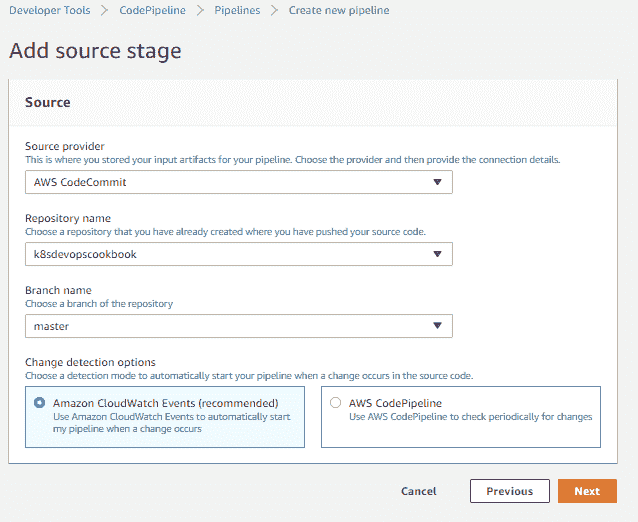

6.  选择 AWS 代码构建作为构建提供程序。选择您在*中创建的项目名称，使用 AWS 代码构建*配方构建项目(或创建新项目)。单击下一步确认这些更改。下面的截图显示，在我们的例子中，区域是`US West`，项目名是 DevOpsCookbookExample:

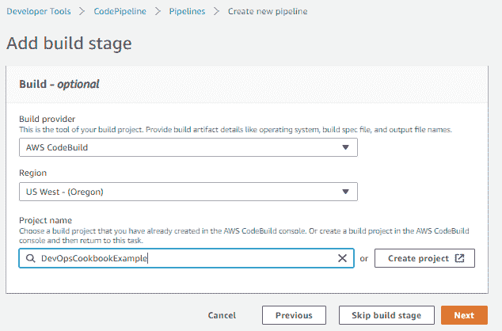

7.  单击跳过部署阶段。作为部署替代，您可以调用一个 Lambda 函数来调用 CloudFormation 模板并部署一个 Kubernetes 集群。您可以在*参见*一节中找到显示如何做到这一点的 AWS 代码套件示例。
8.  单击创建管道。

9.  执行管道后，您将看到类似于以下内容的构建:


至此，您已经成功地使用 AWS 代码管道服务构建了一个管道。

# 它是如何工作的...

这个配方向您展示了如何使用 AWS 开发工具快速创建管道。

在*用 AWS CodePipeline* 配方构建管道中，创建管道后，AWS CodePipeline 会监视 AWS CodeCommit 中的更改。当新的公共关系合并到存储在代码提交存储库中的主分支中时，代码管道会自动检测对分支的更改并触发管道。

在构建作业期间，代码构建将 Docker 文件中描述的代码和任何依赖项打包到 Docker 映像中。这个 Docker 图像被推送到您在制作过程中指定的亚马逊 ECR 容器注册表中。

这条管道也是完全可扩展的。事实上，您还可以选择通过 AWS Lambda 调用一个无服务器函数来创建一个 Kubernetes 集群，或者将代码部署在一个现有的 Kubernetes 集群上，以便进行测试。您可以在*部分提供的 AWS 博客链接中找到更多示例。*

# 请参见

*   AWS CodeCommit 文档:[https://docs . AWS . Amazon . com/CodeCommit/latest/user guide/welcome . html](https://docs.aws.amazon.com/codecommit/latest/userguide/welcome.html)
*   AWS CodeBuild 文档:[https://docs . AWS . Amazon . com/CodeBuild/latest/user guide/welcome . html](https://docs.aws.amazon.com/codebuild/latest/userguide/welcome.html)
*   AWS CodeDeploy 文档:[https://docs . AWS . Amazon . com/CodeDeploy/latest/user guide/welcome . html](https://docs.aws.amazon.com/codedeploy/latest/userguide/welcome.html)
*   AWS CodePipeline 文档:[https://docs . AWS . Amazon . com/CodePipeline/latest/user guide/welcome . html](https://docs.aws.amazon.com/codepipeline/latest/userguide/welcome.html)
*   AWS 博客关于使用 AWS 开发人员工具持续部署到 Kubernetes:[https://AWS . Amazon . com/blogs/devo PS/持续-部署到 Kubernetes-使用-AWS-codepipeline-AWS-codecommit-AWS-codebuild-Amazon-ECR-and-AWS-lambda/](https://aws.amazon.com/blogs/devops/continuous-deployment-to-kubernetes-using-aws-codepipeline-aws-codecommit-aws-codebuild-amazon-ecr-and-aws-lambda/)
*   代码套件–库本内特公司的持续部署参考体系结构:[https://github.com/aws-samples/aws-kube-codesuite](https://github.com/aws-samples/aws-kube-codesuite)
*   EKS 部署的 Lambda 函数的类似示例:[https://github.com/muratkars/lambda-eks](https://github.com/muratkars/lambda-eks)

# 在谷歌云构建上与 Spinnaker 建立 CI/CD 管道

谷歌云构建是一个托管的配置项/光盘和部署平台，允许您在云中构建、测试和部署。在本节中，我们将使用开源的多云连续交付平台 Spinnaker 的功能来介绍带有谷歌云构建配置的 CI/CD 管道。

# 准备好

将`k8sdevopscookbook/src`存储库克隆到您的工作站，以使用`chapter3`目录下的清单文件:

```
$ git clone https://github.com/k8sdevopscookbook/src.git
$ cd /src/chapter3
```

请确保您拥有使用 GCP 服务的必要凭据，并且能够访问当前项目。如果你还没有，去[https://console.cloud.google.com](https://console.cloud.google.com)创建一个账户。

# 怎么做...

本节进一步分为以下几个小节，以简化这一过程:

*   安装和配置自旋命令行界面
*   为配置项/光盘配置服务帐户
*   配置事件以触发管道
*   使用头盔安装喷丝板
*   创建谷歌云源代码库
*   用谷歌云构建构建项目
*   配置 Spinnaker 管道
*   将应用程序推广到生产中

# 安装和配置自旋命令行界面

以下配方中提到的操作需要`spin` CLI、`gcloud`，以及一个启用了计费的项目的 GCP 帐户。我们将使用`gcloud`命令行界面启用相关的应用编程接口:

1.  运行以下命令下载`gcloud`命令行界面。如果您已经安装了`gcloud`命令行界面并且已经有项目，请跳到*步骤 4* :

```
$ curl https://sdk.cloud.google.com | bash
```

2.  初始化软件开发工具包，并遵循给定的说明:

```
$ gcloud init
```

3.  选择您有权限的项目或创建一个新项目。
4.  为项目启用 Kubernetes 引擎应用编程接口、云构建应用编程接口和云源存储库应用编程接口:

```
$ gcloud services enable compute.googleapis.com cloudapis.googleapis.com sourcerepo.googleapis.com
Operation "operations/acf.d1f2c714-9258-4784-a8a9-6648ab4c59fe" finished successfully.
```

5.  下载并安装`spin`命令行界面:

```
$ curl -LO \
https://storage.googleapis.com/spinnaker-artifacts/spin/$(curl -s \
https://storage.googleapis.com/spinnaker-artifacts/spin/latest)/linux/amd64/spin
$ chmod +x spin
$ sudo mv spin /usr/local/bin/spin
```

现在您已经启用了 GCP 服务并安装了`spin`命令行界面。

# 为配置项/光盘配置服务帐户

要在谷歌云上使用配置项/光盘服务，您的用户需要拥有分配给他们的正确权限。让我们执行以下步骤为配置项/光盘配置服务帐户:

1.  按照[第 1 章](01.html)*的 GKE* 配方中的*配置受管 Kubernetes 集群中的说明，构建生产就绪型 Kubernetes 集群*，以部署 GKE 集群。如果您已经有一个服务帐户，请跳至*步骤 2* 创建一个服务帐户，该帐户将由管道稍后使用 *:*

```
$ gcloud iam service-accounts create cicd-account \
--display-name "My CICD Service Account"
```

2.  将以下两处的`devopscookbook`替换为您的项目名称，并将存储管理员角色绑定添加到您的服务帐户:

```
$ gcloud projects \
 add-iam-policy-binding \
 devopscookbook --role \
 roles/storage.admin --member \
 serviceAccount:cicd-account@devopscookbook.iam.gserviceaccount.com
```

3.  储存您的`cicd-account`键:

```
$ gcloud iam service-accounts keys \
 create cicd-key.json \
 --iam-account cicd-account@devopscookbook.iam.gserviceaccount.com
```

这样，您就将权限分配给了您的服务帐户。

# 配置事件以触发管道

谷歌发布/订阅是一种云服务，最好描述为卡夫卡或兔子 MQ 的托管版本。当在我们的容器注册表中检测到更改时，我们将使用谷歌发布/订阅来传递通知。让我们执行以下步骤:

1.  使用以下`gcloud`命令创建云发布/订阅主题:

```
$ gcloud pubsub topics create projects/devopscookbook/topics/gcrgcloud pubsub topics create projects/devopscookbook/topics/gcr
Created topic [projects/devopscookbook/topics/gcrgcloud].
Created topic [projects/devopscookbook/topics/pubsub].
Created topic [projects/devopscookbook/topics/topics].
Created topic [projects/devopscookbook/topics/create].
Created topic [projects/devopscookbook/topics/gcr].
```

2.  创建`pubsub`订阅。以下命令应返回一条`Created subscription`消息，类似于以下内容:

```
$ gcloud pubsub subscriptions create gcr-triggers --topic projects/devopscookbook/topics/gcr
Created subscription [projects/devopscookbook/subscriptions/gcr-triggers].
```

3.  将以下两处`devopscookbook`替换为您的项目名称，并为您的 CI/CD 服务帐户添加权限，即`cicd-account`:

```
$ gcloud pubsub subscriptions add-iam-policy-binding \
 gcr-triggers --role roles/pubsub.subscriber \
 --member serviceAccount:cicd-account@devopscookbook.iam.gserviceaccount.com
```

至此，您已经学习了如何配置事件来触发管道。

# 使用赫尔姆部署喷丝板

让我们执行以下步骤，使用 Helm 图表部署 Spinnaker 工具:

1.  验证`helm`是否已在您的 GKE 集群上安装并初始化。如果没有，请按照*使用 Helm 图表部署工作负载*方法中[第 2 章](02.html)、*在 Kubernetes* 上操作应用程序中的说明安装 Helm。如果 Helm 的客户端和服务器安装在您的集群上，以下命令将返回该客户端和服务器:

```
$ helm version --short
Client: v2.14.3+g0e7f3b6
Server: v2.14.3+g0e7f3b6
```

2.  为`ci-admin`服务帐户创建`clusterrolebinding`:

```
$ kubectl create clusterrolebinding \
 --clusterrole=cluster-admin \
 --serviceaccount=default:default \
 ci-admin
```

3.  使用以下命令创建管道配置桶。确保用唯一的名称替换`devopscookbook-ci-config`桶名。这将在谷歌云存储上创建一个对象存储桶:

```
$ gsutil mb -c regional -l us-central1 gs://devopscookbook-ci-config
```

4.  用`cicd-account`键的内容创建一个变量:

```
$ export CICDKEY_JSON=$(cat cicd-key.json)
```

5.  编辑`cd /src/chapter3/gcp`目录中的`spinnaker-config.yaml`文件，并用您在*步骤 3* 中使用的桶名替换以下桶名:

```
gcs:
 enabled: true
 bucket: devopscookbook-ci-config
 project: devopscookbok
 jsonKey: '$CICDKEY_JSON'
...
```

6.  使用来自*步骤 5* 的自定义`spinnaker-config.yaml`文件在您的 Kubernetes 集群上部署 Spinnaker:

```
$ helm install -n cd stable/spinnaker -f \
 spinnaker-config.yaml --timeout 600 --wait
```

7.  创建端口转发隧道以访问 Spinnaker 用户界面:

```
$ export DECK_POD=$(kubectl get pods --namespace default -l "cluster=spin-deck" -o jsonpath="{.items[0].metadata.name}")
$ kubectl port-forward --namespace default $DECK_POD 8080:9000 >> /dev/null &
$ export GATE_POD=$(kubectl get pods --namespace default -l "cluster=spin-gate" -o jsonpath="{.items[0].metadata.name}")
$ kubectl port-forward --namespace default $GATE_POD 8084
```

为了能够访问 Spinnaker 用户界面，我们为工作站创建了端口转发隧道。我们还可以创建一个云负载平衡器来向互联网开放端口，但是端口转发更安全。

# 创建谷歌云源代码库

让我们执行以下步骤，在谷歌云源代码服务上创建代码存储库:

1.  下载我们的示例应用程序并提取它:

```
$ wget https://github.com/k8sdevopscookbook/src/raw/master/chapter3/gcp/sample-app-v2.tgz && tar xzfv sample-app-v2.tgz  
```

2.  提取示例代码后，将目录更改为我们的源代码目录:

```
$ cd sample-app
```

3.  使用以下命令对存储库进行初始提交:

```
$ git init && git add . && git commit -m "Initial commit"
```

4.  创建名为`sample-app`的谷歌云代码库:

```
$ gcloud source repos create sample-app
```

5.  为谷歌云存储库设置`credential.helper`:

```
$ git config credential.helper gcloud.sh
```

6.  将`devopscookbook`替换为您的项目名称。将您的新存储库添加为`remote`并推送您的代码:

```
$ git remote add origin https://source.developers.google.com/p/devopscookbook/r/sample-app
$ git push origin master
```

7.  现在，您将能够在`sample-app`存储库中查看您的谷歌云源代码存储库中的文件，如下图所示:

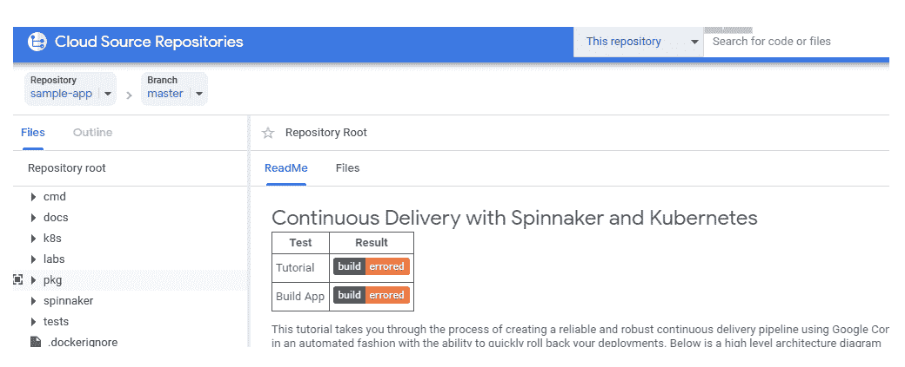

至此，您已经学习了如何在谷歌云源上创建代码存储库。在下一个配方中，我们将使用云源存储库位置来构建我们的项目。

# 用谷歌云构建构建项目

让我们执行以下步骤，从我们在前面的配方中创建的云源存储库中构建项目:

1.  在这里，我们将使用云构建产品来构建我们的项目。首先，登录您的 GCP 帐户。从主产品菜单中，单击云构建。如下图所示，它位于工具下:

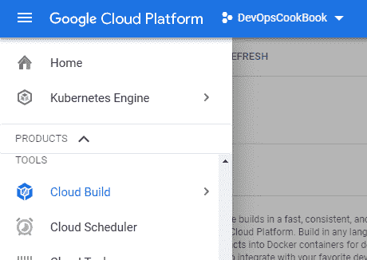

2.  在云构建菜单中，选择触发器并单击创建触发器按钮，如下图所示:

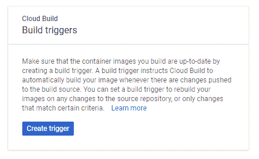

3.  我们的代码位于云源存储库中，因此选择云源存储库并单击继续按钮。如您所见，其他选项是 Bitbucket 和 GitHub:

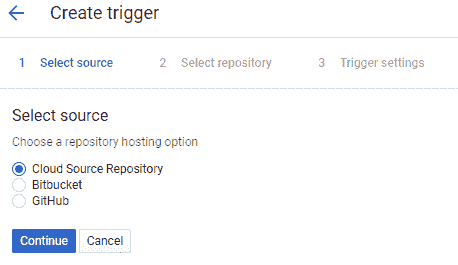

4.  您帐户上的存储库将被自动检测到。选择示例应用程序存储库，然后单击继续按钮:

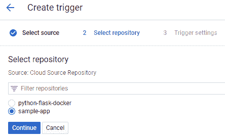

5.  设置以下设置，其他设置保持不变:

```
Name: devopscookbook-trigger-1
Trigger type: Tag
Tag (regex): v.*
Build configuration: Cloud Build configuration file (yaml or json)
```

6.  单击创建触发器按钮。
7.  切换回命令行，其中`kubectl`已被配置为访问您的 Kubernetes 集群并创建一个桶。在创建之前，用唯一的桶名替换`devopscookbook-kubernetes-manifests`桶名:

```
$ gsutil mb -l us-central1 gs://devopscookbook-kubernetes-manifests
```

8.  对您在*步骤 6* 中创建的存储桶启用存储桶版本控制。以下命令将在云存储上启用版本控制，并让存储桶保留对象的旧版本:

```
$ gsutil versioning set on gs://devopscookbook-kubernetes-manifests
```

9.  如果您还不在源代码文件夹中，请将目录更改为我们的源代码:

```
$ cd sample-app
```

10.  将 Kubernetes 部署清单文件中的项目标识更改为您的项目:

```
$ sed -i s/PROJECT/devopscookbook/g k8s/deployments/*
```

11.  使用类似以下的有意义的提交消息提交更改:

```
$ git commit -a -m "Change placeholder project ID to devopscookbook"
```

12.  为发行版创建一个 Git 标签，并推送该标签:

```
$ git tag v1.0.0 && git push --tags
```

13.  切换回浏览器，从“云代码”菜单中单击“历史记录”，并确认构建已被触发且成功:

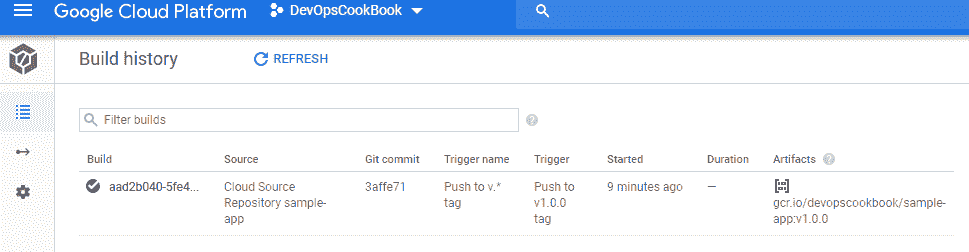

至此，您已经学会了如何使用谷歌云构建来构建项目。

# 配置 Spinnaker 管道

让我们执行以下步骤将您的配置上传到 Spinnaker:

1.  将`owner-email`部分中的以下电子邮件替换为您的电子邮件，并使用以下命令在 Spinnaker 中创建提供的应用程序:

```
$ spin application save \
--application-name sample \
--owner-email \
youremail@domain.com \
--cloud-providers kubernetes \
--gate-endpoint \
http://localhost:8080/gate
```

2.  将示例管道上传到 Spinnaker:

```
$ sed s/PROJECT/devopscookbook/g spinnaker/pipeline-deploy.json > pipeline.json
$ spin pipeline save --gate-endpoint http://localhost:8080/gate -f pipeline.json
```

前面的命令将把配置导出到一个名为`pipeline.json`的文件中，并上传到 Spinnaker。

# 将应用程序推广到生产中

一旦应用程序被部署到登台，下一步就是将其提升到生产环境中。让我们执行以下步骤，在 Spinnaker 上将应用程序从暂存升级到生产:

1.  在喷丝板用户界面上，选择我们在*中创建的`sample`应用程序配置喷丝板管道*配方:

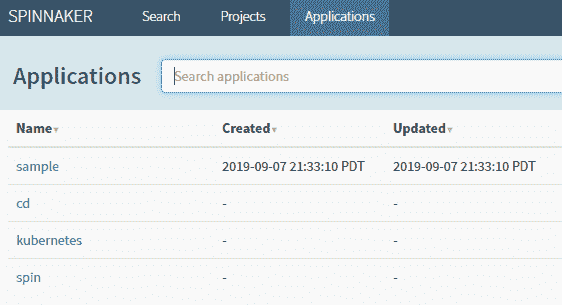

2.  点击下面截图中显示的管道选项卡:

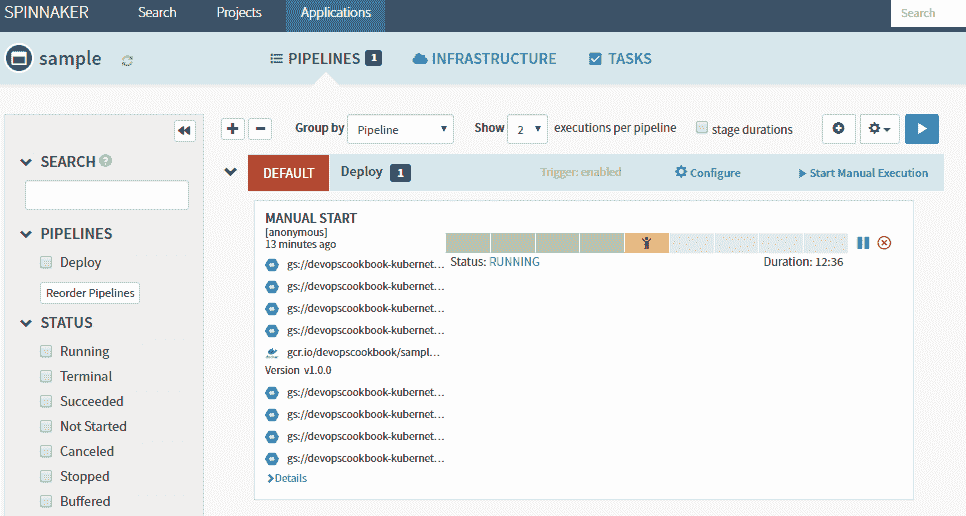

3.  将鼠标悬停在橙色框上，然后单击继续按钮。如下图所示，绿色框表示管道的已完成部分，而橙色框显示管道暂停的位置:

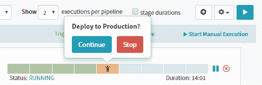

4.  选择基础设施菜单下的负载平衡器。下面的截图显示了基础设施菜单:

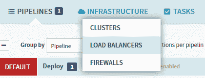

5.  单击服务示例-前端-生产负载平衡器下的 DEFAULT 按钮:

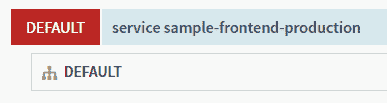

6.  在详细信息窗格的右侧，找到入口 IP 并通过单击 IP 地址旁边的复制图标将其复制到剪贴板:

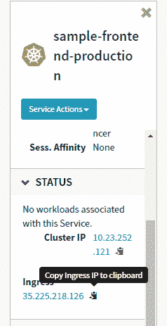

7.  在浏览器中打开 IP 地址，确认生产应用程序可以访问。您将看到类似于以下视图的屏幕，其中显示了 Pod 名称、节点名称及其版本:

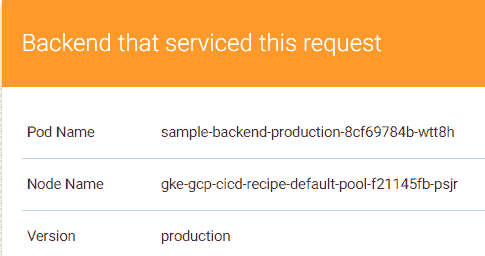

有了这些，你就知道如何使用谷歌云平台服务和 Spinnaker 在 GKE 创建你的 CI/CD 管道。

# 请参见

*   谷歌云快手上的 CI/CD:[https://cloud.google.com/docs/ci-cd/](https://cloud.google.com/docs/ci-cd/)
*   云源存储库文档:[https://cloud.google.com/source-repositories/docs/](https://cloud.google.com/source-repositories/docs/)

# 在 Azure DevOps 上设置配置项/光盘管道

Azure DevOps 提供了版本控制、报告、自动化构建以及项目/实验室/测试和发布管理功能。Azure DevOps 作为 SaaS 或内部服务器产品提供。在本节中，我们将介绍使用 SaaS 产品的 Azure DevOps 工作流配置和内置 CI/CD 功能。您将学习如何管理工作流和创建 Azure 管道。

# 准备好

在下面的方法中，您将学习如何通过添加 YAML 文件在自己的存储库中创建管道示例。这个配方需要一个活跃的 GitHub 帐户，并且有一个准备好要构建的项目。我们将使用 AKS 来演示 Azure Pipelines 的连续交付。

这里提到的所有操作都需要一个 Azure DevOps 帐户。如果没有，去[https://azure.microsoft.com/services/devops/](https://azure.microsoft.com/services/devops/)创建一个。在 Azure Kubernetes 服务上部署应用程序还需要一个活动的 Azure 云订阅。

# 怎么做...

本节进一步分为以下几个小节，以简化这一过程:

*   Azure DevOps 入门
*   配置 Azure 管道
*   将更改部署到 AKS 集群

# Azure DevOps 入门

Azure DevOps 是微软提供的一套 DevOps 工具，包括 CI/CD 和项目管理服务，如 Azure Pipelines、Azure Boards、Azure 工件、Azure Repos 和 Azure 测试计划。

在使用 Azure 管道之前，让我们执行以下步骤来创建我们的第一个项目:

1.  在[https://azure.microsoft.com/en-us/services/devops/](https://azure.microsoft.com/en-us/services/devops/)登录 Azure DevOps。
2.  创建项目名称。
3.  选择可见性。在我们的示例中，这被设置为公共:

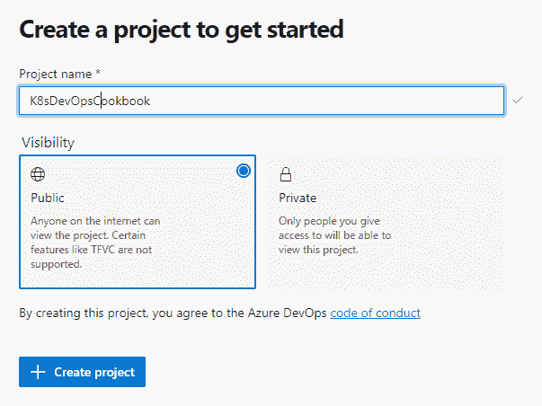

4.  单击“创建项目”按钮。

# 配置 Azure 管道

Azure Pipelines 允许您使用任何语言、平台和云提供商的 CI/CD 来构建、测试和部署。让我们执行以下步骤来首次配置 Azure 管道:

1.  登录到 Azure DevOps 帐户后，您将在左侧的“概述”菜单上看到指向主要功能的链接。从“概述”菜单中，单击“管道”菜单。下面的截图显示了欢迎来到这个项目！页面:


2.  单击“创建管道”按钮。

3.  作为管道创建过程的一部分，您需要设置代码存储库的位置。您可以从任何 Git 存储库中导入项目。在我们的例子中，我们将使用 GitHub 作为我们的存储库。以下屏幕截图显示了所有其他可用选项:

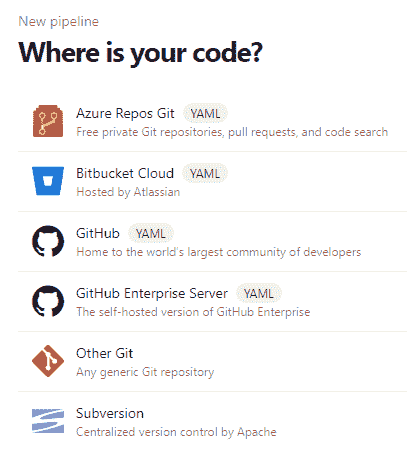

4.  点击授权天蓝色:

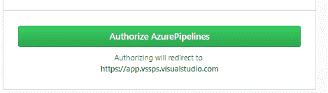

5.  选择一个存储库，然后单击批准和安装:

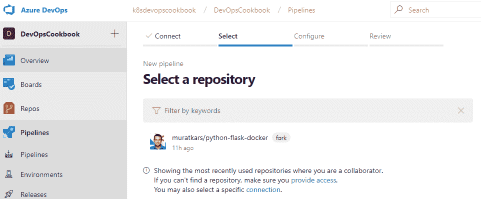

6.  现在，选择要配置管道的存储库。
7.  选择 Docker 构建一个映像并将其推送到 Azure 容器注册表。该选项将容器工件上传到 Azure 容器注册服务。下面的截图显示了我们将使用的 Docker 选项:

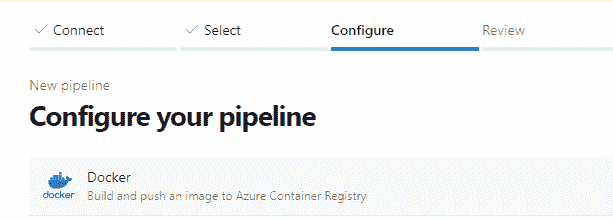

8.  查看您的管道 YAML，然后单击保存并运行以批准它。
9.  你会看到管道。单击构建作业查看其详细信息:

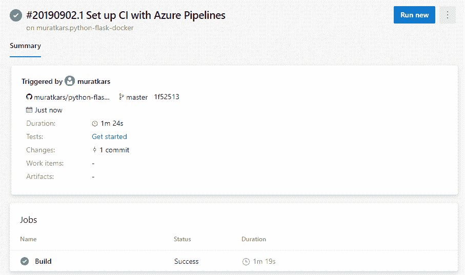

至此，您已经学习了如何配置 Azure 管道。

# 将更改部署到 AKS 集群

让我们执行以下步骤:

1.  登录到 Azure DevOps 帐户后，您将在左侧的“概述”菜单上看到指向主要功能的链接。这一次，从“概述”菜单中选择“管道”选项。如下图所示，是从上往下的第四个选项:

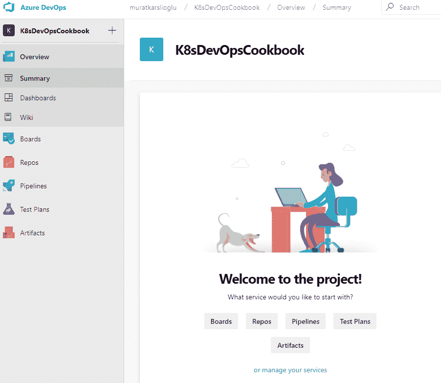

2.  接下来，您需要创建一个管道。下面的屏幕截图显示了“管道”菜单。单击页面右上角的新建管道按钮:

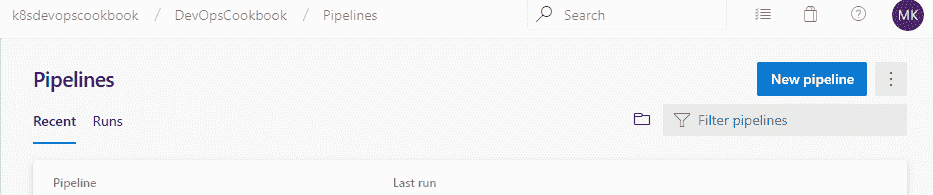

3.  选择 GitHub 作为您的存储库。同样，所有其他存储库选项都可以在下面的屏幕截图中看到:

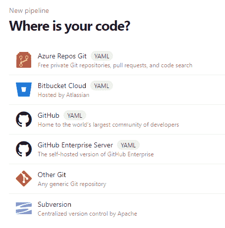

4.  选择一个存储库，然后单击批准并安装。下面的截图显示我自己的存储库被选中。在您的情况下，存储库名称会有所不同:


5.  现在，选择要配置管道的存储库。
6.  如下图所示，您将获得配置管道的预定义替代方案。对于本例，选择部署到 Azure Kubernetes 服务，构建一个映像并将其推送到 Azure 容器注册表，然后部署到 AKS:

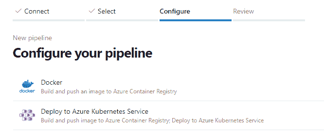

7.  选择您的 Azure 云订阅。
8.  选择一个现有的 AKS 集群。
9.  选择现有，并在名称空间字段中选择默认。
10.  输入容器注册表的名称。在下面的截图中，你可以看到我选择的选项。在您的情况下，容器注册表和图像名称会有所不同:

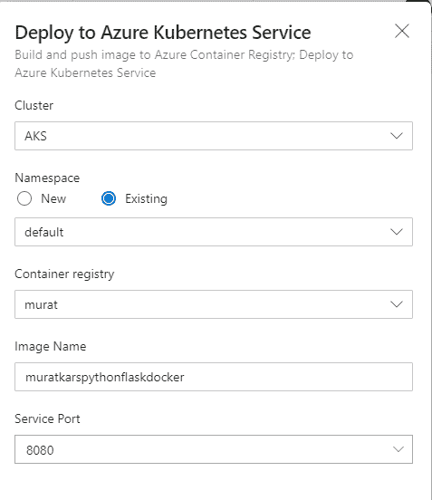

11.  单击验证和配置按钮。
12.  查看您的管道 YAML，然后单击保存并运行以批准它。

13.  你会看到管道。单击构建作业查看其详细信息:

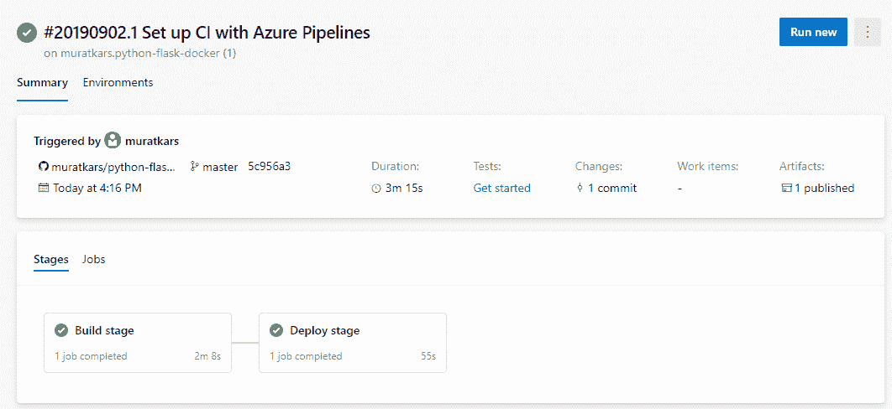

如前面的截图所示，我们的简单管道只包括两个阶段。这些将在*中解释其工作原理...*段。

# 它是如何工作的...

本食谱向您展示了如何使用在 AKS 集群上运行的演示应用程序快速创建 Azure DevOps CI/CD 管道。

在*将变更部署到 AKS 集群*配方中，在*步骤 9* 之后，当我们构建作业时，Azure Pipelines 将创建您的管道。它将创建以下两个阶段:

1.  在阶段 1，也就是构建阶段，它创建一个 Docker 映像，并将映像推入您的 Azure 容器注册表。成功后，您可以在 Azure 门户中找到存储在现有注册表中的新映像。例如，下面的屏幕截图显示了作为 Azure 容器注册表下我的管道的结果而创建的图像及其详细信息:

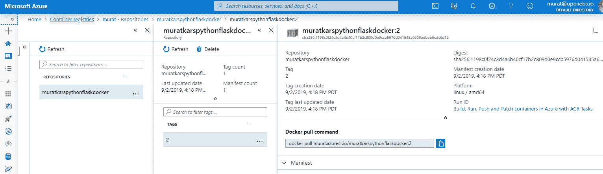

2.  在第 2 阶段，即部署阶段，它创建映像拉取秘密来访问您的注册表，并将您的应用程序作为部署推出。

该应用程序将被部署到您在管道创建期间指定的命名空间中。

稍后，您可以创建可用于应用程序不同阶段(预览、准备和生产)的多个环境，并更改应用程序在管道中需要部署的位置。

# 请参见

*   Azure DevOps 文档:[https://docs.microsoft.com/en-us/azure/devops/?view=azure-devops](https://docs.microsoft.com/en-us/azure/devops/?view=azure-devops)
*   Azure Pipelines 文档:[https://docs . Microsoft . com/en-us/azure/devo PS/Pipelines/index？view=azure-devops](https://docs.microsoft.com/en-us/azure/devops/pipelines/index?view=azure-devops)
*   针对 Kubernetes 部署的 Canary 部署策略:[https://docs . Microsoft . com/en-us/azure/devo PS/pipelines/生态系统/kubernetes/canary-demo？view=azure-devops](https://docs.microsoft.com/en-us/azure/devops/pipelines/ecosystems/kubernetes/canary-demo?view=azure-devops)*