# 四、DevOps 中的自动化测试

在本章中，我们将讨论在 DevOps 工作流中自动化测试，以加快生产时间，减少交付风险损失，并使用 Kubernetes 上已知的测试自动化工具检测服务异常。遵循本章中的方法后，您将获得防止已知缺陷以及快速发现新缺陷以减少服务停机时间的技能。

在本章中，我们将介绍以下食谱:

*   用 StackStorm 构建事件驱动的自动化
*   用石蕊框架自动化测试
*   用 Gremlin 实现混沌工程自动化
*   使用 Codacy 自动化您的代码审查
*   利用 SonarQube 的静态代码分析检测错误和反模式
*   使用 Fossa 检测许可证合规性问题

# 技术要求

本节中的方法假设您已经按照 [第 1 章](01.html)*中描述的推荐方法之一部署了功能性 Kubernetes 集群，构建生产就绪型 Kubernetes 集群*。

本章的其余部分将使用 Kubernetes 命令行工具`kubectl`，因为它是针对 Kubernetes 集群运行命令的主要命令行界面。我们还将使用`helm`，在这里可以使用 Helm 图表来部署解决方案。

# 用 StackStorm 构建事件驱动的自动化

StackStorm 是一个开源的、事件驱动的自动化平台。使用 GitOps 方法，它有助于基于事件运行工作流。在本节中，我们将在 Kubernetes 上使用 StackStorm 执行任意自动化或修复任务。您将学习如何使用 Helm 图表在 Kubernetes 上以高度可用的配置部署 StackStorm，并从部署规则、自定义传感器、操作和工作流的示例开始。

# 准备好

确保您已经准备好了 Kubernetes 集群，并且配置了`kubectl`和`helm`，以便您可以管理集群资源。

# 怎么做…

本节进一步分为以下几个小节，以简化这一过程:

*   安装 StackStorm
*   访问堆栈表格用户界面
*   使用 st2 命令行界面
*   定义规则
*   部署规则

# 安装 StackStorm

虽然 StackStorm 可以作为 Linux 系统的**红帽包管理器**/**Debian**(**RPM/Deb**)以及 Docker 映像进行分发，但是如果您计划运行业务关键的自动化任务，建议在 Kubernetes 上部署 StackStorm **高可用性** ( **HA** )集群。

在本食谱中，我们将按照以下步骤学习如何在 Kubernetes 上部署 StackStorm:

1.  将 Helm 存储库添加到本地图表列表中:

```
$ helm repo add stackstorm https://helm.stackstorm.com/
```

2.  使用 Helm 图表安装 StackStorm 高可用性集群。以下命令将部署 StackStorm 及其依赖项，如 MongoDB 和 RabbitMQ:

```
$ helm install stackstorm/stackstorm-ha --name=st2 --namespace=stackstorm
```

3.  安装过程可能需要 2 到 3 分钟。确认版本已经部署并运行:

```
$ helm ls st2
NAME REVISION  UPDATED                  STATUS   CHART                APP VERSION NAMESPACE
st2  1         Wed Oct 30 23:06:34 2019 DEPLOYED stackstorm-ha-0.22.0 3.2dev      stackstorm
```

现在，在我们的集群中运行 StackStorm。接下来，我们将访问用户界面或使用命令行界面与 StackStorm 交互。

# 访问堆栈表格用户界面

StackStorm Helm 安装假设您在单节点 Minikube 集群中运行，并且它旁边提供的说明适用于较小的部署。我们正在具有多个节点的大型集群上运行 StackStorm。我们将在外部公开网络服务器来访问 StackStorm 用户界面。

让我们执行以下步骤来创建云负载平衡器，以便我们可以访问 StackStorm web 界面:

1.  创建负载平衡器。以下命令将通过您的云提供商创建负载平衡器，并在端口`80`上公开 web 服务:

```
$ cat <<EOF | kubectl apply -f -
apiVersion: v1
kind: Service
metadata:
 name: st2-service
 namespace: stackstorm
spec:
 type: LoadBalancer
 ports:
 - port: 80
 targetPort: 80
 protocol: TCP
 selector:
 app: st2web
EOF
```

2.  找到外部服务 IP。在下面的例子中，我们使用了部署在 AWS 上的 Kubernetes 集群。尽管输出可能不同，但以下命令在其他平台上应该会产生相同的结果:

```
$ kubectl get svc st2-service -nstackstorm
NAME        TYPE         CLUSTER-IP    EXTERNAL-IP PORT(S) AGE
st2-service LoadBalancer 100.68.68.243 a022d6921df2411e9bd5e0a92289be87-2114318237.us-east-1.elb.amazonaws.com 80:31874/TCP 6m38s
```

3.  在浏览器中从*步骤 2* 打开外部 IP 地址:

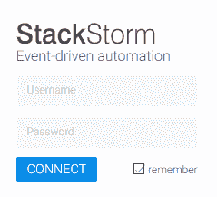

4.  使用必要的凭据登录，即用户名为`st2admin`，密码为`Ch@ngeMe`:

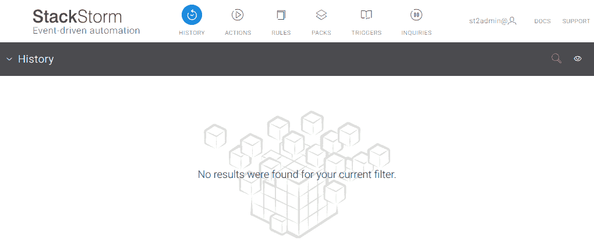

现在，您可以进入`StackStorm`界面。现在，我们将在*定义规则*食谱中创建第一个规则之前，点击菜单项并探索操作。

# 使用 st2 命令行界面

如果我们想熟悉产品，StackStorm web 界面非常有用，但是，如果您要在生产中使用 StackStorm，您需要学习 CLI 命令。现在，执行以下步骤从 pod 访问 st2 命令行界面:

1.  找到 st2 客户端的 pod 名称:

```
$ export ST2CLIENT=$(kubectl get --namespace stackstorm pod -l app=st2client -o jsonpath="{.items[0].metadata.name}")
```

2.  通过 st2 命令行界面执行以下命令。该命令将从吊舱执行`st2 --version`命令:

```
$ kubectl exec -it ${ST2CLIENT} -n stackstorm -- st2 --version
st2 3.2dev (a643ba7), on Python 2.7.12
```

3.  使用以下命令行界面命令向 StackStorm 进行身份验证，并使用`-w`参数保存密码。如果不想保存密码，可以去掉最后的`-w`参数:

```
$ kubectl exec -it ${ST2CLIENT} -n stackstorm -- st2 login st2admin -p 'Ch@ngeMe' -w
Logged in as st2admin
```

4.  列出核心包中的可用操作:

```
$ kubectl exec -it ${ST2CLIENT} -n stackstorm -- st2 action list --pack=core
```

5.  列出核心包中的操作。您也可以尝试 Linux、ChatOps 和软件包的其他软件包选项:

```
$ kubectl exec -it ${ST2CLIENT} -n stackstorm -- st2 action list --pack=core
```

所有 StackStorm CLI 操作都可以通过 REST API、Python 和 JavaScript 绑定来实现。您可以在*参见*部分的 *StackStorm CLI 和 Python 客户端*参考链接中找到更多信息。

# 定义规则

StackStorm 使用规则在事件发生时运行可用的操作。StackStorm 附带默认操作，并且可以通过添加来自社区的新操作来增加操作目录。按照以下步骤创建第一个规则:

1.  规则以熟悉的 YAML 格式创建，由三部分组成:触发器、标准和操作。在创建规则文件之前，我们将熟悉我们可以在规则中使用的可用触发器。使用以下命令列出可用的触发器:

```
$ kubectl exec -it ${ST2CLIENT} -n stackstorm -- st2 trigger list
```

2.  检查 webhook 触发器的详细信息。以下命令将返回触发器的描述、参数和负载模式。回顾`parameters_schema`因为我们将在后面的示例规则中使用它:

```
$ kubectl exec -it ${ST2CLIENT} -n stackstorm -- st2 trigger get core.st2.webhook
...
| parameters_schema | {                                   |
|                   |      "additionalProperties": false, |
|                   |      "type": "object",              |
|                   |      "properties": {                |
|                   |          "url": {                   |
|                   |              "required": true,      |
|                   |              "type": "string"       |
...
```

3.  使用以下命令列出可用的操作:

```
$ kubectl exec -it ${ST2CLIENT} -n stackstorm -- st2 action list
```

4.  检查`core.local`动作的细节。该操作在本地主机上执行任意的 Linux 命令。以下命令返回它可以接受的参数，如下所示:

```
$ kubectl exec -it ${ST2CLIENT} -n stackstorm -- st2 action get core.local
...
| parameters    | {                                               |
|               | "cmd": {                                        |
|               |     "required": true,                           |
|               |     "type": "string",                           |
|               |     "description": "Arbitrary Linux command to  |
|               | be executed on the local host."                 |
|               |     },                                          |
|               |     "sudo": {                                   |
|               |         "immutable": true                       |
|               |     }                                           |
|               | }                                               |
| metadata_file | actions/local.yaml                              |
...
```

5.  让我们在一个规则中使用前面的触发器和动作，并使用下面的规则设置一个 webhook 来监听`https://{host}/api/v1/webhooks/sample`处的 URL，并创建一个`first_rule.yaml`文件。完成后，将文件复制到容器中。当对此网址发出开机自检请求时，将触发该操作:

```
$ cat > first_rule.yaml <<EOF
 name: "sample_rule_with_webhook"
 pack: "examples"
 description: "Sample rule dumping webhook payload to a file."
 enabled: true
 trigger:
 type: "core.st2.webhook"
 parameters:
 url: "sample"
 criteria:
 trigger.body.name:
 pattern: "st2"
 type: "equals"
 action:
 ref: "core.local"
 parameters:
 cmd: "echo \"{{trigger.body}}\" >> ~/st2.webhook_sample.out ; sync"
EOF
```

至此，您已经学会了如何查找和使用可用的操作和触发器来构建规则。接下来，我们将学习如何在 StackStorm 中运行它。

# 部署规则

StackStorm 规则可以通过其用户界面、命令行界面或应用编程接口进行部署。在本食谱中，我们将使用之前定义的规则，并使用以下步骤进行部署:

1.  使用我们在*定义规则*配方中创建的 YAML 文件创建规则:

```
$ kubectl exec -it ${ST2CLIENT} -n stackstorm -- st2 rule create first_rule.yaml
```

2.  列出规则并确认新规则已创建。您应该会在列表中看到`examples.sample_rule_with_webhook`规则，如下所示:

```
$ kubectl exec -it ${ST2CLIENT} -n stackstorm -- st2 rule list
+------------------+----------+-------------------------+---------+
| ref | pack | description | enabled |
+------------------+----------+-------------------------+---------+
| chatops.notify | chatops | Notification rule to | True |
| | | send results of action | |
| | | executions to stream | |
| | | for chatops | |
| examples.sample | examples | Sample rule dumping | True |
| rule_with_webhook| | webhook payload to a | |
| | | file. | |
+------------------+----------+-------------------------+---------+
```

有了我们在这里创建的新规则，网络钩子已经开始监听`https://{host}/api/v1/webhooks/sample`。

# 请参见

*   StackStorm 文档:[https://docs.stackstorm.com/install/k8s_ha.html](https://docs.stackstorm.com/install/k8s_ha.html)
*   StackStorm CLI 和 Python 客户端:[https://docs.stackstorm.com/reference/cli.html](https://docs.stackstorm.com/reference/cli.html)
*   StackStorm 示例:[https://github . com/stack storm/st2/tree/master/contrib/examples](https://github.com/StackStorm/st2/tree/master/contrib/examples)

# 用石蕊框架自动化测试

Litmus 是一个开源工具集，用于在 Kubernetes 中运行混沌实验。Litmus 为云原生开发人员和 SREs 提供了混沌**中央注册库** ( **CRD** )来注入、编排和监控混沌，以便在生产中实时发现 Kubernetes 部署中的潜在弱点。在本节中，我们将运行一些混沌实验来验证系统的弹性。您将学习如何为 CI 和端到端测试构建管道，以便验证和认证新的 Kubernetes 版本。

# 准备好

将`k8sdevopscookbook/src`存储库克隆到您的工作站，以便能够使用`chapter4`目录下的清单文件:

```
$ git clone https://github.com/k8sdevopscookbook/src.git
$ cd src/chapter4
```

确保您已准备好 Kubernetes 集群并配置了`kubectl`和`helm`，以便您可以管理集群资源。

# 怎么做…

本节进一步分为以下几个小节，以简化这一过程:

*   安装石蕊操作器
*   使用混沌图表进行 Kubernetes
*   创建一个容器杀死混沌实验
*   回顾混沌实验结果
*   查看混沌实验日志

# 安装石蕊操作器

石蕊混乱工程工具可以安装使用掌舵图。书籍被定义为Kubernetes的工作。

让我们执行以下步骤在集群中安装石蕊:

1.  安装石蕊混沌算子:

```
$ kubectl apply -f https://litmuschaos.github.io/pages/litmus-operator-latest.yaml
```

2.  验证石蕊混沌操作器盒正在运行:

```
$ kubectl get pods -n litmus
NAME                               READY STATUS  RESTARTS AGE
chaos-operator-ce-554d6c8f9f-46kf6 1/1   Running 0        50s
```

3.  验证是否已应用集群角色和集群角色绑定:

```
$ kubectl get clusterroles,clusterrolebinding,crds | grep "litmus\|chaos"
```

现在，我们的集群中运行着石蕊混沌算子。接下来，我们需要部署混沌实验来测试集群资源的弹性。

# 使用混沌图表进行 Kubernetes

类似于工作负载 Helm 图，Litmus 混沌图用于安装混沌实验包。混沌实验包含了实际的混沌细节。在这个食谱中，我们将学习如何列出混沌实验包并下载 Kubernetes 混沌实验包。让我们执行以下步骤为石蕊操作员安装混沌图表:

1.  在浏览器上打开[网站的混沌图表，在搜索栏中搜索`generic`:](https://hub.litmuschaos.io)

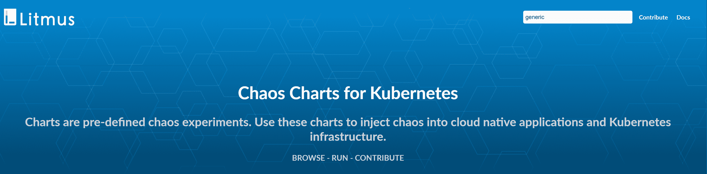

2.  点击通用混沌图表:

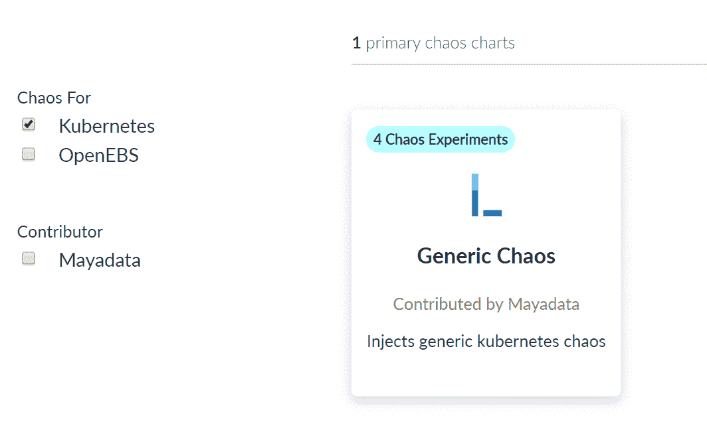

3.  单击安装所有实验按钮:

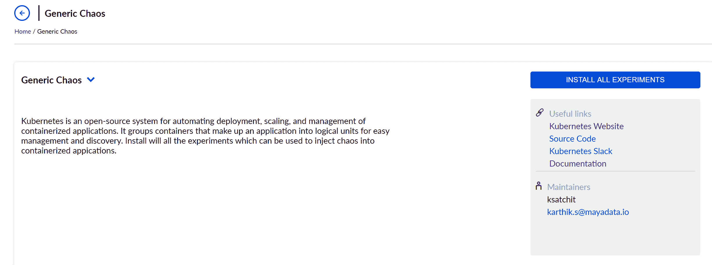

4.  复制混沌实验清单链接:

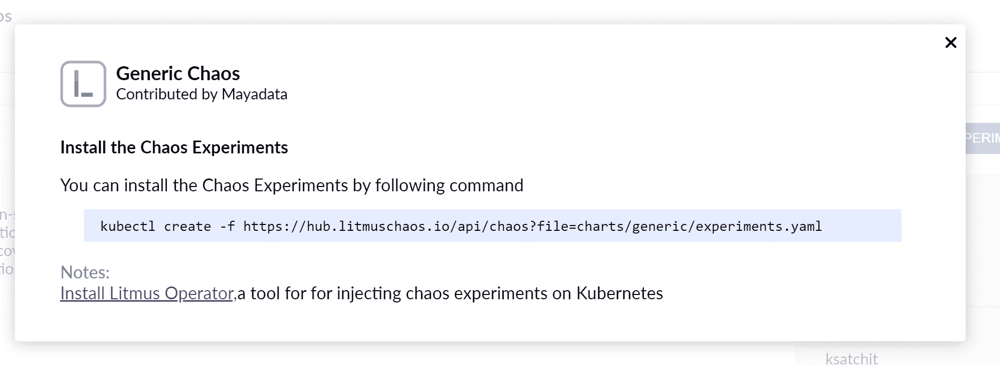

5.  安装混沌实验:

```
$ kubectl create -f https://hub.litmuschaos.io/api/chaos?file=charts/generic/experiments.yaml
```

6.  获取已经创建的混沌实验列表:

```
$ kubectl get chaosexperiments
NAME                 AGE
container-kill       19s
pod-delete           19s
pod-network-latency  19s
pod-network-loss     19s
```

混沌实验场景，如 pod 删除、网络延迟、网络丢失和容器杀死在通用混沌图表下可用。您还可以安装或构建您自己的特定于应用的混沌图表来运行特定于应用的混沌。

# 创建一个 pod 删除混沌实验

混沌实验将可再现的混沌情况捆绑在一起，以便将它们作为 Kubernetes 的工作来运行。在本食谱中，我们将部署一个示例应用，并在该应用上使用 Kubernetes 混沌实验。让我们执行以下步骤来测试删除 pod 对集群的影响:

1.  部署示例应用:

```
$ kubectl apply -f litmus/nginx/nginx.yaml
```

2.  列出吊舱并确认它们正在运行:

```
$ kubectl get pods |grep nginx
nginx-deployment-5c689d88bb-24n4m 1/1 Running 0 4m31s
nginx-deployment-5c689d88bb-qtvsx 1/1 Running 0 4m31s
```

3.  使用`litmuschaos.io/chaos="true"`标注混乱部署:

```
$ kubectl annotate deploy nginx-deployment litmuschaos.io/chaos="true"
deployment.extensions/nginx-deployment annotated
```

4.  为混沌执行器创建一个`ServiceAccount`:

```
$ cat <<EOF | kubectl apply -f -
apiVersion: v1
kind: ServiceAccount
metadata:
 name: nginx
 labels:
 app: nginx
EOF
```

5.  创建集群角色:

```
$ cat <<EOF | kubectl apply -f -
kind: ClusterRole
apiVersion: rbac.authorization.k8s.io/v1
metadata:
 name: nginx
rules:
- apiGroups: ["", "extensions", "apps", "batch", "litmuschaos.io"]
 resources: ["daemonsets", "deployments", "replicasets", "jobs", "pods", "pods/exec", "events", "chaosengines", "chaosexperiments", "chaosresults"]
 verbs: ["*"]
EOF
```

6.  创建一个`ClusterRoleBinding`:

```
$ cat <<EOF | kubectl apply -f -
kind: ClusterRoleBinding
apiVersion: rbac.authorization.k8s.io/v1
metadata:
 name: nginx
subjects:
- kind: ServiceAccount
 name: nginx
 namespace: default
roleRef:
 kind: ClusterRole
 name: nginx
 apiGroup: rbac.authorization.k8s.io
EOF
```

7.  复习实验 CRs 查看混沌参数。在这种情况下，让我们回顾一下`pod-delete`和`container-kill`实验:

```
$ kubectl get chaosexperiment pod-delete -o yaml
$ kubectl get chaosexperiment container-kill -o yaml
```

8.  使用前面回顾的两个实验创建一个混沌引擎:

```
cat <<EOF | kubectl apply -f -
apiVersion: litmuschaos.io/v1alpha1
kind: ChaosEngine
metadata:
 name: engine-nginx
spec:
 appinfo: 
 appns: default
 applabel: "app=nginx"
 appkind: deployment
 chaosServiceAccount: nginx
 experiments:
 - name: pod-delete
 spec:
 rank: 1
 - name: container-kill
 spec:
 components:
EOF
```

至此，您已经学会了如何基于预定义的混沌图创建混沌实验。

# 回顾混沌实验结果

混沌实验作为 Kubernetes 作业执行，受影响的吊舱将由混沌执行器根据实验定义取下。

让我们执行以下步骤来回顾我们的混沌实验的结果:

1.  观看正在进行的实验:

```
$ watch kubectl get pods
Every 2.0s: kubectl get pods ip-172-20-50-43: Wed Sep 25 05:17:55 2019
NAME                              READY STATUS       RESTARTS AGE
container-kill-klfr5-rgddd        0/1   Completed    0        2m39s
engine-nginx-runner               1/2   Running      0        4m53s
nginx-deployment-5c689d88bb-qtvsx 1/1   Terminating  1        23m
nginx-deployment-5c689d88bb-rwtk9 1/1   Running      0        3m12s
pod-delete-wzj6w-x6k5t            0/1   Completed    0        4m8s
```

2.  获取结果列表:

```
$ kubectl get chaosresults
NAME                        AGE
engine-nginx-container-kill 9m
engine-nginx-pod-delete     10m
```

3.  查看`engine-nginx-container-kill`实验结果:

```
$ kubectl describe chaosresults engine-nginx-container-kill
...
Spec:
 Experimentstatus:
 Phase: <nil>
 Verdict: pass
Events: <none>

```

4.  查看`engine-nginx-pod-delete`实验结果:

```
$ kubectl describe chaosresults engine-nginx-pod-delete
...
Spec:
 Experimentstatus:
 Phase: <nil>
 Verdict: pass
Events: <none>
```

在这个食谱中，我们测试并回顾了一个简单的场景。您可以结合现有的混沌图表来创建您的实验，并使用石蕊框架编写您的应用混沌实验。

# 查看混沌实验日志

日志总是由集群上使用的标准 Kubernetes 日志框架收集和存储。如果需要快速查看，可以使用`kubelet`日志。

让我们执行以下步骤来更深入地了解在混沌实验期间执行的任务:

1.  获取已完成作业创建的 pod 列表:

```
$ kubectl get pods |grep Completed
container-kill-klfr5-rgddd 0/1 Completed 0 35m
pod-delete-wzj6w-x6k5t     0/1 Completed 0 37m
```

2.  使用`kubectl logs`命令查看日志:

```
$ kubectl logs container-kill-klfr5-rgddd
...
TASK [Force kill the application pod using pumba] ******************************
...
TASK [Verify restartCount] ***************************************************
...
PLAY RECAP *******************************************************************
127.0.0.1 : ok=29 changed=18 unreachable=0 failed=0
2019-09-25T05:15:56.151497 (delta: 1.254396) elapsed: 35.944704 *******
```

在日志中，您将能够看到已执行的单个任务以及通过或失败任务的摘要。

# 它是如何工作的...

这个食谱向您展示了如何在运行于 Kubernetes 上的应用上快速运行预定义的混沌实验。

石蕊实验可以很容易地从头开始创建，并集成到应用开发人员的 CI 管道中，发布构建和单元/集成测试阶段，以测试 Kubernetes 集群上的混沌行为。

在*运行石蕊混沌实验*配方中，在*第 8 步*中，我们创建了一个混沌引擎来测试荚果删除实验，然后是容器杀死实验。这两个实验使用了 Chaoskube 和 Pumba 作为混沌的最终注入者，Chaoskube 是一种定期杀死你的 Kubernetes 集群中随机豆荚的工具，Pumba 是一种混沌测试和网络仿真工具。

# 请参见

*   石蕊文献:[https://docs.litmuschaos.io/](https://docs.litmuschaos.io/)
*   Kubernetes的混沌图表:[https://hub . litatoes . io/](https://hub.litmuschaos.io/)
*   混沌映射项目:https://github . com/linki/chaos 映射
*   Pumba 项目:https://github . com/Alexei-led/pumba

# 用 Gremlin 实现混沌工程自动化

Gremlin 是一项混沌工程服务，可防止停机并构建更可靠的系统。在本节中，我们将在生产中运行混沌攻击，以使用 Gremlin 验证系统的弹性。您将学习如何创建 CPU 和节点关闭攻击来测试基础架构的弹性。

# 准备好

对于这个食谱，我们需要安装 Kubernetes 命令行工具`kubectl`和`helm`。

这里提到的所有操作都需要一个 Gremlin 帐户。如果没有，去[https://app.gremlin.com/signup](https://app.gremlin.com/signup)创建一个。

# 怎么做…

本节进一步分为以下几个小节，以简化这一过程:

*   设置 Gremlin 凭据
*   安装弹性体上的弹性体
*   对Kubernetes工人进行中央处理器攻击
*   针对 Kubernetes 工作人员创建节点关闭攻击
*   运行预定义的基于场景的攻击
*   从集群中删除 Gremlin

# 设置 Gremlin 凭据

要从我们的 Kubernetes 集群连接到 Gremlin 服务，我们需要将我们的 Gremlin 凭据存储为 Kubernetes 机密。

让我们执行以下步骤来配置我们的 Gremlin 凭据:

1.  在[https://app.gremlin.com/](https://app.gremlin.com/)登录 Gremlin 服务。
2.  从帐户菜单中，单击公司设置:

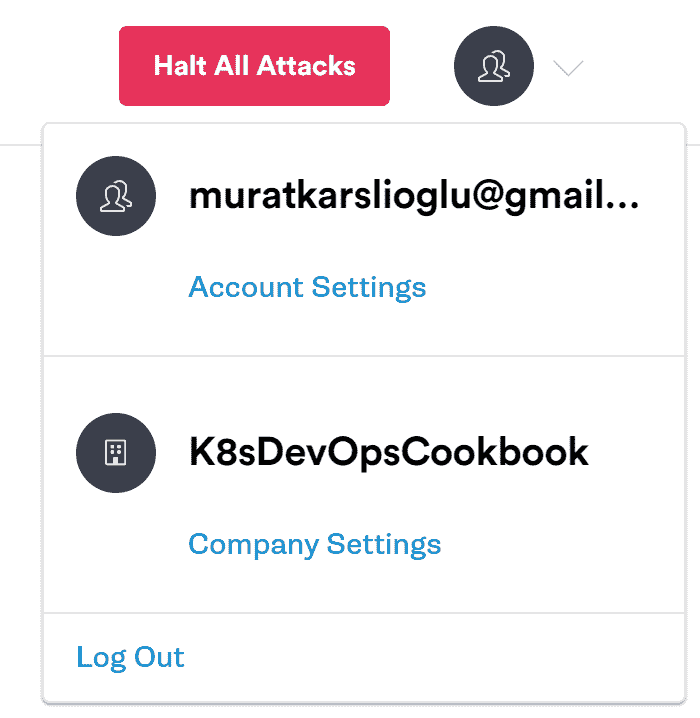

3.  单击团队选项卡并选择您的团队:

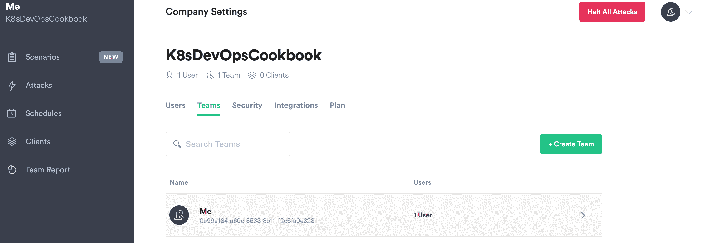

4.  单击配置选项卡并下载您的证书:


5.  将`certificates.zip`文件复制到配置了 kubectl 的主机上。
6.  提取文件:

```
$ unzip certificate.zip
```

7.  相应地重命名证书文件:

```
$ mv Me-client.pub_cert.pem gremlin.cert && mv Me-client.priv_key.pem gremlin.key
```

8.  在集群中创建机密资源:

```
$ kubectl create secret generic gremlin-team-cert --from-file=./gremlin.cert --from-file=./gremlin.key
```

这样，我们已经将我们的凭证转换为Kubernetes的秘密资源。这个秘密将在以后用于将 Gremlin 连接到我们的集群。

# 安装弹性体上的弹性体

在 Kubernetes 上安装 Gremlin 最简单的方法是使用 Helm 图表。在继续之前，确保您已经创建了 gremlin 团队证书密码，如*设置 Gremlin 证书*配方中所述。

让我们执行以下步骤，使用 Helm 图表安装 Gremlin:

1.  添加 Gremlin Helm 存储库:

```
$ helm repo add gremlin https://helm.gremlin.com
```

2.  更新存储库:

```
$ helm repo update
```

3.  使用您的团队标识安装 Gremlin 客户端:

```
$ helm install --name gremlin --set gremlin.teamID=abc1234-a12b-1234-1234-abcdefgh gremlin/gremlin
```

4.  Gremlin 将创建一个 DaemonSet，它将在集群中的每个节点上运行。验证`DESIRED`和`AVAILABLE`吊舱是否相等:

```
$ kubectl get daemonsets
NAME    DESIRED CURRENT READY UP-TO-DATE AVAILABLE NODE SELECTOR AGE
gremlin 3       3       3     3          3         <none>        11m
```

Gremlin 正在您的集群中运行。接下来，我们需要通过我们的 Gremlin 帐户触发一些混乱。

# 对Kubernetes工人进行中央处理器攻击

Gremlin 会产生各种影响内核、工作人员和内存的基础架构攻击。

让我们执行以下步骤来攻击 CPU:

1.  部署示例应用:

```
$ kubectl apply -f ./src/chapter4/gremlin/nginx.yaml
```

2.  列出吊舱并确认它们正在运行:

```
$ kubectl get pods |grep nginx
nginx-deployment-5c689d88bb-24n4m 1/1 Running 0 4m31s
nginx-deployment-5c689d88bb-rwtk9 1/1 Running 0 4m31s
```

3.  获取其中一个单元的节点名:

```
$ kubectl get pod nginx-deployment-5c689d88bb-rwtk9 -o jsonpath="{.spec.nodeName}"
ip-172-20-50-43.ec2.internal
```

4.  观看`pods`状态:

```
$ watch kubectl get pods
```

5.  在[https://app.gremlin.com/](https://app.gremlin.com/)登录您的 Gremlin 帐户。
6.  从攻击菜单中，单击基础架构。
7.  单击新攻击按钮:

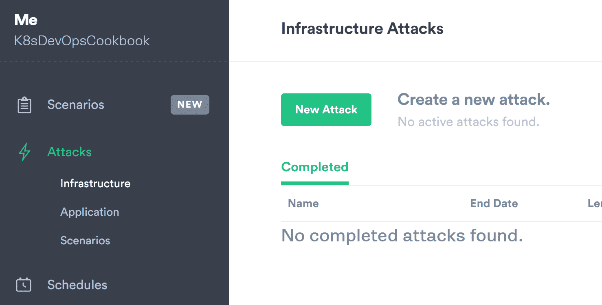

8.  在选择目标主机选项卡下，从*步骤 3* 中选择节点的本地主机名:

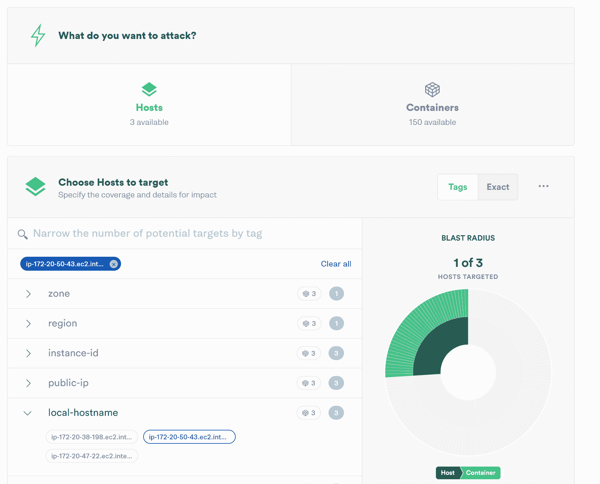

9.  在选择一个 Gremlin 选项卡下，点击资源，选择 CPU 攻击，将 CPU 容量设置为`90`，消耗所有 CPU 核心:

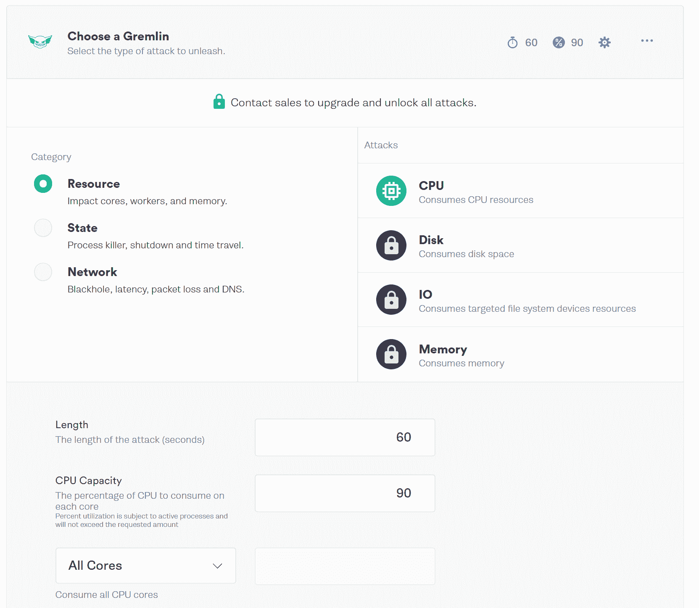

10.  点击释放 Gremlin 运行攻击:

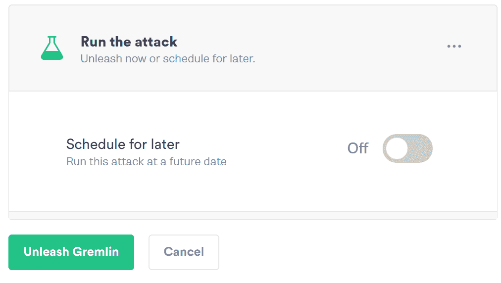

现在，您在 Gremlin 帐户上触发的操作将通过代理在集群上执行。

# 针对 Kubernetes 工作人员创建节点关闭攻击

Gremlin 会产生各种影响内核、工作人员和内存的基础架构攻击。

让我们执行以下步骤来攻击 CPU:

1.  在[https://app.gremlin.com/](https://app.gremlin.com/)登录您的 Gremlin 帐户。
2.  从攻击菜单中，单击基础架构。

3.  单击新攻击按钮:

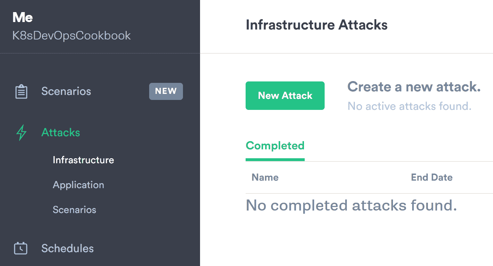

4.  在选择目标主机选项卡下，选择节点的本地主机名 *:*


5.  在选择 Gremlin 选项卡下，单击状态并选择关闭:

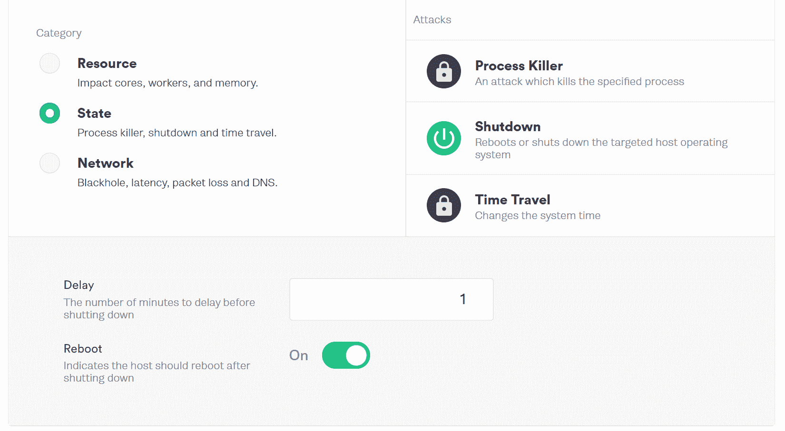

6.  点击释放 Gremlin 运行攻击:

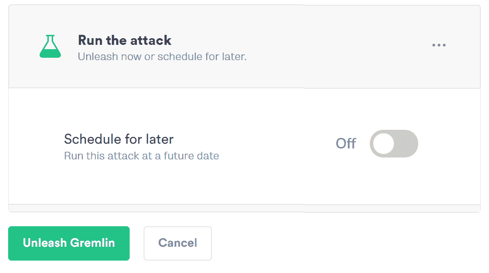

7.  获取我们对其执行关闭攻击的节点上的吊舱:

```
$ kubectl get pod -owide |grep ip-172-20-50-43.ec2.internal
NAME                READY STATUS  RESTARTS AGE IP          NODE NOMINATED NODE
engine-nginx-runner 1/2   Running 1        24h 100.96.0.65 ip-172-20-50-43.ec2.internal <none>
gremlin-rpp22       1/1   Running 1        88m 100.96.0.60 ip-172-20-50-43.ec2.internal <none>
nginx-deployment-5c689d88bb-rwtk9 1/1 Running 1 24h 100.96.0.63 ip-172-20-50-43.ec2.internal <none>
```

你会注意到吊舱重新启动了。

# 运行预定义的基于场景的攻击

Gremlin 混沌场景有助于将攻击捆绑在一起，以生成真实世界的中断场景。在本食谱中，我们将了解预定义的场景，我们可以使用这些场景来验证我们的系统如何响应常见故障。

让我们执行以下步骤来验证自动缩放:

1.  在[https://app.gremlin.com/](https://app.gremlin.com/)登录您的 Gremlin 帐户。
2.  单击方案菜单，查看推荐的方案:

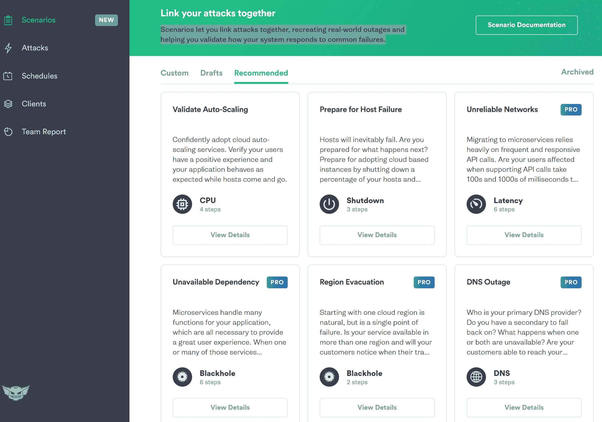

3.  确保在 Kubernetes 集群上启用了自动缩放，并选择验证自动缩放方案。
4.  单击添加目标并运行按钮:

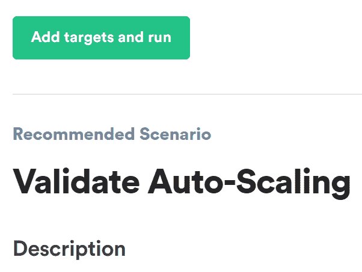

5.  单击运行场景执行攻击。

因此，Gremlin 将对现有节点执行 CPU 攻击，从而对集群施加压力，这应该会理想地触发集群的自动缩放功能，以减少 CPU 压力。

# 从集群中删除 Gremlin

让我们执行以下步骤，从 Kubernetes 集群中删除 Gremlin 的组件:

1.  列出 Gremlin Helm 版本:

```
$ helm ls |grep gremlin
gremlin 1 Thu Sep 26 04:37:05 2019 DEPLOYED gremlin-0.1.3 2.11.8
```

2.  使用版本名称删除 Helm 版本:

```
$ helm delete gremlin --purge
```

赫尔姆将从你的集群中移除释放。

# 它是如何工作的...

这个食谱向您展示了如何在您的工作节点上快速运行预定义的混沌攻击，其中应用由 Kubernetes 调度运行。

请记住，虽然我们在*创建 CPU 攻击*和*创建节点关闭攻击*食谱中寻找对特定吊舱的影响，但是整个节点都受到了攻击，因此节点上的其他吊舱也受到了影响。

特别是在小集群中，建议限制你的爆炸半径，并开始瞄准单个容器的吊舱。这可以通过使用网络延迟攻击和指定与您希望看到攻击工作的容器相关的端口来实现。

# 请参见

*   格林文件:[https://www.gremlin.com/docs/](https://www.gremlin.com/docs/)

# 使用 Codacy 自动化您的代码审查

在这一节中，我们将使用 Codacy 来自动化代码审查，而不必对我们的存储库进行任何额外的代码更改，并生成关于代码质量和安全问题的通知。当涉及到代码评审和检查的开发时，您将学习如何自动化最被低估的任务之一。

# 准备好

这里提到的所有操作都需要一个 Codacy 帐户。如果没有，去[https://www.codacy.com/pricing](https://www.codacy.com/pricing)创建一个。

# 怎么做…

本节进一步分为以下几个小节，以简化这一过程:

*   访问项目仪表板
*   审查提交和 PRs
*   按类别查看问题
*   将 Codacy 徽章添加到您的存储库中

# 访问项目仪表板

让我们执行以下步骤来访问 Codacy 项目控制面板:

1.  在[https://app.codacy.com](https://app.codacy.com)登录 Codacy，它会将您带到您的组织仪表板。
2.  单击左侧菜单上的项目:

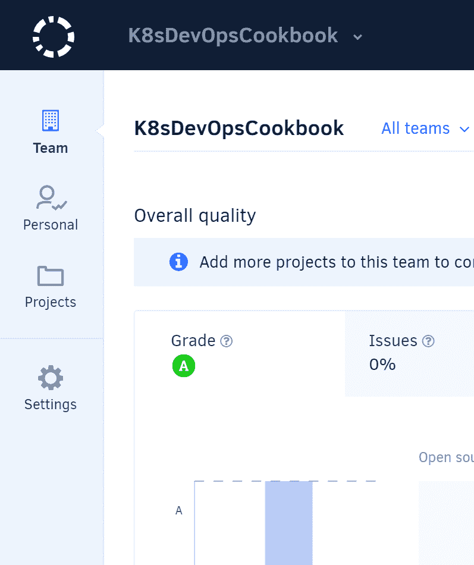

3.  单击特定项目以进入项目视图:

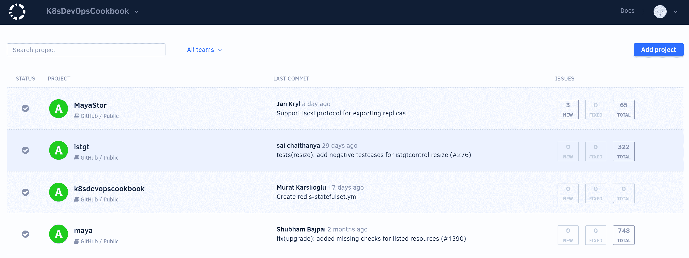

4.  在项目仪表板上找到项目放坡选项。在我们的示例中，以下项目被评为 A 级:

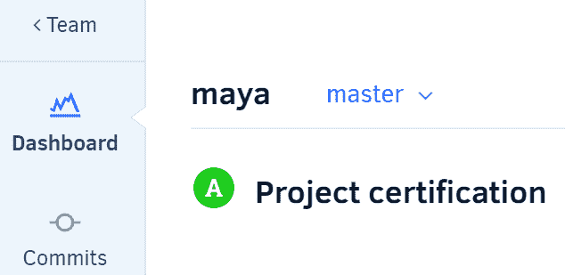

5.  找到质量演变图，查看问题数量与行业平均水平的比较。如果您的平均值高于行业标准，您需要检查提交并减少问题数量:

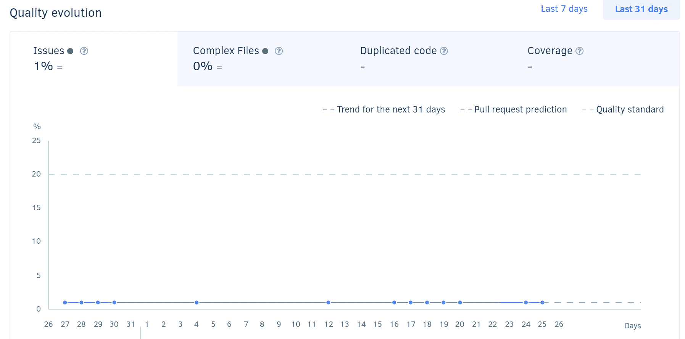

# 审查提交和 PRs

让我们执行以下步骤来检查 Codacy 仪表板上的代码提交:

1.  在项目仪表板上，单击提交菜单。
2.  从下拉菜单中选择主分支:

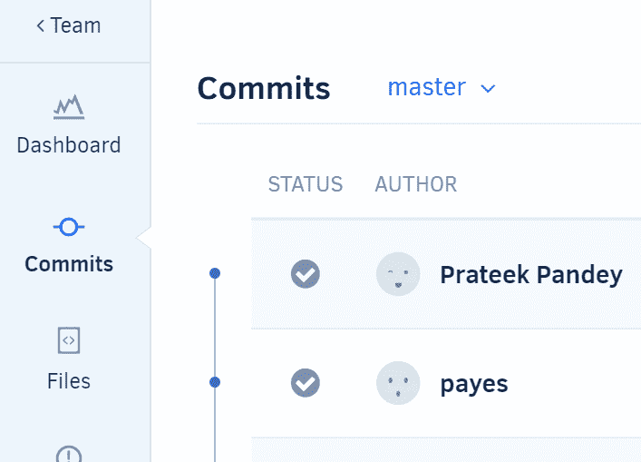

3.  在提交列表中，找到一个新问题用红色标记的提交:

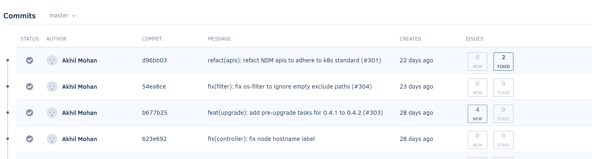

4.  单击提交查看其详细信息:


5.  实现建议的修复来清除问题，或者为开发团队打开一个 GitHub 问题来修复。
6.  现在，单击打开拉取请求菜单:

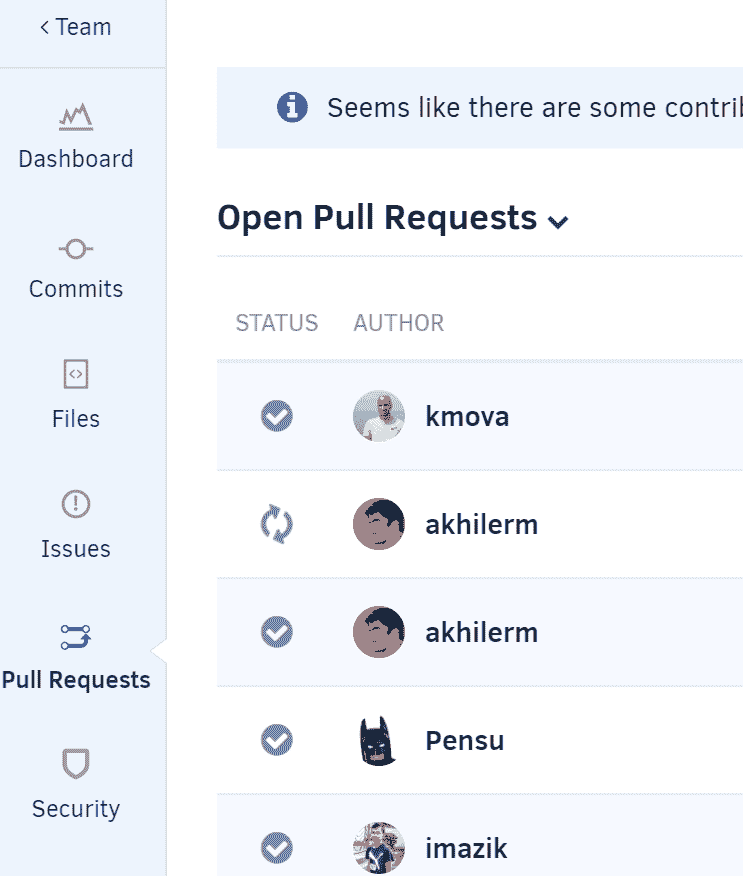

7.  重复*步骤 3* 至*步骤 5* 在代码合并前检查问题并推荐解决方案以清除它们。这将提高代码质量。

# 按类别查看问题

不是所有的问题都是一样的，需要同样多的工作来解决。大多数情况下，安全问题应该是首要考虑的问题，代码风格应该是一项持续的工程工作，以便通过改进内部审查过程来解决这些问题。

让我们执行以下步骤来查看问题细分:

1.  登录[https://app.codacy.com](https://app.codacy.com)，将带您进入您的组织仪表板。
2.  单击左侧菜单上的项目。
3.  选择要分析的项目。

4.  向下滚动控制面板，直到看到问题细分图:

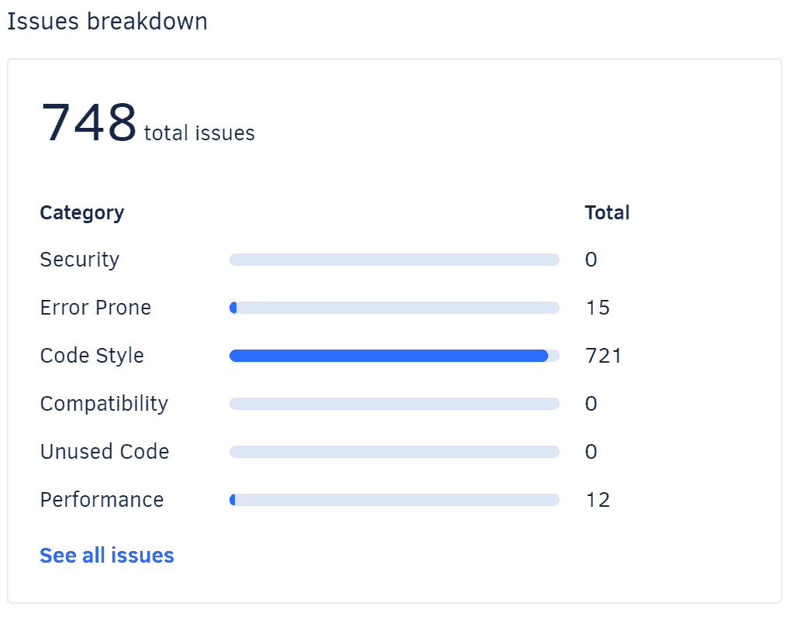

5.  单击有问题的类别，并在代码审查中使用提供的问题信息:

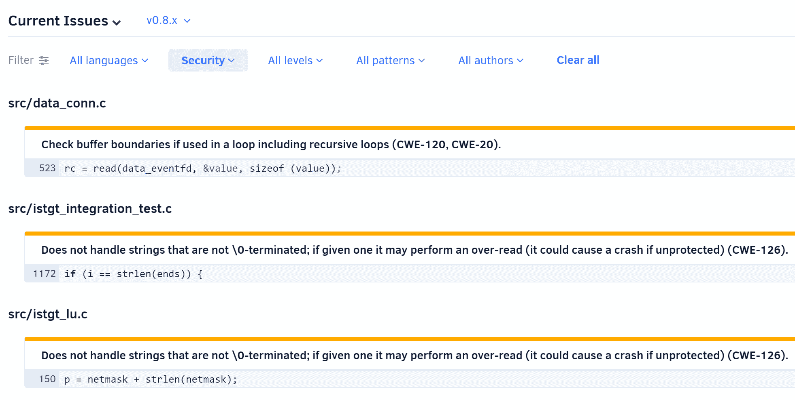

6.  如果您正在对自己的代码进行同行评审或检查，您可以通过单击“所有作者”过滤器并将其更改为名称来过滤来自作者的问题。

# 将 Codacy 徽章添加到您的存储库中

徽章用于向访问您的存储库或网站的用户表示高级项目状态及其稳定性。因为 Codacy 可以显示代码的质量，所以它肯定是您希望在`README.MD`文件的存储库中显示的东西。

让我们执行以下步骤，将 Codacy 徽章添加到您的 GitHub 存储库中:

1.  登录[https://app.codacy.com](https://app.codacy.com)，将带您进入您的组织仪表板。
2.  单击左侧菜单上的项目。
3.  选择要分析的项目。
4.  单击项目名称旁边的徽章图标:


5.  点击向存储库添加徽章，创建一个**拉取请求** ( **公关**)到您的存储库:

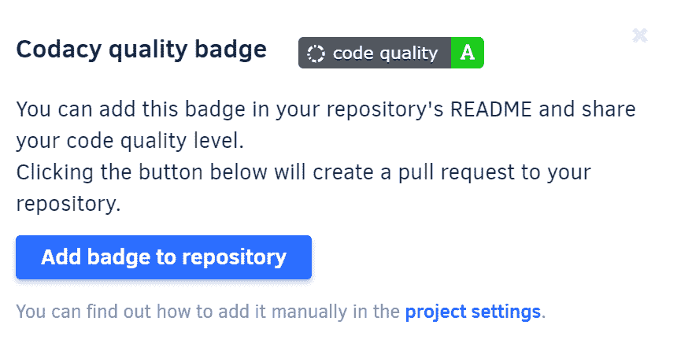

6.  查看 PR 的内容并将其合并。合并后，您将在存储库概述页面上看到代码质量得分，类似于下面的截图所示:

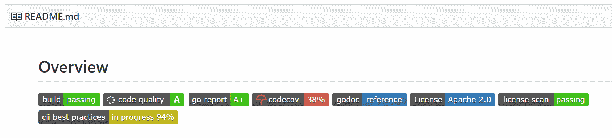

徽章用于向存储库访问者突出显示重要的测试和信息。

# 请参见

*   Codacy 文件:[https://support.codacy.com/hc/en-us](https://support.codacy.com/hc/en-us)

# 使用 SonarQube 检测错误和反模式

SonarQube 是一种流行的开发工具，用于软件开发，以捕捉应用中的 bug 和漏洞。在本节中，我们将学习如何自动化静态代码分析，以检测您可以在 CI/CD 管道中使用的错误和反模式。

# 准备好

将`k8sdevopscookbook/src`存储库克隆到您的工作站，以便使用`chapter4`目录下的清单文件:

```
$ git clone https://github.com/k8sdevopscookbook/src.git
$ cd src/chapter4
```

确保您已准备好 Kubernetes 集群并配置了`kubectl`和`helm`，以便您可以管理集群资源。

# 怎么做…

本节进一步分为以下几个小节，以简化这一过程:

*   使用 Helm 安装声纳管
*   访问 SonarQube 仪表板
*   创建新用户和令牌
*   启用质量配置文件
*   添加项目
*   分析项目
*   按类别查看问题
*   将 SonarQube 徽章添加到您的存储库中
*   添加市场插件
*   正在从集群中删除 SonarQube

# 使用 Helm 安装声纳管

SonarQube 是一个领先的开源解决方案，用于代码质量和安全性分析，以便在您的 CI/CD 中采用代码质量。它可以作为独立的解决方案从二进制文件安装。在本食谱中，我们将使用 Helm 图表将其安装在 Kubernetes 集群上。

让我们执行以下步骤来启动和运行 SonarQube:

1.  更新您的存储库:

```
$ helm repo update
```

2.  安装声纳管:

```
$ helm install stable/sonarqube --name sonar --namespace sonarqube
```

3.  验证 PostgreSQL 和 SonarQube 吊舱是否准备就绪:

```
$ kubectl get pods -n sonarqube
NAME                              READY STATUS  RESTARTS AGE
sonar-postgresql-68b88ddc77-l46wc 1/1   Running 0        16m
sonar-sonarqube-995b9cc79-9vzjn   1/1   Running 1        16m
```

至此，您已经了解了如何在 Kubernetes 集群上部署 SonarQube。

# 访问 SonarQube 仪表板

当使用 Helm 图表安装时，SonarQube 会创建一个负载平衡器，并公开一个外部 IP 进行连接。我们将首先发现该 IP，并使用服务 IP 连接到 SonarQube 仪表板。

让我们执行以下步骤，通过云负载平衡器公开 SonarQube:

1.  获取 SonarQube 负载平衡器的外部 IP:

```
$ export SONAR_SVC=$(kubectl get svc --namespace sonarqube sonar-sonarqube -o jsonpath='{.status.loadBalancer.ingress[0].hostname}')
$ echo http://$SONAR_SVC:9000
```

2.  在浏览器中打开地址:

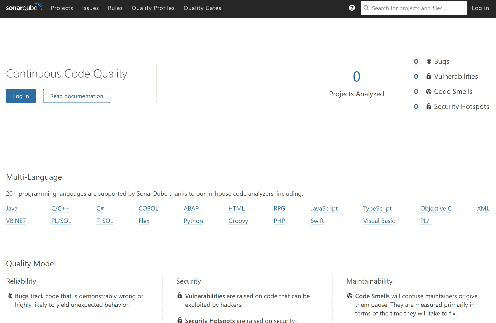

3.  点击登录并使用`admin`作为您的用户名和密码登录仪表板:

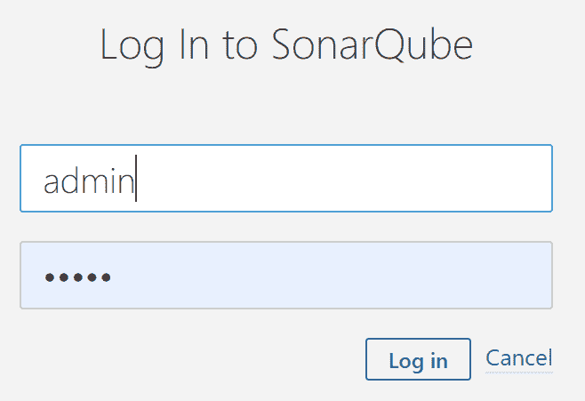

4.  单击屏幕右上角的帐户配置文件徽标，然后选择我的帐户:

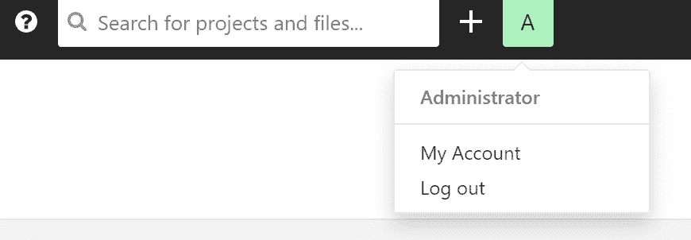

5.  选择安全性选项卡:

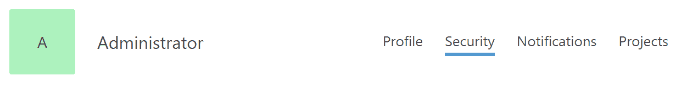

6.  通过单击更改密码按钮更改默认管理员密码并保存:

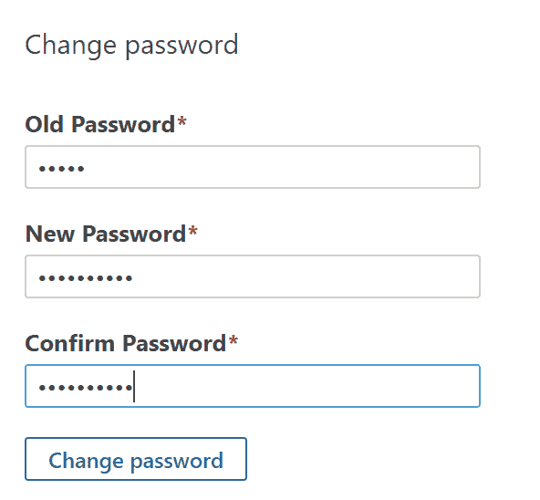

由于服务端口可以从外部访问，因此更改 SonarQube 的默认凭据非常重要。

# 创建新用户和令牌

团队成员需要拥有自己的用户帐户才能访问仪表板。建议您生成令牌来管理帐户。您可以使用它们来运行分析或调用 web 服务，而无需访问用户的实际凭据。这样，您对用户密码的分析就不会通过网络。

让我们执行以下步骤来创建可以访问 SonarQube 的新用户:

1.  从顶部菜单中，单击管理。
2.  单击安全选项卡，然后选择用户:

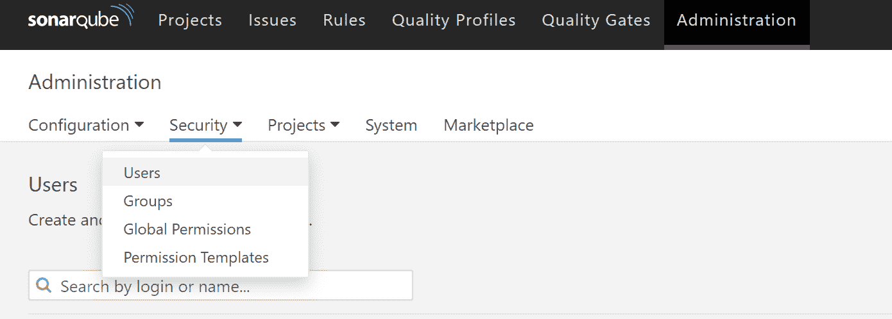

3.  单击创建用户按钮:

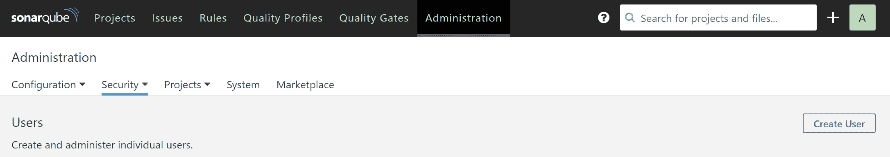

4.  输入用户名、电子邮件和密码，然后单击创建:

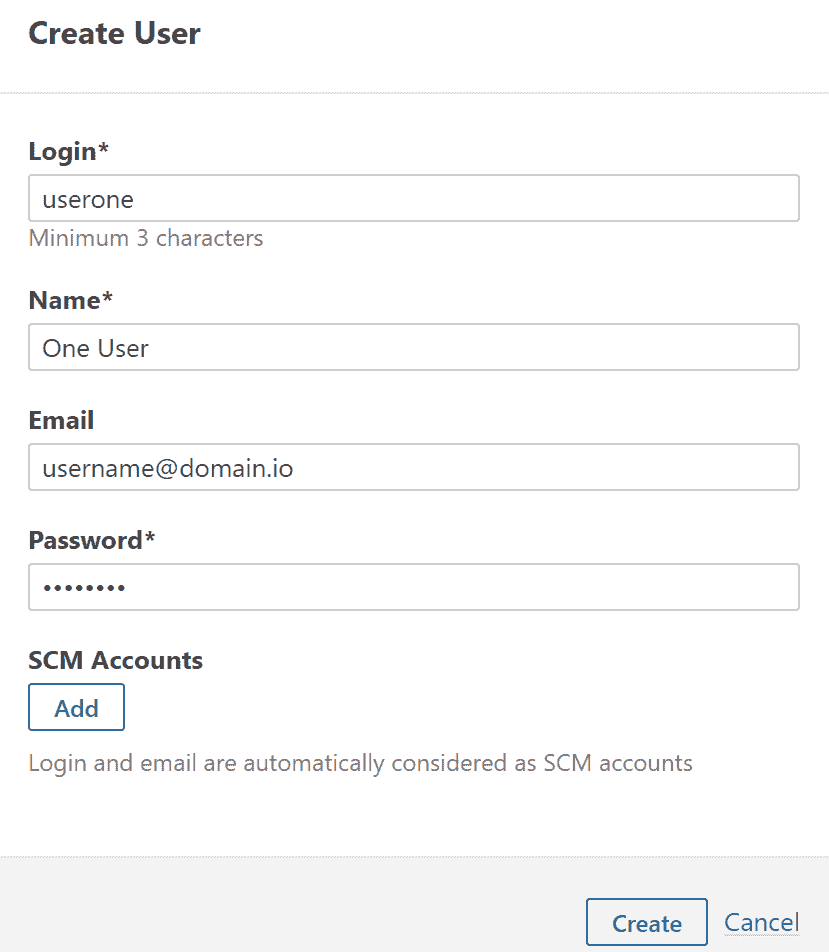

5.  在用户表中，单击令牌列下的更新令牌按钮:

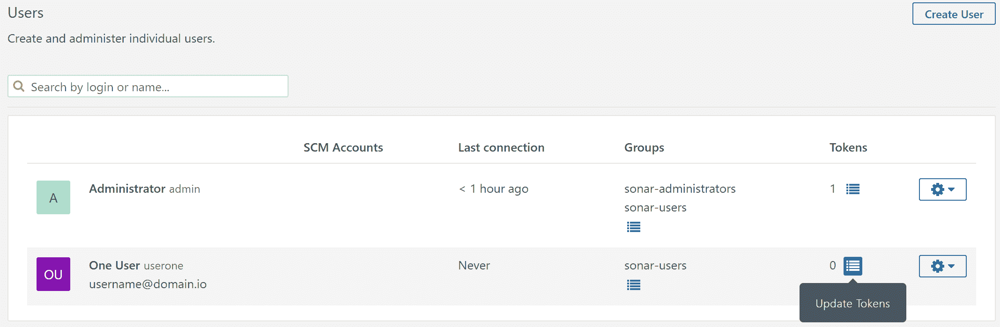

6.  设置令牌名称，然后单击生成按钮。
7.  确保您复制了令牌，并为即将到来的食谱做好记录。

# 启用质量配置文件

为了能够分析一个项目，首先，你需要安装特定的编程语言插件。让我们执行以下步骤来安装我们将在下一个食谱中使用的 Java 插件，*添加项目:*

1.  点击质量简介。如果您看到消息说没有可用的语言，那么您需要安装语言插件:

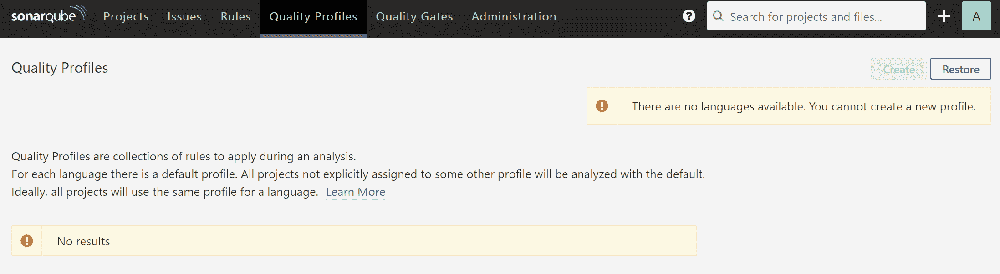

2.  单击管理菜单并切换到市场选项卡:


3.  在市场搜索字段中，搜索您想要启用的语言。对于这个食谱，这是`java`:

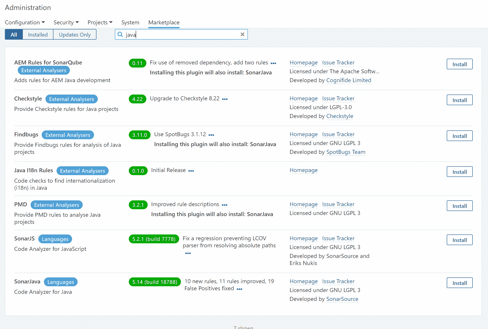

4.  通过单击相应插件旁边的安装按钮，为 SonarQube、Checkstyle、Findbugs、Java i18n 规则、**编程错误检测器** ( **PMD** )和 SonarJava 插件添加 **Adobe 体验管理器** ( **AEM** )规则:

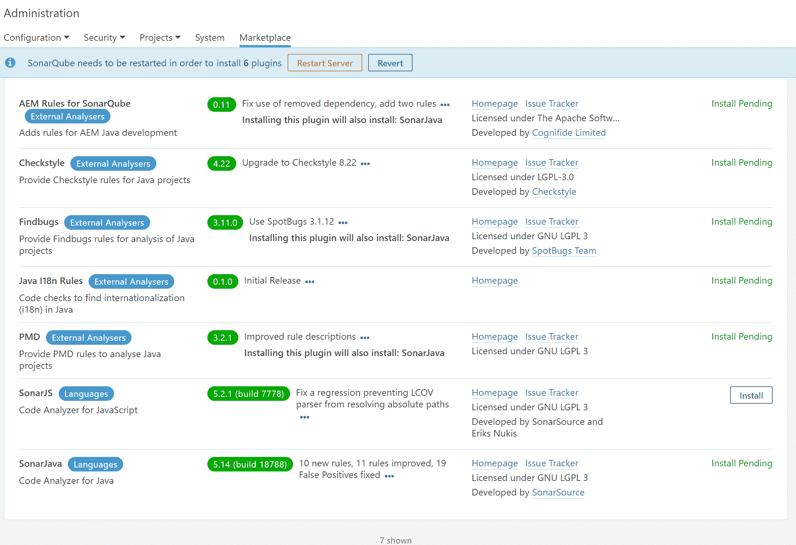

5.  此操作需要重新启动。单击重新启动服务器，并在重新启动后登录仪表板:

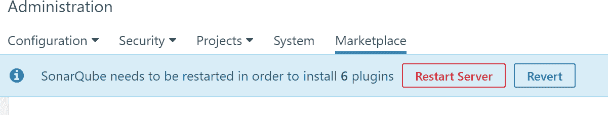

6.  一旦您重新登录到仪表板，点击质量配置文件。这一次，您应该会看到 Java 概要文件:


对于您想要安装的任何其他语言，重复*步骤 1* 至 *5* 。

# 添加项目

项目在第一次分析时会自动在 SonarQube 中创建。在扫描项目之前，我们需要选择一种分析方法。在这个食谱中，我们将启动一个梯度分析。其他可用方法在*部分列出，另请参见*部分。

让我们执行以下步骤，向 SonarQube 添加一个新项目:

1.  克隆要扫描的示例存储库:

```
$ git clone https://github.com/javajon/code-analysis.git
$ cd code-analysis/microservice/
```

2.  对于这个例子，我们还需要在我们的节点上安装 Java 1.8。如果已经有了，跳到*步骤 4* :

```
$ sudo apt install openjdk-8-jre-headless default-jdk
```

3.  确认您使用的 Java 版本:

```
$ java -version openjdk version "1.8.0_222"
OpenJDK Runtime Environment (build 1.8.0_222-8u222-b10-1~deb9u1-b10)
OpenJDK 64-Bit Server VM (build 25.222-b10, mixed mode)
```

4.  获取 SonarQube 服务的外部 IP:

```
$ export SONAR_SVC=$(kubectl get svc --namespace sonarqube sonar-sonarqube -o jsonpath='{.status.loadBalancer.ingress[0].hostname}')
```

5.  运行分析。分析将在几分钟内完成:

```
$ ./gradlew -Dsonar.host.url=http://$SONAR_SVC:9000 sonarqube
....
BUILD SUCCESSFUL in 13s
6 actionable tasks: 1 executed, 5 up-to-date
```

6.  切换回 SonarQube 门户查看新项目:

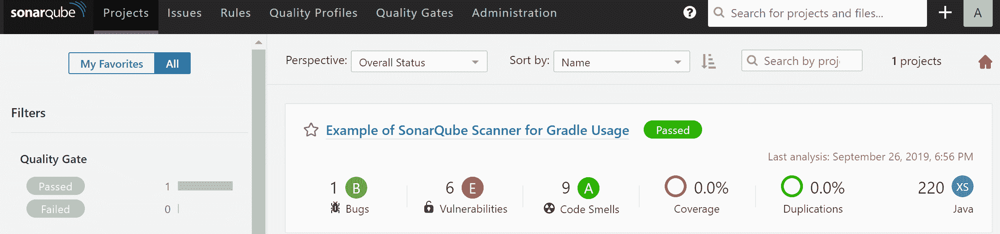

现在，您将能够在 SonarQube 门户上看到您的新项目。

# 审查项目质量

SonarQube 的分析各不相同，这取决于扫描的语言，但在大多数情况下，它会生成高质量的度量标准，发布报告，并找到编码规则被破坏的地方。在本食谱中，您将了解到在哪里可以找到问题的类型，并按严重程度查看问题。

确保您按照*添加项目*配方将示例项目添加到了 SonarQube。现在，执行以下步骤:

1.  单击问题菜单:


2.  已知漏洞被视为拦截器，需要立即解决。在过滤器下，展开严重性并选择阻止程序:

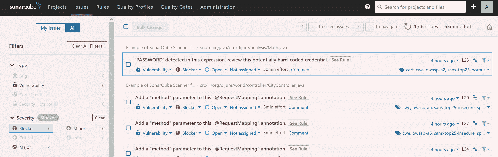

3.  在示例代码中检测到硬编码凭据，这是一个严重的漏洞。要将此问题分配给团队成员，请单击“未分配”下拉列表，并输入人员姓名以将其分配给他们:


4.  最终，所有的问题都需要被确认和分配，或者被解决为固定的、假阳性的，或者不会被解决。可以通过单击打开下拉列表并将其更改为新的状态值来设置状态。

# 添加市场插件

让我们执行以下步骤，从市场向 SonarQube 添加新插件:

1.  单击管理菜单并切换到市场选项卡:

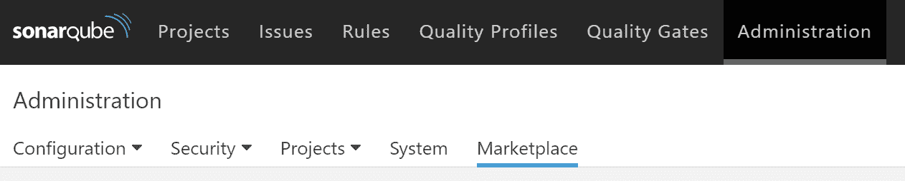

2.  在市场上，除了代码分析器，您还可以找到其他身份验证方法、语言包和其他有用的集成。例如，让我们搜索 GitHub 身份验证:

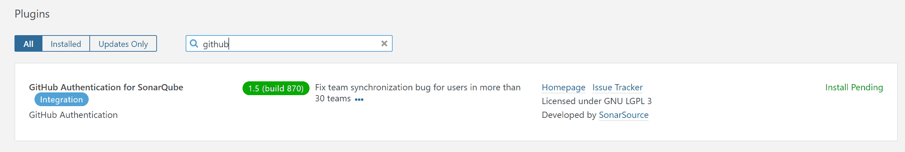

3.  点击插件旁边的安装按钮。
4.  现在，单击重新启动服务器，并在重新启动后登录仪表板。
5.  使用 SonarQube，转到管理|配置|常规设置| GitHub。
6.  将启用设置为真:

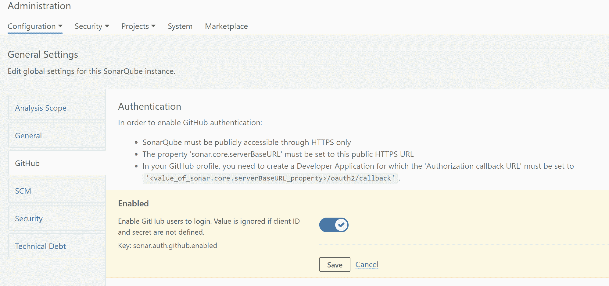

7.  将`client ID`和`client secret`设置为 GitHub 开发人员应用提供的值。前往[https://github.com/settings/applications/new](https://github.com/settings/applications/new)向 GitHub 注册新的 OAuth 应用。
8.  保存设置并从 SonarQube 注销:

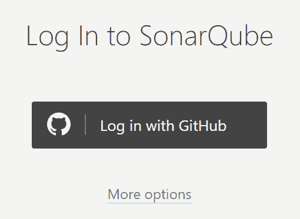

新的，用户将被要求登录一个 GitHub 用户。

# 正在从集群中删除 SonarQube

让我们执行以下步骤，从 Kubernetes 集群中删除 SonarQube:

1.  列出 SonarQube Helm 版本:

```
$ helm ls |grep sonarqube
sonar 1 Thu Sep 26 22:01:24 2019 DEPLOYED sonarqube-2.3.0 7.9 sonarqube
```

2.  使用版本名称删除 Helm 版本:

```
$ helm delete sonar --purge
```

Helm 将从您的集群中删除 SonarQube 版本及其组件。

# 它是如何工作的...

这个食谱向您展示了如何快速检测项目中的安全漏洞和错误。

在*添加项目*配方中，在*的* *tep 5* 中，当我们开始分析我们的例子时，提供给分析的文件在服务器端被分析，并且分析的结果作为报告被发送回服务器。该报告在服务器端以异步方式进行分析。

报告被添加到队列中，并由服务器按顺序处理。如果将多个报告发送回服务器，结果可能需要一些时间才能显示在 SonarQube 仪表板上。

默认情况下，只有安装的代码分析器可以检测到的文件才会加载到项目中。这意味着，如果您只有在 Kubernetes 世界中非常常见的用 C 或 Go 和 YAML 文件编写的 SonarJava 代码，它们将被忽略。

# 请参见

*   索纳库文件:[https://docs.sonarqube.org/latest/setup/overview/](https://docs.sonarqube.org/latest/setup/overview/)
*   对 Gradle 使用 SonarScanner 的静态代码分析示例:[https://github.com/javajon/code-analysis](https://github.com/javajon/code-analysis)
*   詹金斯的 SonarScanner:[https://docs . sonarkube . org/latest/analysis/scan/SonarScanner-for-Jenkins/](https://docs.sonarqube.org/latest/analysis/scan/sonarscanner-for-jenkins/)
*   Azure DevOps 的 SonarQube 扩展:[https://docs . sonarkube . org/latest/analysis/scan/sonarscanner-for-Azure-devo PS/](https://docs.sonarqube.org/latest/analysis/scan/sonarscanner-for-azure-devops/)
*   MSBuild 的 SonarQube 扫描仪:[https://docs . SonarQube . org/display/SCAN/analysis+with+SonarQube+Scanner+for+MSBuild](https://docs.sonarqube.org/display/SCAN/Analyzing+with+SonarQube+Scanner+for+MSBuild)
*   Maven 的 SonarQube 扫描仪:[https://docs . SonarQube . org/display/SCAN/analysis+with+SonarQube+Scanner+for+Maven](https://docs.sonarqube.org/display/SCAN/Analyzing+with+SonarQube+Scanner+for+Maven)
*   蚂蚁的 SonarQube 扫描仪:[https://docs . SonarQube . org/display/SCAN/analysis+with+SonarQube+Scanner+for+蚂蚁](https://docs.sonarqube.org/display/SCAN/Analyzing+with+SonarQube+Scanner+for+Ant)
*   SonarQube Scanner 从 CLI 启动分析:[https://docs . SonarQube . org/display/SCAN/analysis+with+SonarQube+Scanner](https://docs.sonarqube.org/display/SCAN/Analyzing+with+SonarQube+Scanner)
*   插件库:[https://docs.sonarqube.org/display/PLUG/Plugin+Library](https://docs.sonarqube.org/display/PLUG/Plugin+Library)
*   索纳库贝社区:[https://community.sonarsource.com/](https://community.sonarsource.com/)

# 使用 FOSSA 检测许可证合规性问题

FOSSA 是一个开源软件许可合规工具，它允许现代团队成功地进行开源软件开发。在本节中，我们将使用 FOSSA 框架扫描软件许可证。您将学习如何自动执行许可证合规性和漏洞检查。

# 准备好

这里提到的所有操作都需要一个 FOSSA 账户。如果没有，去[https://app.fossa.com/account/register](https://app.fossa.com/account/register)创建一个。

# 怎么做…

本节进一步分为以下几个小节，以简化这一过程:

*   向 FOSSA 添加项目
*   对许可问题进行分类
*   向您的项目添加一个 FOSSA 徽章

# 向 FOSSA 添加项目

让我们执行以下步骤将项目添加到 FOSSA:

1.  登录[https://app.fossa.com/projects](https://app.fossa.com/projects)的 FOSSA。
2.  单击添加项目按钮:

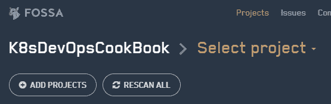

3.  选择快速导入，然后继续:

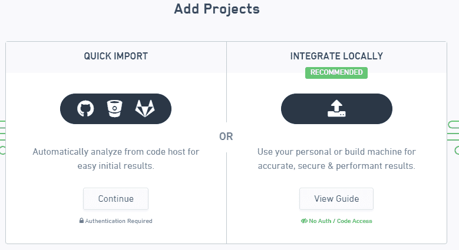

4.  选择您的存储库位置。在这个配方中，我们将使用 Gitlab:

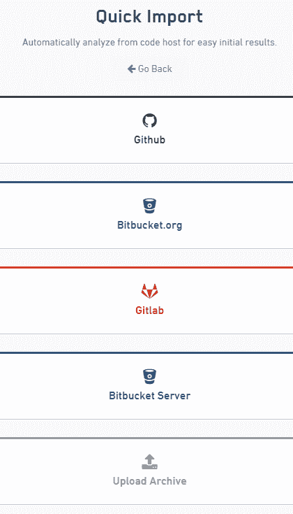

5.  单击“与服务连接”按钮。

6.  选择要扫描的存储库，然后单击“IMPORT”按钮:

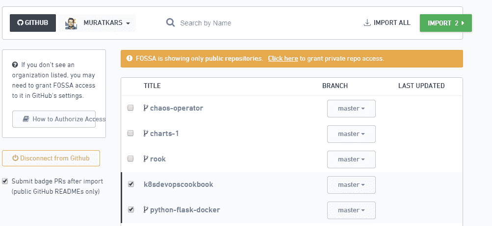

FOSSA 将导入并自动扫描许可证合规性问题。

# 对许可问题进行分类

FOSSA 不需要任何额外的步骤或代码来扫描您的项目。一旦您将存储库添加到您的 FOSSA 帐户，它就会运行许可证扫描。让我们来看看:

1.  登录[https://app.fossa.com/projects](https://app.fossa.com/projects)。
2.  选择项目。
3.  “摘要”选项卡将显示任何已检测到的标记依赖项:

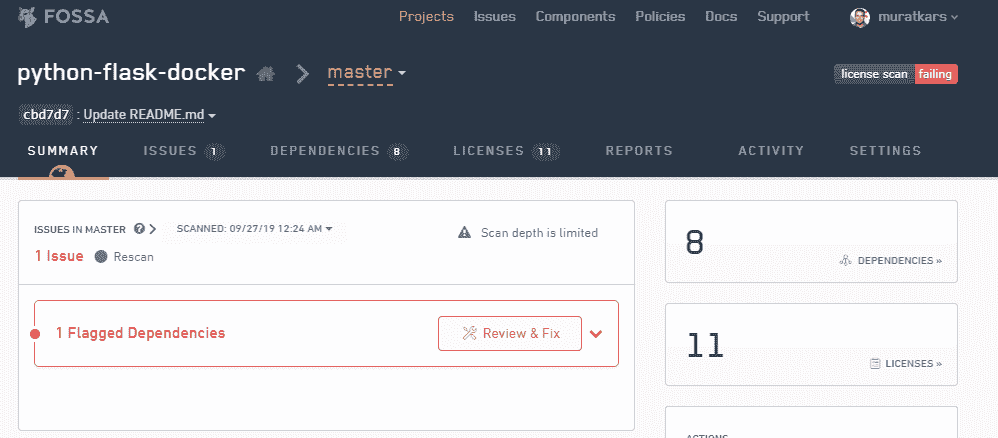

4.  单击问题选项卡:

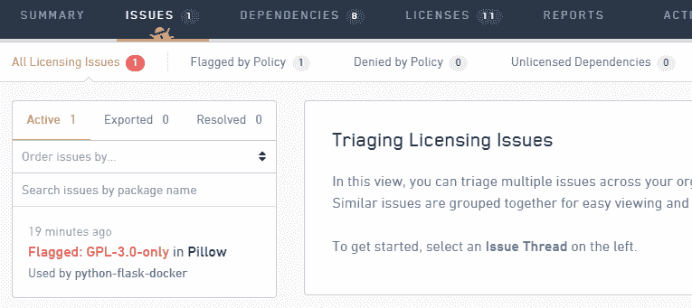

5.  从左侧菜单中选择一个问题线程。

6.  查看问题和建议的解决方案:


根据需要对问题采取的措施，您可以决定创建一个票证，留下评论供团队成员讨论，或者通过解释来解决问题。

# 向您的项目添加一个 FOSSA 徽章

让我们执行以下步骤，向我们的 GitHub 存储库页面添加一个 FOSSA 许可证检查徽章:

1.  登录[https://app.fossa.com/projects](https://app.fossa.com/projects)的 FOSSA。
2.  选择项目以生成徽章。
3.  切换到 SETTINGS 选项卡。
4.  选择屏蔽


5.  将 MARKDOWN 内容复制到剪贴板。
6.  在你扫描的 GitHub 存储库中编辑`README.md`文件。将您在*步骤 5* 中复制的 MARKDOWN 徽章代码粘贴到文件的开头:

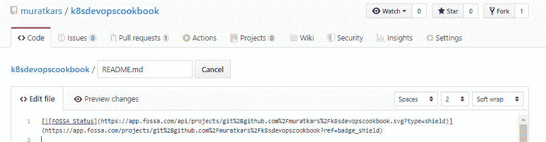

7.  保存文件后，FOSSA 扫描的结果将显示在存储库的徽章中。